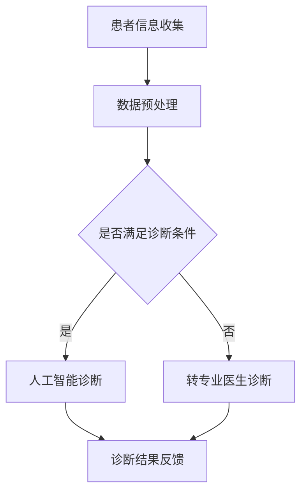

                 

## 文章标题：人工智能在智慧医疗远程诊断中的应用与挑战

### 关键词：智慧医疗、远程诊断、人工智能、医疗数据、算法

> 摘要：本文探讨了人工智能在智慧医疗远程诊断中的应用及其面临的挑战。通过分析智慧医疗的概念、远程诊断的作用以及人工智能技术的基本概念和应用，本文进一步讨论了人工智能在远程诊断中的挑战与前景，并使用Mermaid流程图和伪代码详细解释了核心算法原理和数学模型。

### 第一部分：人工智能在智慧医疗远程诊断中的应用概述

#### 第1章：智慧医疗与远程诊断

##### 1.1 智慧医疗的概念与发展

智慧医疗是一种利用信息技术、人工智能、物联网等技术手段，实现医疗服务智能化、个性化和精细化的新型医疗模式。智慧医疗的目标是通过技术的力量，提高医疗服务的效率和质量，降低医疗成本，改善患者体验。

- **智慧医疗的定义**
  智慧医疗是一种结合信息技术和医疗服务的新型模式，通过大数据、人工智能、物联网等先进技术，实现医疗服务的智能化、个性化和精细化。

- **远程诊断在智慧医疗中的作用**
  远程诊断作为智慧医疗的重要组成部分，通过远程医疗平台、医疗设备互联和数据智能分析，实现了患者病情的实时监测、诊断和指导治疗。远程诊断不仅提高了医疗服务的可及性，还减轻了患者的负担，有助于实现医疗资源的优化配置。

##### 1.2 人工智能在远程诊断中的应用

人工智能（AI）是计算机科学的一个分支，通过模拟、延伸和扩展人类的智能，实现自动化推理、学习和处理信息。人工智能在远程诊断中的应用，极大地提高了诊断的准确性和效率。

- **人工智能技术的基本概念**
  人工智能（AI）是一种模拟、延伸和扩展人类智能的技术，包括机器学习、深度学习、自然语言处理、计算机视觉等。在远程诊断中，人工智能主要用于医学图像分析、电子病历智能管理、智能诊断系统和健康风险评估等方面。

- **人工智能在远程诊断中的具体应用**
  人工智能在远程诊断中的具体应用主要包括：

  1. **医学图像分析**：通过深度学习算法，对医学图像进行分析，实现病变区域的识别、定量分析和辅助诊断。
  2. **电子病历智能管理**：利用自然语言处理技术，对电子病历进行智能分析，实现病历的自动归档、检索和知识库构建。
  3. **智能诊断系统**：通过机器学习算法，对海量医疗数据进行训练，构建智能诊断系统，实现辅助诊断和智能推荐。
  4. **健康风险评估**：利用大数据和机器学习技术，对患者的健康数据进行实时监控和分析，实现健康风险评估和预警。

##### 1.3 人工智能在远程诊断中的挑战与前景

尽管人工智能在远程诊断中具有巨大的应用潜力，但也面临着一系列挑战。

- **挑战**
  1. **数据隐私与安全**：远程诊断需要大量患者的健康数据，如何保障数据的隐私和安全是一个重要挑战。
  2. **技术成熟度**：目前，人工智能在医学领域的应用仍处于初级阶段，需要更多的研究和实践来提高技术成熟度。
  3. **跨学科协作**：远程诊断涉及医学、工程、数据科学等多个领域，如何实现跨学科的协同创新，是一个重要的挑战。

- **前景**
  1. **提高医疗效率**：人工智能可以帮助医生更快地诊断病情，提高医疗效率，降低误诊率。
  2. **个性化医疗**：通过分析海量数据，人工智能可以为患者提供更加个性化的治疗方案。
  3. **降低医疗成本**：远程诊断可以减少患者去医院就诊的次数，降低医疗成本。

#### 1.3 人工智能在智慧医疗远程诊断中的应用流程

下面是人工智能在智慧医疗远程诊断中的应用流程的Mermaid流程图：



### 主要概念与联系

- **智慧医疗**：结合信息技术和医疗服务，实现智能化、个性化和精细化的医疗模式。
- **远程诊断**：通过远程医疗平台和人工智能技术，对患者病情进行实时监测、诊断和治疗。
- **人工智能**：模拟和扩展人类智能，用于数据分析、智能诊断和个性化医疗。

### 核心算法原理讲解

#### 1. 数据预处理

数据预处理是人工智能在远程诊断中至关重要的一步，其主要目的是将原始数据进行清洗、归一化和特征提取，以便于人工智能模型的训练和诊断。

- **目的**：将原始数据进行清洗、归一化和特征提取，以提高数据质量，减少噪声，增强模型的泛化能力。
- **伪代码**：

```python
def data_preprocessing(data):
    # 数据清洗
    clean_data = clean(data)
    # 数据归一化
    normalized_data = normalize(clean_data)
    # 特征提取
    features = extract_features(normalized_data)
    return features
```

#### 2. 人工智能诊断模型

在远程诊断中，人工智能诊断模型是核心组成部分。常见的模型包括支持向量机（SVM）、决策树、神经网络等。以下以支持向量机为例，介绍其原理和实现。

- **支持向量机（SVM）的基本原理**：
  支持向量机是一种二分类模型，其目标是找到最佳分类边界，使得分类边界尽可能远离数据点，从而提高模型的泛化能力。

- **SVM的数学模型**：

$$\mathbf{w} \cdot \mathbf{x} + b = 0$$

其中，$\mathbf{w}$ 是权重向量，$\mathbf{x}$ 是特征向量，$b$ 是偏置项。

- **SVM的优化目标**：

$$\min_{\mathbf{w}, b} \frac{1}{2} ||\mathbf{w}||^2$$

满足约束条件：

$$y_i (\mathbf{w} \cdot \mathbf{x_i} + b) \geq 1$$

其中，$y_i$ 是样本标签。

- **伪代码**：

```python
def train_svm(features, labels):
    # 选择优化算法
    optimizer = choose_optimizer()
    # 训练模型
    optimizer.minimize(loss, [weights, bias], features, labels)
    return weights, bias

def predict(svm_model, new_data):
    # 预测新数据
    prediction = svm_model.predict(new_data)
    return prediction
```

#### 3. 数学模型和数学公式

在远程诊断中，数学模型和公式是理解和实现算法的基础。以下介绍两个关键数学模型和公式。

##### 1. 数据归一化

数据归一化的目的是将不同量级的特征数据转换到同一量级，以便模型训练。其公式如下：

$$x_{\text{normalized}} = \frac{x_{\text{original}} - \mu}{\sigma}$$

其中，$x_{\text{original}}$ 是原始数据，$\mu$ 是均值，$\sigma$ 是标准差。

##### 2. 支持向量机（SVM）决策边界

支持向量机的决策边界由以下公式表示：

$$\mathbf{w} \cdot \mathbf{x} + b = 0$$

其中，$\mathbf{w}$ 是权重向量，$\mathbf{x}$ 是特征向量，$b$ 是偏置项。

### 总结

本文从智慧医疗的概念与发展、远程诊断的作用以及人工智能在远程诊断中的应用和挑战等方面，全面探讨了人工智能在智慧医疗远程诊断中的应用与挑战。通过Mermaid流程图和伪代码，详细解释了核心算法原理和数学模型，为读者提供了深刻的理解和应用指导。随着人工智能技术的不断进步，智慧医疗远程诊断必将迎来更加广阔的发展前景。作者：AI天才研究院/AI Genius Institute & 禅与计算机程序设计艺术 /Zen And The Art of Computer Programming

