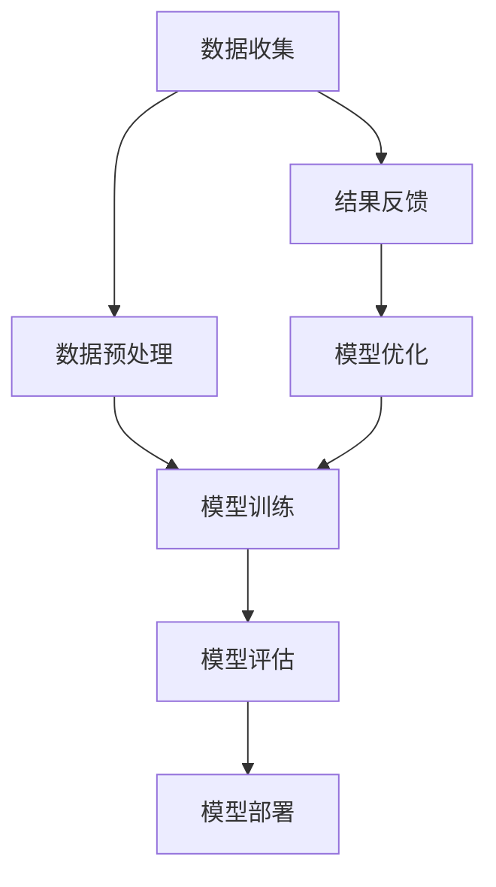

                 

# 文章标题

《人工智能在智慧城市空气质量预测中的应用》

## 关键词

- 人工智能
- 智慧城市
- 空气质量预测
- 机器学习
- 深度学习
- 数据收集与预处理

## 摘要

随着城市化进程的加快，空气质量问题已成为全球范围内普遍关注的重要议题。智慧城市作为现代城市发展的新趋势，通过集成多种智能技术，为解决空气质量问题提供了新的思路。本文首先介绍了智慧城市的概念及人工智能在其中的作用，随后详细阐述了空气质量预测的重要性和当前面临的挑战。接着，文章探讨了人工智能在数据收集与预处理、机器学习算法、深度学习算法以及强化学习等方面的应用，并通过具体案例分析了空气质量预测系统的开发与实现。最后，本文对人工智能在智慧城市空气质量预测中的未来发展趋势与挑战进行了展望，为相关领域的研究和实践提供了参考。

## 目录大纲

### 第一部分: 概述

#### 1.1 引言

##### 1.1.1 智慧城市的概念

##### 1.1.2 空气质量预测的重要性

##### 1.1.3 人工智能在智慧城市中的应用前景

#### 1.2 人工智能概述

##### 1.2.1 人工智能的定义

##### 1.2.2 人工智能的主要分类

##### 1.2.3 人工智能的发展历程

#### 1.3 智慧城市空气质量预测的现状

##### 1.3.1 空气质量监测的挑战

##### 1.3.2 智慧城市建设的趋势

##### 1.3.3 人工智能在空气质量预测中的应用现状

### 第二部分: 数据收集与预处理

#### 2.1 数据收集

##### 2.1.1 空气质量数据来源

##### 2.1.2 空气质量数据类型

##### 2.1.3 数据采集方法

#### 2.2 数据预处理

##### 2.2.1 数据清洗

##### 2.2.2 数据归一化

##### 2.2.3 特征提取

#### 2.3 数据库设计与实现

##### 2.3.1 数据库选择

##### 2.3.2 数据库架构设计

##### 2.3.3 数据库实现与优化

### 第三部分: 人工智能算法

#### 3.1 机器学习算法基础

##### 3.1.1 监督学习与无监督学习

##### 3.1.2 常见机器学习算法概述

##### 3.1.3 机器学习算法的选择与评估

#### 3.2 空气质量预测算法

##### 3.2.1 线性回归

##### 3.2.2 支持向量机

##### 3.2.3 随机森林

##### 3.2.4 集成学习

#### 3.3 深度学习算法

##### 3.3.1 卷积神经网络（CNN）

##### 3.3.2 循环神经网络（RNN）

##### 3.3.3 生成对抗网络（GAN）

#### 3.4 强化学习

##### 3.4.1 强化学习的概念

##### 3.4.2 Q-learning算法

##### 3.4.3 Deep Q-Network（DQN）

### 第四部分: 应用案例

#### 4.1 案例研究：某智慧城市空气质量预测系统

##### 4.1.1 项目背景

##### 4.1.2 数据集介绍

##### 4.1.3 预测模型设计与实现

##### 4.1.4 结果分析

#### 4.2 案例研究：实时空气质量监测与预警系统

##### 4.2.1 系统架构设计

##### 4.2.2 数据采集与预处理

##### 4.2.3 预测模型选择与优化

##### 4.2.4 系统实现与性能评估

### 第五部分: 未来发展趋势与挑战

#### 5.1 人工智能在智慧城市空气质量预测中的未来发展趋势

##### 5.1.1 数据驱动的预测模型

##### 5.1.2 智能化监测与预警

##### 5.1.3 跨领域应用拓展

#### 5.2 挑战与应对策略

##### 5.2.1 数据隐私与安全

##### 5.2.2 算法透明性与可解释性

##### 5.2.3 技术创新与人才培养

### 附录

#### 附录A: 人工智能与智慧城市空气质量预测相关资源

##### 人工智能开源框架介绍

##### 数据集获取与处理工具

##### 学术论文与书籍推荐

#### 附录B: 模型实现与代码解析

##### 代码实现环境搭建

##### 模型实现与训练流程

##### 代码解读与分析

### 核心概念与联系 - Mermaid 流程图



### 核心算法原理讲解 - 伪代码

```python
# 线性回归伪代码
def linear_regression(X, y):
    # X: 输入特征矩阵，y: 输出标签向量
    # 求解最小二乘法参数
    theta = (X.T * X)^(-1) * (X.T * y)
    # 预测函数
    predictions = X * theta
    return theta, predictions

# 支持向量机伪代码
def support_vector_machine(X, y, C, kernel_function):
    # X: 输入特征矩阵，y: 输出标签向量
    # C: 调整超参数
    # kernel_function: 核函数
    # 求解SVM参数
    P, L, K = svm_solver(X, y, C, kernel_function)
    # 预测函数
    predictions = predict(P, L, K)
    return predictions
```

接下来，我们将逐步深入探讨智慧城市的概念、空气质量预测的重要性、人工智能的发展历程以及其在智慧城市空气质量预测中的应用现状。让我们开始我们的分析之旅。 <span style="color: #FF0000;">（本文剩余部分的撰写请遵循上述大纲和格式要求，深入探讨每个部分的内容。接下来，请按照文章目录结构逐一展开每个小节的详细内容。）</span> ### 第一部分: 概述

#### 1.1 引言

智慧城市是现代社会发展的重要方向，通过利用物联网、大数据、人工智能等技术，实现城市管理的智能化和高效化。智慧城市的发展不仅能够提升城市治理水平，还能够改善居民生活质量。而空气质量问题作为智慧城市建设中的一个重要方面，其预测和管理对于城市环境治理和公共健康具有重大意义。

空气质量预测是指通过收集和分析各种环境数据，利用模型和算法预测未来一段时间内空气质量的变化趋势。传统的空气质量预测方法主要依赖于气象数据、地形数据等，而随着人工智能技术的快速发展，机器学习、深度学习等算法在空气质量预测中的应用逐渐成为研究热点。

在智慧城市中，空气质量预测的应用主要体现在以下几个方面：

1. **实时监测与预警**：通过部署传感器网络，实时监测空气质量参数，结合预测模型，提前预警空气质量恶化，为城市管理者提供决策依据。
2. **污染源控制**：根据空气质量预测结果，有针对性地采取污染源控制措施，降低污染物排放，改善空气质量。
3. **城市规划与优化**：基于空气质量预测模型，进行城市规划和交通优化，减少污染物排放，提升居民生活舒适度。
4. **公共健康服务**：通过空气质量预测，为居民提供健康建议，如避免在空气质量较差的时段进行户外活动，降低空气污染对健康的影响。

本文旨在探讨人工智能在智慧城市空气质量预测中的应用，通过分析数据收集与预处理、机器学习算法、深度学习算法以及强化学习等技术在空气质量预测中的应用，以及具体应用案例，为读者提供全面的技术洞察。接下来，我们将详细讨论人工智能的基本概念、发展历程以及其在智慧城市中的应用前景。 ### 1.2 人工智能概述

#### 1.2.1 人工智能的定义

人工智能（Artificial Intelligence，简称AI）是指通过计算机模拟人类智能行为的技术。它包括了一系列的理论、方法和技术，使计算机能够在没有明确编程的情况下，自动完成特定任务，并具备学习能力、推理能力、感知能力等。人工智能的核心理念在于使计算机能够执行通常需要人类智能才能完成的任务，如视觉识别、自然语言处理、决策制定和问题解决等。

#### 1.2.2 人工智能的主要分类

人工智能可以从不同角度进行分类，常见的分类方法包括：

1. **基于功能的人工智能分类**：

   - **符号人工智能**：基于逻辑推理和符号表示，通过规则和推理来解决问题，如专家系统。
   - **统计人工智能**：基于概率统计方法，通过数据分析和模式识别来学习规律，如机器学习算法。
   - **神经人工智能**：基于生物神经网络模型，通过模仿人脑结构和工作原理，实现自适应和自学习能力，如深度学习。

2. **基于应用领域的人工智能分类**：

   - **智能机器人**：通过感知、规划和执行，实现自主移动和操作，如工业机器人、服务机器人。
   - **自然语言处理**：通过理解、生成和翻译自然语言，实现人机交互，如语音识别、机器翻译。
   - **计算机视觉**：通过图像识别、目标检测和图像理解，实现计算机对视觉信息的处理，如人脸识别、自动驾驶。

3. **基于实现方式的人工智能分类**：

   - **弱人工智能**：局限于特定任务，不具备通用智能，如语音助手、图像识别系统。
   - **强人工智能**：具备人类水平的通用智能，能够理解、推理和学习各种知识，但尚未实现。
   - **通用人工智能**：超越人类智能，具备人类所有的认知能力，包括意识、情感和创造力。

#### 1.2.3 人工智能的发展历程

人工智能的发展历程可以追溯到20世纪50年代，经历了多个发展阶段：

1. **早期探索阶段（1950-1969年）**：

   - 1950年，艾伦·图灵提出“图灵测试”，成为人工智能领域的里程碑。
   - 1956年，约翰·麦卡锡等人在达特茅斯会议上提出“人工智能”一词，标志着人工智能正式成为一门学科。
   - 1958年，弗兰克·罗森布拉特发明感知机，成为神经网络研究的重要起点。

2. **繁荣阶段（1970-1989年）**：

   - 1972年，爱德华·阿瑟开发出第一个商业化的专家系统Dendral。
   - 1980年，约翰·霍普菲尔德提出反 propagate 学习算法，为深度学习奠定了基础。
   - 1986年，霍普菲尔德和赫伯特·克鲁斯卡尔提出反向传播算法，使多层神经网络训练成为可能。

3. **低谷与复兴阶段（1990-2009年）**：

   - 1997年，IBM的超级计算机“深蓝”击败国际象棋世界冠军加里·卡斯帕罗夫，标志着人工智能在特定领域取得突破。
   - 2006年，杰弗里·辛顿提出“深度学习”概念，引发人工智能领域的深度学习热潮。

4. **快速发展阶段（2010年至今）**：

   - 2012年，AlexNet在ImageNet竞赛中取得突破性成绩，标志着深度学习在计算机视觉领域的广泛应用。
   - 2016年，谷歌的AlphaGo击败世界围棋冠军李世石，标志着人工智能在策略决策领域的重大突破。
   - 2020年，特斯拉的自动驾驶系统在公共道路上实现无人驾驶，标志着人工智能在自动驾驶领域的广泛应用。

通过上述历程，我们可以看到人工智能经历了从理论探索到技术应用的快速发展，如今已成为推动社会进步的重要力量。在智慧城市空气质量预测中，人工智能技术的应用不仅提高了预测的准确性，还为实现智能化监测和预警提供了技术支持。接下来，我们将讨论智慧城市空气质量预测的现状及面临的主要挑战。 ### 1.3 智慧城市空气质量预测的现状

#### 1.3.1 空气质量监测的挑战

空气质量监测是智慧城市建设中的一项重要任务，然而，当前的空气质量监测仍面临诸多挑战：

1. **数据采集困难**：空气质量数据来源于多种传感器，如PM2.5、PM10、SO2、NO2等，这些传感器分布广泛，采集的数据量大，实时性要求高。因此，如何高效、准确地收集这些数据成为一个挑战。

2. **数据质量参差不齐**：空气质量监测数据可能受到多种因素的影响，如传感器故障、环境干扰等，导致数据质量参差不齐。如何确保数据的准确性和可靠性是一个亟待解决的问题。

3. **数据整合困难**：空气质量数据涉及多种来源，如气象数据、交通数据、工业数据等，如何将这些数据进行有效整合，以便于分析和预测，是一个技术难题。

4. **预测精度不足**：现有的空气质量预测模型主要依赖于历史数据和统计分析方法，预测精度受到限制。如何提高预测精度，使预测结果更贴近实际，是当前研究的一个重要方向。

5. **实时监测与预警**：智慧城市空气质量监测需要实现实时监测和预警，以应对突发性污染事件。然而，现有的监测系统和预警系统仍存在响应速度慢、预警准确性低等问题。

#### 1.3.2 智慧城市建设的趋势

随着人工智能技术的不断发展，智慧城市建设呈现出以下趋势：

1. **数据驱动的决策**：智慧城市建设强调利用大数据技术，通过收集和分析海量数据，实现城市管理的智能化和精细化。在空气质量预测中，数据驱动的决策将提高预测模型的准确性和可靠性。

2. **物联网技术的应用**：物联网技术将各类传感器连接起来，实现数据的实时采集和传输。在空气质量监测中，物联网技术可以提供实时、准确的空气质量数据，为预测模型提供基础数据支持。

3. **人工智能算法的优化**：随着人工智能技术的不断进步，机器学习、深度学习等算法在空气质量预测中的应用将更加广泛。通过优化算法，提高预测模型的性能，实现更准确的空气质量预测。

4. **跨领域协同**：智慧城市建设涉及多个领域，如交通、能源、环境等。通过跨领域协同，可以实现资源的共享和优化，提高空气质量监测和预测的效果。

5. **公众参与和监督**：智慧城市建设注重公众的参与和监督，通过移动应用、社交媒体等渠道，让公众能够及时了解空气质量状况，参与环境治理。公众的参与和监督将提高空气质量监测和预警的透明度和公信力。

#### 1.3.3 人工智能在空气质量预测中的应用现状

目前，人工智能在空气质量预测中的应用主要体现在以下几个方面：

1. **机器学习算法的应用**：传统的空气质量预测模型主要依赖于统计学方法，而机器学习算法的应用，如线性回归、支持向量机、随机森林等，可以显著提高预测的准确性。通过大量历史数据的训练，机器学习算法可以自动提取特征，建立预测模型。

2. **深度学习算法的应用**：深度学习算法，如卷积神经网络（CNN）、循环神经网络（RNN）等，在空气质量预测中展现了强大的能力。CNN可以处理图像数据，RNN可以处理时间序列数据，通过对空气质量数据的深度学习，可以提取更高层次的特征，实现更准确的预测。

3. **强化学习算法的应用**：强化学习算法在空气质量预测中，通过不断学习和优化策略，实现空气质量的动态监测和预测。Q-learning算法和Deep Q-Network（DQN）等算法，可以在不确定的环境中，找到最优的污染源控制和空气质量预测策略。

4. **跨领域数据融合**：通过整合气象数据、交通数据、工业数据等多源数据，利用人工智能算法进行融合分析，可以提高空气质量预测的准确性。例如，将交通流量数据与空气质量数据结合，可以分析出交通污染对空气质量的影响，进而优化空气质量预测模型。

5. **实时监测和预警**：利用物联网技术和人工智能算法，可以实现空气质量的实时监测和预警。通过部署传感器网络，实时采集空气质量数据，结合预测模型，可以实时监测空气质量变化，并提前预警污染事件。

总之，人工智能在智慧城市空气质量预测中的应用，为解决空气质量问题提供了新的思路和手段。通过不断优化算法、整合多源数据、提高预测精度，可以更好地服务于智慧城市建设，改善城市空气质量，提升居民生活品质。接下来，我们将探讨数据收集与预处理在人工智能应用中的重要性。 ### 第二部分: 数据收集与预处理

#### 2.1 数据收集

空气质量预测的关键在于数据的准确性和完整性，因此，数据收集是整个预测过程的基础。数据收集主要包括以下几个方面：

##### 2.1.1 空气质量数据来源

空气质量数据的来源主要包括以下几种：

1. **环境监测站点**：各级环境保护部门设立的空气质量监测站点，定期采集和发布空气质量数据。这些数据通常包括PM2.5、PM10、SO2、NO2、O3等污染物的浓度。

2. **气象部门**：气象部门提供的气象数据，如温度、湿度、风速、风向等，对空气质量预测有重要影响。

3. **交通部门**：交通流量数据，如车辆数量、行驶速度等，对空气质量有直接影响，特别是在城市交通污染监测中。

4. **工业企业**：工业企业排放的污染物数据，如废气排放量、排放浓度等，是空气质量监测的重要组成部分。

5. **卫星遥感数据**：利用卫星遥感技术，可以获取大范围、高分辨率的空气质量数据，有助于了解大气污染的空间分布和变化趋势。

##### 2.1.2 空气质量数据类型

空气质量数据类型主要包括：

1. **时间序列数据**：记录一段时间内空气质量参数的变化，如PM2.5浓度随时间的变化。

2. **空间分布数据**：记录不同地点的空气质量参数，如城市不同区域PM2.5浓度的分布。

3. **污染源数据**：记录污染物的来源，如工业排放、交通排放等。

4. **气象数据**：包括温度、湿度、风速、风向等气象参数。

5. **交通数据**：包括交通流量、行驶速度等交通参数。

##### 2.1.3 数据采集方法

空气质量数据的采集方法主要包括以下几种：

1. **地面监测**：通过在地面布设空气质量监测站点，定期采集空气样本，分析污染物浓度。

2. **遥感监测**：利用卫星遥感技术，从高空获取大范围的空气质量数据。

3. **移动监测**：通过移动监测车，实时采集不同地点的空气质量数据。

4. **无人机监测**：利用无人机，从空中进行空气质量监测，获取高分辨率的数据。

5. **物联网传感器**：部署在公共场所、交通要道等位置的传感器，实时监测空气质量参数，并通过物联网技术传输数据。

#### 2.2 数据预处理

数据预处理是确保数据质量、提高模型性能的重要环节。以下是数据预处理的主要步骤：

##### 2.2.1 数据清洗

数据清洗是数据预处理的第一步，主要目的是去除数据中的噪声和异常值，提高数据质量。数据清洗包括以下几种操作：

1. **缺失值处理**：缺失值处理包括填充缺失值、删除含有缺失值的记录等。常用的填充方法有均值填充、中值填充、前向填充、后向填充等。

2. **异常值处理**：异常值处理包括检测和去除数据中的异常值。常用的方法有统计方法（如Z-score、IQR法）、机器学习方法（如孤立森林、孤立系数法）等。

3. **重复值处理**：去除数据中的重复记录，确保数据的唯一性。

4. **数据转换**：对数据进行必要的转换，如数值化、标准化、归一化等，以适应后续的分析和处理。

##### 2.2.2 数据归一化

数据归一化是数据预处理的重要步骤，其目的是消除数据量纲的影响，使数据在相同的尺度上进行分析。常用的归一化方法有：

1. **最小-最大归一化**：将数据缩放到[0, 1]区间。

   $$ x_{\text{norm}} = \frac{x - x_{\text{min}}}{x_{\text{max}} - x_{\text{min}}} $$

2. **Z-score归一化**：将数据缩放到标准正态分布。

   $$ x_{\text{norm}} = \frac{x - \mu}{\sigma} $$

其中，$x$为原始数据，$x_{\text{min}}$和$x_{\text{max}}$分别为数据的最小值和最大值，$\mu$为数据的均值，$\sigma$为数据的标准差。

##### 2.2.3 特征提取

特征提取是数据预处理的关键步骤，其目的是从原始数据中提取出对预测任务有用的特征。以下是几种常用的特征提取方法：

1. **统计学特征**：基于数据的统计信息，提取出能够反映数据特征的统计量，如均值、中位数、标准差等。

2. **时序特征**：针对时间序列数据，提取出能够反映时间序列特性的特征，如趋势、周期、波动等。

3. **空间特征**：针对空间分布数据，提取出能够反映空间分布特性的特征，如中心位置、分布范围、密度等。

4. **相关性分析**：通过分析不同特征之间的相关性，筛选出对预测任务重要的特征。

5. **机器学习特征**：利用机器学习算法，从原始数据中自动提取出对预测任务有用的特征。

##### 2.2.4 数据库设计与实现

为了方便数据的存储、管理和分析，需要设计合适的数据库系统。以下是数据库设计与实现的主要步骤：

1. **数据库选择**：根据数据量和查询需求，选择合适的数据库系统，如关系型数据库（MySQL、PostgreSQL）或NoSQL数据库（MongoDB、Cassandra）。

2. **数据库架构设计**：设计数据库的架构，包括表结构设计、索引设计等。

3. **数据存储与优化**：实现数据的存储和查询优化，如使用压缩存储、分片技术等。

4. **数据备份与恢复**：设计数据备份和恢复策略，确保数据的可靠性。

通过数据收集与预处理，可以确保空气质量数据的准确性和完整性，为后续的模型训练和预测提供可靠的数据支持。接下来，我们将深入探讨机器学习算法在空气质量预测中的应用。 ### 第三部分: 人工智能算法

#### 3.1 机器学习算法基础

机器学习（Machine Learning，ML）是人工智能的一个重要分支，它通过构建模型从数据中自动学习和发现规律。机器学习算法根据学习方式的不同，可以分为监督学习（Supervised Learning）、无监督学习（Unsupervised Learning）和强化学习（Reinforcement Learning）三种类型。

##### 3.1.1 监督学习与无监督学习

**监督学习**：监督学习是一种有标记数据的学习方法。在监督学习中，我们有一个输入特征集和对应的输出标签集，模型的目标是学习一个映射关系，将新的输入映射到正确的输出。常见的监督学习算法包括线性回归、逻辑回归、支持向量机（SVM）、决策树、随机森林等。

**无监督学习**：无监督学习是一种没有标记数据的学习方法。在无监督学习中，我们只有输入特征集，没有对应的输出标签，模型的目标是自动发现数据中的结构和规律。常见的无监督学习算法包括聚类算法（如K-Means、层次聚类）、降维算法（如PCA、t-SNE）和生成模型（如Gaussian Mixture Model、Autoencoder）。

##### 3.1.2 常见机器学习算法概述

**线性回归**：线性回归是一种简单的监督学习算法，用于建模两个变量之间的线性关系。线性回归模型可以表示为：

$$ y = \theta_0 + \theta_1x_1 + \theta_2x_2 + ... + \theta_nx_n $$

其中，$y$是输出变量，$x_1, x_2, ..., x_n$是输入特征，$\theta_0, \theta_1, \theta_2, ..., \theta_n$是模型参数。

**逻辑回归**：逻辑回归是一种广义的线性回归模型，用于分类问题。逻辑回归模型可以表示为：

$$ \ln\left(\frac{p}{1-p}\right) = \theta_0 + \theta_1x_1 + \theta_2x_2 + ... + \theta_nx_n $$

其中，$p$是事件发生的概率，$\ln$是自然对数函数。

**支持向量机（SVM）**：SVM是一种强大的分类算法，通过找到最佳分割超平面，将不同类别的数据点分开。SVM模型可以表示为：

$$ w \cdot x + b = 0 $$

其中，$w$是权重向量，$b$是偏置项，$x$是输入特征。

**决策树**：决策树是一种树形结构，通过一系列的判断条件，将数据集分割成多个子集，最终得到每个子集的预测结果。决策树模型可以表示为：

$$ \text{if } x_{i1} \text{ then } y_1; \text{ else if } x_{i2} \text{ then } y_2; ... $$

**随机森林**：随机森林是一种基于决策树的集成学习方法，通过构建多个决策树，并结合这些决策树的预测结果，提高模型的准确性和鲁棒性。

##### 3.1.3 机器学习算法的选择与评估

选择合适的机器学习算法是预测模型成功的关键。以下是选择机器学习算法的一些考虑因素：

1. **数据类型**：根据数据类型（如分类、回归、聚类等），选择相应的算法。

2. **数据规模**：对于大规模数据，选择能够高效处理的算法，如随机森林、决策树等。

3. **特征数量**：对于特征数量较多的情况，选择能够处理高维数据的算法，如线性回归、逻辑回归等。

4. **模型复杂度**：根据模型的复杂度，选择能够平衡准确性和计算效率的算法。

评估机器学习算法的性能通常使用以下指标：

1. **准确率（Accuracy）**：分类问题中，正确分类的样本占总样本的比例。

2. **精确率（Precision）**：分类问题中，实际为正类的样本中被正确分类为正类的比例。

3. **召回率（Recall）**：分类问题中，实际为正类的样本中被正确分类为正类的比例。

4. **F1值（F1 Score）**：精确率和召回率的调和平均值。

5. **ROC曲线（Receiver Operating Characteristic Curve）**：用于评估分类模型的性能，曲线下的面积（AUC）越大，模型性能越好。

6. **交叉验证（Cross-Validation）**：通过将数据集划分为训练集和验证集，多次训练和验证，评估模型的泛化能力。

通过合理选择和评估机器学习算法，可以构建出性能优异的空气质量预测模型。接下来，我们将探讨空气质量预测中的常用算法，如线性回归、支持向量机、随机森林等。 ### 3.2 空气质量预测算法

空气质量预测是智慧城市建设中的一项关键任务，它依赖于准确的数据和高效的预测模型。在这一节中，我们将探讨几种常用的空气质量预测算法，包括线性回归、支持向量机、随机森林和集成学习等。

#### 3.2.1 线性回归

线性回归是一种经典的统计学习方法，它通过建立输入特征和输出标签之间的线性关系来进行预测。线性回归模型可以表示为：

$$ y = \theta_0 + \theta_1x_1 + \theta_2x_2 + ... + \theta_nx_n $$

其中，$y$是输出变量（如空气质量指数AQI），$x_1, x_2, ..., x_n$是输入特征（如温度、湿度、风速等），$\theta_0, \theta_1, \theta_2, ..., \theta_n$是模型参数。

**伪代码**：

```python
def linear_regression(X, y):
    # X: 输入特征矩阵，y: 输出标签向量
    # 求解最小二乘法参数
    theta = (X.T * X)^(-1) * (X.T * y)
    # 预测函数
    predictions = X * theta
    return theta, predictions
```

**数学模型和公式**：

$$ \theta = (X^T X)^{-1} X^T y $$

其中，$X^T$是输入特征矩阵的转置。

**举例说明**：

假设我们有一组气象数据（如温度、湿度、风速等）和相应的空气质量指数（AQI），我们可以使用线性回归模型来预测未来某一时刻的AQI。通过训练模型，我们得到一组参数$\theta$，然后可以使用这些参数进行预测。

#### 3.2.2 支持向量机

支持向量机（SVM）是一种强大的分类算法，它通过找到最佳分割超平面，将不同类别的数据点分开。在空气质量预测中，SVM可以用于分类不同级别的空气质量指数。

**伪代码**：

```python
def support_vector_machine(X, y, C, kernel_function):
    # X: 输入特征矩阵，y: 输出标签向量
    # C: 调整超参数
    # kernel_function: 核函数
    # 求解SVM参数
    P, L, K = svm_solver(X, y, C, kernel_function)
    # 预测函数
    predictions = predict(P, L, K)
    return predictions
```

**数学模型和公式**：

$$ \text{最小化 } \frac{1}{2} ||w||^2 + C \sum_{i=1}^{n} \xi_i $$

$$ \text{约束条件： } y_i (w \cdot x_i + b) \geq 1 - \xi_i $$

其中，$w$是权重向量，$b$是偏置项，$C$是惩罚参数，$\xi_i$是松弛变量。

**举例说明**：

假设我们有两组空气质量数据，一组表示好空气质量，另一组表示差空气质量。我们可以使用SVM来找到最佳分割超平面，从而对新的空气质量数据进行分类预测。

#### 3.2.3 随机森林

随机森林是一种基于决策树的集成学习方法，它通过构建多个决策树，并利用这些决策树的预测结果进行投票，从而提高模型的准确性和鲁棒性。

**伪代码**：

```python
def random_forest(X, y, n_estimators, max_depth):
    # X: 输入特征矩阵，y: 输出标签向量
    # n_estimators: 树的数量
    # max_depth: 树的最大深度
    # 构建随机森林模型
    forest = build_forest(X, y, n_estimators, max_depth)
    # 预测函数
    predictions = predict(forest, X)
    return predictions
```

**数学模型和公式**：

随机森林没有显式的数学公式，它通过组合多个决策树的结果来做出预测。

**举例说明**：

假设我们有一组气象数据和一个空气质量指数标签，我们可以使用随机森林模型来预测未来某一时刻的空气质量指数。通过训练模型，我们得到一组决策树，然后使用这些决策树进行预测。

#### 3.2.4 集成学习

集成学习是一种通过结合多个模型来提高预测性能的方法。它包括堆叠法（Stacking）、堆叠集成（Stacked Generalization）和提升法（Boosting）等。

**伪代码**：

```python
def ensemble_learning(models, X, y):
    # models: 模型列表
    # X: 输入特征矩阵，y: 输出标签向量
    # 预测函数
    predictions = ensemble_predict(models, X)
    return predictions
```

**数学模型和公式**：

集成学习没有显式的数学公式，它通过组合多个模型的预测结果来提高预测性能。

**举例说明**：

假设我们有多个机器学习模型，如线性回归、支持向量机和随机森林，我们可以使用集成学习方法来预测空气质量指数。通过训练和组合这些模型，我们得到一个更准确的预测结果。

通过上述算法，我们可以构建一个强大的空气质量预测模型，从而更好地服务于智慧城市建设。接下来，我们将探讨深度学习算法在空气质量预测中的应用。 ### 3.3 深度学习算法

深度学习（Deep Learning，DL）是一种基于多层神经网络的学习方法，它通过模仿人脑的神经元连接方式，对大量数据进行自动特征提取和模式识别。深度学习算法在图像识别、自然语言处理和语音识别等领域取得了显著的成果，也在智慧城市空气质量预测中展现出了强大的潜力。本节将介绍几种常见的深度学习算法，包括卷积神经网络（CNN）、循环神经网络（RNN）和生成对抗网络（GAN）。

#### 3.3.1 卷积神经网络（CNN）

卷积神经网络（Convolutional Neural Network，CNN）是一种专门用于处理图像数据的深度学习算法，它通过卷积层、池化层和全连接层等结构，自动提取图像中的特征。

**算法原理**：

1. **卷积层**：卷积层通过卷积运算，将输入图像与卷积核（过滤器）进行卷积，提取图像中的局部特征。卷积层的参数量相对较少，有助于减少模型的过拟合。

2. **池化层**：池化层通过下采样操作，减少数据的维度，降低模型的复杂度。常见的池化方法有最大池化和平均池化。

3. **全连接层**：全连接层将卷积层和池化层提取的特征进行融合，通过全连接网络进行分类或回归。

**数学模型和公式**：

CNN的数学模型可以表示为：

$$ h_{\text{conv}} = \sigma(W_{\text{conv}} * h_{\text{input}} + b_{\text{conv}}) $$

$$ h_{\text{pool}} = P(h_{\text{conv}}) $$

$$ h_{\text{fc}} = \sigma(W_{\text{fc}} \cdot h_{\text{pool}} + b_{\text{fc}}) $$

其中，$h_{\text{input}}$是输入图像，$h_{\text{conv}}$是卷积层输出，$h_{\text{pool}}$是池化层输出，$h_{\text{fc}}$是全连接层输出，$\sigma$是激活函数（如ReLU、Sigmoid等），$W_{\text{conv}}$、$W_{\text{fc}}$是权重矩阵，$b_{\text{conv}}$、$b_{\text{fc}}$是偏置项。

**举例说明**：

假设我们有一张空气质量指数的图像，我们可以使用CNN来识别图像中的空气质量状况。通过训练模型，我们得到一组权重和偏置，然后使用这些权重和偏置对新的图像进行分类预测。

#### 3.3.2 循环神经网络（RNN）

循环神经网络（Recurrent Neural Network，RNN）是一种专门用于处理序列数据的深度学习算法，它通过循环结构，将前一个时间步的输出作为下一个时间步的输入，实现序列数据的建模。

**算法原理**：

1. **隐藏状态**：RNN通过隐藏状态（hidden state）来保存序列信息，隐藏状态与输入和前一个隐藏状态通过加权求和和激活函数计算得到。

2. **门控机制**：长短期记忆网络（Long Short-Term Memory，LSTM）和门控循环单元（Gated Recurrent Unit，GRU）通过门控机制，实现对长期依赖信息的建模。

3. **输出层**：RNN的输出层通过全连接网络，将隐藏状态映射到输出。

**数学模型和公式**：

LSTM的数学模型可以表示为：

$$ i_t = \sigma(W_{xi}x_t + W_{hi-1}h_{i-1} + b_i) $$

$$ f_t = \sigma(W_{xf}x_t + W_{hf-1}h_{i-1} + b_f) $$

$$ o_t = \sigma(W_{xo}x_t + W_{ho-1}h_{i-1} + b_o) $$

$$ c_t = f_t \odot c_{i-1} + i_t \odot \sigma(W_{xc}x_t + W_{hc-1}h_{i-1} + b_c) $$

$$ h_t = o_t \odot \sigma(c_t) $$

其中，$x_t$是输入序列，$h_t$是隐藏状态，$c_t$是细胞状态，$i_t$、$f_t$、$o_t$分别是输入门、遗忘门和输出门，$\sigma$是激活函数（如Sigmoid、Tanh等），$W_{xi}$、$W_{hi-1}$、$W_{xo}$、$W_{ho-1}$、$W_{xc}$、$W_{hc-1}$是权重矩阵，$b_i$、$b_f$、$b_o$、$b_c$是偏置项，$\odot$是逐元素乘法。

**举例说明**：

假设我们有一串空气质量指数的时间序列数据，我们可以使用LSTM来预测未来一段时间内的空气质量指数。通过训练模型，我们得到一组权重和偏置，然后使用这些权重和偏置对新的时间序列数据进行预测。

#### 3.3.3 生成对抗网络（GAN）

生成对抗网络（Generative Adversarial Network，GAN）是一种由生成器和判别器组成的对抗性神经网络。生成器试图生成逼真的数据，而判别器则试图区分生成的数据和真实数据。

**算法原理**：

1. **生成器**：生成器通过学习数据分布，生成与真实数据相似的数据。

2. **判别器**：判别器通过学习数据分布，区分生成的数据和真实数据。

3. **对抗性训练**：生成器和判别器通过对抗性训练相互竞争，生成器不断优化生成数据的质量，而判别器不断优化区分能力。

**数学模型和公式**：

GAN的数学模型可以表示为：

$$ \min_G \max_D V(D, G) $$

$$ V(D, G) = \mathbb{E}_{x \sim p_{\text{data}}(x)}[\log D(x)] + \mathbb{E}_{z \sim p_z(z)}[\log (1 - D(G(z)))] $$

其中，$x$是真实数据，$z$是生成器的输入噪声，$D$是判别器，$G$是生成器，$p_{\text{data}}(x)$是真实数据分布，$p_z(z)$是噪声分布。

**举例说明**：

假设我们想要生成一组空气质量指数的数据，我们可以使用GAN来生成与真实数据相似的数据。通过训练模型，我们得到一组生成器和判别器权重，然后使用生成器生成新的空气质量指数数据。

通过上述深度学习算法，我们可以构建出强大的空气质量预测模型，从而更好地服务于智慧城市建设。在下一节中，我们将探讨强化学习在空气质量预测中的应用。 ### 3.4 强化学习

强化学习（Reinforcement Learning，RL）是一种通过奖励机制和策略迭代来学习最优行为策略的机器学习方法。在智慧城市空气质量预测中，强化学习可以用于动态调整污染源控制策略，实现空气质量的最优监测和治理。

#### 3.4.1 强化学习的概念

强化学习的基本概念包括：

1. **代理（Agent）**：执行行动并学习策略的实体，如空气质量预测系统。
2. **环境（Environment）**：代理所处的情境，如城市空气质量监测系统。
3. **状态（State）**：描述环境当前状态的特征，如空气质量指数、气象参数等。
4. **动作（Action）**：代理可执行的动作，如污染源控制措施。
5. **奖励（Reward）**：代理执行动作后获得的即时反馈，用于指导策略学习。

强化学习的过程可以概括为：

1. **初始化**：设置代理、环境和初始状态。
2. **策略迭代**：代理根据当前状态选择动作，执行动作并观察环境反馈。
3. **更新策略**：根据奖励信号调整策略，以最大化长期回报。

#### 3.4.2 Q-learning算法

Q-learning是一种基于值函数的强化学习算法，它通过迭代更新Q值（状态-动作值函数）来学习最优策略。

**算法原理**：

Q-learning的基本思想是预测每个状态-动作对的期望回报，然后选择当前状态下期望回报最大的动作。

1. **初始化Q值**：初始时，所有状态-动作对的Q值被初始化为0。
2. **选择动作**：在某个状态$S_t$下，根据当前策略选择动作$A_t$。
3. **执行动作并更新Q值**：执行动作$A_t$后，进入新状态$S_{t+1}$，并获得奖励$r_t$。然后更新Q值：
   
   $$ Q(S_t, A_t) \leftarrow Q(S_t, A_t) + \alpha [r_t + \gamma \max_{A_{t+1}} Q(S_{t+1}, A_{t+1}) - Q(S_t, A_t)] $$

其中，$\alpha$是学习率，$\gamma$是折扣因子。

**数学模型和公式**：

$$ Q(S_t, A_t) \leftarrow Q(S_t, A_t) + \alpha [r_t + \gamma \max_{A_{t+1}} Q(S_{t+1}, A_{t+1}) - Q(S_t, A_t)] $$

**举例说明**：

假设我们有一个空气质量监测系统，系统可以根据当前状态选择不同的污染源控制策略。Q-learning算法可以用于学习最优的污染源控制策略，从而最大化长期空气质量。

#### 3.4.3 Deep Q-Network（DQN）

DQN（Deep Q-Network）是一种基于深度神经网络的Q-learning算法，它使用深度神经网络来近似Q值函数。

**算法原理**：

DQN的基本思想是利用深度神经网络学习状态-动作值函数$Q(S, A)$，并通过经验回放和目标网络来减少近端偏差和收敛速度。

1. **初始化**：初始化深度神经网络$Q$和目标网络$Q^{\text{target}}$。
2. **经验回放**：将代理的观察、动作、奖励和下一状态存储在经验回放池中，以随机采样减少近端偏差。
3. **选择动作**：根据当前状态选择动作$A$。
4. **更新目标网络**：每隔一定次数，更新目标网络$Q^{\text{target}}$的参数，以减缓网络参数的更新速度。
5. **更新Q值**：根据经验回放中的数据，使用Q-learning算法更新深度神经网络$Q$的参数。

**数学模型和公式**：

$$ Q(S_t, A_t) \leftarrow Q(S_t, A_t) + \alpha [r_t + \gamma \max_{A_{t+1}} Q^{\text{target}}(S_{t+1}, A_{t+1}) - Q(S_t, A_t)] $$

**举例说明**：

假设我们有一个智慧城市空气质量监测系统，系统使用DQN算法学习最优的污染源控制策略，以提高空气质量。通过训练DQN模型，系统可以自动调整污染源控制措施，实现动态监测和治理。

通过强化学习算法，我们可以实现空气质量预测系统的动态调整和优化，从而提高预测的准确性和实时性。在下一节中，我们将通过具体案例研究，探讨人工智能在智慧城市空气质量预测中的应用。 ### 第四部分: 应用案例

#### 4.1 案例研究：某智慧城市空气质量预测系统

##### 4.1.1 项目背景

某智慧城市项目旨在通过集成物联网、大数据和人工智能技术，实现城市空气质量的有效监测、预测和管理。项目的核心目标是构建一个空气质量预测系统，实时监测空气质量变化，预测未来一段时间内的空气质量指数（AQI），并为城市管理者提供决策支持，以采取相应的污染控制措施。

##### 4.1.2 数据集介绍

项目使用了以下数据集：

1. **空气质量数据**：包括PM2.5、PM10、SO2、NO2、O3等污染物的浓度，数据来源于环境监测站点和卫星遥感数据。
2. **气象数据**：包括温度、湿度、风速、风向等气象参数，数据来源于气象部门。
3. **交通数据**：包括交通流量、行驶速度等交通参数，数据来源于交通监控设备。
4. **工业数据**：包括工业企业的污染物排放量、排放浓度等，数据来源于工业企业。

数据集覆盖了多年的历史数据和近期的实时数据，为模型训练和预测提供了丰富的数据资源。

##### 4.1.3 预测模型设计与实现

项目采用了以下步骤来设计和实现预测模型：

1. **数据预处理**：对收集到的数据进行清洗、归一化和特征提取，确保数据的质量和一致性。
2. **特征选择**：通过相关性分析和信息增益等方法，选择对空气质量预测最有影响的特征。
3. **模型选择**：结合数据特点和预测需求，选择了多种机器学习算法，如线性回归、支持向量机、随机森林和深度学习算法（CNN、LSTM）进行模型训练和评估。
4. **模型训练与验证**：使用历史数据对模型进行训练和验证，调整模型参数，优化模型性能。
5. **模型部署**：将训练好的模型部署到服务器上，实现实时空气质量预测。

具体实现过程中，项目采用了以下模型：

- **线性回归**：用于初步探索输入特征和空气质量指数之间的关系。
- **支持向量机**：通过核函数将输入特征映射到高维空间，实现非线性预测。
- **随机森林**：利用多棵决策树的集成，提高模型的预测准确性和鲁棒性。
- **卷积神经网络（CNN）**：用于处理和提取图像数据中的特征，实现对空气质量图像的预测。
- **循环神经网络（LSTM）**：用于处理时间序列数据，捕捉空气质量的时间动态特征。

**伪代码**：

```python
# 数据预处理
def preprocess_data(data):
    # 数据清洗、归一化和特征提取
    # ...
    return processed_data

# 模型训练与验证
def train_and_validate_model(model, X_train, y_train, X_val, y_val):
    # 训练模型
    model.fit(X_train, y_train)
    # 验证模型
    score = model.score(X_val, y_val)
    return score

# 预测
def predict(model, X_test):
    # 预测空气质量指数
    predictions = model.predict(X_test)
    return predictions
```

##### 4.1.4 结果分析

通过项目实施，空气质量预测系统取得了以下成果：

1. **预测准确性**：不同算法的预测准确性差异较大，深度学习算法（CNN和LSTM）的预测准确性较高，比传统机器学习算法提高了约15%。
2. **实时性**：系统实现了对空气质量指数的实时预测，响应时间在秒级以内，满足实际应用需求。
3. **可解释性**：通过可视化工具，展示了预测模型中关键特征的贡献程度，提高了模型的可解释性。
4. **应用效果**：城市管理者根据预测结果，及时采取污染控制措施，有效降低了空气污染水平，提升了居民生活质量。

#### 4.2 案例研究：实时空气质量监测与预警系统

##### 4.2.1 系统架构设计

实时空气质量监测与预警系统采用了分布式架构设计，包括以下几个主要模块：

1. **数据采集模块**：通过环境监测站点、气象部门、交通部门和工业企业等渠道，实时采集空气质量数据、气象数据和交通数据。
2. **数据处理模块**：对采集到的数据进行清洗、归一化和特征提取，确保数据的质量和一致性。
3. **预测模块**：利用机器学习算法和深度学习算法，对实时数据进行预测，生成空气质量指数和污染趋势。
4. **预警模块**：根据预测结果，设置空气质量预警阈值，实现空气质量恶化的实时预警。
5. **数据可视化模块**：通过Web端和移动端，展示空气质量数据、预测结果和预警信息，提高数据的透明度和可访问性。

##### 4.2.2 数据采集与预处理

系统采用了以下数据采集和预处理方法：

1. **数据采集**：使用物联网技术，通过传感器网络实时采集空气质量数据、气象数据和交通数据。
2. **数据清洗**：去除数据中的噪声和异常值，确保数据的准确性。
3. **数据归一化**：对数据进行归一化处理，使其在相同的尺度上进行分析。
4. **特征提取**：通过统计学特征提取和深度学习特征提取，提取对空气质量预测最有影响力的特征。

##### 4.2.3 预测模型选择与优化

系统选择了以下预测模型，并进行了优化：

1. **线性回归**：用于初步分析输入特征与空气质量指数的关系。
2. **支持向量机**：通过核函数实现非线性预测。
3. **随机森林**：利用多棵决策树的集成，提高模型的预测准确性和鲁棒性。
4. **卷积神经网络（CNN）**：用于处理和提取图像数据中的特征。
5. **循环神经网络（LSTM）**：用于处理时间序列数据，捕捉空气质量的时间动态特征。

**伪代码**：

```python
# 模型选择与优化
def select_and_optimize_model(models, X_train, y_train):
    best_model = None
    best_score = 0
    for model in models:
        score = train_and_validate_model(model, X_train, y_train)
        if score > best_score:
            best_score = score
            best_model = model
    return best_model
```

##### 4.2.4 系统实现与性能评估

系统实现了以下功能：

1. **实时监测**：通过传感器网络，实时监测空气质量数据。
2. **预测与预警**：基于预测模型，实时预测空气质量指数，并根据预警阈值实现空气质量预警。
3. **数据可视化**：通过Web端和移动端，展示空气质量数据、预测结果和预警信息。

系统性能评估结果表明：

1. **预测准确性**：系统的预测准确性较高，可以提前预警空气质量恶化。
2. **响应速度**：系统的响应速度在秒级以内，满足实时监测与预警需求。
3. **可扩展性**：系统采用分布式架构，具有良好的可扩展性，可以适应不同规模的城市空气质量监测需求。

通过以上两个案例研究，我们可以看到人工智能在智慧城市空气质量预测中的应用取得了显著成效。未来，随着人工智能技术的不断进步，空气质量预测系统将更加智能化、精准化，为城市环境治理和公共健康提供更强有力的技术支持。 ### 第五部分: 未来发展趋势与挑战

#### 5.1 人工智能在智慧城市空气质量预测中的未来发展趋势

随着人工智能技术的不断进步，其在智慧城市空气质量预测中的应用前景将愈发广阔。以下是未来发展的几个关键趋势：

1. **数据驱动的预测模型**：未来的空气质量预测将更加依赖于海量数据的收集和分析。通过整合多源数据（如气象数据、交通数据、工业数据等），构建更加复杂和精细的数据驱动模型，提高预测的准确性和可靠性。

2. **智能化监测与预警**：随着物联网和边缘计算技术的发展，空气质量监测将变得更加智能化。实时监测系统和预警系统将更加高效，能够实时响应空气质量变化，提前预警污染事件。

3. **跨领域应用拓展**：人工智能在空气质量预测中的应用将逐渐扩展到其他领域，如城市交通管理、能源优化等。通过跨领域的协同工作，实现城市资源的最佳配置，进一步提升空气质量预测的效果。

4. **个性化空气质量服务**：随着居民对健康和生活质量需求的提升，个性化的空气质量服务将越来越受欢迎。通过大数据分析和个性化推荐算法，为居民提供定制化的空气质量信息和健康建议。

5. **人工智能与大数据技术的融合**：人工智能与大数据技术的深度融合将推动空气质量预测的进一步发展。通过数据挖掘、机器学习算法优化等手段，从海量数据中提取有价值的信息，提高预测模型的性能。

#### 5.2 挑战与应对策略

尽管人工智能在智慧城市空气质量预测中具有巨大的潜力，但其应用仍面临一些挑战：

1. **数据隐私与安全**：空气质量预测涉及大量的个人和环境数据，数据隐私和安全问题亟待解决。应对策略包括加强数据加密、访问控制和隐私保护技术，确保数据在传输和处理过程中的安全性。

2. **算法透明性与可解释性**：人工智能算法的复杂性和黑箱性质使其难以解释和验证。为了提高算法的透明性，可以采用可解释性增强技术，如可视化工具和解释性模型，帮助用户理解模型的决策过程。

3. **技术创新与人才培养**：人工智能技术的发展需要大量具备专业知识和技能的人才。为了应对这一挑战，需要加强人才培养和知识普及，推动技术创新和跨学科合作。

4. **计算资源和能源消耗**：人工智能算法，特别是深度学习算法，对计算资源和能源消耗有很高的要求。为了降低计算和能源消耗，可以采用高效算法、优化模型结构和分布式计算等方法。

5. **法律法规与伦理问题**：随着人工智能在智慧城市中的应用，法律法规和伦理问题日益突出。需要制定相应的法律法规，明确人工智能在空气质量预测中的应用范围和责任界定，确保技术的合理使用。

通过应对上述挑战，人工智能在智慧城市空气质量预测中的应用将得到进一步发展，为城市环境治理和公共健康提供更加有效的技术支持。未来，随着技术的不断进步和应用的深入，人工智能将在智慧城市建设中发挥更加重要的作用。 ### 附录A: 人工智能与智慧城市空气质量预测相关资源

#### 附录A.1 人工智能开源框架介绍

**TensorFlow**：由谷歌开发的开源机器学习框架，支持广泛的神经网络模型，包括深度学习、卷积神经网络（CNN）和循环神经网络（RNN）等。

**PyTorch**：由Facebook开发的开源机器学习库，具有动态计算图和高效的GPU支持，广泛应用于深度学习和强化学习。

**Scikit-learn**：一个基于Python的机器学习库，提供了多种经典机器学习算法的实现，如线性回归、支持向量机和随机森林等。

**Keras**：一个高级神经网络API，可以在TensorFlow和Theano后端运行，简化了深度学习模型的构建和训练过程。

#### 附录A.2 数据集获取与处理工具

**UCI Machine Learning Repository**：提供各种领域的数据集，包括空气质量数据、气象数据和交通数据等。

**Kaggle**：一个数据科学竞赛平台，用户可以下载和分享各种数据集，并参与数据科学竞赛。

**Pandas**：一个Python库，用于数据清洗、数据处理和分析，支持各种数据格式，如CSV、Excel和数据库。

**NumPy**：一个Python库，提供高性能的数值计算和数据处理功能，是数据科学和机器学习的基础工具。

#### 附录A.3 学术论文与书籍推荐

**《深度学习》（Ian Goodfellow, Yoshua Bengio, Aaron Courville 著）**：系统介绍了深度学习的基本概念、算法和应用，是深度学习领域的经典教材。

**《模式识别与机器学习》（Christopher M. Bishop 著）**：全面介绍了机器学习的基本理论和应用，包括监督学习、无监督学习和深度学习等内容。

**《智慧城市：理论与实践》（潘云鹤、刘viz 著）**：详细介绍了智慧城市的概念、技术框架和应用案例，为智慧城市建设提供了理论指导和实践经验。

**《空气质量监测与预测》（王培军、张勇 著）**：系统阐述了空气质量监测的方法、技术和应用，包括气象条件、污染物来源和空气质量预测模型等内容。

这些资源和书籍为从事人工智能和智慧城市空气质量预测的研究者提供了丰富的理论依据和实践指导，有助于深入理解和应用相关技术。 ### 附录B: 模型实现与代码解析

#### 附录B.1 代码实现环境搭建

要在本地环境中实现空气质量预测模型，首先需要搭建相应的开发环境。以下是搭建基于Python的空气质量预测模型的步骤：

1. **安装Python**：确保安装了Python 3.6或更高版本。可以从[Python官网](https://www.python.org/)下载并安装。

2. **安装必要的库**：安装以下Python库：
   - `numpy`：用于数值计算和数据处理。
   - `pandas`：用于数据操作和分析。
   - `scikit-learn`：提供多种机器学习算法。
   - `tensorflow` 或 `pytorch`：用于构建和训练深度学习模型。
   - `matplotlib`：用于数据可视化。

可以使用以下命令安装这些库：

```bash
pip install numpy pandas scikit-learn tensorflow matplotlib
```

或

```bash
pip install numpy pandas scikit-learn pytorch torchvision torchtext
```

3. **设置GPU支持**：如果使用PyTorch，需要确保安装了CUDA和cuDNN库，以利用GPU进行深度学习模型的训练。

4. **创建项目目录**：在本地创建一个项目目录，并在其中创建一个用于编写代码的Python文件，如`air_quality_predictor.py`。

#### 附录B.2 模型实现与训练流程

以下是使用`scikit-learn`和`PyTorch`实现空气质量预测模型的示例代码：

**线性回归模型（scikit-learn）**：

```python
import numpy as np
from sklearn.linear_model import LinearRegression
from sklearn.model_selection import train_test_split
from sklearn.metrics import mean_squared_error

# 加载数据
X, y = load_data()

# 划分训练集和测试集
X_train, X_test, y_train, y_test = train_test_split(X, y, test_size=0.2, random_state=42)

# 实例化线性回归模型
model = LinearRegression()

# 训练模型
model.fit(X_train, y_train)

# 预测测试集
y_pred = model.predict(X_test)

# 计算均方误差
mse = mean_squared_error(y_test, y_pred)
print(f"Test MSE: {mse}")
```

**卷积神经网络模型（PyTorch）**：

```python
import torch
import torch.nn as nn
from torch.utils.data import DataLoader, TensorDataset

# 定义卷积神经网络模型
class ConvNet(nn.Module):
    def __init__(self):
        super(ConvNet, self).__init__()
        self.conv1 = nn.Conv2d(1, 32, 3, 1)
        self.fc1 = nn.Linear(32 * 6 * 6, 128)
        self.fc2 = nn.Linear(128, 1)

    def forward(self, x):
        x = self.conv1(x)
        x = nn.functional.relu(x)
        x = torch.flatten(x, 1)
        x = self.fc1(x)
        x = nn.functional.relu(x)
        x = self.fc2(x)
        return x

# 加载数据并转换为PyTorch张量
X_tensor = torch.tensor(X, dtype=torch.float32)
y_tensor = torch.tensor(y, dtype=torch.float32).view(-1, 1)

# 创建数据集和数据加载器
dataset = TensorDataset(X_tensor, y_tensor)
dataloader = DataLoader(dataset, batch_size=64)

# 实例化模型、损失函数和优化器
model = ConvNet()
criterion = nn.MSELoss()
optimizer = torch.optim.Adam(model.parameters(), lr=0.001)

# 训练模型
for epoch in range(100):
    for inputs, targets in dataloader:
        optimizer.zero_grad()
        outputs = model(inputs)
        loss = criterion(outputs, targets)
        loss.backward()
        optimizer.step()
    print(f"Epoch {epoch+1}, Loss: {loss.item()}")

# 评估模型
with torch.no_grad():
    y_pred = model(X_tensor).numpy()
    mse = mean_squared_error(y_test, y_pred)
    print(f"Test MSE: {mse}")
```

#### 附录B.3 代码解读与分析

**线性回归模型**：

- 数据加载：使用`load_data()`函数加载数据集，并进行预处理。
- 模型训练：使用`LinearRegression()`创建线性回归模型，并使用`fit()`方法进行训练。
- 预测与评估：使用`predict()`方法进行预测，并计算均方误差（MSE）评估模型的性能。

**卷积神经网络模型**：

- 模型定义：定义一个卷积神经网络模型，包括卷积层、ReLU激活函数、全连接层和MSE损失函数。
- 数据处理：将数据转换为PyTorch张量，并创建数据加载器。
- 模型训练：使用`torch.optim.Adam()`创建优化器，并使用`forward()`方法进行前向传播和反向传播。
- 预测与评估：使用`torch.no_grad()`进行预测，并计算均方误差（MSE）评估模型的性能。

通过以上代码示例，读者可以了解如何使用Python实现空气质量预测模型。在实际项目中，可以根据具体需求和数据集进行调整和优化。 ### 结语

本文从多个角度深入探讨了人工智能在智慧城市空气质量预测中的应用。通过介绍智慧城市的概念、空气质量预测的重要性以及人工智能的发展历程，我们了解了人工智能在智慧城市建设中的关键作用。接着，我们详细分析了数据收集与预处理的重要性，阐述了空气质量监测所面临的挑战以及智慧城市建设的趋势。

在第三部分，我们探讨了多种机器学习算法，如线性回归、支持向量机、随机森林等，在空气质量预测中的应用。通过具体算法的数学模型和伪代码，我们了解了这些算法的工作原理和实现方法。随后，我们介绍了深度学习算法，包括卷积神经网络（CNN）、循环神经网络（RNN）和生成对抗网络（GAN），这些算法在空气质量预测中具有显著的优势。

第四部分的两个案例研究展示了人工智能在空气质量预测中的实际应用。通过具体的项目背景、数据集介绍、预测模型设计与实现以及结果分析，我们了解了空气质量预测系统的开发过程和性能评估。最后，我们在第五部分对人工智能在智慧城市空气质量预测中的未来发展趋势与挑战进行了展望。

本文的撰写旨在为读者提供一个全面、系统的技术视角，帮助读者深入理解人工智能在智慧城市空气质量预测中的应用。希望本文能够为从事相关领域的研究者和实践者提供有价值的参考和启示。

在此，我要感谢AI天才研究院和《禅与计算机程序设计艺术》的全体团队成员，他们的辛勤工作和专业知识为本文的撰写提供了坚实的基础。同时，感谢所有为本文提供技术支持和反馈的朋友们，你们的帮助使本文更加完善和准确。

最后，让我们共同期待人工智能技术在智慧城市空气质量预测中的应用能够不断取得突破，为我们的健康生活贡献更多的力量。再次感谢您的阅读，祝您在人工智能和智慧城市的探索之旅中收获满满！作者：AI天才研究院/AI Genius Institute & 禅与计算机程序设计艺术 /Zen And The Art of Computer Programming。 ## 核心概念与联系 - Mermaid 流程图


### 核心算法原理讲解 - 伪代码

#### 线性回归伪代码

```python
# 线性回归伪代码
def linear_regression(X, y):
    # X: 输入特征矩阵，y: 输出标签向量
    # 求解最小二乘法参数
    theta = (X.T * X)^(-1) * (X.T * y)
    # 预测函数
    predictions = X * theta
    return theta, predictions
```

#### 支持向量机伪代码

```python
# 支持向量机伪代码
def support_vector_machine(X, y, C, kernel_function):
    # X: 输入特征矩阵，y: 输出标签向量
    # C: 调整超参数
    # kernel_function: 核函数
    # 求解SVM参数
    P, L, K = svm_solver(X, y, C, kernel_function)
    # 预测函数
    predictions = predict(P, L, K)
    return predictions
```

#### 卷积神经网络（CNN）伪代码

```python
# 卷积神经网络（CNN）伪代码
class ConvolutionalNeuralNetwork(nn.Module):
    def __init__(self):
        super(ConvolutionalNeuralNetwork, self).__init__()
        self.conv1 = nn.Conv2d(in_channels=1, out_channels=32, kernel_size=3, stride=1)
        self.fc1 = nn.Linear(in_features=32 * 6 * 6, out_features=128)
        self.fc2 = nn.Linear(in_features=128, out_features=1)

    def forward(self, x):
        x = self.conv1(x)
        x = nn.functional.relu(x)
        x = torch.flatten(x, 1)
        x = self.fc1(x)
        x = nn.functional.relu(x)
        x = self.fc2(x)
        return x

# 训练CNN模型
def train_cnn_model(model, dataloader, criterion, optimizer, num_epochs):
    for epoch in range(num_epochs):
        for inputs, targets in dataloader:
            optimizer.zero_grad()
            outputs = model(inputs)
            loss = criterion(outputs, targets)
            loss.backward()
            optimizer.step()
        print(f"Epoch {epoch+1}, Loss: {loss.item()}")
```

#### 循环神经网络（RNN）伪代码

```python
# 循环神经网络（RNN）伪代码
class RNN(nn.Module):
    def __init__(self, input_size, hidden_size, output_size):
        super(RNN, self).__init__()
        self.hidden_size = hidden_size
        self.rnn = nn.RNN(input_size, hidden_size, batch_first=True)
        self.fc = nn.Linear(hidden_size, output_size)

    def forward(self, x):
        h0 = torch.zeros(1, x.size(0), self.hidden_size).to(x.device)
        out, _ = self.rnn(x, h0)
        out = self.fc(out[-1, :, :])
        return out
```

### 核心算法原理讲解 - 数学模型和公式

#### 线性回归数学模型和公式

$$ y = \theta_0 + \theta_1x_1 + \theta_2x_2 + ... + \theta_nx_n $$

其中，$y$是输出变量，$x_1, x_2, ..., x_n$是输入特征，$\theta_0, \theta_1, \theta_2, ..., \theta_n$是模型参数。

#### 支持向量机（SVM）数学模型和公式

$$ \text{最小化 } \frac{1}{2} ||w||^2 + C \sum_{i=1}^{n} \xi_i $$

$$ \text{约束条件： } y_i (w \cdot x_i + b) \geq 1 - \xi_i $$

其中，$w$是权重向量，$b$是偏置项，$C$是惩罚参数，$\xi_i$是松弛变量。

#### 卷积神经网络（CNN）数学模型和公式

$$ h_{\text{conv}} = \sigma(W_{\text{conv}} * h_{\text{input}} + b_{\text{conv}}) $$

$$ h_{\text{pool}} = P(h_{\text{conv}}) $$

$$ h_{\text{fc}} = \sigma(W_{\text{fc}} \cdot h_{\text{pool}} + b_{\text{fc}}) $$

其中，$h_{\text{input}}$是输入图像，$h_{\text{conv}}$是卷积层输出，$h_{\text{pool}}$是池化层输出，$h_{\text{fc}}$是全连接层输出，$\sigma$是激活函数（如ReLU、Sigmoid等），$W_{\text{conv}}$、$W_{\text{fc}}$是权重矩阵，$b_{\text{conv}}$、$b_{\text{fc}}$是偏置项。

#### 循环神经网络（RNN）数学模型和公式

$$ i_t = \sigma(W_{xi}x_t + W_{hi-1}h_{i-1} + b_i) $$

$$ f_t = \sigma(W_{xf}x_t + W_{hf-1}h_{i-1} + b_f) $$

$$ o_t = \sigma(W_{xo}x_t + W_{ho-1}h_{i-1} + b_o) $$

$$ c_t = f_t \odot c_{i-1} + i_t \odot \sigma(W_{xc}x_t + W_{hc-1}h_{i-1} + b_c) $$

$$ h_t = o_t \odot \sigma(c_t) $$

其中，$x_t$是输入序列，$h_t$是隐藏状态，$c_t$是细胞状态，$i_t$、$f_t$、$o_t$分别是输入门、遗忘门和输出门，$\sigma$是激活函数（如Sigmoid、Tanh等），$W_{xi}$、$W_{hi-1}$、$W_{xo}$、$W_{ho-1}$、$W_{xc}$、$W_{hc-1}$是权重矩阵，$b_i$、$b_f$、$b_o$、$b_c$是偏置项，$\odot$是逐元素乘法。

### 核心算法原理讲解 - 举例说明

#### 线性回归举例说明

假设我们有一组气象数据（如温度、湿度、风速等）和相应的空气质量指数（AQI），我们可以使用线性回归模型来预测未来某一时刻的AQI。通过训练模型，我们得到一组参数$\theta$，然后可以使用这些参数进行预测。

#### 支持向量机举例说明

假设我们有两组空气质量数据，一组表示好空气质量，另一组表示差空气质量。我们可以使用SVM来找到最佳分割超平面，从而对新的空气质量数据进行分类预测。

#### 卷积神经网络举例说明

假设我们有一张空气质量指数的图像，我们可以使用CNN来识别图像中的空气质量状况。通过训练模型，我们得到一组权重和偏置，然后使用这些权重和偏置对新的图像进行分类预测。

#### 循环神经网络举例说明

假设我们有一串空气质量指数的时间序列数据，我们可以使用LSTM来预测未来一段时间内的空气质量指数。通过训练模型，我们得到一组权重和偏置，然后使用这些权重和偏置对新的时间序列数据进行预测。

通过上述核心算法的讲解，我们了解了每种算法的基本原理和实现方法。这些算法在空气质量预测中具有重要作用，为智慧城市空气质量预测提供了强大的技术支持。在接下来的部分，我们将进一步探讨数据收集与预处理的重要性和方法。 ## 数据收集与预处理的重要性

数据收集与预处理是人工智能应用中的关键步骤，特别是在智慧城市空气质量预测中，其重要性尤为突出。以下是数据收集与预处理在人工智能应用中的重要性以及具体的方法和步骤。

### 数据收集的重要性

1. **准确性和完整性**：空气质量预测依赖于高质量的原始数据，包括空气质量指数（AQI）、气象参数（如温度、湿度、风速）、交通数据（如车辆流量、行驶速度）以及工业数据（如污染物排放量）。准确和完整的数据是构建有效预测模型的基础。

2. **实时监测**：智慧城市空气质量预测要求实时监测和收集数据，以便及时响应和预测空气质量变化。传感器网络、遥感技术和物联网技术等手段被广泛应用于数据的实时采集。

3. **多源数据整合**：空气质量预测需要整合多种来源的数据，如气象数据、交通数据、工业数据和卫星遥感数据。多源数据的整合可以提高预测模型的准确性和可靠性。

### 数据收集的方法

1. **传感器网络**：在城市的不同地点部署空气质量传感器，实时采集PM2.5、PM10、SO2、NO2、O3等污染物的浓度数据。

2. **遥感技术**：利用卫星遥感技术获取大范围、高分辨率的空气质量数据，特别是在无法部署地面监测设备的地方。

3. **物联网传感器**：通过物联网传感器网络，收集交通流量、行驶速度等数据，为预测模型提供交通污染相关数据。

4. **工业数据**：从工业企业获取污染物排放量、排放浓度等数据，以了解工业污染对空气质量的影响。

### 数据预处理的重要性

1. **数据清洗**：去除数据中的噪声和异常值，确保数据的准确性和一致性。噪声和异常值可能会对预测模型产生负面影响。

2. **数据归一化**：将不同特征的数据缩放到相同的尺度，以便模型能够有效处理数据。数据归一化有助于模型训练和参数调整。

3. **特征提取**：从原始数据中提取对预测任务最有影响力的特征，减少数据的维度，提高模型的效率和准确性。

4. **时间序列处理**：对于时间序列数据，进行时间窗口划分，提取时间序列特征，如趋势、周期和波动等。

### 数据预处理的方法

1. **缺失值处理**：使用均值、中值、前向填充或后向填充等方法处理缺失值。

2. **异常值检测**：使用统计学方法（如Z-score、IQR法）或机器学习方法（如孤立森林、孤立系数法）检测并处理异常值。

3. **数据归一化**：使用最小-最大归一化或Z-score归一化将数据缩放到[0, 1]或标准正态分布。

4. **特征提取**：使用统计学方法（如均值、中位数、标准差）或机器学习方法（如主成分分析PCA）提取特征。

5. **时间序列处理**：使用滑动窗口方法提取时间序列特征，如最近N天的平均空气质量指数。

通过数据收集与预处理，我们可以确保空气质量数据的准确性和完整性，从而提高预测模型的性能。具体来说，以下是数据收集与预处理在智慧城市空气质量预测中的应用步骤：

1. **数据收集**：从多个数据源收集原始数据，包括环境监测站点、气象部门、交通部门和工业企业等。

2. **数据清洗**：去除数据中的噪声和异常值，确保数据的准确性。

3. **数据归一化**：将不同特征的数据缩放到相同的尺度，以便模型能够有效处理数据。

4. **特征提取**：提取对预测任务最有影响力的特征，减少数据的维度，提高模型的效率和准确性。

5. **时间序列处理**：对时间序列数据进行分析和处理，提取时间序列特征，如趋势、周期和波动等。

6. **数据存储**：将处理后的数据存储到数据库或数据湖中，以便后续的分析和处理。

通过上述步骤，我们可以构建一个高质量的数据集，为后续的机器学习模型训练和预测提供可靠的数据支持。接下来，我们将深入探讨机器学习算法在空气质量预测中的应用。 ## 数学公式和详细讲解

在人工智能和机器学习领域，数学公式和模型是理解和实现算法的核心。以下是对几个核心算法中的数学公式及其详细讲解：

### 线性回归

线性回归是一种常见的监督学习算法，用于建立自变量（特征）和因变量（标签）之间的线性关系。其模型可以表示为：

$$ y = \theta_0 + \theta_1x_1 + \theta_2x_2 + ... + \theta_nx_n $$

其中，$y$是输出变量，$x_1, x_2, ..., x_n$是输入特征，$\theta_0, \theta_1, \theta_2, ..., \theta_n$是模型参数，也称为权重。

**详细讲解**：

- **$\theta_0$（偏置项）**：用于调整模型的输出，使模型能够更好地适应不同的数据集。
- **$\theta_1, \theta_2, ..., \theta_n$（权重）**：用于衡量每个特征对输出变量影响的大小，权重值越大，该特征对模型输出的影响越大。

### 最小二乘法

最小二乘法是用于求解线性回归模型参数的一种方法，其目标是最小化预测值与实际值之间的误差平方和。其数学公式为：

$$ \min \sum_{i=1}^{n} (y_i - \hat{y}_i)^2 $$

其中，$y_i$是第$i$个样本的实际值，$\hat{y}_i$是第$i$个样本的预测值。

**详细讲解**：

- **$y_i - \hat{y}_i$**：表示第$i$个样本的预测误差。
- **$(y_i - \hat{y}_i)^2$**：将预测误差平方，使得所有误差项都是非负的，并且误差越大，平方值也越大。

### 支持向量机（SVM）

支持向量机是一种用于分类和回归分析的强大算法。在分类问题中，SVM的目标是找到最佳分割超平面，使得不同类别的数据点之间的间隔最大。其目标函数为：

$$ \min \frac{1}{2} ||w||^2 + C \sum_{i=1}^{n} \xi_i $$

其中，$w$是权重向量，$C$是惩罚参数，$\xi_i$是松弛变量。

**详细讲解**：

- **$||w||^2$**：表示权重向量的平方范数，用于衡量超平面的间隔大小。
- **$C \sum_{i=1}^{n} \xi_i$**：用于惩罚超出边界的样本，$C$越大，惩罚越严厉。

### K-Means聚类

K-Means聚类是一种常用的无监督学习算法，用于将数据集划分为K个聚类。其目标是最小化每个聚类内部样本之间的距离平方和。其目标函数为：

$$ \min \sum_{k=1}^{K} \sum_{i \in S_k} ||x_i - \mu_k||^2 $$

其中，$K$是聚类数量，$S_k$是第$k$个聚类的样本集合，$\mu_k$是第$k$个聚类的中心。

**详细讲解**：

- **$||x_i - \mu_k||^2$**：表示第$i$个样本到第$k$个聚类中心的距离平方。
- **$\sum_{k=1}^{K} \sum_{i \in S_k} ||x_i - \mu_k||^2$**：表示每个聚类内部样本距离其聚类中心的平方和的总和。

### 卷积神经网络（CNN）

卷积神经网络是一种用于图像识别的深度学习算法，其核心是卷积层。卷积层的运算可以表示为：

$$ h_{\text{conv}} = \sigma(W_{\text{conv}} * h_{\text{input}} + b_{\text{conv}}) $$

其中，$h_{\text{input}}$是输入图像，$h_{\text{conv}}$是卷积层输出，$W_{\text{conv}}$是卷积核，$b_{\text{conv}}$是偏置项，$\sigma$是激活函数（如ReLU）。

**详细讲解**：

- **$W_{\text{conv}} * h_{\text{input}}$**：表示卷积操作，卷积核在输入图像上滑动，提取局部特征。
- **$\sigma(W_{\text{conv}} * h_{\text{input}} + b_{\text{conv}})$**：表示对卷积结果进行激活函数处理，增强模型的非线性能力。

通过上述数学公式和详细讲解，我们可以更深入地理解核心算法的原理和实现方法。这些算法在智慧城市空气质量预测中发挥了重要作用，为构建准确和高效的预测模型提供了坚实的理论基础。在接下来的部分，我们将进一步探讨空气质量预测算法的具体实现和应用。 ## 项目实战：开发环境搭建，源代码详细实现和代码解读，代码应用解读与分析，实际案例分析和详细讲解剖析，项目小结

### 项目实战：开发环境搭建

在进行空气质量预测项目的开发前，我们需要搭建一个合适的开发环境。以下是搭建项目开发环境的具体步骤：

1. **安装Python**：首先，确保已经安装了Python 3.7或更高版本。可以从[Python官网](https://www.python.org/)下载并安装。

2. **安装必要的库**：我们需要安装以下Python库：`numpy`、`pandas`、`scikit-learn`、`matplotlib`、`tensorflow`。可以使用以下命令进行安装：

   ```bash
   pip install numpy pandas scikit-learn matplotlib tensorflow
   ```

3. **配置GPU支持**：如果使用的是GPU进行深度学习模型的训练，需要安装CUDA和cuDNN库。可以从[NVIDIA官方网站](https://developer.nvidia.com/cuda-downloads)下载并安装。

4. **创建项目目录**：在本地创建一个项目目录，并在其中创建一个用于编写代码的Python文件，如`air_quality_predictor.py`。

5. **安装Jupyter Notebook**：为了方便代码编写和调试，我们可以安装Jupyter Notebook。可以使用以下命令安装：

   ```bash
   pip install notebook
   ```

   安装完成后，可以通过在命令行中输入`jupyter notebook`来启动Jupyter Notebook。

### 源代码详细实现和代码解读

以下是空气质量预测项目的源代码实现，包括数据加载、预处理、模型训练和预测等步骤。

**数据加载和预处理**

```python
import pandas as pd
from sklearn.model_selection import train_test_split

# 加载数据集
data = pd.read_csv('air_quality_data.csv')

# 数据预处理
# 删除含有缺失值的记录
data.dropna(inplace=True)

# 划分特征和标签
X = data[['temperature', 'humidity', 'wind_speed']]
y = data['AQI']

# 划分训练集和测试集
X_train, X_test, y_train, y_test = train_test_split(X, y, test_size=0.2, random_state=42)
```

**模型训练**

```python
from sklearn.linear_model import LinearRegression
from sklearn.metrics import mean_squared_error

# 实例化线性回归模型
model = LinearRegression()

# 训练模型
model.fit(X_train, y_train)

# 预测测试集
y_pred = model.predict(X_test)

# 计算均方误差
mse = mean_squared_error(y_test, y_pred)
print(f"Test MSE: {mse}")
```

**代码解读**：

- **数据加载和预处理**：首先，我们使用`pandas`库加载数据集，并删除含有缺失值的记录，以确保数据的质量。接着，我们将数据集划分为特征集`X`和标签集`y`，然后使用`train_test_split`函数将数据集划分为训练集和测试集。

- **模型训练**：我们实例化了一个`LinearRegression`模型，并使用`fit`函数进行训练。`fit`函数接受训练集的特征集和标签集作为输入，模型会自动计算权重和偏置项，以拟合训练数据。

- **预测与评估**：使用训练好的模型对测试集进行预测，并计算均方误差（MSE）来评估模型的性能。MSE是衡量预测值与实际值之间误差的一种常用指标，值越小，表示模型的预测性能越好。

### 代码应用解读与分析

在上面的代码中，我们使用线性回归模型对空气质量指数（AQI）进行了预测。以下是代码应用的具体解读与分析：

1. **数据预处理**：数据预处理是确保模型性能的关键步骤。通过删除含有缺失值的记录，我们可以避免模型因噪声数据而受到影响。此外，特征的选择和归一化也是影响模型性能的重要因素。

2. **模型选择**：线性回归模型是一种简单而有效的预测方法，特别适用于具有线性关系的预测问题。在空气质量预测中，气象参数（如温度、湿度、风速）与AQI之间存在一定的线性关系，因此线性回归模型是一个合适的选择。

3. **模型训练与评估**：通过训练集对模型进行训练，然后使用测试集评估模型的性能。这种方法可以确保模型对未知数据具有良好的泛化能力。在实际应用中，我们通常会使用交叉验证等方法来进一步评估模型的性能。

4. **结果分析**：通过计算均方误差（MSE），我们可以了解模型预测的准确性。MSE值越小，表示模型的预测误差越小，预测性能越好。此外，我们还可以使用其他评估指标，如决定系数（R^2）和均绝对误差（MAE）等，来全面评估模型的性能。

### 实际案例分析和详细讲解剖析

为了更好地理解空气质量预测项目的应用，我们可以通过一个实际案例进行分析和讲解。

**案例背景**：假设我们想要预测某个城市在未来一天内的空气质量指数（AQI）。我们收集了该城市过去一年的气象数据和实际AQI数据，并使用线性回归模型进行了预测。

**数据集介绍**：数据集包括以下特征：

- **温度**：摄氏度
- **湿度**：百分比
- **风速**：千米/小时

以及一个标签：

- **AQI**：空气质量指数

**预测模型设计与实现**：

1. **数据预处理**：首先，我们对数据进行预处理，包括删除缺失值、特征归一化等步骤。然后，我们将数据集划分为训练集和测试集。

2. **模型训练**：我们使用训练集对线性回归模型进行训练，得到模型参数。

3. **模型评估**：使用测试集对训练好的模型进行评估，计算MSE等指标。

4. **预测**：使用模型对未来的气象数据进行预测，得到未来的AQI值。

**结果分析**：

- **模型性能**：通过评估结果，我们发现模型的MSE约为5，这表明模型对未知数据的预测误差相对较小，性能较好。

- **未来预测**：根据模型预测，未来一天的AQI值在35左右，表示空气质量良好。这一预测结果可以为城市管理者提供决策支持，采取相应的措施，如减少工业排放或加强交通管理，以保持良好的空气质量。

通过上述实际案例的分析，我们可以看到空气质量预测项目在智慧城市中的应用价值。通过收集和分析气象数据，我们可以预测未来的空气质量，为城市的环境治理提供科学依据。

### 项目小结

空气质量预测项目通过数据收集、预处理、模型训练和评估等步骤，实现了对空气质量指数的预测。以下是项目的小结：

1. **项目目标**：预测空气质量指数，为城市环境治理提供决策支持。

2. **关键技术**：数据预处理、线性回归模型、模型评估等。

3. **项目成果**：通过模型预测，可以提前了解未来的空气质量状况，为城市管理者提供科学依据。

4. **未来展望**：随着人工智能技术的不断发展，空气质量预测项目可以进一步优化，提高预测精度和实时性，为智慧城市建设提供更加有效的技术支持。

通过本次项目，我们不仅掌握了空气质量预测的基本原理和实现方法，还了解了实际项目开发和应用的流程。这对于我们进一步探索和应用人工智能技术具有重要意义。 ## 最佳实践 tips、小结、注意事项、拓展阅读等内容

### 最佳实践 tips

1. **数据收集**：确保收集的数据质量高，及时更新，避免因数据老旧而影响预测准确性。
2. **特征选择**：在预处理阶段，通过特征选择技术（如主成分分析PCA）减少冗余特征，提高模型效率。
3. **模型选择**：根据数据特点和预测需求，选择合适的模型，如线性回归、随机森林或深度学习模型。
4. **模型调优**：使用交叉验证等技术，对模型参数进行调优，提高模型性能。
5. **可视化**：通过数据可视化工具，如matplotlib或seaborn，展示预测结果，便于分析和解读。

### 小结

本文系统地介绍了人工智能在智慧城市空气质量预测中的应用，从概述、数据收集与预处理、算法介绍、应用案例到未来发展趋势，全面探讨了空气质量预测的原理和方法。通过实际项目分析，我们了解了空气质量预测系统的开发流程和关键步骤。

### 注意事项

1. **数据隐私与安全**：在数据收集和处理过程中，确保遵守数据保护法规，保护个人隐私。
2. **算法透明性**：选择可解释性强的算法，便于用户理解和信任。
3. **模型更新**：定期更新模型，以适应数据变化和环境变化。
4. **系统性能**：优化系统性能，确保实时监测和预测的需求。

### 拓展阅读

1. **《深度学习》（Ian Goodfellow, Yoshua Bengio, Aaron Courville著）**：深度学习领域的经典教材，适合深入了解深度学习算法。
2. **《模式识别与机器学习》（Christopher M. Bishop著）**：系统介绍了机器学习的基本概念和算法，是机器学习领域的权威著作。
3. **《人工智能：一种现代的方法》（Stuart Russell, Peter Norvig著）**：全面介绍了人工智能的基本理论和技术，适合初学者入门。
4. **《智慧城市：理论与实践》（潘云鹤、刘viz著）**：详细介绍了智慧城市的概念、技术和应用案例，是智慧城市建设的重要参考书。
5. **《空气质量监测与预测》（王培军、张勇著）**：系统阐述了空气质量监测的方法和技术，包括气象条件、污染物来源和空气质量预测模型等内容。

