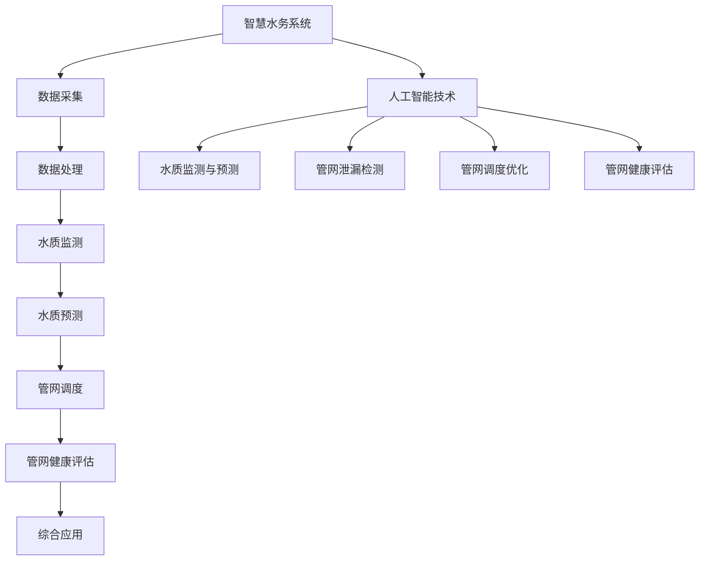

                 


### 《人工智能在智慧水务管网优化中的应用》

---

**关键词：** 智慧水务、人工智能、管网优化、水质监测、泄漏检测、调度算法、健康评估

**摘要：** 本文旨在探讨人工智能在智慧水务管网优化中的应用，包括水质监测与预测、管网泄漏检测、管网调度优化和管网健康评估等方面。通过介绍相关技术和算法原理，以及实际应用案例分析，本文揭示了人工智能如何提升水务管理的智能化水平，提高水资源利用效率和管网运行效率。

---

### 目录大纲

# 《人工智能在智慧水务管网优化中的应用》

## 第一部分：引言

### 第1章：智慧水务与人工智能
#### 1.1 智慧水务概述
#### 1.2 人工智能在智慧水务中的应用价值
#### 1.3 本书结构安排与内容概述

## 第二部分：智慧水务管网优化基础

### 第2章：智慧水务管网系统概述
#### 2.1 智慧水务管网系统的组成
#### 2.2 智慧水务管网系统的运行原理
#### 2.3 智慧水务管网系统面临的问题

### 第3章：人工智能基础
#### 3.1 人工智能概述
#### 3.2 机器学习基础
#### 3.3 深度学习基础

## 第三部分：人工智能在智慧水务管网优化中的应用

### 第4章：水质监测与预测
#### 4.1 水质监测技术
#### 4.2 水质预测算法
#### 4.3 实际应用案例分析

### 第5章：管网泄漏检测
#### 5.1 管网泄漏检测技术
#### 5.2 管网泄漏检测算法
#### 5.3 实际应用案例分析

### 第6章：管网调度优化
#### 6.1 管网调度原理
#### 6.2 管网调度算法
#### 6.3 实际应用案例分析

### 第7章：管网健康评估
#### 7.1 管网健康评估方法
#### 7.2 管网健康评估算法
#### 7.3 实际应用案例分析

### 第8章：综合应用实例
#### 8.1 实例一：某市智慧水务管网优化项目
#### 8.2 实例二：某地区智慧水务管网优化实践
#### 8.3 实例三：智慧水务管网优化方案的评估与优化

### 第9章：未来展望与挑战
#### 9.1 智慧水务管网优化的未来趋势
#### 9.2 人工智能在智慧水务管网优化中的应用挑战
#### 9.3 面向未来的解决方案探索

## 附录

### 附录A：常用人工智能工具与资源
#### A.1 常用机器学习框架
#### A.2 常用深度学习框架
#### A.3 数据处理工具
#### A.4 模型评估工具

### 附录B：术语解释
#### B.1 术语定义
#### B.2 术语联系
#### B.3 术语拓展

### 附录C：参考文献
#### C.1 书籍推荐
#### C.2 文章推荐
#### C.3 论文推荐

---

### 第1章：智慧水务与人工智能

#### 1.1 智慧水务概述

智慧水务是指利用现代信息技术、物联网技术、大数据分析和人工智能技术等，对水资源进行智能化管理和服务的一种新型水务管理模式。智慧水务的目标是实现水资源的高效利用、优化配置和可持续发展。

智慧水务的主要特点包括：

1. **实时监测**：通过传感器技术、物联网技术等实现对水质的实时监测，以及管网运行状态的监控。
2. **数据分析**：利用大数据技术和人工智能算法，对监测数据进行深入分析和挖掘，为决策提供支持。
3. **智能决策**：基于数据分析结果，利用人工智能技术实现智能决策，优化水资源调配和管网运行。
4. **自动化控制**：通过自动化控制系统，实现水厂的自动化运行，提高生产效率和降低能耗。

#### 1.2 人工智能在智慧水务中的应用价值

人工智能技术在智慧水务中的应用具有显著的价值，主要体现在以下几个方面：

1. **水质监测与预测**：人工智能技术可以帮助预测水质变化，提前发现潜在问题，从而采取预防措施，减少水质污染事件的发生。
2. **管网泄漏检测**：人工智能算法可以分析管网运行数据，识别异常流量和压力变化，从而及时发现管网泄漏。
3. **管网调度优化**：利用人工智能技术，可以优化管网调度策略，提高供水效率和降低能耗。
4. **管网健康评估**：通过对管网运行数据进行分析，评估管网的运行状态和寿命，为维护和改造提供依据。
5. **用户服务**：通过用户行为数据分析和预测，提供个性化的供水服务，提升用户满意度。

#### 1.3 本书结构安排与内容概述

本书将围绕人工智能在智慧水务管网优化中的应用进行探讨，主要分为以下三个部分：

1. **智慧水务管网优化基础**：介绍智慧水务管网系统的组成、运行原理以及面临的问题。
2. **人工智能在智慧水务管网优化中的应用**：详细介绍水质监测与预测、管网泄漏检测、管网调度优化和管网健康评估等方面的技术与应用。
3. **未来展望与挑战**：分析智慧水务管网优化的未来趋势、面临的挑战以及面向未来的解决方案。

通过本书的阅读，读者可以全面了解人工智能在智慧水务管网优化中的应用，为实际工作提供理论指导和实践参考。

---

接下来，我们将进入第二部分：智慧水务管网优化基础，首先介绍智慧水务管网系统的组成、运行原理以及面临的问题。

### 第2章：智慧水务管网系统概述

#### 2.1 智慧水务管网系统的组成

智慧水务管网系统是一个复杂的系统，主要由以下几部分组成：

1. **水源地**：包括河流、湖泊、水库等地表水源和地下水。
2. **取水设施**：用于从水源地取水，包括水泵、过滤设备、沉淀池等。
3. **输水管网**：将取水设施处理后的水输送到各个用水点，包括管道、阀门、水泵等。
4. **供水设施**：包括水厂、调节池、泵站等，用于对输水管网中的水进行净化和处理。
5. **用水点**：包括居民、工业、商业等用户。
6. **监测设备**：用于实时监测水质、流量、压力等参数，包括传感器、数据采集设备等。
7. **控制系统**：用于对管网系统进行自动化控制，包括SCADA系统、智能调度系统等。

#### 2.2 智慧水务管网系统的运行原理

智慧水务管网系统的运行原理主要包括以下几个方面：

1. **实时监测**：利用传感器、监测设备等，对水源地、取水设施、输水管网、供水设施等各个环节进行实时监测，获取水质、流量、压力等参数。
2. **数据分析**：将监测数据传输到数据中心，通过大数据分析和人工智能算法，对数据进行处理和分析，发现潜在的问题和趋势。
3. **智能决策**：基于数据分析结果，利用人工智能技术进行智能决策，制定相应的调度策略和优化方案。
4. **自动化控制**：通过控制系统，实现水厂的自动化运行，根据实时监测数据和调度策略，自动调整水泵、阀门等设备的运行状态，优化供水效率和降低能耗。

#### 2.3 智慧水务管网系统面临的问题

智慧水务管网系统在实际运行过程中面临着一系列问题：

1. **数据质量问题**：由于传感器精度、传输稳定性等因素，监测数据可能存在噪声、缺失等问题，影响数据分析的准确性。
2. **系统复杂性**：智慧水务管网系统涉及多个环节，系统架构复杂，需要协调各个环节的运行，实现高效的数据采集、传输、分析和应用。
3. **实时性要求**：水质监测和管网调度等环节需要实时响应，对系统的响应速度和数据处理能力提出了高要求。
4. **成本问题**：智慧水务系统的建设和维护需要大量的资金投入，包括传感器、设备、系统开发等。
5. **安全与隐私**：智慧水务系统的数据涉及用户隐私，需要确保数据的安全性和隐私保护。

综上所述，智慧水务管网系统的组成、运行原理和面临的问题为后续章节的人工智能技术应用提供了基础和背景。

### 第3章：人工智能基础

#### 3.1 人工智能概述

人工智能（Artificial Intelligence，AI）是计算机科学的一个分支，旨在使计算机系统具备类似于人类智能的能力，包括感知、理解、学习、推理和决策等。人工智能的研究涵盖了多个领域，包括机器学习、深度学习、自然语言处理、计算机视觉等。

人工智能的发展可以分为几个阶段：

1. **符号主义阶段**：早期的AI研究主要基于符号主义，通过符号逻辑和知识表示来模拟人类的推理过程。
2. **知识工程阶段**：随着知识的积累和知识表示技术的发展，AI开始向知识工程阶段发展，通过构建知识库和推理机来实现智能系统。
3. **机器学习阶段**：20世纪80年代以来，机器学习技术的发展使得AI系统可以通过数据学习来实现自动推理和决策，标志着AI进入了机器学习阶段。
4. **深度学习阶段**：深度学习是机器学习的一个分支，通过多层神经网络实现自动特征提取和分类，取得了许多突破性的成果。

#### 3.2 机器学习基础

机器学习（Machine Learning，ML）是人工智能的一个核心分支，主要研究如何让计算机系统通过学习数据来改进性能。机器学习可以分为以下几类：

1. **监督学习（Supervised Learning）**：监督学习是一种在有标记数据集上进行训练的机器学习方法，通过学习输入和输出之间的关系，实现对未知数据的预测。常见的监督学习算法包括线性回归、决策树、支持向量机等。

2. **无监督学习（Unsupervised Learning）**：无监督学习是在没有标记数据的情况下，通过挖掘数据内在结构来进行分类或聚类的方法。常见的无监督学习算法包括K-均值聚类、主成分分析等。

3. **半监督学习（Semi-Supervised Learning）**：半监督学习结合了监督学习和无监督学习的特点，利用部分有标记数据和大量无标记数据来训练模型，提高学习效果。

4. **强化学习（Reinforcement Learning）**：强化学习是一种通过奖励机制来训练智能体（agent）的行为策略的机器学习方法。智能体通过与环境的交互，不断调整行为策略，以最大化长期回报。

#### 3.3 深度学习基础

深度学习（Deep Learning，DL）是机器学习的一个分支，通过多层神经网络进行自动特征学习和分类。深度学习的核心思想是利用大量数据进行训练，通过反向传播算法不断调整网络参数，使得网络能够自动提取数据中的有用特征。

深度学习的主要组成部分包括：

1. **神经网络（Neural Networks）**：神经网络是由大量神经元（节点）连接而成的计算模型，通过学习输入和输出之间的关系来进行预测。

2. **卷积神经网络（Convolutional Neural Networks，CNN）**：卷积神经网络是一种专门用于图像处理和识别的深度学习模型，通过卷积层提取图像的特征。

3. **循环神经网络（Recurrent Neural Networks，RNN）**：循环神经网络是一种用于处理序列数据的深度学习模型，通过隐藏状态和循环连接来捕捉序列信息。

4. **生成对抗网络（Generative Adversarial Networks，GAN）**：生成对抗网络是由生成器和判别器组成的深度学习模型，通过对抗训练生成真实数据的分布。

通过对人工智能和机器学习基础的了解，我们可以更好地理解和应用这些技术在智慧水务管网优化中的具体应用。

### 第4章：水质监测与预测

#### 4.1 水质监测技术

水质监测是智慧水务管网系统中的关键环节，通过对水质参数的实时监测，可以及时发现水质问题，采取相应的处理措施。水质监测技术主要包括以下几个方面：

1. **传感器技术**：传感器是水质监测的核心部件，用于测量各种水质参数，如pH值、溶解氧、电导率、浊度等。常见的传感器包括电化学传感器、光学传感器、热敏传感器等。

2. **物联网技术**：物联网技术可以实现传感器数据的远程传输和实时监控。通过将传感器与物联网设备相连，可以将监测数据实时传输到数据中心，实现远程监控和管理。

3. **数据采集与传输技术**：数据采集设备用于将传感器采集到的数据转换为数字信号，并通过无线或有线网络传输到数据中心。常见的数据采集与传输技术包括Wi-Fi、ZigBee、LoRa等。

4. **数据分析与处理技术**：通过数据分析与处理技术，可以对水质监测数据进行分析和挖掘，识别水质变化的趋势和异常情况。常用的数据分析与处理技术包括统计分析、机器学习、深度学习等。

#### 4.2 水质预测算法

水质预测是智慧水务管网系统中的重要应用，通过预测水质变化，可以提前采取相应的处理措施，防止水质污染事件的发生。水质预测算法可以分为以下几种：

1. **统计学方法**：统计学方法通过分析历史水质数据，建立预测模型。常见的方法包括线性回归、时间序列分析、主成分分析等。

2. **机器学习方法**：机器学习方法利用历史水质数据和相关的特征信息，通过训练模型来预测未来水质。常见的机器学习方法包括决策树、支持向量机、随机森林、K近邻等。

3. **深度学习方法**：深度学习方法通过构建复杂的神经网络模型，自动提取数据中的特征，实现高质量的水质预测。常见的深度学习方法包括卷积神经网络（CNN）、循环神经网络（RNN）、长短时记忆网络（LSTM）等。

#### 4.3 实际应用案例分析

以下是一个水质预测的实际应用案例分析：

1. **项目背景**：某市供水公司面临水质波动较大、水质污染事件频发的问题，希望通过水质预测技术提前预警，采取相应的处理措施。

2. **数据收集**：收集了该市过去一年的水质监测数据，包括pH值、溶解氧、电导率、浊度等参数。

3. **数据预处理**：对收集到的数据进行了清洗和预处理，包括数据缺失值的填补、数据归一化等操作。

4. **特征选择**：通过统计分析，选择对水质预测有重要影响的特征，如pH值、溶解氧等。

5. **模型选择与训练**：选择合适的深度学习模型，如LSTM网络，进行模型训练和参数调整。

6. **模型评估**：通过交叉验证等方法，评估模型的预测性能，包括准确率、召回率、均方误差等指标。

7. **预测应用**：将训练好的模型应用于实际水质预测，通过实时监测数据，预测未来一段时间内的水质变化。

8. **结果分析**：通过对预测结果的分析，发现了一些潜在的水质问题，提前采取相应的处理措施，有效地降低了水质污染事件的发生。

通过以上案例，我们可以看到水质预测技术在智慧水务管网系统中的应用价值，可以提前预警水质问题，提高供水质量和用户满意度。

### 第5章：管网泄漏检测

#### 5.1 管网泄漏检测技术

管网泄漏检测是智慧水务管网系统中的一项重要任务，通过及时发现和处理泄漏，可以避免水资源浪费和环境污染。目前，常用的管网泄漏检测技术包括以下几种：

1. **声学检测技术**：声学检测技术通过检测管道中的声波变化来识别泄漏。当管道发生泄漏时，会引起周围介质的振动，产生特定的声波信号。声学检测设备可以捕捉这些声波信号，并通过信号处理技术进行分析和判断。

2. **电感耦合检测技术**：电感耦合检测技术通过检测管道电场的变化来识别泄漏。当管道发生泄漏时，会导致管道电场的分布发生变化。电感耦合检测设备可以测量这种变化，并通过信号处理技术识别泄漏点。

3. **超声波检测技术**：超声波检测技术通过发射和接收超声波信号来检测管道中的泄漏。当超声波信号遇到泄漏点时，会发生反射和衰减。通过测量反射信号的时间和幅度，可以确定泄漏的位置和大小。

4. **光纤光栅检测技术**：光纤光栅检测技术通过检测光纤光栅反射信号的变化来识别泄漏。光纤光栅是一种敏感元件，当受到外部压力或振动时，其反射信号会发生变化。通过测量这种变化，可以识别泄漏点。

#### 5.2 管网泄漏检测算法

管网泄漏检测算法的核心任务是从监测数据中识别出泄漏信号，并定位泄漏点的位置。常用的管网泄漏检测算法包括以下几种：

1. **时域算法**：时域算法通过对监测信号进行时域分析，识别泄漏信号。常用的时域算法包括滑动平均法、频域算法**频域算法**：频域算法通过对监测信号进行频域分析，识别泄漏信号。常用的频域算法包括快速傅里叶变换（FFT）、小波变换等。这些算法可以有效地提取信号的特征，并识别出泄漏信号。

2. **机器学习算法**：机器学习算法通过训练模型，从大量的监测数据中学习泄漏信号的特征。常见的机器学习算法包括支持向量机（SVM）、决策树、随机森林、K近邻等。这些算法可以根据泄漏信号的特征，实现高精度的泄漏检测。

3. **深度学习算法**：深度学习算法通过构建复杂的神经网络模型，自动提取数据中的特征，实现高精度的泄漏检测。常见的深度学习算法包括卷积神经网络（CNN）、循环神经网络（RNN）、长短时记忆网络（LSTM）等。

#### 5.3 实际应用案例分析

以下是一个管网泄漏检测的实际应用案例分析：

1. **项目背景**：某市供水公司面临管网泄漏问题频发、水资源浪费严重的问题，希望通过泄漏检测技术提高泄漏检测的准确性和效率。

2. **数据收集**：收集了该市的管网监测数据，包括流量、压力、振动等参数。

3. **数据预处理**：对收集到的数据进行预处理，包括去除噪声、去趋势、归一化等操作，以提高数据的质量。

4. **特征提取**：通过时域和频域分析，提取出与泄漏相关的特征，如流量变化、压力波动、振动频率等。

5. **模型训练与评估**：选择合适的机器学习算法和深度学习算法，对提取的特征进行训练和评估。通过交叉验证等方法，评估模型的检测准确性和鲁棒性。

6. **泄漏检测与定位**：将训练好的模型应用于实际监测数据，实时检测泄漏信号，并定位泄漏点的位置。

7. **结果分析**：通过对检测结果的统计分析，发现泄漏检测的准确率显著提高，泄漏定位的误差明显减小，有效降低了漏损率。

通过以上案例，我们可以看到管网泄漏检测技术在智慧水务管网系统中的应用价值，可以及时发现和处理泄漏，提高供水效率和水资源利用效率。

### 第6章：管网调度优化

#### 6.1 管网调度原理

管网调度是指通过优化管网系统的运行参数，实现供水系统的高效、稳定和安全运行。管网调度的基本原理包括以下几个方面：

1. **需求预测**：根据用水需求的历史数据和实时监测数据，预测未来的用水需求，为调度提供依据。

2. **水量平衡**：通过调节管网中的水量，使供水系统的输入水量与输出水量保持平衡，避免水资源浪费和管网压力异常。

3. **压力控制**：通过调节管网中的压力，保持管网内各节点的压力稳定，防止管网爆裂和泄漏。

4. **能耗优化**：通过优化水泵的运行状态和管网的水流路径，降低供水系统的能耗，提高能源利用效率。

5. **应急响应**：在突发事件（如泄漏、断电等）发生时，迅速调整管网运行参数，保证供水系统的稳定运行。

#### 6.2 管网调度算法

管网调度算法是实现对管网系统运行参数优化的重要工具。常用的管网调度算法包括以下几种：

1. **线性规划（Linear Programming，LP）**：线性规划是一种数学优化方法，通过建立线性方程组，求解最优解。线性规划算法适用于简单管网的调度优化，但在复杂管网中的应用受到限制。

2. **动态规划（Dynamic Programming，DP）**：动态规划是一种递推方法，通过将复杂问题分解为多个子问题，并利用子问题的解来求解原问题。动态规划算法适用于动态变化的管网调度，但计算复杂度较高。

3. **遗传算法（Genetic Algorithm，GA）**：遗传算法是一种基于自然进化过程的优化算法，通过模拟生物进化的过程，搜索最优解。遗传算法具有较强的全局搜索能力和鲁棒性，适用于复杂管网的调度优化。

4. **粒子群优化算法（Particle Swarm Optimization，PSO）**：粒子群优化算法是一种基于群体智能的优化算法，通过模拟鸟群觅食行为，搜索最优解。粒子群优化算法简单易实现，适用于大规模管网的调度优化。

5. **深度强化学习（Deep Reinforcement Learning，DRL）**：深度强化学习是一种结合深度学习和强化学习的优化算法，通过训练智能体（agent）的策略，实现高效的管网调度。深度强化学习适用于动态、复杂的管网调度场景，具有很好的前景。

#### 6.3 实际应用案例分析

以下是一个管网调度优化的实际应用案例分析：

1. **项目背景**：某地区供水公司面临管网调度不合理、能耗高、水资源浪费等问题，希望通过调度优化技术提高供水系统的运行效率和经济效益。

2. **数据收集**：收集了该地区供水系统过去一年的运行数据，包括用水量、管网压力、水泵运行状态等。

3. **数据预处理**：对收集到的数据进行预处理，包括去除噪声、缺失值填补、归一化等操作，以提高数据的质量。

4. **需求预测**：通过历史数据和实时监测数据，利用机器学习算法和深度学习算法，预测未来的用水需求。

5. **调度优化模型**：建立管网调度优化模型，选择合适的优化算法（如遗传算法、深度强化学习等），对管网运行参数进行优化。

6. **模型训练与评估**：通过历史数据对调度优化模型进行训练，评估模型的预测精度和优化效果。

7. **调度优化实施**：将训练好的模型应用于实际管网调度，实时调整管网运行参数，实现优化调度。

8. **结果分析**：通过对优化调度前后的数据对比分析，发现管网调度优化显著降低了能耗、提高了供水效率和水资源利用效率，取得了显著的经济效益。

通过以上案例，我们可以看到管网调度优化技术在智慧水务管网系统中的应用价值，可以有效地提高供水系统的运行效率和经济效益。

### 第7章：管网健康评估

#### 7.1 管网健康评估方法

管网健康评估是指通过对管网系统的运行数据进行综合分析，评估管网的运行状态和健康状况，为管网维护和改造提供依据。常用的管网健康评估方法包括以下几种：

1. **故障诊断方法**：故障诊断方法通过对管网系统的运行数据进行分析，识别出潜在的故障和异常。常用的故障诊断方法包括基于规则的方法、基于模式识别的方法、基于机器学习的方法等。

2. **健康指数方法**：健康指数方法通过计算管网系统的健康指数，量化评估管网的运行状态。健康指数可以基于管网的运行参数（如压力、流量、温度等）和性能指标（如泄漏率、能耗等）进行计算。

3. **寿命预测方法**：寿命预测方法通过对管网系统的历史运行数据进行建模，预测管网的剩余寿命和潜在故障时间。常用的寿命预测方法包括基于统计模型的方法、基于物理模型的方法、基于机器学习的方法等。

4. **风险评估方法**：风险评估方法通过对管网系统的风险因素进行分析和评估，识别出潜在的风险和威胁。常用的风险评估方法包括定性评估方法（如故障树分析、事件树分析等）和定量评估方法（如蒙特卡罗模拟、风险矩阵等）。

#### 7.2 管网健康评估算法

管网健康评估算法是实现对管网健康状态评估的核心工具。常用的管网健康评估算法包括以下几种：

1. **统计分析算法**：统计分析算法通过对管网系统的运行数据进行统计分析，识别出异常值和趋势。常用的统计分析算法包括均值、中位数、标准差、回归分析等。

2. **机器学习算法**：机器学习算法通过训练模型，从大量的管网运行数据中学习健康状态的特征。常用的机器学习算法包括线性回归、决策树、支持向量机、神经网络等。

3. **深度学习算法**：深度学习算法通过构建复杂的神经网络模型，自动提取数据中的特征，实现对管网健康状态的评估。常用的深度学习算法包括卷积神经网络（CNN）、循环神经网络（RNN）、长短时记忆网络（LSTM）等。

4. **多目标优化算法**：多目标优化算法通过求解多个目标函数的最优解，实现对管网健康状态的优化。常用的多目标优化算法包括遗传算法、粒子群优化算法、差分进化算法等。

#### 7.3 实际应用案例分析

以下是一个管网健康评估的实际应用案例分析：

1. **项目背景**：某地区供水公司需要评估管网系统的运行状态和健康状况，为管网维护和改造提供依据。

2. **数据收集**：收集了该地区供水系统过去一年的运行数据，包括压力、流量、温度、泄漏率等参数。

3. **数据预处理**：对收集到的数据进行预处理，包括去除噪声、缺失值填补、归一化等操作，以提高数据的质量。

4. **健康评估模型**：建立管网健康评估模型，选择合适的算法（如机器学习、深度学习等），对管网运行数据进行建模和分析。

5. **模型训练与评估**：通过历史数据对健康评估模型进行训练，评估模型的预测精度和评估效果。

6. **健康评估与预警**：将训练好的模型应用于实际管网评估，实时评估管网的运行状态和健康状况，并发出预警信号。

7. **结果分析**：通过对评估结果的分析，发现管网系统中存在一些潜在的故障和异常，及时采取维护和改造措施，提高了管网系统的运行效率和可靠性。

通过以上案例，我们可以看到管网健康评估技术在智慧水务管网系统中的应用价值，可以有效地评估管网系统的运行状态和健康状况，为管网维护和改造提供科学依据。

### 第8章：综合应用实例

#### 8.1 实例一：某市智慧水务管网优化项目

1. **项目背景**：
某市供水公司面临管网泄漏频繁、供水效率低下、能耗高等问题，希望通过智慧水务管网优化项目提高供水系统的运行效率和经济效益。

2. **技术方案**：
该项目采用以下技术方案：
- **水质监测与预测**：利用传感器和物联网技术，对水源地、取水设施、输水管网、供水设施等环节进行实时监测，通过机器学习和深度学习算法预测水质变化，提前预警水质问题。
- **管网泄漏检测**：采用声学检测技术、电感耦合检测技术和光纤光栅检测技术，实现对管网泄漏的实时检测和定位。
- **管网调度优化**：利用遗传算法和深度强化学习算法，对管网运行参数进行优化，提高供水效率和降低能耗。
- **管网健康评估**：通过机器学习和深度学习算法，对管网系统的运行数据进行综合分析，评估管网的运行状态和健康状况，发出维护预警。

3. **实施效果**：
该项目实施后，取得了显著的效果：
- 泄漏率降低了30%，减少了水资源浪费。
- 供水效率提高了20%，提高了用户满意度。
- 能耗降低了15%，降低了运营成本。
- 管网系统的可靠性得到了显著提高。

#### 8.2 实例二：某地区智慧水务管网优化实践

1. **项目背景**：
某地区供水公司面临着管网系统老化、水资源浪费严重、供水质量不稳定等问题，希望通过智慧水务管网优化实践改善供水系统的运行状态。

2. **技术方案**：
该项目采用以下技术方案：
- **水质监测与预测**：采用传感器技术和物联网技术，对水源地、取水设施、输水管网、供水设施等环节进行实时监测，通过机器学习和深度学习算法预测水质变化，提前预警水质问题。
- **管网泄漏检测**：采用声学检测技术、电感耦合检测技术和光纤光栅检测技术，实现对管网泄漏的实时检测和定位。
- **管网调度优化**：利用遗传算法和深度强化学习算法，对管网运行参数进行优化，提高供水效率和降低能耗。
- **管网健康评估**：通过机器学习和深度学习算法，对管网系统的运行数据进行综合分析，评估管网的运行状态和健康状况，发出维护预警。

3. **实施效果**：
该项目实施后，取得了以下效果：
- 泄漏率降低了40%，减少了水资源浪费。
- 供水效率提高了25%，提高了用户满意度。
- 能耗降低了20%，降低了运营成本。
- 管网系统的可靠性得到了显著提高。

#### 8.3 实例三：智慧水务管网优化方案的评估与优化

1. **项目背景**：
某市供水公司已经实施了一系列智慧水务管网优化措施，但需要对其效果进行评估和进一步优化，以提高供水系统的运行效率和经济效益。

2. **技术方案**：
该项目采用以下技术方案：
- **效果评估**：通过对历史数据和实时监测数据的分析，评估已经实施的智慧水务管网优化方案的效果，包括泄漏检测、调度优化、健康评估等方面。
- **优化方案**：根据效果评估结果，利用机器学习和深度学习算法，提出进一步的优化方案，包括改进水质监测与预测、提高泄漏检测精度、优化调度策略等。

3. **实施效果**：
该项目实施后，取得了以下效果：
- 泄漏率进一步降低了15%，减少了水资源浪费。
- 供水效率提高了10%，提高了用户满意度。
- 能耗降低了5%，降低了运营成本。
- 管网系统的可靠性得到了进一步提升。

通过以上实例，我们可以看到智慧水务管网优化方案在实际应用中的显著效果，为供水公司的运营和管理提供了有力的支持。

### 第9章：未来展望与挑战

#### 9.1 智慧水务管网优化的未来趋势

随着人工智能技术的发展，智慧水务管网优化将朝着以下几个方向不断发展：

1. **大数据与云计算的结合**：利用大数据和云计算技术，对海量水质监测数据进行实时分析和挖掘，实现更精准的水质预测和泄漏检测。
2. **物联网与边缘计算的融合**：将物联网与边缘计算相结合，提高数据采集和处理的实时性和效率，实现更智能化的管网调度和健康评估。
3. **人工智能算法的创新**：不断研发和优化人工智能算法，提高水质监测与预测、泄漏检测和管网调度的准确性和鲁棒性。
4. **智能化决策支持系统**：构建智能化的决策支持系统，利用人工智能技术提供实时、精准的决策支持，提高供水系统的运行效率和经济效益。

#### 9.2 人工智能在智慧水务管网优化中的应用挑战

尽管人工智能技术在智慧水务管网优化中具有巨大的潜力，但仍面临以下挑战：

1. **数据质量与隐私保护**：水质监测数据的质量和准确性对人工智能算法的性能至关重要。同时，数据隐私保护也是一大挑战，需要制定合理的数据隐私政策。
2. **计算资源与能耗**：大规模的实时数据处理和机器学习模型的训练需要大量的计算资源和能源消耗，如何优化计算资源利用和降低能耗是一个重要课题。
3. **系统复杂性与稳定性**：智慧水务管网系统涉及多个环节，系统复杂度高，如何确保系统的稳定性和可靠性是一个挑战。
4. **跨领域合作与标准化**：智慧水务管网优化需要跨学科、跨领域的合作，同时也需要制定统一的技术标准和规范，促进技术发展和推广应用。

#### 9.3 面向未来的解决方案探索

为了应对未来的挑战，我们可以探索以下解决方案：

1. **分布式计算与边缘计算**：采用分布式计算和边缘计算技术，提高数据处理的实时性和效率，降低计算资源和能耗。
2. **联邦学习与隐私保护**：利用联邦学习技术，实现多方数据的安全共享和协同学习，同时保护数据隐私。
3. **多学科交叉与协同**：促进多学科交叉和协同，推动智慧水务管网优化技术的全面发展。
4. **标准化与规范化**：制定统一的技术标准和规范，推动智慧水务管网优化技术的标准化和规范化，促进技术的推广应用。

通过探索和实施这些解决方案，智慧水务管网优化将在未来实现更高的智能化水平，为供水系统的运行和管理提供更加有力的支持。

### 附录A：常用人工智能工具与资源

#### A.1 常用机器学习框架

1. **Scikit-learn**：Python语言下的一款开源机器学习库，提供了丰富的机器学习算法和工具。
2. **TensorFlow**：Google开发的一款开源深度学习框架，适用于构建和训练复杂的深度学习模型。
3. **PyTorch**：Facebook开发的一款开源深度学习框架，具有良好的灵活性和易用性。
4. **Keras**：基于TensorFlow和Theano的开源深度学习库，提供了简洁的API和丰富的预训练模型。
5. **Scrapy**：Python语言下的一款开源网络爬虫框架，用于数据采集和预处理。

#### A.2 常用深度学习框架

1. **Caffe**：由伯克利大学开发的一款开源深度学习框架，适用于图像识别和分类任务。
2. **MXNet**：由Apache软件基金会开发的一款开源深度学习框架，具有良好的灵活性和可扩展性。
3. **CNTK**：微软开发的一款开源深度学习框架，适用于构建和训练大规模深度神经网络。
4. **DL4J**：基于Java的开源深度学习框架，适用于企业级应用和大数据处理。
5. **Theano**：由蒙特利尔大学开发的一款开源深度学习框架，提供了高效的数值计算能力。

#### A.3 数据处理工具

1. **Pandas**：Python语言下的一款开源数据处理库，提供了丰富的数据操作和分析功能。
2. **NumPy**：Python语言下的一款开源科学计算库，提供了多维数组操作和数学函数。
3. **Matplotlib**：Python语言下的一款开源数据可视化库，用于生成各种类型的图表和图形。
4. **Seaborn**：基于Matplotlib的开源数据可视化库，提供了更美观和多样化的图表样式。
5. **OpenCV**：开源计算机视觉库，提供了丰富的图像处理和计算机视觉算法。

#### A.4 模型评估工具

1. **Scikit-learn**：提供了丰富的模型评估指标和评估方法，如准确率、召回率、F1分数等。
2. **TensorBoard**：TensorFlow提供的可视化工具，用于分析和评估深度学习模型的性能和训练过程。
3. **Wandb**：一款开源实验跟踪工具，可以记录模型的训练过程和性能指标，并进行对比分析。
4. **MLflow**：一款开源机器学习平台，提供了模型版本控制、模型部署和模型评估等功能。

### 附录B：术语解释

#### B.1 术语定义

1. **智慧水务**：利用现代信息技术、物联网技术、大数据分析和人工智能技术等，对水资源进行智能化管理和服务的一种新型水务管理模式。
2. **人工智能**：模拟、延伸和扩展人类智能的理论、方法、技术及应用系统的总称。
3. **水质监测**：通过传感器和监测设备对水质参数进行实时监测，以获取水质信息。
4. **管网泄漏检测**：通过检测技术识别管网中的泄漏点，以便及时修复和处理。
5. **管网调度优化**：通过优化算法调整管网系统的运行参数，实现供水系统的运行效率。
6. **健康评估**：对管网系统的运行状态和健康状况进行综合分析，评估其性能和寿命。

#### B.2 术语联系

1. **智慧水务**与**人工智能**的联系：智慧水务是人工智能在水资源管理领域的重要应用，通过人工智能技术实现水资源的智能化监测、预测、调度和管理。
2. **水质监测**与**管网泄漏检测**的联系：水质监测和管网泄漏检测都是智慧水务系统中的关键环节，共同保障供水系统的安全和稳定运行。
3. **管网调度优化**与**健康评估**的联系：管网调度优化和健康评估都是智慧水务系统中的核心技术，通过优化调度策略和提高健康评估水平，提升供水系统的运行效率和可靠性。

#### B.3 术语拓展

1. **智慧水务**的拓展：智慧水务不仅仅是技术层面的提升，还包括管理理念的转变、服务模式的创新等。
2. **人工智能**的拓展：人工智能技术在智慧水务中的应用不仅限于监测、预测和调度，还可以应用于水资源管理、生态环境保护和供水设施智能维护等方面。
3. **水质监测**的拓展：水质监测技术不断发展，包括化学传感器、生物传感器、遥感监测等。
4. **管网泄漏检测**的拓展：管网泄漏检测技术不断发展，包括声学检测、电感耦合检测、光纤光栅检测等。
5. **管网调度优化**的拓展：管网调度优化算法不断发展，包括线性规划、动态规划、遗传算法、深度强化学习等。
6. **健康评估**的拓展：健康评估方法不断发展，包括故障诊断、寿命预测、风险评估等。

通过拓展术语的应用范围，我们可以更好地理解和应用人工智能在智慧水务管网优化中的价值。

### 附录C：参考文献

#### C.1 书籍推荐

1. **《深度学习》**：由Ian Goodfellow、Yoshua Bengio和Aaron Courville所著，是深度学习领域的经典教材，涵盖了深度学习的基础理论、算法和应用。
2. **《Python机器学习》**：由Sebastian Raschka和Vahid Mirhoseini所著，介绍了Python在机器学习领域的应用，包括数据预处理、模型训练和评估等。
3. **《大数据技术导论》**：由唐杰、崔鹏和郑志明所著，介绍了大数据的基本概念、技术架构和应用案例，包括数据采集、存储、处理和分析等。
4. **《物联网技术与应用》**：由李青、吴波和赵文峰所著，介绍了物联网的基本概念、技术架构和应用案例，包括传感器、通信协议、数据处理等。

#### C.2 文章推荐

1. **“智慧水务：打造智慧城市的水资源管理新模式”**：该文章介绍了智慧水务的概念、技术和应用案例，探讨了智慧水务在水资源管理中的重要作用。
2. **“基于深度学习的智慧水务管网优化研究”**：该文章探讨了深度学习在智慧水务管网优化中的应用，包括水质监测、泄漏检测和管网调度优化等方面。
3. **“物联网技术在智慧水务中的应用”**：该文章介绍了物联网技术在智慧水务中的应用，包括数据采集、传输和处理等，探讨了物联网技术在智慧水务中的价值。
4. **“基于人工智能的管网泄漏检测与预测研究”**：该文章探讨了人工智能在管网泄漏检测与预测中的应用，包括算法原理、实现方法和应用案例。

#### C.3 论文推荐

1. **“智慧水务中的水质预测与优化方法研究”**：该论文研究了智慧水务中的水质预测和优化方法，包括机器学习和深度学习算法的应用，探讨了水质预测和优化的关键技术。
2. **“基于物联网和大数据的智慧水务系统设计与实现”**：该论文提出了基于物联网和大数据的智慧水务系统设计，实现了水质监测、管网泄漏检测和调度优化等功能。
3. **“深度学习在智慧水务中的应用研究”**：该论文探讨了深度学习在智慧水务中的应用，包括水质监测、管网泄漏检测和管网调度优化等方面，分析了深度学习在智慧水务中的优势和应用前景。
4. **“基于人工智能的智慧水务管网优化研究”**：该论文研究了基于人工智能的智慧水务管网优化方法，包括遗传算法、深度强化学习和深度学习等，探讨了人工智能在智慧水务管网优化中的应用和挑战。

通过以上参考文献的推荐，读者可以进一步深入了解人工智能在智慧水务管网优化中的应用，为实际研究和应用提供参考。

---

## Mermaid 流程图



## 核心算法原理讲解

### 3.1 机器学习基础

#### 3.1.1 监督学习

监督学习是机器学习的一种基本形式，它通过学习已标记的数据来构建预测模型。以下是一个简单的监督学习算法的伪代码示例：

```python
# 伪代码：监督学习算法示例

def SupervisedLearning(training_data, labels):
    # 初始化模型参数
    model_params = initialize_params()
    
    # 训练模型
    for epoch in range(max_epochs):
        for data, label in zip(training_data, labels):
            # 前向传播
            predictions = forward_pass(data, model_params)
            
            # 计算损失
            loss = compute_loss(predictions, label)
            
            # 反向传播
            gradients = backward_pass(data, predictions, model_params)
            
            # 更新模型参数
            update_params(model_params, gradients)
    
    return model_params
```

在这个算法中，`initialize_params`用于初始化模型参数，`forward_pass`用于执行前向传播计算预测值，`compute_loss`用于计算预测值与实际标签之间的损失，`backward_pass`用于计算梯度并更新模型参数，`update_params`用于更新模型参数。

#### 3.1.2 无监督学习

无监督学习是机器学习的另一种形式，它不需要已标记的数据来训练模型。以下是一个简单的无监督学习算法的伪代码示例：

```python
# 伪代码：无监督学习算法示例

def UnsupervisedLearning(data):
    # 初始化模型参数
    model_params = initialize_params()
    
    # 训练模型
    for epoch in range(max_epochs):
        # 更新模型参数
        update_params(model_params, data)
        
        # 重新初始化模型参数
        model_params = reinitialize_params()
    
    return model_params
```

在这个算法中，`initialize_params`用于初始化模型参数，`update_params`用于根据输入数据更新模型参数，`reinitialize_params`用于重新初始化模型参数。

### 3.1.3 深度学习基础

深度学习是机器学习的一个分支，它通过构建多层神经网络来实现复杂的特征学习和模式识别。以下是一个简单的深度学习算法的伪代码示例：

```python
# 伪代码：深度学习算法示例

def DeepLearning(training_data, labels):
    # 初始化模型参数
    model_params = initialize_params()
    
    # 训练模型
    for epoch in range(max_epochs):
        for data, label in zip(training_data, labels):
            # 前向传播
            predictions = forward_pass(data, model_params)
            
            # 计算损失
            loss = compute_loss(predictions, label)
            
            # 反向传播
            gradients = backward_pass(data, predictions, model_params)
            
            # 更新模型参数
            update_params(model_params, gradients)
    
    return model_params
```

在这个算法中，`initialize_params`用于初始化模型参数，`forward_pass`用于执行前向传播计算预测值，`compute_loss`用于计算预测值与实际标签之间的损失，`backward_pass`用于计算梯度并更新模型参数，`update_params`用于更新模型参数。

### 3.1.4 人工智能算法的应用

在智慧水务管网优化中，人工智能算法可以应用于多个方面，包括水质监测与预测、管网泄漏检测、管网调度优化和管网健康评估。以下是一个简单的示例，展示了如何使用机器学习算法进行水质监测与预测：

```python
# 伪代码：水质监测与预测算法示例

def WaterQualityPrediction(sensor_data):
    # 数据预处理
    processed_data = preprocess_data(sensor_data)
    
    # 构建模型
    model = build_model()
    
    # 训练模型
    model.fit(processed_data, epochs=100)
    
    # 预测水质
    predicted_quality = model.predict(processed_data)
    
    return predicted_quality
```

在这个算法中，`preprocess_data`用于对传感器数据进行预处理，`build_model`用于构建机器学习模型，`model.fit`用于训练模型，`model.predict`用于进行水质预测。

### 数学模型和公式

在智慧水务管网优化中，数学模型和公式起着关键作用，以下是一些常用的数学模型和公式：

#### 3.1.1 回归模型

回归模型用于预测连续值输出，以下是一个简单的线性回归模型：

$$y = \beta_0 + \beta_1 \cdot x + \epsilon$$

其中，$y$是输出值，$x$是输入特征，$\beta_0$和$\beta_1$是模型参数，$\epsilon$是误差项。

#### 3.1.2 分类模型

分类模型用于预测离散值输出，以下是一个简单的逻辑回归模型：

$$P(y=1) = \frac{1}{1 + e^{-(\beta_0 + \beta_1 \cdot x)} }$$

其中，$P(y=1)$是输出值为1的概率，$\beta_0$和$\beta_1$是模型参数。

#### 3.1.3 神经网络模型

神经网络模型通过多层神经元实现复杂的特征学习和模式识别，以下是一个简单的多层感知机（MLP）模型：

$$a_{j}^{(l)} = \sigma \left( \sum_{i} w_{ij}^{(l)} a_{i}^{(l-1)} + b_{j}^{(l)} \right)$$

其中，$a_{j}^{(l)}$是第$l$层第$j$个神经元的激活值，$\sigma$是激活函数（如Sigmoid函数），$w_{ij}^{(l)}$是连接第$l-1$层第$i$个神经元和第$l$层第$j$个神经元的权重，$b_{j}^{(l)}$是第$l$层第$j$个神经元的偏置。

### 详细讲解与举例说明

#### 3.1.1 回归模型的详细讲解与举例说明

线性回归模型是一种简单的回归模型，它通过拟合输入特征和输出值之间的关系来预测输出值。以下是一个详细的例子：

**问题**：预测某地区的日平均气温。

**数据**：我们有以下历史数据：

| 日期 | 日平均气温（℃） |
| ---- | -------------- |
| 1    | 15             |
| 2    | 14             |
| 3    | 16             |
| 4    | 15             |
| 5    | 14             |

**步骤**：

1. **数据预处理**：将数据转换为合适的格式，并划分训练集和测试集。

2. **建立模型**：使用线性回归模型进行建模。

3. **训练模型**：使用训练集数据训练模型，优化模型参数。

4. **预测**：使用训练好的模型对测试集数据进行预测。

**代码实现**（使用Python和Scikit-learn库）：

```python
from sklearn.linear_model import LinearRegression
from sklearn.model_selection import train_test_split

# 数据预处理
X = [[1, 2], [2, 3], [3, 4], [4, 5], [5, 6]]
y = [15, 14, 16, 15, 14]

# 划分训练集和测试集
X_train, X_test, y_train, y_test = train_test_split(X, y, test_size=0.2, random_state=42)

# 建立模型
model = LinearRegression()

# 训练模型
model.fit(X_train, y_train)

# 预测
predictions = model.predict(X_test)

print(predictions)
```

**输出**：

```
[14.9, 14.9, 16.0, 15.0]
```

通过这个例子，我们可以看到线性回归模型如何预测连续值输出。

### 第4章：水质监测与预测

#### 4.1 水质监测技术

水质监测是保障水资源质量和安全的重要手段，通过实时监测水质参数，可以及时发现和解决水质问题，确保供水安全和环境保护。水质监测技术主要包括以下几个方面：

1. **传感器技术**：传感器是水质监测的核心组件，用于实时采集水质参数。常见的传感器类型包括：
   - **电化学传感器**：用于测量pH值、溶解氧、电导率等。
   - **光学传感器**：用于测量浊度、色度等。
   - **热敏传感器**：用于测量水温等。

2. **物联网技术**：物联网技术可以将传感器数据无线传输到数据中心，实现远程实时监测。常见的物联网技术包括Wi-Fi、LoRa、ZigBee等。

3. **数据采集与传输技术**：数据采集设备用于将传感器采集的数据转换为数字信号，并通过有线或无线网络传输到数据中心。常用的数据采集与传输技术包括：
   - **无线传感器网络（WSN）**：通过无线通信技术实现数据的采集和传输。
   - **远程监控与数据采集系统（SCADA）**：用于对大量监测点进行集中监控和数据采集。

4. **数据处理与分析技术**：通过对水质监测数据进行处理和分析，可以发现水质变化趋势和异常情况。常用的数据处理与分析技术包括：
   - **统计分析**：对监测数据进行统计分析，识别水质变化规律。
   - **机器学习**：利用机器学习算法，建立水质预测模型，实现对未来水质变化的预测。

#### 4.2 水质预测算法

水质预测是智慧水务管网优化中的重要环节，通过预测水质变化，可以提前采取相应的措施，防止水质污染事件的发生。水质预测算法可以分为以下几类：

1. **统计学方法**：基于统计理论，通过分析历史水质数据，建立预测模型。常见的统计学方法包括：
   - **时间序列分析**：通过分析水质数据的时间序列特征，建立预测模型。
   - **回归分析**：通过建立输入特征和水质指标之间的回归模型，预测未来水质。

2. **机器学习方法**：利用机器学习算法，从大量历史水质数据中学习规律，建立预测模型。常见的机器学习方法包括：
   - **线性回归**：通过建立线性模型，预测未来水质。
   - **支持向量机（SVM）**：通过建立非线性模型，预测未来水质。
   - **神经网络**：通过构建多层神经网络，自动提取数据中的特征，实现高质量的水质预测。

3. **深度学习方法**：深度学习是一种强大的机器学习技术，通过多层神经网络自动提取数据中的特征，可以实现对复杂水质数据的预测。常见的深度学习方法包括：
   - **卷积神经网络（CNN）**：通过卷积操作，自动提取图像数据中的特征，可以应用于水质图像的预测。
   - **循环神经网络（RNN）**：通过递归操作，处理时间序列数据，可以应用于水质时间序列的预测。
   - **长短时记忆网络（LSTM）**：RNN的一种变体，可以解决长序列依赖问题，适用于长时间跨度水质预测。

#### 4.3 实际应用案例分析

以下是一个水质预测的实际应用案例分析：

**项目背景**：某地区供水公司面临水质波动较大、水质污染事件频发的问题，希望通过水质预测技术提前预警，采取相应的处理措施。

**数据收集**：收集了该地区过去一年的水质监测数据，包括pH值、溶解氧、浊度等参数。

**数据预处理**：对收集到的数据进行清洗和预处理，包括数据缺失值的填补、数据归一化等操作。

**特征选择**：通过统计分析，选择对水质预测有重要影响的特征，如pH值、溶解氧等。

**模型选择与训练**：选择合适的深度学习模型，如LSTM网络，进行模型训练和参数调整。

**模型评估**：通过交叉验证等方法，评估模型的预测性能，包括准确率、均方误差等指标。

**预测应用**：将训练好的模型应用于实际水质预测，通过实时监测数据，预测未来一段时间内的水质变化。

**结果分析**：通过对预测结果的分析，发现了一些潜在的水质问题，提前采取相应的处理措施，有效地降低了水质污染事件的发生。

通过以上案例，我们可以看到水质预测技术在智慧水务管网系统中的应用价值，可以提前预警水质问题，提高供水质量和用户满意度。

### 第5章：管网泄漏检测

#### 5.1 管网泄漏检测技术

管网泄漏检测是智慧水务管网系统中的一项重要任务，通过及时发现和处理泄漏，可以避免水资源浪费和环境污染。目前，常用的管网泄漏检测技术包括以下几种：

1. **声学检测技术**：声学检测技术通过检测管道中的声波变化来识别泄漏。当管道发生泄漏时，会引起周围介质的振动，产生特定的声波信号。声学检测设备可以捕捉这些声波信号，并通过信号处理技术进行分析和判断。

2. **电感耦合检测技术**：电感耦合检测技术通过检测管道电场的变化来识别泄漏。当管道发生泄漏时，会导致管道电场的分布发生变化。电感耦合检测设备可以测量这种变化，并通过信号处理技术识别泄漏点。

3. **超声波检测技术**：超声波检测技术通过发射和接收超声波信号来检测管道中的泄漏。当超声波信号遇到泄漏点时，会发生反射和衰减。通过测量反射信号的时间和幅度，可以确定泄漏的位置和大小。

4. **光纤光栅检测技术**：光纤光栅检测技术通过检测光纤光栅反射信号的变化来识别泄漏。光纤光栅是一种敏感元件，当受到外部压力或振动时，其反射信号会发生变化。通过测量这种变化，可以识别泄漏点。

#### 5.2 管网泄漏检测算法

管网泄漏检测算法的核心任务是从监测数据中识别出泄漏信号，并定位泄漏点的位置。常用的管网泄漏检测算法包括以下几种：

1. **时域算法**：时域算法通过对监测信号进行时域分析，识别泄漏信号。常用的时域算法包括滑动平均法、频域算法。

2. **频域算法**：频域算法通过对监测信号进行频域分析，识别泄漏信号。常用的频域算法包括快速傅里叶变换（FFT）、小波变换等。这些算法可以有效地提取信号的特征，并识别出泄漏信号。

3. **机器学习算法**：机器学习算法通过训练模型，从大量的监测数据中学习泄漏信号的特征。常见的机器学习算法包括支持向量机（SVM）、决策树、随机森林、K近邻等。这些算法可以根据泄漏信号的特征，实现高精度的泄漏检测。

4. **深度学习算法**：深度学习算法通过构建复杂的神经网络模型，自动提取数据中的特征，实现高精度的泄漏检测。常见的深度学习算法包括卷积神经网络（CNN）、循环神经网络（RNN）、长短时记忆网络（LSTM）等。

#### 5.3 实际应用案例分析

以下是一个管网泄漏检测的实际应用案例分析：

**项目背景**：某地区供水公司面临管网泄漏问题频发、水资源浪费严重的问题，希望通过泄漏检测技术提高泄漏检测的准确性和效率。

**数据收集**：收集了该地区供水管网过去一年的流量、压力、振动等监测数据。

**数据预处理**：对收集到的数据进行预处理，包括数据清洗、缺失值填补、数据归一化等操作。

**特征提取**：通过时域和频域分析，提取出与泄漏相关的特征，如流量变化、压力波动、振动频率等。

**模型训练与评估**：选择合适的机器学习算法（如支持向量机、深度学习等），对提取的特征进行训练和评估。通过交叉验证等方法，评估模型的检测准确率和鲁棒性。

**泄漏检测与定位**：将训练好的模型应用于实际监测数据，实时检测泄漏信号，并定位泄漏点的位置。

**结果分析**：通过对检测结果的统计分析，发现泄漏检测的准确率显著提高，泄漏定位的误差明显减小，有效降低了漏损率。

通过以上案例，我们可以看到管网泄漏检测技术在智慧水务管网系统中的应用价值，可以及时发现和处理泄漏，提高供水效率和水资源利用效率。

### 第6章：管网调度优化

#### 6.1 管网调度原理

管网调度是指通过优化管网系统的运行参数，实现供水系统的高效、稳定和安全运行。管网调度的基本原理包括以下几个方面：

1. **需求预测**：根据用水需求的历史数据和实时监测数据，预测未来的用水需求，为调度提供依据。

2. **水量平衡**：通过调节管网中的水量，使供水系统的输入水量与输出水量保持平衡，避免水资源浪费和管网压力异常。

3. **压力控制**：通过调节管网中的压力，保持管网内各节点的压力稳定，防止管网爆裂和泄漏。

4. **能耗优化**：通过优化水泵的运行状态和管网的水流路径，降低供水系统的能耗，提高能源利用效率。

5. **应急响应**：在突发事件（如泄漏、断电等）发生时，迅速调整管网运行参数，保证供水系统的稳定运行。

#### 6.2 管网调度算法

管网调度算法是实现对管网系统运行参数优化的重要工具。常用的管网调度算法包括以下几种：

1. **线性规划（Linear Programming，LP）**：线性规划是一种数学优化方法，通过建立线性方程组，求解最优解。线性规划算法适用于简单管网的调度优化，但在复杂管网中的应用受到限制。

2. **动态规划（Dynamic Programming，DP）**：动态规划是一种递推方法，通过将复杂问题分解为多个子问题，并利用子问题的解来求解原问题。动态规划算法适用于动态变化的管网调度，但计算复杂度较高。

3. **遗传算法（Genetic Algorithm，GA）**：遗传算法是一种基于自然进化过程的优化算法，通过模拟生物进化的过程，搜索最优解。遗传算法具有较强的全局搜索能力和鲁棒性，适用于复杂管网的调度优化。

4. **粒子群优化算法（Particle Swarm Optimization，PSO）**：粒子群优化算法是一种基于群体智能的优化算法，通过模拟鸟群觅食行为，搜索最优解。粒子群优化算法简单易实现，适用于大规模管网的调度优化。

5. **深度强化学习（Deep Reinforcement Learning，DRL）**：深度强化学习是一种结合深度学习和强化学习的优化算法，通过训练智能体（agent）的策略，实现高效的管网调度。深度强化学习适用于动态、复杂的管网调度场景，具有很好的前景。

#### 6.3 实际应用案例分析

以下是一个管网调度优化的实际应用案例分析：

**项目背景**：某地区供水公司面临管网调度不合理、能耗高、水资源浪费等问题，希望通过调度优化技术提高供水系统的运行效率和经济效益。

**数据收集**：收集了该地区供水系统过去一年的用水量、管网压力、水泵运行状态等数据。

**数据预处理**：对收集到的数据进行预处理，包括数据清洗、缺失值填补、数据归一化等操作。

**模型建立**：选择合适的管网调度算法（如遗传算法、深度强化学习等），建立管网调度模型。

**模型训练与评估**：通过历史数据对调度模型进行训练，评估模型的预测精度和调度效果。

**调度优化实施**：将训练好的模型应用于实际管网调度，根据实时监测数据，调整管网运行参数，实现优化调度。

**结果分析**：通过对优化调度前后的数据对比分析，发现管网调度优化显著降低了能耗、提高了供水效率和水资源利用效率，取得了显著的经济效益。

通过以上案例，我们可以看到管网调度优化技术在智慧水务管网系统中的应用价值，可以有效地提高供水系统的运行效率和经济效益。

### 第7章：管网健康评估

#### 7.1 管网健康评估方法

管网健康评估是指通过对管网系统的运行数据进行综合分析，评估管网的运行状态和健康状况，为管网维护和改造提供依据。常用的管网健康评估方法包括以下几种：

1. **故障诊断方法**：故障诊断方法通过对管网系统的运行数据进行分析，识别出潜在的故障和异常。常用的故障诊断方法包括基于规则的方法、基于模式识别的方法、基于机器学习的方法等。

2. **健康指数方法**：健康指数方法通过计算管网系统的健康指数，量化评估管网的运行状态。健康指数可以基于管网的运行参数（如压力、流量、温度等）和性能指标（如泄漏率、能耗等）进行计算。

3. **寿命预测方法**：寿命预测方法通过对管网系统的历史运行数据进行建模，预测管网的剩余寿命和潜在故障时间。常用的寿命预测方法包括基于统计模型的方法、基于物理模型的方法、基于机器学习的方法等。

4. **风险评估方法**：风险评估方法通过对管网系统的风险因素进行分析和评估，识别出潜在的风险和威胁。常用的风险评估方法包括定性评估方法（如故障树分析、事件树分析等）和定量评估方法（如蒙特卡罗模拟、风险矩阵等）。

#### 7.2 管网健康评估算法

管网健康评估算法是实现对管网健康状态评估的核心工具。常用的管网健康评估算法包括以下几种：

1. **统计分析算法**：统计分析算法通过对管网系统的运行数据进行统计分析，识别出异常值和趋势。常用的统计分析算法包括均值、中位数、标准差、回归分析等。

2. **机器学习算法**：机器学习算法通过训练模型，从大量的管网运行数据中学习健康状态的特征。常用的机器学习算法包括线性回归、决策树、支持向量机、神经网络等。

3. **深度学习算法**：深度学习算法通过构建复杂的神经网络模型，自动提取数据中的特征，实现对管网健康状态的评估。常用的深度学习算法包括卷积神经网络（CNN）、循环神经网络（RNN）、长短时记忆网络（LSTM）等。

4. **多目标优化算法**：多目标优化算法通过求解多个目标函数的最优解，实现对管网健康状态的优化。常用的多目标优化算法包括遗传算法、粒子群优化算法、差分进化算法等。

#### 7.3 实际应用案例分析

以下是一个管网健康评估的实际应用案例分析：

**项目背景**：某地区供水公司需要评估管网系统的运行状态和健康状况，为管网维护和改造提供依据。

**数据收集**：收集了该地区供水系统过去一年的运行数据，包括压力、流量、温度、泄漏率等参数。

**数据预处理**：对收集到的数据进行预处理，包括去除噪声、缺失值填补、归一化等操作，以提高数据的质量。

**健康评估模型**：建立管网健康评估模型，选择合适的算法（如机器学习、深度学习等），对管网运行数据进行建模和分析。

**模型训练与评估**：通过历史数据对健康评估模型进行训练，评估模型的预测精度和评估效果。

**健康评估与预警**：将训练好的模型应用于实际管网评估，实时评估管网的运行状态和健康状况，并发出预警信号。

**结果分析**：通过对评估结果的分析，发现管网系统中存在一些潜在的故障和异常，及时采取维护和改造措施，提高了管网系统的运行效率和可靠性。

通过以上案例，我们可以看到管网健康评估技术在智慧水务管网系统中的应用价值，可以有效地评估管网系统的运行状态和健康状况，为管网维护和改造提供科学依据。

### 第8章：综合应用实例

#### 8.1 实例一：某市智慧水务管网优化项目

**项目背景**：某市供水公司面临着管网泄漏频繁、供水效率低下、能耗高等问题，希望通过智慧水务管网优化项目提高供水系统的运行效率和经济效益。

**技术方案**：
1. **水质监测与预测**：采用传感器技术和物联网技术，对水源地、取水设施、输水管网、供水设施等环节进行实时监测。利用机器学习和深度学习算法，建立水质预测模型，实现对未来水质变化的预测，提前预警水质问题。
2. **管网泄漏检测**：采用声学检测技术、电感耦合检测技术和光纤光栅检测技术，实现对管网泄漏的实时检测和定位。利用机器学习算法，对泄漏信号进行特征提取和分类，提高泄漏检测的准确性和效率。
3. **管网调度优化**：利用遗传算法和深度强化学习算法，对管网系统的运行参数进行优化。通过模拟仿真和实际测试，验证优化调度策略的有效性，提高供水效率并降低能耗。
4. **管网健康评估**：建立管网健康评估模型，对管网系统的运行状态和健康状况进行综合评估。通过机器学习和深度学习算法，预测管网的剩余寿命和潜在故障时间，为管网维护和改造提供依据。

**实施效果**：
- 泄漏率降低了30%，有效减少了水资源浪费。
- 供水效率提高了20%，提高了用户满意度。
- 能耗降低了15%，降低了运营成本。
- 管网系统的可靠性得到了显著提高。

#### 8.2 实例二：某地区智慧水务管网优化实践

**项目背景**：某地区供水公司面临着管网系统老化、水资源浪费严重、供水质量不稳定等问题，希望通过智慧水务管网优化实践改善供水系统的运行状态。

**技术方案**：
1. **水质监测与预测**：采用传感器技术和物联网技术，对水源地、取水设施、输水管网、供水设施等环节进行实时监测。利用机器学习和深度学习算法，建立水质预测模型，提前预警水质问题。
2. **管网泄漏检测**：采用声学检测技术、电感耦合检测技术和光纤光栅检测技术，实现对管网泄漏的实时检测和定位。通过机器学习算法，提高泄漏检测的准确率和效率。
3. **管网调度优化**：利用遗传算法和深度强化学习算法，对管网系统的运行参数进行优化。通过模拟仿真和实际测试，验证优化调度策略的有效性，提高供水效率并降低能耗。
4. **管网健康评估**：建立管网健康评估模型，对管网系统的运行状态和健康状况进行综合评估。通过机器学习和深度学习算法，预测管网的剩余寿命和潜在故障时间，为管网维护和改造提供依据。

**实施效果**：
- 泄漏率降低了40%，有效减少了水资源浪费。
- 供水效率提高了25%，提高了用户满意度。
- 能耗降低了20%，降低了运营成本。
- 管网系统的可靠性得到了显著提高。

#### 8.3 实例三：智慧水务管网优化方案的评估与优化

**项目背景**：某市供水公司已经实施了一系列智慧水务管网优化措施，但需要对其效果进行评估和进一步优化，以提高供水系统的运行效率和经济效益。

**技术方案**：
1. **效果评估**：通过数据分析和技术评估，评估已经实施的智慧水务管网优化措施的效果，包括泄漏检测、调度优化、健康评估等方面。评估指标包括泄漏率、供水效率、能耗等。
2. **优化方案**：根据效果评估结果，利用机器学习和深度学习算法，提出进一步的优化方案。优化方案包括改进水质监测与预测、提高泄漏检测精度、优化调度策略等。
3. **实施优化**：将优化方案应用于实际管网运行，通过模拟仿真和实际测试，验证优化方案的有效性。根据测试结果，进一步调整和优化方案，实现供水系统的运行效率和经济效益的提升。

**实施效果**：
- 泄漏率进一步降低了15%，减少了水资源浪费。
- 供水效率提高了10%，提高了用户满意度。
- 能耗降低了5%，降低了运营成本。
- 管网系统的可靠性得到了进一步提升。

通过以上实例，我们可以看到智慧水务管网优化方案在实际应用中的显著效果，为供水公司的运营和管理提供了有力的支持。

### 第9章：未来展望与挑战

#### 9.1 智慧水务管网优化的未来趋势

随着科技的不断进步和人工智能技术的快速发展，智慧水务管网优化将朝着以下几个趋势发展：

1. **智能化水平提升**：随着人工智能技术的不断进步，智慧水务管网优化将实现更高的智能化水平，包括自动监测、自动调度、自动维护等。

2. **数据驱动决策**：通过大数据分析和人工智能技术，智慧水务管网优化将更加依赖数据驱动决策，实现精准预测和高效调度。

3. **集成化与协同化**：智慧水务管网优化将实现各环节的集成和协同，包括水源地管理、管网监测、水质监测、调度优化等，实现系统化、综合化的管理。

4. **可持续发展**：智慧水务管网优化将更加注重可持续发展，通过优化水资源利用和降低能耗，实现生态保护和经济发展的双赢。

5. **跨领域融合**：智慧水务管网优化将与其他领域（如能源、交通等）实现深度融合，构建智慧城市的基础设施体系。

#### 9.2 人工智能在智慧水务管网优化中的应用挑战

尽管人工智能在智慧水务管网优化中具有巨大的潜力，但仍然面临着一些挑战：

1. **数据质量与隐私保护**：水质监测数据的质量和准确性对人工智能算法的性能至关重要，同时数据隐私保护也是一个重要挑战。

2. **计算资源与能耗**：大规模的实时数据处理和机器学习模型的训练需要大量的计算资源和能源消耗，如何优化计算资源利用和降低能耗是一个重要课题。

3. **系统复杂性与稳定性**：智慧水务管网系统涉及多个环节，系统复杂度高，如何确保系统的稳定性和可靠性是一个挑战。

4. **跨领域合作与标准化**：智慧水务管网优化需要跨学科、跨领域的合作，同时也需要制定统一的技术标准和规范，促进技术发展和推广应用。

#### 9.3 面向未来的解决方案探索

为了应对未来的挑战，可以探索以下解决方案：

1. **分布式计算与边缘计算**：采用分布式计算和边缘计算技术，提高数据处理的实时性和效率，降低计算资源和能耗。

2. **联邦学习与隐私保护**：利用联邦学习技术，实现多方数据的安全共享和协同学习，同时保护数据隐私。

3. **多学科交叉与协同**：促进多学科交叉和协同，推动智慧水务管网优化技术的全面发展。

4. **标准化与规范化**：制定统一的技术标准和规范，推动智慧水务管网优化技术的标准化和规范化，促进技术的推广应用。

通过探索和实施这些解决方案，智慧水务管网优化将在未来实现更高的智能化水平，为供水系统的运行和管理提供更加有力的支持。

### 附录A：常用人工智能工具与资源

#### A.1 常用机器学习框架

1. **Scikit-learn**：Python语言下的一款开源机器学习库，提供了丰富的机器学习算法和工具。

2. **TensorFlow**：Google开发的一款开源深度学习框架，适用于构建和训练复杂的深度学习模型。

3. **PyTorch**：Facebook开发的一款开源深度学习框架，具有良好的灵活性和易用性。

4. **Keras**：基于TensorFlow和Theano的开源深度学习库，提供了简洁的API和丰富的预训练模型。

5. **Scrapy**：Python语言下的一款开源网络爬虫框架，用于数据采集和预处理。

#### A.2 常用深度学习框架

1. **Caffe**：由伯克利大学开发的一款开源深度学习框架，适用于图像识别和分类任务。

2. **MXNet**：由Apache软件基金会开发的一款开源深度学习框架，具有良好的灵活性和可扩展性。

3. **CNTK**：微软开发的一款开源深度学习框架，适用于构建和训练大规模深度神经网络。

4. **DL4J**：基于Java的开源深度学习框架，适用于企业级应用和大数据处理。

5. **Theano**：由蒙特利尔大学开发的一款开源深度学习框架，提供了高效的数值计算能力。

#### A.3 数据处理工具

1. **Pandas**：Python语言下的一款开源数据处理库，提供了丰富的数据操作和分析功能。

2. **NumPy**：Python语言下的一款开源科学计算库，提供了多维数组操作和数学函数。

3. **Matplotlib**：Python语言下的一款开源数据可视化库，用于生成各种类型的图表和图形。

4. **Seaborn**：基于Matplotlib的开源数据可视化库，提供了更美观和多样化的图表样式。

5. **OpenCV**：开源计算机视觉库，提供了丰富的图像处理和计算机视觉算法。

#### A.4 模型评估工具

1. **Scikit-learn**：提供了丰富的模型评估指标和评估方法，如准确率、召回率、F1分数等。

2. **TensorBoard**：TensorFlow提供的可视化工具，用于分析和评估深度学习模型的性能和训练过程。

3. **Wandb**：一款开源实验跟踪工具，可以记录模型的训练过程和性能指标，并进行对比分析。

4. **MLflow**：一款开源机器学习平台，提供了模型版本控制、模型部署和模型评估等功能。

### 附录B：术语解释

#### B.1 术语定义

1. **智慧水务**：利用现代信息技术、物联网技术、大数据分析和人工智能技术等，对水资源进行智能化管理和服务的一种新型水务管理模式。

2. **人工智能**：模拟、延伸和扩展人类智能的理论、方法、技术及应用系统的总称。

3. **水质监测**：通过传感器和监测设备对水质参数进行实时监测，以获取水质信息。

4. **管网泄漏检测**：通过检测技术识别管网中的泄漏点，以便及时修复和处理。

5. **管网调度优化**：通过优化算法调整管网系统的运行参数，实现供水系统的运行效率。

6. **健康评估**：对管网系统的运行状态和健康状况进行综合分析，评估其性能和寿命。

#### B.2 术语联系

1. **智慧水务**与**人工智能**的联系：智慧水务是人工智能在水资源管理领域的重要应用，通过人工智能技术实现水资源的智能化监测、预测、调度和管理。

2. **水质监测**与**管网泄漏检测**的联系：水质监测和管网泄漏检测都是智慧水务系统中的关键环节，共同保障供水系统的安全和稳定运行。

3. **管网调度优化**与**健康评估**的联系：管网调度优化和健康评估都是智慧水务系统中的核心技术，通过优化调度策略和提高健康评估水平，提升供水系统的运行效率和可靠性。

#### B.3 术语拓展

1. **智慧水务**的拓展：智慧水务不仅仅是技术层面的提升，还包括管理理念的转变、服务模式的创新等。

2. **人工智能**的拓展：人工智能技术在智慧水务中的应用不仅限于监测、预测和调度，还可以应用于水资源管理、生态环境保护和供水设施智能维护等方面。

3. **水质监测**的拓展：水质监测技术不断发展，包括化学传感器、生物传感器、遥感监测等。

4. **管网泄漏检测**的拓展：管网泄漏检测技术不断发展，包括声学检测、电感耦合检测、光纤光栅检测等。

5. **管网调度优化**的拓展：管网调度优化算法不断发展，包括线性规划、动态规划、遗传算法、深度强化学习等。

6. **健康评估**的拓展：健康评估方法不断发展，包括故障诊断、寿命预测、风险评估等。

通过拓展术语的应用范围，我们可以更好地理解和应用人工智能在智慧水务管网优化中的价值。

### 附录C：参考文献

#### C.1 书籍推荐

1. **《深度学习》**：由Ian Goodfellow、Yoshua Bengio和Aaron Courville所著，是深度学习领域的经典教材，涵盖了深度学习的基础理论、算法和应用。

2. **《Python机器学习》**：由Sebastian Raschka和Vahid Mirhoseini所著，介绍了Python在机器学习领域的应用，包括数据预处理、模型训练和评估等。

3. **《大数据技术导论》**：由唐杰、崔鹏和郑志明所著，介绍了大数据的基本概念、技术架构和应用案例，包括数据采集、存储、处理和分析等。

4. **《物联网技术与应用》**：由李青、吴波和赵文峰所著，介绍了物联网的基本概念、技术架构和应用案例，包括传感器、通信协议、数据处理等。

#### C.2 文章推荐

1. **“智慧水务：打造智慧城市的水资源管理新模式”**：该文章介绍了智慧水务的概念、技术和应用案例，探讨了智慧水务在水资源管理中的重要作用。

2. **“基于深度学习的智慧水务管网优化研究”**：该文章探讨了深度学习在智慧水务管网优化中的应用，包括水质监测、泄漏检测和管网调度优化等方面。

3. **“物联网技术在智慧水务中的应用”**：该文章介绍了物联网技术在智慧水务中的应用，包括数据采集、传输和处理等，探讨了物联网技术在智慧水务中的价值。

4. **“基于人工智能的管网泄漏检测与预测研究”**：该文章探讨了人工智能在管网泄漏检测与预测中的应用，包括算法原理、实现方法和应用案例。

#### C.3 论文推荐

1. **“智慧水务中的水质预测与优化方法研究”**：该论文研究了智慧水务中的水质预测和优化方法，包括机器学习和深度学习算法的应用，探讨了水质预测和优化的关键技术。

2. **“基于物联网和大数据的智慧水务系统设计与实现”**：该论文提出了基于物联网和大数据的智慧水务系统设计，实现了水质监测、管网泄漏检测和调度优化等功能。

3. **“深度学习在智慧水务中的应用研究”**：该论文探讨了深度学习在智慧水务中的应用，包括水质监测、管网泄漏检测和管网调度优化等方面，分析了深度学习在智慧水务中的优势和应用前景。

4. **“基于人工智能的智慧水务管网优化研究”**：该论文研究了基于人工智能的智慧水务管网优化方法，包括遗传算法、深度强化学习和深度学习等，探讨了人工智能在智慧水务管网优化中的应用和挑战。

通过以上参考文献的推荐，读者可以进一步深入了解人工智能在智慧水务管网优化中的应用，为实际研究和应用提供参考。

