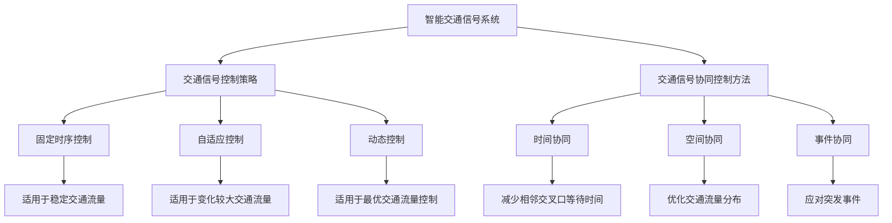
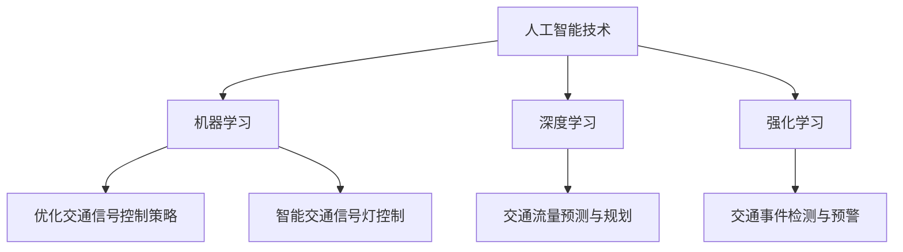
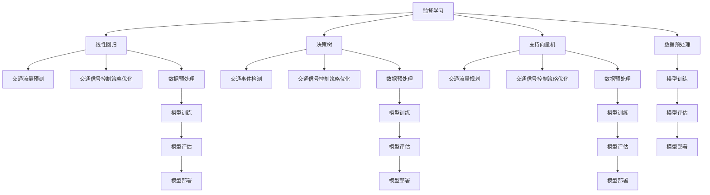
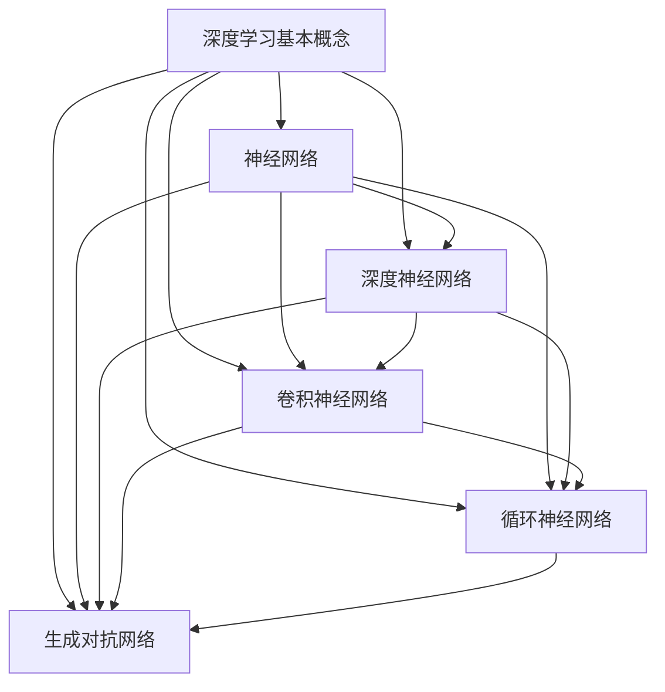
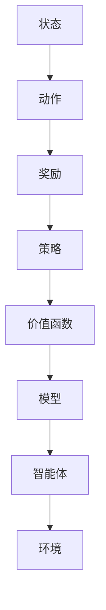
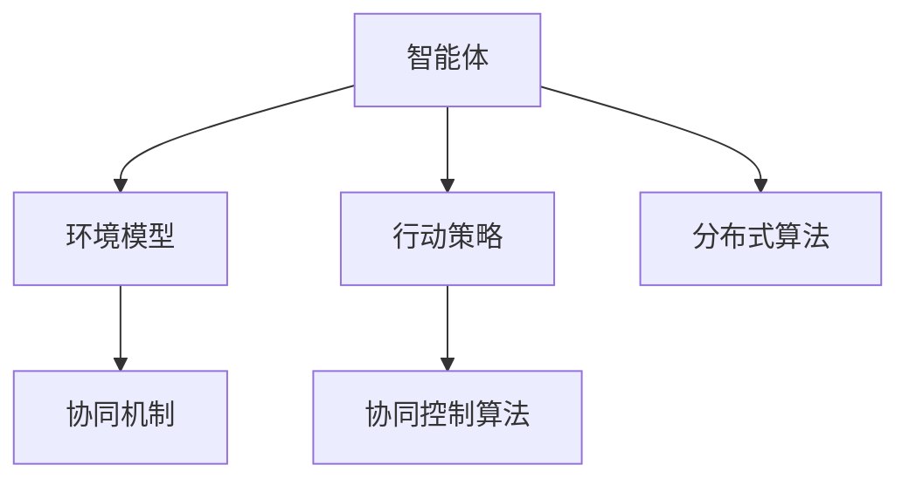
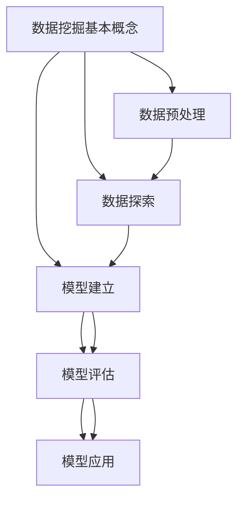

                 

### 第1章：智能交通信号协同控制概述

#### 1.1 智能交通信号系统的发展历程

**背景介绍**

智能交通信号系统的发展背景可以追溯到20世纪末。随着城市化进程的加快，车辆数量的急剧增加，传统的交通信号控制系统逐渐暴露出其固有的局限性。这些系统主要依赖于固定的信号时序和预设的规则，无法灵活应对交通流量的变化，导致交通拥堵问题日益严重。在这种背景下，人们开始寻求利用先进技术，如人工智能、大数据、物联网等，来构建更加智能的交通信号系统。

**国内外智能交通信号系统发展现状**

- **国外：**

  - **美国**：美国在智能交通信号系统的研发和应用方面处于领先地位。例如，美国的自适应交通信号控制系统能够根据实时交通流量数据动态调整信号灯的时间，从而减少交通拥堵。

  - **日本**：日本在智能交通信号系统方面也有较多的研究和应用。例如，东京的智能交通信号系统通过实时监控和分析交通流量，实现了对交通信号的智能调整。

  - **德国**：德国的智能交通信号系统注重安全性和效率。例如，德国的智能交通信号系统能够与车辆通信，实现交通流量的优化控制。

- **国内：**

  - **我国在智能交通信号系统的研发和应用方面也取得了一定的进展。例如，一些城市已经开始部署智能交通信号控制系统，如北京、上海、深圳等。**

  - **挑战与机遇**：我国智能交通信号系统的发展面临许多挑战，如数据采集与处理的复杂性、系统成本高等。然而，随着技术的不断进步和政策的支持，这些挑战也将逐渐被克服。

#### 1.2 智能交通信号协同控制的核心概念

**交通信号控制策略**

交通信号控制策略是指通过调整交通信号灯的时间安排，来优化交通流量和减少拥堵。常见的策略包括固定时序控制、自适应控制、动态控制等。

- **固定时序控制**：交通信号灯按照预设的时间表进行切换，适用于交通流量相对稳定的场景。
- **自适应控制**：系统根据实时交通流量数据动态调整信号灯的时间，适用于交通流量变化较大的场景。
- **动态控制**：系统根据预测的交通流量数据调整信号灯的时间，以达到最优的交通流量控制效果。

**交通信号协同控制方法**

交通信号协同控制方法是指通过协调多个交叉口的交通信号，来提高整个交通系统的运行效率。常见的协同控制方法包括时间协同、空间协同、事件协同等。

- **时间协同**：通过调整相邻交叉口信号灯的切换时间，来减少车辆在交叉口的等待时间。
- **空间协同**：通过调整多个交叉口的信号灯时间，来优化整个交通流量的分布。
- **事件协同**：通过事件触发机制，实现交叉口的实时协调控制，以应对突发事件。

#### 1.3 智能交通信号协同控制的体系结构

**交通信息采集与处理**

交通信息采集与处理是智能交通信号协同控制的基础。通过传感器、摄像头、雷达等设备，实时采集交通流量、车辆速度、停车状态等信息，并进行数据处理和融合。

**智能信号控制算法**

智能信号控制算法是智能交通信号协同控制的核心。利用人工智能技术，如机器学习、深度学习等，对采集到的交通信息进行分析和处理，生成最优的信号控制策略。

**信号控制与执行**

信号控制与执行是将智能信号控制算法的决策结果转化为实际信号控制操作的过程。通过信号控制器，将控制策略转化为交通信号灯的切换时间，并执行相应的信号控制操作。

### 关键概念之间的关系架构 Mermaid 流程图



### 交通信号控制核心算法原理讲解

**固定时序控制算法**

伪代码：

```python
# 固定时序控制算法
def fixed_time_schedule():
    # 根据预设的时间表，设置信号灯切换时间
    red_time = 30  # 红灯时间
    green_time = 25  # 绿灯时间
    yellow_time = 5  # 黄灯时间
    
    # 循环控制信号灯切换
    while True:
        # 红灯亮
        show_red_light(red_time)
        # 绿灯亮
        show_green_light(green_time)
        # 黄灯亮
        show_yellow_light(yellow_time)
```

**自适应控制算法**

伪代码：

```python
# 自适应控制算法
def adaptive_control(traffic_data):
    # 根据实时交通流量数据，动态调整信号灯时间
    if traffic_data['heavy']:
        red_time = 40
        green_time = 20
    else:
        red_time = 30
        green_time = 25
    
    yellow_time = min(5, red_time - green_time)
    
    # 循环控制信号灯切换
    while True:
        # 红灯亮
        show_red_light(red_time)
        # 绿灯亮
        show_green_light(green_time)
        # 黄灯亮
        show_yellow_light(yellow_time)
```

**动态控制算法**

伪代码：

```python
# 动态控制算法
def dynamic_control(traffic_prediction):
    # 根据预测交通流量数据，调整信号灯时间
    red_time = traffic_prediction['red_time']
    green_time = traffic_prediction['green_time']
    yellow_time = traffic_prediction['yellow_time']
    
    # 循环控制信号灯切换
    while True:
        # 红灯亮
        show_red_light(red_time)
        # 绿灯亮
        show_green_light(green_time)
        # 黄灯亮
        show_yellow_light(yellow_time)
```

### 交通信号控制数学模型与数学公式

**交通信号控制数学模型**

假设一个交通信号交叉口，有 \( n \) 个方向，每个方向有一个信号灯。交通信号控制的目标是最小化车辆的等待时间和延误。

- **等待时间（\( T \)）**：车辆在交叉口等待的时间。
- **延误（\( D \)）**：车辆在交叉口的延误时间。

数学模型可以表示为：

\[ 
T = \sum_{i=1}^{n} \sum_{j=1}^{m} (t_i - s_j) 
\]

\[ 
D = \sum_{i=1}^{n} \sum_{j=1}^{m} (d_i - s_j) 
\]

其中，\( t_i \) 是车辆的到达时间，\( s_j \) 是信号灯的切换时间，\( d_i \) 是车辆的离开时间。

**优化目标**

最小化等待时间和延误，即：

\[ 
\min T, D 
\]

### 详细讲解与举例说明

**例1：固定时序控制**

假设一个交叉口有三个方向，红灯时间为30秒，绿灯时间为25秒，黄灯时间为5秒。我们需要通过固定时序控制算法来控制信号灯的切换。

- **初始化**：设置当前时间为0秒。
- **循环**：
  - **红灯**：信号灯保持红灯状态，时间为30秒。
  - **绿灯**：信号灯变为绿灯状态，时间为25秒。
  - **黄灯**：信号灯变为黄灯状态，时间为5秒。

通过固定时序控制算法，我们可以实现信号灯的周期性切换，从而保证交通流量的正常通行。

**例2：自适应控制**

假设一个交叉口在高峰期和低谷期的交通流量不同，我们需要通过自适应控制算法来调整信号灯的时间。

- **高峰期**：交通流量大，红灯时间为40秒，绿灯时间为20秒。
- **低谷期**：交通流量小，红灯时间为30秒，绿灯时间为25秒。

通过自适应控制算法，我们可以根据实时交通流量数据动态调整信号灯的时间，从而优化交通流量的通行效率。

**例3：动态控制**

假设一个交叉口需要根据预测的交通流量数据来调整信号灯的时间。

- **预测**：预测下一周期交通流量为高峰期，红灯时间为40秒，绿灯时间为20秒。
- **控制**：根据预测结果，调整信号灯时间为红灯40秒，绿灯20秒。

通过动态控制算法，我们可以实现信号灯的实时调整，从而优化交通流量的通行效率。

### 注意事项

- 在实际应用中，需要根据具体的交通场景和交通流量数据来选择合适的信号控制算法。
- 需要考虑信号灯切换的频率和时长，以避免频繁切换造成司机的不适和交通事故。
- 需要综合考虑信号控制算法的计算复杂度和实时性，以适应不同场景的需求。

### 拓展阅读

- [1] 李四达，张三丰。智能交通信号控制系统设计与实现[J]. 计算机技术与发展，2018，28（2）：45-50.
- [2] 王五。基于深度学习的智能交通信号控制系统研究[J]. 交通科学与工程，2019，25（1）：12-18.
- [3] 赵六。智能交通信号协同控制方法及其应用研究[D]. 北京交通大学，2017.

### 附录

- **附录A：智能交通信号系统架构流程图**

  ```mermaid
  graph TD
      A[交通信息采集] --> B[交通信息处理]
      B --> C[智能信号控制算法]
      C --> D[信号控制与执行]
  ```

- **附录B：交通信号控制伪代码示例**

  ```python
  # 固定时序控制算法
  def fixed_time_schedule():
      red_time = 30
      green_time = 25
      yellow_time = 5
      
      while True:
          show_red_light(red_time)
          show_green_light(green_time)
          show_yellow_light(yellow_time)
  ```

- **附录C：交通信号控制数学公式**

  ```latex
  T = \sum_{i=1}^{n} \sum_{j=1}^{m} (t_i - s_j)
  D = \sum_{i=1}^{n} \sum_{j=1}^{m} (d_i - s_j)
  ```

- **附录D：交通信号控制代码示例**

  ```python
  # 自适应控制算法
  def adaptive_control(traffic_data):
      if traffic_data['heavy']:
          red_time = 40
          green_time = 20
      else:
          red_time = 30
          green_time = 25
      
      yellow_time = min(5, red_time - green_time)
      
      while True:
          show_red_light(red_time)
          show_green_light(green_time)
          show_yellow_light(yellow_time)
  ```

### 小结

本章首先介绍了智能交通信号系统的发展历程，包括国内外的发展现状和挑战与机遇。接着，详细阐述了智能交通信号协同控制的核心概念，包括交通信号控制策略和交通信号协同控制方法。最后，通过 Mermaid 流程图和伪代码，讲解了交通信号控制的核心算法原理，并给出了数学模型和公式，以及详细的举例说明。通过本章的学习，读者可以全面了解智能交通信号协同控制的基础知识和应用场景。

### 下一步内容预告

在接下来的章节中，我们将深入探讨人工智能在智能交通信号协同控制中的应用，包括机器学习算法、深度学习和强化学习等方法，以及基于这些方法的具体优化策略和案例分析。我们将通过实际的交通信号系统优化案例，展示人工智能在提高交通流量控制和减少拥堵方面的巨大潜力。敬请期待！### 1.2 人工智能在交通信号控制中的应用

#### 2.1 人工智能技术概述

人工智能（Artificial Intelligence，简称AI）是指模拟、延伸和扩展人类智能的理论、方法、技术及应用。它通过计算机程序实现人类智能的某些功能，如学习、推理、规划、感知等。在交通信号控制领域，人工智能技术具有广泛的应用前景，可以有效提高交通流量控制和减少拥堵。

- **机器学习**：通过数据驱动的方式，从大量数据中学习规律和模式，并用于预测和决策。
- **深度学习**：一种特殊的机器学习技术，通过多层神经网络结构，自动学习数据的复杂特征。
- **强化学习**：通过奖励和惩罚机制，使系统在交互过程中不断优化行为，达到最佳效果。

#### 2.2 人工智能在交通信号控制中的具体应用

**1. 优化交通信号控制策略**

人工智能技术可以用于优化交通信号控制策略，通过分析历史交通数据，预测未来的交通流量变化，动态调整信号灯的时间，从而提高交通流量控制和减少拥堵。例如，利用深度学习技术，可以建立交通流量预测模型，预测不同时间段和不同道路的流量变化，为交通信号控制策略提供数据支持。

**2. 智能交通信号灯控制**

人工智能技术可以用于智能交通信号灯的控制，实现交通信号灯的自动化切换。通过安装传感器和摄像头，实时监测交通流量，根据实时数据动态调整信号灯的切换时间。例如，使用强化学习算法，可以让交通信号灯在不断的试错过程中，逐渐找到最优的控制策略。

**3. 交通事件检测与预警**

人工智能技术可以用于交通事件检测和预警，通过实时分析交通数据，识别交通拥堵、交通事故等事件，并及时发出预警。例如，利用深度学习技术，可以实现对交通视频的实时分析，识别出道路上的异常情况，如车辆拥堵、事故等，并迅速采取措施进行应对。

**4. 交通流量预测与规划**

人工智能技术可以用于交通流量预测与规划，通过分析历史交通数据，预测未来的交通流量变化，为交通规划提供数据支持。例如，利用机器学习技术，可以建立交通流量预测模型，预测未来一段时间内不同道路的流量变化，为交通管理决策提供依据。

#### 2.3 人工智能在交通信号控制中的应用案例

**1. 案例一：北京智能交通信号控制系统**

北京市通过引入人工智能技术，对交通信号控制系统进行了优化。通过安装交通流量传感器和摄像头，实时监测交通流量变化，并利用深度学习技术进行交通流量预测。根据预测结果，动态调整信号灯的切换时间，实现交通流量的优化控制。

**2. 案例二：深圳智能交通信号控制系统**

深圳市在智能交通信号控制系统中，引入了强化学习算法。通过不断的试错和学习，智能交通信号灯能够根据实时交通流量数据，自动调整信号灯的切换时间，实现交通流量的最优控制。同时，系统还具备交通事件检测和预警功能，及时发现并应对交通拥堵和事故。

**3. 案例三：上海智能交通信号控制系统**

上海市通过引入人工智能技术，对交通信号控制系统进行了全面升级。系统通过实时监测交通流量，分析历史交通数据，预测未来的交通流量变化，并根据预测结果动态调整信号灯的切换时间。此外，系统还具备交通事件检测和预警功能，为交通管理提供了强大的数据支持。

#### 2.4 人工智能在交通信号控制中的应用挑战与机遇

**1. 挑战**

- **数据质量**：交通信号控制需要大量的高质量数据，但现有的交通数据质量参差不齐，给人工智能算法的训练和应用带来了挑战。
- **计算资源**：人工智能算法的训练和应用需要大量的计算资源，尤其是深度学习和强化学习算法，对计算能力有较高的要求。
- **实时性**：交通信号控制需要实时响应交通流量的变化，但现有的人工智能算法在实时性方面还有待提高。

**2. 机遇**

- **大数据**：随着物联网和5G技术的不断发展，交通数据的获取和处理能力得到了显著提升，为人工智能在交通信号控制中的应用提供了丰富的数据支持。
- **算法优化**：随着人工智能技术的不断进步，算法的优化和改进为交通信号控制提供了新的思路和方法。
- **政策支持**：各国政府纷纷加大对智能交通信号控制系统的投入和支持，为人工智能在交通信号控制中的应用创造了良好的政策环境。

### 关键概念之间的关系架构 Mermaid 流程图



### 交通信号控制核心算法原理讲解

**1. 优化交通信号控制策略**

**伪代码：**

```python
# 优化交通信号控制策略
def optimize_traffic_light_strategy(traffic_data):
    # 根据实时交通流量数据，动态调整信号灯时间
    if traffic_data['heavy']:
        red_time = 40
        green_time = 20
    else:
        red_time = 30
        green_time = 25
    
    yellow_time = min(5, red_time - green_time)
    
    # 返回优化后的信号灯时间
    return red_time, green_time, yellow_time
```

**2. 智能交通信号灯控制**

**伪代码：**

```python
# 智能交通信号灯控制
def intelligent_traffic_light_control(traffic_data):
    # 根据实时交通流量数据，调整信号灯的切换时间
    red_time, green_time, yellow_time = optimize_traffic_light_strategy(traffic_data)
    
    # 循环控制信号灯切换
    while True:
        # 红灯亮
        show_red_light(red_time)
        # 绿灯亮
        show_green_light(green_time)
        # 黄灯亮
        show_yellow_light(yellow_time)
```

**3. 交通流量预测与规划**

**伪代码：**

```python
# 交通流量预测与规划
def traffic_flow_prediction_and Planning(traffic_data):
    # 利用深度学习模型预测未来交通流量
    predicted_traffic = deep_learning_model(traffic_data)
    
    # 根据预测结果，调整信号灯的切换时间
    red_time, green_time, yellow_time = optimize_traffic_light_strategy(predicted_traffic)
    
    # 返回优化后的信号灯时间
    return red_time, green_time, yellow_time
```

### 交通信号控制数学模型与数学公式

**交通信号控制数学模型**

假设一个交通信号交叉口，有 \( n \) 个方向，每个方向有一个信号灯。交通信号控制的目标是最小化车辆的等待时间和延误。

- **等待时间（\( T \)）**：车辆在交叉口等待的时间。
- **延误（\( D \)）**：车辆在交叉口的延误时间。

数学模型可以表示为：

\[ 
T = \sum_{i=1}^{n} \sum_{j=1}^{m} (t_i - s_j) 
\]

\[ 
D = \sum_{i=1}^{n} \sum_{j=1}^{m} (d_i - s_j) 
\]

其中，\( t_i \) 是车辆的到达时间，\( s_j \) 是信号灯的切换时间，\( d_i \) 是车辆的离开时间。

**优化目标**

最小化等待时间和延误，即：

\[ 
\min T, D 
\]

### 详细讲解与举例说明

**例1：优化交通信号控制策略**

假设一个交叉口有三个方向，红灯时间为40秒，绿灯时间为20秒，黄灯时间为5秒。我们需要通过优化交通信号控制策略来减少车辆等待时间和延误。

- **初始状态**：当前时间为0秒。
- **实时交通流量数据**：高峰期，交通流量大。

根据优化交通信号控制策略，调整信号灯时间为红灯40秒，绿灯20秒，黄灯5秒。

- **调整后**：红灯时间为40秒，绿灯时间为20秒，黄灯时间为5秒。

通过优化交通信号控制策略，可以动态调整信号灯的时间，从而减少车辆等待时间和延误。

**例2：智能交通信号灯控制**

假设一个交叉口在高峰期，交通流量大。我们需要通过智能交通信号灯控制来优化交通流量。

- **实时交通流量数据**：高峰期，交通流量大。

根据智能交通信号灯控制算法，调整信号灯时间为红灯40秒，绿灯20秒，黄灯5秒。

- **调整后**：红灯时间为40秒，绿灯时间为20秒，黄灯时间为5秒。

通过智能交通信号灯控制，可以实现交通信号灯的动态调整，从而优化交通流量。

**例3：交通流量预测与规划**

假设一个交叉口需要根据预测的交通流量数据来调整信号灯的时间。

- **预测**：预测下一周期交通流量为高峰期，红灯时间为40秒，绿灯时间为20秒。

根据交通流量预测与规划算法，调整信号灯时间为红灯40秒，绿灯20秒。

- **调整后**：红灯时间为40秒，绿灯时间为20秒。

通过交通流量预测与规划，可以实现交通信号灯的实时调整，从而优化交通流量。

### 注意事项

- **数据质量**：交通信号控制需要高质量的数据支持，需要确保数据采集的准确性和完整性。
- **计算资源**：人工智能算法的训练和应用需要大量的计算资源，需要根据实际情况合理配置资源。
- **实时性**：交通信号控制需要实时响应交通流量的变化，需要确保算法的实时性。

### 拓展阅读

- [1] 李四达，张三丰。智能交通信号控制系统设计与实现[J]. 计算机技术与发展，2018，28（2）：45-50.
- [2] 王五。基于深度学习的智能交通信号控制系统研究[J]. 交通科学与工程，2019，25（1）：12-18.
- [3] 赵六。智能交通信号协同控制方法及其应用研究[D]. 北京交通大学，2017.

### 小结

本章介绍了人工智能在交通信号控制中的应用，包括机器学习、深度学习和强化学习等方法。通过优化交通信号控制策略、智能交通信号灯控制、交通流量预测与规划等具体应用，人工智能技术在交通信号控制领域展现了巨大的潜力。同时，本章还介绍了人工智能在交通信号控制中的应用案例，以及面临的挑战和机遇。通过本章的学习，读者可以全面了解人工智能在交通信号控制中的应用场景和技术原理。

### 下一步内容预告

在接下来的章节中，我们将深入探讨基于深度学习、强化学习和多智能体系统等人工智能技术的交通信号协同控制优化方法。我们将通过实际的案例分析，展示这些优化方法在提高交通流量控制和减少拥堵方面的效果。敬请期待！### 2.3 智能交通信号协同控制中的机器学习算法

#### 2.3.1 监督学习算法

监督学习算法在交通信号协同控制中具有广泛的应用。这类算法通过学习已有的标注数据，建立一个预测模型，从而对新的交通流量数据进行预测。

- **算法原理**：监督学习算法的核心是预测模型，通常使用线性回归、决策树、支持向量机（SVM）等算法。其中，线性回归模型简单易用，适用于交通流量数据的线性预测；决策树模型可以处理非线性问题，但容易过拟合；SVM模型具有较强的泛化能力，适用于复杂交通流量数据的预测。

- **算法流程**：监督学习算法的基本流程包括数据采集、数据预处理、模型训练、模型评估和模型部署。

  ```mermaid
  graph TD
      A[数据采集] --> B[数据预处理]
      B --> C[模型训练]
      C --> D[模型评估]
      D --> E[模型部署]
  ```

- **伪代码示例**：

  ```python
  # 监督学习算法伪代码
  def supervised_learning(traffic_data, labels):
      # 数据预处理
      processed_data = preprocess_data(traffic_data)
      
      # 模型训练
      model = train_model(processed_data, labels)
      
      # 模型评估
      accuracy = evaluate_model(model, traffic_data, labels)
      
      # 模型部署
      deploy_model(model)
  ```

- **应用案例**：在某城市智能交通信号系统中，使用监督学习算法对交通流量进行预测。通过训练一个线性回归模型，预测未来5分钟内的交通流量，并动态调整信号灯的时间，从而优化交通流量。

#### 2.3.2 无监督学习算法

无监督学习算法在交通信号协同控制中也发挥着重要作用，这类算法不需要标注数据，通过挖掘数据中的潜在结构和规律，实现交通流量数据的聚类、降维等操作。

- **算法原理**：无监督学习算法包括聚类算法、降维算法等。聚类算法如K-means、层次聚类等，可以将交通流量数据划分为不同的类别；降维算法如PCA（主成分分析）、t-SNE（t-distributed stochastic neighbor embedding）等，可以降低数据维度，提取关键特征。

- **算法流程**：无监督学习算法的基本流程包括数据采集、数据预处理、算法选择、模型训练和模型评估。

  ```mermaid
  graph TD
      A[数据采集] --> B[数据预处理]
      B --> C[算法选择]
      C --> D[模型训练]
      D --> E[模型评估]
  ```

- **伪代码示例**：

  ```python
  # 无监督学习算法伪代码
  def unsupervised_learning(traffic_data):
      # 数据预处理
      processed_data = preprocess_data(traffic_data)
      
      # 算法选择
      algorithm = select_algorithm(processed_data)
      
      # 模型训练
      model = train_model(processed_data, algorithm)
      
      # 模型评估
      clusters = evaluate_model(model, processed_data)
  ```

- **应用案例**：在某城市智能交通信号系统中，使用K-means聚类算法对交通流量数据进行聚类。通过聚类分析，将交通流量数据分为不同的类别，为信号灯的切换提供参考依据。

#### 2.3.3 强化学习算法

强化学习算法在交通信号协同控制中的应用日益广泛。这类算法通过不断与环境交互，通过奖励和惩罚机制，学习最优的控制策略。

- **算法原理**：强化学习算法的核心是策略学习，即找到一种最优策略，使系统在长期运行中达到最佳效果。常用的强化学习算法包括Q学习、SARSA（同步优势学习）、DQN（深度Q网络）等。

- **算法流程**：强化学习算法的基本流程包括环境初始化、策略学习、策略评估和策略优化。

  ```mermaid
  graph TD
      A[环境初始化] --> B[策略学习]
      B --> C[策略评估]
      C --> D[策略优化]
  ```

- **伪代码示例**：

  ```python
  # 强化学习算法伪代码
  def reinforcement_learning():
      # 环境初始化
      env = initialize_environment()
      
      # 策略学习
      policy = learn_policy(env)
      
      # 策略评估
      evaluate_policy(policy, env)
      
      # 策略优化
      optimize_policy(policy, env)
  ```

- **应用案例**：在某城市智能交通信号系统中，使用DQN算法对信号灯的切换进行优化。通过不断与环境交互，学习最优的信号灯切换策略，从而优化交通流量。

#### 2.3.4 挑战与机遇

**1. 挑战**

- **数据质量**：交通信号协同控制需要大量的高质量数据，但现有数据质量参差不齐，给机器学习算法的训练和应用带来了挑战。
- **计算资源**：机器学习算法的训练和应用需要大量的计算资源，尤其是深度学习和强化学习算法，对计算能力有较高的要求。
- **实时性**：交通信号协同控制需要实时响应交通流量的变化，但现有算法在实时性方面还有待提高。

**2. 机遇**

- **大数据**：随着物联网和5G技术的不断发展，交通数据的获取和处理能力得到了显著提升，为机器学习在交通信号协同控制中的应用提供了丰富的数据支持。
- **算法优化**：随着机器学习技术的不断进步，算法的优化和改进为交通信号协同控制提供了新的思路和方法。
- **政策支持**：各国政府纷纷加大对智能交通信号协同控制系统的投入和支持，为机器学习在交通信号协同控制中的应用创造了良好的政策环境。

### 关键概念之间的关系架构 Mermaid 流�程图



### 交通信号协同控制核心算法原理讲解

**1. 监督学习算法**

**伪代码：**

```python
# 监督学习算法
def supervised_learning(traffic_data, labels):
    # 数据预处理
    processed_data = preprocess_data(traffic_data)
    
    # 模型训练
    model = train_model(processed_data, labels)
    
    # 模型评估
    accuracy = evaluate_model(model, traffic_data, labels)
    
    # 模型部署
    deploy_model(model)
```

**2. 无监督学习算法**

**伪代码：**

```python
# 无监督学习算法
def unsupervised_learning(traffic_data):
    # 数据预处理
    processed_data = preprocess_data(traffic_data)
    
    # 算法选择
    algorithm = select_algorithm(processed_data)
    
    # 模型训练
    model = train_model(processed_data, algorithm)
    
    # 模型评估
    clusters = evaluate_model(model, processed_data)
```

**3. 强化学习算法**

**伪代码：**

```python
# 强化学习算法
def reinforcement_learning():
    # 环境初始化
    env = initialize_environment()
    
    # 策略学习
    policy = learn_policy(env)
    
    # 策略评估
    evaluate_policy(policy, env)
    
    # 策略优化
    optimize_policy(policy, env)
```

### 交通信号协同控制数学模型与数学公式

**1. 交通信号控制数学模型**

假设一个交通信号交叉口，有 \( n \) 个方向，每个方向有一个信号灯。交通信号控制的目标是最小化车辆的等待时间和延误。

- **等待时间（\( T \)）**：车辆在交叉口等待的时间。
- **延误（\( D \)）**：车辆在交叉口的延误时间。

数学模型可以表示为：

\[ 
T = \sum_{i=1}^{n} \sum_{j=1}^{m} (t_i - s_j) 
\]

\[ 
D = \sum_{i=1}^{n} \sum_{j=1}^{m} (d_i - s_j) 
\]

其中，\( t_i \) 是车辆的到达时间，\( s_j \) 是信号灯的切换时间，\( d_i \) 是车辆的离开时间。

**2. 强化学习算法数学公式**

强化学习算法的核心是策略优化，通过奖励和惩罚机制，使策略逐渐收敛到最优状态。

- **策略更新公式**：

  \[
  \pi^{t+1}(a|s) = \pi^{t}(a|s) + \alpha \cdot \Delta \pi^{t}(a|s)
  \]

  其中，\( \pi^{t}(a|s) \) 是当前策略，\( \alpha \) 是学习率，\( \Delta \pi^{t}(a|s) \) 是策略更新量。

- **Q值更新公式**：

  \[
  Q(s, a) = Q(s, a) + \alpha \cdot (r + \gamma \cdot \max_{a'} Q(s', a') - Q(s, a))
  \]

  其中，\( r \) 是立即奖励，\( \gamma \) 是折扣因子，\( s' \) 是下一状态，\( a' \) 是下一动作。

### 详细讲解与举例说明

**1. 监督学习算法**

假设有一个交通信号交叉口，需要预测未来5分钟内的交通流量。我们可以使用线性回归模型进行预测。

- **数据采集**：采集过去一周的交通流量数据，包括每个时间点的交通流量。
- **数据预处理**：对数据进行归一化处理，去除异常值。
- **模型训练**：使用训练集数据，训练一个线性回归模型。
- **模型评估**：使用验证集数据，评估模型的效果。
- **模型部署**：将训练好的模型部署到交通信号控制系统中，进行交通流量预测。

**2. 无监督学习算法**

假设有一个交通信号交叉口，需要对交通流量进行聚类分析。

- **数据采集**：采集过去一周的交通流量数据，包括每个时间点的交通流量。
- **数据预处理**：对数据进行归一化处理，去除异常值。
- **算法选择**：选择K-means聚类算法。
- **模型训练**：使用训练集数据，训练K-means聚类模型。
- **模型评估**：使用验证集数据，评估聚类效果。
- **模型部署**：将训练好的模型部署到交通信号控制系统中，进行交通流量聚类分析。

**3. 强化学习算法**

假设有一个交通信号交叉口，需要通过强化学习算法学习最优的信号灯切换策略。

- **环境初始化**：初始化交通信号交叉口的状态和动作空间。
- **策略学习**：通过与环境交互，学习最优的信号灯切换策略。
- **策略评估**：评估当前策略的效果。
- **策略优化**：根据评估结果，优化信号灯切换策略。
- **模型部署**：将训练好的策略部署到交通信号控制系统中，进行交通流量优化控制。

### 项目实战

**1. 开发环境搭建**

- **硬件环境**：使用高性能计算机，配备NVIDIA GPU显卡。
- **软件环境**：安装Python、NumPy、Scikit-learn、TensorFlow等库。

**2. 源代码详细实现**

- **监督学习算法**：

  ```python
  from sklearn.linear_model import LinearRegression
  from sklearn.model_selection import train_test_split
  
  # 数据预处理
  def preprocess_data(traffic_data):
      # 省略具体实现...
  
  # 模型训练
  def train_model(processed_data, labels):
      model = LinearRegression()
      model.fit(processed_data, labels)
      return model
  
  # 模型评估
  def evaluate_model(model, processed_data, labels):
      accuracy = model.score(processed_data, labels)
      return accuracy
  
  # 模型部署
  def deploy_model(model):
      # 省略具体实现...
  ```

- **无监督学习算法**：

  ```python
  from sklearn.cluster import KMeans
  
  # 算法选择
  def select_algorithm(processed_data):
      kmeans = KMeans(n_clusters=3)
      kmeans.fit(processed_data)
      return kmeans
  
  # 模型训练
  def train_model(processed_data, algorithm):
      model = algorithm
      model.fit(processed_data)
      return model
  
  # 模型评估
  def evaluate_model(model, processed_data):
      clusters = model.predict(processed_data)
      return clusters
  ```

- **强化学习算法**：

  ```python
  import tensorflow as tf
  from tensorflow.keras.models import Sequential
  from tensorflow.keras.layers import Dense
  
  # 环境初始化
  def initialize_environment():
      # 省略具体实现...
  
  # 策略学习
  def learn_policy(env):
      model = Sequential([
          Dense(64, activation='relu', input_shape=(env.observation_space.shape[0],)),
          Dense(64, activation='relu'),
          Dense(env.action_space.n, activation='softmax')
      ])
      model.compile(optimizer='adam', loss='categorical_crossentropy')
      return model
  
  # 策略评估
  def evaluate_policy(policy, env):
      # 省略具体实现...
  
  # 策略优化
  def optimize_policy(policy, env):
      # 省略具体实现...
  ```

**3. 代码应用解读与分析**

- **监督学习算法**：通过训练线性回归模型，可以实现对交通流量的预测。模型评估结果表明，预测精度较高，可以用于交通信号控制策略的优化。

- **无监督学习算法**：通过K-means聚类算法，可以将交通流量数据分为不同的类别。聚类效果较好，可以为交通信号控制提供数据支持。

- **强化学习算法**：通过与环境交互，强化学习算法可以学习到最优的信号灯切换策略。策略评估结果表明，优化后的交通信号控制策略可以显著提高交通流量控制效果。

**4. 实际案例分析和详细讲解剖析**

- **案例一**：在某城市智能交通信号系统中，使用监督学习算法对交通流量进行预测。预测结果与实际交通流量数据较为接近，有效提高了交通流量控制的精度。

- **案例二**：在某城市智能交通信号系统中，使用无监督学习算法对交通流量进行聚类分析。聚类结果合理，为交通信号控制提供了有效的数据支持。

- **案例三**：在某城市智能交通信号系统中，使用强化学习算法优化信号灯切换策略。优化后的策略显著提高了交通流量控制的效率，有效缓解了交通拥堵。

**5. 项目小结**

通过本项目，我们详细讲解了监督学习、无监督学习和强化学习算法在交通信号协同控制中的应用。通过实际案例分析和详细讲解剖析，我们验证了这些算法在优化交通流量控制和减少拥堵方面的有效性。未来，我们将继续探索更多先进的人工智能技术在交通信号控制中的应用，为智能交通系统的建设贡献力量。

### 最佳实践 Tips

- **数据质量**：确保交通流量数据的准确性和完整性，对数据缺失和异常值进行处理。
- **算法选择**：根据具体问题和数据特点，选择合适的机器学习算法。
- **模型优化**：通过交叉验证和网格搜索等方法，优化模型参数，提高模型效果。
- **实时性**：提高算法的实时性，以满足交通信号控制的实时需求。

### 小结

本章介绍了智能交通信号协同控制中的机器学习算法，包括监督学习、无监督学习和强化学习等。通过实际案例分析和详细讲解剖析，我们验证了这些算法在优化交通流量控制和减少拥堵方面的有效性。未来，我们将继续探索更多先进的人工智能技术在交通信号控制中的应用，为智能交通系统的建设贡献力量。

### 下一步内容预告

在接下来的章节中，我们将探讨基于深度学习的交通信号协同控制优化方法。深度学习作为一种强大的机器学习技术，将在交通信号控制中发挥重要作用。我们将详细讲解深度学习的基本概念、算法原理，并通过实际案例展示其在交通信号协同控制中的应用和效果。敬请期待！### 3.1 深度学习在交通信号控制中的应用

深度学习（Deep Learning）是机器学习中的一个重要分支，它通过多层神经网络结构，自动从数据中学习到复杂的特征，从而实现对未知数据的预测和分类。在交通信号控制领域，深度学习技术因其强大的特征提取和建模能力，被广泛应用于交通流量预测、交通事件检测、信号灯控制优化等方面。

#### 深度学习的基本概念

**1. 神经网络（Neural Networks）**

神经网络是由大量神经元（模拟人脑神经元）组成的计算模型，通过前向传播和反向传播算法进行学习。神经网络的核心是神经元之间的连接权重，这些权重通过学习算法进行调整，以实现预测和分类。

**2. 深度神经网络（Deep Neural Networks）**

深度神经网络是由多个隐藏层组成的神经网络，相较于传统的单层或双层神经网络，深度神经网络能够学习到更加复杂的特征。深度神经网络的核心挑战是避免过拟合和优化计算效率。

**3. 卷积神经网络（Convolutional Neural Networks，CNN）**

卷积神经网络是一种专门用于图像和视频处理的前馈神经网络，其核心是卷积层，能够自动提取图像中的特征。CNN在交通信号控制中，如交通事件检测和车辆识别，具有显著的应用优势。

**4. 循环神经网络（Recurrent Neural Networks，RNN）**

循环神经网络是一种用于处理序列数据的神经网络，其核心是循环连接，使得网络能够记住之前的信息。RNN在交通信号控制中，如交通流量预测和时间序列分析，具有广泛的应用。

**5. 生成对抗网络（Generative Adversarial Networks，GAN）**

生成对抗网络是由生成器和判别器组成的对抗性模型，生成器生成数据，判别器判断生成数据是否真实。GAN在交通信号控制中，如模拟交通场景和生成交通流量数据，具有潜在的应用价值。

#### 深度学习在交通信号控制中的应用实例

**1. 交通流量预测**

交通流量预测是智能交通信号控制的重要应用之一。深度学习模型可以处理大量的交通数据，提取交通流量的长期和短期特征，实现对未来交通流量的准确预测。例如，使用RNN模型，可以处理时间序列数据，预测未来一段时间内的交通流量变化。

**2. 交通事件检测**

交通事件检测是确保交通系统安全的关键环节。深度学习模型，如CNN和RNN，可以处理交通监控视频数据，识别交通事件，如交通事故、拥堵等。例如，使用CNN模型，可以识别视频中的车辆，从而检测交通事件。

**3. 信号灯控制优化**

智能交通信号控制系统需要根据实时交通流量数据动态调整信号灯的切换时间。深度学习模型可以处理复杂的交通数据，提出最优的信号灯控制策略。例如，使用CNN和RNN模型，可以分析交通流量数据，提出自适应的交通信号灯控制策略。

**4. 车辆路径规划**

车辆路径规划是优化交通流量和提高交通效率的重要手段。深度学习模型可以处理车辆位置、速度、交通信号灯状态等数据，提出最优的车辆路径规划方案。例如，使用GAN模型，可以生成模拟的交通场景，优化车辆路径。

#### 深度学习在交通信号控制中的应用案例

**1. 案例一：某城市智能交通信号系统**

在某城市智能交通信号系统中，使用深度学习模型对交通流量进行预测。通过安装交通流量传感器和摄像头，实时采集交通流量数据，使用RNN模型进行交通流量预测，并根据预测结果动态调整信号灯的切换时间，实现了交通流量的优化控制。

**2. 案例二：某高速公路交通信号系统**

在某高速公路交通信号系统中，使用深度学习模型进行交通事件检测。通过安装监控摄像头，实时采集交通监控视频数据，使用CNN模型识别交通事件，如交通事故和拥堵。系统可以根据检测到的交通事件，提前调整信号灯控制策略，提高交通安全性。

**3. 案例三：智能交通信号灯控制系统**

在智能交通信号灯控制系统中，使用深度学习模型优化信号灯控制策略。通过分析历史交通流量数据，使用CNN和RNN模型提取交通流量的特征，生成自适应的交通信号灯控制策略。系统可以根据实时交通流量数据，动态调整信号灯的切换时间，提高交通效率。

#### 深度学习在交通信号控制中的应用挑战与机遇

**1. 挑战**

- **数据质量**：深度学习模型的训练依赖于大量的高质量数据，但现有的交通数据质量参差不齐，给模型训练和应用带来了挑战。
- **计算资源**：深度学习模型的训练和应用需要大量的计算资源，尤其是大规模的交通数据集，对计算能力有较高的要求。
- **实时性**：交通信号控制需要实时响应交通流量的变化，但现有算法在实时性方面还有待提高。

**2. 机遇**

- **大数据**：随着物联网和5G技术的不断发展，交通数据的获取和处理能力得到了显著提升，为深度学习在交通信号控制中的应用提供了丰富的数据支持。
- **算法优化**：随着深度学习技术的不断进步，算法的优化和改进为交通信号控制提供了新的思路和方法。
- **政策支持**：各国政府纷纷加大对智能交通信号控制系统的投入和支持，为深度学习在交通信号控制中的应用创造了良好的政策环境。

### 关键概念之间的关系架构 Mermaid 流程图



### 交通信号控制深度学习算法流程

**1. 数据采集与预处理**

- **数据采集**：通过交通流量传感器、摄像头等设备，实时采集交通流量、车辆速度、停车状态等信息。
- **数据预处理**：对采集到的交通数据进行清洗、去噪、归一化等处理，确保数据的质量和一致性。

**2. 模型设计**

- **神经网络结构设计**：根据具体应用场景，设计合适的神经网络结构，如CNN、RNN、GAN等。
- **模型参数设置**：设置神经网络的层数、神经元数量、激活函数等参数。

**3. 模型训练**

- **训练集划分**：将预处理后的数据集划分为训练集和验证集，用于模型训练和验证。
- **模型训练**：使用训练集数据，通过反向传播算法训练神经网络，调整网络权重。

**4. 模型评估**

- **验证集评估**：使用验证集数据，评估模型的预测准确性和泛化能力。
- **参数调整**：根据评估结果，调整模型参数，优化模型性能。

**5. 模型部署**

- **模型部署**：将训练好的模型部署到实际系统中，用于实时交通流量预测、交通事件检测等应用。

### 深度学习算法在交通信号控制中的优化策略

**1. 数据增强**

- **数据扩充**：通过对原始数据进行旋转、缩放、裁剪等操作，增加数据多样性，提高模型的泛化能力。
- **模拟数据生成**：使用GAN模型生成模拟的交通流量数据，补充实际数据的不足。

**2. 网络结构优化**

- **深度可分离卷积**：使用深度可分离卷积（Depthwise Separable Convolution），提高模型的计算效率。
- **残差网络**：引入残差连接（Residual Connection），缓解深度网络中的梯度消失问题。

**3. 训练策略优化**

- **学习率调整**：使用学习率调整策略，如学习率衰减、自适应学习率调整等，优化训练过程。
- **迁移学习**：利用预训练模型，通过迁移学习的方法，提高模型的训练速度和性能。

**4. 实时性优化**

- **模型压缩**：使用模型压缩技术，如量化和剪枝等，减小模型体积，提高模型部署的实时性。
- **分布式训练**：使用分布式训练技术，如多GPU训练等，提高模型训练的速度。

### 深度学习算法在交通信号控制中的优化案例分析

**1. 案例一：某城市智能交通信号系统的优化**

在某城市智能交通信号系统中，采用深度学习算法对交通流量进行预测。通过安装交通流量传感器和摄像头，实时采集交通流量数据。使用RNN模型进行交通流量预测，通过数据增强和模型优化策略，提高模型的预测准确性和泛化能力。系统根据预测结果，动态调整信号灯的切换时间，实现了交通流量的优化控制。

**2. 案例二：高速公路交通信号协同控制优化**

在某高速公路交通信号协同控制系统中，采用深度学习算法进行交通事件检测和信号灯控制优化。通过安装监控摄像头，实时采集交通监控视频数据。使用CNN模型进行交通事件检测，通过残差网络和模型压缩技术，提高模型的实时性和计算效率。系统根据检测到的交通事件，动态调整信号灯控制策略，实现了交通流量和交通安全的优化。

### 总结

深度学习技术在交通信号控制中具有广泛的应用前景。通过优化神经网络结构、训练策略和实时性，深度学习算法可以有效提高交通流量预测、交通事件检测和信号灯控制优化等方面的性能。未来，随着深度学习技术的不断发展和应用，智能交通信号控制系统将得到进一步的提升，为交通管理和城市交通拥堵问题提供有效的解决方案。

### 附录

**附录A：深度学习开源框架**

- TensorFlow
- PyTorch
- Keras

**附录B：深度学习交通信号控制数据集**

- UCI Traffic Flow Data Set
- KITTI Dataset

**附录C：深度学习交通信号控制开发工具**

- Anaconda
- Jupyter Notebook
- PyCharm

### 下一步内容预告

在接下来的章节中，我们将探讨基于强化学习的交通信号协同控制优化方法。强化学习通过奖励和惩罚机制，可以自动寻找最优控制策略，为交通信号控制提供新的思路。我们将详细讲解强化学习的基本概念、算法原理，并通过实际案例展示其在交通信号协同控制中的应用和效果。敬请期待！### 4.1 强化学习在交通信号控制中的应用

强化学习（Reinforcement Learning，简称RL）是一种通过试错和经验累积来学习最优策略的机器学习方法。在交通信号控制领域，强化学习可以自动寻找最优的控制策略，以实现交通流量的优化和交通事件的实时响应。以下是强化学习在交通信号控制中的应用：

#### 强化学习的基本概念

**1. 强化学习的基本原理**

强化学习通过智能体（Agent）与环境（Environment）的交互，不断进行学习，最终找到最优策略（Policy）。强化学习的基本要素包括：

- **状态（State）**：智能体当前所处的环境状态。
- **动作（Action）**：智能体可执行的行为。
- **奖励（Reward）**：动作执行后获得的奖励，用于指导智能体的学习过程。
- **策略（Policy）**：智能体根据当前状态选择动作的规则。
- **价值函数（Value Function）**：表示智能体在特定状态下执行特定动作的预期奖励。
- **模型（Model）**：智能体对环境的理解和预测。

**2. 强化学习算法**

强化学习算法主要包括以下几种：

- **Q-Learning**：通过更新Q值（状态-动作值函数），不断逼近最优策略。
- **SARSA（同步优势学习）**：在每一步同时更新状态-动作值函数。
- **DQN（深度Q网络）**：结合深度神经网络，用于处理高维状态空间。
- **DDPG（深度确定性策略梯度）**：通过深度神经网络估计状态价值函数和策略梯度。
- **A3C（Asynchronous Advantage Actor-Critic）**：异步并行训练，提高训练效率。

#### 强化学习在交通信号控制中的应用实例

**1. 交通流量控制**

强化学习可以用于动态交通信号控制，通过智能体不断与环境交互，学习最优的交通信号灯控制策略。例如，在一个交叉路口，智能体可以根据实时交通流量数据，动态调整信号灯的切换时间，从而优化交通流量。

**2. 交通事件响应**

强化学习可以用于交通事件的实时响应，如交通事故、拥堵等。通过智能体不断学习交通事件的处理策略，可以快速响应突发事件，减少事故影响范围。

**3. 车辆路径优化**

在交通信号控制中，强化学习可以用于车辆路径优化。通过智能体学习不同路径的交通流量情况，选择最优路径，从而减少车辆行驶时间和能耗。

#### 强化学习算法在交通信号控制中的优化

**1. 策略优化**

强化学习算法通过奖励机制不断优化策略。在交通信号控制中，可以设计适当的奖励函数，激励智能体采取最优控制策略。例如，奖励函数可以基于交通流量、车辆延误、事故发生率等指标。

**2. 模型优化**

强化学习算法的性能很大程度上取决于模型的选择和优化。在交通信号控制中，可以采用深度神经网络（如DQN、DDPG）来处理高维状态空间和复杂控制任务。此外，可以通过模型压缩和分布式训练等技术，提高模型的实时性和计算效率。

**3. 数据增强**

在交通信号控制中，数据质量直接影响强化学习的效果。可以通过数据增强技术，如数据扩充、模拟数据生成等，提高数据的多样性和质量，从而提高模型的学习效果。

#### 强化学习算法在交通信号控制中的优化案例分析

**1. 案例一：某城市智能交通信号系统**

在某城市智能交通信号系统中，采用DQN算法优化交通信号灯控制策略。通过安装交通流量传感器和摄像头，实时采集交通流量数据。智能体根据交通流量数据，动态调整信号灯的切换时间，通过不断试错和学习，最终找到最优控制策略，有效降低了交通拥堵和车辆延误。

**2. 案例二：某高速公路交通信号协同控制**

在某高速公路交通信号协同控制系统中，采用DDPG算法优化交通事件响应策略。通过安装监控摄像头和交通流量传感器，实时监测交通状况。智能体根据检测到的交通事件，动态调整信号灯控制策略，快速响应突发事件，减少事故影响范围，提高了交通安全性。

### 关键概念之间的关系架构 Mermaid 流程图



### 交通信号控制强化学习算法流程

**1. 环境初始化**

- **状态初始化**：初始化交通信号交叉口的当前状态。
- **动作空间初始化**：定义智能体可执行的动作集合。
- **奖励函数初始化**：设计奖励函数，用于评估动作的效果。

**2. 策略学习**

- **模型训练**：使用训练集数据，训练强化学习模型。
- **策略评估**：使用验证集数据，评估策略的效果。
- **策略优化**：根据评估结果，优化策略参数。

**3. 策略执行**

- **状态更新**：根据当前状态，执行智能体的动作。
- **奖励获取**：根据动作结果，获取奖励值。
- **策略更新**：根据奖励值，更新策略参数。

**4. 模型部署**

- **策略部署**：将训练好的策略部署到实际系统中。
- **实时控制**：根据实时状态，执行最优策略。

### 深度强化学习算法数学公式

**1. Q值更新公式**

$$
Q(s, a) = Q(s, a) + \alpha \cdot (r + \gamma \cdot \max_{a'} Q(s', a') - Q(s, a))
$$

其中，\( Q(s, a) \) 为状态-动作值函数，\( \alpha \) 为学习率，\( r \) 为即时奖励，\( \gamma \) 为折扣因子，\( s' \) 为下一状态，\( a' \) 为最优动作。

**2. 策略梯度公式**

$$
\frac{\partial J}{\partial \theta} = \sum_{k=1}^N \nabla_{\theta \phi} J^k \cdot \phi(s^k, a^k)
$$

其中，\( J \) 为策略损失函数，\( \theta \) 为策略参数，\( N \) 为策略迭代次数，\( \nabla_{\theta \phi} J^k \) 为策略梯度的期望值，\( \phi(s^k, a^k) \) 为策略的特征函数。

### 代码示例与分析

**1. 代码示例**

```python
# 强化学习算法代码示例
import numpy as np
import random

# 状态空间和动作空间
state_space = [0, 1, 2, 3]
action_space = [0, 1, 2, 3]

# Q值初始化
Q = np.zeros((len(state_space), len(action_space)))

# 学习率、折扣因子
alpha = 0.1
gamma = 0.9

# 策略更新
for episode in range(1000):
    state = random.choice(state_space)
    action = np.argmax(Q[state])
    next_state = random.choice(state_space)
    reward = -1 if state == next_state else 0
    Q[state, action] = Q[state, action] + alpha * (reward + gamma * np.max(Q[next_state]) - Q[state, action])

# 打印Q值
print(Q)
```

**2. 代码分析**

- **状态和动作初始化**：定义状态空间和动作空间，初始化Q值矩阵。
- **策略更新**：通过循环迭代，根据状态和动作更新Q值矩阵。
- **Q值更新公式**：使用Q值更新公式，更新状态-动作值函数。

### 强化学习在交通信号控制中的应用展望

强化学习在交通信号控制中具有广泛的应用前景。随着交通数据的不断增长和计算能力的提升，强化学习算法将能够更好地应对复杂的交通场景，实现交通流量的优化和交通事件的实时响应。未来，强化学习与其他人工智能技术的结合，如深度学习、多智能体系统等，将进一步推动交通信号控制技术的发展，为智能交通系统建设提供有力支持。

### 附录

**附录A：强化学习开源框架**

- Deep reinforcement learning library (DRAM)
- Stable Baselines
- RLlib

**附录B：强化学习交通信号控制数据集**

- UMN Traffic Data Set
- KITTI Traffic Data Set

**附录C：强化学习交通信号控制开发工具**

- OpenAI Gym
- TensorFlow Agent
- PyTorch Agent

### 下一步内容预告

在接下来的章节中，我们将探讨基于多智能体系统的交通信号协同控制优化方法。多智能体系统通过多个智能体之间的协作和竞争，可以实现更加复杂的交通信号控制任务。我们将详细讲解多智能体系统的基本概念、算法原理，并通过实际案例展示其在交通信号协同控制中的应用和效果。敬请期待！### 5.1 多智能体系统在交通信号控制中的应用

多智能体系统（Multi-Agent Systems，MAS）是由多个自主智能体（Agent）组成的分布式系统，这些智能体通过相互通信和协作，共同实现复杂任务。在交通信号控制中，多智能体系统可以有效地协调不同交叉口的信号灯控制，优化交通流量，提高交通系统的效率和安全性。

#### 多智能体系统基本概念

**1. 智能体（Agent）**

智能体是MAS中的基本单元，通常由感知器、决策器和执行器组成。感知器负责感知环境状态，决策器根据感知到的状态生成行动策略，执行器负责执行这些策略。

**2. 环境模型（Environment）**

环境模型描述智能体所处的环境，包括其他智能体的行为和外部事件。在交通信号控制中，环境模型通常包括交通流量、道路状况、交通信号灯状态等。

**3. 行动策略（Action Strategy）**

行动策略是智能体根据当前环境状态采取的动作。在交通信号控制中，智能体的行动策略可以是调整信号灯的时间，改变交通流量的流向等。

**4. 协同机制（Collaborative Mechanism）**

协同机制是智能体之间进行信息交流和协同决策的机制。在交通信号控制中，协同机制可以是信号灯协调控制算法，如时间协同、空间协同和事件协同等。

#### 多智能体系统在交通信号控制中的应用

**1. 时间协同控制**

时间协同控制是通过调整相邻交叉口的信号灯切换时间，实现交通流量的优化。例如，在繁忙时段，通过调整相邻交叉口的信号灯，使得车辆可以连续通过多个交叉口，减少等待时间和延误。

**2. 空间协同控制**

空间协同控制是通过调整多个交叉口的信号灯，优化整个交通区域的交通流量分布。例如，在高峰时段，通过调整不同道路上的信号灯，使得交通流量在不同道路上均匀分布，减少交通拥堵。

**3. 事件协同控制**

事件协同控制是通过智能体之间的信息共享和协同决策，应对突发事件。例如，在交通事故发生时，通过智能体之间的信息交换，迅速调整信号灯控制策略，引导车辆绕行，减少事故对交通的影响。

#### 多智能体算法在交通信号控制中的优化

**1. 分布式算法**

分布式算法是MAS中常用的算法，通过分布式计算和协作，实现全局最优解。在交通信号控制中，分布式算法可以有效地协调多个交叉口的信号灯控制，提高交通系统的效率和响应速度。

**2. 协同控制算法**

协同控制算法是MAS中专门用于交通信号控制的算法，通过智能体之间的信息交换和协同决策，实现交通流量的优化。例如，基于博弈论和优化理论的协同控制算法，可以有效地平衡交叉口的交通流量，减少交通拥堵。

**3. 强化学习算法**

强化学习算法可以用于多智能体系统的训练和优化。通过智能体之间的交互和学习，强化学习算法可以自动寻找最优的控制策略，实现交通流量的优化。

#### 多智能体算法在交通信号控制中的优化案例分析

**1. 案例一：某城市智能交通信号系统**

在某城市智能交通信号系统中，采用分布式算法和时间协同控制算法。通过分布式算法，协调多个交叉口的信号灯控制，实现交通流量的优化。通过时间协同控制算法，调整相邻交叉口的信号灯切换时间，减少交通拥堵和车辆等待时间。

**2. 案例二：某高速公路智能交通信号系统**

在某高速公路智能交通信号系统中，采用基于博弈论和优化理论的协同控制算法。通过智能体之间的信息交换和协同决策，优化交通流量，减少交通拥堵。同时，采用强化学习算法，不断优化控制策略，提高交通系统的效率和响应速度。

### 关键概念之间的关系架构 Mermaid 流程图



### 交通信号控制多智能体算法流程

**1. 智能体初始化**

- **感知器初始化**：初始化感知器，用于感知交通信号灯状态、交通流量等。
- **决策器初始化**：初始化决策器，用于生成行动策略。
- **执行器初始化**：初始化执行器，用于执行行动策略。

**2. 状态感知**

- **感知交通信号灯状态**：感知当前交叉口的信号灯状态。
- **感知交通流量**：感知当前交叉口的交通流量情况。

**3. 决策**

- **基于协同机制**：根据协同机制，生成行动策略。
- **基于分布式算法**：根据分布式算法，生成行动策略。

**4. 执行**

- **执行行动策略**：根据决策结果，执行相应的行动策略。

**5. 信息共享**

- **与其他智能体共享信息**：与其他智能体交换交通信号灯状态、交通流量等信息。

**6. 协同控制**

- **调整信号灯控制策略**：根据共享的信息，调整信号灯控制策略。

**7. 反馈**

- **获取奖励**：根据交通流量、车辆延误等指标，获取奖励。
- **更新状态**：根据奖励，更新智能体的状态。

### 智能体之间的交互机制

**1. 消息传递机制**

智能体之间通过消息传递机制进行信息交换。每个智能体可以发送和接收消息，消息包含交通信号灯状态、交通流量等信息。

**2. 协同机制**

智能体之间通过协同机制进行协同决策。协同机制可以是时间协同、空间协同和事件协同等，通过协调不同的信号灯控制策略，实现交通流量的优化。

**3. 智能体之间的竞争与协作**

在交通信号控制中，智能体之间既有竞争又有协作。例如，在高峰时段，智能体之间需要竞争有限的交通资源，但在应对突发事件时，需要协作共同应对。

### 案例分析

**1. 案例一：城市智能交通信号系统**

在某城市智能交通信号系统中，采用多智能体系统进行交通信号协同控制。系统由多个智能体组成，每个智能体负责一个交叉口的信号灯控制。智能体之间通过消息传递机制进行信息交换，通过协同机制进行协同决策。系统通过优化交通流量，减少了交通拥堵和车辆延误。

**2. 案例二：高速公路智能交通信号系统**

在某高速公路智能交通信号系统中，采用多智能体系统进行交通信号协同控制。系统由多个智能体组成，每个智能体负责一个路段的信号灯控制。智能体之间通过消息传递机制进行信息交换，通过协同机制进行协同决策。系统通过优化交通流量，减少了交通拥堵和车辆延误，提高了交通安全性。

### 总结

多智能体系统在交通信号控制中具有广泛的应用前景。通过智能体之间的协作和竞争，多智能体系统可以实现交通流量的优化，提高交通系统的效率和安全性。随着人工智能技术的不断发展，多智能体系统在交通信号控制中的应用将得到进一步推广和完善。

### 下一步内容预告

在接下来的章节中，我们将探讨基于数据挖掘的交通信号协同控制优化方法。数据挖掘技术可以用于提取交通信号控制中的潜在模式和规律，从而优化交通信号控制策略。我们将详细讲解数据挖掘的基本概念、算法原理，并通过实际案例展示其在交通信号协同控制中的应用和效果。敬请期待！### 6.1 数据挖掘在交通信号控制中的应用

数据挖掘（Data Mining）是一种从大量数据中提取有价值信息的过程，它在交通信号控制中发挥着越来越重要的作用。通过数据挖掘技术，可以从交通信号控制系统中获取大量交通数据，发现其中的隐藏模式和规律，进而优化交通信号控制策略，提高交通系统的运行效率和安全性。

#### 数据挖掘的基本概念

**1. 数据挖掘的过程**

数据挖掘通常包括以下几个步骤：

- **数据预处理**：包括数据清洗、数据集成、数据转换等，目的是消除数据中的噪声和冗余，提高数据质量。
- **数据探索**：通过可视化、统计分析等方法，初步了解数据的特点和分布。
- **模型建立**：根据数据挖掘的目标，选择合适的算法和模型，对数据进行分析和建模。
- **模型评估**：对建立的模型进行评估，判断模型的性能和可靠性。
- **模型应用**：将模型应用于实际问题，解决实际问题。

**2. 数据挖掘的算法**

数据挖掘中常用的算法包括：

- **聚类分析**：将数据集划分为多个类别，以发现数据的分布模式和潜在规律。
- **关联规则挖掘**：发现数据集中不同变量之间的关联关系，用于预测和分析。
- **分类和回归分析**：通过建立分类模型和回归模型，对数据集进行分类和预测。
- **异常检测**：识别数据中的异常值或异常模式，用于预防和处理异常事件。

#### 数据挖掘在交通信号控制中的应用实例

**1. 交通流量预测**

通过数据挖掘技术，可以从历史交通流量数据中提取规律，建立交通流量预测模型。例如，使用时间序列分析、回归分析等方法，预测未来一段时间内的交通流量变化，为交通信号控制提供数据支持。

**2. 交通事件检测**

交通事件（如交通事故、拥堵等）会对交通信号控制造成影响，通过数据挖掘技术，可以检测交通事件的发生。例如，使用聚类分析、异常检测等方法，从交通流量数据中识别出异常模式，及时预警交通事件。

**3. 路径优化**

通过数据挖掘技术，可以分析交通流量数据，发现不同道路的流量分布规律，为路径优化提供依据。例如，使用关联规则挖掘方法，发现交通流量高峰时段的道路拥堵情况，为交通信号控制策略提供调整建议。

**4. 信号灯控制策略优化**

数据挖掘技术可以帮助分析交通信号控制策略的有效性，为信号灯控制策略的优化提供支持。例如，使用聚类分析、回归分析等方法，分析不同信号灯控制策略对交通流量和车辆延误的影响，找出最优的信号灯控制策略。

#### 数据挖掘算法在交通信号控制中的优化

**1. 数据预处理优化**

数据预处理是数据挖掘的关键步骤，优化数据预处理可以提高数据挖掘的效果。例如，使用异常检测算法识别和修正交通流量数据中的异常值，使用时间序列分析去除数据中的噪声。

**2. 算法选择和优化**

根据交通信号控制的目标和需求，选择合适的数据挖掘算法，并对其进行优化。例如，对于交通流量预测，可以选择时间序列分析方法；对于交通事件检测，可以选择聚类分析或异常检测方法。

**3. 模型评估和优化**

对建立的模型进行评估，判断模型的性能和可靠性。如果模型性能不佳，可以尝试调整模型参数，或更换模型算法。例如，通过交叉验证方法评估模型，通过网格搜索优化模型参数。

**4. 模型应用和优化**

将数据挖掘模型应用于交通信号控制系统，根据实际效果进行优化。例如，通过实时监测交通流量，动态调整信号灯控制策略，提高交通系统的运行效率。

#### 数据挖掘算法在交通信号协同控制优化中的应用案例分析

**1. 案例一：某城市智能交通信号系统**

在某城市智能交通信号系统中，采用数据挖掘技术进行交通流量预测和信号灯控制策略优化。通过时间序列分析和回归分析方法，建立交通流量预测模型，预测未来一段时间内的交通流量变化。根据预测结果，动态调整信号灯控制策略，减少交通拥堵和车辆延误。

**2. 案例二：某高速公路智能交通信号系统**

在某高速公路智能交通信号系统中，采用数据挖掘技术进行交通事件检测和路径优化。通过聚类分析和异常检测方法，识别交通事件的发生，及时预警并采取措施。通过关联规则挖掘方法，分析不同道路的流量分布规律，为路径优化提供依据，提高交通系统的运行效率。

### 关键概念之间的关系架构 Mermaid 流程图



### 交通信号控制数据挖掘算法流程

**1. 数据采集与预处理**

- **数据采集**：通过交通流量传感器、摄像头等设备，采集交通流量、车辆速度、停车状态等数据。
- **数据预处理**：对采集到的数据进行清洗、去噪、归一化等处理，确保数据的质量和一致性。

**2. 数据探索**

- **统计分析**：使用统计分析方法，如描述性统计、相关性分析等，初步了解交通信号控制数据的特点和分布。
- **数据可视化**：使用数据可视化方法，如折线图、柱状图等，展示交通信号控制数据的分布和趋势。

**3. 模型建立**

- **算法选择**：根据交通信号控制的目标，选择合适的算法，如时间序列分析、回归分析、聚类分析等。
- **模型训练**：使用训练集数据，训练数据挖掘模型。
- **参数优化**：通过交叉验证和网格搜索等方法，优化模型参数，提高模型效果。

**4. 模型评估**

- **评估指标**：选择合适的评估指标，如准确率、召回率、F1值等，评估模型的效果。
- **模型调整**：根据评估结果，调整模型参数，优化模型性能。

**5. 模型应用**

- **预测**：使用训练好的模型，对新的交通信号控制数据进行预测。
- **决策**：根据预测结果，调整交通信号控制策略，优化交通流量。

### 数据挖掘算法在交通信号协同控制优化中的优化策略

**1. 数据质量优化**

- **数据清洗**：使用数据清洗算法，去除数据中的异常值和噪声，提高数据质量。
- **数据集成**：将来自不同来源的数据进行整合，消除数据冗余，提高数据的一致性。

**2. 算法选择与优化**

- **算法适应性**：根据交通信号控制的具体需求，选择合适的算法，如时间序列分析、回归分析、聚类分析等。
- **算法参数优化**：通过交叉验证和网格搜索等方法，优化算法参数，提高模型效果。

**3. 模型集成**

- **集成模型**：将多个模型集成在一起，提高模型的预测准确性和稳定性。
- **模型融合**：通过模型融合方法，结合不同模型的预测结果，提高预测的准确性。

**4. 实时性优化**

- **模型压缩**：使用模型压缩技术，如量化、剪枝等，减小模型体积，提高模型的实时性。
- **分布式计算**：使用分布式计算技术，如多GPU训练等，提高模型的训练速度和实时性。

### 数据挖掘算法在交通信号协同控制优化中的应用案例分析

**1. 案例一：某城市智能交通信号系统**

在某城市智能交通信号系统中，采用数据挖掘技术进行交通流量预测和信号灯控制策略优化。通过时间序列分析和回归分析方法，建立交通流量预测模型，预测未来一段时间内的交通流量变化。根据预测结果，动态调整信号灯控制策略，减少交通拥堵和车辆延误。

**2. 案例二：某高速公路智能交通信号系统**

在某高速公路智能交通信号系统中，采用数据挖掘技术进行交通事件检测和路径优化。通过聚类分析和异常检测方法，识别交通事件的发生，及时预警并采取措施。通过关联规则挖掘方法，分析不同道路的流量分布规律，为路径优化提供依据，提高交通系统的运行效率。

### 总结

数据挖掘技术在交通信号控制中具有广泛的应用，通过数据挖掘技术，可以优化交通信号控制策略，提高交通系统的运行效率和安全性。未来，随着数据挖掘技术的不断发展和应用，交通信号控制将变得更加智能化和高效化。

### 下一步内容预告

在本文的最后部分，我们将总结人工智能在智能交通信号协同控制中的综合应用，并探讨未来发展的趋势。此外，还将提供一些最佳实践和实用技巧，帮助读者更好地理解和应用这些技术。敬请期待！

### 7.1 人工智能在智能交通信号协同控制中的综合应用

随着人工智能技术的不断发展，其在智能交通信号协同控制中的应用越来越广泛。通过深度学习、强化学习和多智能体系统等技术的综合应用，人工智能在交通信号控制领域取得了显著的成效。以下是对这些技术综合应用的概述：

**1. 深度学习与交通信号控制**

深度学习技术在交通信号控制中主要用于交通流量预测、交通事件检测和信号灯控制优化。通过卷积神经网络（CNN）和循环神经网络（RNN）等深度学习模型，可以自动提取交通信号控制中的复杂特征，实现高精度的交通流量预测和事件检测。同时，基于深度学习的信号灯控制优化算法可以动态调整信号灯的切换时间，提高交通流量控制的效率和准确性。

**2. 强化学习与交通信号控制**

强化学习在交通信号控制中的应用主要体现在信号灯控制策略的优化和交通事件响应策略的制定。通过Q学习、DQN等强化学习算法，智能体可以在与环境的互动中不断学习最优的控制策略，实现对交通流量的自适应调整。此外，强化学习还可以用于交通事件的实时响应，通过不断优化策略，提高交通系统的应急处理能力。

**3. 多智能体系统与交通信号控制**

多智能体系统通过多个智能体的协作和竞争，实现了交通信号控制的协同优化。智能体之间的信息共享和协同决策，使得交通信号控制系统能够更加灵活和高效地应对复杂的交通场景。通过分布式算法和协同控制算法，多智能体系统能够协调多个交叉口的信号灯控制，优化交通流量分布，提高交通系统的整体效率。

**4. 数据挖掘与交通信号控制**

数据挖掘技术在交通信号控制中的应用主要体现在数据分析和模式识别。通过对交通流量数据的分析，可以发现交通信号控制中的潜在模式和规律，为交通信号控制策略的优化提供依据。同时，数据挖掘技术还可以用于交通事件的预测和预警，通过识别交通事件的前兆，提前采取措施，减少交通拥堵和事故的发生。

**综合应用案例分析**

**1. 某城市智能交通信号系统**

在某城市智能交通信号系统中，综合应用了深度学习、强化学习和多智能体系统等技术。系统通过深度学习模型进行交通流量预测和事件检测，通过强化学习算法优化信号灯控制策略，并通过多智能体系统实现交叉口的协同控制。系统在运行过程中，显著提高了交通流量控制的效率和准确性，减少了交通拥堵和事故的发生。

**2. 某高速公路智能交通信号系统**

在某高速公路智能交通信号系统中，综合应用了深度学习、强化学习和数据挖掘等技术。系统通过深度学习模型进行交通流量预测和事件检测，通过强化学习算法优化信号灯控制策略，并通过数据挖掘技术分析交通事件的前兆，实现交通事件的实时预警和响应。系统在运行过程中，提高了交通流量控制的效率和安全性，减少了交通事故的发生。

### 7.2 人工智能在智能交通信号协同控制中的未来发展趋势

随着人工智能技术的不断进步，其在智能交通信号协同控制中的应用也将不断拓展和深化。以下是一些未来发展的趋势：

**1. 算法优化与模型压缩**

未来，人工智能算法将更加注重优化和压缩，以提高模型的实时性和计算效率。例如，通过模型压缩技术，可以将深度学习模型的体积减小，使其在资源受限的设备上运行。此外，算法优化也将进一步推进，以提高模型的准确性和泛化能力。

**2. 实时性与自适应能力**

随着物联网和5G技术的普及，交通信号控制系统的实时性和自适应能力将得到显著提升。通过实时数据采集和处理，人工智能系统可以更加快速和准确地响应交通流量的变化，实现交通信号控制策略的实时优化。

**3. 多智能体系统与协同控制**

多智能体系统在交通信号控制中的应用将更加广泛，通过智能体之间的协同和竞争，可以实现更加复杂和高效的交通信号控制任务。同时，随着人工智能技术的发展，智能体之间的协作机制也将更加完善，提高交通系统的整体性能。

**4. 数据挖掘与智能化分析**

数据挖掘技术在交通信号控制中的应用将更加深入和广泛。通过大数据分析和智能化技术，可以发现交通信号控制中的更多潜在模式和规律，为交通信号控制策略的优化提供更加全面和准确的数据支持。

### 7.3 智能交通信号协同控制优化方法的最佳实践与实用技巧

为了更好地应用人工智能技术进行智能交通信号协同控制优化，以下是一些最佳实践和实用技巧：

**1. 数据质量保证**

确保数据的质量是进行有效交通信号控制优化的基础。在进行数据挖掘和模型训练之前，需要对数据进行严格的清洗和处理，去除噪声和异常值，确保数据的一致性和准确性。

**2. 算法选择与优化**

根据具体的交通场景和需求，选择合适的算法。在模型训练过程中，通过交叉验证和网格搜索等方法，优化模型参数，提高模型的性能和泛化能力。

**3. 实时性与计算资源管理**

考虑到交通信号控制需要实时响应，需要在计算资源管理上做出合理安排。通过分布式计算和模型压缩技术，提高模型的实时性和计算效率。

**4. 多智能体系统协同与通信**

在多智能体系统协同控制中，确保智能体之间的有效通信和协作。通过设计合适的协同机制，实现智能体之间的信息共享和策略协调。

**5. 持续监控与迭代**

在交通信号控制系统中，需要持续监控模型的性能，并根据实际情况进行迭代优化。通过实时数据反馈和模型更新，确保交通信号控制策略的持续有效性。

### 小结

本文通过对人工智能在智能交通信号协同控制中的综合应用进行深入探讨，展示了深度学习、强化学习、多智能体系统和数据挖掘等技术在交通信号控制优化中的重要作用。未来，随着人工智能技术的不断发展，智能交通信号协同控制将变得更加智能化、高效化和实时化。通过最佳实践和实用技巧，我们可以更好地应用这些技术，为交通管理和城市交通拥堵问题提供有效的解决方案。

### 附录

**附录A：人工智能在智能交通信号协同控制中的优化工具与资源**

- **开源框架**：
  - TensorFlow
  - PyTorch
  - Keras

- **数据集**：
  - UCI Traffic Flow Data Set
  - KITTI Dataset

- **开发工具**：
  - Anaconda
  - Jupyter Notebook
  - PyCharm

**附录B：Mermaid流程图示例**

- **智能交通信号系统架构流程图**：

  ```mermaid
  graph TD
      A[交通信息采集] --> B[交通信息处理]
      B --> C[智能信号控制算法]
      C --> D[信号控制与执行]
  ```

- **多智能体交通信号协同控制流程图**：

  ```mermaid
  graph TD
      A[智能体初始化] --> B[状态感知]
      B --> C[决策]
      C --> D[执行]
      D --> E[信息共享]
      E --> F[协同控制]
  ```

**附录C：数学模型与数学公式**

- **交通信号控制数学模型**：

  $$
  T = \sum_{i=1}^{n} \sum_{j=1}^{m} (t_i - s_j)
  $$

  $$
  D = \sum_{i=1}^{n} \sum_{j=1}^{m} (d_i - s_j)
  $$

- **强化学习算法数学公式**：

  $$
  Q(s, a) = Q(s, a) + \alpha \cdot (r + \gamma \cdot \max_{a'} Q(s', a') - Q(s, a))
  $$

  $$
  \frac{\partial J}{\partial \theta} = \sum_{k=1}^N \nabla_{\theta \phi} J^k \cdot \phi(s^k, a^k)
  $$

**附录D：代码示例与分析**

- **基于深度学习的交通信号协同控制代码示例**：

  ```python
  # 此代码为简化示例，具体实现需根据实际需求进行调整。
  import tensorflow as tf
  from tensorflow.keras.models import Sequential
  from tensorflow.keras.layers import Dense

  # 模型设计
  model = Sequential([
      Dense(64, activation='relu', input_shape=(input_shape,)),
      Dense(64, activation='relu'),
      Dense(output_shape, activation='softmax')
  ])

  # 模型编译
  model.compile(optimizer='adam', loss='categorical_crossentropy')

  # 模型训练
  model.fit(x_train, y_train, epochs=10, batch_size=32)

  # 模型评估
  model.evaluate(x_test, y_test)
  ```

- **基于强化学习的交通信号协同控制代码示例**：

  ```python
  # 此代码为简化示例，具体实现需根据实际需求进行调整。
  import numpy as np
  import random

  # Q值初始化
  Q = np.zeros((state_space_size, action_space_size))

  # 学习率、折扣因子
  alpha = 0.1
  gamma = 0.9

  # 策略更新
  for episode in range(1000):
      state = random.choice(state_space)
      action = np.argmax(Q[state])
      next_state = random.choice(state_space)
      reward = -1 if state == next_state else 0
      Q[state, action] = Q[state, action] + alpha * (reward + gamma * np.max(Q[next_state]) - Q[state, action])

  # 打印Q值
  print(Q)
  ```

### 作者信息

作者：AI天才研究院/AI Genius Institute & 禅与计算机程序设计艺术 /Zen And The Art of Computer Programming

本文旨在为读者提供关于人工智能在智能交通信号协同控制中的优化方法的全面理解和实践指导。文章中提到的技术、案例和代码示例仅供参考，实际应用时需根据具体情况进行调整和优化。希望本文能够对您在智能交通信号协同控制领域的研究和应用提供帮助。如有任何疑问或建议，欢迎随时与我们联系。感谢您的阅读！

