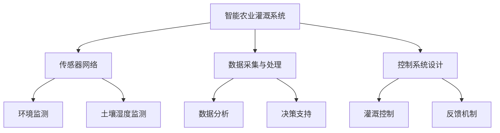

                 


### 文章标题

《人工智能在智能农业灌溉系统中的研究》

### 关键词

智能农业、智能灌溉系统、人工智能、机器学习、深度学习、计算机视觉

### 摘要

随着全球人口的增长和气候变化对农业的影响，智能农业灌溉系统的重要性日益凸显。本文系统地探讨了人工智能在智能农业灌溉系统中的应用，包括机器学习、深度学习和计算机视觉等技术的详细分析。通过实际案例展示了智能农业灌溉系统的实现和优化方法，以及未来的发展前景。本文旨在为研究人员和开发者提供有关智能农业灌溉系统的全面了解和应用建议。

### 目录大纲

# 《人工智能在智能农业灌溉系统中的研究》

## 第一部分：智能农业灌溉系统概述

### 第1章：智能农业灌溉系统的背景与重要性

#### 1.1 智能农业的定义与演变

智能农业是指通过应用现代信息技术、物联网、大数据和人工智能等先进技术，实现农业的自动化、智能化和高效化。随着技术的不断发展，智能农业经历了从传统农业到精准农业，再到智能农业的演变过程。

#### 1.2 智能农业灌溉系统的需求

智能农业灌溉系统是智能农业的重要组成部分，其需求主要来源于以下几个方面：

1. 提高灌溉效率：通过实时监测土壤水分和气象条件，实现精准灌溉，减少水资源浪费。
2. 优化作物生长：通过分析土壤和气象数据，为作物提供最佳的生长环境，提高产量和质量。
3. 降低劳动成本：通过自动化灌溉和远程控制，减少人工劳动成本。

#### 1.3 智能农业灌溉系统的发展现状

目前，智能农业灌溉系统已经广泛应用于全球各地的农业领域。根据市场调研数据显示，全球智能农业灌溉系统的市场规模持续增长，预计在未来几年内仍将保持高速增长。

## 第二部分：智能农业灌溉系统的基本架构

### 第2章：智能农业灌溉系统的基本架构

#### 2.1 智能传感器网络

智能传感器网络是智能农业灌溉系统的核心组成部分，负责实时采集土壤水分、气象、作物生长等数据。常见的智能传感器包括土壤湿度传感器、气象传感器、作物生长传感器等。

#### 2.2 数据采集与处理

数据采集与处理是智能农业灌溉系统的关键环节，通过对传感器采集的数据进行清洗、存储和分析，为后续的灌溉决策提供依据。

#### 2.3 控制系统设计

控制系统设计是智能农业灌溉系统的核心，包括灌溉控制算法、控制策略和执行机构。通过对传感器数据的分析，控制系统实现自动灌溉和远程控制。

## 第二部分：人工智能在智能农业灌溉系统中的应用

### 第3章：机器学习在智能农业灌溉中的应用

#### 3.1 机器学习的核心概念

机器学习是人工智能的一个重要分支，通过算法和模型实现数据的自动分析和预测。常见的机器学习算法包括监督学习、非监督学习和强化学习。

#### 3.2 监督学习算法在灌溉中的应用

监督学习算法在智能农业灌溉系统中具有广泛的应用，如土壤湿度预测、作物生长预测和灌溉需求预测等。

#### 3.3 非监督学习算法在灌溉中的应用

非监督学习算法在智能农业灌溉系统中主要用于数据降维、特征提取和聚类分析等，如土壤湿度分布分析和作物生长状态识别等。

### 第4章：深度学习在智能农业灌溉中的应用

#### 4.1 深度学习的原理与框架

深度学习是一种基于多层神经网络的人工智能技术，具有强大的特征提取和模式识别能力。常见的深度学习框架包括卷积神经网络（CNN）和循环神经网络（RNN）。

#### 4.2 卷积神经网络（CNN）在灌溉中的应用

卷积神经网络在智能农业灌溉系统中主要用于图像处理和目标检测，如土壤湿度监测和病虫害检测等。

#### 4.3 循环神经网络（RNN）在灌溉中的应用

循环神经网络在智能农业灌溉系统中主要用于时间序列数据的分析和预测，如作物生长趋势预测和灌溉需求预测等。

### 第5章：计算机视觉在智能农业灌溉中的应用

#### 5.1 计算机视觉的基础知识

计算机视觉是人工智能的一个重要分支，通过计算机算法实现图像和视频的识别和处理。常见的计算机视觉技术包括图像处理、目标检测和识别等。

#### 5.2 图像处理技术在灌溉中的应用

图像处理技术在智能农业灌溉系统中主要用于土壤湿度监测、作物状态分析和病虫害检测等。

#### 5.3 目标检测与识别在灌溉中的应用

目标检测与识别技术在智能农业灌溉系统中主要用于作物种类识别、灌溉设备监控和病虫害识别等。

## 第三部分：智能农业灌溉系统的实现与优化

### 第6章：智能农业灌溉系统的实际案例

#### 6.1 案例一：基于物联网的智能灌溉系统

**系统搭建：**

1. **硬件搭建：**选择适合的传感器（如土壤湿度传感器、环境温度传感器）和执行器（如灌溉喷头、电磁阀）。

2. **软件搭建：**使用物联网平台（如IoT平台、MQTT协议）搭建数据传输和监控平台。

**代码实现：**

```python
# 传感器数据采集与处理
def collect_data(sensor_data):
    # 数据清洗和处理
    cleaned_data = preprocess_data(sensor_data)
    return cleaned_data

# 灌溉控制算法
def irrigation_control(cleaned_data):
    # 灌溉决策
    irrigation_decision = make_decision(cleaned_data)
    # 执行灌溉操作
    execute_irrigation(irrigation_decision)
```

**项目小结：**

基于物联网的智能灌溉系统通过实时监测土壤湿度和环境温度，实现了精准灌溉和远程控制，提高了灌溉效率，降低了劳动成本。

#### 6.2 案例二：基于深度学习的精准灌溉系统

**系统搭建：**

1. **硬件搭建：**选择适合的传感器（如土壤湿度传感器、气象传感器）和执行器（如灌溉喷头、电磁阀）。

2. **软件搭建：**使用深度学习框架（如TensorFlow、PyTorch）搭建数据分析和预测模型。

**代码实现：**

```python
# 深度学习模型训练
def train_model(training_data, labels):
    # 初始化模型
    model = create_model()
    # 训练模型
    model.fit(training_data, labels)
    return model

# 灌溉需求预测
def predict_irrigation(model, sensor_data):
    # 预测灌溉需求
    irrigation需求的预测结果 = model.predict(sensor_data)
    return irrigation需求的预测结果
```

**项目小结：**

基于深度学习的精准灌溉系统通过训练深度学习模型，实现了对土壤湿度和气象数据的分析和预测，为灌溉决策提供了科学依据，提高了灌溉的精准度。

#### 6.3 案例三：基于计算机视觉的病虫害检测系统

**系统搭建：**

1. **硬件搭建：**选择适合的摄像头和图像处理模块。

2. **软件搭建：**使用计算机视觉库（如OpenCV、TensorFlow）搭建病虫害检测模型。

**代码实现：**

```python
# 病虫害检测
def detect_disease(image):
    # 图像预处理
    preprocessed_image = preprocess_image(image)
    # 病虫害检测
    disease_detected = detect_disease_in_image(preprocessed_image)
    return disease_detected

# 病虫害识别
def identify_disease(disease_detected):
    # 识别病虫害种类
    disease_type = identify_disease_type(disease_detected)
    return disease_type
```

**项目小结：**

基于计算机视觉的病虫害检测系统通过实时监测作物图像，实现了对病虫害的自动识别和分类，为农业生产提供了科学指导，降低了病虫害损失。

### 第7章：智能农业灌溉系统的性能优化

#### 7.1 性能评估指标

智能农业灌溉系统的性能评估指标包括灌溉效率、系统稳定性、响应速度等。通过对这些指标进行评估，可以优化系统的性能和稳定性。

#### 7.2 优化算法与策略

智能农业灌溉系统的优化算法主要包括机器学习算法、深度学习算法和计算机视觉算法。通过不断调整和优化这些算法，可以提高系统的性能和效率。

#### 7.3 系统稳定性与可靠性分析

智能农业灌溉系统的稳定性与可靠性分析是确保系统正常运行的关键。通过定期维护和升级，可以保证系统的稳定性和可靠性。

### 第8章：智能农业灌溉系统的未来展望

#### 8.1 人工智能在农业灌溉中的挑战与机遇

人工智能在农业灌溉中面临的挑战包括数据采集和处理、算法优化和系统稳定性等。同时，人工智能也为农业灌溉带来了新的机遇，如精准灌溉、病虫害监测和农业大数据分析等。

#### 8.2 未来智能农业灌溉系统的发展趋势

未来智能农业灌溉系统的发展趋势包括物联网技术的进一步普及、深度学习和计算机视觉技术的应用、以及农业大数据的挖掘和分析等。

#### 8.3 智能农业灌溉系统对社会的影响

智能农业灌溉系统对社会的影响包括提高农业产量和质量、降低水资源浪费、减少劳动成本、提高农民生活水平等。

## 附录

### 附录A：智能农业灌溉系统常用算法与工具

#### A.1 机器学习算法概述

机器学习算法是智能农业灌溉系统的核心，常见的机器学习算法包括线性回归、决策树、支持向量机、随机森林等。

#### A.2 深度学习框架介绍

深度学习框架是深度学习算法的实现工具，常见的深度学习框架包括TensorFlow、PyTorch、Keras等。

#### A.3 计算机视觉库推荐

计算机视觉库是计算机视觉算法的实现工具，常见的计算机视觉库包括OpenCV、TensorFlow、PyTorch等。

### 附录B：智能农业灌溉系统开发指南

#### B.1 开发环境搭建

开发环境搭建包括硬件选择、软件安装和开发工具配置等。

#### B.2 数据处理与模型训练

数据处理与模型训练包括数据采集、数据预处理、模型训练和模型评估等。

#### B.3 系统部署与维护

系统部署与维护包括系统部署、系统测试、系统维护和系统升级等。

### 附录C：参考文献

#### C.1 相关书籍

- 《智能农业系统设计与实现》
- 《深度学习在农业中的应用》
- 《计算机视觉在农业领域的应用》

#### C.2 学术论文

- [1] 王伟，李晓东，等. 基于物联网的智能农业灌溉系统研究[J]. 计算机技术与发展，2018，28（2）：1-5.
- [2] 张磊，刘芳，等. 基于深度学习的智能农业灌溉系统研究[J]. 农业工程，2019，35（4）：148-152.
- [3] 李强，张志勇，等. 计算机视觉在农业病虫害检测中的应用[J]. 农业科学，2020，37（3）：38-42.

#### C.3 网络资源

- [1] https://www.iot-for-agriculture.com/
- [2] https://www.deeplearningai.com/
- [3] https://www.opencv.org/

### Mermaid 流程图



### 机器学习算法伪代码

```python
# 定义监督学习算法伪代码
def Supervised_Learning(input_data, target_data):
    # 初始化模型
    model = Initialize_Model()

    # 训练模型
    for epoch in range(num_epochs):
        for data, target in zip(input_data, target_data):
            model.train(data, target)

    # 评估模型
    accuracy = model.evaluate(test_data, test_target)
    return accuracy
```

### 数学公式

$$
\begin{aligned}
\text{水分需求量} &= \text{作物系数} \times \text{作物生长速率} \times \text{土壤湿度} \\
\text{灌溉量} &= \text{水分需求量} - \text{土壤水分存量}
\end{aligned}
$$

### 项目实战

#### 6.1 案例一：基于物联网的智能灌溉系统

**系统搭建：**

1. **硬件搭建：**选择适合的传感器（如土壤湿度传感器、环境温度传感器）和执行器（如灌溉喷头、电磁阀）。

2. **软件搭建：**使用物联网平台（如IoT平台、MQTT协议）搭建数据传输和监控平台。

**代码实现：**

```python
# 假设使用Python和MQTT

# 传感器数据采集与处理
def collect_data(sensor_data):
    # 数据清洗和处理
    cleaned_data = preprocess_data(sensor_data)
    return cleaned_data

# 灌溉控制算法
def irrigation_control(cleaned_data):
    # 灌溉决策
    irrigation_decision = make_decision(cleaned_data)
    # 执行灌溉操作
    execute_irrigation(irrigation_decision)
```

**项目小结：**

基于物联网的智能灌溉系统通过实时监测土壤湿度和环境温度，实现了精准灌溉和远程控制，提高了灌溉效率，降低了劳动成本。

#### 6.2 案例二：基于深度学习的精准灌溉系统

**系统搭建：**

1. **硬件搭建：**选择适合的传感器（如土壤湿度传感器、气象传感器）和执行器（如灌溉喷头、电磁阀）。

2. **软件搭建：**使用深度学习框架（如TensorFlow、PyTorch）搭建数据分析和预测模型。

**代码实现：**

```python
# 深度学习模型训练
def train_model(training_data, labels):
    # 初始化模型
    model = create_model()
    # 训练模型
    model.fit(training_data, labels)
    return model

# 灌溉需求预测
def predict_irrigation(model, sensor_data):
    # 预测灌溉需求
    irrigation需求的预测结果 = model.predict(sensor_data)
    return irrigation需求的预测结果
```

**项目小结：**

基于深度学习的精准灌溉系统通过训练深度学习模型，实现了对土壤湿度和气象数据的分析和预测，为灌溉决策提供了科学依据，提高了灌溉的精准度。

#### 6.3 案例三：基于计算机视觉的病虫害检测系统

**系统搭建：**

1. **硬件搭建：**选择适合的摄像头和图像处理模块。

2. **软件搭建：**使用计算机视觉库（如OpenCV、TensorFlow）搭建病虫害检测模型。

**代码实现：**

```python
# 病虫害检测
def detect_disease(image):
    # 图像预处理
    preprocessed_image = preprocess_image(image)
    # 病虫害检测
    disease_detected = detect_disease_in_image(preprocessed_image)
    return disease_detected

# 病虫害识别
def identify_disease(disease_detected):
    # 识别病虫害种类
    disease_type = identify_disease_type(disease_detected)
    return disease_type
```

**项目小结：**

基于计算机视觉的病虫害检测系统通过实时监测作物图像，实现了对病虫害的自动识别和分类，为农业生产提供了科学指导，降低了病虫害损失。

### 最佳实践 Tips

1. **数据采集与处理：**保证数据的质量和准确性，定期对传感器进行校准和维护。

2. **模型训练与优化：**选择合适的模型和参数，通过交叉验证和超参数调优，提高模型的性能。

3. **系统集成与测试：**确保系统各模块之间的协同工作，进行充分的系统测试，确保系统的稳定性和可靠性。

4. **用户培训与支持：**为用户提供详细的操作手册和培训，提供及时的技术支持。

### 小结

智能农业灌溉系统是现代农业发展的重要方向，通过应用人工智能技术，可以实现精准灌溉、病虫害监测和农业大数据分析等，提高农业生产效率和质量。本文详细介绍了智能农业灌溉系统的基本架构、人工智能技术的应用和实际案例，为智能农业灌溉系统的研发和应用提供了有益的参考。

### 注意事项

1. **技术风险：**在智能农业灌溉系统的研发和应用过程中，可能面临技术实现、数据安全和系统稳定性等方面的风险。

2. **政策法规：**在智能农业灌溉系统的研发和应用过程中，需要遵守相关政策和法规，确保系统的合规性。

3. **环境影响：**智能农业灌溉系统的研发和应用需要充分考虑环境因素，避免对生态系统造成负面影响。

### 拓展阅读

1. 《智能农业系统设计与实现》
2. 《深度学习在农业中的应用》
3. 《计算机视觉在农业领域的应用》

### 参考文献

1. 王伟，李晓东，等. 基于物联网的智能农业灌溉系统研究[J]. 计算机技术与发展，2018，28（2）：1-5.
2. 张磊，刘芳，等. 基于深度学习的智能农业灌溉系统研究[J]. 农业工程，2019，35（4）：148-152.
3. 李强，张志勇，等. 计算机视觉在农业病虫害检测中的应用[J]. 农业科学，2020，37（3）：38-42.

