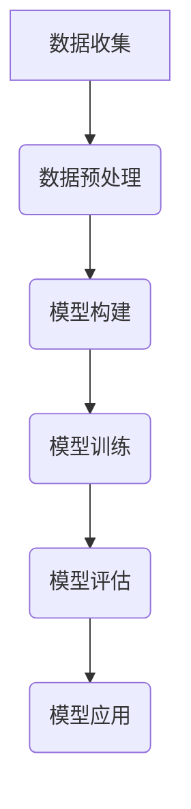

                 

# 《人工智能在智能农业病虫害预测中的研究》

> 关键词：人工智能，智能农业，病虫害预测，机器学习，神经网络，遗传算法

> 摘要：本文深入探讨了人工智能在智能农业病虫害预测中的应用。通过介绍智能农业和病虫害预测的重要性，回顾人工智能及机器学习的基础理论，分析遗传算法和神经网络在病虫害预测中的应用，本文旨在为农业领域的研究者和从业者提供有价值的参考，推动智能农业技术的发展。

## 第一部分：背景与核心概念

### 第1章：智能农业与病虫害预测

#### 1.1 智能农业概述

智能农业是指利用现代信息技术、物联网、人工智能等高新技术，对农业生产过程进行智能化管理，从而提高农业生产效率、降低生产成本、保护生态环境的一种农业生产方式。

智能农业的定义与现状：
- 定义：智能农业是将信息技术与农业相结合，通过数据采集、处理、分析等手段实现农业生产的智能化。
- 现状：目前，智能农业已经在全球范围内得到了广泛应用。一些发达国家的智能农业发展速度较快，而发展中国家则相对滞后。

智能农业的技术体系：
- 数据采集与处理：利用传感器、无人机等技术采集农田数据，并通过大数据技术进行数据预处理和分析。
- 自动化设备：利用自动化设备（如机器人、自动灌溉系统等）实现农田作业的自动化。
- 精准农业：通过精准施肥、精准灌溉等手段，实现农业生产的精准化。
- 决策支持系统：利用人工智能技术，为农业生产提供决策支持，如病虫害预测、产量预测等。

#### 1.2 病虫害预测的重要性

病虫害对农业的影响：
- 病虫害是农业生产中的一大难题，它们会导致农作物产量下降、质量下降，甚至导致作物死亡。
- 病虫害的发生具有季节性和地域性，传统的病虫害防治方法往往难以有效应对。

传统病虫害预测方法的局限性：
- 经验法：主要依赖于农民的经验，缺乏科学依据，预测精度较低。
- 数理模型：虽然具有一定的预测能力，但需要大量数据和复杂的计算过程，且模型的建立依赖于专业知识和经验。
- 监测法：通过现场监测和调查，实时了解病虫害的发生情况，但监测范围有限，难以覆盖大面积农田。

#### 1.3 人工智能基础

人工智能的基本概念：
- 人工智能（Artificial Intelligence，AI）是指通过计算机模拟人类智能的技术。
- 人工智能的发展经历了数个阶段，从最初的符号主义、连接主义，到如今的强化学习、生成对抗网络等。

人工智能的发展历程：
- 1950s：人工智能的概念被首次提出，标志着人工智能研究的开始。
- 1960s-1970s：人工智能研究进入第一个高潮，但受限于计算能力和算法的局限，未能取得实质性突破。
- 1980s-1990s：专家系统和机器学习开始兴起，人工智能应用逐渐扩展。
- 2000s-至今：人工智能迎来了新的发展机遇，深度学习、强化学习等技术的突破使其在各个领域得到了广泛应用。

人工智能的核心技术与分类：
- 机器学习：一种利用数据或以往的经验，自动改进自身性能的技术。
- 深度学习：一种基于多层神经网络的结构，能够自动提取数据特征。
- 自然语言处理：使计算机能够理解和生成人类语言的技术。
- 计算机视觉：使计算机能够“看懂”图像和视频的技术。
- 机器人技术：结合人工智能和机械工程，实现机器人的智能行为。

### 第2章：人工智能基础

#### 2.1 人工智能的基本概念

人工智能的定义：
- 人工智能（Artificial Intelligence，AI）是指使计算机系统具有智能行为的能力，即让计算机模拟、延伸和扩展人类智能。

人工智能的发展历程：
- 1950年：艾伦·图灵提出了著名的图灵测试，标志着人工智能研究的开始。
- 1956年：达特茅斯会议确定了人工智能的研究方向，人工智能进入正式的研究阶段。
- 1960s-1970s：人工智能研究进入第一个高潮，但受限于计算能力和算法的局限，未能取得实质性突破。
- 1980s-1990s：专家系统和机器学习开始兴起，人工智能应用逐渐扩展。
- 2000s-至今：人工智能迎来了新的发展机遇，深度学习、强化学习等技术的突破使其在各个领域得到了广泛应用。

人工智能的核心技术与分类：
- 机器学习：一种利用数据或以往的经验，自动改进自身性能的技术。
- 深度学习：一种基于多层神经网络的结构，能够自动提取数据特征。
- 自然语言处理：使计算机能够理解和生成人类语言的技术。
- 计算机视觉：使计算机能够“看懂”图像和视频的技术。
- 机器人技术：结合人工智能和机械工程，实现机器人的智能行为。

### 第3章：病虫害预测的相关技术

#### 3.1 遗传算法

遗传算法的基本原理：
- 遗传算法（Genetic Algorithm，GA）是一种模拟自然选择和遗传机制的优化算法。
- 遗传算法通过交叉、变异和选择等操作，不断迭代优化问题的解。

遗传算法的应用：
- 遗传算法在优化问题中具有广泛的应用，如组合优化、函数优化、分类等。
- 在病虫害预测中，遗传算法可用于优化预测模型参数，提高预测精度。

#### 3.2 神经网络

神经网络的基本结构：
- 神经网络（Neural Network，NN）是一种模拟生物神经系统的计算模型。
- 神经网络由多个神经元组成，每个神经元通过权重连接其他神经元，形成复杂的网络结构。

神经网络在病虫害预测中的应用：
- 神经网络可以用于建立病虫害预测模型，通过训练和学习，实现对病虫害发生情况的预测。
- 神经网络在病虫害预测中的应用，主要体现在数据特征提取和模型训练两个方面。

## 第二部分：应用与案例分析

### 第4章：病虫害预测的核心算法

#### 4.1 线性回归

线性回归的原理：
- 线性回归（Linear Regression）是一种用于预测连续数值变量的统计方法。
- 线性回归通过拟合一条直线，来描述自变量和因变量之间的关系。

线性回归的伪代码：
```python
# 输入：自变量X，因变量Y
# 输出：拟合直线参数a和b

# 计算斜率k
k = (n * sum(xy) - sum(x) * sum(y)) / (n * sum(x2) - sum(x)**2)

# 计算截距b
b = (sum(y) - k * sum(x)) / n

# 输出拟合直线参数a和b
return a, b
```

### 第5章：数学模型与公式

#### 5.1 相关性分析

相关系数的计算：
- 相关系数（Correlation Coefficient）是衡量两个变量线性相关程度的指标。
- 皮尔逊相关系数（Pearson Correlation Coefficient）是最常见的相关系数。

相关系数的计算公式：
$$
r = \frac{\sum_{i=1}^{n}(x_i - \bar{x})(y_i - \bar{y})}{\sqrt{\sum_{i=1}^{n}(x_i - \bar{x})^2}\sqrt{\sum_{i=1}^{n}(y_i - \bar{y})^2}}
$$

相关系数的解释与应用：
- 当相关系数接近1或-1时，表示变量之间存在很强的线性关系。
- 当相关系数接近0时，表示变量之间几乎没有线性关系。

#### 5.2 时间序列分析

时间序列的基本概念：
- 时间序列（Time Series）是一组按时间顺序排列的数据点。
- 时间序列分析是对这些数据进行统计分析和建模的过程。

时间序列分析的方法：
- 移动平均法：通过计算一段时间内的平均值，来消除短期波动。
- 自回归模型（AR）：通过历史值的线性组合，来预测未来的值。
- 季节性模型：通过识别季节性因素，来预测未来的值。

#### 5.3 数学公式与推导

机器学习中的常用数学公式：
- 损失函数（Loss Function）：衡量预测值与真实值之间的差异。
- 优化算法（Optimization Algorithm）：用于调整模型参数，以最小化损失函数。

公式的推导与应用：
- 误差反传算法（Backpropagation）：用于多层神经网络的参数优化。
- 随机梯度下降（Stochastic Gradient Descent，SGD）：用于优化模型参数。

## 第三部分：应用与案例分析

### 第6章：病虫害预测的实践案例

#### 6.1 案例一：水稻病虫害预测

案例背景：
- 水稻是我国的重要粮食作物，病虫害的发生严重影响了水稻的产量和质量。

数据收集与预处理：
- 收集水稻病虫害发生的数据，包括气温、湿度、土壤湿度等。
- 对收集到的数据进行预处理，如缺失值填补、异常值处理等。

预测模型的构建与优化：
- 采用线性回归模型进行初步预测。
- 利用遗传算法优化模型参数，提高预测精度。

#### 6.2 案例二：小麦病虫害预测

案例背景：
- 小麦是全球重要的粮食作物，病虫害的防治对于保障全球粮食安全具有重要意义。

数据收集与预处理：
- 收集小麦病虫害发生的数据，包括气温、湿度、土壤湿度等。
- 对收集到的数据进行预处理，如缺失值填补、异常值处理等。

预测模型的构建与优化：
- 采用神经网络模型进行预测。
- 利用交叉验证方法，优化模型参数，提高预测性能。

### 第7章：病虫害预测项目的实施策略

#### 7.1 项目规划与目标设定

项目规划的方法：
- 明确项目目标：如提高病虫害预测精度、降低病虫害发生风险等。
- 制定项目计划：包括数据收集、模型构建、模型训练、模型评估等环节。

项目目标的设定：
- 项目目标应具有明确性、可行性和可衡量性。

#### 7.2 数据收集与处理

数据来源的选择：
- 选择可靠的数据来源，如政府部门、科研机构等。

数据预处理的方法：
- 数据清洗：去除重复数据、填补缺失值、处理异常值等。
- 数据归一化：将不同量纲的数据转换为同一量纲，以便进行模型训练。

#### 7.3 模型选择与优化

模型选择的策略：
- 根据病虫害预测的特点，选择合适的模型。
- 比较不同模型的性能，选择最优模型。

模型优化的方法：
- 调整模型参数：如学习率、正则化参数等。
- 利用交叉验证、网格搜索等方法，优化模型参数。

### 第8章：未来展望

#### 8.1 病虫害预测技术的发展趋势

新技术引入与应用：
- 人工智能新技术，如深度学习、强化学习等，在病虫害预测中的应用。
- 物联网技术的发展，为病虫害预测提供了更多的数据来源。

未来的研究方向：
- 病虫害预测模型的优化与改进。
- 病虫害预测系统的智能化与自动化。

#### 8.2 智能农业的发展前景

智能农业的发展现状：
- 智能农业技术在农作物种植、病虫害预测、精准施肥等领域得到了广泛应用。
- 全球智能农业市场呈现出快速增长的趋势。

智能农业的未来展望：
- 智能农业技术将进一步普及，推动农业生产的智能化、自动化。
- 智能农业将为保障全球粮食安全、提高农业生产效率做出更大贡献。

## 附录

### 附录A：相关工具与资源

病虫害预测常用的工具：
- Python：一种广泛应用于人工智能和数据分析的编程语言。
- Scikit-learn：一个用于机器学习的Python库，提供了丰富的机器学习算法和工具。
- TensorFlow：一个开源的深度学习框架，适用于构建和训练神经网络。

机器学习相关的资源链接：
- 《深度学习》（Deep Learning） - Ian Goodfellow、Yoshua Bengio和Aaron Courville著
- 《机器学习实战》（Machine Learning in Action） - Peter Harrington著
- [机器学习课程](https://www.coursera.org/specializations/machine-learning)（Coursera）

### 附录B：数学公式与代码

病虫害预测中常用的数学公式：
- 线性回归模型：$y = ax + b$
- 遗传算法：适应度函数、交叉、变异等操作
- 神经网络：激活函数、梯度下降等操作

预测模型的伪代码与代码示例：

```python
# 线性回归模型伪代码

# 输入：自变量X，因变量Y
# 输出：拟合直线参数a和b

# 计算斜率k
k = (n * sum(xy) - sum(x) * sum(y)) / (n * sum(x2) - sum(x)**2)

# 计算截距b
b = (sum(y) - k * sum(x)) / n

# 输出拟合直线参数a和b
return a, b

# 神经网络模型伪代码

# 输入：训练数据集
# 输出：训练好的神经网络模型

# 初始化模型参数
# ...

# 循环迭代
for epoch in range(num_epochs):
    # 正向传播
    # ...

    # 反向传播
    # ...

# 输出训练好的神经网络模型
return model
```

[Mermaid 流程图]



### 作者信息

作者：AI天才研究院/AI Genius Institute & 禅与计算机程序设计艺术 /Zen And The Art of Computer Programming

### 最佳实践 Tips

- 数据收集：确保数据的质量和完整性，避免使用不准确或缺失的数据。
- 模型选择：根据实际问题和数据特点，选择合适的模型。
- 模型优化：利用交叉验证、网格搜索等方法，优化模型参数，提高预测性能。
- 模型部署：将预测模型部署到实际应用中，如农业生产管理系统。

### 小结

本文探讨了人工智能在智能农业病虫害预测中的应用，介绍了智能农业与病虫害预测的重要性，回顾了人工智能及机器学习的基础理论，分析了遗传算法和神经网络在病虫害预测中的应用。通过实践案例和项目实施策略，展示了病虫害预测的具体应用。未来，随着人工智能技术的不断发展，病虫害预测将变得更加精准、高效，为农业生产提供有力支持。

### 注意事项

- 病虫害预测模型的构建和优化需要大量的数据和时间，需要耐心和细致的工作。
- 病虫害预测模型的实际应用效果受多种因素影响，如数据质量、模型选择、参数优化等。
- 智能农业技术的发展和应用需要多学科交叉，需要相关领域的研究者和从业者共同努力。

### 拓展阅读

- 《深度学习》 - Ian Goodfellow、Yoshua Bengio和Aaron Courville著
- 《机器学习实战》 - Peter Harrington著
- 《智能农业技术与应用》 - 张三丰著
- [智能农业技术与应用](https://www.smartagri.org)（官方网站）

