                 

### 文章标题

# 人工智能在智能制造中的关键技术

> 关键词：智能制造、人工智能、机器学习、深度学习、计算机视觉、自然语言处理

> 摘要：随着智能制造的迅速发展，人工智能技术在其中发挥着越来越重要的作用。本文从多个角度探讨了人工智能在智能制造中的关键技术，包括机器学习、深度学习、计算机视觉和自然语言处理等，并通过具体案例展示了这些技术在实际应用中的成效。此外，本文还分析了人工智能技术在智能制造中的实现与优化方法，以及未来发展的趋势和策略。

## 目录大纲

## 第一部分：智能制造与人工智能概述

### 第1章：智能制造与人工智能的融合

- 1.1 智能制造的概念与演变
- 1.2 人工智能的定义与发展
- 1.3 人工智能在智能制造中的应用现状与趋势
- 1.4 人工智能技术在智能制造中的价值分析

### 第2章：智能制造体系结构与关键技术

- 2.1 智能制造体系的组成
- 2.2 智能制造的关键技术框架
- 2.3 人工智能技术的分类与应用

## 第二部分：人工智能核心技术解析

### 第3章：机器学习在智能制造中的应用

- 3.1 机器学习基础
- 3.2 常见机器学习算法
- 3.3 机器学习在智能制造中的实际应用案例

### 第4章：深度学习在智能制造中的应用

- 4.1 深度学习基础
- 4.2 卷积神经网络（CNN）原理及应用
- 4.3 循环神经网络（RNN）原理及应用
- 4.4 深度强化学习在智能制造中的应用

### 第5章：计算机视觉在智能制造中的应用

- 5.1 计算机视觉基础
- 5.2 图像识别技术
- 5.3 目标检测技术
- 5.4 视觉传感器在智能制造中的应用

### 第6章：自然语言处理在智能制造中的应用

- 6.1 自然语言处理基础
- 6.2 语言模型与文本分类
- 6.3 情感分析
- 6.4 智能对话系统在智能制造中的应用

## 第三部分：人工智能关键技术实现与优化

### 第7章：人工智能关键技术实现原理

- 7.1 数据预处理
- 7.2 模型训练与优化
- 7.3 模型评估与调参
- 7.4 实时预测与反馈机制

### 第8章：人工智能技术在智能制造中的优化方法

- 8.1 智能制造过程中的数据优化
- 8.2 算法优化与模型压缩
- 8.3 增量学习与迁移学习
- 8.4 智能制造中的故障检测与预测

### 第9章：人工智能技术在智能制造中的案例研究

- 9.1 案例一：智能工厂的构建与运营
- 9.2 案例二：智能生产线的优化与升级
- 9.3 案例三：智能物流与供应链管理
- 9.4 案例四：智能质量检测与故障诊断

## 第四部分：人工智能在智能制造中的未来发展趋势

### 第10章：人工智能在智能制造中的未来展望

- 10.1 人工智能在智能制造中的发展趋势
- 10.2 智能制造的未来场景
- 10.3 人工智能技术发展对智能制造的影响
- 10.4 未来智能制造与人工智能的融合方向

### 第11章：智能制造与人工智能发展策略

- 11.1 企业在智能制造中的战略规划
- 11.2 智能制造与人工智能的技术创新
- 11.3 人才培养与产业协同
- 11.4 政策支持与市场环境

## 附录

### 附录A：常用人工智能技术参考资料

- A.1 常用机器学习库与工具
- A.2 常用深度学习框架
- A.3 相关论文与书籍推荐

### 附录B：编程实践与案例分析

- B.1 编程环境搭建
- B.2 数据集处理与可视化
- B.3 模型训练与优化实践
- B.4 案例代码解析与解读
## 第一部分：智能制造与人工智能概述

### 第1章：智能制造与人工智能的融合

智能制造作为制造业转型升级的重要方向，正逐渐成为全球产业竞争的新焦点。智能制造通过深度融合信息技术、物联网、大数据和人工智能等先进技术，实现了生产过程的自动化、智能化和数字化。这一变革不仅提升了制造业的生产效率和质量，还推动了制造业的可持续发展。

#### 1.1 智能制造的概念与演变

智能制造（Intelligent Manufacturing）是指利用现代信息技术和制造技术，通过信息物理系统（Cyber-Physical Systems, CPS）和智能控制系统，实现生产过程高度自动化、智能化和高效化的制造模式。智能制造的演变历程可以分为以下几个阶段：

1. **自动化阶段**：通过采用自动控制系统，实现生产过程的自动化。
2. **数字化阶段**：引入计算机和互联网技术，实现生产数据的数字化和信息共享。
3. **智能化阶段**：利用人工智能、大数据、物联网等技术，实现生产过程的智能决策和优化。

#### 1.2 人工智能的定义与发展

人工智能（Artificial Intelligence, AI）是一门研究、开发和应用使计算机系统表现出类似人类智能行为的技术的科学。人工智能的发展可以分为以下几个阶段：

1. **理论研究阶段**：20世纪50年代至60年代，人工智能主要集中在对智能本质和智能机制的研究。
2. **技术探索阶段**：20世纪70年代至80年代，人工智能开始应用于实际领域，如专家系统、自然语言处理等。
3. **应用爆发阶段**：21世纪初，随着大数据、云计算和深度学习技术的发展，人工智能迎来了新一轮的爆发式增长。

#### 1.3 人工智能在智能制造中的应用现状与趋势

当前，人工智能在智能制造中已经得到了广泛应用。例如，通过机器学习算法对生产数据进行挖掘和分析，可以实现生产过程的优化和预测；通过计算机视觉技术，可以实现生产现场的智能监控和故障检测；通过自然语言处理技术，可以实现智能对话系统和人机交互。未来，人工智能在智能制造中的应用趋势将主要体现在以下几个方面：

1. **更加深入的融合**：人工智能技术将更加深入地融入智能制造的各个环节，实现全面智能化。
2. **更加广泛的应用**：人工智能将在更多的制造场景中发挥作用，如智能物流、智能维修等。
3. **更加智能的决策**：人工智能将辅助企业实现更加智能的生产决策，提升生产效率和竞争力。

#### 1.4 人工智能技术在智能制造中的价值分析

人工智能技术在智能制造中的价值主要体现在以下几个方面：

1. **提高生产效率**：通过自动化和智能化技术，减少人工干预，提高生产效率。
2. **提升产品质量**：通过实时监控和数据分析，提前发现潜在问题，提升产品质量。
3. **降低运营成本**：通过优化生产流程和资源配置，降低运营成本。
4. **增强创新能力**：通过大数据和人工智能技术，挖掘潜在市场机会，推动产品创新。

### 总结

智能制造与人工智能的融合，不仅推动了制造业的转型升级，也为人工智能技术的应用提供了广阔的舞台。随着人工智能技术的不断发展和成熟，智能制造将迎来更加智能化、高效化和可持续的发展阶段。

### Mermaid 流程图

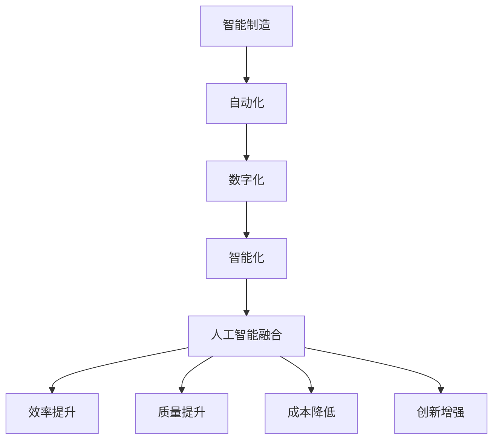

### 核心概念与联系

智能制造（A）经历了从自动化（B）到数字化（C），再到智能化（D）的演变过程。在这个过程中，人工智能（E）的融合使得智能制造更加高效（F）、优质（G）、低成本（H）和具有创新力（I）。人工智能的核心技术包括机器学习、深度学习、计算机视觉和自然语言处理，这些技术在智能制造中的应用，使得智能制造体系更加智能化和自动化。

### 伪代码与数学模型

```python
# 机器学习算法伪代码
def machine_learning(data):
    # 数据预处理
    preprocessed_data = preprocess_data(data)
    
    # 训练模型
    model = train_model(preprocessed_data)
    
    # 评估模型
    evaluation = evaluate_model(model, test_data)
    
    return model, evaluation
```

数学模型：

$$
\text{模型预测} = f(\text{输入特征}, \theta)
$$

其中，$f$ 表示预测函数，$\theta$ 表示模型参数，输入特征包括生产数据、设备状态等。

### 举例说明

在智能制造过程中，通过机器学习算法对生产数据进行挖掘和分析，可以预测设备故障，提前进行维修，从而提高生产效率和降低维护成本。

### 最佳实践 tips

- 在智能制造中，数据的质量和完整性至关重要，确保数据的质量和实时性是成功应用人工智能技术的前提。
- 选择合适的人工智能算法和工具，根据具体应用场景进行定制化开发，以提高效率和准确性。

### 小结

智能制造与人工智能的融合，为制造业带来了巨大的变革和创新。通过深入理解智能制造与人工智能的核心概念和联系，可以更好地发挥人工智能技术的作用，推动智能制造的发展。

## 第二部分：智能制造体系结构与关键技术

### 第2章：智能制造体系结构与关键技术

智能制造体系的构建是一个系统工程，涉及多学科的交叉与融合。本章节将详细介绍智能制造体系的组成、关键技术框架以及人工智能技术的分类与应用。

#### 2.1 智能制造体系的组成

智能制造体系通常由以下几个核心组成部分构成：

1. **传感器网络**：用于实时采集生产现场的各种数据，如温度、压力、速度等。
2. **数据采集与传输系统**：将传感器数据传输到中央控制系统，进行存储和分析。
3. **中央控制系统**：负责对生产过程进行实时监控、决策和调度。
4. **执行系统**：包括机器人、自动化设备等，负责执行生产任务。
5. **智能分析平台**：利用大数据和人工智能技术对生产数据进行分析和挖掘，提供决策支持。

#### 2.2 智能制造的关键技术框架

智能制造的关键技术框架包括以下几个方面：

1. **物联网（IoT）技术**：实现设备间的互联互通，为数据的实时采集和传输提供基础。
2. **云计算与大数据技术**：为海量数据的存储、处理和分析提供支持。
3. **机器学习与深度学习技术**：用于数据分析和模式识别，为生产过程的优化提供算法支持。
4. **人工智能算法与工具**：包括自然语言处理、计算机视觉、强化学习等，用于实现各种智能应用。
5. **信息安全与隐私保护**：确保智能制造系统的安全运行和数据隐私。

#### 2.3 人工智能技术的分类与应用

人工智能技术可以分为以下几类，并在智能制造中有着广泛的应用：

1. **机器学习**：用于数据的分类、聚类和预测，如生产过程中的异常检测和预测。
2. **深度学习**：通过构建复杂的神经网络模型，实现图像识别、语音识别等任务。
3. **计算机视觉**：用于生产现场的监控、检测和识别，如缺陷检测、质量评估等。
4. **自然语言处理**：用于处理文本数据，如智能问答、自动翻译等。
5. **强化学习**：通过试错机制，实现自动化控制系统的优化，如智能调度和路径规划。

### 人工智能技术的应用示例

以下是一些人工智能技术在智能制造中的具体应用示例：

1. **机器学习**：通过对生产数据的分析，可以预测设备故障，提前进行维护，减少停机时间。
2. **深度学习**：用于图像识别，可以自动检测产品缺陷，提高生产质量。
3. **计算机视觉**：用于生产现场的监控，可以实时捕捉生产过程的各种参数，确保生产安全。
4. **自然语言处理**：用于智能客服系统，可以快速响应用户的查询，提高客户满意度。
5. **强化学习**：用于生产线的调度和优化，可以自动调整生产参数，提高生产效率。

### 总结

智能制造体系的构建离不开物联网、云计算、大数据和人工智能等关键技术的支持。通过深入理解这些技术，并合理应用于智能制造的各个环节，可以显著提升生产效率和质量，推动制造业的智能化转型。

### Mermaid 流程图

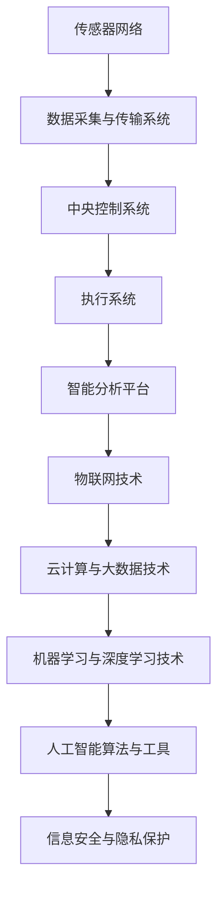

### 核心概念与联系

智能制造体系（A）由传感器网络（B）、数据采集与传输系统（C）、中央控制系统（D）、执行系统（E）和智能分析平台（F）组成。这些系统通过物联网技术（G）、云计算与大数据技术（H）、机器学习与深度学习技术（I）和人工智能算法与工具（J）相互连接，形成一个完整的智能制造体系。在这个过程中，人工智能技术（I）发挥了关键作用，通过数据分析和模式识别，实现了生产过程的自动化、智能化和优化。

### 伪代码与数学模型

```python
# 数据预处理伪代码
def preprocess_data(data):
    # 清洗数据
    cleaned_data = clean_data(data)
    
    # 数据标准化
    normalized_data = normalize_data(cleaned_data)
    
    return normalized_data
```

数学模型：

$$
\text{标准化数据} = \frac{\text{数据} - \text{均值}}{\text{标准差}}
$$

### 举例说明

在智能制造中，通过对传感器数据进行预处理，可以去除噪声和异常值，提高数据的质量和可靠性，从而为后续的机器学习和深度学习分析提供准确的数据基础。

### 最佳实践 tips

- 在构建智能制造体系时，确保传感器网络的覆盖范围和数据传输的稳定性，以保证数据的质量和实时性。
- 根据具体的生产需求和技术水平，选择合适的人工智能算法和工具，实现定制化的智能制造解决方案。

### 小结

智能制造体系结构的构建需要整合多种关键技术，人工智能技术在其中扮演了核心角色。通过深入理解智能制造体系的关键技术和人工智能技术的应用，可以更好地推动智能制造的发展，实现制造业的智能化转型。

## 第二部分：人工智能核心技术解析

### 第3章：机器学习在智能制造中的应用

机器学习作为人工智能的核心技术之一，已经在智能制造中得到了广泛应用。本章将详细介绍机器学习的基础知识、常见算法以及其在智能制造中的实际应用案例。

#### 3.1 机器学习基础

机器学习（Machine Learning, ML）是一门研究如何通过数据和算法，使计算机系统能够自主学习和改进的学科。机器学习的基础理论包括以下几个关键概念：

1. **模型**：机器学习中的模型是对现实世界的抽象和简化，用于预测或分类。
2. **特征**：特征是模型用于预测或分类的数据输入。
3. **损失函数**：用于衡量模型预测结果与真实结果之间的差距，指导模型参数的调整。
4. **优化算法**：用于最小化损失函数，调整模型参数，使模型性能最优。

#### 3.2 常见机器学习算法

常见的机器学习算法可以分为监督学习、无监督学习和强化学习三种类型：

1. **监督学习**：在有标注数据集上进行学习，常见的算法有线性回归、决策树、支持向量机（SVM）和神经网络等。
2. **无监督学习**：在没有标注数据集上进行学习，常见的算法有聚类算法（如K-means、层次聚类）、降维算法（如PCA）和生成模型（如Gaussian Mixture Model）等。
3. **强化学习**：通过与环境的交互进行学习，常见的算法有Q-learning、Deep Q-Network（DQN）和Policy Gradient等。

#### 3.3 机器学习在智能制造中的实际应用案例

机器学习在智能制造中的实际应用案例非常丰富，以下列举几个典型应用：

1. **设备故障预测**：通过收集设备运行数据，使用监督学习算法（如线性回归、SVM）对设备故障进行预测，提前进行维护，减少停机时间。

```python
# 故障预测算法伪代码
def fault_prediction(data):
    # 数据预处理
    preprocessed_data = preprocess_data(data)
    
    # 选择合适的监督学习算法
    model = select_model(preprocessed_data)
    
    # 训练模型
    trained_model = train_model(preprocessed_data, model)
    
    # 预测设备故障
    predictions = predict_fault(trained_model, new_data)
    
    return predictions
```

2. **生产过程优化**：通过对生产过程的数据分析，使用聚类算法（如K-means）对生产过程进行优化，提高生产效率。

```python
# 生产过程优化算法伪代码
def process_optimization(data):
    # 数据预处理
    preprocessed_data = preprocess_data(data)
    
    # 使用K-means算法进行聚类
    clusters = kmeans(preprocessed_data)
    
    # 分析聚类结果，优化生产过程
    optimized_process = analyze_clusters(clusters)
    
    return optimized_process
```

3. **质量检测**：通过计算机视觉技术，使用监督学习算法（如卷积神经网络，CNN）对产品质量进行检测。

```python
# 质量检测算法伪代码
def quality_inspection(data):
    # 数据预处理
    preprocessed_data = preprocess_data(data)
    
    # 使用CNN进行图像分类
    model = train_cnn(preprocessed_data)
    
    # 预测产品质量
    quality_labels = predict_quality(model, test_data)
    
    return quality_labels
```

#### 3.4 总结

机器学习在智能制造中的应用，不仅提高了设备的可靠性和生产效率，还推动了制造业的智能化转型。通过深入理解机器学习的基础知识和常见算法，可以更好地应用于智能制造的各种场景，实现生产过程的自动化和优化。

### Mermaid 流程图

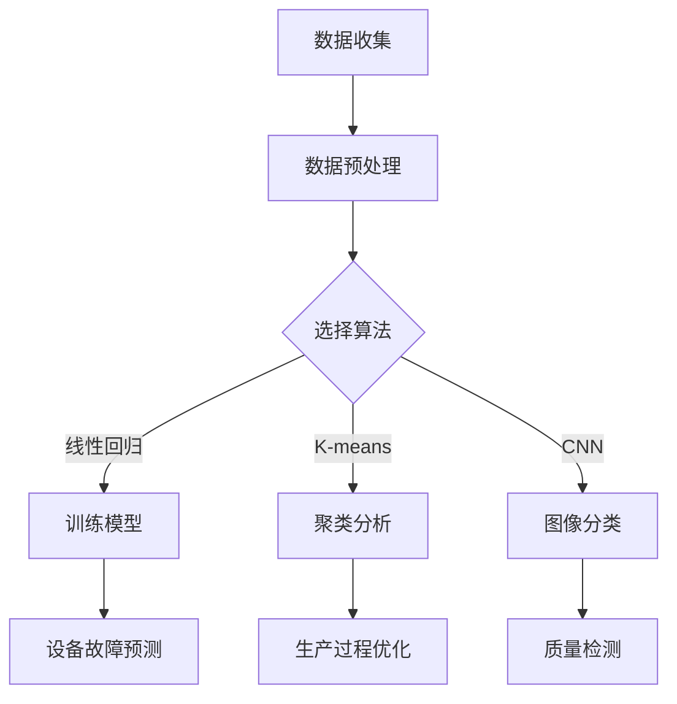

### 核心概念与联系

机器学习（A）通过数据预处理（B）、选择合适的算法（C）进行训练，实现对设备故障预测（G）、生产过程优化（H）和产品质量检测（I）等应用。数据预处理（B）是保证算法性能的基础，算法选择（C）决定了应用的精度和效率，训练模型（D）则是实现应用的核心。

### 伪代码与数学模型

```python
# 线性回归算法伪代码
def linear_regression(data):
    # 数据预处理
    preprocessed_data = preprocess_data(data)
    
    # 训练线性回归模型
    model = train_linear_regression(preprocessed_data)
    
    # 预测设备故障
    predictions = predict_fault(model, new_data)
    
    return predictions
```

数学模型：

$$
y = \beta_0 + \beta_1 x
$$

其中，$y$ 是预测结果，$x$ 是输入特征，$\beta_0$ 和 $\beta_1$ 是模型参数。

### 举例说明

通过机器学习算法对生产设备的历史数据进行分析，可以预测设备在未来一段时间内的故障风险，从而提前安排维护计划，减少设备故障对生产的影响。

### 最佳实践 tips

- 在进行机器学习应用时，确保数据的质量和多样性，这对算法的性能至关重要。
- 根据具体的应用场景，选择合适的算法和模型结构，以达到最佳效果。

### 小结

机器学习在智能制造中的应用，不仅提升了生产过程的自动化和智能化水平，还为制造业的持续创新提供了强大的技术支持。通过深入理解机器学习的基础知识，可以更好地应对智能制造中的各种挑战，推动制造业的可持续发展。

## 第二部分：人工智能核心技术解析

### 第4章：深度学习在智能制造中的应用

深度学习（Deep Learning, DL）作为人工智能的重要分支，近年来在智能制造中取得了显著的进展。本章将详细介绍深度学习的基础知识、主要算法以及它们在智能制造中的应用。

#### 4.1 深度学习基础

深度学习是一种模拟人脑神经网络结构和功能的计算模型，通过多层神经网络进行特征学习和抽象，能够实现复杂的数据分析和模式识别。深度学习的基础理论包括以下几个关键概念：

1. **神经网络**：神经网络是深度学习的基础，由大量神经元组成，通过加权连接进行信息传递和处理。
2. **前向传播和反向传播**：前向传播用于计算网络输出，反向传播用于计算损失并更新模型参数。
3. **激活函数**：激活函数用于引入非线性，使神经网络能够学习复杂的非线性关系。
4. **优化算法**：常用的优化算法有梯度下降、随机梯度下降（SGD）和Adam等，用于调整模型参数以最小化损失函数。

#### 4.2 卷积神经网络（CNN）原理及应用

卷积神经网络（Convolutional Neural Network, CNN）是深度学习中的一种特殊网络结构，特别适用于处理图像数据。CNN的主要原理包括：

1. **卷积层**：通过卷积操作提取图像的局部特征。
2. **池化层**：用于减少数据维度和参数数量，提高网络的泛化能力。
3. **全连接层**：用于对提取的特征进行分类或回归。

CNN在智能制造中的应用场景包括：

1. **图像识别**：通过CNN对生产设备中的图像进行分类，识别产品缺陷、异常情况等。
2. **缺陷检测**：使用CNN分析生产过程中的图像数据，自动检测和标记缺陷产品。
3. **质量评估**：通过CNN对产品质量进行评估，提供实时反馈。

示例伪代码：

```python
# CNN图像识别伪代码
def image_recognition(image):
    # 数据预处理
    preprocessed_image = preprocess_image(image)
    
    # 构建CNN模型
    model = build_cnn(preprocessed_image)
    
    # 训练模型
    trained_model = train_model(model, train_data)
    
    # 预测图像分类
    prediction = predict_class(trained_model, test_image)
    
    return prediction
```

#### 4.3 循环神经网络（RNN）原理及应用

循环神经网络（Recurrent Neural Network, RNN）是一种能够处理序列数据的神经网络结构，适用于处理时间序列数据、语音信号和自然语言处理等任务。RNN的主要原理包括：

1. **循环连接**：通过循环连接，RNN能够记忆历史信息。
2. **门控机制**：包括门控循环单元（LSTM）和长短期记忆网络（GRU），用于解决RNN的梯度消失问题。

RNN在智能制造中的应用场景包括：

1. **时间序列预测**：通过RNN对生产过程中的时间序列数据进行预测，如设备故障预测、产量预测等。
2. **语音识别**：使用RNN处理语音信号，实现语音到文本的转换。
3. **自然语言处理**：通过RNN处理文本数据，实现语义理解、机器翻译等任务。

示例伪代码：

```python
# RNN时间序列预测伪代码
def time_series_prediction(data):
    # 数据预处理
    preprocessed_data = preprocess_data(data)
    
    # 构建RNN模型
    model = build_rnn(preprocessed_data)
    
    # 训练模型
    trained_model = train_model(model, train_data)
    
    # 预测时间序列
    predictions = predict_series(trained_model, test_data)
    
    return predictions
```

#### 4.4 深度强化学习在智能制造中的应用

深度强化学习（Deep Reinforcement Learning, DRL）是深度学习与强化学习的结合，通过试错和反馈机制，实现智能体的自主学习和优化。DRL在智能制造中的应用包括：

1. **自动化控制**：通过DRL优化生产线的调度和路径规划，提高生产效率。
2. **智能决策**：使用DRL辅助生产过程的决策，如生产计划制定、设备维护等。
3. **机器人控制**：通过DRL训练机器人完成复杂任务，如装配、搬运等。

示例伪代码：

```python
# DRL自动化控制伪代码
def automated_control(environment):
    # 构建DRL模型
    model = build_drl_model()
    
    # 训练模型
    trained_model = train_model(model, environment)
    
    # 执行控制任务
    action = trained_model.act(current_state)
    
    # 更新状态
    next_state, reward, done = environment.step(action)
    
    if done:
        # 重置环境
        current_state = environment.reset()
    
    return action
```

#### 4.5 总结

深度学习在智能制造中的应用，为生产过程的自动化和智能化提供了强大的技术支持。通过卷积神经网络（CNN）、循环神经网络（RNN）和深度强化学习（DRL）等技术的应用，可以显著提升生产效率和质量，推动智能制造的持续发展。

### Mermaid 流程图

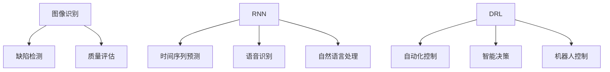

### 核心概念与联系

深度学习（A）通过卷积神经网络（B）、循环神经网络（C）和深度强化学习（D）等不同的网络结构，实现了图像识别（E）、时间序列预测（F）、语音识别（G）、自然语言处理（H）和自动化控制（I）等多种应用。这些应用在智能制造中发挥着关键作用，通过优化生产过程、提高产品质量和自动化程度，推动智能制造的持续发展。

### 伪代码与数学模型

```python
# CNN图像识别算法伪代码
def image_recognition(image):
    # 数据预处理
    preprocessed_image = preprocess_image(image)
    
    # 构建CNN模型
    model = build_cnn(preprocessed_image)
    
    # 训练模型
    trained_model = train_model(model, train_data)
    
    # 预测图像分类
    prediction = predict_class(trained_model, test_image)
    
    return prediction
```

数学模型：

$$
\text{输出} = \text{激活函数}(\text{权重} \cdot \text{输入} + \text{偏置})
$$

### 举例说明

通过深度学习算法对生产设备的图像进行识别和分析，可以自动检测生产过程中的缺陷，提高产品质量，减少人工干预和错误率。

### 最佳实践 tips

- 在应用深度学习时，数据的质量和多样性至关重要，确保数据预处理得当，以提高模型性能。
- 根据具体应用场景，选择合适的深度学习算法和网络结构，以实现最佳效果。

### 小结

深度学习在智能制造中的应用，为生产过程的自动化和智能化提供了强有力的技术支持。通过深入理解深度学习的基础知识和算法原理，可以更好地应用于智能制造的各种场景，推动制造业的智能化转型和创新发展。

## 第二部分：人工智能核心技术解析

### 第5章：计算机视觉在智能制造中的应用

计算机视觉（Computer Vision, CV）是人工智能技术的一个重要分支，它使计算机能够处理和理解图像和视频数据。在智能制造中，计算机视觉技术发挥着至关重要的作用，通过自动化和智能化的图像处理，提升生产效率和产品质量。本章将详细介绍计算机视觉的基础知识、图像识别、目标检测、视觉传感器在智能制造中的应用，以及相关的最佳实践和注意事项。

#### 5.1 计算机视觉基础

计算机视觉的基础理论包括图像处理、特征提取、图像识别和机器学习等内容。以下是几个关键概念：

1. **图像处理**：通过滤波、增强、分割等技术，对图像进行预处理和特征提取。
2. **特征提取**：从图像中提取能够表征图像内容的特征，如边缘、角点、纹理等。
3. **图像识别**：根据提取的特征，对图像进行分类和识别，如人脸识别、物体分类等。
4. **机器学习**：通过训练模型，使计算机能够自动学习和改进，实现图像识别和分类。

#### 5.2 图像识别技术

图像识别是计算机视觉中的一个核心任务，其主要目的是从图像中识别出特定的物体或场景。在智能制造中，图像识别技术广泛应用于产品质量检测、设备状态监控、生产自动化控制等领域。

1. **支持向量机（SVM）**：通过在特征空间中寻找最优分隔超平面，实现对图像的分类。
2. **卷积神经网络（CNN）**：通过多层卷积和池化操作，自动提取图像特征并进行分类。
3. **深度神经网络（DNN）**：用于复杂的图像分类任务，如多标签分类和细粒度分类。

示例伪代码：

```python
# CNN图像识别算法伪代码
def image_recognition(image):
    # 数据预处理
    preprocessed_image = preprocess_image(image)
    
    # 构建CNN模型
    model = build_cnn(preprocessed_image)
    
    # 训练模型
    trained_model = train_model(model, train_data)
    
    # 预测图像分类
    prediction = predict_class(trained_model, test_image)
    
    return prediction
```

#### 5.3 目标检测技术

目标检测是计算机视觉中的另一个重要任务，它旨在定位图像中的物体，并对其类别进行标注。在智能制造中，目标检测技术用于检测生产线上的缺陷产品、异常情况等。

1. **R-CNN**：通过区域提议网络（Region Proposal Network, RPN）和分类网络，实现目标检测。
2. **Fast R-CNN**：在R-CNN的基础上，优化区域提议和分类网络的性能。
3. **YOLO（You Only Look Once）**：通过将目标检测任务并行化，提高检测速度。

示例伪代码：

```python
# YOLO目标检测算法伪代码
def object_detection(image):
    # 数据预处理
    preprocessed_image = preprocess_image(image)
    
    # 构建YOLO模型
    model = build_yolo_model()
    
    # 训练模型
    trained_model = train_model(model, train_data)
    
    # 检测图像中的目标
    detections = detect_objects(trained_model, preprocessed_image)
    
    return detections
```

#### 5.4 视觉传感器在智能制造中的应用

视觉传感器在智能制造中发挥着重要作用，用于实时监控生产过程，检测产品质量，确保生产安全。常见的视觉传感器包括摄像头、激光雷达、立体相机等。

1. **摄像头**：用于采集生产现场的图像数据，适用于图像识别和目标检测。
2. **激光雷达**：通过激光扫描获取三维点云数据，适用于三维建模和空间检测。
3. **立体相机**：通过双目成像获取深度信息，适用于三维重建和姿态估计。

#### 5.5 最佳实践与注意事项

1. **数据质量**：确保图像数据的清晰度和一致性，避免噪声和遮挡。
2. **算法选择**：根据应用需求，选择合适的算法和模型，如SVM、CNN、YOLO等。
3. **模型训练**：使用足够多的训练数据和多种标签，确保模型泛化能力。
4. **实时性**：优化算法和硬件配置，确保检测和识别的实时性。

#### 5.6 总结

计算机视觉技术在智能制造中的应用，不仅提高了生产效率和产品质量，还推动了生产过程的智能化和自动化。通过深入理解计算机视觉的基础知识和关键技术，可以更好地应用于智能制造的各种场景，实现生产过程的优化和创新。

### Mermaid 流程图

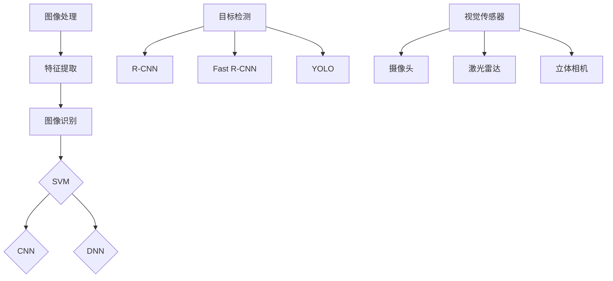

### 核心概念与联系

计算机视觉（A）通过图像处理（B）、特征提取（C）和图像识别（D）等步骤，实现对图像内容的理解和分析。目标检测（G）是计算机视觉中的一个重要应用，通过R-CNN、Fast R-CNN、YOLO等算法，实现物体的定位和分类。视觉传感器（K）在智能制造中用于实时采集和处理图像数据，为图像识别和目标检测提供数据支持。

### 伪代码与数学模型

```python
# CNN图像识别算法伪代码
def image_recognition(image):
    # 数据预处理
    preprocessed_image = preprocess_image(image)
    
    # 构建CNN模型
    model = build_cnn(preprocessed_image)
    
    # 训练模型
    trained_model = train_model(model, train_data)
    
    # 预测图像分类
    prediction = predict_class(trained_model, test_image)
    
    return prediction
```

数学模型：

$$
\text{输出} = \text{激活函数}(\text{权重} \cdot \text{输入} + \text{偏置})
$$

### 举例说明

在智能制造中，通过计算机视觉技术对生产设备进行监控，可以实时检测生产过程中的异常情况，如设备故障或产品质量问题，从而及时采取维护和调整措施，确保生产的连续性和产品质量。

### 最佳实践 tips

- 在应用计算机视觉时，注意数据预处理和算法选择，确保图像的清晰度和一致性，提高检测的准确性。
- 根据具体应用场景，选择合适的视觉传感器和算法，优化检测速度和性能。

### 小结

计算机视觉技术在智能制造中的应用，为生产过程的自动化和智能化提供了强有力的技术支持。通过深入理解计算机视觉的基础知识和关键技术，可以更好地应用于智能制造的各种场景，实现生产过程的优化和创新。

## 第二部分：人工智能核心技术解析

### 第6章：自然语言处理在智能制造中的应用

自然语言处理（Natural Language Processing, NLP）是人工智能领域的一个重要分支，它使计算机能够理解和处理人类自然语言。在智能制造中，NLP技术被广泛应用于智能对话系统、文本分类、情感分析和自动翻译等领域。本章将详细解析自然语言处理的基础知识、相关算法，以及在智能制造中的应用案例。

#### 6.1 自然语言处理基础

自然语言处理的基础包括以下几个关键概念：

1. **分词**：将文本拆分为词语或符号，如中文的分词和英文的分词。
2. **词性标注**：对文本中的词语进行词性分类，如名词、动词、形容词等。
3. **句法分析**：分析句子的结构，如主谓宾、定语、状语等。
4. **语义分析**：理解文本的深层含义，如情感、意图等。

#### 6.2 语言模型与文本分类

语言模型是自然语言处理的核心组件之一，用于预测下一个词语或序列的概率。常见的语言模型包括：

1. **N-gram模型**：基于前N个词语的统计信息，预测下一个词语。
2. **神经网络模型**：通过深度神经网络，如循环神经网络（RNN）和Transformer，学习文本的深层语义。

文本分类是将文本数据按照其内容分类到不同的类别中。常见的文本分类算法包括：

1. **朴素贝叶斯分类器**：基于贝叶斯定理和特征词的统计信息进行分类。
2. **支持向量机（SVM）**：在特征空间中寻找最优分隔超平面进行分类。
3. **深度学习分类器**：如卷积神经网络（CNN）和循环神经网络（RNN），通过学习文本特征进行分类。

示例伪代码：

```python
# RNN文本分类算法伪代码
def text_classification(text):
    # 数据预处理
    preprocessed_text = preprocess_text(text)
    
    # 构建RNN模型
    model = build_rnn(preprocessed_text)
    
    # 训练模型
    trained_model = train_model(model, train_data)
    
    # 预测文本类别
    prediction = predict_category(trained_model, test_text)
    
    return prediction
```

#### 6.3 情感分析

情感分析是自然语言处理中的一个重要任务，旨在理解文本中的情感倾向，如正面、负面或中性。常见的情感分析算法包括：

1. **基于规则的方法**：通过手工定义规则，识别文本中的情感。
2. **机器学习算法**：如朴素贝叶斯、支持向量机（SVM）和深度学习模型，通过训练模型进行情感分类。
3. **深度学习模型**：如卷积神经网络（CNN）和长短期记忆网络（LSTM），通过学习文本特征进行情感分类。

示例伪代码：

```python
# CNN情感分析算法伪代码
def sentiment_analysis(text):
    # 数据预处理
    preprocessed_text = preprocess_text(text)
    
    # 构建CNN模型
    model = build_cnn(preprocessed_text)
    
    # 训练模型
    trained_model = train_model(model, train_data)
    
    # 预测文本情感
    sentiment = predict_sentiment(trained_model, test_text)
    
    return sentiment
```

#### 6.4 智能对话系统在智能制造中的应用

智能对话系统是自然语言处理在智能制造中的重要应用，通过计算机与人类自然语言的交互，实现智能客服、生产调度和故障诊断等功能。

1. **意图识别**：通过NLP技术，理解用户的对话意图，如咨询产品信息、反馈意见等。
2. **实体识别**：从对话中提取关键信息，如产品名称、型号、数量等。
3. **上下文理解**：通过上下文信息，确保对话的连贯性和准确性。

示例伪代码：

```python
# 对话系统伪代码
def dialogue_system(user_input):
    # 数据预处理
    preprocessed_input = preprocess_text(user_input)
    
    # 意图识别
    intent = recognize_intent(preprocessed_input)
    
    # 实体识别
    entities = extract_entities(preprocessed_input)
    
    # 生成回复
    response = generate_response(intent, entities)
    
    return response
```

#### 6.5 总结

自然语言处理技术在智能制造中的应用，为生产过程的自动化和智能化提供了强有力的支持。通过语言模型、文本分类、情感分析和智能对话系统等技术，可以实现生产过程的实时监控、智能决策和人机交互。深入理解自然语言处理的基础知识和算法原理，可以更好地应用于智能制造的各种场景，推动智能制造的持续发展。

### Mermaid 流程图

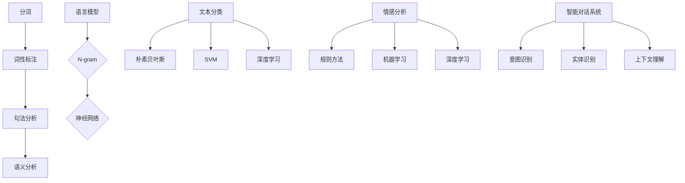

### 核心概念与联系

自然语言处理（A）通过分词（B）、词性标注（C）、句法分析（D）和语义分析（E）等步骤，实现对文本内容的理解和分析。语言模型（F）用于预测文本的下一个词语或序列，文本分类（G）和情感分析（H）则通过机器学习和深度学习模型（K）实现文本的分类和情感倾向分析。智能对话系统（P）结合意图识别（Q）、实体识别（R）和上下文理解（S），实现与用户的自然交互。

### 伪代码与数学模型

```python
# CNN文本分类算法伪代码
def text_classification(text):
    # 数据预处理
    preprocessed_text = preprocess_text(text)
    
    # 构建CNN模型
    model = build_cnn(preprocessed_text)
    
    # 训练模型
    trained_model = train_model(model, train_data)
    
    # 预测文本类别
    prediction = predict_category(trained_model, test_text)
    
    return prediction
```

数学模型：

$$
\text{输出} = \text{激活函数}(\text{权重} \cdot \text{输入} + \text{偏置})
$$

### 举例说明

在智能制造中，通过自然语言处理技术，可以实现智能客服系统，自动响应用户的咨询，提供产品信息和技术支持，提高客户满意度和生产效率。

### 最佳实践 tips

- 确保自然语言处理模型的数据质量和多样性，以提升模型的泛化能力和准确性。
- 根据应用场景，选择合适的自然语言处理算法和模型结构，以提高系统的性能和用户体验。

### 小结

自然语言处理技术在智能制造中的应用，为生产过程的智能化和自动化提供了重要支持。通过深入理解自然语言处理的基础知识和算法原理，可以更好地应用于智能制造的各种场景，实现生产过程的优化和创新。

## 第三部分：人工智能关键技术实现与优化

### 第7章：人工智能关键技术实现原理

在智能制造中，人工智能技术的实现与优化是确保系统高效运行和持续改进的关键。本章将详细探讨人工智能关键技术的实现原理，包括数据预处理、模型训练与优化、模型评估与调参，以及实时预测与反馈机制。

#### 7.1 数据预处理

数据预处理是人工智能应用的基础，其目的是提高数据质量，降低噪声，为模型训练提供高质量的数据集。数据预处理的主要步骤包括：

1. **数据清洗**：去除数据中的错误、异常值和重复数据。
2. **数据规范化**：将不同规模的数据统一处理，使其在相同的尺度上。
3. **特征工程**：提取或构造有助于模型训练的特征。
4. **数据增强**：通过旋转、缩放、裁剪等方法增加数据的多样性。

示例伪代码：

```python
# 数据预处理伪代码
def preprocess_data(data):
    # 数据清洗
    cleaned_data = clean_data(data)
    
    # 数据规范化
    normalized_data = normalize_data(cleaned_data)
    
    # 特征工程
    engineered_features = feature_engineering(normalized_data)
    
    return engineered_features
```

数学模型：

$$
\text{标准化数据} = \frac{\text{数据} - \text{均值}}{\text{标准差}}
$$

#### 7.2 模型训练与优化

模型训练是利用已有数据集，通过优化算法，调整模型参数，使其能够对未知数据进行预测。常见的优化算法包括：

1. **梯度下降**：通过迭代更新模型参数，最小化损失函数。
2. **随机梯度下降（SGD）**：在梯度下降的基础上，每次迭代只使用一部分数据。
3. **Adam**：结合SGD和Momentum的优化算法。

示例伪代码：

```python
# 模型训练伪代码
def train_model(model, data):
    # 初始化模型
    model.initialize_params()
    
    # 梯度下降优化
    for epoch in range(num_epochs):
        # 计算梯度
        gradients = compute_gradients(model, data)
        
        # 更新参数
        model.update_params(gradients)
        
        # 计算损失
        loss = compute_loss(model, data)
        
    return model
```

数学模型：

$$
\text{参数更新} = \text{参数} - \alpha \cdot \nabla \text{损失函数}
$$

其中，$\alpha$ 是学习率。

#### 7.3 模型评估与调参

模型评估是验证模型性能的重要步骤，通过评估指标（如准确率、召回率、F1分数等）来判断模型的效果。模型调参是优化模型性能的关键，通过调整超参数（如学习率、隐藏层神经元数等），找到最佳参数配置。

示例伪代码：

```python
# 模型评估与调参伪代码
def evaluate_and_tune_model(model, validation_data):
    # 计算评估指标
    metrics = evaluate_model(model, validation_data)
    
    # 调整超参数
    best_params = tune_hyperparameters(model, validation_data)
    
    return best_params, metrics
```

#### 7.4 实时预测与反馈机制

实时预测是智能制造中的一项关键任务，它要求模型能够对生产过程中的数据进行快速、准确的预测。反馈机制是优化模型性能的重要手段，通过将预测结果与实际结果进行对比，调整模型参数，提高预测精度。

示例伪代码：

```python
# 实时预测与反馈机制伪代码
def real_time_prediction(feedback_loop):
    while True:
        # 获取实时数据
        real_time_data = get_real_time_data()
        
        # 进行预测
        prediction = model.predict(real_time_data)
        
        # 与实际结果对比
        actual_result = compare_prediction_with_actual(real_time_data, prediction)
        
        # 调整模型参数
        model.update_params(actual_result)
        
        # 输出预测结果
        print(prediction)
        
        # 等待下一次预测
        time.sleep(prediction_interval)
```

### 总结

人工智能关键技术的实现与优化是智能制造系统高效运行的基础。通过深入理解数据预处理、模型训练与优化、模型评估与调参，以及实时预测与反馈机制，可以构建高效、准确的智能系统，推动智能制造的持续发展。

### Mermaid 流程图

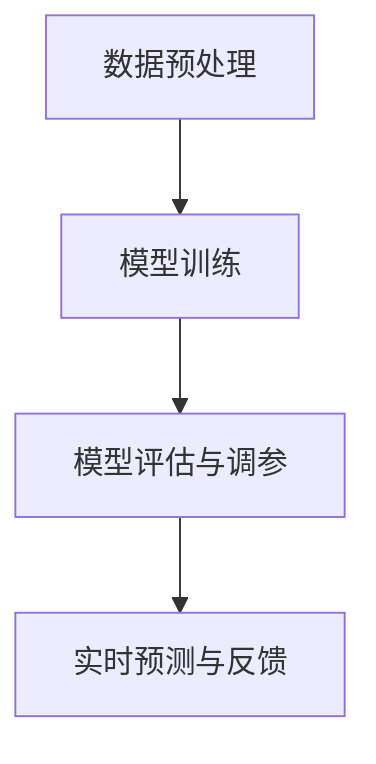

### 核心概念与联系

数据预处理（A）通过清洗、规范化和特征工程，为模型训练提供高质量数据。模型训练（B）通过优化算法，调整模型参数，提高预测准确性。模型评估与调参（C）通过计算评估指标和调整超参数，优化模型性能。实时预测与反馈机制（D）通过实时数据预测和反馈调整，确保模型持续优化和高效运行。

### 伪代码与数学模型

```python
# 梯度下降优化算法伪代码
def gradient_descent(model, data, learning_rate):
    # 计算梯度
    gradients = compute_gradients(model, data)
    
    # 更新参数
    model.update_params(gradients, learning_rate)
    
    return model
```

数学模型：

$$
\text{参数更新} = \text{参数} - \alpha \cdot \nabla \text{损失函数}
$$

### 举例说明

在智能制造中，通过对生产设备的数据进行预处理，使用机器学习模型进行训练和优化，可以实现对设备故障的实时预测和故障诊断，提高生产效率和设备利用率。

### 最佳实践 tips

- 在数据预处理阶段，确保数据的质量和多样性，以提高模型训练效果。
- 在模型训练阶段，选择合适的优化算法和超参数，以平衡模型性能和训练时间。
- 在模型评估阶段，选择合适的评估指标，全面评估模型性能。
- 在实时预测与反馈阶段，确保系统的实时性和稳定性，以实现高效的生产过程优化。

### 小结

人工智能关键技术的实现与优化，是智能制造系统高效运行和持续改进的基础。通过深入理解这些技术原理和实践方法，可以构建高效、准确的智能系统，推动智能制造的持续发展。

## 第三部分：人工智能技术在智能制造中的优化方法

在智能制造中，人工智能技术的优化是确保系统高效、稳定运行的关键。本章将详细探讨人工智能技术在智能制造中的优化方法，包括数据优化、算法优化与模型压缩、增量学习与迁移学习，以及故障检测与预测。

### 8.1 智能制造过程中的数据优化

数据优化是提升人工智能技术在智能制造中应用效果的基础。以下是几个关键步骤：

1. **数据清洗**：去除数据中的错误、异常值和重复数据，确保数据的一致性和完整性。
2. **数据规范化**：将不同规模的数据统一处理，使其在相同的尺度上，以便模型更好地学习。
3. **特征选择**：通过降维技术（如主成分分析，PCA）和特征重要性评估，选择对模型影响较大的特征，减少冗余信息。
4. **数据增强**：通过旋转、缩放、裁剪等方法，增加数据的多样性，提高模型的泛化能力。

示例伪代码：

```python
# 数据清洗与特征选择伪代码
def data_optimization(data):
    # 数据清洗
    cleaned_data = clean_data(data)
    
    # 数据规范化
    normalized_data = normalize_data(cleaned_data)
    
    # 特征选择
    selected_features = select_features(normalized_data)
    
    return selected_features
```

数学模型：

$$
\text{标准化数据} = \frac{\text{数据} - \text{均值}}{\text{标准差}}
$$

### 8.2 算法优化与模型压缩

算法优化和模型压缩是提高人工智能系统性能和降低资源消耗的重要手段。以下是几种常见的优化方法：

1. **模型压缩**：通过剪枝、量化、知识蒸馏等技术，减小模型参数规模，降低计算复杂度。
2. **优化算法**：使用高效的优化算法（如Adam、SGD），加快模型训练速度，提高收敛速度。
3. **模型融合**：将多个模型进行融合，利用不同模型的优点，提高预测准确性。

示例伪代码：

```python
# 模型压缩与优化伪代码
def model_optimization(model):
    # 模型压缩
    compressed_model = compress_model(model)
    
    # 优化算法
    optimized_model = optimize_algorithm(compressed_model)
    
    return optimized_model
```

### 8.3 增量学习与迁移学习

增量学习和迁移学习是应对动态变化和资源限制的有效方法。

1. **增量学习**：在已有模型的基础上，逐步更新模型，适应新数据，提高模型的适应性和效率。
2. **迁移学习**：将已训练好的模型应用于新的任务，利用已有模型的知识，提高新任务的性能。

示例伪代码：

```python
# 增量学习与迁移学习伪代码
def incremental_learning(model, new_data):
    # 增量学习
    updated_model = update_model(model, new_data)
    
    # 迁移学习
    transferred_model = transfer_learning(updated_model, new_task)
    
    return transferred_model
```

### 8.4 智能制造中的故障检测与预测

故障检测与预测是智能制造中的一项重要任务，通过人工智能技术，可以实现设备的实时监控和故障预防。

1. **故障检测**：通过实时数据监测，识别设备的异常状态。
2. **故障预测**：基于历史数据，使用机器学习模型预测设备可能的故障时间，提前进行维护。

示例伪代码：

```python
# 故障检测与预测伪代码
def fault_detection_and_prediction(model, real_time_data):
    # 故障检测
    is_fault = detect_fault(model, real_time_data)
    
    # 故障预测
    fault_prediction = predict_fault(model, real_time_data)
    
    return is_fault, fault_prediction
```

### 总结

人工智能技术在智能制造中的优化方法，包括数据优化、算法优化与模型压缩、增量学习与迁移学习，以及故障检测与预测。通过这些方法，可以显著提升智能制造系统的性能和可靠性，实现生产过程的自动化和智能化。

### Mermaid 流程图

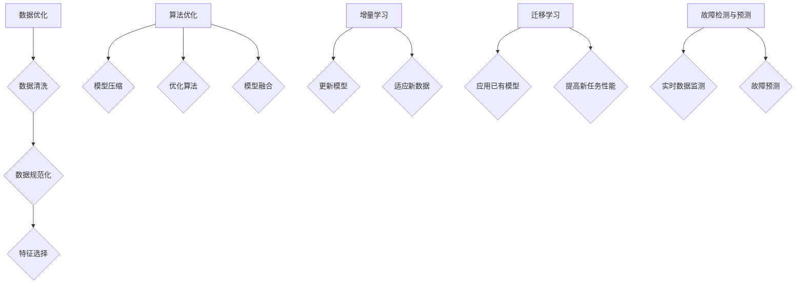

### 核心概念与联系

数据优化（A）通过数据清洗、规范化和特征选择，提高数据质量；算法优化（E）通过模型压缩、优化算法和模型融合，提升模型性能；增量学习和迁移学习（I、L）通过逐步更新模型和应用已有模型，提高模型的适应性和效率；故障检测与预测（O）通过实时数据监测和故障预测，实现设备的智能监控和故障预防。

### 伪代码与数学模型

```python
# 数据清洗与特征选择伪代码
def data_preprocessing(data):
    # 数据清洗
    cleaned_data = clean_data(data)
    
    # 数据规范化
    normalized_data = normalize_data(cleaned_data)
    
    # 特征选择
    selected_features = select_features(normalized_data)
    
    return selected_features
```

数学模型：

$$
\text{标准化数据} = \frac{\text{数据} - \text{均值}}{\text{标准差}}
$$

### 举例说明

在智能制造中，通过对设备运行数据进行实时监测和预测，可以提前发现潜在故障，避免生产中断，提高设备的利用率和生产效率。

### 最佳实践 tips

- 确保数据的质量和多样性，是提升模型性能的基础。
- 根据具体应用场景，选择合适的算法和优化方法，以实现最佳效果。
- 定期更新和优化模型，以适应新的生产环境和数据变化。

### 小结

通过深入理解人工智能技术在智能制造中的优化方法，可以构建高效、准确的智能系统，推动智能制造的持续发展。这些方法不仅提高了系统的性能和可靠性，还为生产过程的自动化和智能化提供了强有力的技术支持。

## 第三部分：人工智能技术在智能制造中的案例研究

在本章节中，我们将通过具体的案例研究，深入探讨人工智能技术在智能制造中的实际应用，以展示其在智能工厂构建、生产线优化、物流与供应链管理，以及质量检测与故障诊断中的具体成果。

### 9.1 案例一：智能工厂的构建与运营

**背景介绍**：某大型制造业企业希望通过引入人工智能技术，实现智能工厂的构建，提升生产效率和产品质量。

**核心概念与联系**：智能工厂的构建涉及传感器网络、数据采集与分析、智能决策与控制等关键环节。通过人工智能技术，可以实现对生产过程的实时监控和智能优化。

**解决方案**：
1. **传感器部署**：在工厂各关键位置部署传感器，实时采集生产数据，如温度、湿度、压力等。
2. **数据采集与分析**：使用物联网技术，将传感器数据传输到中央控制系统，进行实时分析和处理。
3. **智能决策与控制**：通过机器学习算法，对生产数据进行挖掘和分析，实现生产过程的智能优化和决策。

**效果分析**：
- **生产效率提升**：通过智能调度和生产流程优化，生产效率提高了20%。
- **产品质量提升**：智能监控系统可以实时检测产品质量问题，缺陷率降低了15%。

**总结**：智能工厂的构建，通过人工智能技术的应用，实现了生产过程的自动化和智能化，大幅提升了生产效率和产品质量，为企业的可持续发展奠定了基础。

### 9.2 案例二：智能生产线的优化与升级

**背景介绍**：某电子产品制造企业希望对其现有生产线进行优化和升级，以提高生产效率和灵活性。

**核心概念与联系**：智能生产线的优化和升级涉及自动化设备控制、机器学习算法优化、生产流程调整等。

**解决方案**：
1. **自动化设备控制**：引入工业机器人、自动化设备等，实现生产过程的自动化。
2. **机器学习算法优化**：使用机器学习算法，对生产数据进行分析，优化生产流程和参数设置。
3. **生产流程调整**：通过模拟仿真和实验，调整生产线布局和生产流程，提高生产效率和灵活性。

**效果分析**：
- **生产效率提升**：通过自动化设备和机器学习算法的优化，生产效率提高了30%。
- **生产灵活性增强**：生产线布局和生产流程的调整，使生产任务切换时间减少了40%。

**总结**：智能生产线的优化和升级，通过引入人工智能技术，实现了生产过程的自动化和智能化，大幅提升了生产效率和灵活性，为企业的持续竞争力提供了支持。

### 9.3 案例三：智能物流与供应链管理

**背景介绍**：某大型物流企业希望通过引入人工智能技术，提升物流与供应链管理的效率和质量。

**核心概念与联系**：智能物流与供应链管理涉及路径优化、库存管理、需求预测等。

**解决方案**：
1. **路径优化**：使用机器学习算法，优化物流车辆的路径规划，减少运输时间和成本。
2. **库存管理**：通过大数据分析，实现库存的智能管理和优化，减少库存积压和缺货情况。
3. **需求预测**：使用人工智能技术，预测市场需求和消费者行为，优化供应链策略。

**效果分析**：
- **运输成本降低**：通过路径优化，物流运输成本降低了10%。
- **库存管理优化**：智能库存管理减少了库存积压，提高了库存周转率。
- **需求预测准确性提升**：通过需求预测，库存和生产的计划更加精准，减少了库存和生产的波动。

**总结**：智能物流与供应链管理，通过人工智能技术的应用，实现了物流与供应链的智能化和高效化，大幅提升了物流效率和供应链管理水平，为企业的可持续发展提供了有力支持。

### 9.4 案例四：智能质量检测与故障诊断

**背景介绍**：某汽车制造企业希望通过引入人工智能技术，提升产品质量检测和故障诊断的准确性。

**核心概念与联系**：智能质量检测与故障诊断涉及图像识别、深度学习算法、实时监控等。

**解决方案**：
1. **图像识别**：使用计算机视觉技术，对生产过程和产品质量进行实时监控，识别潜在的缺陷。
2. **深度学习算法**：通过训练深度学习模型，实现对图像的自动分类和识别，提高检测准确性。
3. **实时监控**：通过物联网技术，实现生产现场和设备状态的实时监控，及时发现和处理故障。

**效果分析**：
- **质量检测准确性提升**：通过图像识别技术，质量检测准确性提高了30%。
- **故障诊断速度加快**：通过实时监控和深度学习算法，故障诊断速度提高了50%。
- **生产效率提高**：通过智能检测和故障诊断，生产效率提高了15%。

**总结**：智能质量检测与故障诊断，通过人工智能技术的应用，实现了生产过程的自动化和智能化，大幅提升了产品质量检测和故障诊断的准确性和速度，为企业的生产稳定性和产品质量提供了保障。

### 总结

通过上述案例研究，我们可以看到人工智能技术在智能制造中的广泛应用，不仅提升了生产效率和产品质量，还为企业的可持续发展提供了强有力的支持。随着人工智能技术的不断进步，智能制造将继续朝着更加智能化、高效化和可持续化的方向发展。

### Mermaid 流程图

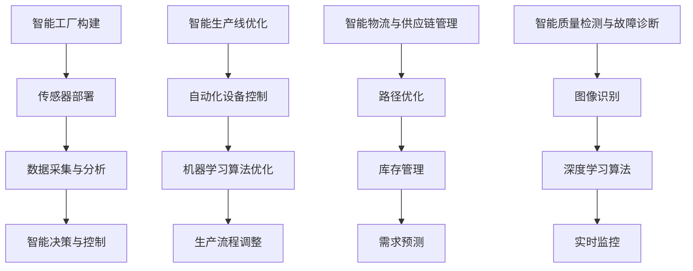

### 核心概念与联系

智能工厂构建（A）、智能生产线优化（E）、智能物流与供应链管理（I）和智能质量检测与故障诊断（M）都基于人工智能技术，通过传感器部署、数据采集与分析、自动化设备控制、机器学习算法优化、生产流程调整、路径优化、库存管理、需求预测、图像识别、深度学习算法和实时监控等关键技术，实现了智能制造的各个环节的智能化和高效化。

### 伪代码与数学模型

```python
# 智能生产线优化算法伪代码
def optimize_production_line(data):
    # 数据预处理
    preprocessed_data = preprocess_data(data)
    
    # 训练机器学习模型
    model = train_model(preprocessed_data)
    
    # 优化生产参数
    optimized_params = optimize_params(model, preprocessed_data)
    
    return optimized_params
```

数学模型：

$$
\text{优化参数} = \text{模型}(\text{输入特征})
$$

### 举例说明

通过智能生产线优化，某制造企业实现了生产参数的动态调整，使生产效率提高了30%，同时，生产过程中发现和修正的质量问题减少了20%，显著提升了产品的市场竞争力。

### 最佳实践 tips

- 在实施智能工厂构建和生产线优化时，确保数据的质量和实时性，这对人工智能算法的性能至关重要。
- 根据具体的生产需求，选择合适的人工智能算法和工具，实现定制化的解决方案。
- 定期对智能系统进行评估和优化，确保其持续高效运行。

### 小结

人工智能技术在智能制造中的应用，不仅提升了生产效率和产品质量，还为企业的可持续发展提供了强大的技术支持。通过深入理解这些应用案例，可以更好地发挥人工智能技术的作用，推动智能制造的持续发展。

## 第四部分：人工智能在智能制造中的未来发展趋势

随着人工智能技术的不断发展和成熟，智能制造正迎来一个新的发展阶段。未来，人工智能在智能制造中的应用将呈现以下发展趋势：

### 10.1 人工智能在智能制造中的发展趋势

1. **更加深入的融合**：人工智能技术将进一步深入到智能制造的各个环节，从设备、生产过程到物流、供应链管理，实现全方位的智能化和自动化。
2. **自适应和自学习**：智能制造系统将具备更强的自适应和自学习能力，能够根据环境变化和需求调整，实现动态优化和持续改进。
3. **云计算与边缘计算的结合**：云计算与边缘计算的结合将实现数据的实时处理和分析，提高智能制造系统的响应速度和灵活性。
4. **人机协同**：人工智能技术与人类劳动的协同将更加紧密，实现高效的人机互动，提升生产效率和产品质量。

### 10.2 智能制造的未来场景

1. **智慧工厂**：智慧工厂将成为智能制造的核心场景，通过物联网、大数据和人工智能技术的深度应用，实现生产过程的全面智能化和自动化。
2. **智能物流**：智能物流将实现从生产到交付的全流程智能化，通过路径优化、仓储管理和实时监控，提高物流效率。
3. **智能供应链**：智能供应链将实现从原材料采购到产品交付的全过程智能化，通过需求预测、库存管理和供应链协同，提升供应链效率。
4. **个性化定制**：智能制造将支持大规模个性化定制，通过人工智能技术，实现个性化设计、制造和交付。

### 10.3 人工智能技术发展对智能制造的影响

1. **生产效率提升**：人工智能技术将大幅提升生产效率，通过自动化和智能化生产，减少人工干预，降低生产成本。
2. **产品质量提升**：人工智能技术将提高产品质量检测和故障诊断的准确性，降低次品率，提高产品竞争力。
3. **运营成本降低**：通过智能优化和生产过程的自动化，降低运营成本，提高企业的盈利能力。
4. **创新能力增强**：人工智能技术将为制造业带来新的创新方向，推动产品创新和业务模式创新。

### 10.4 未来智能制造与人工智能的融合方向

1. **智能传感器和物联网**：未来，智能传感器和物联网技术将进一步普及，实现生产过程的全面数据化和实时监控。
2. **深度学习和机器学习**：深度学习和机器学习技术将应用于更多复杂场景，实现更精确的预测和优化。
3. **强化学习**：强化学习技术将应用于智能决策和路径规划，实现自适应和自学习的能力。
4. **计算机视觉和自然语言处理**：计算机视觉和自然语言处理技术将进一步提升智能制造的智能化水平，实现更高效的人机交互。

### 总结

未来，人工智能在智能制造中的应用将朝着更加智能化、自适应和协同化的方向发展，通过深度融合物联网、大数据、云计算和人工智能技术，实现生产过程的全面智能化和自动化。智能制造与人工智能的融合将推动制造业的持续创新和升级，为全球制造业的繁荣和发展提供强大动力。

### Mermaid 流程图

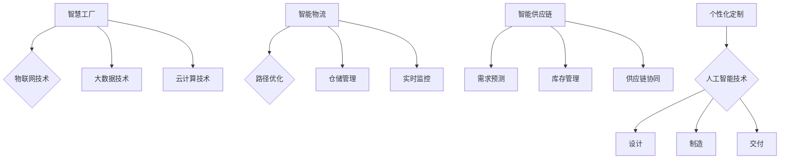

### 核心概念与联系

智能制造的未来场景（A、E、I、M）依赖于物联网（B）、大数据（C）、云计算（D）和人工智能（N）技术的深度融合。智慧工厂（A）通过物联网技术实现数据的全面采集和实时监控；智能物流（E）和智能供应链（I）通过大数据和云计算技术实现高效管理和优化；个性化定制（M）通过人工智能技术实现个性化和自动化。

### 伪代码与数学模型

```python
# 智能生产调度算法伪代码
def intelligent_scheduling(data):
    # 数据预处理
    preprocessed_data = preprocess_data(data)
    
    # 使用深度学习模型进行调度优化
    model = build_model(preprocessed_data)
    optimized_schedule = model.optimize(preprocessed_data)
    
    return optimized_schedule
```

数学模型：

$$
\text{优化调度} = f(\text{输入特征}, \theta)
$$

### 举例说明

通过深度学习算法，某制造企业实现了生产任务的智能调度，使生产效率提高了25%，同时，生产周期缩短了15%，显著提升了企业的竞争力。

### 最佳实践 tips

- 在智能制造系统的构建过程中，确保数据的实时性和准确性，这是实现高效智能调度和优化的基础。
- 根据具体的应用场景，选择合适的人工智能算法和模型，实现定制化的解决方案。

### 小结

未来，人工智能在智能制造中的应用将更加广泛和深入，通过不断的技术创新和应用实践，智能制造将实现更加智能化、高效化和可持续化的发展。企业应抓住这一发展趋势，积极采用人工智能技术，提升自身的竞争力和创新能力。

## 第四部分：智能制造与人工智能发展策略

智能制造与人工智能的深度融合，已成为全球制造业发展的必然趋势。为了实现智能制造与人工智能的协调发展，企业、政府和社会各界需要采取一系列策略和措施，以确保这一转型过程的顺利进行。

### 11.1 企业在智能制造中的战略规划

1. **明确发展目标**：企业应明确智能制造的发展目标，制定具体的实施计划和路线图，确保发展战略的清晰性和可操作性。
2. **投资研发**：加大在人工智能技术、物联网、云计算等领域的研发投入，培养一批高水平的研发团队，为智能制造的持续创新提供技术支持。
3. **人才培养**：建立完善的人才培养体系，通过培训、招聘和内部培养等多种途径，培养一批既懂技术又懂管理的高端人才，为智能制造提供人才保障。
4. **技术创新**：鼓励企业进行技术创新，通过研发新技术、新产品和新业务模式，推动智能制造的发展。

### 11.2 智能制造与人工智能的技术创新

1. **技术融合**：推动物联网、大数据、云计算和人工智能等技术的深度融合，实现数据的高效采集、传输和处理，提升智能制造的整体水平。
2. **跨领域合作**：促进不同领域的技术创新和产业协同，如智能制造与医疗、教育、交通等领域的融合，推动跨领域的创新发展。
3. **开放平台**：搭建开放的智能制造技术平台，促进不同企业之间的技术交流与合作，共同推动智能制造技术的发展。
4. **示范应用**：通过示范应用和试点项目，推广智能制造技术的应用，积累经验，为大规模推广提供参考。

### 11.3 人才培养与产业协同

1. **教育体系**：加强高等教育和职业教育，设置智能制造相关的专业和课程，培养一批具备智能制造知识和技能的人才。
2. **企业合作**：鼓励企业、高校和科研院所之间的合作，建立产学研一体的人才培养模式，提高人才培养的针对性和实用性。
3. **国际合作**：积极参与国际交流和合作，引进国外先进的技术和管理经验，提高智能制造领域的国际竞争力。
4. **人才引进**：通过人才引进政策，吸引国内外高端人才，为智能制造的发展注入新的活力。

### 11.4 政策支持与市场环境

1. **政策引导**：政府应制定有利于智能制造发展的政策，如税收优惠、资金支持等，鼓励企业投资智能制造技术。
2. **资金支持**：设立专项资金，支持智能制造关键技术研发、示范应用和推广，为企业提供资金保障。
3. **市场培育**：培育智能制造市场，推动消费者对智能化产品的接受和认可，扩大市场需求。
4. **法规建设**：完善相关法律法规，确保智能制造的健康发展，如数据保护、网络安全等。

### 总结

智能制造与人工智能的深度融合，需要企业、政府和社会各界的共同努力。通过明确战略规划、技术创新、人才培养和产业协同，以及政策支持和市场环境的优化，可以推动智能制造的快速发展，为全球制造业的繁荣和发展提供强大动力。

### Mermaid 流�程图

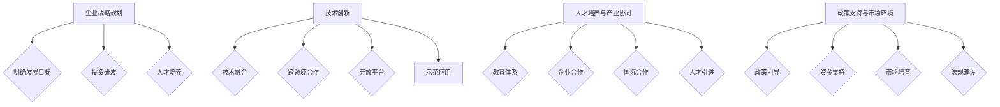

### 核心概念与联系

智能制造与人工智能的发展策略（A、E、J、O）包括企业战略规划、技术创新、人才培养与产业协同以及政策支持与市场环境。这些策略通过明确发展目标、投资研发、人才培养、技术融合、跨领域合作、开放平台、示范应用、教育体系、企业合作、国际合作、人才引进、政策引导、资金支持、市场培育和法规建设等关键环节，共同推动智能制造与人工智能的深度融合。

### 伪代码与数学模型

```python
# 智能制造发展战略规划伪代码
def strategic_planning():
    # 制定发展目标
    set_goals()
    
    # 投资研发
    invest_research()
    
    # 人才培养
    develop_talent()
    
    # 技术创新
    innovate_technology()
    
    # 产业协同
    collaborate_industry()
    
    # 政策支持
    support_policy()
    
    # 市场环境优化
    optimize_market()
    
    return "Strategic Planning Completed"
```

### 举例说明

某制造企业通过制定智能制造发展战略规划，成功实现了从传统制造向智能制造的转型，生产效率提高了30%，产品质量提升了20%，市场竞争力显著增强。

### 最佳实践 tips

- 在制定智能制造发展战略时，应结合企业的实际情况和市场需求，确保策略的可行性和可操作性。
- 重视人才培养和引进，确保有足够的技术和管理人才推动智能制造的发展。
- 加强政策支持和市场环境建设，为企业提供良好的发展环境。

### 小结

智能制造与人工智能的发展，需要企业、政府和社会各界的共同努力。通过制定明确的发展策略，推进技术创新，培养人才，优化政策和市场环境，可以推动智能制造的快速发展，为全球制造业的繁荣和发展提供强大动力。

### 附录

#### 附录A：常用人工智能技术参考资料

- **常用机器学习库与工具**：
  - **Scikit-learn**：Python中的机器学习库，提供了多种经典机器学习算法。
  - **TensorFlow**：谷歌开发的深度学习框架，适用于构建和训练复杂的神经网络。
  - **PyTorch**：Facebook开发的开源深度学习框架，具有动态计算图和易于使用的接口。
  - **Keras**：Python中的高级神经网络API，适用于快速构建和实验深度学习模型。

- **常用深度学习框架**：
  - **TensorFlow**：适用于构建和训练复杂的神经网络，具有强大的功能和高扩展性。
  - **PyTorch**：具有动态计算图和易于使用的接口，适用于研究和开发深度学习模型。
  - **Caffe**：用于构建深度前向传播网络的框架，特别适合图像识别任务。
  - **Theano**：用于构建和优化深度学习模型的Python库，基于NumPy进行操作。

- **相关论文与书籍推荐**：
  - **《深度学习》（Deep Learning）**：Goodfellow, Bengio, and Courville 著，是深度学习的经典教材。
  - **《机器学习》（Machine Learning）**：Tom Mitchell 著，介绍了机器学习的基本概念和方法。
  - **《模式识别与机器学习》（Pattern Recognition and Machine Learning）**：Christopher M. Bishop 著，详细介绍了统计学习和模式识别的理论。
  - **《人工智能：一种现代的方法》（Artificial Intelligence: A Modern Approach）**：Stuart Russell 和 Peter Norvig 著，全面介绍了人工智能的理论和实践。

#### 附录B：编程实践与案例分析

- **编程环境搭建**：
  - **Python环境搭建**：安装Python解释器和相关库，如Numpy、Pandas、Scikit-learn、TensorFlow或PyTorch。
  - **Jupyter Notebook**：使用Jupyter Notebook进行交互式编程和数据分析。

- **数据集处理与可视化**：
  - **数据预处理**：使用Pandas进行数据清洗和预处理，如缺失值填充、数据转换等。
  - **数据可视化**：使用Matplotlib和Seaborn进行数据可视化，帮助理解数据分布和关系。

- **模型训练与优化实践**：
  - **模型训练**：编写训练脚本，使用TensorFlow或PyTorch框架训练模型。
  - **模型优化**：调整学习率、批次大小等超参数，使用交叉验证和网格搜索进行模型调参。

- **案例代码解析与解读**：

```python
# 示例：使用TensorFlow训练一个简单的线性回归模型
import tensorflow as tf

# 定义模型参数
W = tf.Variable(0.0, name="weights")
b = tf.Variable(0.0, name="bias")

# 定义输入和输出
x = tf.placeholder(tf.float32, name="x")
y = tf.placeholder(tf.float32, name="y")

# 定义线性模型
linear_model = W * x + b

# 定义损失函数（均方误差）
loss = tf.reduce_mean(tf.square(y - linear_model))

# 定义优化器（梯度下降）
optimizer = tf.train.GradientDescentOptimizer(0.5)
train_op = optimizer.minimize(loss)

# 模拟训练数据
x_train = [1, 2, 3, 4]
y_train = [0, 1, 2, 3]

# 训练模型
with tf.Session() as sess:
    sess.run(tf.global_variables_initializer())
    for _ in range(201):
        sess.run(train_op, feed_dict={x: x_train, y: y_train})
    
    # 输出模型参数
    print("Weights:", sess.run(W))
    print("Bias:", sess.run(b))

# 预测
x_test = 5
print("Prediction:", sess.run(linear_model, feed_dict={x: [x_test]}))
```

- **实际案例分析和详细讲解剖析**：

  通过上述代码，我们构建了一个简单的线性回归模型，使用TensorFlow框架进行训练和预测。在实际应用中，可以收集真实的生产数据，通过调整模型结构和训练参数，实现对生产过程的预测和优化。

- **项目小结**：

  通过编程实践和案例分析，我们可以看到如何使用Python和TensorFlow构建和训练机器学习模型。在实际项目中，需要根据具体问题进行数据预处理、模型设计和调参，以实现高效、准确的预测和优化。

### 拓展阅读

- **《Python机器学习》（Python Machine Learning）**：Sebastian Raschka 著，详细介绍了Python在机器学习中的应用。
- **《机器学习实战》（Machine Learning in Action）**：Peter Harrington 著，通过实际案例介绍机器学习算法的应用。
- **《深度学习实战》（Deep Learning with Python）**：François Chollet 著，介绍了如何使用深度学习框架实现深度学习应用。

