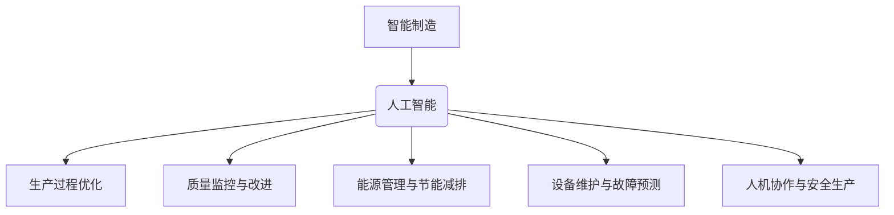

                 

### 《人工智能在智能制造过程优化中的实践》

#### 关键词

- 智能制造
- 人工智能
- 机器学习
- 深度学习
- 智能优化

#### 摘要

随着科技的飞速发展，人工智能（AI）技术在各行各业中得到了广泛应用，智能制造作为工业4.0的核心概念之一，也在逐步融入AI技术。本文旨在探讨人工智能在智能制造过程中的应用与实践，通过分析AI技术的基础知识，展示其在生产过程优化、质量监控、能源管理、设备维护和人机协作等方面的应用实例，从而深入理解AI技术在智能制造中的巨大潜力与挑战。

### 目录大纲

#### 第一部分：引论

##### 第1章：智能制造与人工智能概述

- 1.1 智能制造的定义与背景
- 1.2 人工智能在智能制造中的应用
- 1.3 本书结构

##### 第2章：人工智能技术基础

- 2.1 机器学习基本概念
- 2.2 深度学习基本原理
- 2.3 强化学习与智能制造
- 2.4 自然语言处理与智能制造

#### 第二部分：人工智能在智能制造中的应用

##### 第3章：生产过程优化

- 3.1 生产过程的自动化
- 3.2 生产过程的预测
- 3.3 生产过程的调度
- 3.4 智能生产线的构建

##### 第4章：质量监控与改进

- 4.1 质量监控系统的设计
- 4.2 质量缺陷检测
- 4.3 质量改进策略

##### 第5章：能源管理与节能减排

- 5.1 智能能源管理系统
- 5.2 节能算法与应用
- 5.3 智能制造能源消费预测

##### 第6章：设备维护与故障预测

- 6.1 设备维护策略
- 6.2 故障预测算法
- 6.3 故障诊断系统设计

##### 第7章：人机协作与安全生产

- 7.1 人机协作系统
- 7.2 安全生产风险预测
- 7.3 安全生产预警系统

#### 第三部分：人工智能在智能制造中的应用案例

##### 第8章：案例分析一：智能工厂的设计与实施

- 8.1 智能工厂的概念与架构
- 8.2 案例背景与需求分析
- 8.3 智能工厂的技术实现
- 8.4 案例总结与启示

##### 第9章：案例分析二：智能生产线的优化

- 9.1 案例背景与目标
- 9.2 生产过程数据收集与分析
- 9.3 生产过程优化方案设计
- 9.4 优化效果评估与总结

##### 第10章：案例分析三：智能质量监控系统的开发与应用

- 10.1 案例背景与需求
- 10.2 质量监控系统架构设计
- 10.3 质量监控算法实现
- 10.4 应用效果评估与改进

#### 附录

- 附录A：人工智能在智能制造中应用的资源与工具
- 附录B：参考文献
- 附录C：Mermaid 流�程图
- 附录D：核心算法原理伪代码
- 附录E：数学模型与公式
- 附录F：代码解读与分析

---

**附录C：Mermaid 流程图**



**附录D：核心算法原理伪代码**

```python
# 生产过程预测伪代码
def predict_production(process_data, model):
    # 加载预训练模型
    model.load_weights('production_model.h5')
    
    # 预处理输入数据
    processed_data = preprocess_data(process_data)
    
    # 使用模型进行预测
    prediction = model.predict(processed_data)
    
    # 后处理预测结果
    final_prediction = postprocess_prediction(prediction)
    
    return final_prediction
```

**附录E：数学模型与公式**

$$
\text{质量缺陷率} = \frac{\text{质量缺陷数量}}{\text{总生产数量}}
$$

**附录F：代码解读与分析**

```python
# 智能生产线调度代码解读
def schedule_production_line(production_orders):
    """
    调度生产线的任务，根据订单优先级和时间安排生产任务。

    :param production_orders: 生产订单列表，每个订单包含优先级和时间要求。
    :return: 调度结果列表，包含每个订单的执行时间和完成时间。
    """
    # 对订单进行排序，优先级高的先执行
    sorted_orders = sorted(production_orders, key=lambda x: x['priority'], reverse=True)

    # 初始化调度结果列表
    scheduling_results = []

    # 循环遍历排序后的订单列表
    for order in sorted_orders:
        start_time = ...  # 计算订单的起始时间
        end_time = ...    # 计算订单的结束时间
        scheduling_results.append({'order_id': order['id'], 'start_time': start_time, 'end_time': end_time})

    return scheduling_results
```

---

在接下来的内容中，我们将逐章深入探讨人工智能在智能制造过程中的应用，通过理论阐述和实践案例分析，帮助读者全面了解和掌握AI技术在该领域的实践方法与价值。

