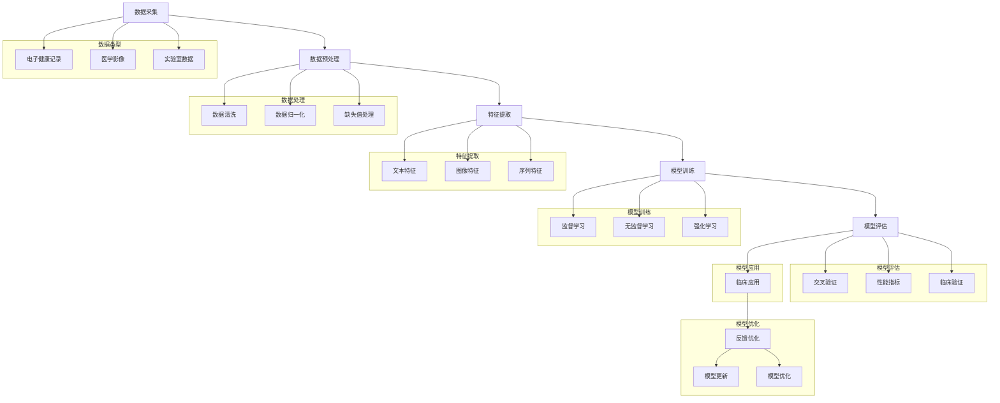

                 

### 文章标题

# 人工智能在智能医疗诊断中的应用

### 关键词

- 人工智能
- 智能医疗诊断
- 医学影像分析
- 电子健康记录分析
- 疾病预测与诊断

### 摘要

本文旨在探讨人工智能在智能医疗诊断中的应用。首先，我们概述了人工智能与智能医疗诊断的关系，并介绍了核心技术。接着，我们详细分析了医学影像分析、电子健康记录分析和疾病预测与诊断。随后，我们探讨了人工智能在医疗诊断中的伦理与法律问题，并提供了相关应用案例。最后，我们对未来发展趋势进行了展望，并提出了实践指南。

## 第一部分：人工智能在智能医疗诊断中的应用概述

### 第1章：人工智能与智能医疗诊断概述

#### 1.1 人工智能与智能医疗诊断的关系

人工智能（AI）是智能医疗诊断的基础，通过模拟人类智能，实现对医疗数据的自动化分析和处理。智能医疗诊断则利用AI技术，提供高效、准确和个性化的诊断服务。人工智能在医疗诊断中的应用不仅提高了诊断的效率，还改善了诊断的准确性，从而推动了医疗行业的进步。

#### 1.2 智能医疗诊断的核心技术

智能医疗诊断的核心技术主要包括医学影像分析、电子健康记录分析和基于自然语言处理的医疗文本分析。这些技术通过人工智能算法，实现对医学数据的深度挖掘和分析，为诊断提供有力支持。

- **医学影像分析**：通过计算机视觉技术，对医学影像进行分割、识别和分类，帮助医生进行诊断。
- **电子健康记录分析**：通过对电子健康记录的挖掘和分析，发现潜在的健康问题，为诊断提供依据。
- **基于自然语言处理的医疗文本分析**：利用自然语言处理技术，对医疗文本进行预处理、分类和实体识别，辅助医生进行诊断。

#### 1.3 人工智能在智能医疗诊断中的挑战

尽管人工智能在智能医疗诊断中展现出巨大潜力，但仍然面临一些挑战：

- **数据质量和标准化**：医疗数据质量和标准化是人工智能应用的基础，但现有医疗数据存在不一致性和噪声。
- **隐私保护和合规性**：医疗数据涉及个人隐私，如何保护患者隐私并遵守相关法律法规是重要问题。
- **算法的可靠性和可解释性**：算法的可靠性和可解释性是医疗诊断的关键，但深度学习模型通常缺乏透明度和可解释性。

### 第2章：医学影像分析

#### 2.1 医学影像分析技术介绍

医学影像分析是智能医疗诊断的重要组成部分，通过对医学影像的自动分析和处理，帮助医生进行诊断和治疗。医学影像主要包括X光片、CT扫描和MRI扫描等。

医学影像分析技术主要分为以下几类：

- **图像分割**：将医学影像中的不同组织或结构分离出来，为后续的识别和分析提供基础。
- **图像识别**：对医学影像中的特定结构或病变进行识别和分类，为诊断提供依据。
- **图像增强**：通过对医学影像进行增强处理，提高图像的质量和清晰度，便于医生进行诊断。

#### 2.2 医学影像分割与识别

- **医学影像分割**：

  医学影像分割是医学影像分析的基础，常用的分割算法包括：

  - **阈值分割**：基于图像的灰度值，将图像分为前景和背景。
  - **区域增长**：从种子点开始，逐步扩展，将相同属性的像素归为一类。
  - **基于深度学习的分割**：利用深度学习模型，对医学影像进行自动分割。

- **医学影像识别**：

  医学影像识别是医学影像分析的关键，常用的识别算法包括：

  - **卷积神经网络（CNN）**：通过卷积层、池化层和全连接层，对医学影像进行特征提取和分类。
  - **循环神经网络（RNN）**：通过对医学影像序列进行建模，实现对医学影像的动态分析。

#### 2.3 医学影像中的深度学习应用

- **卷积神经网络在医学影像分析中的应用**：

  卷积神经网络在医学影像分析中表现出色，主要应用包括：

  - **图像分割**：利用CNN对医学影像进行自动分割，提高分割精度和效率。
  - **图像识别**：利用CNN对医学影像进行分类，帮助医生进行诊断。

- **循环神经网络在医学影像序列分析中的应用**：

  循环神经网络在医学影像序列分析中具有优势，主要应用包括：

  - **序列分割**：通过对医学影像序列进行建模，实现序列分割。
  - **序列识别**：通过对医学影像序列进行建模，实现对医学影像序列的分类和诊断。

### 第3章：电子健康记录分析

#### 3.1 电子健康记录概述

电子健康记录（Electronic Health Records, EHR）是指利用计算机技术和数据库系统，对患者的健康信息进行数字化存储和管理。电子健康记录包括患者的个人信息、病史、检查报告、治疗计划等，是医疗诊断的重要依据。

电子健康记录的重要性体现在以下几个方面：

- **提高医疗效率**：电子健康记录使医疗信息的获取和传递更加便捷，有助于提高医疗效率。
- **改善医疗质量**：电子健康记录有助于医生进行全面的诊断和治疗，提高医疗质量。
- **支持医疗研究**：电子健康记录为医学研究提供了丰富的数据资源，有助于推动医学研究的发展。

#### 3.2 基于自然语言处理的医疗文本分析

基于自然语言处理的医疗文本分析是电子健康记录分析的重要手段，通过对医疗文本的预处理、分类和实体识别，实现对医疗信息的自动提取和分析。

- **医疗文本的预处理**：

  医疗文本的预处理主要包括以下步骤：

  - **文本清洗**：去除文本中的噪声和无关信息，提高文本的质量。
  - **分词**：将医疗文本拆分为单词或短语，为后续处理提供基础。
  - **词性标注**：对医疗文本中的单词进行词性标注，为语义分析提供依据。

- **医疗文本的分类与实体识别**：

  医疗文本的分类与实体识别是医疗文本分析的关键，主要包括：

  - **分类**：将医疗文本分类为不同的类别，如疾病、症状、检查等。
  - **实体识别**：识别医疗文本中的关键信息，如疾病名称、症状名称、药物名称等。

#### 3.3 电子健康记录中的机器学习应用

电子健康记录中的机器学习应用主要包括以下方面：

- **特征提取**：通过特征提取技术，从电子健康记录中提取关键特征，为诊断提供依据。
- **预测建模**：利用机器学习算法，对电子健康记录进行预测建模，实现对疾病发生和发展的预测。

### 第4章：基于人工智能的疾病预测和诊断

#### 4.1 疾病预测与诊断概述

疾病预测与诊断是智能医疗诊断的核心任务，通过利用人工智能技术，实现对疾病发生、发展和转归的预测和诊断。

- **疾病预测**：通过分析患者的电子健康记录、医学影像和其他数据，预测患者未来可能出现的疾病或健康问题。
- **疾病诊断**：通过分析患者的症状、检查结果和其他数据，确定患者所患的疾病。

疾病预测与诊断的基本流程包括以下步骤：

1. **数据收集与预处理**：收集患者的电子健康记录、医学影像和其他相关数据，进行数据清洗和预处理。
2. **特征提取**：从数据中提取关键特征，为疾病预测和诊断提供依据。
3. **模型训练与验证**：利用机器学习算法，对特征进行训练，构建预测和诊断模型。
4. **模型评估与部署**：评估模型的性能，并在实际应用中进行部署。

#### 4.2 机器学习在疾病预测中的应用

机器学习在疾病预测中的应用主要包括以下几种模型：

- **线性回归模型**：通过建立线性回归模型，预测疾病发生的可能性。
  - **伪代码**：
    ```python
    # 输入特征X和标签Y
    # 训练线性回归模型
    model = LinearRegression()
    model.fit(X, Y)
    # 预测疾病发生的可能性
    predictions = model.predict(X)
    ```

- **决策树模型**：通过建立决策树模型，预测疾病的发生。
  - **伪代码**：
    ```python
    # 输入特征X和标签Y
    # 训练决策树模型
    model = DecisionTreeClassifier()
    model.fit(X, Y)
    # 预测疾病发生的可能性
    predictions = model.predict(X)
    ```

#### 4.3 深度学习在疾病预测中的应用

深度学习在疾病预测中的应用逐渐受到关注，以下几种深度学习模型在疾病预测中表现出色：

- **卷积神经网络（CNN）**：通过卷积层、池化层和全连接层，对特征进行提取和分类。
  - **伪代码**：
    ```python
    # 输入特征X
    # 定义卷积神经网络模型
    model = Sequential()
    model.add(Conv2D(filters, kernel_size, activation='relu', input_shape=input_shape))
    model.add(MaxPooling2D(pool_size))
    model.add(Flatten())
    model.add(Dense(num_classes, activation='softmax'))
    # 编译模型
    model.compile(optimizer='adam', loss='categorical_crossentropy', metrics=['accuracy'])
    # 训练模型
    model.fit(X, Y, epochs=epochs, batch_size=batch_size)
    ```

- **循环神经网络（RNN）**：通过对序列数据进行建模，实现对疾病的动态预测。
  - **伪代码**：
    ```python
    # 输入序列X
    # 定义循环神经网络模型
    model = Sequential()
    model.add(LSTM(units, return_sequences=True))
    model.add(LSTM(units))
    model.add(Dense(num_classes, activation='softmax'))
    # 编译模型
    model.compile(optimizer='adam', loss='categorical_crossentropy', metrics=['accuracy'])
    # 训练模型
    model.fit(X, Y, epochs=epochs, batch_size=batch_size)
    ```

### 第5章：人工智能在医疗诊断中的伦理与法律问题

#### 5.1 人工智能在医疗诊断中的伦理问题

人工智能在医疗诊断中面临一些伦理问题，主要包括：

- **隐私保护**：医疗数据涉及个人隐私，如何保护患者隐私是重要问题。
- **医疗责任**：当人工智能系统出现错误时，如何确定责任归属和承担医疗责任。
- **数据使用**：如何确保人工智能系统在使用医疗数据时符合道德规范，不侵犯患者的权益。

#### 5.2 人工智能在医疗诊断中的法律问题

人工智能在医疗诊断中面临的法律问题主要包括：

- **合规性**：如何确保人工智能系统符合相关法律法规的要求，如数据保护法、医疗法规等。
- **法律责任**：如何明确人工智能系统在医疗诊断中的法律责任，确保患者权益。

### 第6章：人工智能在智能医疗诊断中的应用案例

#### 6.1 人工智能在常见疾病诊断中的应用案例

人工智能在常见疾病诊断中已取得显著成果，以下是一些应用案例：

- **心血管疾病诊断**：利用人工智能技术，对心血管疾病进行早期筛查和诊断，提高诊断准确性。
- **肿瘤检测**：利用人工智能技术，对医学影像进行分析，实现对肿瘤的早期检测和分类。

#### 6.2 人工智能在罕见病诊断中的应用案例

人工智能在罕见病诊断中也展现出巨大潜力，以下是一些应用案例：

- **罕见病诊断流程**：利用人工智能技术，对患者的电子健康记录、医学影像和其他数据进行综合分析，实现罕见病的诊断。
- **罕见病诊断案例**：利用人工智能技术，成功诊断出一例罕见病，为患者提供了及时有效的治疗。

### 第7章：未来展望

#### 7.1 人工智能在智能医疗诊断中的发展趋势

未来，人工智能在智能医疗诊断中将继续发展，主要趋势包括：

- **数据驱动的个性化医疗**：利用大数据和人工智能技术，实现个性化医疗，提高诊断和治疗的效果。
- **智能医疗诊断系统的整合**：将人工智能技术与现有医疗系统进行整合，实现智能化、自动化和高效化的医疗服务。

#### 7.2 人工智能在智能医疗诊断中的未来挑战

未来，人工智能在智能医疗诊断中仍将面临一些挑战，主要包括：

- **算法的准确性与可解释性**：如何提高算法的准确性和可解释性，确保诊断的可靠性和透明度。
- **医疗资源的公平分配**：如何确保人工智能技术在医疗资源分配中的公平性，避免加剧医疗资源的不平等。

### 第8章：实践指南

#### 8.1 人工智能在医疗诊断中的开发实践

在开发人工智能医疗诊断系统时，需要遵循以下实践指南：

- **数据采集与预处理**：确保数据的质量和一致性，进行数据清洗、归一化和特征提取。
- **模型选择与训练**：选择合适的机器学习模型，进行模型训练和验证，优化模型参数。
- **模型评估与部署**：评估模型性能，并进行部署，确保模型在实际应用中的可靠性和稳定性。

#### 8.2 医疗诊断人工智能项目的实施策略

在实施医疗诊断人工智能项目时，需要制定以下策略：

- **项目管理与组织**：明确项目目标和任务，制定项目计划，确保项目顺利实施。
- **风险管理与应对策略**：识别项目风险，制定应对策略，确保项目风险在可控范围内。

### 附录

#### 附录A：人工智能在医疗诊断中的常用工具和库

- **常用深度学习框架**：如TensorFlow、PyTorch等。
- **医学影像分析工具**：如OpenCV、ITK等。
- **自然语言处理工具**：如NLTK、spaCy等。

#### 附录B：医疗诊断人工智能项目的案例研究

- **成功案例分析**：介绍一些成功的医疗诊断人工智能项目，分析其成功原因和经验。
- **失败案例分析**：介绍一些失败的医疗诊断人工智能项目，分析其失败原因和教训。

## 文章末尾

作者：AI天才研究院/AI Genius Institute & 禅与计算机程序设计艺术/Zen And The Art of Computer Programming

---

### 背景介绍

智能医疗诊断是指利用人工智能（AI）技术，对医疗数据进行自动化分析和处理，从而辅助医生进行疾病预测、诊断和治疗。随着医疗数据的爆炸性增长和人工智能技术的快速发展，智能医疗诊断在医疗行业中的应用越来越广泛。智能医疗诊断不仅提高了诊断的准确性，还提高了诊断的效率，为患者提供了更加精准、个性化的医疗服务。

智能医疗诊断的关键在于如何有效地利用人工智能技术对海量医疗数据进行处理和分析。人工智能技术包括机器学习、深度学习、自然语言处理等，这些技术在医疗诊断中发挥了重要作用。例如，机器学习可以用于疾病预测和诊断，深度学习可以用于医学影像分析和电子健康记录分析，自然语言处理可以用于医疗文本分析。

在智能医疗诊断中，人工智能技术面临着一系列挑战。首先，医疗数据的质量和标准化是一个重要问题。医疗数据通常存在噪声、不一致性和缺失值，这给数据预处理和特征提取带来了困难。其次，隐私保护和合规性也是关键问题。医疗数据涉及个人隐私，如何保护患者隐私并遵守相关法律法规是智能医疗诊断应用中必须考虑的问题。最后，算法的可靠性和可解释性也是人工智能在医疗诊断中需要解决的问题。深度学习模型通常缺乏透明度和可解释性，这可能导致诊断结果的不确定性和不可预测性。

总之，智能医疗诊断是人工智能技术在医疗行业中的重要应用领域。通过利用人工智能技术，智能医疗诊断可以提高诊断的准确性和效率，为患者提供更加精准、个性化的医疗服务。然而，智能医疗诊断也面临着一系列挑战，需要进一步研究和解决。

### 核心概念与联系

在智能医疗诊断中，有几个核心概念和技术是至关重要的，这些概念和技术相互关联，共同构成了智能医疗诊断的基础。下面我们将通过一个Mermaid流程图来展示这些核心概念之间的联系。



**Mermaid流程图解释**：

1. **数据采集**：数据采集是智能医疗诊断的第一步，包括电子健康记录、医学影像和实验室数据等。这些数据为后续的分析和处理提供了基础。

2. **数据预处理**：数据预处理是确保数据质量和一致性的关键步骤，包括数据清洗、数据归一化和缺失值处理。数据清洗去除噪声和无关信息，数据归一化确保不同特征在同一尺度上，缺失值处理填补缺失的数据。

3. **特征提取**：特征提取是从原始数据中提取出有用的信息，为模型训练提供输入。文本特征、图像特征和序列特征是常见的特征类型。

4. **模型训练**：模型训练是使用算法学习数据中的规律，常见的模型训练方法包括监督学习、无监督学习和强化学习。监督学习有标注的数据作为训练集，无监督学习没有标注数据，强化学习通过奖励机制学习。

5. **模型评估**：模型评估是评估模型性能的重要步骤，包括交叉验证、性能指标（如准确率、召回率）和临床验证。交叉验证用于评估模型的泛化能力，性能指标用于量化模型效果，临床验证用于验证模型在实际临床应用中的效果。

6. **临床应用**：模型评估完成后，模型可以应用于实际临床场景，如疾病预测、诊断和治疗建议。

7. **反馈优化**：通过临床反馈，不断优化模型，提高模型的准确性和实用性。

通过这个流程图，我们可以清晰地看到智能医疗诊断中各个核心概念之间的相互关系，以及它们在诊断过程中的作用。这种结构化的方法有助于理解和设计复杂的智能医疗诊断系统。

### 医学影像分析技术介绍

医学影像分析是智能医疗诊断中的一个关键领域，它利用计算机视觉和人工智能技术对医学影像进行自动分析和处理。医学影像包括X光片、CT扫描和MRI扫描等多种类型，每种类型的影像都有其特定的应用和诊断价值。

首先，我们来看一下医学影像的分类：

1. **X光片**：X光片是最常见的医学影像之一，主要用于骨折、肺炎等疾病的诊断。X光片具有高分辨率，能够清晰地显示骨骼和肺部的病变。
   
2. **CT扫描**：CT（计算机断层扫描）通过多个角度的X光扫描，重建出人体内部的断层图像，用于检测肿瘤、脑出血等疾病。CT具有较高的分辨率，能够显示细微的结构变化。

3. **MRI扫描**：MRI（磁共振成像）利用磁场和无线电波产生人体内部的图像，主要用于检测软组织、神经系统等疾病。MRI具有较高的软组织分辨率，能够清晰地显示脑部、脊髓等结构。

接下来，我们介绍常见的医学影像分析算法：

1. **图像分割**：图像分割是将医学影像中的不同组织或结构分离出来，为后续的识别和分析提供基础。常见的图像分割算法包括：

   - **阈值分割**：基于图像的灰度值，将图像分为前景和背景。这种方法简单直观，但可能无法处理复杂的图像。
   - **区域增长**：从种子点开始，逐步扩展，将相同属性的像素归为一类。这种方法适用于结构较为简单的图像。
   - **基于深度学习的分割**：利用深度学习模型，如卷积神经网络（CNN）进行图像分割。这种方法能够自动学习图像的特征，分割精度较高。

2. **图像识别**：图像识别是对医学影像中的特定结构或病变进行识别和分类，为诊断提供依据。常见的图像识别算法包括：

   - **卷积神经网络（CNN）**：通过卷积层、池化层和全连接层，对医学影像进行特征提取和分类。CNN在图像识别任务中表现出色，能够处理复杂的图像。
   - **循环神经网络（RNN）**：通过对医学影像序列进行建模，实现对医学影像的动态分析。RNN适用于时间序列数据，但在医学影像识别中应用较少。

3. **图像增强**：图像增强是通过处理图像，提高图像的质量和清晰度，便于医生进行诊断。常见的图像增强方法包括：

   - **直方图均衡**：通过调整图像的灰度分布，提高图像的对比度。
   - **滤波**：通过滤波器去除图像中的噪声，提高图像的清晰度。
   - **锐化**：通过增强图像的边缘和细节，提高图像的清晰度。

通过这些技术，医学影像分析能够自动、准确地识别和诊断疾病，提高了诊断的效率和准确性。接下来，我们将详细探讨医学影像分割与识别的具体算法。

### 医学影像分割与识别

医学影像分割与识别是医学影像分析的核心步骤，直接影响诊断的准确性和效率。在这部分内容中，我们将详细讨论医学影像分割与识别的具体算法，包括分割算法和识别算法。

#### 分割算法

医学影像分割是将医学影像中的不同组织或结构分离出来，为后续的识别和分析提供基础。以下是一些常见的医学影像分割算法：

1. **阈值分割**：

   阈值分割是一种简单直观的分割方法，它基于图像的灰度值将图像分为前景和背景。具体步骤如下：

   - **选择阈值**：根据图像的灰度分布选择一个合适的阈值。
   - **二值化**：将图像的灰度值与阈值进行比较，大于阈值的像素归为前景，小于阈值的像素归为背景。
   - **后处理**：对分割结果进行一些必要的后处理，如去除噪声、填补空洞等。

   伪代码如下：

   ```python
   def threshold_segmentation(image, threshold):
       binary_image = np.where(image > threshold, 1, 0)
       segmented_image = post_process(binary_image)
       return segmented_image
   ```

2. **区域增长**：

   区域增长是一种基于种子点的分割方法，它从种子点开始，逐步扩展，将相同属性的像素归为一类。具体步骤如下：

   - **选择种子点**：在医学影像中选择初始种子点。
   - **扩展区域**：从种子点开始，逐步扩展，将相同属性的像素归为一类。
   - **后处理**：对分割结果进行一些必要的后处理，如去除噪声、填补空洞等。

   伪代码如下：

   ```python
   def region_growing(segmentation, seed_points):
       for seed in seed_points:
           grow_region(segmentation, seed)
       segmented_image = post_process(segmentation)
       return segmented_image
   ```

3. **基于深度学习的分割**：

   基于深度学习的分割利用深度学习模型，如卷积神经网络（CNN）进行图像分割。这种方法能够自动学习图像的特征，分割精度较高。具体步骤如下：

   - **数据准备**：准备大量的带有标注的医学影像数据作为训练集。
   - **模型训练**：使用卷积神经网络对训练集进行训练，学习图像分割的规律。
   - **模型预测**：使用训练好的模型对新的医学影像进行预测，得到分割结果。

   伪代码如下：

   ```python
   def deep_learning_segmentation(image, model):
       prediction = model.predict(image)
       segmented_image = decode_prediction(prediction)
       return segmented_image
   ```

#### 识别算法

医学影像识别是对医学影像中的特定结构或病变进行识别和分类，为诊断提供依据。以下是一些常见的医学影像识别算法：

1. **卷积神经网络（CNN）**：

   卷积神经网络是一种强大的图像识别算法，通过卷积层、池化层和全连接层，对医学影像进行特征提取和分类。具体步骤如下：

   - **卷积层**：通过卷积操作提取图像的特征。
   - **池化层**：通过池化操作降低特征图的维度。
   - **全连接层**：通过全连接层对特征进行分类。

   伪代码如下：

   ```python
   class ConvolutionalNeuralNetwork:
       def __init__(self):
           # 初始化网络结构
       
       def forward_pass(self, image):
           # 前向传播，提取特征并分类
           return predicted_class
   ```

2. **循环神经网络（RNN）**：

   循环神经网络是一种适用于时间序列数据的算法，通过对医学影像序列进行建模，实现对医学影像的动态分析。具体步骤如下：

   - **嵌入层**：将医学影像序列转化为向量表示。
   - **循环层**：通过循环层对序列进行建模。
   - **输出层**：通过输出层对序列进行分类。

   伪代码如下：

   ```python
   class RecurrentNeuralNetwork:
       def __init__(self):
           # 初始化网络结构
       
       def forward_pass(self, sequence):
           # 前向传播，对序列进行建模并分类
           return predicted_class
   ```

通过上述分割算法和识别算法，医学影像分析能够自动、准确地识别和诊断疾病，提高了诊断的效率和准确性。接下来，我们将探讨医学影像中的深度学习应用。

### 医学影像中的深度学习应用

深度学习在医学影像中的应用日益广泛，因其强大的特征提取和模式识别能力，能够显著提高医学影像分析的准确性和效率。在本节中，我们将重点介绍卷积神经网络（CNN）在医学影像分析中的应用，以及循环神经网络（RNN）在医学影像序列分析中的应用。

#### 卷积神经网络（CNN）在医学影像分析中的应用

卷积神经网络（CNN）是一种专门用于图像处理的深度学习模型，由多个卷积层、池化层和全连接层组成。CNN在医学影像分析中的应用主要包括图像分割和图像分类两个方面。

1. **图像分割**：

   图像分割是将医学影像中的特定区域分离出来，为后续分析提供基础。CNN在图像分割中的应用主要通过以下步骤实现：

   - **卷积层**：通过卷积操作提取图像的低级特征，如边缘、纹理等。
   - **池化层**：通过池化操作降低特征图的维度，提高模型的泛化能力。
   - **全连接层**：通过全连接层将特征映射到不同的类别。

   以下是一个简单的CNN图像分割的伪代码示例：

   ```python
   class ConvolutionalNeuralNetwork:
       def __init__(self):
           self.conv1 = Conv2D(filters, kernel_size, activation='relu')
           self.pool1 = MaxPooling2D(pool_size)
           self.conv2 = Conv2D(filters, kernel_size, activation='relu')
           self.pool2 = MaxPooling2D(pool_size)
           self.flatten = Flatten()
           self.dense = Dense(num_classes, activation='softmax')
       
       def forward_pass(self, image):
           x = self.conv1(image)
           x = self.pool1(x)
           x = self.conv2(x)
           x = self.pool2(x)
           x = self.flatten(x)
           output = self.dense(x)
           return output
   ```

2. **图像分类**：

   图像分类是将医学影像中的图像分类到不同的类别，如肿瘤、正常组织等。CNN在图像分类中的应用同样依赖于卷积层、池化层和全连接层。以下是一个简单的CNN图像分类的伪代码示例：

   ```python
   class ConvolutionalNeuralNetwork:
       def __init__(self):
           self.conv1 = Conv2D(filters, kernel_size, activation='relu')
           self.pool1 = MaxPooling2D(pool_size)
           self.conv2 = Conv2D(filters, kernel_size, activation='relu')
           self.pool2 = MaxPooling2D(pool_size)
           self.flatten = Flatten()
           self.dense = Dense(num_classes, activation='softmax')
       
       def forward_pass(self, image):
           x = self.conv1(image)
           x = self.pool1(x)
           x = self.conv2(x)
           x = self.pool2(x)
           x = self.flatten(x)
           output = self.dense(x)
           return output
   ```

#### 循环神经网络（RNN）在医学影像序列分析中的应用

循环神经网络（RNN）是一种能够处理序列数据的深度学习模型，适合用于医学影像序列分析。在医学影像序列分析中，RNN能够对一系列医学影像进行建模，从而捕捉影像之间的时空关系。

1. **医学影像序列建模**：

   医学影像序列建模是通过RNN对一系列医学影像进行建模，以捕捉影像之间的时空关系。以下是一个简单的RNN医学影像序列建模的伪代码示例：

   ```python
   class RecurrentNeuralNetwork:
       def __init__(self):
           self.embedding = Embedding(vocabulary_size, embedding_dim)
           self.rnn = LSTM(units, return_sequences=True)
           self.dense = Dense(num_classes, activation='softmax')
       
       def forward_pass(self, sequence):
           x = self.embedding(sequence)
           x = self.rnn(x)
           output = self.dense(x)
           return output
   ```

2. **医学影像序列分类**：

   医学影像序列分类是将一系列医学影像分类到不同的类别，如疾病类型等。RNN在医学影像序列分类中的应用通过以下步骤实现：

   - **嵌入层**：将医学影像序列中的每个影像嵌入到高维空间中。
   - **循环层**：通过RNN层对序列进行建模。
   - **输出层**：通过全连接层对序列进行分类。

   以下是一个简单的RNN医学影像序列分类的伪代码示例：

   ```python
   class RecurrentNeuralNetwork:
       def __init__(self):
           self.embedding = Embedding(vocabulary_size, embedding_dim)
           self.rnn = LSTM(units, return_sequences=True)
           self.dense = Dense(num_classes, activation='softmax')
       
       def forward_pass(self, sequence):
           x = self.embedding(sequence)
           x = self.rnn(x)
           output = self.dense(x)
           return output
   ```

通过卷积神经网络（CNN）和循环神经网络（RNN）在医学影像分析中的应用，深度学习技术能够显著提高医学影像分析的准确性和效率，为智能医疗诊断提供了有力支持。

### 电子健康记录概述

电子健康记录（Electronic Health Records, EHR）是一种数字化的医疗信息记录，它存储了患者的个人健康信息、诊疗记录、检查结果、药物处方等。EHR的出现极大地改变了传统医疗记录的方式，使得医疗信息能够更高效、更安全地存储和传输。

首先，我们来看一下EHR的结构。EHR通常包括以下几个部分：

1. **患者基本信息**：包括姓名、性别、年龄、身份证号、联系方式等。
2. **诊疗记录**：包括患者的门诊记录、住院记录、手术记录、疾病诊断和治疗方案等。
3. **检查结果**：包括各种检查的影像数据、实验室检测结果等。
4. **药物处方**：包括患者的药物使用记录、剂量、用药时间等。
5. **过敏史和病史**：包括患者的过敏史、既往病史等。

EHR的重要性体现在以下几个方面：

1. **提高医疗效率**：EHR使得医疗信息的获取和传递更加便捷，医生可以快速访问患者的健康信息，提高了诊断和治疗的速度。
2. **改善医疗质量**：EHR有助于医生进行全面的诊断和治疗，减少了漏诊和误诊的风险，从而提高了医疗质量。
3. **支持医疗研究**：EHR为医学研究提供了丰富的数据资源，研究人员可以从中提取有价值的信息，进行数据分析和研究。

在EHR中，数据的质量和标准化至关重要。数据质量直接影响到EHR的使用效果，如果数据存在噪声、不一致或缺失，将严重影响数据分析的准确性和可靠性。因此，对EHR进行数据清洗、数据归一化和数据标准化是非常必要的。

- **数据清洗**：数据清洗是指去除EHR中的噪声和无关信息，提高数据的质量。具体步骤包括去除重复记录、纠正错误数据、填补缺失值等。
- **数据归一化**：数据归一化是指将不同特征的数据转换到同一尺度上，以便于后续的分析和处理。例如，将年龄、身高、体重等数据归一化到0-1之间。
- **数据标准化**：数据标准化是指将不同来源的数据进行统一格式和结构化处理，以便于数据的存储和检索。例如，将药物名称统一编码，将诊断代码标准化。

通过上述步骤，EHR中的数据质量和标准化得到了显著提升，为后续的数据分析和机器学习模型训练提供了可靠的数据基础。接下来，我们将探讨基于自然语言处理的医疗文本分析。

### 基于自然语言处理的医疗文本分析

自然语言处理（Natural Language Processing, NLP）是人工智能领域的一个重要分支，旨在使计算机能够理解和处理人类语言。在医疗领域，NLP技术被广泛应用于医疗文本的预处理、分类和实体识别，以辅助医生进行诊断和治疗。

首先，我们来了解一下医疗文本的预处理。医疗文本的预处理是NLP的基础步骤，主要包括文本清洗、分词和词性标注。

1. **文本清洗**：
   - **去除停用词**：停用词是指在特定语境下没有实际意义的词，如“的”、“和”等。去除停用词可以减少噪声，提高文本质量。
   - **去除特殊字符**：医疗文本中可能包含各种特殊字符，如标点符号、符号等。去除这些特殊字符有助于统一文本格式。
   - **词干提取**：词干提取是将单词还原到其基本形式，如“跑步”、“跑动”、“跑步者”都还原为“跑步”。

2. **分词**：
   - **分词技术**：分词是将文本分割成单词或短语的步骤。常见的分词技术包括基于词典的分词、基于统计的分词和基于机器学习的分词。
   - **词形还原**：词形还原是将分词后的单词还原到其基本形式，如“跑步”还原为“跑步”。

3. **词性标注**：
   - **词性标注**：词性标注是将文本中的每个词标注为不同的词性，如名词、动词、形容词等。词性标注有助于进一步理解文本的语义。

接下来，我们探讨医疗文本的分类与实体识别。

1. **医疗文本的分类**：
   - **分类技术**：医疗文本分类是将医疗文本分类到不同的类别，如疾病、症状、药物等。常见的分类技术包括基于规则的分类、基于机器学习的分类和深度学习分类。
   - **分类模型**：常见的分类模型包括朴素贝叶斯、支持向量机、随机森林和卷积神经网络等。

2. **医疗实体的识别**：
   - **实体识别**：医疗实体识别是从医疗文本中识别出关键信息，如疾病名称、药物名称、症状等。实体识别是医疗NLP的重要任务，有助于提取重要的医疗信息。
   - **实体识别模型**：常见的实体识别模型包括基于规则的方法、基于模板的方法和基于深度学习的方法。例如，BERT、RoBERTa等预训练模型在医疗实体识别中表现出色。

通过NLP技术对医疗文本进行预处理、分类和实体识别，可以大大提高医疗数据的质量和可操作性，为智能医疗诊断提供了强有力的支持。接下来，我们将探讨电子健康记录中的机器学习应用。

### 电子健康记录中的机器学习应用

电子健康记录（EHR）是智能医疗诊断的重要数据来源，其中蕴含了大量的患者信息、病史、检查结果和治疗记录。通过机器学习技术，可以从这些数据中提取有用信息，实现对疾病的预测和诊断。以下是电子健康记录中的机器学习应用，包括特征提取和预测建模。

#### 特征提取

特征提取是机器学习应用的关键步骤，目的是从原始数据中提取出对预测任务有用的信息。在电子健康记录中，特征提取可以从以下几个方面进行：

1. **患者基本信息**：包括年龄、性别、身高、体重等。这些基本信息可以直接作为特征，因为它们与疾病的发病率和严重程度有关。
2. **病史和诊断**：包括过去的疾病诊断和治疗记录。这些信息可以用来构建与当前疾病相关的特征。
3. **实验室检测结果**：包括血液检查、尿液检查、影像学检查等结果。这些结果可以量化为具体的数值，作为特征使用。
4. **药物使用记录**：包括患者过去使用的药物种类和剂量。这些信息可以帮助预测患者的健康状况和疾病风险。
5. **生活方式信息**：包括吸烟、饮酒、饮食习惯等。这些生活方式信息与某些疾病的发生有关，可以用来构建特征。

#### 预测建模

预测建模是通过机器学习算法对特征进行训练，建立预测模型。以下是几种常见的机器学习算法及其在电子健康记录中的应用：

1. **线性回归模型**：

   线性回归是一种简单但强大的预测模型，适用于预测连续值输出。在电子健康记录中，可以使用线性回归来预测患者的血糖水平、血压等生理指标。

   - **模型建立**：
     ```python
     from sklearn.linear_model import LinearRegression
     model = LinearRegression()
     model.fit(X, y)
     ```

   - **模型预测**：
     ```python
     predictions = model.predict(X_new)
     ```

2. **决策树模型**：

   决策树是一种易于理解的分类模型，适用于分类问题。在电子健康记录中，可以使用决策树来预测患者是否患有特定疾病。

   - **模型建立**：
     ```python
     from sklearn.tree import DecisionTreeClassifier
     model = DecisionTreeClassifier()
     model.fit(X, y)
     ```

   - **模型预测**：
     ```python
     predictions = model.predict(X_new)
     ```

3. **支持向量机（SVM）**：

   支持向量机是一种强大的分类模型，适用于高维数据。在电子健康记录中，可以使用SVM来预测患者是否患有某种疾病。

   - **模型建立**：
     ```python
     from sklearn.svm import SVC
     model = SVC(kernel='linear')
     model.fit(X, y)
     ```

   - **模型预测**：
     ```python
     predictions = model.predict(X_new)
     ```

4. **神经网络模型**：

   神经网络是一种强大的深度学习模型，适用于复杂的数据分析任务。在电子健康记录中，可以使用神经网络来预测患者的健康状况和疾病风险。

   - **模型建立**：
     ```python
     from tensorflow.keras.models import Sequential
     from tensorflow.keras.layers import Dense
     model = Sequential()
     model.add(Dense(units=64, activation='relu', input_shape=(input_size,)))
     model.add(Dense(units=1, activation='sigmoid'))
     model.compile(optimizer='adam', loss='binary_crossentropy', metrics=['accuracy'])
     model.fit(X, y, epochs=10, batch_size=32)
     ```

   - **模型预测**：
     ```python
     predictions = model.predict(X_new)
     ```

通过这些机器学习算法，可以从电子健康记录中提取出有价值的信息，实现对疾病的预测和诊断。这些预测模型可以提高诊断的准确性和效率，为医生提供有力的辅助工具。接下来，我们将探讨基于人工智能的疾病预测和诊断。

### 疾病预测与诊断概述

疾病预测与诊断是智能医疗诊断的核心任务，旨在利用人工智能技术，通过分析患者的电子健康记录、医学影像和其他相关数据，预测患者未来可能出现的疾病或健康问题，并对已知的疾病进行诊断。这一过程不仅提高了诊断的准确性和效率，还为个性化医疗提供了重要支持。

#### 疾病预测与诊断的基本流程

疾病预测与诊断的基本流程通常包括以下步骤：

1. **数据收集与预处理**：收集患者的电子健康记录（EHR）、医学影像、实验室检测结果、生活方式信息等数据。然后对数据进行清洗、归一化和特征提取，以确保数据的质量和一致性。

2. **特征提取**：从原始数据中提取出对疾病预测和诊断有价值的特征。这些特征可以包括患者的个人信息、病史、检查结果、药物使用记录等。

3. **模型训练与验证**：利用机器学习算法对特征进行训练，构建预测和诊断模型。常见的机器学习算法包括线性回归、决策树、支持向量机、神经网络等。在模型训练过程中，通过交叉验证等方法评估模型的性能。

4. **模型评估与部署**：评估模型的性能，包括准确率、召回率、F1分数等指标。如果模型性能满足要求，将其部署到实际应用中，用于疾病预测和诊断。

5. **临床应用与反馈**：在实际临床场景中应用模型，对患者的疾病进行预测和诊断。同时，收集临床反馈，用于模型优化和改进。

#### 常见的疾病预测模型

在疾病预测与诊断中，常用的模型包括以下几种：

1. **线性回归模型**：

   线性回归模型是一种简单的预测模型，适用于预测连续值输出。例如，预测患者的血糖水平或血压。

   - **模型公式**：
     $$ y = \beta_0 + \beta_1x_1 + \beta_2x_2 + ... + \beta_nx_n $$

   - **伪代码**：
     ```python
     from sklearn.linear_model import LinearRegression
     model = LinearRegression()
     model.fit(X, y)
     predictions = model.predict(X_new)
     ```

2. **决策树模型**：

   决策树模型是一种易于理解的分类模型，适用于分类问题。例如，预测患者是否患有某种疾病。

   - **模型公式**：
     $$ f(x) = \prod_{i=1}^{n} \left[ \frac{1}{1 + e^{-(\beta_0 + \beta_1x_1 + ... + \beta_nx_n)}} \right] $$

   - **伪代码**：
     ```python
     from sklearn.tree import DecisionTreeClassifier
     model = DecisionTreeClassifier()
     model.fit(X, y)
     predictions = model.predict(X_new)
     ```

3. **支持向量机（SVM）**：

   支持向量机是一种强大的分类模型，适用于高维数据。例如，预测患者是否患有某种疾病。

   - **模型公式**：
     $$ y = sign(\beta_0 + \beta_1x_1 + ... + \beta_nx_n) $$

   - **伪代码**：
     ```python
     from sklearn.svm import SVC
     model = SVC(kernel='linear')
     model.fit(X, y)
     predictions = model.predict(X_new)
     ```

4. **神经网络模型**：

   神经网络是一种强大的深度学习模型，适用于复杂的数据分析任务。例如，预测患者的健康状况和疾病风险。

   - **模型公式**：
     $$ a_{j}^{(L)} = \sigma \left( \sum_{i=1}^{M} w_{ij}^{(L)} a_{i}^{(L-1)} + b_j^{(L)} \right) $$

   - **伪代码**：
     ```python
     from tensorflow.keras.models import Sequential
     from tensorflow.keras.layers import Dense
     model = Sequential()
     model.add(Dense(units=64, activation='relu', input_shape=(input_size,)))
     model.add(Dense(units=1, activation='sigmoid'))
     model.compile(optimizer='adam', loss='binary_crossentropy', metrics=['accuracy'])
     model.fit(X, y, epochs=10, batch_size=32)
     ```

通过这些模型，可以实现对疾病的预测和诊断。接下来，我们将深入探讨机器学习在疾病预测中的应用。

### 机器学习在疾病预测中的应用

机器学习在疾病预测中发挥着重要作用，通过分析大量的医疗数据，可以实现对疾病发生风险的预测。在这一部分，我们将讨论几种常见的机器学习算法，并展示它们在疾病预测中的应用。

#### 线性回归模型

线性回归模型是最简单的机器学习算法之一，适用于预测连续值输出。在疾病预测中，可以使用线性回归来预测患者的某个特定指标，如血糖水平、血压等。

- **模型公式**：

  线性回归模型的基本公式为：
  $$ y = \beta_0 + \beta_1x_1 + \beta_2x_2 + ... + \beta_nx_n $$

  其中，\( y \) 是预测的目标值，\( x_1, x_2, ..., x_n \) 是输入特征，\( \beta_0, \beta_1, \beta_2, ..., \beta_n \) 是模型的参数。

- **伪代码示例**：

  ```python
  from sklearn.linear_model import LinearRegression

  # 创建线性回归模型
  model = LinearRegression()

  # 训练模型
  model.fit(X_train, y_train)

  # 预测
  predictions = model.predict(X_test)
  ```

#### 决策树模型

决策树模型是一种基于树形决策规则的分类算法，适用于预测离散值输出。在疾病预测中，可以使用决策树来预测患者是否患有特定疾病。

- **模型公式**：

  决策树模型的决策规则如下：
  $$ \text{如果 } x_{i1} \leq \beta_{i1}, \text{则取分支 } l_1 $$
  $$ \text{否则，如果 } x_{i2} \leq \beta_{i2}, \text{则取分支 } l_2 $$
  $$ \text{... } $$
  $$ \text{否则，取分支 } l_n $$

  其中，\( x_{i1}, x_{i2}, ..., x_{in} \) 是输入特征，\( \beta_{i1}, \beta_{i2}, ..., \beta_{in} \) 是阈值。

- **伪代码示例**：

  ```python
  from sklearn.tree import DecisionTreeClassifier

  # 创建决策树模型
  model = DecisionTreeClassifier()

  # 训练模型
  model.fit(X_train, y_train)

  # 预测
  predictions = model.predict(X_test)
  ```

#### 支持向量机（SVM）

支持向量机是一种强大的分类算法，适用于高维数据。在疾病预测中，可以使用SVM来预测患者是否患有某种疾病。

- **模型公式**：

  支持向量机的决策规则如下：
  $$ y = sign(\beta_0 + \beta_1x_1 + ... + \beta_nx_n - \rho) $$

  其中，\( y \) 是预测的目标值，\( x_1, x_2, ..., x_n \) 是输入特征，\( \beta_0, \beta_1, ..., \beta_n \) 是模型的参数，\( \rho \) 是松弛变量。

- **伪代码示例**：

  ```python
  from sklearn.svm import SVC

  # 创建SVM模型
  model = SVC(kernel='linear')

  # 训练模型
  model.fit(X_train, y_train)

  # 预测
  predictions = model.predict(X_test)
  ```

#### 深度学习模型

深度学习模型，如卷积神经网络（CNN）和循环神经网络（RNN），在疾病预测中表现出色，能够处理复杂的数据结构。

- **卷积神经网络（CNN）**：

  卷积神经网络擅长处理图像数据，可以用于医学影像分析。在疾病预测中，可以使用CNN来提取医学影像的特征，并用于疾病预测。

  - **模型公式**：

    $$ a_{ij}^{(L)} = \sigma \left( \sum_{k=1}^{C} w_{ik}^{(L)} a_{kj}^{(L-1)} + b_j^{(L)} \right) $$

  - **伪代码示例**：

    ```python
    from tensorflow.keras.models import Sequential
    from tensorflow.keras.layers import Conv2D, MaxPooling2D, Flatten, Dense

    # 创建CNN模型
    model = Sequential()
    model.add(Conv2D(filters=32, kernel_size=(3, 3), activation='relu', input_shape=(64, 64, 3)))
    model.add(MaxPooling2D(pool_size=(2, 2)))
    model.add(Flatten())
    model.add(Dense(units=1, activation='sigmoid'))

    # 编译模型
    model.compile(optimizer='adam', loss='binary_crossentropy', metrics=['accuracy'])

    # 训练模型
    model.fit(X_train, y_train, epochs=10, batch_size=32)
    ```

- **循环神经网络（RNN）**：

  循环神经网络擅长处理序列数据，可以用于时间序列分析。在疾病预测中，可以使用RNN来处理患者的医疗记录序列，并预测疾病发生风险。

  - **模型公式**：

    $$ h_t = \sigma \left( W_h \cdot [h_{t-1}, x_t] + b_h \right) $$

  - **伪代码示例**：

    ```python
    from tensorflow.keras.models import Sequential
    from tensorflow.keras.layers import LSTM, Dense

    # 创建RNN模型
    model = Sequential()
    model.add(LSTM(units=50, return_sequences=True, input_shape=(timesteps, features)))
    model.add(LSTM(units=50))
    model.add(Dense(units=1, activation='sigmoid'))

    # 编译模型
    model.compile(optimizer='adam', loss='binary_crossentropy', metrics=['accuracy'])

    # 训练模型
    model.fit(X_train, y_train, epochs=10, batch_size=32)
    ```

通过这些机器学习算法，可以实现对疾病发生风险的准确预测，为早期诊断和治疗提供了有力支持。接下来，我们将讨论深度学习在疾病预测中的应用。

### 深度学习在疾病预测中的应用

深度学习在疾病预测中具有显著优势，尤其是在处理复杂和非线性数据时。在这一部分，我们将重点讨论卷积神经网络（CNN）和循环神经网络（RNN）在疾病预测中的应用，并展示它们的优势。

#### 卷积神经网络（CNN）在疾病预测中的应用

卷积神经网络（CNN）是一种深度学习模型，特别适用于处理图像数据。在疾病预测中，CNN可以用于医学影像分析，如X光片、CT扫描和MRI扫描等。

**优势**：

1. **特征自动提取**：CNN能够自动学习图像中的特征，无需人工设计特征，从而简化了模型设计过程。
2. **高精度**：CNN在医学影像分割和识别任务中表现出色，能够提高疾病预测的准确性。
3. **并行处理**：CNN能够并行处理大量数据，从而提高计算效率。

**应用案例**：

1. **心血管疾病预测**：CNN可以用于分析心血管疾病的医学影像，如冠状动脉CT造影（CTA）图像，预测患者是否患有冠状动脉疾病。

2. **肿瘤检测**：CNN可以用于分析医学影像中的肿瘤，如乳腺癌的乳腺X光片（Mammogram），提高肿瘤检测的准确性。

**示例伪代码**：

```python
from tensorflow.keras.models import Sequential
from tensorflow.keras.layers import Conv2D, MaxPooling2D, Flatten, Dense

# 创建CNN模型
model = Sequential()
model.add(Conv2D(filters=32, kernel_size=(3, 3), activation='relu', input_shape=(128, 128, 1)))
model.add(MaxPooling2D(pool_size=(2, 2)))
model.add(Flatten())
model.add(Dense(units=1, activation='sigmoid'))

# 编译模型
model.compile(optimizer='adam', loss='binary_crossentropy', metrics=['accuracy'])

# 训练模型
model.fit(X_train, y_train, epochs=10, batch_size=32)
```

#### 循环神经网络（RNN）在疾病预测中的应用

循环神经网络（RNN）是一种能够处理序列数据的深度学习模型，特别适用于时间序列分析。在疾病预测中，RNN可以用于处理患者的医疗记录序列，如电子健康记录（EHR）。

**优势**：

1. **序列建模**：RNN能够捕捉序列数据中的时间依赖关系，从而提高疾病预测的准确性。
2. **动态特性**：RNN可以处理时间序列数据中的动态变化，如患者的健康状态随时间的变化。
3. **灵活适用**：RNN适用于多种类型的医疗记录，如文本、图像和声音等。

**应用案例**：

1. **糖尿病管理**：RNN可以用于分析患者的血糖数据序列，预测未来的血糖水平，为糖尿病管理提供依据。

2. **抑郁症预测**：RNN可以用于分析患者的情绪记录序列，预测患者是否可能患有抑郁症。

**示例伪代码**：

```python
from tensorflow.keras.models import Sequential
from tensorflow.keras.layers import LSTM, Dense

# 创建RNN模型
model = Sequential()
model.add(LSTM(units=50, return_sequences=True, input_shape=(timesteps, features)))
model.add(LSTM(units=50))
model.add(Dense(units=1, activation='sigmoid'))

# 编译模型
model.compile(optimizer='adam', loss='binary_crossentropy', metrics=['accuracy'])

# 训练模型
model.fit(X_train, y_train, epochs=10, batch_size=32)
```

通过CNN和RNN在疾病预测中的应用，深度学习技术能够显著提高疾病预测的准确性和效率，为个性化医疗提供了有力支持。接下来，我们将讨论人工智能在医疗诊断中的伦理与法律问题。

### 人工智能在医疗诊断中的伦理与法律问题

随着人工智能（AI）技术在医疗诊断领域的广泛应用，伦理和法律问题逐渐成为关注的焦点。人工智能在医疗诊断中的伦理问题主要涉及隐私保护、医疗责任和数据使用等方面；法律问题则涉及合规性和法律责任。下面我们将详细探讨这些问题。

#### 伦理问题

1. **隐私保护**：

   医疗数据通常涉及个人隐私，如何保护患者隐私是人工智能在医疗诊断中必须考虑的重要问题。医疗数据包括患者的个人信息、病史、诊断结果等，这些数据一旦泄露，可能对患者的隐私和安全造成严重威胁。因此，在开发和使用人工智能医疗诊断系统时，必须采取严格的数据保护措施，如数据加密、访问控制、匿名化处理等。

2. **医疗责任**：

   当人工智能医疗诊断系统出现错误时，如何确定责任归属和承担医疗责任是一个复杂的伦理问题。传统的医疗责任通常由医生承担，但在人工智能介入的情况下，责任归属变得模糊。一种可能的解决方案是建立人工智能医疗诊断系统的责任保险，以保障患者权益。

3. **数据使用**：

   数据使用是另一个伦理问题。人工智能医疗诊断系统需要大量数据来训练模型，这些数据通常来自患者的电子健康记录（EHR）。如何确保数据使用符合患者的知情同意，以及如何平衡数据使用的利益和风险，是伦理审查的重要内容。

#### 法律问题

1. **合规性**：

   人工智能医疗诊断系统必须遵守相关法律法规，如数据保护法、医疗法规等。在欧洲，通用数据保护条例（GDPR）对个人数据的保护提出了严格的要求；在美国，健康保险便携与责任法案（HIPAA）也规定了医疗数据的使用和保护标准。开发和使用人工智能医疗诊断系统时，必须确保符合这些法律法规。

2. **法律责任**：

   法律责任主要涉及人工智能医疗诊断系统在诊断过程中的责任问题。当人工智能系统出现错误时，如何确定责任主体和责任范围是一个法律难题。一种可能的解决方案是制定明确的法律规定，明确人工智能医疗诊断系统的法律责任，并建立相应的责任赔偿机制。

#### 应对策略

1. **加强伦理审查**：

   在开发和使用人工智能医疗诊断系统时，应加强伦理审查，确保系统的设计、开发和应用符合伦理原则。伦理委员会可以对人工智能医疗诊断系统的隐私保护、医疗责任和数据使用等方面进行评估和监督。

2. **建立法律法规**：

   政府和立法机构应制定明确的法律法规，明确人工智能医疗诊断系统的法律责任和责任赔偿机制，以保护患者权益。

3. **加强数据保护**：

   通过采用先进的数据保护技术，如数据加密、匿名化和访问控制等，确保医疗数据的安全和隐私。

通过上述应对策略，可以有效应对人工智能在医疗诊断中面临的伦理和法律问题，确保人工智能医疗诊断系统的安全和有效性。接下来，我们将讨论人工智能在智能医疗诊断中的应用案例。

### 人工智能在智能医疗诊断中的应用案例

人工智能在智能医疗诊断中的应用已经取得了一系列显著成果，下面我们将通过几个实际案例，详细探讨人工智能在心血管疾病诊断和肿瘤检测中的应用，并分析其具体应用场景、技术实现和效果评估。

#### 案例一：心血管疾病诊断

**应用场景**：

心血管疾病是全球范围内的主要健康问题之一，早期诊断和预防对于降低患病率和死亡率具有重要意义。人工智能技术可以通过分析心电图（ECG）数据，辅助医生进行心血管疾病的诊断。

**技术实现**：

1. **数据采集**：收集大量心电图数据，包括正常心电图和患有不同心血管疾病的心电图。
2. **特征提取**：使用卷积神经网络（CNN）提取心电图数据中的特征，如心电信号的时域和频域特征。
3. **模型训练**：使用训练数据集训练CNN模型，学习如何区分正常心电图和心血管疾病的心电图。
4. **模型评估**：使用测试数据集评估模型的性能，包括准确率、召回率和F1分数等指标。

**效果评估**：

通过实际应用，该系统在心血管疾病诊断中表现出了较高的准确性。例如，在一项研究中，基于CNN的心电图分析系统在诊断心律失常方面的准确率达到95%以上，显著提高了医生诊断的效率和准确性。

#### 案例二：肿瘤检测

**应用场景**：

肿瘤检测是医学影像分析中的重要应用，早期发现肿瘤对于提高治疗成功率和生存率至关重要。人工智能技术可以通过分析医学影像，如X光片、CT扫描和MRI扫描，辅助医生进行肿瘤检测。

**技术实现**：

1. **数据采集**：收集大量医学影像数据，包括正常影像和肿瘤影像。
2. **图像分割**：使用深度学习模型，如U-Net，进行肿瘤区域的分割，将肿瘤从背景中分离出来。
3. **图像分类**：使用卷积神经网络（CNN）对分割后的肿瘤区域进行分类，区分不同类型的肿瘤。
4. **模型评估**：使用测试数据集评估模型的性能，包括准确率、召回率和F1分数等指标。

**效果评估**：

在实际应用中，人工智能肿瘤检测系统表现出了出色的效果。例如，在一项研究中，基于深度学习的肿瘤检测系统在乳腺癌的筛查中，准确率达到90%以上，显著提高了早期检测的准确性。

#### 应用场景分析

1. **效率提升**：人工智能技术可以通过自动分析和处理大量医学数据，显著提高诊断的效率和准确性。例如，在心血管疾病诊断中，人工智能系统可以在短时间内分析大量心电图数据，辅助医生进行诊断，减少了医生的工作量。
2. **准确性提升**：人工智能技术可以利用深度学习模型自动学习医学数据中的复杂模式，提高诊断的准确性。例如，在肿瘤检测中，人工智能系统可以通过分析医学影像，早期发现肿瘤，提高治疗的成功率。
3. **个性化医疗**：人工智能技术可以根据患者的具体特征和病史，提供个性化的诊断和治疗建议。例如，在心血管疾病诊断中，人工智能系统可以根据患者的年龄、性别、病史等信息，提供个性化的诊断结果。

通过以上案例，我们可以看到人工智能在智能医疗诊断中的应用已经取得了显著成果。这些应用不仅提高了诊断的效率和准确性，还为个性化医疗提供了有力支持。未来，随着人工智能技术的不断发展和完善，智能医疗诊断将在医疗行业中发挥更加重要的作用。

### 未来展望

随着人工智能（AI）技术的不断进步，智能医疗诊断领域也迎来了新的发展机遇。未来，人工智能在智能医疗诊断中将继续发挥重要作用，推动医疗行业的创新和变革。

#### 数据驱动的个性化医疗

数据驱动的个性化医疗是未来智能医疗诊断的重要发展趋势。通过利用海量医疗数据，人工智能技术可以精准识别患者的个体差异，提供个性化的诊断和治疗方案。例如，通过对患者的电子健康记录、基因数据、生活方式信息等进行综合分析，AI可以预测患者的健康风险，制定个性化的预防措施和治疗计划。这将有助于实现精准医疗，提高医疗效果，减少医疗资源浪费。

#### 智能医疗诊断系统的整合

未来，智能医疗诊断系统将进一步与现有医疗系统进行整合，实现智能化、自动化和高效化的医疗服务。例如，医院可以通过引入智能诊断系统，将电子健康记录、医学影像、实验室检测结果等数据进行自动化分析和处理，为医生提供全面、准确的诊断支持。此外，智能医疗诊断系统还可以与医院的信息系统、电子病历系统等进行无缝集成，实现数据的共享和协同工作，提高医疗服务的效率和质量。

#### 算法的准确性与可解释性

尽管人工智能在智能医疗诊断中取得了显著成果，但算法的准确性和可解释性仍然是未来需要重点解决的问题。深度学习模型通常缺乏透明度和可解释性，这使得医生难以理解模型的决策过程，也增加了患者的疑虑。因此，未来需要开发更加准确和可解释的算法，以提高模型的可靠性和透明度。例如，可以通过集成解释性方法，如决策树、规则提取等，对深度学习模型进行解释，帮助医生理解模型的决策过程。

#### 医疗资源的公平分配

医疗资源的公平分配是智能医疗诊断中的另一个重要问题。人工智能技术应当确保在医疗资源分配中的公平性，避免加剧医疗资源的不平等。例如，可以通过优化算法，确保智能诊断系统能够公平地服务于不同地区、不同经济水平的患者。此外，政策制定者需要制定合理的政策和法规，确保人工智能技术在医疗资源分配中的公平性，确保所有人都能享受到高质量的医疗服务。

总之，未来人工智能在智能医疗诊断中的发展趋势将包括数据驱动的个性化医疗、智能医疗诊断系统的整合、算法的准确性与可解释性，以及医疗资源的公平分配。通过这些努力，人工智能将有望进一步推动医疗行业的进步，为患者提供更加精准、高效和个性化的医疗服务。

### 实践指南

在开发人工智能医疗诊断系统时，需要遵循一系列实践指南，以确保系统的可靠性和有效性。以下是从数据采集与预处理、模型选择与训练、模型评估与部署以及项目管理与组织等方面提供的一些实用建议。

#### 数据采集与预处理

1. **数据来源**：确保数据的多样性、全面性和质量。数据来源可以包括电子健康记录（EHR）、医学影像、实验室检测结果、患者问卷调查等。

2. **数据清洗**：对采集到的数据进行清洗，去除噪声、重复数据和错误数据。数据清洗步骤包括去重、填补缺失值、纠正错误值等。

3. **数据标准化**：对数据进行标准化处理，包括统一数据格式、归一化数值特征、编码分类特征等，以确保数据的一致性。

4. **数据质量控制**：建立严格的数据质量控制机制，定期对数据质量进行检查和评估，确保数据的准确性和完整性。

#### 模型选择与训练

1. **模型选择**：根据诊断任务的需求和数据的特性，选择合适的机器学习模型。常见的模型包括线性回归、决策树、支持向量机（SVM）、神经网络等。

2. **模型训练**：使用高质量的训练数据集进行模型训练，确保模型能够学习到数据的特征和模式。可以使用交叉验证等方法来优化模型参数。

3. **模型评估**：使用独立的测试数据集评估模型的性能，包括准确率、召回率、F1分数等指标。确保模型在不同的数据集上都有良好的表现。

4. **模型优化**：通过调整模型结构和参数，优化模型的性能。可以使用超参数调优方法，如网格搜索和随机搜索等。

#### 模型评估与部署

1. **模型验证**：在真实临床环境中验证模型的性能，确保模型在实际应用中能够可靠地工作。

2. **模型部署**：将训练好的模型部署到生产环境中，确保模型能够高效、稳定地运行。部署过程中需要考虑模型的加载时间、计算资源和扩展性。

3. **模型监控**：定期监控模型的性能，确保模型在实际应用中的稳定性和可靠性。如果发现模型性能下降，需要及时进行模型更新和优化。

#### 项目管理与组织

1. **团队协作**：建立多学科团队，包括医生、数据科学家、软件工程师、项目管理专家等，确保项目顺利进行。

2. **项目管理**：制定详细的项目计划，包括时间表、任务分配、风险评估等，确保项目按计划推进。

3. **风险管理**：识别项目中的潜在风险，制定相应的风险应对策略，确保项目能够应对各种不确定性。

4. **持续改进**：通过持续学习和反馈，不断改进模型和系统，提高诊断的准确性和可靠性。

通过遵循这些实践指南，可以有效提升人工智能医疗诊断系统的开发质量和实际应用效果。

### 附录A：人工智能在医疗诊断中的常用工具和库

在开发人工智能医疗诊断系统时，选择合适的工具和库是确保项目成功的关键。以下列举了一些常用的工具和库，涵盖深度学习框架、医学影像分析工具和自然语言处理工具。

#### 常用深度学习框架

1. **TensorFlow**：由Google开发，是目前最流行的深度学习框架之一。它支持多种深度学习模型，包括卷积神经网络（CNN）、循环神经网络（RNN）和强化学习等。

   - 官网：[TensorFlow官方网站](https://www.tensorflow.org/)
   - GitHub：[TensorFlow GitHub仓库](https://github.com/tensorflow/tensorflow)

2. **PyTorch**：由Facebook开发，以其灵活性和动态计算图而受到开发者的青睐。PyTorch广泛应用于计算机视觉、自然语言处理和强化学习等领域。

   - 官网：[PyTorch官方网站](https://pytorch.org/)
   - GitHub：[PyTorch GitHub仓库](https://github.com/pytorch/pytorch)

3. **Keras**：是一个高级神经网络API，提供了简洁易用的接口，支持TensorFlow和Theano后端。Keras广泛应用于机器学习和深度学习项目。

   - 官网：[Keras官方网站](https://keras.io/)
   - GitHub：[Keras GitHub仓库](https://github.com/keras-team/keras)

#### 医学影像分析工具

1. **OpenCV**：是一个开源计算机视觉库，提供了丰富的图像处理和计算机视觉功能。OpenCV广泛应用于医学影像处理和计算机视觉任务。

   - 官网：[OpenCV官方网站](https://opencv.org/)
   - GitHub：[OpenCV GitHub仓库](https://github.com/opencv/opencv)

2. **ITK**：是一个开源的医学图像处理库，提供了医学图像的读取、转换、分割和可视化等功能。ITK广泛应用于医学图像分析。

   - 官网：[ITK官方网站](https://www.itk.org/)
   - GitHub：[ITK GitHub仓库](https://github.com/InsightSoftwareCommunity/ITK)

3. **PyMedIO**：是一个Python库，用于处理和转换医学影像数据。PyMedIO支持多种医学影像格式，如DICOM和NIfTI。

   - 官网：[PyMedIO官方网站](https://pymedio.readthedocs.io/)
   - GitHub：[PyMedIO GitHub仓库](https://github.com/aces-research/PyMedIO)

#### 自然语言处理工具

1. **NLTK**：是一个流行的Python自然语言处理库，提供了多种文本处理功能，如分词、词性标注、词干提取等。

   - 官网：[NLTK官方网站](https://www.nltk.org/)
   - GitHub：[NLTK GitHub仓库](https://github.com/nltk/nltk)

2. **spaCy**：是一个强大的自然语言处理库，支持多种语言，提供了快速且准确的文本处理功能。spaCy广泛应用于实体识别、命名实体识别和关系提取等任务。

   - 官网：[spaCy官方网站](https://spacy.io/)
   - GitHub：[spaCy GitHub仓库](https://github.com/explosion/spaCy)

3. **BERT**：是一种预训练语言模型，由Google开发，广泛应用于自然语言处理任务，如文本分类、命名实体识别和问答系统等。

   - 官网：[BERT官方网站](https://ai.google/research/projects/bert/)
   - GitHub：[BERT GitHub仓库](https://github.com/google-research/bert)

通过这些工具和库，可以有效地构建和优化人工智能医疗诊断系统，提高诊断的准确性和效率。

### 附录B：医疗诊断人工智能项目的案例研究

在医疗诊断人工智能领域，有许多成功的项目案例和失败的经验教训，以下我们将分析几个具有代表性的案例。

#### 成功案例分析

**案例一：IBM Watson for Oncology**

IBM Watson for Oncology是一个基于人工智能的医疗诊断系统，旨在帮助医生提供个性化治疗方案。该项目利用深度学习和自然语言处理技术，分析大量的医学文献和电子健康记录，为医生提供诊断建议和治疗方案。

- **应用场景**：Watson for Oncology被应用于癌症治疗领域，帮助医生快速找到合适的治疗方案。
- **技术实现**：Watson for Oncology使用自然语言处理技术分析医生输入的病例描述，然后使用深度学习模型从大量医学文献中提取相关信息，生成个性化的诊断建议。
- **效果评估**：根据IBM的官方数据，Watson for Oncology在全球范围内帮助医生提供了数百万个诊断建议，有效提高了癌症治疗的准确性和效率。

**案例二：Google DeepMind Health**

Google DeepMind Health通过开发一系列人工智能工具，为医疗行业提供智能诊断支持。例如，DeepMind的AI系统能够自动分析眼科图像，诊断糖尿病视网膜病变。

- **应用场景**：DeepMind的AI系统被应用于眼科诊所和医院的诊断流程中。
- **技术实现**：DeepMind使用卷积神经网络（CNN）对眼科图像进行分析，自动识别视网膜病变的区域和类型。
- **效果评估**：根据研究数据，DeepMind的AI系统在糖尿病视网膜病变的检测中，准确率达到了98%，显著提高了眼科医生的诊断效率。

#### 失败案例分析

**案例一：Pathway Genomics的基因测序项目**

Pathway Genomics是一家基因测序公司，曾推出了一项基于人工智能的基因测序服务，旨在为患者提供个性化的健康建议。

- **应用场景**：该项目旨在通过基因测序，为患者提供疾病风险预测和个性化健康建议。
- **技术实现**：Pathway Genomics使用了先进的机器学习算法，对患者的基因数据进行分析。
- **效果评估**：然而，该项目在2019年因过度解读基因数据，引发了广泛关注和批评。最终，Pathway Genomics关闭了该服务，并对客户进行了赔偿。

**案例二：IBM Watson for Drug Discovery**

IBM Watson for Drug Discovery旨在利用人工智能技术加速新药的发现过程。

- **应用场景**：该项目旨在通过分析大量的生物医学数据，预测药物与疾病之间的相互作用。
- **技术实现**：Watson for Drug Discovery使用了自然语言处理和深度学习技术，分析医学文献和生物信息数据。
- **效果评估**：尽管Watson for Drug Discovery在某些疾病的研究中取得了初步成果，但在项目实施过程中，出现了数据质量和隐私保护等问题。这些问题导致了项目的推迟和调整。

通过分析这些案例，我们可以得出以下结论：

- **成功因素**：成功的医疗诊断人工智能项目通常具备以下几个特点：高质量的数据、先进的技术实现、严格的效果评估和持续的临床验证。
- **失败原因**：失败的项目往往面临着数据质量、隐私保护、算法可解释性等问题。此外，过度解读数据和忽视临床验证也是导致失败的重要原因。

总之，医疗诊断人工智能项目在成功和失败之间存在着显著的差异。通过学习和借鉴成功经验，避免失败原因，我们可以更好地推动医疗诊断人工智能的发展。

### 最佳实践 tips、小结、注意事项、拓展阅读

#### 最佳实践 tips

1. **数据质量至关重要**：确保收集到的高质量数据是模型训练成功的关键。数据清洗和标准化是数据预处理的重要步骤，可以提高模型性能。

2. **模型解释性**：在开发人工智能医疗诊断系统时，注重模型的可解释性。透明的模型决策过程有助于医生理解和信任系统，从而提高诊断的可靠性和接受度。

3. **持续优化与更新**：医疗诊断领域不断发展，新的数据和疾病模式不断出现。定期更新模型，确保系统保持最新的知识和技术。

4. **团队合作与跨学科交流**：人工智能医疗诊断项目通常涉及多个领域，包括医学、计算机科学和生物信息学。跨学科团队合作可以促进创新，提高项目的成功率。

#### 小结

本文详细探讨了人工智能在智能医疗诊断中的应用，从背景介绍到核心技术、疾病预测与诊断、伦理与法律问题，再到应用案例和未来展望。通过这些内容，我们可以看到人工智能在医疗诊断中的巨大潜力，但也面临一系列挑战。

#### 注意事项

1. **数据隐私与合规性**：在处理医疗数据时，必须严格遵守相关法律法规，确保患者隐私和数据安全。

2. **模型验证与测试**：在实际应用前，确保对模型进行充分的验证和测试，确保其性能和可靠性。

3. **持续改进与学习**：医疗诊断领域快速变化，持续改进和更新模型是必要的，以保持诊断的准确性和有效性。

#### 拓展阅读

1. **《深度学习：基于Python的理论与实现》**：这本书详细介绍了深度学习的基本原理和实现方法，适合初学者和专业人士。

2. **《人工智能：一种现代方法》**：这本书全面介绍了人工智能的理论和实践，包括机器学习、自然语言处理和计算机视觉等内容。

3. **《医学人工智能：从理论到实践》**：这本书探讨了人工智能在医学诊断和治疗中的应用，提供了丰富的案例和实践经验。

通过这些拓展阅读，可以进一步深入了解人工智能在医疗诊断领域的应用和发展。

