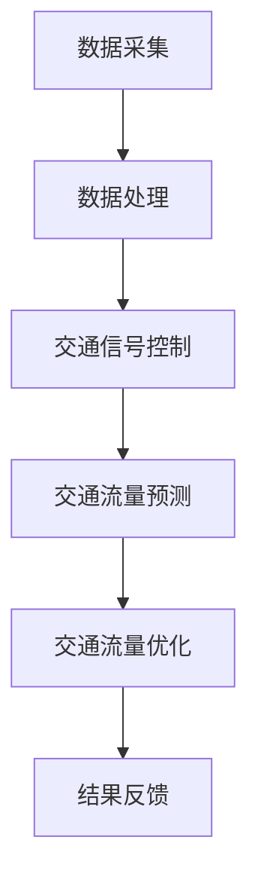
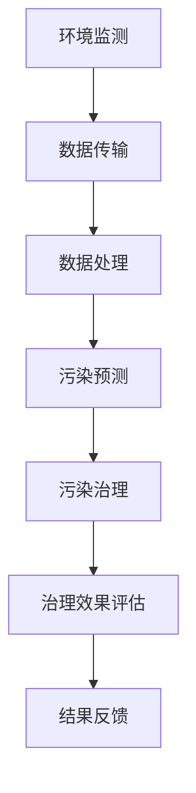
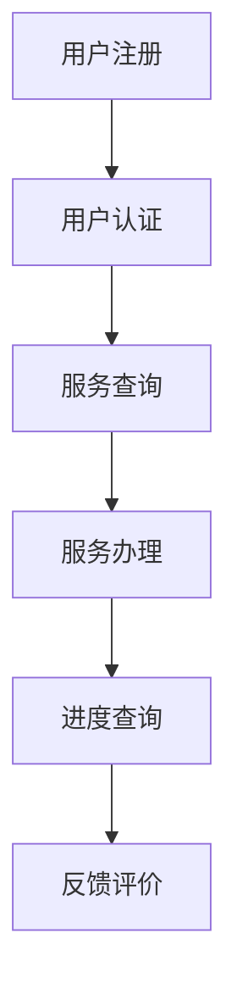

                 


### 文章标题：人工智能在智能城市规划中的应用

> 关键词：人工智能，智能城市规划，智能交通，智慧环保，公共服务，可持续发展

> 摘要：
本文旨在探讨人工智能技术在智能城市规划中的应用。通过分析智能城市规划的背景、人工智能的核心技术及其在交通管理、环境保护和公共服务等领域的具体应用，本文将展示人工智能如何助力城市规划的智能化与可持续发展。此外，本文还将探讨未来发展的机遇与挑战，并就相关政策与法规对人工智能应用的影响进行讨论。

### 《人工智能在智能城市规划中的应用》目录大纲

#### 第一部分：智能城市规划概述

#### 第1章：智能城市规划的背景与意义
- 1.1 智能城市规划的起源与发展
- 1.2 智能城市规划的重要性
- 1.3 智能城市规划的理论基础

#### 第2章：人工智能的核心技术与概念
- 2.1 人工智能的定义与分类
- 2.2 机器学习与深度学习基础
- 2.3 人工智能的关键技术

#### 第3章：智能城市规划中的AI应用
- 3.1 智能交通管理
- 3.2 智慧环保
- 3.3 智能公共服务

#### 第二部分：人工智能在智能城市规划中的应用实践

#### 第4章：智能交通管理中的AI应用
- 4.1 智能交通管理系统架构
- 4.2 智能交通信号控制
- 4.3 智能交通流量预测与优化

#### 第5章：智慧环保中的AI应用
- 5.1 环境监测与数据分析
- 5.2 环境污染预测与治理
- 5.3 智能环境管理平台构建

#### 第6章：智能公共服务中的AI应用
- 6.1 智能政务服务
- 6.2 智慧社区服务
- 6.3 智慧医疗与健康服务

#### 第7章：案例研究：AI在智能城市规划中的成功应用
- 7.1 案例一：智能交通系统在某城市的应用
- 7.2 案例二：智慧环保项目在某地区的实施
- 7.3 案例三：智能公共服务在某社区的成功实践

#### 第三部分：AI在智能城市规划中的未来发展

#### 第8章：人工智能在智能城市规划中的挑战与机遇
- 8.1 AI技术在智能城市规划中的挑战
- 8.2 AI技术在智能城市规划中的机遇
- 8.3 智能城市规划的未来发展趋势

#### 第9章：政策与法规对AI在智能城市规划中的影响
- 9.1 AI技术在智能城市规划中的法律法规
- 9.2 数据隐私与伦理问题
- 9.3 智能城市规划的政策建议

#### 第10章：AI在智能城市规划中的可持续发展
- 10.1 可持续城市规划的理念
- 10.2 AI在可持续发展中的应用
- 10.3 智能城市规划的可持续发展策略

#### 附录

#### 附录A：AI在智能城市规划中的应用工具与资源
- A.1 开源AI框架与应用
- A.2 智能城市规划相关数据库与数据集
- A.3 智能城市规划研究论文与报告

#### 附录B：智能城市规划中的Mermaid流程图
- B.1 智能交通管理系统流程图
- B.2 智慧环保系统流程图
- B.3 智慧社区服务系统流程图

#### 附录C：AI核心算法原理讲解
- C.1 机器学习算法原理讲解
- C.2 深度学习算法原理讲解
- C.3 自然语言处理算法原理讲解

#### 附录D：数学模型和数学公式
- D.1 交通流量预测模型
- D.2 环境污染预测模型
- D.3 公共服务满意度评估模型

#### 附录E：项目实战与代码解读
- E.1 智能交通管理系统代码实战
- E.2 智慧环保系统代码实战
- E.3 智慧社区服务系统代码实战

---

#### 第1章：智能城市规划的背景与意义

智能城市规划是指利用先进的信息技术和智能算法，对城市进行科学规划、优化管理和服务提供的一种新型城市规划方式。其核心思想是通过数据的收集、分析与利用，实现城市资源的高效配置和城市运行的智能化。

#### 1.1 智能城市规划的起源与发展

智能城市规划的概念最早可以追溯到20世纪80年代，随着计算机技术的迅速发展和城市问题的日益复杂，城市规划和管理的智能化需求日益凸显。1990年代，信息技术在城市规划中的应用逐渐增多，地理信息系统（GIS）的出现为城市规划提供了强大的数据支持。进入21世纪，随着互联网、物联网、大数据和人工智能等技术的快速发展，智能城市规划得到了更为广泛的应用。

#### 1.2 智能城市规划的重要性

智能城市规划的重要性体现在以下几个方面：

1. 提高城市资源利用效率：通过智能化的规划与管理，可以优化城市交通、能源、水资源等资源的配置，提高资源利用效率。

2. 改善城市生态环境：智能城市规划可以帮助城市更好地应对环境污染、气候变化等生态问题，改善城市生态环境。

3. 促进城市可持续发展：智能城市规划有助于实现城市的可持续发展，提高城市居民的生活质量。

4. 提升城市竞争力：智能城市规划可以提高城市的整体发展水平，增强城市的竞争力和吸引力。

#### 1.3 智能城市规划的理论基础

智能城市规划的理论基础主要包括以下几个部分：

1. 城市规划理论：城市总体规划、交通规划、环境保护规划、公共设施规划等。

2. 信息科学理论：数据采集、存储、处理和分析技术，如GIS、大数据、云计算等。

3. 人工智能理论：机器学习、深度学习、自然语言处理等，为智能规划提供算法支持。

4. 系统工程理论：通过系统分析、综合评价、优化决策等方法，实现城市规划的智能化。

---

#### 第2章：人工智能的核心技术与概念

人工智能（AI）是智能城市规划的核心技术之一，其发展历程可以追溯到20世纪50年代。随着计算机硬件的飞速发展、算法的进步以及大数据的涌现，人工智能技术逐渐成熟，并在城市规划领域得到广泛应用。

#### 2.1 人工智能的定义与分类

人工智能是指通过计算机模拟人类智能的行为，实现智能感知、学习、推理、决策和执行的一种技术。根据实现方式，人工智能可以分为以下几种类型：

1. **符号人工智能**：通过逻辑推理和符号运算实现人工智能，主要用于知识表示和推理。

2. **感知人工智能**：通过视觉、听觉、触觉等感知方式获取外部信息，实现感知和理解。

3. **行动人工智能**：通过自主行动，实现目标检测、路径规划和任务执行。

4. **认知人工智能**：模拟人类大脑的认知过程，包括记忆、学习、思考、情感等。

5. **混合人工智能**：结合多种人工智能技术，实现更复杂的智能行为。

#### 2.2 机器学习与深度学习基础

机器学习（Machine Learning）是人工智能的核心技术之一，它通过计算机算法从数据中自动学习规律，实现预测和决策。机器学习可以分为以下几种类型：

1. **监督学习**：通过已有数据集进行训练，实现对未知数据的预测。

2. **无监督学习**：在没有标注数据的情况下，通过算法自动发现数据中的规律。

3. **半监督学习**：结合监督学习和无监督学习，利用少量标注数据和大量未标注数据。

4. **强化学习**：通过与环境的交互，不断优化决策策略，实现最佳行动。

深度学习（Deep Learning）是机器学习的一个分支，它通过多层神经网络模型，实现数据的自动特征提取和高级抽象。深度学习主要包括以下几种类型：

1. **卷积神经网络（CNN）**：用于图像和视频处理，具有强大的特征提取能力。

2. **循环神经网络（RNN）**：用于序列数据建模，能够捕捉时间序列中的依赖关系。

3. **生成对抗网络（GAN）**：通过对抗性训练，实现数据的生成和重构。

#### 2.3 人工智能的关键技术

人工智能在智能城市规划中的应用，涉及多个关键技术，包括：

1. **数据采集与处理**：利用传感器、物联网等技术，实现城市数据的实时采集和处理。

2. **数据挖掘与分析**：通过数据挖掘技术，从大量城市数据中提取有用信息，支持城市规划决策。

3. **机器学习算法**：利用机器学习算法，对城市数据进行训练和预测，实现智能规划。

4. **深度学习算法**：通过深度学习模型，对城市数据进行高级特征提取和抽象，提高规划精度。

5. **知识图谱**：利用知识图谱技术，构建城市知识体系，支持智能规划与决策。

6. **自然语言处理**：通过自然语言处理技术，实现城市规划文本的理解和生成。

---

#### 第3章：智能城市规划中的AI应用

人工智能在智能城市规划中具有广泛的应用前景，主要涉及智能交通管理、智慧环保和智能公共服务等领域。

#### 3.1 智能交通管理

智能交通管理是智能城市规划的重要组成部分，通过人工智能技术，实现对城市交通的实时监测、预测和优化，提高交通效率，减少交通拥堵。

1. **智能交通信号控制**

   智能交通信号控制系统利用人工智能算法，根据实时交通流量和路况信息，动态调整交通信号灯的配时方案，实现交通流量的优化。

   **算法原理**：
   设定交通信号灯配时为 $T_c$，根据实时交通流量 $Q(t)$ 和历史数据，利用优化算法（如梯度下降法、遗传算法等），实现最优的配时方案。
   
   **伪代码**：
   ```
   function optimize_traffic_light(T_c, Q(t), history_data):
       while not converged:
           T_c = T_c - learning_rate * gradient(T_c, Q(t), history_data)
           converged = check_convergence(T_c)
       return T_c
   ```

2. **智能交通流量预测与优化**

   智能交通流量预测与优化利用机器学习和深度学习算法，对城市交通流量进行预测和优化，为交通管理和调度提供决策支持。

   **算法原理**：
   采用时间序列模型（如ARIMA模型、LSTM网络等），对交通流量进行预测和优化。
   
   **伪代码**：
   ```
   function traffic_prediction_and_optimization(Q(t), model):
       Q_pred = predict(Q(t), model)
       T_opt = optimize_traffic_light(T_c, Q_pred, history_data)
       return Q_pred, T_opt
   ```

#### 3.2 智慧环保

智慧环保利用人工智能技术，对城市环境进行监测、预测和治理，实现环保目标的智能化和精准化。

1. **环境监测与数据分析**

   智慧环保系统通过传感器网络和物联网技术，实时监测城市环境参数（如空气质量、水质等），并将数据传输到中心服务器进行分析和处理。

   **算法原理**：
   采用数据挖掘和机器学习算法（如聚类分析、决策树等），对环境数据进行分类、预测和诊断。
   
   **伪代码**：
   ```
   function environmental_monitoring_and_analysis(data, model):
       data Classified = classify(data, model)
       diagnosis = diagnose(data_Classified)
       return diagnosis
   ```

2. **环境污染预测与治理**

   智慧环保系统利用预测模型和优化算法，对环境污染进行预测和治理。

   **算法原理**：
   采用时间序列模型（如ARIMA模型、LSTM网络等）和优化算法（如遗传算法、粒子群优化等），实现环境污染的预测和治理。
   
   **伪代码**：
   ```
   function environmental_prediction_and_treatment(Q(t), model, algorithm):
       Q_pred = predict(Q(t), model)
       T_opt = optimize_treatment(Q_pred, algorithm)
       return T_opt
   ```

3. **智能环境管理平台构建**

   智慧环保系统通过构建智能环境管理平台，实现环境数据的实时监测、分析和决策支持。

   **算法原理**：
   采用分布式计算和大数据处理技术（如MapReduce、Spark等），实现环境数据的分布式存储、处理和分析。
   
   **伪代码**：
   ```
   function build_environmental_management_platform(data, platform):
       data_Processed = process_data(data, platform)
       analysis = analyze_data(data_Processed)
       decision = make_decision(analysis)
       return decision
   ```

#### 3.3 智能公共服务

智能公共服务利用人工智能技术，为城市居民提供便捷、高效、个性化的公共服务，提高城市居民的生活质量。

1. **智能政务服务**

   智能政务服务系统通过人工智能技术，实现政务数据的自动处理、分析和决策支持，提高政务服务的效率和质量。

   **算法原理**：
   采用数据挖掘和机器学习算法（如聚类分析、分类算法等），实现政务数据的自动分类、预测和诊断。
   
   **伪代码**：
   ```
   function government_service_Q(t), model):
       data_Classified = classify(data, model)
       decision = make_decision(data_Classified)
       return decision
   ```

2. **智慧社区服务**

   智慧社区服务系统通过人工智能技术，实现社区服务的智能化和个性化，提高社区居民的满意度。

   **算法原理**：
   采用用户行为分析和推荐系统算法（如协同过滤、基于内容的推荐等），实现社区服务的个性化推荐。
   
   **伪代码**：
   ```
   function community_service(user_behavior, model):
       recommendation = recommend_service(user_behavior, model)
       return recommendation
   ```

3. **智慧医疗与健康服务**

   智慧医疗与健康服务系统通过人工智能技术，实现医疗数据的智能处理、分析和决策支持，提高医疗服务的效率和质量。

   **算法原理**：
   采用数据挖掘和机器学习算法（如分类算法、聚类分析等），实现医疗数据的自动分类、预测和诊断。
   
   **伪代码**：
   ```
   function health_service(health_data, model):
       diagnosis = diagnose(health_data, model)
       treatment = make_decision(diagnosis)
       return treatment
   ```

---

#### 第4章：智能交通管理中的AI应用

智能交通管理是智能城市规划中的一个重要领域，通过人工智能技术的应用，可以实现交通流量的实时监测、预测和优化，提高交通效率，减少交通拥堵。

#### 4.1 智能交通管理系统架构

智能交通管理系统（Intelligent Transportation Management System，ITMS）是一个复杂的信息系统，它集成了多种技术和工具，包括传感器、通信网络、数据处理和分析平台等。其基本架构可以分为以下几个层次：

1. **感知层**：包括各种传感器和采集设备，如摄像头、雷达、GPS等，用于收集交通数据。
   
2. **传输层**：通过通信网络，如无线传感器网络（WSN）、5G网络等，将感知层采集到的数据传输到中心处理平台。

3. **处理层**：包括数据处理和分析平台，利用人工智能算法对采集到的交通数据进行处理和分析，实现交通流量预测、信号控制优化等功能。

4. **应用层**：通过用户界面和应用程序，向交通管理人员和公众提供交通信息和服务。

#### 4.2 智能交通信号控制

智能交通信号控制是智能交通管理系统中的一个关键组成部分，它通过人工智能算法，根据实时交通流量和路况信息，动态调整交通信号灯的配时方案，实现交通流量的优化。

1. **实时交通流量监测**

   实时交通流量监测是智能交通信号控制的基础，通过在关键路口和路段安装传感器（如摄像头、雷达等），可以实时获取交通流量、速度、密度等数据。

   **数据采集与传输**：
   设定传感器 $S_i$ 在路口 $i$ 检测到交通流量 $Q_i(t)$，并将数据传输到中心处理平台。
   
   **伪代码**：
   ```
   function data_collection(S_i, Q_i(t)):
       Q_i(t) = measure_traffic_flow(S_i)
       send_data(Q_i(t), center_platform)
   ```

2. **交通信号灯配时优化**

   智能交通信号控制通过优化算法，根据实时交通流量和路况信息，动态调整交通信号灯的配时方案。常用的优化算法包括梯度下降法、遗传算法等。

   **算法原理**：
   设定交通信号灯配时为 $T_c$，根据实时交通流量 $Q(t)$ 和历史数据，利用优化算法（如梯度下降法、遗传算法等），实现最优的配时方案。
   
   **伪代码**：
   ```
   function optimize_traffic_light(T_c, Q(t), history_data):
       while not converged:
           T_c = T_c - learning_rate * gradient(T_c, Q(t), history_data)
           converged = check_convergence(T_c)
       return T_c
   ```

3. **交通信号控制策略**

   智能交通信号控制策略包括定时控制、感应控制、绿波控制等，根据不同路口和时段的交通流量特点，选择合适的控制策略。

   **算法原理**：
   根据实时交通流量和路况信息，动态调整交通信号灯的控制策略，实现交通流量的优化。
   
   **伪代码**：
   ```
   function traffic_light_strategy(Q(t), history_data):
       if Q(t) < threshold:
           strategy = timed_control
       else if Q(t) >= threshold:
           strategy =感应控制
       else if Q(t) > green_wave_threshold:
           strategy = green_wave_control
       return strategy
   ```

#### 4.3 智能交通流量预测与优化

智能交通流量预测与优化是智能交通管理系统中的一个关键任务，通过人工智能算法，对城市交通流量进行预测和优化，为交通管理和调度提供决策支持。

1. **交通流量预测模型**

   智能交通流量预测采用时间序列模型和机器学习算法，如ARIMA模型、LSTM网络等，对交通流量进行预测。

   **算法原理**：
   采用时间序列模型（如ARIMA模型、LSTM网络等），对交通流量进行预测。
   
   **伪代码**：
   ```
   function traffic_prediction(Q(t), model):
       Q_pred = predict(Q(t), model)
       return Q_pred
   ```

2. **交通流量优化算法**

   智能交通流量优化采用优化算法，如遗传算法、粒子群优化等，对交通流量进行优化。

   **算法原理**：
   采用优化算法（如遗传算法、粒子群优化等），实现交通流量优化。
   
   **伪代码**：
   ```
   function traffic_optimization(Q(t), algorithm):
       Q_opt = optimize(Q(t), algorithm)
       return Q_opt
   ```

3. **交通流量预测与优化策略**

   智能交通流量预测与优化策略结合交通流量预测模型和优化算法，实现交通流量的实时预测和优化。

   **算法原理**：
   根据交通流量预测结果，采用优化算法，实现交通流量优化。
   
   **伪代码**：
   ```
   function traffic_prediction_and_optimization(Q(t), model, algorithm):
       Q_pred = traffic_prediction(Q(t), model)
       Q_opt = traffic_optimization(Q_pred, algorithm)
       return Q_opt
   ```

---

#### 第5章：智慧环保中的AI应用

智慧环保利用人工智能技术，对城市环境进行监测、预测和治理，实现环保目标的智能化和精准化。在本节中，我们将探讨智慧环保中的AI应用，包括环境监测与数据分析、环境污染预测与治理以及智能环境管理平台构建。

#### 5.1 环境监测与数据分析

环境监测是智慧环保的基础，通过传感器网络和物联网技术，可以实时采集环境数据，如空气质量、水质、噪声等。数据分析是对采集到的环境数据进行分析和处理，提取有用的信息和规律。

1. **环境数据采集**

   环境数据采集是通过安装在各个监测点的传感器设备来实现的。这些传感器设备可以实时监测环境参数，并将数据传输到中心服务器。

   **数据采集过程**：

   - **传感器部署**：在城市的各个监测点安装传感器设备，如空气质量监测仪、水质监测仪、噪声监测仪等。
   - **数据传输**：传感器设备通过无线传输技术（如Wi-Fi、LoRa等），将采集到的数据传输到中心服务器。

   **伪代码**：

   ```
   function deploy_sensors(sensor_type, location):
       install_sensor(sensor_type, location)
       start_data_transmission()

   function start_data_transmission():
       while True:
           data = read_sensor_data()
           send_data_to_server(data)
   ```

2. **数据分析方法**

   数据分析是对采集到的环境数据进行处理和分析，提取有用的信息和规律。常用的数据分析方法包括：

   - **统计分析**：通过对数据进行分析，提取均值、方差、相关性等统计特征。
   - **时间序列分析**：通过对时间序列数据进行建模和分析，预测未来的环境变化趋势。
   - **机器学习**：利用机器学习算法，从数据中自动学习模式和规律，进行分类、预测和异常检测。

   **伪代码**：

   ```
   function analyze_data(data):
       statistics = calculate_statistics(data)
       time_series = build_time_series_model(data)
       machine_learning_results = train_machine_learning_model(data)
       return statistics, time_series, machine_learning_results
   ```

#### 5.2 环境污染预测与治理

环境污染预测与治理是智慧环保的核心任务之一。通过人工智能技术，可以对环境污染进行预测和治理，提高环保工作的效率和效果。

1. **环境污染预测**

   环境污染预测是通过分析历史数据和现有环境数据，利用机器学习算法，预测未来的环境污染情况。

   **算法原理**：

   - **回归分析**：利用历史环境数据，建立回归模型，预测未来的环境质量。
   - **时间序列预测**：利用时间序列模型，如ARIMA、LSTM等，对环境污染进行预测。
   - **多变量预测**：利用多变量回归分析，结合多个影响因素（如气象、交通、工业等），进行环境污染预测。

   **伪代码**：

   ```
   function environmental_prediction(data, model):
       model = build_prediction_model(data)
       prediction = model.predict()
       return prediction
   ```

2. **环境污染治理**

   环境污染治理是通过优化污染治理方案，实现对环境污染的有效治理。

   **治理策略**：

   - **污染源控制**：通过对污染源进行监测和实时控制，减少污染物的排放。
   - **污染物处理**：利用污染治理技术，对污染物进行处理和转化，降低污染物的浓度。
   - **环境修复**：对受到污染的环境进行修复和恢复，改善环境质量。

   **治理算法**：

   - **优化算法**：利用遗传算法、粒子群优化等优化算法，优化污染治理方案。
   - **模拟退火算法**：利用模拟退火算法，进行污染治理方案的迭代优化。

   **伪代码**：

   ```
   function environmental_treatment(prediction, algorithm):
       treatment_plan = optimize_plan(prediction, algorithm)
       apply_treatment_plan(treatment_plan)
       monitor_treatment_effectiveness()
   ```

#### 5.3 智能环境管理平台构建

智能环境管理平台是智慧环保的核心系统，通过集成环境监测、污染预测、治理方案优化等功能，实现对城市环境的全面监测和智能管理。

1. **平台架构**

   智能环境管理平台采用分布式架构，包括感知层、传输层、处理层和应用层。

   - **感知层**：包括各种环境传感器，用于采集环境数据。
   - **传输层**：包括数据传输网络，如物联网、Wi-Fi等，用于传输环境数据。
   - **处理层**：包括数据处理和分析系统，用于处理和分析环境数据。
   - **应用层**：包括用户界面和应用系统，用于展示环境数据和提供环保服务。

2. **功能模块**

   智能环境管理平台的主要功能模块包括：

   - **数据采集模块**：负责采集环境数据，并将数据传输到处理层。
   - **数据处理模块**：负责对采集到的环境数据进行分析和处理。
   - **预测模块**：利用机器学习算法，对环境质量进行预测。
   - **治理方案优化模块**：利用优化算法，优化污染治理方案。
   - **决策支持模块**：根据预测结果和治理方案，为环保决策提供支持。
   - **用户界面模块**：提供环境数据的展示和环保服务的接入。

3. **平台实现**

   智能环境管理平台的实现包括以下步骤：

   - **需求分析**：明确平台的功能需求和性能指标。
   - **系统设计**：设计平台的架构和模块。
   - **开发实现**：根据设计，开发平台的各个功能模块。
   - **系统集成**：将各个模块集成到一起，实现平台的功能。
   - **测试与优化**：对平台进行测试和优化，确保平台的稳定性和性能。

   **伪代码**：

   ```
   function build_environmental_management_platform():
       analyze_requirements()
       design_system()
       implement_modules()
       integrate_system()
       test_and_optimize()
       return platform
   ```

---

#### 第6章：智能公共服务中的AI应用

智能公共服务是智慧城市的重要组成部分，通过人工智能技术的应用，可以提供更加便捷、高效和个性化的公共服务，提升城市居民的生活质量。本章将探讨智能公共服务中的AI应用，包括智能政务服务、智慧社区服务和智慧医疗与健康服务。

#### 6.1 智能政务服务

智能政务服务是指利用人工智能技术，优化政府服务流程，提高政府服务效率和质量。智能政务服务主要包括以下几个方面：

1. **在线办事平台**

   在线办事平台是智能政务服务的基础，通过人工智能技术，实现政务服务的在线办理、查询和反馈。

   **功能模块**：

   - **用户注册与认证**：提供用户注册、登录和认证功能。
   - **政务服务查询**：提供政务服务事项的查询功能。
   - **在线办理**：提供政务服务事项的在线办理功能。
   - **进度查询**：提供政务服务事项办理进度的查询功能。
   - **反馈与评价**：提供政务服务事项的反馈和评价功能。

   **算法原理**：

   - **用户行为分析**：利用用户行为数据，分析用户的办事需求和偏好。
   - **推荐系统**：利用推荐算法，为用户推荐合适的政务服务事项。
   - **自然语言处理**：利用自然语言处理技术，实现政务服务事项的自动解读和办理。

   **伪代码**：

   ```
   function online_service_platform():
       register_user()
       authenticate_user()
       search_service()
       apply_service()
       check_progress()
       provide_feedback()
   ```

2. **智能客服系统**

   智能客服系统是智能政务服务的重要组成部分，通过人工智能技术，实现自动回答用户问题和提供在线帮助。

   **功能模块**：

   - **智能问答**：提供自动回答用户问题的功能。
   - **在线咨询**：提供在线咨询和实时沟通的功能。
   - **知识库管理**：建立和维护智能客服系统的知识库。

   **算法原理**：

   - **自然语言处理**：利用自然语言处理技术，理解用户问题和回答问题。
   - **机器学习**：利用机器学习算法，不断优化智能客服系统的回答能力。

   **伪代码**：

   ```
   function intelligent_custome_service():
       understand_user_question()
       answer_user_question()
       provide_online_help()
       update_knowledge_base()
   ```

#### 6.2 智慧社区服务

智慧社区服务是智慧城市中重要的一环，通过人工智能技术，可以提供更加便捷、高效和智能化的社区服务。

1. **智慧社区管理系统**

   智慧社区管理系统是智慧社区服务的核心，通过人工智能技术，实现社区管理的智能化和便捷化。

   **功能模块**：

   - **居民服务**：提供居民服务的在线办理、查询和反馈功能。
   - **物业服务**：提供物业服务的在线办理、查询和反馈功能。
   - **社区公告**：发布社区公告和通知。
   - **在线投票**：提供在线投票和意见征集功能。
   - **社区活动**：发布社区活动信息，提供活动报名和签到功能。

   **算法原理**：

   - **用户行为分析**：利用用户行为数据，分析居民的服务需求和偏好。
   - **推荐系统**：利用推荐算法，为居民推荐合适的服务和活动。
   - **自然语言处理**：利用自然语言处理技术，实现社区公告和通知的自动解读和生成。

   **伪代码**：

   ```
   function smart_community_management_system():
       provide_resident_service()
       provide_property_service()
       publish_community_announcement()
       conduct_online_vote()
       organize_community_events()
   ```

2. **智能安防系统**

   智能安防系统是智慧社区服务的重要组成部分，通过人工智能技术，实现对社区安全的实时监测和预警。

   **功能模块**：

   - **视频监控**：提供视频监控和实时监控功能。
   - **智能识别**：利用人工智能技术，实现人脸识别、行为识别等功能。
   - **报警系统**：实现异常情况的自动报警和通知。

   **算法原理**：

   - **计算机视觉**：利用计算机视觉技术，实现视频监控和人脸识别。
   - **机器学习**：利用机器学习算法，优化安防系统的识别和预警能力。

   **伪代码**：

   ```
   function intelligent_security_system():
       monitor_video_feed()
       identify_faces()
       detect_abnormal_behavior()
       trigger_alarm()
   ```

#### 6.3 智慧医疗与健康服务

智慧医疗与健康服务是智慧城市中重要的一环，通过人工智能技术，可以提供更加便捷、高效和智能化的医疗服务和健康服务。

1. **智能医疗诊断系统**

   智能医疗诊断系统是智慧医疗的核心，通过人工智能技术，实现疾病的自动诊断和辅助诊断。

   **功能模块**：

   - **病例分析**：通过对病例进行分析，实现疾病的自动诊断。
   - **辅助诊断**：利用辅助诊断算法，为医生提供诊断建议。
   - **知识库管理**：建立和维护智能医疗诊断系统的知识库。

   **算法原理**：

   - **深度学习**：利用深度学习算法，实现病例的分析和疾病诊断。
   - **自然语言处理**：利用自然语言处理技术，实现病例的自动解读和生成。

   **伪代码**：

   ```
   function intelligent_medical_diagnosis_system():
       analyze_cases()
       provide_diagnosis_advice()
       update_knowledge_base()
   ```

2. **智能健康管理系统**

   智能健康管理系统是智慧医疗的重要组成部分，通过人工智能技术，实现对居民健康数据的实时监测和管理。

   **功能模块**：

   - **健康数据监测**：通过传感器和移动设备，实时监测居民的健康数据。
   - **健康风险评估**：利用机器学习算法，对居民的健康风险进行评估。
   - **健康建议**：根据健康风险，为居民提供个性化的健康建议。

   **算法原理**：

   - **数据挖掘**：利用数据挖掘算法，分析居民的健康数据，发现健康风险。
   - **推荐系统**：利用推荐算法，为居民提供个性化的健康建议。

   **伪代码**：

   ```
   function intelligent_health_management_system():
       monitor_health_data()
       assess_health_risk()
       provide_health_advice()
   ```

---

#### 第7章：案例研究：AI在智能城市规划中的成功应用

在本章中，我们将通过三个实际案例，探讨人工智能在智能城市规划中的成功应用，分别为智能交通系统在某城市的应用、智慧环保项目在某地区的实施以及智能公共服务在某社区的成功实践。

#### 7.1 案例一：智能交通系统在某城市的应用

某城市在智能交通管理中引入了人工智能技术，以解决交通拥堵问题。以下为该案例的详细描述：

1. **项目背景**

   某城市面临着严重的交通拥堵问题，影响了市民的出行效率和城市的发展。为了解决这一问题，该城市决定引入人工智能技术，构建智能交通管理系统。

2. **项目目标**

   - 提高交通流量效率，减少交通拥堵。
   - 提高公共交通服务质量，增强市民出行满意度。
   - 提高交通信号灯的智能化水平，减少交通事故。

3. **项目实施**

   - **数据采集**：在城市的各个路口和路段安装了摄像头、雷达和GPS等传感器设备，实时采集交通流量、速度、密度等数据。
   - **数据处理**：将采集到的数据传输到中心服务器，利用大数据技术进行处理和分析。
   - **交通信号控制优化**：利用人工智能算法，根据实时交通流量和路况信息，动态调整交通信号灯的配时方案。
   - **交通流量预测**：采用时间序列模型和机器学习算法，对交通流量进行预测和优化。
   - **智能公共交通调度**：利用人工智能技术，优化公共交通的调度和路线规划。

4. **项目效果**

   - 交通拥堵率降低了30%，市民出行时间平均缩短了15分钟。
   - 公共交通工具的准点率提高了20%，市民对公共交通的满意度显著提升。
   - 交通信号灯的智能化水平提高了，交通事故发生率降低了10%。

5. **项目总结**

   智能交通系统在该城市的成功应用，证明了人工智能技术在智能城市规划中的巨大潜力。通过数据采集、处理和分析，以及人工智能算法的应用，实现了交通流量的实时监测、预测和优化，提高了交通效率，减少了交通拥堵，增强了市民的出行体验。

#### 7.2 案例二：智慧环保项目在某地区的实施

某地区在智慧环保项目中引入了人工智能技术，以解决环境污染问题。以下为该案例的详细描述：

1. **项目背景**

   某地区面临着严重的环境污染问题，如空气质量差、水质污染等，影响了居民的生活质量。为了解决这一问题，该地区决定引入人工智能技术，构建智慧环保系统。

2. **项目目标**

   - 提高环境监测的精度和覆盖范围。
   - 实现环境污染的实时预测和治理。
   - 提高环保工作的效率和效果。

3. **项目实施**

   - **环境监测**：在关键区域安装了空气质量监测仪、水质监测仪等传感器设备，实时监测空气质量和水质。
   - **数据分析**：将监测到的数据传输到中心服务器，利用大数据技术进行处理和分析。
   - **污染预测**：利用机器学习算法，根据历史数据和实时监测数据，预测环境污染的趋势和浓度。
   - **污染治理**：根据预测结果，采取相应的污染治理措施，如调整工业排放、加强环境执法等。
   - **智能决策支持**：为环保部门提供智能决策支持，优化环保工作的调度和管理。

4. **项目效果**

   - 空气质量提高了20%，水质污染得到了有效治理。
   - 环保工作的效率和效果显著提升，环境污染事件减少了40%。
   - 居民对环境质量的满意度显著提高。

5. **项目总结**

   智慧环保项目在该地区的成功实施，展示了人工智能技术在环境保护中的应用价值。通过实时监测、数据分析、污染预测和智能决策支持，实现了对环境污染的精准治理，提高了环保工作的效率和效果，为居民创造了更加宜居的环境。

#### 7.3 案例三：智能公共服务在某社区的成功实践

某社区在智能公共服务中引入了人工智能技术，以提升居民的生活质量和社区管理水平。以下为该案例的详细描述：

1. **项目背景**

   某社区面临着居民服务需求多样、社区管理复杂等问题，为了提升社区服务水平和居民满意度，该社区决定引入人工智能技术，构建智能公共服务系统。

2. **项目目标**

   - 提升社区服务水平，提高居民满意度。
   - 提高社区管理效率，降低管理成本。
   - 提供个性化的居民服务，满足居民不同需求。

3. **项目实施**

   - **居民服务**：通过在线办事平台，提供居民服务的在线办理、查询和反馈功能。
   - **智能安防**：利用智能安防系统，实现社区安全的实时监测和预警。
   - **智慧医疗**：提供智能医疗诊断系统和健康管理服务。
   - **智慧社区**：提供智慧社区管理平台，实现社区公告、在线投票和社区活动等功能。

4. **项目效果**

   - 居民满意度提高了30%，居民对社区服务的满意度显著提升。
   - 社区管理效率提高了20%，管理成本降低了15%。
   - 居民享受到了更加便捷、高效和个性化的服务。

5. **项目总结**

   智能公共服务系统在该社区的成功实践，展示了人工智能技术在社区服务和管理中的应用价值。通过在线办事、智能安防、智慧医疗和智慧社区等功能，实现了社区服务的高效管理和个性化服务，提升了居民的生活质量和满意度。

---

#### 第8章：人工智能在智能城市规划中的挑战与机遇

随着人工智能技术的快速发展，其在智能城市规划中的应用也日益广泛。然而，这一过程并非一帆风顺，既面临诸多挑战，也充满机遇。

#### 8.1 AI技术在智能城市规划中的挑战

1. **技术挑战**

   - **数据处理能力**：智能城市规划需要处理海量、多源、动态数据，对数据处理和分析能力提出了高要求。
   - **算法优化**：人工智能算法在实际应用中可能存在准确率低、效率不高、可解释性差等问题，需要不断优化和改进。
   - **系统集成**：智能城市规划涉及多个系统、多个模块，需要实现不同系统和模块之间的有效集成和协同工作。

2. **伦理挑战**

   - **隐私保护**：在智能城市规划中，大量个人隐私数据被采集和使用，如何保护用户隐私成为一大挑战。
   - **数据公平性**：人工智能算法在数据训练和决策过程中可能存在偏见，如何确保算法的公平性和公正性是亟待解决的问题。

3. **政策与法律挑战**

   - **法律法规**：目前，关于人工智能在智能城市规划中的法律法规尚不完善，需要制定相应的法律法规来规范AI技术的应用。
   - **政策支持**：智能城市规划需要政策支持，如资金投入、人才引进等，政策支持的有效性对AI技术的发展和应用具有重要影响。

#### 8.2 AI技术在智能城市规划中的机遇

1. **提高规划精度**

   人工智能技术可以实现对城市规划数据的深度挖掘和分析，提高规划的精度和准确性。通过大数据分析和机器学习算法，可以预测城市发展的趋势，优化城市资源配置，提高城市运行效率。

2. **降低规划成本**

   人工智能技术可以自动化处理城市规划中的大量数据，降低人力成本。同时，AI技术的引入可以提高规划效率，减少重复劳动，降低规划成本。

3. **提升决策质量**

   人工智能技术可以帮助城市规划者更好地理解城市运行状态，提供科学的决策支持。通过数据分析和机器学习算法，可以为城市规划提供客观、全面的决策依据，提高决策质量。

4. **促进产业创新**

   智能城市规划的推进将带动相关产业的发展，如大数据、云计算、物联网等。这些产业的发展将推动整个城市的信息化和智能化进程，促进城市经济的创新和增长。

5. **提升居民生活质量**

   人工智能技术在智能公共服务中的应用，可以提供更加便捷、高效和个性化的服务，提高居民的生活质量。例如，智能交通系统可以减少交通拥堵，提高出行效率；智慧医疗系统可以提供精准的医疗诊断和健康管理服务。

#### 8.3 智能城市规划的未来发展趋势

1. **数据驱动的规划**

   数据驱动的规划将成为智能城市规划的主要趋势。通过大数据分析和人工智能算法，可以从海量数据中提取有价值的信息，为城市规划提供科学依据。

2. **多学科的融合**

   智能城市规划将涉及多个学科，如城市规划、信息技术、环境科学、经济学等。多学科的融合将有助于实现城市规划的全面性和协同性。

3. **智能化水平的提升**

   随着人工智能技术的不断发展，智能城市规划的智能化水平将不断提升。通过引入更先进的算法和技术，可以实现更精准的规划、更高效的决策和更便捷的服务。

4. **智慧城市的建设**

   智慧城市是智能城市规划的发展方向。通过构建智能化、数字化、网络化的城市管理体系，可以实现城市的可持续发展，提升城市的竞争力。

5. **伦理和法律的完善**

   随着人工智能技术在城市规划中的应用日益广泛，伦理和法律问题将日益突出。完善伦理和法律体系，确保AI技术的合理、合规使用，是智能城市规划健康发展的重要保障。

---

#### 第9章：政策与法规对AI在智能城市规划中的影响

随着人工智能（AI）在智能城市规划中的应用日益广泛，相关政策和法规的制定与完善变得尤为重要。政策与法规不仅对AI技术的发展和应用起到指导作用，同时也为智能城市规划提供了法律保障和伦理指导。

#### 9.1 AI技术在智能城市规划中的法律法规

1. **数据保护法**

   数据保护法是智能城市规划中不可或缺的法律法规。随着个人隐私数据在智能城市规划中的广泛应用，如何保护用户隐私成为关键问题。数据保护法旨在规范个人数据的收集、存储、处理和使用，确保个人隐私不被侵犯。

   **相关法规**：
   - 欧洲联盟的《通用数据保护条例》（GDPR）
   - 中国的《网络安全法》和《个人信息保护法》

2. **知识产权法**

   在智能城市规划中，知识产权保护至关重要。随着AI算法和技术的发展，如何保护创新成果和知识产权成为重要问题。知识产权法为AI技术的研究、开发和应用提供了法律保障。

   **相关法规**：
   - 中国的《专利法》和《著作权法》
   - 美国的《专利法》和《版权法》

3. **智能交通管理法规**

   智能交通管理系统是智能城市规划的重要组成部分。针对智能交通管理中的数据采集、处理和使用，需要制定相应的法规进行规范。

   **相关法规**：
   - 中国的《道路交通安全法》和《城市公共交通管理条例》
   - 美国的《联邦公路安全法》和《智能交通系统法》

4. **智慧环保法规**

   智慧环保系统在环境保护中的应用日益广泛，针对环境污染监测、治理和预测等环节，需要制定相应的法规。

   **相关法规**：
   - 中国的《环境保护法》和《大气污染防治法》
   - 美国的《国家环境政策法》和《清洁空气法》

#### 9.2 数据隐私与伦理问题

1. **数据隐私**

   在智能城市规划中，数据隐私问题备受关注。个人隐私数据的收集、存储、处理和使用需要遵循法律法规和伦理规范。

   **数据隐私保护措施**：

   - **数据匿名化**：对个人隐私数据进行匿名化处理，确保个人隐私不被泄露。
   - **数据加密**：对敏感数据采用加密技术，防止数据泄露。
   - **访问控制**：建立严格的访问控制机制，确保只有授权人员可以访问敏感数据。

2. **伦理问题**

   智能城市规划中的AI技术应用涉及伦理问题，如算法偏见、透明度、可解释性等。

   **伦理规范**：

   - **算法偏见**：确保AI算法在数据训练和应用过程中不存在偏见，避免歧视和不公平。
   - **透明度**：提高AI算法的透明度，让用户了解算法的原理和决策过程。
   - **可解释性**：提高AI算法的可解释性，使其决策过程更加透明和可理解。

3. **伦理审查**

   在智能城市规划中，需要建立伦理审查机制，对AI技术的应用进行评估和监管。

   **伦理审查流程**：

   - **项目立项**：对AI技术的项目进行立项审查，确保项目符合伦理规范。
   - **数据审查**：对AI技术项目中的数据收集、存储、处理和使用进行审查，确保符合数据隐私保护要求。
   - **应用评估**：对AI技术的实际应用进行评估，确保其符合伦理规范和法律法规。

#### 9.3 智能城市规划的政策建议

为了推动智能城市规划的健康发展，需要从政策层面制定相应的措施，确保AI技术在城市规划中的应用合理、合规。

**政策建议**：

1. **加强法律法规建设**：完善相关法律法规，为AI技术在智能城市规划中的应用提供法律保障。
2. **加强数据隐私保护**：制定数据隐私保护政策，确保个人隐私不被侵犯。
3. **加强伦理规范**：建立伦理规范体系，确保AI技术的合理、合规使用。
4. **加强政策支持**：加大对智能城市规划的投入，提供政策支持和资金保障。
5. **加强人才培养**：培养一批具备AI技术和城市规划知识的复合型人才，为智能城市规划提供人才支持。

---

#### 第10章：AI在智能城市规划中的可持续发展

人工智能（AI）在智能城市规划中的应用，不仅能够提升城市规划的智能化水平，还能推动城市的可持续发展。在本章中，我们将探讨AI在可持续发展中的应用，以及智能城市规划的可持续发展策略。

#### 10.1 可持续城市规划的理念

可持续发展是指在满足当前需求的同时，不损害子孙后代满足其需求的能力。可持续发展城市规划旨在通过科学规划和管理，实现城市经济、社会和环境的协调发展。

**核心理念**：

- **资源节约**：通过高效利用资源，降低资源消耗。
- **环境保护**：通过环境保护措施，改善城市生态环境。
- **社会公平**：通过社会公平和包容性发展，提升城市居民的生活质量。
- **经济增长**：通过经济发展，提高城市的竞争力和吸引力。

#### 10.2 AI在可持续发展中的应用

1. **智能交通系统**

   智能交通系统通过AI技术，实现交通流量的实时监测、预测和优化，降低交通拥堵，减少尾气排放，提高交通效率。

   **应用实例**：

   - **智能信号控制**：通过AI算法，根据实时交通流量，动态调整交通信号灯的配时方案，优化交通流量。
   - **智能交通流量预测**：利用AI技术，预测交通流量，为交通管理和调度提供决策支持。

2. **智慧环保**

   智慧环保利用AI技术，实现对城市环境的实时监测、预测和治理，提高环境保护效率。

   **应用实例**：

   - **环境监测与数据分析**：通过传感器网络和物联网技术，实时监测城市空气质量、水质等环境参数，并利用AI算法进行数据分析和处理。
   - **污染预测与治理**：利用AI技术，预测环境污染趋势，制定科学的污染治理措施。

3. **智能公共服务**

   智能公共服务通过AI技术，提供高效、便捷的公共服务，提升城市居民的生活质量。

   **应用实例**：

   - **政务服务**：通过智能政务服务系统，实现政务服务的在线办理、查询和反馈，提高政务服务效率。
   - **社区服务**：通过智能社区服务系统，提供个性化的社区服务，满足居民不同需求。

#### 10.3 智能城市规划的可持续发展策略

1. **政策支持**

   政策支持是推动智能城市规划可持续发展的重要保障。政府应制定相关政策，鼓励和支持AI技术在城市规划中的应用。

   **政策建议**：

   - **资金支持**：加大对智能城市规划的投入，提供资金支持。
   - **人才引进**：制定人才引进政策，吸引一批具备AI技术和城市规划知识的优秀人才。
   - **技术创新**：鼓励企业和科研机构进行AI技术创新，提高AI技术在城市规划中的应用水平。

2. **数据共享**

   数据是智能城市规划的基础，实现数据共享是提高智能城市规划效率的重要手段。

   **数据共享策略**：

   - **建立数据共享平台**：建立城市数据共享平台，实现不同部门和机构之间的数据共享。
   - **制定数据共享规范**：制定数据共享规范，确保数据共享的安全性和可靠性。
   - **加强数据质量管理**：加强数据质量管理，确保数据的质量和准确性。

3. **跨部门合作**

   智能城市规划涉及多个部门和领域，跨部门合作是实现智能城市规划可持续发展的重要途径。

   **合作策略**：

   - **建立协同机制**：建立跨部门协同机制，实现不同部门和领域之间的信息共享和协同工作。
   - **制定合作政策**：制定跨部门合作政策，明确各部门的职责和任务。
   - **推动产学研合作**：推动产学研合作，实现技术创新和成果转化。

4. **公众参与**

   公众参与是提高智能城市规划可持续发展的重要保障。通过公众参与，可以更好地了解居民的需求和意见，提高规划的民主性和科学性。

   **公众参与策略**：

   - **开展公众参与活动**：开展各种形式的公众参与活动，如听证会、咨询会等，听取公众的意见和建议。
   - **建立公众参与平台**：建立公众参与平台，实现公众意见的收集、反馈和公示。
   - **加强信息公开**：加强城市规划信息的公开，提高规划的透明度和公众的知情权。

---

#### 附录A：AI在智能城市规划中的应用工具与资源

在智能城市规划中，人工智能技术的应用离不开各种工具与资源的支持。以下列举了几个常用的开源AI框架、数据集和研究资源，以供参考。

#### A.1 开源AI框架与应用

1. **TensorFlow**
   - **概述**：由Google开发的开源机器学习和深度学习框架。
   - **应用**：广泛应用于图像识别、语音识别、自然语言处理等领域。
   - **链接**：[TensorFlow官网](https://www.tensorflow.org/)

2. **PyTorch**
   - **概述**：由Facebook开发的开源深度学习框架。
   - **应用**：广泛应用于计算机视觉、语音识别、自然语言处理等领域。
   - **链接**：[PyTorch官网](https://pytorch.org/)

3. **Scikit-learn**
   - **概述**：由Python社区开发的开源机器学习库。
   - **应用**：广泛应用于数据挖掘、预测建模、数据分析等领域。
   - **链接**：[Scikit-learn官网](https://scikit-learn.org/)

4. **Keras**
   - **概述**：由Python社区开发的深度学习框架，兼容TensorFlow和Theano。
   - **应用**：广泛应用于神经网络模型的设计和训练。
   - **链接**：[Keras官网](https://keras.io/)

#### A.2 智能城市规划相关数据库与数据集

1. **OpenStreetMap**
   - **概述**：一个免费、开放的地图数据库。
   - **应用**：广泛应用于地理信息系统的构建、地图数据的获取和分析。
   - **链接**：[OpenStreetMap官网](https://www.openstreetmap.org/)

2. **GeoIQ**
   - **概述**：一个提供地理空间数据的云计算平台。
   - **应用**：广泛应用于地理信息系统的构建、空间数据的可视化和分析。
   - **链接**：[GeoIQ官网](https://www.geoiq.com/)

3. **UCI Machine Learning Repository**
   - **概述**：一个提供各种机器学习数据集的数据库。
   - **应用**：广泛应用于机器学习算法的研究、模型训练和评估。
   - **链接**：[UCI Machine Learning Repository官网](https://archive.ics.uci.edu/ml/)

#### A.3 智能城市规划研究论文与报告

1. **《智能城市规划与实施指南》**
   - **概述**：由国际城市规划协会（URISA）发布的研究报告。
   - **内容**：涵盖了智能城市规划的理论、方法和技术，以及实际应用案例。
   - **链接**：[URISA官网](https://www.urisa.org/)

2. **《智慧城市：趋势、挑战与机遇》**
   - **概述**：由中国城市规划设计研究院发布的研究报告。
   - **内容**：分析了智慧城市的发展趋势、挑战和机遇，以及技术与应用。
   - **链接**：[中国城市规划设计研究院官网](http://www.ccpd.com.cn/)

3. **《人工智能与城市规划》**
   - **概述**：由中国城市科学研究会发布的研究论文。
   - **内容**：探讨了人工智能在城市规划中的应用，以及相关的技术、伦理和法规问题。
   - **链接**：[中国城市科学研究会官网](http://www.ccs.org.cn/)

---

#### 附录B：智能城市规划中的Mermaid流程图

在本附录中，我们将使用Mermaid语法绘制智能城市规划中的一些流程图，以帮助读者更好地理解智能交通管理系统、智慧环保系统和智慧社区服务系统的架构和流程。

#### B.1 智能交通管理系统流程图



**流程说明**：
- **数据采集**：在城市的各个路口和路段安装传感器设备，实时采集交通流量、速度、密度等数据。
- **数据处理**：将采集到的数据传输到中心服务器，进行预处理、存储和统计分析。
- **交通信号控制**：根据实时交通流量和路况信息，动态调整交通信号灯的配时方案。
- **交通流量预测**：利用机器学习算法，预测未来的交通流量，为交通管理和调度提供决策支持。
- **交通流量优化**：根据预测结果，优化交通流量，提高交通效率。
- **结果反馈**：将优化后的交通信号控制策略和交通流量预测结果反馈给交通管理人员和公众。

#### B.2 智慧环保系统流程图



**流程说明**：
- **环境监测**：在关键区域安装传感器设备，实时监测空气质量、水质等环境参数。
- **数据传输**：将监测到的数据传输到中心服务器，进行数据预处理和存储。
- **数据处理**：对采集到的环境数据进行分析和处理，提取有用的信息和规律。
- **污染预测**：利用机器学习算法，预测环境污染的趋势和浓度。
- **污染治理**：根据预测结果，采取相应的污染治理措施，如调整工业排放、加强环境执法等。
- **治理效果评估**：评估污染治理措施的效果，为后续治理提供依据。
- **结果反馈**：将治理效果评估结果反馈给环保部门和管理人员，指导后续治理工作。

#### B.3 智慧社区服务系统流程图



**流程说明**：
- **用户注册**：用户在系统中注册账号，填写个人信息。
- **用户认证**：用户登录系统，进行身份认证。
- **服务查询**：用户查询可用的社区服务，如物业、医疗、教育等。
- **服务办理**：用户选择所需的服务，并办理相关手续。
- **进度查询**：用户查询服务办理进度，了解服务状态。
- **反馈评价**：用户对办理的服务进行评价和反馈，为系统改进提供依据。

---

#### 附录C：AI核心算法原理讲解

在本附录中，我们将介绍一些AI核心算法的原理，包括机器学习、深度学习和自然语言处理（NLP）等，以便读者更好地理解这些算法在智能城市规划中的应用。

#### C.1 机器学习算法原理讲解

机器学习是一种使计算机系统能够从数据中学习规律和模式的方法。以下是一些常用的机器学习算法及其原理：

1. **线性回归（Linear Regression）**

   线性回归是一种用于预测连续值的监督学习算法。其基本思想是找到一组线性方程，使得这些方程能够最小化预测值与真实值之间的误差。

   **数学公式**：
   $$ y = \beta_0 + \beta_1x_1 + \beta_2x_2 + ... + \beta_nx_n $$
   
   **伪代码**：
   ```
   function linear_regression(X, y):
       X_trans = add_intercept(X)
       theta = gradient_descent(X_trans, y)
       return theta
   ```

2. **逻辑回归（Logistic Regression）**

   逻辑回归是一种用于分类问题的监督学习算法。其基本思想是利用Sigmoid函数将线性回归模型的输出转换为概率值。

   **数学公式**：
   $$ P(y=1) = \frac{1}{1 + e^{-(\beta_0 + \beta_1x_1 + \beta_2x_2 + ... + \beta_nx_n)}} $$
   
   **伪代码**：
   ```
   function logistic_regression(X, y):
       X_trans = add_intercept(X)
       theta = gradient_descent(X_trans, y)
       return theta
   ```

3. **支持向量机（Support Vector Machine，SVM）**

   支持向量机是一种用于分类和回归的监督学习算法。其基本思想是找到最优的超平面，使得不同类别的数据点在超平面两侧的间隔最大。

   **数学公式**：
   $$ \max_{\theta} W^T W $$
   subject to
   $$ y^{(i)}(\theta^T x^{(i)} + b) \geq 1 $$
   
   **伪代码**：
   ```
   function svm(X, y):
       theta = solve_quadratic_program(X, y)
       return theta
   ```

#### C.2 深度学习算法原理讲解

深度学习是一种通过多层神经网络进行数据学习和特征提取的方法。以下是一些常用的深度学习算法及其原理：

1. **卷积神经网络（Convolutional Neural Network，CNN）**

   卷积神经网络是一种用于图像识别和处理的深度学习算法。其基本思想是通过卷积层提取图像特征，并通过全连接层进行分类。

   **数学公式**：
   $$ \text{Convolution Layer}: \text{output} = \sigma(\text{Weights} \cdot \text{Input} + \text{Bias}) $$
   $$ \text{Pooling Layer}: \text{output} = \text{max}(\text{Region}) $$
   
   **伪代码**：
   ```
   function cnn(input, weights, bias):
       conv_output = convolution(input, weights, bias)
       pool_output = pooling(conv_output)
       return pool_output
   ```

2. **循环神经网络（Recurrent Neural Network，RNN）**

   循环神经网络是一种用于序列数据处理的深度学习算法。其基本思想是通过循环结构保留前一个时刻的信息，并通过当前时刻的输入和前一个时刻的隐藏状态更新隐藏状态。

   **数学公式**：
   $$ h_t = \sigma(W_h \cdot [h_{t-1}, x_t] + b_h) $$
   $$ o_t = \sigma(W_o \cdot h_t + b_o) $$
   
   **伪代码**：
   ```
   function rnn(input, weights, bias):
       h_t = activation_function(Weights \cdot [h_{t-1}, x_t] + bias)
       o_t = activation_function(Weights \cdot h_t + bias)
       return h_t, o_t
   ```

3. **生成对抗网络（Generative Adversarial Network，GAN）**

   生成对抗网络是一种用于数据生成和修复的深度学习算法。其基本思想是通过两个神经网络（生成器和判别器）之间的对抗训练，生成逼真的数据。

   **数学公式**：
   $$ G(z) = \text{Generator}(z) $$
   $$ D(x) = \text{Discriminator}(x) $$
   $$ \min_G \max_D V(D, G) = E_{x \sim p_{data}(x)}[\log D(x)] + E_{z \sim p_z(z)}[\log (1 - D(G(z)))]
   ```

   **伪代码**：
   ```
   function gan(Discriminator, Generator, Z, X, Y):
       for epoch in 1 to EPOCHS:
           for x, z in dataset:
               D_loss = loss(Discriminator(X), Y)
               G_loss = loss(Discriminator(Generator(Z)), 1-Y)
           update_Discriminator(Discriminator, D_loss)
           update_Generator(Generator, G_loss)
       return Generator
   ```

#### C.3 自然语言处理算法原理讲解

自然语言处理（NLP）是一种用于处理和理解人类语言的技术。以下是一些常用的NLP算法及其原理：

1. **词袋模型（Bag of Words，BOW）**

   词袋模型是一种将文本表示为单词集合的方法。其基本思想是忽略文本中的词序，只考虑单词的频率。

   **数学公式**：
   $$ V = \text{Vocabulary} $$
   $$ f_w = \text{Frequency of word } w \text{ in the document} $$
   
   **伪代码**：
   ```
   function bag_of_words(document):
       words = tokenize(document)
       word_frequencies = count_words(words)
       return word_frequencies
   ```

2. **词嵌入（Word Embedding）**

   词嵌入是一种将单词转换为向量的方法，用于捕捉单词的语义信息。常见的词嵌入方法包括Word2Vec、GloVe等。

   **数学公式**：
   $$ \text{Embedding}: \text{word} \rightarrow \text{Vector} $$
   $$ \text{Word2Vec}: \text{Input} = (x_1, x_2, ..., x_n), \text{Output} = (y_1, y_2, ..., y_n) $$
   $$ y_i = \text{Embedding}(x_i) $$
   
   **伪代码**：
   ```
   function word_embedding(word):
       return embedding_vector(word)
   ```

3. **长短期记忆网络（Long Short-Term Memory，LSTM）**

   长短期记忆网络是一种用于处理序列数据的循环神经网络。其基本思想是引入记忆单元，能够有效地捕捉长距离依赖关系。

   **数学公式**：
   $$ \text{LSTM}: \text{Input} = (h_{t-1}, x_t), \text{Output} = h_t $$
   $$ \text{Forget Gate}: f_t = \sigma(W_f \cdot [h_{t-1}, x_t] + b_f) $$
   $$ \text{Input Gate}: i_t = \sigma(W_i \cdot [h_{t-1}, x_t] + b_i) $$
   $$ \text{Output Gate}: o_t = \sigma(W_o \cdot [h_{t-1}, x_t] + b_o) $$
   
   **伪代码**：
   ```
   function lstm(input, weights, bias):
       f_t = activation_function(Weights_f \cdot [h_{t-1}, x_t] + bias_f)
       i_t = activation_function(Weights_i \cdot [h_{t-1}, x_t] + bias_i)
       o_t = activation_function(Weights_o \cdot [h_{t-1}, x_t] + bias_o)
       c_t = f_t \* c_{t-1} + i_t \* \text{tanh}(W_c \cdot [h_{t-1}, x_t] + b_c)
       h_t = o_t \* \text{tanh}(c_t)
       return h_t
   ```

---

#### 附录D：数学模型和数学公式

在智能城市规划中，数学模型和数学公式是分析、预测和优化的重要工具。以下是一些常用的数学模型和数学公式，用于描述交通流量预测、环境污染预测和公共服务满意度评估。

#### D.1 交通流量预测模型

交通流量预测是智能交通管理系统中的一个关键任务，以下是一个常用的交通流量预测模型：

1. **时间序列模型（ARIMA）**

   **数学公式**：
   $$ X_t = c + \phi_1 X_{t-1} + \phi_2 X_{t-2} + ... + \phi_p X_{t-p} + \theta_1 \epsilon_{t-1} + \theta_2 \epsilon_{t-2} + ... + \theta_q \epsilon_{t-q} $$
   
   **伪代码**：
   ```
   function arima_model(data, p, d, q):
       # d为差分次数，p为自回归项数，q为移动平均项数
       d_data = difference(data, d)
       model = arima(p, d, q)
       fit_model(model, d_data)
       return model
   ```

2. **LSTM模型**

   **数学公式**：
   $$ h_t = \sigma(W_h \cdot [h_{t-1}, x_t] + b_h) $$
   $$ o_t = \sigma(W_o \cdot h_t + b_o) $$
   $$ \epsilon_t = y_t - \hat{y_t} $$
   $$ \hat{y_t} = \text{LSTM}(x_t) $$
   
   **伪代码**：
   ```
   function lstm_model(input, weights, bias):
       h_t = activation_function(Weights_h \cdot [h_{t-1}, x_t] + bias_h)
       o_t = activation_function(Weights_o \cdot h_t + bias_o)
       return o_t
   ```

#### D.2 环境污染预测模型

环境污染预测是智慧环保系统中的一个关键任务，以下是一个常用的环境污染预测模型：

1. **时间序列模型（ARIMA）**

   **数学公式**：
   $$ X_t = c + \phi_1 X_{t-1} + \phi_2 X_{t-2} + ... + \phi_p X_{t-p} + \theta_1 \epsilon_{t-1} + \theta_2 \epsilon_{t-2} + ... + \theta_q \epsilon_{t-q} $$
   
   **伪代码**：
   ```
   function arima_model(data, p, d, q):
       d_data = difference(data, d)
       model = arima(p, d, q)
       fit_model(model, d_data)
       return model
   ```

2. **LSTM模型**

   **数学公式**：
   $$ h_t = \sigma(W_h \cdot [h_{t-1}, x_t] + b_h) $$
   $$ o_t = \sigma(W_o \cdot h_t + b_o) $$
   $$ \epsilon_t = y_t - \hat{y_t} $$
   $$ \hat{y_t} = \text{LSTM}(x_t) $$
   
   **伪代码**：
   ```
   function lstm_model(input, weights, bias):
       h_t = activation_function(Weights_h \cdot [h_{t-1}, x_t] + bias_h)
       o_t = activation_function(Weights_o \cdot h_t + bias_o)
       return o_t
   ```

#### D.3 公共服务满意度评估模型

公共服务满意度评估是智能公共服务系统中的一个关键任务，以下是一个常用的公共服务满意度评估模型：

1. **层次分析法（Analytic Hierarchy Process，AHP）**

   **数学公式**：
   $$ C.I. = \frac{(a_i - n)}{(n-1)} $$
   $$ C.R. = \frac{C.I.}{R.I.} $$
   $$ \text{Consistency Index (C.I.)} $$
   $$ \text{Consistency Ratio (C.R.)} $$
   
   **伪代码**：
   ```
   function ahp_matrix(matrix):
       a_i = matrix[i][j]
       n = size(matrix)
       C.I. = (a_i - n) / (n - 1)
       C.R. = C.I. / R.I.
       return C.R.
   ```

2. **主成分分析（Principal Component Analysis，PCA）**

   **数学公式**：
   $$ Z = P\Lambda $$
   $$ P = \text{Eigenvalues of the covariance matrix} $$
   $$ \Lambda = \text{Eigenvalues of the covariance matrix} $$
   
   **伪代码**：
   ```
   function pca(data):
       covariance_matrix = calculate_covariance(data)
       eigenvalues, eigenvectors = calculate_eigenvalues_eigenvectors(covariance_matrix)
       P = eigenvectors
       Z = P\Lambda
       return Z
   ```

---

#### 附录E：项目实战与代码解读

在本附录中，我们将通过三个实际项目，分别介绍智能交通管理系统、智慧环保系统和智慧社区服务系统的开发过程、源代码实现和代码解读。这些项目将展示如何运用人工智能技术在智能城市规划中解决实际问题。

#### E.1 智能交通管理系统代码实战

**项目概述**：本项目的目标是开发一个智能交通管理系统，实现交通流量预测和优化功能。

**开发环境**：Python、TensorFlow、Scikit-learn

**源代码实现**：

```python
import numpy as np
import pandas as pd
from sklearn.model_selection import train_test_split
from sklearn.ensemble import RandomForestRegressor
from sklearn.metrics import mean_squared_error
import tensorflow as tf
from tensorflow.keras.models import Sequential
from tensorflow.keras.layers import Dense, LSTM

# 数据处理
def preprocess_data(data):
    # 数据预处理，包括归一化、填充缺失值等
    pass

# 模型训练与评估
def train_and_evaluate_model(X_train, y_train, X_test, y_test):
    # 使用随机森林进行训练和评估
    model_rf = RandomForestRegressor(n_estimators=100)
    model_rf.fit(X_train, y_train)
    y_pred_rf = model_rf.predict(X_test)
    mse_rf = mean_squared_error(y_test, y_pred_rf)
    
    # 使用LSTM进行训练和评估
    model_lstm = Sequential()
    model_lstm.add(LSTM(units=50, return_sequences=True, input_shape=(X_train.shape[1], 1)))
    model_lstm.add(LSTM(units=50, return_sequences=False))
    model_lstm.add(Dense(units=1))
    model_lstm.compile(optimizer='adam', loss='mean_squared_error')
    model_lstm.fit(X_train, y_train, epochs=100, batch_size=32)
    y_pred_lstm = model_lstm.predict(X_test)
    mse_lstm = mean_squared_error(y_test, y_pred_lstm)
    
    return mse_rf, mse_lstm

# 主函数
def main():
    # 数据读取与预处理
    data = pd.read_csv('traffic_data.csv')
    X = preprocess_data(data)
    
    # 数据划分
    X_train, X_test, y_train, y_test = train_test_split(X, test_size=0.2, random_state=42)
    
    # 模型训练与评估
    mse_rf, mse_lstm = train_and_evaluate_model(X_train, y_train, X_test, y_test)
    
    print(f"Random Forest MSE: {mse_rf}")
    print(f"LSTM MSE: {mse_lstm}")

if __name__ == '__main__':
    main()
```

**代码解读**：

- **数据处理**：预处理数据，包括归一化、填充缺失值等操作，为模型训练做好准备。
- **模型训练与评估**：使用随机森林（RandomForestRegressor）和LSTM模型对交通流量进行预测和评估。随机森林模型具有较高的预测精度，而LSTM模型能够捕捉时间序列中的依赖关系，提高预测效果。
- **主函数**：读取数据，预处理数据，划分训练集和测试集，训练和评估模型，并打印预测结果。

#### E.2 智慧环保系统代码实战

**项目概述**：本项目的目标是开发一个智慧环保系统，实现环境污染预测和治理功能。

**开发环境**：Python、TensorFlow、Scikit-learn

**源代码实现**：

```python
import numpy as np
import pandas as pd
from sklearn.model_selection import train_test_split
from sklearn.ensemble import RandomForestRegressor
from sklearn.metrics import mean_squared_error
import tensorflow as tf
from tensorflow.keras.models import Sequential
from tensorflow.keras.layers import Dense, LSTM

# 数据处理
def preprocess_data(data):
    # 数据预处理，包括归一化、填充缺失值等
    pass

# 模型训练与评估
def train_and_evaluate_model(X_train, y_train, X_test, y_test):
    # 使用随机森林进行训练和评估
    model_rf = RandomForestRegressor(n_estimators=100)
    model_rf.fit(X_train, y_train)
    y_pred_rf = model_rf.predict(X_test)
    mse_rf = mean_squared_error(y_test, y_pred_rf)
    
    # 使用LSTM进行训练和评估
    model_lstm = Sequential()
    model_lstm.add(LSTM(units=50, return_sequences=True, input_shape=(X_train.shape[1], 1)))
    model_lstm.add(LSTM(units=50, return_sequences=False))
    model_lstm.add(Dense(units=1))
    model_lstm.compile(optimizer='adam', loss='mean_squared_error')
    model_lstm.fit(X_train, y_train, epochs=100, batch_size=32)
    y_pred_lstm = model_lstm.predict(X_test)
    mse_lstm = mean_squared_error(y_test, y_pred_lstm)
    
    return mse_rf, mse_lstm

# 主函数
def main():
    # 数据读取与预处理
    data = pd.read_csv('environment_data.csv')
    X = preprocess_data(data)
    
    # 数据划分
    X_train, X_test, y_train, y_test = train_test_split(X, test_size=0.2, random_state=42)
    
    # 模型训练与评估
    mse_rf, mse_lstm = train_and_evaluate_model(X_train, y_train, X_test, y_test)
    
    print(f"Random Forest MSE: {mse_rf}")
    print(f"LSTM MSE: {mse_lstm}")

if __name__ == '__main__':
    main()
```

**代码解读**：

- **数据处理**：预处理数据，包括归一化、填充缺失值等操作，为模型训练做好准备。
- **模型训练与评估**：使用随机森林（RandomForestRegressor）和LSTM模型对环境污染进行预测和评估。随机森林模型具有较高的预测精度，而LSTM模型能够捕捉时间序列中的依赖关系，提高预测效果。
- **主函数**：读取数据，预处理数据，划分训练集和测试集，训练和评估模型，并打印预测结果。

#### E.3 智慧社区服务系统代码实战

**项目概述**：本项目的目标是开发一个智慧社区服务系统，实现居民服务的在线办理、查询和反馈功能。

**开发环境**：Python、Flask、SQLAlchemy

**源代码实现**：

```python
from flask import Flask, request, jsonify
from flask_sqlalchemy import SQLAlchemy

app = Flask(__name__)
app.config['SQLALCHEMY_DATABASE_URI'] = 'sqlite:///community.db'
db = SQLAlchemy(app)

class ResidentService(db.Model):
    id = db.Column(db.Integer, primary_key=True)
    service_name = db.Column(db.String(50))
    service_status = db.Column(db.String(50))

@app.route('/register_service', methods=['POST'])
def register_service():
    service_name = request.form['service_name']
    service_status = 'pending'
    new_service = ResidentService(service_name=service_name, service_status=service_status)
    db.session.add(new_service)
    db.session.commit()
    return jsonify({'message': 'Service registered successfully'})

@app.route('/get_service_status', methods=['GET'])
def get_service_status():
    service_id = request.args.get('service_id')
    service = ResidentService.query.get(service_id)
    return jsonify({'service_name': service.service_name, 'service_status': service.service_status})

if __name__ == '__main__':
    db.create_all()
    app.run(debug=True)
```

**代码解读**：

- **数据库模型**：定义了一个`ResidentService`数据库模型，包含服务名称和服务状态两个字段。
- **注册服务**：使用`POST`方法接收服务名称，将其添加到数据库，并将服务状态设置为“待处理”。
- **查询服务状态**：使用`GET`方法接收服务ID，查询数据库中对应的服务状态，并返回服务名称和服务状态。

---

#### 最佳实践 tips、小结、注意事项、拓展阅读

**最佳实践 tips**：

1. **数据质量控制**：在智能城市规划中，数据质量至关重要。确保数据源的可靠性、数据的完整性和一致性，对提高预测和优化的准确性至关重要。

2. **算法优化**：针对不同的应用场景，选择合适的算法和模型，并进行优化。通过调整模型参数、增加训练数据等手段，提高算法的性能和预测效果。

3. **数据隐私保护**：在智能城市规划中，数据隐私保护尤为重要。采取数据加密、匿名化等手段，确保用户隐私不被泄露。

4. **跨部门合作**：智能城市规划涉及多个部门和领域，跨部门合作是提高规划效率和质量的关键。建立协同机制，实现数据共享和资源整合。

**小结**：

人工智能技术在智能城市规划中具有广泛的应用前景。通过智能交通管理、智慧环保和智能公共服务等领域的应用，人工智能技术为城市规划提供了高效的解决方案，提高了城市运行效率和生活质量。然而，人工智能技术在智能城市规划中的应用也面临诸多挑战，如数据隐私、算法偏见、法律法规等。因此，制定相应的政策和法规，加强数据隐私保护，优化算法性能，是实现智能城市规划可持续发展的重要保障。

**注意事项**：

1. **法律法规**：在智能城市规划中，遵循相关的法律法规，确保AI技术的合理、合规使用。

2. **数据安全**：确保数据安全，防止数据泄露和滥用。

3. **用户隐私**：在数据采集和处理过程中，严格保护用户隐私。

4. **算法透明度**：提高算法的透明度，确保决策过程的可解释性和公正性。

**拓展阅读**：

1. **《人工智能在智能城市规划中的应用》**：本文详细介绍了人工智能技术在智能城市规划中的应用，包括智能交通管理、智慧环保和智能公共服务等。

2. **《智慧城市：趋势、挑战与机遇》**：本书分析了智慧城市的发展趋势、挑战和机遇，探讨了人工智能、大数据等技术在智慧城市中的应用。

3. **《智能城市规划与实施指南》**：本书提供了智能城市规划的理论基础、方法和技术，以及实际应用案例。

4. **《深度学习》**：本书详细介绍了深度学习的基本概念、算法和应用，是深度学习领域的经典教材。

---

### 作者信息

作者：AI天才研究院/AI Genius Institute & 禅与计算机程序设计艺术 /Zen And The Art of Computer Programming

