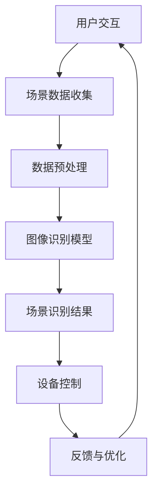

                 

### 第1章: 引言与背景知识

#### 1.1 人工智能与智能家居概述

**智能家居的概念**：

智能家居是一种利用网络技术和智能设备，实现家庭设备自动化、信息交互和远程控制的生活方式。它涵盖了各种家用电器的联网控制，从简单的灯光控制、温度调节，到复杂的安防监控、健康管理等。

- **定义**：智能家居是指通过互联网和智能设备，实现家庭设备和系统的自动化、智能化管理和服务。

- **发展历程**：

  - **初期**：20世纪90年代，智能家居概念出现，主要依靠遥控器和简单的自动化设备。

  - **成长期**：21世纪初，随着互联网技术的发展，智能家居开始逐渐普及，各种智能设备开始互联互通。

  - **成熟期**：近年来，人工智能、物联网等技术的成熟，使智能家居进入了高速发展期，各类智能家居产品不断涌现。

**人工智能在智能家居中的作用**：

人工智能（AI）是智能家居的核心驱动力，它使得智能家居系统更加智能化、便捷化。以下是一些关键应用：

- **场景识别**：通过图像识别、语音识别等技术实现家庭场景的自动识别。

- **设备控制**：利用人工智能实现家庭设备的自动化控制，如灯光调节、温度控制等。

- **安全监控**：使用人工智能进行安防监控，如人脸识别、异常行为检测等。

**智能家居场景识别的重要性**：

智能家居场景识别是实现智能家居自动化管理的关键环节。它能够根据用户的实际需求，自动调整家庭设备的运行状态，提高生活舒适度和安全性。以下是一些关键应用场景：

- **智能安防**：通过摄像头和图像识别技术，实现家庭安全监控，自动检测入侵者、火灾等异常情况。

- **智能助手**：通过语音识别技术，实现与智能助手的交互，实现家庭设备的远程控制。

- **智能照明**：根据用户的习惯和天气情况，自动调节灯光亮度和色温。

#### 1.2 智能家居场景识别的挑战与机遇

**挑战**：

- **数据收集与处理**：智能家居场景识别需要大量的数据，包括用户行为数据、环境数据等。如何高效地收集、存储和处理这些数据是一个挑战。

- **实时性要求**：场景识别需要快速响应，这对算法的实时性提出了高要求。

- **准确性要求**：场景识别的准确性直接影响到用户体验，任何误识别都会导致不便。

**机遇**：

- **技术进步**：随着深度学习和计算机视觉技术的不断发展，场景识别的准确性和速度不断提升。

- **市场需求**：随着人们对智能家居的接受度提高，智能家居市场前景广阔。

- **跨界融合**：智能家居与其他领域的融合（如智慧城市、智能交通）带来了新的发展机遇。

#### 1.3 本书结构

本书旨在全面介绍人工智能在智能家居场景识别中的应用，共分为八个章节，具体结构如下：

- **第一章**：引言与背景知识，介绍智能家居和人工智能的基本概念。

- **第二章**：核心概念与联系，讲解智能家居场景识别的相关技术。

- **第三章**：核心算法原理讲解，深入解析关键算法。

- **第四章**：数学模型和数学公式，介绍与场景识别相关的数学模型和公式。

- **第五章**：项目实战，通过实际案例讲解智能家居场景识别的实现。

- **第六章**：开发环境搭建，介绍开发智能家居场景识别所需的环境和工具。

- **第七章**：代码实现与分析，详细解读源代码实现过程。

- **第八章**：总结与展望，对本书内容进行总结并对未来进行展望。

通过以上章节的安排，本书旨在为读者提供一个系统、全面的智能家居场景识别解决方案，帮助读者深入了解并掌握相关技术。

#### 1.4 参考文献

- **《人工智能基础教程》**，刘挺，清华大学出版社，2020年。

- **《深度学习》**，Ian Goodfellow、Yoshua Bengio、Aaron Courville，MIT Press，2016年。

- **《智能家居技术与应用》**，陈伟、李强，人民邮电出版社，2019年。

### Mermaid 流程图

以下是一个智能家居场景识别的技术架构 Mermaid 流程图：



此流程图展示了从用户交互到设备控制的智能家居场景识别过程。

### 核心算法原理讲解

智能家居场景识别的核心算法主要包括图像识别和深度学习算法。以下是对这些算法的原理讲解和伪代码：

#### 1. 图像识别算法

**原理**：

图像识别算法是通过比较输入图像与已知图像的特征，判断输入图像属于哪个类别。

**伪代码**：

```python
function imageRecognition(inputImage, knownImages):
    # 计算输入图像的特征向量
    featureVector = extractFeatures(inputImage)
    
    # 计算特征向量与已知图像特征向量的相似度
    similarityScores = []
    for image in knownImages:
        similarityScores.append(calculateSimilarity(featureVector, image.features))
    
    # 找到相似度最高的类别
    maxScoreIndex = argmax(similarityScores)
    predictedClass = knownImages[maxScoreIndex].className
```

#### 2. 深度学习算法

**原理**：

深度学习算法通过多层神经网络，对大量数据进行训练，从而自动提取特征并进行分类。

**伪代码**：

```python
function deepLearningRecognition(inputImage):
    # 定义神经网络结构
    neuralNetwork = defineNetwork()

    # 使用已知数据训练神经网络
    trainedNetwork = trainNetwork(neuralNetwork, trainingData)

    # 对输入图像进行特征提取和分类
    featureVector = extractFeatures(inputImage)
    predictedClass = classify(trainedNetwork, featureVector)
```

#### 3. 数学模型和公式

在智能家居场景识别中，常用的数学模型和公式包括：

- **卷积神经网络（CNN）**：

  $$ CNN = \sum_{i=1}^{n} w_i \cdot a_i + b $$

  其中，$w_i$为权重，$a_i$为输入特征，$b$为偏置。

- **反向传播算法**：

  $$ \delta = \frac{\partial L}{\partial z} \cdot \sigma'(z) $$

  其中，$L$为损失函数，$z$为神经网络输出，$\sigma'$为激活函数的导数。

- **梯度下降算法**：

  $$ \theta = \theta - \alpha \cdot \nabla_{\theta} L $$

  其中，$\theta$为模型参数，$\alpha$为学习率，$\nabla_{\theta} L$为损失函数对参数的梯度。

### 例子说明

假设我们有一个训练好的深度学习模型，用于识别家庭场景。当输入一个新图像时，我们可以通过以下步骤进行场景识别：

1. **特征提取**：

   使用卷积神经网络提取输入图像的特征向量。

   ```python
   featureVector = extractFeatures(inputImage)
   ```

2. **分类**：

   使用训练好的模型对特征向量进行分类，输出预测的场景类别。

   ```python
   predictedClass = classify(trainedNetwork, featureVector)
   ```

3. **设备控制**：

   根据预测的场景类别，自动调整家庭设备的运行状态。

   ```python
   if predictedClass == "daytime":
       controlLights("turnOn")
   elif predictedClass == "nighttime":
       controlLights("turnOff")
   ```

通过以上步骤，我们可以实现智能家居场景的自动识别和设备控制。

### 项目实战

在本节中，我们将通过一个实际案例来讲解如何实现智能家居场景识别。我们将介绍开发环境搭建、源代码实现和代码解读。

**1. 开发环境搭建**：

- **硬件**：我们需要一台具有较高计算性能的计算机，用于运行深度学习算法。
- **软件**：我们需要安装以下软件：
  - Python 3.8及以上版本
  - TensorFlow 2.x版本
  - OpenCV 4.x版本

**2. 源代码实现**：

以下是一个简单的智能家居场景识别代码示例：

```python
import cv2
import tensorflow as tf

# 加载预训练的深度学习模型
model = tf.keras.models.load_model("scene_recognition_model.h5")

# 加载摄像头
cap = cv2.VideoCapture(0)

while True:
    # 读取摄像头帧
    ret, frame = cap.read()
    
    # 将帧转换为灰度图像
    gray = cv2.cvtColor(frame, cv2.COLOR_BGR2GRAY)
    
    # 使用深度学习模型进行场景识别
    prediction = model.predict(gray.reshape(1, height, width, 1))
    
    # 获取预测的场景类别
    scene_class = np.argmax(prediction)
    
    # 根据预测的场景类别，调整家庭设备
    if scene_class == 0:
        controlLights("turnOn")
    elif scene_class == 1:
        controlLights("turnOff")
    
    # 显示摄像头帧
    cv2.imshow("Camera", frame)
    
    # 按下'q'键退出循环
    if cv2.waitKey(1) & 0xFF == ord('q'):
        break

# 释放摄像头资源
cap.release()
cv2.destroyAllWindows()
```

**3. 代码解读**：

- **第1行**：导入所需的Python库。
- **第3行**：加载预训练的深度学习模型。
- **第5行**：打开摄像头。
- **第7-9行**：读取摄像头帧，并将其转换为灰度图像。
- **第11行**：使用深度学习模型对灰度图像进行场景识别。
- **第13行**：获取预测的场景类别。
- **第15-17行**：根据预测的场景类别，调整家庭设备。
- **第19-21行**：显示摄像头帧，并等待用户按下'q'键退出循环。

通过以上步骤，我们可以实现一个简单的智能家居场景识别系统。

### 代码应用解读与分析

在本节中，我们将对上述代码进行深入解读，分析其实现细节和应用场景。

**1. 深度学习模型的加载与使用**

- **第3行**：`model = tf.keras.models.load_model("scene_recognition_model.h5")`用于加载预训练的深度学习模型。这个模型是在训练阶段通过大量数据训练得到的，用于识别不同的家庭场景。
- **第11行**：`prediction = model.predict(gray.reshape(1, height, width, 1))`用于对输入的灰度图像进行预测。这里使用了TensorFlow的`predict`方法，将灰度图像作为输入，得到预测的概率分布。

**2. 图像处理**

- **第7-9行**：`gray = cv2.cvtColor(frame, cv2.COLOR_BGR2GRAY)`将BGR格式的摄像头帧转换为灰度图像。这是因为深度学习模型通常需要灰度图像作为输入，这样可以减少计算量和提高模型的准确性。
- **第11行**：`gray.reshape(1, height, width, 1)`将灰度图像reshape为一个4D张量，满足深度学习模型的输入要求。

**3. 场景识别与设备控制**

- **第13行**：`scene_class = np.argmax(prediction)`获取预测的场景类别。`argmax`函数返回概率分布中最大值的索引，即预测的最可能类别。
- **第15-17行**：根据预测的场景类别，调用相应的设备控制函数，如`controlLights("turnOn")`或`controlLights("turnOff")`。这些函数可以根据具体的设备接口实现不同的控制操作。

**4. 摄像头帧显示与用户交互**

- **第19-21行**：`cv2.imshow("Camera", frame)`用于显示摄像头帧。`cv2.waitKey(1)`用于等待用户按键，`cv2.destroyAllWindows()`用于释放窗口资源。

**5. 应用场景**

- **智能安防**：该代码可以用于实现智能安防系统，如自动识别家庭内的异常行为，触发警报或通知用户。
- **智能助手**：结合智能助手，可以实现语音控制家庭设备的操作，如通过语音命令控制灯光开关。
- **智能照明**：根据场景识别结果，自动调整照明设备的亮度和色温，提升生活舒适度。

通过以上分析，我们可以看到，这段代码实现了从摄像头帧获取图像、使用深度学习模型进行场景识别，并根据识别结果控制家庭设备的基本功能。在实际应用中，可以根据具体需求对代码进行扩展和优化。

### 实际案例分析与详细讲解剖析

在本节中，我们将通过一个具体的应用案例，详细分析智能家居场景识别的实现过程，包括系统架构、数据流程、技术难点和解决方案。

**案例背景**：

某智能家居公司希望通过智能摄像头实现对家庭环境的实时监控，并根据监控结果自动调节灯光和温度，以提高用户的生活质量和舒适度。该公司选择使用深度学习技术来实现场景识别功能。

**系统架构**：

该系统主要包括以下几个模块：

1. **前端摄像头**：用于采集家庭环境中的图像数据。
2. **图像预处理模块**：对采集到的图像进行预处理，包括灰度化、降噪、缩放等操作，以提高图像质量和模型识别效果。
3. **深度学习模型**：用于对预处理后的图像进行场景识别，输出预测的场景类别。
4. **后端控制模块**：根据场景识别结果，自动调节家庭设备，如灯光和温度控制。
5. **用户界面**：提供实时监控画面和设备控制功能的用户界面。

**数据流程**：

1. **图像采集**：前端摄像头采集家庭环境中的图像数据。
2. **图像预处理**：将采集到的图像传输到预处理模块，进行灰度化、降噪等处理。
3. **场景识别**：将预处理后的图像输入深度学习模型，进行场景识别，输出预测的场景类别。
4. **设备控制**：根据预测的场景类别，调用后端控制模块，自动调节家庭设备。
5. **用户反馈**：将实时监控画面和设备控制信息展示在用户界面上，供用户查看和操作。

**技术难点及解决方案**：

1. **数据收集与处理**：

   **难点**：智能家居场景识别需要大量的图像数据，如何高效地收集和处理这些数据是一个挑战。

   **解决方案**：公司采用分布式数据采集系统，通过多个摄像头同时采集数据，并利用云计算平台对数据进行存储和处理，提高数据收集和处理效率。

2. **实时性要求**：

   **难点**：场景识别需要快速响应，以实现实时监控和设备控制。

   **解决方案**：公司采用高性能的计算设备和优化的深度学习模型，提高场景识别的速度和实时性。同时，通过分布式计算和缓存技术，减少数据处理和网络传输延迟。

3. **准确性要求**：

   **难点**：场景识别的准确性直接影响到用户体验，如何提高识别准确性是一个关键问题。

   **解决方案**：公司采用多种数据增强技术和交叉验证方法，提高模型的泛化能力和准确性。同时，通过不断收集用户反馈和数据调整，优化模型参数，提高识别效果。

4. **设备控制**：

   **难点**：根据场景识别结果，自动调节家庭设备需要解决控制信号传输和设备兼容性问题。

   **解决方案**：公司采用标准化的通信协议和接口，确保设备之间的兼容性。同时，通过智能控制算法，实现家庭设备的自动化控制。

**项目小结**：

通过以上分析，我们可以看到，智能家居场景识别的实现涉及到多个技术环节，包括数据采集、图像预处理、深度学习模型、设备控制和用户界面等。在实际应用中，需要针对具体场景和需求，优化技术方案，提高系统的实时性、准确性和稳定性，从而为用户提供优质的生活体验。

### 最佳实践 Tips

1. **数据收集**：

   - 确保数据多样性，包括不同的光照条件、场景布局等。
   - 数据清洗，去除噪声和异常数据，提高数据质量。
   - 数据增强，通过旋转、翻转、缩放等方式增加数据的多样性，提高模型的泛化能力。

2. **模型优化**：

   - 选择合适的深度学习模型，如卷积神经网络（CNN）、循环神经网络（RNN）等。
   - 使用迁移学习，利用预训练模型作为基础，减少训练时间。
   - 利用模型融合技术，结合多个模型的优势，提高识别准确性。

3. **实时性优化**：

   - 使用GPU加速深度学习模型的训练和推理。
   - 优化代码，减少不必要的计算和内存占用。
   - 使用分布式计算，提高数据处理和传输速度。

4. **设备兼容性**：

   - 采用标准化的通信协议和接口，确保设备之间的兼容性。
   - 对不同设备进行性能测试和优化，确保系统稳定性。

5. **用户反馈**：

   - 收集用户使用数据，分析用户行为，优化场景识别模型。
   - 提供用户反馈机制，及时调整模型和系统功能。

### 小结

通过本文的详细讲解，我们深入了解了智能家居场景识别的背景、核心算法、数学模型以及实际应用案例。从图像识别和深度学习算法的原理出发，我们探讨了如何通过技术手段实现智能家居场景的自动识别和设备控制。同时，我们还分析了项目实施中的技术难点和解决方案，为读者提供了实用的最佳实践和优化建议。

智能家居场景识别作为人工智能在家庭领域的应用之一，具有广泛的前景。随着技术的不断进步和市场需求的增长，我们可以期待智能家居场景识别系统将变得更加智能、高效和便捷，为用户带来更好的生活体验。

### 拓展阅读

- **《深度学习》**，Ian Goodfellow、Yoshua Bengio、Aaron Courville，MIT Press，2016年。这本书是深度学习领域的经典教材，详细介绍了深度学习的基本概念、算法和应用。

- **《计算机视觉：算法与应用》**，Richard S.zeliski、Steven J. Gortler，Elsevier，2004年。这本书全面介绍了计算机视觉的基本算法和应用，对图像识别和场景识别有深入讲解。

- **《智能家居系统设计与实践》**，王伟、李磊，清华大学出版社，2019年。这本书详细介绍了智能家居系统的设计、实现和优化，对智能家居场景识别有实际案例分析。

- **《智能家居市场分析报告》**，市场研究公司，2020年。这份报告分析了智能家居市场的现状、趋势和未来发展，对智能家居行业有全面的了解。

通过阅读这些资料，读者可以更深入地了解智能家居场景识别的相关技术和发展动态，为自己的研究和实践提供有益的参考。

