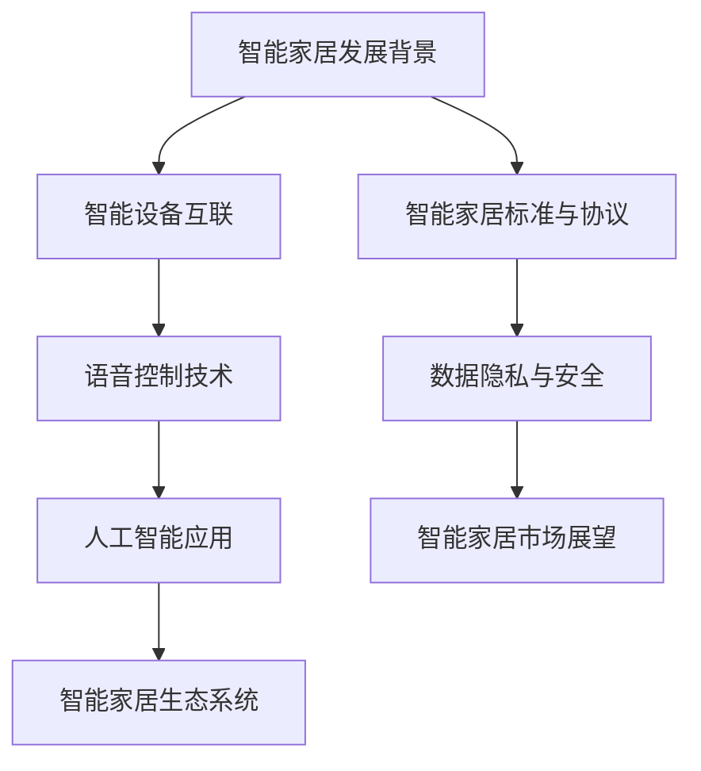
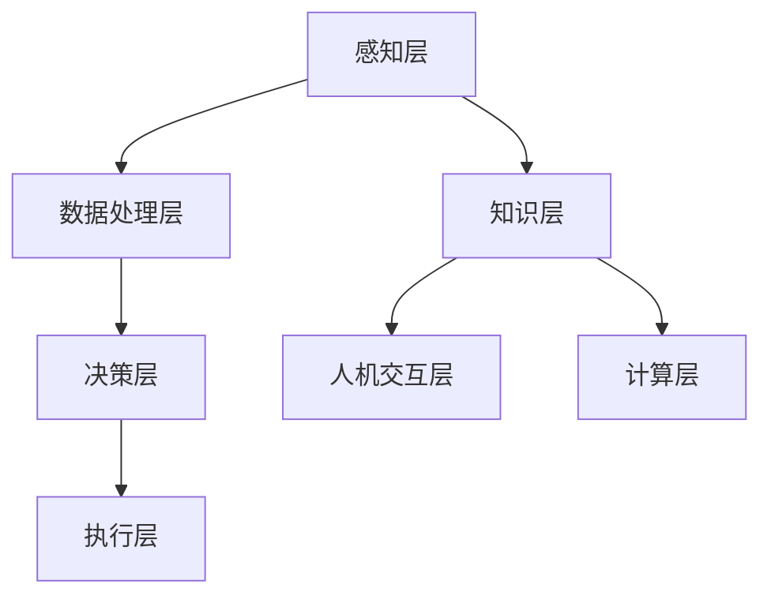
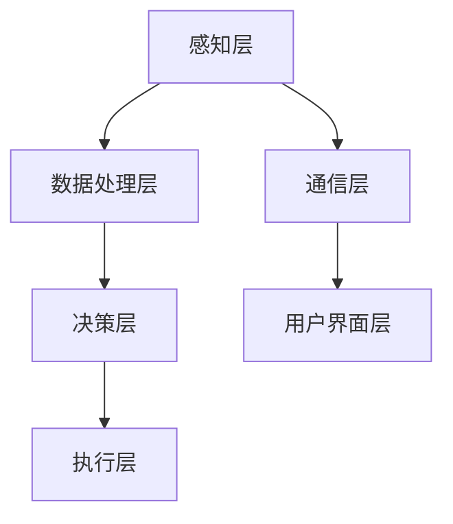

                 


## 文章标题：人工智能在智能家居场景识别中的应用

### 关键词：人工智能、智能家居、场景识别、计算机视觉、语音识别

> 摘要：本文深入探讨了人工智能在智能家居场景识别中的应用，从基本概念、技术原理到实际案例，全面解析了智能家居场景识别的关键技术和挑战，旨在为读者提供清晰的技术路线图和实用的开发指导。

## 第1章 引言与背景

### 1.1 人工智能与智能家居

#### 人工智能在智能家居中的重要性

人工智能（AI）是计算机科学的一个分支，其目标是使计算机系统具备类似人类的智能行为。随着物联网（IoT）技术的发展，智能家居逐渐成为人们生活的一部分。人工智能在智能家居中发挥着至关重要的作用，主要表现在以下几个方面：

1. **自动化控制**：通过人工智能算法，智能家居系统能够自动检测环境变化并作出相应的反应，如自动调整室内温度、照明等。
2. **个性化服务**：人工智能能够根据用户的行为习惯和偏好，提供个性化的服务，提升用户的生活质量。
3. **安全监控**：人工智能在智能家居安全系统中，能够实时监测家庭环境，及时发现异常情况并采取措施。

#### 智能家居场景识别的基本概念

智能家居场景识别是指利用人工智能技术，对家庭环境中的各种活动进行感知和识别，从而实现智能决策和响应。场景识别是智能家居的核心技术之一，主要包括以下几方面：

1. **行为识别**：通过计算机视觉技术，识别家庭中的行为活动，如行走、坐立、睡觉等。
2. **物体识别**：利用计算机视觉和传感器技术，识别家庭环境中的物体，如家具、家电、宠物等。
3. **环境识别**：通过传感器技术，监测室内温度、湿度、光照等环境参数，分析家庭环境状态。

#### 智能家居场景识别的应用场景

智能家居场景识别技术广泛应用于各种实际场景，如下：

1. **家庭安防**：通过摄像头和人脸识别技术，实时监测家庭安全状况，自动报警。
2. **智能照明**：根据用户活动和光照条件，自动调节灯光亮度和色温。
3. **智能家电控制**：根据用户需求，自动控制家电设备，如空调、电视、洗衣机等。
4. **智能环境监测**：监测室内空气质量、温度、湿度等环境参数，提供健康建议。

### 1.2 智能家居技术的发展

#### 智能家居发展的历史背景

智能家居的概念最早可以追溯到20世纪80年代，当时主要是在家庭网络和远程控制技术方面进行探索。随着物联网技术的发展，智能家居逐渐走向实用化。从2010年开始，智能家居市场进入快速发展阶段，各种智能设备和平台不断涌现。

#### 智能家居技术的现状与未来趋势

目前，智能家居技术已经取得了显著的进展，主要表现在以下几个方面：

1. **智能设备普及**：越来越多的家电产品开始具备智能功能，如智能空调、智能电视、智能冰箱等。
2. **平台集成**：各大厂商纷纷推出智能家居平台，实现不同品牌和设备的互联互通。
3. **人工智能应用**：人工智能技术在智能家居中的应用越来越广泛，如语音识别、图像识别、自然语言处理等。

未来，智能家居技术将继续向以下几个方向发展：

1. **智能化水平提升**：通过人工智能技术，智能家居系统将具备更高的自主决策能力，为用户提供更加个性化的服务。
2. **设备互联互通**：智能家居设备的互联互通将更加紧密，实现真正的智能家居生态系统。
3. **安全性能提升**：随着智能家居设备数量的增加，数据安全和隐私保护将成为重要课题。

#### 智能家居技术的主要挑战

尽管智能家居技术发展迅速，但仍面临一些挑战：

1. **兼容性问题**：不同品牌和平台的智能家居设备之间存在兼容性问题，导致用户体验不佳。
2. **数据隐私与安全**：智能家居设备会收集大量的用户数据，如何保护用户隐私和数据安全成为关键问题。
3. **技术成熟度**：部分智能家居技术尚未完全成熟，如智能语音识别、智能环境监测等，需要进一步研究和优化。

### 1.3 人工智能技术在智能家居中的应用

#### 人工智能在智能家居设备中的角色

人工智能技术在智能家居设备中扮演着重要角色，主要体现在以下几个方面：

1. **自动化控制**：通过机器学习算法，智能家居设备能够根据用户习惯和环境变化，自动调整工作状态，提高设备的使用效率。
2. **智能决策**：利用人工智能技术，智能家居系统能够实时分析环境数据，做出智能决策，如调整室内温度、灯光等。
3. **交互体验**：通过自然语言处理和语音识别技术，智能家居设备能够与用户进行自然、流畅的交互，提升用户体验。

#### 人工智能在智能家居场景识别中的作用

人工智能在智能家居场景识别中发挥着关键作用，主要体现在以下几个方面：

1. **行为识别**：通过计算机视觉和传感器技术，人工智能系统能够识别家庭中的行为活动，如行走、坐立、睡觉等。
2. **物体识别**：利用计算机视觉和深度学习技术，人工智能系统能够识别家庭环境中的物体，如家具、家电、宠物等。
3. **环境识别**：通过传感器技术，人工智能系统能够监测室内温度、湿度、光照等环境参数，分析家庭环境状态。

#### 人工智能技术在智能家居中的主要应用领域

人工智能技术在智能家居中的主要应用领域包括：

1. **家庭安防**：利用人工智能技术，实现家庭安全的实时监测和智能预警。
2. **智能照明**：根据用户行为和环境变化，实现智能调节灯光亮度和色温。
3. **智能家电控制**：通过人工智能技术，实现家电设备的智能控制和自动化运行。
4. **智能环境监测**：实时监测室内空气质量、温度、湿度等环境参数，提供健康建议。

### 1.4 书籍结构概述

#### 本书章节安排与主要内容概述

本书共分为六个章节，主要内容如下：

1. **第1章 引言与背景**：介绍人工智能在智能家居场景识别中的重要性、背景和发展趋势。
2. **第2章 人工智能基本概念**：阐述人工智能的定义、发展历程、技术分类和架构。
3. **第3章 智能家居场景识别技术**：分析智能家居场景识别的基本原理、计算机视觉和语音识别的应用。
4. **第4章 人工智能在智能家居场景识别中的应用案例**：介绍智能安防、智能照明、智能家电控制、智能环境监测等应用案例。
5. **第5章 智能家居场景识别中的挑战与解决方案**：讨论数据隐私与安全、数据质量和处理效率、多智能体协同等挑战及解决方案。
6. **第6章 人工智能在智能家居场景识别中的应用开发**：介绍智能家居场景识别系统的开发流程、开发环境搭建、核心算法实现与优化。

#### 阅读本书的目标与预期收获

阅读本书的目标是帮助读者全面了解人工智能在智能家居场景识别中的应用，包括基本概念、技术原理、实际案例和开发实践。通过阅读本书，读者可以：

1. **掌握人工智能在智能家居场景识别中的基本原理和应用**。
2. **了解智能家居场景识别的关键技术和挑战**。
3. **学习智能家居场景识别系统的开发流程和实现方法**。
4. **获得实用的开发经验和最佳实践指导**。

## Mermaid 流程图：智能家居技术的发展路线图



### 第2章 人工智能基本概念

#### 2.1 人工智能的定义

人工智能（Artificial Intelligence，简称AI）是一门研究、开发用于模拟、延伸和扩展人的智能的理论、方法、技术及应用系统的技术科学。人工智能的目的是使计算机系统具备人类智能的某些功能，如学习、推理、解决问题、感知和自然语言处理等。

#### 2.2 人工智能的发展历程

人工智能的发展历程可以分为以下几个阶段：

1. **第一阶段（1956-1969年）**：人工智能概念的提出和早期探索阶段。1956年，约翰·麦卡锡等人在达特茅斯会议上提出了人工智能的概念，标志着人工智能学科的诞生。

2. **第二阶段（1970-1980年）**：早期的人工智能研究主要集中在规则推理和知识表示上。这一时期，专家系统和知识库系统得到了广泛研究。

3. **第三阶段（1980-1987年）**：人工智能进入了一个低潮期，被称为“人工智能冬天”。由于过度理想化和实际应用的差距，许多研究项目被迫停止。

4. **第四阶段（1988-2000年）**：随着计算机性能的提高和互联网的普及，人工智能开始复苏。机器学习和深度学习技术得到了广泛应用。

5. **第五阶段（2001年至今）**：人工智能进入了一个高速发展期。深度学习、神经网络和自然语言处理等技术的发展，使人工智能在图像识别、语音识别、自动驾驶等领域取得了重大突破。

#### 2.3 人工智能的技术分类

人工智能技术可以分为以下几个主要类别：

1. **机器学习（Machine Learning）**：机器学习是一种让计算机通过数据学习并改进自身性能的方法。机器学习可以分为监督学习、无监督学习和强化学习。

   - **监督学习（Supervised Learning）**：通过已知输入和输出数据进行训练，从而学习到数据的规律，并能够对未知数据进行预测。
   - **无监督学习（Unsupervised Learning）**：没有已知的输入输出数据，通过探索数据内在结构，发现数据分布和模式。
   - **强化学习（Reinforcement Learning）**：通过试错的方式，在环境中获取奖励或惩罚，不断调整策略，以实现最佳效果。

2. **深度学习（Deep Learning）**：深度学习是一种基于人工神经网络的机器学习方法。与传统的机器学习方法相比，深度学习具有更好的表现和更强的泛化能力。

3. **自然语言处理（Natural Language Processing，NLP）**：自然语言处理是人工智能的一个重要分支，旨在使计算机能够理解、生成和处理自然语言。

   - **词性标注（Part-of-Speech Tagging）**：对文本中的单词进行词性标注，如名词、动词、形容词等。
   - **句法分析（Syntactic Parsing）**：分析文本的句法结构，理解句子成分之间的关系。
   - **语义分析（Semantic Analysis）**：理解文本的含义和上下文关系。

4. **计算机视觉（Computer Vision）**：计算机视觉是人工智能的一个分支，旨在使计算机能够从图像或视频中提取有用信息。

   - **图像识别（Image Recognition）**：通过算法识别图像中的物体、场景和特征。
   - **目标检测（Object Detection）**：检测图像中的目标对象，并定位其在图像中的位置。
   - **图像分割（Image Segmentation）**：将图像分割为若干区域，每个区域对应一个特定的物体或场景。

5. **语音识别（Speech Recognition）**：语音识别是让计算机通过分析音频信号，将语音转换为文本的技术。

6. **机器人技术（Robotics）**：机器人技术是人工智能在实体世界中的应用，旨在使机器人具备人类智能，能够自主完成复杂任务。

#### 2.4 人工智能的架构

人工智能系统通常可以分为以下几个层次：

1. **感知层**：感知层是人工智能系统的输入端，通过传感器、摄像头、麦克风等设备获取外部信息。

2. **数据处理层**：数据处理层负责对感知层获取的数据进行处理，如特征提取、去噪、增强等。

3. **决策层**：决策层是人工智能系统的核心，通过机器学习、深度学习等技术，对处理后的数据进行分析和决策。

4. **执行层**：执行层负责将决策层的决策结果转化为具体的操作，如控制机器人的运动、调节设备的参数等。

5. **知识层**：知识层是人工智能系统的高级层次，负责存储和管理知识库，包括事实、规则、经验等。

6. **人机交互层**：人机交互层负责人与人工智能系统之间的交互，如自然语言处理、语音识别等技术。

7. **计算层**：计算层是人工智能系统的计算资源层，包括计算硬件、软件和网络等。

### Mermaid 流�程图：人工智能技术架构



### 第3章 智能家居场景识别技术

#### 3.1 智能家居场景识别的基本原理

智能家居场景识别是指利用人工智能技术，对家庭环境中的各种活动进行感知和识别，从而实现智能决策和响应。智能家居场景识别的基本原理可以概括为以下几个步骤：

1. **数据采集**：通过各种传感器、摄像头、麦克风等设备，采集家庭环境中的数据，如温度、湿度、光照、声音、图像等。

2. **数据预处理**：对采集到的数据进行分析和处理，去除噪声、异常值等，提取有用的特征信息。

3. **特征提取**：从预处理后的数据中提取能够代表家庭活动场景的特征，如图像中的物体、颜色、纹理，声音中的频率、音量等。

4. **场景识别**：利用机器学习、深度学习等技术，对提取的特征进行建模和分类，识别家庭环境中的活动场景。

5. **决策与响应**：根据识别结果，智能家居系统会自动调整设备的状态，如开启或关闭灯光、空调、窗帘等。

#### 3.2 计算机视觉在智能家居场景识别中的应用

计算机视觉是智能家居场景识别的重要组成部分，通过图像处理、目标检测、图像识别等技术，实现家庭场景的感知和识别。以下是计算机视觉在智能家居场景识别中的应用：

1. **图像处理与特征提取**：通过对摄像头采集的图像进行处理，提取图像中的颜色、纹理、形状等特征，为后续的目标检测和识别提供基础。

2. **目标检测与跟踪**：利用卷积神经网络（CNN）等深度学习模型，实现对图像中的目标物体进行检测和跟踪。例如，可以检测家庭中的宠物、家具、家电等物体。

3. **人脸识别与身份验证**：通过人脸识别技术，识别人脸的特征，实现对家庭成员的身份验证。例如，可以用于家庭安防系统，实时监测家庭安全状况。

4. **行为识别**：通过连续捕捉图像序列，分析家庭成员的行为模式，如行走、坐立、睡觉等。例如，可以用于智能照明系统，根据行为模式自动调整灯光。

5. **场景识别**：通过综合分析图像中的多种特征，识别家庭环境中的活动场景，如客厅、卧室、厨房等。例如，可以用于智能安防系统，实时监测家庭安全状况。

#### 3.3 语音识别与自然语言处理在智能家居场景识别中的应用

语音识别和自然语言处理技术在智能家居场景识别中同样发挥着重要作用，通过理解和处理用户的语音指令，实现智能家居系统的智能交互。以下是语音识别与自然语言处理在智能家居场景识别中的应用：

1. **语音信号处理**：对采集到的语音信号进行预处理，包括噪声过滤、声音增强、说话人识别等，以提高语音识别的准确率。

2. **语音识别算法**：利用深度神经网络等模型，实现对语音信号的识别，将语音转换为文本。

3. **自然语言理解**：对识别出的文本进行语义分析，理解用户的意图和需求。例如，可以识别用户对灯光、空调、窗帘等设备的控制指令。

4. **语音合成**：将处理后的文本转换为语音输出，实现人与智能家居系统的自然交互。

5. **多轮对话**：通过上下文理解，实现多轮对话，提供更人性化的交互体验。例如，可以与用户进行对话，了解其生活习惯和偏好，提供个性化服务。

#### 3.4 传感器数据融合与处理

智能家居场景识别不仅依赖于计算机视觉和语音识别技术，还需要利用各种传感器采集的环境数据。传感器数据融合与处理技术是智能家居场景识别的重要组成部分，具体应用如下：

1. **传感器技术概述**：智能家居常用的传感器包括温度传感器、湿度传感器、光照传感器、空气质量传感器等，用于监测家庭环境中的各种参数。

2. **数据融合算法**：通过数据融合算法，将来自不同传感器的数据整合，提高场景识别的准确性和可靠性。例如，可以采用加权平均、卡尔曼滤波等算法。

3. **传感器数据处理**：对传感器数据进行预处理，如去噪、滤波、归一化等，以提高数据的质量和一致性。

4. **多源数据融合**：将来自视觉、语音、传感器等多源数据融合，形成更全面、准确的家庭环境模型。例如，可以结合摄像头捕获的图像数据和温度传感器数据，实现更准确的室内环境监测。

5. **场景识别与决策**：通过融合后的数据，利用机器学习、深度学习等技术，实现家庭场景的识别和智能决策。

### Mermaid 流程图：智能家居场景识别技术框架



### 第4章 人工智能在智能家居场景识别中的应用案例

#### 4.1 案例一：智能安防系统

智能安防系统是智能家居场景识别技术的重要应用之一，通过计算机视觉和传感器技术，实现对家庭安全的实时监测和智能预警。

**架构设计**

智能安防系统主要包括以下几个部分：

1. **感知层**：摄像头、传感器等设备，用于采集家庭环境中的图像、声音和数据。
2. **数据处理层**：通过图像处理、目标检测、人脸识别等技术，对感知层的数据进行分析和处理。
3. **决策层**：利用机器学习、深度学习等技术，对处理后的数据进行分析和判断，实现家庭安全的智能预警。
4. **执行层**：通过报警设备、门锁等执行层设备，实现安全事件的响应和处理。

**人工智能在智能安防系统中的应用**

1. **图像识别与目标检测**：利用深度学习模型，对摄像头捕获的图像进行实时分析，识别家庭成员、访客、宠物等目标，并跟踪目标在图像中的运动轨迹。

2. **人脸识别与身份验证**：通过人脸识别技术，识别人脸特征，实现家庭成员的身份验证。当检测到非家庭成员或陌生人时，触发预警。

3. **行为识别**：通过连续捕捉图像序列，分析家庭成员的行为模式，如长时间未活动、异常行为等，实现家庭安全的智能预警。

4. **智能报警**：当检测到安全事件时，系统会自动发送报警信息给家庭成员，并通过电话、短信、APP等方式通知用户。

#### 4.2 案例二：智能照明系统

智能照明系统通过计算机视觉和语音识别技术，实现根据用户行为和环境变化，自动调节灯光亮度和色温。

**基本原理**

1. **图像识别**：利用计算机视觉技术，实时捕捉室内环境和用户活动的图像。

2. **行为识别**：通过分析图像和传感器数据，识别用户的行为模式，如是否在室内活动、是否处于睡眠状态等。

3. **环境识别**：利用传感器数据，监测室内温度、湿度、光照等环境参数。

4. **智能控制**：根据行为识别和环境识别的结果，自动调整灯光的亮度和色温，为用户提供舒适的光环境。

**人工智能在智能照明系统中的应用**

1. **图像处理与特征提取**：通过对摄像头捕获的图像进行处理，提取图像中的颜色、亮度等特征，为后续的行为识别提供支持。

2. **行为识别**：利用深度学习模型，对提取的特征进行建模和分类，识别用户的行为模式。

3. **环境识别**：通过传感器数据，实时监测室内环境参数，为灯光调节提供依据。

4. **语音识别与自然语言处理**：通过语音识别技术，识别用户的语音指令，如“打开灯”、“调高温度”等，实现语音控制。

5. **智能调节**：根据行为识别和环境识别的结果，自动调节灯光的亮度和色温，实现智能照明。

#### 4.3 案例三：智能家电控制

智能家电控制通过人工智能技术，实现对家庭中各种家电设备的自动化控制和智能调度。

**系统设计**

智能家电控制系统主要包括以下几个部分：

1. **感知层**：传感器、智能插座、智能开关等设备，用于监测家电设备的状态和家庭环境数据。

2. **数据处理层**：通过数据采集、传输和处理，实现对家电设备的远程控制和状态监控。

3. **决策层**：利用机器学习、深度学习等技术，对处理后的数据进行分析和决策，实现家电设备的自动化控制和智能调度。

4. **执行层**：通过智能插座、智能开关等执行层设备，实现家电设备的自动化控制。

**人工智能在智能家电控制中的应用**

1. **设备识别与控制**：利用物联网技术，实现家电设备的远程连接和控制。

2. **行为识别**：通过传感器数据，识别家电设备的使用习惯和用户偏好，实现智能调度。

3. **设备联动**：通过智能调度，实现家电设备的协同工作，如自动开启空调、关闭窗帘等。

4. **语音控制**：通过语音识别技术，实现语音控制家电设备，提升用户体验。

5. **智能节能**：通过数据分析，优化家电设备的工作状态，实现节能环保。

#### 4.4 案例四：智能环境监测

智能环境监测通过传感器技术和人工智能算法，实现对家庭环境中温度、湿度、空气质量等参数的实时监测和智能分析。

**系统构成**

智能环境监测系统主要包括以下几个部分：

1. **感知层**：温度传感器、湿度传感器、空气质量传感器等设备，用于监测家庭环境中的各种参数。

2. **数据处理层**：通过数据采集、传输和处理，实现对环境参数的实时监测和分析。

3. **决策层**：利用机器学习、深度学习等技术，对处理后的数据进行分析和判断，提供健康建议。

4. **执行层**：通过智能空气净化器、加湿器等设备，实现家庭环境的智能调节。

**人工智能在智能环境监测中的应用**

1. **传感器数据采集**：通过各种传感器，实时监测家庭环境中的温度、湿度、空气质量等参数。

2. **数据预处理**：对采集到的数据进行分析和处理，去除噪声、异常值等，提取有用的特征信息。

3. **特征提取**：从预处理后的数据中提取能够代表环境状态的特性，如温度变化率、湿度波动范围等。

4. **环境识别与预测**：利用机器学习模型，对提取的特征进行建模和预测，实现对家庭环境状态的智能识别和预测。

5. **健康建议**：根据环境识别和预测结果，为用户提供健康建议，如调整室内温度、湿度等，改善家庭环境。

6. **智能调节**：通过智能空气净化器、加湿器等设备，根据环境监测结果，自动调节家庭环境参数，提供舒适的居住环境。

### 第5章 智能家居场景识别中的挑战与解决方案

#### 5.1 数据隐私与安全问题

**重要性**

在智能家居场景识别中，数据隐私与安全问题至关重要。智能家居设备会收集大量的用户数据，包括家庭活动、行为习惯、生活场景等。这些数据一旦泄露，可能会被用于恶意目的，对用户隐私和安全造成严重威胁。

**常见的数据隐私风险**

1. **数据泄露**：智能家居设备在数据传输和处理过程中，可能会遭受黑客攻击，导致用户数据泄露。

2. **数据滥用**：设备厂商或第三方可能滥用用户数据，进行商业推广或非法交易。

3. **数据积累**：智能家居设备不断收集用户数据，可能导致大量敏感信息积累，增加安全风险。

**解决方案**

1. **加密技术**：使用加密技术，对用户数据进行加密存储和传输，确保数据在传输和存储过程中不被窃取。

2. **访问控制**：设定严格的访问控制策略，确保只有授权用户和系统可以访问敏感数据。

3. **数据去识别化**：在数据处理和分析过程中，对用户数据进行去识别化处理，减少隐私泄露风险。

4. **安全审计**：定期进行安全审计，检测系统漏洞和潜在的安全风险，及时采取措施进行修复。

5. **用户教育**：加强对用户的隐私安全教育，提高用户对数据安全的认识和防范意识。

#### 5.2 数据质量和处理效率

**影响**

数据质量和处理效率对智能家居场景识别的性能和可靠性具有重要影响。低质量数据可能导致场景识别不准确，影响用户体验；而低处理效率可能导致系统响应延迟，降低系统的实用价值。

**数据质量的影响**

1. **噪声和异常值**：噪声和异常值会影响数据分析和模型训练，导致识别结果不准确。

2. **数据缺失**：数据缺失会导致模型训练样本减少，影响模型的泛化能力。

3. **数据一致性**：数据一致性差会影响系统的协调性和稳定性。

**处理效率的影响**

1. **实时性**：智能家居场景识别需要实时处理大量数据，处理效率低可能导致系统响应延迟。

2. **资源消耗**：高计算复杂度和资源消耗会影响系统的稳定运行。

**解决方案**

1. **数据预处理**：对采集到的数据进行预处理，去除噪声和异常值，补充缺失数据，提高数据质量。

2. **特征选择**：通过特征选择技术，提取有用的特征，减少数据维度，提高数据处理效率。

3. **分布式计算**：采用分布式计算技术，提高数据处理速度和并行处理能力。

4. **边缘计算**：在边缘设备上进行部分数据处理，减轻中心服务器的计算负担。

5. **模型优化**：采用高效、优化的机器学习和深度学习模型，降低计算复杂度。

6. **数据缓存**：使用数据缓存技术，减少数据读取和传输的延迟。

#### 5.3 多智能体协同与优化

**概念**

多智能体系统（Multi-Agent System）是指由多个具有独立性和协作性的智能体组成的系统。在智能家居场景识别中，多个智能体协同工作，共同完成复杂任务。

**挑战**

1. **通信与协调**：智能体之间需要高效、可靠的通信，协同完成任务。

2. **任务分配与优化**：如何合理分配任务，优化智能体间的协作，提高系统效率。

3. **动态调整**：智能家居场景复杂多变，智能体需要能够动态调整策略，适应环境变化。

**解决方案**

1. **通信协议**：采用标准化通信协议，确保智能体之间的通信高效、可靠。

2. **任务调度算法**：设计高效的任务调度算法，合理分配任务，提高系统效率。

3. **协调机制**：引入协调机制，确保智能体之间的协作和协调。

4. **学习与适应**：采用机器学习技术，让智能体能够从经验中学习，动态调整策略，适应环境变化。

5. **优化方法**：采用优化算法，如遗传算法、粒子群优化等，优化智能体间的协作和任务分配。

#### 5.4 智能家居场景识别的未来发展趋势

**新技术引入**

1. **边缘计算**：边缘计算可以将计算和存储能力分布到网络边缘，提高数据处理速度和系统响应能力。

2. **量子计算**：量子计算具有极高的计算能力，可以加速机器学习和深度学习模型的训练。

3. **5G技术**：5G技术提供高速、低延迟的网络连接，为智能家居场景识别提供更好的通信支持。

**未来应用场景**

1. **智能城市**：智能家居场景识别技术将扩展到智能城市，实现对城市环境的实时监测和智能管理。

2. **智能医疗**：利用智能家居场景识别技术，实现对患者病情的实时监测和远程诊断。

3. **智能交通**：通过智能家居场景识别技术，实现对交通流量和路况的智能监测和管理。

**技术挑战**

1. **数据隐私与安全**：随着智能家居场景识别技术的发展，数据隐私与安全问题将越来越突出。

2. **系统协同与优化**：智能家居场景识别系统需要高效、可靠的协同和优化。

3. **用户体验**：如何提升智能家居场景识别技术的用户体验，使其更加自然、便捷。

4. **技术融合**：如何融合多种人工智能技术，实现智能家居场景识别的全面智能化。

### 第6章 人工智能在智能家居场景识别中的应用开发

#### 6.1 智能家居场景识别系统的开发流程

智能家居场景识别系统的开发涉及多个环节，包括需求分析、系统设计、系统实现、系统测试与部署。以下是智能家居场景识别系统开发的一般流程：

1. **需求分析**：明确智能家居场景识别系统的功能需求、性能指标和用户需求，为后续的系统设计提供基础。

2. **系统设计**：根据需求分析结果，设计系统的整体架构，包括感知层、数据处理层、决策层、执行层等。

3. **系统实现**：根据系统设计，开发具体的软件和硬件模块，实现系统的各项功能。

4. **系统测试**：对开发完成的系统进行功能测试、性能测试和稳定性测试，确保系统能够正常运行。

5. **系统部署**：将测试合格的系统部署到实际的智能家居环境中，进行实地运行和优化。

#### 6.2 开发环境搭建

搭建智能家居场景识别系统开发环境是系统开发的第一步，主要包括以下几个部分：

1. **硬件环境**：准备开发所需的硬件设备，如计算机、摄像头、传感器等。

2. **软件环境**：安装操作系统、编程语言、开发工具和库等，如Python、OpenCV、TensorFlow等。

3. **数据库环境**：搭建用于存储和管理数据的数据库系统，如MySQL、MongoDB等。

4. **网络环境**：配置网络连接，确保系统可以与其他设备进行通信。

#### 6.3 核心算法实现与优化

智能家居场景识别系统的核心算法包括图像处理、目标检测、图像识别、语音识别等。以下是核心算法实现与优化的步骤：

1. **算法选择**：根据智能家居场景识别的需求，选择合适的算法，如卷积神经网络（CNN）、循环神经网络（RNN）、深度学习框架（如TensorFlow、PyTorch）等。

2. **数据准备**：收集和准备用于训练和测试的数据集，包括图像、声音、传感器数据等。

3. **算法实现**：根据选定的算法，编写相应的代码，实现数据预处理、特征提取、模型训练和预测等步骤。

4. **模型优化**：通过调整模型参数、优化算法结构，提高模型的准确性和效率。

5. **性能评估**：对训练好的模型进行性能评估，包括准确率、召回率、F1值等指标，确保模型达到预期效果。

6. **模型部署**：将训练好的模型部署到实际应用环境中，进行实时运行和优化。

#### 6.4 项目实战

以下是一个智能家居场景识别项目的实战案例，包括开发环境搭建、源代码实现和代码解读。

**项目目标**：实现一个基于计算机视觉和语音识别的智能家居场景识别系统，能够自动识别家庭中的行为活动，并根据用户需求自动调整灯光和空调等设备。

**开发环境搭建**

1. **硬件环境**：准备一台计算机、一个摄像头和一个语音识别模块。

2. **软件环境**：安装Python 3.8、OpenCV 4.5、TensorFlow 2.4等。

3. **数据库环境**：使用SQLite数据库存储用户数据和场景识别结果。

4. **网络环境**：配置WiFi网络，确保计算机与摄像头和语音识别模块之间的通信。

**源代码实现**

以下是一个简单的智能家居场景识别系统的伪代码，实现行为识别和设备控制：

```python
import cv2
import speech_recognition as sr
import sqlite3

# 初始化摄像头
camera = cv2.VideoCapture(0)

# 初始化语音识别模块
recognizer = sr.SpeechRecognizer()

# 连接数据库
conn = sqlite3.connect('智能家居.db')
c = conn.cursor()

# 循环捕捉视频帧
while True:
    # 读取一帧图像
    ret, frame = camera.read()
    
    # 进行图像处理和目标检测
    processed_frame = process_frame(frame)
    
    # 识别行为活动
    activity = recognize_activity(processed_frame)
    
    # 存储识别结果
    c.execute("INSERT INTO activities (time, activity) VALUES (?, ?)", (datetime.now(), activity))
    conn.commit()
    
    # 检测语音命令
    with recognizer.listen() as source:
        text = recognizer.recognize_google(source)
        if '开灯' in text:
            control_light('on')
        elif '关灯' in text:
            control_light('off')
        elif '调高温度' in text:
            control_ac('high')
        elif '调低温度' in text:
            control_ac('low')

# 释放摄像头资源
camera.release()

# 关闭数据库连接
conn.close()
```

**代码解读**

1. **摄像头和语音识别模块初始化**：首先，初始化摄像头和语音识别模块，确保可以正常使用。

2. **连接数据库**：连接数据库，用于存储用户行为活动和语音命令。

3. **循环捕捉视频帧**：使用循环持续捕捉视频帧，进行图像处理和目标检测。

4. **存储识别结果**：将识别出的行为活动存储到数据库中。

5. **检测语音命令**：使用语音识别模块，实时检测用户的语音命令，根据命令自动控制灯光和空调等设备。

**代码应用解读与分析**

1. **摄像头和语音识别模块的使用**：代码首先初始化摄像头和语音识别模块，确保可以正常使用。摄像头用于捕捉视频帧，语音识别模块用于实时检测用户的语音命令。

2. **图像处理和目标检测**：代码通过调用`process_frame`和`recognize_activity`函数，对捕捉到的视频帧进行图像处理和目标检测，识别家庭中的行为活动。

3. **数据库操作**：代码使用SQLite数据库，将识别出的行为活动存储到数据库中，方便后续查询和分析。

4. **语音命令处理**：代码通过调用`recognizer.recognize_google`函数，实时检测用户的语音命令，根据命令自动控制灯光和空调等设备。

**项目小结**

通过本项目的实战案例，我们实现了基于计算机视觉和语音识别的智能家居场景识别系统。项目从开发环境搭建、源代码实现到代码解读，详细介绍了智能家居场景识别系统的实现过程。在实际应用中，可以根据需求，扩展系统的功能，如添加更多的行为识别和设备控制模块，提升用户体验。

#### 6.5 最佳实践 tips、小结、注意事项、拓展阅读

**最佳实践 tips**

1. **数据安全**：在开发智能家居场景识别系统时，要重视数据安全，采用加密技术保护用户隐私。

2. **模块化设计**：将系统划分为多个模块，实现模块化设计，提高系统的可维护性和可扩展性。

3. **持续优化**：定期对系统进行性能优化，提高数据处理速度和准确率。

**小结**

本文从人工智能在智能家居场景识别中的应用出发，详细介绍了智能家居场景识别的基本概念、关键技术、实际案例以及开发实践。通过本文的阅读，读者可以全面了解智能家居场景识别技术的原理和应用，为实际项目开发提供参考。

**注意事项**

1. **兼容性问题**：在开发智能家居场景识别系统时，要注意不同设备和平台的兼容性。

2. **数据处理效率**：提高数据处理效率，确保系统能够实时响应用户需求。

3. **用户体验**：关注用户体验，设计简洁、直观的用户界面。

**拓展阅读**

1. **《深度学习》**：Goodfellow et al., "Deep Learning", 2016，详细介绍了深度学习的基本概念和应用。

2. **《Python计算机视觉应用》**：Py Image Search, "Python Computer Vision with OpenCV 4", 2020，介绍了Python和OpenCV在计算机视觉中的应用。

3. **《智能家居技术与应用》**：张健，"智能家居技术与应用"，2019，详细介绍了智能家居技术的基本原理和应用。

## 作者信息

作者：AI天才研究院/AI Genius Institute & 禅与计算机程序设计艺术 /Zen And The Art of Computer Programming

