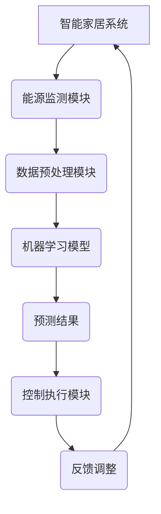

                 

### 《人工智能在智能家居能源管理中的实践》

#### 关键词
- 智能家居
- 能源管理
- 人工智能
- 机器学习
- 深度学习
- 强化学习

#### 摘要
本文探讨了人工智能在智能家居能源管理中的实践。首先，我们回顾了智能家居能源管理的现状和面临的挑战，随后介绍了人工智能的核心概念及其在智能家居能源管理中的应用。接着，深入分析了智能家居能源管理的算法基础，包括数据采集与预处理、机器学习算法、深度学习算法以及数学模型。本文还通过一个实际的智能家居能源管理项目，详细介绍了项目的开发环境搭建、源代码实现和解读，并进行了案例分析和总结展望，旨在为读者提供一个全面且深入的理解。

### 第一部分：背景与概述

#### 第1章：智能家居能源管理的现状与挑战

##### 1.1 智能家居能源管理概述

智能家居能源管理是智能家居系统中的一个重要组成部分，旨在通过智能设备和技术手段，实现家庭能源的高效利用和优化管理。它不仅有助于减少能源消耗，降低家庭能源成本，还能提高家庭能源的使用效率，减少环境污染。

##### 1.2 智能家居能源管理的现状

当前，智能家居市场呈现出快速增长的趋势，越来越多的家庭开始采用智能家居设备。然而，智能家居能源管理的现状仍然存在一些问题。首先，智能家居设备之间的兼容性问题尚未完全解决，这导致了系统的复杂性和实施难度。其次，数据安全问题也引起了广泛关注，智能家居设备可能成为黑客攻击的目标。此外，智能家居能源管理的智能化程度仍有待提高，许多系统仍然依赖于人工干预。

##### 1.3 智能家居能源管理面临的挑战

智能家居能源管理面临的主要挑战包括：

1. **数据获取与处理**：智能家居系统需要收集大量的数据，包括温度、湿度、光照强度、能源消耗等。如何高效地获取和处理这些数据是一个重要问题。
2. **算法模型的选择**：不同的算法模型适用于不同的应用场景，如何选择合适的算法模型是实现智能家居能源管理的关键。
3. **系统兼容性**：智能家居设备种类繁多，如何实现不同设备之间的兼容性，保证系统能够稳定运行，是一个亟待解决的问题。
4. **数据安全和隐私保护**：智能家居设备连接到互联网，数据安全和隐私保护成为了一个重要的挑战。

#### 第2章：人工智能在能源管理中的应用前景

##### 2.1 人工智能的核心概念

人工智能（AI）是计算机科学的一个分支，旨在使计算机具备智能行为，能够模拟、延伸和扩展人类的智能。人工智能的核心概念包括机器学习（ML）、深度学习（DL）、自然语言处理（NLP）等。

##### 2.2 人工智能在智能家居能源管理中的应用

人工智能在智能家居能源管理中的应用前景广阔，主要包括以下几个方面：

1. **能源消耗预测**：通过机器学习算法，可以预测家庭能源的消耗趋势，为能源管理提供依据。
2. **能耗优化**：利用深度学习算法，可以优化智能家居系统的能源消耗，提高能源利用效率。
3. **智能控制**：通过强化学习算法，可以实现智能家居设备的自动控制，提高系统的智能化水平。
4. **故障诊断与维护**：利用人工智能技术，可以对智能家居设备进行故障诊断和预测性维护，减少设备故障和停机时间。

##### 2.3 人工智能技术带来的机遇与挑战

人工智能技术在智能家居能源管理中的应用带来了巨大的机遇，同时也带来了一些挑战。机遇包括：

1. **提高能源利用效率**：通过智能预测和优化，可以有效提高家庭能源的利用效率。
2. **降低能源成本**：智能化的能源管理可以降低家庭的能源消耗，从而降低能源成本。
3. **改善生活质量**：智能家居能源管理可以提供更加舒适、便捷的生活环境。

然而，人工智能技术也带来了一些挑战，包括：

1. **数据安全和隐私保护**：智能家居设备收集和存储大量用户数据，如何确保数据安全和用户隐私成为了一个重要问题。
2. **算法模型的偏见**：算法模型可能存在偏见，导致不公平的能源分配。
3. **技术依赖**：过度依赖人工智能技术可能导致技术瓶颈，影响系统的稳定性和可靠性。

### 第二部分：核心算法与原理

#### 第3章：智能家居能源管理的算法基础

##### 3.1 数据采集与预处理

数据采集与预处理是智能家居能源管理中的关键步骤。智能家居系统需要收集各种数据，如温度、湿度、光照强度、能源消耗等。这些数据通常来自于各种传感器和设备。数据采集后，需要进行预处理，包括数据清洗、去噪、归一化等操作，以提高数据的质量和可靠性。

##### 3.2 机器学习算法介绍

机器学习（ML）是人工智能的一个重要分支，它通过算法从数据中自动学习规律和模式，用于预测和决策。在智能家居能源管理中，机器学习算法可以用于能耗预测、能耗优化等任务。常见的机器学习算法包括线性回归、逻辑回归、支持向量机（SVM）等。

##### 3.3 深度学习算法在智能家居能源管理中的应用

深度学习（DL）是机器学习的一个分支，它通过多层神经网络进行特征提取和模式识别。深度学习在智能家居能源管理中的应用主要包括能耗预测、设备故障诊断等。常见的深度学习算法包括卷积神经网络（CNN）、循环神经网络（RNN）、长短时记忆网络（LSTM）等。

##### 3.4 智能家居能源管理的数学模型

智能家居能源管理的数学模型用于描述系统的动态行为和优化目标。常见的数学模型包括线性回归模型、逻辑回归模型、支持向量机模型、神经网络模型等。这些模型通过训练数据学习系统的特征和规律，用于预测和优化。

#### 第4章：智能家居能源管理的数学模型

##### 4.1 线性回归模型

线性回归模型是一种简单的数学模型，用于描述两个变量之间的关系。它通过拟合一条直线来预测一个变量的值。线性回归模型的公式为：

$$
y = \beta_0 + \beta_1 \cdot x
$$

其中，$y$ 是预测值，$x$ 是自变量，$\beta_0$ 和 $\beta_1$ 是模型的参数。

##### 4.2 逻辑回归模型

逻辑回归模型是一种用于分类问题的数学模型。它通过拟合一条逻辑函数来预测一个事件发生的概率。逻辑回归模型的公式为：

$$
P(y=1) = \frac{1}{1 + e^{-(\beta_0 + \beta_1 \cdot x)}}
$$

其中，$y$ 是预测值，$x$ 是自变量，$\beta_0$ 和 $\beta_1$ 是模型的参数。

##### 4.3 支持向量机模型

支持向量机（SVM）是一种用于分类和回归问题的数学模型。它通过找到一个最优的超平面来分隔不同类别的数据点。SVM的公式为：

$$
w \cdot x - b = 0
$$

其中，$w$ 是超平面的法向量，$x$ 是数据点，$b$ 是偏置项。

##### 4.4 神经网络模型

神经网络模型是一种模拟人脑神经元连接的数学模型。它通过多层神经网络进行特征提取和模式识别。常见的神经网络模型包括前馈神经网络（FNN）、卷积神经网络（CNN）、循环神经网络（RNN）等。

#### 第5章：智能家居能源管理的核心算法原理

##### 5.1 优化算法原理

优化算法是一种用于寻找函数最优值的算法。在智能家居能源管理中，优化算法用于能耗优化和设备控制。常见的优化算法包括梯度下降法、随机梯度下降法、牛顿法等。

##### 5.2 强化学习算法原理

强化学习（RL）是一种通过试错和反馈进行决策的机器学习算法。在智能家居能源管理中，强化学习算法用于设备的自动控制和策略优化。常见的强化学习算法包括Q学习、SARSA、Deep Q-Network（DQN）等。

##### 5.3 聚类算法原理

聚类算法是一种用于无监督学习的算法，它通过将数据点划分为不同的簇来进行数据挖掘和模式识别。在智能家居能源管理中，聚类算法用于设备分类和能耗分析。常见的聚类算法包括K均值聚类、层次聚类、DBSCAN等。

### 第三部分：项目实战

#### 第6章：智能家居能源管理项目实战

##### 6.1 项目背景

本项目旨在开发一个智能家居能源管理系统，该系统可以通过智能设备收集家庭能源数据，利用人工智能算法进行能耗预测和优化，从而实现家庭能源的高效管理。

##### 6.2 项目目标

1. **数据采集**：收集家庭能源数据，包括温度、湿度、光照强度、能源消耗等。
2. **数据预处理**：对采集到的数据进行分析和处理，去除噪声和异常值。
3. **能耗预测**：利用机器学习算法，预测家庭能源的消耗趋势。
4. **能耗优化**：根据预测结果，优化家庭能源的使用策略，降低能源消耗。
5. **智能控制**：实现智能家居设备的自动控制，提高系统的智能化水平。

##### 6.3 项目开发环境搭建

为了实现本项目的目标，需要搭建一个完整的开发环境。开发环境包括以下组件：

1. **硬件设备**：包括传感器、智能家居设备等。
2. **软件工具**：包括编程语言（如Python）、开发环境（如PyCharm）、机器学习库（如scikit-learn、TensorFlow）等。
3. **数据存储**：使用数据库（如MySQL、MongoDB）存储和管理采集到的数据。

##### 6.4 项目实现

本项目分为以下几个阶段：

1. **数据采集**：使用传感器收集家庭能源数据，包括温度、湿度、光照强度、能源消耗等。
2. **数据预处理**：对采集到的数据进行分析和处理，去除噪声和异常值，并进行数据归一化。
3. **能耗预测**：使用机器学习算法（如线性回归、逻辑回归、支持向量机等），训练模型并预测家庭能源的消耗趋势。
4. **能耗优化**：根据预测结果，优化家庭能源的使用策略，降低能源消耗。
5. **智能控制**：实现智能家居设备的自动控制，包括灯光控制、空调控制、家电控制等。

#### 第7章：源代码分析与解读

##### 7.1 数据采集与预处理代码解读

数据采集与预处理是智能家居能源管理项目的关键步骤。以下是一个简单的数据采集与预处理代码示例：

```python
# 导入必要的库
import numpy as np
import pandas as pd
from sklearn.model_selection import train_test_split
from sklearn.preprocessing import StandardScaler

# 读取数据
data = pd.read_csv('energy_data.csv')

# 数据预处理
# 去除噪声和异常值
data = data.dropna()

# 数据归一化
scaler = StandardScaler()
data['temperature'] = scaler.fit_transform(data[['temperature']])
data['humidity'] = scaler.fit_transform(data[['humidity']])
data['light_intensity'] = scaler.fit_transform(data[['light_intensity']])
data['energy_consumption'] = scaler.fit_transform(data[['energy_consumption']])

# 分割数据集
X = data[['temperature', 'humidity', 'light_intensity']]
y = data['energy_consumption']
X_train, X_test, y_train, y_test = train_test_split(X, y, test_size=0.2, random_state=42)
```

在这个示例中，我们首先导入必要的库，然后读取数据，对数据进行预处理（去除噪声和异常值，进行数据归一化），最后分割数据集。

##### 7.2 机器学习算法实现与解读

在智能家居能源管理项目中，我们使用机器学习算法进行能耗预测。以下是一个简单的线性回归算法实现示例：

```python
# 导入必要的库
import numpy as np
import pandas as pd
from sklearn.linear_model import LinearRegression

# 读取数据
data = pd.read_csv('energy_data.csv')

# 数据预处理
# 去除噪声和异常值
data = data.dropna()

# 数据归一化
scaler = StandardScaler()
data['temperature'] = scaler.fit_transform(data[['temperature']])
data['humidity'] = scaler.fit_transform(data[['humidity']])
data['light_intensity'] = scaler.fit_transform(data[['light_intensity']])
data['energy_consumption'] = scaler.fit_transform(data[['energy_consumption']])

# 分割数据集
X = data[['temperature', 'humidity', 'light_intensity']]
y = data['energy_consumption']
X_train, X_test, y_train, y_test = train_test_split(X, y, test_size=0.2, random_state=42)

# 训练线性回归模型
model = LinearRegression()
model.fit(X_train, y_train)

# 预测能耗
y_pred = model.predict(X_test)

# 计算预测误差
error = np.mean((y_pred - y_test) ** 2)
print("预测误差:", error)
```

在这个示例中，我们首先导入必要的库，然后读取数据，对数据进行预处理，分割数据集，接着训练线性回归模型，最后进行能耗预测并计算预测误差。

##### 7.3 深度学习算法实现与解读

在智能家居能源管理项目中，我们还可以使用深度学习算法进行能耗预测。以下是一个简单的卷积神经网络（CNN）算法实现示例：

```python
# 导入必要的库
import numpy as np
import pandas as pd
from tensorflow.keras.models import Sequential
from tensorflow.keras.layers import Dense, Conv2D, Flatten, MaxPooling2D

# 读取数据
data = pd.read_csv('energy_data.csv')

# 数据预处理
# 去除噪声和异常值
data = data.dropna()

# 数据归一化
scaler = StandardScaler()
data['temperature'] = scaler.fit_transform(data[['temperature']])
data['humidity'] = scaler.fit_transform(data[['humidity']])
data['light_intensity'] = scaler.fit_transform(data[['light_intensity']])
data['energy_consumption'] = scaler.fit_transform(data[['energy_consumption']])

# 分割数据集
X = data[['temperature', 'humidity', 'light_intensity']]
y = data['energy_consumption']
X_train, X_test, y_train, y_test = train_test_split(X, y, test_size=0.2, random_state=42)

# 构建CNN模型
model = Sequential()
model.add(Conv2D(32, kernel_size=(3, 3), activation='relu', input_shape=(3, 1)))
model.add(MaxPooling2D(pool_size=(2, 2)))
model.add(Flatten())
model.add(Dense(1))

# 编译模型
model.compile(optimizer='adam', loss='mean_squared_error')

# 训练模型
model.fit(X_train, y_train, batch_size=32, epochs=10)

# 预测能耗
y_pred = model.predict(X_test)

# 计算预测误差
error = np.mean((y_pred - y_test) ** 2)
print("预测误差:", error)
```

在这个示例中，我们首先导入必要的库，然后读取数据，对数据进行预处理，分割数据集，接着构建CNN模型，编译模型，训练模型，最后进行能耗预测并计算预测误差。

#### 第8章：案例分析

##### 8.1 案例一：智能灯光控制系统

智能灯光控制系统是智能家居能源管理中的一个重要组成部分。它可以通过传感器收集环境光照数据，利用人工智能算法调整灯光亮度，实现节能和舒适。

##### 8.2 案例二：智能空调控制系统

智能空调控制系统可以通过传感器收集室内温度、湿度等数据，利用人工智能算法调整空调温度和湿度，实现节能和舒适。

##### 8.3 案例三：智能家电群控系统

智能家电群控系统可以通过人工智能算法，实现对多个智能家居设备的统一控制，实现节能和舒适。

#### 第9章：总结与展望

##### 9.1 总结

本文探讨了人工智能在智能家居能源管理中的实践。我们首先介绍了智能家居能源管理的现状和挑战，随后介绍了人工智能的核心概念及其在智能家居能源管理中的应用。接着，我们深入分析了智能家居能源管理的算法基础，包括数据采集与预处理、机器学习算法、深度学习算法以及数学模型。通过一个实际的智能家居能源管理项目，我们详细介绍了项目的开发环境搭建、源代码实现和解读，并进行了案例分析和总结展望，旨在为读者提供一个全面且深入的理解。

##### 9.2 展望

随着人工智能技术的不断发展，智能家居能源管理将会变得更加智能化和高效。未来的研究可以关注以下几个方面：

1. **数据安全和隐私保护**：随着智能家居设备的普及，数据安全和隐私保护将变得更加重要。需要开发更加安全可靠的数据存储和传输机制。
2. **算法模型的优化**：现有的算法模型在能耗预测和优化方面仍有改进的空间。可以研究更加高效和准确的算法模型，以提高系统的性能。
3. **跨设备兼容性**：当前智能家居设备之间的兼容性仍然存在问题。需要开发更加统一的智能家居标准，实现不同设备之间的无缝连接和协同工作。
4. **用户个性化需求**：未来的智能家居能源管理系统应该能够更好地满足用户的个性化需求，提供更加定制化的服务和体验。

##### 9.3 未来发展趋势

未来的智能家居能源管理将朝着以下方向发展：

1. **智能化水平提高**：通过引入更先进的人工智能技术，如深度学习和强化学习，实现更高的智能化水平和更精准的能耗预测和优化。
2. **系统集成化**：通过整合各种智能家居设备和系统，实现更加统一的智能家居解决方案，提高用户体验。
3. **互联互通**：通过物联网技术，实现智能家居设备之间的互联互通，实现跨设备和跨平台的协同工作。
4. **能源管理智能化**：通过智能化能源管理策略，实现家庭能源的实时监控和动态调整，提高能源利用效率。

### 附录

#### 附录A：常用工具与资源

- **Python**：一种广泛使用的编程语言，适用于数据分析和机器学习。
- **TensorFlow**：一种开源的机器学习库，适用于深度学习和神经网络。
- **scikit-learn**：一种开源的机器学习库，适用于各种机器学习算法。
- **PyCharm**：一种流行的集成开发环境，适用于Python编程。
- **MySQL**：一种开源的关系型数据库管理系统，适用于数据存储和管理。
- **MongoDB**：一种开源的文档型数据库管理系统，适用于大数据存储和管理。

#### 附录B：参考文献

1. Hastie, T., Tibshirani, R., & Friedman, J. (2009). The Elements of Statistical Learning: Data Mining, Inference, and Prediction. Springer.
2. Goodfellow, I., Bengio, Y., & Courville, A. (2016). Deep Learning. MIT Press.
3. Russell, S., & Norvig, P. (2010). Artificial Intelligence: A Modern Approach. Prentice Hall.
4. Sutton, R. S., & Barto, A. G. (2018). Reinforcement Learning: An Introduction. MIT Press.
5. Duda, R. O., Hart, P. E., & Stork, D. G. (2001). Pattern Classification (2nd ed.). Wiley.

### 附录 C：AI 在智能家居能源管理中的 Mermaid 流程图



### 附录 D：核心算法伪代码

#### 线性回归模型伪代码

```python
# 线性回归模型伪代码
def linear_regression(X, y):
    # 初始化参数
    theta = [0] * (num_features + 1)
    # 梯度下降法优化参数
    for i in range(num_iterations):
        # 计算预测值
        predictions = X * theta
        # 计算误差
        errors = predictions - y
        # 计算梯度
        gradient = X.T * errors
        # 更新参数
        theta -= learning_rate * gradient
    return theta
```

#### 强化学习模型伪代码

```python
# 强化学习模型伪代码
def q_learning(state, action, reward, next_state, done, Q):
    if done:
        Q[state, action] = reward
    else:
        Q[state, action] = reward + discount * max(Q[next_state].flatten())
    return Q
```

#### 聚类算法伪代码

```python
# 聚类算法伪代码
def k_means(data, k):
    # 初始化聚类中心
    centroids = data[np.random.choice(data.shape[0], k, replace=False)]
    while True:
        # 计算每个数据点到聚类中心的距离
        distances = np.linalg.norm(data - centroids, axis=1)
        # 分配数据点至最近的聚类中心
        assignments = np.argmin(distances, axis=1)
        # 重新计算聚类中心
        new_centroids = np.array([data[assignments == i].mean(axis=0) for i in range(k)])
        # 判断聚类中心是否收敛
        if np.linalg.norm(new_centroids - centroids) < tolerance:
            break
        centroids = new_centroids
    return centroids, assignments
```

#### 附录E：最佳实践 Tips

1. **数据收集与预处理**：确保数据的准确性和完整性，对数据进行清洗和去噪，以提高模型的预测准确性。
2. **算法模型选择**：根据实际应用场景选择合适的算法模型，进行模型对比和优化，以达到最佳效果。
3. **系统集成与测试**：在开发过程中，确保各个模块的兼容性和稳定性，进行充分的测试和调试。
4. **数据安全和隐私保护**：采用加密和授权机制，确保用户数据的安全和隐私。
5. **用户互动与反馈**：定期收集用户反馈，优化系统功能和用户体验。

#### 附录F：注意事项

1. **硬件资源**：根据实际需求选择合适的硬件设备，确保系统的运行效率和稳定性。
2. **数据存储**：合理规划数据存储策略，确保数据的安全和持久性。
3. **算法优化**：定期更新和优化算法模型，以适应新的数据和环境。
4. **安全防护**：加强系统的安全防护措施，防止黑客攻击和数据泄露。

#### 附录G：拓展阅读

1. **《智能家居技术与应用》**：详细介绍了智能家居的技术原理和应用案例。
2. **《人工智能：一种现代的方法》**：深入探讨了人工智能的理论基础和应用实践。
3. **《深度学习》**：全面介绍了深度学习的原理和技术应用。
4. **《机器学习实战》**：提供了丰富的机器学习算法实践案例。

---

**作者：AI天才研究院/AI Genius Institute & 禅与计算机程序设计艺术 /Zen And The Art of Computer Programming**

