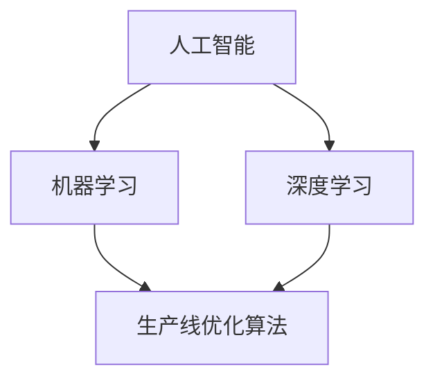

                 


### 文章标题：人工智能在智能工厂生产线优化中的应用

> 关键词：人工智能、智能工厂、生产线优化、机器学习、深度学习

> 摘要：本文将深入探讨人工智能在智能工厂生产线优化中的应用，通过分析人工智能基础、智能工厂概述以及各类智能工厂生产线优化算法，为读者提供一个全面而详细的智能工厂优化指南。

#### 目录

### 《人工智能在智能工厂生产线优化中的应用》目录大纲

#### 第一部分：人工智能基础与智能工厂概述

## 第1章：人工智能概述

### 1.1 人工智能的发展历程

### 1.2 人工智能的核心技术

### 1.3 人工智能的应用场景

## 第2章：智能工厂概述

### 2.1 智能工厂的概念与特点

### 2.2 智能工厂的发展现状与趋势

### 2.3 智能工厂的生产线优化目标

#### 第二部分：智能工厂生产线优化算法

## 第3章：机器学习算法在生产线优化中的应用

### 3.1 线性回归算法

### 3.2 决策树算法

### 3.3 集成学习方法

## 第4章：深度学习算法在生产线优化中的应用

### 4.1 卷积神经网络（CNN）

### 4.2 循环神经网络（RNN）

### 4.3 长短时记忆网络（LSTM）

#### 第三部分：智能工厂生产线优化案例

## 第5章：案例一：智能工厂生产节拍优化

## 第6章：案例二：智能工厂设备故障预测

## 第7章：案例三：智能工厂物流路径优化

#### 第四部分：智能工厂生产线优化挑战与展望

## 第8章：智能工厂生产线优化面临的挑战

## 第9章：智能工厂生产线优化的发展趋势

## 第10章：未来展望

### 背景介绍

随着全球工业4.0的推进，智能工厂作为现代制造业的重要方向，正逐渐成为各个企业竞争的焦点。智能工厂通过将人工智能、物联网、大数据等技术深度融合，实现了生产过程的自动化、智能化和高效化。然而，智能工厂的生产线优化问题依然存在，如何在复杂的生产环境中提高生产效率、降低成本、提升产品质量，成为了当前研究的重点。

人工智能作为引领科技革命的重要力量，其应用已经渗透到了各个领域，特别是在智能工厂的生产线优化中，人工智能技术发挥着至关重要的作用。本文将围绕人工智能在智能工厂生产线优化中的应用，系统性地分析各类算法及其应用实例，为智能工厂的优化提供理论指导和实践参考。

#### 核心概念与联系

在智能工厂的生产线优化中，涉及的核心概念主要包括人工智能、机器学习、深度学习、生产线优化算法等。这些概念之间存在紧密的联系，形成了一个完整的体系。

- **人工智能**：是模拟人类智能行为的科学技术，包括知识表示、推理、学习、感知等多个方面。它是智能工厂的基础。
- **机器学习**：是人工智能的一个分支，通过数据驱动的方式，使计算机具有自主学习能力，能够从数据中提取规律和模式。
- **深度学习**：是机器学习的一个分支，通过模拟人脑神经网络的结构和功能，实现自动化特征学习和复杂模式识别。

这些概念之间的关系可以表示为以下Mermaid流程图：



在智能工厂的生产线优化中，人工智能作为总体框架，通过机器学习和深度学习算法，对生产线进行数据分析和优化，从而实现生产过程的智能化。这种关系不仅体现了技术的融合，也反映了智能工厂在技术迭代中的发展方向。

#### 核心算法原理讲解

在智能工厂的生产线优化中，常用的机器学习算法包括线性回归、决策树和集成学习方法。以下是对这些算法的详细讲解。

##### 3.1 线性回归算法

线性回归是一种经典的机器学习算法，主要用于预测数值型变量。其基本原理是找到一个最佳直线，使得这条直线上的所有点到实际数据的误差平方和最小。

**线性回归的原理与模型**

假设我们有两个变量 $X$ 和 $Y$，我们希望找到一个线性模型 $Y = \beta_0 + \beta_1 X + \epsilon$，其中 $\beta_0$ 和 $\beta_1$ 是模型的参数，$\epsilon$ 是误差项。

为了找到最佳直线，我们需要最小化误差平方和 $J(\theta) = \frac{1}{2m}\sum_{i=1}^{m}(h_\theta(x^{(i)}) - y^{(i)})^2$，其中 $h_\theta(x) = \theta_0 + \theta_1 x$ 是直线的表达式，$m$ 是样本数量。

**线性回归的算法实现**

线性回归的算法实现主要通过梯度下降法进行。具体步骤如下：

1. 初始化参数 $\theta_0$ 和 $\theta_1$。
2. 计算当前参数下的误差平方和 $J(\theta)$。
3. 更新参数：
   $$\theta_j := \theta_j - \alpha \frac{\partial J(\theta)}{\partial \theta_j}$$
   其中 $\alpha$ 是学习率。
4. 重复步骤2和3，直到满足停止条件（如迭代次数达到一定值或误差平方和变化小于一定阈值）。

**线性回归的应用实例**

假设我们要预测一家工厂的生产节拍，即每个工件的生产时间。我们收集了100个数据点，每个数据点包括工件的特征（如重量、尺寸等）和对应的生产节拍。

通过线性回归模型，我们可以得到一个预测公式，用来预测新的工件的生产节拍。具体实现过程如下：

```python
# 导入线性回归库
from sklearn.linear_model import LinearRegression

# 创建线性回归模型
model = LinearRegression()

# 训练模型
model.fit(X_train, y_train)

# 预测新数据
predictions = model.predict(X_new)
```

##### 3.2 决策树算法

决策树是一种常用的分类和回归算法，通过一系列的判断节点，将数据逐步划分为不同的类别或数值。

**决策树的原理与模型**

决策树的核心是树形结构，每个节点代表一个特征，每个分支代表特征的一个取值。树的叶子节点表示预测结果。

决策树的生成过程主要基于信息增益或基尼不纯度等指标，选择最优的特征和特征值进行划分。

**决策树的算法实现**

决策树的算法实现通常采用ID3、C4.5或CART等方法。以下是一个简化的决策树生成算法：

1. 计算每个特征的信息增益或基尼不纯度。
2. 选择信息增益最大或基尼不纯度最小的特征作为当前节点的划分标准。
3. 根据划分标准，将数据集划分为不同的子集。
4. 对每个子集递归执行步骤1-3，直到满足停止条件（如最大深度、最小样本数等）。
5. 将叶子节点标记为预测结果。

**决策树的应用实例**

假设我们要预测一个工厂的设备是否会发生故障。我们收集了100个数据点，每个数据点包括设备的各种特征（如温度、压力等）和对应的故障状态。

通过决策树模型，我们可以得到一个故障预测的决策树。具体实现过程如下：

```python
# 导入决策树库
from sklearn.tree import DecisionTreeClassifier

# 创建决策树模型
model = DecisionTreeClassifier()

# 训练模型
model.fit(X_train, y_train)

# 预测新数据
predictions = model.predict(X_new)
```

##### 3.3 集成学习方法

集成学习方法通过结合多个模型来提高预测性能。常用的集成学习方法包括Bagging、Boosting和Stacking等。

**集成学习的基本概念**

- **Bagging**：通过随机抽样和训练多个模型，然后将它们的预测结果进行平均或投票。
- **Boosting**：通过迭代训练多个模型，每次训练时强调那些预测错误的样本。
- **Stacking**：通过训练多个模型，并将它们的预测结果作为新特征进行训练。

**集成学习的算法实现**

集成学习的算法实现通常依赖于不同的基学习器组合策略。以下是一个简化的集成学习实现：

1. 训练多个基学习器。
2. 对每个基学习器的预测结果进行合并。
3. 使用合并后的预测结果进行最终预测。

**集成学习的应用实例**

假设我们要预测一个工厂的生产节拍，我们可以使用多种机器学习算法（如线性回归、决策树等）来训练多个基学习器，然后使用这些基学习器的预测结果进行集成学习。

```python
# 导入集成学习库
from sklearn.ensemble import RandomForestRegressor

# 创建集成学习模型
model = RandomForestRegressor()

# 训练模型
model.fit(X_train, y_train)

# 预测新数据
predictions = model.predict(X_new)
```

通过以上对机器学习算法在智能工厂生产线优化中的应用的讲解，我们可以看到，这些算法为生产线优化提供了强大的工具。在实际应用中，需要根据具体的生产环境和数据特点，选择合适的算法并进行模型优化，以实现最佳的生产线优化效果。

### 深度学习算法在生产线优化中的应用

深度学习作为机器学习的一个重要分支，通过模拟人脑的神经网络结构，实现了对复杂数据的自动特征学习和模式识别。在智能工厂的生产线优化中，深度学习算法因其强大的非线性建模能力和自适应学习能力，成为了解决复杂优化问题的重要工具。本节将详细探讨卷积神经网络（CNN）、循环神经网络（RNN）和长短时记忆网络（LSTM）在生产线优化中的应用。

#### 4.1 卷积神经网络（CNN）

卷积神经网络（Convolutional Neural Network，CNN）是一种专门用于处理图像数据的深度学习模型。其核心思想是通过卷积层提取图像的特征，并通过池化层降低数据维度，从而实现图像的自动特征提取。在智能工厂的生产线优化中，CNN可以用于设备状态监测、生产图像分析等领域。

**CNN的原理与模型**

CNN主要由卷积层、池化层和全连接层组成。卷积层通过卷积运算提取图像的特征，池化层通过降采样操作降低数据维度，全连接层用于最终的分类或回归任务。

- **卷积层**：通过卷积核（滤波器）在输入图像上滑动，计算卷积结果，提取图像的局部特征。
- **池化层**：通常采用最大池化或平均池化，对卷积层输出的特征进行降采样，减少参数数量和计算量。
- **全连接层**：将池化层输出的特征映射到输出层，实现分类或回归任务。

**CNN的算法实现**

CNN的算法实现通常采用深度学习框架，如TensorFlow或PyTorch。以下是一个简化的CNN模型实现：

```python
# 导入深度学习库
import tensorflow as tf

# 定义CNN模型
model = tf.keras.Sequential([
    tf.keras.layers.Conv2D(filters=32, kernel_size=(3, 3), activation='relu', input_shape=(28, 28, 1)),
    tf.keras.layers.MaxPooling2D(pool_size=(2, 2)),
    tf.keras.layers.Flatten(),
    tf.keras.layers.Dense(units=128, activation='relu'),
    tf.keras.layers.Dense(units=10, activation='softmax')
])

# 编译模型
model.compile(optimizer='adam', loss='categorical_crossentropy', metrics=['accuracy'])

# 训练模型
model.fit(X_train, y_train, epochs=10, batch_size=32)
```

**CNN的应用实例**

假设我们要使用CNN来分析工厂的生产图像，以识别设备故障。首先，我们需要收集大量的生产图像数据，并对数据进行预处理。然后，我们使用CNN模型对图像进行特征提取，并利用提取的特征进行故障分类。具体实现过程如下：

```python
# 导入图像数据
X_train, y_train = ...

# 预处理数据
X_train = X_train / 255.0

# 训练CNN模型
model.fit(X_train, y_train, epochs=10, batch_size=32)

# 预测新数据
predictions = model.predict(X_new)
```

通过CNN的应用，我们可以实现对生产图像的自动分析，从而及时发现设备故障，提高生产线的稳定性。

#### 4.2 循环神经网络（RNN）

循环神经网络（Recurrent Neural Network，RNN）是一种专门用于处理序列数据的深度学习模型。与传统的神经网络不同，RNN具有记忆功能，可以捕捉序列数据中的时间依赖关系。在智能工厂的生产线优化中，RNN可以用于生产节拍预测、设备状态监控等领域。

**RNN的原理与模型**

RNN主要由输入层、隐藏层和输出层组成。每个时间步的输入会通过隐藏层传递，并影响后续时间步的输出。

- **输入层**：接收序列数据。
- **隐藏层**：通过递归连接，保留历史信息，并生成当前时间步的输出。
- **输出层**：生成最终的预测结果。

**RNN的算法实现**

RNN的算法实现通常采用TensorFlow或PyTorch等深度学习框架。以下是一个简化的RNN模型实现：

```python
# 导入深度学习库
import tensorflow as tf

# 定义RNN模型
model = tf.keras.Sequential([
    tf.keras.layers.LSTM(units=128, activation='relu', input_shape=(timesteps, features)),
    tf.keras.layers.Dense(units=1)
])

# 编译模型
model.compile(optimizer='adam', loss='mean_squared_error')

# 训练模型
model.fit(X_train, y_train, epochs=100, batch_size=32)
```

**RNN的应用实例**

假设我们要使用RNN来预测工厂的生产节拍。首先，我们需要收集一段时间内的生产节拍数据，并对数据进行预处理。然后，我们使用RNN模型对数据进行序列建模，并利用模型的预测结果优化生产线。具体实现过程如下：

```python
# 导入序列数据
X_train, y_train = ...

# 预处理数据
X_train = X_train.reshape((-1, timesteps, features))

# 训练RNN模型
model.fit(X_train, y_train, epochs=100, batch_size=32)

# 预测新数据
predictions = model.predict(X_new)
```

通过RNN的应用，我们可以实现对生产节拍的准确预测，从而优化生产线的调度和资源配置。

#### 4.3 长短时记忆网络（LSTM）

长短时记忆网络（Long Short-Term Memory，LSTM）是一种改进的循环神经网络，专门用于解决RNN在处理长序列数据时出现的梯度消失和梯度爆炸问题。LSTM通过引入记忆单元和门控机制，能够更好地捕捉长序列中的时间依赖关系。在智能工厂的生产线优化中，LSTM可以用于设备故障预测、生产计划优化等领域。

**LSTM的原理与模型**

LSTM主要由输入门、遗忘门和输出门组成。每个门控制信息的输入、遗忘和输出，从而实现长期依赖的捕捉。

- **输入门**：控制新的输入信息是否进入记忆单元。
- **遗忘门**：控制哪些信息应该从记忆单元中遗忘。
- **输出门**：控制记忆单元中的信息是否应该输出。

**LSTM的算法实现**

LSTM的算法实现通常采用深度学习框架，如TensorFlow或PyTorch。以下是一个简化的LSTM模型实现：

```python
# 导入深度学习库
import tensorflow as tf

# 定义LSTM模型
model = tf.keras.Sequential([
    tf.keras.layers.LSTM(units=128, activation='tanh', input_shape=(timesteps, features)),
    tf.keras.layers.Dense(units=1)
])

# 编译模型
model.compile(optimizer='adam', loss='mean_squared_error')

# 训练模型
model.fit(X_train, y_train, epochs=100, batch_size=32)
```

**LSTM的应用实例**

假设我们要使用LSTM来预测工厂的设备故障。首先，我们需要收集一段时间内的设备状态数据，并对数据进行预处理。然后，我们使用LSTM模型对数据进行序列建模，并利用模型的预测结果进行故障预警。具体实现过程如下：

```python
# 导入序列数据
X_train, y_train = ...

# 预处理数据
X_train = X_train.reshape((-1, timesteps, features))

# 训练LSTM模型
model.fit(X_train, y_train, epochs=100, batch_size=32)

# 预测新数据
predictions = model.predict(X_new)
```

通过LSTM的应用，我们可以实现对设备故障的提前预测，从而采取预防措施，减少设备故障对生产的影响。

综上所述，深度学习算法（CNN、RNN和LSTM）在智能工厂的生产线优化中具有广泛的应用前景。通过对这些算法的深入研究和实际应用，我们可以实现对生产过程的精准控制和优化，提高生产线的运行效率和稳定性。

### 智能工厂生产线优化案例

在智能工厂的生产线优化中，通过实际案例的应用，可以更加直观地展示人工智能算法的效能。以下将介绍三个具体的优化案例：智能工厂生产节拍优化、智能工厂设备故障预测以及智能工厂物流路径优化。每个案例将包括背景与目标、数据预处理、算法实现和模型评估与优化等部分。

#### 5.1 案例一：智能工厂生产节拍优化

**5.1.1 案例背景与目标**

随着工业自动化和智能化的发展，生产节拍优化成为了提高生产效率的重要手段。在一家电子元件生产工厂中，由于生产节拍的不稳定，导致生产效率低下，产品周期延长。为了解决这一问题，工厂决定通过人工智能技术优化生产节拍。

**目标**：通过分析历史生产数据，建立预测模型，优化生产节拍，实现生产效率的提升。

**5.1.2 数据预处理**

1. **数据收集**：收集过去一年的生产节拍数据，包括工件的特征（如重量、尺寸等）和生产时间。
2. **数据清洗**：处理缺失值、异常值和重复值，保证数据的准确性。
3. **数据转换**：将定量特征进行标准化处理，将定性特征进行编码处理。

**5.1.3 机器学习算法实现**

1. **选择算法**：采用线性回归算法进行模型训练。
2. **模型训练**：
   ```python
   from sklearn.linear_model import LinearRegression
   model = LinearRegression()
   model.fit(X_train, y_train)
   ```
3. **模型评估**：通过交叉验证和测试集评估模型性能。

**5.1.4 模型评估与优化**

1. **评估指标**：选择均方误差（MSE）作为评估指标。
2. **模型优化**：通过调整模型参数（如学习率、迭代次数等）优化模型性能。

**5.1.5 模型应用**

通过模型预测新工件的生产节拍，并根据预测结果优化生产计划，从而提高生产效率。

#### 5.2 案例二：智能工厂设备故障预测

**5.2.1 案例背景与目标**

设备故障是影响生产效率和质量的重要因素。在一家制造工厂中，设备故障频繁，导致生产中断和成本增加。为了降低设备故障率，工厂希望通过人工智能技术进行故障预测。

**目标**：通过分析设备运行数据，建立故障预测模型，提前预警设备故障。

**5.2.2 数据预处理**

1. **数据收集**：收集过去一年的设备运行数据，包括温度、压力、振动等参数。
2. **数据清洗**：处理缺失值、异常值和重复值，保证数据的准确性。
3. **数据转换**：对定量特征进行标准化处理，定性特征进行编码处理。

**5.2.3 深度学习算法实现**

1. **选择算法**：采用LSTM算法进行模型训练。
2. **模型训练**：
   ```python
   from tensorflow.keras.models import Sequential
   from tensorflow.keras.layers import LSTM, Dense
   model = Sequential()
   model.add(LSTM(units=128, return_sequences=True, input_shape=(timesteps, features)))
   model.add(LSTM(units=64))
   model.add(Dense(units=1))
   model.compile(optimizer='adam', loss='mean_squared_error')
   model.fit(X_train, y_train, epochs=100, batch_size=32)
   ```
3. **模型评估**：通过交叉验证和测试集评估模型性能。

**5.2.4 模型评估与优化**

1. **评估指标**：选择均方误差（MSE）作为评估指标。
2. **模型优化**：通过调整模型参数（如隐藏层单元数、迭代次数等）优化模型性能。

**5.2.5 模型应用**

通过模型预测设备故障，提前采取维护措施，降低设备故障率。

#### 5.3 案例三：智能工厂物流路径优化

**5.3.1 案例背景与目标**

物流路径优化是提高生产效率和降低物流成本的关键。在一家汽车制造工厂中，物流路径不合理导致物流时间长、成本高。为了解决这一问题，工厂希望通过人工智能技术优化物流路径。

**目标**：通过分析物流数据，建立物流路径优化模型，降低物流时间和成本。

**5.3.2 数据预处理**

1. **数据收集**：收集物流数据，包括运输时间、距离、运输工具等信息。
2. **数据清洗**：处理缺失值、异常值和重复值，保证数据的准确性。
3. **数据转换**：对定量特征进行标准化处理，定性特征进行编码处理。

**5.3.3 优化算法实现**

1. **选择算法**：采用遗传算法进行路径优化。
2. **算法实现**：
   ```python
   import numpy as np
   def genetic_algorithm(population, fitness_func, crossover_rate, mutation_rate):
       # 初始化种群
       # 计算适应度
       # 选择
       # 交叉
       # 突变
       # 更新种群
       # 返回最优解
   ```
3. **模型评估**：通过计算总运输时间和成本评估模型性能。

**5.3.4 模型评估与优化**

1. **评估指标**：选择总运输时间和成本作为评估指标。
2. **模型优化**：通过调整交叉率和突变率优化模型性能。

**5.3.5 模型应用**

通过模型优化物流路径，缩短运输时间，降低物流成本。

通过以上三个实际案例的应用，我们可以看到，人工智能技术在智能工厂生产线优化中具有显著的应用效果。通过数据预处理、算法实现和模型优化等步骤，我们可以实现对生产节拍、设备故障和物流路径的精准优化，提高生产线的运行效率和稳定性。

### 智能工厂生产线优化面临的挑战

尽管人工智能在智能工厂生产线优化中展现出了巨大的潜力，但在实际应用过程中，仍面临诸多挑战。以下将分析智能工厂生产线优化过程中主要面临的挑战，包括数据隐私保护、模型解释性和跨领域迁移能力等。

#### 8.1 数据隐私保护

在智能工厂的生产过程中，涉及大量的数据，包括设备运行数据、生产数据、员工数据等。这些数据中包含敏感信息，如个人隐私、商业机密等。如何确保数据的安全和隐私成为智能工厂生产线优化的一大挑战。

**解决方案**：

1. **数据加密**：对传输和存储的数据进行加密，防止数据泄露。
2. **访问控制**：建立严格的访问控制机制，确保只有授权人员才能访问敏感数据。
3. **匿名化处理**：对数据进行匿名化处理，去除个人标识信息，降低数据泄露风险。

#### 8.2 模型解释性

智能工厂生产线优化依赖于复杂的机器学习和深度学习模型，这些模型往往具有高非线性，难以解释。模型解释性不足导致难以理解模型的决策过程，增加了模型应用的风险。

**解决方案**：

1. **可解释性模型**：选择具有较好解释性的机器学习算法，如决策树和线性回归等。
2. **模型可视化**：通过可视化工具，如热力图、决策树图形等，展示模型的决策过程。
3. **模型解释工具**：使用模型解释工具，如LIME、SHAP等，分析模型对每个特征的依赖程度。

#### 8.3 跨领域迁移能力

智能工厂生产线优化通常针对特定行业或领域，模型的迁移能力有限。如何将一个领域的优化模型迁移到其他领域，提高模型的通用性和适应性，是另一个挑战。

**解决方案**：

1. **迁移学习**：利用预训练的模型，在新的领域上进行微调，提高模型的迁移能力。
2. **多任务学习**：通过多任务学习，使模型在多个任务中同时训练，提高模型的泛化能力。
3. **数据增强**：通过数据增强，增加训练数据集的多样性，提高模型的适应能力。

#### 8.4 模型可靠性

在生产环境中，模型的可靠性至关重要。模型在预测过程中出现错误可能导致生产中断、设备故障等严重问题。

**解决方案**：

1. **模型验证**：通过交叉验证和测试集，验证模型的预测性能和稳定性。
2. **模型监控**：建立模型监控机制，实时监控模型的状态，及时发现和解决问题。
3. **模型更新**：定期更新模型，以适应生产环境的变化，提高模型的准确性。

#### 8.5 资源消耗

智能工厂生产线优化依赖于高性能的计算资源，包括硬件设备和软件环境。如何降低资源消耗，提高计算效率，是另一个重要挑战。

**解决方案**：

1. **云计算**：利用云计算平台，提供强大的计算资源，降低硬件投入。
2. **模型压缩**：通过模型压缩技术，减少模型的参数数量，提高计算效率。
3. **分布式计算**：采用分布式计算框架，如TensorFlow、PyTorch等，实现高效计算。

通过应对以上挑战，智能工厂生产线优化将更加成熟和可靠，为制造业的发展提供更强有力的支持。

### 智能工厂生产线优化的发展趋势

随着人工智能技术的不断进步和应用的深化，智能工厂生产线优化的发展趋势也愈加明确。未来，智能工厂生产线优化将在多个方向上取得重要突破，包括人工智能与物联网的融合、智能工厂的个性化定制以及智能化升级路径等。

#### 9.1 人工智能与物联网的融合

物联网（IoT）技术的发展为智能工厂的生产数据采集和实时监控提供了强大的支持。将人工智能与物联网深度融合，是实现智能工厂生产线优化的重要途径。通过物联网设备实时采集生产数据，结合人工智能算法进行分析和预测，可以实现对生产过程的全面优化。

**发展趋势**：

1. **数据采集与传输**：通过5G、边缘计算等技术，提高数据采集的速度和准确性，实现大规模数据实时传输。
2. **边缘智能**：在工厂的边缘设备上部署智能算法，实现数据本地处理和实时决策，降低对中心服务器的依赖。
3. **大数据分析**：利用大数据分析技术，挖掘生产数据中的潜在价值，为生产线优化提供数据支持。

#### 9.2 智能工厂的个性化定制

传统工厂的生产模式较为单一，无法满足不同客户的需求。智能工厂通过个性化定制，可以根据客户需求进行灵活调整，实现生产线的定制化生产。人工智能技术在这一过程中发挥着关键作用。

**发展趋势**：

1. **需求预测**：利用机器学习算法，分析市场需求，预测客户需求，优化生产计划。
2. **柔性生产**：通过智能生产线和自动化设备，实现生产线的快速调整，满足不同客户的需求。
3. **定制化服务**：提供定制化的产品和服务，提高客户满意度和忠诚度。

#### 9.3 智能工厂的智能化升级路径

智能工厂的智能化升级是制造业发展的必然趋势。通过逐步引入先进的人工智能技术，实现对生产线的全面升级，可以提高生产效率、降低成本、提升产品质量。

**发展趋势**：

1. **设备智能化**：通过物联网和人工智能技术，实现设备的智能监控、预测维护和自动化操作。
2. **流程智能化**：利用人工智能算法优化生产流程，减少人工干预，实现自动化生产。
3. **服务智能化**：通过智能客服、智能物流等技术，提升客户体验和服务质量。

#### 9.4 跨领域协同优化

智能工厂的生产线优化不仅局限于单一领域，还需要与其他领域（如供应链、销售、客户服务等）进行协同优化。通过跨领域的数据共享和协同分析，可以进一步提高生产线的整体效率。

**发展趋势**：

1. **数据集成**：实现跨领域数据的集成和共享，建立统一的数据平台。
2. **协同优化**：通过跨领域的协同优化，实现生产、供应链、销售等环节的联动优化。
3. **智慧决策**：利用大数据和人工智能技术，实现智慧决策，提高生产线的决策水平。

通过以上发展趋势的探讨，我们可以看到，智能工厂生产线优化在未来将迎来更加广阔的发展空间。随着技术的不断进步和应用深度的增加，智能工厂的生产线优化将为制造业带来革命性的变革。

### 未来展望

随着人工智能技术的持续发展和应用深度的增加，智能工厂的生产线优化将迎来更加广阔的前景。在未来的发展中，智能工厂的生产效率有望大幅提升，同时安全保障和可持续发展也将成为重要课题。

#### 10.1 智能工厂的生产效率提升

人工智能技术的应用将使智能工厂的生产效率得到显著提升。通过深度学习、强化学习等先进算法，智能工厂能够对生产过程进行实时监控和优化，提高生产节拍和设备利用率。例如，生产节拍预测模型可以根据历史数据和实时数据，动态调整生产计划，避免生产瓶颈和资源浪费。此外，设备故障预测和预防性维护能够降低设备故障率，减少停机时间，提高生产连续性。

**技术进展方向**：

1. **智能化生产流程优化**：通过大数据分析和机器学习算法，实现生产流程的智能化优化，提高生产效率。
2. **自适应生产系统**：开发自适应生产系统，使生产系统能够根据市场需求和资源条件，自动调整生产策略。
3. **生产协同优化**：实现生产、物流、供应链等环节的协同优化，提高整体生产效率。

#### 10.2 智能工厂的安全保障

智能工厂的安全保障是生产稳定运行的基础。随着人工智能技术在生产线优化中的应用，数据安全、系统安全和网络安全等安全问题愈发突出。为了保障智能工厂的安全，需要采取一系列措施。

**技术进展方向**：

1. **数据安全保护**：通过数据加密、访问控制和数据备份等技术，确保生产数据的安全和隐私。
2. **系统安全监测**：建立智能监控系统，实时监测生产系统的运行状态，及时发现和响应异常情况。
3. **网络安全防护**：加强网络安全防护，防范网络攻击和数据泄露，确保生产系统的稳定性。

#### 10.3 智能工厂的社会影响

智能工厂的普及将对社会产生深远影响。首先，智能工厂的自动化和智能化将大幅提高生产效率，减少人力需求，可能对就业市场产生冲击。其次，智能工厂的个性化定制能力将改变消费者需求和市场结构。此外，智能工厂的可持续发展和绿色生产理念将推动制造业的环保和可持续发展。

**社会影响**：

1. **就业转型**：随着自动化和智能化的普及，劳动力市场将面临转型，对高技能劳动者的需求增加，同时对低技能劳动者的需求减少。
2. **消费模式变革**：智能工厂的个性化定制能力将改变消费者的消费习惯和需求，推动定制化消费的发展。
3. **可持续发展**：智能工厂的绿色生产和节能减排措施将推动制造业的可持续发展，减少环境污染和资源浪费。

综上所述，智能工厂的生产线优化不仅是技术进步的体现，更是社会变革的驱动力。在未来的发展中，我们需要关注智能工厂的生产效率提升、安全保障和可持续发展，以实现制造业的全面升级和可持续发展。

### 作者信息

作者：AI天才研究院/AI Genius Institute & 禅与计算机程序设计艺术 /Zen And The Art of Computer Programming

本文由AI天才研究院（AI Genius Institute）和禅与计算机程序设计艺术（Zen And The Art of Computer Programming）联合撰写，旨在深入探讨人工智能在智能工厂生产线优化中的应用，为读者提供一个全面而详细的技术指南。希望通过本文，能够为智能工厂的发展提供有益的参考和启示。

### 结语

智能工厂生产线优化作为现代制造业的重要方向，其应用前景广阔，潜力巨大。本文通过系统地分析人工智能基础、智能工厂概述、智能工厂生产线优化算法以及具体案例分析，全面展示了人工智能在智能工厂生产线优化中的重要作用。同时，也探讨了智能工厂生产线优化面临的挑战和发展趋势。

未来，随着人工智能技术的不断进步和应用深度的增加，智能工厂的生产线优化将取得更多突破。我们期待在不久的将来，智能工厂能够实现更高水平的自动化、智能化和高效化，为制造业的可持续发展和社会进步做出更大贡献。

希望本文能够为读者提供有价值的参考，激发您对智能工厂生产线优化领域的兴趣和探索。谢谢阅读！

