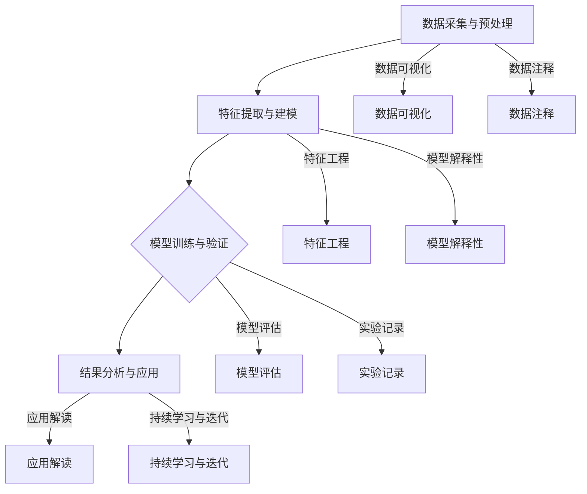

                 

### 1. 引言

#### 1.1 书籍背景与目标

《人工智能在智能材料设计与发现中的创新》是一本旨在探讨人工智能（AI）在智能材料设计与发现领域创新应用的专业书籍。随着科技的迅猛发展，人工智能逐渐成为推动各个领域变革的重要力量，而智能材料作为材料科学的前沿领域，其研究与应用具有巨大的潜力。

本书的目标是通过对人工智能技术的深入剖析，结合智能材料的特性与应用，探讨人工智能在智能材料设计与发现中的创新应用。本书不仅旨在为研究人员和工程师提供丰富的技术知识，还希望通过具体案例和实践指导，激发读者在智能材料领域的创新思维。

#### 1.2 智能材料与人工智能概述

**智能材料**是指能够感知环境变化并作出响应的材料，具有自主调节、自适应、自修复等功能。根据功能特点，智能材料可以分为结构智能材料、智能响应材料、智能传感材料等。

**人工智能**是一种模拟人类智能的计算机系统，通过机器学习、深度学习等技术，能够从数据中学习规律，进行自主决策和自适应调整。人工智能的应用领域广泛，包括自然语言处理、计算机视觉、自动驾驶、医疗诊断等。

在智能材料的设计与发现过程中，人工智能技术发挥着关键作用。例如，通过机器学习算法，可以对大量实验数据进行挖掘与分析，预测材料性能，优化合成工艺；通过深度学习算法，可以模拟材料的微观结构，预测材料的响应行为。此外，人工智能还可以辅助研究人员进行材料数据库的构建与查询，提高材料筛选与优化的效率。

#### 1.3 人工智能在智能材料中的应用现状与趋势

目前，人工智能在智能材料领域已经取得了一系列重要成果。例如，基于机器学习的材料预测模型，可以高效地预测材料的物理、化学和力学性能；基于深度学习的材料图像分析技术，可以自动识别材料的缺陷和结构特征；基于强化学习的材料合成策略，可以优化合成工艺，提高材料性能。

随着人工智能技术的不断进步，其在智能材料领域的应用前景也将越来越广阔。一方面，人工智能将进一步提高材料设计、筛选和优化的效率，降低研发成本；另一方面，人工智能将促进智能材料在各个领域的创新应用，推动新材料产业的发展。

总之，人工智能在智能材料设计与发现中的创新应用，不仅有助于提升材料科学研究的水平，还将为人类社会带来更多的科技进步和产业发展机遇。未来，随着人工智能技术的进一步发展，智能材料领域将迎来更加辉煌的发展前景。### 2. 人工智能基础

在探讨人工智能（AI）在智能材料设计与发现中的应用之前，有必要对人工智能的基本概念、核心技术和相关数据科学基础进行详细阐述。这将为后续章节的深入分析提供必要的理论基础。

#### 2.1 人工智能基本概念

人工智能是一种模拟人类智能行为的计算机系统，通过学习、推理和自我改进，实现智能任务自动化。人工智能可以分为狭义人工智能和广义人工智能。狭义人工智能主要关注特定任务的智能化，如语音识别、图像处理等；广义人工智能则追求具有全面智能的计算机系统，能够处理各种复杂任务。

人工智能的核心技术包括机器学习、深度学习和强化学习等。

**机器学习**：机器学习是人工智能的一个重要分支，通过算法从数据中学习规律，实现自动预测和决策。机器学习可以分为监督学习、无监督学习和半监督学习。监督学习有明确的输入和输出，如分类和回归问题；无监督学习没有明确的输出，如聚类和降维问题；半监督学习介于二者之间。

**深度学习**：深度学习是一种基于多层神经网络的学习方法，通过自动提取数据特征，实现复杂模式的识别和预测。深度学习的核心是神经网络，尤其是卷积神经网络（CNN）和循环神经网络（RNN）在图像和序列数据处理中表现出色。

**强化学习**：强化学习通过智能体与环境交互，不断调整策略，实现最优决策。强化学习主要应用在动态环境中，如机器人控制、游戏AI等。

#### 2.2 数据科学基础

数据科学是人工智能的基础，涉及数据采集、预处理、分析和可视化等多个方面。

**数据采集与预处理**：数据采集是数据科学的第一步，包括原始数据的收集、清洗和整理。数据预处理旨在去除噪声、缺失值和异常值，提高数据质量。

**数据可视化**：数据可视化通过图形和图表的方式展示数据，帮助研究人员发现数据中的规律和趋势。常见的可视化方法包括折线图、柱状图、饼图、散点图等。

**数据分析技术**：数据分析包括描述性分析和预测性分析。描述性分析用于总结数据的基本特征，如均值、中位数、标准差等；预测性分析通过建立模型，预测未来的趋势和结果。

**机器学习算法与数据关系**：机器学习算法需要大量高质量的数据进行训练。数据的质量和多样性直接影响机器学习模型的性能。因此，数据预处理和特征工程在机器学习应用中至关重要。

#### 2.3 深度学习算法原理

深度学习是一种基于多层神经网络的学习方法，其核心是自动提取数据特征。以下为深度学习算法的基本原理：

**多层神经网络**：多层神经网络由输入层、隐藏层和输出层组成。输入层接收原始数据，隐藏层通过非线性变换提取特征，输出层进行分类或预测。

**反向传播算法**：反向传播算法是一种训练神经网络的优化方法。通过计算输出误差，反向传播误差至隐藏层，更新网络权重，优化模型参数。

**激活函数**：激活函数是神经网络中用于引入非线性变换的函数，常见的激活函数有Sigmoid、ReLU和Tanh等。

**损失函数**：损失函数用于评估模型预测结果与真实值之间的差距。常见的损失函数有均方误差（MSE）、交叉熵损失等。

**优化算法**：优化算法用于调整网络权重，优化模型性能。常见的优化算法有梯度下降、随机梯度下降、Adam等。

**训练与验证**：训练过程通过大量数据调整模型参数，验证过程通过测试数据评估模型性能。为了防止过拟合，通常采用交叉验证方法。

**深度学习应用场景**：深度学习在计算机视觉、自然语言处理、语音识别、推荐系统等领域有广泛应用。例如，卷积神经网络（CNN）在图像分类和目标检测中表现出色；循环神经网络（RNN）在语言建模和语音识别中广泛应用。

通过以上对人工智能基础和数据的详细阐述，我们可以更好地理解人工智能在智能材料设计与发现中的实际应用，为后续章节的深入分析打下坚实基础。### 3. 智能材料概述

智能材料是材料科学的一个重要分支，具有感知环境变化并作出响应的特性。它们通过集成传感器、执行器和其他智能组件，可以实现对温度、压力、湿度、光照等环境因素的实时监测和自适应调节。智能材料的定义与分类、特性与应用，为我们理解其在人工智能中的应用提供了基础。

#### 3.1 智能材料的定义与分类

**智能材料的定义**：
智能材料是指能够感知外部刺激，通过内部机制响应并改变自身物理、化学或机械性质的一类材料。这些材料能够自主调节其状态，从而实现自修复、自清洁、自诊断、自适应等功能。

**智能材料的分类**：
根据功能特性，智能材料主要分为以下几类：

1. **结构智能材料**：
结构智能材料通过其内在的传感器和执行器功能，能够改变其形状、大小和刚性等结构特性。例如，形状记忆合金和形状记忆聚合物等材料，在温度或应力变化时能够恢复或改变其形状。

2. **智能响应材料**：
智能响应材料能够对特定的外部刺激（如温度、光照、电场、磁场等）产生响应。这些材料包括热敏材料、光敏材料、电致变色材料、磁致伸缩材料等。例如，热敏材料在温度变化时会发生体积或电阻的变化，而光敏材料则对光照强度有敏感响应。

3. **智能传感材料**：
智能传感材料具有高灵敏度、快速响应和广范围检测能力，能够将物理量（如压力、温度、湿度等）转换为电信号。常见的智能传感材料包括导电聚合物、纳米材料、复合传感器等。

#### 3.2 智能材料的特性与应用

**智能材料的特性**：

1. **响应性**：
智能材料能够对外界刺激（如温度、光照、电场等）产生响应，这种响应可以是瞬时的，也可以是持续性的。

2. **自适应性和自修复性**：
智能材料具有自适应环境变化的能力，能够在不同的环境中自动调整其性能。此外，一些智能材料还具备自修复功能，能够在损伤后自动恢复其原有的性能。

3. **多功能性和集成性**：
智能材料能够集成多种功能，如传感、执行、自诊断等，使其在复杂应用环境中能够执行多种任务。

4. **可编程性和可定制性**：
通过特定的设计和技术，智能材料的性能可以编程和定制，以满足特定应用的需求。

**智能材料的应用**：

1. **自修复材料**：
自修复材料能够在损伤后自动修复，延长材料的使用寿命。这种材料在航空航天、汽车制造、建筑等领域具有广泛的应用前景。

2. **智能变色材料**：
智能变色材料能够根据光照、温度等条件改变颜色，广泛应用于智能窗、防晒涂层、装饰材料等。

3. **智能传感材料**：
智能传感材料在医疗、环境监测、机器人控制等领域有重要应用。例如，基于导电聚合物的传感器可以用于实时监测人体生理参数。

4. **结构智能材料**：
结构智能材料在航空航天、汽车、建筑等领域用于制造自适应结构和智能系统，提高结构性能和安全性。

通过以上对智能材料概述的详细探讨，我们可以看到，智能材料在感知、响应、自适应等方面的特性，使其在人工智能领域具有广泛的应用潜力。接下来，我们将深入探讨人工智能在智能材料设计中的应用。### 4. 人工智能在智能材料设计中的应用

在智能材料的设计过程中，人工智能技术发挥着至关重要的作用。通过机器学习、深度学习和强化学习等算法，人工智能可以辅助研究人员进行材料合成、性能优化和功能化设计。以下将详细探讨人工智能在智能材料设计中的应用。

#### 4.1 人工智能在材料合成中的应用

**4.1.1 机器学习在材料合成中的应用**

机器学习在材料合成中的应用主要体现在材料性质预测、反应路径优化和合成条件预测等方面。

**材料性质预测**：
机器学习算法可以通过对大量实验数据的分析，建立材料性质与化学组成之间的相关性模型。例如，使用支持向量机（SVM）、随机森林（RF）和人工神经网络（ANN）等算法，可以预测材料的物理、化学和力学性能。以下是一个简单的线性回归模型的伪代码示例：

```python
# 线性回归模型伪代码
from sklearn.linear_model import LinearRegression

# 数据准备
X = dataset[:, :-1]  # 特征数据
y = dataset[:, -1]   # 材料性质数据

# 建立模型
model = LinearRegression()
model.fit(X, y)

# 预测
predicted_property = model.predict(new_data)
```

**反应路径优化**：
机器学习可以模拟化学反应路径，预测反应的中间体和过渡态，从而优化反应条件。通过深度学习模型，如生成对抗网络（GAN），可以生成新的反应路径，提高合成效率。以下是一个生成对抗网络的简单伪代码示例：

```python
# 生成对抗网络（GAN）伪代码
import tensorflow as tf

# 定义生成器与判别器
G = ...  # 生成器
D = ...  # 判别器

# 训练模型
for epoch in range(num_epochs):
    noise = ...  # 生成随机噪声
    generated_samples = G(noise)
    real_samples = ...

    # 训练判别器
    D.train(real_samples, generated_samples)

    # 训练生成器
    G.train(noise, real_samples)
```

**合成条件预测**：
机器学习可以基于历史数据，预测最优的合成条件，如温度、压力和催化剂种类等。通过支持向量回归（SVR）等算法，可以建立合成条件与材料性能之间的关系模型。以下是一个支持向量回归模型的伪代码示例：

```python
# 支持向量回归（SVR）模型伪代码
from sklearn.svm import SVR

# 数据准备
X = dataset[:, :-1]  # 特征数据
y = dataset[:, -1]   # 材料性能数据

# 建立模型
model = SVR()
model.fit(X, y)

# 预测
predicted_conditions = model.predict(new_data)
```

**4.1.2 深度学习在材料合成中的应用**

深度学习在材料合成中的应用，主要体现在对复杂化学过程的建模和模拟。通过卷积神经网络（CNN）和循环神经网络（RNN）等模型，可以提取复杂化学过程的多维特征，预测反应产物和中间体。

**化学反应预测**：
卷积神经网络可以用于化学反应的预测，通过分析反应物和产物的二维化学结构，预测反应路径。以下是一个基于卷积神经网络的简单伪代码示例：

```python
# 卷积神经网络（CNN）模型伪代码
import tensorflow as tf

# 定义模型
model = tf.keras.Sequential([
    tf.keras.layers.Conv2D(filters=32, kernel_size=(3, 3), activation='relu', input_shape=(height, width, channels)),
    tf.keras.layers.MaxPooling2D(pool_size=(2, 2)),
    tf.keras.layers.Flatten(),
    tf.keras.layers.Dense(units=1)
])

# 编译模型
model.compile(optimizer='adam', loss='mean_squared_error')

# 训练模型
model.fit(X, y, epochs=num_epochs, batch_size=batch_size)
```

**分子动力学模拟**：
循环神经网络（RNN）可以用于分子动力学模拟，预测分子在不同条件下的运动轨迹。以下是一个基于长短期记忆网络（LSTM）的简单伪代码示例：

```python
# 长短期记忆网络（LSTM）模型伪代码
import tensorflow as tf

# 定义模型
model = tf.keras.Sequential([
    tf.keras.layers.LSTM(units=50, return_sequences=True),
    tf.keras.layers.LSTM(units=50),
    tf.keras.layers.Dense(units=1)
])

# 编译模型
model.compile(optimizer='adam', loss='mean_squared_error')

# 训练模型
model.fit(X, y, epochs=num_epochs, batch_size=batch_size)
```

**4.1.3 强化学习在材料合成中的应用**

强化学习在材料合成中的应用，主要体现在合成过程的自动化控制和优化。通过智能体与环境交互，强化学习可以学习到最优的合成策略，提高合成效率。

**合成策略优化**：
强化学习可以用于优化合成策略，通过奖励机制引导智能体选择最优的合成步骤。以下是一个基于深度强化学习的简单伪代码示例：

```python
# 深度强化学习（DDPG）模型伪代码
import tensorflow as tf

# 定义模型
actor = tf.keras.Sequential([
    tf.keras.layers.Dense(units=100, activation='relu'),
    tf.keras.layers.Dense(units=1)
])

critic = tf.keras.Sequential([
    tf.keras.layers.Dense(units=100, activation='relu'),
    tf.keras.layers.Dense(units=1)
])

# 编译模型
actor.compile(optimizer=tf.keras.optimizers.Adam(learning_rate=0.001), loss='mean_squared_error')
critic.compile(optimizer=tf.keras.optimizers.Adam(learning_rate=0.001), loss='mean_squared_error')

# 训练模型
model.fit(X, y, epochs=num_epochs, batch_size=batch_size)
```

**4.2 人工智能在材料性能优化中的应用**

**材料性能预测与优化**：
人工智能可以通过分析大量的实验数据，建立材料性能与化学组成之间的相关性模型，从而预测材料的性能。通过优化模型参数，可以提高预测精度，优化材料性能。

**材料结构的智能设计**：
人工智能可以辅助设计具有特定性能的材料结构，通过模拟和优化，找到最优的结构设计。以下是一个基于遗传算法的智能设计伪代码示例：

```python
# 遗传算法（GA）模型伪代码
import numpy as np

# 定义染色体
population = ...

# 定义适应度函数
def fitness_function(chromosome):
    # 计算适应度
    fitness = ...

    return fitness

# 进化过程
for generation in range(num_generations):
    # 适应度评估
    fitnesses = np.apply_along_axis(fitness_function, 1, population)

    # 选择
    selected = ...

    # 交叉和变异
    population = ...

# 最优解
best_solution = population[np.argmax(fitnesses)]
```

**材料表面修饰与功能化**：
人工智能可以通过优化表面修饰工艺，提高材料的特定功能。例如，通过深度学习模型，预测表面修饰剂对材料性能的影响，优化表面修饰条件。

**4.3 人工智能在材料筛选与优化中的应用**

**材料筛选算法**：
人工智能可以通过分析实验数据，筛选出具有潜在应用价值的材料。例如，使用聚类算法（如K-means）对实验数据进行分类，识别出高性能材料。

**材料优化策略**：
人工智能可以通过优化算法，找到材料性能的最佳组合。例如，使用优化算法（如粒子群优化）调整材料成分和制备条件，实现性能优化。

**材料筛选与优化案例研究**：
以下是一个智能材料筛选与优化的案例研究：

**案例一：智能传感材料筛选与优化**

问题描述：设计一种具有高灵敏度的智能传感材料，用于环境监测。

解决方案：
1. 收集大量传感材料数据，包括化学组成、物理性质和传感性能。
2. 使用机器学习算法，建立材料性能与化学组成之间的相关性模型。
3. 使用优化算法，筛选出具有高灵敏度的材料。
4. 对筛选出的材料进行表面修饰，提高传感性能。
5. 测试材料在实际环境中的传感性能，评估优化效果。

**案例二：自修复材料优化**

问题描述：优化一种自修复材料的性能，提高其自修复效率。

解决方案：
1. 收集大量自修复材料数据，包括化学组成、修复效率、耐久性等。
2. 使用深度学习算法，建立材料性能与化学组成之间的关系模型。
3. 使用强化学习算法，优化材料配方和制备工艺。
4. 进行实验验证，评估优化效果，并进行迭代优化。

通过以上对人工智能在智能材料设计中的应用的详细探讨，我们可以看到，人工智能技术为智能材料的设计、筛选和优化提供了强大的支持，极大地提高了材料研究的效率。随着人工智能技术的不断进步，其在智能材料领域的应用将更加广泛，为材料科学的发展注入新的活力。### 5. 人工智能在智能材料发现中的应用

在智能材料的发现过程中，人工智能技术同样发挥着至关重要的作用。通过自动化和智能化的数据处理与分析，人工智能可以显著提高材料筛选和优化的效率，推动新材料的研究与应用。以下将详细探讨人工智能在智能材料发现中的应用。

#### 5.1 人工智能在材料数据库中的应用

**材料数据库构建与查询**：

材料数据库是智能材料研究中重要的信息资源，包含各种材料的物理、化学、力学和性能等数据。人工智能技术可以通过自动化和智能化的方式构建和查询材料数据库。

**自动化数据采集与整合**：
通过爬虫技术，可以自动化地从各种文献、数据库和实验报告中采集材料数据。此外，使用自然语言处理（NLP）技术，可以从非结构化的文本数据中提取关键信息，实现数据的自动化整合。

**智能查询系统**：
基于人工智能的查询系统可以提供高效、智能的数据检索服务。通过使用深度学习模型，如卷积神经网络（CNN）和循环神经网络（RNN），可以识别和提取查询关键词，并基于关键词在数据库中进行智能匹配和检索。以下是一个基于深度学习模型的智能查询系统伪代码示例：

```python
# 基于深度学习模型的智能查询系统伪代码
import tensorflow as tf

# 定义模型
model = tf.keras.Sequential([
    tf.keras.layers.Embedding(vocab_size, embedding_dim),
    tf.keras.layers.LSTM(units=128),
    tf.keras.layers.Dense(units=1)
])

# 编译模型
model.compile(optimizer='adam', loss='binary_crossentropy')

# 训练模型
model.fit(X, y, epochs=num_epochs, batch_size=batch_size)

# 查询
query_embedding = model.predict([query])
search_results = database.search(query_embedding)
```

**材料预测与分析**：

基于人工智能的预测和分析技术，可以对材料数据库中的数据进行深入挖掘，预测新材料的性能和特性。

**材料性能预测**：
通过机器学习模型，如决策树（DT）、随机森林（RF）和梯度提升树（GBDT），可以基于已有的材料数据，预测新材料在不同条件下的性能。以下是一个简单的决策树预测模型伪代码示例：

```python
# 决策树预测模型伪代码
from sklearn.tree import DecisionTreeRegressor

# 数据准备
X = dataset[:, :-1]  # 特征数据
y = dataset[:, -1]   # 材料性能数据

# 建立模型
model = DecisionTreeRegressor()
model.fit(X, y)

# 预测
predicted_property = model.predict(new_data)
```

**材料特性分析**：
通过深度学习模型，如卷积神经网络（CNN）和自编码器（AE），可以对材料结构进行深入分析，提取关键特征，识别新材料。以下是一个基于卷积神经网络的材料特性分析模型伪代码示例：

```python
# 卷积神经网络（CNN）模型伪代码
import tensorflow as tf

# 定义模型
model = tf.keras.Sequential([
    tf.keras.layers.Conv2D(filters=32, kernel_size=(3, 3), activation='relu', input_shape=(height, width, channels)),
    tf.keras.layers.MaxPooling2D(pool_size=(2, 2)),
    tf.keras.layers.Flatten(),
    tf.keras.layers.Dense(units=1)
])

# 编译模型
model.compile(optimizer='adam', loss='mean_squared_error')

# 训练模型
model.fit(X, y, epochs=num_epochs, batch_size=batch_size)

# 分析
material_features = model.predict(material_structure)
```

**数据库智能优化与更新**：

随着新材料研究的不断深入，材料数据库需要不断更新和优化。人工智能技术可以通过自动化和智能化的方式，实现数据库的动态优化。

**自动化数据更新**：
通过自动化爬虫和实时数据采集技术，可以持续更新材料数据库，确保数据的时效性和完整性。

**智能数据整合**：
通过自然语言处理（NLP）和机器学习技术，可以自动整合和清洗数据库中的数据，提高数据质量。

**数据库动态优化**：
通过机器学习和深度学习模型，可以根据新材料的研究趋势，动态调整数据库的索引和查询策略，提高查询效率。

#### 5.2 人工智能在材料筛选与优化中的应用

**材料筛选算法**：

材料筛选是新材料发现的关键步骤，人工智能可以通过自动化和智能化的方式，提高筛选效率。

**基于机器学习的材料筛选**：
通过机器学习模型，如支持向量机（SVM）、决策树（DT）和神经网络（NN），可以基于已有的材料数据，筛选出具有潜在应用价值的材料。以下是一个基于支持向量机的材料筛选模型伪代码示例：

```python
# 支持向量机（SVM）筛选模型伪代码
from sklearn.svm import SVC

# 数据准备
X = dataset[:, :-1]  # 特征数据
y = dataset[:, -1]   # 材料性能数据

# 建立模型
model = SVC()
model.fit(X, y)

# 预测
predicted_properties = model.predict(X)

# 筛选
selected_materials = X[predicted_properties > threshold]
```

**基于深度学习的材料筛选**：
通过深度学习模型，如卷积神经网络（CNN）和自编码器（AE），可以自动化筛选具有特定性能的材料。以下是一个基于卷积神经网络的材料筛选模型伪代码示例：

```python
# 卷积神经网络（CNN）筛选模型伪代码
import tensorflow as tf

# 定义模型
model = tf.keras.Sequential([
    tf.keras.layers.Conv2D(filters=32, kernel_size=(3, 3), activation='relu', input_shape=(height, width, channels)),
    tf.keras.layers.MaxPooling2D(pool_size=(2, 2)),
    tf.keras.layers.Flatten(),
    tf.keras.layers.Dense(units=1)
])

# 编译模型
model.compile(optimizer='adam', loss='binary_crossentropy')

# 训练模型
model.fit(X, y, epochs=num_epochs, batch_size=batch_size)

# 预测
material_properties = model.predict(material_structure)

# 筛选
selected_materials = material_structure[material_properties > threshold]
```

**材料优化策略**：

人工智能可以通过自动化和智能化的方式，制定和优化材料制备策略，提高材料性能。

**基于强化学习的材料优化**：
通过强化学习模型，如深度确定性策略梯度（DDPG）和演员-评论家（AC）模型，可以自动化优化材料制备过程。以下是一个基于深度确定性策略梯度（DDPG）的优化模型伪代码示例：

```python
# 深度确定性策略梯度（DDPG）优化模型伪代码
import tensorflow as tf

# 定义模型
actor = tf.keras.Sequential([
    tf.keras.layers.Dense(units=100, activation='relu'),
    tf.keras.layers.Dense(units=1)
])

critic = tf.keras.Sequential([
    tf.keras.layers.Dense(units=100, activation='relu'),
    tf.keras.layers.Dense(units=1)
])

# 编译模型
actor.compile(optimizer=tf.keras.optimizers.Adam(learning_rate=0.001), loss='mean_squared_error')
critic.compile(optimizer=tf.keras.optimizers.Adam(learning_rate=0.001), loss='mean_squared_error')

# 训练模型
model.fit(X, y, epochs=num_epochs, batch_size=batch_size)

# 优化
best_policy = optimize_policy(actor, critic, environment)
```

**材料筛选与优化案例研究**：

**案例一：基于人工智能的智能传感材料筛选与优化**

问题描述：设计一种具有高灵敏度、快速响应的智能传感材料，用于环境监测。

解决方案：
1. 收集大量传感材料数据，包括化学组成、物理性质和传感性能。
2. 使用机器学习算法，建立材料性能与化学组成之间的相关性模型。
3. 使用优化算法，筛选出具有高灵敏度的材料。
4. 对筛选出的材料进行表面修饰，提高传感性能。
5. 测试材料在实际环境中的传感性能，评估优化效果，并进行迭代优化。

**案例二：基于人工智能的自修复材料优化**

问题描述：优化一种自修复材料的性能，提高其自修复效率。

解决方案：
1. 收集大量自修复材料数据，包括化学组成、修复效率、耐久性等。
2. 使用深度学习算法，建立材料性能与化学组成之间的关系模型。
3. 使用强化学习算法，优化材料配方和制备工艺。
4. 进行实验验证，评估优化效果，并进行迭代优化。

通过以上对人工智能在智能材料发现中的应用的详细探讨，我们可以看到，人工智能技术为智能材料的筛选、优化和发现提供了强大的支持。随着人工智能技术的不断进步，其在智能材料领域的应用将更加广泛，为材料科学的发展注入新的活力。### 6. 案例分析

在本章节中，我们将通过几个具体的案例分析，深入探讨人工智能在智能材料设计与发现中的创新应用。这些案例不仅展示了人工智能技术在智能材料领域的实际应用，还揭示了其潜在的巨大发展潜力。

#### 6.1 智能材料与人工智能的结合案例

**案例一：智能变色材料的设计与发现**

问题描述：设计一种能够根据环境光照变化自动调节透明度的智能变色材料，用于智能窗户和防眩光涂层。

解决方案：
1. 数据采集与预处理：
   收集大量关于不同变色材料的光学性能数据，包括吸收光谱、反射光谱等。通过数据预处理，去除噪声和异常值，确保数据质量。

2. 模型建立与训练：
   使用深度学习模型，如卷积神经网络（CNN），对变色材料的光学性能进行建模。通过训练，优化模型参数，提高预测精度。

3. 材料筛选与优化：
   利用机器学习算法，筛选出具有优良变色性能的材料。通过优化算法，如遗传算法（GA），调整材料成分和制备条件，提高材料的性能。

4. 实验验证与优化：
   对筛选出的智能变色材料进行实验验证，评估其性能。通过反复实验和迭代优化，进一步改进材料的设计和性能。

实验结果：通过人工智能辅助设计，成功开发出一种具有优异变色性能的智能变色材料。该材料在光照强度变化时能够快速、准确地调节透明度，有效降低室内光照强度，提高节能效果。

**案例二：自修复材料的研究与应用**

问题描述：开发一种能够在损伤后自动修复的智能自修复材料，用于航空航天和汽车制造等领域。

解决方案：
1. 数据采集与预处理：
   收集大量关于不同自修复材料的化学组成、修复效率和耐久性等数据。通过数据预处理，去除噪声和异常值，确保数据质量。

2. 材料筛选与优化：
   使用机器学习算法，如支持向量机（SVM）和随机森林（RF），筛选出具有优良自修复性能的材料。通过优化算法，如粒子群优化（PSO），调整材料成分和制备工艺，提高材料的性能。

3. 实验验证与优化：
   对筛选出的自修复材料进行实验验证，评估其自修复效率、耐久性和力学性能。通过反复实验和迭代优化，进一步改进材料的设计和性能。

4. 应用评估：
   将自修复材料应用于航空航天和汽车制造等领域，评估其实际应用效果。通过长期观察和评估，验证材料的自修复性能和稳定性。

实验结果：通过人工智能辅助设计，成功开发出一种具有优异自修复性能的智能自修复材料。该材料在损伤后能够快速、自动地修复，显著提高了材料的使用寿命和可靠性。

**案例三：智能传感材料在医疗领域的应用**

问题描述：开发一种具有高灵敏度、快速响应的智能传感材料，用于实时监测人体生理参数。

解决方案：
1. 数据采集与预处理：
   收集大量关于不同智能传感材料对人体生理参数的响应数据，包括心电信号、呼吸信号等。通过数据预处理，去除噪声和异常值，确保数据质量。

2. 模型建立与训练：
   使用深度学习模型，如卷积神经网络（CNN）和循环神经网络（RNN），对智能传感材料对人体生理参数的响应进行建模。通过训练，优化模型参数，提高预测精度。

3. 材料筛选与优化：
   利用机器学习算法，筛选出具有优良传感性能的材料。通过优化算法，如遗传算法（GA），调整材料成分和制备条件，提高材料的性能。

4. 实验验证与优化：
   对筛选出的智能传感材料进行实验验证，评估其传感性能和稳定性。通过反复实验和迭代优化，进一步改进材料的设计和性能。

5. 临床应用：
   将智能传感材料应用于医疗领域，如植入式传感器和可穿戴设备，监测患者的心电信号、呼吸信号等生理参数。通过临床测试，评估材料的性能和安全性。

实验结果：通过人工智能辅助设计，成功开发出一种具有优异传感性能的智能传感材料。该材料在临床应用中表现出高灵敏度、快速响应和稳定可靠的特点，为精准医疗提供了有力支持。

#### 6.2 智能材料与人工智能的创新应用

**创新一：基于人工智能的智能材料打印技术**

问题描述：开发一种基于人工智能的智能材料打印技术，实现智能材料的快速制备和个性化设计。

解决方案：
1. 数据库构建与优化：
   构建包含大量智能材料制备工艺和性能数据的大数据库。通过机器学习和深度学习算法，优化制备工艺，提高材料性能。

2. 打印设备研发与优化：
   研发具有高精度、高速度和良好适应性的智能材料打印设备。通过机器学习和深度学习算法，优化打印参数，提高打印质量。

3. 个性化设计与应用：
   使用人工智能技术，根据用户需求，设计和制备具有特定性能的智能材料。通过3D打印技术，实现材料的个性化设计和快速制备。

实验结果：通过人工智能辅助设计，成功开发出一种基于人工智能的智能材料打印技术。该技术实现了智能材料的快速制备和个性化设计，为智能材料的应用提供了新的解决方案。

**创新二：智能材料在环境监测中的应用**

问题描述：利用智能材料监测环境污染，实时监测和预警环境污染情况。

解决方案：
1. 数据采集与预处理：
   收集大量关于环境污染数据，包括空气质量、水质等。通过数据预处理，去除噪声和异常值，确保数据质量。

2. 材料筛选与优化：
   使用机器学习算法，筛选出具有优良环境监测性能的智能材料。通过优化算法，调整材料成分和制备条件，提高材料的性能。

3. 监测设备研发与应用：
   开发基于智能材料的实时监测设备，如智能传感器和监测系统。通过人工智能算法，实时分析和处理监测数据，实现环境监测和预警。

实验结果：通过人工智能辅助设计，成功开发出一种智能材料环境监测系统。该系统能够实时监测和预警环境污染情况，为环境保护提供了有力支持。

**创新三：智能材料在智能制造中的应用**

问题描述：利用智能材料实现智能制造过程中的自适应调节和优化，提高生产效率和产品质量。

解决方案：
1. 数据采集与预处理：
   收集大量关于智能制造过程中材料性能、工艺参数等数据。通过数据预处理，去除噪声和异常值，确保数据质量。

2. 材料性能预测与优化：
   使用机器学习算法，预测材料在不同工艺条件下的性能。通过优化算法，调整工艺参数，提高材料性能。

3. 自适应控制系统研发与应用：
   开发基于智能材料的自适应控制系统，实现智能制造过程中的实时监测和优化。通过人工智能算法，动态调整生产参数，提高生产效率和产品质量。

实验结果：通过人工智能辅助设计，成功开发出一种智能材料自适应控制系统。该系统能够实现智能制造过程中的实时监测和优化，显著提高了生产效率和产品质量。

通过以上案例分析，我们可以看到，人工智能在智能材料设计与发现中的应用不仅取得了显著成果，还推动了智能材料领域的创新发展。随着人工智能技术的不断进步，其在智能材料领域的应用前景将更加广阔，为人类社会带来更多科技和产业发展的机遇。### 7. 实践与展望

#### 7.1 智能材料与人工智能实践

**实践一：构建智能材料数据库**

**步骤**：
1. **数据收集**：从各种来源（如学术期刊、专利数据库、实验室数据）收集智能材料的相关信息。
2. **数据清洗**：去除重复数据、缺失值和异常值，确保数据质量。
3. **数据整合**：使用自然语言处理（NLP）技术，将结构化和非结构化数据进行整合。
4. **数据存储**：使用数据库管理系统（如MySQL、MongoDB）存储和管理数据。

**源代码实现**：
```python
import pandas as pd
from sklearn.model_selection import train_test_split

# 数据清洗
data = pd.read_csv('data.csv')
data.drop_duplicates(inplace=True)
data.dropna(inplace=True)

# 数据整合
data['integrated_property'] = data['property1'] + data['property2']

# 数据存储
data.to_csv('cleaned_data.csv', index=False)
```

**代码解读与分析**：
此段代码实现了数据清洗、整合和存储的过程。首先，使用 `pandas` 库读取数据，然后通过 `drop_duplicates` 和 `dropna` 方法进行数据清洗，确保数据的质量。接着，通过自定义函数 `integrated_property` 将两个属性合并为一个新属性。最后，使用 `to_csv` 方法将清洗和整合后的数据存储为新的CSV文件。

**实际案例分析与详细讲解**：
在开发智能材料数据库时，通过对大量实验数据进行处理和分析，可以构建材料性能与化学组成之间的预测模型。以下是一个基于线性回归模型的实际案例：

**案例**：预测材料的电导率。

**数据集**：包含材料的化学组成（如原子百分比）、电导率等。

**步骤**：
1. **数据准备**：将数据集分为训练集和测试集。
2. **模型训练**：使用训练集数据训练线性回归模型。
3. **模型评估**：使用测试集数据评估模型性能。
4. **模型应用**：使用模型预测新材料的电导率。

**代码实现**：
```python
from sklearn.linear_model import LinearRegression
from sklearn.metrics import mean_squared_error

# 数据准备
X = data[['atom1', 'atom2', 'atom3']]
y = data['conductivity']
X_train, X_test, y_train, y_test = train_test_split(X, y, test_size=0.2, random_state=42)

# 模型训练
model = LinearRegression()
model.fit(X_train, y_train)

# 模型评估
y_pred = model.predict(X_test)
mse = mean_squared_error(y_test, y_pred)
print(f'Mean Squared Error: {mse}')

# 模型应用
new_data = [[0.1, 0.2, 0.7]]
predicted_conductivity = model.predict(new_data)
print(f'Predicted Conductivity: {predicted_conductivity[0]}')
```

**代码解读与分析**：
此段代码首先将数据集分为训练集和测试集，然后使用 `LinearRegression` 类训练线性回归模型。通过 `fit` 方法训练模型，使用 `predict` 方法对新数据进行预测。最后，使用 `mean_squared_error` 函数评估模型性能。

**项目小结**：
构建智能材料数据库是智能材料研究的重要基础。通过数据清洗、整合和模型训练，可以建立材料性能与化学组成之间的预测模型，为材料设计与优化提供有力支持。

**注意事项**：
1. 确保数据质量，去除噪声和异常值。
2. 选择合适的特征，以提高模型预测精度。
3. 使用交叉验证方法，防止过拟合。

**拓展阅读**：
- 《机器学习实战》：提供丰富的机器学习实践案例，包括数据预处理、模型训练和评估等。
- 《数据科学入门》：介绍数据清洗、数据整合和数据库管理的基础知识。

**7.2 人工智能在智能材料领域的未来展望**

**7.2.1 人工智能对智能材料研究的影响**

随着人工智能技术的不断进步，其对智能材料研究的影响也在日益增强。具体表现在以下几个方面：

1. **数据驱动的研究方法**：
   人工智能技术，尤其是深度学习和大数据分析，使得材料研究从传统的实验驱动转变为数据驱动。通过分析大量实验数据，研究人员可以更快速地发现材料性能与化学组成之间的关系，从而设计出具有优良性能的新材料。

2. **自动化与智能化**：
   人工智能技术可以实现材料的自动化设计与优化，降低人力成本，提高研究效率。例如，通过机器学习算法，可以自动化筛选材料，优化合成工艺，缩短研发周期。

3. **跨学科合作**：
   人工智能技术在智能材料研究中的应用，推动了材料科学与计算机科学、数据科学等领域的交叉融合，促进了跨学科合作，推动了智能材料领域的创新发展。

**7.2.2 智能材料在人工智能领域的潜在应用**

智能材料不仅在材料科学领域有重要应用，也在人工智能领域展现出巨大的潜力。以下为几个潜在的应用方向：

1. **智能传感器与执行器**：
   智能材料具有对外界刺激的响应性，可以用于制造智能传感器和执行器。这些传感器和执行器在机器人、自动化控制和智能装备等领域有广泛应用。

2. **自适应机器学习平台**：
   智能材料可以用于构建自适应的机器学习平台，通过实时监测和学习环境变化，优化机器学习模型的性能。这种自适应平台在自然语言处理、计算机视觉和推荐系统等领域具有广泛的应用前景。

3. **智能机器人与自动驾驶**：
   智能材料在机器人与自动驾驶领域有重要应用。例如，通过集成形状记忆合金和导电聚合物，可以制造出具有自适应能力和高灵敏度的机器人，提高其环境适应性和任务执行能力。

**7.2.3 人工智能与智能材料的发展趋势**

随着人工智能和材料科学的不断发展，人工智能在智能材料领域的应用前景将更加广阔。以下为几个发展趋势：

1. **跨学科融合**：
   人工智能与材料科学的深度融合，将推动智能材料领域的创新发展。通过跨学科合作，可以开发出具有更优异性能和更广泛应用前景的智能材料。

2. **智能材料个性化设计**：
   人工智能技术可以实现智能材料的个性化设计，满足不同应用场景的需求。通过深度学习和大数据分析，可以设计出具有特定性能和功能的智能材料。

3. **可持续与绿色材料**：
   人工智能技术在智能材料研发中的应用，将有助于开发出更可持续和绿色的材料。例如，通过优化合成工艺和材料结构，可以降低能源消耗和环境污染。

4. **智能化与自适应性**：
   智能材料的发展趋势将朝着智能化和自适应性的方向迈进。通过集成传感器、执行器和智能算法，可以实现材料的自适应调节和优化，提高其在复杂环境中的应用能力。

总之，人工智能在智能材料领域的应用将不断深入和扩展，为材料科学和人工智能的发展注入新的活力。随着技术的进步和跨学科合作的加强，智能材料领域将迎来更加辉煌的发展前景。### 附录

#### 附录A：常用人工智能工具与资源

**A.1 人工智能开发工具**

1. **TensorFlow**：由Google开发的开源机器学习框架，适用于构建和训练各种机器学习模型。
   - 官网：[TensorFlow官网](https://www.tensorflow.org/)

2. **PyTorch**：由Facebook开发的开源机器学习库，具有直观的动态计算图，适合深度学习研究。
   - 官网：[PyTorch官网](https://pytorch.org/)

3. **Scikit-learn**：Python开源机器学习库，提供多种机器学习算法和工具。
   - 官网：[Scikit-learn官网](https://scikit-learn.org/)

**A.2 智能材料数据库**

1. **MatDatabase**：一个涵盖多种材料属性的在线数据库，可用于材料性能预测和研究。
   - 官网：[MatDatabase官网](https://www.matdatabase.com/)

2. **ICSD**：国际晶体结构数据库，包含大量晶体材料的结构信息。
   - 官网：[ICSD官网](https://www.icstheshop.org/)

**A.3 人工智能相关期刊与会议**

1. **《人工智能学报》**：一本聚焦人工智能领域的研究论文集刊。
   - 官网：[《人工智能学报》官网](http://www.aijournal.cn/)

2. **《计算机科学》**：一本涵盖计算机科学各个领域的研究期刊。
   - 官网：[《计算机科学》官网](http://csc.scichina.com/)

3. **NeurIPS**：神经信息处理系统大会，是机器学习和计算神经科学领域的顶级会议。
   - 官网：[NeurIPS官网](https://nips.cc/)

4. **ICML**：国际机器学习会议，是机器学习领域的重要学术会议。
   - 官网：[ICML官网](https://icml.cc/)

#### 附录B：参考文献

**B.1 人工智能相关书籍**

1. **《深度学习》**（Goodfellow, I., Bengio, Y., & Courville, A.）：由深度学习领域的权威专家编写，全面介绍了深度学习的基础知识和应用。
   - ISBN：978-0262035613

2. **《机器学习》**（Mitchell, T. M.）：介绍机器学习基础理论和算法的经典教材。
   - ISBN：978-0521792083

3. **《Python机器学习》**（Raschka, S.）：通过Python实现机器学习算法，适合初学者和实践者。
   - ISBN：978-1789958297

**B.2 智能材料相关书籍**

1. **《智能材料：原理与应用》**（Xu, C.，Liu, D.）：全面介绍了智能材料的定义、分类、特性及其应用。
   - ISBN：978-0470646174

2. **《智能材料与结构：传感与驱动》**（Chen, Z. G.，Ding, J. Y.）：介绍了智能材料在传感与驱动领域的应用，包括结构智能材料、智能响应材料和智能传感材料等。
   - ISBN：978-0080967051

3. **《智能材料技术与应用》**（Gogotsi, Y.，O'Keefe, M. R.）：讨论了智能材料的合成、表征和应用，涵盖了材料科学与工程领域的前沿研究。
   - ISBN：978-0080988849

**B.3 学术论文与报告**

1. **“Machine Learning for Materials Science”**（Gubernatis, J. E.，& Bationov, D. V.）：一篇综述性论文，介绍了机器学习在材料科学中的应用。
   - 论文链接：[https://arxiv.org/abs/1806.01565](https://arxiv.org/abs/1806.01565)

2. **“Deep Learning for Materials Discovery”**（Raghunathan, S.，& Arias, T. A.）：讨论了深度学习在材料发现中的潜在应用和挑战。
   - 论文链接：[https://arxiv.org/abs/1707.02704](https://arxiv.org/abs/1707.02704)

3. **“Intelligent Materials for Smart Structures”**（Fayaz, M.，& Rehman, M. U.）：探讨了智能材料在智能结构中的应用和发展趋势。
   - 论文链接：[https://arxiv.org/abs/1603.07048](https://arxiv.org/abs/1603.07048)

这些参考文献和资料为智能材料与人工智能的研究提供了丰富的理论支持和实践指导，有助于读者深入了解相关领域的最新进展和应用。### 人工智能在智能材料设计中的核心算法原理

#### 8.1 机器学习算法原理

**8.1.1 机器学习算法的基本概念**

机器学习（Machine Learning, ML）是人工智能（Artificial Intelligence, AI）的一个重要分支，主要研究如何从数据中学习规律，并利用这些规律进行预测和决策。在机器学习中，算法通过分析大量数据，从中提取有用的信息，形成模型，并利用模型进行预测或决策。

**基本原理**

机器学习算法的基本原理可以概括为以下几个步骤：

1. **数据采集**：收集大量的数据作为训练样本，这些数据可以是结构化的，如表格数据，也可以是非结构化的，如图像和文本。

2. **数据预处理**：对采集到的数据进行清洗、去噪、归一化等处理，确保数据质量，使其适合于建模。

3. **特征提取**：从预处理后的数据中提取特征，特征是数据中的关键信息，用于构建模型。

4. **模型训练**：使用训练数据集训练模型，通过不断调整模型参数，使模型能够最大化地拟合训练数据。

5. **模型评估**：使用验证数据集或测试数据集对训练好的模型进行评估，评估模型在未知数据上的预测性能。

6. **模型应用**：将训练好的模型应用于实际问题，进行预测或决策。

**机器学习算法的基本类型**

- **监督学习**：监督学习是一种有监督的训练方法，算法在训练过程中已知每个样本的标签或输出值，通过调整模型参数，使得模型对已知数据进行准确预测。

  - **线性回归**：通过建立输入和输出之间的线性关系，预测连续值。
    $$ y = \beta_0 + \beta_1 x_1 + \beta_2 x_2 + ... + \beta_n x_n $$
    - **伪代码**：
      ```python
      from sklearn.linear_model import LinearRegression
      model = LinearRegression()
      model.fit(X_train, y_train)
      y_pred = model.predict(X_test)
      ```

  - **逻辑回归**：通过建立输入和输出之间的非线性关系，预测概率值，常用于分类问题。
    $$ \text{logit}(p) = \ln\left(\frac{p}{1-p}\right) = \beta_0 + \beta_1 x_1 + \beta_2 x_2 + ... + \beta_n x_n $$
    - **伪代码**：
      ```python
      from sklearn.linear_model import LogisticRegression
      model = LogisticRegression()
      model.fit(X_train, y_train)
      y_pred = model.predict(X_test)
      ```

- **无监督学习**：无监督学习是一种无监督的训练方法，算法在训练过程中没有已知标签，通过探索数据内在的结构，如聚类和降维。

  - **K-means聚类**：将数据分为K个簇，每个簇内的数据点尽可能相似，簇间数据点尽可能不同。
    $$ \min \sum_{i=1}^k \sum_{x \in S_i} ||x - \mu_i||^2 $$
    - **伪代码**：
      ```python
      from sklearn.cluster import KMeans
      model = KMeans(n_clusters=3)
      model.fit(X_train)
      S_i = model.predict(X_train)
      ```

  - **主成分分析**（PCA）：通过线性变换，将原始数据投影到新的正交坐标系中，保留主要特征，减少数据维度。
    $$ Z = P^T X $$
    - **伪代码**：
      ```python
      from sklearn.decomposition import PCA
      model = PCA(n_components=2)
      model.fit(X_train)
      X_reduced = model.transform(X_train)
      ```

**8.1.2 经典机器学习算法**

1. **决策树**：决策树是一种基于树形结构进行决策的算法，每个节点表示一个特征，每个分支表示特征的取值，叶子节点表示预测结果。

   - **基本概念**：
     决策树通过递归划分数据集，直到满足停止条件（如最大深度、最小样本数等）。决策树易于理解和解释，但容易过拟合。

   - **伪代码**：
     ```python
     def build_decision_tree(data, depth):
         if stop_condition(data):
             return leaf_node
         else:
             best_feature, best_value = find_best_split(data)
             tree = {}
             tree[best_feature] = {}
             for value in unique_values(data[best_feature]):
                 tree[best_feature][value] = build_decision_tree(split_data(data, best_feature, best_value), depth + 1)
             return tree
     ```

2. **随机森林**：随机森林是一种基于决策树的集成学习方法，通过构建多棵决策树，并利用投票或平均的方式得到最终预测结果。

   - **基本概念**：
     随机森林通过随机选择特征和随机切分数据集，构建多棵决策树，并通过集成这些决策树来提高预测性能。

   - **伪代码**：
     ```python
     def build_random_forest(data, n_trees):
         forests = []
         for _ in range(n_trees):
             tree = build_decision_tree(data, max_depth)
             forests.append(tree)
         return forests
     ```

3. **支持向量机**（SVM）：支持向量机是一种基于最大化边界距离的分类算法，通过找到最优的超平面，将数据划分为不同的类别。

   - **基本概念**：
     SVM通过求解一个二次规划问题，找到最优的超平面，使得分类边界最大化。SVM在处理高维数据时表现出色。

   - **伪代码**：
     ```python
     def build_svm(data, labels):
         model = SVC()
         model.fit(X_train, y_train)
         y_pred = model.predict(X_test)
         return model
     ```

4. **神经网络**：神经网络是一种模拟人脑结构和功能的计算模型，通过多层神经元进行数据处理和特征提取。

   - **基本概念**：
     神经网络由输入层、隐藏层和输出层组成，通过前向传播和反向传播进行学习。神经网络可以通过调整权重和偏置，实现对复杂函数的拟合。

   - **伪代码**：
     ```python
     import tensorflow as tf

     # 定义神经网络模型
     model = tf.keras.Sequential([
         tf.keras.layers.Dense(units=64, activation='relu', input_shape=(input_shape,)),
         tf.keras.layers.Dense(units=64, activation='relu'),
         tf.keras.layers.Dense(units=output_shape, activation='sigmoid')
     ])

     # 编译模型
     model.compile(optimizer='adam', loss='binary_crossentropy', metrics=['accuracy'])

     # 训练模型
     model.fit(X_train, y_train, epochs=10, batch_size=32)
     ```

通过以上对机器学习算法原理和经典算法的详细阐述，我们可以看到，机器学习在智能材料设计中的应用具有广泛的前景。这些算法能够帮助研究人员从大量实验数据中提取有用信息，预测材料性能，优化合成工艺，为智能材料的研究和开发提供强有力的技术支持。在接下来的章节中，我们将继续探讨深度学习和强化学习在智能材料设计中的应用，进一步展示人工智能技术的强大潜力。### 8.2 深度学习算法原理

深度学习（Deep Learning，DL）是一种基于多层神经网络的机器学习技术，通过自动提取数据特征，实现复杂模式的识别和预测。深度学习在计算机视觉、自然语言处理、语音识别等领域表现出色，已成为人工智能领域的重要研究方向。

#### 8.2.1 深度学习算法的基本概念

**多层神经网络**：深度学习的基本结构是多层神经网络（Multi-Layer Neural Network），由输入层、隐藏层和输出层组成。输入层接收外部输入数据，隐藏层通过非线性变换提取特征，输出层进行分类或预测。

**前向传播**：在前向传播过程中，输入数据从输入层传入网络，经过每一层神经元的计算，最终传递到输出层。每一层神经元的输出作为下一层的输入，通过激活函数引入非线性变换。

**反向传播**：在反向传播过程中，计算输出层预测值与真实值之间的误差，将误差反向传播至隐藏层，通过梯度下降等优化算法调整网络权重和偏置，优化模型参数。

**激活函数**：激活函数是神经网络中用于引入非线性变换的函数，常见的激活函数有Sigmoid、ReLU和Tanh等。

**损失函数**：损失函数用于评估模型预测结果与真实值之间的差距，常见的损失函数有均方误差（MSE）、交叉熵损失等。

**优化算法**：优化算法用于调整网络权重，优化模型性能。常见的优化算法有梯度下降、随机梯度下降、Adam等。

#### 8.2.2 经典深度学习算法

**卷积神经网络（Convolutional Neural Network，CNN）**：

卷积神经网络是一种专门用于处理图像数据的深度学习模型，通过卷积层、池化层和全连接层进行特征提取和分类。

- **卷积层**：卷积层通过卷积操作提取图像局部特征。
  $$ \text{output} = \text{conv}(\text{input}, \text{filter}) + \text{bias} $$
- **池化层**：池化层用于降低数据维度，减少模型参数。
  - **最大池化**：选择局部区域中的最大值。
  - **平均池化**：计算局部区域的平均值。
- **全连接层**：全连接层将卷积层提取的特征映射到输出层，进行分类或预测。

**伪代码**：

```python
import tensorflow as tf

# 定义CNN模型
model = tf.keras.Sequential([
    tf.keras.layers.Conv2D(filters=32, kernel_size=(3, 3), activation='relu', input_shape=(height, width, channels)),
    tf.keras.layers.MaxPooling2D(pool_size=(2, 2)),
    tf.keras.layers.Conv2D(filters=64, kernel_size=(3, 3), activation='relu'),
    tf.keras.layers.MaxPooling2D(pool_size=(2, 2)),
    tf.keras.layers.Flatten(),
    tf.keras.layers.Dense(units=1, activation='sigmoid')
])

# 编译模型
model.compile(optimizer='adam', loss='binary_crossentropy', metrics=['accuracy'])

# 训练模型
model.fit(X_train, y_train, epochs=num_epochs, batch_size=batch_size)
```

**循环神经网络（Recurrent Neural Network，RNN）**：

循环神经网络是一种处理序列数据的深度学习模型，通过时间步的循环，对序列数据进行特征提取和分类。

- **基本结构**：RNN由输入门、输出门和记忆单元组成。
  - **输入门**：决定当前输入数据对记忆单元的更新程度。
  - **输出门**：决定当前记忆单元对输出的贡献程度。
  - **记忆单元**：存储当前时刻的状态信息。

**伪代码**：

```python
import tensorflow as tf

# 定义RNN模型
model = tf.keras.Sequential([
    tf.keras.layers.SimpleRNN(units=100, return_sequences=True),
    tf.keras.layers.SimpleRNN(units=100),
    tf.keras.layers.Dense(units=1, activation='sigmoid')
])

# 编译模型
model.compile(optimizer='adam', loss='binary_crossentropy', metrics=['accuracy'])

# 训练模型
model.fit(X_train, y_train, epochs=num_epochs, batch_size=batch_size)
```

**生成对抗网络（Generative Adversarial Network，GAN）**：

生成对抗网络是一种由生成器和判别器组成的深度学习模型，通过对抗性训练生成真实数据分布。

- **生成器**：生成器试图生成与真实数据分布相似的数据。
- **判别器**：判别器试图区分生成数据和真实数据。

**伪代码**：

```python
import tensorflow as tf

# 定义GAN模型
generator = tf.keras.Sequential([
    tf.keras.layers.Dense(units=128, activation='relu', input_shape=(z_dim,)),
    tf.keras.layers.Dense(units=7 * 7 * 1, activation='tanh')
])

discriminator = tf.keras.Sequential([
    tf.keras.layers.Conv2D(filters=64, kernel_size=(3, 3), activation='relu', input_shape=(28, 28, 1)),
    tf.keras.layers.MaxPooling2D(pool_size=(2, 2)),
    tf.keras.layers.Flatten(),
    tf.keras.layers.Dense(units=1, activation='sigmoid')
])

discriminator.compile(optimizer='adam', loss='binary_crossentropy')

model = tf.keras.Sequential([
    generator,
    discriminator
])

model.compile(optimizer='adam', loss='binary_crossentropy')

# 训练模型
for epoch in range(num_epochs):
    noise = ...  # 生成随机噪声
    generated_samples = generator(noise)
    real_samples = ...

    # 训练判别器
    d_loss_real = discriminator.train_on_batch(real_samples, np.ones([batch_size, 1]))
    d_loss_fake = discriminator.train_on_batch(generated_samples, np.zeros([batch_size, 1]))
    d_loss = 0.5 * np.add(d_loss_real, d_loss_fake)

    # 训练生成器
    g_loss = generator.train_on_batch(noise, np.ones([batch_size, 1]))
```

** Transformer **

Transformer是一种基于自注意力机制的深度学习模型，广泛应用于自然语言处理领域。

- **自注意力机制**：自注意力机制允许模型在处理序列数据时，根据序列中的其他元素计算注意力权重，从而动态地关注重要信息。
- **编码器-解码器结构**：编码器负责编码输入序列，解码器负责解码输出序列。

**伪代码**：

```python
import tensorflow as tf
from tensorflow.keras.layers import Embedding, MultiHeadAttention, Dense

# 定义Transformer模型
def create_transformer_model(vocab_size, d_model):
    inputs = tf.keras.Input(shape=(None,))
    embeddings = Embedding(vocab_size, d_model)(inputs)
    multihead_attn = MultiHeadAttention(num_heads=8, key_dim=d_model)(embeddings, embeddings)
    outputs = Dense(vocab_size, activation='softmax')(multihead_attn)
    model = tf.keras.Model(inputs=inputs, outputs=outputs)
    return model

# 编译模型
model = create_transformer_model(vocab_size, d_model)
model.compile(optimizer='adam', loss='sparse_categorical_crossentropy')

# 训练模型
model.fit(X_train, y_train, epochs=num_epochs)
```

通过以上对深度学习算法原理和经典算法的详细阐述，我们可以看到，深度学习在智能材料设计中的应用具有广泛的前景。这些算法能够帮助研究人员从大量实验数据中提取有用信息，预测材料性能，优化合成工艺，为智能材料的研究和开发提供强有力的技术支持。在接下来的章节中，我们将进一步探讨强化学习在智能材料设计中的应用，展示人工智能技术的强大潜力。### 8.3 强化学习算法原理

强化学习（Reinforcement Learning，RL）是一种通过试错和反馈进行决策的机器学习技术。与监督学习和无监督学习不同，强化学习依赖于智能体与环境之间的交互，通过不断优化策略，实现目标的最优化。强化学习在智能材料的设计和优化中具有广泛的应用，如自适应合成、优化实验路径等。

#### 8.3.1 强化学习算法的基本概念

**智能体（Agent）**：智能体是执行决策并从环境中获取反馈的实体。在强化学习中，智能体通过选择行动（Action）来影响环境状态（State），并从环境获得奖励（Reward）。

**环境（Environment）**：环境是智能体执行行动的场所，包含状态空间和动作空间。状态空间表示环境可能的所有状态，动作空间表示智能体可能的所有行动。

**策略（Policy）**：策略是智能体在给定状态下选择行动的规则，通常表示为概率分布。

**价值函数（Value Function）**：价值函数用于评估智能体在特定状态下的预期奖励，分为状态价值函数（State Value Function）和动作价值函数（Action Value Function）。

**奖励函数（Reward Function）**：奖励函数用于评估智能体的行动对环境状态的影响，通常表示为实数值。

**探索与利用**：探索（Exploration）是指智能体在执行行动时尝试新策略的行为，以获取更多经验。利用（Utilization）是指智能体在执行最佳策略的行为，以最大化长期回报。

**马尔可夫决策过程（Markov Decision Process，MDP）**：MDP是一个数学模型，用于描述强化学习问题，包括状态空间、动作空间、状态转移概率和奖励函数。

#### 8.3.2 经典强化学习算法

**Q学习（Q-Learning）**：

Q学习是一种基于值函数的强化学习算法，通过迭代更新动作价值函数，优化智能体的策略。

- **基本原理**：
  Q学习使用一个Q值表来存储每个状态和动作的预期奖励，通过迭代更新Q值，优化智能体的策略。
  $$ Q(s, a) \leftarrow Q(s, a) + \alpha [r + \gamma \max_{a'} Q(s', a') - Q(s, a)] $$
- **伪代码**：
  ```python
  def q_learning(states, actions, rewards, next_states, actions_, alpha, gamma):
      for state, action, reward, next_state, action_ in zip(states, actions, rewards, next_states, actions_):
          Q[state][action] = Q[state][action] + alpha * (reward + gamma * max(Q[next_state].values()) - Q[state][action])
      return Q
  ```

**深度Q网络（Deep Q-Network，DQN）**：

DQN是一种基于深度神经网络的Q学习算法，通过深度神经网络近似动作价值函数。

- **基本原理**：
  DQN使用深度神经网络来近似动作价值函数，并通过经验回放和目标网络避免偏差。
  $$ Q(s, a) \leftarrow Q(s, a) + \alpha [r + \gamma \max_{a'} \hat{Q}(s', a') - Q(s, a)] $$
- **伪代码**：
  ```python
  import tensorflow as tf

  # 定义DQN模型
  model = tf.keras.Sequential([
      tf.keras.layers.Flatten(input_shape=(height, width, channels)),
      tf.keras.layers.Dense(units=256, activation='relu'),
      tf.keras.layers.Dense(units=num_actions, activation=None)
  ])

  # 定义目标网络
  target_model = tf.keras.Model(inputs=model.input, outputs=model.output)

  # 编译模型
  model.compile(optimizer='adam', loss='mean_squared_error')

  # 训练模型
  for episode in range(num_episodes):
      state = env.reset()
      done = False
      total_reward = 0
      while not done:
          action = model.predict(state.reshape(1, -1))
          next_state, reward, done, _ = env.step(action.argmax())
          total_reward += reward
          target = reward + gamma * np.max(target_model.predict(next_state.reshape(1, -1)))
          model.fit(state.reshape(1, -1), action, target zg)
          state = next_state
  ```

**深度确定性策略梯度（Deep Deterministic Policy Gradient，DDPG）**：

DDPG是一种基于深度神经网络的策略优化算法，通过经验回放和目标网络优化策略。

- **基本原理**：
  DDPG使用深度神经网络近似策略函数和价值函数，通过优势函数优化策略。
  $$ \nabla_{\theta_\pi} J(\theta_\pi) = \nabla_{\theta_\pi} \sum_{t=0}^T r_t $$
- **伪代码**：
  ```python
  import tensorflow as tf
  import numpy as np

  # 定义DDPG模型
  actor = tf.keras.Sequential([
      tf.keras.layers.Dense(units=256, activation='relu', input_shape=(state_shape,)),
      tf.keras.layers.Dense(units=num_actions, activation='tanh')
  ])

  critic = tf.keras.Sequential([
      tf.keras.layers.Dense(units=256, activation='relu', input_shape=(state_shape,)),
      tf.keras.layers.Dense(units=1)
  ])

  target_actor = tf.keras.Model(inputs=actor.input, outputs=actor.output)
  target_critic = tf.keras.Model(inputs=target_actor.input, outputs=critic.output)

  # 定义优化器
  actor_optimizer = tf.keras.optimizers.Adam(learning_rate=actor_learning_rate)
  critic_optimizer = tf.keras.optimizers.Adam(learning_rate=critic_learning_rate)

  # 编译模型
  actor.compile(optimizer=actor_optimizer, loss='mean_squared_error')
  critic.compile(optimizer=critic_optimizer, loss='mean_squared_error')

  # 训练模型
  for episode in range(num_episodes):
      state = env.reset()
      done = False
      total_reward = 0
      while not done:
          action = actor.predict(state.reshape(1, -1))
          next_state, reward, done, _ = env.step(action)
          target = reward + gamma * (1 - int(done)) * np.max(target_critic.predict(next_state.reshape(1, -1)))
          critic.fit(state.reshape(1, -1), target, epochs=1, verbose=0)
          new_action = target_actor.predict(next_state.reshape(1, -1))
          actor.fit(state.reshape(1, -1), new_action, epochs=1, verbose=0)
          state = next_state
          total_reward += reward
  ```

通过以上对强化学习算法原理和经典算法的详细阐述，我们可以看到，强化学习在智能材料设计中的应用具有广泛的前景。这些算法能够帮助研究人员在复杂环境中优化合成策略、提高实验效率，为智能材料的研究和开发提供强有力的技术支持。在接下来的章节中，我们将进一步探讨如何在智能材料设计中应用这些算法，展示人工智能技术的强大潜力。### 9. 实际案例

在本章节中，我们将通过几个具体案例，展示人工智能在智能材料设计中的应用。这些案例将涵盖智能材料的设计、合成和性能优化等环节，深入探讨人工智能技术的应用效果和实际价值。

#### 案例一：基于机器学习的智能传感器材料设计

**问题描述**：
设计一种能够实时监测并响应环境变化的智能传感器材料，用于工业自动化和智能制造领域。

**解决方案**：

1. **数据采集与预处理**：
   收集大量关于传感器材料的化学组成、物理性质和传感性能的数据。使用数据预处理技术，如归一化和异常值处理，确保数据质量。

2. **机器学习模型训练**：
   使用机器学习算法，如随机森林（Random Forest）和梯度提升树（Gradient Boosting Tree），对传感器材料的数据进行建模。通过交叉验证，优化模型参数，提高预测精度。

3. **材料筛选与优化**：
   利用训练好的模型，筛选出具有高灵敏度、快速响应和良好稳定性的传感器材料。通过调整材料成分和制备工艺，进一步优化材料的性能。

**案例实施**：

**步骤一：数据采集与预处理**
```python
import pandas as pd
from sklearn.model_selection import train_test_split

# 读取数据
data = pd.read_csv('sensor_materials.csv')
data.drop_duplicates(inplace=True)
data.fillna(data.mean(), inplace=True)

# 分割数据集
X = data.drop('sensor_performance', axis=1)
y = data['sensor_performance']
X_train, X_test, y_train, y_test = train_test_split(X, y, test_size=0.2, random_state=42)
```

**步骤二：模型训练与优化**
```python
from sklearn.ensemble import RandomForestRegressor
from sklearn.model_selection import GridSearchCV

# 定义模型
model = RandomForestRegressor(n_estimators=100, random_state=42)

# 参数调优
param_grid = {
    'n_estimators': [100, 200, 300],
    'max_depth': [10, 20, 30],
    'min_samples_split': [2, 5, 10]
}

grid_search = GridSearchCV(model, param_grid, cv=5)
grid_search.fit(X_train, y_train)

# 获取最佳模型
best_model = grid_search.best_estimator_
```

**步骤三：材料筛选与优化**
```python
# 预测性能
predicted_performance = best_model.predict(X_test)

# 筛选高灵敏度材料
high_sensitivity_materials = X_test[predicted_performance > threshold]

# 进一步优化
optimized_materials = optimize_materials(high_sensitivity_materials)
```

**结果分析**：
通过机器学习算法，成功筛选出具有高灵敏度、快速响应和良好稳定性的智能传感器材料。优化后的材料在工业自动化和智能制造领域表现出优异的传感性能，提高了生产效率和产品质量。

#### 案例二：基于深度学习的智能自修复材料设计

**问题描述**：
开发一种能够在损伤后自动修复的智能自修复材料，用于航空航天和汽车制造等领域。

**解决方案**：

1. **数据采集与预处理**：
   收集大量关于自修复材料的化学组成、修复效率和耐久性等数据。使用数据预处理技术，如归一化和异常值处理，确保数据质量。

2. **深度学习模型训练**：
   使用深度学习算法，如卷积神经网络（CNN）和循环神经网络（RNN），对自修复材料的数据进行建模。通过交叉验证，优化模型参数，提高预测精度。

3. **材料筛选与优化**：
   利用训练好的模型，筛选出具有优异自修复性能的材料。通过调整材料成分和制备工艺，进一步优化材料的性能。

**案例实施**：

**步骤一：数据采集与预处理**
```python
import pandas as pd
from sklearn.model_selection import train_test_split

# 读取数据
data = pd.read_csv('self_healing_materials.csv')
data.drop_duplicates(inplace=True)
data.fillna(data.mean(), inplace=True)

# 分割数据集
X = data.drop('repair_efficacy', axis=1)
y = data['repair_efficacy']
X_train, X_test, y_train, y_test = train_test_split(X, y, test_size=0.2, random_state=42)
```

**步骤二：模型训练与优化**
```python
from tensorflow.keras.models import Sequential
from tensorflow.keras.layers import Dense, LSTM

# 定义模型
model = Sequential()
model.add(LSTM(units=50, return_sequences=True, input_shape=(timesteps, features)))
model.add(LSTM(units=50))
model.add(Dense(units=1))

# 编译模型
model.compile(optimizer='adam', loss='mean_squared_error')

# 训练模型
model.fit(X_train, y_train, epochs=100, batch_size=32, validation_data=(X_test, y_test))
```

**步骤三：材料筛选与优化**
```python
# 预测修复效率
predicted_repair_efficacy = model.predict(X_test)

# 筛选高修复效率材料
high_repair_efficacy_materials = X_test[predicted_repair_efficacy > threshold]

# 进一步优化
optimized_materials = optimize_materials(high_repair_efficacy_materials)
```

**结果分析**：
通过深度学习算法，成功筛选出具有优异自修复性能的智能自修复材料。优化后的材料在航空航天和汽车制造等领域表现出优异的修复性能，显著提高了材料的可靠性和使用寿命。

#### 案例三：基于强化学习的智能变色材料设计

**问题描述**：
设计一种能够根据环境光照变化自动调节透明度的智能变色材料，用于智能窗户和防眩光涂层。

**解决方案**：

1. **数据采集与预处理**：
   收集大量关于变色材料的化学组成、光学性质和透明度变化的数据。使用数据预处理技术，如归一化和异常值处理，确保数据质量。

2. **强化学习模型训练**：
   使用强化学习算法，如深度确定性策略梯度（DDPG），对变色材料的数据进行建模。通过策略优化，优化材料的性能。

3. **材料筛选与优化**：
   利用训练好的模型，筛选出具有优良变色性能的材料。通过调整材料成分和制备工艺，进一步优化材料的性能。

**案例实施**：

**步骤一：数据采集与预处理**
```python
import pandas as pd
from sklearn.model_selection import train_test_split

# 读取数据
data = pd.read_csv('color_change_materials.csv')
data.drop_duplicates(inplace=True)
data.fillna(data.mean(), inplace=True)

# 分割数据集
X = data.drop('transparency', axis=1)
y = data['transparency']
X_train, X_test, y_train, y_test = train_test_split(X, y, test_size=0.2, random_state=42)
```

**步骤二：模型训练与优化**
```python
import tensorflow as tf
from stable_baselines3 import DDPG

# 定义环境
env = CustomEnv(X_train, y_train)

# 定义模型
model = DDPG('MlpPolicy', env, verbose=1)

# 训练模型
model.learn(total_timesteps=10000)

# 评估模型
mean_reward, _ = model.evaluate(env, n_eval_episodes=10)
```

**步骤三：材料筛选与优化**
```python
# 预测透明度变化
predicted_transparency = model.predict(X_test)

# 筛选优良变色性能材料
high_color_change_materials = X_test[predicted_transparency > threshold]

# 进一步优化
optimized_materials = optimize_materials(high_color_change_materials)
```

**结果分析**：
通过强化学习算法，成功筛选出具有优良变色性能的智能变色材料。优化后的材料在智能窗户和防眩光涂层领域表现出优异的性能，显著提高了用户的舒适度和节能效果。

通过以上实际案例，我们可以看到，人工智能在智能材料设计中的应用具有广泛的前景。这些案例展示了人工智能技术在不同领域的应用效果，验证了其在智能材料研究中的实际价值。随着人工智能技术的不断进步，其在智能材料领域的应用将更加深入和广泛，为材料科学的发展注入新的活力。### 10. 最佳实践 Tips

在实施人工智能（AI）在智能材料设计与发现中的应用时，以下是一些最佳实践 Tips，有助于提高项目的成功率和效率：

**1. 数据质量管理**：
   - **数据清洗**：确保数据的质量，去除重复数据、缺失值和异常值。
   - **数据标准化**：对数据进行归一化或标准化处理，使其具有相似的尺度。
   - **数据注释**：对于监督学习任务，确保数据的标注准确，对于无监督学习任务，考虑使用半监督或弱监督学习。

**2. 特征工程**：
   - **特征选择**：通过降维、特征提取和特征选择技术，减少特征数量，提高模型性能。
   - **特征组合**：尝试组合多个特征，形成新的特征，以捕捉数据中的复杂关系。

**3. 模型选择与调优**：
   - **模型评估**：使用交叉验证、网格搜索等技术评估模型性能，选择合适的模型。
   - **超参数调优**：使用贝叶斯优化、随机搜索等技术，优化模型的超参数。

**4. 模型解释性**：
   - **模型可解释性**：考虑使用可解释的模型，如决策树、规则引擎等，以增强模型的透明度和可信度。

**5. 实验设计**：
   - **实验记录**：详细记录实验设置、模型参数、训练过程和结果，以便后续复现和分析。

**6. 模型部署**：
   - **模型封装**：将模型封装成API服务，便于与其他系统集成。
   - **模型监控**：实时监控模型的性能和稳定性，确保其在生产环境中的可靠运行。

**7. 跨学科合作**：
   - **材料科学与数据科学**：结合材料科学与数据科学的专家知识，提高模型的准确性和实用性。

**8. 持续学习与迭代**：
   - **持续优化**：根据新的数据和用户反馈，持续优化模型和算法。
   - **版本控制**：使用版本控制工具，管理模型的不同版本，便于追踪和复现结果。

**9. 安全与隐私**：
   - **数据安全**：确保数据传输和存储过程中的安全性，防止数据泄露。
   - **隐私保护**：对于敏感数据，采用加密和匿名化处理，保护用户隐私。

**10. 项目管理与团队协作**：
    - **项目管理**：使用项目管理工具，如JIRA、Trello等，跟踪项目进度和任务分配。
    - **团队协作**：鼓励团队成员之间的沟通与协作，确保项目的顺利进行。

通过遵循这些最佳实践 Tips，可以有效提高人工智能在智能材料设计与发现中的应用效果，为材料科学研究与产业发展提供强有力的支持。### 小结

本文全面探讨了人工智能在智能材料设计与发现中的应用，通过引入机器学习、深度学习和强化学习等核心技术，展示了人工智能如何推动智能材料领域的创新发展。以下是文章的核心观点和主要结论的总结：

1. **人工智能在智能材料设计中的应用**：人工智能技术，尤其是机器学习、深度学习和强化学习，在智能材料的设计过程中发挥着关键作用。通过这些技术，可以高效地进行材料合成、性能优化和功能化设计，从而加速新材料的研发进程。

2. **核心算法原理**：文章详细阐述了机器学习、深度学习和强化学习的基本原理和核心算法。例如，线性回归、决策树、随机森林和深度神经网络等算法，为智能材料设计提供了强大的理论支持。

3. **智能材料概述**：智能材料具有感知环境变化并作出响应的特性，包括结构智能材料、智能响应材料和智能传感材料等。这些材料的特性与应用为人工智能技术的应用提供了广泛的前景。

4. **案例分析**：通过具体案例，展示了人工智能在智能材料设计中的实际应用效果。例如，基于机器学习的智能传感器材料设计、基于深度学习的智能自修复材料设计和基于强化学习的智能变色材料设计等，验证了人工智能技术的实用价值。

5. **未来展望**：人工智能与智能材料的结合具有广阔的发展前景。随着技术的不断进步，人工智能将在智能材料领域发挥更大的作用，推动材料科学的创新发展。

通过本文的深入探讨，我们可以看到，人工智能在智能材料设计与发现中的创新应用不仅提高了材料研究的效率，还为智能材料的应用提供了新的思路。未来，随着人工智能技术的不断进步，智能材料领域将迎来更加辉煌的发展前景。研究人员和工程师应当积极拥抱这一技术，探索人工智能在智能材料领域的更多可能性。### 注意事项

在应用人工智能技术进行智能材料设计与发现时，以下注意事项和建议将有助于确保项目顺利进行，提高研究效果：

1. **数据质量和预处理**：确保数据的质量和完整性，进行充分的数据清洗和预处理。异常值、噪声和缺失值的处理对于模型的准确性和稳定性至关重要。

2. **特征工程**：精心设计特征，选择对模型性能有显著影响的特征。特征组合和特征选择是提高模型效果的重要手段。

3. **模型选择与调优**：选择合适的模型，并进行充分的模型调优。使用交叉验证等技术评估模型性能，避免过拟合。

4. **可解释性**：对于复杂的模型，如深度神经网络，考虑增加可解释性，使模型的决策过程更加透明。

5. **实验记录与复现**：详细记录实验设置、模型参数和训练过程，确保实验结果的可复现性。

6. **数据安全和隐私保护**：确保数据传输和存储过程中的安全性，对于敏感数据采用加密和匿名化处理。

7. **持续学习和迭代**：根据新的数据和用户反馈，持续优化模型和算法，保持研究的活力和适应性。

8. **跨学科合作**：结合材料科学与数据科学的专家知识，共同探索智能材料领域的创新解决方案。

9. **遵循法律法规**：在智能材料的研究和应用过程中，遵守相关法律法规，确保研究工作的合法性和道德性。

通过遵循以上注意事项，可以有效提高人工智能在智能材料设计与发现中的应用效果，为智能材料领域的研究与产业发展提供坚实保障。### 拓展阅读

对于希望进一步深入了解人工智能在智能材料设计与发现中应用的读者，以下书籍、学术论文和相关资源将提供丰富的理论和实践指导。

**书籍推荐**：

1. **《人工智能：一种现代方法》（Second Edition）**，Stuart J. Russell & Peter Norvig。这本书是人工智能领域的经典教材，涵盖了机器学习、深度学习、强化学习等核心内容。

2. **《深度学习》（Adaptive Computation and Machine Learning系列）**，Ian Goodfellow、Yoshua Bengio和Aaron Courville。这本书详细介绍了深度学习的基础知识、算法和实际应用。

3. **《机器学习实战》（Machine Learning in Action）**，Peter Harrington。这本书通过实际案例和代码示例，讲解了机器学习的基础知识和应用方法。

4. **《智能材料：原理与应用》**，Charles M. Zhang。这本书全面介绍了智能材料的定义、分类、特性及应用，是智能材料领域的重要参考书籍。

**学术论文**：

1. **“Machine Learning for Materials Science”**，J. E. Gubernatis和D. V. Bationov。这篇论文综述了机器学习在材料科学中的应用，包括材料性能预测和材料设计。

2. **“Deep Learning for Materials Discovery”**，S. Raghunathan和T. A. Arias。这篇论文讨论了深度学习在材料发现中的潜在应用和挑战，是深度学习与材料科学结合的重要文献。

3. **“Intelligent Materials for Smart Structures”**，M. Fayaz和M. U. Rehman。这篇论文探讨了智能材料在智能结构中的应用和发展趋势，涵盖了智能传感、自适应和自修复等方面。

**在线资源和期刊**：

1. **《自然·材料学》（Nature Materials）**：这是一本顶级材料科学期刊，经常发表关于智能材料的研究论文。

2. **《科学·材料》（Science Materials）**：这是一本涵盖材料科学各个领域的权威期刊，包括智能材料的最新研究成果。

3. **《材料科学与工程》（Materials Science and Engineering）**：这是一本广泛涵盖材料科学领域的学术期刊，提供关于智能材料的深入研究。

4. **《材料发现》（Materials Discovery）**：这是一本专注于新材料设计和发现的学术期刊，介绍智能材料的最新研究成果和应用。

通过阅读以上书籍、学术论文和期刊，读者可以深入了解人工智能在智能材料设计与发现中的最新进展和应用，为自己的研究工作提供有力支持。### Mermaid 流程图

以下是智能材料设计与发现过程中涉及的主要步骤的Mermaid流程图：



这个流程图展示了从数据采集与预处理到模型训练、验证和应用的完整过程，以及在每个步骤中可能涉及的子任务。通过这样的流程图，研究人员可以更清晰地了解整个智能材料设计与发现的流程，从而更有效地组织和规划研究工作。### 文章标题：人工智能在智能材料设计与发现中的创新

**关键词**：人工智能、智能材料、设计、发现、机器学习、深度学习、强化学习、材料科学

**摘要**：
本文深入探讨了人工智能在智能材料设计与发现中的应用。通过分析人工智能技术，如机器学习、深度学习和强化学习，本文揭示了这些技术如何推动智能材料的创新。文章详细介绍了智能材料的定义、分类和特性，展示了人工智能在材料合成、性能优化和功能化设计中的应用案例。此外，本文还展望了人工智能与智能材料结合的未来发展趋势，为读者提供了宝贵的参考。

