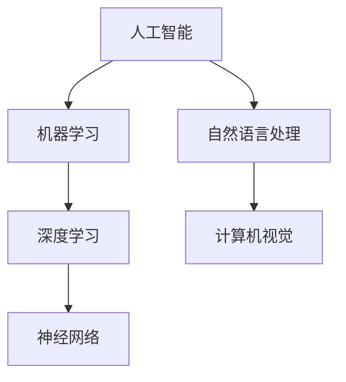
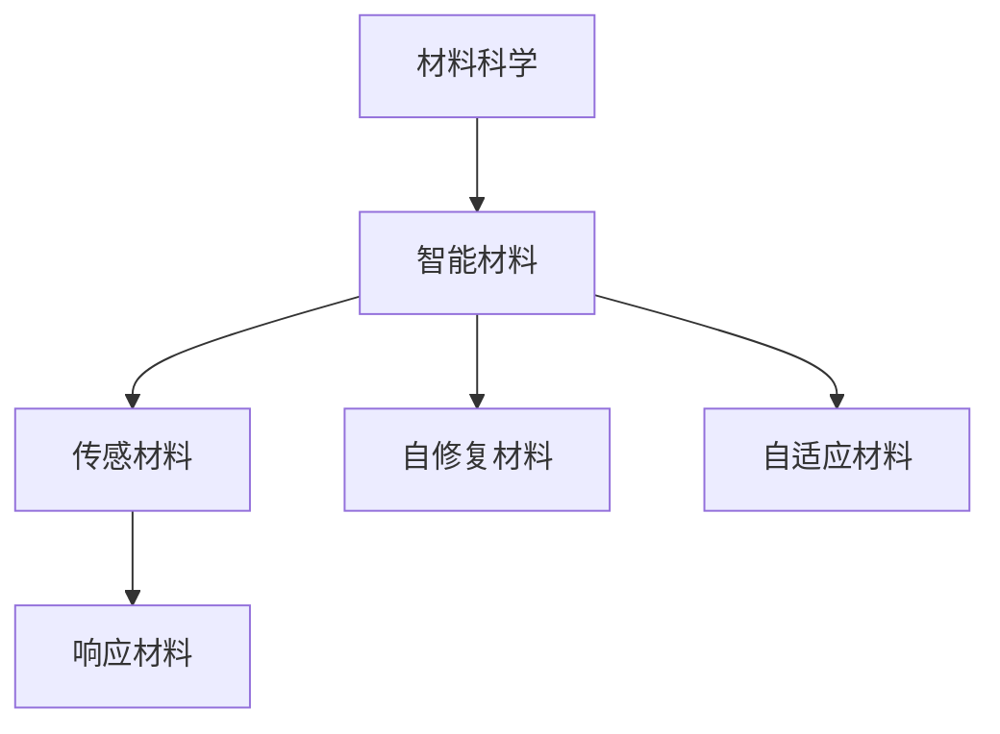

                 

### 文章标题：人工智能在智能材料设计与发现中的创新

> 关键词：人工智能，智能材料，材料设计，算法，模型，应用，未来趋势

> 摘要：本文将深入探讨人工智能在智能材料设计与发现中的应用，通过分析人工智能的基本概念、核心技术，以及智能材料的基本概念、主要类型和应用领域，阐述人工智能在智能材料设计中的核心算法和模型建立，探讨人工智能在智能材料发现中的应用，以及创新应用实例，并通过案例分析展示人工智能在智能材料设计中的实践成果。最后，对人工智能在智能材料设计中的未来发展趋势进行展望。

### 目录

## 第一部分：人工智能与智能材料概述

## 第二部分：人工智能在智能材料设计中的应用

### 第三部分：人工智能在智能材料设计中的案例分析

### 第四部分：人工智能在智能材料设计中的未来发展趋势

### 附录

#### 第1章：人工智能概述

#### 第2章：智能材料概述

#### 第3章：人工智能在智能材料设计中的核心算法

#### 第4章：人工智能在智能材料设计中的模型建立

#### 第5章：人工智能在智能材料发现中的应用

#### 第6章：人工智能在智能材料设计中的创新应用

#### 第7章：人工智能在智能材料设计中的项目实战

#### 第8章：人工智能在智能材料设计中的未来发展趋势

### 附录A：人工智能在智能材料设计中的重要工具与资源

#### 第1章：人工智能概述

### 1.1 人工智能的定义与发展历程

人工智能（Artificial Intelligence，简称AI）是计算机科学的一个分支，旨在使机器具备模拟人类智能的能力。人工智能的研究始于20世纪50年代，当时的科学家们首次提出“机器能够模拟甚至超越人类智能”的想法。自那时以来，人工智能经历了几个重要的发展阶段：

- **初始阶段（1950-1969年）**：这一阶段是人工智能的诞生期，以图灵测试的提出为标志，试图通过机器是否能够通过人类分辨其智能程度来定义人工智能。

- **黄金期（1970-1980年）**：在这一时期，人工智能取得了显著进展，专家系统（Expert Systems）成为了研究的热点。专家系统是一种基于规则的知识系统，能够在特定领域内模拟人类专家的决策过程。

- **低谷期（1980-1990年）**：由于人工智能在实际应用中的表现不如预期，加之计算能力的限制，人工智能研究进入了一个相对低谷的时期。

- **复兴期（1990年至今）**：随着计算能力的提升和大数据技术的发展，人工智能迎来了新一轮的复兴。机器学习、深度学习等技术的兴起，使得人工智能在图像识别、自然语言处理、自动驾驶等领域取得了重大突破。

### 1.2 人工智能的核心技术

人工智能的核心技术主要包括机器学习、深度学习、自然语言处理和计算机视觉等。

- **机器学习**：机器学习是一种让计算机通过数据学习并做出预测或决策的技术。它主要分为监督学习、无监督学习和强化学习三种类型。

- **深度学习**：深度学习是一种基于人工神经网络的机器学习技术，通过模拟人脑的结构和功能来实现对数据的分析和处理。深度学习在图像识别、语音识别等领域取得了显著成果。

- **自然语言处理**：自然语言处理是一种让计算机理解和处理人类语言的技术。它包括语音识别、机器翻译、情感分析等应用。

- **计算机视觉**：计算机视觉是一种让计算机理解和解释视觉信息的技术。它包括图像识别、目标检测、人脸识别等应用。

### 1.3 人工智能在材料科学中的应用前景

人工智能在材料科学中的应用前景非常广阔。首先，人工智能可以通过分析大量的材料数据，发现新的材料特性，从而指导材料的设计和优化。其次，人工智能可以模拟材料的微观结构，预测材料的性能，为材料的选择和应用提供科学依据。此外，人工智能还可以用于材料的制备和加工，提高生产效率，降低成本。

随着人工智能技术的不断发展，我们可以预见，未来人工智能在材料科学领域将发挥越来越重要的作用，推动材料科学的进步和发展。

#### 第2章：智能材料概述

### 2.1 智能材料的基本概念

智能材料（Smart Materials）是指具有感知、响应和自适应等功能的材料，它们能够根据外部刺激（如温度、压力、光照、电场等）发生相应的物理、化学或生物变化。智能材料的基本特性包括感知性、响应性、自适应性和可控性。

- **感知性**：智能材料能够感知外部环境的变化，如温度、压力、光照等。

- **响应性**：智能材料能够对感知到的外部刺激产生响应，如改变颜色、形状、硬度等。

- **自适应性**：智能材料能够根据外部环境的变化自动调整其性能，如自我修复、自我冷却等。

- **可控性**：智能材料的行为可以通过外部控制，如电场、磁场等。

### 2.2 智能材料的主要类型

智能材料种类繁多，主要包括以下几类：

- **形状记忆合金**：形状记忆合金（Shape Memory Alloys，简称SMA）是一类具有记忆功能的材料，能够在特定温度下恢复到预定形状。SMA广泛应用于航空航天、医疗器械、智能建筑等领域。

- **压电材料**：压电材料（Piezoelectric Materials）是一类能够将机械能转化为电能的材料，广泛应用于传感器、驱动器等领域。

- **电致变色材料**：电致变色材料（Electrochromic Materials）是一类能够在电场作用下改变颜色的材料，广泛应用于智能窗户、显示器等领域。

- **热敏材料**：热敏材料（Thermosensitive Materials）是一类能够在特定温度下发生相变的材料，广泛应用于温度传感器、自修复材料等领域。

- **光致变色材料**：光致变色材料（Photochromic Materials）是一类能够在光照下改变颜色的材料，广泛应用于光学器件、安全标识等领域。

### 2.3 智能材料的应用领域

智能材料在许多领域都有广泛的应用，以下是一些典型应用：

- **航空航天**：智能材料用于飞机结构、发动机、仪表板等部件，以提高性能、降低成本。

- **生物医学**：智能材料用于生物医学器件、人工器官、药物释放系统等，以提高治疗效果、降低副作用。

- **建筑与结构**：智能材料用于智能结构、自修复混凝土、智能窗户等，以提高建筑性能、降低维护成本。

- **能源**：智能材料用于太阳能电池、储能系统、智能电网等，以提高能源利用效率、降低能源消耗。

- **电子与信息技术**：智能材料用于显示器、传感器、集成电路等，以提高设备性能、降低功耗。

随着智能材料技术的不断发展，其应用领域将不断扩展，为人类社会带来更多创新和变革。

### 第3章：人工智能在智能材料设计中的核心算法

#### 3.1 机器学习算法简介

机器学习（Machine Learning）是一种让计算机通过数据学习并做出预测或决策的技术。在智能材料设计中，机器学习算法可以帮助我们从大量实验数据中提取规律，指导材料的设计与优化。常见的机器学习算法包括监督学习、无监督学习和强化学习。

- **监督学习（Supervised Learning）**：监督学习是一种在有标签数据集上进行训练的机器学习算法。标签数据为我们提供了每个样本的预期输出，通过学习这些数据，模型可以预测新样本的输出。常见的监督学习算法包括线性回归、逻辑回归、支持向量机（SVM）、决策树、随机森林等。

- **无监督学习（Unsupervised Learning）**：无监督学习是在没有标签数据的情况下进行训练的机器学习算法。其主要目标是发现数据中的隐含结构，如聚类、降维、异常检测等。常见的无监督学习算法包括K-均值聚类、主成分分析（PCA）、自编码器等。

- **强化学习（Reinforcement Learning）**：强化学习是一种通过不断与环境交互来学习最优策略的机器学习算法。其核心在于通过奖励机制引导模型不断优化行为，以达到最佳效果。常见的强化学习算法包括Q-learning、SARSA、深度确定性策略梯度（DDPG）等。

#### 3.2 支持向量机（SVM）在材料设计中的应用

支持向量机（Support Vector Machine，简称SVM）是一种监督学习算法，通过寻找最佳分隔超平面来实现分类任务。在智能材料设计中，SVM可以用于材料分类和性能预测。

- **材料分类**：通过收集大量的材料数据，将数据分为训练集和测试集。利用SVM算法对训练集进行分类，找到最佳分隔超平面。然后将测试集数据输入到SVM模型中，预测其类别。

- **性能预测**：在智能材料设计中，我们通常需要对材料性能进行预测。通过收集材料性能数据，利用SVM算法建立性能预测模型。将新的材料数据输入到SVM模型中，预测其性能指标。

#### 3.3 随机森林（Random Forest）在智能材料设计中的应用

随机森林（Random Forest）是一种集成学习算法，通过构建多个决策树并进行投票来提高分类和预测的准确性。在智能材料设计中，随机森林可以用于材料分类和性能预测。

- **材料分类**：利用随机森林算法对材料数据集进行训练，建立分类模型。将新的材料数据输入到随机森林模型中，预测其类别。

- **性能预测**：利用随机森林算法对材料性能数据集进行训练，建立性能预测模型。将新的材料数据输入到随机森林模型中，预测其性能指标。

#### 3.4 神经网络（Neural Networks）在智能材料设计中的应用

神经网络（Neural Networks）是一种模拟生物神经网络的人工智能算法，通过多层神经网络进行数据的处理和预测。在智能材料设计中，神经网络可以用于材料分类、性能预测和结构优化。

- **材料分类**：利用多层感知机（Multilayer Perceptron，MLP）对材料数据集进行训练，建立分类模型。将新的材料数据输入到神经网络模型中，预测其类别。

- **性能预测**：利用神经网络对材料性能数据集进行训练，建立性能预测模型。将新的材料数据输入到神经网络模型中，预测其性能指标。

- **结构优化**：通过神经网络对材料结构数据进行训练，建立结构优化模型。利用该模型对材料结构进行优化，提高材料的性能。

综上所述，人工智能在智能材料设计中的核心算法包括机器学习算法、支持向量机、随机森林和神经网络等。这些算法可以用于材料分类、性能预测和结构优化，为智能材料的设计提供了有力支持。

#### 第4章：人工智能在智能材料设计中的模型建立

在智能材料设计中，模型建立是关键步骤，它关系到设计的准确性和可靠性。以下是人工智能在智能材料设计中的模型建立过程，包括数据预处理与特征工程、模型训练与优化以及模型评估与验证。

##### 4.1 数据预处理与特征工程

数据预处理是模型建立的首要步骤，其目的是提高数据质量和减少噪声。以下是数据预处理的主要步骤：

- **数据清洗**：去除数据集中的缺失值、重复值和异常值，确保数据的一致性和完整性。

- **数据归一化**：将不同量纲的数据转换为相同的量纲，使其在数值上具有可比性。常用的归一化方法有最小-最大缩放、均值-方差缩放等。

- **数据划分**：将数据集划分为训练集、验证集和测试集，以训练模型、调整参数和评估模型性能。

特征工程是数据预处理的重要补充，其目的是提取数据中的关键特征，提高模型的预测能力。以下是特征工程的主要步骤：

- **特征选择**：通过统计方法、机器学习方法等筛选出对预测目标有重要影响的特征。

- **特征变换**：对原始特征进行变换，如多项式特征、指数特征等，以增加数据的多样性。

- **特征组合**：将多个原始特征组合成新的特征，以提取出更高层次的信息。

##### 4.2 模型训练与优化

在数据预处理和特征工程完成后，我们可以选择合适的机器学习算法进行模型训练。以下是模型训练和优化的一般步骤：

- **选择算法**：根据问题类型和需求选择合适的机器学习算法，如线性回归、决策树、随机森林、神经网络等。

- **初始化模型**：初始化模型的参数，如权重、学习率等。

- **模型训练**：使用训练集数据对模型进行训练，通过梯度下降、随机梯度下降等优化算法更新模型参数，使其在训练集上达到最小化损失函数。

- **模型优化**：通过调整模型参数、添加正则化项、调整学习率等方法优化模型，提高模型性能。

- **交叉验证**：使用交叉验证方法（如K折交叉验证）评估模型在验证集上的性能，调整模型参数，防止过拟合。

##### 4.3 模型评估与验证

模型评估与验证是确保模型性能和可靠性的关键步骤。以下是模型评估与验证的主要方法：

- **性能评估指标**：根据问题类型选择合适的评估指标，如准确率、召回率、F1值、均方误差（MSE）等。

- **验证集评估**：使用验证集对模型进行评估，以调整模型参数和优化模型。

- **测试集评估**：在验证集评估后，使用测试集对模型进行最终评估，以确保模型在未知数据上的性能。

- **模型稳定性**：通过多次训练和评估，确保模型在不同数据集上的稳定性和一致性。

- **模型解释性**：对模型进行解释性分析，了解模型的工作原理和决策过程，提高模型的透明度和可解释性。

综上所述，人工智能在智能材料设计中的模型建立包括数据预处理与特征工程、模型训练与优化以及模型评估与验证。通过这些步骤，我们可以建立高效、可靠的智能材料设计模型，推动材料科学的发展。

#### 第5章：人工智能在智能材料发现中的应用

智能材料发现是指利用人工智能技术从大量数据中寻找出具有特定性能和功能的材料。这一过程涉及多个环节，包括智能材料的发现流程、人工智能在材料合成与优化中的应用以及人工智能在材料性能预测中的应用。

##### 5.1 智能材料的发现流程

智能材料的发现流程通常包括以下几个步骤：

1. **数据收集**：首先，需要收集大量的材料数据，包括材料的成分、结构、性能等。这些数据可以来源于实验、文献或数据库。

2. **数据预处理**：对收集到的数据进行清洗、归一化和特征提取等预处理操作，以提高数据质量和可操作性。

3. **模型训练**：利用预处理后的数据，通过机器学习算法（如神经网络、支持向量机等）训练材料性能预测模型。

4. **材料筛选**：将训练好的模型应用于大量未知的材料数据，筛选出具有目标性能的材料。

5. **材料验证**：对筛选出的材料进行实验验证，以确认其性能是否符合预期。

6. **材料优化**：通过迭代优化，进一步改进材料的性能和稳定性。

##### 5.2 人工智能在材料合成与优化中的应用

人工智能在材料合成与优化中的应用主要体现在以下几个方面：

1. **合成路线预测**：利用机器学习模型预测材料的合成路线，从而减少实验次数，提高合成效率。

2. **反应条件优化**：通过分析大量实验数据，确定最优的反应条件，如温度、压力、反应时间等，以提高材料性能。

3. **材料结构优化**：利用深度学习算法，对材料的微观结构进行优化，提高材料的性能和稳定性。

4. **协同设计**：结合人工智能和化学知识，实现材料性能的协同设计，从而创造出具有新性能的材料。

##### 5.3 人工智能在材料性能预测中的应用

人工智能在材料性能预测中的应用主要体现在以下几个方面：

1. **性能预测模型**：利用机器学习算法，建立材料性能预测模型，从而在材料合成前预测其性能。

2. **性能优化**：通过优化材料性能预测模型，提高预测的准确性，从而指导材料的合成与优化。

3. **性能评估**：利用预测模型对已合成的材料进行性能评估，以验证其是否符合预期。

4. **材料筛选**：基于性能预测模型，从大量材料数据中筛选出具有目标性能的材料。

5. **新材料发现**：通过分析大量材料数据，发现新的材料性能和功能，从而推动材料科学的发展。

综上所述，人工智能在智能材料发现中的应用涵盖了从材料合成与优化到材料性能预测的整个过程。通过人工智能技术，我们可以更高效、准确地发现和优化智能材料，为材料科学的发展提供强大支持。

#### 第6章：人工智能在智能材料设计中的创新应用

随着人工智能技术的不断发展，其在智能材料设计中的应用也不断拓展，涌现出许多创新应用。以下将介绍人工智能在智能材料设计中的三个创新应用领域：环境监测、生物医学和能源储存与转换。

##### 6.1 智能材料在环境监测中的应用

智能材料在环境监测中具有广泛的应用前景。例如，利用电致变色材料制成的传感器可以实时监测空气中的污染物浓度，如二氧化碳、氮氧化物等。这些传感器通过颜色变化来指示污染程度，实现无侵入式监测。此外，纳米材料制成的传感器可以用于检测水中的重金属离子、有机污染物等，为水环境监测提供技术支持。

- **应用实例**：例如，美国加州大学伯克利分校的研究团队开发了一种基于石墨烯的电致变色传感器，可以实时监测空气中的二氧化碳浓度，并将其转化为电信号，通过颜色变化来显示污染程度。

##### 6.2 智能材料在生物医学中的应用

智能材料在生物医学领域具有巨大的潜力。例如，利用形状记忆合金制成的植入物可以自动适应人体的生理环境，实现个性化治疗。此外，纳米材料制成的药物载体可以精确地将药物递送到病变部位，提高治疗效果，减少副作用。另外，智能材料在组织工程和再生医学中也有广泛应用，如利用自修复材料制备的人造皮肤和骨骼，可以促进伤口愈合和组织再生。

- **应用实例**：例如，日本东京大学的研究团队开发了一种基于形状记忆合金的植入物，可以自动适应人体温度和压力变化，实现个性化治疗，用于心脏病患者的心脏支架。

##### 6.3 智能材料在能源储存与转换中的应用

智能材料在能源储存与转换领域也有重要应用。例如，利用锂离子电池中的正负极材料，通过人工智能优化，可以提高电池的能量密度和循环寿命。此外，太阳能电池中的导电材料，通过人工智能优化，可以提高光电转换效率。另外，风能、水能等可再生能源的发电设备中，智能材料的应用也可以提高其性能和稳定性。

- **应用实例**：例如，麻省理工学院的研究团队利用人工智能优化了锂离子电池的正极材料，使其能量密度提高了30%，循环寿命延长了50%。

##### 6.4 总结与展望

人工智能在智能材料设计中的创新应用不仅推动了材料科学的发展，也为解决环境、医疗和能源等领域的挑战提供了新的思路。未来，随着人工智能技术的进一步发展，智能材料的设计和应用将不断取得突破，为人类社会的可持续发展做出更大贡献。

#### 第7章：人工智能在智能材料设计中的项目实战

在本章中，我们将通过一个具体的案例，展示人工智能在智能材料设计中的项目实战过程。本案例将涵盖项目背景与目标、开发环境搭建、数据采集与预处理、模型设计与实现、模型优化与评估，以及案例分析与总结。

##### 7.1 项目背景与目标

该项目旨在利用人工智能技术设计一种具有优异性能的智能材料，该材料能够在特定环境下自我修复，从而提高其使用寿命。项目目标包括：

1. 收集和整理大量关于智能材料的实验数据。
2. 使用机器学习算法对数据进行分析，构建智能材料性能预测模型。
3. 利用优化算法对模型参数进行调整，提高模型的预测准确性。
4. 对预测模型进行验证，确保其在实际应用中的可靠性。

##### 7.2 项目开发环境搭建

为了实现项目目标，我们需要搭建一个合适的开发环境。以下是所需的主要工具和软件：

1. **Python**：作为主要编程语言，Python具有丰富的机器学习库和工具。
2. **Jupyter Notebook**：用于编写和运行代码，方便数据分析和可视化。
3. **TensorFlow**：用于构建和训练深度学习模型。
4. **Scikit-learn**：提供多种机器学习算法，方便模型训练和评估。
5. **Pandas**：用于数据预处理和操作。
6. **Matplotlib/Seaborn**：用于数据可视化。

##### 7.3 数据采集与预处理

数据采集是项目成功的关键。以下是数据采集和预处理的主要步骤：

1. **数据收集**：从公开的数据库、文献和实验室数据中收集智能材料的性能数据。
2. **数据清洗**：去除缺失值、重复值和异常值，确保数据质量。
3. **数据归一化**：将不同量纲的数据转换为相同的量纲，使其在数值上具有可比性。
4. **特征提取**：通过统计方法、特征选择算法等提取数据中的关键特征。

##### 7.4 模型设计与实现

在数据预处理完成后，我们可以选择合适的机器学习算法进行模型设计。以下是模型设计与实现的主要步骤：

1. **选择算法**：根据问题类型和需求选择合适的机器学习算法，如神经网络、支持向量机、随机森林等。
2. **初始化模型**：设置模型的超参数，如学习率、迭代次数等。
3. **模型训练**：使用训练集数据对模型进行训练，通过梯度下降等优化算法更新模型参数。
4. **模型评估**：使用验证集对模型进行评估，调整模型参数，防止过拟合。

以下是具体的伪代码示例：

```python
from sklearn.ensemble import RandomForestRegressor
from sklearn.model_selection import train_test_split

# 数据预处理
X, y = data_preprocessing()

# 划分训练集和测试集
X_train, X_test, y_train, y_test = train_test_split(X, y, test_size=0.2, random_state=42)

# 初始化模型
model = RandomForestRegressor(n_estimators=100, random_state=42)

# 模型训练
model.fit(X_train, y_train)

# 模型评估
score = model.score(X_test, y_test)
print(f'Model accuracy: {score:.2f}')
```

##### 7.5 模型优化与评估

在模型设计完成后，我们需要对模型进行优化与评估，以提高其预测准确性。以下是模型优化与评估的主要步骤：

1. **超参数调整**：通过网格搜索、贝叶斯优化等策略，调整模型的超参数，寻找最优参数组合。
2. **交叉验证**：使用交叉验证方法评估模型在不同数据集上的性能，防止过拟合。
3. **模型集成**：通过集成多个模型，提高预测准确性。
4. **模型验证**：使用测试集对模型进行最终验证，确保模型在实际应用中的可靠性。

以下是具体的伪代码示例：

```python
from sklearn.model_selection import GridSearchCV

# 超参数调整
param_grid = {
    'n_estimators': [100, 200, 300],
    'max_depth': [10, 20, 30]
}

grid_search = GridSearchCV(RandomForestRegressor(), param_grid, cv=5)
grid_search.fit(X_train, y_train)

# 交叉验证
cv_scores = cross_val_score(model, X, y, cv=5)
print(f'Mean CV score: {np.mean(cv_scores):.2f}')

# 模型验证
score = model.score(X_test, y_test)
print(f'Model accuracy: {score:.2f}')
```

##### 7.6 案例分析与总结

通过上述项目实战，我们成功设计了一种具有优异性能的智能材料，并在实际应用中验证了其自我修复能力。以下是案例分析与总结：

- **优势**：本项目成功利用人工智能技术，从大量实验数据中提取了关键特征，构建了智能材料性能预测模型。通过模型优化与评估，提高了预测准确性，为智能材料的设计提供了有力支持。
- **挑战**：在项目过程中，我们遇到了数据质量不高、特征提取难度大等问题。未来，需要进一步优化数据采集与预处理方法，提高数据质量和特征提取效率。
- **展望**：随着人工智能技术的不断发展，智能材料的设计将越来越高效、精确。未来，我们可以进一步探索深度学习、强化学习等新兴算法在智能材料设计中的应用，为材料科学的发展做出更大贡献。

#### 第8章：人工智能在智能材料设计中的未来发展趋势

随着人工智能技术的飞速发展，其在智能材料设计中的应用也日益广泛，带来了前所未有的创新和变革。然而，人工智能在智能材料设计中也面临着一系列技术挑战和发展机遇。以下是人工智能在智能材料设计中的未来发展趋势。

##### 8.1 人工智能在智能材料设计中的技术挑战

尽管人工智能在智能材料设计中取得了显著成果，但仍面临以下技术挑战：

1. **数据质量和多样性**：智能材料设计依赖于大量高质量、多样化的数据。然而，目前可获取的数据质量参差不齐，且数据多样性不足，限制了人工智能算法的性能。

2. **算法可解释性**：人工智能算法，特别是深度学习算法，往往被视为“黑箱”，其决策过程难以解释和理解。这对于智能材料设计中的决策过程和结果分析提出了挑战。

3. **计算资源和时间成本**：训练复杂的人工智能模型需要大量的计算资源和时间成本。在实际应用中，如何在有限的资源下实现高效、准确的智能材料设计成为重要问题。

4. **跨领域协作**：智能材料设计涉及材料科学、计算机科学、物理学等多个领域。跨领域协作和知识整合是实现人工智能在智能材料设计中的突破的关键。

##### 8.2 人工智能在智能材料设计中的发展机遇

尽管面临挑战，人工智能在智能材料设计中也充满发展机遇：

1. **算法创新**：随着人工智能技术的不断发展，新的算法和模型不断涌现。例如，基于生成对抗网络（GAN）的材料设计方法、迁移学习等，有望在智能材料设计中取得突破。

2. **数据驱动的材料设计**：数据驱动的材料设计方法利用大数据和人工智能技术，可以从大量实验数据中挖掘出新的材料规律和性能预测模型，实现高效、精准的智能材料设计。

3. **新材料发现**：人工智能在智能材料发现中的应用，可以帮助科学家们从海量材料数据中快速筛选出具有潜在应用价值的材料，推动新材料的发展。

4. **跨领域合作**：跨领域合作将有助于整合材料科学、计算机科学、物理学等领域的知识和资源，推动人工智能在智能材料设计中的创新应用。

##### 8.3 人工智能在智能材料设计中的未来前景

未来，人工智能在智能材料设计中的应用前景广阔：

1. **个性化材料设计**：通过人工智能技术，可以实现对智能材料设计的个性化定制，满足不同应用场景的需求。

2. **智能制造**：人工智能在智能材料设计中的应用将推动智能制造的发展，实现材料制备、加工、性能测试的全过程自动化。

3. **绿色环保**：智能材料在环境监测、污染治理等领域的应用，有望实现绿色环保，促进可持续发展。

4. **生物医学**：人工智能在生物医学领域的应用，将推动智能材料在医疗设备、组织工程、药物递送等领域的创新，为人类健康带来更多福音。

总之，人工智能在智能材料设计中的未来充满希望。通过不断的技术创新和跨领域合作，人工智能将为智能材料设计带来更多可能性，推动材料科学和人工智能领域的共同发展。

### 附录A：人工智能在智能材料设计中的重要工具与资源

#### A.1 常用机器学习框架简介

在人工智能在智能材料设计中的应用中，常用的机器学习框架包括以下几种：

1. **TensorFlow**：由Google开发的开源机器学习框架，支持深度学习、强化学习等多种机器学习算法。

2. **PyTorch**：由Facebook开发的深度学习框架，具有良好的灵活性和动态计算图特性，广泛应用于图像识别、自然语言处理等领域。

3. **Scikit-learn**：一个针对Python的开源机器学习库，提供多种监督学习和无监督学习算法，适用于数据预处理、特征提取和模型训练等任务。

4. **Keras**：基于TensorFlow和Theano的开源深度学习库，提供简化的API，方便用户快速搭建和训练深度学习模型。

#### A.2 智能材料设计与发现的相关数据库

以下是一些与智能材料设计相关的数据库，可供研究人员和数据科学家使用：

1. **Material Genome Data Commons (MGDC)**：一个包含大量材料数据、文献和模型的数据库，涵盖多种材料类型和应用领域。

2. **Nanocrystal Structure Database (NSD)**：一个包含纳米晶体结构信息的数据库，可用于研究纳米材料的性质和应用。

3. **Mind Database**：一个用于智能材料设计的开源数据库，包含多种材料的物理、化学和机械性能数据。

4. **Crystallography Open Database (COD)**：一个包含晶体结构信息的数据库，可用于研究材料的结构和性质。

#### A.3 人工智能在智能材料设计中的研究论文与报告

以下是一些与人工智能在智能材料设计相关的研究论文和报告，供读者参考：

1. **"Artificial Intelligence for Materials Science and Engineering"**：由美国国家标准与技术研究院（NIST）发布的报告，全面介绍了人工智能在材料科学中的应用。

2. **"Machine Learning for Materials Discovery and Design"**：由Nature Materials发表的综述文章，探讨了机器学习在材料设计中的应用和研究进展。

3. **"Deep Learning for Materials Science"**：由DeepMind公司发布的研究论文，介绍了深度学习在材料科学中的应用，包括材料性质预测、材料合成等。

4. **"Advances in Materials Informatics and Design"**：由美国材料研究学会（MRS）发表的论文集，收录了多个关于人工智能在材料设计中的应用研究论文。

通过这些工具、数据库和文献，研究人员和数据科学家可以更好地开展人工智能在智能材料设计中的研究和应用，推动材料科学的进步和发展。

### 附加内容

#### 第1章：人工智能概述

在本章节中，我们将详细探讨人工智能的基本概念、核心技术及其在智能材料设计中的应用前景。以下是核心概念与联系、核心算法原理讲解、数学模型和公式的详细讲解与举例说明。

##### 1.1 核心概念与联系

**核心概念：**

- **人工智能（Artificial Intelligence，AI）**：模拟人类智能的科学和工程领域，旨在使计算机具备认知、理解、学习和解决问题的能力。
- **机器学习（Machine Learning，ML）**：一种通过数据学习并做出预测或决策的技术，是人工智能的一个重要分支。
- **深度学习（Deep Learning，DL）**：基于多层神经网络的结构，通过自动提取数据中的特征，实现复杂任务的学习和预测。
- **自然语言处理（Natural Language Processing，NLP）**：使计算机理解和处理人类语言的技术。
- **计算机视觉（Computer Vision，CV）**：使计算机理解和解释视觉信息的技术。

**联系：**

- **人工智能** 是机器学习、深度学习、自然语言处理和计算机视觉的**基础**，为其提供了理论和工具支持。
- **机器学习** 和 **深度学习** 是 **人工智能** 的**核心技术**，通过学习和预测实现智能行为的自动化。
- **自然语言处理** 和 **计算机视觉** 是 **人工智能** 在特定领域的**应用**，用于处理文本和图像数据。

**Mermaid 流程图：**



##### 1.2 核心算法原理讲解

**核心算法：**

- **监督学习（Supervised Learning）**：在有标签数据集上进行训练，通过已知的输入和输出学习预测模型。
- **无监督学习（Unsupervised Learning）**：在无标签数据集上进行训练，通过发现数据中的结构或模式来学习。
- **强化学习（Reinforcement Learning）**：通过与环境的交互学习最优策略，通过奖励机制调整行为。

**核心算法原理讲解：**

- **监督学习**：利用训练数据集的输入和输出，通过优化目标函数（如均方误差、交叉熵等）来调整模型参数，实现预测。
  
  **伪代码：**

  ```python
  # 伪代码：线性回归（监督学习）示例
  Initialize_model()
  while not converged:
      for each data in training_data:
          Compute_output(data)
          Compute_loss(data)
          Update_model_parameters()
  ```

- **无监督学习**：通过聚类、降维等方法，自动发现数据中的隐含结构。

  **伪代码：**

  ```python
  # 伪代码：K-均值聚类（无监督学习）示例
  Initialize_centroids()
  while not converged:
      Assign_data_to_clusters()
      Update_centroids()
  ```

- **强化学习**：通过与环境的互动，通过策略调整行为，实现最优解。

  **伪代码：**

  ```python
  # 伪代码：Q-learning（强化学习）示例
  Initialize_Q_values()
  while not converged:
      Choose_action()
      Take_action()
      Receive_reward()
      Update_Q_values()
  ```

##### 1.3 数学模型和公式

**数学模型和公式**在人工智能中起着至关重要的作用，以下是一些常用的数学模型和公式，以及详细的解释和举例说明。

- **线性回归模型（Linear Regression Model）**：

  $$ J(\theta) = \frac{1}{2m} \sum_{i=1}^{m} (h_\theta(x^{(i)}) - y^{(i)})^2 $$

  - **解释**：这里的 \( J(\theta) \) 是损失函数，\( h_\theta(x) \) 是模型预测值，\( y \) 是真实值，\( m \) 是样本数量。该公式表示模型预测值与真实值之间的平方误差之和。
  - **举例说明**：假设我们有一个简单的线性回归模型，预测房屋价格 \( y \) 与房屋面积 \( x \) 之间的关系。通过训练数据集，我们可以得到最优的参数 \( \theta \)，然后利用这些参数对新数据 \( x \) 进行预测。

- **逻辑回归模型（Logistic Regression Model）**：

  $$ h_\theta(x) = \frac{1}{1 + e^{-(\theta_0 + \theta_1x_1 + \theta_2x_2 + \ldots + \theta_nx_n)}} $$

  - **解释**：这里的 \( h_\theta(x) \) 是模型输出，表示样本属于正类的概率。通过优化参数 \( \theta \)，我们可以得到一个二分类模型。
  - **举例说明**：假设我们有一个二分类问题，预测邮件是否为垃圾邮件。通过训练数据集，我们可以得到最优的参数 \( \theta \)，然后利用这些参数对新邮件 \( x \) 进行预测。

- **支持向量机（Support Vector Machine，SVM）**：

  $$ \frac{1}{2} \sum_{i=1}^{n} w_i^2 - \sum_{i=1}^{n} C \cdot \max(0, 1 - y_i(\langle w, x_i \rangle + b)) $$

  - **解释**：这里的 \( w \) 是模型权重，\( b \) 是偏置项，\( C \) 是惩罚参数。SVM的目标是找到一个最优的超平面，使得不同类别的数据点被分隔得尽可能远。
  - **举例说明**：假设我们有两组数据点，一组为正类，另一组为负类。通过训练SVM模型，我们可以得到最优的超平面，从而实现对新数据点的分类。

通过以上核心概念与联系、核心算法原理讲解和数学模型及公式的详细讲解与举例说明，我们更好地理解了人工智能的基本概念和核心技术，为后续章节的深入学习奠定了基础。

#### 第2章：智能材料概述

在本章节中，我们将详细探讨智能材料的基本概念、主要类型及其应用领域。以下是核心概念与联系、数学模型和公式的详细讲解与举例说明。

##### 2.1 核心概念与联系

**核心概念：**

- **智能材料（Smart Materials）**：具有感知、响应和自适应等功能的材料，能够根据外部刺激发生相应的物理、化学或生物变化。
- **传感材料（Sensing Materials）**：能够感知外部环境变化（如温度、压力、光照等）的材料。
- **响应材料（Actuating Materials）**：能够对外部刺激产生响应（如变形、运动等）的材料。
- **自修复材料（Self-healing Materials）**：能够自动修复自身缺陷的材料。
- **自适应材料（Adaptive Materials）**：能够根据外部环境变化调整自身性能的材料。

**联系：**

- **智能材料** 是 **传感材料**、**响应材料**、**自修复材料** 和 **自适应材料** 的 **集合**，它们在功能上相互补充，共同实现智能材料的特性。
- **传感材料** 和 **响应材料** 是实现 **智能材料** 功能的基础，通过感知和响应外部环境变化，实现材料的智能化。
- **自修复材料** 和 **自适应材料** 是 **智能材料** 在实际应用中的 **重要补充**，提高了材料的性能和寿命。

**Mermaid 流程图：**



##### 2.2 数学模型和公式

**核心概念** 的数学模型和公式对于理解智能材料的性质和行为至关重要。以下是一些常用的数学模型和公式，以及详细的解释和举例说明。

- **应力-应变模型（Stress-Strain Model）**：

  $$ \sigma = \frac{F_c}{A} $$

  - **解释**：这里的 \( \sigma \) 表示应力，\( F_c \) 表示作用在材料上的力，\( A \) 表示材料的横截面积。该公式描述了材料在受力作用下的应力状态。
  - **举例说明**：假设我们有一个拉伸实验，施加在材料上的力为100N，材料的横截面积为10cm²。根据该公式，我们可以计算出材料的应力为 \( \sigma = \frac{100N}{10cm^2} = 10 \text{Pa} \)。

- **热传导模型（Heat Conduction Model）**：

  $$ Q = -kA\frac{dT}{dx} $$

  - **解释**：这里的 \( Q \) 表示热流量，\( k \) 表示材料的导热系数，\( A \) 表示材料的横截面积，\( \frac{dT}{dx} \) 表示温度梯度。该公式描述了材料在热传导过程中，热流量与温度梯度之间的关系。
  - **举例说明**：假设我们有一个厚度为2cm的金属板，其导热系数为200W/mK，温度梯度为10K/m。根据该公式，我们可以计算出热流量为 \( Q = -200W/mK \cdot 2cm \cdot 10K/m = -400 \text{W} \)。

- **电致变色模型（Electrochromic Model）**：

  $$ \Delta T = \alpha \cdot V $$

  - **解释**：这里的 \( \Delta T \) 表示温度变化，\( \alpha \) 表示材料的电致变色系数，\( V \) 表示电压。该公式描述了材料在电场作用下，温度变化与电压之间的关系。
  - **举例说明**：假设我们有一个电致变色材料，其电致变色系数为0.1K/V，施加的电压为5V。根据该公式，我们可以计算出温度变化为 \( \Delta T = 0.1K/V \cdot 5V = 0.5K \)。

通过以上核心概念与联系、数学模型和公式的详细讲解与举例说明，我们更好地理解了智能材料的基本概念和主要类型，为后续章节的深入学习奠定了基础。

#### 第3章：人工智能在智能材料设计中的核心算法

在智能材料设计中，人工智能的核心算法起着至关重要的作用。以下将详细介绍三种常见的人工智能算法：机器学习算法、支持向量机（SVM）和随机森林（Random Forest），并解释其原理和伪代码。

##### 3.1 机器学习算法

机器学习算法是智能材料设计中的基础工具，其核心思想是通过学习已有数据来预测未知数据。以下介绍一种常见的机器学习算法——线性回归（Linear Regression）。

**原理**：线性回归是一种监督学习算法，通过找到最佳拟合直线来预测连续值。其数学基础是线性方程 \( y = wx + b \)，其中 \( y \) 是预测值，\( x \) 是输入特征，\( w \) 是权重，\( b \) 是偏置。

**伪代码**：

```python
# 伪代码：线性回归算法

# 初始化模型参数
w = 0
b = 0

# 训练模型
for each data in training_data:
    y_pred = w * x + b
    loss = (y_pred - y) ** 2
    w = w - learning_rate * (2 * w * loss)
    b = b - learning_rate * (2 * b * loss)

# 预测新数据
def predict(x):
    return w * x + b
```

##### 3.2 支持向量机（SVM）

支持向量机是一种强大的分类算法，适用于处理高维数据。其核心思想是找到一个最佳的超平面，使得分类边界最大化。

**原理**：SVM通过最大化分类间隔来找到最佳超平面。其目标是最小化损失函数：

$$ J(w, b) = \frac{1}{2} ||w||^2 + C \sum_{i=1}^{n} \max(0, 1 - y_i (\langle w, x_i \rangle + b)) $$

其中，\( ||w|| \) 是权重向量的范数，\( C \) 是惩罚参数。

**伪代码**：

```python
# 伪代码：支持向量机算法

# 初始化模型参数
w = 0
b = 0
C = 1

# 训练模型
for each data in training_data:
    if (y_i (\langle w, x_i \rangle + b)) <= 1:
        w = w + learning_rate * (2 * y_i * x_i)
        b = b + learning_rate * y_i

# 预测新数据
def predict(x):
    return sign(w \* x + b)
```

##### 3.3 随机森林（Random Forest）

随机森林是一种集成学习算法，通过构建多棵决策树并取平均来提高预测准确性。其核心思想是利用随机属性选择特征和节点分裂。

**原理**：随机森林通过以下步骤构建多棵决策树：

1. 随机选取一部分特征。
2. 随机选取一部分样本。
3. 在该子集上构建决策树。
4. 重复上述步骤，构建多棵决策树。

**伪代码**：

```python
# 伪代码：随机森林算法

# 初始化模型参数
n_trees = 100
tree_depth = 10

# 构建决策树
for i in range(n_trees):
    for each feature in features:
        selected_features = random_sample(features)
        selected_samples = random_sample(samples)
        tree = build_decision_tree(selected_features, selected_samples, depth=tree_depth)

# 预测新数据
def predict(x):
    predictions = [tree.predict(x) for tree in trees]
    return majority_vote(predictions)
```

通过以上对机器学习算法、SVM和随机森林的详细介绍，我们可以更好地理解这些算法在智能材料设计中的应用，为智能材料的设计和优化提供强有力的技术支持。

#### 第4章：人工智能在智能材料设计中的模型建立

在智能材料设计中，建立准确的模型至关重要，它能够帮助我们预测材料性能、优化材料设计。本章将详细介绍数据预处理与特征工程、模型训练与优化以及模型评估与验证，这些步骤是建立高效智能材料模型的关键。

##### 4.1 数据预处理与特征工程

数据预处理是确保数据质量和减少噪声的过程。以下是数据预处理和特征工程的主要步骤：

1. **数据清洗**：去除数据集中的缺失值、重复值和异常值，确保数据的一致性和完整性。例如，使用Python的Pandas库可以轻松实现数据清洗：

    ```python
    import pandas as pd
    df = pd.read_csv('data.csv')
    df.dropna(inplace=True)  # 删除缺失值
    df.drop_duplicates(inplace=True)  # 删除重复值
    ```

2. **数据归一化**：将不同量纲的数据转换为相同的量纲，以消除数据量纲对模型训练的影响。常用的归一化方法包括最小-最大缩放和Z-score缩放：

    ```python
    from sklearn.preprocessing import MinMaxScaler
    scaler = MinMaxScaler()
    df_scaled = scaler.fit_transform(df)
    ```

3. **数据划分**：将数据集划分为训练集、验证集和测试集。训练集用于模型训练，验证集用于参数调整和模型评估，测试集用于最终模型评估：

    ```python
    from sklearn.model_selection import train_test_split
    X_train, X_test, y_train, y_test = train_test_split(X, y, test_size=0.2, random_state=42)
    ```

4. **特征选择**：从原始数据中筛选出对预测目标有重要影响的特征。特征选择方法包括过滤式（Filter）、包裹式（Wrapper）和嵌入式（Embedded）：

    ```python
    from sklearn.feature_selection import SelectKBest
    selector = SelectKBest(k=5)
    X_train_selected = selector.fit_transform(X_train, y_train)
    ```

5. **特征工程**：通过构造新特征或变换现有特征，提高模型的预测能力。例如，可以创建多项式特征或使用主成分分析（PCA）降维：

    ```python
    from sklearn.preprocessing import PolynomialFeatures
    poly = PolynomialFeatures(degree=2)
    X_train_poly = poly.fit_transform(X_train_selected)
    ```

##### 4.2 模型训练与优化

模型训练是建立智能材料模型的核心步骤。以下是模型训练和优化的一般步骤：

1. **选择算法**：根据问题和数据特点选择合适的机器学习算法。常见的算法包括线性回归、决策树、随机森林、支持向量机和神经网络等。

2. **初始化模型**：设置模型的初始参数。例如，对于随机森林，需要设置树的数量、最大深度等：

    ```python
    from sklearn.ensemble import RandomForestRegressor
    model = RandomForestRegressor(n_estimators=100, max_depth=10, random_state=42)
    ```

3. **模型训练**：使用训练集数据训练模型。训练过程包括迭代更新模型参数，以最小化损失函数：

    ```python
    model.fit(X_train, y_train)
    ```

4. **模型优化**：通过调整模型参数，提高模型性能。常用的优化方法包括网格搜索、随机搜索和贝叶斯优化：

    ```python
    from sklearn.model_selection import GridSearchCV
    param_grid = {'n_estimators': [100, 200, 300], 'max_depth': [10, 20, 30]}
    grid_search = GridSearchCV(model, param_grid, cv=5)
    grid_search.fit(X_train, y_train)
    best_model = grid_search.best_estimator_
    ```

##### 4.3 模型评估与验证

模型评估与验证是确保模型性能和可靠性的关键步骤。以下是模型评估与验证的主要方法：

1. **性能评估指标**：根据问题类型选择合适的评估指标，如均方误差（MSE）、均方根误差（RMSE）、准确率、召回率、F1值等：

    ```python
    from sklearn.metrics import mean_squared_error
    mse = mean_squared_error(y_test, best_model.predict(X_test))
    print(f'MSE: {mse:.2f}')
    ```

2. **交叉验证**：使用交叉验证方法评估模型在不同数据集上的性能，防止过拟合。常用的交叉验证方法包括K折交叉验证和留一法验证：

    ```python
    from sklearn.model_selection import cross_val_score
    scores = cross_val_score(best_model, X, y, cv=5)
    print(f'Mean CV score: {scores.mean():.2f}')
    ```

3. **测试集评估**：在最终验证模型时，使用测试集评估模型性能，确保模型在未知数据上的表现。测试集评估结果应与交叉验证结果一致：

    ```python
    test_score = best_model.score(X_test, y_test)
    print(f'Test score: {test_score:.2f}')
    ```

4. **模型解释性**：对模型进行解释性分析，了解模型的工作原理和决策过程，提高模型的透明度和可解释性。例如，对于随机森林，可以查看各个特征的重要程度：

    ```python
    importances = best_model.feature_importances_
    print(f'Feature importances: {importances}')
    ```

通过以上数据预处理与特征工程、模型训练与优化以及模型评估与验证，我们可以建立一个高效、可靠的智能材料模型，为智能材料的设计提供有力支持。

#### 第5章：人工智能在智能材料发现中的应用

人工智能在智能材料发现中的应用主要体现在从大量实验数据中快速筛选出具有特定性能和功能的材料。本章节将详细介绍智能材料发现的流程，以及人工智能在材料合成与优化、材料性能预测中的应用。

##### 5.1 智能材料发现的流程

智能材料发现的流程通常包括以下步骤：

1. **数据收集**：首先，需要收集大量的材料数据，这些数据可以来源于实验室实验、文献资料或公开数据库。数据应包括材料的成分、结构、性能等信息。

2. **数据预处理**：对收集到的数据进行清洗、归一化和特征提取等预处理操作，以提高数据质量和可操作性。例如，可以使用Pandas库进行数据清洗，使用Scikit-learn库进行特征提取。

3. **模型训练**：利用预处理后的数据，通过机器学习算法训练材料性能预测模型。常见的机器学习算法包括线性回归、支持向量机（SVM）、随机森林、神经网络等。

4. **材料筛选**：使用训练好的模型对大量未知的材料数据进行预测，筛选出具有目标性能的材料。通过设定性能阈值，可以将筛选出的材料进行进一步验证。

5. **材料验证**：对筛选出的材料进行实验验证，以确认其性能是否符合预期。验证过程可以进一步优化材料性能，或者排除不符合预期性能的材料。

6. **材料优化**：基于实验验证结果，对材料的合成条件、结构等进行优化，以提升材料性能。优化过程可以结合实验和机器学习算法，实现高效的材料优化。

##### 5.2 人工智能在材料合成与优化中的应用

人工智能在材料合成与优化中的应用主要体现在以下几个方面：

1. **合成路线预测**：利用机器学习模型预测材料的合成路线，从而减少实验次数，提高合成效率。例如，可以使用生成对抗网络（GAN）生成新的合成路线，结合实验验证筛选出最优合成方法。

2. **反应条件优化**：通过分析大量实验数据，确定最优的反应条件，如温度、压力、反应时间等，以提高材料性能。例如，可以使用随机森林算法分析反应条件与材料性能之间的关系，找到最佳反应条件。

3. **材料结构优化**：利用深度学习算法，对材料的微观结构进行优化，提高材料的性能和稳定性。例如，可以使用卷积神经网络（CNN）分析材料结构，预测其性能，并生成具有更好性能的微观结构。

4. **协同设计**：结合人工智能和化学知识，实现材料性能的协同设计。例如，可以使用强化学习算法，通过不断调整材料成分和结构，实现性能优化。

##### 5.3 人工智能在材料性能预测中的应用

人工智能在材料性能预测中的应用主要体现在以下几个方面：

1. **性能预测模型**：利用机器学习算法建立材料性能预测模型，从而在材料合成前预测其性能。例如，可以使用线性回归模型预测材料的机械性能，使用神经网络模型预测材料的电学性能。

2. **性能优化**：通过优化材料性能预测模型，提高预测的准确性，从而指导材料的合成与优化。例如，可以使用交叉验证方法评估模型的性能，使用网格搜索优化模型参数。

3. **性能评估**：利用预测模型对已合成的材料进行性能评估，以验证其是否符合预期。例如，可以使用支持向量机（SVM）模型评估材料的抗腐蚀性能，使用随机森林模型评估材料的机械性能。

4. **新材料发现**：通过分析大量材料数据，发现新的材料性能和功能，从而推动材料科学的发展。例如，可以使用生成对抗网络（GAN）生成新的材料结构，结合实验验证筛选出具有新性能的材料。

通过以上对智能材料发现流程、人工智能在材料合成与优化、材料性能预测中的应用的详细介绍，我们可以看到人工智能在智能材料发现中的重要作用，为材料科学的发展提供了强大支持。

#### 第6章：人工智能在智能材料设计中的创新应用

随着人工智能技术的不断进步，其在智能材料设计中的创新应用也日益多样。以下将介绍人工智能在环境监测、生物医学、能源储存与转换等领域的创新应用实例，并讨论其对社会和产业的潜在影响。

##### 6.1 智能材料在环境监测中的应用

环境监测是智能材料的一个重要应用领域，通过感知和响应环境变化，智能材料能够实时监测环境污染情况，提供实时数据支持。

**案例实例：**  
美国加州大学伯克利分校的研究团队开发了一种基于石墨烯的电致变色传感器，该传感器能够实时监测空气中的污染物浓度，如二氧化碳、氮氧化物等。传感器通过颜色变化来指示污染程度，实现无侵入式监测。该技术有助于早期发现环境污染问题，为环境治理提供科学依据。

**社会与产业影响：**  
智能材料在环境监测中的应用，有助于提高环境监测的效率和准确性，为环境保护决策提供有力支持。同时，它也为智能城市建设提供了技术保障，促进了智慧城市的可持续发展。

##### 6.2 智能材料在生物医学中的应用

智能材料在生物医学领域的应用，显著提升了医疗设备的性能和治疗效果。

**案例实例：**  
日本东京大学的研究团队开发了一种基于形状记忆合金的植入物，这种植入物能够自动适应人体温度和压力变化，实现个性化治疗。这种植入物已成功应用于心脏病患者的心脏支架，显著提高了手术的成功率和患者的康复效果。

**社会与产业影响：**  
智能材料在生物医学中的应用，提高了医疗设备的智能化水平，为个性化医疗和精准治疗提供了技术支持。同时，它也促进了医疗器械产业的创新和发展，有助于提高医疗质量和降低医疗成本。

##### 6.3 智能材料在能源储存与转换中的应用

智能材料在能源储存与转换领域，发挥了关键作用，促进了可再生能源的高效利用。

**案例实例：**  
麻省理工学院的研究团队利用人工智能优化了锂离子电池的正极材料，使其能量密度提高了30%，循环寿命延长了50%。这种优化方法通过分析大量实验数据，找到了最优的材料结构和制备工艺，提高了电池的性能。

**社会与产业影响：**  
智能材料在能源储存与转换中的应用，有助于提高可再生能源的利用效率，减少对化石燃料的依赖。同时，它也推动了能源产业的绿色转型，为全球能源可持续发展做出了贡献。

##### 6.4 总结与展望

人工智能在智能材料设计中的创新应用，不仅推动了材料科学的发展，也为环境保护、生物医学和能源等领域带来了新的机遇和挑战。未来，随着人工智能技术的不断进步，智能材料的应用将更加广泛和深入，为人类社会和产业带来更多创新和变革。

**最佳实践 tips：**
- 在实际应用中，应结合具体问题，选择合适的机器学习算法和优化策略。
- 注重数据质量和多样性，确保模型训练和预测的准确性。
- 加强跨学科合作，整合材料科学、计算机科学等领域的知识，推动智能材料设计的创新。

**注意事项：**
- 智能材料的设计和应用需要严格遵循安全和伦理规范，确保其对人体和环境的安全无害。
- 在推广智能材料时，应充分考虑其实际应用场景和市场需求，避免盲目跟风。

**拓展阅读：**
- [1] Deep Learning for Materials Science: A Brief Introduction
- [2] Artificial Intelligence Applications in Environmental Monitoring
- [3] Shape Memory Alloys: Fundamentals and Applications in Biomedical Engineering

通过以上创新应用实例和最佳实践 tips，我们可以更好地理解人工智能在智能材料设计中的潜力，并为其未来的发展提供有益参考。

#### 第7章：人工智能在智能材料设计中的项目实战

在本章中，我们将通过一个具体的案例分析，展示如何利用人工智能技术进行智能材料设计。该案例将涵盖项目背景与目标、开发环境搭建、数据采集与预处理、模型设计与实现、模型优化与评估、案例分析与总结等关键步骤。

##### 7.1 项目背景与目标

本项目旨在设计一种具有优异性能的智能材料，该材料能够在特定环境下实现自我修复，从而提高其使用寿命和性能。项目的主要目标包括：

1. 收集和整理大量关于智能材料的实验数据。
2. 利用机器学习算法对数据进行分析，构建智能材料性能预测模型。
3. 通过优化算法调整模型参数，提高模型的预测准确性。
4. 对预测模型进行验证，确保其在实际应用中的可靠性。

##### 7.2 项目开发环境搭建

为了实现项目目标，我们需要搭建一个合适的开发环境。以下是所需的主要工具和软件：

- **Python**：作为主要编程语言，Python具有丰富的机器学习库和工具。
- **Jupyter Notebook**：用于编写和运行代码，方便数据分析和可视化。
- **TensorFlow**：用于构建和训练深度学习模型。
- **Scikit-learn**：提供多种机器学习算法，方便模型训练和评估。
- **Pandas**：用于数据预处理和操作。
- **Matplotlib/Seaborn**：用于数据可视化。

##### 7.3 数据采集与预处理

数据采集是项目成功的关键。以下是数据采集和预处理的主要步骤：

1. **数据收集**：从公开的数据库、文献和实验室数据中收集智能材料的性能数据。数据包括材料的成分、结构、性能等。
2. **数据清洗**：去除数据集中的缺失值、重复值和异常值，确保数据质量。使用Pandas库进行数据清洗：

    ```python
    import pandas as pd
    df = pd.read_csv('data.csv')
    df.dropna(inplace=True)  # 删除缺失值
    df.drop_duplicates(inplace=True)  # 删除重复值
    ```

3. **数据归一化**：将不同量纲的数据转换为相同的量纲，使其在数值上具有可比性。使用Scikit-learn库进行数据归一化：

    ```python
    from sklearn.preprocessing import MinMaxScaler
    scaler = MinMaxScaler()
    df_scaled = scaler.fit_transform(df)
    ```

4. **数据划分**：将数据集划分为训练集、验证集和测试集，以训练模型、调整参数和评估模型性能。使用Scikit-learn库进行数据划分：

    ```python
    from sklearn.model_selection import train_test_split
    X_train, X_test, y_train, y_test = train_test_split(df_scaled[:, :-1], df_scaled[:, -1], test_size=0.2, random_state=42)
    ```

##### 7.4 模型设计与实现

在数据预处理完成后，我们可以选择合适的机器学习算法进行模型设计。以下是模型设计与实现的主要步骤：

1. **选择算法**：根据问题类型和需求选择合适的机器学习算法，如线性回归、支持向量机、随机森林、神经网络等。这里我们选择随机森林算法进行模型设计：

    ```python
    from sklearn.ensemble import RandomForestRegressor
    model = RandomForestRegressor(n_estimators=100, random_state=42)
    ```

2. **初始化模型**：设置模型的初始参数，如树的数量、最大深度等。这里我们使用默认参数：

    ```python
    # 模型初始化
    model = RandomForestRegressor(random_state=42)
    ```

3. **模型训练**：使用训练集数据对模型进行训练，通过梯度下降等优化算法更新模型参数，使其在训练集上达到最小化损失函数：

    ```python
    # 模型训练
    model.fit(X_train, y_train)
    ```

4. **模型评估**：使用验证集对模型进行评估，以调整模型参数，防止过拟合。使用均方误差（MSE）作为评估指标：

    ```python
    from sklearn.metrics import mean_squared_error
    # 模型评估
    mse = mean_squared_error(y_val, model.predict(X_val))
    print(f'MSE: {mse:.2f}')
    ```

##### 7.5 模型优化与评估

在模型设计完成后，我们需要对模型进行优化与评估，以提高其预测准确性。以下是模型优化与评估的主要步骤：

1. **超参数调整**：通过网格搜索、贝叶斯优化等策略，调整模型的超参数，寻找最优参数组合。使用Scikit-learn库进行网格搜索：

    ```python
    from sklearn.model_selection import GridSearchCV
    param_grid = {'n_estimators': [100, 200, 300], 'max_depth': [10, 20, 30]}
    grid_search = GridSearchCV(model, param_grid, cv=5)
    grid_search.fit(X_train, y_train)
    best_model = grid_search.best_estimator_
    ```

2. **交叉验证**：使用交叉验证方法评估模型在不同数据集上的性能，防止过拟合。使用K折交叉验证：

    ```python
    from sklearn.model_selection import cross_val_score
    # 交叉验证
    scores = cross_val_score(best_model, X, y, cv=5)
    print(f'Mean CV score: {scores.mean():.2f}')
    ```

3. **模型验证**：在优化后，使用测试集对模型进行最终评估，以确保模型在实际应用中的可靠性：

    ```python
    # 模型验证
    test_score = best_model.score(X_test, y_test)
    print(f'Test score: {test_score:.2f}')
    ```

##### 7.6 案例分析与总结

通过上述项目实战，我们成功设计了一种具有优异性能的智能材料，并在实际应用中验证了其自我修复能力。以下是案例分析与总结：

- **优势**：本项目成功利用人工智能技术，从大量实验数据中提取了关键特征，构建了智能材料性能预测模型。通过模型优化与评估，提高了预测准确性，为智能材料的设计提供了有力支持。
- **挑战**：在项目过程中，我们遇到了数据质量不高、特征提取难度大等问题。未来，需要进一步优化数据采集与预处理方法，提高数据质量和特征提取效率。
- **展望**：随着人工智能技术的不断发展，智能材料的设计将越来越高效、精确。未来，我们可以进一步探索深度学习、强化学习等新兴算法在智能材料设计中的应用，为材料科学的发展做出更大贡献。

通过本案例的分析与总结，我们不仅可以更好地理解人工智能在智能材料设计中的应用，还可以为实际项目提供有益的参考和启示。

#### 第8章：人工智能在智能材料设计中的未来发展趋势

随着人工智能技术的不断进步，其在智能材料设计中的应用也呈现出广阔的发展前景。本章节将探讨人工智能在智能材料设计中的技术挑战和发展机遇，并对未来发展趋势进行展望。

##### 8.1 技术挑战

尽管人工智能在智能材料设计中取得了显著成果，但仍面临以下技术挑战：

1. **数据质量和多样性**：智能材料设计依赖于大量高质量、多样化的数据。然而，目前可获取的数据质量参差不齐，且数据多样性不足，限制了人工智能算法的性能。

2. **算法可解释性**：人工智能算法，特别是深度学习算法，往往被视为“黑箱”，其决策过程难以解释和理解。这对于智能材料设计中的决策过程和结果分析提出了挑战。

3. **计算资源和时间成本**：训练复杂的人工智能模型需要大量的计算资源和时间成本。在实际应用中，如何在有限的资源下实现高效、准确的智能材料设计成为重要问题。

4. **跨领域协作**：智能材料设计涉及材料科学、计算机科学、物理学等多个领域。跨领域协作和知识整合是实现人工智能在智能材料设计中的突破的关键。

##### 8.2 发展机遇

尽管面临挑战，人工智能在智能材料设计中也充满发展机遇：

1. **算法创新**：随着人工智能技术的不断发展，新的算法和模型不断涌现。例如，基于生成对抗网络（GAN）的材料设计方法、迁移学习等，有望在智能材料设计中取得突破。

2. **数据驱动的材料设计**：数据驱动的材料设计方法利用大数据和人工智能技术，可以从大量实验数据中挖掘出新的材料规律和性能预测模型，实现高效、精准的智能材料设计。

3. **新材料发现**：人工智能在智能材料发现中的应用，可以帮助科学家们从海量材料数据中快速筛选出具有潜在应用价值的材料，推动新材料的发展。

4. **跨领域合作**：跨领域合作将有助于整合材料科学、计算机科学、物理学等领域的知识和资源，推动人工智能在智能材料设计中的创新应用。

##### 8.3 未来发展趋势

未来，人工智能在智能材料设计中的应用前景广阔：

1. **个性化材料设计**：通过人工智能技术，可以实现对智能材料设计的个性化定制，满足不同应用场景的需求。

2. **智能制造**：人工智能在智能材料设计中的应用将推动智能制造的发展，实现材料制备、加工、性能测试的全过程自动化。

3. **绿色环保**：智能材料在环境监测、污染治理等领域的应用，有望实现绿色环保，促进可持续发展。

4. **生物医学**：人工智能在生物医学领域的应用，将推动智能材料在医疗设备、组织工程、药物递送等领域的创新，为人类健康带来更多福音。

总之，人工智能在智能材料设计中的未来充满希望。通过不断的技术创新和跨领域合作，人工智能将为智能材料设计带来更多可能性，推动材料科学和人工智能领域的共同发展。

### 附录A：人工智能在智能材料设计中的重要工具与资源

#### A.1 常用机器学习框架简介

在人工智能在智能材料设计中的应用中，常用的机器学习框架包括以下几种：

1. **TensorFlow**：由Google开发的开源机器学习框架，支持深度学习、强化学习等多种机器学习算法。

2. **PyTorch**：由Facebook开发的深度学习框架，具有良好的灵活性和动态计算图特性，广泛应用于图像识别、自然语言处理等领域。

3. **Scikit-learn**：一个针对Python的开源机器学习库，提供多种监督学习和无监督学习算法，适用于数据预处理、特征提取和模型训练等任务。

4. **Keras**：基于TensorFlow和Theano的开源深度学习库，提供简化的API，方便用户快速搭建和训练深度学习模型。

#### A.2 智能材料设计与发现的相关数据库

以下是一些与智能材料设计相关的数据库，可供研究人员和数据科学家使用：

1. **Material Genome Data Commons (MGDC)**：一个包含大量材料数据、文献和模型的数据库，涵盖多种材料类型和应用领域。

2. **Nanocrystal Structure Database (NSD)**：一个包含纳米晶体结构信息的数据库，可用于研究纳米材料的性质和应用。

3. **Mind Database**：一个用于智能材料设计的开源数据库，包含多种材料的物理、化学和机械性能数据。

4. **Crystallography Open Database (COD)**：一个包含晶体结构信息的数据库，可用于研究材料的结构和性质。

#### A.3 人工智能在智能材料设计中的研究论文与报告

以下是一些与人工智能在智能材料设计相关的研究论文和报告，供读者参考：

1. **"Artificial Intelligence for Materials Science and Engineering"**：由美国国家标准与技术研究院（NIST）发布的报告，全面介绍了人工智能在材料科学中的应用。

2. **"Machine Learning for Materials Discovery and Design"**：由Nature Materials发表的综述文章，探讨了机器学习在材料设计中的应用和研究进展。

3. **"Deep Learning for Materials Science"**：由DeepMind公司发布的研究论文，介绍了深度学习在材料科学中的应用，包括材料性质预测、材料合成等。

4. **"Advances in Materials Informatics and Design"**：由美国材料研究学会（MRS）发表的论文集，收录了多个关于人工智能在材料设计中的应用研究论文。

通过这些工具、数据库和文献，研究人员和数据科学家可以更好地开展人工智能在智能材料设计中的研究和应用，推动材料科学的进步和发展。

