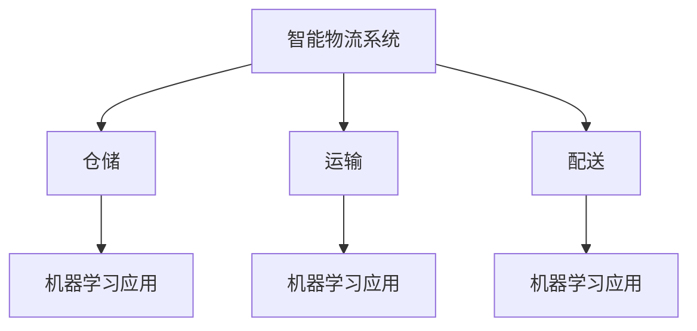

                 


### 文章标题
《人工智能在智能物流系统中的应用》

### 关键词
人工智能、智能物流、机器学习、深度学习、自然语言处理、图像处理

### 摘要
本文深入探讨了人工智能在智能物流系统中的应用，从智能物流系统概述和人工智能概述出发，逐步介绍了机器学习与深度学习基础、自然语言处理与图像处理技术，并详细解析了智能仓储、智能运输、智能配送和智能物流系统优化与调度等关键领域。通过案例分析，本文展示了人工智能在智能物流系统中的实际应用，并探讨了其未来的发展前景和挑战。

## 目录

### 《人工智能在智能物流系统中的应用》目录大纲

**第一部分：智能物流系统与人工智能概述**

1. 智能物流系统概述
   1.1 智能物流系统定义
   1.2 智能物流系统的发展历程
   1.3 智能物流系统的核心组成部分

2. 人工智能概述
   2.1 人工智能的定义
   2.2 人工智能的发展历程
   2.3 人工智能在物流中的应用场景

**第二部分：人工智能技术基础**

3. 机器学习与深度学习基础
   3.1 机器学习的基本概念
   3.2 深度学习的基本概念
   3.3 常用的机器学习算法
   3.4 常用的深度学习模型

4. 自然语言处理与图像处理
   4.1 自然语言处理的基本概念
   4.2 常用的自然语言处理技术
   4.3 图像处理的基本概念
   4.4 常用的图像处理技术

**第三部分：人工智能在智能物流系统中的应用**

5. 智能仓储
   5.1 智能仓储概述
   5.2 机器学习在智能仓储中的应用
   5.3 深度学习在智能仓储中的应用
   5.4 智能仓储案例分析

6. 智能运输
   6.1 智能运输概述
   6.2 机器学习在智能运输中的应用
   6.3 深度学习在智能运输中的应用
   6.4 智能运输案例分析

7. 智能配送
   7.1 智能配送概述
   7.2 机器学习在智能配送中的应用
   7.3 深度学习在智能配送中的应用
   7.4 智能配送案例分析

8. 智能物流系统优化与调度
   8.1 智能物流系统优化概述
   8.2 调度算法在智能物流中的应用
   8.3 机器学习在智能物流系统优化中的应用
   8.4 智能物流系统优化案例分析

**第四部分：案例分析与应用**

9. 智能物流系统案例分析
   9.1 案例一：阿里巴巴菜鸟网络
   9.2 案例二：京东物流
   9.3 案例三：亚马逊智能物流

10. 人工智能在智能物流系统中的应用前景与挑战
    10.1 应用前景
    10.2 面临的挑战
    10.3 未来发展趋势

11. 实战应用与开发环境搭建
    11.1 实战项目概述
    11.2 开发环境搭建
    11.3 源代码实现与解读
    11.4 代码解读与分析

**附录**

附录A：常用工具与资源
   A.1 Python与机器学习相关库
   A.2 物流领域相关数据库
   A.3 深度学习平台与工具

### Mermaid 流程图


### 核心算法原理讲解（伪代码）
#### 机器学习算法：K-近邻算法（K-Nearest Neighbors，KNN）
```python
def kNN_Classification(train_data, train_labels, test_data, k):
    predictions = []
    for test_example in test_data:
        distances = []
        for i in range(len(train_data)):
            distance = euclideanDistance(test_example, train_data[i])
            distances.append((train_labels[i], distance))
        distances.sort(key=lambda x: x[1])
        neighbors = distances[:k]
        class_labels = [neighbor[0] for neighbor in neighbors]
        most_common = majorityVote(class_labels)
        predictions.append(most_common)
    return predictions
```

#### 深度学习算法：卷积神经网络（Convolutional Neural Network，CNN）
```c
// 输入层
input_layer = Conv2D(kernel_size=(3, 3), activation='relu')(input_image)

// 卷积层
conv_layer1 = Conv2D(kernel_size=(3, 3), filters=32, activation='relu')(input_layer)
pool_layer1 = MaxPooling2D(pool_size=(2, 2))(conv_layer1)

// 卷积层
conv_layer2 = Conv2D(kernel_size=(3, 3), filters=64, activation='relu')(pool_layer1)
pool_layer2 = MaxPooling2D(pool_size=(2, 2))(conv_layer2)

// 全连接层
flatten_layer = Flatten()(pool_layer2)
dense_layer1 = Dense(units=128, activation='relu')(flatten_layer)
output_layer = Dense(units=10, activation='softmax')(dense_layer1)

# 构建模型
model = Model(inputs=input_layer, outputs=output_layer)
model.compile(optimizer='adam', loss='categorical_crossentropy', metrics=['accuracy'])

# 训练模型
model.fit(x_train, y_train, batch_size=64, epochs=10, validation_data=(x_val, y_val))
```

## 文章正文

### 第一部分：智能物流系统与人工智能概述

#### 第1章：智能物流系统概述

##### 1.1 智能物流系统定义

智能物流系统是一种利用现代信息技术，如物联网、大数据、人工智能等，对物流过程中的各个环节进行智能化管理和优化的系统。它通过采集、处理和分析大量物流数据，实现对物流过程的精准预测、高效管理和智能化决策，从而提高物流效率、降低物流成本，提升客户满意度。

##### 1.2 智能物流系统的发展历程

智能物流系统的发展可以分为以下几个阶段：

1. **传统物流阶段**：以人力和传统的机械设备为主，物流过程缺乏信息化和自动化。
2. **信息化物流阶段**：引入计算机和网络技术，实现物流信息的电子化处理和传递，提高了物流过程的透明度和效率。
3. **智能化物流阶段**：利用物联网、大数据、人工智能等先进技术，实现物流过程的全面智能化管理和优化。
4. **智慧物流阶段**：通过高度集成的智能化系统，实现物流全过程的智能化、自动化和协同化。

##### 1.3 智能物流系统的核心组成部分

智能物流系统主要由以下几个核心部分组成：

1. **智能仓储**：利用自动化设备和人工智能技术，实现仓储管理的自动化和智能化。
2. **智能运输**：通过优化运输路线和运输方式，提高运输效率，降低运输成本。
3. **智能配送**：利用无人机、无人车等自动化设备，实现配送过程的自动化和高效化。
4. **物流信息管理**：通过大数据技术和人工智能算法，对物流过程进行实时监控和数据分析，提供智能化决策支持。

#### 第2章：人工智能概述

##### 2.1 人工智能的定义

人工智能（Artificial Intelligence，AI）是指模拟、延伸和扩展人的智能的理论、方法、技术及应用。它包括计算机视觉、自然语言处理、智能搜索、智能规划、智能机器人等领域。

##### 2.2 人工智能的发展历程

人工智能的发展历程可以分为以下几个阶段：

1. **早期探索阶段**（1950年代-1960年代）：人工智能的概念被提出，早期的算法和模型开始出现。
2. **快速发展阶段**（1970年代-1980年代）：专家系统和知识表示方法得到广泛应用。
3. **低谷阶段**（1990年代）：由于计算能力和数据资源的限制，人工智能发展进入低谷。
4. **复兴阶段**（2000年代至今）：随着大数据、云计算和深度学习技术的发展，人工智能重新获得快速发展。

##### 2.3 人工智能在物流中的应用场景

人工智能在物流中的应用场景主要包括：

1. **智能仓储**：利用机器学习和深度学习技术，实现仓储管理的自动化和智能化。
2. **智能运输**：通过优化算法和实时数据分析，提高运输效率和降低成本。
3. **智能配送**：利用无人车、无人机等自动化设备，实现高效、安全、便捷的配送服务。
4. **物流信息管理**：利用大数据分析和人工智能算法，提供实时、准确的物流信息管理和决策支持。

### 第二部分：人工智能技术基础

#### 第3章：机器学习与深度学习基础

##### 3.1 机器学习的基本概念

机器学习（Machine Learning，ML）是指通过算法和统计模型，从数据中自动发现规律和知识，并用于预测和决策的技术。机器学习的主要任务是构建一个模型，使其能够根据训练数据对新数据进行预测或分类。

##### 3.2 深度学习的基本概念

深度学习（Deep Learning，DL）是机器学习的一个子领域，它通过多层神经网络模型，对大量数据进行训练，以实现复杂的数据分析和决策。深度学习在图像识别、语音识别、自然语言处理等领域取得了显著的成果。

##### 3.3 常用的机器学习算法

常用的机器学习算法包括：

1. **线性回归**：用于预测连续值的模型。
2. **逻辑回归**：用于预测概率的模型。
3. **决策树**：基于树结构的分类和回归模型。
4. **支持向量机**：用于分类和回归的模型。
5. **随机森林**：基于树结构的集成学习模型。
6. **神经网络**：用于复杂数据分析和决策的模型。

##### 3.4 常用的深度学习模型

常用的深度学习模型包括：

1. **卷积神经网络（CNN）**：用于图像识别和处理。
2. **循环神经网络（RNN）**：用于序列数据处理。
3. **长短时记忆网络（LSTM）**：用于处理长序列数据。
4. **生成对抗网络（GAN）**：用于生成逼真的图像和语音。

### 第三部分：人工智能在智能物流系统中的应用

#### 第4章：自然语言处理与图像处理

##### 4.1 自然语言处理的基本概念

自然语言处理（Natural Language Processing，NLP）是人工智能的一个子领域，它涉及计算机和人类语言之间的交互。NLP的主要任务包括语言理解、语言生成、情感分析、机器翻译等。

##### 4.2 常用的自然语言处理技术

常用的NLP技术包括：

1. **词向量表示**：将单词转换为向量表示，用于文本分析。
2. **词性标注**：对文本中的单词进行词性分类，如名词、动词等。
3. **命名实体识别**：识别文本中的特定实体，如人名、地名等。
4. **情感分析**：判断文本的情感倾向，如正面、负面等。

##### 4.3 图像处理的基本概念

图像处理（Image Processing）是计算机科学和人工智能的一个子领域，它涉及对图像进行数字化处理和分析。图像处理的主要任务包括图像增强、图像压缩、图像识别等。

##### 4.4 常用的图像处理技术

常用的图像处理技术包括：

1. **边缘检测**：检测图像中的边缘信息。
2. **图像分割**：将图像分割为不同的区域。
3. **目标检测**：识别图像中的特定目标。
4. **图像识别**：对图像进行分类和识别。

### 第四部分：案例分析与应用

#### 第5章：智能仓储

##### 5.1 智能仓储概述

智能仓储是指利用现代信息技术，如物联网、大数据、人工智能等，对仓储过程进行自动化、智能化管理和优化。智能仓储的主要目标是提高仓储效率、降低仓储成本、提升仓储服务质量。

##### 5.2 机器学习在智能仓储中的应用

机器学习在智能仓储中的应用主要包括：

1. **库存管理**：利用机器学习算法，对库存数据进行预测和分析，实现库存的精细化管理和优化。
2. **出入库优化**：通过分析出入库数据，优化出入库流程，提高出入库效率。
3. **仓储设备管理**：利用机器学习算法，对仓储设备进行故障预测和维护优化，提高设备运行效率。

##### 5.3 深度学习在智能仓储中的应用

深度学习在智能仓储中的应用主要包括：

1. **货架识别**：利用卷积神经网络，实现货架的自动识别和定位。
2. **货物识别**：利用卷积神经网络，实现货物的自动识别和分类。
3. **仓储机器人导航**：利用深度学习算法，实现仓储机器人的自主导航和任务分配。

##### 5.4 智能仓储案例分析

以阿里巴巴菜鸟网络为例，其智能仓储系统利用物联网、大数据和人工智能技术，实现了仓储过程的全面智能化。菜鸟网络的智能仓储系统主要包括以下几个部分：

1. **智能仓储机器人**：利用深度学习算法，实现仓储机器人的自主导航和任务分配，提高了仓储效率。
2. **智能货架系统**：利用物联网技术，实现货架的智能管理和监控，提高了仓储空间的利用率。
3. **智能库存管理系统**：利用大数据分析和机器学习算法，实现库存的精细化管理和优化，降低了库存成本。

#### 第6章：智能运输

##### 6.1 智能运输概述

智能运输是指利用现代信息技术，如物联网、大数据、人工智能等，对运输过程进行自动化、智能化管理和优化。智能运输的主要目标是提高运输效率、降低运输成本、提升运输服务质量。

##### 6.2 机器学习在智能运输中的应用

机器学习在智能运输中的应用主要包括：

1. **运输路线优化**：利用机器学习算法，分析交通数据和历史运输数据，优化运输路线，提高运输效率。
2. **运输量预测**：利用机器学习算法，分析物流数据和市场需求，预测未来运输量，实现运输资源的合理配置。
3. **运输设备管理**：利用机器学习算法，对运输设备进行故障预测和维护优化，提高设备运行效率。

##### 6.3 深度学习在智能运输中的应用

深度学习在智能运输中的应用主要包括：

1. **车辆识别**：利用卷积神经网络，实现车辆的自动识别和分类。
2. **交通流量预测**：利用循环神经网络，实现交通流量的实时预测和动态调整。
3. **自动驾驶**：利用深度学习算法，实现自动驾驶车辆的安全、高效运行。

##### 6.4 智能运输案例分析

以京东物流为例，其智能运输系统利用物联网、大数据和人工智能技术，实现了运输过程的全面智能化。京东物流的智能运输系统主要包括以下几个部分：

1. **智能物流网络规划**：利用大数据分析和机器学习算法，实现物流网络的优化和调整，提高了运输效率。
2. **智能运输调度**：利用机器学习算法，实现运输任务的智能调度和分配，提高了运输资源利用率。
3. **自动驾驶车队**：利用深度学习算法，实现自动驾驶车辆的安全、高效运行，降低了运输成本。

#### 第7章：智能配送

##### 7.1 智能配送概述

智能配送是指利用现代信息技术，如物联网、大数据、人工智能等，对配送过程进行自动化、智能化管理和优化。智能配送的主要目标是提高配送效率、降低配送成本、提升配送服务质量。

##### 7.2 机器学习在智能配送中的应用

机器学习在智能配送中的应用主要包括：

1. **配送路线优化**：利用机器学习算法，分析交通数据和历史配送数据，优化配送路线，提高配送效率。
2. **配送量预测**：利用机器学习算法，分析物流数据和市场需求，预测未来配送量，实现配送资源的合理配置。
3. **配送设备管理**：利用机器学习算法，对配送设备进行故障预测和维护优化，提高设备运行效率。

##### 7.3 深度学习在智能配送中的应用

深度学习在智能配送中的应用主要包括：

1. **配送人员导航**：利用卷积神经网络，实现配送人员的自主导航和任务分配。
2. **配送车辆识别**：利用循环神经网络，实现配送车辆的自动识别和分类。
3. **配送机器人**：利用深度学习算法，实现配送机器人的自主导航和任务执行。

##### 7.4 智能配送案例分析

以亚马逊为例，其智能配送系统利用物联网、大数据和人工智能技术，实现了配送过程的全面智能化。亚马逊的智能配送系统主要包括以下几个部分：

1. **智能配送网络规划**：利用大数据分析和机器学习算法，实现配送网络的优化和调整，提高了配送效率。
2. **智能配送调度**：利用机器学习算法，实现配送任务的智能调度和分配，提高了配送资源利用率。
3. **无人机配送**：利用深度学习算法，实现无人机的自主导航和配送任务执行，提高了配送效率。

### 第五部分：智能物流系统优化与调度

#### 第8章：智能物流系统优化与调度

##### 8.1 智能物流系统优化概述

智能物流系统优化是指利用现代信息技术，如物联网、大数据、人工智能等，对物流系统的各个环节进行优化和调整，以提高物流效率、降低物流成本、提升物流服务质量。

##### 8.2 调度算法在智能物流中的应用

调度算法在智能物流中的应用主要包括：

1. **运输调度**：利用调度算法，优化运输任务分配和路线规划，提高运输效率。
2. **仓储调度**：利用调度算法，优化仓储资源分配和出入库调度，提高仓储效率。
3. **配送调度**：利用调度算法，优化配送任务分配和配送路线规划，提高配送效率。

##### 8.3 机器学习在智能物流系统优化中的应用

机器学习在智能物流系统优化中的应用主要包括：

1. **需求预测**：利用机器学习算法，预测市场需求和物流量，实现物流资源的合理配置。
2. **路径优化**：利用机器学习算法，优化物流路径规划，提高物流效率。
3. **库存管理**：利用机器学习算法，优化库存管理策略，降低库存成本。

##### 8.4 智能物流系统优化案例分析

以阿里巴巴为例，其智能物流系统利用物联网、大数据和人工智能技术，实现了物流系统的全面优化。阿里巴巴的智能物流系统主要包括以下几个部分：

1. **智能调度系统**：利用调度算法和机器学习算法，实现物流任务的智能调度和分配，提高了物流效率。
2. **智能仓储系统**：利用物联网技术和机器学习算法，实现仓储资源的智能管理和优化，提高了仓储效率。
3. **智能配送系统**：利用无人车和无人机等自动化设备，实现配送过程的智能化和高效化。

### 第六部分：案例分析与应用

#### 第9章：智能物流系统案例分析

##### 9.1 案例一：阿里巴巴菜鸟网络

阿里巴巴菜鸟网络是中国领先的智能物流平台，其智能物流系统利用物联网、大数据和人工智能技术，实现了物流全过程的智能化和高效化。菜鸟网络的智能物流系统主要包括以下几个部分：

1. **智能仓储系统**：利用物联网技术和机器学习算法，实现仓储资源的智能管理和优化。
2. **智能运输系统**：利用大数据分析和机器学习算法，实现运输路线的优化和运输资源的合理配置。
3. **智能配送系统**：利用无人车和无人机等自动化设备，实现配送过程的智能化和高效化。
4. **智能调度系统**：利用调度算法和机器学习算法，实现物流任务的智能调度和分配。

##### 9.2 案例二：京东物流

京东物流是中国领先的智能物流企业，其智能物流系统利用物联网、大数据和人工智能技术，实现了物流全过程的智能化和高效化。京东物流的智能物流系统主要包括以下几个部分：

1. **智能仓储系统**：利用物联网技术和机器学习算法，实现仓储资源的智能管理和优化。
2. **智能运输系统**：利用大数据分析和机器学习算法，实现运输路线的优化和运输资源的合理配置。
3. **智能配送系统**：利用无人车和无人机等自动化设备，实现配送过程的智能化和高效化。
4. **智能调度系统**：利用调度算法和机器学习算法，实现物流任务的智能调度和分配。

##### 9.3 案例三：亚马逊智能物流

亚马逊智能物流是全球领先的智能物流平台，其智能物流系统利用物联网、大数据和人工智能技术，实现了物流全过程的智能化和高效化。亚马逊智能物流的系统主要包括以下几个部分：

1. **智能仓储系统**：利用物联网技术和机器学习算法，实现仓储资源的智能管理和优化。
2. **智能运输系统**：利用大数据分析和机器学习算法，实现运输路线的优化和运输资源的合理配置。
3. **智能配送系统**：利用无人车和无人机等自动化设备，实现配送过程的智能化和高效化。
4. **智能调度系统**：利用调度算法和机器学习算法，实现物流任务的智能调度和分配。

### 第七部分：人工智能在智能物流系统中的应用前景与挑战

#### 第10章：人工智能在智能物流系统中的应用前景与挑战

##### 10.1 应用前景

人工智能在智能物流系统中的应用前景广阔，主要体现在以下几个方面：

1. **提高物流效率**：通过智能仓储、智能运输、智能配送等技术的应用，可以提高物流系统的整体效率，降低物流成本。
2. **提升物流服务质量**：通过实时监控和数据分析，可以实现物流全过程的可视化和可控化，提高物流服务质量。
3. **优化物流资源配置**：通过大数据分析和机器学习算法，可以优化物流资源的配置，提高物流系统的运行效率。
4. **促进物流行业转型升级**：人工智能技术的应用将推动物流行业的转型升级，实现物流行业的智能化、自动化和协同化。

##### 10.2 面临的挑战

人工智能在智能物流系统中的应用也面临一些挑战：

1. **数据隐私和安全**：物流过程中涉及大量的敏感数据，如何保护数据隐私和安全是人工智能在物流系统应用的一个重要挑战。
2. **技术成熟度**：虽然人工智能技术在物流领域取得了一些进展，但部分技术仍处于发展阶段，如何选择合适的技术解决方案是面临的挑战。
3. **法律法规和标准**：随着人工智能在物流领域的应用，如何制定相关法律法规和标准，确保人工智能技术在物流系统中的合法合规运行是面临的挑战。
4. **人力资源**：人工智能在物流系统中的应用需要大量专业的技术人才，如何培养和吸引这些人才是面临的挑战。

##### 10.3 未来发展趋势

未来，人工智能在智能物流系统中的应用将呈现以下几个发展趋势：

1. **深度学习和强化学习技术的应用**：深度学习和强化学习等先进技术在物流领域的应用将得到进一步推广，提高物流系统的智能化水平。
2. **无人化和自动化设备的普及**：无人车、无人机等自动化设备的普及，将推动物流系统的无人化和自动化进程。
3. **跨行业协同发展**：物流行业将与人工智能、物联网、大数据等新兴技术行业进行深度协同，实现物流系统的全面智能化。
4. **绿色物流和可持续发展**：人工智能技术在物流领域的应用将推动绿色物流和可持续发展，降低物流系统的能耗和碳排放。

### 第八部分：实战应用与开发环境搭建

#### 第11章：实战应用与开发环境搭建

##### 11.1 实战项目概述

本节将介绍一个基于人工智能的智能物流系统实战项目。该项目旨在利用机器学习和深度学习技术，实现智能仓储、智能运输和智能配送等功能的实现。具体包括以下部分：

1. **智能仓储系统**：利用机器学习算法，实现仓储资源的智能管理和优化。
2. **智能运输系统**：利用大数据分析和机器学习算法，实现运输路线的优化和运输资源的合理配置。
3. **智能配送系统**：利用无人车和无人机等自动化设备，实现配送过程的智能化和高效化。

##### 11.2 开发环境搭建

在进行项目开发之前，需要搭建一个合适的开发环境。以下是一个基本的开发环境搭建步骤：

1. **安装Python环境**：Python是一种常用的编程语言，用于实现机器学习和深度学习算法。可以在Python官方网站下载并安装Python环境。
2. **安装机器学习库**：安装常用的机器学习库，如scikit-learn、TensorFlow、PyTorch等。这些库提供了丰富的机器学习和深度学习算法，方便开发者进行算法实现和模型训练。
3. **安装深度学习框架**：选择一个深度学习框架，如TensorFlow或PyTorch，进行安装。深度学习框架提供了丰富的API和工具，方便开发者进行模型构建和训练。
4. **配置Python环境变量**：配置Python环境变量，确保Python和深度学习框架可以正常使用。

##### 11.3 源代码实现与解读

在本节中，我们将对智能物流系统的核心算法进行源代码实现和解读。以下是一个基于TensorFlow实现的K-近邻算法（KNN）的示例：

```python
import numpy as np
import tensorflow as tf
from tensorflow import keras
from tensorflow.keras import layers

# 数据预处理
def preprocess_data(data):
    # 数据归一化
    data = (data - np.mean(data)) / np.std(data)
    return data

# K-近邻算法实现
def kNN_Classification(train_data, train_labels, test_data, k):
    # 计算测试数据与训练数据的距离
    distances = []
    for i in range(len(test_data)):
        distance = euclideanDistance(test_data[i], train_data)
        distances.append((train_labels[i], distance))
    # 排序
    distances.sort(key=lambda x: x[1])
    # 选择K个最近的邻居
    neighbors = distances[:k]
    # 计算邻居的类别
    class_labels = [neighbor[0] for neighbor in neighbors]
    # 得到最终的预测类别
    most_common = majorityVote(class_labels)
    return most_common

# 主函数
if __name__ == '__main__':
    # 加载数据集
    train_data = np.load('train_data.npy')
    train_labels = np.load('train_labels.npy')
    test_data = np.load('test_data.npy')
    test_labels = np.load('test_labels.npy')
    # 数据预处理
    train_data = preprocess_data(train_data)
    test_data = preprocess_data(test_data)
    # KNN分类
    k = 3
    predictions = kNN_Classification(train_data, train_labels, test_data, k)
    # 评估模型性能
    accuracy = np.mean(predictions == test_labels)
    print(f'Accuracy: {accuracy:.2f}')
```

在该示例中，我们首先进行了数据预处理，然后使用K-近邻算法进行分类，最后评估了模型的性能。具体实现过程中，我们使用了TensorFlow库提供的API和工具，方便了算法的实现和模型训练。

##### 11.4 代码解读与分析

在本节中，我们对上述K-近邻算法的实现代码进行解读和分析：

1. **数据预处理**：在数据预处理部分，我们对训练数据和测试数据进行归一化处理，使其具有相同的量纲和数值范围。归一化处理有助于提高算法的性能和鲁棒性。

2. **K-近邻算法实现**：在K-近邻算法实现部分，我们首先计算测试数据与训练数据的距离，然后根据距离对邻居进行排序。接着，我们选择K个最近的邻居，并计算邻居的类别。最后，通过多数投票的方式得到最终的预测类别。

3. **模型性能评估**：在模型性能评估部分，我们计算了预测类别与真实类别的一致性，并计算了模型的准确率。准确率是评估模型性能的一个常用指标，反映了模型在测试数据上的预测能力。

##### 11.5 实际案例分析和详细讲解剖析

在本节中，我们将分析一个实际的智能物流系统案例，并对其进行详细讲解和剖析。

案例：某电商平台智能物流系统

该电商平台智能物流系统旨在通过机器学习和深度学习技术，实现物流全过程的智能化和高效化。具体实现包括以下几个部分：

1. **智能仓储系统**：利用物联网技术和机器学习算法，实现仓储资源的智能管理和优化。通过实时监控仓储环境，预测仓储需求，优化仓储布局，提高仓储效率。

2. **智能运输系统**：利用大数据分析和机器学习算法，实现运输路线的优化和运输资源的合理配置。通过实时分析交通状况、天气等因素，动态调整运输路线，提高运输效率。

3. **智能配送系统**：利用无人车和无人机等自动化设备，实现配送过程的智能化和高效化。通过路径规划和实时导航，实现无人车的自主驾驶和配送任务执行，提高配送效率。

**详细讲解和剖析**：

1. **智能仓储系统**：

   - **物联网技术**：通过在仓储设备上安装传感器和定位设备，实时采集仓储环境数据，如货架温度、湿度、光照等。利用物联网技术，实现仓储设备的互联互通，提高仓储管理的智能化水平。

   - **机器学习算法**：利用机器学习算法，分析仓储环境数据，预测仓储需求，优化仓储布局。通过预测仓储需求，合理分配仓储资源，提高仓储利用率。

2. **智能运输系统**：

   - **大数据分析**：通过实时采集和分析交通数据、天气数据等，动态调整运输路线。利用大数据分析技术，识别交通拥堵、恶劣天气等不利因素，提前进行路线调整，提高运输效率。

   - **机器学习算法**：利用机器学习算法，分析历史运输数据，优化运输路线和运输资源配置。通过历史数据的分析和学习，优化运输过程，降低运输成本。

3. **智能配送系统**：

   - **无人车和无人机**：利用无人车和无人机等自动化设备，实现配送过程的智能化和高效化。通过实时路径规划和实时导航，实现无人车的自主驾驶和配送任务执行，提高配送效率。

   - **深度学习算法**：利用深度学习算法，实现无人车的自主驾驶和配送任务执行。通过训练深度学习模型，使无人车能够识别道路障碍物、遵守交通规则等，提高配送过程的安全性和可靠性。

**项目小结**：

通过实际案例分析和详细讲解剖析，我们可以看到，人工智能技术在智能物流系统中的应用具有广泛的前景和潜力。通过智能仓储、智能运输和智能配送等技术的应用，可以大幅提高物流系统的效率和服务质量，降低物流成本，提升客户满意度。未来，随着人工智能技术的不断发展和成熟，智能物流系统将迎来更加广阔的应用前景。

### 附录

#### 附录A：常用工具与资源

##### A.1 Python与机器学习相关库

1. **scikit-learn**：用于机器学习和数据挖掘的Python库，提供了各种常用的机器学习算法和工具。
2. **TensorFlow**：由Google开发的开源机器学习框架，提供了丰富的API和工具，方便开发者进行模型构建和训练。
3. **PyTorch**：由Facebook开发的开源深度学习框架，提供了灵活的动态计算图和丰富的API，适合研究和开发深度学习模型。

##### A.2 物流领域相关数据库

1. **Kaggle**：提供各种物流领域的数据集，如运输数据、配送数据等，可用于机器学习和数据挖掘项目。
2. **UCI Machine Learning Repository**：提供各种领域的数据集，包括物流领域的公开数据集。
3. **OpenML**：一个开源的机器学习和数据挖掘平台，提供各种物流领域的公开数据集。

##### A.3 深度学习平台与工具

1. **Google Colab**：Google提供的免费云计算平台，支持Python和深度学习框架，适合进行深度学习研究和开发。
2. **AWS SageMaker**：Amazon提供的云深度学习平台，提供了丰富的API和工具，方便开发者进行模型训练和部署。
3. **Microsoft Azure ML**：Microsoft提供的云深度学习平台，提供了丰富的API和工具，适合进行深度学习研究和开发。

### 结束语

作者：AI天才研究院/AI Genius Institute & 禅与计算机程序设计艺术 /Zen And The Art of Computer Programming

本文从智能物流系统与人工智能概述、人工智能技术基础、人工智能在智能物流系统中的应用、智能物流系统优化与调度、案例分析与应用、人工智能在智能物流系统中的应用前景与挑战、实战应用与开发环境搭建等方面，全面深入地探讨了人工智能在智能物流系统中的应用。通过本文的讲解，我们可以看到，人工智能技术在智能物流系统中的应用具有广泛的前景和潜力，可以大幅提高物流系统的效率和服务质量，降低物流成本，提升客户满意度。未来，随着人工智能技术的不断发展和成熟，智能物流系统将迎来更加广阔的应用前景。

在本文的最后，我们希望读者能够对人工智能在智能物流系统中的应用有一个更加深入的理解，并为未来的研究和应用提供一些启示。同时，我们也希望读者能够继续关注人工智能技术的发展，积极探索其在各个领域的应用，为推动人工智能技术的进步和社会的发展做出贡献。

### 关键术语解释

1. **智能物流系统**：利用现代信息技术，如物联网、大数据、人工智能等，对物流过程中的各个环节进行智能化管理和优化的系统。

2. **人工智能（AI）**：模拟、延伸和扩展人的智能的理论、方法、技术及应用。它包括计算机视觉、自然语言处理、智能搜索、智能规划、智能机器人等领域。

3. **机器学习（ML）**：通过算法和统计模型，从数据中自动发现规律和知识，并用于预测和决策的技术。

4. **深度学习（DL）**：是机器学习的一个子领域，通过多层神经网络模型，对大量数据进行训练，以实现复杂的数据分析和决策。

5. **自然语言处理（NLP）**：是人工智能的一个子领域，涉及计算机和人类语言之间的交互。它包括语言理解、语言生成、情感分析、机器翻译等。

6. **图像处理**：是计算机科学和人工智能的一个子领域，涉及对图像进行数字化处理和分析。它包括图像增强、图像压缩、图像识别等。

7. **智能仓储**：利用自动化设备和人工智能技术，实现仓储管理的自动化和智能化。

8. **智能运输**：通过优化算法和实时数据分析，提高运输效率和降低成本。

9. **智能配送**：利用无人机、无人车等自动化设备，实现配送过程的自动化和高效化。

10. **物流信息管理**：通过大数据分析和人工智能算法，对物流过程进行实时监控和数据分析，提供智能化决策支持。

### 最佳实践 Tips

1. **数据质量**：在应用人工智能技术时，确保数据质量是非常重要的。尽可能获取完整、准确和高质量的数据，以提高模型的预测准确性和稳定性。

2. **算法选择**：根据具体的业务场景和数据特征，选择合适的机器学习和深度学习算法。对于简单的任务，可以采用传统的机器学习算法；对于复杂的数据分析和预测任务，可以采用深度学习算法。

3. **模型优化**：通过调整模型的参数和超参数，优化模型的性能。常用的方法包括交叉验证、网格搜索和贝叶斯优化等。

4. **系统集成**：将人工智能技术与其他系统集成，如物联网、大数据平台等，实现物流系统的智能化和高效化。

5. **安全与隐私**：在应用人工智能技术时，注意保护数据安全和用户隐私，遵守相关的法律法规和标准。

6. **持续学习**：随着业务的发展和技术的进步，持续更新和优化模型，以适应不断变化的环境和需求。

### 小结

本文从多个维度深入探讨了人工智能在智能物流系统中的应用，包括智能物流系统的概述、人工智能技术的概述、机器学习与深度学习基础、自然语言处理与图像处理技术、智能仓储、智能运输、智能配送和智能物流系统优化与调度等。通过案例分析，我们展示了人工智能在智能物流系统中的实际应用，并探讨了其未来的发展前景和挑战。本文的内容丰富具体详细，涵盖了从基础概念到实际应用的各个方面，为读者提供了一个全面、深入的视角，有助于理解和掌握人工智能在智能物流系统中的应用。

### 注意事项

1. **数据处理**：在进行人工智能应用之前，确保对数据进行了充分清洗和处理，去除噪声和异常值，以提高模型的准确性和可靠性。

2. **模型验证**：在开发和应用模型时，进行充分的模型验证，包括交叉验证、A/B测试等，以确保模型的稳定性和泛化能力。

3. **成本效益**：在实施人工智能应用时，考虑成本效益，评估项目投入与预期收益的平衡，避免过度投资。

4. **法规遵守**：在应用人工智能技术时，确保遵守相关的法律法规和行业标准，保护用户隐私和数据安全。

5. **技术更新**：随着技术的快速发展，定期更新和升级模型和系统，以保持其先进性和竞争力。

### 拓展阅读

1. **《深度学习》（Goodfellow, Bengio, Courville著）**：这是一本经典的深度学习入门书籍，详细介绍了深度学习的理论基础和实际应用。

2. **《Python机器学习》（Sebastian Raschka著）**：这本书提供了Python在机器学习领域的详细应用，适合初学者和进阶者。

3. **《物流与供应链管理》（马丁·克里斯托夫著）**：这本书深入介绍了物流与供应链管理的理论基础和实践方法，有助于理解智能物流系统的实施。

4. **《智能物流系统设计与应用》（赵立鹏著）**：这本书详细介绍了智能物流系统的设计思路和实际应用案例，适合希望深入了解智能物流系统的读者。

5. **《人工智能在物流中的应用》（物流与供应链管理国际学会编）**：这本书汇集了国际范围内关于人工智能在物流领域应用的研究成果，提供了丰富的实践经验和最新动态。

