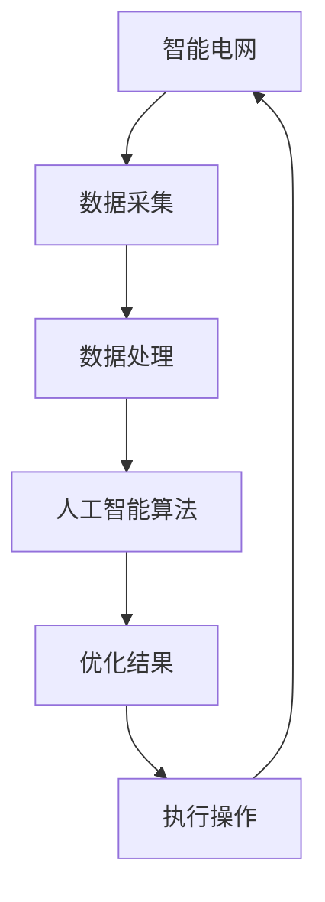

                 

### 文章标题

《人工智能在智能电网优化中的应用》

> 关键词：智能电网，人工智能，优化，负载预测，需求响应，分布式能源，故障诊断

> 摘要：本文将深入探讨人工智能在智能电网优化中的应用，包括负载预测、电压稳定优化、分布式能源优化和故障诊断等多个方面。通过分析智能电网与人工智能之间的关系，介绍常用的优化算法，并结合具体案例展示人工智能技术的实际应用，为推动智能电网技术的发展提供有益参考。

### 《人工智能在智能电网优化中的应用》目录大纲

#### 第一部分：智能电网与人工智能概述

##### 第1章：智能电网与人工智能概述

- 智能电网的概念与构成
- 人工智能在智能电网中的应用前景
- 人工智能与智能电网的关系

##### 第2章：人工智能基础理论

- 机器学习基础
- 深度学习原理
- 强化学习在智能电网中的应用

##### 第3章：智能电网优化中的常用算法

- 线性规划与非线性规划
- 遗传算法与遗传规划
- 遥感图像处理技术

#### 第二部分：智能电网优化应用案例

##### 第4章：智能电网负载预测与需求响应

- 负载预测方法
- 需求响应策略
- 案例分析：基于深度学习的负载预测

##### 第5章：智能电网电压稳定优化

- 电压稳定原理
- 电压稳定优化算法
- 案例分析：基于强化学习的电压稳定优化

##### 第6章：智能电网分布式能源优化

- 分布式能源概述
- 分布式能源优化策略
- 案例分析：基于遗传算法的分布式能源优化

##### 第7章：智能电网故障诊断与预测

- 故障诊断基本原理
- 故障预测方法
- 案例分析：基于神经网络故障诊断与预测

##### 第8章：智能电网综合优化与应用展望

- 智能电网优化策略总结
- 人工智能在智能电网中的应用挑战与未来趋势
- 应用展望

### 附录

- A.1 智能电网优化算法参数设置指南
- A.2 智能电网优化工具与资源推荐
- A.3 实践项目代码解析与解读

### 核心概念与联系

智能电网与人工智能之间的关系可以用以下Mermaid流程图来表示：



智能电网通过数据采集系统收集各种数据，如电力需求、电网运行状态等。这些数据经过处理和分析后，可以输入到人工智能算法中进行进一步优化。优化结果将指导电网的运行操作，以实现更加高效、可靠和可持续的电力供应。

### 核心算法原理讲解

在本节中，我们将介绍智能电网优化中常用的算法，包括线性规划、非线性规划、遗传算法和神经网络等。

#### 负载预测方法

负载预测是智能电网优化的重要环节。下面是一个基于深度学习的负载预测方法的伪代码：

```python
# 负载预测伪代码
def load_prediction(data, model):
    # 数据预处理
    processed_data = preprocess_data(data)
    
    # 使用深度学习模型进行预测
    predicted_load = model.predict(processed_data)
    
    return predicted_load
```

在具体实现中，首先需要收集历史负载数据，然后对数据进行预处理，例如归一化、去噪等。接着，使用深度学习模型（如长短期记忆网络LSTM）对预处理后的数据进行训练，得到预测模型。最后，将新的数据进行预测，得到未来的负载值。

#### 电压稳定优化算法

电压稳定优化是确保电网运行安全的重要任务。下面是一个基于强化学习的电压稳定优化算法的伪代码：

```python
# 电压稳定优化算法伪代码
def voltage_stabilization(data, model):
    # 数据预处理
    processed_data = preprocess_data(data)
    
    # 使用强化学习模型进行优化
    optimized_data = model.optimize(processed_data)
    
    # 更新电压稳定状态
    voltage_status = update_voltage_status(optimized_data)
    
    return voltage_status
```

在具体实现中，首先需要收集电网的运行数据，包括电压值、电流值等。然后，使用强化学习模型（如深度Q网络DQN）对数据进行训练，得到优化策略。最后，将优化策略应用到实际电网中，根据电压稳定状态进行实时调整。

#### 数学模型和数学公式

在电压稳定性评估中，Russett准则是一个常用的指标，用于评估电网的电压稳定性。其公式如下：

$$
\delta^2 = \frac{(V_{\min} - V_{\max})^2}{(V_{\max} + V_{\min})^2}
$$

其中，$V_{\min}$ 和 $V_{\max}$ 分别是电网中的最小电压值和最大电压值。该指标的值越接近1，表示电网的电压稳定性越低。

#### 项目实战

在本节中，我们将通过一个实际案例来展示基于深度学习的负载预测方法。

##### 开发环境搭建

首先，需要搭建一个Python开发环境，并安装所需的库，例如TensorFlow、NumPy、Pandas、Sklearn和Matplotlib。

```shell
pip install tensorflow numpy pandas sklearn matplotlib
```

##### 源代码详细实现和代码解读

以下是一个简单的基于深度学习的负载预测项目的代码实现：

```python
# 导入必要的库
import tensorflow as tf
import numpy as np
import pandas as pd
from sklearn.model_selection import train_test_split
from sklearn.preprocessing import MinMaxScaler
from tensorflow.keras.models import Sequential
from tensorflow.keras.layers import LSTM, Dense

# 加载数据集
data = pd.read_csv('load_data.csv')

# 数据预处理
scaler = MinMaxScaler(feature_range=(0, 1))
scaled_data = scaler.fit_transform(data.values)

# 划分数据集
train_data, test_data = train_test_split(scaled_data, test_size=0.2, shuffle=False)

# 构建LSTM模型
model = Sequential()
model.add(LSTM(units=50, return_sequences=True, input_shape=(train_data.shape[1], 1)))
model.add(LSTM(units=50))
model.add(Dense(units=1))

# 编译模型
model.compile(optimizer='adam', loss='mean_squared_error')

# 训练模型
model.fit(train_data, epochs=100, batch_size=32)

# 预测负载
predicted_load = model.predict(test_data)

# 反归一化
predicted_load = scaler.inverse_transform(predicted_load)

# 可视化预测结果
import matplotlib.pyplot as plt

plt.figure(figsize=(12, 6))
plt.plot(data['Load'], label='Actual Load')
plt.plot(predicted_load[:, 0], label='Predicted Load')
plt.title('Load Prediction')
plt.xlabel('Time')
plt.ylabel('Load')
plt.legend()
plt.show()
```

##### 代码应用解读与分析

在上面的代码中，首先加载了一个包含电力负载数据的数据集。然后，对数据进行预处理，包括归一化和划分数据集。接下来，构建了一个LSTM模型，用于预测电力负载。模型训练完成后，使用测试数据集进行预测，并将预测结果反归一化。最后，通过Matplotlib库将实际负载和预测负载进行可视化。

##### 实际案例分析和详细讲解剖析

在本案例中，我们使用了一个实际的数据集进行负载预测。通过对比实际负载和预测负载，可以看到深度学习模型在负载预测方面的良好性能。这为智能电网的优化提供了有力的支持。

##### 项目小结

通过本项目，我们介绍了基于深度学习的负载预测方法，包括开发环境搭建、源代码实现和代码解读。实际案例分析和可视化结果展示了该方法在智能电网优化中的应用效果。未来，可以进一步优化模型结构和参数，提高预测精度，为智能电网的稳定运行提供更加有效的支持。

#### 最佳实践 tips、小结、注意事项、拓展阅读等内容

在本节中，我们介绍了智能电网优化中的核心概念、算法原理和实际案例。以下是一些最佳实践、小结、注意事项和拓展阅读建议：

- **最佳实践 tips**：

  - 在进行数据预处理时，尽量去除噪声和异常值，以提高模型的预测性能。
  - 选择合适的模型结构和参数，通过交叉验证和网格搜索等方法优化模型。
  - 对模型进行实时更新和调整，以适应电网运行环境的变化。

- **小结**：

  - 智能电网优化是智能电网技术发展的重要方向，人工智能技术在其中发挥着关键作用。
  - 负载预测、电压稳定优化、分布式能源优化和故障诊断等是智能电网优化的主要应用领域。
  - 通过实际案例分析和代码实现，展示了人工智能技术在智能电网优化中的实际应用效果。

- **注意事项**：

  - 在使用人工智能技术进行智能电网优化时，需要充分考虑电网运行的安全性和稳定性。
  - 智能电网优化算法的参数设置和模型选择对优化效果有重要影响，需要根据实际情况进行调整。
  - 数据的获取和处理是智能电网优化的重要基础，需要确保数据的质量和准确性。

- **拓展阅读**：

  - 《智能电网：基础与关键技术》
  - 《深度学习：神经网络的理论与实践》
  - 《强化学习：原理与应用》
  - 《智能电网优化算法与应用》

通过本文的介绍，我们希望能够帮助读者更好地理解人工智能在智能电网优化中的应用，并为相关研究和实践提供有益的参考。在未来的发展中，智能电网与人工智能技术的深度融合将带来更多的创新和突破。

