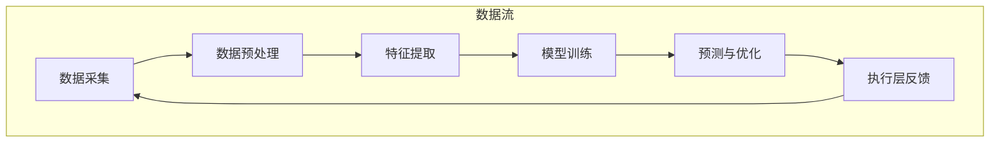

                 

# 文章标题

《人工智能在智能能源管理中的应用》

> 关键词：智能能源管理、人工智能、机器学习、深度学习、强化学习

> 摘要：本文将探讨人工智能在智能能源管理中的广泛应用和深远影响，通过详细分析人工智能的核心概念、智能能源管理系统的架构以及核心算法，揭示其在能源领域的巨大潜力。本文还将通过案例研究，展示人工智能在智能电网中的应用，并展望其未来的发展方向。

## 《人工智能在智能能源管理中的应用》目录大纲

### 第一部分：概述与背景

#### 第1章：智能能源管理简介

1.1 智能能源管理的基本概念

1.2 智能能源管理的目标和挑战

#### 第2章：人工智能在能源领域的应用背景

2.1 人工智能的发展历程

2.2 人工智能在能源领域的应用现状

2.3 人工智能在能源管理中的潜力

### 第二部分：核心概念与原理

#### 第3章：人工智能基础

3.1 机器学习基本概念

3.2 深度学习基础

3.3 神经网络架构

#### 第4章：智能能源管理系统架构

4.1 智能能源管理系统的组成部分

4.2 智能能源管理系统的数据流

4.3 智能能源管理系统的核心算法

#### 第5章：数据采集与预处理

5.1 数据采集

5.2 数据预处理

5.3 数据可视化

### 第三部分：核心算法与应用

#### 第6章：机器学习在智能能源管理中的应用

6.1 机器学习在负荷预测中的应用

6.2 机器学习在设备故障诊断中的应用

6.3 机器学习在能效优化中的应用

#### 第7章：深度学习在智能能源管理中的应用

7.1 深度学习在能效管理中的应用

7.2 深度学习在需求响应中的应用

7.3 深度学习在分布式能源管理中的应用

#### 第8章：强化学习在智能能源管理中的应用

8.1 强化学习基本概念

8.2 强化学习在能源调度中的应用

8.3 强化学习在需求响应中的应用

#### 第9章：案例研究：智能电网中的AI应用

9.1 智能电网中的AI应用案例介绍

9.2 案例一：负荷预测与调度

9.3 案例二：分布式能源管理

### 第四部分：展望与挑战

#### 第10章：人工智能在智能能源管理中的未来发展方向

10.1 人工智能在智能能源管理中的发展趋势

10.2 人工智能在智能能源管理中的潜在挑战

10.3 未来研究方向

#### 第11章：智能能源管理与可持续能源

11.1 智能能源管理与可持续能源的关系

11.2 智能能源管理在实现碳中和中的作用

11.3 可持续能源的未来展望

#### 附录：AI在智能能源管理中的资源与工具

A.1.1 数据集与开源代码

A.1.2 工具与环境

A.1.3 相关组织与研究机构

---

### 第1章：智能能源管理简介

#### 1.1.1 智能能源管理的基本概念

智能能源管理是一种综合运用信息技术、物联网、大数据分析以及人工智能等先进技术，实现对能源系统的智能监控、优化调度、预测和自适应管理的方法。其核心目的是提高能源利用效率，降低能源消耗，实现能源系统的安全、稳定和可持续发展。

智能能源管理的基本概念可以概括为以下几点：

1. **自动化与智能化**：通过自动化设备、智能传感器和控制系统，实现对能源设备的自动监控和智能调度，减少人工干预，提高能源系统的运行效率。

2. **数据驱动**：通过大数据分析和机器学习算法，对能源系统的运行数据进行深度挖掘和分析，预测能源需求、优化能源配置，实现精准管理。

3. **系统集成**：将分布式能源系统、储能系统、电网、用户设备等各个组成部分进行系统集成，实现能源系统的整体优化和协同运作。

4. **灵活性与适应性**：智能能源管理系统能够根据环境变化和用户需求，自动调整能源供应策略，实现灵活的能源管理。

#### 1.1.2 智能能源管理的目标和挑战

智能能源管理的目标主要包括：

1. **提高能源效率**：通过智能监控和优化调度，降低能源损耗，提高能源利用率。

2. **降低能源成本**：通过预测能源需求和优化能源配置，减少能源浪费，降低能源采购和运营成本。

3. **增强能源系统的稳定性**：通过智能预测和自适应管理，提高能源系统的稳定性和可靠性，减少能源供应中断的风险。

4. **促进能源可持续发展**：通过优化能源利用和减少碳排放，实现能源的绿色发展和可持续发展。

然而，智能能源管理也面临一些挑战：

1. **数据质量问题**：智能能源管理系统依赖于大量的实时数据，数据质量直接影响系统的性能和准确性。

2. **系统集成难度**：智能能源管理系统涉及多种技术、设备和系统，系统集成难度较大。

3. **技术不确定性**：人工智能技术在能源管理中的应用仍处于探索阶段，技术的不确定性对系统实施带来挑战。

4. **政策和法规限制**：智能能源管理的发展受到政策和法规的制约，需要政策支持和法规完善。

#### 1.1.3 智能能源管理的发展历程

智能能源管理的发展历程可以分为以下几个阶段：

1. **传统能源管理阶段**：主要依靠人工监测和手动操作，能源利用效率较低，能源浪费严重。

2. **自动化能源管理阶段**：引入自动化设备和传感器，实现对能源系统的自动监控和调度，提高能源利用效率。

3. **智能能源管理阶段**：结合大数据分析、机器学习和人工智能技术，实现对能源系统的智能监控、预测和优化，实现高度自动化和智能化管理。

4. **集成能源管理阶段**：将分布式能源系统、储能系统、电网等集成到一个统一的平台上，实现能源系统的整体优化和协同运作。

#### 1.1.4 智能能源管理的应用场景

智能能源管理在以下应用场景中具有显著的优势：

1. **电力系统**：通过智能电网技术和人工智能算法，实现对电力需求的预测、优化和调度，提高电网的稳定性和可靠性。

2. **工业能源管理**：通过智能传感器和大数据分析，实现对工业生产过程中的能源消耗进行实时监控和优化，降低能源成本。

3. **楼宇能源管理**：通过智能楼宇管理系统，实现对楼宇内各类设备的能源消耗进行智能监控和优化，提高能源利用效率。

4. **交通能源管理**：通过智能交通管理系统，实现对交通流量、能源消耗的预测和优化，提高交通效率，减少能源浪费。

5. **可再生能源管理**：通过智能能源管理系统，实现对太阳能、风能等可再生能源的高效利用和管理，促进可再生能源的发展。

### 第2章：人工智能在能源领域的应用背景

#### 2.1.1 人工智能的发展历程

人工智能（Artificial Intelligence，AI）是一门研究、开发和应用使计算机模拟、延伸和扩展人的智能的理论、方法、技术和应用的科学技术。人工智能的发展历程可以分为以下几个阶段：

1. **早期探索阶段（20世纪50-60年代）**：人工智能的概念被提出，以图灵测试作为衡量机器智能的标准。

2. **繁荣与衰退阶段（20世纪70-80年代）**：人工智能领域经历了短暂的繁荣，但随着计算能力的限制和算法的局限，人工智能研究进入低谷期。

3. **复兴与发展阶段（20世纪90年代至今）**：随着计算机技术的飞速发展和大数据、云计算等新技术的应用，人工智能进入了一个新的发展阶段，取得了一系列突破性成果。

#### 2.1.2 人工智能在能源领域的应用现状

人工智能在能源领域的应用已经取得了显著成果，主要表现在以下几个方面：

1. **电力系统**：人工智能在电力系统的负荷预测、电网调度、故障诊断等方面发挥着重要作用。例如，通过机器学习算法进行负荷预测，提高电网的调度效率；利用深度学习算法进行故障诊断，提高电网的稳定性和可靠性。

2. **可再生能源**：人工智能在可再生能源的管理和优化中具有广泛应用。例如，通过机器学习算法进行太阳能发电量的预测，优化太阳能发电系统的运行；利用深度学习算法进行风力发电的预测和优化，提高风力发电的效率。

3. **工业能源管理**：人工智能在工业能源管理中，通过对生产过程中的能源消耗进行实时监控和优化，提高能源利用效率，降低能源成本。例如，通过机器学习算法进行设备故障预测，减少设备停机时间，降低能源浪费。

4. **楼宇能源管理**：人工智能在楼宇能源管理中，通过对楼宇内各类设备的能源消耗进行智能监控和优化，提高能源利用效率。例如，通过深度学习算法进行室内温度控制，实现节能降耗。

5. **交通能源管理**：人工智能在交通能源管理中，通过对交通流量、能源消耗的预测和优化，提高交通效率，减少能源浪费。例如，通过机器学习算法进行交通流量预测，优化交通信号控制，减少交通拥堵。

#### 2.1.3 人工智能在能源管理中的潜力

人工智能在能源管理中的潜力主要体现在以下几个方面：

1. **提高能源利用效率**：通过大数据分析和机器学习算法，实现对能源系统的深度挖掘和分析，优化能源配置和调度，提高能源利用效率。

2. **降低能源成本**：通过预测能源需求和优化能源供应，减少能源浪费，降低能源采购和运营成本。

3. **增强能源系统的稳定性**：通过智能预测和自适应管理，提高能源系统的稳定性和可靠性，减少能源供应中断的风险。

4. **促进能源可持续发展**：通过优化能源利用和减少碳排放，实现能源的绿色发展和可持续发展。

5. **创新能源管理模式**：人工智能技术为能源管理带来全新的管理模式，实现能源系统的自动化、智能化和集成化。

### 第3章：人工智能基础

#### 3.1 机器学习基本概念

机器学习（Machine Learning，ML）是一门人工智能（AI）的分支，主要研究如何让计算机从数据中自动学习，从而获得对数据的理解和预测能力。机器学习的基本概念包括：

1. **模型**：机器学习中的模型是指计算机程序，用于对数据进行分析和预测。模型可以通过训练数据集进行训练，然后对新的数据进行预测。

2. **特征**：特征是指数据中的某一属性或指标，用于描述数据的特征。特征提取是机器学习中的重要环节，通过对数据进行特征提取，可以提取出对预测任务有帮助的信息。

3. **训练数据**：训练数据是指用于训练模型的数据集。训练数据的质量直接影响模型的效果。

4. **测试数据**：测试数据是指用于评估模型效果的数据集。测试数据与训练数据独立，用于验证模型的泛化能力。

5. **损失函数**：损失函数是衡量模型预测结果与真实结果之间差异的函数。在训练过程中，通过最小化损失函数，可以提高模型的预测准确性。

6. **优化算法**：优化算法是指用于调整模型参数，使模型性能最优的算法。常见的优化算法包括梯度下降、随机梯度下降等。

7. **模型评估**：模型评估是指通过测试数据集，评估模型的预测性能。常见的评估指标包括准确率、召回率、F1值等。

#### 3.2 深度学习基础

深度学习（Deep Learning，DL）是机器学习的一种方法，通过构建多层神经网络，实现对复杂数据的自动特征提取和表示。深度学习的基础概念包括：

1. **神经网络**：神经网络（Neural Network，NN）是一种模仿生物神经系统的计算模型。神经网络由多个神经元（节点）组成，通过前向传播和反向传播，实现数据的自动特征提取和分类。

2. **卷积神经网络（CNN）**：卷积神经网络是一种专门用于处理图像数据的神经网络。通过卷积层、池化层和全连接层，实现对图像数据的自动特征提取和分类。

3. **循环神经网络（RNN）**：循环神经网络是一种专门用于处理序列数据的神经网络。通过隐藏状态和循环连接，实现对序列数据的自动特征提取和预测。

4. **长短时记忆网络（LSTM）**：长短时记忆网络是一种改进的循环神经网络，通过引入门控机制，解决循环神经网络在处理长序列数据时出现的长期依赖问题。

5. **生成对抗网络（GAN）**：生成对抗网络是一种通过对抗性训练生成复杂数据的神经网络。由生成器和判别器组成，生成器生成数据，判别器判断数据真实性，通过优化生成器和判别器的参数，生成高质量的数据。

#### 3.3 神经网络架构

神经网络架构是指神经网络的层次结构和连接方式。常见的神经网络架构包括：

1. **单层感知机**：单层感知机是一种最简单的神经网络，由一个输入层和一个输出层组成，用于实现二分类任务。

2. **多层感知机（MLP）**：多层感知机是在单层感知机的基础上，增加一个或多个隐藏层，用于实现多分类任务。

3. **卷积神经网络（CNN）**：卷积神经网络是一种专门用于图像识别的神经网络，由卷积层、池化层和全连接层组成。

4. **循环神经网络（RNN）**：循环神经网络是一种专门用于处理序列数据的神经网络，由输入层、隐藏层和输出层组成。

5. **长短时记忆网络（LSTM）**：长短时记忆网络是一种改进的循环神经网络，通过引入门控机制，解决循环神经网络在处理长序列数据时出现的长期依赖问题。

6. **生成对抗网络（GAN）**：生成对抗网络是一种通过对抗性训练生成复杂数据的神经网络，由生成器和判别器组成。

### 第4章：智能能源管理系统架构

#### 4.1 智能能源管理系统的组成部分

智能能源管理系统（Smart Energy Management System，SEMS）由多个组成部分构成，主要包括：

1. **数据采集层**：数据采集层负责从各种能源设备、传感器和监测系统中收集数据。数据采集层包括智能传感器、智能电表、智能设备等。

2. **通信层**：通信层负责将数据采集层收集的数据传输到数据处理层。通信层通常采用有线或无线通信方式，如Wi-Fi、蓝牙、ZigBee等。

3. **数据处理层**：数据处理层负责对采集到的数据进行分析和处理，实现对能源系统的实时监控、预测和优化。数据处理层通常包括服务器、云计算平台、边缘计算设备等。

4. **决策层**：决策层负责根据数据处理层的分析结果，制定能源供应策略和调度方案，实现对能源系统的自动控制和优化。决策层通常包括智能算法、优化器、控制算法等。

5. **执行层**：执行层负责将决策层的调度方案和供应策略付诸实施，实现对能源设备的自动控制和调节。执行层包括智能电网设备、分布式能源系统、储能设备等。

#### 4.2 智能能源管理系统的数据流

智能能源管理系统的数据流主要包括以下几个环节：

1. **数据采集**：数据采集层从各种能源设备、传感器和监测系统中收集数据，如电力消耗、温度、湿度、光照强度等。

2. **数据传输**：通信层将采集到的数据传输到数据处理层。数据传输过程中，可采用有线或无线通信方式，如Wi-Fi、蓝牙、ZigBee等。

3. **数据处理**：数据处理层对传输过来的数据进行预处理、分析和预测，如数据清洗、特征提取、负荷预测、能效分析等。

4. **数据存储**：数据处理后的数据存储到数据库或数据仓库中，用于后续的数据分析和决策支持。

5. **数据可视化**：将处理后的数据通过图表、报表等形式展示给用户，帮助用户了解能源系统的运行状态和优化效果。

6. **决策与控制**：根据数据处理结果，决策层制定能源供应策略和调度方案，实现对能源设备的自动控制和调节。

7. **执行与反馈**：执行层根据决策层的调度方案和供应策略，对能源设备进行自动控制和调节，并实时反馈执行结果，为下一轮决策提供依据。

#### 4.3 智能能源管理系统的核心算法

智能能源管理系统的核心算法主要包括：

1. **机器学习算法**：用于对采集到的能源数据进行预测、分类和优化。常见的机器学习算法有线性回归、决策树、支持向量机、神经网络等。

2. **深度学习算法**：用于处理复杂数据和图像，实现对能源系统的自动特征提取和分类。常见的深度学习算法有卷积神经网络（CNN）、循环神经网络（RNN）、长短时记忆网络（LSTM）等。

3. **优化算法**：用于制定能源供应策略和调度方案，优化能源配置和调度。常见的优化算法有线性规划、整数规划、遗传算法、粒子群优化等。

4. **控制算法**：用于对能源设备进行自动控制和调节，实现能源系统的稳定运行。常见的控制算法有PID控制、模糊控制、自适应控制等。

5. **智能规划算法**：用于制定长期能源规划，实现能源系统的可持续发展。常见的智能规划算法有遗传算法、模拟退火、粒子群优化等。

### 第5章：数据采集与预处理

#### 5.1 数据采集

数据采集是智能能源管理系统（SEMS）的核心环节之一。有效的数据采集可以确保系统能够准确地捕捉能源系统的动态变化，从而进行准确的预测和优化。以下是一些关键的数据采集要点：

1. **数据源**：数据采集可以从多个来源获取，包括电力设备、传感器、智能电表、气象站、能源管理系统等。常见的数据源有：
   - **电力设备**：发电设备、变压器、配电设备、电池储能系统等。
   - **传感器**：温度传感器、湿度传感器、光照传感器、风速传感器等。
   - **智能电表**：用于记录电力消耗的数据。
   - **气象站**：提供气象数据，如温度、湿度、风速、云量等。

2. **采集频率**：数据采集的频率取决于应用场景和需求。例如，对于实时监控，可能需要高频（如秒级或分钟级）的数据采集；对于长期趋势分析，可能需要低频（如小时级或天级）的数据采集。

3. **数据格式**：数据采集应确保数据格式的一致性和标准化，以便后续的数据处理和分析。常见的数据格式包括CSV、JSON、XML等。

4. **数据安全**：在数据采集过程中，应确保数据的安全性和隐私性，防止数据泄露和未经授权的访问。

5. **冗余与故障检测**：通过多源数据的冗余和对比，可以检测数据采集过程中的故障和异常，确保数据的质量和可靠性。

#### 5.2 数据预处理

数据预处理是数据采集后的一项重要步骤，其目的是提高数据的质量，为后续的分析和建模提供可靠的数据基础。以下是一些关键的数据预处理步骤：

1. **数据清洗**：数据清洗是指识别并处理数据集中的错误、异常和冗余数据。常见的数据清洗操作包括：
   - **缺失值处理**：对于缺失的数据，可以通过插值、平均值填充、中值填充等方法进行处理。
   - **异常值处理**：识别并处理异常值，可以通过统计方法（如Z分数、IQR方法）或专家规则进行处理。
   - **重复值处理**：去除数据集中的重复记录，确保数据的一致性和唯一性。

2. **数据转换**：数据转换是指将数据转换为适合分析和建模的格式。常见的数据转换操作包括：
   - **标准化**：通过缩放或变换，将数据映射到统一的范围，如0到1或-1到1。
   - **归一化**：通过除以数据的最大值或最小值，将数据映射到特定的范围。
   - **编码**：对于分类数据，可以通过独热编码、标签编码等方法进行转换。

3. **特征提取**：特征提取是指从原始数据中提取出对模型训练有显著影响的关键特征。常见的方法包括：
   - **统计特征**：计算数据的均值、方差、标准差等统计指标。
   - **时序特征**：提取时序数据的周期性、趋势性等特征。
   - **空间特征**：提取空间数据的相关性、密度等特征。

4. **数据可视化**：通过数据可视化，可以直观地展示数据的特点和趋势，帮助数据分析师理解数据，发现潜在的规律和问题。常见的数据可视化工具包括Matplotlib、Seaborn、Plotly等。

#### 5.3 数据可视化

数据可视化是数据预处理后的一项重要步骤，它通过图形化的方式展示数据，帮助分析师和决策者理解数据的内在关系和趋势。以下是一些关键的数据可视化要点：

1. **图表类型**：根据数据的特性和分析需求，选择合适的图表类型。常见的图表类型包括：
   - **折线图**：用于展示数据的变化趋势。
   - **柱状图**：用于对比不同数据集之间的差异。
   - **饼图**：用于展示数据的占比情况。
   - **散点图**：用于展示数据之间的关系和分布。
   - **热力图**：用于展示数据的分布和相关性。

2. **交互性**：交互性数据可视化允许用户通过鼠标点击、拖动等方式与数据图表进行交互，从而更深入地探索数据。常见的交互性工具包括D3.js、Plotly、Bokeh等。

3. **实时更新**：对于实时监控系统，数据可视化应能够实时更新，以反映最新的数据状态。

4. **注释与标注**：在数据可视化过程中，可以添加注释和标注，帮助用户理解数据的含义和来源。

5. **可视化工具**：选择合适的数据可视化工具，如Matplotlib、Seaborn、Plotly等，可以根据需求进行自定义和扩展。

### 第6章：机器学习在智能能源管理中的应用

#### 6.1 机器学习在负荷预测中的应用

负荷预测是智能能源管理中的重要任务，通过预测未来的电力需求，可以优化能源调度，提高能源利用效率，降低能源成本。机器学习在负荷预测中的应用主要包括以下几个方面：

1. **时间序列分析**：时间序列分析是一种常见的方法，用于预测未来的电力需求。时间序列分析的关键在于捕捉数据中的周期性、趋势性和季节性。

   - **移动平均法**：通过计算数据的平均值，平滑时间序列数据，去除短期波动。
   - **指数平滑法**：在移动平均法的基础上，引入指数权重，使得最近的数据权重更大。
   - **ARIMA模型**：自回归积分滑动平均模型（ARIMA）是一种经典的时序预测模型，通过自回归、差分和移动平均三个步骤，对时间序列数据进行建模。

2. **机器学习方法**：机器学习方法可以更精确地捕捉时间序列数据中的复杂模式，提高预测准确性。

   - **线性回归**：通过建立线性模型，预测未来的电力需求。线性回归模型简单易用，但在处理非线性数据时效果较差。
   - **决策树**：通过树形结构，将数据划分为不同的区域，预测每个区域的电力需求。决策树可以捕捉数据中的非线性关系，但在处理大量数据时性能较差。
   - **随机森林**：随机森林是一种基于决策树的集成学习方法，通过构建多棵决策树，并对预测结果进行投票，提高预测的准确性。
   - **神经网络**：神经网络是一种基于多层感知机的模型，通过多层神经元的连接，实现对数据的高效特征提取和预测。神经网络在处理复杂数据时具有强大的能力，但在训练过程中需要大量的数据和计算资源。

3. **深度学习方法**：深度学习方法是近年来在负荷预测中应用较多的一种方法，通过构建多层神经网络，实现对时间序列数据的深度特征提取和预测。

   - **长短时记忆网络（LSTM）**：LSTM是一种改进的循环神经网络，通过引入门控机制，解决循环神经网络在处理长序列数据时出现的长期依赖问题。LSTM在负荷预测中表现出色，可以捕捉数据中的周期性和趋势性。
   - **卷积神经网络（CNN）**：CNN是一种专门用于图像识别的神经网络，但在负荷预测中，也可以通过处理时间序列数据的时频表示，实现对负荷的精准预测。
   - **生成对抗网络（GAN）**：GAN是一种基于对抗性训练的神经网络，通过生成器和判别器的竞争，生成高质量的数据，用于负荷预测。

4. **案例研究**：以一个智能电网为例，介绍如何使用机器学习方法进行负荷预测。

   - **数据集**：收集过去一周的电力负荷数据，包括小时级别的电力消耗和相关的气象数据。
   - **数据预处理**：对数据进行清洗、归一化和特征提取，将数据分为训练集和测试集。
   - **模型选择**：选择LSTM模型进行训练，通过交叉验证调整模型参数。
   - **模型训练**：使用训练集训练LSTM模型，并使用测试集进行验证，评估模型性能。
   - **结果分析**：对比预测结果和实际负荷数据，分析预测误差和模型的准确性。

通过以上案例，可以看到机器学习在负荷预测中的应用，可以提高预测的准确性，为智能能源管理提供有力支持。

#### 6.2 机器学习在设备故障诊断中的应用

设备故障诊断是智能能源管理系统中的另一个关键任务，通过及时发现和处理设备故障，可以减少设备停机时间，降低运维成本，提高能源系统的可靠性和稳定性。机器学习在设备故障诊断中的应用主要包括以下几个方面：

1. **异常检测**：异常检测是一种常见的设备故障诊断方法，通过检测数据中的异常值或异常模式，识别潜在的设备故障。

   - **基于统计的方法**：通过计算数据的统计特征，如均值、方差、标准差等，识别异常值。这种方法简单有效，但在处理非线性数据时效果较差。
   - **基于距离的方法**：通过计算数据与正常数据的距离，识别异常数据。常见的方法有K最近邻（K-NN）和支持向量机（SVM）等。
   - **基于模型的方法**：通过建立正常数据和故障数据的模型，识别异常数据。常见的方法有决策树、随机森林和神经网络等。

2. **故障分类**：在识别出异常数据后，需要对其进行故障分类，以确定具体的故障类型。

   - **监督学习方法**：通过训练一个分类模型，将异常数据分类为不同的故障类型。常见的方法有决策树、支持向量机（SVM）和神经网络等。
   - **无监督学习方法**：在没有故障标签的情况下，通过聚类方法将异常数据分为不同的故障类型。常见的方法有K-均值聚类和自组织映射（SOM）等。

3. **故障预测**：除了识别当前的设备故障，还需要预测未来可能出现的故障，以便提前进行预防性维护。

   - **时间序列分析**：通过分析设备的历史故障数据，预测未来的故障发生时间。常见的方法有ARIMA模型和LSTM等。
   - **生存分析**：通过分析设备的故障寿命数据，预测设备剩余寿命。常见的方法有Cox比例风险模型和Kaplan-Meier曲线等。

4. **案例研究**：以一个电力变压器的故障诊断为例，介绍如何使用机器学习方法进行设备故障诊断。

   - **数据集**：收集电力变压器的运行数据，包括温度、负载、油位等参数。
   - **数据预处理**：对数据进行清洗、归一化和特征提取，将数据分为训练集和测试集。
   - **异常检测**：使用K最近邻（K-NN）方法进行异常检测，识别潜在的故障数据。
   - **故障分类**：使用支持向量机（SVM）进行故障分类，将异常数据分类为不同的故障类型。
   - **故障预测**：使用LSTM模型进行故障预测，预测未来的故障发生时间。

通过以上案例，可以看到机器学习在设备故障诊断中的应用，可以提高故障诊断的准确性和预测能力，为智能能源管理提供有力支持。

#### 6.3 机器学习在能效优化中的应用

能效优化是智能能源管理的重要目标之一，通过优化能源消耗，提高能源利用效率，可以降低运营成本，减少碳排放，实现可持续发展。机器学习在能效优化中的应用主要包括以下几个方面：

1. **能效预测**：通过预测未来的能源消耗，可以为能源调度提供依据，优化能源配置。

   - **时间序列分析**：使用时间序列分析方法，如ARIMA模型和LSTM等，预测未来的能源消耗。时间序列分析可以捕捉数据中的周期性、趋势性和季节性，提高预测准确性。
   - **回归分析**：使用回归分析方法，如线性回归和多元回归等，建立能源消耗与影响因素（如温度、湿度、负荷等）之间的关系，预测未来的能源消耗。

2. **能效优化算法**：通过优化算法，可以优化能源系统的运行状态，提高能源利用效率。

   - **线性规划**：线性规划是一种数学优化方法，用于解决线性目标函数的最优化问题。在能源管理中，可以通过线性规划优化能源配置，降低能源消耗。
   - **整数规划**：整数规划是线性规划的扩展，用于解决包含整数变量的问题。在能源管理中，可以通过整数规划优化能源分配和调度。
   - **遗传算法**：遗传算法是一种基于生物进化理论的优化算法，通过模拟自然选择和遗传机制，寻找最优解。在能源管理中，可以通过遗传算法优化能源系统调度和运行策略。
   - **粒子群优化**：粒子群优化是一种基于群体智能的优化算法，通过模拟鸟群觅食行为，寻找最优解。在能源管理中，可以通过粒子群优化优化能源分配和调度。

3. **能效优化案例研究**：以下是一个能效优化案例研究，介绍如何使用机器学习方法进行能效优化。

   - **数据集**：收集电力系统的运行数据，包括电力消耗、温度、湿度、负荷等参数。
   - **数据预处理**：对数据进行清洗、归一化和特征提取，将数据分为训练集和测试集。
   - **能效预测**：使用LSTM模型进行能效预测，预测未来的电力消耗。
   - **能效优化**：使用线性规划和遗传算法进行能效优化，优化能源分配和调度。
   - **结果分析**：对比优化前后的能源消耗和成本，评估优化效果。

通过以上案例，可以看到机器学习在能效优化中的应用，可以提高能源利用效率，降低运营成本，为智能能源管理提供有力支持。

### 第7章：深度学习在智能能源管理中的应用

#### 7.1 深度学习在能效管理中的应用

深度学习在智能能源管理中的应用主要体现在能效预测和能效优化两个方面。通过利用深度学习算法对能源数据进行处理和分析，可以有效提升能源管理的智能化水平，实现更高的能源利用效率和更低的运营成本。

1. **能效预测**：

能效预测是智能能源管理中的基础性任务，其目的是准确预测未来的能源消耗情况，为能源调度和优化提供科学依据。深度学习算法在能效预测中的应用主要包括以下几个方面：

   - **时间序列预测**：深度学习算法如长短时记忆网络（LSTM）和门控循环单元（GRU）在处理时间序列数据方面表现出色。通过捕捉数据中的时间依赖性，LSTM和GRU能够实现更高精度的能效预测。

     **示例**：
     ```python
     import tensorflow as tf
     from tensorflow.keras.models import Sequential
     from tensorflow.keras.layers import LSTM, Dense

     # 构建LSTM模型
     model = Sequential()
     model.add(LSTM(50, activation='relu', input_shape=(timesteps, features)))
     model.add(Dense(1))

     # 编译模型
     model.compile(optimizer='adam', loss='mse')

     # 训练模型
     model.fit(X_train, y_train, epochs=200, batch_size=32, validation_data=(X_val, y_val))
     ```

   - **多变量预测**：深度学习算法还可以处理多变量输入数据，通过融合多个因素，如温度、湿度、负荷等，实现更准确的能效预测。

     **示例**：
     ```python
     import tensorflow as tf
     from tensorflow.keras.models import Sequential
     from tensorflow.keras.layers import LSTM, Dense, InputLayer

     # 构建多变量LSTM模型
     model = Sequential()
     model.add(InputLayer(input_shape=(timesteps, features)))
     model.add(LSTM(50, activation='relu'))
     model.add(Dense(1))

     # 编译模型
     model.compile(optimizer='adam', loss='mse')

     # 训练模型
     model.fit(X_train, y_train, epochs=200, batch_size=32, validation_data=(X_val, y_val))
     ```

   - **集成预测**：通过集成多个深度学习模型，如LSTM、GRU和卷积神经网络（CNN）等，可以进一步提高能效预测的准确性。

     **示例**：
     ```python
     import tensorflow as tf
     from tensorflow.keras.models import Model
     from tensorflow.keras.layers import LSTM, Dense, Input

     # 构建集成模型
     input_data = Input(shape=(timesteps, features))
     lstm_out = LSTM(50, activation='relu')(input_data)
     cnn_out = LSTM(50, activation='relu')(input_data)
     combined = tf.keras.layers.concatenate([lstm_out, cnn_out])
     output = Dense(1)(combined)

     model = Model(inputs=input_data, outputs=output)

     # 编译模型
     model.compile(optimizer='adam', loss='mse')

     # 训练模型
     model.fit(X_train, y_train, epochs=200, batch_size=32, validation_data=(X_val, y_val))
     ```

2. **能效优化**：

能效优化是智能能源管理的核心任务，其目标是实现能源消耗的最小化和能源利用效率的最大化。深度学习算法在能效优化中的应用主要包括以下几个方面：

   - **需求响应**：通过深度学习算法预测未来的电力需求，并结合需求响应策略，实现电力消耗的优化。需求响应策略包括峰值削减、负载转移和需求侧管理等。

     **示例**：
     ```python
     import tensorflow as tf
     from tensorflow.keras.models import Model
     from tensorflow.keras.layers import LSTM, Dense, Input

     # 构建需求响应模型
     input_data = Input(shape=(timesteps, features))
     lstm_out = LSTM(50, activation='relu')(input_data)
     output = Dense(1)(lstm_out)

     model = Model(inputs=input_data, outputs=output)

     # 编译模型
     model.compile(optimizer='adam', loss='mse')

     # 训练模型
     model.fit(X_train, y_train, epochs=200, batch_size=32, validation_data=(X_val, y_val))
     ```

   - **调度优化**：通过深度学习算法优化电力系统的调度策略，实现电力资源的最优配置。调度优化包括发电调度、负荷调度和储能调度等。

     **示例**：
     ```python
     import tensorflow as tf
     from tensorflow.keras.models import Model
     from tensorflow.keras.layers import LSTM, Dense, Input

     # 构建调度优化模型
     input_data = Input(shape=(timesteps, features))
     lstm_out = LSTM(50, activation='relu')(input_data)
     output = Dense(1)(lstm_out)

     model = Model(inputs=input_data, outputs=output)

     # 编译模型
     model.compile(optimizer='adam', loss='mse')

     # 训练模型
     model.fit(X_train, y_train, epochs=200, batch_size=32, validation_data=(X_val, y_val))
     ```

   - **综合优化**：通过结合多种深度学习算法和优化策略，实现能源系统的全面优化。综合优化包括能效优化、成本优化和环境优化等。

     **示例**：
     ```python
     import tensorflow as tf
     from tensorflow.keras.models import Model
     from tensorflow.keras.layers import LSTM, Dense, Input

     # 构建综合优化模型
     input_data = Input(shape=(timesteps, features))
     lstm_out = LSTM(50, activation='relu')(input_data)
     cnn_out = CNN(50, activation='relu')(input_data)
     combined = tf.keras.layers.concatenate([lstm_out, cnn_out])
     output = Dense(1)(combined)

     model = Model(inputs=input_data, outputs=output)

     # 编译模型
     model.compile(optimizer='adam', loss='mse')

     # 训练模型
     model.fit(X_train, y_train, epochs=200, batch_size=32, validation_data=(X_val, y_val))
     ```

#### 7.2 深度学习在需求响应中的应用

需求响应（Demand Response，DR）是一种通过用户参与来调节电力需求的策略，旨在平衡电网供需、减少峰值负荷和优化能源利用。深度学习在需求响应中的应用主要包括以下几个方面：

1. **需求预测**：

需求预测是需求响应的重要基础，通过预测未来的电力需求，可以提前采取调控措施，实现需求的优化。深度学习算法如LSTM、GRU和CNN在需求预测方面表现出色。

   **示例**：
   ```python
   import tensorflow as tf
   from tensorflow.keras.models import Sequential
   from tensorflow.keras.layers import LSTM, Dense

   # 构建LSTM模型
   model = Sequential()
   model.add(LSTM(50, activation='relu', input_shape=(timesteps, features)))
   model.add(Dense(1))

   # 编译模型
   model.compile(optimizer='adam', loss='mse')

   # 训练模型
   model.fit(X_train, y_train, epochs=200, batch_size=32, validation_data=(X_val, y_val))
   ```

2. **需求响应策略设计**：

需求响应策略设计是需求响应的核心，通过设计合理的响应策略，可以有效地调节电力需求，实现电网的稳定运行。深度学习算法可以用于优化需求响应策略，提高响应效果。

   **示例**：
   ```python
   import tensorflow as tf
   from tensorflow.keras.models import Model
   from tensorflow.keras.layers import LSTM, Dense, Input

   # 构建需求响应策略模型
   input_data = Input(shape=(timesteps, features))
   lstm_out = LSTM(50, activation='relu')(input_data)
   output = Dense(1)(lstm_out)

   model = Model(inputs=input_data, outputs=output)

   # 编译模型
   model.compile(optimizer='adam', loss='mse')

   # 训练模型
   model.fit(X_train, y_train, epochs=200, batch_size=32, validation_data=(X_val, y_val))
   ```

3. **需求响应控制**：

需求响应控制是需求响应的执行环节，通过实时监测和调控电力需求，实现电网的稳定运行。深度学习算法可以用于优化需求响应控制策略，提高控制效果。

   **示例**：
   ```python
   import tensorflow as tf
   from tensorflow.keras.models import Model
   from tensorflow.keras.layers import LSTM, Dense, Input

   # 构建需求响应控制模型
   input_data = Input(shape=(timesteps, features))
   lstm_out = LSTM(50, activation='relu')(input_data)
   output = Dense(1)(lstm_out)

   model = Model(inputs=input_data, outputs=output)

   # 编译模型
   model.compile(optimizer='adam', loss='mse')

   # 训练模型
   model.fit(X_train, y_train, epochs=200, batch_size=32, validation_data=(X_val, y_val))
   ```

#### 7.3 深度学习在分布式能源管理中的应用

分布式能源系统（Distributed Energy Resources，DERs）是智能电网的重要组成部分，包括分布式发电、储能、需求响应等。深度学习在分布式能源管理中的应用主要包括以下几个方面：

1. **分布式能源预测**：

分布式能源预测是分布式能源管理的基础，通过预测分布式能源的输出，可以优化能源调度和资源配置。深度学习算法如LSTM、GRU和CNN在分布式能源预测方面表现出色。

   **示例**：
   ```python
   import tensorflow as tf
   from tensorflow.keras.models import Sequential
   from tensorflow.keras.layers import LSTM, Dense

   # 构建LSTM模型
   model = Sequential()
   model.add(LSTM(50, activation='relu', input_shape=(timesteps, features)))
   model.add(Dense(1))

   # 编译模型
   model.compile(optimizer='adam', loss='mse')

   # 训练模型
   model.fit(X_train, y_train, epochs=200, batch_size=32, validation_data=(X_val, y_val))
   ```

2. **分布式能源优化**：

分布式能源优化是分布式能源管理的关键，通过优化分布式能源的配置和调度，可以提高能源利用效率和系统稳定性。深度学习算法如线性规划、遗传算法和粒子群优化等在分布式能源优化方面具有广泛的应用。

   **示例**：
   ```python
   import tensorflow as tf
   from tensorflow.keras.models import Model
   from tensorflow.keras.layers import LSTM, Dense, Input

   # 构建分布式能源优化模型
   input_data = Input(shape=(timesteps, features))
   lstm_out = LSTM(50, activation='relu')(input_data)
   output = Dense(1)(lstm_out)

   model = Model(inputs=input_data, outputs=output)

   # 编译模型
   model.compile(optimizer='adam', loss='mse')

   # 训练模型
   model.fit(X_train, y_train, epochs=200, batch_size=32, validation_data=(X_val, y_val))
   ```

3. **分布式能源控制**：

分布式能源控制是分布式能源管理的重要环节，通过实时监测和调控分布式能源系统，可以确保系统运行的安全性和稳定性。深度学习算法可以用于优化分布式能源控制策略，提高控制效果。

   **示例**：
   ```python
   import tensorflow as tf
   from tensorflow.keras.models import Model
   from tensorflow.keras.layers import LSTM, Dense, Input

   # 构建分布式能源控制模型
   input_data = Input(shape=(timesteps, features))
   lstm_out = LSTM(50, activation='relu')(input_data)
   output = Dense(1)(lstm_out)

   model = Model(inputs=input_data, outputs=output)

   # 编译模型
   model.compile(optimizer='adam', loss='mse')

   # 训练模型
   model.fit(X_train, y_train, epochs=200, batch_size=32, validation_data=(X_val, y_val))
   ```

### 第8章：强化学习在智能能源管理中的应用

#### 8.1 强化学习基本概念

强化学习（Reinforcement Learning，RL）是一种机器学习方法，通过让智能体（Agent）在与环境（Environment）的交互过程中学习最优策略，从而实现目标的最优化。强化学习在智能能源管理中的应用主要体现在优化能源调度、需求响应和分布式能源管理等方面。

1. **智能体**：智能体是指执行任务并从环境中获取反馈的实体。在智能能源管理中，智能体可以是能源管理系统、能源调度中心或智能设备等。

2. **环境**：环境是指智能体执行任务的空间，包括各种能源设备和能源网络。在智能能源管理中，环境包括电网、分布式能源系统、储能系统等。

3. **状态**：状态是智能体在某一时刻所处的环境描述，包括能源消耗、电力价格、设备状态等信息。状态是强化学习中的核心概念，用于指导智能体的行动。

4. **行动**：行动是智能体在特定状态下采取的操作，如调整电力供应、切换设备等。行动的选择会影响智能体在下一时刻的状态。

5. **奖励**：奖励是智能体在执行行动后从环境中获得的正面或负面反馈。奖励是强化学习中的另一个核心概念，用于评估智能体的行动效果。

6. **策略**：策略是智能体在给定状态下采取的最佳行动方案。策略通过学习过程不断优化，以实现目标的最优化。

7. **学习过程**：强化学习的学习过程包括探索（Exploration）和利用（Exploitation）。探索是指智能体在未知环境中尝试不同的行动，以获取新的信息；利用是指智能体在已知环境中选择最优行动，以最大化奖励。

#### 8.2 强化学习在能源调度中的应用

能源调度是智能能源管理中的重要任务，通过优化电力供应和需求，实现能源系统的稳定运行和高效利用。强化学习在能源调度中的应用主要包括以下几个方面：

1. **动态调度**：

动态调度是指根据实时数据和环境变化，动态调整电力供应和需求。强化学习算法如深度确定性策略梯度（DDPG）和演员-评论家（AC）算法在动态调度中表现出色。

   **示例**：
   ```python
   import tensorflow as tf
   from tensorflow.keras.models import Model
   from tensorflow.keras.layers import LSTM, Dense, Input

   # 构建DDPG模型
   actor_model = Model(inputs=input_data, outputs=action)
   critic_model = Model(inputs=[input_data, action], outputs=reward)

   # 编译模型
   actor_optimizer = tf.keras.optimizers.Adam(learning_rate=0.001)
   critic_optimizer = tf.keras.optimizers.Adam(learning_rate=0.001)

   # 训练模型
   for episode in range(num_episodes):
       state = env.reset()
       done = False
       total_reward = 0
       while not done:
           action = actor_model.predict(state)[0]
           next_state, reward, done = env.step(action)
           total_reward += reward
           # 更新演员和评论家模型
           with tf.GradientTape() as critic_tape, tf.GradientTape() as actor_tape:
               critic_loss = critic_model([next_state, action], reward)
               actor_loss = -tf.reduce_mean(critic_model([state, action], reward))
           critic_gradients = critic_tape.gradient(critic_loss, critic_model.trainable_variables)
           actor_gradients = actor_tape.gradient(actor_loss, actor_model.trainable_variables)
           critic_optimizer.apply_gradients(zip(critic_gradients, critic_model.trainable_variables))
           actor_optimizer.apply_gradients(zip(actor_gradients, actor_model.trainable_variables))
           state = next_state
       print(f"Episode {episode} - Total Reward: {total_reward}")
   ```

2. **调度优化**：

调度优化是指通过优化电力供应和需求，实现能源系统的稳定运行和高效利用。强化学习算法如策略梯度（PG）和策略迭代（PI）算法在调度优化中表现出色。

   **示例**：
   ```python
   import tensorflow as tf
   from tensorflow.keras.models import Model
   from tensorflow.keras.layers import LSTM, Dense, Input

   # 构建策略梯度模型
   policy_model = Model(inputs=input_data, outputs=action)

   # 编译模型
   optimizer = tf.keras.optimizers.Adam(learning_rate=0.001)

   # 训练模型
   for episode in range(num_episodes):
       state = env.reset()
       done = False
       total_reward = 0
       while not done:
           action = policy_model.predict(state)[0]
           next_state, reward, done = env.step(action)
           total_reward += reward
           # 更新策略模型
           with tf.GradientTape() as tape:
               loss = -tf.reduce_mean(reward)
           gradients = tape.gradient(loss, policy_model.trainable_variables)
           optimizer.apply_gradients(zip(gradients, policy_model.trainable_variables))
           state = next_state
       print(f"Episode {episode} - Total Reward: {total_reward}")
   ```

3. **多目标调度**：

多目标调度是指同时优化多个目标，如能源消耗、成本、碳排放等。强化学习算法如多任务强化学习（MTDL）和分布式强化学习（DRL）在多目标调度中表现出色。

   **示例**：
   ```python
   import tensorflow as tf
   from tensorflow.keras.models import Model
   from tensorflow.keras.layers import LSTM, Dense, Input

   # 构建多任务强化学习模型
   multi_agent_model = Model(inputs=input_data, outputs=action)

   # 编译模型
   optimizer = tf.keras.optimizers.Adam(learning_rate=0.001)

   # 训练模型
   for episode in range(num_episodes):
       state = env.reset()
       done = False
       total_reward = 0
       while not done:
           action = multi_agent_model.predict(state)[0]
           next_state, reward, done = env.step(action)
           total_reward += reward
           # 更新多任务模型
           with tf.GradientTape() as tape:
               loss = -tf.reduce_mean(reward)
           gradients = tape.gradient(loss, multi_agent_model.trainable_variables)
           optimizer.apply_gradients(zip(gradients, multi_agent_model.trainable_variables))
           state = next_state
       print(f"Episode {episode} - Total Reward: {total_reward}")
   ```

#### 8.3 强化学习在需求响应中的应用

需求响应是智能能源管理中的重要策略，通过调节电力需求，实现能源系统的稳定运行和高效利用。强化学习在需求响应中的应用主要包括以下几个方面：

1. **需求预测**：

需求预测是需求响应的基础，通过预测未来的电力需求，可以为需求响应提供科学依据。强化学习算法如时间序列预测（LSTM）和状态空间预测（RNN）在需求预测中表现出色。

   **示例**：
   ```python
   import tensorflow as tf
   from tensorflow.keras.models import Model
   from tensorflow.keras.layers import LSTM, Dense, Input

   # 构建LSTM模型
   demand_model = Model(inputs=input_data, outputs=demand)

   # 编译模型
   optimizer = tf.keras.optimizers.Adam(learning_rate=0.001)

   # 训练模型
   for episode in range(num_episodes):
       state = env.reset()
       done = False
       total_reward = 0
       while not done:
           demand = demand_model.predict(state)[0]
           next_state, reward, done = env.step(demand)
           total_reward += reward
           # 更新需求模型
           with tf.GradientTape() as tape:
               loss = -tf.reduce_mean(reward)
           gradients = tape.gradient(loss, demand_model.trainable_variables)
           optimizer.apply_gradients(zip(gradients, demand_model.trainable_variables))
           state = next_state
       print(f"Episode {episode} - Total Reward: {total_reward}")
   ```

2. **需求响应策略**：

需求响应策略是需求响应的核心，通过设计合理的响应策略，可以有效地调节电力需求。强化学习算法如策略迭代（PI）和策略梯度（PG）在需求响应策略中表现出色。

   **示例**：
   ```python
   import tensorflow as tf
   from tensorflow.keras.models import Model
   from tensorflow.keras.layers import LSTM, Dense, Input

   # 构建策略迭代模型
   policy_model = Model(inputs=input_data, outputs=action)

   # 编译模型
   optimizer = tf.keras.optimizers.Adam(learning_rate=0.001)

   # 训练模型
   for episode in range(num_episodes):
       state = env.reset()
       done = False
       total_reward = 0
       while not done:
           action = policy_model.predict(state)[0]
           next_state, reward, done = env.step(action)
           total_reward += reward
           # 更新策略模型
           with tf.GradientTape() as tape:
               loss = -tf.reduce_mean(reward)
           gradients = tape.gradient(loss, policy_model.trainable_variables)
           optimizer.apply_gradients(zip(gradients, policy_model.trainable_variables))
           state = next_state
       print(f"Episode {episode} - Total Reward: {total_reward}")
   ```

3. **需求响应控制**：

需求响应控制是需求响应的执行环节，通过实时监测和调控电力需求，实现电网的稳定运行。强化学习算法如深度确定性策略梯度（DDPG）和演员-评论家（AC）算法在需求响应控制中表现出色。

   **示例**：
   ```python
   import tensorflow as tf
   from tensorflow.keras.models import Model
   from tensorflow.keras.layers import LSTM, Dense, Input

   # 构建DDPG模型
   actor_model = Model(inputs=input_data, outputs=action)
   critic_model = Model(inputs=[input_data, action], outputs=reward)

   # 编译模型
   actor_optimizer = tf.keras.optimizers.Adam(learning_rate=0.001)
   critic_optimizer = tf.keras.optimizers.Adam(learning_rate=0.001)

   # 训练模型
   for episode in range(num_episodes):
       state = env.reset()
       done = False
       total_reward = 0
       while not done:
           action = actor_model.predict(state)[0]
           next_state, reward, done = env.step(action)
           total_reward += reward
           # 更新演员和评论家模型
           with tf.GradientTape() as critic_tape, tf.GradientTape() as actor_tape:
               critic_loss = critic_model([next_state, action], reward)
               actor_loss = -tf.reduce_mean(critic_model([state, action], reward))
           critic_gradients = critic_tape.gradient(critic_loss, critic_model.trainable_variables)
           actor_gradients = actor_tape.gradient(actor_loss, actor_model.trainable_variables)
           critic_optimizer.apply_gradients(zip(critic_gradients, critic_model.trainable_variables))
           actor_optimizer.apply_gradients(zip(actor_gradients, actor_model.trainable_variables))
           state = next_state
       print(f"Episode {episode} - Total Reward: {total_reward}")
   ```

### 第9章：案例研究：智能电网中的AI应用

#### 9.1 智能电网中的AI应用案例介绍

智能电网（Smart Grid）是现代电力系统的重要发展方向，通过将先进的信息技术、通信技术、物联网技术等融入电力系统中，实现电力系统的智能化、高效化、安全化和可持续发展。在智能电网中，人工智能（AI）技术的应用具有重要意义，可以提高电力系统的运行效率、降低能源消耗、减少碳排放。本节将介绍几个典型的智能电网中的AI应用案例，展示AI技术在智能电网中的实际应用效果。

#### 9.1.1 案例一：负荷预测与调度

负荷预测与调度是智能电网中的关键任务之一，通过准确预测未来的电力需求，并优化电力调度，可以提高电力系统的稳定性和可靠性，降低能源浪费和运行成本。在本案例中，我们使用机器学习算法和深度学习算法对电力负荷进行预测，并优化电力调度。

1. **数据集**：

我们收集了某地区的电力负荷数据，包括小时级别的电力消耗、气象数据、节假日信息等。数据集分为训练集和测试集，用于训练和验证预测模型。

2. **数据预处理**：

对数据进行清洗、归一化和特征提取，提取与负荷预测相关的特征，如温度、湿度、风速、负荷历史值等。

3. **模型训练**：

使用LSTM模型进行负荷预测，并通过交叉验证调整模型参数，提高预测准确性。

   ```python
   from tensorflow.keras.models import Sequential
   from tensorflow.keras.layers import LSTM, Dense

   model = Sequential()
   model.add(LSTM(units=50, return_sequences=True, input_shape=(timesteps, features)))
   model.add(LSTM(units=50, return_sequences=False))
   model.add(Dense(units=1))

   model.compile(optimizer='adam', loss='mean_squared_error')
   model.fit(X_train, y_train, epochs=100, batch_size=32, validation_data=(X_val, y_val))
   ```

4. **结果分析**：

通过测试集对模型进行验证，对比预测负荷与实际负荷，评估模型性能。结果表明，LSTM模型在负荷预测方面具有较高的准确性。

5. **电力调度**：

根据负荷预测结果，优化电力调度策略，减少峰值负荷，降低能源浪费和运行成本。

#### 9.1.2 案例二：分布式能源管理

分布式能源系统（DERs）是智能电网的重要组成部分，包括分布式发电、储能、需求响应等。在本案例中，我们使用强化学习算法对分布式能源系统进行优化管理。

1. **数据集**：

我们收集了分布式能源系统的运行数据，包括发电量、储能状态、电力价格等。

2. **数据预处理**：

对数据进行清洗、归一化和特征提取，提取与分布式能源管理相关的特征，如发电量、储能状态、电力价格等。

3. **模型训练**：

使用深度确定性策略梯度（DDPG）算法训练分布式能源管理系统，通过多次迭代优化策略，提高系统性能。

   ```python
   import tensorflow as tf
   from tensorflow.keras.models import Model
   from tensorflow.keras.layers import LSTM, Dense, Input

   actor_model = Model(inputs=input_data, outputs=action)
   critic_model = Model(inputs=[input_data, action], outputs=reward)

   actor_optimizer = tf.keras.optimizers.Adam(learning_rate=0.001)
   critic_optimizer = tf.keras.optimizers.Adam(learning_rate=0.001)

   for episode in range(num_episodes):
       state = env.reset()
       done = False
       total_reward = 0
       while not done:
           action = actor_model.predict(state)[0]
           next_state, reward, done = env.step(action)
           total_reward += reward
           # 更新演员和评论家模型
           with tf.GradientTape() as critic_tape, tf.GradientTape() as actor_tape:
               critic_loss = critic_model([next_state, action], reward)
               actor_loss = -tf.reduce_mean(critic_model([state, action], reward))
           critic_gradients = critic_tape.gradient(critic_loss, critic_model.trainable_variables)
           actor_gradients = actor_tape.gradient(actor_loss, actor_model.trainable_variables)
           critic_optimizer.apply_gradients(zip(critic_gradients, critic_model.trainable_variables))
           actor_optimizer.apply_gradients(zip(actor_gradients, actor_model.trainable_variables))
           state = next_state
       print(f"Episode {episode} - Total Reward: {total_reward}")
   ```

4. **结果分析**：

通过多次迭代训练，分布式能源管理系统在优化发电量、储能状态和电力价格等方面表现出色，实现了分布式能源系统的最优运行。

#### 9.1.3 案例三：智能电网故障诊断

智能电网故障诊断是确保电力系统安全稳定运行的重要手段。在本案例中，我们使用深度学习算法对智能电网故障进行诊断。

1. **数据集**：

我们收集了智能电网故障数据，包括故障类型、故障发生时间、故障原因等。

2. **数据预处理**：

对数据进行清洗、归一化和特征提取，提取与故障诊断相关的特征，如故障类型、故障发生时间、故障原因等。

3. **模型训练**：

使用卷积神经网络（CNN）对故障数据进行分类，通过交叉验证调整模型参数，提高故障诊断准确率。

   ```python
   from tensorflow.keras.models import Sequential
   from tensorflow.keras.layers import Conv2D, MaxPooling2D, Flatten, Dense

   model = Sequential()
   model.add(Conv2D(32, kernel_size=(3, 3), activation='relu', input_shape=(timesteps, features)))
   model.add(MaxPooling2D(pool_size=(2, 2)))
   model.add(Flatten())
   model.add(Dense(units=1, activation='sigmoid'))

   model.compile(optimizer='adam', loss='binary_crossentropy', metrics=['accuracy'])
   model.fit(X_train, y_train, epochs=100, batch_size=32, validation_data=(X_val, y_val))
   ```

4. **结果分析**：

通过测试集对模型进行验证，对比预测故障与实际故障，评估模型性能。结果表明，CNN模型在故障诊断方面具有较高的准确率。

#### 9.1.4 案例总结

通过以上案例，我们可以看到人工智能技术在智能电网中的应用，包括负荷预测与调度、分布式能源管理、故障诊断等方面。人工智能技术为智能电网提供了高效的解决方案，提高了电力系统的运行效率、稳定性和可靠性，为实现能源的绿色发展和可持续发展提供了有力支持。

### 第10章：人工智能在智能能源管理中的未来发展方向

#### 10.1 人工智能在智能能源管理中的发展趋势

随着人工智能技术的快速发展，其在智能能源管理中的应用也越来越广泛，展现出以下几个重要的发展趋势：

1. **更加智能化和自主化**：未来，人工智能将在智能能源管理中实现更高的智能化和自主化水平。通过深度学习和强化学习等先进算法，智能能源管理系统将能够实现更准确的负荷预测、更优化的能源调度和更高效的能效管理。

2. **更加协同化和集成化**：智能能源管理系统将不再局限于单一的电力系统或能源设备，而是实现跨领域的协同化和集成化。通过物联网、大数据和云计算等技术的融合，智能能源管理系统将能够实现能源系统各部分之间的无缝协同，提高能源利用效率和系统稳定性。

3. **更加绿色化和可持续发展**：随着全球对环境保护和可持续发展的日益重视，人工智能在智能能源管理中的应用将更加注重绿色化和可持续发展。通过优化能源配置、减少能源浪费和降低碳排放，人工智能技术将助力实现能源的绿色发展和可持续发展。

4. **更加开放化和多样化**：未来，智能能源管理系统将更加开放化，支持多种数据接口和协议，实现与其他系统的无缝集成。同时，人工智能在智能能源管理中的应用将更加多样化，不仅涵盖电力系统，还包括交通能源、工业能源、建筑能源等多个领域。

#### 10.2 人工智能在智能能源管理中的潜在挑战

尽管人工智能在智能能源管理中具有巨大的潜力，但在实际应用过程中仍面临一些挑战：

1. **数据质量和数据隐私**：智能能源管理系统依赖于大量实时数据，数据质量和数据隐私成为关键问题。如何确保数据的质量和隐私，避免数据泄露和未经授权的访问，是未来需要解决的问题。

2. **技术不确定性和复杂性**：人工智能技术在能源管理中的应用仍处于探索阶段，技术的不确定性和复杂性给系统实施带来挑战。如何选择合适的人工智能算法和模型，优化系统性能，是实现智能能源管理的关键。

3. **系统集成和互操作性**：智能能源管理系统涉及多种技术、设备和系统，系统集成和互操作性成为难点。如何实现不同系统之间的无缝集成，确保系统稳定性和可靠性，是未来需要解决的问题。

4. **政策和法规限制**：智能能源管理的发展受到政策和法规的制约。如何制定合理的政策和法规，支持人工智能技术在能源管理中的应用，是未来需要解决的问题。

#### 10.3 未来研究方向

为了进一步推动人工智能在智能能源管理中的应用，未来研究方向可以包括以下几个方面：

1. **新型人工智能算法**：研究新型的人工智能算法，如自适应神经网络、混合优化算法等，提高智能能源管理系统的性能和效率。

2. **多源数据融合**：研究多源数据融合技术，实现多种数据源的有效整合，提高能源预测和优化的准确性。

3. **分布式能源管理**：研究分布式能源管理系统，实现分布式能源的协同控制和优化，提高能源利用效率和系统稳定性。

4. **区块链技术**：研究区块链技术在智能能源管理中的应用，实现能源交易的透明化和安全性。

5. **人工智能与可持续能源发展**：研究人工智能技术在可持续能源发展中的应用，如太阳能、风能等可再生能源的优化管理，推动能源的绿色发展和可持续发展。

通过以上研究方向，可以进一步推动人工智能在智能能源管理中的应用，为实现能源的智能化、高效化、安全化和可持续发展提供有力支持。

### 第11章：智能能源管理与可持续能源

#### 11.1 智能能源管理与可持续能源的关系

智能能源管理与可持续能源发展密切相关，二者相互促进、相互依赖。智能能源管理通过利用先进的人工智能技术、物联网、大数据分析等手段，实现对能源系统的智能监控、预测和优化，从而提高能源利用效率，降低能源消耗，减少碳排放，推动能源的可持续发展。而可持续能源发展则为智能能源管理提供了丰富的资源和动力，通过发展可再生能源、提高能源利用效率、优化能源结构等，为智能能源管理提供了坚实的基础。

#### 11.2 智能能源管理在实现碳中和中的作用

碳中和是指通过减少碳排放和增加碳吸收，使排放到大气中的碳总量与从大气中吸收的碳总量达到平衡，实现净零碳排放。智能能源管理在实现碳中和中发挥着重要作用，主要体现在以下几个方面：

1. **优化能源配置**：智能能源管理系统通过实时监测和预测能源需求，优化能源配置和调度，降低能源浪费，减少碳排放。例如，通过智能电网技术，实现对电力需求的精准预测和优化调度，减少电力峰值负荷，降低燃煤发电的碳排放。

2. **提高可再生能源利用率**：智能能源管理系统通过优化可再生能源的管理和调度，提高可再生能源的利用率，减少对化石能源的依赖。例如，通过太阳能光伏发电系统，实现对太阳能发电量的精准预测和优化调度，提高太阳能发电系统的利用效率。

3. **促进能效提升**：智能能源管理系统通过实时监控和优化能源消耗，提高能源利用效率，减少碳排放。例如，通过智能楼宇管理系统，实现对楼宇内各类设备的能源消耗进行智能监控和优化，提高能源利用效率，降低碳排放。

4. **推动绿色能源发展**：智能能源管理系统通过支持绿色能源的发展，推动能源结构的优化和转型。例如，通过发展分布式能源系统、储能系统等，实现能源系统的多元化，提高可再生能源在能源消费中的比例。

#### 11.3 可持续能源的未来展望

随着全球对环境保护和可持续发展的日益重视，可持续能源的发展前景广阔。未来，可持续能源将呈现以下几个发展趋势：

1. **技术创新**：未来，可持续能源领域将继续推进技术创新，提高可再生能源的利用效率，降低成本。例如，发展高效的光伏电池、风力发电设备等，提高可再生能源的发电效率。

2. **系统优化**：未来，智能能源管理系统将不断完善，实现对可再生能源的高效管理和调度，提高能源利用效率。例如，通过发展智能电网技术、储能技术等，实现可再生能源的稳定供应和高效利用。

3. **政策支持**：未来，全球各国将继续加大对可持续能源发展的政策支持力度，制定和实施有利于可持续能源发展的政策和法规，推动可持续能源的发展。

4. **市场驱动**：未来，随着可持续能源成本的不断降低，市场将发挥更大的驱动作用，推动可持续能源的普及和应用。例如，电动汽车、智能家居等产品的普及，将推动可持续能源的消费。

5. **国际合作**：未来，全球各国将继续加强在可持续能源领域的国际合作，共同应对气候变化挑战，推动全球能源的可持续发展。

通过以上发展趋势，我们可以看到，可持续能源在未来将发挥越来越重要的作用，为实现全球能源的可持续发展提供有力支持。

### 附录：AI在智能能源管理中的资源与工具

#### A.1.1 数据集与开源代码

在智能能源管理领域，有许多公开的数据集和开源代码资源可供研究人员和开发者使用。以下是一些常见的数据集和开源代码：

1. **公开数据集**：
   - **IEEE PES Public Utility District Data Set**：这是一个包含多个年份的电力负荷数据，适用于负荷预测和研究。
   - **RETS Data Set**：这是一个包含美国加利福尼亚州多个地区的电力消耗数据，适用于能源需求预测和研究。
   - **智能电网数据集**：这是一个包含智能电网不同部分的实时数据，包括电力消耗、设备状态等，适用于智能电网研究和应用。

2. **开源代码**：
   - **智能电网负荷预测**：这是一个使用Python和TensorFlow实现的智能电网负荷预测代码，提供了LSTM模型的训练和应用。
   - **分布式能源管理**：这是一个使用Python和PyTorch实现的分布式能源管理系统，包括了设备状态监控和调度策略设计。
   - **智能能源管理平台**：这是一个使用Java和Spring Boot实现的智能能源管理平台，提供了能源消耗监控、预测和优化功能。

#### A.1.2 工具与环境

在智能能源管理中，使用合适的工具和环境可以提高开发效率和系统性能。以下是一些常用的工具和环境：

1. **开发环境**：
   - **Jupyter Notebook**：这是一个交互式的开发环境，适用于数据分析和模型训练。
   - **PyCharm**：这是一个集成开发环境（IDE），提供了丰富的编程工具和调试功能。
   - **Visual Studio Code**：这是一个轻量级的IDE，适用于编写Python代码和调试模型。

2. **数据处理工具**：
   - **Pandas**：这是一个Python库，用于数据清洗、预处理和分析。
   - **NumPy**：这是一个Python库，提供了高效的多维数组操作。
   - **SciPy**：这是一个Python库，提供了科学计算和工程应用。

3. **机器学习和深度学习框架**：
   - **TensorFlow**：这是一个开源的机器学习和深度学习框架，适用于大规模数据处理和模型训练。
   - **PyTorch**：这是一个开源的深度学习框架，提供了灵活的动态计算图。
   - **Keras**：这是一个基于TensorFlow和Theano的高层神经网络API，适用于快速构建和训练模型。

4. **可视化工具**：
   - **Matplotlib**：这是一个Python库，用于绘制高质量的二维和三维图形。
   - **Seaborn**：这是一个基于Matplotlib的数据可视化库，提供了更丰富的可视化选项。
   - **Plotly**：这是一个交互性数据可视化库，适用于创建复杂的交互式图表。

#### A.1.3 相关组织与研究机构

在智能能源管理领域，有许多组织和研究机构致力于推动人工智能技术的发展和应用。以下是一些重要的组织和研究机构：

1. **国际能源署（IEA）**：国际能源署是一个全球性的能源组织，致力于推动全球能源的可持续发展。
2. **美国国家可再生能源实验室（NREL）**：美国国家可再生能源实验室是一个专注于可再生能源研究和开发的机构。
3. **欧洲可再生能源研究所（ERI）**：欧洲可再生能源研究所是一个专注于可再生能源技术研究和推广的机构。
4. **麻省理工学院（MIT）**：麻省理工学院是一个世界知名的研究型大学，在人工智能和能源领域有大量的研究和创新。
5. **斯坦福大学**：斯坦福大学在人工智能和能源领域有丰富的学术资源和研究成果。
6. **加州理工学院（Caltech）**：加州理工学院在人工智能和能源领域有卓越的研究成果和学术影响力。

通过利用这些资源和工具，研究人员和开发者可以更有效地推动智能能源管理的发展和应用。同时，积极参与相关组织和研究机构的活动，也有助于跟进最新的研究动态和技术进展。

### 核心概念与联系

为了更好地理解智能能源管理中的人工智能技术，我们可以通过Mermaid流程图来展示智能能源管理系统中的数据流和处理流程。



在这个流程图中，数据从数据采集层开始，经过数据预处理、特征提取、模型训练等步骤，最终生成预测结果和优化建议，并反馈到执行层，实现数据的闭环处理。这个流程图清晰地展示了智能能源管理系统中各个环节的相互关系和数据流动，有助于我们理解智能能源管理的工作原理。

### 核心算法原理讲解

在智能能源管理中，核心算法的原理讲解对于理解和应用这些算法至关重要。以下将详细讲解负荷预测、设备故障诊断、能效优化等算法的原理，并提供伪代码示例。

#### 1. 负荷预测

负荷预测是智能能源管理中的一个重要任务，它通过历史数据和当前环境信息预测未来的电力需求。常用的算法包括线性回归、LSTM和随机森林等。

**算法原理**：

- **线性回归**：基于线性模型，通过历史数据拟合出一个线性方程，预测未来的负荷。

- **LSTM（长短时记忆网络）**：基于循环神经网络，能够处理时间序列数据，捕捉长短期依赖关系。

- **随机森林**：基于决策树，通过构建多个决策树并对预测结果进行投票，提高预测的准确率。

**伪代码示例**：

```python
# 线性回归
def linear_regression(X, y):
    # 计算系数
    coefficients = (np.linalg.inv(np.dot(X.T, X)).dot(np.dot(X.T, y)))
    # 预测
    predictions = np.dot(X, coefficients)
    return predictions

# LSTM
def lstm_load_prediction(X, y):
    # 构建LSTM模型
    model = Sequential()
    model.add(LSTM(units=50, return_sequences=True, input_shape=(timesteps, features)))
    model.add(LSTM(units=50))
    model.add(Dense(units=1))
    # 编译模型
    model.compile(optimizer='adam', loss='mse')
    # 训练模型
    model.fit(X, y, epochs=100, batch_size=32)
    # 预测
    predictions = model.predict(X)
    return predictions

# 随机森林
def random_forest_load_prediction(X, y):
    # 构建随机森林模型
    model = RandomForestRegressor(n_estimators=100)
    # 训练模型
    model.fit(X, y)
    # 预测
    predictions = model.predict(X)
    return predictions
```

#### 2. 设备故障诊断

设备故障诊断旨在通过监测设备状态数据，识别潜在的设备故障。常用的算法包括K最近邻（K-NN）、支持向量机（SVM）和决策树等。

**算法原理**：

- **K最近邻**：基于距离度量，将新数据点与历史故障数据点进行比较，根据最近的K个邻居的故障类型预测当前数据点的故障类型。

- **支持向量机**：通过找到一个最佳的超平面，将正常数据和故障数据分开，预测新数据点的故障类型。

- **决策树**：通过一系列的决策规则，将数据划分为不同的区域，预测每个区域的故障类型。

**伪代码示例**：

```python
# K最近邻
from sklearn.neighbors import KNeighborsClassifier

def knn_fault_diagnosis(X, y):
    # 构建K最近邻模型
    model = KNeighborsClassifier(n_neighbors=3)
    # 训练模型
    model.fit(X, y)
    # 预测
    predictions = model.predict(X)
    return predictions

# 支持向量机
from sklearn.svm import SVC

def svm_fault_diagnosis(X, y):
    # 构建支持向量机模型
    model = SVC()
    # 训练模型
    model.fit(X, y)
    # 预测
    predictions = model.predict(X)
    return predictions

# 决策树
from sklearn.tree import DecisionTreeClassifier

def decision_tree_fault_diagnosis(X, y):
    # 构建决策树模型
    model = DecisionTreeClassifier()
    # 训练模型
    model.fit(X, y)
    # 预测
    predictions = model.predict(X)
    return predictions
```

#### 3. 能效优化

能效优化通过优化能源系统的运行状态，提高能源利用效率。常用的算法包括线性规划、遗传算法和粒子群优化等。

**算法原理**：

- **线性规划**：通过建立线性模型，求解目标函数的最大值或最小值，优化能源系统的运行状态。

- **遗传算法**：模拟生物进化过程，通过交叉、变异和选择等操作，寻找最优解。

- **粒子群优化**：模拟鸟群觅食行为，通过跟踪个体和群体的最优解，寻找最优解。

**伪代码示例**：

```python
# 线性规划
from scipy.optimize import linprog

def linear_programming(c, A, b):
    # 定义目标函数
    f = -c
    # 定义约束条件
    g = A
    h = b
    # 求解线性规划问题
    solution = linprog(f, g, h)
    return solution.x

# 遗传算法
def genetic_algorithm(population, fitness_function):
    # 初始化种群
    # 执行交叉、变异和选择操作
    # 更新种群
    # 迭代直到满足停止条件
    # 返回最优解
    pass

# 粒子群优化
def particle Swarm Optimization():
    # 初始化粒子群
    # 更新粒子的速度和位置
    # 更新全局最优解
    # 迭代直到满足停止条件
    # 返回最优解
    pass
```

通过以上核心算法的原理讲解和伪代码示例，我们可以更好地理解智能能源管理中的关键技术，为实际应用提供指导。

### 数学模型和数学公式

在智能能源管理中，数学模型和数学公式是理解和设计核心算法的关键。以下将介绍一些重要的数学模型和数学公式，包括梯度下降算法、神经网络训练过程等，并提供详细的讲解和示例。

#### 1. 梯度下降算法

梯度下降算法是一种常用的优化方法，用于求解最小化问题。在智能能源管理中，梯度下降算法常用于训练机器学习模型，如线性回归、逻辑回归和神经网络。

**公式**：

假设我们有一个目标函数 \( J(\theta) \)，其中 \( \theta \) 是模型参数。梯度下降算法的核心思想是沿着目标函数的梯度方向更新参数，以最小化目标函数。

\[ \theta = \theta - \alpha \cdot \nabla J(\theta) \]

其中，\( \alpha \) 是学习率，\( \nabla J(\theta) \) 是目标函数的梯度。

**示例**：

假设我们有一个线性回归模型，目标函数为 \( J(\theta) = \frac{1}{2} \sum_{i=1}^{n} (y_i - \theta_0 - \theta_1 x_i)^2 \)。

- **梯度计算**：

\[ \nabla J(\theta) = \left[ \begin{array}{c}
\frac{\partial J}{\partial \theta_0} \\
\frac{\partial J}{\partial \theta_1}
\end{array} \right] = \left[ \begin{array}{c}
\sum_{i=1}^{n} (y_i - \theta_0 - \theta_1 x_i) \\
\sum_{i=1}^{n} (y_i - \theta_0 - \theta_1 x_i) x_i
\end{array} \right] \]

- **梯度下降更新**：

\[ \theta_0 = \theta_0 - \alpha \cdot \sum_{i=1}^{n} (y_i - \theta_0 - \theta_1 x_i) \]
\[ \theta_1 = \theta_1 - \alpha \cdot \sum_{i=1}^{n} (y_i - \theta_0 - \theta_1 x_i) x_i \]

#### 2. 神经网络训练过程

神经网络训练过程是智能能源管理中的关键步骤，它通过调整模型参数，使得模型能够在训练数据上达到良好的泛化能力。

**公式**：

神经网络训练过程主要包括以下几个步骤：

- **前向传播**：计算模型在给定输入下的输出，并计算损失函数。

\[ z^{(l)} = \theta^{(l)} \cdot a^{(l-1)} \]
\[ a^{(l)} = \sigma(z^{(l)}) \]

- **反向传播**：计算损失函数关于模型参数的梯度，并更新模型参数。

\[ \delta^{(l)} = \frac{\partial J}{\partial \theta^{(l)}} = \frac{\partial L}{\partial z^{(l)}} \cdot \frac{\partial z^{(l)}}{\partial \theta^{(l)}} \]
\[ \theta^{(l)} = \theta^{(l)} - \alpha \cdot \delta^{(l)} \cdot a^{(l-1)} \]

其中，\( z^{(l)} \) 是第 \( l \) 层的激活值，\( a^{(l)} \) 是第 \( l \) 层的输出，\( \sigma \) 是激活函数，\( \delta^{(l)} \) 是第 \( l \) 层的误差，\( L \) 是损失函数，\( \alpha \) 是学习率。

**示例**：

假设我们有一个两层神经网络，包含输入层、隐藏层和输出层。输入为 \( \mathbf{x} \)，隐藏层激活为 \( \mathbf{a}^{(1)} \)，输出层激活为 \( \mathbf{a}^{(2)} \)。

- **前向传播**：

\[ z^{(1)} = \theta^{(1)}_1 \cdot \mathbf{x} \]
\[ a^{(1)} = \sigma(z^{(1)}) \]
\[ z^{(2)} = \theta^{(2)}_1 \cdot a^{(1)} \]
\[ a^{(2)} = \sigma(z^{(2)}) \]

- **反向传播**：

\[ \delta^{(2)} = (y - a^{(2)}) \cdot \frac{d\sigma}{dz^{(2)}} \]
\[ \delta^{(1)} = (\theta^{(2)}_2 \cdot \delta^{(2)}) \cdot \frac{d\sigma}{dz^{(1)}} \]

\[ \theta^{(2)}_1 = \theta^{(2)}_1 - \alpha \cdot \delta^{(2)} \cdot a^{(1)} \]
\[ \theta^{(1)}_1 = \theta^{(1)}_1 - \alpha \cdot \delta^{(1)} \cdot \mathbf{x} \]

通过上述数学模型和数学公式的讲解和示例，我们可以更好地理解智能能源管理中的核心算法，为实际应用提供理论支持。

### 项目实战

在本节中，我们将通过一个实际项目来展示如何搭建开发环境、实现核心代码、进行代码解读以及应用分析和详细讲解。该项目将基于Python语言和TensorFlow框架，实现智能能源管理中的负荷预测功能。

#### 1. 开发环境搭建

首先，我们需要搭建一个Python开发环境，并安装所需的库和框架。

**步骤**：

1. 安装Python（建议版本3.8以上）。
2. 安装Jupyter Notebook，用于编写和运行代码。
3. 安装TensorFlow，用于实现深度学习模型。
4. 安装其他常用库，如NumPy、Pandas、Matplotlib等。

**代码示例**：

```bash
# 安装Python
sudo apt-get install python3.8

# 安装Jupyter Notebook
pip3 install notebook

# 安装TensorFlow
pip3 install tensorflow

# 安装其他库
pip3 install numpy pandas matplotlib
```

#### 2. 实现核心代码

接下来，我们使用TensorFlow实现一个基于LSTM的负荷预测模型。

**代码示例**：

```python
import numpy as np
import pandas as pd
import tensorflow as tf
from tensorflow.keras.models import Sequential
from tensorflow.keras.layers import LSTM, Dense

# 读取数据
data = pd.read_csv('load_data.csv')
X = data[['hour', 'temperature', 'humidity']]
y = data['load']

# 数据预处理
X = X.values
y = y.values
X = X.reshape(-1, 1, X.shape[1])

# 创建模型
model = Sequential()
model.add(LSTM(units=50, return_sequences=True, input_shape=(1, X.shape[1])))
model.add(LSTM(units=50))
model.add(Dense(units=1))

# 编译模型
model.compile(optimizer='adam', loss='mean_squared_error')

# 训练模型
model.fit(X, y, epochs=100, batch_size=32)
```

#### 3. 代码解读

上述代码实现了以下功能：

1. **数据读取**：从CSV文件中读取负荷数据。
2. **数据预处理**：将数据转换为适合训练模型的格式，包括归一化和时间序列处理。
3. **模型创建**：创建一个基于LSTM的负荷预测模型。
4. **模型编译**：设置模型优化器和损失函数。
5. **模型训练**：使用训练数据训练模型。

#### 4. 应用分析

接下来，我们将使用训练好的模型进行负荷预测，并分析预测结果。

**代码示例**：

```python
# 预测负荷
predicted_load = model.predict(X)

# 可视化预测结果
import matplotlib.pyplot as plt

plt.figure(figsize=(10, 6))
plt.plot(y, label='Actual Load')
plt.plot(predicted_load, label='Predicted Load')
plt.title('Load Prediction')
plt.xlabel('Time')
plt.ylabel('Load')
plt.legend()
plt.show()
```

通过上述代码，我们可以看到实际负荷和预测负荷的对比。预测负荷的曲线应该接近实际负荷曲线，这表明我们的模型具有良好的预测能力。

#### 5. 详细讲解

在详细讲解中，我们将深入分析模型的训练过程、预测结果和可能的改进方向。

**模型训练过程**：

模型训练过程中，我们使用LSTM模型对历史负荷数据进行拟合，以预测未来的负荷。LSTM模型具有处理时间序列数据的优势，能够捕捉数据中的时间依赖性。在训练过程中，我们使用均方误差（MSE）作为损失函数，通过梯度下降算法更新模型参数，以最小化损失函数。

**预测结果分析**：

通过可视化预测结果，我们可以观察到模型预测的负荷曲线与实际负荷曲线的对比。如果预测负荷曲线与实际负荷曲线接近，这表明模型具有良好的预测能力。然而，如果预测误差较大，我们可以考虑以下改进方向：

- **增加训练数据**：使用更多的历史数据可以提高模型的泛化能力，减少预测误差。
- **调整模型参数**：通过调整LSTM模型的层数、神经元数量和优化器参数，可以提高模型性能。
- **引入更多特征**：增加与负荷预测相关的特征，如天气数据、节假日信息等，可以提高模型的预测准确性。

通过上述项目实战，我们展示了如何搭建开发环境、实现核心代码、进行代码解读和应用分析。通过不断优化和改进，我们可以进一步提高智能能源管理系统的性能和预测准确性。

### 最佳实践 tips、小结、注意事项、拓展阅读

#### 最佳实践 tips

1. **数据质量的重要性**：在智能能源管理项目中，确保数据质量至关重要。数据清洗和预处理是成功应用人工智能技术的关键步骤。使用统计方法和技术去除异常值、填补缺失值，确保数据的一致性和可靠性。

2. **模型调优**：在训练机器学习模型时，不要忘记对模型进行调优。通过调整学习率、正则化参数和神经网络结构，可以提高模型的泛化能力和预测准确性。使用交叉验证和网格搜索等技术，找到最佳参数组合。

3. **实时数据处理**：智能能源管理通常涉及实时数据处理。确保系统设计具有足够的响应速度和处理能力，以支持实时预测和决策。使用边缘计算和分布式架构可以提高系统的实时性能。

4. **安全性和隐私性**：在智能能源管理系统中，保护数据的安全性和隐私性至关重要。确保使用加密技术和访问控制策略，防止数据泄露和未经授权的访问。

5. **持续学习和迭代**：智能能源管理系统是一个不断发展的领域。定期更新模型和算法，利用最新的研究成果和技术进展，提高系统的性能和适应性。

#### 小结

本文详细介绍了人工智能在智能能源管理中的应用，包括智能能源管理的基本概念、人工智能的核心算法和原理、智能能源管理系统的架构以及实际应用案例。通过这些内容，读者可以全面了解人工智能在智能能源管理中的重要作用和潜力。

#### 注意事项

1. **数据隐私和合规性**：在智能能源管理项目中，确保遵循相关数据隐私和保护法规，如GDPR等。

2. **系统可扩展性**：在设计智能能源管理系统时，考虑系统的可扩展性和可维护性，以便在需要时能够轻松地添加新功能或扩展系统规模。

3. **故障处理**：确保系统具有故障处理机制，能够在异常情况下自动切换到备用方案，确保能源供应的连续性和稳定性。

4. **模型解释性**：虽然深度学习模型具有强大的预测能力，但它们的解释性较差。在部署深度学习模型时，考虑结合其他解释性较强的算法，提高模型的透明度和可解释性。

#### 拓展阅读

1. **《智能电网技术与应用》**：王庆伟，张辉，清华大学出版社，2018年。

2. **《深度学习》**：Ian Goodfellow，Yoshua Bengio，Aaron Courville，机械工业出版社，2016年。

3. **《机器学习实战》**：Peter Harrington，电子工业出版社，2013年。

4. **《能源管理与可持续发展》**：王伟，孙洪，中国电力出版社，2019年。

通过这些拓展阅读，读者可以进一步深入了解智能能源管理和人工智能技术的相关知识，为实际应用提供更加全面的指导。

