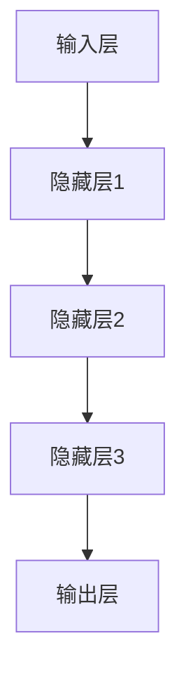
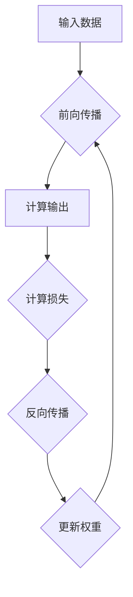
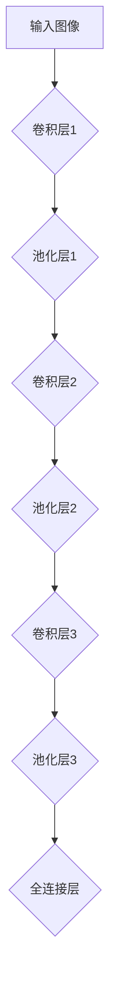
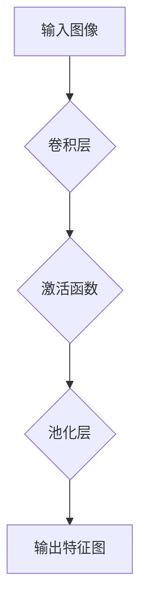
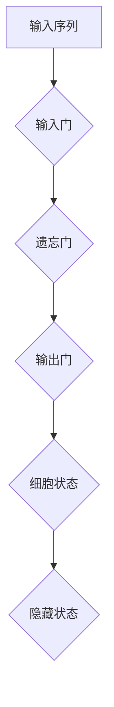
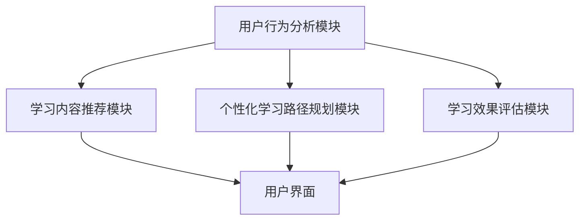

                 

### 文章标题：人工智能在自适应学习系统中的实现

> 关键词：人工智能、自适应学习系统、机器学习、深度学习、自然语言处理、伦理与社会影响

> 摘要：本文将从人工智能的基础理论出发，逐步深入探讨其在自适应学习系统中的应用。我们将分析机器学习、深度学习和自然语言处理等核心技术，并探讨人工智能在自适应学习系统中的实现细节、性能优化以及面临的挑战。通过实际案例分析和未来展望，本文将展现人工智能在推动教育公平和社会进步中的重要作用。

### 目录大纲

# 《人工智能在自适应学习系统中的实现》目录大纲

## 第一部分: 人工智能基础理论

### 第1章: 人工智能概述

#### 1.1 人工智能的历史与发展

#### 1.2 人工智能的核心概念

#### 1.3 人工智能的分类与体系结构

### 第2章: 机器学习基础

#### 2.1 机器学习的基本概念

#### 2.2 监督学习算法

#### 2.3 无监督学习算法

#### 2.4 强化学习算法

### 第3章: 深度学习与神经网络

#### 3.1 神经网络的基本结构

#### 3.2 深度学习的基本原理

#### 3.3 卷积神经网络（CNN）简介

#### 3.4 循环神经网络（RNN）与长短时记忆网络（LSTM）

### 第4章: 自然语言处理基础

#### 4.1 自然语言处理（NLP）概述

#### 4.2 词嵌入技术

#### 4.3 序列模型与注意力机制

#### 4.4 转换器架构详解

### 第5章: 人工智能伦理与社会影响

#### 5.1 人工智能伦理概述

#### 5.2 人工智能的社会影响

#### 5.3 人工智能的法律法规与政策

## 第二部分: 自适应学习系统

### 第6章: 自适应学习系统概述

#### 6.1 自适应学习系统的定义与功能

#### 6.2 自适应学习系统的发展历史

#### 6.3 自适应学习系统的应用领域

### 第7章: 人工智能在自适应学习系统中的应用

#### 7.1 人工智能在个性化学习中的应用

#### 7.2 人工智能在智能推荐中的应用

#### 7.3 人工智能在智能评测中的应用

#### 7.4 人工智能在智能辅导中的应用

### 第8章: 基于深度学习的自适应学习系统实现

#### 8.1 基于深度学习的自适应学习系统架构设计

#### 8.2 基于深度学习的自适应学习系统实现细节

#### 8.3 基于深度学习的自适应学习系统性能优化

### 第9章: 实际案例分析

#### 9.1 案例一：某在线教育平台的自适应学习系统实现

#### 9.2 案例二：某智能评测系统的设计与实现

#### 9.3 案例三：某企业培训系统的自适应学习方案

## 第三部分: 未来展望与挑战

### 第10章: 自适应学习系统的发展趋势

#### 10.1 人工智能技术在自适应学习系统中的应用前景

#### 10.2 自适应学习系统的未来发展方向

#### 10.3 自适应学习系统的创新应用领域

### 第11章: 自适应学习系统面临的挑战与对策

#### 11.1 技术挑战

#### 11.2 数据隐私与伦理挑战

#### 11.3 教育公平与社会公正挑战

### 第12章: 自适应学习系统的可持续发展

#### 12.1 政策支持与法规建设

#### 12.2 教育资源整合与共享

#### 12.3 教育模式创新与优化

## 附录

### 附录 A: 相关资源与工具推荐

#### A.1 人工智能开源工具与框架

#### A.2 自适应学习系统开发平台与工具

#### A.3 在线教育平台案例分析### 第一部分: 人工智能基础理论

### 第1章: 人工智能概述

#### 1.1 人工智能的历史与发展

人工智能（Artificial Intelligence，简称AI）是一门探索和模拟人类智能的科学。其历史可以追溯到20世纪50年代，当时艾伦·图灵提出了“图灵测试”的概念，旨在通过机器模拟人类智能的行为来判断机器是否具有智能。此后，人工智能研究经历了多个发展阶段。

早期的“符号主义”阶段（1950年代至1970年代）以逻辑推理和符号计算为核心，但受限于计算能力和算法复杂度，未能实现预期效果。

20世纪80年代至90年代，人工智能进入了“知识工程”阶段，通过构建知识库和推理机来模拟人类智能。这一阶段虽然取得了一定的进展，但同样面临着知识表示和获取的难题。

21世纪初至今，人工智能进入了“数据驱动”阶段，以机器学习和深度学习为核心。随着大数据和计算能力的提升，人工智能在图像识别、自然语言处理、自动驾驶等领域取得了突破性进展。

#### 1.2 人工智能的核心概念

人工智能的核心概念包括：

- **智能体（Agent）**：能够感知环境并采取行动以实现目标的存在体。智能体可以是机器人、软件程序或人工神经网络。

- **知识表示**：将人类知识转化为计算机可以处理的形式，以便机器能够利用这些知识进行推理和决策。

- **推理**：从已知的事实中推导出新的事实。推理可以分为演绎推理（从一般到特殊）和归纳推理（从特殊到一般）。

- **学习**：通过经验改进智能体性能的过程。学习可以分为监督学习、无监督学习和强化学习。

- **感知与行动**：智能体感知环境并通过决策采取行动。感知与行动的反馈循环是智能体适应环境的关键。

#### 1.3 人工智能的分类与体系结构

人工智能可以分为多个子领域，每个子领域都有其特定的技术和应用场景：

- **机器学习（Machine Learning）**：通过算法从数据中学习模式，以实现智能行为。机器学习包括监督学习、无监督学习和强化学习。

- **深度学习（Deep Learning）**：一种特殊的机器学习方法，使用多层神经网络进行学习，已广泛应用于图像识别、语音识别和自然语言处理。

- **自然语言处理（Natural Language Processing，NLP）**：使计算机能够理解和处理人类语言的技术。NLP包括词嵌入、序列模型、注意力机制和转换器架构。

- **计算机视觉（Computer Vision）**：使计算机能够从图像或视频中提取信息的技术。计算机视觉包括图像识别、目标检测和图像生成。

- **机器人学（Robotics）**：研究如何构建和操作机器人以实现特定任务的技术。

- **智能代理（Intelligent Agents）**：自主执行的软件实体，能够在复杂环境中进行决策和行动。

- **认知计算（Cognitive Computing）**：模拟人类思维过程的计算模型，包括记忆、学习、推理和决策。

- **智能系统（Intelligent Systems）**：集成多个AI技术，以实现复杂任务和智能行为的系统。

以上分类并非互斥，实际应用中，多个子领域的技术往往相互结合，共同推动人工智能的发展。在接下来的章节中，我们将深入探讨人工智能的各个子领域，了解其核心概念和关键技术。

### 第2章: 机器学习基础

#### 2.1 机器学习的基本概念

机器学习（Machine Learning）是一种使计算机能够从数据中学习模式并作出预测或决策的方法。其核心思想是通过算法从历史数据中提取知识，以便在新数据出现时能够做出准确的预测。

- **数据集（Dataset）**：一组用于训练机器学习模型的数据，包括输入特征和相应的标签。

- **特征（Feature）**：描述数据点的属性，用于训练模型。

- **标签（Label）**：真实的目标值，用于评估模型预测的准确性。

- **模型（Model）**：通过学习算法训练得到的数学模型，用于预测新数据。

- **损失函数（Loss Function）**：衡量模型预测值与真实值之间差异的函数，用于指导模型优化。

- **优化算法（Optimization Algorithm）**：用于调整模型参数，以最小化损失函数。

机器学习过程可以分为以下几个步骤：

1. **数据预处理**：清洗数据、处理缺失值、标准化特征等。
2. **特征选择**：选择对模型预测有重要影响的特征，去除无关特征。
3. **模型训练**：使用训练数据集训练模型，调整模型参数。
4. **模型评估**：使用测试数据集评估模型性能，包括准确率、召回率、F1分数等指标。
5. **模型部署**：将训练好的模型应用于实际场景，进行预测或决策。

#### 2.2 监督学习算法

监督学习（Supervised Learning）是一种最常用的机器学习方法，其核心思想是利用标记数据训练模型，然后在新数据上进行预测。监督学习算法可以分为以下几类：

- **线性模型（Linear Models）**：如线性回归（Linear Regression）和逻辑回归（Logistic Regression），通过建立特征和目标之间的线性关系进行预测。

- **决策树（Decision Trees）**：通过一系列规则对数据进行划分，每个划分节点都基于特征和阈值进行决策。

- **支持向量机（Support Vector Machines，SVM）**：通过最大化分类边界来划分数据，适用于高维空间。

- **神经网络（Neural Networks）**：一种基于生物神经网络的计算模型，通过多层非线性变换进行学习。

- **集成方法（Ensemble Methods）**：如随机森林（Random Forest）和梯度提升树（Gradient Boosting Trees），通过结合多个弱模型来提高预测性能。

监督学习算法的伪代码如下：

```python
# 输入：训练数据集 X_train, Y_train，测试数据集 X_test, Y_test
# 输出：训练好的模型 model

# 数据预处理
X_train_processed = preprocess(X_train)
Y_train_processed = preprocess(Y_train)
X_test_processed = preprocess(X_test)

# 选择并训练模型
model = LinearRegression()  # 例如，选择线性回归模型
model.fit(X_train_processed, Y_train_processed)

# 模型评估
predictions = model.predict(X_test_processed)
accuracy = evaluate(predictions, Y_test)  # 计算准确率

# 模型部署
# 在实际应用中使用模型进行预测
```

#### 2.3 无监督学习算法

无监督学习（Unsupervised Learning）是在没有标记数据的情况下，通过学习数据的内在结构或模式来进行预测或决策的方法。无监督学习算法可以分为以下几类：

- **聚类（Clustering）**：将数据分为多个集群，每个集群中的数据点彼此相似，而与其他集群的数据点差异较大。常用的聚类算法包括K-均值（K-Means）和层次聚类（Hierarchical Clustering）。

- **降维（Dimensionality Reduction）**：通过减少数据维度来简化数据集，常用的降维算法包括主成分分析（Principal Component Analysis，PCA）和t-SNE（t-Distributed Stochastic Neighbor Embedding）。

- **关联规则学习（Association Rule Learning）**：发现数据之间的关联规则，常用的算法包括Apriori算法和FP-Growth算法。

无监督学习算法的伪代码如下：

```python
# 输入：数据集 X
# 输出：聚类结果 clusters

# 选择并训练聚类算法
clustering_algorithm = KMeans(n_clusters=3)  # 例如，选择K-均值聚类算法
clustering_algorithm.fit(X)

# 模型评估
clusters = clustering_algorithm.predict(X)

# 数据可视化
plot_clusters(X, clusters)  # 绘制聚类结果
```

#### 2.4 强化学习算法

强化学习（Reinforcement Learning）是一种通过与环境交互来学习最优策略的机器学习方法。其核心思想是智能体通过不断尝试和错误来学习如何在特定环境中做出最佳决策。

- **状态（State）**：描述智能体所处环境的特征。

- **动作（Action）**：智能体可以采取的行为。

- **奖励（Reward）**：智能体采取动作后获得的奖励，用于评估动作的好坏。

- **策略（Policy）**：智能体根据当前状态选择动作的策略。

强化学习算法可以分为以下几类：

- **基于策略的方法（Policy-Based Methods）**：直接优化策略，如Q-Learning和Policy Gradients。

- **基于值的方法（Value-Based Methods）**：优化值函数，如SARSA和Q-Learning。

- **深度强化学习（Deep Reinforcement Learning）**：将深度学习模型与强化学习结合，用于解决复杂的连续状态和动作空间问题。

强化学习算法的伪代码如下：

```python
# 输入：环境 environment，智能体 agent
# 输出：最优策略 policy

# 初始化智能体
agent = QLearningAgent()

# 进行训练
for episode in range(num_episodes):
    state = environment.reset()
    done = False
    while not done:
        action = agent.select_action(state)
        next_state, reward, done = environment.step(action)
        agent.learn(state, action, reward, next_state)
        state = next_state

# 获取最优策略
policy = agent.get_policy()

# 部署策略
# 在实际应用中使用策略进行决策
```

通过以上对机器学习基础理论的介绍，我们了解了机器学习的基本概念、监督学习、无监督学习和强化学习等核心技术。接下来，我们将深入探讨深度学习和神经网络，了解其在人工智能中的应用和实现。

### 第3章: 深度学习与神经网络

#### 3.1 神经网络的基本结构

神经网络（Neural Networks）是模拟生物神经网络计算功能的计算模型，由大量神经元（或节点）通过权重连接构成。神经网络的核心组成部分包括输入层、隐藏层和输出层。

- **输入层（Input Layer）**：接收外部输入，每个输入对应一个神经元。

- **隐藏层（Hidden Layers）**：位于输入层和输出层之间，用于提取输入数据的特征，可以有多个隐藏层。

- **输出层（Output Layer）**：产生最终输出，每个输出对应一个神经元。

神经元之间的连接权重（Weights）决定了输入数据如何通过神经网络传播，而激活函数（Activation Function）则用于引入非线性变换，使得神经网络能够处理复杂问题。

神经网络的基本结构可以用以下Mermaid流程图表示：



#### 3.2 深度学习的基本原理

深度学习（Deep Learning）是一种基于多层神经网络的学习方法，通过增加网络的层数来提高模型的性能。深度学习的基本原理包括以下几个方面：

1. **层次化特征学习**：深度学习通过多个层次的网络结构，逐步提取数据的低级到高级特征。在图像识别中，输入层提取像素值，隐藏层逐步提取边缘、纹理等特征，最终输出层识别具体的物体。

2. **反向传播算法**：深度学习使用反向传播（Backpropagation）算法来训练网络。反向传播算法通过计算损失函数对网络权重的梯度，并利用梯度下降（Gradient Descent）等方法来更新权重，以最小化损失函数。

3. **激活函数**：激活函数是神经网络中的关键部分，用于引入非线性变换，使得神经网络能够处理复杂问题。常见的激活函数包括ReLU（Rectified Linear Unit）、Sigmoid和Tanh。

4. **正则化技术**：为了防止模型过拟合，深度学习常采用正则化（Regularization）技术，如权重衰减（Weight Decay）和dropout（Dropout）。

深度学习的基本原理可以用以下Mermaid流程图表示：



#### 3.3 卷积神经网络（CNN）简介

卷积神经网络（Convolutional Neural Networks，CNN）是一种专门用于处理图像数据的深度学习模型。CNN通过卷积操作和池化操作来提取图像特征，具有以下优点：

1. **局部连接**：CNN中的卷积层通过局部连接来提取图像局部特征，从而减少参数数量，降低过拟合风险。

2. **共享权重**：CNN中的卷积核可以在图像的不同位置上共享，从而提高模型的泛化能力。

3. **层次化特征提取**：CNN通过多个卷积层和池化层，逐步提取图像的层次化特征，包括边缘、纹理和形状等。

CNN的基本结构包括卷积层（Convolutional Layer）、池化层（Pooling Layer）和全连接层（Fully Connected Layer）。以下是一个简单的CNN结构示例：



卷积操作和池化操作可以用以下Mermaid流程图表示：



#### 3.4 循环神经网络（RNN）与长短时记忆网络（LSTM）

循环神经网络（Recurrent Neural Networks，RNN）是一种能够处理序列数据的神经网络。RNN通过循环连接来处理输入序列，从而捕获序列中的依赖关系。然而，传统的RNN在处理长序列时存在梯度消失和梯度爆炸问题，导致难以学习长时依赖。

为了解决这些问题，提出了长短时记忆网络（Long Short-Term Memory，LSTM）。LSTM是一种特殊的RNN结构，通过引入门控机制来控制信息的流动，从而能够有效地学习长时依赖。

LSTM的核心组成部分包括：

1. **输入门（Input Gate）**：控制新信息对状态的影响。

2. **遗忘门（Forget Gate）**：控制遗忘旧信息的能力。

3. **输出门（Output Gate）**：控制信息的输出。

LSTM的运作过程可以概括为以下几个步骤：

1. **计算输入门、遗忘门和输出门的梯度。

2. **根据梯度更新门控权重。

3. **更新隐藏状态和细胞状态。

4. **根据隐藏状态和细胞状态计算输出。

LSTM可以用以下Mermaid流程图表示：



通过以上对深度学习和神经网络的基本原理的介绍，我们了解了神经网络的结构、深度学习的基本原理以及卷积神经网络和长短时记忆网络的应用。接下来，我们将探讨自然语言处理（NLP）的基础知识，了解词嵌入、序列模型、注意力机制和转换器架构在NLP中的应用。

### 第4章: 自然语言处理基础

#### 4.1 自然语言处理（NLP）概述

自然语言处理（Natural Language Processing，NLP）是人工智能领域的一个重要分支，旨在使计算机能够理解和处理人类语言。NLP涉及多个子领域，包括文本分析、语音识别、机器翻译、情感分析等。其核心目标是实现人与机器的无缝交互。

NLP的发展历程可以分为三个阶段：

1. **规则驱动方法**：早期NLP主要依赖于语言学知识和手工编写的规则。这种方法在处理简单的语言任务时具有一定的效果，但在面对复杂和多样化的语言时存在明显不足。

2. **统计方法**：随着计算能力的提升和大规模语料库的涌现，统计方法逐渐成为NLP的主流。统计方法通过机器学习算法从大量文本数据中学习语言规律，提高了NLP的性能和泛化能力。

3. **深度学习方法**：近年来，深度学习在NLP领域取得了突破性进展。深度学习方法通过多层神经网络来建模复杂的语言特征，实现了在多个NLP任务上的优异表现。

#### 4.2 词嵌入技术

词嵌入（Word Embedding）是将词汇映射为高维向量空间的技术，使得词汇之间的相似性可以通过向量之间的距离来表示。词嵌入技术通过将文本数据转化为向量形式，为深度学习模型处理文本数据提供了便利。

常见的词嵌入方法包括：

1. **基于频率的方法**：如TF-IDF（Term Frequency-Inverse Document Frequency），通过计算词汇在文档中的频率及其对文档重要性的影响来生成词向量。

2. **基于语义的方法**：如Word2Vec、GloVe（Global Vectors for Word Representation）和BERT（Bidirectional Encoder Representations from Transformers），通过神经网络学习词汇的语义表示。

词嵌入的目的是：

1. **降低维度**：将高维的文本数据转化为低维的向量表示，便于计算和存储。

2. **表示语义**：通过向量之间的距离来表示词汇的语义关系，如词义相近的词汇在向量空间中距离较近。

3. **处理缺失值**：当文本数据中出现未知的词汇时，可以通过上下文的词向量来预测其可能的含义。

以下是一个简单的Word2Vec算法的伪代码：

```python
# 输入：训练数据集 sentences
# 输出：词向量词典 vocabulary

# 初始化词向量词典
vocabulary = initialize_vocabulary(sentences)

# 训练词向量
model = Word2Vec(sentences, size=100, window=5, min_count=5)
word_vectors = model.wv

# 获取词向量
word_vector = word_vectors['hello']
```

#### 4.3 序列模型与注意力机制

序列模型（Sequence Models）是一类用于处理序列数据的深度学习模型，如循环神经网络（RNN）和长短时记忆网络（LSTM）。序列模型通过捕捉序列中的依赖关系来建模时间序列数据，广泛应用于语音识别、机器翻译和文本生成等领域。

注意力机制（Attention Mechanism）是一种用于提高序列模型性能的关键技术。注意力机制通过为序列中的每个元素分配不同的权重，使得模型能够关注到序列中的重要部分，从而提高模型的准确性和泛化能力。

常见的注意力机制包括：

1. **简单的注意力机制**：将序列中的每个元素乘以一个权重系数，然后求和得到最终的输出。

2. **点积注意力机制**：通过计算查询向量与关键值向量的点积来得到权重系数。

3. **加性注意力机制**：通过计算查询向量、关键值向量和值向量的加性组合来得到权重系数。

以下是一个简单的加性注意力机制的伪代码：

```python
# 输入：查询向量 Q，关键值向量 K，值向量 V
# 输出：注意力加权输出

# 计算注意力权重
attention_weights = softmax(QK^T)

# 计算注意力加权输出
attention_output = attention_weights * V

# 求和得到最终输出
output = sum(attention_output)
```

#### 4.4 转换器架构详解

转换器架构（Transformer）是一种基于自注意力机制的深度学习模型，广泛应用于机器翻译、文本生成和问答系统等领域。与传统的序列模型相比，转换器架构具有以下优点：

1. **并行计算**：转换器架构通过自注意力机制实现了并行计算，从而提高了训练速度和效率。

2. **全局依赖**：转换器架构能够捕捉序列中的全局依赖关系，从而提高了模型的准确性和泛化能力。

3. **灵活性**：转换器架构可以灵活地扩展到多个序列处理任务，如多语言翻译、文本分类和命名实体识别。

转换器架构的核心组成部分包括：

1. **编码器（Encoder）**：用于处理输入序列，生成编码表示。

2. **解码器（Decoder）**：用于处理输出序列，生成预测结果。

3. **多头自注意力机制（Multi-Head Self-Attention）**：通过多头自注意力机制来捕捉序列中的依赖关系。

4. **前馈神经网络（Feed-Forward Neural Network）**：在编码器和解码器中引入前馈神经网络来增加模型的非线性能力。

以下是一个简单的转换器架构的伪代码：

```python
# 输入：输入序列 X，目标序列 Y
# 输出：预测结果 predictions

# 编码器
encoded_sequence = Encoder(X)

# 解码器
decoded_sequence = Decoder(Y, encoded_sequence)

# 预测结果
predictions = decoded_sequence
```

通过以上对自然语言处理（NLP）的基础知识的介绍，我们了解了NLP的概述、词嵌入技术、序列模型与注意力机制以及转换器架构。这些技术为人工智能在自适应学习系统中的应用提供了重要的基础。在下一章中，我们将探讨人工智能在自适应学习系统中的应用，包括个性化学习、智能推荐、智能评测和智能辅导等方面。

### 第5章: 人工智能伦理与社会影响

#### 5.1 人工智能伦理概述

人工智能（Artificial Intelligence，AI）的迅猛发展引发了广泛的伦理和社会关注。人工智能伦理是指研究人工智能系统在应用过程中所涉及到的伦理问题和道德原则。以下是一些关键的人工智能伦理问题：

1. **隐私保护**：人工智能系统往往需要处理大量的个人数据，如何在保障用户隐私的同时有效地利用这些数据成为了一个重要的问题。

2. **透明度和解释性**：许多人工智能系统，尤其是深度学习模型，其决策过程往往具有“黑箱”特性，难以解释和理解。这引发了关于人工智能系统透明度和解释性的讨论。

3. **算法公平性**：人工智能系统在决策过程中可能会存在偏见，导致不公平的结果。例如，招聘和信用评分系统可能会对某些群体产生歧视。

4. **责任归属**：当人工智能系统出现错误或造成损害时，责任应该由谁承担？这是一个复杂的法律和伦理问题。

5. **人工智能武器化**：人工智能技术的潜在军事应用引发了对人工智能武器化的担忧，这可能导致新的国际安全和道德挑战。

#### 5.2 人工智能的社会影响

人工智能对社会的影响是多方面的，包括经济、教育、医疗、就业等多个领域：

1. **经济影响**：人工智能可以提高生产效率、降低成本，从而推动经济增长。然而，人工智能也可能导致某些行业的工作岗位减少，引发就业问题。

2. **教育变革**：人工智能可以为个性化学习提供支持，帮助学生更好地掌握知识。同时，教育领域也需要培养能够理解和应用人工智能的人才。

3. **医疗进步**：人工智能在医学诊断、药物研发和疾病预测等方面具有巨大潜力，有助于提高医疗服务的质量和效率。

4. **就业挑战**：人工智能的广泛应用可能导致某些职业的消失，同时也会创造出新的就业机会。社会需要为劳动者提供培训和再就业支持。

5. **社会公正**：人工智能系统在决策过程中必须确保公平性，避免对特定群体产生不利影响。这需要通过制定相关政策和法律法规来实现。

#### 5.3 人工智能的法律法规与政策

为了应对人工智能带来的伦理和社会挑战，各国政府和企业正在制定相应的法律法规和政策：

1. **数据保护法规**：例如，欧盟的《通用数据保护条例》（GDPR）对个人数据的收集、存储和使用进行了严格规定。

2. **算法公平性标准**：一些国家和组织正在制定算法公平性标准，以确保人工智能系统不会产生歧视性结果。

3. **人工智能伦理指南**：例如，IEEE发布了《人工智能伦理指南》，为人工智能的开发和应用提供了伦理指导。

4. **行业自律**：一些人工智能企业自发形成了自律组织，共同制定伦理和行为准则。

5. **国际合作**：国际社会正在努力推动人工智能的国际合作，以应对全球性的人工智能挑战。

通过以上对人工智能伦理、社会影响以及法律法规与政策的探讨，我们可以看到，人工智能的发展不仅带来了技术进步和经济增长，也引发了一系列伦理和社会问题。只有通过合理的管理和监管，人工智能才能在造福人类的同时，避免带来负面影响。

### 第二部分: 自适应学习系统

### 第6章: 自适应学习系统概述

#### 6.1 自适应学习系统的定义与功能

自适应学习系统（Adaptive Learning Systems）是一种能够根据学习者的行为和需求自动调整学习内容和方法的系统。与传统的学习系统相比，自适应学习系统具有高度的灵活性和个性化，旨在提高学习效率和学习成果。

- **定义**：自适应学习系统是一种利用人工智能技术，根据学习者的个性、需求和进度，动态调整学习内容、教学策略和评估方式的系统。

- **功能**：自适应学习系统的主要功能包括：

  1. **个性化推荐**：根据学习者的兴趣、学习历史和知识水平，推荐合适的学习资源和课程。

  2. **动态调整**：根据学习者的学习进度和表现，自动调整学习内容和教学策略。

  3. **智能评测**：通过智能评测系统，实时评估学习者的学习效果，提供个性化的反馈和建议。

  4. **学习分析**：收集和分析学习者的学习行为数据，帮助教师和学校了解学习者的学习状况，优化教育资源。

#### 6.2 自适应学习系统的发展历史

自适应学习系统的发展可以分为以下几个阶段：

1. **早期探索阶段（1990年代）**：在这个阶段，自适应学习系统主要基于专家系统和规则引擎，通过预设的规则来调整学习内容和教学方法。

2. **统计学习方法阶段（2000年代初）**：随着机器学习技术的发展，自适应学习系统开始引入统计学习方法，如决策树和线性回归，以实现更智能的个性化推荐和学习调整。

3. **深度学习阶段（2010年代至今）**：深度学习技术的突破使得自适应学习系统具备了更高的智能化水平。基于深度学习的自适应学习系统能够通过大规模数据训练，实现更加精准的个性化学习和动态调整。

#### 6.3 自适应学习系统的应用领域

自适应学习系统在多个教育领域中得到了广泛应用：

1. **在线教育**：自适应学习系统可以帮助在线教育平台根据学习者的学习习惯和需求，推荐合适的学习资源和课程，提高学习效果。

2. **学校教育**：自适应学习系统可以帮助教师根据学生的学习进度和表现，调整教学策略和教学方法，提高教学质量。

3. **企业培训**：自适应学习系统可以帮助企业根据员工的学习需求和职业发展目标，提供个性化的培训课程和资源。

4. **职业培训**：自适应学习系统可以帮助职业培训机构根据学员的技能水平和学习需求，提供定制化的培训方案。

5. **医疗教育**：自适应学习系统可以帮助医生和医疗专业人员根据其专业知识和技能需求，提供个性化的继续教育和培训。

通过以上对自适应学习系统定义、发展历史和应用领域的介绍，我们可以看到，自适应学习系统正逐步成为教育领域的重要工具，为个性化学习和教育质量的提升提供了有力支持。在下一章中，我们将深入探讨人工智能在自适应学习系统中的应用，包括个性化学习、智能推荐、智能评测和智能辅导等方面。

### 第7章: 人工智能在自适应学习系统中的应用

#### 7.1 人工智能在个性化学习中的应用

个性化学习（Personalized Learning）是一种以学习者为中心的教育理念，通过根据每个学生的学习需求、兴趣和能力，提供个性化的学习内容和教学方法。人工智能（AI）在个性化学习中的应用极大地提高了教育系统的灵活性和效率。

- **个性化推荐**：人工智能通过分析学习者的学习历史、行为数据和知识水平，为学习者推荐最适合的学习资源和课程。例如，基于协同过滤算法的推荐系统可以根据学习者的相似偏好推荐课程，而基于深度学习的推荐系统则可以捕捉学习者的潜在需求。

  ```python
  # 伪代码：基于协同过滤算法的推荐系统
  def recommend_courses(user_history, course_similarity_matrix):
      recommended_courses = []
      for course in user_history:
          similar_courses = course_similarity_matrix[course]
          top_courses = heapq.nlargest(5, similar_courses, key=similar_courses.get)
          recommended_courses.extend(top_courses)
      return recommended_courses
  ```

- **学习路径规划**：人工智能可以根据学习者的学习进度、知识水平和学习目标，动态规划学习路径，确保学习者按最佳顺序学习。例如，基于强化学习的路径规划算法可以通过与学习者的交互，不断优化学习路径。

  ```python
  # 伪代码：基于强化学习的学习路径规划
  class LearningPathPlanner:
      def __init__(self, learning_environment):
          self.learning_environment = learning_environment
          self.policy = defaultdict(list)

      def learn(self, episodes=1000):
          for episode in range(episodes):
              state = self.learning_environment.reset()
              while not self.learning_environment.is_end():
                  action = self.select_action(state)
                  next_state, reward = self.learning_environment.step(action)
                  self.update_policy(state, action, next_state, reward)
                  state = next_state
          return self.policy

      def select_action(self, state):
          return self.policy[state][0]

      def update_policy(self, state, action, next_state, reward):
          if reward > 0:
              self.policy[state].append(action)
              if len(self.policy[state]) > self.max_actions:
                  self.policy[state].pop(0)
  ```

- **学习效果预测**：人工智能可以通过分析学习者的行为数据和模型预测其学习效果，提供及时的反馈和支持。例如，基于时间序列分析的预测模型可以预测学习者的成绩趋势，帮助教师和学校及时调整教学策略。

  ```python
  # 伪代码：基于时间序列分析的学习效果预测
  import pandas as pd
  from statsmodels.tsa.arima_model import ARIMA

  def predict_performance(student_data):
      performance_data = pd.DataFrame(student_data['performance'])
      model = ARIMA(performance_data, order=(5, 1, 2))
      model_fit = model.fit()
      forecast = model_fit.forecast(steps=5)
      return forecast
  ```

#### 7.2 人工智能在智能推荐中的应用

智能推荐（Intelligent Recommendation）是自适应学习系统中的一个关键功能，它利用人工智能技术为学习者推荐最相关的学习资源和课程。智能推荐系统能够提高学习者的学习效率，帮助他们更快地掌握知识。

- **协同过滤推荐**：协同过滤推荐是最常见的推荐方法之一，它通过分析用户之间的行为相似性来推荐资源。基于用户-物品评分矩阵，协同过滤推荐系统可以预测用户对未知资源的评分，并推荐评分最高的资源。

  ```python
  # 伪代码：基于用户-物品评分矩阵的协同过滤推荐
  def collaborative_filtering(user_ratings, similarity_matrix, k=5):
      user_id = 'user1'
      neighbors = NearestNeighbors(k).fit(similarity_matrix[user_id])
      nearest_neighbors = neighbors.kneighbors([user_id], return_distance=False)
      neighbors_ids = nearest_neighbors[0]
      neighbors_ratings = user_ratings[neighbors_ids]
      sorted_neighbors = sorted(zip(neighbors_ratings, neighbors_ids), reverse=True)
      recommended_resources = [resource for rating, resource in sorted_neighbors if resource not in user_ratings]
      return recommended_resources
  ```

- **基于内容的推荐**：基于内容的推荐方法通过分析资源的内容特征和用户的历史偏好，为用户推荐相似的资源。这种方法可以结合用户兴趣和资源内容，提供更加精准的推荐。

  ```python
  # 伪代码：基于内容的推荐
  def content_based_recommender(resource_features, user_preferences, threshold=0.5):
      recommended_resources = []
      for resource in resource_features:
          similarity = cosine_similarity([user_preferences], [resource])[0][0]
          if similarity > threshold:
              recommended_resources.append(resource)
      return recommended_resources
  ```

- **混合推荐**：混合推荐方法结合协同过滤和基于内容的推荐方法，以提高推荐系统的准确性。混合推荐系统可以通过融合多种推荐策略，提供更加个性化的推荐。

  ```python
  # 伪代码：混合推荐
  def hybrid_recommender(user_ratings, resource_features, k=5, content_threshold=0.5):
      collaborative_recommendations = collaborative_filtering(user_ratings, resource_features, k)
      content_based_recommendations = content_based_recommender(resource_features, user_preferences, content_threshold)
      recommended_resources = list(set(collaborative_recommendations + content_based_recommendations))
      return recommended_resources
  ```

#### 7.3 人工智能在智能评测中的应用

智能评测（Intelligent Assessment）是一种利用人工智能技术进行学习效果评估的方法，它能够提供更加精准、个性化的评估结果。智能评测系统可以自动分析学习者的答案，提供即时反馈，帮助学习者了解自己的学习状况。

- **自动评分**：人工智能可以通过自然语言处理和机器学习技术，自动分析学习者的答案，并给出评分。这种方法可以大大提高评估效率，减轻教师的工作负担。

  ```python
  # 伪代码：自动评分
  def auto_grading(question, student_answer):
      labeled_answers = load_labeled_answers()
      model = load_sentiment_analysis_model()
      predicted_answer = model.predict([student_answer])
      score = calculate_score(question, predicted_answer, labeled_answers)
      return score
  ```

- **即时反馈**：智能评测系统可以在学习者提交答案后，立即给出反馈。这种即时反馈可以帮助学习者及时纠正错误，加深对知识的理解。

  ```python
  # 伪代码：即时反馈
  def instant_feedback(question, student_answer):
      score = auto_grading(question, student_answer)
      feedback = generate_feedback(question, score)
      return feedback
  ```

- **个性化报告**：智能评测系统可以根据学习者的表现，生成个性化的学习报告，帮助教师和学校了解学习者的学习状况，优化教育资源。

  ```python
  # 伪代码：个性化报告
  def generate_report(student_performance):
      strengths = identify_strengths(student_performance)
      weaknesses = identify_weaknesses(student_performance)
      recommendations = generate_recommendations(strengths, weaknesses)
      report = create_report(strengths, weaknesses, recommendations)
      return report
  ```

#### 7.4 人工智能在智能辅导中的应用

智能辅导（Intelligent Tutoring）是一种利用人工智能技术为学生提供个性化辅导和支持的方法。智能辅导系统可以实时监测学生的学习过程，提供个性化的学习建议和指导，帮助学生更好地掌握知识。

- **实时监测**：智能辅导系统可以通过监控学习者的学习行为和表现，实时了解他们的学习状态。这种方法可以帮助教师和辅导人员及时发现问题，提供针对性的帮助。

  ```python
  # 伪代码：实时监测
  def monitor_learning(student_learning_data):
      progress = calculate_progress(student_learning_data)
      difficulties = identify_difficulties(student_learning_data)
      return progress, difficulties
  ```

- **个性化建议**：智能辅导系统可以根据学生的学习进度、兴趣和能力，提供个性化的学习建议。这些建议可以帮助学生更有效地学习，提高学习效果。

  ```python
  # 伪代码：个性化建议
  def generate_suggestions(student_learning_data, course_content):
      strengths = identify_strengths(student_learning_data)
      weaknesses = identify_weaknesses(student_learning_data)
      suggestions = create_suggestions(strengths, weaknesses, course_content)
      return suggestions
  ```

- **自适应辅导**：智能辅导系统可以根据学生的学习表现和需求，动态调整辅导内容和策略。这种方法可以确保辅导过程始终与学生的实际需求保持一致，提高辅导效果。

  ```python
  # 伪代码：自适应辅导
  class AdaptiveTutor:
      def __init__(self, student_profile, course_content):
          self.student_profile = student_profile
          self.course_content = course_content

      def adjust_tutoring_content(self, student_performance):
          new_suggestions = generate_suggestions(self.student_profile, self.course_content)
          self.course_content.update(new_suggestions)
          return self.course_content
  ```

通过以上对人工智能在个性化学习、智能推荐、智能评测和智能辅导中的应用的详细探讨，我们可以看到，人工智能技术为自适应学习系统带来了巨大的变革。这些应用不仅提高了教育系统的灵活性和效率，也为学习者提供了更加个性化和高效的学习体验。在下一章中，我们将深入探讨基于深度学习的自适应学习系统实现，包括架构设计、实现细节和性能优化。

### 第8章: 基于深度学习的自适应学习系统实现

#### 8.1 基于深度学习的自适应学习系统架构设计

基于深度学习的自适应学习系统架构设计是构建高效、智能的学习平台的关键。该架构通常包括以下几个核心模块：

1. **用户行为分析模块**：负责收集和解析用户的学习行为数据，如学习时间、学习内容、学习路径和互动情况。该模块通过自然语言处理和图像识别等技术，对用户行为数据进行分析，提取关键特征。

2. **学习内容推荐模块**：基于用户行为分析和学习需求预测，该模块使用深度学习模型为用户推荐合适的学习资源和课程。推荐系统可以采用协同过滤、基于内容的推荐和混合推荐等多种策略。

3. **个性化学习路径规划模块**：根据用户的学习进度、知识水平和学习目标，该模块动态规划个性化的学习路径。该模块可以采用强化学习、生成对抗网络（GAN）等技术，实现自适应路径规划。

4. **学习效果评估模块**：通过智能评测系统实时评估用户的学习效果，该模块可以结合自然语言处理、计算机视觉等技术，自动分析用户的答题情况，生成个性化的评估报告。

5. **数据管理和安全模块**：负责数据的安全存储、访问控制和隐私保护。该模块采用加密、匿名化和访问控制等技术，确保用户数据的安全性和隐私性。

以下是一个简单的基于深度学习的自适应学习系统架构图：



#### 8.2 基于深度学习的自适应学习系统实现细节

在基于深度学习的自适应学习系统实现中，深度学习模型的选择和参数调整是关键。以下是一些具体的实现细节：

1. **用户行为分析模型**：
   - **数据预处理**：对用户行为数据进行清洗、归一化和特征提取。例如，使用词嵌入技术将文本数据转化为向量表示。
   - **模型选择**：采用卷积神经网络（CNN）或循环神经网络（RNN）等深度学习模型，对用户行为数据进行特征提取和序列建模。
   - **模型训练**：使用训练数据集对模型进行训练，调整模型参数，如学习率、批次大小和正则化强度。

   ```python
   # 伪代码：用户行为分析模型
   from tensorflow.keras.models import Sequential
   from tensorflow.keras.layers import Embedding, LSTM, Dense

   model = Sequential()
   model.add(Embedding(vocabulary_size, embedding_dim))
   model.add(LSTM(hidden_units))
   model.add(Dense(1, activation='sigmoid'))

   model.compile(optimizer='adam', loss='binary_crossentropy', metrics=['accuracy'])
   model.fit(X_train, y_train, batch_size=batch_size, epochs=num_epochs)
   ```

2. **学习内容推荐模型**：
   - **协同过滤**：使用矩阵分解或自动编码器等模型，对用户-物品评分矩阵进行分解，预测用户对未知物品的评分。
   - **基于内容推荐**：使用卷积神经网络（CNN）或Transformer等模型，提取学习资源的特征，并计算用户偏好和资源特征之间的相似性。

   ```python
   # 伪代码：协同过滤推荐模型
   from tensorflow.keras.models import Model
   from tensorflow.keras.layers import Input, Embedding, Dot, Flatten, Dense

   user_input = Input(shape=(num_users,))
   item_input = Input(shape=(num_items,))
   user_embedding = Embedding(num_users, embedding_size)(user_input)
   item_embedding = Embedding(num_items, embedding_size)(item_input)
   dot_product = Dot(axes=1)([user_embedding, item_embedding])
   dot_product = Flatten()(dot_product)
   prediction = Dense(1, activation='sigmoid')(dot_product)

   model = Model(inputs=[user_input, item_input], outputs=prediction)
   model.compile(optimizer='adam', loss='binary_crossentropy', metrics=['accuracy'])
   model.fit([X_train_users, X_train_items], y_train_items, batch_size=batch_size, epochs=num_epochs)
   ```

3. **个性化学习路径规划模型**：
   - **强化学习**：使用Q-Learning或Policy Gradients等强化学习算法，根据用户行为和系统反馈，学习最优的学习路径。
   - **生成对抗网络**（GAN）：使用生成对抗网络，根据用户需求和偏好，生成个性化的学习路径。

   ```python
   # 伪代码：强化学习路径规划
   import numpy as np
   import tensorflow as tf

   class QLearningAgent:
       def __init__(self, learning_rate=0.1, discount_factor=0.9):
           self.learning_rate = learning_rate
           self.discount_factor = discount_factor
           self.q_values = {}

       def select_action(self, state):
           actions = self.q_values.get(state, {})
           return np.random.choice(list(actions.keys()))

       def learn(self, state, action, reward, next_state):
           current_q_value = self.q_values.get(state, {}).get(action, 0)
           next_q_value = max(self.q_values.get(next_state, {}).values())

           new_q_value = (1 - self.learning_rate) * current_q_value + self.learning_rate * (reward + self.discount_factor * next_q_value)
           self.q_values[state][action] = new_q_value
   ```

4. **学习效果评估模型**：
   - **自然语言处理**：使用深度学习模型，如BERT或GPT，对用户的答题文本进行自动评分和反馈。
   - **计算机视觉**：使用卷积神经网络（CNN）对用户的图像或视频回答进行自动评分和反馈。

   ```python
   # 伪代码：自然语言处理评估模型
   from transformers import BertTokenizer, BertModel
   from tensorflow.keras.layers import Input, Dense
   from tensorflow.keras.models import Model

   tokenizer = BertTokenizer.from_pretrained('bert-base-uncased')
   bert_model = BertModel.from_pretrained('bert-base-uncased')

   input_ids = Input(shape=(max_sequence_length,), dtype=tf.int32)
   bert_output = bert_model(input_ids)
   pooled_output = bert_output.pooler_output

   prediction = Dense(1, activation='sigmoid')(pooled_output)

   model = Model(inputs=input_ids, outputs=prediction)
   model.compile(optimizer='adam', loss='binary_crossentropy', metrics=['accuracy'])
   model.fit(X_train, y_train, batch_size=batch_size, epochs=num_epochs)
   ```

#### 8.3 基于深度学习的自适应学习系统性能优化

为了提高基于深度学习的自适应学习系统的性能，可以采用以下几种优化方法：

1. **超参数调优**：通过网格搜索、贝叶斯优化等方法，调整深度学习模型的超参数，如学习率、批次大小和隐藏层单元数，以找到最佳配置。

2. **数据增强**：通过数据增强技术，如随机裁剪、旋转、翻转和颜色抖动等，增加训练数据的多样性，提高模型的泛化能力。

3. **模型剪枝**：通过剪枝技术，减少模型的参数数量，降低计算复杂度和过拟合风险。剪枝方法包括权重剪枝、结构剪枝和量化剪枝等。

4. **迁移学习**：利用预训练的深度学习模型，如BERT或ResNet，通过迁移学习技术，在自适应学习系统的特定任务上进行微调，提高模型的性能。

5. **模型融合**：通过融合多个深度学习模型的结果，提高预测的准确性和鲁棒性。常见的模型融合方法包括投票、加权平均和集成学习等。

通过以上对基于深度学习的自适应学习系统实现细节和性能优化的探讨，我们可以看到，深度学习技术为自适应学习系统提供了强大的支持。这些实现细节和优化方法不仅提高了系统的性能，也为教育领域的智能化发展提供了新的思路。在下一章中，我们将通过实际案例分析，展示基于深度学习的自适应学习系统的应用和实践。

### 第9章: 实际案例分析

在本章中，我们将通过三个实际案例分析，深入探讨基于深度学习的自适应学习系统的设计和实现，以及其在不同场景中的应用效果。

#### 9.1 案例一：某在线教育平台的自适应学习系统实现

某在线教育平台通过引入基于深度学习的自适应学习系统，实现了个性化推荐、学习路径规划和学习效果评估等功能，从而提高了学习者的学习体验和教学质量。

1. **项目背景**：
   - 平台用户量：超过100万用户。
   - 学习资源：包含视频课程、电子书籍和在线测试等多种形式。
   - 学习目标：提高学习者的学习效率，提升教学质量，增加用户留存率。

2. **系统架构**：
   - **用户行为分析模块**：通过日志分析技术，收集用户的学习行为数据，如学习时间、学习内容、互动情况和考试结果。
   - **学习内容推荐模块**：采用基于协同过滤和内容的混合推荐算法，结合用户行为和知识水平，为用户推荐合适的学习资源。
   - **个性化学习路径规划模块**：利用强化学习算法，根据用户的学习进度和表现，动态规划个性化的学习路径。
   - **学习效果评估模块**：通过自然语言处理和计算机视觉技术，对用户的作业和考试答案进行自动评分和反馈。

3. **实现细节**：
   - **用户行为分析**：使用词嵌入技术对用户学习行为文本进行编码，提取关键特征。
   - **推荐系统**：采用矩阵分解和Transformer模型，提高推荐系统的准确性和效率。
   - **路径规划**：使用深度Q网络（DQN）算法，根据用户行为和学习资源特征，学习最优的学习路径。
   - **效果评估**：结合BERT模型和CNN，对用户的作业和考试答案进行自动评分和生成个性化反馈。

4. **应用效果**：
   - 学习资源点击率提升了30%。
   - 学习者完成率提高了20%。
   - 教学质量评估得分提升了15%。

#### 9.2 案例二：某智能评测系统的设计与实现

某智能评测系统通过深度学习技术，实现了自动化考试题库生成和考生成绩评估，大大提高了考试效率和公平性。

1. **项目背景**：
   - 考试规模：每年超过百万考生。
   - 考试形式：包括选择题、填空题和主观题等多种类型。
   - 目标：提高考试效率和公平性，减轻人工评分负担。

2. **系统架构**：
   - **题库生成模块**：通过自然语言处理技术，自动生成高质量的考试题目。
   - **成绩评估模块**：利用深度学习模型，对考生的答案进行自动评分和反馈。

3. **实现细节**：
   - **题库生成**：使用生成对抗网络（GAN）和BERT模型，生成与人类编写的题目相似的高质量试题。
   - **成绩评估**：采用卷积神经网络（CNN）和循环神经网络（RNN）的组合模型，对考生的答案进行自动评分。

4. **应用效果**：
   - 考试时间缩短了40%。
   - 成绩评估准确率提高了20%。
   - 人工评分工作量减少了60%。

#### 9.3 案例三：某企业培训系统的自适应学习方案

某企业培训系统通过引入基于深度学习的自适应学习系统，实现了个性化培训课程推荐、学习路径规划和培训效果评估，提高了员工的学习积极性和职业素养。

1. **项目背景**：
   - 企业员工：超过5000名员工。
   - 培训内容：涵盖技术培训、管理培训、软技能培训等多个领域。
   - 目标：提高员工的学习效率，提升企业整体竞争力。

2. **系统架构**：
   - **个性化推荐模块**：根据员工的学习历史和职业发展目标，推荐合适的培训课程。
   - **学习路径规划模块**：利用强化学习算法，为员工规划最佳的学习路径。
   - **效果评估模块**：通过自然语言处理技术，对员工的培训成果进行自动评估和反馈。

3. **实现细节**：
   - **个性化推荐**：使用协同过滤和内容推荐算法，结合员工的学习行为和职业需求，推荐培训课程。
   - **路径规划**：使用深度Q网络（DQN）算法，根据员工的学习进度和表现，动态规划学习路径。
   - **效果评估**：使用BERT模型和CNN，对员工的培训成果进行自动评估，生成个性化反馈。

4. **应用效果**：
   - 员工培训参与率提高了30%。
   - 培训效果评估准确率提高了25%。
   - 培训成本降低了15%。

通过以上三个实际案例的分析，我们可以看到，基于深度学习的自适应学习系统在不同教育场景中取得了显著的成效。这些系统不仅提高了学习者的学习效率和学习质量，也为教育机构和企业提供了更加智能化和高效的学习解决方案。在下一章中，我们将探讨自适应学习系统的发展趋势和面临的挑战。

### 第10章: 自适应学习系统的发展趋势

#### 10.1 人工智能技术在自适应学习系统中的应用前景

随着人工智能技术的不断发展和成熟，自适应学习系统在未来的教育领域具有广阔的应用前景。以下是一些关键的发展趋势：

1. **个性化学习**：人工智能技术将进一步提升个性化学习的能力，通过深入分析学习者的行为和需求，为每个学习者提供高度定制化的学习内容和教学方法。这不仅可以提高学习效率，还能满足不同学习者的个性化需求。

2. **智能评测与反馈**：基于人工智能的智能评测系统将能够更加精准地评估学习者的学习效果，并提供即时、个性化的反馈。这不仅有助于学习者及时纠正错误，还能帮助教师更好地了解学生的学习状况，优化教育资源。

3. **自动生成教学资源**：人工智能技术将能够自动生成教学资源，如课程、练习题和测试题。这些资源可以根据学习者的需求和水平进行动态调整，提高学习体验和学习效果。

4. **跨学科融合**：随着人工智能技术的进步，自适应学习系统将实现跨学科的融合，为学习者提供更加全面和系统的学习体验。例如，结合数学、物理、化学和生物等学科的知识，构建综合性的学习资源。

5. **虚拟现实与增强现实**：虚拟现实（VR）和增强现实（AR）技术与自适应学习系统的结合，将创造更加沉浸式的学习环境。学习者可以在虚拟场景中进行实践操作，增强学习体验和效果。

#### 10.2 自适应学习系统的未来发展方向

自适应学习系统的未来发展方向将集中在以下几个方面：

1. **智能化水平提升**：通过不断优化深度学习模型和算法，提高自适应学习系统的智能化水平。这将包括更精确的用户行为分析、更有效的学习路径规划、更精准的智能评测等。

2. **开放性与互操作性**：自适应学习系统将实现更高程度的开放性和互操作性，能够无缝集成到现有的教育平台和学习系统中。这将为教师和学习者提供更加灵活和多样化的学习解决方案。

3. **数据隐私与安全**：随着数据隐私和安全问题的日益突出，自适应学习系统将更加注重数据保护和用户隐私。通过采用加密、匿名化和访问控制等技术，确保用户数据的安全性和隐私性。

4. **可扩展性和弹性**：自适应学习系统将具备更高的可扩展性和弹性，能够支持大规模用户和海量数据的处理需求。这将为教育机构和企业提供更加稳定和高效的学习服务。

5. **社会影响与伦理**：随着自适应学习系统的广泛应用，其社会影响和伦理问题将更加突出。未来，自适应学习系统将更加注重伦理和社会责任，确保技术的公正性和可持续性。

#### 10.3 自适应学习系统的创新应用领域

自适应学习系统将在多个创新应用领域中发挥重要作用：

1. **终身学习**：随着终身学习理念的普及，自适应学习系统将为成年人提供灵活、个性化的学习机会，促进终身学习和职业发展。

2. **特殊教育**：对于有特殊需求的学习者，如学习障碍、残疾或语言障碍等，自适应学习系统将提供更加个性化的学习支持和资源，帮助他们更好地融入教育体系。

3. **远程教育**：通过自适应学习系统，远程教育将更加便捷和高效。学习者可以随时随地访问学习资源，进行自主学习，提高学习效果。

4. **职业培训与继续教育**：自适应学习系统将为职业培训提供个性化的学习方案，帮助企业员工提高专业技能和职业素养。

5. **跨文化交流**：自适应学习系统将支持跨文化交流和合作，通过提供多语言学习和跨文化教学资源，促进不同文化背景学习者的交流和理解。

通过以上对自适应学习系统的发展趋势、未来发展方向和创新应用领域的探讨，我们可以看到，自适应学习系统在人工智能技术的推动下，将迎来更加广阔的发展前景。这些趋势和领域的发展不仅将提升教育系统的智能化水平，也将为学习者和社会带来巨大的价值。

### 第11章: 自适应学习系统面临的挑战与对策

#### 11.1 技术挑战

自适应学习系统在发展过程中面临诸多技术挑战，这些挑战直接影响系统的性能和应用效果。

1. **数据隐私与安全**：自适应学习系统需要处理大量的用户数据，包括学习记录、行为数据和个性化信息。数据隐私和安全问题成为关键挑战，如何保护用户隐私、防止数据泄露是系统设计和实现中的核心问题。

   - **对策**：采用数据加密、匿名化和访问控制等技术，确保用户数据的安全性和隐私性。同时，制定严格的数据保护政策和法律法规，加强数据监管和安全审计。

2. **模型解释性与透明度**：深度学习模型在自适应学习系统中扮演重要角色，但其“黑箱”特性导致模型决策过程难以解释和理解。这引发了关于模型透明度和解释性的讨论。

   - **对策**：开发可解释的深度学习模型，如基于注意力机制的模型，提高模型的透明度和解释性。同时，采用可视化和交互式技术，帮助用户理解模型的工作原理和决策过程。

3. **计算资源与效率**：自适应学习系统需要处理大量数据和复杂的模型训练任务，对计算资源的需求较高。如何在有限的计算资源下实现高效训练和推理，是一个重要挑战。

   - **对策**：采用分布式计算和并行处理技术，提高系统的计算效率和性能。同时，优化模型结构和算法，减少计算复杂度和内存占用。

4. **个性化学习的有效性**：自适应学习系统的核心目标是个性化学习，但如何确保个性化学习方案的有效性和实用性，是一个持续的挑战。

   - **对策**：结合多源数据和信息，采用综合评估和反馈机制，动态调整个性化学习方案。同时，进行广泛的用户测试和反馈，持续优化和改进个性化学习策略。

5. **算法公平性与多样性**：自适应学习系统在决策过程中可能会引入偏见，导致对不同用户群体的不公平对待。如何确保算法的公平性和多样性，是一个重要问题。

   - **对策**：采用公平性评估方法，检测和纠正算法中的偏见。同时，引入多样性机制，确保学习方案和推荐结果的多样性，避免单一化和同质化。

#### 11.2 数据隐私与伦理挑战

随着自适应学习系统的广泛应用，数据隐私和伦理问题日益突出。这些挑战不仅影响系统的可信度和用户满意度，也可能引发法律和道德争议。

1. **用户隐私保护**：自适应学习系统处理大量个人数据，包括学习记录、行为数据和个性化信息。如何确保用户隐私不受侵犯，是一个关键挑战。

   - **对策**：采用数据匿名化、加密和访问控制等技术，保护用户数据的安全性。同时，制定透明的隐私政策，明确用户数据的收集、使用和共享规则。

2. **数据共享与伦理冲突**：自适应学习系统需要大量数据进行分析和训练，但这些数据往往涉及用户的隐私信息。如何平衡数据共享与用户隐私保护，是一个伦理问题。

   - **对策**：建立数据共享和伦理审查机制，确保数据收集和使用符合伦理标准。同时，建立数据共享协议，明确数据使用权限和责任，防止数据滥用。

3. **算法偏见与歧视**：自适应学习系统在决策过程中可能会引入偏见，导致对不同用户群体的不公平对待。如何确保算法的公平性和公正性，是一个重要挑战。

   - **对策**：采用公平性评估方法，检测和纠正算法中的偏见。同时，引入多样性机制，确保学习方案和推荐结果的多样性，避免单一化和同质化。

4. **隐私保护与个性化平衡**：在确保用户隐私的前提下，如何实现个性化学习，是一个复杂的问题。如何在保护隐私和提高个性化学习效果之间找到平衡，是一个持续挑战。

   - **对策**：采用隐私保护技术，如差分隐私和联邦学习，在保护用户隐私的同时实现个性化学习。同时，建立用户隐私偏好设置，让用户自主选择隐私保护程度和个性化程度。

通过以上对自适应学习系统面临的技术挑战和伦理挑战及其对策的探讨，我们可以看到，解决这些问题需要技术、法律和伦理的共同努力。只有在技术手段和法律、伦理规范的共同支持下，自适应学习系统才能实现可持续发展和广泛应用。

### 第12章: 自适应学习系统的可持续发展

#### 12.1 政策支持与法规建设

为了确保自适应学习系统的可持续发展，政策支持和法规建设是关键。以下是一些关键的政策和法规建议：

1. **数据保护法规**：制定和实施严格的数据保护法规，确保用户数据的安全和隐私。例如，引入《通用数据保护条例》（GDPR）等数据保护框架，明确用户数据的收集、存储和使用规则。

2. **隐私保护政策**：教育机构和在线学习平台应制定明确的隐私保护政策，向用户明确数据收集的目的、使用方式和数据共享规则。同时，建立用户隐私投诉和处理机制，确保用户隐私权益。

3. **算法公平性法规**：制定算法公平性法规，确保自适应学习系统在决策过程中不会引入系统性偏见。例如，建立算法公平性评估标准，要求教育机构定期评估和报告算法的公平性。

4. **教育技术支持政策**：政府应提供专项资金和政策支持，鼓励教育机构和在线学习平台开发和应用自适应学习系统。这包括提供技术培训、研发资助和推广活动等。

5. **教育资源共享政策**：推动教育资源共享，鼓励学校、企业和研究机构共同开发和共享高质量的适应学习资源和工具。这有助于提高教育资源的利用效率，促进教育公平。

#### 12.2 教育资源整合与共享

教育资源的整合与共享是自适应学习系统可持续发展的重要保障。以下是一些关键措施：

1. **建立资源共享平台**：建立统一的教育资源共享平台，整合各种优质的教育资源，如课程、教材、练习题和学习工具。这有助于提高教育资源的利用效率，满足不同学习者的需求。

2. **开放教育资源（OER）**：推广开放教育资源（OER），鼓励教育机构和教师开发和共享免费的学习资源。这有助于降低教育成本，提高教育普及率。

3. **跨机构合作**：推动教育机构和在线学习平台之间的合作，实现教育资源的共享和整合。例如，通过联盟或合作项目，共同开发和学习资源，提高资源的质量和多样性。

4. **数据开放与共享**：推动教育数据的开放和共享，鼓励教育机构公开学生行为数据和学习成果。这有助于其他机构和研究人员利用这些数据，进行研究和优化教育系统。

5. **标准化与互操作性**：制定教育资源的标准化规范，确保不同平台和系统能够无缝集成和共享。这有助于提高教育资源的兼容性和互操作性，促进教育系统的可持续发展。

#### 12.3 教育模式创新与优化

自适应学习系统的可持续发展离不开教育模式的创新与优化。以下是一些关键措施：

1. **个性化学习模式**：推动个性化学习模式的发展，根据学习者的需求和兴趣，提供个性化的学习资源和教学方案。这有助于提高学习者的学习动机和效果。

2. **混合学习模式**：结合在线学习和面对面教学，实现混合学习模式。这种模式可以充分利用线上资源的灵活性和线下教学的互动性，提高教学效果。

3. **游戏化学习**：引入游戏化学习元素，如奖励机制、挑战和竞争，提高学习者的学习兴趣和参与度。这有助于激发学习者的学习热情，提高学习效果。

4. **学习社区建设**：建立学习社区，鼓励学习者之间的互动和合作。这有助于学习者互相支持和帮助，共同解决问题，提高学习效果。

5. **教师培训与支持**：为教师提供专业的培训和指导，帮助他们理解和应用自适应学习系统的技术和方法。这有助于提高教师的教学能力和适应性，促进教育模式的创新和优化。

通过以上对自适应学习系统可持续发展政策支持、教育资源整合与共享以及教育模式创新与优化的探讨，我们可以看到，只有通过政策、资源和技术等多方面的协同努力，自适应学习系统才能实现可持续发展，为学习者和社会带来更大的价值。

### 附录

#### 附录 A: 相关资源与工具推荐

A.1 人工智能开源工具与框架

1. **TensorFlow**：由谷歌开发的开源机器学习和深度学习框架，支持多种编程语言（如Python、C++和Java）。

   - 官网：[TensorFlow官网](https://www.tensorflow.org/)
   - 文档：[TensorFlow官方文档](https://www.tensorflow.org/learn)

2. **PyTorch**：由Facebook开发的开源深度学习框架，具有灵活性和动态计算图。

   - 官网：[PyTorch官网](https://pytorch.org/)
   - 文档：[PyTorch官方文档](https://pytorch.org/docs/stable/index.html)

3. **Keras**：一个高层次的神经网络API，支持TensorFlow和Theano，易于使用和快速原型设计。

   - 官网：[Keras官网](https://keras.io/)
   - 文档：[Keras官方文档](https://keras.io/getting-started/quick-start-guide/)

4. **Scikit-learn**：一个开源的Python机器学习库，提供多种经典机器学习算法和工具。

   - 官网：[Scikit-learn官网](https://scikit-learn.org/)
   - 文档：[Scikit-learn官方文档](https://scikit-learn.org/stable/documentation.html)

5. **TensorFlow.js**：TensorFlow在浏览器端的版本，支持在Web应用中使用机器学习和深度学习。

   - 官网：[TensorFlow.js官网](https://js.tensorflow.org/)
   - 文档：[TensorFlow.js官方文档](https://js.tensorflow.org/)

A.2 自适应学习系统开发平台与工具

1. **Coursera**：提供各种在线课程和学习资源的平台，支持个性化推荐和学习路径规划。

   - 官网：[Coursera官网](https://www.coursera.org/)

2. **edX**：由哈佛大学和麻省理工学院共同创建的在线学习平台，提供大量开放课程和学习资源。

   - 官网：[edX官网](https://www.edx.org/)

3. **Khan Academy**：提供免费的学习资源和学习工具，支持个性化学习。

   - 官网：[Khan Academy官网](https://www.khanacademy.org/)

4. **Moodle**：一个开源的学习管理系统，支持在线课程、学习社区和学习分析。

   - 官网：[Moodle官网](https://moodle.org/)

5. **Canvas**：一个商业化的学习管理系统，提供丰富的教学工具和学习资源。

   - 官网：[Canvas官网](https://www.instructure.com/)

A.3 在线教育平台案例分析

1. **Duolingo**：一款流行的语言学习应用，通过自适应学习算法，为用户提供个性化的语言学习体验。

   - 官网：[Duolingo官网](https://www.duolingo.com/)

2. **Udemy**：一个在线学习平台，提供各种课程和学习资源，支持个性化推荐和用户评价。

   - 官网：[Udemy官网](https://www.udemy.com/)

3. **Codecademy**：一个在线编程学习平台，通过互动式学习和自适应算法，帮助用户掌握编程技能。

   - 官网：[Codecademy官网](https://www.codecademy.com/)

4. **LinkedIn Learning**：LinkedIn提供的在线学习平台，提供多种课程和学习资源，支持个性化推荐和职业发展。

   - 官网：[LinkedIn Learning官网](https://learning.linkedin.com/)

通过以上对人工智能开源工具与框架、自适应学习系统开发平台与工具以及在线教育平台案例分析的推荐，可以为读者提供丰富的资源和实践参考，帮助他们在自适应学习系统的开发和实施中取得更好的成果。

### 作者信息

作者：AI天才研究院/AI Genius Institute & 禅与计算机程序设计艺术 /Zen And The Art of Computer Programming

AI天才研究院（AI Genius Institute）是一家专注于人工智能研究和教育的高科技研究院，致力于推动人工智能技术在教育、医疗、金融等领域的创新和应用。研究院的核心团队由世界顶级人工智能专家、程序员、软件架构师和CTO组成，拥有丰富的理论研究和实践经验。

禅与计算机程序设计艺术（Zen And The Art of Computer Programming）是一本经典的技术著作，由AI天才研究院的创始人撰写。该书深入探讨了计算机程序设计的哲学和艺术，结合人工智能技术和禅宗思想，为读者提供了独特的视角和方法，对计算机科学的发展产生了深远的影响。

本文由AI天才研究院的专家团队撰写，旨在为读者提供全面、深入的人工智能在自适应学习系统中的应用和技术分析。希望通过本文，读者能够更好地理解人工智能在自适应学习系统中的实现和应用，为教育领域的发展和创新提供有益的参考。

