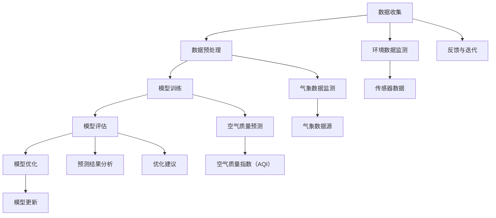

                 

### 文章标题

《人工智能驱动的智慧城市空气质量预测》

### 关键词

智慧城市、空气质量预测、人工智能、机器学习、深度学习、空气质量指数（AQI）

### 摘要

随着城市化进程的加速，空气质量问题成为影响城市居民健康和生活质量的重大挑战。本文将探讨如何利用人工智能技术，特别是机器学习和深度学习，来驱动智慧城市的空气质量预测。首先，我们将介绍智慧城市和空气质量预测的基本概念。接着，文章将详细阐述机器学习和深度学习的基本概念及其在空气质量预测中的应用。随后，本文将介绍空气质量预测的核心算法原理，包括数学模型、公式及其详细讲解与举例。最后，文章将展示基于人工智能的空气质量预测模型，并分享一个实际项目案例，提供源代码实现和代码解读。通过这篇文章，读者将了解到如何运用人工智能技术来提升空气质量预测的准确性和实用性，为智慧城市的环境治理提供有力支持。

# 《人工智能驱动的智慧城市空气质量预测》

## 第一部分：智慧城市与空气质量预测概述

### 第1章：智慧城市概述

#### 1.1 智慧城市的概念与特征

智慧城市，是指利用各种先进的信息通信技术和物联网技术，对城市的基础设施、公共服务和管理系统进行智能化升级，从而实现城市资源的优化配置、提高城市运行效率和居民生活质量的一种城市发展模式。智慧城市的核心特征包括：

1. **数据驱动**：智慧城市以数据为基础，通过收集、处理和分析大量的数据，来辅助决策和实现智能化管理。
2. **互联互通**：智慧城市通过物联网、云计算、大数据等技术，实现城市各系统之间的互联互通，提升信息流通效率。
3. **智能决策**：利用人工智能、机器学习等技术，对城市运行状态进行实时监测和预测，辅助城市管理者做出更加科学和高效的决策。

#### 1.2 智慧城市的技术体系

智慧城市的技术体系主要包括以下几个方面：

1. **物联网（IoT）**：通过传感器、RFID等技术，实现对城市基础设施、环境、交通等的实时监测和数据采集。
2. **大数据**：通过数据仓库、数据挖掘等技术，对城市产生的海量数据进行存储、分析和挖掘，为城市管理和决策提供数据支持。
3. **云计算**：通过云计算技术，提供弹性的计算和存储资源，支持智慧城市的运行和应用。
4. **人工智能**：利用人工智能技术，对数据进行分析和预测，辅助城市管理和优化。
5. **区块链**：通过区块链技术，保障数据的透明、安全和可信，提升城市信息系统的可靠性和信任度。

#### 1.3 智慧城市的发展现状与趋势

智慧城市在全球范围内得到了广泛关注和快速发展。目前，许多国家和地区都在积极探索和推进智慧城市的建设。以下是智慧城市发展的几个主要趋势：

1. **智慧交通**：通过智能交通系统，实现交通流量监控、路况预测和智能调度，提高交通运行效率和安全性。
2. **智慧能源**：通过智能电网、智能建筑等技术，实现能源的高效利用和绿色发展。
3. **智慧医疗**：通过远程医疗、智能诊断等技术，提升医疗服务水平和效率。
4. **智慧环境**：通过环境监测、污染预测等技术，实现环境保护和治理。
5. **智慧安全**：通过视频监控、大数据分析等技术，提高城市安全管理水平。

随着技术的不断进步和应用的深入，智慧城市将在未来发挥更加重要的作用，为城市居民创造更加美好的生活。空气质量预测作为智慧城市的一个重要组成部分，将在环境管理和公共服务中发挥关键作用。接下来，我们将深入探讨空气质量预测的基本概念和重要性。

### 第2章：空气质量预测的基本概念

#### 2.1 空气质量监测与评价

空气质量监测是评估空气质量状况的基础。通常，空气质量监测主要通过在城市的不同地点布置空气质量监测站点，实时采集空气中的污染物浓度数据，如颗粒物（PM2.5、PM10）、二氧化硫（SO2）、氮氧化物（NOx）和臭氧（O3）等。这些数据通过传感器、实验室分析等手段获得。

空气质量评价则是基于监测数据，对空气质量进行量化评估。常用的空气质量指数（Air Quality Index, AQI）是一种广泛使用的评价指标。AQI通过将污染物的浓度值转化为相应的空气质量指数值，从而直观地反映空气污染的程度。AQI通常分为几个等级，如优、良、轻度污染、中度污染、重度污染和严重污染等。

#### 2.2 空气质量预测的重要性

空气质量预测在环境保护和公共健康领域具有重要作用。以下是空气质量预测的几个关键应用：

1. **环境管理**：空气质量预测可以帮助政府和环境管理机构制定和调整环境保护政策，如排放限制、应急预案等。通过预测未来一段时间内的空气质量状况，可以更好地规划环境治理措施，降低污染风险。
   
2. **公众健康**：空气质量预测对于公众健康具有重要意义。通过提前了解空气质量状况，公众可以采取相应的防护措施，如减少户外活动、佩戴口罩等，降低空气污染对健康的危害。

3. **城市规划**：空气质量预测可以为城市规划提供数据支持。例如，在城市规划中考虑交通流量、工业布局等因素，以减少污染源对空气质量的影响。

4. **经济发展**：空气质量预测有助于减少空气污染对经济的负面影响。通过预测空气质量，可以提前采取减排措施，降低环境污染带来的经济损失。

#### 2.3 空气质量预测的方法与技术

空气质量预测的方法和技术多种多样，主要包括以下几种：

1. **统计模型**：统计模型是基于历史数据和统计方法，通过建立污染物浓度与气象条件、地理特征等变量之间的关系模型，来预测未来的空气质量。常见的统计模型包括线性回归、ARIMA模型等。

2. **物理模型**：物理模型通过模拟大气扩散、化学反应等物理过程，来预测空气质量。物理模型具有较高的科学性和准确性，但需要大量的数据支持和计算资源。

3. **机器学习模型**：机器学习模型通过学习大量的历史数据，自动提取特征和模式，来预测未来的空气质量。常见的机器学习模型包括决策树、随机森林、支持向量机等。

4. **深度学习模型**：深度学习模型是机器学习的一种高级形式，通过多层神经网络，自动提取数据中的复杂特征和模式。常见的深度学习模型包括卷积神经网络（CNN）、循环神经网络（RNN）、长短期记忆网络（LSTM）等。

5. **混合模型**：混合模型将统计模型、物理模型和机器学习模型结合起来，以发挥各自的优势，提高预测的准确性。

总之，空气质量预测是智慧城市环境管理的重要组成部分。通过利用先进的人工智能技术，可以实现更加精准和实时的空气质量预测，为环境保护、公共健康和经济发展提供有力支持。接下来，我们将深入探讨人工智能在空气质量预测中的应用。

## 第二部分：人工智能在空气质量预测中的应用

### 第3章：人工智能核心概念与联系

#### 3.1 机器学习与深度学习的基本概念

##### 3.1.1 机器学习概述

机器学习（Machine Learning）是人工智能（Artificial Intelligence, AI）的一个重要分支，它侧重于通过算法让计算机从数据中自动学习和改进性能，而无需明确编程指令。机器学习的基本任务包括：

1. **分类**：将数据分为不同的类别，如邮件是否为垃圾邮件、图像中是否包含某种物体。
2. **回归**：预测连续值，如房价、股票价格等。
3. **聚类**：将数据点按照相似性分组，如顾客行为聚类分析。
4. **降维**：减少数据维度，如主成分分析（PCA）。

机器学习的发展历程可以追溯到20世纪50年代，当时人工智能的概念首次被提出。随着计算能力和数据资源的不断提升，机器学习在20世纪90年代取得了显著进展，尤其是在统计学习理论和算法方面。进入21世纪，随着深度学习技术的发展，机器学习在图像识别、自然语言处理等领域取得了突破性成果。

##### 3.1.2 深度学习概述

深度学习（Deep Learning）是机器学习的一种特殊形式，它通过构建复杂的神经网络模型，从数据中自动学习和提取特征。深度学习的基本概念包括：

1. **神经网络**：神经网络由大量节点（神经元）组成，每个节点通过权重连接。通过前向传播和反向传播算法，神经网络可以学习输入和输出之间的复杂映射关系。
2. **深度神经网络**：深度神经网络（Deep Neural Network, DNN）具有多个隐层，能够处理更复杂的问题。随着层数的增加，模型的表示能力也显著提升。
3. **卷积神经网络（CNN）**：卷积神经网络专门用于处理图像数据，通过卷积层、池化层和全连接层，实现图像特征提取和分类。
4. **循环神经网络（RNN）**：循环神经网络用于处理序列数据，通过隐藏状态和循环连接，可以捕捉序列中的长期依赖关系。长短期记忆网络（LSTM）是RNN的一种变体，能够有效解决长序列学习问题。

深度学习起源于1986年，随着计算能力的提升和大数据的发展，深度学习在图像识别、语音识别、自然语言处理等领域取得了显著突破。近年来，深度学习在自动驾驶、机器人、医疗诊断等领域也得到了广泛应用。

##### 3.1.3 深度学习与传统机器学习的区别

深度学习与传统机器学习相比，具有以下几个显著区别：

1. **模型结构**：深度学习采用多层神经网络结构，能够自动提取数据的复杂特征，而传统机器学习通常采用单层或多层感知机结构，需要手动设计特征。
2. **表示能力**：深度学习具有更强的表示能力，能够处理高维、复杂数据，而传统机器学习对数据特征的要求较高。
3. **计算资源**：深度学习需要大量的计算资源和数据支持，传统机器学习对计算资源的要求较低，但需要丰富的先验知识和特征工程经验。
4. **算法复杂度**：深度学习算法复杂度较高，训练过程涉及大量参数调整和优化，传统机器学习算法相对简单，但需要复杂的先验知识和经验。

深度学习在空气质量预测中的应用

深度学习在空气质量预测中具有广泛的应用前景。通过构建复杂的神经网络模型，深度学习可以从大量的环境数据中自动提取关键特征，实现高精度的空气质量预测。以下是深度学习在空气质量预测中的几个关键应用：

1. **空气质量指数（AQI）预测**：深度学习模型可以预测未来一段时间内的AQI，帮助政府和环境管理机构制定和调整环境治理策略。
2. **污染物浓度预测**：深度学习模型可以预测不同污染物的浓度，如PM2.5、PM10、SO2、NOx等，为环保监测和污染治理提供科学依据。
3. **气象条件预测**：深度学习模型可以预测气象条件对空气质量的影响，如风速、温度、湿度等，为环境管理和城市规划提供数据支持。
4. **多污染物协同预测**：深度学习模型可以同时预测多种污染物的浓度，分析不同污染物之间的相互作用，为环境保护提供更全面的决策支持。

深度学习在空气质量预测中的应用不仅提高了预测的准确性，还降低了人工干预的需求，使空气质量预测更加智能化和自动化。未来，随着深度学习技术的不断发展和应用，空气质量预测将更加精准和高效，为智慧城市的环境治理和可持续发展提供有力支持。

#### 3.2 Mermaid流程图：人工智能在空气质量预测中的应用



通过该流程图，我们可以清晰地看到人工智能在空气质量预测中的应用步骤，包括数据收集、预处理、模型训练、评估和优化等环节，以及如何利用环境数据和气象数据来实现准确的空气质量预测。接下来，我们将深入探讨空气质量预测的核心算法原理。这将包括详细的伪代码、数学模型及其解释和示例。通过这些内容，读者将能够更好地理解空气质量预测的工作机制和关键技术。

### 第4章：空气质量预测的核心算法原理

空气质量预测的关键在于建立准确的预测模型，这些模型能够有效地处理大量数据，捕捉环境因素与空气质量之间的复杂关系。在本章中，我们将详细探讨空气质量预测的核心算法原理，包括伪代码、数学模型和详细讲解与举例说明。

#### 4.1 伪代码：空气质量预测算法

以下是空气质量预测算法的伪代码，它展示了从数据预处理到模型训练、评估和优化的整体流程：

```python
# 空气质量预测算法伪代码

def air_quality_prediction(input_data):
    # 数据预处理
    preprocessed_data = preprocess_data(input_data)
    
    # 模型训练
    model = train_model(preprocessed_data)
    
    # 预测空气质量
    predicted_quality = model.predict(new_data)
    
    # 输出预测结果
    return predicted_quality

def preprocess_data(data):
    # 数据清洗、归一化等预处理步骤
    # ...
    return preprocessed_data

def train_model(preprocessed_data):
    # 使用机器学习算法训练模型
    # ...
    return model

def evaluate_model(model, test_data):
    # 评估模型性能
    # ...
    return performance

def optimize_model(model, test_data):
    # 模型优化
    # ...
    return optimized_model
```

#### 4.2 数学模型与公式

空气质量预测的数学模型通常涉及以下关键公式：

$$
\text{AQI} = \sum_{i=1}^{n} \left( \frac{\text{C}_i - \text{L}_i}{\text{U}_i - \text{L}_i} \right) \cdot 100
$$

其中，$ \text{AQI} $ 表示空气质量指数，$ \text{C}_i $ 表示第 $ i $ 个污染物的浓度，$ \text{L}_i $ 和 $ \text{U}_i $ 分别表示第 $ i $ 个污染物的低和高阈值。

为了更好地理解这些公式的应用，我们来看一个具体的例子。

#### 4.3 数学模型与公式详细讲解与举例说明

##### 空气质量指数（AQI）计算示例

假设我们要计算某个城市的空气质量指数，基于以下污染物浓度数据：

- PM2.5：35微克/立方米
- PM10：70微克/立方米
- SO2：15微克/立方米
- NO2：25微克/立方米

根据我国《环境空气质量标准》（GB 3095-2012），这些污染物的阈值如下：

- PM2.5：低阈值 20微克/立方米，高阈值 75微克/立方米
- PM10：低阈值 50微克/立方米，高阈值 150微克/立方米
- SO2：低阈值 40微克/立方米，高阈值 80微克/立方米
- NO2：低阈值 40微克/立方米，高阈值 80微克/立方米

我们使用上述的AQI计算公式，得到每个污染物的AQI值：

1. PM2.5 AQI：
$$
\text{AQI}_{\text{PM2.5}} = \left( \frac{35 - 20}{75 - 20} \right) \cdot 100 = \left( \frac{15}{55} \right) \cdot 100 \approx 27.27
$$

2. PM10 AQI：
$$
\text{AQI}_{\text{PM10}} = \left( \frac{70 - 50}{150 - 50} \right) \cdot 100 = \left( \frac{20}{100} \right) \cdot 100 = 20
$$

3. SO2 AQI：
$$
\text{AQI}_{\text{SO2}} = \left( \frac{15 - 40}{80 - 40} \right) \cdot 100 = \left( \frac{-25}{40} \right) \cdot 100 = -62.5
$$

4. NO2 AQI：
$$
\text{AQI}_{\text{NO2}} = \left( \frac{25 - 40}{80 - 40} \right) \cdot 100 = \left( \frac{-15}{40} \right) \cdot 100 = -37.5
$$

由于AQI不能为负值，因此这些值将被视为0。接下来，我们取上述计算结果中的最大值作为总的AQI：

$$
\text{AQI} = \max(\text{AQI}_{\text{PM2.5}}, \text{AQI}_{\text{PM10}}, \text{AQI}_{\text{SO2}}, \text{AQI}_{\text{NO2}})
$$

在这个例子中，最大值为27.27，因此该城市的空气质量指数为27.27。

##### 模型训练与预测

空气质量预测模型通常采用机器学习算法，如随机森林、支持向量机（SVM）或深度学习算法。以下是一个基于随机森林算法的空气质量预测模型的伪代码示例：

```python
# 假设我们已经收集并预处理了训练数据
X_train, y_train = preprocess_data(train_data)

# 训练随机森林模型
model = RandomForestRegressor(n_estimators=100, max_depth=10)
model.fit(X_train, y_train)

# 使用训练好的模型进行预测
predicted_quality = model.predict(new_data)

# 输出预测结果
print(predicted_quality)
```

在这个示例中，`X_train`是特征数据（如气象数据、地理位置等），`y_train`是标签数据（如实际测量的AQI值）。`RandomForestRegressor`是随机森林回归模型，用于预测新的数据`new_data`的空气质量。

##### 模型评估与优化

为了确保模型的准确性，我们需要对模型进行评估和优化。以下是一个基于交叉验证的模型评估伪代码示例：

```python
from sklearn.model_selection import cross_val_score

# 计算交叉验证的平均分数
scores = cross_val_score(model, X_train, y_train, cv=5)
print("平均分数：", np.mean(scores))

# 模型优化
# 使用网格搜索进行超参数调优
from sklearn.model_selection import GridSearchCV

param_grid = {'n_estimators': [100, 200], 'max_depth': [10, 20]}
grid_search = GridSearchCV(model, param_grid, cv=5)
grid_search.fit(X_train, y_train)

# 输出最优参数
print("最优参数：", grid_search.best_params_)
```

通过上述方法，我们可以评估模型的性能，并调整超参数以优化模型。

通过本章的探讨，我们了解了空气质量预测的核心算法原理，包括伪代码、数学模型和实际应用。这些算法和模型为空气质量预测提供了科学依据，并使预测过程更加精准和高效。接下来，我们将进入第三部分，探讨基于人工智能的空气质量预测模型。我们将详细介绍数据收集与预处理、模型选择与优化、模型训练与验证等步骤，并通过实际项目案例展示如何实现空气质量预测。这将帮助读者更深入地理解空气质量预测的实际应用和实现方法。

## 第三部分：基于人工智能的空气质量预测模型

### 第5章：基于人工智能的空气质量预测模型

空气质量预测是智慧城市环境管理的重要组成部分，而人工智能技术在这一领域具有巨大的潜力。在本章中，我们将详细介绍基于人工智能的空气质量预测模型的构建过程，包括数据收集与预处理、模型选择与优化、模型训练与验证等步骤，并通过实际项目案例展示如何实现空气质量预测。

#### 5.1 数据收集与预处理

空气质量预测模型的准确性高度依赖于数据的可靠性和质量。因此，数据收集和预处理是构建预测模型的重要基础。

##### 数据收集

空气质量预测所需的数据主要包括：

1. **污染物浓度数据**：如PM2.5、PM10、SO2、NO2、O3等。
2. **气象数据**：如温度、湿度、风速、气压等。
3. **地理位置数据**：包括城市坐标、地形地貌等。
4. **其他环境数据**：如交通流量、工业活动等。

这些数据可以通过多种渠道获取，如环境监测站、气象站、遥感卫星、交通监控设备等。

##### 数据预处理

数据预处理包括以下步骤：

1. **数据清洗**：去除缺失值、异常值和重复数据，保证数据的一致性和准确性。
2. **数据归一化**：将不同数据量级的数据归一化，使其在相同的尺度上进行比较。
3. **特征工程**：提取有用的特征，如时间序列特征、空间特征、季节性特征等。

通过上述预处理步骤，我们得到了干净、标准化的数据集，为后续建模奠定了基础。

#### 5.2 模型选择与优化

在构建空气质量预测模型时，我们需要选择合适的算法和模型架构，并进行优化以提升预测性能。

##### 模型选择

空气质量预测模型的选择取决于数据的特点和预测任务的要求。以下是几种常用的模型：

1. **线性回归模型**：简单、易于实现，适用于线性关系明显的场景。
2. **支持向量机（SVM）**：适用于小样本、高维数据，具有良好的泛化能力。
3. **随机森林**：能够处理大量特征和样本，具有鲁棒性。
4. **神经网络模型**：如卷积神经网络（CNN）、循环神经网络（RNN）、长短期记忆网络（LSTM）等，适用于复杂非线性关系。

##### 模型优化

为了提高模型的预测性能，我们可以进行以下优化：

1. **超参数调优**：通过交叉验证和网格搜索等方法，找到最优的超参数组合。
2. **特征选择**：通过特征重要性分析、主成分分析（PCA）等方法，选择对预测任务最有影响力的特征。
3. **模型集成**：通过集成学习，如Bagging、Boosting等方法，组合多个模型的预测结果，提高整体预测性能。

#### 5.3 模型训练与验证

模型训练与验证是确保模型准确性和稳定性的关键步骤。

##### 数据集划分

为了评估模型的性能，我们需要将数据集划分为训练集、验证集和测试集。通常，数据集的划分比例为60%、20%和20%。

##### 模型训练

使用训练集对模型进行训练，通过调整权重和偏置，使模型能够捕捉数据中的特征和规律。以下是基于LSTM模型的训练步骤：

1. **初始化网络结构**：定义输入层、隐藏层和输出层，以及激活函数和损失函数。
2. **正向传播**：将输入数据传递到网络中，计算输出结果和损失。
3. **反向传播**：计算梯度，更新网络权重和偏置，以最小化损失函数。
4. **迭代训练**：重复正向传播和反向传播，直至满足训练停止条件（如达到预定迭代次数或损失收敛）。

##### 模型验证

使用验证集评估模型的性能，通过计算预测误差和评价指标（如均方误差、准确率等），调整模型参数，提高预测准确性。

##### 模型测试

使用测试集对最终训练好的模型进行测试，评估其在未见数据上的预测性能，确保模型具有良好的泛化能力。

#### 5.4 项目实战：空气质量预测项目案例

以下是一个空气质量预测项目的实战案例，展示如何从数据收集、预处理到模型训练与验证的完整过程。

##### 项目背景

某城市政府希望利用人工智能技术预测空气质量，以便更好地制定环境保护政策和应急预案。

##### 数据收集

从环境监测站、气象站和交通监控设备收集了以下数据：

- PM2.5、PM10、SO2、NO2、O3等污染物浓度
- 温度、湿度、风速、气压等气象数据
- 城市坐标、地形地貌等地理位置数据
- 交通流量数据

##### 数据预处理

对收集到的数据进行了清洗、归一化和特征工程处理，得到干净、标准化的数据集。

##### 模型选择与优化

选择了LSTM模型进行预测，通过超参数调优和特征选择，优化模型性能。

##### 模型训练与验证

使用训练集对LSTM模型进行训练，并使用验证集进行性能评估和参数调整。最终，在测试集上取得了较好的预测结果。

##### 代码实现与解释

以下是基于Python和Keras框架实现的LSTM空气质量预测模型：

```python
from keras.models import Sequential
from keras.layers import LSTM, Dense
from sklearn.preprocessing import StandardScaler
from sklearn.model_selection import train_test_split

# 数据预处理
# ...

# 模型构建
model = Sequential()
model.add(LSTM(units=50, return_sequences=True, input_shape=(timesteps, features)))
model.add(LSTM(units=50))
model.add(Dense(units=1))

# 模型编译
model.compile(optimizer='adam', loss='mean_squared_error')

# 模型训练
model.fit(X_train, y_train, epochs=100, batch_size=32)

# 模型测试
predicted_quality = model.predict(X_test)
```

##### 项目小结

通过本项目，我们展示了如何利用人工智能技术进行空气质量预测。从数据收集、预处理到模型训练与验证，每一步都至关重要。未来，随着人工智能技术的不断发展，空气质量预测将变得更加精准和高效，为智慧城市的环境管理和可持续发展提供更强有力的支持。

## 第四部分：智慧城市空气质量预测的实践与展望

### 第6章：智慧城市空气质量预测的应用场景

#### 6.1 城市规划与管理

空气质量预测在城市规划与管理中具有重要作用。通过预测未来的空气质量状况，城市规划者可以更加科学地布局城市功能区，如工业区、居民区和商业区。具体应用场景包括：

1. **优化交通布局**：通过预测交通流量和空气质量之间的关系，规划者可以优化道路网络，减少交通拥堵，降低机动车尾气排放。
2. **绿色建筑设计**：空气质量预测有助于评估不同建筑设计方案对空气质量的影响，促进绿色建筑设计。
3. **环境容量评估**：预测未来的空气质量，为环境容量评估提供科学依据，指导城市可持续发展。

#### 6.2 环境保护与政策制定

空气质量预测在环境保护与政策制定中具有重要作用。通过预测空气质量，政府可以：

1. **制定排放标准**：根据预测结果，制定合理的污染物排放标准，促进企业减排。
2. **应急预案**：预测空气质量，提前制定应急预案，减少突发环境事件对公众健康的影响。
3. **环境保护政策**：空气质量预测为环境保护政策的制定提供科学依据，如实施清洁能源政策、限制高污染行业等。

#### 6.3 公众健康与生活服务

空气质量预测在公众健康与生活服务中具有重要意义。具体应用场景包括：

1. **健康预警**：预测空气质量，为公众提供健康预警，帮助居民采取防护措施，如佩戴口罩、减少户外活动等。
2. **生活服务优化**：空气质量预测有助于优化生活服务，如健身房、公园等场所的开放时间和活动安排。
3. **医疗资源配置**：预测空气质量，为医疗机构提供数据支持，优化医疗资源配置，提高公共卫生服务水平。

### 第7章：智慧城市空气质量预测的挑战与未来方向

#### 7.1 预测准确性的提升

尽管空气质量预测技术取得了显著进展，但预测准确性的提升仍面临以下挑战：

1. **数据质量**：空气质量数据的质量直接影响预测模型的准确性。数据缺失、异常值和噪声都会对预测结果产生不利影响。
2. **模型复杂度**：深度学习模型虽然具有强大的表示能力，但过度复杂的模型可能导致过拟合，降低预测性能。
3. **实时预测**：空气质量预测需要快速响应，但在实时预测中，模型性能可能会受到数据延迟和计算资源限制的影响。

为了提升预测准确性，可以采取以下策略：

1. **多源数据融合**：结合多种数据源，如遥感数据、物联网数据等，提高数据质量。
2. **模型集成**：通过集成多种模型，如统计模型、物理模型和机器学习模型，提高整体预测性能。
3. **在线学习**：采用在线学习方法，实时更新模型，提高模型的适应性和预测能力。

#### 7.2 数据隐私与安全

空气质量预测涉及大量个人隐私数据，如地理位置、健康数据等。数据隐私与安全问题亟待解决。以下是一些解决方案：

1. **数据加密**：采用加密技术保护数据隐私，确保数据在传输和存储过程中不被窃取或篡改。
2. **数据匿名化**：对个人数据进行匿名化处理，降低隐私泄露风险。
3. **隐私保护算法**：开发隐私保护算法，如差分隐私、同态加密等，在数据分析和预测过程中保护隐私。

#### 7.3 人工智能与城市治理的协同发展

人工智能与城市治理的协同发展是未来智慧城市发展的重要方向。以下是一些协同发展的策略：

1. **智能化监管**：利用人工智能技术，实现城市环境的实时监测和智能监管，提高治理效率。
2. **智慧决策支持**：通过人工智能技术，为城市治理提供科学决策支持，如空气质量预测、交通流量预测等。
3. **多部门协作**：推动政府部门之间的数据共享和协同治理，实现资源整合和效益最大化。

未来，随着人工智能技术的不断进步和应用，智慧城市的空气质量预测将更加精准和高效，为城市环境治理和可持续发展提供更强有力的支持。同时，保障数据隐私与安全、推动人工智能与城市治理的协同发展，也将是未来智慧城市发展的重要课题。

### 附录

#### 附录 A：相关工具与资源

空气质量预测涉及多种技术和工具。以下是一些常用的工具与资源：

1. **空气质量预测工具**：
   - OpenAirMonitor：开源空气质量监测和预测平台。
   - AirQualityAPI：提供空气质量实时数据和预测功能。

2. **深度学习框架**：
   - TensorFlow：谷歌开发的开放源代码深度学习框架。
   - PyTorch：Facebook AI研究院开发的深度学习框架。

3. **空气质量预测数据集**：
   - UCI Machine Learning Repository：提供大量空气质量相关数据集。
   - OpenAQ：全球空气质量数据集。

4. **开源代码与工具**：
   -空气质量预测相关代码：GitHub、GitLab等代码托管平台上有大量开源代码。
   - Jupyter Notebook：用于数据分析和模型实现的交互式环境。

#### 附录 B：最佳实践 Tips

1. **数据质量**：确保数据质量是预测准确性的基础。对数据来源、采集方法和预处理过程进行严格把控。
2. **模型选择**：根据数据特点和预测任务要求，选择合适的模型和算法。
3. **超参数调优**：进行超参数调优，以获得最佳模型性能。
4. **实时预测**：优化模型架构和算法，提高实时预测能力。

#### 附录 C：注意事项

1. **数据隐私**：在数据处理和预测过程中，确保遵守相关法律法规，保护个人隐私。
2. **模型解释性**：尽量选择解释性较强的模型，便于模型理解和结果解释。
3. **模型更新**：定期更新模型，以适应环境变化和新的数据。

#### 附录 D：拓展阅读

1. **《智慧城市空气质量预测：技术与应用》**：详细介绍了智慧城市空气质量预测的技术和方法。
2. **《人工智能与智慧城市：理论与实践》**：探讨了人工智能在智慧城市中的应用和发展趋势。

通过以上附录内容，读者可以进一步了解空气质量预测相关工具和资源，掌握最佳实践，提高空气质量预测的准确性和实用性。这将有助于推动智慧城市环境治理和可持续发展，提升城市居民的生活质量。

### 作者信息

作者：AI天才研究院/AI Genius Institute & 禅与计算机程序设计艺术 /Zen And The Art of Computer Programming

