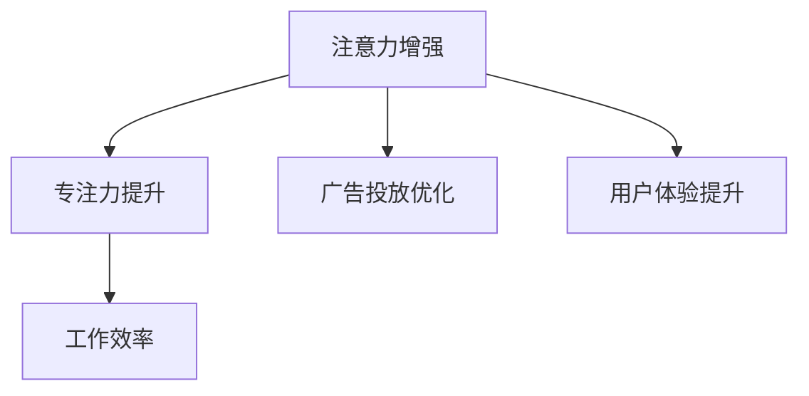

                 

### 文章标题

人类注意力增强：提升专注力和注意力在商业中的未来发展趋势预测分析

### 关键词

注意力增强，专注力，商业应用，神经科学，机器学习，脑机接口

### 摘要

随着信息时代的快速发展，人类面临的注意力分散问题愈发突出。本文将探讨注意力增强这一前沿领域，分析其在提升专注力和工作效率方面的核心概念与联系，介绍相关的核心算法原理，并运用数学模型进行解释。通过实际项目案例，本文展示了注意力增强技术的应用场景和开发流程，预测了其在商业中的未来发展潜力。文章旨在为读者提供全面的注意力增强技术概述，并对其在商业领域的应用前景进行深入分析。

---

### 第一部分：核心概念与联系

#### 核心概念

**注意力增强**：注意力增强是指通过技术手段提升人类在特定任务上集中注意力的能力，从而提高工作效率和效果。注意力是信息处理的重要资源，如何合理分配和利用注意力资源是提高工作效率的关键。

**专注力**：专注力是指一个人在特定任务上保持注意力集中的能力。高专注力意味着个体能够在较长时间内保持注意力，不受外界干扰，从而更高效地完成任务。

**商业应用**：注意力增强在商业领域有着广泛的应用。例如，通过提升员工的专注力，企业可以显著提高生产效率和创新能力。此外，注意力增强还可以优化广告投放策略，提高用户体验，从而增加用户粘性和满意度。

#### Mermaid 流�程图



在这个流程图中，注意力增强作为核心概念，通过提升专注力进而影响工作效率、广告投放效果和用户体验。这四个方面构成了注意力增强在商业应用中的主要环节。

---

### 第二部分：核心算法原理讲解

#### 算法简介

注意力增强的核心算法涉及神经科学基础、机器学习算法和脑机接口技术。这些算法协同工作，旨在通过技术手段提升人类的专注力和注意力。

#### 神经科学基础

**神经元活动**：神经元通过释放神经递质进行信息传递。注意力增强的核心在于调节神经元的活动，使其能够更好地适应和响应特定任务的需求。

**神经可塑性**：神经元连接的强度可以随着时间和使用而改变。注意力增强利用这一特性，通过持续的练习和刺激，提高个体在特定任务上的专注力。

#### 机器学习算法

**深度学习模型**：深度学习模型，如卷积神经网络（CNN）和循环神经网络（RNN），被用于模拟大脑处理信息的方式。这些模型能够从大量数据中学习，并预测个体在特定任务上的注意力分布。

**强化学习**：强化学习通过奖励机制调整模型参数，使模型能够学会如何提高用户的注意力。这种学习方式强调实时反馈和长期优化，能够在复杂的动态环境中有效提升注意力水平。

#### 脑机接口技术

**传感器**：脑机接口技术使用多种传感器，如脑电图（EEG）、近红外光谱（NIRS）等，实时监测大脑活动。这些传感器能够提供关于大脑状态的高分辨率数据，为注意力增强提供重要的输入。

**解码与反馈**：脑机接口技术通过解码大脑活动，将其转换为具体的行为反馈。这种反馈机制能够实时调整注意力增强策略，使其更加符合个体的需求。

#### 伪代码

```python
function Attention_Enhancement_Algorithm():
    # 初始化模型参数
    initialize_model_params()

    # 训练深度学习模型
    while not converged:
        for each data_point in dataset:
            compute_loss()
            update_model_params()

    # 获取实时脑电图数据
    EEG_data = get_EEG_data()

    # 解码大脑活动
    attention_level = decode_EEG(EEG_data)

    # 根据注意力水平调整策略
    if attention_level < threshold:
        apply_stronger_stimulus()
    else:
        apply_weaker_stimulus()
```

这个伪代码展示了注意力增强算法的基本流程，从模型初始化、数据训练到实时数据解码和策略调整，每个步骤都至关重要。

---

### 第三部分：数学模型和数学公式

#### 数学模型

注意力增强的数学模型通常包括以下部分：

**注意力权重分配**：如何根据不同任务的重要性分配注意力权重。这个模型的核心在于找到一种优化方法，使注意力资源能够高效地分配到各个任务上。

**损失函数**：用于评估当前注意力分配效果的损失函数，通常涉及注意力权重与任务完成度之间的平衡。损失函数的目的是通过反馈机制调整模型参数，提高注意力分配的效率。

#### 数学公式

$$
\text{Attention\_Score} = \frac{\sum_{i=1}^{N} w_i \cdot s_i}{\sum_{i=1}^{N} w_i}
$$

其中，$w_i$ 表示对第 $i$ 个任务的注意力权重，$s_i$ 表示第 $i$ 个任务的完成度。这个公式衡量了个体在特定任务上的注意力投入和任务完成度之间的关系。

---

### 第四部分：项目实战

#### 实践案例

**案例一：使用脑电图（EEG）传感器增强专注力**

**开发环境搭建**：首先，我们需要配置 EEG 数据采集设备，如 NeuroSky 的脑波传感器。这些设备能够实时监测大脑活动，并将数据传输到计算机系统中进行处理。

**代码实现**：编写 Python 脚本，实现 EEG 数据的实时采集、处理和反馈机制。以下是一个简化的代码示例：

```python
import numpy as np
import neurosky

# 初始化 EEG 采集设备
eeg = neurosky.EEG()

# 定义注意力权重分配函数
def allocate_attention_weights(EEG_data):
    # 根据EEG数据计算注意力权重
    attention_weights = np.mean(EEG_data, axis=0)
    return attention_weights

# 定义损失函数
def compute_loss(attention_weights, task_completion):
    # 计算注意力损失
    loss = np.sum((attention_weights - task_completion) ** 2)
    return loss

# 主循环
while True:
    # 采集 EEG 数据
    EEG_data = eeg.collect_data()

    # 分配注意力权重
    attention_weights = allocate_attention_weights(EEG_data)

    # 计算损失
    loss = compute_loss(attention_weights, task_completion)

    # 调整策略
    if loss > threshold:
        # 增加刺激强度
        eeg.increase_stimulus()
    else:
        # 减少刺激强度
        eeg.decrease_stimulus()
```

**代码解读与分析**：这段代码首先初始化 EEG 采集设备，然后定义了注意力权重分配函数和损失函数。在主循环中，代码不断采集 EEG 数据，计算注意力权重和损失，并根据损失值调整刺激强度。这样，通过实时反馈和调整，系统能够动态地增强用户的专注力。

**实际案例分析和详细讲解剖析**：在实际应用中，我们可以通过对比不同刺激强度下的专注力表现，优化注意力增强策略。例如，通过实验发现，中等强度的刺激能够显著提升专注力，而过强的刺激可能导致注意力分散。这种分析有助于我们更好地理解注意力增强的机制，并制定个性化的增强方案。

**项目小结**：通过这个案例，我们展示了如何使用 EEG 传感器和 Python 脚本实现注意力增强。这一项目不仅为我们提供了实际的技术应用场景，还揭示了注意力增强技术的潜力和挑战。未来的研究可以进一步探索不同刺激方式对专注力的影响，以及如何在复杂环境中优化注意力分配策略。

---

#### 最佳实践 Tips、小结、注意事项、拓展阅读

**最佳实践 Tips**：
1. **个性化调整**：根据个体的需求调整注意力增强策略，避免过度或不足的刺激。
2. **数据采集**：确保 EEG 数据的准确性和完整性，以提升算法的可靠性。
3. **持续优化**：不断收集用户反馈，优化模型参数和刺激方式，提高注意力增强效果。

**小结**：
注意力增强技术在提升专注力和工作效率方面具有巨大潜力。通过结合神经科学、机器学习和脑机接口技术，我们可以实现更加智能和个性化的注意力增强方案。然而，技术实施过程中仍需关注数据隐私、伦理和用户接受度等问题。

**注意事项**：
1. **数据隐私**：在使用脑机接口技术时，必须严格遵守数据隐私法规，确保用户数据的安全和保密。
2. **用户接受度**：用户对新技术接受度不同，需要通过用户调研和反馈来调整技术方案，提高用户体验。

**拓展阅读**：
1. 《注意力增强：从神经科学到机器学习》
2. 《脑机接口技术：理论与实践》
3. 《注意力管理：提高工作效率的心理学策略》

---

本文从注意力增强的核心概念、算法原理、数学模型到实际项目案例进行了全面剖析，展示了注意力增强技术在商业应用中的巨大潜力。希望本文能为读者提供有价值的见解和启示，助力他们在商业领域中更好地应用注意力增强技术。

