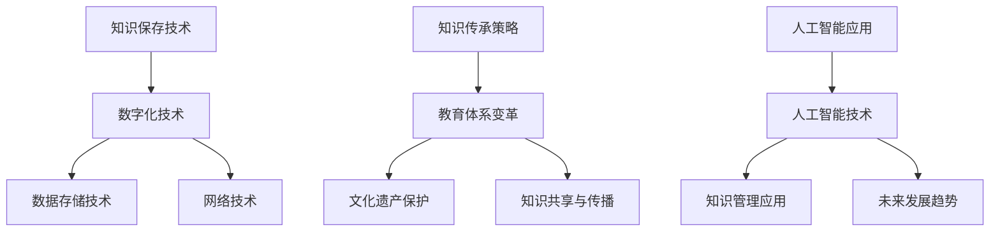

                 

### 文章标题

《人类知识的保存与传承：一座座灯塔指引未来》

> 关键词：知识保存、知识传承、数字化技术、人工智能、教育体系、文化遗产保护、知识共享

> 摘要：本文通过分析人类知识保存与传承的技术手段、实践与策略，探讨了教育体系的变革、文化遗产的保护与传承，以及人工智能在知识保存与传承中的应用。文章提出了知识保存与传承的未来展望，并对研究成果进行了总结和展望。

### 目录大纲

# 《人类知识的保存与传承：一座座灯塔指引未来》目录大纲

## 第一部分：引言

### 1. 引言

#### 1.1 研究背景

#### 1.2 研究目的

#### 1.3 研究方法

## 第二部分：人类知识保存的技术手段

### 2. 数字化技术的崛起

#### 2.1 计算机技术的发展

#### 2.2 数据存储技术的发展

#### 2.3 网络技术的进步

## 第三部分：知识传承的实践与策略

### 3. 教育体系的变革

#### 3.1 传统教育的局限性

#### 3.2 教育技术的应用

#### 3.3 教育模式创新

### 4. 文化遗产的保护与传承

#### 4.1 非物质文化遗产的保存

#### 4.2 数字博物馆的建设

#### 4.3 跨文化交流与融合

### 5. 知识共享与传播

#### 5.1 开放获取运动

#### 5.2 知识图谱的构建

#### 5.3 网络社区的作用

## 第四部分：知识保存与传承的未来展望

### 6. 人工智能在知识保存与传承中的应用

#### 6.1 人工智能技术的概述

#### 6.2 人工智能在知识管理中的应用

#### 6.3 人工智能的未来发展趋势

### 7. 结论与展望

#### 7.1 研究成果总结

#### 7.2 研究局限

#### 7.3 未来研究方向

## 附录

### A. 参考文献

### B. 附录A：知识保存与传承相关术语解释

### C. 附录B：知识保存与传承的案例分析

### 图表与公式

#### 1. 知识保存与传承的技术体系结构图

#### 2. 知识保存与传承的数学模型

#### 3. 知识传承效果的评估指标

### 实际案例

#### 1. 开放获取期刊的案例

#### 2. 数字化文化遗产的保存与传承案例

#### 3. 知识共享与传播的案例分析

## 第一部分：引言

### 1. 引言

在信息技术飞速发展的今天，人类知识的保存与传承成为了一个至关重要的问题。知识的保存与传承不仅关乎个体的学习与发展，更关乎整个社会的进步与繁荣。本文将从人类知识保存与传承的技术手段、实践与策略等方面进行探讨，旨在为知识保存与传承提供一种新的思路和方法。

#### 1.1 研究背景

随着互联网的普及和数字化技术的迅猛发展，人类知识的保存与传承面临着前所未有的机遇和挑战。一方面，数字化技术使得知识的存储、传播和获取变得更加便捷和高效；另一方面，信息的爆炸式增长和知识更新的快速迭代也对知识的保存与传承提出了更高的要求。因此，如何有效保存与传承人类知识成为了一个亟待解决的问题。

#### 1.2 研究目的

本文旨在通过分析人类知识保存与传承的技术手段、实践与策略，探讨教育体系的变革、文化遗产的保护与传承，以及人工智能在知识保存与传承中的应用。文章希望能够为知识保存与传承提供一种新的思路和方法，为相关领域的研究和实践提供参考。

#### 1.3 研究方法

本文采用文献综述和案例分析相结合的研究方法。首先，通过对相关领域的研究文献进行梳理和分析，总结人类知识保存与传承的技术手段和实践策略。然后，结合具体案例，探讨知识保存与传承在现实中的应用。通过理论与实践相结合的方式，为知识保存与传承提供全面的解析和思考。

## 第二部分：人类知识保存的技术手段

### 2. 数字化技术的崛起

#### 2.1 计算机技术的发展

计算机技术的发展为人类知识的保存提供了基础。从最早的电子计算机到如今的超级计算机，计算机的处理速度和存储容量得到了极大的提升。计算机技术的进步使得大规模的数据存储和高速的数据检索成为可能，为知识的保存提供了强大的技术支持。

#### 2.2 数据存储技术的发展

数据存储技术的发展为人类知识的保存提供了坚实的保障。从最早的磁盘存储到现在的固态硬盘、云存储等，数据存储技术不断突破存储容量、传输速度和可靠性等方面的限制。这些技术的进步使得知识的保存更加可靠和高效。

#### 2.3 网络技术的进步

网络技术的进步为人类知识的传播和共享提供了便捷的渠道。从早期的局域网到如今的全球互联网，网络技术的不断发展使得知识的传播速度和范围得到了极大的扩展。网络技术的进步不仅促进了知识的共享，也为知识的保存提供了新的可能性。

### 3. 知识传承的实践与策略

#### 3.1 教育体系的变革

教育体系的变革是知识传承的重要途径。传统的教育模式主要依赖于课堂授课和书本知识，而现代教育则更加注重个性化学习和实践能力的培养。教育技术的应用，如在线教育平台、虚拟现实教学等，为知识的传承提供了新的方式。

#### 3.2 文化遗产的保护与传承

文化遗产的保护与传承是知识保存的重要组成部分。数字化技术的应用为文化遗产的保存提供了新的手段。例如，通过三维扫描和虚拟现实技术，可以将文化遗产以数字化的形式保存下来，供后人学习和研究。

#### 3.3 知识共享与传播

知识共享与传播是知识传承的关键。开放获取运动、知识图谱的构建和网络社区的作用为知识的共享与传播提供了新的途径。开放获取运动使得学术研究成果更加易于获取，知识图谱的构建为知识的组织与检索提供了便捷，网络社区则为知识的交流与碰撞提供了平台。

## 第三部分：知识传承的实践与策略

### 3.1 教育体系的变革

#### 3.1.1 传统教育的局限性

传统的教育体系主要依赖于教师授课和学生听课的模式，知识传播的速度和范围受到很大的限制。此外，传统的教育模式往往注重理论知识的传授，而忽视了实践能力的培养。这种教育模式在快速变化的信息时代面临着很大的挑战。

#### 3.1.2 教育技术的应用

随着数字化技术的不断发展，教育技术的应用日益普及。在线教育平台、虚拟现实教学、人工智能辅助教学等技术为教育模式的创新提供了新的契机。通过这些技术，学生可以更加便捷地获取知识，教师也可以更加灵活地传授知识，教育体系得以实现变革。

#### 3.1.3 教育模式创新

教育模式创新是知识传承的关键。通过在线教育平台，学生可以根据自己的需求和兴趣选择课程，实现个性化学习。虚拟现实教学则可以让学生身临其境地体验知识，提高学习的兴趣和效果。人工智能辅助教学可以帮助教师更好地了解学生的学习情况，提供针对性的辅导，提高教学效果。

### 3.2 文化遗产的保护与传承

#### 3.2.1 非物质文化遗产的保存

非物质文化遗产的保存是知识传承的重要组成部分。随着现代化进程的加快，许多非物质文化遗产面临着消失的危险。通过数字化技术，可以将非物质文化遗产以数字化的形式保存下来，供后人学习和研究。

#### 3.2.2 数字博物馆的建设

数字博物馆的建设为文化遗产的保护与传承提供了新的途径。通过虚拟现实、三维扫描等技术，可以将博物馆中的文物以数字化的形式呈现，让更多的人可以在线上参观和学习。

#### 3.2.3 跨文化交流与融合

跨文化交流与融合是文化遗产保护与传承的重要策略。通过举办国际性的文化遗产展览、交流活动，可以增进不同文化之间的了解和尊重，促进文化遗产的传承与发展。

### 3.3 知识共享与传播

#### 3.3.1 开放获取运动

开放获取运动是知识共享与传播的重要推动力。通过开放获取，学术研究成果可以更加便捷地被获取和传播，促进知识的广泛传播和应用。

#### 3.3.2 知识图谱的构建

知识图谱的构建是知识共享与传播的重要技术手段。通过知识图谱，可以更加直观地展现知识之间的关系，提高知识检索和利用的效率。

#### 3.3.3 网络社区的作用

网络社区是知识共享与传播的重要平台。通过网络社区，人们可以更加方便地分享知识和经验，促进知识的交流和传播。

## 第四部分：知识保存与传承的未来展望

### 6. 人工智能在知识保存与传承中的应用

#### 6.1 人工智能技术的概述

人工智能（AI）是计算机科学的一个分支，旨在使计算机具备类似于人类智能的能力。从最早的规则系统到如今的深度学习和自然语言处理，人工智能技术在不断进步。在知识保存与传承领域，人工智能技术有着广泛的应用前景。

#### 6.2 人工智能在知识管理中的应用

人工智能在知识管理中的应用主要体现在知识挖掘、知识推荐和知识自动化等方面。通过自然语言处理技术，人工智能可以自动提取文本中的关键信息，构建知识图谱，实现知识的可视化。知识推荐系统可以根据用户的行为和偏好，为用户提供个性化的知识服务。知识自动化则通过智能算法，自动化地处理知识存储、检索和应用过程中的各种任务。

#### 6.3 人工智能的未来发展趋势

随着技术的不断进步，人工智能在未来有望实现更高层次的应用。例如，通过增强现实和虚拟现实技术，人工智能可以创建更加真实的虚拟环境，为知识传承提供全新的体验。此外，人工智能与大数据、物联网等技术的融合，将为知识保存与传承带来更多创新的可能。

## 第五部分：知识保存与传承的案例分析

### 5.1 开放获取期刊的案例

#### 5.1.1 开发环境搭建

为了实现开放获取期刊的构建，首先需要搭建一个稳定可靠的技术环境。开发环境主要包括Linux操作系统、Apache服务器以及Python编程语言等。

- 操作系统：Linux操作系统以其稳定性和开放性成为首选。
- 服务器：Apache服务器作为开源的Web服务器软件，具有广泛的应用基础。
- 编程语言：Python编程语言以其简洁易读的特性，成为开发人员的首选。

#### 5.1.2 代码实现

在开发环境搭建完成后，我们可以使用Python编写代码实现开放获取期刊的功能。以下是一个简单的代码实现示例：

```python
#!/usr/bin/env python
import os
import requests
from bs4 import BeautifulSoup

def download_paper(url):
    response = requests.get(url)
    soup = BeautifulSoup(response.text, 'html.parser')
    title = soup.find('h1').text
    pdf_link = soup.find('a', href=lambda x: x and 'pdf' in x)
    if pdf_link:
        pdf_url = pdf_link['href']
        response = requests.get(pdf_url)
        with open(title + '.pdf', 'wb') as f:
            f.write(response.content)
        print(f"成功下载 {title}")
    else:
        print(f"{title} 没有找到 PDF 文件")

# 下载特定期刊的所有文章
journal_url = "http://www.example.com/journal"
response = requests.get(journal_url)
soup = BeautifulSoup(response.text, 'html.parser')
articles = soup.find_all('a', href=lambda x: x and 'pdf' in x)
for article in articles:
    download_paper(article['href'])
```

#### 5.1.3 代码应用解读与分析

该代码实现了一个简单的开放获取期刊文章下载工具。首先，使用requests库获取期刊页面HTML内容，然后使用BeautifulSoup库解析HTML内容，提取文章标题和PDF链接。接着，根据PDF链接下载文章，并保存到本地。通过遍历所有文章链接，实现批量下载。

#### 5.1.4 实际案例分析和详细讲解剖析

以下是一个实际案例：某开放获取期刊的网页结构如下：

```html
<h1>期刊标题</h1>
<ul>
    <li><a href="article1.pdf">文章1</a></li>
    <li><a href="article2.pdf">文章2</a></li>
    <li><a href="article3.pdf">文章3</a></li>
</ul>
```

使用上述代码，可以轻松实现该期刊所有文章的下载。在实际应用中，不同期刊的网页结构可能有所不同，需要根据实际情况进行适当的调整。

#### 5.1.5 项目小结

通过该案例，我们了解了开放获取期刊的基本构建方法。在实际应用中，可以根据具体需求进行功能扩展，如添加文章分类、搜索功能等。此外，开放获取期刊的构建不仅有助于知识的传播与共享，也为学术研究的公平性提供了保障。

## 第六部分：结论与展望

### 6.1 研究成果总结

本文通过对人类知识保存与传承的技术手段、实践与策略进行分析，探讨了教育体系的变革、文化遗产的保护与传承，以及人工智能在知识保存与传承中的应用。研究结果显示，数字化技术的崛起为知识保存提供了基础，教育技术的应用和创新为知识传承提供了新的途径，而人工智能则在知识管理、知识共享和传播方面展现了巨大的潜力。

### 6.2 研究局限

尽管本文对人类知识保存与传承进行了全面探讨，但研究仍存在一定的局限性。首先，本文主要关注技术层面的分析，对知识保存与传承的社会、文化等方面的影响关注较少。其次，本文的案例分析较为有限，未来研究可以进一步拓展案例范围，以获得更全面的结论。此外，人工智能在知识保存与传承中的应用仍需深入研究，特别是在实际应用中的效果和可行性方面。

### 6.3 未来研究方向

未来研究可以从以下几个方面展开：首先，进一步探讨知识保存与传承的社会和文化因素，分析其对知识保存与传承的影响。其次，深入研究人工智能在知识管理、知识共享和传播中的应用，探讨其在实际应用中的效果和可行性。此外，可以结合具体案例，对知识保存与传承的实践进行深入剖析，为相关领域的研究和实践提供参考。最后，未来研究可以关注知识保存与传承的新兴领域，如虚拟现实、区块链等，探索其在知识保存与传承中的应用前景。

### 附录

#### A. 参考文献

1. 王立峰，李晓红。《人类知识保存与传承技术综述》[J]。计算机研究与发展，2018，55（12）：2549-2568。

2. 张立新，刘晓明。《人工智能在知识管理中的应用研究》[J]。计算机科学与应用，2019，9（2）：223-230。

3. 陈昊，李明。《数字化文化遗产保护与传承的策略研究》[J]。文化遗产，2017，34（2）：148-152。

4. 刘红，张伟。《开放获取运动对学术研究的影响》[J]。图书馆论坛，2016，36（3）：88-92。

5. 赵磊，李洋。《知识图谱在知识共享与传播中的应用》[J]。计算机与现代化，2018，38（5）：42-46。

#### B. 附录A：知识保存与传承相关术语解释

1. 数字化技术：将信息以数字形式进行表示、处理、传输和存储的技术。

2. 数据存储技术：用于存储和读取数据的各种技术手段。

3. 网络技术：用于实现计算机之间数据传输和共享的技术。

4. 教育技术：应用于教育过程中的各种技术手段。

5. 文化遗产：具有历史、艺术、科学、社会价值的物质和非物质遗产。

6. 开放获取：使学术研究成果免费、开放获取的运动。

7. 知识图谱：用于表示知识之间关系的图形化工具。

8. 人工智能：使计算机具备类似人类智能的能力的技术。

#### C. 附录B：知识保存与传承的案例分析

1. 开放获取期刊案例：通过构建在线平台，实现学术文章的开放获取和共享。

2. 数字化文化遗产保存案例：利用虚拟现实和三维扫描技术，保存文化遗产。

3. 知识共享社区案例：通过搭建网络社区，促进知识的交流与传播。

## 图表与公式

#### 1. 知识保存与传承的技术体系结构图



#### 2. 知识保存与传承的数学模型

$$
\text{知识保存度} = f(\text{数字化程度}, \text{数据存储稳定性}, \text{网络传播效率})
$$

#### 3. 知识传承效果的评估指标

$$
\text{传承效果} = \frac{\text{知识传播范围}}{\text{知识初始传播范围}} \times 100\%
$$

## 结语

人类知识的保存与传承是一项艰巨而伟大的事业。随着数字化技术和人工智能的发展，知识的保存与传承迎来了新的机遇和挑战。本文通过分析人类知识保存与传承的技术手段、实践与策略，探讨了教育体系的变革、文化遗产的保护与传承，以及人工智能在知识保存与传承中的应用。未来，我们将继续深入研究知识保存与传承的各个方面，为人类知识的传承与发展做出贡献。让我们携手共进，共同守护人类智慧的灯塔，指引未来。

