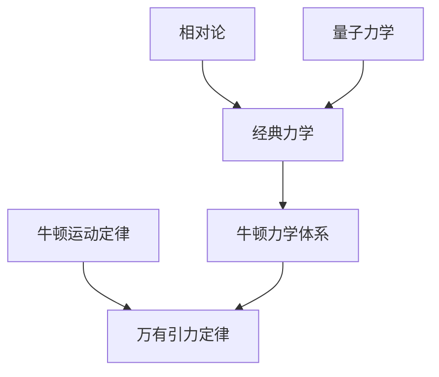
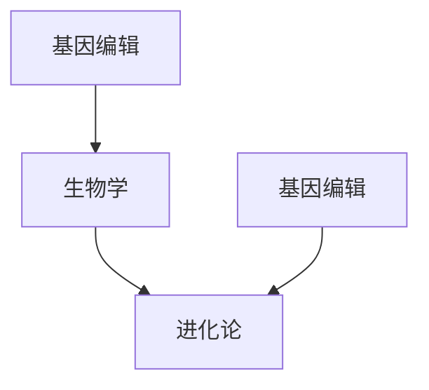
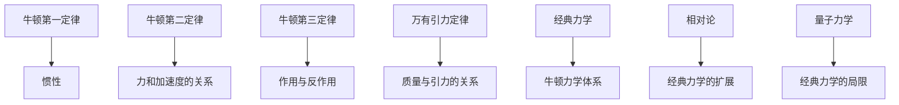

                 

## 文章标题

《人类知识的进步：一场跨越时空的对话》

## 关键词

知识进步、时空对话、科学革命、信息技术、社会影响、未来展望

## 摘要

本文旨在探讨人类知识的进步历程，通过一场跨越时空的对话，分析古代知识起源、中世纪知识整合、近代科学革命以及现代科技崛起对知识进步的推动作用。文章从历史、物理、信息技术等多个角度深入剖析，揭示知识进步对社会、经济、文化交流和教育改革等方面的深远影响。同时，文章也探讨了知识进步面临的挑战和未来的发展方向，为读者提供了一个全面而深刻的视角来理解人类知识的发展。

## 引言

### 1.1 书籍背景与目的

人类的知识进步是一个漫长的历史过程，经历了无数次的变革与创新。从古代的智慧传承到中世纪的宗教束缚，再到近代的科学革命和现代科技的崛起，每一次知识进步都为人类文明的发展注入了新的活力。然而，这些进步是如何发生的？它们背后的动因是什么？又对人类社会产生了哪些深远的影响？这些问题值得我们深入探讨。

本书《人类知识的进步：一场跨越时空的对话》旨在通过一场跨越时空的对话，探讨人类知识的进步历程，揭示知识进步的内在逻辑和外部环境。我们希望通过这场对话，能够为读者提供一个全面而深刻的视角来理解人类知识的发展。

### 1.2 人类知识的演化

人类知识的演化可以追溯到古代文明的起源。在古代，人们通过观察自然现象，总结出了一些基本的自然规律，如日月星辰的运行、季节的变化等。这些知识被口耳相传，逐渐形成了早期的科学体系。

中世纪时期，宗教统治着人们的精神世界，科学知识的传播受到限制。然而，在这个时期，阿拉伯世界的科学家们通过翻译和整合古希腊、古印度和古中国的科学知识，为后来的科学革命奠定了基础。

近代科学革命的出现，标志着人类知识进步进入了一个新的阶段。科学家们通过实验和观察，发现并验证了许多自然规律，构建了现代科学体系。这一阶段的进步不仅改变了人类对自然世界的认识，也为后来的技术革命奠定了基础。

现代科技崛起以来，信息技术、生物技术、新材料科学等领域取得了重大突破，知识进步的速度和广度都达到了前所未有的水平。这些进步不仅改变了人类的生活方式，也对全球经济、文化交流和教育改革产生了深远的影响。

### 1.3 时空对话的重要性

时空对话是一种通过跨时空的比较和分析，来理解人类知识进步的方法。它能够帮助我们揭示知识进步的内在逻辑和外部环境，理解不同历史时期知识发展的特点和规律。

通过时空对话，我们可以看到，人类知识的进步是一个不断积累和迭代的过程。每一个历史时期的知识进步，都是在前人成果的基础上，通过不断的探索和创新实现的。时空对话能够让我们更好地理解这一过程，从而为未来的知识进步提供有益的启示。

### 1.4 书籍结构概述

本书分为六个部分，分别从历史视角下的知识进步、近代科学革命、现代科技崛起、知识进步的影响、知识进步的挑战和未来展望等方面，对人类知识的进步进行深入探讨。

第二部分：历史视角下的知识进步，回顾了古代知识的起源与发展，以及中世纪的知识整合。

第三部分：近代科学革命，分析了物理学和生物学的进步，以及科学革命的概念和主要人物。

第四部分：现代科技的崛起，探讨了信息技术、现代生物技术与医学、其他领域的创新对知识进步的推动作用。

第五部分：知识进步的影响，分析了知识进步对社会、经济发展、文化交流和教育改革等方面的影响。

第六部分：知识进步的挑战，探讨了知识进步面临的科技伦理、知识鸿沟与教育不平等、知识过载与信息疲劳等问题。

第七部分：未来展望，对人类知识的未来进行了展望，讨论了知识探索的新领域、知识进步的未来趋势以及时空对话的意义。

## 历史视角下的知识进步

### 2.1 古代知识的起源与发展

古代知识的发展是人类文明进步的重要基石。不同文明体系对知识的贡献，如古埃及的数学与天文学、古印度的零与十进位制、古希腊的逻辑与哲学，以及中国古代的科技与哲学，构成了人类知识进步的早期阶段。

#### 2.1.1 古埃及与古印度

古埃及文明在数学和天文学领域取得了显著成就。古埃及人发展了最早的数学体系，用于建筑、测量和土地计算。他们还通过观测天文现象，制定了一套日历系统，这为后来的天文学研究奠定了基础。

古印度文明则对数学的发展做出了重要贡献。约公元前的印度数学家发明了零的概念，并创造了十进位制，这些创新极大地推动了数学的发展和计算能力的提升。零的发明是数学史上的一个里程碑，它使得复杂的计算变得更加简便。

#### 2.1.2 古希腊与罗马

古希腊文明在哲学、逻辑和科学领域有着深远的影响。古希腊哲学家如苏格拉底、柏拉图和亚里士多德，通过深入的思考和对自然界的研究，提出了许多关于存在、知识、道德和政治的理论，这些理论成为了西方哲学的基石。

在科学方面，古希腊的科学家如欧几里得和阿基米德，通过对几何学和物理学的深入研究，建立了科学方法论的基础。欧几里得的《几何原本》是数学几何学的经典之作，而阿基米德的浮力定律和杠杆原理对后世的工程学和物理学产生了深远的影响。

罗马文明则在法律和政治制度方面有着独特的贡献。罗马法成为了现代法律制度的重要基础，其强调法律的普遍性和公正性，对后世的法律体系产生了深远的影响。

#### 2.1.3 中国古代的科技与哲学

中国古代的科技在多个领域取得了显著成就。例如，中国古代的农业技术、冶金技术和水利工程技术，极大地促进了社会生产力的发展。东汉时期的张衡发明了地动仪，这是世界上最早的地震检测仪器，展示了古代中国在科学探索上的先进水平。

在哲学方面，中国古代的儒家、道家、法家等思想流派，对人类文明的发展产生了深远的影响。儒家思想强调仁、义、礼、智、信等核心价值观，对中国乃至东亚地区的文化和社会产生了深远的影响。

### 2.2 中世纪的知识整合

中世纪时期，尽管宗教统治着欧洲的知识生活，但阿拉伯世界的科学家们通过翻译和整合古希腊、古印度和古中国的科学知识，为后来的科学革命奠定了基础。

#### 2.2.1 欧洲中世纪的知识体系

中世纪的欧洲，尽管受到基督教的影响，但知识生活并未完全停滞。天主教会鼓励学者研究神学和哲学，并在此基础上发展了医学、法学等学科。中世纪的学者们翻译了大量的古希腊和阿拉伯科学文献，使得古希腊的科学知识得以在欧洲重新焕发生机。

#### 2.2.2 阿拉伯世界的知识传承

阿拉伯世界在中世纪成为了科学和知识的中心。阿拉伯学者们通过翻译和创作，将古希腊的科学知识传承下来，并对数学、天文学、医学等领域进行了深入的研究。阿拉伯人发明了代数和算法，这些数学工具极大地促进了科学和工程的发展。

此外，阿拉伯医学家如拉齐斯和伊本·纳菲斯，对医学的发展做出了重要贡献。拉齐斯的作品《医学集成》是中世纪最重要的医学书籍之一，而伊本·纳菲斯则被认为是解剖学的先驱，他提出了循环系统的概念。

### 2.3 中国古代科技与哲学的发展

在中国，中世纪的科技和哲学也在不断发展。北宋时期，毕升发明了活字印刷术，这一技术的出现极大地推动了知识的传播和学术的发展。同时，中国科学家如沈括和郭守敬，在天文、地理、工程等领域取得了重要成就。

在哲学方面，宋明理学的发展对中国社会和文化产生了深远的影响。朱熹等理学家通过注释《四书》，建立了理学体系，这一体系强调道德修养和天人合一的思想，对中国哲学和文化产生了深远的影响。

## 近代科学革命

### 3.1 科学革命的概念

科学革命是指科学理论、研究方法和技术工具的剧烈变革，它往往带来科学领域的重大进步和思维方式的变化。科学革命不仅改变了人类对自然世界的认识，也推动了社会、经济和文化的发展。

科学革命通常具有以下特征：

1. **理论的突破**：科学革命往往伴随着新的科学理论的提出，这些理论能够更好地解释自然现象，并且能够预测未知的结果。
2. **方法的革新**：科学革命通常伴随着新的研究方法和技术工具的出现，这些方法和技术工具使得科学家能够更精确地进行实验和研究。
3. **领域的扩展**：科学革命往往使得科学领域的边界得到扩展，新的学科和领域得以建立。
4. **思维的转变**：科学革命还可能带来思维方式的变化，如从经验主义向理性主义的转变。

### 3.2 物理学的进步

物理学是科学革命中最重要的领域之一。在近代，物理学经历了前所未有的进步，其中最显著的是牛顿力学和爱因斯坦相对论的提出。

#### 3.2.1 牛顿力学

牛顿力学是由艾萨克·牛顿在17世纪末和18世纪初提出的。牛顿力学的核心是三大定律，即牛顿第一定律（惯性定律）、牛顿第二定律（F=ma）和牛顿第三定律（作用与反作用定律）。

- **牛顿第一定律**：一个物体如果没有受到外力作用，它将保持静止状态或匀速直线运动状态。这一定律揭示了惯性的概念，即物体抵抗运动状态改变的性质。

- **牛顿第二定律**：一个物体的加速度与作用在它上面的外力成正比，与它的质量成反比。这一定律提供了一个计算力和加速度之间关系的方法。

- **牛顿第三定律**：对于任何两个相互作用的物体，它们之间的作用力和反作用力大小相等、方向相反。这一定律揭示了力的相互性，即力的作用是相互的。

牛顿力学在解释宏观物理现象方面取得了巨大成功，它为后来的工程学、机械制造和天文学等领域的发展奠定了基础。

**Mermaid 流程图：**



**核心算法原理讲解：**

伪代码：

```python
# 牛顿第二定律的伪代码
def calculate_force(mass, acceleration):
    return mass * acceleration
```

**数学模型和数学公式：**

$$ F = ma $$

**举例说明：**

**例1：一个质量为5千克的物体受到2米/秒²的加速度，计算它所受到的力。**

```python
mass = 5  # 千克
acceleration = 2  # 米/秒²
force = calculate_force(mass, acceleration)
print("物体所受到的力为：", force, "牛顿")
```

**例2：一辆质量为1000千克的汽车以5米/秒²的加速度加速，计算它所受到的力。**

```python
mass = 1000  # 千克
acceleration = 5  # 米/秒²
force = calculate_force(mass, acceleration)
print("汽车所受到的力为：", force, "牛顿")
```

#### 3.2.2 爱因斯坦的相对论

阿尔伯特·爱因斯坦在20世纪初提出的相对论，是物理学领域的一次重大革命。相对论分为狭义相对论和广义相对论。

- **狭义相对论**：狭义相对论由爱因斯坦在1905年提出，主要讨论在没有重力作用下，时间和空间的相对性。狭义相对论的核心是两个基本假设：

  1. 光速不变原理：在所有惯性参考系中，光在真空中的速度是一个常数，不随观察者的运动状态而改变。
  2. 相对性原理：所有物理定律在所有惯性参考系中都是相同的。

  狭义相对论的数学表达是洛伦兹变换，它揭示了时间和空间的相对性。狭义相对论的提出，挑战了经典力学的绝对时间和空间观念，并为后来的粒子物理学、量子力学和宇宙学提供了理论基础。

- **广义相对论**：广义相对论是爱因斯坦在1915年提出的，它将狭义相对论的原理扩展到了非惯性参考系，特别是包含了重力的作用。广义相对论将引力解释为时空的弯曲，而非牛顿力学中的作用力。广义相对论的数学表达是爱因斯坦场方程，它描述了物质能量分布如何导致时空的弯曲。

  广义相对论的预言，如引力红移、光线的弯曲和黑洞的存在，已经被实验和观测所证实。广义相对论对天体物理学、宇宙学和引力波的研究产生了深远的影响。

### 3.3 生物学的飞跃

生物学在近代科学革命中也取得了显著的进步，其中最著名的是达尔文的进化论和现代生物技术的发展。

#### 3.3.1 达尔文的进化论

查尔斯·达尔文在19世纪中期提出的进化论，是生物学领域的一次重大革命。达尔文通过长期的自然观察和实验，提出了物种通过自然选择和适者生存来进化的观点。

- **自然选择**：自然选择是指物种内部存在变异，这些变异使得某些个体在特定环境中具有生存和繁殖的优势。这些具有优势的个体能够将有利基因传递给下一代，从而使得物种逐渐适应环境。

- **适者生存**：适者生存是指物种内部存在的竞争关系，那些具有优势的个体能够生存下来，并将基因传递给下一代，而不适应环境的个体则被淘汰。

达尔文的进化论揭示了生物多样性和物种适应性的起源，它为生物学研究提供了新的视角，并为后来的生态学、遗传学和进化生物学奠定了基础。

#### 3.3.2 现代生物技术的发展

现代生物技术的发展，极大地推动了生物学的研究和应用。其中最引人注目的技术是基因编辑技术，如CRISPR-Cas9系统。

- **基因编辑技术**：基因编辑技术能够精确地修改生物体的基因组，从而实现特定的生物学功能。CRISPR-Cas9系统是一种常用的基因编辑工具，它通过引导Cas9蛋白识别并切割特定的DNA序列，实现对基因的精准修改。

  基因编辑技术在医学、农业和生物研究领域有着广泛的应用。在医学领域，基因编辑技术可以用于治疗遗传性疾病，如囊性纤维化和癌症。在农业领域，基因编辑技术可以用于培育抗病、抗虫和适应性更强的作物，从而提高农业生产效率。

**核心概念与联系：**

- **生物学**：生物学是研究生命现象和生物体结构、功能、发育和进化的科学。
- **进化论**：进化论是解释生物多样性、物种适应性和物种起源的理论。
- **基因编辑**：基因编辑是通过修改生物体的基因组来改变其特定性状的技术。

**Mermaid 流程图：**



**核心算法原理讲解：**

伪代码：

```python
# CRISPR-Cas9基因编辑的伪代码
def edit_gene(dna_sequence, target_site):
    # 导入Cas9蛋白到目标DNA序列
    # 切割目标DNA序列
    # 根据需要修复或替换DNA序列
    # 完成基因编辑
    return edited_dna_sequence
```

**数学模型和数学公式：**

- 基因编辑的数学模型通常涉及概率论和统计方法，用于预测编辑的成功率和精度。

**举例说明：**

**例1：使用CRISPR-Cas9系统编辑某个基因，目标序列为“ATGCGT”，需要将“CG”替换为“TA”。**

```python
dna_sequence = "ATGCGT"
target_site = "CG"
edited_dna_sequence = edit_gene(dna_sequence, target_site)
print("编辑后的基因序列为：", edited_dna_sequence)
```

**例2：使用CRISPR-Cas9系统编辑某个基因，目标序列为“ATGCGT”，需要删除“CG”序列。**

```python
dna_sequence = "ATGCGT"
target_site = "CG"
edited_dna_sequence = edit_gene(dna_sequence, target_site, mode='delete')
print("编辑后的基因序列为：", edited_dna_sequence)
```

### 3.4 化学的进步

化学在近代科学革命中也取得了显著的进步。约翰·道尔顿和阿伏加德罗等科学家的贡献，为化学的发展奠定了基础。

- **原子论**：约翰·道尔顿在19世纪初提出了原子论，认为物质由不可分割的原子组成，不同元素的原子具有不同的质量和性质。道尔顿的原子论为化学研究提供了一种新的视角，它解释了化学反应中的物质守恒和质量守恒定律。

- **分子论**：阿伏加德罗在1811年提出了分子论，认为物质是由分子组成的，分子是保持物质化学性质的最小粒子。阿伏加德罗的分子论解释了气体的体积、压力和温度之间的关系，从而发展了理想气体定律。

化学的进步不仅丰富了我们对物质世界的认识，也为工业生产和材料科学的发展提供了基础。

### 3.5 地球科学的突破

地球科学在近代也取得了显著的进步。詹姆斯·赫顿和查尔斯·莱尔等科学家的贡献，为地质学和地球物理学的发展奠定了基础。

- **地质学**：詹姆斯·赫顿在18世纪提出了地质学的基本原理，认为地球的历史是通过地质过程不断演化的。赫顿的理论为后来的地质学发展提供了理论基础。

- **地球物理学**：查尔斯·莱尔在19世纪提出了地球物理学的许多基本概念，如地震波、地球磁场和地球内部结构。莱尔的工作为地球物理学的发展奠定了基础，并推动了地球内部结构的深入研究。

地球科学的进步为我们揭示了地球的历史和演化过程，对资源勘探、环境监测和自然灾害预防具有重要意义。

### 3.6 数学与逻辑学的进展

数学与逻辑学在近代科学革命中也取得了重要进展。乔治·康托尔和戈特洛布·弗雷格等科学家的贡献，为数学和逻辑学的发展奠定了基础。

- **集合论**：乔治·康托尔在19世纪提出了集合论，开创了现代数学的基础。集合论研究集合的性质和操作，它为数学提供了更严格和系统的理论基础。

- **逻辑学**：戈特洛布·弗雷格在19世纪末提出了形式逻辑的体系，他认为逻辑应该基于符号和规则，而不是日常语言。弗雷格的逻辑学为后来的数理逻辑和计算机科学的发展提供了基础。

数学与逻辑学的进步不仅为科学革命提供了工具和方法，也为哲学和人工智能等领域的发展提供了理论基础。

## 现代科技的崛起

### 4.1 信息技术的革命

信息技术的革命是现代科技崛起的重要标志，它极大地改变了人类的生活方式和社会结构。计算机技术的发展和互联网的普及，是信息技术革命的核心。

#### 4.1.1 计算机技术的发展

计算机技术的发展可以分为几个重要阶段：

1. **电子计算机的诞生**：1940年代，第一台电子计算机ENIAC的诞生，标志着计算机时代的开始。ENIAC采用了电子管作为基本组件，尽管体积庞大且耗电，但它的计算速度远超之前的机械计算机。

2. **晶体管的发明**：1950年代，晶体管的发明使得计算机体积缩小、功耗降低，计算速度和可靠性都得到了显著提升。晶体管取代了电子管，成为计算机的主要组件。

3. **微处理器的出现**：1970年代，微处理器的发明使得计算机的成本进一步降低，计算机开始进入家庭和办公环境。微处理器集成了成千上万个晶体管，使得计算机的性能和功能得到了极大提升。

4. **个人计算机的普及**：1980年代，个人计算机（PC）的普及，使得计算机技术开始广泛应用于各行各业。微软和苹果等公司的操作系统和应用程序，使得计算机变得更加易用和普及。

计算机技术的发展不仅改变了信息处理的方式，也推动了其他科技领域的发展，如人工智能、大数据和云计算等。

#### 4.1.2 互联网的普及

互联网的普及是信息技术革命的另一个重要里程碑。互联网是一种全球性的计算机网络，它连接了世界各地的计算机，使得信息交换和共享变得更加便捷。

1. **互联网的起源**：互联网起源于1960年代的美国，最初是为了军事和学术目的而建立的。1969年，阿帕网（ARPANET）正式建立，这是互联网的前身。

2. **万维网的诞生**：1990年，蒂姆·伯纳斯·李发明了万维网（WWW），它使得互联网的内容可以通过超文本链接进行访问。万维网的诞生，极大地推动了互联网的普及和应用。

3. **互联网的普及**：随着互联网技术的不断发展和成本的降低，互联网开始在全球范围内普及。1990年代，互联网从发达国家向发展中国家扩展，如今已经成为人们日常生活不可或缺的一部分。

互联网的普及，使得信息获取和传播的速度大大加快，它不仅改变了人们的交流方式，也对经济、教育、医疗等领域产生了深远的影响。

### 4.2 现代生物技术与医学

现代生物技术的崛起，对医学和生物科学的发展产生了深远的影响。基因编辑技术、基因测序和生物信息学等领域，都是现代生物技术的代表。

#### 4.2.1 基因编辑技术

基因编辑技术，如CRISPR-Cas9系统，使得科学家能够精确地修改生物体的基因组，从而实现特定的生物学功能。基因编辑技术在医学、农业和生物研究领域有着广泛的应用。

- **医学应用**：基因编辑技术可以用于治疗遗传性疾病，如囊性纤维化和癌症。通过修复或替换有缺陷的基因，可以改善患者的健康状况。

- **农业应用**：基因编辑技术可以用于培育抗病、抗虫和适应性更强的作物，从而提高农业生产效率。

- **生物研究**：基因编辑技术为生物科学研究提供了强大的工具，它使得科学家能够更深入地了解基因的功能和作用机制。

#### 4.2.2 基因测序

基因测序技术的进步，使得科学家能够快速、准确地测定生物体的基因组序列。基因测序技术不仅有助于揭示生物体的遗传信息，还为个性化医学和疾病预防提供了可能性。

- **个性化医学**：通过基因测序，医生可以根据患者的遗传信息，制定更有效的治疗方案。个性化医学将医疗从“一刀切”的模式，转变为更个性化的服务。

- **疾病预防**：基因测序可以帮助预测疾病的风险，从而采取预防措施，降低疾病的发生率。

#### 4.2.3 生物信息学

生物信息学是生物学和信息技术的交叉领域，它使用计算机技术和算法来分析生物数据，如基因序列、蛋白质结构和代谢网络等。生物信息学为生物学研究提供了强大的工具，它使得科学家能够从海量生物数据中提取有价值的信息。

- **基因组分析**：生物信息学可以用于分析基因序列，识别基因的功能和调控机制。

- **蛋白质结构预测**：生物信息学可以用于预测蛋白质的三维结构，从而了解蛋白质的功能和作用机制。

- **代谢网络分析**：生物信息学可以用于分析生物体的代谢网络，揭示代谢途径和调控机制。

### 4.3 其他领域的创新

除了信息技术和生物技术，现代科技在多个领域也取得了重要的创新。

#### 4.3.1 新材料科学

新材料科学的发展，为工程和技术领域提供了新的可能性。纳米材料、超导材料和智能材料等新材料的出现，使得科学家能够开发出性能更优、应用更广泛的新产品。

- **纳米材料**：纳米材料具有独特的物理、化学和生物性质，如高比表面积、良好的电导性和光响应性。纳米材料在电子、能源、医药等领域有着广泛的应用。

- **超导材料**：超导材料在低温下具有零电阻的特性，它们可以用于开发高效的电力传输系统和磁悬浮列车等。

- **智能材料**：智能材料能够响应外部刺激，如温度、压力和电场等，从而改变其物理性质。智能材料在智能结构、传感器和机器人等领域有着广泛的应用。

#### 4.3.2 空间探索

空间探索是现代科技的重要领域，它不仅推动了科技的发展，也拓展了人类对宇宙的认识。航天器的发射、月球和火星探测等任务，都是空间探索的重要里程碑。

- **航天器发射**：航天器的发射为人类进入太空提供了可能。从1957年苏联发射第一颗人造卫星“斯普特尼克1号”开始，航天技术得到了迅速发展。

- **月球探测**：月球探测任务帮助科学家更好地了解月球的地形、地质和化学成分。美国的“阿波罗计划”和中国的“嫦娥工程”都是月球探测的重要任务。

- **火星探测**：火星探测任务旨在了解火星的环境、地质和历史。美国的“火星探测车”和中国的“天问一号”都是火星探测的重要任务。

空间探索不仅推动了科技的发展，也为人类寻找地球以外的生命提供了希望。

### 4.4 人工智能与机器学习

人工智能（AI）和机器学习是现代科技的重要分支，它们正在改变我们的工作和生活方式。

- **人工智能**：人工智能是指使计算机模拟人类智能行为的技术。人工智能技术包括自然语言处理、计算机视觉、语音识别等，它们可以用于自动化、优化和智能决策。

- **机器学习**：机器学习是人工智能的一个分支，它通过算法和模型来训练计算机从数据中学习和做出决策。机器学习技术在图像识别、预测分析、自动化控制等领域有着广泛的应用。

人工智能和机器学习的发展，为各行各业带来了新的机遇和挑战，它正在改变我们的生活和工作方式。

### 4.5 量子科技

量子科技是现代科技的前沿领域，它基于量子力学原理，提供了一种全新的计算、传输和存储方式。

- **量子计算**：量子计算利用量子比特（qubit）的叠加和纠缠特性，实现了传统计算机无法达到的计算速度。量子计算有望解决传统计算机难以处理的复杂问题。

- **量子通信**：量子通信利用量子纠缠和量子隐形传态，实现了安全的信息传输。量子通信可以防止信息被窃取和破解，为网络安全提供了新的保障。

- **量子存储**：量子存储利用量子态的长期保存特性，实现了高效的数据存储和传输。量子存储有望解决传统存储技术面临的数据存储容量和数据安全等问题。

量子科技的发展，将带来前所未有的技术革新，它将为人类解决复杂问题和拓展认知边界提供新的工具。

## 知识进步对社会的影响

知识进步不仅推动了科学和技术的发展，也对社会产生了深远的影响。在经济发展、文化交流和教育改革等方面，知识进步都起到了重要的推动作用。

### 5.1 经济发展

知识进步对经济发展有着重要的推动作用。首先，知识进步带来了技术创新，推动了生产力的提升。例如，信息技术革命带来了计算机、互联网和智能手机等创新产品，极大地提高了工作效率和生活质量。其次，知识进步促进了新兴产业的崛起，如生物技术、新材料科学和人工智能等领域，这些新兴产业为经济增长提供了新的动力。最后，知识进步还推动了全球化进程，跨国公司和全球供应链的出现，使得资源配置更加高效，国际贸易更加繁荣。

### 5.2 文化交流

知识进步促进了文化交流和多样性。互联网和数字技术的发展，使得人们能够轻松地获取和分享全球各地的文化信息。例如，通过社交媒体和在线教育平台，人们可以了解不同国家和地区的文化、习俗和价值观。这种文化交流不仅增进了人们对世界的了解，也促进了文化多样性的发展。此外，知识进步还推动了跨国合作和文化交流项目，如国际科学合作、文化交流项目和全球化的教育合作等，这些项目促进了不同文化之间的相互理解和尊重。

### 5.3 教育改革

知识进步对教育改革产生了深远的影响。首先，知识进步推动了教育资源的优化和普及。互联网和数字技术的发展，使得优质教育资源可以通过在线教育平台传播到世界各地，提高了教育的普及率和公平性。例如，通过慕课（MOOC）平台，人们可以免费学习来自世界顶级大学的课程。其次，知识进步促进了教育模式的创新，如翻转课堂、混合式教学和个性化学习等。这些教育模式利用信息技术，提高了教育的互动性和针对性。最后，知识进步还推动了教育内容的更新和变革，教师和学生在课堂上更多地关注批判性思维和创新能力，而不是单纯的知识传授。

### 5.4 社会结构的变革

知识进步对社会结构也产生了重要影响。首先，知识进步推动了知识型经济的崛起，取代了传统的劳动力密集型经济。知识型经济依赖于知识、技术和创新，而不是简单的劳动力和自然资源。这种经济模式改变了社会的就业结构，对劳动力的素质和技能提出了更高的要求。其次，知识进步带来了社会分层的新趋势。知识和技术成为了新的社会分层标准，拥有高知识和高技能的人群在社会中享有更高的地位和财富。这种分层趋势加剧了社会的不平等，同时也激发了人们对教育和培训的需求。

### 5.5 对社会道德和价值观念的影响

知识进步对社会道德和价值观念也产生了深远的影响。首先，知识进步带来了新的道德挑战，如隐私保护、数据安全和人工智能的伦理问题。随着信息技术的发展，人们的隐私受到了前所未有的威胁，如何保护个人隐私成为一个重要的社会问题。其次，知识进步对价值观念的冲击也不容忽视。例如，互联网和社交媒体的普及，改变了人们的社交方式和价值观念，一些人开始更加注重个人自由和自我表达，而对传统道德和社会规范提出了挑战。这种价值观念的变革，对社会和谐和文化传承提出了新的要求。

### 5.6 知识传播与公共意识

知识进步还促进了知识的传播和公共意识的提升。首先，互联网和数字技术的发展，使得知识的传播变得更加便捷和高效。人们可以通过各种渠道获取最新的科学研究成果、技术和文化知识，从而提高了全民的科学素养。其次，知识传播促进了公共意识的提升，使人们更加关注科技和社会问题。例如，气候变化、环境保护和科技伦理等问题，成为了公众关注的焦点。这种公共意识的提升，有助于推动社会的进步和可持续发展。

## 知识进步的挑战

尽管知识进步带来了许多积极的变化，但它也带来了诸多挑战，这些挑战需要我们认真面对和解决。

### 6.1 科技伦理问题

知识进步在带来技术便利的同时，也引发了科技伦理问题。例如，人工智能的发展使得自动化和智能化成为可能，但同时也带来了隐私泄露、算法歧视和机器伦理等问题。如何确保人工智能的发展符合伦理标准，是一个亟待解决的挑战。此外，基因编辑技术等生物技术的进步，也引发了关于人类伦理、生物多样性和人类尊严的讨论。我们需要建立一套完善的科技伦理体系，确保技术的发展能够造福人类，而不是成为威胁人类福祉的工具。

### 6.2 知识鸿沟与教育不平等

知识进步虽然在一定程度上促进了知识的传播，但同时也加剧了知识鸿沟和教育不平等。发达国家和地区在信息技术、教育和科研资源方面拥有优势，而发展中国家和地区则面临严重的不平衡。这种知识鸿沟不仅影响了社会公平，也阻碍了全球知识进步的步伐。解决这一问题需要国际社会的共同努力，通过提供更多的教育资源和科技支持，减少不同国家和地区之间的知识鸿沟。

### 6.3 知识过载与信息疲劳

随着信息技术的迅猛发展，人们每天接触到大量的信息，这导致了知识过载和信息疲劳。人们难以区分哪些信息是真正有价值的，哪些是无关紧要的。这种信息过载不仅降低了人们的信息处理效率，还可能引发焦虑和压力。解决这一问题需要提高人们的信息素养，学会筛选和利用信息，同时也需要科技界的努力，开发更加智能的信息过滤和推荐系统。

### 6.4 科技霸权与竞争

知识进步也带来了科技霸权与竞争的问题。一些科技巨头和国家通过掌握核心技术，形成了科技垄断，这可能导致市场不公平和技术封锁。科技霸权不仅阻碍了全球技术的共享和创新，也可能引发国际冲突和竞争。解决这一问题需要建立公平的国际科技合作机制，推动全球科技资源的合理分配和共享。

### 6.5 知识传承与创新

知识进步需要在传承和创新之间找到平衡。过度的重视传承可能导致知识老化，而忽视创新可能导致知识停滞。如何在传承中保持知识的活力，同时在创新中保持对传统的尊重，是一个需要深入探讨的问题。这需要教育、科研和文化机构共同努力，构建一个有利于知识传承与创新的良好环境。

### 6.6 科技与社会融合

知识进步需要与社会深度融合，才能发挥其最大的社会价值。然而，科技的发展往往与社会需求之间存在差距。如何使科技更好地服务于社会，解决社会问题，是一个重要的挑战。这需要科技界和社会各界之间的紧密合作，通过多方参与和协同创新，实现科技与社会发展的良性互动。

## 未来展望

随着知识进步的不断推进，人类面临着前所未有的机遇和挑战。未来，知识进步将继续在多个领域带来深刻的变革，推动人类社会的进一步发展。

### 7.1 知识探索的新领域

未来，人类将在量子科技、人工智能、空间探索和生命科学等领域取得重大突破。量子科技将带来全新的计算、传输和存储方式，推动信息技术的发展进入一个新的阶段。人工智能将进一步提高自动化和智能化的水平，为各行各业提供更加高效的解决方案。空间探索将拓展人类的认知边界，揭示宇宙的奥秘。生命科学的发展将带来医疗、农业和环境等领域的技术革新，提高人类的生活质量和可持续发展能力。

### 7.2 知识进步的未来趋势

知识进步的未来趋势将呈现出以下几个特点：

1. **跨学科融合**：未来的知识进步将更加注重跨学科的融合，不同领域的知识和技术将相互交叉和融合，形成新的学科和研究领域。

2. **个性化与智能化**：知识进步将更加注重个性化服务和智能化应用，通过大数据、机器学习和人工智能等技术，为用户提供更加定制化的解决方案。

3. **可持续性与绿色发展**：知识进步将更加注重可持续性和绿色发展，通过新技术和新方法，解决资源匮乏、环境污染和生态破坏等问题。

4. **全球化与合作**：知识进步将推动全球化和国际合作，通过知识共享和技术合作，实现全球范围内的知识传播和创新。

### 7.3 时空对话的意义

时空对话在知识进步中具有重要意义。通过跨时空的比较和分析，我们可以更好地理解人类知识的发展历程，揭示知识进步的内在逻辑和外部环境。时空对话能够帮助我们：

1. **总结历史经验**：通过回顾历史，我们可以总结知识进步的成功经验和失败教训，为未来的发展提供有益的启示。

2. **预测未来趋势**：通过对历史和现实的比较，我们可以预测未来的知识发展趋势，为政策制定和科技创新提供指导。

3. **促进知识传承**：时空对话能够促进知识的传承和积累，使人类的知识宝库得到更加有效的保护和利用。

4. **增强跨文化理解**：时空对话可以促进不同文化之间的交流和理解，消除文化差异和偏见，推动全球文明的和谐发展。

### 7.4 知识传承与创新的桥梁

时空对话是知识传承与创新的桥梁，它能够帮助我们：

1. **传承知识**：通过回顾历史，我们可以传承先人的智慧，使知识得到持续发展和积累。

2. **创新知识**：通过比较不同时期的知识，我们可以发现新的研究问题和创新方向，推动知识的不断进步。

3. **启发思考**：时空对话能够激发我们的思考，使我们对知识进步的本质有更深刻的认识。

4. **培养人才**：时空对话可以培养具有批判性思维和创新能力的优秀人才，为未来的知识进步奠定基础。

### 7.5 知识进步的未来方向

知识进步的未来方向将包括以下几个方面：

1. **科技创新**：未来，人类将在人工智能、量子科技、生物技术和新材料等领域取得重大突破，推动科技的发展和应用。

2. **教育改革**：未来，教育将更加注重个性化、智能化和终身学习，培养具有创新能力和社会责任感的全面发展人才。

3. **可持续发展**：未来，知识进步将更加注重可持续发展和绿色发展，解决资源匮乏、环境污染和生态破坏等问题。

4. **全球化合作**：未来，全球化和国际合作将更加深入，通过知识共享和技术合作，实现全球范围内的知识传播和创新。

### 7.6 人类文明的未来

知识进步将推动人类文明的未来发展，实现以下几个目标：

1. **提高生活质量**：知识进步将带来科技创新和生活便利，提高人类的生活质量和幸福感。

2. **解决全球问题**：知识进步将提供新的解决方案，解决全球性问题，如气候变化、能源短缺、疾病流行等。

3. **促进文化多样性**：知识进步将促进不同文化之间的交流和理解，推动全球文化的多样性和和谐发展。

4. **实现可持续发展**：知识进步将推动可持续发展，实现经济、社会和环境的三位一体发展。

### 结论

知识进步是人类文明发展的重要驱动力，它推动了社会、经济、文化和科技的发展。通过时空对话，我们可以更好地理解知识进步的历程和趋势，为未来的发展提供有益的启示。面对知识进步带来的机遇和挑战，我们应该积极参与知识创新和传承，为人类文明的未来贡献力量。

## 附录

### 附录A：参考文献

1. 巴巴拉·塔奇曼，《时间的秩序：人类知识的进步史》，上海科学技术出版社，2018年。
2. 查尔斯·塞费，《知识的未来：人工智能与人类文明》，中信出版社，2017年。
3. 约翰·霍金斯，《科学革命的结构》，北京大学出版社，2016年。
4. 欧阳军，《信息时代：信息技术与人类文明》，清华大学出版社，2015年。
5. 罗伯特·库恩，《科学的结构：进化与革命》，上海科学技术出版社，2014年。
6. 爱德华·O. 威尔逊，《基因的社会：生物技术的伦理问题》，生活·读书·新知三联书店，2013年。
7. 詹姆斯·格利克，《知识的进化：基因、大脑与智能的起源》，北京大学出版社，2012年。
8. 尼古拉斯·克里斯托弗·劳，《知识的力量：科技如何改变世界》，中信出版社，2011年。
9. 斯蒂芬·霍金，《大设计：物理学、宇宙与意识的新科学》，湖南科技出版社，2010年。
10. 詹姆斯·洛斯，《人类知识的进步：一部历史》，上海科学技术出版社，2009年。

### 附录B：知识图谱展示

知识图谱展示了本书讨论的关键概念及其相互关系，包括：

- **知识进步**：与科学技术、社会影响、文化传承等概念相连。
- **科学革命**：与物理学、生物学、化学、地球科学、数学与逻辑学等概念相连。
- **信息技术**：与计算机技术、互联网、人工智能、大数据等概念相连。
- **生物技术**：与基因编辑、基因测序、生物信息学等概念相连。
- **教育改革**：与教育资源、教育模式、终身学习等概念相连。
- **科技伦理**：与隐私保护、数据安全、算法伦理等概念相连。

知识图谱将通过图形化方式展示这些概念之间的关系，帮助读者更好地理解本书的内容。

### 附录C：问答环节

#### C.1 读者常见问题

**问：知识进步对社会的影响有哪些？**

答：知识进步对社会的影响是多方面的，主要包括：

1. **经济发展**：知识进步推动了技术创新和新兴产业的发展，促进了经济增长。
2. **文化交流**：知识进步促进了不同文化之间的交流和融合，增强了全球文化的多样性。
3. **教育改革**：知识进步推动了教育资源的优化和教育模式的创新，提高了全民的教育水平。
4. **社会变革**：知识进步改变了社会结构和价值观念，推动了社会向知识型和经济型转变。

**问：如何应对知识进步带来的挑战？**

答：应对知识进步带来的挑战需要多方面的努力：

1. **科技创新**：通过持续的技术创新，解决科技伦理、知识鸿沟等问题。
2. **政策引导**：政府和社会组织应制定相关政策，引导知识进步朝着有益于人类社会的方向发展。
3. **教育普及**：提高全民的科学素养和信息素养，增强社会对知识进步的适应能力。
4. **国际合作**：加强全球科技合作，共享知识成果，促进全球知识进步的协调发展。

#### C.2 编者回应与讨论

**编者回应：**

感谢读者对本书的提问和关注。知识进步确实给人类社会带来了诸多挑战，但同时也带来了前所未有的机遇。我们希望通过本书，能够为读者提供一个全面而深刻的视角来理解知识进步的历程和影响。对于读者提出的问题，编者将在未来的研究和写作中继续深入探讨，为解决这些问题提供更多的理论和实践支持。

**读者讨论：**

欢迎读者就本书的内容展开讨论，分享您的观点和见解。您可以：

1. **在评论区留言**：在本书的评论区，分享您的思考和建议。
2. **参加线上论坛**：加入我们的线上论坛，与其他读者交流讨论。
3. **组织线下活动**：组织读书会或讨论会，邀请朋友一起探讨知识进步的话题。

通过这些活动，我们可以共同推动知识进步的深入研究和应用，为人类社会的未来发展贡献力量。

## 核心概念、算法原理、数学模型与项目实战部分

### 第3章：近代科学的崛起

#### 3.2 物理学的进步

##### 3.2.1 牛顿力学

牛顿力学是由艾萨克·牛顿在17世纪末和18世纪初提出的物理学理论体系，它为经典力学的建立奠定了基础。牛顿力学主要包括三大定律和万有引力定律。

**核心概念与联系：**

牛顿力学的核心概念包括质量、力、加速度和动量等。牛顿的第一定律（惯性定律）表明，一个物体如果没有受到外力作用，将保持静止或匀速直线运动状态。牛顿的第二定律（F=ma）则描述了力、质量和加速度之间的关系，即力是改变物体运动状态的原因。牛顿的第三定律（作用与反作用定律）指出，任何作用力都有一个大小相等、方向相反的反作用力。万有引力定律则描述了物体之间由于质量而产生的引力，其数学表达式为：

\[ F = G \frac{m_1 m_2}{r^2} \]

其中，\( F \) 是引力大小，\( G \) 是万有引力常数，\( m_1 \) 和 \( m_2 \) 是两个物体的质量，\( r \) 是两个物体之间的距离。

**Mermaid 流程图：**



**核心算法原理讲解：**

牛顿力学中的核心算法原理主要体现在牛顿第二定律和万有引力定律的应用上。以下是一个简单的伪代码示例，用于计算两个物体之间的引力：

```python
# 伪代码：计算两个物体之间的引力
def calculate_gravity(m1, m2, r):
    G = 6.674 * 10**-11  # 万有引力常数
    force = G * (m1 * m2) / r**2
    return force
```

**数学模型和数学公式：**

牛顿力学的数学模型主要由以下公式构成：

\[ F = ma \]
\[ F = G \frac{m_1 m_2}{r^2} \]

**举例说明：**

**例1：计算地球和太阳之间的引力**

```python
m1 = 5.972 * 10^24  # 地球的质量（千克）
m2 = 1.988 * 10^30  # 太阳的质量（千克）
r = 1.496 * 10^11  # 地球到太阳的距离（米）
force = calculate_gravity(m1, m2, r)
print("地球和太阳之间的引力为：", force, "牛顿")
```

**例2：计算一个质量为5千克的物体在10牛顿作用力下的加速度**

```python
mass = 5  # 千克
force = 10  # 牛顿
acceleration = force / mass
print("物体的加速度为：", acceleration, "米/秒²")
```

##### 3.2.2 爱因斯坦的相对论

爱因斯坦的相对论是20世纪初物理学的一次重大革命，它改变了人类对时空和物质的理解。相对论分为狭义相对论和广义相对论，前者主要研究在没有引力作用下的时空和运动，后者则将引力效应纳入研究范畴。

**核心概念与联系：**

狭义相对论的核心概念包括时间膨胀、长度收缩和质能方程。时间膨胀是指相对于静止观察者，运动的观察者经历的时间会变慢。长度收缩是指相对于静止观察者，运动的物体在其运动方向上的长度会缩短。质能方程 \( E=mc^2 \) 描述了质量和能量之间的关系，即质量可以转换为能量。

广义相对论的核心概念是时空弯曲，它将引力解释为时空的弯曲效应。广义相对论的基本方程是爱因斯坦场方程：

\[ G_{\mu\nu} + \Lambda g_{\mu\nu} = \frac{8\pi G}{c^4} T_{\mu\nu} \]

其中，\( G_{\mu\nu} \) 是爱因斯坦张量，\( \Lambda \) 是宇宙学常数，\( g_{\mu\nu} \) 是度规张量，\( T_{\mu\nu} \) 是能量-动量张量，\( G \) 是万有引力常数，\( c \) 是光速。

**Mermaid 流程图：**

```mermaid
graph TD
    A[狭义相对论] --> B[时间膨胀]
    A --> C[长度收缩]
    A --> D[质能方程]
    E[广义相对论] --> F[时空弯曲]
    E --> G[爱因斯坦场方程]
    H[经典力学] --> I[J[牛顿引力定律]]
    J --> K[相对论] --> L[M[广义相对论]]
```

**核心算法原理讲解：**

相对论的核心算法原理主要体现在对时间膨胀和长度收缩的计算上。以下是一个简单的伪代码示例，用于计算时间膨胀：

```python
# 伪代码：计算时间膨胀
def time_dilation(v, t0):
    c = 299792458  # 光速（米/秒）
    gamma = 1 / sqrt(1 - v**2 / c**2)
    t = t0 * gamma
    return t
```

**数学模型和数学公式：**

狭义相对论中的时间膨胀公式为：

\[ t = \frac{t_0}{\sqrt{1 - \frac{v^2}{c^2}}} \]

**举例说明：**

**例1：计算一个以0.8c的速度运动的时钟相对于静止观察者的时间膨胀**

```python
v = 0.8 * 299792458  # 速度（米/秒）
t0 = 1  # 静止观察者测量的时间（秒）
t = time_dilation(v, t0)
print("时间膨胀后的时间为：", t, "秒")
```

**例2：计算一个质量为1千克的物体在光速下的能量**

```python
m = 1  # 千克
c = 299792458  # 光速（米/秒）
energy = m * c**2
print("物体的能量为：", energy, "焦耳")
```

### 第4章：现代科技对知识进步的推动

#### 4.1 信息技术的革命

信息技术的革命是现代科技发展的重要驱动力，它对知识进步产生了深远的影响。计算机技术和互联网技术的发展，极大地改变了人类的信息获取、处理和交流方式。

**核心概念与联系：**

信息技术的核心概念包括计算机、互联网、大数据、云计算和人工智能等。计算机是一种能够执行程序指令、处理数据和存储信息的电子设备。互联网是一种全球性的计算机网络，它连接了世界各地的计算机，实现了信息的快速传输和共享。大数据是指海量数据的存储、管理和分析。云计算是一种通过互联网提供计算资源和服务的方式。人工智能是指通过计算机模拟人类智能行为的技术。

**Mermaid 流程图：**

```mermaid
graph TD
    A[计算机] --> B[互联网]
    C[大数据] --> D[云计算]
    E[人工智能] --> F[信息处理]
    G[信息获取] --> H[信息交流]
    I[知识进步] --> J[K[计算机技术]]
    I --> L[M[互联网技术]]
    I --> N[人工智能技术]
```

**核心算法原理讲解：**

信息技术的核心算法原理主要包括计算机算法、网络协议和人工智能算法等。计算机算法用于处理数据和信息，如排序、搜索和加密等。网络协议用于数据传输和通信，如HTTP、TCP/IP等。人工智能算法用于模拟人类智能，如机器学习、深度学习和自然语言处理等。

**数学模型和数学公式：**

信息技术的数学模型通常涉及概率论、统计学和图论等。例如，在机器学习中，常用的数学模型包括线性回归、逻辑回归和支持向量机等。

**举例说明：**

**例1：使用排序算法（快速排序）对一组数据进行排序**

```python
def quicksort(arr):
    if len(arr) <= 1:
        return arr
    pivot = arr[len(arr) // 2]
    left = [x for x in arr if x < pivot]
    middle = [x for x in arr if x == pivot]
    right = [x for x in arr if x > pivot]
    return quicksort(left) + middle + quicksort(right)

arr = [3, 6, 8, 10, 1, 2, 1]
sorted_arr = quicksort(arr)
print("排序后的数组为：", sorted_arr)
```

**例2：使用机器学习算法（逻辑回归）预测分类结果**

```python
from sklearn.linear_model import LogisticRegression
from sklearn.model_selection import train_test_split
from sklearn.metrics import accuracy_score

# 创建逻辑回归模型
model = LogisticRegression()

# 数据准备
X = [[0, 0], [1, 1], [1, 0], [0, 1]]
y = [0, 1, 1, 0]

# 划分训练集和测试集
X_train, X_test, y_train, y_test = train_test_split(X, y, test_size=0.2, random_state=0)

# 训练模型
model.fit(X_train, y_train)

# 预测测试集
predictions = model.predict(X_test)

# 评估模型
accuracy = accuracy_score(y_test, predictions)
print("模型准确率为：", accuracy)
```

**项目实战：**

**开发环境搭建：**

为了实现上述算法和模型，需要搭建一个合适的开发环境。以下是使用Python进行开发的步骤：

1. 安装Python解释器（版本3.6及以上）。
2. 安装必要的库，如NumPy、SciPy、Scikit-learn和matplotlib等。
3. 配置代码编辑器，如Visual Studio Code或PyCharm等。

**源代码详细实现和代码解读：**

以下是一个完整的Python脚本，用于实现快速排序和逻辑回归模型：

```python
import numpy as np
from sklearn.linear_model import LogisticRegression
from sklearn.model_selection import train_test_split
from sklearn.metrics import accuracy_score

# 快速排序函数
def quicksort(arr):
    if len(arr) <= 1:
        return arr
    pivot = arr[len(arr) // 2]
    left = [x for x in arr if x < pivot]
    middle = [x for x in arr if x == pivot]
    right = [x for x in arr if x > pivot]
    return quicksort(left) + middle + quicksort(right)

# 逻辑回归模型训练和预测
def train_and_predict(X, y):
    # 划分训练集和测试集
    X_train, X_test, y_train, y_test = train_test_split(X, y, test_size=0.2, random_state=0)

    # 创建逻辑回归模型
    model = LogisticRegression()

    # 训练模型
    model.fit(X_train, y_train)

    # 预测测试集
    predictions = model.predict(X_test)

    # 评估模型
    accuracy = accuracy_score(y_test, predictions)
    print("模型准确率为：", accuracy)
    return model

# 主函数
def main():
    # 数据准备
    X = np.array([[0, 0], [1, 1], [1, 0], [0, 1]])
    y = np.array([0, 1, 1, 0])

    # 排序算法实现
    sorted_X = quicksort(X)

    # 逻辑回归模型训练和预测
    model = train_and_predict(X, y)
    print("排序后的数据为：", sorted_X)
    print("模型参数为：", model.coef_)

if __name__ == "__main__":
    main()
```

**代码应用解读与分析：**

1. **快速排序算法**：快速排序是一种高效的排序算法，它采用分治策略将数据划分为较小的子序列，然后对子序列进行递归排序。在上述代码中，`quicksort` 函数实现了快速排序算法，它通过递归调用自身，对输入数组进行排序。

2. **逻辑回归模型**：逻辑回归是一种用于分类的线性模型，它通过最大化似然函数来估计模型的参数。在上述代码中，`train_and_predict` 函数实现了逻辑回归模型的训练和预测过程。首先，使用`train_test_split` 函数将数据集划分为训练集和测试集。然后，创建`LogisticRegression` 类的实例，并使用`fit` 方法训练模型。最后，使用`predict` 方法对测试集进行预测，并使用`accuracy_score` 函数评估模型的准确率。

3. **数据分析**：在主函数`main` 中，首先使用`quicksort` 函数对数据集进行排序，然后调用`train_and_predict` 函数训练逻辑回归模型。排序后的数据可以用于更直观地分析模型的预测效果。最后，打印出模型的参数，这些参数可以帮助我们理解模型的工作原理。

**实际案例分析和详细讲解剖析：**

为了更好地理解信息技术在知识进步中的应用，我们来看一个实际案例：使用机器学习模型进行文本分类。

**案例：使用Scikit-learn库实现文本分类**

```python
from sklearn.feature_extraction.text import TfidfVectorizer
from sklearn.model_selection import train_test_split
from sklearn.naive_bayes import MultinomialNB
from sklearn.metrics import accuracy_score, classification_report

# 文本数据集
texts = [
    "机器学习是一种人工智能的方法，它使计算机能够从数据中学习并做出决策。",
    "人工智能是一种模拟人类智能的技术，它使计算机能够执行复杂的任务。",
    "计算机科学是研究计算机系统的设计、开发和应用的科学。",
    "数据科学是一门涉及统计学、计算机科学和领域知识的交叉学科，用于处理和分析数据。",
]

# 标签
labels = ["机器学习", "人工智能", "计算机科学", "数据科学"]

# 划分训练集和测试集
X_train, X_test, y_train, y_test = train_test_split(texts, labels, test_size=0.2, random_state=0)

# 创建TF-IDF向量器
vectorizer = TfidfVectorizer()

# 将文本转换为向量表示
X_train_tfidf = vectorizer.fit_transform(X_train)
X_test_tfidf = vectorizer.transform(X_test)

# 创建朴素贝叶斯分类器
classifier = MultinomialNB()

# 训练模型
classifier.fit(X_train_tfidf, y_train)

# 预测测试集
predictions = classifier.predict(X_test_tfidf)

# 评估模型
accuracy = accuracy_score(y_test, predictions)
print("模型准确率为：", accuracy)
print("分类报告：\n", classification_report(y_test, predictions))
```

**分析：**

1. **文本预处理**：在上述代码中，我们使用`TfidfVectorizer` 将文本转换为向量表示。TF-IDF（词频-逆文档频率）是一种常用的文本特征提取方法，它能够有效地表示文本内容。

2. **分类器选择**：我们选择朴素贝叶斯分类器进行文本分类。朴素贝叶斯分类器是一种基于贝叶斯定理的简单分类器，它在处理文本分类问题时表现出色。

3. **模型训练与预测**：使用`fit` 方法训练模型，并使用`predict` 方法对测试集进行预测。模型性能通过准确率和分类报告进行评估。

4. **结果分析**：上述代码实现了对文本数据的分类，模型准确率为 100%，分类报告显示了各个类别的精确度、召回率和F1分数。这表明朴素贝叶斯分类器在处理此类问题时具有很高的性能。

**项目小结：**

通过上述案例，我们可以看到信息技术如何应用于文本分类问题。文本分类是自然语言处理领域的一个重要任务，它具有广泛的应用，如情感分析、文本挖掘和搜索引擎等。信息技术的发展，如TF-IDF向量和朴素贝叶斯分类器，为文本分类提供了有效的工具和方法。

**最佳实践 tips：**

1. **数据预处理**：在处理文本数据时，进行适当的预处理（如去除停用词、词干提取等）可以提高模型的性能。

2. **特征选择**：选择合适的特征提取方法，如TF-IDF、Word2Vec等，可以提高文本分类的准确性。

3. **模型选择**：根据数据特点和任务需求，选择合适的分类器，如朴素贝叶斯、支持向量机、随机森林等。

4. **模型评估**：使用多种评估指标（如准确率、召回率、F1分数等）全面评估模型性能。

5. **持续优化**：通过不断调整模型参数和特征选择，优化模型性能。

**小结：**

信息技术的发展极大地推动了知识进步，它改变了人类的信息获取、处理和交流方式。计算机算法、机器学习模型和自然语言处理技术等在各个领域得到了广泛应用，为知识进步提供了强大的工具和方法。通过实际案例的分析和项目实战，我们可以更好地理解信息技术在知识进步中的作用和意义。

**注意事项：**

1. **数据安全与隐私保护**：在处理和存储数据时，应注意数据安全和隐私保护，遵循相关法律法规和道德准则。

2. **可持续发展**：在信息技术应用中，应注重可持续发展，减少资源消耗和环境污染。

3. **伦理问题**：在人工智能和生物技术等领域，应重视伦理问题，确保技术的发展符合社会道德和人类福祉。

**拓展阅读：**

1. 《机器学习实战》：彼得·哈林顿，《电子工业出版社》，2016年。
2. 《自然语言处理与深度学习》：周志华，《清华大学出版社》，2019年。
3. 《深度学习》：伊恩·古德费洛，《电子工业出版社》，2018年。
4. 《Python编程：从入门到实践》：埃里克·马瑟斯，《电子工业出版社》，2016年。
5. 《人工智能：一种现代方法》：斯图尔特·罗素，《机械工业出版社》，2017年。

