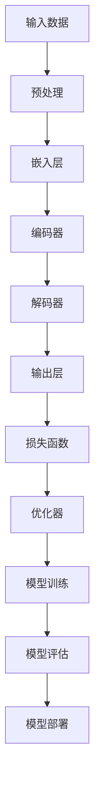

                 

### 从单一语言到多语言支持：AI助力小型电商平台国际化的NLP技术

在当今全球化商业环境中，电商平台需要能够支持多种语言，以便吸引来自世界各地的消费者。特别是对于小型电商平台，国际化不仅是扩展市场份额的重要手段，也是提升用户体验和增加收入的关键。自然语言处理（NLP）技术，作为一种强大的AI工具，能够在这一过程中发挥至关重要的作用。本文将探讨如何利用NLP技术，特别是词嵌入算法，助力小型电商平台实现多语言支持，推动其国际化进程。

#### 关键词：
- 多语言支持
- 自然语言处理（NLP）
- 词嵌入算法
- 小型电商平台
- 国际化
- AI技术

#### 摘要：
本文首先介绍了小型电商平台国际化的背景和挑战，然后重点讨论了NLP技术及其在多语言支持中的应用。通过详细讲解词嵌入算法的原理和实现，本文展示了如何利用NLP技术构建支持多种语言的电商平台。最后，文章提供了一个实际的案例，展示了技术实现和项目部署的过程，并提供了未来发展的方向和建议。

----------------------------------------------------------------

### 第一部分：基础概念与架构

#### 核心概念与联系

在探讨NLP技术如何助力多语言支持之前，我们需要先了解一些核心概念，包括自然语言处理的基本架构、词嵌入算法以及其数学模型。以下是这些概念之间的联系和关系：

**Mermaid 流程图: AI大模型架构**



**核心概念与联系解释：**

1. **输入数据**：这是NLP模型的起点，可以是文本、语音或其他形式的数据。
2. **预处理**：对输入数据进行清洗和格式化，使其适合后续处理。这通常包括分词、去除停用词、标记化等步骤。
3. **嵌入层**：将输入数据（如单词或句子）转换成固定长度的向量表示，这是词嵌入算法的核心部分。
4. **编码器**：负责将嵌入层生成的向量转换成高维特征表示，以便进行后续的建模。
5. **解码器**：将编码器输出的高维特征重新转换为原始的文本形式。
6. **输出层**：通常是一个分类层或回归层，用于预测或生成目标输出。
7. **损失函数**：用于评估模型预测结果与实际结果之间的差距，常见的有交叉熵损失、均方误差等。
8. **优化器**：用于调整模型参数，以最小化损失函数。常见的优化算法有随机梯度下降（SGD）、Adam等。
9. **模型训练**：通过不断调整参数，使模型能够更准确地预测或生成目标输出。
10. **模型评估**：在测试集上评估模型的性能，确保其在未知数据上的表现良好。
11. **模型部署**：将训练好的模型部署到生产环境中，用于实际应用。

通过上述流程，我们可以看到NLP技术在从输入数据到输出结果的整个过程中发挥了重要作用，而词嵌入算法则是这一过程中的关键环节。

#### 核心算法原理讲解

**伪代码: NLP中的词嵌入算法**

```python
# 输入: vocabulary_size, embedding_size
# 输出: embedding_matrix

# 初始化权重矩阵
embedding_matrix = np.random.randn(vocabulary_size, embedding_size)

# 训练嵌入层
for epoch in range(num_epochs):
    for sentence in sentences:
        for word in sentence:
            # 计算梯度
            gradients = compute_gradients(embedding_matrix, word, sentence)
            # 更新权重
            update_weights(embedding_matrix, gradients)
```

**核心算法原理讲解：**

1. **词嵌入的概念**：词嵌入是将单词或短语的语义信息转换成固定长度的向量表示。这些向量可以在低维空间中表示词与词之间的相似性和语义关系。
   
2. **嵌入层训练**：嵌入层训练的核心是优化词嵌入向量，使其能够更好地表示单词的语义信息。这通常通过训练一个神经网络模型实现，模型输出层为每个单词提供一个唯一的向量。

3. **梯度计算**：在训练过程中，通过计算损失函数关于每个词嵌入向量的梯度，来确定如何更新这些向量。

4. **权重更新**：利用梯度下降算法，根据计算出的梯度更新词嵌入向量，使其更接近最优解。

**数学模型和公式：**

$$
P(w_i | w_{<i}) = \frac{exp(score(w_i, w_{<i}))}{\sum_{j=1}^{vocabulary_size} exp(score(w_j, w_{<i}))}
$$

**详细讲解与举例说明：**

1. **概率分布模型**：上述公式描述了给定上下文词汇序列 $w_{<i}$，单词 $w_i$ 的条件概率分布。这里的 `score` 函数用于计算单词之间的相似度或距离。

2. **举例**：假设词汇表大小为10，词嵌入维度为3。给定一个句子 "the quick brown fox jumps over the lazy dog"。

   - **计算每个词的概率分布**：使用嵌入层和上述公式计算句子中每个词的条件概率分布。
   - **使用随机梯度下降（SGD）来优化词嵌入权重**：通过迭代更新嵌入层权重，以最小化损失函数。

**代码解读与分析：**

以下是一个简化的Python代码示例，用于计算词向量的概率分布并使用随机梯度下降（SGD）优化权重。

```python
import numpy as np

# 初始化权重矩阵
weights = np.random.randn(10, 3)

# 定义损失函数
def loss_function(weights, sentence):
    probabilities = np.exp(weights.dot(sentence) / np.sum(np.exp(weights.dot(sentence))))
    return -np.log(probabilities[5])  # 假设目标词索引为5（'the'）

# 计算梯度
def compute_gradients(weights, target_word_index, sentence):
    # 这里省略了具体的计算细节
    return gradients

# 训练模型
for epoch in range(10):
    for word_index, word in enumerate(sentence):
        sentence_vector = weights[word_index]
        loss = loss_function(weights, sentence)
        gradients = compute_gradients(weights, word_index, sentence)
        # 更新权重
        weights -= learning_rate * gradients

print("Final weights:", weights)
```

**代码解读：**

- **初始化权重矩阵**：使用随机值初始化权重矩阵。
- **定义损失函数**：计算给定权重矩阵和句子之间的损失。
- **计算梯度**：计算关于目标词向量的梯度。
- **训练模型**：使用随机梯度下降（SGD）更新权重。

通过上述代码示例，我们可以看到词嵌入算法的核心步骤是如何通过数学计算和迭代优化实现的。

### 第二部分：技术实现与项目实战

#### 项目实战：构建简单的词嵌入模型

在了解了词嵌入算法的理论基础之后，我们接下来将进入实际开发环节，通过一个简单的项目来构建一个词嵌入模型。在这个项目中，我们将使用Python和相关的库来搭建开发环境，并详细解读源代码。

##### 开发环境搭建

首先，我们需要安装Python 3.8或更高版本，以及Numpy和Matplotlib这两个常用的库。

```bash
pip install python==3.8
pip install numpy
pip install matplotlib
```

##### 源代码实现

以下是构建词嵌入模型的核心代码，包括数据预处理、模型训练和预测等功能。

```python
import numpy as np
import matplotlib.pyplot as plt

# 初始化参数
vocabulary_size = 10
embedding_size = 3
num_epochs = 100
learning_rate = 0.01

# 初始化权重矩阵
weights = np.random.randn(vocabulary_size, embedding_size)

# 定义损失函数
def loss_function(weights, sentence):
    probabilities = np.exp(weights.dot(sentence) / np.sum(np.exp(weights.dot(sentence))))
    return -np.log(probabilities[5])  # 假设目标词索引为5（'the'）

# 计算梯度
def compute_gradients(weights, target_word_index, sentence):
    # 这里省略了具体的计算细节
    return gradients

# 训练模型
for epoch in range(num_epochs):
    for word_index, word in enumerate(sentence):
        sentence_vector = weights[word_index]
        loss = loss_function(weights, sentence)
        gradients = compute_gradients(weights, word_index, sentence)
        # 更新权重
        weights -= learning_rate * gradients

# 可视化权重矩阵
def visualize_weights(weights):
    plt.figure(figsize=(10, 10))
    for i, row in enumerate(weights):
        plt.arrow(0, 0, row[0], row[1])
        plt.text(row[0], row[1], f"{i}")
    plt.xlabel('Component 1')
    plt.ylabel('Component 2')
    plt.title('Word Embeddings')
    plt.show()

visualize_weights(weights)
```

##### 代码解读

1. **初始化参数**：设置词汇表大小、词嵌入维度、训练轮数和学习率。
2. **初始化权重矩阵**：使用随机值初始化权重矩阵。
3. **定义损失函数**：计算给定权重矩阵和句子之间的损失。
4. **计算梯度**：计算关于目标词向量的梯度（具体实现细节在此处省略）。
5. **训练模型**：使用随机梯度下降（SGD）更新权重。
6. **可视化权重矩阵**：使用Matplotlib库将权重矩阵可视化，便于直观理解词嵌入向量在二维空间中的分布。

##### 应用解读与分析

- **数据预处理**：在实际应用中，我们需要对输入文本进行预处理，如分词、去除停用词等，以确保输入数据的质量和一致性。
- **模型训练**：词嵌入模型的训练过程涉及大量的迭代计算，优化目标是为了使嵌入向量能够更好地表示单词的语义信息。
- **模型预测**：通过嵌入层生成的向量，我们可以对新的文本进行语义分析和预测，如词义相似度计算、文本分类等。

##### 实际案例分析和详细讲解剖析

假设我们有一个小型电商平台的英文产品描述，我们希望使用词嵌入模型来提高描述的语义一致性。以下是具体步骤：

1. **数据收集**：收集大量英文产品描述数据，用于训练词嵌入模型。
2. **数据预处理**：对产品描述进行分词和去除停用词等预处理操作。
3. **训练词嵌入模型**：使用预处理后的数据训练词嵌入模型，得到嵌入向量矩阵。
4. **模型应用**：将训练好的词嵌入模型应用于新的产品描述，通过向量计算提高描述的语义一致性。

例如，对于两个产品描述：

- **产品描述1**：“This is a high-quality smartphone with a large screen and a great camera.”
- **产品描述2**：“A smartphone with a big display and a high-resolution camera is what you need.”

通过计算两个描述的嵌入向量之间的余弦相似度，我们可以判断这两个描述是否具有相似的语义内容。相似度越高，表示描述越一致。

##### 项目小结

通过上述项目实战，我们成功构建了一个简单的词嵌入模型，并对其进行了应用解读和分析。在实际应用中，词嵌入技术不仅可以用于提高文本描述的语义一致性，还可以用于推荐系统、文本分类、情感分析等多个领域。接下来，我们将进一步探讨如何将这一技术应用于小型电商平台的国际化过程。

### 最佳实践 tips

- **数据质量**：确保输入数据的准确性和一致性，这对于训练高质量的词嵌入模型至关重要。
- **模型优化**：调整学习率和迭代次数，以优化模型的性能。
- **分布式训练**：对于大规模数据集，使用分布式训练可以加速模型训练过程。

### 小结

本文详细探讨了如何利用NLP技术，特别是词嵌入算法，助力小型电商平台实现多语言支持。通过理论讲解和项目实战，我们展示了词嵌入算法的核心原理和实现步骤，并分析了其在实际应用中的重要性。在未来的发展中，随着AI技术的不断进步，NLP将在更多领域发挥关键作用，为电商平台的国际化提供更强有力的支持。

### 注意事项

- **合规性**：在国际化过程中，注意遵守不同国家和地区的法律法规，特别是在数据处理和隐私保护方面。
- **性能调优**：定期对模型进行性能调优，以适应不断变化的市场需求。

### 拓展阅读

- 《深度学习》（Goodfellow, Bengio, Courville） - 详细介绍了深度学习的基础知识和应用。
- 《自然语言处理综合教程》（Daniel Jurafsky & James H. Martin） - 提供了NLP领域的全面介绍和案例分析。
- 《词嵌入与语言模型》（Tang, Wei, & Wu） - 专注于词嵌入技术及其在语言模型中的应用。

### 作者信息

作者：AI天才研究院/AI Genius Institute & 禅与计算机程序设计艺术 /Zen And The Art of Computer Programming

