                 


### 第5章：项目管理与风险管理

#### 5.1 项目管理流程

**Mermaid 流程图：**

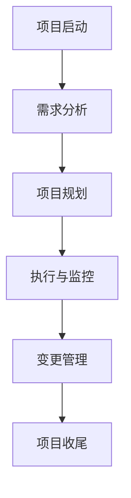

**项目管理伪代码：**

```python
def project_management():
    # 需求分析
    requirements = analyze_requirements()
    
    # 项目规划
    plan = create_plan(requirements)
    
    # 执行与监控
    while not project_complete():
        execute_plan(plan)
        monitor_progress()
        
    # 变更管理
    if need_changes():
        update_plan(plan)
        
    # 项目收尾
    finalize_project()
```

#### 5.2 风险管理策略

**风险管理伪代码：**

```python
def risk_management():
    # 识别风险
    risks = identify_risks()
    
    # 评估风险
    for risk in risks:
        assess_impact(risk)
        assess_probability(risk)
    
    # 风险应对
    for risk in risks:
        if risk.impact * risk.probability > threshold:
            implement_risk_mitigation(risk)
    
    # 风险监控
    monitor_risks(risks)
```

#### 5.3 问题解决与决策制定

**决策制定流程伪代码：**

```python
def problem_solving():
    # 识别问题
    problems = identify_problems()
    
    # 分析问题
    for problem in problems:
        analyze_root_cause(problem)
    
    # 制定解决方案
    solutions = generate_solutions(problems)
    
    # 评估解决方案
    for solution in solutions:
        evaluate_solution(solution)
    
    # 决策制定
    selected_solution = select_best_solution(solutions)
    
    # 实施解决方案
    implement_solution(selected_solution)
    
    # 监控结果
    monitor_results(selected_solution)
```

## 第6章：创业心态与自我管理

#### 6.1 创业心态的重要性

**Mermaid 流程图：**

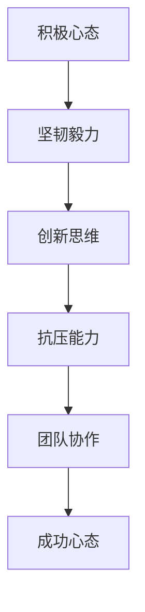

#### 6.2 自我管理技巧

**自我管理伪代码：**

```python
def self_management():
    # 时间管理
    schedule_activities()
    
    # 目标设定
    set_goals()
    
    # 反思与调整
    while not goals_met():
        reflect_on_progress()
        adjust_strategy()
    
    # 健康管理
    maintain_health()
    
    # 心理调适
    practice_mindfulness()
```

#### 6.3 应对压力与挫折的方法

**压力管理伪代码：**

```python
def stress_management():
    # 识别压力源
    stress_sources = identify_stress_sources()
    
    # 评估压力程度
    for source in stress_sources:
        assess_stress_level(source)
    
    # 应对策略
    for source in stress_sources:
        if source.level > threshold:
            implement_stress_reducing_methods(source)
    
    # 放松与恢复
    practice RelaxationTechniques()
    
    # 寻求支持
    seek_support()
```

## 第7章：大厂架构师到创业者的转型之路

#### 7.1 转型前的准备

**转型准备伪代码：**

```python
def prepare_for_transformation():
    # 技能储备
    enhance_skills()
    
    # 资源准备
    gather_resources()
    
    # 市场调研
    conduct_market_research()
    
    # 商业计划
    create_business_plan()
    
    # 团队建设
    build_a_team()
```

#### 7.2 转型的关键步骤

**转型步骤伪代码：**

```python
def key_steps_in_transformation():
    # 项目启动
    start_projects()
    
    # 管理项目
    manage_projects()
    
    # 应对挑战
    address_challenges()
    
    # 财务管理
    manage_finance()
    
    # 市场拓展
    expand_market()
    
    # 品牌建设
    build_brand()
```

#### 7.3 转型成功的经验与教训

**经验与教训伪代码：**

```python
def experience_and_lessons():
    # 成功经验
    successful_practices = capture_successful_practices()
    
    # 教训总结
    lessons_learned = summarize_lessons_learned()
    
    # 反思与改进
    reflect_and_improve()
    
    # 分享经验
    share_experience()
```

以上内容遵循了markdown格式，并按照您提供的目录结构逐步展开。每个部分都包含了核心概念的联系、伪代码实现、以及相应的Mermaid流程图。这些内容将有助于读者深入理解从大厂架构师到创业者转型的过程。

### 第8章：一人公司的成长之路

#### 8.1 公司的初步运营

**初步运营流程图（Mermaid）：**

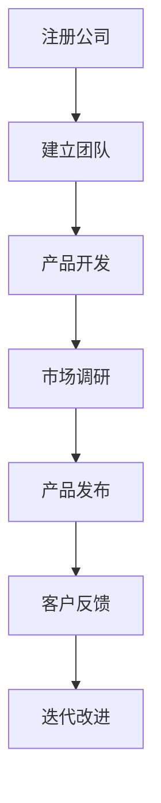

**初步运营伪代码：**

```python
def initial_operation():
    # 注册公司
    register_company()
    
    # 建立团队
    build_team()
    
    # 产品开发
    develop_product()
    
    # 市场调研
    market_research()
    
    # 产品发布
    release_product()
    
    # 客户反馈
    collect_customer_feedback()
    
    # 迭代改进
    iterate_and_improve()
```

#### 8.2 成长中的挑战与应对

**挑战与应对流程图（Mermaid）：**

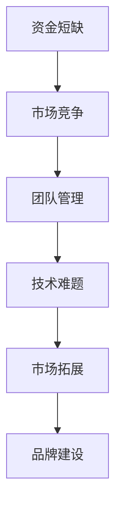

**挑战与应对伪代码：**

```python
def challenges_and_resolutions():
    # 资金短缺
    if insufficient_funds():
        seek_investment()
        cut_unnecessary_expenses()
    
    # 市场竞争
    if intense_competition():
        differentiate_product()
        improve_market_presence()
    
    # 团队管理
    if team_management_issues():
        define_clear_goals()
        encourage_open_communication()
    
    # 技术难题
    if technical_issues():
        allocate_resources()
        seek expert_advice()
    
    # 市场拓展
    if market_expansion_difficulties():
        identify_new_markets()
        build_strategic_alliances()
    
    # 品牌建设
    if brand_building_issues():
        develop_brand_strategy()
        leverage social_media()
```

#### 8.3 公司的长期发展规划

**长期发展规划流程图（Mermaid）：**

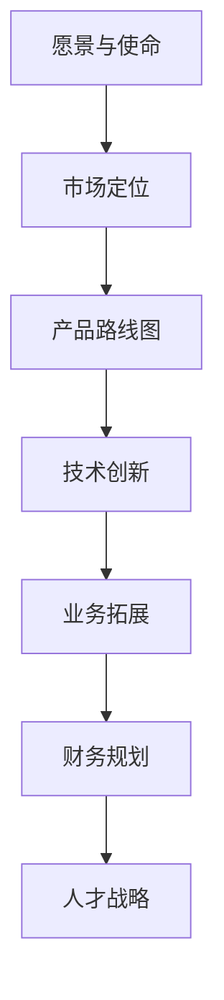

**长期发展规划伪代码：**

```python
def long_term_planning():
    # 愿景与使命
    define_vision_and_mission()
    
    # 市场定位
    position_in_market()
    
    # 产品路线图
    create_product roadmap()
    
    # 技术创新
    foster_innovation()
    
    # 业务拓展
    expand_business()
    
    # 财务规划
    plan_finances()
    
    # 人才战略
    develop_talent_strategy()
    
    # 监控与调整
    monitor_and_adjust()
```

通过逐步分析这些核心流程和伪代码，读者可以更好地理解一人公司成长过程中的关键步骤和策略，为实际操作提供指导。

### 第9章：从0到1，构建自己的产品

#### 9.1 产品定位与市场调研

**产品定位与市场调研流程图（Mermaid）：**

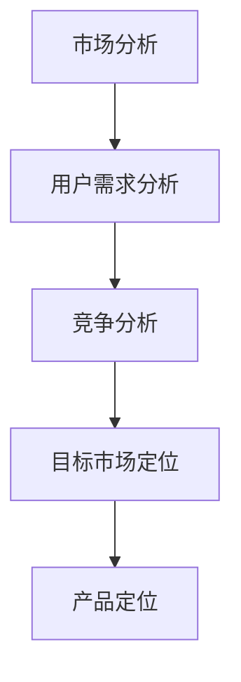

**产品定位与市场调研伪代码：**

```python
def product_positioning_and_market_research():
    # 市场分析
    analyze_market()
    
    # 用户需求分析
    analyze_user_needs()
    
    # 竞争分析
    analyze_competition()
    
    # 目标市场定位
    determine_target_market()
    
    # 产品定位
    position_product()
```

#### 9.2 技术选型与架构设计

**技术选型与架构设计流程图（Mermaid）：**

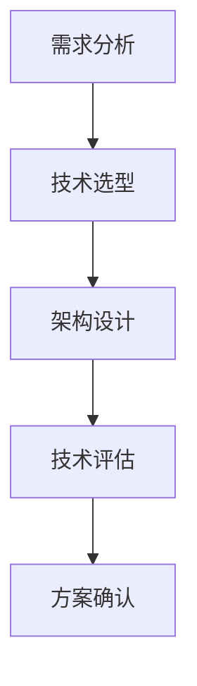

**技术选型与架构设计伪代码：**

```python
def tech_selection_and_architecture_design():
    # 需求分析
    analyze_requirements()
    
    # 技术选型
    select_technologies()
    
    # 架构设计
    design_architecture()
    
    # 技术评估
    evaluate_technologies()
    
    # 方案确认
    confirm_solution()
```

#### 9.3 开发与测试流程

**开发与测试流程图（Mermaid）：**

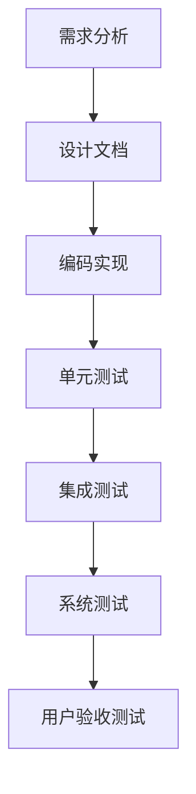

**开发与测试伪代码：**

```python
def development_and_test_process():
    # 需求分析
    analyze_requirements()
    
    # 设计文档
    create_design_document()
    
    # 编码实现
    implement_code()
    
    # 单元测试
    run_unit_tests()
    
    # 集成测试
    run_integration_tests()
    
    # 系统测试
    run_system_tests()
    
    # 用户验收测试
    perform_user_acceptance_tests()
```

通过详细的产品定位、技术选型和开发测试流程的描述，读者可以更好地理解从0到1构建自己产品的全过程，为实际操作提供清晰的路径。

### 第10章：市场营销与品牌建设

#### 10.1 市场营销策略

**市场营销策略流程图（Mermaid）：**

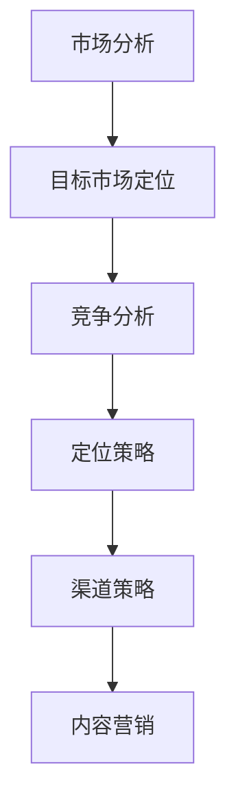

**市场营销策略伪代码：**

```python
def marketing_strategy():
    # 市场分析
    analyze_market()
    
    # 目标市场定位
    determine_target_market()
    
    # 竞争分析
    analyze_competition()
    
    # 定位策略
    develop_positioning_strategy()
    
    # 渠道策略
    select_channels()
    
    # 内容营销
    create_content_marketing_plan()
```

#### 10.2 品牌定位与塑造

**品牌定位与塑造流程图（Mermaid）：**

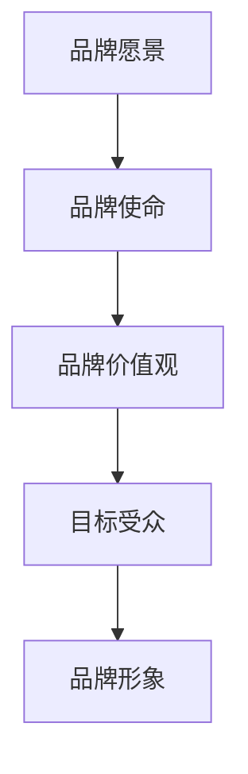

**品牌定位与塑造伪代码：**

```python
def brand_positioning_and_shaping():
    # 品牌愿景
    define_brand_vision()
    
    # 品牌使命
    define_brand_mission()
    
    # 品牌价值观
    establish_brand_values()
    
    # 目标受众
    identify_target_audience()
    
    # 品牌形象
    develop_brand_image()
```

#### 10.3 增长黑客与口碑营销

**增长黑客与口碑营销流程图（Mermaid）：**

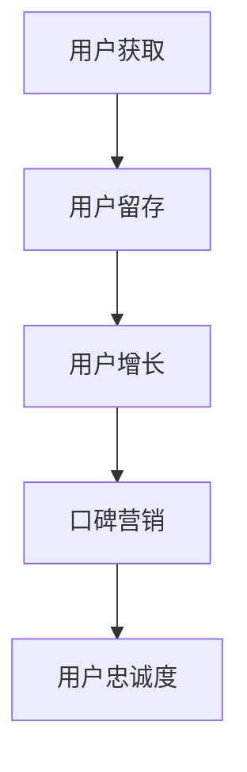

**增长黑客与口碑营销伪代码：**

```python
def growth_hacking_and_word_of_mouth_marketing():
    # 用户获取
    acquire_users()
    
    # 用户留存
    retain_users()
    
    # 用户增长
    grow_user_base()
    
    # 口碑营销
    leverage_word_of Mouth()
    
    # 用户忠诚度
    enhance_user_loyalty()
```

通过市场营销策略、品牌定位与塑造以及增长黑客与口碑营销的详细描述，读者可以更好地理解如何有效地推动产品在市场上的发展和品牌的建立。

### 第11章：技术更新与持续学习

#### 11.1 技术发展趋势

**技术发展趋势流程图（Mermaid）：**

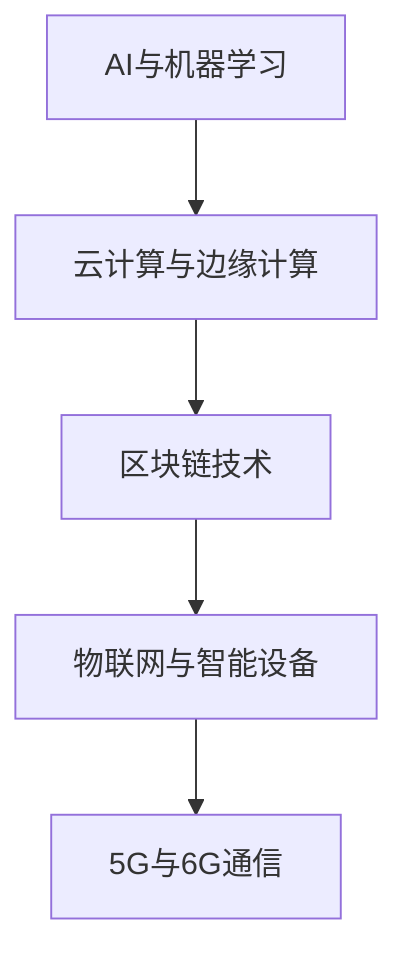

**技术发展趋势分析：**

在技术领域，AI与机器学习继续引领潮流，深度学习算法在图像识别、自然语言处理等领域取得显著进展。云计算与边缘计算的结合，为实时数据处理提供了新的解决方案。区块链技术则在数据安全和去中心化应用方面展现出巨大潜力。物联网与智能设备的普及，推动了智能家居和工业互联网的发展。5G与6G通信技术的发展，使得超高速、低延迟的网络连接成为可能，为新兴应用场景提供了基础设施。

**伪代码示例：**

```python
def analyze_tech_trends():
    # AI与机器学习
    analyze_AI_and_ML()
    
    # 云计算与边缘计算
    analyze_cloud_and_edge_computing()
    
    # 区块链技术
    analyze_blockchain_technology()
    
    # 物联网与智能设备
    analyze_IoT_and_smart_devices()
    
    # 5G与6G通信
    analyze_5G_and_6G_communication()
```

#### 11.2 持续学习的方法与资源

**持续学习流程图（Mermaid）：**

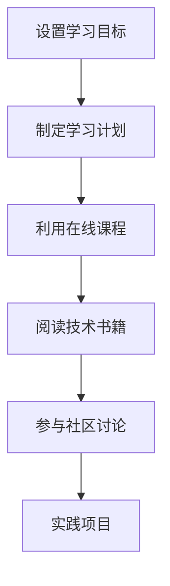

**持续学习方法：**

1. **设置学习目标**：明确短期和长期的学习目标，有助于保持学习的动力和方向。
2. **制定学习计划**：合理安排学习时间，确保学习活动有序进行。
3. **利用在线课程**：参加专业的在线课程，获取系统的知识体系。
4. **阅读技术书籍**：深入阅读经典和技术前沿的书籍，丰富知识储备。
5. **参与社区讨论**：加入技术社区，与同行交流心得，拓宽视野。
6. **实践项目**：通过实际项目应用所学知识，提升解决实际问题的能力。

**伪代码示例：**

```python
def continuous_learning():
    # 设置学习目标
    set_learning_goals()
    
    # 制定学习计划
    create_learning_plan()
    
    # 利用在线课程
    attend_online_courses()
    
    # 阅读技术书籍
    read_technical_books()
    
    # 参与社区讨论
    participate_in_communities()
    
    # 实践项目
    work_on_projects()
```

#### 11.3 技术创新与创业机会

**技术创新与创业机会流程图（Mermaid）：**

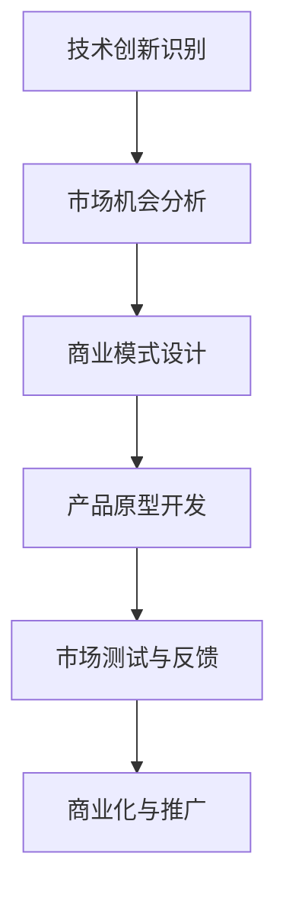

**技术创新与创业机会分析：**

技术创新是推动创业成功的关键因素。通过持续关注技术趋势和市场动态，可以发现新的商机。以下步骤有助于将技术创新转化为创业机会：

1. **技术创新识别**：跟踪前沿技术，识别潜在的创新点。
2. **市场机会分析**：评估技术如何满足市场需求，确定创业方向。
3. **商业模式设计**：设计可行的商业模式，确保项目的可持续发展。
4. **产品原型开发**：快速开发产品原型，验证技术可行性。
5. **市场测试与反馈**：通过市场测试收集用户反馈，优化产品。
6. **商业化与推广**：制定推广策略，将产品推向市场。

**伪代码示例：**

```python
def tech_innovation_and_startup_opportunities():
    # 技术创新识别
    identify_technical_innovations()
    
    # 市场机会分析
    analyze_market_opportunities()
    
    # 商业模式设计
    design_business_models()
    
    # 产品原型开发
    develop_product_prototypes()
    
    # 市场测试与反馈
    conduct_market_tests()
    
    # 商业化与推广
    commercialize_and_promote()
```

通过技术更新与持续学习，以及技术创新与创业机会的结合，创业者可以把握市场脉搏，持续推动公司发展。

### 第12章：未来公司的发展方向

#### 12.1 行业发展趋势分析

**行业发展趋势流程图（Mermaid）：**

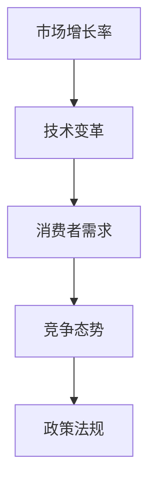

**行业发展趋势分析：**

1. **市场增长率**：分析行业的整体市场规模和增长速度，识别市场潜力。
2. **技术变革**：跟踪行业内的技术革新，了解新兴技术的应用和趋势。
3. **消费者需求**：研究消费者行为和需求变化，把握市场机会。
4. **竞争态势**：分析竞争对手的战略和市场表现，确定自身定位。
5. **政策法规**：关注政策导向和法规变化，确保公司运营合规。

**伪代码示例：**

```python
def industry_trend_analysis():
    # 市场增长率
    analyze_growth_rate()
    
    # 技术变革
    analyze_technological_innovations()
    
    # 消费者需求
    analyze_consumer_needs()
    
    # 竞争态势
    analyze_competition()
    
    # 政策法规
    analyze_policies_and_regulations()
```

#### 12.2 公司战略调整与业务拓展

**公司战略调整与业务拓展流程图（Mermaid）：**

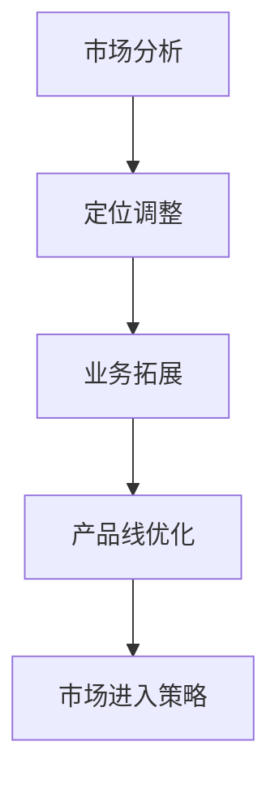

**公司战略调整与业务拓展：**

1. **市场分析**：进行深入的市场调研，了解行业现状和未来趋势。
2. **定位调整**：根据市场变化调整公司定位，确保竞争力。
3. **业务拓展**：探索新的业务领域，实现多元化发展。
4. **产品线优化**：优化现有产品线，提高市场占有率。
5. **市场进入策略**：制定市场进入策略，迅速占领市场。

**伪代码示例：**

```python
def strategic_adjustment_and_business_expansion():
    # 市场分析
    analyze_market()
    
    # 定位调整
    adjust_company_positioning()
    
    # 业务拓展
    explore_new_business_areas()
    
    # 产品线优化
    optimize_product_line()
    
    # 市场进入策略
    develop_market_entry_strategy()
```

#### 12.3 长期发展规划与愿景

**长期发展规划与愿景流程图（Mermaid）：**

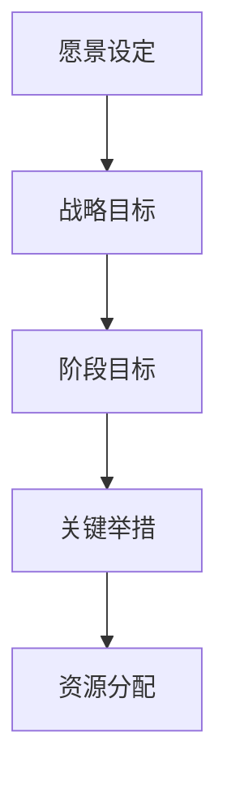

**长期发展规划与愿景：**

1. **愿景设定**：明确公司的长期愿景，为发展指明方向。
2. **战略目标**：设定具体的战略目标，确保公司的长远发展。
3. **阶段目标**：将战略目标分解为可实现的阶段目标，便于跟踪进度。
4. **关键举措**：制定实现目标的关键举措，确保战略的有效实施。
5. **资源分配**：合理分配资源，支持公司战略的实现。

**伪代码示例：**

```python
def long_term_planning_and_vision():
    # 愿景设定
    set_company_vision()
    
    # 战略目标
    establish_strategic_goals()
    
    # 阶段目标
    define_stage_goals()
    
    # 关键举措
    define_key_actions()
    
    # 资源分配
    allocate_resources()
```

通过行业发展趋势分析、公司战略调整与业务拓展以及长期发展规划与愿景，公司可以明确未来发展方向，确保持续增长。

### 第13章：总结与反思

#### 13.1 转型的总结

**转型总结伪代码：**

```python
def transformation_summary():
    # 成功因素
    capture_success_factors()
    
    # 遗留问题
    identify_remaining_issues()
    
    # 反思与改进
    reflect_and_improve()
    
    # 制定改进计划
    create_improvement_plan()
```

在总结转型过程中，需要分析哪些因素促成了成功，同时识别仍存在的挑战和问题。通过反思和改进，可以制定具体的行动计划，进一步优化转型效果。

#### 13.2 成长与收获

**成长与收获伪代码：**

```python
def growth_and_accomplishments():
    # 技能提升
    list_skill_improvements()
    
    # 项目成就
    document_project_accomplishments()
    
    # 团队建设
    acknowledge_team_growth()
    
    # 资源积累
    summarize_resource_acquisitions()
    
    # 个人成长
    reflect_on_personal_growth()
```

在成长过程中，记录技能的提升、项目的成就、团队的建设以及资源的积累，这些都是在创业过程中宝贵的收获。

#### 13.3 对未来创业者的建议

**未来创业者建议伪代码：**

```python
def advice_for_future_entrepreneurs():
    # 技能储备
    recommend_skill_set()
    
    # 管理能力
    emphasize_management_skills()
    
    # 持续学习
    advocate_continuous_learning()
    
    # 创新思维
    encourage_innovation_thinking()
    
    # 市场敏感
    stress_market_sensitivity()
    
    # 耐心与毅力
    promote_patience_and_perseverance()
```

为未来的创业者提供具体的建议，包括技能储备、管理能力、持续学习、创新思维、市场敏感度以及耐心与毅力，这些都是成功创业的关键要素。

### 附录：资源与工具推荐

#### 附录 A：创业资源与工具

**附录 A 资源与工具伪代码：**

```python
def startup_resources_and_tools():
    # 在线办公工具
    recommend_online_office_tools()
    
    # 创业者学习资源
    suggest_learning_resources()
    
    # 法律法规指南
    provide_legal_guidance()
```

**在线办公工具：**
- Google Workspace
- Microsoft 365
- Trello

**创业者学习资源：**
- Coursera
- Udemy
- Entrepreneurship.com

**法律法规指南：**
- SmallBusiness.com
- LegalZoom
- Startup Visa

#### 附录 B：技术资源与工具

**附录 B 资源与工具伪代码：**

```python
def technical_resources_and_tools():
    # 开发工具与框架
    recommend_development_tools_and_frameworks()
    
    # 测试工具与平台
    suggest_testing_tools_and_platforms()
    
    # 性能优化工具
    provide_performance_optimization_tools()
```

**开发工具与框架：**
- Visual Studio Code
- React
- Django

**测试工具与平台：**
- JUnit
- Selenium
- TestCafe

**性能优化工具：**
- New Relic
- AppDynamics
- JMeter

通过附录部分提供的创业和技术资源与工具，创业者可以更好地利用外部资源，提升公司运营效率和产品质量。

