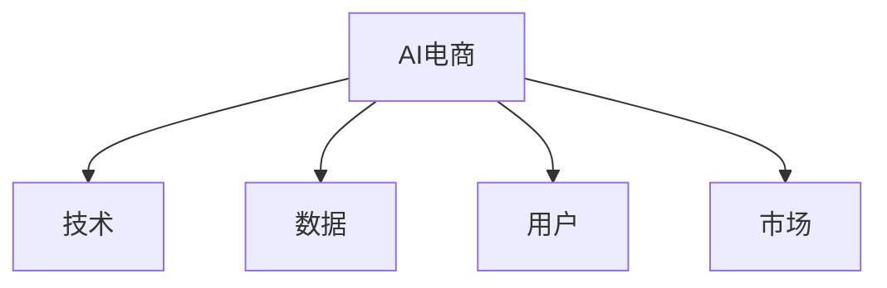

                 


### 文章标题
《从技术专家到团队领袖：程序员的AI电商创业领导力培养》

### 关键词
AI电商，创业领导力，团队管理，技术架构，项目管理，人才发展

### 摘要
本文深入探讨了程序员从技术专家转型为AI电商创业团队领袖的过程，涵盖了行业背景、创业准备、核心技术和领导力提升等多个方面。通过分析AI电商的发展现状、技术应用以及挑战，本文提出了一套系统的创业领导力培养方案，旨在帮助程序员在创业过程中实现高效团队管理和项目成功。

### 目录大纲

## 第一部分：AI电商行业概述

### 第1章 AI电商的背景和现状
#### 1.1 AI电商的定义与发展历程
#### 1.2 AI电商的主要应用场景
#### 1.3 AI电商的挑战与机遇

### 第2章 程序员AI电商创业的准备
#### 2.1 创业思维与领导力
#### 2.2 市场调研与分析
#### 2.3 团队组建与管理

### 第3章 AI电商核心技术与架构
#### 3.1 电商业务流程与AI技术应用
#### 3.2 人工智能算法在电商中的应用
#### 3.3 AI电商架构设计与优化

## 第二部分：领导力提升与实践

### 第4章 团队沟通与协作
#### 4.1 沟通技巧与策略
#### 4.2 团队协作工具与应用
#### 4.3 程序员向领导者转型

### 第5章 项目管理与决策
#### 5.1 项目管理基础
#### 5.2 决策分析工具与方法
#### 5.3 项目风险管理

### 第6章 人才选拔与培养
#### 6.1 人才评估与选拔
#### 6.2 团队成员能力培养
#### 6.3 人才激励与留任策略

### 第7章 创新与创业实战
#### 7.1 创新思维与工具
#### 7.2 创业项目的规划与执行
#### 7.3 创业过程中的问题解决

## 第三部分：成功案例分析

### 第8章 成功AI电商创业案例分析
#### 8.1 案例介绍
#### 8.2 案例分析与启示
#### 8.3 案例中的领导力实践

### 附录
#### 附录A：AI电商创业工具与资源
#### 附录B：参考文献
#### 附录C：相关网站和论坛推荐

### Mermaid 流�程图



### AI电商架构设计伪代码

```python
class AI_Ecommerce_System:
    def __init__(self):
        self.user_behavior_analyzer = UserBehaviorAnalyzer()
        self.recommendation_system = RecommendationSystem()
        self.customer_support_bot = CustomerSupportBot()
        self.order_management_system = OrderManagementSystem()

    def process_order(self, order_data):
        # 处理订单
        pass

    def analyze_user_behavior(self, user_data):
        # 分析用户行为
        pass

    def recommend_products(self, user_profile):
        # 推荐产品
        pass

    def handle_customer_inquiry(self, inquiry_data):
        # 处理客户咨询
        pass

# 伪代码：用户行为分析
def analyze_user_behavior(user_data):
    """
    分析用户行为，预测用户偏好
    """
    user_preferences = predict_preferences(user_data)
    return user_preferences

# 伪代码：推荐系统
def recommend_products(user_profile):
    """
    根据用户偏好推荐产品
    """
    recommended_products = generate_recommendations(user_profile)
    return recommended_products
```

### 数学模型讲解

#### 用户行为预测模型

$$
\hat{y_i} = \beta_0 + \beta_1 x_{i1} + \beta_2 x_{i2} + ... + \beta_p x_i
```

### 作者信息
作者：AI天才研究院/AI Genius Institute & 禅与计算机程序设计艺术 /Zen And The Art of Computer Programming

### 文章正文部分

## 第一部分：AI电商行业概述

### 第1章 AI电商的背景和现状

#### 1.1 AI电商的定义与发展历程

AI电商，即基于人工智能技术的电子商务平台。它利用人工智能算法，对用户数据进行深度挖掘和分析，实现个性化推荐、智能客服、精准营销等功能。AI电商的发展可以追溯到20世纪末，随着互联网的普及和数据量的爆发式增长，人工智能技术在电商领域的应用逐渐成熟。

从2000年初期，基于机器学习的推荐系统开始应用于电商，例如亚马逊和淘宝的个性化推荐。随后，自然语言处理、计算机视觉等技术的应用使得电商的智能化程度不断提升。近年来，随着深度学习、强化学习等前沿技术的兴起，AI电商迎来了新一轮的发展高峰。

#### 1.2 AI电商的主要应用场景

AI电商的应用场景广泛，主要包括以下几个方面：

1. **个性化推荐**：根据用户的历史购买记录、浏览行为等数据，利用机器学习算法生成个性化推荐，提升用户体验和购买转化率。
2. **智能客服**：通过自然语言处理技术，实现智能客服机器人，自动处理客户咨询、投诉等问题，提高客户满意度和运营效率。
3. **精准营销**：利用大数据分析，识别潜在客户，实施精准营销策略，提升广告投放效果和ROI。
4. **供应链优化**：通过预测分析，优化库存管理、物流配送等环节，降低运营成本，提升供应链效率。
5. **风险控制**：利用机器学习算法，对用户行为进行监控和分析，识别异常行为，防范欺诈风险。

#### 1.3 AI电商的挑战与机遇

AI电商在带来巨大商业价值的同时，也面临着诸多挑战：

1. **数据隐私与安全**：用户数据的安全和隐私保护是AI电商需要重点关注的问题。如何在保证用户体验的同时，确保数据的安全和隐私，是AI电商面临的重要挑战。
2. **算法透明性与公平性**：AI算法的决策过程往往不透明，容易引发公平性问题。如何确保算法的透明性和公平性，是AI电商需要考虑的问题。
3. **技术落地与维护**：AI技术的高成本和高维护成本，使得AI电商在技术落地和持续维护方面面临挑战。
4. **人才短缺**：AI电商需要大量具备人工智能技术和电商运营经验的人才，但人才短缺问题在行业内普遍存在。

然而，这些挑战也带来了巨大的机遇：

1. **商业模式的创新**：AI电商为商家提供了丰富的数据和技术工具，有助于创新商业模式，提升竞争力。
2. **用户体验的提升**：AI电商通过个性化推荐、智能客服等手段，提升了用户体验和满意度。
3. **运营效率的提高**：AI电商通过智能化的供应链管理和风险控制，提高了运营效率和利润率。

### 第2章 程序员AI电商创业的准备

#### 2.1 创业思维与领导力

程序员转型为创业者，需要具备创业思维和领导力。创业思维主要包括创新意识、市场洞察力、用户思维和资源整合能力。创新意识是创业者追求创新和突破的精神，市场洞察力是对市场动态和用户需求的敏锐感知，用户思维是站在用户的角度思考问题，资源整合能力是能够有效利用各种资源，为创业项目提供支持。

领导力是创业者必备的素质，主要包括以下几个方面：

1. **愿景领导**：明确企业的愿景和使命，为团队提供明确的奋斗目标。
2. **策略领导**：制定正确的战略规划，确保企业的发展方向正确。
3. **团队领导**：培养和带领团队，激发团队成员的潜能，实现共同目标。
4. **变革领导**：面对市场变化，敢于变革和创新，推动企业持续发展。

#### 2.2 市场调研与分析

市场调研是创业者的重要准备工作，通过市场调研，可以了解行业趋势、用户需求和竞争对手情况，为创业项目提供依据。

市场调研主要包括以下几个方面：

1. **行业分析**：了解电商行业的市场规模、增长趋势、竞争格局等。
2. **用户分析**：研究目标用户群体的需求、行为习惯和偏好。
3. **竞品分析**：分析竞争对手的产品、市场策略、用户口碑等。
4. **市场定位**：确定创业项目的市场定位，明确目标用户和差异化竞争优势。

#### 2.3 团队组建与管理

团队是创业成功的关键，组建和管理一个高效团队至关重要。团队组建主要包括以下几个方面：

1. **核心团队**：组建一个核心团队，包括技术、产品、运营、市场等关键岗位。
2. **人才引进**：通过招聘、合伙人等方式，引进具备相关经验和技能的人才。
3. **文化建设**：建立积极向上的企业文化，培养团队凝聚力和战斗力。

团队管理主要包括以下几个方面：

1. **目标管理**：明确团队目标，确保团队成员共同努力。
2. **绩效管理**：建立绩效评估体系，激励团队成员提升工作效率。
3. **沟通协作**：建立有效的沟通机制，促进团队成员之间的协作。
4. **人才培养**：关注团队成员的成长，提供培训和发展的机会。

### 第3章 AI电商核心技术与架构

#### 3.1 电商业务流程与AI技术应用

电商业务流程主要包括用户注册、商品浏览、购物车、下单、支付、订单管理等环节。AI技术在电商业务流程中的应用，可以提高用户体验和运营效率。

1. **用户注册**：利用人工智能技术进行用户身份验证，如人脸识别、指纹识别等，提高注册安全性。
2. **商品浏览**：通过个性化推荐算法，根据用户的历史行为和偏好推荐商品，提高用户满意度和转化率。
3. **购物车**：利用智能算法分析用户购物车中的商品，进行组合推荐，提高购物车满额率。
4. **下单与支付**：利用智能客服机器人，提供在线客服服务，解答用户疑问，提高支付转化率。
5. **订单管理**：利用人工智能技术进行订单预测和分析，优化库存管理，提高订单处理效率。

#### 3.2 人工智能算法在电商中的应用

人工智能算法在电商中的应用主要包括推荐系统、智能客服、图像识别、自然语言处理等方面。

1. **推荐系统**：基于用户的历史行为和偏好，利用协同过滤、矩阵分解等算法，生成个性化推荐。
2. **智能客服**：利用自然语言处理技术，实现人机对话，提供在线客服服务，提高客户满意度。
3. **图像识别**：利用计算机视觉技术，实现商品识别、图片分类等，提高商品管理的准确性。
4. **自然语言处理**：利用自然语言处理技术，实现关键词提取、情感分析等，为电商提供数据支持。

#### 3.3 AI电商架构设计与优化

AI电商架构设计主要包括前端展示层、业务逻辑层、数据存储层和基础支撑层。

1. **前端展示层**：负责用户界面设计和交互，采用响应式设计，适配不同终端设备。
2. **业务逻辑层**：负责业务流程处理和数据处理，包括用户行为分析、推荐系统、智能客服等。
3. **数据存储层**：负责数据的存储和管理，包括用户数据、商品数据、订单数据等。
4. **基础支撑层**：负责系统的基础服务，如缓存、消息队列、数据库等。

AI电商架构优化主要包括以下几个方面：

1. **性能优化**：通过缓存、分布式架构等手段，提高系统的响应速度和处理能力。
2. **安全性优化**：通过加密、防火墙等技术，确保系统的安全性和数据的安全性。
3. **可扩展性优化**：通过微服务架构、容器化技术等，提高系统的可扩展性和灵活性。
4. **成本优化**：通过云服务、自动化运维等技术，降低系统的运维成本。

### 第二部分：领导力提升与实践

#### 第4章 团队沟通与协作

#### 4.1 沟通技巧与策略

沟通是团队协作的核心，有效的沟通能够提高工作效率和团队凝聚力。以下是一些沟通技巧与策略：

1. **明确沟通目标**：在沟通前明确沟通的目标，确保双方对沟通的内容和目的有清晰的认识。
2. **倾听与反馈**：认真倾听对方的意见，给予及时的反馈，建立良好的互动关系。
3. **透明沟通**：保持沟通的透明度，及时分享信息，避免信息不对称和误解。
4. **积极沟通**：面对问题和挑战，保持积极的态度，通过沟通寻找解决方案。
5. **情感沟通**：关注团队成员的情感需求，提供情感支持，增强团队的凝聚力。

#### 4.2 团队协作工具与应用

团队协作工具能够提高团队的工作效率和协作效果。以下是一些常用的团队协作工具：

1. **项目管理工具**：如Trello、Asana等，用于任务分配、进度跟踪和项目管理。
2. **协作办公平台**：如Slack、Microsoft Teams等，用于即时通讯、文件共享和团队协作。
3. **代码管理工具**：如Git、GitHub等，用于代码版本控制、协作开发和项目管理。
4. **文档协作工具**：如Google Docs、Notion等，用于文档编辑、共享和协作。
5. **视频会议工具**：如Zoom、Microsoft Teams等，用于远程会议和在线协作。

#### 4.3 程序员向领导者转型

程序员向领导者转型，需要从技术思维向领导思维转变。以下是一些转型建议：

1. **提升领导力**：参加领导力培训，学习领导力理论和实践方法，提升领导能力。
2. **培养团队意识**：关注团队成员的需求和成长，培养团队协作精神，建立团队文化。
3. **学会决策**：在面对问题时，能够快速做出决策，并承担决策的责任。
4. **提升沟通能力**：提高沟通技巧，建立有效的沟通机制，促进团队协作。
5. **培养人才**：关注团队成员的能力提升，提供培训和发展机会，激发团队潜力。

### 第5章 项目管理与决策

#### 5.1 项目管理基础

项目管理是确保项目成功的关键，以下是一些项目管理的基础知识：

1. **项目计划**：制定项目计划，明确项目目标、任务、资源、时间等。
2. **项目执行**：按照项目计划执行任务，监控项目进度和风险。
3. **项目监控**：定期监控项目进展，识别和解决问题。
4. **项目收尾**：完成项目任务，进行项目总结和评估。

#### 5.2 决策分析工具与方法

决策分析是项目管理的重要环节，以下是一些决策分析工具与方法：

1. **成本效益分析**：分析项目的成本和收益，评估项目的可行性。
2. **风险分析**：识别项目风险，评估风险的概率和影响，制定风险应对策略。
3. **决策树**：通过构建决策树，分析不同决策路径的收益和风险。
4. **博弈论**：在多参与者决策情境下，分析不同策略的收益和风险。

#### 5.3 项目风险管理

项目风险管理是确保项目成功的关键，以下是一些项目风险管理的方法：

1. **风险评估**：识别项目风险，评估风险的概率和影响。
2. **风险应对**：制定风险应对策略，降低风险的影响。
3. **风险监控**：定期监控项目风险，及时调整风险应对策略。
4. **风险沟通**：与团队成员沟通项目风险，提高风险意识和应对能力。

### 第6章 人才选拔与培养

#### 6.1 人才评估与选拔

人才评估与选拔是团队建设的关键，以下是一些人才评估与选拔的方法：

1. **能力评估**：通过面试、笔试等手段，评估候选人的技术能力、沟通能力和团队协作能力。
2. **性格评估**：通过MBTI、DISC等性格测试，了解候选人的性格特点，匹配团队需求。
3. **潜力评估**：通过观察候选人在实际工作中的应用能力和发展潜力，评估其长期价值。
4. **文化契合度**：评估候选人是否与团队文化和价值观相符，提高团队凝聚力。

#### 6.2 团队成员能力培养

团队成员能力培养是团队发展的基础，以下是一些能力培养的方法：

1. **培训与学习**：提供培训和学习机会，帮助团队成员提升技能和知识。
2. **实践锻炼**：通过实际项目，锻炼团队成员的实践能力，提高解决问题的能力。
3. **导师制度**：建立导师制度，帮助新成员快速融入团队，提升工作能力。
4. **激励机制**：建立激励机制，鼓励团队成员不断提升自身能力。

#### 6.3 人才激励与留任策略

人才激励与留任是团队稳定发展的关键，以下是一些人才激励与留任策略：

1. **薪酬激励**：提供有竞争力的薪酬，吸引和留住优秀人才。
2. **绩效激励**：建立绩效评估体系，对优秀员工进行奖励，提高工作积极性。
3. **职业发展**：提供清晰的职业发展路径，帮助员工实现职业成长。
4. **企业文化**：建立积极向上的企业文化，提高员工的工作满意度和归属感。

### 第7章 创新与创业实战

#### 7.1 创新思维与工具

创新思维是创业者必备的素质，以下是一些创新思维与工具：

1. **头脑风暴**：通过集体讨论，激发创意思维，产生创新想法。
2. **SWOT分析**：分析项目的优势、劣势、机会和威胁，制定创新策略。
3. **用户画像**：通过用户调研，了解目标用户的需求和偏好，制定创新方向。
4. **交叉创新**：结合不同领域的知识和经验，实现创新突破。

#### 7.2 创业项目的规划与执行

创业项目的规划与执行是创业成功的关键，以下是一些关键步骤：

1. **项目规划**：明确项目目标、任务、资源和时间，制定详细的项目计划。
2. **团队组建**：组建专业的团队，明确团队成员的职责和任务。
3. **资源整合**：整合外部资源，如资金、技术、人才等，为项目提供支持。
4. **项目执行**：按照项目计划执行任务，确保项目按期完成。
5. **项目监控**：定期监控项目进展，识别和解决问题，确保项目顺利进行。

#### 7.3 创业过程中的问题解决

创业过程中会遇到各种问题，以下是一些常见问题的解决方法：

1. **资金问题**：通过融资、减少开支等方式，解决资金问题。
2. **技术问题**：通过技术攻关、外包等方式，解决技术问题。
3. **市场问题**：通过市场调研、调整策略等方式，解决市场问题。
4. **团队问题**：通过沟通、培训等方式，解决团队问题。
5. **法律问题**：通过法律咨询、合作协议等方式，解决法律问题。

### 第三部分：成功案例分析

#### 第8章 成功AI电商创业案例分析

#### 8.1 案例介绍

本案例介绍了一家成功AI电商创业公司——小蜜电商。小蜜电商成立于2016年，专注于利用人工智能技术提升电商用户体验和运营效率。公司核心团队由多名具有人工智能和电商运营经验的程序员组成。

#### 8.2 案例分析与启示

小蜜电商的成功主要得益于以下几个方面：

1. **技术创新**：小蜜电商采用了先进的推荐系统、智能客服和图像识别技术，提升了用户体验和运营效率。
2. **市场定位**：小蜜电商明确了自己的市场定位，专注于中高端用户群体，提供个性化推荐和高品质商品。
3. **团队协作**：小蜜电商的核心团队具有较强的协作精神和创新能力，能够快速响应市场变化和用户需求。
4. **持续创新**：小蜜电商始终保持创新精神，不断优化产品和服务，提升用户满意度和市场竞争力。

本案例给我们的启示：

1. **技术创新**：作为程序员创业者，应关注人工智能技术的最新动态，将其应用于电商业务，提升用户体验和运营效率。
2. **市场定位**：明确自己的市场定位，专注于目标用户群体，提供个性化服务和高品质商品。
3. **团队协作**：重视团队协作，建立高效的沟通机制，激发团队成员的创新能力。
4. **持续创新**：保持创新精神，不断优化产品和服务，提升用户满意度和市场竞争力。

### 附录

#### 附录A：AI电商创业工具与资源

1. **开发工具**：Python、TensorFlow、PyTorch等。
2. **数据集**：Kaggle、UCI机器学习库等。
3. **云服务**：AWS、Azure、Google Cloud等。
4. **协作工具**：Trello、Slack、Asana等。
5. **市场分析工具**：Google Analytics、Alexa等。

#### 附录B：参考文献

1. **《人工智能：一种现代的方法》**： Stuart J. Russell & Peter Norvig著。
2. **《深度学习》**： Ian Goodfellow、Yoshua Bengio & Aaron Courville著。
3. **《电商创新》**： 郑明所著。
4. **《创业的本质》**： 史蒂夫·布兰克所著。

#### 附录C：相关网站和论坛推荐

1. **AI相关网站**：arXiv、NeurIPS、ICML等。
2. **电商相关网站**：电商论坛、电商新闻等。
3. **技术论坛**：Stack Overflow、GitHub等。
4. **创业论坛**：创业邦、36氪等。

### 结束语

从技术专家到团队领袖，程序员在AI电商创业过程中，需要不断提升自身的技术能力和领导力。通过深入理解AI电商的行业背景、核心技术和创业实战，程序员可以逐步实现从技术专家到团队领袖的转型，推动AI电商项目的成功。希望本文能为程序员提供一些有益的启示和参考。作者：AI天才研究院/AI Genius Institute & 禅与计算机程序设计艺术 /Zen And The Art of Computer Programming。

