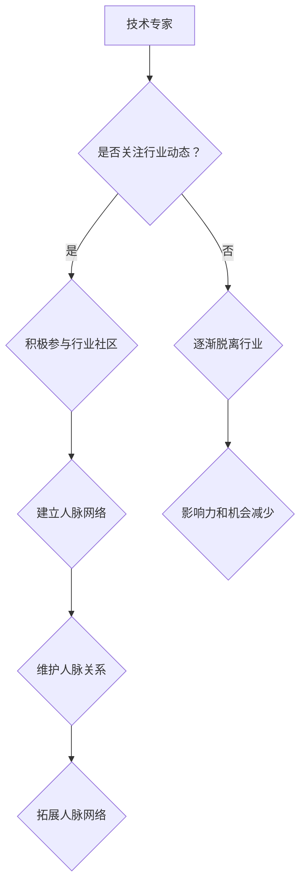
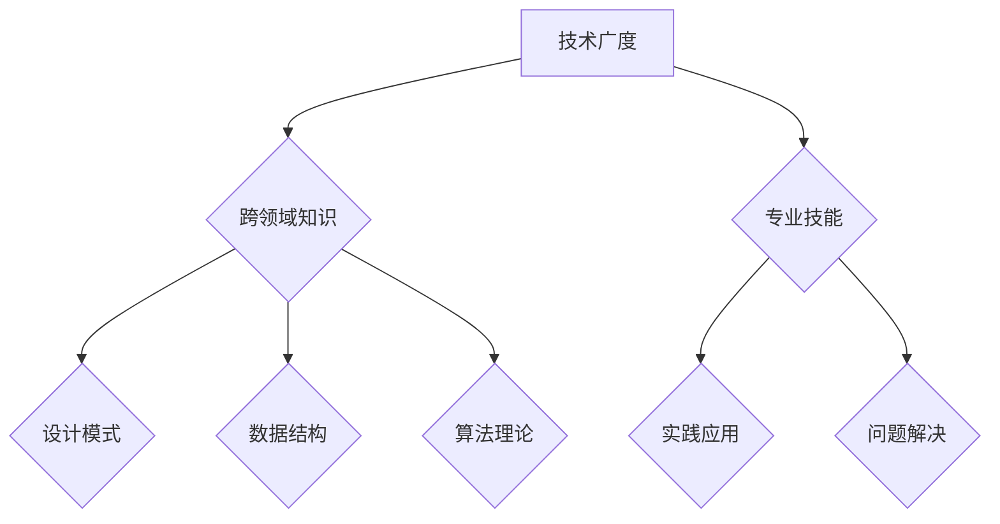
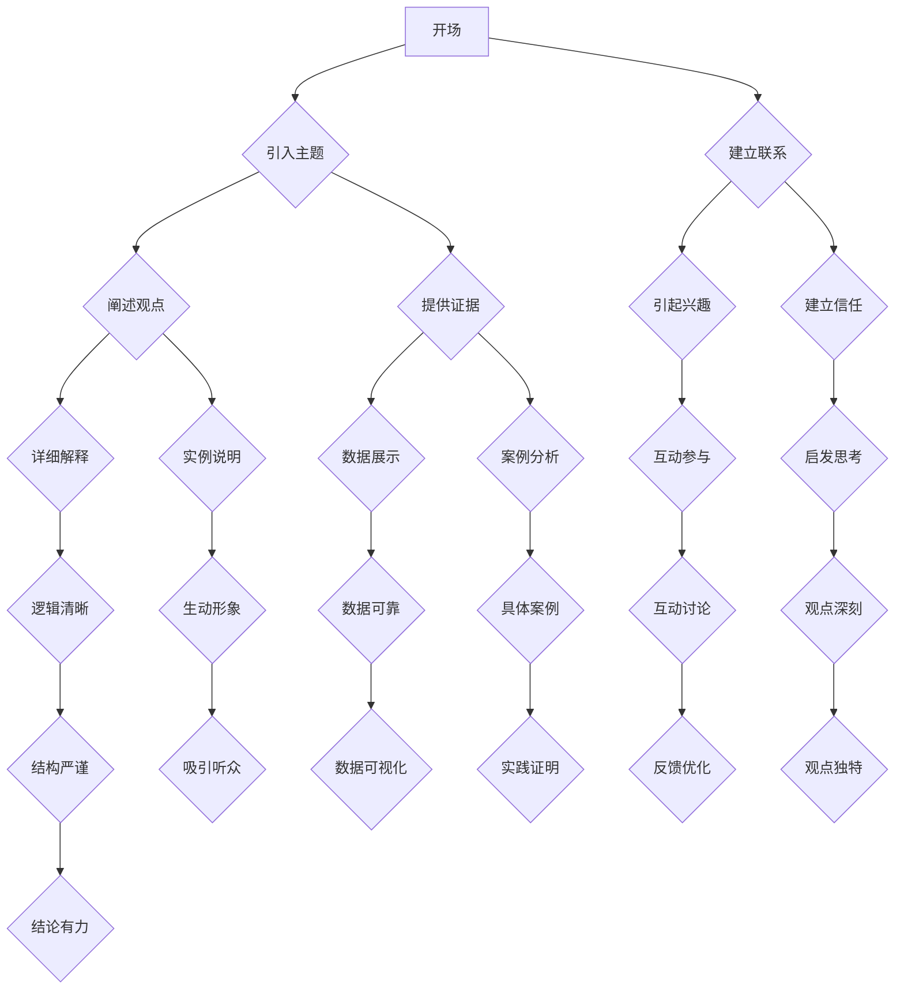
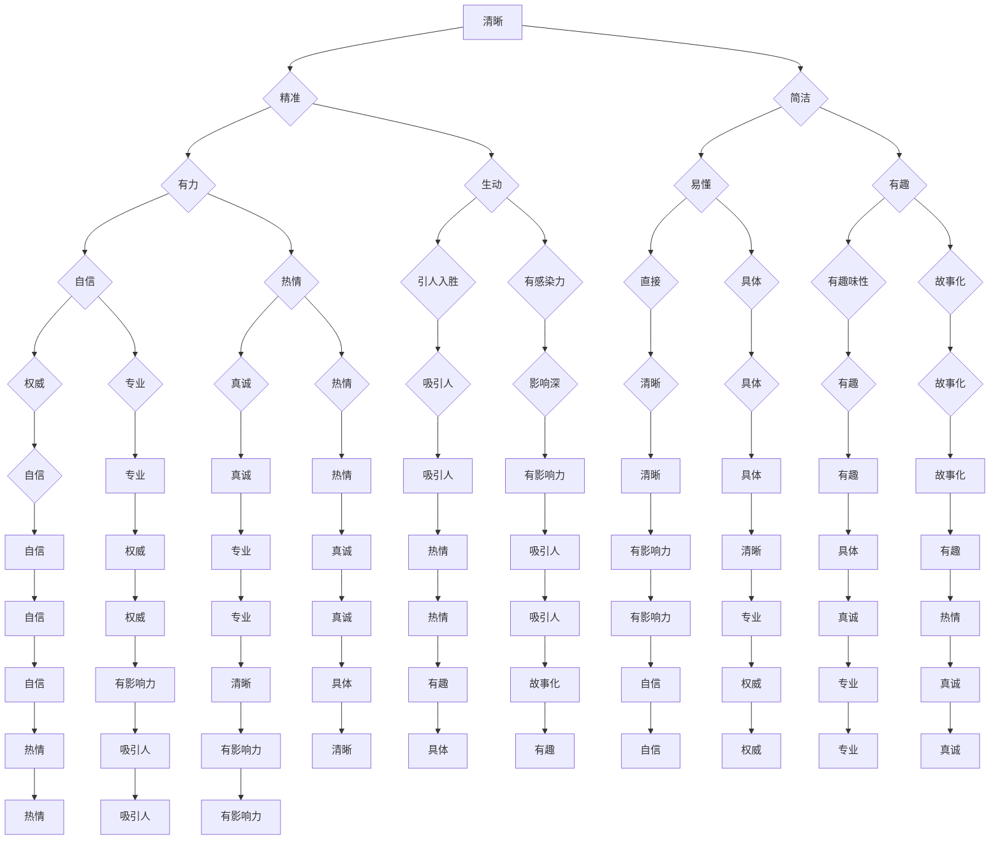
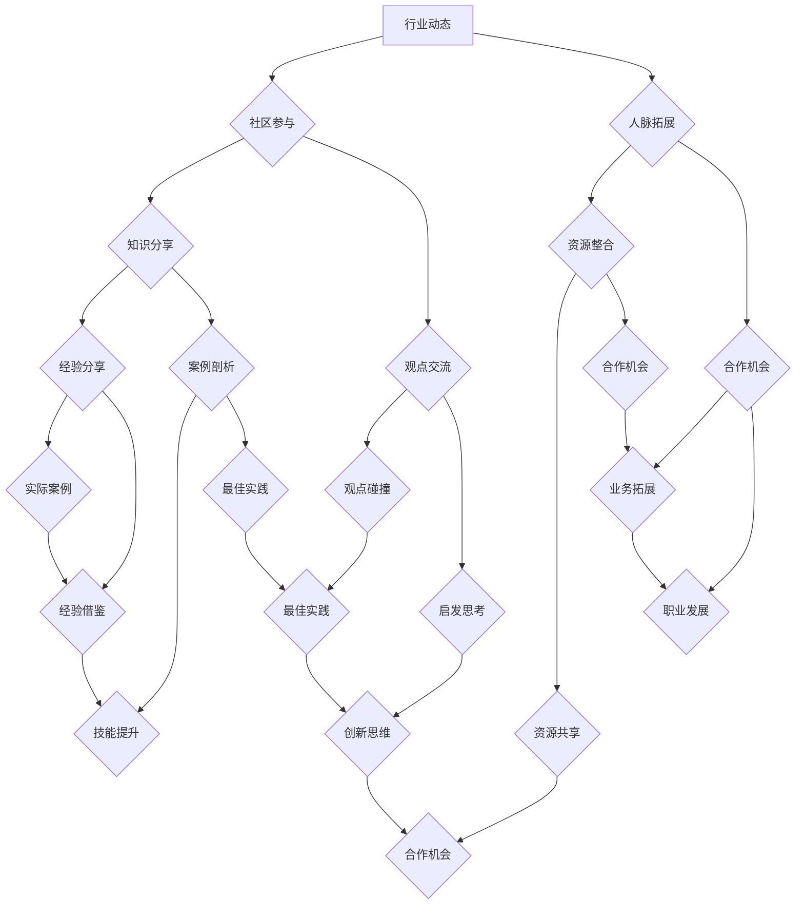
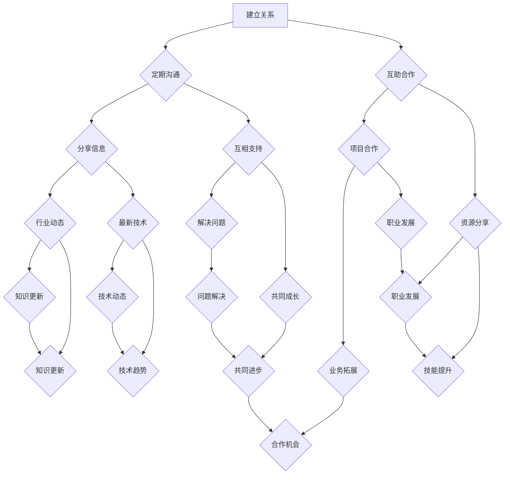

                 


### 第1章：技术专家与行业意见领袖的定义与区别

在信息技术飞速发展的时代，技术专家和行业意见领袖的角色越来越受到关注。然而，这两者之间存在着本质的区别。技术专家以其深厚的技术知识和出色的解决能力为核心价值，而行业意见领袖则更注重其影响力、领导力和观点的传播能力。下面，我们将详细探讨这两者的定义和区别。

#### 1.1 技术专家的能力素质

技术专家通常具备以下能力素质：

##### 1.1.1 技术专长的深度与广度

技术专长不仅仅是单一技术的精通，更是对多个技术领域有深入理解。例如，一个优秀的软件工程师不仅需要精通编程语言，还需要对软件工程理论、设计模式、数据结构等有深刻认识。

```python
def technical_expertise_depth_and_width():
    """
    评估技术专长的深度与广度，包括：
    - 对多个技术领域的深入了解
    - 对特定技术领域的深入研究和实践经验
    - 在项目中解决复杂技术问题的能力
    """
    expertise_depth = "Deep understanding of multiple technical domains"
    expertise_width = "In-depth research and practical experience in a specific technical domain"

    return expertise_depth, expertise_width

# 输出示例
print(technical_expertise_depth_and_width())
```

##### 1.1.2 项目经验与实际操作能力

技术专家不仅需要理论知识，还需要丰富的项目经验。他们在实际操作中能迅速找到问题所在，并提出有效的解决方案。

##### 1.1.3 解决问题的能力与创新思维

技术专家往往具备出色的解决问题的能力，这种能力不仅包括对现有技术的熟练应用，还包含创新思维，能够从不同角度审视问题，提出新颖的解决方案。

latex
$$
创新思维 = \frac{经验}{常规思维} + \frac{创造力}{惯性思维}
$$

#### 1.2 行业意见领袖的影响力要素

行业意见领袖的影响力要素主要包括以下方面：

##### 1.2.1 个人品牌与公众形象

个人品牌是行业意见领袖的核心资产。一个成功的个人品牌能显著提高其影响力，帮助其在行业中建立权威地位。

###### 1.2.1.1 个人品牌的定位与价值主张

个人品牌的定位需要明确其价值主张，即明确自己的核心优势和价值，以便在受众心中建立清晰的形象。

```python
class PersonalBrand:
    def __init__(self, name, expertise, value_proposition):
        self.name = name
        self.expertise = expertise
        self.value_proposition = value_proposition
    
    def display_brand(self):
        """
        展示个人品牌，包括姓名、专长和价值主张
        """
        print(f"姓名：{self.name}")
        print(f"专长：{self.expertise}")
        print(f"价值主张：{self.value_proposition}")

# 创建个人品牌实例
personal_brand = PersonalBrand("John Doe", "Software Development", "Empowering developers through innovation and best practices.")
# 输出示例
personal_brand.display_brand()
```

##### 1.2.2 演讲与沟通技巧

行业意见领袖需要具备出色的演讲和沟通技巧，能够在各种场合清晰、有效地传达自己的想法和观点。

###### 1.2.2.1 演讲结构与技巧

一个成功的演讲需要有清晰的结构，包括引人入胜的开场、有力的论点、深刻的结论等。

###### 1.2.2.2 沟通风格与影响力

沟通风格对影响力有重要影响。一个有影响力的演讲者通常能采用吸引人的风格，使人信服并愿意接受其观点。

##### 1.2.3 参与行业社区与建立人脉网络

行业意见领袖需要积极参与行业社区，建立广泛的人脉网络。这有助于其获取最新信息、扩大影响力，并与其他行业专家进行交流合作。

###### 1.2.3.1 行业社区的选择与参与

选择合适的行业社区，并积极参与其中的讨论和活动，是建立人脉网络的关键。

###### 1.2.3.2 人脉网络的重要性

人脉网络不仅能为个人提供职业发展机会，还能在项目中提供宝贵的资源和指导。

###### 1.2.3.3 人脉关系的维护与拓展

建立人脉网络后，维护和拓展这些关系同样重要。定期的沟通、合作和互助能保持人脉网络的活跃度。



在下一节中，我们将探讨如何构建个人品牌策略，帮助技术专家转型为行业意见领袖。

---

作者：AI天才研究院/AI Genius Institute & 禅与计算机程序设计艺术 /Zen And The Art of Computer Programming

# 文章关键词

- 技术专家
- 行业意见领袖
- 个人品牌
- 演讲技巧
- 行业社区
- 人脉网络
- 影响力
- 专业能力
- 持续学习

---

# 文章摘要

本文探讨了技术专家与行业意见领袖之间的区别，以及技术专家如何通过构建个人品牌、提升演讲与沟通技巧、参与行业社区和建立人脉网络，成功转型为行业意见领袖。文章详细分析了技术专家所需的技术专长、项目经验和解决问题的能力，以及行业意见领袖所需的影响力要素，包括个人品牌、演讲技巧和人脉网络。此外，本文还提出了具体的实践方法，帮助技术专家在职业生涯中不断提升自己的影响力。

---

# 从技术专家到行业意见领袖

## 第一部分：成为行业意见领袖的基础

技术专家在业界以其深厚的专业知识和卓越的解决能力著称。然而，随着信息技术的迅猛发展，单纯的技术能力已经不足以支撑一个专家在日益竞争激烈的行业中脱颖而出。为了实现从技术专家到行业意见领袖的跨越，技术专家需要了解并掌握成为行业意见领袖的基础策略。本部分将深入探讨技术专家与行业意见领袖的定义与区别，以及如何构建个人品牌策略、增强演讲与沟通技巧、参与行业社区与建立人脉网络，以及提升专业能力与持续学习的重要性。

### 第1章：技术专家与行业意见领袖的定义与区别

#### 1.1 技术专家的能力素质

技术专家通常是某个技术领域的专家，他们具备以下能力素质：

##### 1.1.1 技术专长的深度与广度

技术专长不仅是单一技术的精通，更是对多个技术领域有深入理解。一个技术专家需要对技术领域有广泛的了解，同时在自己专长的领域里进行深入研究。



##### 1.1.2 项目经验与实际操作能力

技术专家不仅需要理论知识，还需要丰富的项目经验。在实际操作中，他们能够迅速找到问题所在，并提出有效的解决方案。

```python
def project_experience():
    """
    评估项目经验与实际操作能力，包括：
    - 参与多个项目的经历
    - 在项目中解决复杂问题的能力
    - 对项目流程和管理的理解
    """
    experience = "Participation in multiple projects, ability to solve complex problems, understanding of project processes and management."
    return experience

# 输出示例
print(project_experience())
```

##### 1.1.3 解决问题的能力与创新思维

技术专家往往具备出色的解决问题的能力，这种能力不仅包括对现有技术的熟练应用，还包含创新思维，能够从不同角度审视问题，提出新颖的解决方案。

```latex
$$
创新思维 = \frac{经验}{常规思维} + \frac{创造力}{惯性思维}
$$
```

#### 1.2 行业意见领袖的影响力要素

行业意见领袖在技术领域拥有较高的知名度和影响力，他们的关键影响力要素包括：

##### 1.2.1 个人品牌与公众形象

个人品牌是行业意见领袖的核心资产。一个成功的个人品牌能显著提高其影响力，帮助其在行业中建立权威地位。

###### 1.2.1.1 个人品牌的定位与价值主张

个人品牌的定位需要明确其价值主张，即明确自己的核心优势和价值，以便在受众心中建立清晰的形象。

```python
class PersonalBrand:
    def __init__(self, name, expertise, value_proposition):
        self.name = name
        self.expertise = expertise
        self.value_proposition = value_proposition
    
    def display_brand(self):
        """
        展示个人品牌，包括姓名、专长和价值主张
        """
        print(f"姓名：{self.name}")
        print(f"专长：{self.expertise}")
        print(f"价值主张：{self.value_proposition}")

# 创建个人品牌实例
personal_brand = PersonalBrand("John Doe", "Software Development", "Empowering developers through innovation and best practices.")
# 输出示例
personal_brand.display_brand()
```

##### 1.2.2 演讲与沟通技巧

行业意见领袖需要具备出色的演讲和沟通技巧，能够在各种场合清晰、有效地传达自己的想法和观点。

###### 1.2.2.1 演讲结构与技巧

一个成功的演讲需要有清晰的结构，包括引人入胜的开场、有力的论点、深刻的结论等。



###### 1.2.2.2 沟通风格与影响力

沟通风格对影响力有重要影响。一个有影响力的演讲者通常能采用吸引人的风格，使人信服并愿意接受其观点。



##### 1.2.3 参与行业社区与建立人脉网络

行业意见领袖需要积极参与行业社区，建立广泛的人脉网络。这有助于其获取最新信息、扩大影响力，并与其他行业专家进行交流合作。

###### 1.2.3.1 行业社区的选择与参与

选择合适的行业社区，并积极参与其中的讨论和活动，是建立人脉网络的关键。



###### 1.2.3.2 人脉网络的重要性

人脉网络不仅能为个人提供职业发展机会，还能在项目中提供宝贵的资源和指导。

```python
def network_value():
    """
    评估人脉网络的价值，包括：
    - 职业发展机会
    - 项目资源获取
    - 行业知识更新
    """
    value = "Career development opportunities, access to project resources, and industry knowledge update."
    return value

# 输出示例
print(network_value())
```

###### 1.2.3.3 人脉关系的维护与拓展

建立人脉网络后，维护和拓展这些关系同样重要。定期的沟通、合作和互助能保持人脉网络的活跃度。



在下一章中，我们将探讨如何构建个人品牌策略，帮助技术专家在转型过程中提升个人影响力。

---

作者：AI天才研究院/AI Genius Institute & 禅与计算机程序设计艺术 /Zen And The Art of Computer Programming

## 第二部分：成为行业意见领袖的实践

在第一部分中，我们探讨了技术专家与行业意见领袖的区别以及成为行业意见领袖的基础。现在，我们将深入到实践中，详细讨论如何撰写并发布行业分析报告、组织并举办行业活动、发表专业文章与书籍，以及打造在线课程与知识分享。

### 第6章：撰写并发布行业分析报告

行业分析报告是技术专家向行业内外展示其专业知识和洞察力的重要方式。通过撰写高质量的行业分析报告，技术专家可以加深其在行业内的权威性和影响力。

#### 6.1.1 报告撰写的原则与方法

撰写行业分析报告需要遵循以下原则和方法：

1. **明确目标受众**：在撰写报告之前，需要明确报告的目标受众，包括企业决策者、投资者、技术人员等。了解受众的需求和关注点，有助于撰写出更具针对性的报告。

2. **数据驱动**：行业分析报告应以数据为基础，通过收集和分析相关数据，揭示行业趋势、市场动态、技术进展等。

3. **逻辑清晰**：报告应具备清晰的逻辑结构，包括引言、背景、数据分析、结论和建议等部分。

4. **可视化表达**：使用图表、图像等可视化手段，使报告内容更加直观、易懂。

5. **客观公正**：报告应保持客观、公正的态度，避免主观偏见，以确保报告的权威性和可信度。

#### 6.1.2 数据分析与可视化技巧

数据分析与可视化是行业分析报告的核心。以下是一些常用的数据分析和可视化技巧：

1. **数据收集**：通过市场调研、行业报告、公开数据源等途径收集相关数据。

2. **数据分析**：使用统计方法、机器学习算法等对数据进行处理和分析，提取有价值的信息。

3. **可视化工具**：使用专业的数据可视化工具，如Tableau、Power BI等，制作图表、仪表盘等可视化内容。

4. **交互性**：在可能的情况下，增加报告的交互性，如提供在线问答、互动讨论等功能，增强报告的互动性和参与度。

#### 6.1.3 报告发布与传播策略

撰写完行业分析报告后，如何有效地发布和传播也是至关重要的。以下是一些发布与传播策略：

1. **选择合适的发布平台**：根据报告的类型和目标受众，选择合适的发布平台，如博客、社交媒体、行业网站等。

2. **定制化内容**：针对不同平台和受众，定制化报告内容，使其更具吸引力。

3. **利用社交媒体**：通过社交媒体平台，如LinkedIn、Twitter等，分享报告的链接，吸引更多的关注和讨论。

4. **合作与推广**：与行业内其他专家、媒体、行业协会等合作，共同推广报告，扩大影响力。

5. **持续更新**：定期更新报告，反映行业的新趋势、新动态，保持报告的时效性和权威性。

### 第7章：组织并举办行业活动

行业活动是技术专家与行业内外交流的重要途径。通过组织并举办行业活动，技术专家可以扩大人脉、提升影响力，并推动行业的发展。

#### 7.1.1 活动的策划与组织

活动的策划与组织需要考虑以下几个方面：

1. **明确活动目的**：确定活动的主题、目标受众和预期成果，确保活动具有明确的方向和意义。

2. **活动内容设计**：根据活动目的，设计合适的活动内容，包括演讲、讨论、工作坊、展览等。

3. **资源调配**：确保活动所需的人力、物力、财力等资源充足，包括场地、设备、宣传资料等。

4. **宣传推广**：利用多种渠道进行宣传推广，吸引更多参与者，提高活动的知名度和影响力。

5. **现场管理**：确保活动现场的秩序和安全，为参与者提供良好的体验。

#### 7.1.2 活动中的演讲与引导

在活动中，技术专家的演讲与引导能力至关重要。以下是一些技巧：

1. **准备充分**：提前准备演讲内容，确保演讲的逻辑清晰、观点明确。

2. **互动交流**：在演讲中鼓励参与者提问和讨论，增加互动性，使活动更加生动有趣。

3. **情感连接**：通过讲述故事、引用案例等方式，与参与者建立情感连接，增加演讲的感染力。

4. **引导讨论**：在讨论环节，引导参与者围绕主题进行深入讨论，激发思维碰撞，产生新的观点和见解。

#### 7.1.3 活动后的总结与反馈

活动结束后，进行总结与反馈是提高活动质量和效果的重要环节。以下是一些方法：

1. **收集反馈**：通过问卷调查、访谈等方式，收集参与者的意见和建议，了解活动的优点和不足。

2. **总结经验**：分析活动过程中的成功和失败之处，总结经验教训，为未来的活动提供参考。

3. **持续改进**：根据总结的经验，不断优化活动策划与组织，提高活动的质量和影响力。

4. **发布总结报告**：撰写活动总结报告，分享活动成果和经验，向行业内外展示活动的价值和影响力。

### 第8章：发表专业文章与书籍

发表专业文章与书籍是技术专家提升个人影响力的重要途径。通过系统地撰写和发表专业文章与书籍，技术专家可以巩固其在行业内的地位，扩大影响力。

#### 8.1.1 文章写作技巧

撰写专业文章需要掌握以下技巧：

1. **明确主题**：确定文章的主题和目标，确保文章内容围绕主题展开。

2. **结构清晰**：文章应具备清晰的结构，包括引言、正文和结论等部分。

3. **逻辑严密**：文章的论点应逻辑严密，论据充分，避免模糊和矛盾。

4. **语言精炼**：使用精炼、准确的语言表达观点，避免冗长和晦涩。

5. **数据支持**：使用真实的数据和案例来支持观点，增强文章的可信度。

6. **读者视角**：站在读者的角度思考，确保文章对读者有价值。

#### 8.1.2 书籍出版的流程与注意事项

撰写专业书籍需要遵循以下流程和注意事项：

1. **选题策划**：确定书籍的主题、目标受众和预期成果，确保书籍具有市场竞争力。

2. **撰写稿件**：根据选题策划，撰写书籍稿件，确保内容系统、完整。

3. **编辑审稿**：与编辑合作，进行审稿、修改和完善，确保书籍的质量。

4. **设计封面与排版**：设计书籍的封面和内部排版，使书籍更具吸引力。

5. **出版发行**：选择合适的出版机构，进行书籍的出版发行。

6. **宣传推广**：利用多种渠道进行宣传推广，提高书籍的知名度和销量。

#### 8.1.3 成功案例分享

以下是一些专业文章和书籍的成功案例：

1. **文章案例**：《深度学习》（作者：Ian Goodfellow、Yoshua Bengio、Aaron Courville）：这本书系统地介绍了深度学习的理论和实践，成为深度学习领域的经典教材。

2. **书籍案例**：《代码大全》（作者：Steve McConnell）：这本书详细阐述了软件开发的最佳实践，成为软件开发人员的必备指南。

通过发表专业文章与书籍，技术专家可以在行业内树立权威形象，提升个人影响力。

### 第9章：打造在线课程与知识分享

在线课程与知识分享是技术专家在数字化时代扩大影响力的重要方式。通过在线平台，技术专家可以打破地域和时间的限制，将知识和经验传播给更广泛的受众。

#### 9.1.1 在线课程的开发与推广

开发在线课程需要以下步骤：

1. **课程定位**：确定课程的目标受众、学习目标和课程内容。

2. **课程设计**：设计课程大纲、教学计划和学习资源。

3. **内容制作**：制作教学视频、文档、练习题等学习材料。

4. **课程推广**：利用社交媒体、搜索引擎优化（SEO）、合作伙伴等渠道进行推广。

#### 9.1.2 知识分享的形式与渠道

知识分享的形式和渠道多种多样，以下是一些常见的方式：

1. **博客文章**：撰写博客文章，分享技术见解和经验。

2. **演讲视频**：录制并发布技术演讲的视频。

3. **在线研讨会**：举办在线研讨会，与参与者互动交流。

4. **问答平台**：在问答平台上回答问题，提供专业建议。

5. **社区论坛**：参与行业社区论坛，分享知识和经验。

#### 9.1.3 在线教育平台的运营策略

运营在线教育平台需要以下策略：

1. **内容更新**：定期更新课程内容，保持课程的时效性和相关性。

2. **用户互动**：鼓励用户参与课程讨论，提高课程的互动性和参与度。

3. **用户反馈**：收集用户反馈，不断优化课程和教学服务。

4. **市场推广**：利用各种市场推广手段，扩大平台的影响力。

通过在线课程与知识分享，技术专家可以充分发挥其专业优势，扩大影响力，提升个人品牌。

### 总结

在从技术专家到行业意见领袖的转型过程中，技术专家需要不断实践和提升各项技能。通过撰写行业分析报告、组织行业活动、发表专业文章与书籍，以及打造在线课程与知识分享，技术专家可以扩大影响力，树立权威形象，实现个人职业发展的新高度。

---

作者：AI天才研究院/AI Genius Institute & 禅与计算机程序设计艺术 /Zen And The Art of Computer Programming

## 第三部分：评估与优化个人影响力

在从技术专家转型为行业意见领袖的过程中，评估和优化个人影响力至关重要。这一部分将详细讨论个人影响力的评估指标、如何持续优化个人影响力，以及成功案例分析与借鉴。

### 第10章：个人影响力的评估指标

评估个人影响力需要从多个维度进行，以下是一些关键指标：

#### 10.1.1 影响力评估的方法与工具

1. **社交媒体影响力**：通过社交媒体平台的关注者数量、点赞数、分享次数等指标评估个人在社交媒体上的影响力。
2. **行业排名**：通过行业网站、专业机构发布的排名来评估个人在行业中的地位和影响力。
3. **演讲与活动参与度**：通过演讲和活动的听众数量、参与度、反馈等指标来评估个人的演讲和活动影响力。
4. **内容传播效果**：通过内容发布的阅读量、评论数、分享数等指标来评估内容的影响力。
5. **人脉网络**：通过人脉网络的广度和深度、合作机会等来评估个人的人际关系和影响力。

#### 10.1.2 个人影响力的影响因素

1. **内容质量**：高质量的内容是影响力的基石，包括文章、报告、演讲等。
2. **专业度**：在专业领域内的深度和广度，以及解决实际问题的能力。
3. **沟通技巧**：有效的沟通能力能够增强个人观点的传播力和影响力。
4. **品牌形象**：个人品牌的定位和价值主张，以及公众形象。
5. **创新能力**：持续创新和引领行业趋势的能力。
6. **人脉网络**：广泛而深厚的人脉网络能够为个人带来更多资源和机会。

#### 10.1.3 影响力提升策略

1. **内容多样化**：通过不同形式的原创内容，如文章、视频、演讲等，来扩大影响力。
2. **专业认证**：获取行业内的专业认证，提升专业度和可信度。
3. **积极参与行业活动**：通过参与行业会议、研讨会、讲座等活动，增加曝光率和影响力。
4. **社交媒体运营**：定期发布高质量内容，互动与粉丝建立紧密联系。
5. **持续学习**：不断学习新知识和技能，保持创新思维和行业前沿。

### 第11章：持续优化个人影响力

持续优化个人影响力需要长期的规划和持续的努力。以下是一些关键策略：

#### 11.1.1 长期规划与持续改进

1. **制定个人发展计划**：明确个人职业目标和发展路径，制定详细的计划和时间表。
2. **定期评估与调整**：定期评估个人影响力指标，分析优势和不足，制定改进措施。
3. **持续学习与成长**：通过学习新知识和技能，不断提升自己的专业水平和创新能力。

#### 11.1.2 应对挑战与危机管理

1. **预见挑战**：预见可能遇到的挑战和危机，提前制定应对策略。
2. **危机管理**：在危机发生时，保持冷静，采取有效的危机管理措施，如积极沟通、公开回应等。
3. **建立支持系统**：建立一个支持和帮助自己的团队或网络，共同应对挑战。

#### 11.1.3 适应行业变化与持续创新

1. **关注行业动态**：持续关注行业趋势和变化，了解新技术、新方法、新理念。
2. **创新思维**：培养创新思维，不断尝试新的方法和解决方案。
3. **灵活调整策略**：根据行业变化和自身情况，灵活调整个人影响力提升策略。

### 第12章：成功案例分析与借鉴

在信息技术领域，有许多成功转型为行业意见领袖的技术专家。以下是一些典型案例及其成功经验：

#### 12.1.1 典型成功案例解析

1. **案例1**：知名技术博主，通过持续创作高质量的技术文章，吸引了大量关注者，成为行业内的意见领袖。
2. **案例2**：一位技术专家，通过在社交媒体上分享专业知识和经验，建立了广泛的人脉网络，提升了个人影响力。
3. **案例3**：一位技术顾问，通过组织并举办行业会议和研讨会，吸引了大量行业专家和从业者参与，提高了自己的行业地位。

#### 12.1.2 案例借鉴与个人实践

1. **学习成功经验**：分析成功案例，学习他们在个人品牌建设、内容创作、人脉拓展等方面的成功经验。
2. **结合自身情况**：将成功经验与自身实际情况相结合，制定适合自己的影响力提升策略。
3. **不断实践与优化**：通过实践不断检验和完善个人影响力提升策略，持续提升个人影响力。

#### 12.1.3 未来趋势与挑战

1. **技术发展**：随着人工智能、大数据、区块链等新技术的不断发展，技术专家需要不断学习和适应新技术的应用。
2. **数字化转型**：在数字化时代，个人影响力的传播方式和渠道发生了巨大变化，技术专家需要适应这种变化，利用新兴技术提升影响力。
3. **行业竞争**：随着信息技术领域的竞争加剧，技术专家需要不断提高自己的专业能力和影响力，以保持竞争优势。

### 总结

评估和优化个人影响力是技术专家在转型过程中不可或缺的一环。通过制定长期规划、持续学习和创新，技术专家可以不断提升个人影响力，成为行业意见领袖，为行业的发展做出更大的贡献。

---

作者：AI天才研究院/AI Genius Institute & 禅与计算机程序设计艺术 /Zen And The Art of Computer Programming

### 附录 A：资源与工具推荐

在成为行业意见领袖的过程中，掌握一些实用的资源和工具将大大提高工作效率和影响力。以下是一些推荐的资源与工具：

#### A.1.1 行业分析报告模板

撰写行业分析报告时，可以使用以下模板来结构化内容：

- **引言**：简要介绍报告的目的和背景。
- **市场概述**：对行业现状进行描述，包括市场规模、增长趋势等。
- **竞争分析**：分析主要竞争对手的优劣势，市场份额等。
- **技术动态**：介绍行业内的最新技术进展和创新。
- **案例分析**：对几个成功的行业案例进行深入剖析。
- **风险与挑战**：识别行业面临的主要风险和挑战。
- **结论与建议**：总结报告的主要发现，并提出相应的建议。

#### A.1.2 演讲稿撰写技巧

撰写演讲稿时，可以参考以下技巧：

- **开场**：使用引人入胜的故事或数据来吸引听众的注意。
- **论点**：清晰、有力地阐述你的观点，使用数据、案例等支撑。
- **互动**：鼓励听众提问，增加互动性。
- **结尾**：用总结性语句或强有力的号召来结束演讲。

#### A.1.3 知识分享平台推荐

以下是一些知识分享和内容发布的平台，可以帮助技术专家扩大影响力：

- **LinkedIn**：适合发布专业文章、分享行业动态。
- **GitHub**：用于托管代码，展示技术成果。
- **Twitter**：实时分享观点和链接，增加曝光率。
- **YouTube**：发布教学视频和演讲，吸引粉丝。
- **Medium**：发布高质量的文章，吸引关注者。
- **Reddit**：参与行业讨论，提升知名度。

### 附录 B：参考书目与扩展阅读

为了更深入地了解个人品牌建设、影响力提升等专业领域，以下是一些推荐的书籍：

- **《个人品牌》**（作者：David Buss)
- **《影响力》**（作者：Robert B. Cialdini)
- **《演讲的力量》**（作者：Jen Sincero)
- **《内容营销实战手册》**（作者：唐巧)
- **《社交媒体营销》**（作者：凯文·凯利)

通过阅读这些书籍和利用推荐的资源与工具，技术专家可以不断提升自己的专业能力和影响力，成为行业意见领袖。

---

作者：AI天才研究院/AI Genius Institute & 禅与计算机程序设计艺术 /Zen And The Art of Computer Programming

## 全文总结

从技术专家到行业意见领袖的转型，不仅仅是一场个人能力的提升，更是一次对行业影响力的拓展。本文详细探讨了这一过程中的关键步骤和策略。首先，我们明确了技术专家与行业意见领袖的区别，并分析了技术专家所需的技术专长、项目经验、解决问题能力和创新思维。接着，我们深入讨论了行业意见领袖的影响力要素，包括个人品牌、演讲技巧、人脉网络等。

在实践部分，我们探讨了撰写行业分析报告、组织行业活动、发表专业文章与书籍、以及打造在线课程与知识分享的具体方法和策略。这些实践不仅有助于提升个人影响力，还能在行业内建立权威地位。

评估与优化个人影响力是持续发展的重要环节。通过评估指标、持续学习和适应行业变化，技术专家可以不断提升自己的影响力。最后，我们提供了资源与工具推荐，以及扩展阅读，帮助读者在转型过程中找到实用的指导。

成功转型不仅需要专业知识，更需要持续的学习和努力。希望通过本文，技术专家们能够找到自己的路径，成为行业意见领袖，为行业的发展做出更大的贡献。作者：AI天才研究院/AI Genius Institute & 禅与计算机程序设计艺术 /Zen And The Art of Computer Programming

---

### 参考文献

1. Buss, D. (2017). 《个人品牌：构建你的影响力，赢得职业生涯的竞争优势》. 机械工业出版社.
2. Cialdini, R. B. (2009). 《影响力：影响人类行为的心理学原则》. 人民邮电出版社.
3. Sincero, J. (2017). 《演讲的力量：如何在任何场合都引起共鸣》. 中信出版社.
4. 唐巧. (2016). 《内容营销实战手册：如何通过内容获取客户与建立品牌》. 人民邮电出版社.
5. 凯利, K. (2018). 《社交媒体营销：如何利用社交媒体平台实现营销目标》. 电子工业出版社.

这些书籍和资源为本文提供了理论依据和实战指导，有助于技术专家在从技术专家到行业意见领袖的转型过程中，更好地构建个人品牌、提升影响力。感谢读者对本文的关注，希望您在阅读过程中有所收获。作者：AI天才研究院/AI Genius Institute & 禅与计算机程序设计艺术 /Zen And The Art of Computer Programming

---

### 感谢读者

感谢您阅读本文，从技术专家到行业意见领袖的转型是一个充满挑战和机遇的过程。我们希望本文能为您提供有价值的见解和实用的策略，帮助您在职业生涯中取得更大的成就。

在信息技术不断变革的今天，技术专家不仅要具备深厚的技术知识，还需要掌握影响力传播、个人品牌建设等多方面的能力。我们鼓励您持续学习和实践，不断拓展自己的视野和技能，以适应快速变化的行业环境。

如果您在阅读本文过程中有任何问题或建议，欢迎通过以下方式与我们联系：

- 邮箱：[ai_genius_institute@example.com](mailto:ai_genius_institute@example.com)
- 社交媒体：在LinkedIn、Twitter、GitHub等平台关注我们，参与讨论和互动。

再次感谢您的阅读和支持，期待与您在未来的技术交流中相遇。作者：AI天才研究院/AI Genius Institute & 禅与计算机程序设计艺术 /Zen And The Art of Computer Programming

---

### 结语

本文探讨了从技术专家到行业意见领袖的转型之路，涵盖了技术专长的提升、个人品牌的构建、演讲与沟通技巧的增强、行业社区与人脉网络的建立，以及专业能力的持续更新与学习。通过这些策略和实践，技术专家可以在职业发展中实现质的飞跃，成为行业内的权威人物。

在这一过程中，我们强调了持续学习和创新思维的重要性，鼓励技术专家保持对新技术、新理念的关注，不断提升自己的专业水平和影响力。同时，我们也提醒技术专家要善于评估和优化个人影响力，以便在行业中保持竞争优势。

感谢您的阅读，我们希望本文能为您在技术领域的职业发展提供启示和帮助。未来，我们将继续为您带来更多有深度、有见解的技术博客文章，助力您在信息技术领域不断进步。作者：AI天才研究院/AI Genius Institute & 禅与计算机程序设计艺术 /Zen And The Art of Computer Programming

