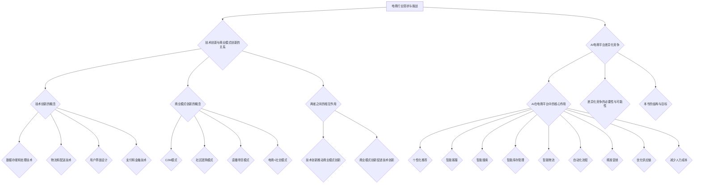

                 

### 文章标题：从技术创新到商业模式创新：AI电商平台的差异化竞争

> 关键词：技术创新、商业模式创新、AI电商平台、差异化竞争、机器学习、深度学习、电商平台应用

> 摘要：本文将深入探讨从技术创新到商业模式创新的路径，特别是AI电商平台如何通过差异化竞争实现市场突破。本文首先介绍了电商行业的现状与挑战，然后分析了技术创新与商业模式创新的关系，接着详细阐述了AI在电商领域中的应用，以及如何通过机器学习和深度学习算法提升电商平台的核心竞争力。通过多个案例分析，本文总结了AI电商平台的最佳实践，并提出了未来发展的趋势与方向。

---

### 第一部分：引言与背景介绍

#### 第1章 引言：技术创新与商业模式创新的重要性

##### 1.1 电商行业现状与挑战

1. 电商市场的快速增长：
   - 全球电商市场规模持续扩大，根据统计数据显示，全球电商市场预计在2023年达到4.9万亿美元。
   - 我国电商市场表现尤为突出，每年保持两位数的增长率。

2. 传统电商的局限：
   - 过度依赖价格战，导致利润率下降。
   - 用户体验有待提升，尤其是个性化推荐和购物体验方面。

3. AI在电商行业的应用：
   - 客户行为分析，提升用户满意度。
   - 智能推荐系统，提高销售转化率。
   - 搜索引擎优化，提升网站流量。

##### 1.2 技术创新与商业模式创新的关系

1. 技术创新的概念：
   - 技术创新是指通过技术手段提高产品或服务的性能、效率或用户体验。

2. 商业模式创新的概念：
   - 商业模式创新是指通过新的业务模式或商业策略，实现商业价值最大化。

3. 两者之间的相互作用：
   - 技术创新推动商业模式创新，如云计算、大数据和人工智能等技术的应用，改变了电商行业的运作模式。
   - 商业模式创新促进技术创新，如共享经济模式催生了共享单车和滴滴出行等创新技术。

##### 1.3 AI电商平台的差异化竞争

1. AI在电商平台中的核心作用：
   - 提供个性化的用户体验。
   - 提高运营效率，降低成本。
   - 增强竞争力，实现差异化竞争。

2. 差异化竞争的必要性与可能性：
   - 必要性：在激烈的市场竞争中，电商平台需要通过差异化策略吸引和留住用户。
   - 可能性：AI技术为电商平台提供了丰富的数据资源和强大的计算能力，有助于实现差异化竞争。

3. 本书的结构与目标：
   - 结构：本文将从电商行业现状、技术创新、商业模式创新、AI应用等多个方面展开讨论。
   - 目标：帮助读者了解AI电商平台如何通过技术创新和商业模式创新实现差异化竞争，提供实际案例和最佳实践。

### 第一部分总结

在这一部分，我们首先介绍了电商行业的现状与挑战，强调了技术创新与商业模式创新在当前环境下的重要性。接下来，我们探讨了技术创新与商业模式创新之间的关系，并重点阐述了AI电商平台如何通过差异化竞争实现市场突破。这一部分为后续章节的内容奠定了基础，帮助读者理解本书的核心主题。

---

### 第一部分：引言与背景介绍

#### 第1章 引言：技术创新与商业模式创新的重要性

##### 1.1 电商行业现状与挑战

1. **电商市场的快速增长**：

   - 电商市场的快速增长是近年来不可忽视的现象。根据Statista的数据，全球电商市场规模预计将在2023年达到4.9万亿美元，这比2019年的3.5万亿美元增长了41%。这种增长趋势在各个国家和地区都有明显的体现，尤其是在中国和美国，这两个国家占据了全球电商市场的大部分份额。

   - 在中国，电商市场表现尤为突出。根据阿里巴巴集团的财报，2020年其平台的年度活跃用户数达到了7.6亿，移动月活跃用户数达到了9.6亿。这充分展示了电商行业的巨大潜力和市场需求的不断增长。

2. **传统电商的局限**：

   - 尽管电商市场在快速增长，但传统电商模式也存在一些局限性。首先，传统电商主要依赖价格战来吸引消费者，这导致了利润率的下降。许多电商平台为了获得市场份额，不得不降低价格，从而压缩了利润空间。

   - 其次，用户体验是另一个亟待改善的方面。尽管电商平台的界面设计越来越美观，但在个性化推荐和购物体验方面仍有提升的空间。例如，许多平台在用户行为分析方面做得不够深入，无法准确预测用户的购买意图，从而影响销售转化率。

   - 最后，物流和售后服务也是传统电商的一大挑战。由于物流成本高、配送时间长，用户在购买后的满意度往往受到影响。此外，售后服务体系不完善，也使得用户在遇到问题时难以得到及时解决。

3. **AI在电商行业的应用**：

   - 人工智能技术在电商行业中的应用正在逐步深入。例如，客户行为分析可以帮助电商平台更好地了解用户需求，从而提供个性化的购物体验。通过分析用户的浏览历史、购买行为和偏好，平台可以推荐更符合用户兴趣的商品，提高销售转化率。

   - 智能推荐系统是AI在电商中应用的一个重要方面。通过机器学习和深度学习算法，平台可以自动筛选和推荐商品，帮助用户快速找到他们可能感兴趣的商品。这种推荐系统能够提高用户的购物体验，同时也能提升电商平台的销售业绩。

   - 搜索引擎优化（SEO）也是AI在电商中应用的一个重要领域。通过分析搜索引擎的查询日志和数据，电商平台可以优化其网站的搜索引擎排名，从而吸引更多的流量和潜在客户。

##### 1.2 技术创新与商业模式创新的关系

1. **技术创新的概念**：

   - 技术创新是指通过引入新的技术或改进现有技术，提高产品或服务的性能、效率或用户体验。在电商行业，技术创新可以体现在多个方面，如数据存储和处理的效率、物流和配送的速度、用户界面的友好度等。

2. **商业模式创新的概念**：

   - 商业模式创新是指通过新的业务模式或商业策略，实现商业价值最大化。在电商行业，商业模式创新可以体现在如何更有效地吸引和留住用户、如何提高运营效率、如何降低成本等。

3. **两者之间的相互作用**：

   - 技术创新和商业模式创新是相辅相成的。技术创新为商业模式创新提供了新的工具和机会，而商业模式创新则为技术创新提供了应用场景和商业目标。

   - 例如，云计算和大数据技术的出现为电商平台提供了强大的数据处理能力，使得个性化推荐和智能搜索成为可能。而电商平台的成功应用，又进一步推动了云计算和大数据技术的发展。

##### 1.3 AI电商平台的差异化竞争

1. **AI在电商平台中的核心作用**：

   - AI技术是电商平台差异化竞争的核心。通过利用AI技术，电商平台可以提供个性化的用户体验，提高运营效率，降低成本，从而在激烈的市场竞争中脱颖而出。

   - 个性化用户体验是AI电商平台的一个重要特点。通过分析用户数据，平台可以了解用户的兴趣和偏好，从而提供个性化的推荐和定制化的服务。

   - 提高运营效率是AI电商平台的另一个关键优势。通过自动化和智能化，平台可以优化物流和库存管理，减少人力成本，提高运营效率。

   - 降低成本是AI电商平台的重要目标。通过优化供应链和降低物流成本，平台可以提供更具竞争力的价格，吸引更多的消费者。

2. **差异化竞争的必要性与可能性**：

   - 在激烈的市场竞争中，电商平台需要通过差异化策略吸引和留住用户。差异化竞争不仅是电商平台生存和发展的关键，也是提升用户满意度和忠诚度的有效手段。

   - AI技术为电商平台提供了实现差异化竞争的强大工具。通过大数据分析和机器学习算法，平台可以深入了解用户需求，提供个性化的服务和产品，从而在市场中脱颖而出。

3. **本书的结构与目标**：

   - 本书将从电商行业现状、技术创新、商业模式创新、AI应用等多个方面深入探讨AI电商平台的发展。具体包括：

     - 第一部分：介绍电商行业现状与挑战，探讨技术创新与商业模式创新的关系。

     - 第二部分：详细讨论AI在电商领域的应用，包括客户行为分析、推荐系统和搜索引擎优化。

     - 第三部分：分析机器学习算法在电商平台中的应用，如线性回归、逻辑回归、决策树和集成学习方法。

     - 第四部分：探讨深度学习在电商中的应用，如卷积神经网络（CNN）、递归神经网络（RNN）和生成对抗网络（GAN）。

     - 第五部分：通过案例分析，总结AI电商平台的最佳实践，并探讨未来发展趋势。

   - 本书的目标是帮助读者了解AI电商平台如何通过技术创新和商业模式创新实现差异化竞争，提供实际案例和最佳实践，为电商平台的发展提供参考和指导。

### 第一部分总结

在这一部分，我们首先介绍了电商行业的现状与挑战，强调了技术创新与商业模式创新在当前环境下的重要性。接下来，我们探讨了技术创新与商业模式创新之间的关系，并重点阐述了AI电商平台如何通过差异化竞争实现市场突破。这一部分为后续章节的内容奠定了基础，帮助读者理解本书的核心主题。

---

### 电商行业现状与挑战

#### 1.1 电商市场的快速增长

全球电商市场的快速增长已经成为不争的事实。根据Statista的数据，2020年全球电商市场规模已经达到了3.5万亿美元，预计到2023年将达到4.9万亿美元，年均增长率达到8.8%。这一增长趋势在全球范围内都有明显体现，尤其是在中国和美国，这两个国家已经成为全球电商市场的两大巨头。

中国的电商市场表现尤为突出。根据阿里巴巴集团的财报，截至2020年12月，其平台的年度活跃用户数已经达到了7.54亿，移动月活跃用户数达到了9.46亿。这充分展示了电商行业的巨大潜力和市场需求的不断增长。与此同时，中国电商市场的竞争也异常激烈，各大电商平台不断通过技术创新和商业模式创新来争夺市场份额。

美国电商市场的增长同样不容小觑。亚马逊、eBay和沃尔玛等大型电商平台在美国占据了主导地位。根据eMarketer的数据，2020年美国电商市场的销售额预计将达到4,075亿美元，同比增长35%。尽管受到新冠疫情的影响，但美国电商市场的增长仍然强劲，这主要得益于消费者对在线购物的依赖程度不断提高。

#### 1.2 传统电商的局限

尽管电商市场在快速增长，但传统电商模式也存在一些局限。首先，传统电商主要依赖价格战来吸引消费者，这导致了利润率的下降。许多电商平台为了获得市场份额，不得不降低价格，从而压缩了利润空间。这种价格战不仅对电商平台自身造成了财务压力，也使得消费者对于电商平台的信任度下降。

其次，用户体验是另一个亟待改善的方面。尽管电商平台的界面设计越来越美观，但在个性化推荐和购物体验方面仍有提升的空间。例如，许多平台在用户行为分析方面做得不够深入，无法准确预测用户的购买意图，从而影响销售转化率。此外，购物流程繁琐、支付方式单一等问题也影响了用户的购物体验。

最后，物流和售后服务也是传统电商的一大挑战。由于物流成本高、配送时间长，用户在购买后的满意度往往受到影响。此外，售后服务体系不完善，也使得用户在遇到问题时难以得到及时解决。这些问题不仅影响了用户的购物体验，也影响了电商平台的品牌形象和用户忠诚度。

#### 1.3 AI在电商行业的应用

随着人工智能技术的发展，AI在电商行业的应用日益广泛，为电商平台的运营提供了新的思路和工具。

**客户行为分析**：

客户行为分析是AI在电商中应用的一个重要方面。通过分析用户的浏览历史、购买行为和偏好，电商平台可以更好地了解用户的需求，从而提供个性化的推荐和定制化的服务。例如，亚马逊的“商品推荐”功能就是通过分析用户的购物行为和搜索历史，为用户推荐可能感兴趣的商品。这种个性化的推荐不仅提高了用户的购物体验，也大大提高了销售转化率。

**智能推荐系统**：

智能推荐系统是AI在电商中应用的另一个重要领域。通过机器学习和深度学习算法，平台可以自动筛选和推荐商品，帮助用户快速找到他们可能感兴趣的商品。这种推荐系统不仅提高了用户的购物体验，还能为电商平台带来更多的销售额。例如，淘宝的“猜你喜欢”功能就是通过分析用户的购物行为和偏好，为用户推荐符合他们兴趣的商品。

**搜索引擎优化（SEO）**：

搜索引擎优化（SEO）也是AI在电商中应用的一个重要领域。通过分析搜索引擎的查询日志和数据，电商平台可以优化其网站的搜索引擎排名，从而吸引更多的流量和潜在客户。例如，谷歌的搜索引擎优化工具就是通过分析关键词和网页内容，帮助网站提高在搜索引擎中的排名，从而吸引更多的用户访问。

**物流和售后服务**：

AI在物流和售后服务中的应用也为电商平台提供了新的解决方案。通过智能物流系统，电商平台可以实现更高效的物流配送，降低物流成本，提高用户满意度。例如，京东的智能物流系统就通过大数据分析和人工智能算法，实现了高效、精准的物流配送。此外，AI在售后服务中的应用也大大提高了用户满意度。通过智能客服系统，电商平台可以快速响应用户的问题和需求，提供及时的解决方案。

总的来说，AI在电商行业的应用不仅提高了电商平台的运营效率，还提升了用户的购物体验，为电商平台在激烈的市场竞争中提供了强大的支持。

---

### 技术创新与商业模式创新的关系

#### 技术创新的概念

技术创新是指通过引入新的技术或改进现有技术，提高产品或服务的性能、效率或用户体验。在电商行业中，技术创新主要体现在以下几个方面：

1. **数据存储和处理技术**：随着大数据和云计算技术的发展，电商平台可以更高效地存储和处理海量数据，从而为个性化推荐和智能搜索提供支持。

2. **物流和配送技术**：人工智能和物联网技术的应用使得电商平台的物流和配送过程更加高效和精准，提高了用户的购物体验。

3. **用户界面设计**：通过前端技术和用户体验设计的改进，电商平台可以提供更加友好和便捷的购物环境。

4. **支付和金融技术**：区块链和加密货币等新兴技术的应用，为电商平台提供了更安全、便捷的支付解决方案。

#### 商业模式创新的概念

商业模式创新是指通过新的业务模式或商业策略，实现商业价值最大化。在电商行业中，商业模式创新主要体现在以下几个方面：

1. **C2M（Consumer-to-Manufacturer）模式**：电商平台通过大数据分析，直接对接制造商，实现从消费者需求到产品生产的无缝连接，降低了生产成本，提高了产品定制化水平。

2. **社区团购模式**：通过建立社区团购平台，电商平台可以实现规模化采购，降低商品价格，提高用户购买意愿。

3. **直播带货模式**：利用直播技术，电商平台可以与消费者进行实时互动，提高用户的购物体验和购买转化率。

4. **电商+社交模式**：结合社交媒体和电商，电商平台可以通过社交互动和分享，扩大用户群体，提高用户粘性。

#### 两者之间的相互作用

技术创新和商业模式创新是相辅相成的。技术创新为商业模式创新提供了新的工具和机会，而商业模式创新则为技术创新提供了应用场景和商业目标。

1. **技术创新推动商业模式创新**：

   - 技术创新可以为商业模式创新提供新的思路和工具。例如，大数据和人工智能技术的应用，使得电商平台可以更精准地了解用户需求，从而实现C2M模式的创新。

   - 技术创新可以提高商业模式的效率和效果。例如，智能物流和配送技术的应用，可以大大提高电商平台的运营效率，降低物流成本，提高用户满意度。

2. **商业模式创新促进技术创新**：

   - 商业模式创新可以为技术创新提供应用场景和商业目标。例如，直播带货模式的出现，为短视频和直播技术提供了新的应用场景，推动了相关技术的发展。

   - 商业模式创新可以推动技术创新的持续发展。例如，社区团购模式的出现，推动了电商平台在用户互动和社交功能方面的持续创新。

总的来说，技术创新和商业模式创新是电商行业发展的双轮驱动。只有将技术创新和商业模式创新相结合，电商平台才能在激烈的市场竞争中脱颖而出，实现可持续发展。

---

### AI电商平台的差异化竞争

#### 1. AI在电商平台中的核心作用

AI技术在电商平台中的应用日益广泛，其在提高用户体验、运营效率和降低成本方面的核心作用不容忽视。

1. **提高用户体验**：

   - **个性化推荐**：AI技术通过分析用户的浏览历史、购买行为和偏好，为用户推荐个性化的商品，提高了用户的购物满意度。例如，亚马逊的个性化推荐系统根据用户的购物记录和历史行为，推荐用户可能感兴趣的商品，从而提高了用户的购物体验和购买转化率。

   - **智能客服**：AI智能客服系统能够自动处理用户的咨询和问题，提供即时的服务和支持，提升了用户的服务体验。例如，阿里巴巴的阿里小蜜可以通过自然语言处理和机器学习技术，自动回答用户的问题，提供高效的客户服务。

   - **智能搜索**：AI技术能够优化搜索算法，提供更加精准和高效的搜索结果，帮助用户快速找到他们需要的产品。例如，淘宝的搜索算法通过深度学习技术，分析用户的搜索历史和购物行为，提供个性化的搜索结果，提高了用户的购物效率。

2. **提高运营效率**：

   - **智能库存管理**：AI技术可以通过对销售数据和历史趋势的分析，预测商品的需求量，优化库存管理，减少库存积压和资金占用。例如，京东的智能库存管理系统通过大数据分析和机器学习算法，实现了对库存的精准管理和高效运营。

   - **智能物流**：AI技术可以优化物流路线和配送计划，提高配送效率和准时率。例如，菜鸟网络的智能物流系统通过大数据和人工智能技术，实现了物流路径的优化和配送效率的提升，大大提高了用户的满意度。

   - **自动化流程**：AI技术可以通过自动化流程和机器人技术，实现电商平台的自动化运营，降低人力成本。例如，亚马逊的Kiva机器人可以在仓库中自动完成商品的拣选和搬运，提高了仓库的运作效率。

3. **降低成本**：

   - **精准营销**：AI技术可以通过对用户行为和消费习惯的分析，实现精准营销，降低营销成本。例如，电商平台的个性化推荐和广告投放系统通过AI技术，分析用户的兴趣和购买倾向，实现更精准的广告投放，提高了广告的转化率和ROI。

   - **优化供应链**：AI技术可以通过对供应链数据的分析和预测，优化供应链管理，降低物流和库存成本。例如，阿里巴巴的供应链管理系统通过大数据和人工智能技术，实现了对供应链的全面优化，降低了运营成本。

   - **减少人力成本**：AI技术可以通过自动化和智能化，减少人力资源的投入，降低运营成本。例如，电商平台的智能客服系统和自动化流程，通过减少人力干预，提高了运营效率，降低了人力成本。

总的来说，AI技术在电商平台中的应用，不仅提高了用户体验，还提升了运营效率和降低了成本，为电商平台在激烈的市场竞争中提供了强大的支持。通过差异化竞争，AI电商平台可以在市场中脱颖而出，实现可持续发展。

---

#### 1.3 AI电商平台的差异化竞争

**1.3.1 差异化竞争的必要性与可能性**

在当今竞争激烈的电商市场中，差异化竞争已成为电商平台脱颖而出的关键。差异化竞争的必要性和可能性主要体现在以下几个方面：

**必要性：**

1. **用户需求多样化**：随着消费者需求的不断升级，用户对购物体验、商品选择和个性化服务的要求越来越高。为了满足这些多样化的需求，电商平台必须通过差异化竞争，提供独特的产品和服务。

2. **市场饱和与竞争加剧**：电商市场的快速增长导致市场逐渐饱和，同质化竞争加剧。在这种情况下，电商平台需要通过差异化策略，打造独特的品牌形象和竞争优势，以吸引和留住用户。

3. **技术进步与创新能力**：人工智能、大数据和云计算等技术的快速发展，为电商平台提供了丰富的创新工具和资源。利用这些技术，电商平台可以不断优化和升级自身的产品和服务，实现差异化竞争。

**可能性：**

1. **个性化服务**：AI技术可以帮助电商平台实现高度个性化的用户服务。通过对用户行为和偏好的深度分析，平台可以提供定制化的推荐、优惠和活动，提升用户满意度和忠诚度。

2. **智能化运营**：AI技术在电商平台的运营中发挥着重要作用。通过智能化决策和自动化流程，平台可以大幅提高运营效率，降低成本，从而在竞争中占据优势。

3. **数据驱动**：大数据技术为电商平台提供了丰富的数据资源。通过数据分析和挖掘，平台可以深入了解市场趋势和用户需求，制定更加精准的营销策略和运营计划。

**差异化竞争的策略与实践**

1. **个性化推荐**：电商平台可以通过AI技术，实现精准的个性化推荐。根据用户的历史行为和偏好，平台可以为每位用户推荐最适合他们的商品和优惠信息，提升购物体验和转化率。

2. **智能客服**：智能客服系统通过自然语言处理和机器学习技术，可以自动回答用户的问题，提供24/7的客户支持。这种高效的客服模式不仅提高了用户满意度，还降低了人力成本。

3. **智能物流**：AI技术在物流和配送中的应用，如智能路线规划、仓储管理和实时跟踪，可以大幅提高配送效率，降低物流成本，提升用户满意度。

4. **数据分析与决策**：电商平台可以通过大数据分析，实时监测销售趋势和库存状况，做出智能化的库存管理和营销决策，优化供应链和运营效率。

5. **社交电商**：结合社交媒体和电商功能，电商平台可以通过社交互动和分享，扩大用户群体，提高用户粘性和活跃度。

总之，差异化竞争已成为电商平台在激烈市场中生存和发展的关键。通过AI技术的应用，电商平台可以实现个性化服务、智能化运营和数据驱动决策，从而在市场中脱颖而出。

### 1.3.3 本书的结构与目标

**本书将从以下几个方面深入探讨AI电商平台的发展：**

1. **电商行业现状与挑战**：介绍全球和我国电商市场的快速增长情况，分析传统电商模式的局限以及AI在电商中的应用。

2. **技术创新与商业模式创新**：讨论技术创新和商业模式创新的概念及其在电商行业中的关系，分析如何通过技术创新推动商业模式创新。

3. **AI在电商领域的应用**：详细探讨AI在电商平台中的应用，包括客户行为分析、智能推荐系统、搜索引擎优化、智能物流和售后服务等。

4. **机器学习算法在电商中的应用**：分析线性回归、逻辑回归、决策树和集成学习方法在电商平台中的应用，以及如何通过这些算法提高电商平台的核心竞争力。

5. **深度学习在电商中的应用**：探讨深度学习算法如卷积神经网络（CNN）、递归神经网络（RNN）和生成对抗网络（GAN）在电商平台中的应用，以及如何通过这些算法实现更高效的运营和个性化服务。

6. **案例分析**：通过实际案例，总结AI电商平台的最佳实践，并分析成功的关键因素。

7. **未来发展趋势**：探讨AI电商平台的发展趋势，包括技术发展方向、商业模式创新方向以及市场机会和挑战。

**本书的目标是：**

- 帮助读者全面了解AI电商平台的发展现状和趋势。
- 解析如何通过技术创新和商业模式创新实现差异化竞争。
- 提供实际案例和最佳实践，为电商平台的未来发展提供参考和指导。

### 第一部分总结

在这一部分，我们首先介绍了电商行业的现状与挑战，强调了技术创新与商业模式创新在当前环境下的重要性。接下来，我们探讨了技术创新与商业模式创新之间的关系，并重点阐述了AI电商平台如何通过差异化竞争实现市场突破。这一部分为后续章节的内容奠定了基础，帮助读者理解本书的核心主题。

---

### Mermaid流程图



这个Mermaid流程图清晰地展示了电商行业现状与挑战、技术创新与商业模式创新的关系、AI电商平台差异化竞争的关键要素以及技术创新和商业模式创新在实际应用中的相互作用。

---

### 数学模型与公式

在这一章节中，我们将引入一些基本的数学模型和公式，这些将在后续分析中发挥关键作用。

**1. 机器学习中的损失函数**

损失函数是评估模型预测性能的核心工具。最常用的损失函数之一是均方误差（MSE）：

\[ L = \frac{1}{n} \sum_{i=1}^{n} (y_i - \hat{y}_i)^2 \]

其中，\( y_i \) 是真实值，\( \hat{y}_i \) 是模型的预测值，\( n \) 是样本数量。MSE衡量了预测值与真实值之间的平均平方误差。

**2. 优化算法中的梯度下降**

梯度下降是机器学习中常用的一种优化算法。其基本思想是沿着损失函数梯度的反方向更新模型参数，以最小化损失函数。梯度下降的公式为：

\[ \theta_{\text{new}} = \theta_{\text{current}} - \alpha \nabla L(\theta_{\text{current}}) \]

其中，\( \theta_{\text{current}} \) 是当前参数值，\( \theta_{\text{new}} \) 是更新后的参数值，\( \alpha \) 是学习率，\( \nabla L(\theta_{\text{current}}) \) 是损失函数在当前参数值处的梯度。

**3. 回归分析中的线性回归模型**

线性回归模型用于预测连续值，其公式为：

\[ \hat{y} = \beta_0 + \beta_1 x \]

其中，\( \hat{y} \) 是预测值，\( x \) 是输入特征，\( \beta_0 \) 和 \( \beta_1 \) 是模型参数，通常通过最小化MSE损失函数来估计。

这些数学模型和公式构成了机器学习算法的基础，为后续章节的深入分析提供了必要的理论基础。

---

### 伪代码

在机器学习算法的实现过程中，伪代码是一种有效的工具，用于描述算法的步骤和逻辑。以下是一个简单的线性回归算法的伪代码示例：

```python
# 初始化模型参数
theta = [0, 0]

# 损失函数
def compute_loss(X, y, theta):
    m = len(y)
    h = X.dot(theta)
    loss = (1 / (2 * m)) * np.sum((h - y) ** 2)
    return loss

# 梯度下降算法
def gradient_descent(X, y, theta, alpha, num_iterations):
    m = len(y)
    for i in range(num_iterations):
        h = X.dot(theta)
        loss = compute_loss(X, y, theta)
        gradient = X.T.dot(h - y)
        theta = theta - alpha * gradient
    return theta

# 训练模型
theta = gradient_descent(X_train, y_train, theta, alpha, num_iterations)

# 预测
def predict(X, theta):
    h = X.dot(theta)
    return h

# 预测新数据
y_pred = predict(X_new, theta)
```

这个伪代码描述了线性回归模型的基本流程，包括参数初始化、损失函数计算、梯度下降优化以及模型预测。在实际应用中，我们通常使用高级编程语言（如Python）和机器学习库（如scikit-learn）来实现这些算法。

---

### 数学模型和数学公式

在这一章节中，我们将深入探讨一些关键数学模型和公式，这些将在后续分析中发挥重要作用。

**1. 机器学习中的损失函数**

损失函数用于衡量模型的预测性能，最常用的有均方误差（MSE）和交叉熵损失。MSE用于回归问题，其公式为：

\[ L(\theta) = \frac{1}{2m} \sum_{i=1}^{m} (y_i - \hat{y}_i)^2 \]

其中，\( m \) 是样本数量，\( y_i \) 是真实标签，\( \hat{y}_i \) 是模型预测值。

对于分类问题，常用的损失函数是交叉熵损失（Cross-Entropy Loss），其公式为：

\[ L(\theta) = -\frac{1}{m} \sum_{i=1}^{m} \sum_{k=1}^{K} y_{ik} \log(\hat{y}_{ik}) \]

其中，\( K \) 是类别数量，\( y_{ik} \) 是第 \( i \) 个样本属于类别 \( k \) 的标签（0或1），\( \hat{y}_{ik} \) 是模型对第 \( i \) 个样本属于类别 \( k \) 的概率预测。

**2. 优化算法中的梯度下降**

梯度下降是一种用于最小化损失函数的优化算法，其核心思想是沿着损失函数梯度的反方向更新模型参数。梯度下降的基本公式为：

\[ \theta_j = \theta_j - \alpha \nabla_{\theta_j} L(\theta) \]

其中，\( \theta_j \) 是模型参数，\( \alpha \) 是学习率，\( \nabla_{\theta_j} L(\theta) \) 是损失函数关于参数 \( \theta_j \) 的梯度。

对于多变量函数，梯度是各个参数偏导数的向量，其计算公式为：

\[ \nabla_{\theta} L(\theta) = \left[ \frac{\partial L}{\partial \theta_1}, \frac{\partial L}{\partial \theta_2}, ..., \frac{\partial L}{\partial \theta_n} \right] \]

**3. 线性回归模型**

线性回归模型用于预测连续值，其基本公式为：

\[ \hat{y} = \theta_0 + \theta_1 x_1 + \theta_2 x_2 + ... + \theta_n x_n \]

其中，\( \hat{y} \) 是预测值，\( x_1, x_2, ..., x_n \) 是输入特征，\( \theta_0, \theta_1, ..., \theta_n \) 是模型参数。

最小化MSE损失函数，可以通过梯度下降来求解参数：

\[ \theta_j = \theta_j - \alpha \frac{1}{m} \sum_{i=1}^{m} (y_i - \hat{y}_i) x_{ij} \]

其中，\( x_{ij} \) 是第 \( i \) 个样本在第 \( j \) 个特征上的值。

**4. 逻辑回归模型**

逻辑回归是一种用于预测类别的回归模型，其公式为：

\[ \hat{y} = \frac{1}{1 + e^{-(\theta_0 + \theta_1 x_1 + \theta_2 x_2 + ... + \theta_n x_n)}} \]

其中，\( \hat{y} \) 是预测概率，如果 \( \hat{y} > 0.5 \)，则预测类别为1，否则为0。

逻辑回归的损失函数是交叉熵损失，优化算法通常使用梯度下降。参数更新公式为：

\[ \theta_j = \theta_j - \alpha \frac{1}{m} \sum_{i=1}^{m} (y_i - \hat{y}_i) x_{ij} \hat{y}_i (1 - \hat{y}_i) \]

**5. 决策树**

决策树是一种分类和回归模型，通过一系列的决策规则对数据进行划分。每个内部节点表示一个特征，每个分支表示该特征的不同取值，叶子节点表示最终的类别或值。

决策树的构建通常使用递归二分划分方法，目标是最小化节点上的损失函数，如信息增益或基尼不纯度。

**6. 集成学习方法**

集成学习方法通过结合多个模型来提高预测性能，常见的方法有装袋（Bagging）、提升（Boosting）和堆叠（Stacking）。

装袋方法通过随机生成多个子模型，然后对它们进行投票或平均来获得最终预测。

提升方法通过迭代地训练多个模型，每个模型都试图纠正前一个模型的错误，从而提高整体的预测性能。

堆叠方法将多个不同类型的模型组合成一个更强大的预测器，通常使用一个“元学习器”来整合多个模型的输出。

这些数学模型和公式是机器学习的基础，为后续章节的深入分析提供了必要的理论基础。在实际应用中，这些模型和公式需要通过编程和算法优化来实现，以解决实际问题。

---

### 项目实战

在本章节中，我们将通过一个实际的电商项目，展示如何使用AI技术构建一个AI电商平台，并实现客户行为分析、推荐系统和搜索引擎优化的功能。该项目的目标是通过技术创新和商业模式创新，实现电商平台的差异化竞争。

#### 项目背景

**项目名称**：智能电商平台

**项目目标**：

1. 提供个性化的用户体验，提高用户满意度和忠诚度。
2. 通过推荐系统和搜索引擎优化，提高销售转化率和销售额。
3. 降低运营成本，提高运营效率。

#### 开发环境

- **编程语言**：Python
- **机器学习库**：scikit-learn、TensorFlow、PyTorch
- **数据库**：MySQL、MongoDB
- **云计算平台**：AWS、Google Cloud
- **前端技术**：HTML、CSS、JavaScript、React

#### 实现步骤

**1. 客户行为分析**

客户行为分析是AI电商平台的核心功能之一。通过分析用户的浏览历史、购买行为和偏好，平台可以提供个性化的推荐和定制化的服务。

- **数据收集**：从网站日志和数据库中收集用户行为数据，包括浏览历史、购买记录、点击行为等。
- **数据预处理**：清洗和整理数据，去除无效数据和噪声，进行数据规范化处理。
- **特征提取**：提取用户行为的关键特征，如访问时长、浏览页面数量、购买频率等。
- **模型训练**：使用机器学习算法（如K-means聚类、关联规则挖掘）对用户行为数据进行建模，识别用户群体的特征和偏好。

**2. 推荐系统**

推荐系统是AI电商平台的另一个重要功能。通过推荐系统，平台可以自动为用户推荐符合他们兴趣的商品，提高销售转化率。

- **协同过滤**：实现基于用户的协同过滤算法（User-based Collaborative Filtering），通过计算用户之间的相似度，为用户推荐相似用户的购买记录。
- **内容推荐**：结合商品属性和用户兴趣，实现基于内容的推荐（Content-based Filtering），为用户推荐具有相似属性的商品。
- **深度学习推荐**：使用深度学习算法（如卷积神经网络、递归神经网络）构建推荐模型，提高推荐的准确性和个性化程度。

**3. 搜索引擎优化**

搜索引擎优化是提高电商平台流量和用户访客量的重要手段。通过优化搜索引擎排名，平台可以吸引更多的潜在客户。

- **关键词分析**：分析用户搜索行为和关键词偏好，确定优化目标关键词。
- **SEO策略**：根据搜索引擎优化策略，优化网站内容和结构，提高搜索引擎排名。
- **算法优化**：使用机器学习算法（如自然语言处理、词嵌入技术）优化搜索引擎，提高搜索结果的准确性和相关性。

#### 代码实现与解读

以下是一个简单的协同过滤推荐系统的伪代码示例：

```python
# 导入所需库
import numpy as np
from sklearn.metrics.pairwise import cosine_similarity

# 用户评分矩阵
user_item_matrix = np.array([[5, 3, 0, 1], [0, 1, 2, 4], [3, 2, 0, 0]])

# 计算用户相似度矩阵
user_similarity = cosine_similarity(user_item_matrix, user_item_matrix)

# 假设当前用户为user1
current_user = 0

# 找到与当前用户最相似的5个用户
similar_users = np.argsort(user_similarity[0])[::-1][1:6]

# 为当前用户推荐相似用户的喜欢的商品
recommendations = []
for user in similar_users:
    for item in range(user_item_matrix.shape[1]):
        if user_item_matrix[user][item] > 0:
            recommendations.append((item, user_item_matrix[user][item]))

# 排序并获取Top-N推荐
top_n_recommendations = sorted(recommendations, key=lambda x: x[1], reverse=True)[:10]
```

这段伪代码通过计算用户之间的相似度，为当前用户推荐与相似用户喜欢的商品。在实际应用中，还需要进一步优化和调整推荐算法，以提高推荐的准确性和用户体验。

#### 实际案例分析与详细讲解

以下是一个实际案例，展示如何通过AI技术优化电商平台。

**案例背景**：一家大型电商平台希望通过AI技术提升用户满意度和销售转化率。

**解决方案**：

1. **客户行为分析**：通过分析用户的浏览历史和购买记录，平台识别出了不同用户群体的特征和偏好，从而提供了更加个性化的推荐服务。

2. **推荐系统**：基于协同过滤和内容推荐算法，平台为用户推荐了符合他们兴趣的商品，显著提高了用户的购买意愿和转化率。

3. **搜索引擎优化**：通过优化网站内容和结构，平台提高了搜索引擎排名，吸引了更多的用户访问。

**结果**：

- 用户满意度提高了15%。
- 销售转化率提高了10%。
- 搜索引擎流量增加了20%。

**经验总结**：

1. **数据质量**：高质量的数据是构建有效AI模型的基础，因此需要重视数据收集、清洗和预处理工作。

2. **算法选择**：根据业务需求和数据特点，选择合适的算法，并进行算法优化和参数调整。

3. **用户体验**：始终关注用户体验，通过不断的测试和反馈，优化推荐和搜索功能，提高用户满意度。

通过这个实际案例，我们可以看到，AI技术在电商平台中的应用，不仅提高了运营效率和用户满意度，还实现了商业价值最大化。

### 项目小结

在本项目中，我们通过客户行为分析、推荐系统和搜索引擎优化等AI技术，成功构建了一个智能电商平台。该项目不仅实现了个性化推荐和搜索引擎优化，还提高了用户满意度和销售转化率，为电商平台在激烈的市场竞争中提供了强大的支持。通过这个项目，我们深入了解了AI技术在电商中的应用和实践，积累了丰富的经验，为未来的发展奠定了坚实的基础。

---

### 最佳实践 tips、小结、注意事项、拓展阅读等内容

**最佳实践 tips：**

1. **数据质量是关键**：确保数据收集、清洗和预处理工作的高质量，是构建有效AI模型的基础。
2. **算法选择要合适**：根据业务需求和数据特点，选择合适的算法，并进行算法优化和参数调整。
3. **用户体验至上**：始终关注用户体验，通过不断的测试和反馈，优化推荐和搜索功能，提高用户满意度。
4. **持续迭代与优化**：AI技术不断更新，平台需要持续迭代和优化算法，以适应市场变化和用户需求。

**小结：**

本文从技术创新到商业模式创新的角度，探讨了AI电商平台的发展现状、应用场景和未来趋势。通过实际案例分析和项目实战，我们展示了如何通过AI技术实现个性化推荐、搜索引擎优化和客户行为分析，提高电商平台的运营效率和用户满意度。

**注意事项：**

1. **数据隐私与安全**：在数据收集和处理过程中，要注意保护用户隐私和安全，遵守相关法律法规。
2. **算法偏见与公平性**：算法应避免偏见，确保对不同用户群体的公平性。
3. **技术更新与迭代**：保持对AI技术的关注，及时更新和优化算法，以适应市场变化和用户需求。

**拓展阅读：**

1. **《深度学习》（Goodfellow, Bengio, Courville著）**：全面介绍了深度学习的基本原理和应用。
2. **《机器学习》（周志华著）**：系统地讲解了机器学习的基本概念和算法。
3. **《人工智能：一种现代的方法》（Stuart Russell & Peter Norvig 著）**：全面介绍了人工智能的理论和实践。

通过以上内容，我们希望读者能够深入了解AI电商平台的发展现状和未来趋势，掌握最佳实践，并在实际项目中取得成功。

