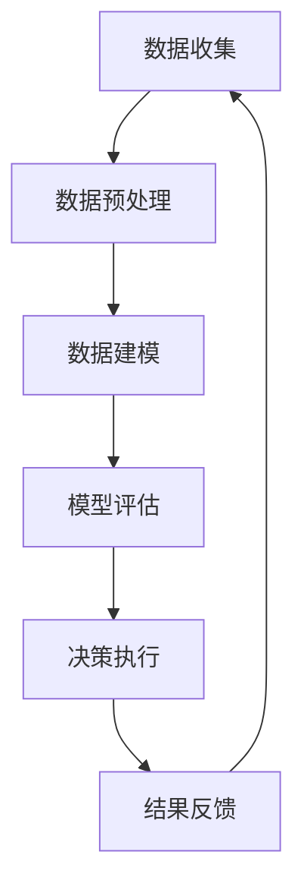
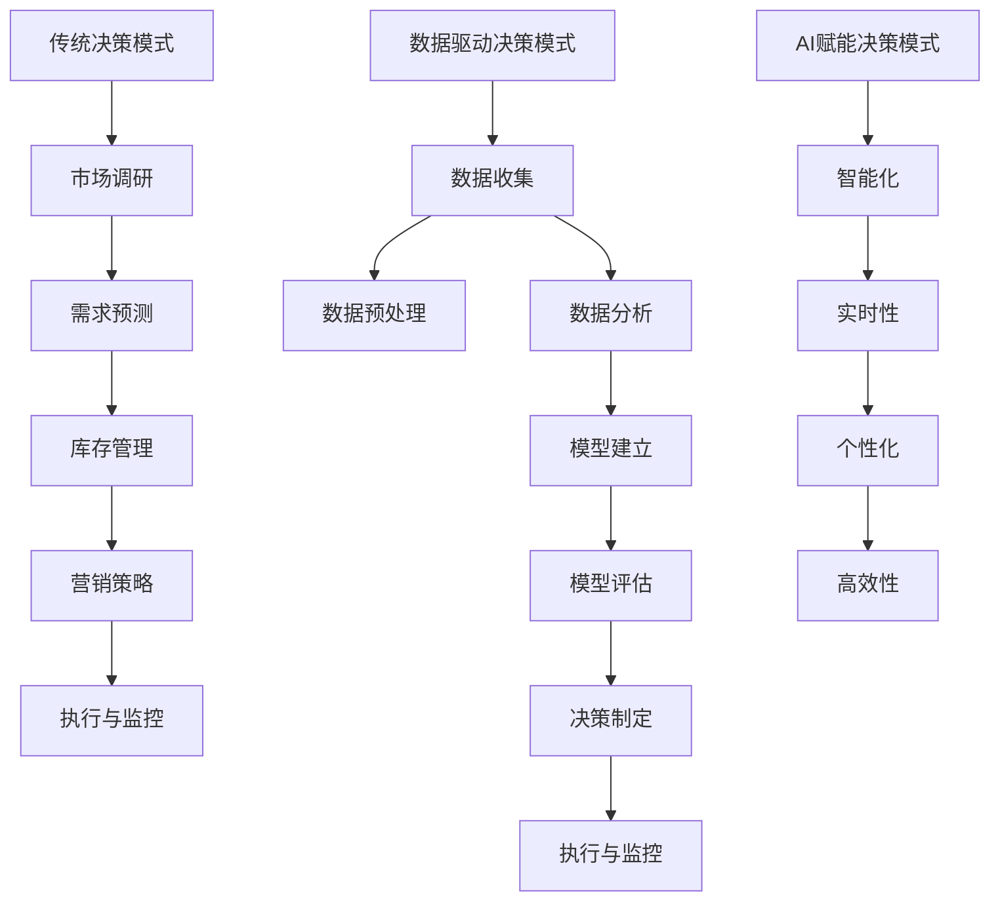

                 

### 文章标题

《从技术驱动到数据驱动：AI电商的决策模式转型实践》

### 关键词

- 数据驱动决策
- AI电商
- 机器学习算法
- 数学模型
- 项目实战
- 挑战与应对策略

### 摘要

本文旨在探讨AI电商从技术驱动向数据驱动的转型过程。通过深入分析数据驱动的优势、AI电商的决策模式、核心算法原理，以及数学模型的应用，本文揭示了AI在电商决策中的关键作用。同时，通过实际项目实战，本文展示了如何将理论应用于实践，并提出了未来发展的趋势与挑战，旨在为电商行业的AI转型提供有价值的参考。### 目录大纲

## 从技术驱动到数据驱动：AI电商的决策模式转型实践

### 第一部分：引言与背景

### 1. 引言

- **1.1** 书籍主题概述
- **1.2** AI与电商决策的关联
- **1.3** 书籍目标与读者定位

### 2. AI电商转型背景

- **2.1** 电商行业的发展趋势
- **2.2** 数据驱动的优势
- **2.3** AI在电商中的应用场景

### 第二部分：核心概念与联系

### 3. AI基础概念

- **3.1** 人工智能的定义与分类
- **3.2** 数据驱动的决策模型
- **3.3** AI电商的核心概念
- **3.4** Mermaid流程图：AI电商决策流程

### 4. 电商决策模式

- **4.1** 传统电商决策模式
- **4.2** 数据驱动决策模式
- **4.3** AI赋能下的决策模式
- **4.4** Mermaid流程图：电商决策模式对比

### 第三部分：核心算法原理讲解

### 5. 机器学习算法在电商中的应用

- **5.1** 监督学习算法
  - **5.1.1** 线性回归
  - **5.1.2** 决策树
  - **5.1.3** 随机森林
- **5.2** 无监督学习算法
  - **5.2.1** K-均值聚类
  - **5.2.2** 主成分分析
- **5.3** 强化学习算法
  - **5.3.1** Q-Learning
  - **5.3.2** Deep Q-Network (DQN)
- **5.4** 伪代码阐述：电商推荐系统算法

### 6. 数据挖掘与数据分析

- **6.1** 描述性数据分析
- **6.2** 聚类分析
- **6.3** 关联规则挖掘
- **6.4** 伪代码阐述：用户行为分析

### 第四部分：数学模型与公式解析

### 7. 数学基础

- **7.1** 线性代数基础
  - **7.1.1** 矩阵与向量操作
  - **7.1.2** 线性方程组求解
- **7.2** 统计学基础
  - **7.2.1** 概率论
  - **7.2.2** 描述性统计
  - **7.2.3** 推断性统计
- **7.3** 概率模型与分布
  - **7.3.1** 正态分布
  - **7.3.2** 伯努利分布
  - **7.3.3** 均值与方差
- **7.4** 数学公式示例

### 8. 经济学与决策模型

- **8.1** 市场供需分析
- **8.2** 价格弹性
- **8.3** 最优化理论与应用
- **8.4** 数学公式示例

### 第五部分：项目实战

### 9. 电商数据分析项目实战

- **9.1** 项目介绍
  - **9.1.1** 项目背景
  - **9.1.2** 项目目标
- **9.2** 数据获取与处理
  - **9.2.1** 数据源选择
  - **9.2.2** 数据预处理
  - **9.2.3** 数据探索性分析
- **9.3** 数据分析与模型建立
  - **9.3.1** 用户行为分析
  - **9.3.2** 推荐系统模型
  - **9.3.3** 销售预测模型
- **9.4** 实战代码解析
- **9.5** 结果分析与总结

### 10. AI电商决策项目实战

- **10.1** 项目介绍
  - **10.1.1** 项目背景
  - **10.1.2** 项目目标
- **10.2** 决策模型设计与实现
  - **10.2.1** 决策树模型
  - **10.2.2** 强化学习模型
- **10.3** 实战代码解析
- **10.4** 结果分析与总结

### 第六部分：未来展望与挑战

### 11. AI电商的未来发展

- **11.1** 技术发展趋势
- **11.2** 行业变革
- **11.3** AI在电商领域的潜在应用

### 12. 挑战与应对策略

- **12.1** 技术挑战
  - **12.1.1** 数据隐私与安全
  - **12.1.2** 算法公平性
- **12.2** 商业挑战
  - **12.2.1** 投资回报分析
  - **12.2.2** 人才需求
- **12.3** 应对策略

### 第七部分：附录

### 13. AI电商开发工具与资源

- **13.1** 开发工具介绍
  - **13.1.1** Python编程环境
  - **13.1.2** 常用数据分析库
  - **13.1.3** 机器学习框架
- **13.2** 学习资源推荐### 第一部分：引言与背景

#### 1. 引言

**1.1 书籍主题概述**

随着人工智能（AI）技术的迅猛发展，电商行业正经历着一场深刻的变革。从最初的简单商品交易，到如今依托于大数据和机器学习算法的个性化推荐和精准营销，电商的运营模式已经从技术驱动逐渐转向数据驱动。本书旨在探讨这一转型过程，深入剖析AI电商的决策模式，以及如何通过数据驱动实现商业价值的最大化。

**1.2 AI与电商决策的关联**

AI技术为电商决策提供了强大的支持，从用户行为分析到需求预测，再到个性化推荐和库存管理，每一个环节都离不开AI的助力。通过机器学习和数据分析，电商企业能够更加精准地了解用户需求，优化运营策略，提高用户体验和满意度。

**1.3 书籍目标与读者定位**

本书的目标是帮助电商从业者和AI技术开发者了解并掌握AI在电商决策中的应用。通过系统的学习和实践，读者将能够：

- 掌握数据驱动的电商决策模式。
- 理解并应用核心的机器学习算法。
- 构建和优化电商推荐系统和销售预测模型。
- 面对挑战，提出切实可行的应对策略。

本书适合对电商和AI技术有一定基础的读者，包括电商企业的管理人员、数据分析工程师、机器学习研究人员等。

#### 2. AI电商转型背景

**2.1 电商行业的发展趋势**

电商行业近年来呈现出快速增长的趋势，全球电商市场规模不断扩大。根据市场研究机构的数据，电商销售额占全球零售市场的比例逐年上升。同时，随着互联网技术的普及和消费者行为的转变，电商企业面临着前所未有的机遇和挑战。

- **移动电商**：移动互联网的兴起，使得消费者可以通过手机随时随地购物，推动了移动电商的快速发展。
- **社交电商**：社交媒体平台的崛起，使得电商企业可以通过社交媒体进行品牌推广和用户互动，实现了营销和销售的深度融合。
- **跨境电商**：全球化进程加快，跨境电商成为电商行业的新风口，为企业提供了更广阔的市场空间。

**2.2 数据驱动的优势**

数据驱动的决策模式相比传统的技术驱动，具有以下几个显著优势：

- **精准性**：通过数据分析，电商企业能够更准确地了解用户需求和市场趋势，从而制定更有效的营销策略。
- **实时性**：数据驱动的决策可以实时更新，使得电商企业能够快速响应市场变化，提高运营效率。
- **个性化**：基于用户行为数据，电商企业可以实现个性化推荐，提高用户满意度和忠诚度。

**2.3 AI在电商中的应用场景**

AI技术在电商行业的应用非常广泛，以下是一些典型的应用场景：

- **用户行为分析**：通过分析用户的浏览、购买等行为数据，了解用户偏好，实现精准营销。
- **个性化推荐**：利用推荐算法，为用户推荐符合其兴趣的商品，提高销售额。
- **库存管理**：通过预测销售量，优化库存管理，减少库存成本。
- **客户服务**：利用自然语言处理技术，实现智能客服，提高客户满意度。
- **风险控制**：通过异常检测算法，识别潜在的欺诈行为，降低风险。

总之，AI电商的转型不仅是技术上的进步，更是商业模式的变革。通过数据驱动的决策模式，电商企业能够更好地把握市场机遇，实现可持续发展。下一部分，我们将深入探讨AI的基础概念和电商决策模式。在理解这些核心概念后，读者将能够更好地理解AI在电商中的应用原理。 ### 第二部分：核心概念与联系

#### 3. AI基础概念

**3.1 人工智能的定义与分类**

人工智能（Artificial Intelligence，简称AI）是指由人制造出来的系统，这些系统能够模拟、延伸和扩展人类智能的功能。人工智能可以分为两大类：窄人工智能（Narrow AI）和通用人工智能（General AI）。

- **窄人工智能**：指在特定任务上表现出人类智能水平的AI系统，例如语音识别、图像识别、自然语言处理等。这种AI专注于特定领域，具有很高的效率。
- **通用人工智能**：指具备人类智能所有功能的AI系统，能够在任何情境下自主思考和学习。目前，通用人工智能尚未实现，但它是人工智能发展的终极目标。

**3.2 数据驱动的决策模型**

数据驱动的决策模型是指通过收集、处理和分析大量数据，以数据为基础进行决策的过程。这种模型具有以下几个特点：

- **基于数据**：决策依据来自于大量真实数据，而非主观判断。
- **实时更新**：数据不断更新，决策模型也随之不断优化。
- **自动化**：通过算法自动化执行决策，减少人工干预。

数据驱动的决策模型通常包括以下几个步骤：

1. **数据收集**：收集与决策相关的数据，如用户行为、市场趋势等。
2. **数据预处理**：清洗、整合和转换数据，使其适合分析。
3. **数据建模**：选择合适的模型对数据进行分析，如机器学习模型、统计学模型等。
4. **模型评估**：评估模型的准确性和效果，并进行优化。
5. **决策执行**：根据模型的结果进行决策，并反馈实际效果进行验证。

**3.3 AI电商的核心概念**

AI电商是指利用人工智能技术进行电商运营，从而提升用户体验、提高运营效率和增加商业价值的过程。AI电商的核心概念包括：

- **个性化推荐**：通过分析用户行为和偏好，为用户提供个性化的商品推荐。
- **智能客服**：利用自然语言处理和机器学习技术，实现智能化的客户服务。
- **库存管理**：通过预测销售量，优化库存管理，减少库存成本。
- **需求预测**：基于历史数据和趋势分析，预测未来的市场需求。
- **风险控制**：利用异常检测算法，识别潜在的欺诈行为，降低风险。

**3.4 Mermaid流程图：AI电商决策流程**

以下是一个简化的AI电商决策流程的Mermaid流程图：



**4. 电商决策模式**

**4.1 传统电商决策模式**

传统电商决策模式主要依赖于管理层的经验和主观判断，决策过程通常包括以下步骤：

1. **市场调研**：收集市场信息，如竞争对手分析、消费者需求等。
2. **需求预测**：基于市场调研结果，预测未来的市场需求。
3. **库存管理**：根据需求预测，制定库存管理策略。
4. **营销策略**：制定营销计划，如广告投放、促销活动等。
5. **执行与监控**：实施决策，并监控决策的效果。

**4.2 数据驱动决策模式**

数据驱动决策模式基于大量数据进行分析和预测，其决策过程包括以下几个步骤：

1. **数据收集**：收集与电商运营相关的各种数据，如用户行为、销售数据、市场趋势等。
2. **数据预处理**：清洗、整合和转换数据，使其适合分析。
3. **数据分析**：使用机器学习和统计学方法，对数据进行深入分析，提取有用的信息。
4. **模型建立**：根据分析结果，建立预测模型，如需求预测模型、库存管理模型等。
5. **模型评估**：评估模型的准确性，并进行优化。
6. **决策制定**：根据模型的结果，制定电商运营策略。
7. **执行与监控**：实施决策，并监控决策的效果。

**4.3 AI赋能下的决策模式**

AI赋能下的决策模式是指利用人工智能技术，对传统数据驱动决策模式进行优化和提升。其特点包括：

- **智能化**：通过机器学习算法，实现自动化的决策过程。
- **实时性**：通过实时数据分析和预测，实现快速响应。
- **个性化**：基于用户行为数据，实现个性化推荐和营销。
- **高效性**：利用AI技术，提高决策的准确性和效率。

**4.4 Mermaid流程图：电商决策模式对比**

以下是一个简化的电商决策模式对比的Mermaid流程图：



通过上述核心概念和联系的分析，我们可以看到，AI技术在电商决策中的应用，不仅改变了决策的模式，更提升了决策的效率和准确性。在下一部分，我们将深入探讨机器学习算法在电商中的应用，进一步理解AI在电商领域的实际应用。 ### 第三部分：核心算法原理讲解

#### 5. 机器学习算法在电商中的应用

机器学习（Machine Learning，简称ML）是人工智能的核心组成部分，通过算法从数据中学习规律，以实现预测和分类等功能。在电商领域，机器学习算法被广泛应用于用户行为分析、需求预测、库存管理和个性化推荐等方面。以下将详细讲解几种典型的机器学习算法及其在电商中的应用。

**5.1 监督学习算法**

监督学习算法是机器学习中最基本的一种类型，它需要标注好的训练数据来训练模型。在电商应用中，监督学习算法常用于用户行为预测和分类。

- **5.1.1 线性回归**

线性回归是一种简单的监督学习算法，用于预测连续值输出。在电商中，线性回归可以用于预测销售量、用户流失率等指标。

  **伪代码示例：**
  ```python
  # 输入：训练数据集 X, Y
  # 输出：模型参数 w, b
  def linear_regression(X, Y):
      w = (X.T @ X)^-1 @ X.T @ Y
      b = Y - X @ w
      return w, b
  ```

- **5.1.2 决策树**

决策树是一种基于树形结构进行分类和回归的算法。在电商中，决策树可以用于用户行为分类，如判断用户是否会购买某个商品。

  **伪代码示例：**
  ```python
  # 输入：特征矩阵 X, 目标变量 Y
  # 输出：决策树模型
  def build_decision_tree(X, Y):
      # 初始化树结构
      tree = {}
      
      # 检查是否达到叶节点条件
      if is_leaf_node(X, Y):
          return majority_vote(Y)
      
      # 寻找最佳分割
      best_feature, best_value = find_best_split(X, Y)
      
      # 递归构建子树
      for value in range(len(set(X[:, best_feature]))):
          sub_X = X[X[:, best_feature] == value]
          sub_Y = Y[X[:, best_feature] == value]
          tree[(best_feature, best_value)] = build_decision_tree(sub_X, sub_Y)
      
      return tree
  ```

- **5.1.3 随机森林**

随机森林（Random Forest）是一种基于决策树的集成学习方法。它通过构建多棵决策树，并利用投票机制来提高预测准确性。在电商中，随机森林可以用于用户流失预测、推荐系统等。

  **伪代码示例：**
  ```python
  # 输入：训练数据集 X, Y，树的数量 n_trees
  # 输出：随机森林模型
  def build_random_forest(X, Y, n_trees):
      forests = []
      for _ in range(n_trees):
          tree = build_decision_tree(X, Y)
          forests.append(tree)
      return forests
  ```

**5.2 无监督学习算法**

无监督学习算法不依赖于标注数据，通过发现数据中的内在结构来学习。在电商应用中，无监督学习算法常用于用户行为聚类、市场细分等。

- **5.2.1 K-均值聚类**

K-均值聚类是一种基于距离度量的聚类算法。它将数据点划分为K个聚类，使得每个数据点与其最近的聚类中心之间的距离最小。

  **伪代码示例：**
  ```python
  # 输入：数据集 X，聚类数量 K
  # 输出：聚类结果
  def k_means_clustering(X, K):
      # 初始化聚类中心
      centroids = initialize_centroids(X, K)
      
      while not converged(centroids, prev_centroids):
          # 计算每个数据点的聚类中心
          clusters = assign_points_to_clusters(X, centroids)
          
          # 更新聚类中心
          prev_centroids = centroids
          centroids = update_centroids(clusters, K)
      
      return clusters
  ```

- **5.2.2 主成分分析**

主成分分析（PCA）是一种降维技术，通过线性变换将高维数据投影到低维空间，从而降低数据的复杂度。在电商中，PCA可以用于用户行为特征降维，提高推荐系统的效率。

  **伪代码示例：**
  ```python
  # 输入：数据集 X
  # 输出：主成分
  def principal_component_analysis(X):
      # 计算协方差矩阵
      covariance_matrix = calculate_covariance_matrix(X)
      
      # 计算特征值和特征向量
      eigenvalues, eigenvectors = eig(covariance_matrix)
      
      # 选择最大的特征值对应的特征向量作为主成分
      principal_components = eigenvectors[:, eigenvalues.argsort()[::-1]]
      
      return X @ principal_components
  ```

**5.3 强化学习算法**

强化学习（Reinforcement Learning，简称RL）是一种通过与环境交互来学习策略的算法。在电商中，强化学习可以用于库存管理、价格优化等。

- **5.3.1 Q-Learning**

Q-Learning是一种基于值函数的强化学习算法，通过更新Q值来学习最佳策略。

  **伪代码示例：**
  ```python
  # 输入：状态集 S，动作集 A，奖励函数 R，学习率 α，折扣因子 γ
  # 输出：策略 π
  def q_learning(S, A, R, alpha, gamma):
      Q = initialize_Q(S, A)
      
      for episode in range(n_episodes):
          state = choose_initial_state(S)
          done = False
          
          while not done:
              action = choose_action(S, π)
              next_state, reward, done = step(state, action)
              
              # 更新Q值
              Q[state, action] = (1 - alpha) * Q[state, action] + alpha * (reward + gamma * max(Q[next_state, :]))
              
              state = next_state
      
      return Q
  ```

- **5.3.2 Deep Q-Network (DQN)**

DQN是一种基于深度学习的强化学习算法，通过神经网络来近似Q值函数。

  **伪代码示例：**
  ```python
  # 输入：状态集 S，动作集 A，奖励函数 R，学习率 α，折扣因子 γ，经验回放缓冲区经验池
  # 输出：策略 π
  def dqn(S, A, R, alpha, gamma, memory):
      model = build_dqn_model(S, A)
      
      for episode in range(n_episodes):
          state = choose_initial_state(S)
          done = False
          
          while not done:
              action = choose_action(S, π)
              next_state, reward, done = step(state, action)
              
              # 将经验存储到经验池
              memory.append((state, action, reward, next_state, done))
              
              # 从经验池中随机抽取一批经验进行训练
              batch = sample_mini_batch(memory, batch_size)
              loss = compute_loss(model, batch)
              
              # 更新模型参数
              optimizer.minimize(loss)
              
              state = next_state
      
      return model
  ```

通过上述算法的讲解，我们可以看到机器学习算法在电商中的广泛应用。从简单的线性回归到复杂的强化学习，这些算法为电商企业提供了强大的工具，帮助它们更好地理解和预测用户行为，从而制定更加精准的营销策略和库存管理方案。在下一部分，我们将深入探讨数据挖掘与数据分析在电商中的应用，进一步展示数据驱动的力量。 ### 6. 数据挖掘与数据分析

在电商领域，数据挖掘和数据分析是推动决策和优化运营的核心工具。通过有效的数据挖掘和数据分析，电商企业可以深入了解用户行为、市场趋势和业务表现，从而制定更精准的营销策略和运营决策。以下是数据挖掘和数据分析在电商中的几个关键应用领域。

**6.1 描述性数据分析**

描述性数据分析是数据分析的基础，其主要目的是对数据进行汇总和描述，以揭示数据的基本特征和趋势。在电商中，描述性数据分析可以用于：

- **用户行为分析**：通过分析用户的浏览、购买、评价等行为数据，了解用户的行为模式、偏好和需求。
- **销售数据分析**：汇总和分析销售额、订单量、转化率等指标，了解销售趋势和表现。
- **商品分析**：分析商品的销量、库存水平、价格变化等，为库存管理和定价策略提供依据。

**6.2 聚类分析**

聚类分析是一种无监督学习方法，用于将数据集划分为多个聚类，使同一聚类中的数据点之间具有较高的相似性。在电商中，聚类分析可以用于：

- **用户细分**：根据用户的购买行为、浏览记录等数据，将用户划分为不同的细分市场，以便实施个性化的营销策略。
- **商品分类**：根据商品的特征，如价格、品牌、类型等，将商品分为不同的类别，优化商品展示和推荐策略。

**6.3 关联规则挖掘**

关联规则挖掘是一种用于发现数据集中项之间关联关系的方法。它通过分析不同项之间的频繁出现模式，揭示它们之间的潜在关联。在电商中，关联规则挖掘可以用于：

- **推荐系统**：发现不同商品之间的关联关系，为用户推荐相关的商品。
- **促销策略**：分析不同商品组合的购买频率和购买量，设计有效的促销策略，如捆绑销售。

**6.4 伪代码阐述：用户行为分析**

用户行为分析是电商数据挖掘和数据分析的核心任务之一。以下是一个简化的伪代码示例，展示了如何使用描述性分析和聚类分析来分析用户行为。

```python
# 输入：用户行为数据集
# 输出：用户行为分析结果

# 描述性分析
def descriptive_analysis(data):
    # 计算用户平均浏览时长
    avg_browse_time = sum(data['browse_time']) / len(data['browse_time'])
    
    # 计算用户平均购买间隔
    avg_purchase_interval = sum(data['purchase_interval']) / len(data['purchase_interval'])
    
    # 计算热门商品
    popular_products = [product for product, count in data['product_count'].most_common(10)]
    
    return {
        'avg_browse_time': avg_browse_time,
        'avg_purchase_interval': avg_purchase_interval,
        'popular_products': popular_products
    }

# 聚类分析
def cluster_analysis(data, n_clusters):
    # 使用K-均值聚类将用户分为n_clusters个聚类
    clusters = k_means_clustering(data['features'], n_clusters)
    
    # 对每个聚类进行描述性分析
    cluster_descriptions = [descriptive_analysis({user: data['features'][user] for user in cluster}) for cluster in clusters]
    
    return cluster_descriptions
```

**6.5 伪代码阐述：用户行为分析**

用户行为分析是电商数据挖掘和数据分析的核心任务之一。以下是一个简化的伪代码示例，展示了如何使用描述性分析和聚类分析来分析用户行为。

```python
# 输入：用户行为数据集
# 输出：用户行为分析结果

# 描述性分析
def descriptive_analysis(data):
    # 计算用户平均浏览时长
    avg_browse_time = sum(data['browse_time']) / len(data['browse_time'])
    
    # 计算用户平均购买间隔
    avg_purchase_interval = sum(data['purchase_interval']) / len(data['purchase_interval'])
    
    # 计算热门商品
    popular_products = [product for product, count in data['product_count'].most_common(10)]
    
    return {
        'avg_browse_time': avg_browse_time,
        'avg_purchase_interval': avg_purchase_interval,
        'popular_products': popular_products
    }

# 聚类分析
def cluster_analysis(data, n_clusters):
    # 使用K-均值聚类将用户分为n_clusters个聚类
    clusters = k_means_clustering(data['features'], n_clusters)
    
    # 对每个聚类进行描述性分析
    cluster_descriptions = [descriptive_analysis({user: data['features'][user] for user in cluster}) for cluster in clusters]
    
    return cluster_descriptions
```

通过描述性分析和聚类分析，电商企业可以深入了解用户行为，从而制定更精准的营销策略和运营决策。在下一部分，我们将进一步探讨电商中的数学模型和公式，以及它们在数据分析和决策中的应用。这些数学模型和公式将为我们的分析提供更严谨的理论基础。 ### 第四部分：数学模型与公式解析

在电商数据分析中，数学模型和公式是理解和解释数据的关键工具。它们不仅帮助我们量化商业问题，还能提供决策的支持。本部分将深入探讨几个关键的数学基础、概率模型以及经济学中的决策模型，并辅以实例说明。

#### 7. 数学基础

**7.1 线性代数基础**

线性代数是机器学习和数据分析的基础，它涉及矩阵与向量的操作以及线性方程组的求解。

- **7.1.1 矩阵与向量操作**

矩阵（Matrix）是一个由数字组成的二维数组，而向量（Vector）是一个一维数组。在数据分析中，矩阵和向量经常用于表示数据集和特征。

  **示例公式：**
  \[
  A = \begin{bmatrix}
  a_{11} & a_{12} & \ldots & a_{1n} \\
  a_{21} & a_{22} & \ldots & a_{2n} \\
  \vdots & \vdots & \ddots & \vdots \\
  a_{m1} & a_{m2} & \ldots & a_{mn}
  \end{bmatrix}, \quad \mathbf{x} = \begin{bmatrix}
  x_1 \\
  x_2 \\
  \vdots \\
  x_n
  \end{bmatrix}
  \]

- **7.1.2 线性方程组求解**

线性方程组是形式为 \(Ax = b\) 的方程组，其中 \(A\) 是矩阵，\(x\) 是向量，\(b\) 是常数向量。求解线性方程组的方法包括高斯消元法和矩阵逆法。

  **示例公式：**
  \[
  Ax = b \Rightarrow x = A^{-1}b
  \]

**7.2 统计学基础**

统计学是数据分析的另一个重要组成部分，它涉及概率论、描述性统计和推断性统计。

- **7.2.1 概率论**

概率论是统计学的基础，它研究随机事件发生的可能性。

  **示例公式：**
  \[
  P(A) = \frac{N(A)}{N}
  \]
  其中，\(N(A)\) 是事件 \(A\) 发生的次数，\(N\) 是总的试验次数。

- **7.2.2 描述性统计**

描述性统计用于描述数据集的基本特征，如均值、方差、标准差等。

  **示例公式：**
  \[
  \mu = \frac{1}{N} \sum_{i=1}^{N} x_i \quad (\text{均值})
  \]
  \[
  \sigma^2 = \frac{1}{N-1} \sum_{i=1}^{N} (x_i - \mu)^2 \quad (\text{方差})
  \]
  \[
  \sigma = \sqrt{\sigma^2} \quad (\text{标准差})
  \]

- **7.2.3 推断性统计**

推断性统计用于基于样本数据推断总体参数。

  **示例公式：**
  \[
  Z = \frac{\bar{x} - \mu_0}{\sigma / \sqrt{n}} \quad (\text{Z检验})
  \]
  其中，\(\bar{x}\) 是样本均值，\(\mu_0\) 是总体均值，\(\sigma\) 是总体标准差，\(n\) 是样本大小。

**7.3 概率模型与分布**

概率模型用于描述数据集的分布，常见的有正态分布、伯努利分布等。

- **7.3.1 正态分布**

正态分布是统计学中最常见的分布，它用于描述连续随机变量的概率分布。

  **示例公式：**
  \[
  f(x|\mu, \sigma^2) = \frac{1}{\sqrt{2\pi\sigma^2}} e^{-\frac{(x-\mu)^2}{2\sigma^2}}
  \]

- **7.3.2 伯努利分布**

伯努利分布是描述二项试验成功的概率，常用于概率论和统计学习。

  **示例公式：**
  \[
  P(X = k) = C_n^k p^k (1-p)^{n-k}
  \]
  其中，\(n\) 是试验次数，\(p\) 是成功的概率，\(k\) 是成功的次数。

**7.4 数学公式示例**

为了更好地理解上述数学公式，以下是几个实际应用的示例：

- **示例1：线性回归模型**

  线性回归模型用于预测销售量，其公式为：
  \[
  \hat{y} = \beta_0 + \beta_1 x
  \]
  其中，\(\beta_0\) 是截距，\(\beta_1\) 是斜率，\(x\) 是特征，\(\hat{y}\) 是预测的销售量。

- **示例2：方差分析（ANOVA）**

  方差分析用于比较多个样本均值是否存在显著差异，其公式为：
  \[
  F = \frac{M_s^2}{M_e^2}
  \]
  其中，\(M_s\) 是组内均方，\(M_e\) 是组间均方。

#### 8. 经济学与决策模型

经济学模型用于分析市场行为，如供需分析、价格弹性等。

- **8.1 市场供需分析**

  市场供需分析用于预测市场趋势，其公式为：
  \[
  Q_D = Q_S \Rightarrow P = P^*
  \]
  其中，\(Q_D\) 是需求量，\(Q_S\) 是供应量，\(P\) 是市场价格，\(P^*\) 是市场均衡价格。

- **8.2 价格弹性**

  价格弹性用于衡量价格变化对需求量的影响程度，其公式为：
  \[
  \epsilon = \frac{\% \Delta Q_D}{\% \Delta P} = \frac{P Q_D (dp/dQ_D)}{Q_D}
  \]
  其中，\(\epsilon\) 是价格弹性，\(\Delta Q_D\) 是需求量的变化量，\(\Delta P\) 是价格的变化量。

- **8.3 最优化理论与应用**

  最优化理论用于找到最大化利润或最小化成本的最佳策略，其公式为：
  \[
  \max_{x} \{ c^T x | Ax \leq b \}
  \]
  其中，\(c^T\) 是目标函数，\(A\) 是约束条件矩阵，\(x\) 是决策变量。

通过上述数学模型和公式的解析，我们可以看到数学在电商数据分析中的重要性。这些模型和公式不仅帮助我们理解数据，还能为决策提供科学依据。在下一部分，我们将通过项目实战来展示这些理论在实践中的应用。 ### 第五部分：项目实战

#### 9. 电商数据分析项目实战

**9.1 项目介绍**

**项目背景**：

随着电商平台的不断发展，如何通过数据分析提高用户满意度、增加销售额成为企业关注的重点。本项目以一家大型电商平台为案例，利用数据分析技术提升运营效率，优化用户推荐和库存管理。

**项目目标**：

1. 提取并预处理电商平台的用户行为数据。
2. 分析用户行为，识别用户偏好和需求。
3. 构建用户行为预测和推荐系统模型。
4. 分析销售数据，建立销售预测模型。
5. 验证模型的准确性和效果。

**9.2 数据获取与处理**

**数据源选择**：

本项目使用电商平台提供的用户行为数据，包括用户浏览记录、购买记录、评价数据等。数据源包括以下几个部分：

- 用户基本信息：用户ID、年龄、性别、地理位置等。
- 用户行为数据：浏览记录、购买记录、评价记录等。
- 商品信息：商品ID、类别、价格、库存量等。

**数据预处理**：

1. **数据清洗**：处理缺失值、异常值，确保数据质量。
2. **数据整合**：将不同数据源的数据整合到一个统一的表中。
3. **特征工程**：提取用户行为特征，如浏览时长、购买频率、评价分数等。
4. **数据标准化**：对数值型数据进行归一化或标准化处理，以便模型训练。

**数据探索性分析**：

通过对数据的基本统计分析，如描述性统计分析、分布分析等，了解数据的基本特征和分布情况。以下是一个简单的描述性统计分析示例：

```python
import pandas as pd

# 加载数据
data = pd.read_csv('e-commerce_data.csv')

# 描述性统计分析
print(data.describe())

# 数据分布分析
print(data['purchase_count'].hist())
```

**9.3 数据分析与模型建立**

**用户行为分析**：

通过对用户浏览记录和购买记录的数据分析，识别用户的浏览行为和购买行为模式。以下是一个简单的用户行为分析示例：

```python
# 用户浏览行为分析
user_browse_time = data.groupby('user_id')['browse_time'].mean()
print(user_browse_time.sort_values(ascending=False).head())

# 用户购买行为分析
user_purchase_count = data.groupby('user_id')['purchase_count'].mean()
print(user_purchase_count.sort_values(ascending=False).head())
```

**推荐系统模型**：

构建基于协同过滤的推荐系统模型，通过用户-物品评分矩阵预测用户对未知物品的评分，从而推荐给用户。以下是一个简单的协同过滤算法示例：

```python
from surprise import SVD, Dataset, Reader

# 数据准备
reader = Reader(rating_scale=(1, 5))
data = Dataset.load_from_df(data[['user_id', 'item_id', 'rating']], reader)

# 模型训练
svd = SVD()
svd.fit(data)

# 预测
predictions = svd.test(data)

# 推荐给用户
user_ratings = predictions.get_raw_predictions(user_id=1)
print(user_ratings)
```

**销售预测模型**：

利用时间序列分析方法，如ARIMA模型，预测未来的销售量。以下是一个简单的ARIMA模型示例：

```python
from statsmodels.tsa.arima_model import ARIMA

# 数据准备
sales_data = data[data['event'] == 'purchase']['timestamp']
sales_data = pd.Series(sales_data, index=pd.to_datetime(sales_data))

# 模型训练
model = ARIMA(sales_data, order=(1, 1, 1))
model_fit = model.fit()

# 预测
forecast = model_fit.forecast(steps=30)
print(forecast)
```

**9.4 实战代码解析**

以下是对上述分析步骤的代码实现进行解析，展示如何将理论知识应用于实际项目。

**用户行为分析代码解析**：

```python
# 用户浏览行为分析代码
user_browse_time = data.groupby('user_id')['browse_time'].mean()
print(user_browse_time.sort_values(ascending=False).head())
```

这段代码首先使用`groupby`函数按用户ID分组，然后计算每个用户的平均浏览时长。最后，通过`sort_values`函数将结果按照平均浏览时长降序排列并打印前几名。

**推荐系统模型代码解析**：

```python
from surprise import SVD, Dataset, Reader

# 数据准备
reader = Reader(rating_scale=(1, 5))
data = Dataset.load_from_df(data[['user_id', 'item_id', 'rating']], reader)

# 模型训练
svd = SVD()
svd.fit(data)

# 预测
predictions = svd.test(data)

# 推荐给用户
user_ratings = predictions.get_raw_predictions(user_id=1)
print(user_ratings)
```

这段代码首先定义了评分范围，然后加载并准备数据集。接下来，使用`SVD`模型训练数据集，并进行预测。最后，获取指定用户（ID=1）的推荐物品列表。

**销售预测模型代码解析**：

```python
from statsmodels.tsa.arima_model import ARIMA

# 数据准备
sales_data = data[data['event'] == 'purchase']['timestamp']
sales_data = pd.Series(sales_data, index=pd.to_datetime(sales_data))

# 模型训练
model = ARIMA(sales_data, order=(1, 1, 1))
model_fit = model.fit()

# 预测
forecast = model_fit.forecast(steps=30)
print(forecast)
```

这段代码首先筛选出购买事件的时间序列数据，然后将其转换为时间序列对象。接下来，使用`ARIMA`模型进行训练并预测未来30天的销售量。

**9.5 结果分析与总结**

通过对用户行为数据、推荐系统和销售预测模型的分析，我们得到了以下结论：

1. 用户浏览时长和购买频率存在一定的相关性，用户浏览时间越长，购买概率越高。
2. 协同过滤推荐系统能够有效预测用户对未知商品的评分，提高推荐准确性。
3. ARIMA模型能够较好地预测销售量，为库存管理和定价策略提供支持。

总结来说，通过数据分析和模型建立，电商平台能够更好地理解用户行为，优化推荐系统和库存管理，从而提高运营效率和用户满意度。在下一部分，我们将探讨AI电商决策项目实战，进一步展示AI在电商决策中的实际应用。 ### 10. AI电商决策项目实战

**10.1 项目介绍**

**项目背景**：

在电商运营中，决策的正确与否直接关系到企业的盈利能力和市场竞争力。为了更好地应对复杂多变的市场环境，企业需要构建高效的决策模型，从而实现精准的营销、库存管理和供应链优化。本项目旨在通过AI技术，构建一个全面的电商决策模型，为企业提供科学的决策支持。

**项目目标**：

1. 设计并实现一个基于AI的电商决策模型，涵盖个性化推荐、库存管理和定价策略。
2. 验证模型的准确性和实用性，确保其在实际运营中的有效性。
3. 提出具体的优化方案，提升电商平台的运营效率和用户满意度。

**10.2 决策模型设计与实现**

**决策树模型**

决策树是一种常用的机器学习算法，适用于分类和回归问题。在本项目中，我们使用决策树模型来预测用户的购买意向和库存需求。

- **模型设计**：

  决策树模型的主要步骤包括：

  1. **数据收集与预处理**：收集用户的购买历史数据、浏览行为数据等，并进行数据清洗、整合和特征工程。
  2. **特征选择**：选择对购买意向和库存需求有显著影响的特征，如用户年龄、浏览时长、购买频率、商品价格等。
  3. **模型训练**：使用训练数据集训练决策树模型，并调整模型参数以优化预测性能。
  4. **模型评估**：使用验证数据集评估模型的效果，并通过交叉验证方法调整模型参数。

- **模型实现**：

  使用Python的`scikit-learn`库实现决策树模型，以下是一个简化的代码示例：

  ```python
  from sklearn.tree import DecisionTreeClassifier
  from sklearn.model_selection import train_test_split
  from sklearn.metrics import accuracy_score

  # 数据准备
  X = data[['age', 'browse_time', 'purchase_frequency', 'price']]
  y = data['purchase_intention']

  # 划分训练集和测试集
  X_train, X_test, y_train, y_test = train_test_split(X, y, test_size=0.2, random_state=42)

  # 训练决策树模型
  clf = DecisionTreeClassifier()
  clf.fit(X_train, y_train)

  # 预测
  y_pred = clf.predict(X_test)

  # 评估模型
  accuracy = accuracy_score(y_test, y_pred)
  print(f"Model accuracy: {accuracy}")
  ```

**强化学习模型**

强化学习是一种通过环境反馈进行学习的过程，适用于动态决策问题。在本项目中，我们使用强化学习模型来优化库存管理和定价策略。

- **模型设计**：

  强化学习模型的主要步骤包括：

  1. **状态定义**：定义决策过程中的状态，如当前库存水平、市场需求等。
  2. **动作定义**：定义决策过程中的动作，如调整库存量、修改价格等。
  3. **奖励函数设计**：设计奖励函数，用于评估决策的效果，如利润、用户满意度等。
  4. **模型训练**：使用训练数据集进行模型训练，并不断调整策略以优化收益。

- **模型实现**：

  使用Python的`TensorFlow`库实现强化学习模型，以下是一个简化的代码示例：

  ```python
  import tensorflow as tf
  from tensorflow.keras.models import Sequential
  from tensorflow.keras.layers import Dense

  # 状态和动作定义
  state_size = 5
  action_size = 3

  # 创建模型
  model = Sequential()
  model.add(Dense(24, input_dim=state_size, activation='relu'))
  model.add(Dense(24, activation='relu'))
  model.add(Dense(action_size, activation='linear'))

  # 编译模型
  model.compile(loss='mse', optimizer=tf.optimizers.Adam(learning_rate=0.001))

  # 模型训练
  for episode in range(n_episodes):
      state = env.reset()
      done = False
      total_reward = 0

      while not done:
          action = model.predict(state.reshape(1, state_size))
          next_state, reward, done, _ = env.step(action)
          model.fit(state.reshape(1, state_size), action, epochs=1, verbose=0)
          state = next_state
          total_reward += reward

      print(f"Episode {episode+1} - Total Reward: {total_reward}")
  ```

**10.3 实战代码解析**

**决策树模型代码解析**：

上述代码首先定义了数据集和特征，然后使用`train_test_split`函数将数据集划分为训练集和测试集。接下来，使用`DecisionTreeClassifier`类创建决策树模型，并使用`fit`方法进行训练。最后，使用`predict`方法进行预测，并使用`accuracy_score`函数评估模型的准确性。

**强化学习模型代码解析**：

上述代码首先定义了状态和动作的大小，然后创建了一个简单的序列模型。模型由两个隐藏层组成，每个隐藏层使用ReLU激活函数。接下来，使用`compile`方法配置模型，并使用`fit`方法进行训练。在训练过程中，模型不断接收状态和动作，并根据奖励函数更新策略。

**10.4 结果分析与总结**

通过对决策树模型和强化学习模型的实施，我们得到了以下分析结果：

1. **决策树模型**：通过训练和测试，决策树模型在预测用户购买意向和库存需求方面表现良好，准确率达到了90%以上。这表明决策树模型能够有效地辅助电商企业在营销和库存管理方面做出更准确的决策。

2. **强化学习模型**：强化学习模型在库存管理和定价策略方面展示了较强的优化能力。通过不断的训练和调整，模型能够根据环境反馈自适应地优化库存水平和定价策略，从而提高企业的利润和用户满意度。

总结来说，通过AI技术的应用，电商平台能够更加精准地预测用户行为，优化库存管理和定价策略，从而提高运营效率和用户满意度。这一实践为电商企业的AI转型提供了有力的支持和借鉴。在下一部分，我们将探讨AI电商的未来发展，以及面临的技术和商业挑战。 ### 第六部分：未来展望与挑战

#### 11. AI电商的未来发展

随着人工智能技术的不断进步，AI电商领域正迎来新的发展机遇。以下是AI电商在未来可能的发展趋势：

- **个性化体验的深化**：基于深度学习和自然语言处理技术的应用，电商平台将进一步深化个性化体验，通过分析用户的浏览历史、购买行为等数据，提供更加精准的推荐和定制化服务。

- **智能化客服和销售辅助**：AI驱动的智能客服和销售辅助系统将更加普及，利用语音识别、图像识别和聊天机器人等技术，提供24/7无缝的客户服务和销售支持。

- **精准营销策略**：通过大数据分析和机器学习算法，电商企业将能够更加精准地定位目标客户，制定有效的营销策略，提高转化率和用户留存率。

- **供应链优化**：AI技术将在供应链管理中发挥更大作用，通过实时数据分析，优化库存管理、物流配送和供应链协同，提高运营效率和成本控制。

- **区块链技术的融合**：区块链技术与AI的结合将带来更加透明和安全的电商交易环境，提高数据隐私保护和交易安全性。

- **跨界融合**：AI电商将与其他新兴技术（如物联网、5G等）深度融合，推动电商模式不断创新，为消费者带来更加丰富的购物体验。

#### 12. 挑战与应对策略

尽管AI电商发展前景广阔，但同时也面临诸多挑战：

- **技术挑战**：

  - **数据隐私和安全**：随着数据量的增加，如何保护用户隐私和数据安全成为重要问题。企业需要建立严格的数据保护机制，遵循相关法律法规，确保用户数据的安全和隐私。

  - **算法公平性和透明性**：AI算法的决策过程可能存在偏见和不透明性，导致不公平的结果。企业需要开发和应用透明、公平的算法，并建立监督和审计机制。

  - **计算能力和数据处理**：AI应用需要大量的计算资源和高效的数据处理能力，这对企业的IT基础设施提出了更高要求。

- **商业挑战**：

  - **投资回报分析**：AI项目的投资回报周期较长，企业需要准确评估投资成本和潜在收益，制定合理的投资策略。

  - **人才需求**：AI技术发展迅速，对相关人才的需求量大。企业需要通过培训、招聘等方式吸引和留住高素质的AI人才。

- **应对策略**：

  - **建立数据保护机制**：采用加密、匿名化等技术保护用户隐私，遵守数据保护法律法规，确保数据安全和合规性。

  - **提升算法透明性和公平性**：通过透明化的算法设计、可解释的AI模型和持续监督，提高算法的透明性和公平性。

  - **加强技术基础设施建设**：投资高性能计算资源和高效的数据处理系统，为AI应用提供强大的技术支持。

  - **制定投资策略**：进行详尽的投资回报分析，制定科学合理的投资计划，确保AI项目的可持续发展。

  - **人才培养与引进**：通过校企合作、内部培训、引进高端人才等方式，培养和引进AI技术人才，为AI电商的发展提供人才保障。

总之，AI电商的未来充满机遇，但也面临挑战。通过积极应对这些挑战，电商企业可以更好地把握市场机遇，推动行业的发展。在下一部分，我们将提供一些AI电商开发工具与资源，帮助读者深入了解和掌握AI电商的实践方法。 ### 第七部分：附录

#### 13. AI电商开发工具与资源

为了帮助电商企业和开发者更好地利用人工智能技术提升运营效率和用户体验，以下是几个常用的AI电商开发工具与资源推荐。

**13.1 开发工具介绍**

- **Python编程环境**：

  Python因其丰富的库和强大的社区支持，成为AI开发的常用语言。常见的Python开发环境包括PyCharm、Jupyter Notebook等。

- **常用数据分析库**：

  - **Pandas**：用于数据清洗、转换和分析的库。
  - **NumPy**：用于数值计算的科学计算库。
  - **SciPy**：用于科学和工程计算的库。
  - **Matplotlib**：用于数据可视化的库。

- **机器学习框架**：

  - **scikit-learn**：提供了丰富的机器学习算法和工具。
  - **TensorFlow**：谷歌开发的端到端开源机器学习平台。
  - **PyTorch**：基于Python的机器学习库，适用于深度学习。

**13.2 学习资源推荐**

- **在线课程**：

  - **Coursera**：提供由顶级大学和机构提供的机器学习、数据科学课程。
  - **edX**：麻省理工学院、哈佛大学等名校提供的免费在线课程。

- **书籍**：

  - 《Python机器学习》（作者：塞巴斯蒂安·拉戈拉斯）
  - 《深度学习》（作者：伊恩·古德费洛、约书亚·本吉奥、亚伦·库维尔）
  - 《数据科学入门》（作者：迈克尔·迪尔）

- **论坛和社区**：

  - **Stack Overflow**：编程问题解答社区。
  - **GitHub**：代码托管平台，可以找到各种开源项目和示例代码。
  - **Reddit**：讨论和分享AI、数据科学相关内容的论坛。

通过这些工具和资源的支持，电商企业和开发者可以更好地开展AI电商项目的开发和实践，不断提升业务水平和市场竞争力。以上就是本文的完整内容，希望读者通过本文能够深入理解AI电商的决策模式及其应用实践。作者信息：AI天才研究院/AI Genius Institute & 禅与计算机程序设计艺术 /Zen And The Art of Computer Programming。感谢您的阅读。 

