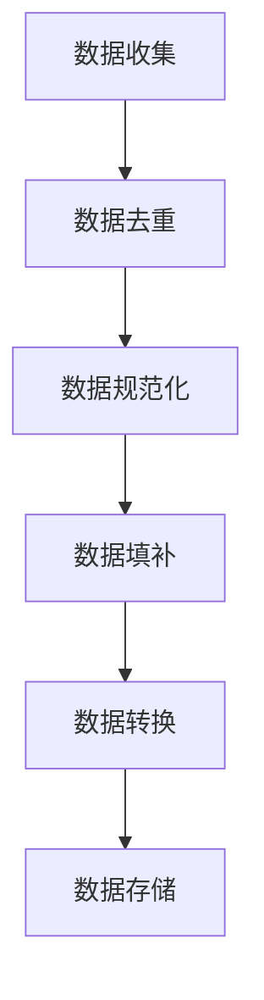
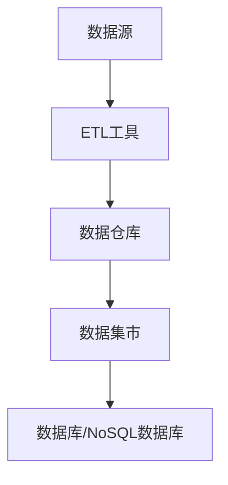
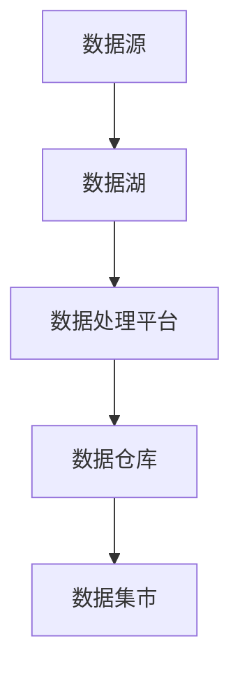
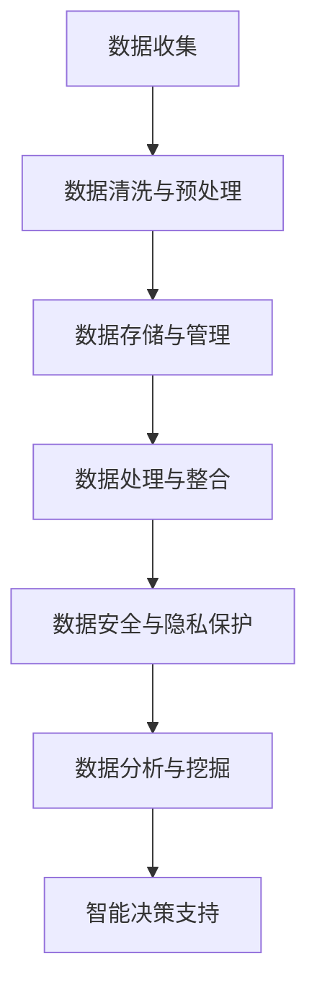
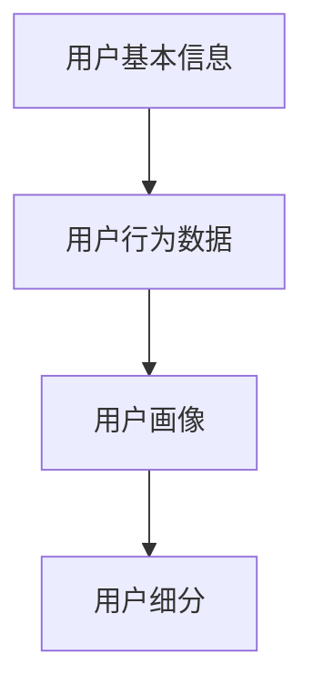
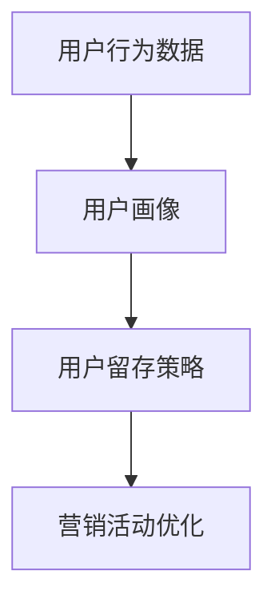
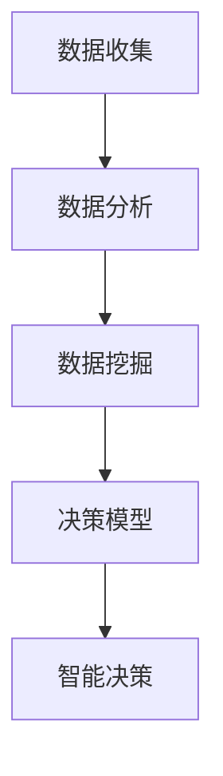
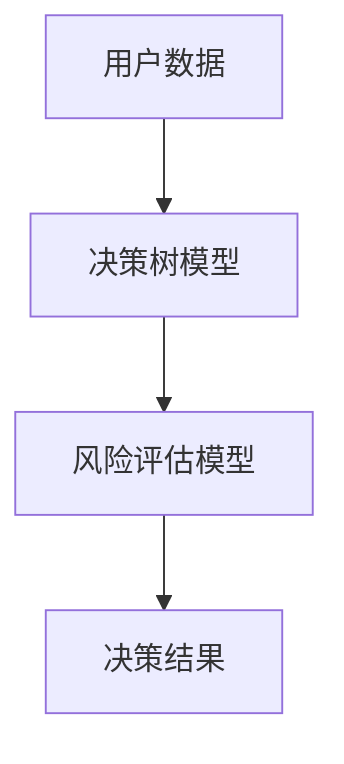
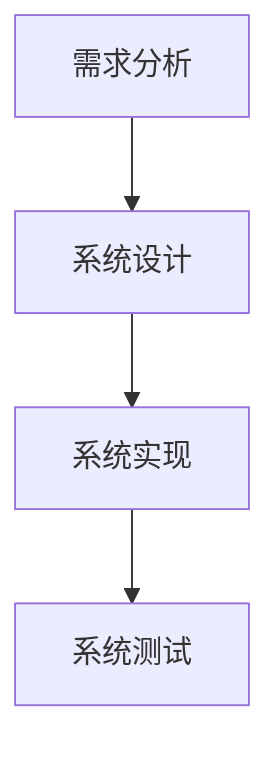

                 

# 《从数据收集到智能决策：AI电商平台的数据价值链》

## 关键词

AI电商平台、数据价值链、数据处理、数据挖掘、智能决策

## 摘要

在当今的数字化时代，电商平台已经成为商业运营的核心。本文以AI电商平台为背景，深入探讨了从数据收集到智能决策的完整数据价值链。首先，本文介绍了AI电商平台的数据来源、数据类型以及数据采集策略。接着，详细阐述了数据清洗、预处理、存储与管理、数据处理与整合的方法和技术。在数据处理环节，本文讨论了数据安全与隐私保护策略。随后，本文介绍了市场趋势分析、用户行为分析、产品推荐系统等数据分析与挖掘技术。最后，本文提出了智能决策支持系统的设计与实现方法，并通过具体案例展示了智能决策在电商平台中的应用。本文旨在为读者提供一个全面、系统、实用的AI电商平台数据价值链指南。

## 第一部分：数据收集与处理

### 第1章：AI电商平台的数据价值链概述

#### 1.1 AI电商平台的数据来源

AI电商平台的数据来源可以分为内部数据和外部数据。

1. **内部数据**：
   - **用户数据**：包括用户基本信息、浏览记录、购买行为等。
   - **商品数据**：包括商品描述、分类、价格等。
   - **订单数据**：包括订单号、购买时间、商品信息、用户信息等。

2. **外部数据**：
   - **社交媒体数据**：包括用户在社交媒体平台上的行为数据。
   - **市场数据**：包括竞争对手信息、市场趋势等。

#### 1.2 数据采集策略与挑战

1. **数据采集策略**：
   - **主动采集**：通过API接口、爬虫等方式主动获取数据。
   - **被动采集**：通过用户行为日志、系统日志等被动获取数据。

2. **数据采集挑战**：
   - **数据多样性**：不同来源的数据格式、结构可能不同，需要统一处理。
   - **数据完整性**：数据可能在采集过程中丢失或出现错误，需要保证数据的完整性。
   - **数据实时性**：对于实时性要求较高的应用，需要保证数据实时采集和更新。

### 第2章：数据清洗与预处理

#### 2.1 数据清洗的必要性

1. **数据缺失**：部分数据可能丢失，需要填补。
2. **数据异常**：部分数据可能包含错误，需要纠正。
3. **数据格式**：不同来源的数据格式可能不同，需要统一格式。

#### 2.2 数据预处理方法

1. **数据去重**：去除重复的数据。
2. **数据规范化**：统一数据格式、编码等。
3. **数据填补**：使用统计方法、机器学习模型等方法填补缺失的数据。
4. **数据转换**：将不同类型的数据转换为统一类型。

#### 2.3 数据清洗与预处理流程图



### 第3章：数据存储与管理

#### 3.1 数据仓库设计

1. **数据仓库架构**：
   - **数据源**：包括内部数据和外部数据。
   - **数据仓库**：用于存储和管理数据的数据库。
   - **数据集市**：针对特定业务需求的数据汇总。

2. **数据建模方法**：
   - **维度建模**：将数据按照维度进行划分，方便数据查询和分析。
   - **星型模式**：将数据按照事实表和维度表进行组织。
   - **雪花模式**：在星型模式的基础上，对维度表进行进一步分解。

#### 3.2 数据存储解决方案

1. **数据库选择**：
   - **关系型数据库**：如MySQL、PostgreSQL等。
   - **NoSQL数据库**：如MongoDB、Cassandra等。

2. **分布式存储系统**：
   - **Hadoop**：基于HDFS的分布式存储系统。
   - **HBase**：基于HDFS的分布式数据库。

3. **数据存储架构图**



### 第4章：数据处理与整合

#### 4.1 数据处理流程

1. **数据集成**：将不同来源、格式、结构的数据进行整合。
2. **数据转换**：将数据按照需求进行转换，如类型转换、格式转换等。
3. **数据归一化**：将数据按照统一的标准进行归一化处理。

#### 4.2 数据整合与数据湖

1. **数据湖的概念**：
   - 数据湖是一种数据存储架构，用于存储大量原始数据，支持实时处理和分析。

2. **数据湖与数据仓库的区别**：
   - **数据仓库**：对数据进行处理和整理后存储，以支持快速查询和分析。
   - **数据湖**：存储大量原始数据，支持实时处理和分析。

3. **数据湖架构图**



### 第5章：数据安全与隐私保护

#### 5.1 数据安全策略

1. **数据加密**：对数据进行加密，防止未授权访问。
2. **访问控制**：对用户权限进行严格控制，确保数据安全。

#### 5.2 隐私保护法规与合规

1. **GDPR**：欧盟通用数据保护条例，规定了数据处理和隐私保护的规则。
2. **CCPA**：加州消费者隐私法案，规定了消费者数据的处理和隐私保护。

### 附录A：AI电商平台数据价值链Mermaid流程图



## 第二部分：数据分析与挖掘

### 第6章：市场趋势分析

#### 6.1 市场数据采集与处理

1. **用户行为分析**：
   - 用户浏览、点击、购买等行为数据。
   - 数据采集：使用日志采集、API接口等方式。
   - 数据处理：数据清洗、归一化、特征提取等。

2. **市场需求预测**：
   - 使用机器学习模型，如时间序列模型、回归模型等，进行需求预测。
   - 数据处理：数据清洗、归一化、特征提取等。

#### 6.2 市场趋势分析模型

1. **时间序列模型**：
   - 如ARIMA、LSTM等模型。
   - 伪代码：

   ```python
   def train_time_sequence_model(data):
       # 数据预处理
       processed_data = preprocess_data(data)
       
       # 模型训练
       model = ARIMA(processed_data, order=(1, 1, 1))
       model.fit(processed_data)
       
       return model
   ```

2. **回归模型**：
   - 如线性回归、逻辑回归等模型。
   - 伪代码：

   ```python
   def train_regression_model(data, target):
       # 数据预处理
       processed_data = preprocess_data(data)
       
       # 模型训练
       model = LinearRegression()
       model.fit(processed_data, target)
       
       return model
   ```

### 第7章：用户行为分析

#### 7.1 用户行为数据收集

1. **用户点击行为**：
   - 用户在网站上的点击行为数据。
   - 数据采集：使用日志采集、API接口等方式。

2. **用户购买行为**：
   - 用户在网站上的购买行为数据。
   - 数据采集：使用日志采集、API接口等方式。

#### 7.2 用户画像与细分

1. **用户画像构建**：
   - 对用户的基本信息、行为数据等进行整合，构建用户画像。

2. **用户细分策略**：
   - 根据用户画像，将用户分为不同的细分群体。

#### 7.3 用户画像示例



### 第8章：产品推荐系统

#### 8.1 推荐系统概述

1. **推荐系统的类型**：
   - **基于内容的推荐**：根据用户的兴趣、行为推荐相关内容。
   - **协同过滤推荐**：根据用户之间的相似度推荐商品。

2. **推荐系统的工作流程**：
   - 数据采集：收集用户行为数据、商品信息等。
   - 数据处理：数据清洗、特征提取等。
   - 模型训练：训练协同过滤模型、基于内容的推荐模型等。
   - 推荐结果：根据用户行为和模型预测，生成推荐结果。

#### 8.2 collaborative filtering算法

1. **Memory-based方法**：
   - 根据用户之间的相似度，直接推荐与目标用户相似的其他用户的偏好。

2. **Model-based方法**：
   - 使用机器学习模型，如矩阵分解、因子分解机等，预测用户对商品的偏好。

3. **协同过滤算法伪代码**：

```python
# Memory-based协同过滤算法
def collaborative_filtering_memory_based(users, items, ratings):
    # 计算用户之间的相似度
    similarity_matrix = compute_similarity_matrix(users, items, ratings)
    
    # 预测用户对未知商品的评分
    predicted_ratings = predict_ratings(users, items, similarity_matrix, ratings)
    
    return predicted_ratings

# Model-based协同过滤算法
def collaborative_filtering_model_based(users, items, ratings):
    # 训练矩阵分解模型
    model = train_matrix_factorization_model(users, items, ratings)
    
    # 预测用户对未知商品的评分
    predicted_ratings = model.predict(users, items)
    
    return predicted_ratings
```

### 第9章：智能预测与优化

#### 9.1 时间序列分析

1. **时间序列模型**：
   - 如ARIMA、LSTM等模型。

2. **时间序列预测**：
   - 使用时间序列模型预测未来一段时间内的数据。

#### 9.2 运营策略优化

1. **用户留存策略**：
   - 根据用户行为和用户画像，制定用户留存策略。

2. **营销活动优化**：
   - 根据用户行为和营销活动效果，优化营销活动策略。

#### 9.3 运营策略优化案例



## 第三部分：智能决策支持

### 第10章：智能决策概述

#### 10.1 智能决策概念

1. **智能决策**：
   - 利用人工智能技术，根据数据分析和挖掘结果，做出最优决策。

2. **智能决策的优势**：
   - 提高决策效率。
   - 减少决策错误。
   - 提高业务运营效果。

#### 10.2 智能决策框架



### 第11章：数据驱动的决策支持系统

#### 11.1 决策支持系统的设计

1. **数据分析在决策支持中的作用**：
   - 数据分析提供决策所需的客观依据。

2. **决策支持系统的架构**：
   - **数据层**：包括数据收集、存储、处理等。
   - **模型层**：包括数据挖掘、机器学习等。
   - **应用层**：包括决策模型、可视化等。

#### 11.2 决策模型与应用

1. **决策树**：
   - 根据特征划分数据，构建决策树。

2. **贝叶斯网络**：
   - 根据概率关系构建贝叶斯网络。

3. **风险评估模型**：
   - 根据风险因素，评估风险程度。

#### 11.3 决策模型应用案例



### 第12章：智能决策系统开发

#### 12.1 智能决策系统的开发流程

1. **需求分析**：
   - 确定智能决策系统的目标和需求。

2. **系统设计**：
   - 设计数据层、模型层、应用层等。

3. **系统实现**：
   - 开发数据层、模型层、应用层等。

4. **系统测试**：
   - 对系统进行功能测试、性能测试等。

#### 12.2 智能决策系统开发流程图



### 第13章：案例研究：智能决策在电商平台的实践

#### 13.1 智能库存管理

1. **库存预测**：
   - 根据历史销售数据、市场趋势等预测未来销量。

2. **库存调整**：
   - 根据库存预测结果，调整库存水平。

#### 13.2 智能定价策略

1. **价格预测**：
   - 根据市场需求、竞争情况等预测最佳价格。

2. **价格调整**：
   - 根据价格预测结果，调整商品价格。

#### 13.3 智能营销策略

1. **用户细分**：
   - 根据用户行为、兴趣等将用户分为不同的细分群体。

2. **营销活动**：
   - 针对不同细分群体，设计个性化的营销活动。

### 附录A：AI电商平台数据价值链Mermaid流程图


### 附录B：数据处理与挖掘算法伪代码示例

```python
# 数据清洗伪代码
def data_cleaning(data):
    # 数据去重
    data = remove_duplicates(data)
    
    # 数据规范化
    data = normalize_data(data)
    
    # 数据填补
    data = fill_missing_data(data)
    
    return data

# 用户行为分析伪代码
def user_behavior_analysis(data):
    # 数据预处理
    processed_data = data_cleaning(data)
    
    # 用户点击行为分析
    click_data = analyze_clicks(processed_data)
    
    # 用户购买行为分析
    purchase_data = analyze_purchases(processed_data)
    
    return click_data, purchase_data

# 推荐系统算法伪代码
def collaborative_filtering_algorithm(ratings_matrix):
    # 计算用户之间的相似度
    similarity_matrix = compute_similarity_matrix(ratings_matrix)
    
    # 预测用户对未知商品的评分
    predicted_ratings = predict_ratings(ratings_matrix, similarity_matrix)
    
    return predicted_ratings

# 智能预测与优化伪代码
def time_sequence_prediction(data):
    # 数据预处理
    processed_data = data_cleaning(data)
    
    # 时间序列模型训练
    model = train_time_sequence_model(processed_data)
    
    # 预测未来数据
    predicted_data = model.predict(processed_data)
    
    return predicted_data
```

### 附录C：智能决策系统开发资源与工具

1. **开发环境搭建**：
   - Python、Jupyter Notebook、Anaconda等。

2. **数据处理工具**：
   - Pandas、NumPy、Scikit-learn等。

3. **智能算法框架**：
   - TensorFlow、PyTorch、Scikit-learn等。

### 附录D：常见问题与解决方案

1. **数据质量问题的解决方法**：
   - 数据清洗、数据填补、数据规范化等。

2. **数据安全与隐私保护问题**：
   - 数据加密、访问控制、隐私保护法规等。

3. **智能决策系统的常见挑战**：
   - 数据量巨大、计算效率、模型解释性等。

### 附录E：拓展阅读

1. **数据挖掘与机器学习相关书籍**：
   - 《数据挖掘：概念与技术》
   - 《机器学习实战》

2. **智能决策相关书籍**：
   - 《智能决策：方法与实践》
   - 《智能决策支持系统》

### 作者信息

作者：AI天才研究院/AI Genius Institute & 禅与计算机程序设计艺术 /Zen And The Art of Computer Programming

---

**全文结束。**

