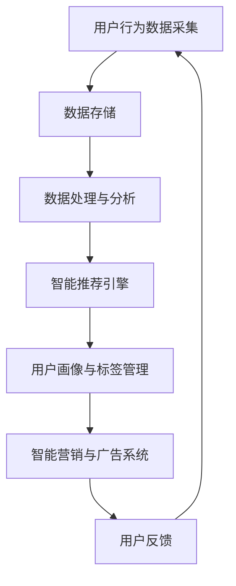
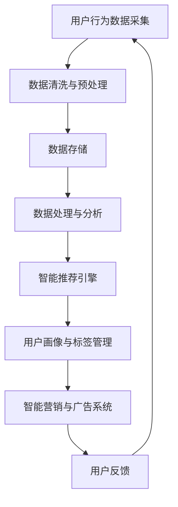
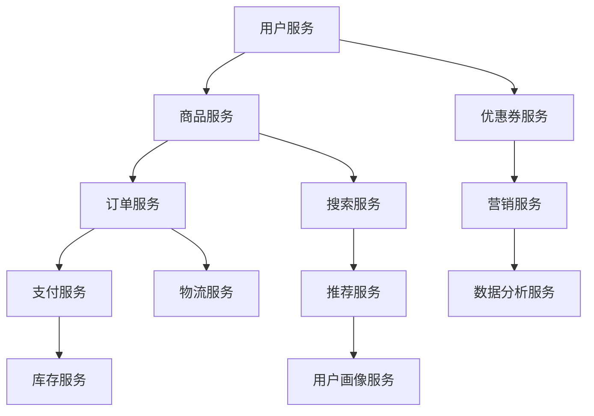

                 

### 引言

#### 1.1 书籍背景与目的

在现代商业环境中，电商平台已经成为企业竞争的关键领域。随着人工智能（AI）技术的快速发展，AI电商平台正在重新定义商业运营模式，提高客户体验，并为企业带来巨大的商业价值。然而，随着业务规模的扩大和用户需求的增长，传统的技术架构逐渐暴露出其局限性和不足。如何将本地部署的旧有架构升级到现代化的云原生架构，成为企业必须面对的挑战。

本篇文章旨在探讨AI电商平台从本地部署到云原生架构的现代化路径。通过详细分析现代化技术架构的优势、本地部署与云原生部署的差异、AI电商平台的核心组件以及具体的实施步骤，为读者提供一套全面、系统的现代化架构转型方案。

#### 1.2 读者对象与预期收益

本文适合以下读者群体：

1. **技术管理人员**：需要了解和规划企业技术架构现代化转型的技术管理人员。
2. **软件工程师**：负责电商平台开发和维护的软件工程师，希望掌握现代化技术架构的原理和实践。
3. **架构师**：关注技术前沿，希望深入了解云原生技术及其在企业中的应用。
4. **创业者**：计划或正在开发AI电商平台，希望了解技术架构的优化路径。

通过阅读本文，读者可以预期获得以下收益：

1. **全面理解现代化技术架构的概念和优势**。
2. **掌握从本地部署到云原生部署的转型策略和实践**。
3. **了解AI电商平台的核心组件和技术实现**。
4. **获得具体案例分析和最佳实践建议**。

#### 1.3 书籍结构安排

本文结构分为八个部分：

1. **引言**：介绍书籍背景、目的、读者对象和预期收益。
2. **现代化技术架构概述**：分析传统技术架构的局限性，介绍现代化技术架构的优势和组成部分。
3. **从本地部署到云原生**：详细讨论本地部署和云原生部署的优缺点以及技术实现。
4. **AI电商平台的技术架构**：介绍AI电商平台的定义、业务模式和核心组件。
5. **从本地部署到云原生的现代化路径**：阐述现代化路径的步骤和典型场景案例分析。
6. **实践与建议**：分享现代化架构下的开发实践、安全性与稳定性保障、持续优化与创新发展。
7. **案例研究**：分析某电商平台的现代化路径案例以及其他电商平台的案例。
8. **未来展望与总结**：总结全文内容，展望AI电商平台的技术发展趋势和云原生与AI结合的未来前景。

通过以上结构的安排，本文力求以逻辑清晰、内容丰富的方式，为读者提供一场关于AI电商平台技术架构现代化的深度探讨。接下来，我们将深入探讨现代化技术架构的概述，为后续内容的讨论奠定基础。

### 现代化技术架构概述

在现代商业环境中，随着数据量的爆炸式增长、用户需求的多样化和市场竞争的加剧，传统的技术架构逐渐显露出其局限性和不足。传统技术架构主要依赖于本地部署模式，其基本特点包括：

1. **高成本**：本地部署需要大量的硬件投资和运维成本，包括服务器、存储设备、网络设施等。
2. **低扩展性**：传统架构难以灵活应对业务规模的变化，扩展性较差，增加了业务扩展的难度。
3. **维护复杂**：本地部署的维护工作繁重，涉及到硬件维护、软件升级、安全性保障等多个方面，需要大量技术人才和资源。
4. **响应速度慢**：传统架构的数据处理和响应速度较慢，无法快速响应用户需求，影响用户体验。

#### 2.2 现代化技术架构的优势

为了克服传统技术架构的局限性，现代化技术架构应运而生。现代化技术架构，特别是云原生架构，具有以下显著优势：

1. **高可扩展性**：云原生架构利用云计算资源，可以根据业务需求动态调整计算资源，实现无缝扩展，大大提高了系统的弹性和适应性。
2. **低成本**：云原生架构通过使用共享资源池，减少了硬件投资和运维成本，同时提供了按需付费的模式，进一步降低了企业的运营成本。
3. **高可靠性**：云原生架构采用分布式部署，通过负载均衡和故障转移机制，确保系统的高可用性和稳定性，降低系统故障的风险。
4. **快速部署与迭代**：云原生架构支持微服务架构和容器化技术，使得应用开发和部署过程更加敏捷和高效，能够快速响应市场需求。
5. **自动化管理**：云原生架构引入了自动化管理工具，如Kubernetes等，实现了自动化的资源分配、部署和监控，大大降低了运维复杂度。

#### 2.3 现代化技术架构的组成部分

现代化技术架构通常包括以下几个关键组成部分：

1. **云计算平台**：提供计算、存储、网络等基础设施服务，如AWS、Azure、Google Cloud等。
2. **容器化技术**：通过Docker等工具，将应用及其依赖环境打包成容器，实现应用的独立部署和运行。
3. **微服务架构**：将复杂的应用系统分解为多个独立的微服务，每个微服务负责特定的业务功能，提高了系统的灵活性和可维护性。
4. **持续集成与持续部署（CI/CD）**：通过自动化工具，实现代码的持续集成、测试和部署，提高开发效率和软件质量。
5. **监控与日志分析**：通过Prometheus、ELK（Elasticsearch、Logstash、Kibana）等工具，对系统进行实时监控和日志分析，确保系统的健康运行。
6. **安全性与合规性**：采用多层次的安全策略，包括网络隔离、数据加密、身份认证等，确保系统的安全性和合规性。

通过上述组成部分，现代化技术架构能够为企业提供灵活、高效、可靠的技术支持，为AI电商平台的创新和发展提供坚实的技术保障。

### 从本地部署到云原生

在现代商业环境中，随着数据量的急剧增长和用户需求的多样化，企业需要不断优化其技术架构，以保持竞争力。本地部署和云原生部署是两种常见的架构模式，它们各自具有独特的优缺点。下面，我们将详细探讨这两种模式，并分析从本地部署过渡到云原生部署的必要性和可行性。

#### 3.1.1 本地部署的优缺点

**本地部署**是指在企业的自有数据中心或服务器上部署应用系统和数据存储。这种模式的主要优点包括：

1. **数据安全性高**：数据存储在企业内部，不易受到外部网络攻击和数据泄露。
2. **网络稳定性好**：内部网络环境可控，数据传输速度快，延迟低。
3. **合规性强**：对于有严格数据合规性要求的企业，本地部署可以更好地满足相关法规和标准。

然而，本地部署也存在着显著的缺点：

1. **扩展性差**：本地部署的资源有限，难以灵活应对业务规模的变化，扩展需要大量硬件投资。
2. **维护成本高**：本地部署需要大量的硬件设备和专业运维人员，维护成本高。
3. **部署周期长**：硬件采购、部署和配置需要较长时间，无法快速响应市场需求。

**技术实现**方面，本地部署通常涉及以下步骤：

1. **硬件采购**：根据业务需求采购服务器、存储设备、网络设备等硬件。
2. **操作系统安装**：在服务器上安装操作系统，如Linux或Windows Server。
3. **应用部署**：将应用系统部署到服务器上，包括数据库、Web服务器、中间件等。
4. **网络配置**：配置内部网络，包括IP地址分配、子网划分、防火墙设置等。

#### 3.2.1 云原生部署的优缺点

**云原生部署**则是指利用云计算平台提供的资源和服务，通过容器化、自动化、微服务等技术，实现应用的灵活部署和高效管理。云原生部署的主要优点包括：

1. **高扩展性**：通过云计算平台的弹性资源调度，可以轻松应对业务规模的动态变化。
2. **低成本**：云平台提供按需付费模式，减少了硬件投资和运维成本。
3. **快速部署与迭代**：容器化和微服务架构使得应用开发和部署更加敏捷，能够快速响应市场需求。
4. **高可靠性**：分布式部署和自动化管理提高了系统的可用性和稳定性。

然而，云原生部署也存在一些不足之处：

1. **安全性问题**：云平台虽然提供了丰富的安全功能，但数据存储和处理仍面临一定的安全风险。
2. **网络依赖性高**：云原生部署依赖于外部网络，网络不稳定可能会影响系统性能。
3. **迁移成本高**：从本地部署迁移到云原生部署需要大量的技术改造和培训投入。

**技术实现**方面，云原生部署涉及以下关键步骤：

1. **选择云平台**：根据业务需求和预算选择合适的云平台，如AWS、Azure、Google Cloud等。
2. **容器化**：使用Docker等工具，将应用及其依赖环境打包成容器，实现应用的独立部署和运行。
3. **微服务架构**：将复杂的应用系统分解为多个独立的微服务，每个微服务负责特定的业务功能。
4. **持续集成与持续部署（CI/CD）**：通过自动化工具，实现代码的持续集成、测试和部署。
5. **监控与日志分析**：使用云平台提供的监控和日志分析工具，对系统进行实时监控和故障处理。

#### 从本地部署到云原生部署的必要性和可行性

从本地部署过渡到云原生部署是当前企业技术架构升级的一个重要趋势。这种过渡的必要性和可行性主要体现在以下几个方面：

1. **业务需求变化**：随着业务的不断发展和用户需求的多样化，企业需要更加灵活和高效的技术架构来支持业务的快速扩展和迭代。
2. **技术发展驱动**：云计算、容器化、微服务、自动化等技术的发展，为企业的技术架构升级提供了技术支持和实现路径。
3. **成本控制需求**：云原生架构的低成本优势和按需付费模式，有助于企业降低运营成本，提高资源利用率。
4. **安全性提升**：云平台提供的多层安全防护措施，可以提高企业的数据安全性和系统稳定性。

从本地部署过渡到云原生部署的可行性主要表现在以下几个方面：

1. **技术成熟度**：容器化、微服务、CI/CD等技术已经相对成熟，具备广泛的应用和实践经验。
2. **平台兼容性**：主流云平台提供了丰富的API和工具，支持不同技术栈和应用程序的部署和管理。
3. **迁移策略**：通过逐步迁移、混合部署等方式，企业可以平滑过渡到云原生架构，降低迁移风险。

总之，从本地部署到云原生部署不仅是技术趋势，也是企业实现业务创新和发展的必要路径。通过合理规划和逐步实施，企业可以充分利用云原生架构的优势，提升技术竞争力，实现持续创新和业务增长。

### AI电商平台的技术架构

AI电商平台通过结合人工智能技术，实现了个性化推荐、智能营销、用户画像等核心功能，极大地提升了用户体验和业务效率。为了更好地理解AI电商平台的技术架构，我们需要从定义、业务模式以及核心组件等方面进行详细探讨。

#### 4.1 AI电商平台概述

**定义**：AI电商平台是指利用人工智能技术，通过对用户行为数据的分析和挖掘，实现个性化推荐、智能营销、用户画像等功能的电子商务平台。这类平台不仅具备传统电商的购物、支付等基础功能，还通过智能算法为用户提供精准的商品推荐、广告投放和个性化服务。

**业务模式**：AI电商平台的主要业务模式包括以下几个方面：

1. **商品推荐**：基于用户历史行为、浏览记录、购买记录等数据，通过机器学习算法为用户推荐可能感兴趣的商品。
2. **智能营销**：利用大数据分析和人工智能技术，精准定位潜在客户，实现精准广告投放，提高转化率。
3. **用户画像**：通过收集和分析用户行为数据，构建用户画像，为用户提供个性化的购物体验和服务。
4. **个性化服务**：基于用户画像和个性化推荐，为用户提供定制化的购物建议、优惠信息等，提升用户满意度。

#### 4.2 AI电商平台的核心组件

AI电商平台的技术架构通常包括以下几个核心组件：

1. **数据采集与存储**：数据采集与存储是AI电商平台的基础，负责收集用户的浏览、购买、互动等行为数据，并将其存储到数据仓库中。常用的数据存储技术包括关系型数据库、NoSQL数据库、数据湖等。

2. **数据处理与分析**：数据处理与分析组件负责对采集到的数据进行分析和处理，提取有用的特征信息，为后续的机器学习模型训练提供数据支持。常用的数据处理工具包括Hadoop、Spark等大数据处理框架。

3. **智能推荐引擎**：智能推荐引擎是AI电商平台的核心组件之一，负责根据用户行为数据和商品信息，通过机器学习算法为用户推荐个性化的商品。常见的推荐算法包括协同过滤、基于内容的推荐、混合推荐等。

4. **用户画像与标签管理**：用户画像与标签管理组件通过对用户行为数据的分析和挖掘，构建用户的全面画像，并将其转化为标签。这些标签用于后续的个性化推荐、广告投放和服务优化。

5. **智能营销与广告系统**：智能营销与广告系统利用大数据分析和人工智能技术，精准定位潜在客户，实现精准广告投放，提高广告转化率和用户参与度。常见的广告投放策略包括定向广告、再营销、个性化广告等。

**数据流流程图**：



**数据处理流程**：

1. 用户行为数据（如浏览、购买、互动等）被实时采集到数据存储系统。
2. 数据存储系统将数据存储到数据仓库，包括关系型数据库、NoSQL数据库或数据湖。
3. 数据处理与分析组件从数据仓库中提取数据，进行清洗、转换和预处理，提取有用特征信息。
4. 特征信息被输入到智能推荐引擎，通过机器学习算法生成个性化推荐结果。
5. 推荐结果和用户画像标签被传递到用户画像与标签管理组件，用于后续的个性化推荐和服务优化。
6. 智能营销与广告系统利用用户画像和标签，精准定位潜在客户，实现精准广告投放。
7. 用户反馈被收集并返回到数据存储系统，用于持续优化和改进推荐引擎和广告系统。

通过以上核心组件的协同工作，AI电商平台能够为用户提供个性化的购物体验和服务，提升用户体验和业务效率。

### 从本地部署到云原生的现代化路径

在当前快速发展的数字化时代，企业需要不断优化其技术架构，以保持竞争优势。对于AI电商平台而言，从本地部署过渡到云原生部署是实现技术现代化和业务持续增长的关键步骤。本文将详细探讨这一现代化路径的步骤、实施策略以及可能遇到的挑战和解决方案。

#### 5.1 现代化路径的步骤

从本地部署到云原生的现代化路径可以分为以下几个关键步骤：

1. **审视现有架构**：首先，需要对现有的本地部署架构进行全面审视，分析其优点、缺点和瓶颈。包括硬件资源利用率、系统扩展性、运维复杂度等方面。

2. **制定现代化策略**：在明确现有架构的问题后，制定具体的现代化策略。策略应包括技术选型、架构升级、迁移计划等。

3. **实施技术升级**：根据制定的策略，逐步实施技术升级。包括硬件替换、软件更新、容器化、微服务化等。

4. **持续优化与迭代**：在技术升级后，需要持续优化和迭代，确保系统的高效运行和稳定可靠。

#### 5.1.1 审视现有架构

审视现有架构是现代化路径的第一步，也是至关重要的一步。通过全面分析现有架构，可以明确以下关键信息：

- **硬件资源利用率**：评估现有硬件资源的利用率，是否存在资源浪费或瓶颈。例如，服务器负载过高、存储容量不足等问题。
- **系统扩展性**：分析系统的扩展性，是否存在因业务扩展而导致的性能瓶颈或部署困难。例如，服务器数量限制、网络带宽不足等。
- **运维复杂度**：评估运维复杂度，包括系统监控、故障处理、安全性保障等方面。例如，手动运维任务繁重、系统维护成本高等。

通过这些分析，可以识别出现有架构中的问题，为后续的现代化策略提供依据。

#### 5.1.2 制定现代化策略

在审视现有架构的基础上，制定具体的现代化策略。现代化策略应包括以下几个方面：

1. **技术选型**：选择适合企业需求的云计算平台和工具。例如，选择AWS、Azure、Google Cloud等主流云平台，以及Docker、Kubernetes等容器化工具。
2. **架构升级**：根据业务需求和技术发展，升级现有架构。例如，从单体应用升级到微服务架构，从传统存储升级到云存储等。
3. **迁移计划**：制定详细的迁移计划，包括迁移策略、迁移步骤、迁移时间表等。例如，逐步迁移、并行运行、一次性迁移等。
4. **资源规划**：根据业务需求，规划云资源的使用和配置。例如，计算资源、存储资源、网络资源等。

#### 5.1.3 实施技术升级

在制定现代化策略后，需要逐步实施技术升级。实施技术升级可以遵循以下步骤：

1. **硬件替换**：根据现代化策略，逐步替换旧有的硬件设备，如服务器、存储设备、网络设备等。选择性能更强、更节能的设备。
2. **软件更新**：更新操作系统、数据库、Web服务器等软件，选择更稳定、更安全的版本。
3. **容器化**：使用Docker等工具，将现有应用容器化。容器化可以简化应用部署和运维，提高系统的可移植性和可扩展性。
4. **微服务化**：将单体应用分解为多个独立的微服务。微服务化可以提高系统的灵活性和可维护性，便于快速开发和部署。
5. **持续集成与持续部署（CI/CD）**：引入CI/CD工具，实现代码的持续集成、测试和部署。CI/CD可以提高开发效率，降低部署风险。

#### 5.1.4 持续优化与迭代

在技术升级完成后，需要持续优化和迭代，确保系统的高效运行和稳定可靠。持续优化和迭代包括以下几个方面：

1. **监控与日志分析**：使用Prometheus、ELK（Elasticsearch、Logstash、Kibana）等工具，对系统进行实时监控和日志分析。监控和日志分析可以帮助发现潜在问题，及时进行故障处理和优化。
2. **自动化运维**：引入自动化运维工具，如Ansible、Terraform等，实现系统的自动化部署、监控和故障处理。自动化运维可以提高运维效率，降低运维成本。
3. **性能优化**：定期进行性能测试和优化，确保系统在高负载情况下仍能保持良好的性能。性能优化包括数据库优化、网络优化、应用优化等。
4. **安全防护**：加强系统安全防护，包括网络隔离、数据加密、身份认证等。安全防护可以降低系统风险，保障数据安全。

#### 5.2 典型场景案例分析

以下为几个典型场景的现代化路径案例分析：

**场景一：集中部署到分布式架构**

某电商平台在业务初期采用集中部署模式，但随着用户规模的增加，系统性能和扩展性成为瓶颈。为了应对这一挑战，该平台决定从集中部署模式过渡到分布式架构。

**步骤**：

1. **评估现有架构**：分析现有集中部署架构的瓶颈，包括硬件资源利用率、系统扩展性、运维复杂度等。
2. **制定现代化策略**：选择适合企业需求的分布式架构，包括云计算平台、容器化工具、微服务框架等。
3. **容器化应用**：使用Docker将现有应用容器化，实现应用部署的独立化和可移植性。
4. **微服务化**：将单体应用分解为多个独立的微服务，每个微服务负责特定的业务功能。
5. **分布式部署**：使用Kubernetes等分布式部署工具，实现微服务的高效管理和部署。

**结果**：

通过从集中部署到分布式架构的转型，该电商平台实现了系统性能和扩展性的显著提升。系统响应速度加快，故障处理效率提高，运维成本降低。

**场景二：本地部署到云原生部署**

某初创电商企业在初创阶段采用本地部署模式，但随着业务的快速发展，面临硬件资源紧张、运维成本高、系统可靠性低等问题。为了解决这些问题，该企业决定采用云原生部署模式。

**步骤**：

1. **评估现有架构**：分析现有本地部署架构的不足，包括硬件资源利用率、系统扩展性、运维复杂度等。
2. **选择云平台**：根据业务需求和预算，选择合适的云平台，如AWS、Azure、Google Cloud等。
3. **容器化应用**：使用Docker等工具，将现有应用容器化，实现应用部署的独立化和可移植性。
4. **微服务化**：将单体应用分解为多个独立的微服务，每个微服务负责特定的业务功能。
5. **云原生部署**：使用Kubernetes等云原生部署工具，实现微服务的高效管理和部署。
6. **自动化运维**：引入自动化运维工具，如Ansible、Terraform等，实现系统的自动化部署、监控和故障处理。

**结果**：

通过从本地部署到云原生部署的转型，该电商企业实现了系统的高可用性和高可靠性。系统性能和扩展性显著提升，运维成本降低，业务发展更加顺利。

**场景三：传统存储到云存储**

某电商平台在业务初期采用传统存储模式，但随着数据量的快速增长，存储成本高、扩展性差、管理复杂等问题逐渐凸显。为了解决这些问题，该平台决定采用云存储模式。

**步骤**：

1. **评估现有存储架构**：分析现有存储架构的不足，包括存储成本、扩展性、管理复杂度等。
2. **选择云存储服务**：根据业务需求和预算，选择合适的云存储服务，如AWS S3、Azure Blob Storage、Google Cloud Storage等。
3. **数据迁移**：将现有数据从传统存储迁移到云存储，包括数据格式转换、数据校验等。
4. **存储优化**：对云存储进行优化，包括数据分层存储、存储策略调整等。
5. **备份与恢复**：设置云存储的备份和恢复策略，确保数据安全性和可靠性。

**结果**：

通过从传统存储到云存储的转型，该电商平台实现了存储成本的大幅降低，存储性能和扩展性显著提升。数据管理和备份恢复更加便捷，系统可靠性进一步提高。

通过以上典型场景的案例分析，可以看出从本地部署到云原生部署的现代化路径不仅有效解决了传统架构的局限性，还带来了显著的业务收益和技术提升。企业可以根据自身情况，逐步实施这一现代化路径，实现持续创新和业务增长。

### 现代化架构下的开发实践

在实现AI电商平台的技术架构现代化过程中，开发实践是一个关键环节。现代化架构不仅要求技术升级，还要求开发方法、工具和文化的变革。以下是现代化架构下的一些最佳开发实践，这些实践将有助于提高开发效率、确保代码质量和系统稳定性。

#### 6.1.1 DevOps文化与实践

**DevOps文化**强调软件开发（Development）和运维（Operations）的紧密合作，通过自动化工具和流程，实现快速开发和部署。在现代化架构下，DevOps文化尤为重要，因为它有助于缩短开发周期，提高系统的可靠性和质量。

1. **持续集成（CI）**：通过CI工具，如Jenkins、GitLab CI等，实现代码的自动化集成和测试。每次代码提交都会触发自动构建和测试，确保代码质量。
2. **持续部署（CD）**：通过CD工具，如Jenkins、Kubernetes等，实现代码的自动化部署和发布。通过自动化流水线，可以快速将代码部署到不同环境，提高部署效率。

**实践案例**：某电商平台的团队采用了GitLab CI进行持续集成，并使用Kubernetes进行持续部署。每次代码提交都会触发CI流水线，进行编译、测试和部署。这不仅提高了开发效率，还减少了人工干预，降低了部署风险。

#### 6.1.2 持续集成与持续部署（CI/CD）

**CI/CD**是现代化架构下的核心实践，通过自动化工具和流程，实现从代码提交到生产环境部署的全程自动化。

1. **自动化测试**：通过编写单元测试、集成测试和端到端测试，确保代码的质量。自动化测试可以在代码提交时立即发现潜在问题，避免问题积累。
2. **部署流水线**：通过配置自动化部署流水线，实现从开发环境到生产环境的平滑过渡。流水线可以包括构建、测试、部署、监控等步骤，确保每个环节的顺利进行。

**实践案例**：某电商平台的团队使用Jenkins进行CI/CD实践。每次提交都会触发Jenkins流水线，执行单元测试、集成测试，并通过Kubernetes进行部署。这种自动化实践不仅提高了部署效率，还降低了人为错误的风险。

#### 6.1.3 模块化与微服务架构

**模块化**和**微服务架构**是现代化架构的基石，通过将复杂系统分解为独立的模块或微服务，可以提高系统的灵活性和可维护性。

1. **模块化**：将系统功能划分为独立的模块，每个模块负责特定的功能，模块之间通过接口进行通信。模块化可以提高代码的可读性和可维护性。
2. **微服务架构**：将系统进一步分解为独立的微服务，每个微服务负责一个特定的业务功能。微服务之间通过API进行通信，可以独立开发和部署。

**实践案例**：某电商平台采用了微服务架构，将业务划分为商品管理、订单管理、用户管理等多个微服务。每个微服务都可以独立部署和扩展，提高了系统的灵活性和可扩展性。

#### 6.1.4 服务网格与容器编排

**服务网格**和**容器编排**是现代化架构下的关键技术，用于管理和通信微服务。

1. **服务网格**：服务网格，如Istio、Linkerd等，提供了一种轻量级的服务间通信和安全性解决方案。通过服务网格，可以轻松管理服务发现、负载均衡、服务间认证等。
2. **容器编排**：容器编排工具，如Kubernetes，用于管理和部署容器化应用。Kubernetes提供了自动部署、扩展、更新等功能，可以简化容器化应用的管理。

**实践案例**：某电商平台的团队使用Kubernetes进行容器编排，并引入Istio进行服务网格管理。通过Kubernetes，可以轻松管理微服务的部署和扩展；通过Istio，可以提供安全、可靠的服务间通信。

#### 6.1.5 监控与日志分析

**监控**和**日志分析**是现代化架构下确保系统稳定性和可维护性的重要手段。

1. **监控**：通过Prometheus、Grafana等工具，对系统的关键指标进行实时监控，包括CPU利用率、内存使用率、网络流量等。监控可以帮助发现潜在问题，及时进行故障处理。
2. **日志分析**：通过ELK（Elasticsearch、Logstash、Kibana）等工具，对系统日志进行收集、存储和分析。日志分析可以帮助诊断问题、优化系统性能。

**实践案例**：某电商平台的团队使用Prometheus进行监控，并通过Grafana可视化系统状态。同时，使用ELK进行日志收集和分析，确保能够快速定位和解决问题。

通过以上开发实践，AI电商平台可以实现高效、稳定、可靠的系统架构，为业务发展提供坚实的技术支持。

#### 安全性与稳定性保障

在现代化架构下，确保系统的安全性和稳定性是至关重要的。随着技术的不断进步，攻击手段也日益复杂，系统面临的威胁也越来越多。以下是一些关键的安全性与稳定性保障措施，以及具体实施方法：

##### 6.2.1 安全性策略与措施

1. **网络安全**：
   - **防火墙和入侵检测系统（IDS）**：使用防火墙和IDS来监控和阻止未授权的访问。防火墙可以定义网络访问策略，防止外部攻击；IDS可以检测和报警潜在的攻击行为。
   - **DDoS防护**：部署DDoS防护系统，如云服务提供商提供的DDoS防护服务，以应对分布式拒绝服务攻击，确保系统在高流量情况下仍能正常运行。

2. **数据安全**：
   - **数据加密**：对敏感数据进行加密处理，包括传输过程中的数据加密和存储中的数据加密。常用的加密技术包括TLS、AES等。
   - **数据备份与恢复**：定期进行数据备份，确保数据在发生故障或攻击时能够快速恢复。同时，建立灾难恢复计划，以应对可能的灾难性事件。

3. **身份认证与授权**：
   - **多因素认证（MFA）**：采用多因素认证机制，如密码加手机验证码，提高用户身份认证的安全性。
   - **访问控制**：通过访问控制列表（ACL）和角色基访问控制（RBAC），确保用户只能访问其有权访问的资源。

4. **应用安全**：
   - **安全编码实践**：遵循安全编码规范，如避免SQL注入、XSS攻击等。使用代码审计工具进行安全检查，发现并修复潜在的安全漏洞。
   - **安全测试**：定期进行安全测试，包括渗透测试、漏洞扫描等，及时发现和修补安全漏洞。

##### 6.2.2 系统监控与故障处理

1. **实时监控**：
   - **监控工具**：使用Prometheus、Grafana等监控工具，对系统的关键性能指标进行实时监控，包括CPU、内存、网络、磁盘等。
   - **报警机制**：设置监控报警机制，当监控指标超出阈值时，自动发送报警通知，如邮件、短信、微信等，以便快速响应和处理。

2. **日志分析**：
   - **日志收集**：使用ELK（Elasticsearch、Logstash、Kibana）等日志分析工具，集中收集和存储系统日志，便于后续分析和故障排查。
   - **日志分析**：通过分析系统日志，可以快速定位故障发生的原因，如错误日志、异常访问等。

3. **故障处理**：
   - **故障预案**：制定详细的故障处理预案，明确故障处理流程和责任人，确保在故障发生时能够迅速响应。
   - **故障恢复**：在故障发生时，根据故障预案，快速进行故障恢复，确保系统尽快恢复正常运行。

##### 6.2.3 弹性伸缩与负载均衡

1. **弹性伸缩**：
   - **自动化伸缩**：使用Kubernetes等容器编排工具，实现应用的自动化伸缩。根据系统的负载情况，自动增加或减少计算资源，确保系统的高可用性和性能。
   - **手动伸缩**：在特定情况下，手动调整系统的资源分配，如根据业务需求调整服务器数量或负载均衡器配置。

2. **负载均衡**：
   - **负载均衡器**：使用负载均衡器，如Nginx、HAProxy等，将请求分发到多个后端服务器，避免单点故障，提高系统的整体性能和可用性。
   - **动态负载均衡**：结合监控和自动化伸缩，实现动态负载均衡。根据系统的实时负载情况，动态调整负载均衡策略，确保请求均衡分配。

通过以上安全性与稳定性保障措施，AI电商平台可以在复杂多变的网络环境中，确保系统的安全性、稳定性和可靠性，为用户提供优质的服务体验。

#### 持续优化与创新发展

在现代商业环境中，技术架构的持续优化与创新发展是保持竞争优势的关键。对于AI电商平台而言，通过技术选型与趋势分析、创新实践以及未来发展方向，可以不断提升系统的性能和用户体验。

**6.3.1 技术选型与趋势**

在技术选型方面，AI电商平台应关注以下几个趋势：

1. **云原生技术**：云原生技术，如Kubernetes、Docker等，已经成为现代架构的基石。它们提供了高效的容器管理和自动化部署，有助于实现系统的弹性伸缩和高效运维。
2. **大数据与人工智能**：大数据和人工智能技术在电商平台的个性化推荐、用户画像和智能营销等方面发挥着重要作用。利用机器学习和深度学习算法，可以更好地理解和满足用户需求。
3. **微服务架构**：微服务架构提高了系统的灵活性和可扩展性，使得各个功能模块可以独立开发、测试和部署。这有助于快速响应市场需求，提高开发效率。
4. **分布式存储与数据库**：分布式存储和数据库系统，如Cassandra、Hadoop等，提供了高可用性和高扩展性。这些系统可以处理大规模的数据存储和查询，支持电商平台的数据密集型应用。

**6.3.2 创新实践案例**

以下是一些AI电商平台的创新实践案例：

1. **基于GAN的个性化推荐**：生成对抗网络（GAN）是一种先进的深度学习技术，可用于生成逼真的用户画像和推荐商品。某电商平台利用GAN技术，提高了个性化推荐的准确性和用户满意度。
2. **实时用户行为分析**：通过实时分析用户行为数据，电商平台可以实现实时推荐和实时营销。某电商平台采用了实时数据流处理技术（如Apache Kafka和Apache Flink），实现了对用户行为的实时监控和分析，从而提供了更加精准的推荐和营销策略。
3. **区块链技术**：区块链技术可以提高电商平台的透明度和信任度。例如，利用区块链记录交易数据，确保交易的可追溯性和不可篡改性。某电商平台在商品溯源和交易记录方面采用了区块链技术，增强了用户信任。
4. **增强现实（AR）和虚拟现实（VR）**：AR和VR技术为用户提供了沉浸式的购物体验。某电商平台引入了AR和VR技术，用户可以通过虚拟试穿、虚拟购物等方式，提升购物体验。

**6.3.3 未来发展方向与展望**

未来，AI电商平台的发展将呈现出以下几个趋势：

1. **智能化的全渠道融合**：随着多渠道购物趋势的兴起，电商平台需要实现线上线下渠道的智能融合，提供一致性的购物体验。例如，通过智能推荐和个性化服务，无缝连接线上和线下购物场景。
2. **智能物流与供应链管理**：利用人工智能和物联网技术，电商平台可以实现智能化的物流和供应链管理。例如，通过预测分析优化库存管理，通过自动驾驶和无人机实现快速配送。
3. **增强的用户体验**：通过AI和虚拟现实技术，电商平台将不断优化用户体验。例如，利用自然语言处理（NLP）技术提供智能客服，利用VR技术实现虚拟购物体验。
4. **数据隐私与安全**：随着数据隐私法规的加强，电商平台需要更加重视数据隐私和安全。例如，通过数据加密和隐私保护技术，确保用户数据的保密性和安全性。

总之，AI电商平台的技术架构持续优化与创新发展，将不仅提高系统的性能和用户体验，还将为企业的长期竞争力提供坚实基础。

### 案例研究

#### 7.1 某电商平台现代化路径案例

**7.1.1 案例背景与目标**

某大型电商平台，成立于2000年，经过多年的发展，已经积累了庞大的用户基础和商品数据。然而，随着业务的不断扩张，其现有的本地部署架构逐渐暴露出诸多问题，如系统扩展性差、运维复杂度高、响应速度慢等。为了保持市场竞争力，该电商平台决定进行技术架构的现代化升级，目标是通过云原生架构实现更高的扩展性、可靠性和运营效率。

**7.1.2 现有架构分析与诊断**

在现代化升级之前，该电商平台的架构主要依赖于本地部署，主要包括以下几个组成部分：

1. **硬件资源**：使用自有服务器和存储设备，硬件资源有限，扩展性差。
2. **应用架构**：采用传统的单体应用架构，系统复杂度高，升级和维护困难。
3. **数据库**：使用关系型数据库，数据存储和管理复杂，扩展性差。
4. **运维管理**：依赖手动运维，效率低下，故障处理不及时。

通过分析，发现现有架构的主要问题如下：

- **扩展性差**：随着用户和商品数据的增长，现有硬件资源难以满足需求，系统扩展性差。
- **运维复杂度高**：手动运维任务繁重，运维人员需要频繁进行硬件维护和系统升级。
- **响应速度慢**：系统架构复杂，数据处理速度慢，影响用户体验。
- **安全性不足**：缺乏统一的安全策略和监控，数据安全风险高。

**7.1.3 现代化策略制定与实施**

为了解决上述问题，该电商平台制定了以下现代化策略：

1. **迁移到云原生架构**：选择AWS云平台，利用Kubernetes进行容器编排，实现应用的自动化部署和运维。
2. **采用微服务架构**：将单体应用分解为多个独立的微服务，每个微服务负责特定的业务功能，提高系统的灵活性和可扩展性。
3. **使用云存储**：采用AWS S3进行数据存储，提高数据存储和管理效率。
4. **引入DevOps文化**：推行DevOps文化，通过持续集成和持续部署（CI/CD）提高开发效率和系统稳定性。

**实施步骤**：

1. **硬件替换与迁移**：逐步替换自有服务器，迁移到AWS云平台。首先迁移非核心业务，逐步扩大迁移范围。
2. **容器化与微服务化**：使用Docker将现有应用容器化，并采用Spring Cloud等框架实现微服务化。
3. **自动化部署与运维**：引入Jenkins等CI/CD工具，实现自动化部署和运维。
4. **安全性与稳定性保障**：采用AWS的安全服务，如AWS WAF、IAM等，确保系统安全性和稳定性。

**7.1.4 案例总结与启示**

通过实施现代化架构升级，该电商平台取得了显著的效果：

- **扩展性大幅提升**：通过云原生架构和微服务化，系统扩展性得到显著提升，可以灵活应对业务规模的变化。
- **运维效率提高**：自动化部署和运维减少了手动操作，提高了运维效率，降低了运维成本。
- **响应速度加快**：微服务架构和容器化技术提高了系统处理速度，用户响应速度明显提升。
- **安全性增强**：通过AWS的安全服务，系统安全性得到保障，数据安全风险降低。

该案例为其他电商平台提供了宝贵的经验：

1. **逐步迁移**：在迁移过程中，应逐步迁移非核心业务，避免一次性迁移带来的风险。
2. **重视安全**：在架构升级过程中，安全性和稳定性是首要考虑因素，应采用成熟的安全方案。
3. **持续优化**：架构升级不是一蹴而就的，需要持续优化和迭代，以适应不断变化的市场需求。

总之，通过现代化架构升级，电商平台可以显著提升业务效率和用户体验，为持续创新和业务增长奠定坚实基础。

### 其他电商平台现代化路径案例

除了上述案例，还有其他电商平台在现代化路径上取得了显著成果。以下将介绍几个典型案例，并分析它们的经验与教训。

**案例一：某中小型电商平台**

**背景**：某中小型电商平台成立于2010年，随着用户规模的扩大和商品种类的增多，其原有架构逐渐无法满足需求。面对扩展性差、响应速度慢、运维复杂度高的问题，该电商平台决定进行技术架构的现代化升级。

**策略与实施**：

1. **迁移到云平台**：选择阿里云作为云服务提供商，利用Elastic Compute Service（ECS）进行容器化部署。
2. **微服务架构**：采用Spring Cloud框架，将单体应用分解为多个独立的微服务，提高了系统的灵活性和可扩展性。
3. **自动化部署与运维**：引入Jenkins进行CI/CD，实现自动化部署和运维，提高了开发效率和系统稳定性。

**成果**：

- **显著提升扩展性**：通过云原生架构和微服务化，系统的扩展性得到大幅提升，可以灵活应对用户和商品数据的增长。
- **降低运维成本**：自动化部署和运维减少了手动操作，降低了运维成本。
- **提高用户体验**：系统的响应速度显著提升，用户满意度提高。

**经验与教训**：

- **逐步迁移**：在迁移过程中，应逐步替换非核心业务，避免一次性迁移带来的风险。
- **持续优化**：架构升级不是一蹴而就的，需要持续优化和迭代，以适应业务变化。

**案例二：某国际知名电商平台**

**背景**：某国际知名电商平台，成立于1994年，是全球最大的在线零售平台之一。随着全球化战略的推进，其技术架构面临巨大挑战。为了保持竞争优势，该电商平台进行了全面的现代化升级。

**策略与实施**：

1. **云原生架构**：采用Google Cloud Platform（GCP），利用Kubernetes进行容器编排和管理。
2. **微服务架构**：将应用分解为多个微服务，每个微服务负责特定的业务功能，提高了系统的灵活性和可扩展性。
3. **大数据与人工智能**：利用Google Cloud的大数据服务和人工智能工具，实现智能推荐、用户画像和智能营销。

**成果**：

- **全球扩展**：通过云原生架构，实现了全球业务的无缝扩展，支持多语言和跨国运营。
- **用户体验提升**：智能推荐和个性化服务显著提升了用户体验，增加了用户粘性。
- **运营效率提高**：自动化部署和运维减少了人力成本，提高了运营效率。

**经验与教训**：

- **全球兼容性**：在进行全球扩展时，应考虑不同国家和地区的网络环境和法律法规。
- **安全性与合规性**：确保数据安全和合规性，特别是在跨境业务中，需要严格遵守当地法律法规。

**案例三：某垂直领域电商平台**

**背景**：某垂直领域电商平台，专注于特定领域的商品销售。随着市场竞争的加剧，其原有架构逐渐无法满足快速迭代和业务扩展的需求。为了提升竞争力，该电商平台决定进行技术架构的现代化升级。

**策略与实施**：

1. **容器化与微服务化**：采用Kubernetes进行容器编排，将单体应用分解为多个微服务，提高了系统的灵活性和可扩展性。
2. **持续集成与持续部署（CI/CD）**：引入Jenkins等工具，实现代码的持续集成和自动化部署，提高了开发效率和系统稳定性。
3. **数据中台**：建立数据中台，实现数据的高效存储、处理和分析，为业务决策提供支持。

**成果**：

- **快速迭代**：通过微服务化和自动化部署，实现了快速迭代和业务扩展。
- **数据驱动**：数据中台提高了数据利用率，支持数据驱动的业务决策。
- **用户体验提升**：通过个性化推荐和精准营销，提升了用户体验和转化率。

**经验与教训**：

- **数据安全**：在数据中台建设中，应高度重视数据安全和隐私保护。
- **业务需求导向**：在架构升级过程中，应紧密关注业务需求，确保技术方案与业务目标相匹配。

综上所述，这些电商平台的现代化路径案例展示了不同的实施策略和成果，为其他电商平台提供了宝贵的经验和教训。通过合理的规划和技术选择，电商平台可以实现技术架构的现代化，提升业务效率和用户体验。

### 未来展望与总结

#### 8.1 AI电商平台的技术发展趋势

随着人工智能和云计算技术的不断发展，AI电商平台将迎来新的技术趋势。以下是一些关键趋势：

1. **智能化的全渠道融合**：随着多渠道购物的普及，电商平台将实现线上线下渠道的智能融合，提供一致性的购物体验。
2. **增强现实（AR）和虚拟现实（VR）**：AR和VR技术将为用户带来沉浸式的购物体验，增强用户体验。
3. **区块链技术**：区块链技术将提升电商平台的透明度和信任度，确保交易的安全性和可追溯性。
4. **智能物流与供应链管理**：利用人工智能和物联网技术，电商平台将实现智能化的物流和供应链管理，提高运营效率。
5. **大数据与机器学习**：大数据和机器学习技术将继续在电商平台的个性化推荐、用户画像和智能营销中发挥关键作用。

#### 8.2 云原生与AI结合的未来前景

云原生与AI的结合将为电商平台带来巨大机遇。以下是一些前景：

1. **灵活性和可扩展性**：云原生架构提供了高度的灵活性和可扩展性，使得电商平台可以快速响应市场变化和业务需求。
2. **高效开发和部署**：云原生技术，如容器化和微服务架构，提高了开发和部署的效率，缩短了产品上市时间。
3. **智能运维**：云原生架构引入了自动化运维工具，如Kubernetes，使得系统的运维更加高效和可靠。
4. **数据安全与隐私保护**：云原生平台提供了多层次的安全防护措施，确保数据安全和用户隐私。

#### 8.3 全书总结与展望

本文系统地探讨了从本地部署到云原生架构的现代化路径，重点分析了AI电商平台的技术架构和实施策略。通过详细讨论现代化技术架构的优势、本地部署与云原生部署的差异、AI电商平台的核心组件以及具体的实施步骤，本文为读者提供了一套全面、系统的现代化架构转型方案。

未来，随着技术的不断进步，AI电商平台将继续在智能化、个性化、安全性和扩展性等方面取得突破。通过灵活应用云原生技术和人工智能算法，电商平台将更好地满足用户需求，提升用户体验，实现业务的持续增长。期待电商平台在未来能够不断创新，引领技术潮流，推动行业的发展。

### 附录A: 技术选型与工具推荐

在AI电商平台的技术架构现代化过程中，选择合适的技术和工具是关键。以下是对云原生技术选型和AI相关技术选型的推荐，以及常用工具和平台的推荐。

#### A.1 云原生技术选型

1. **云计算平台**：
   - **AWS**：提供全面的云服务和强大的生态系统，适用于各种规模的企业。
   - **Azure**：微软的云服务平台，适用于企业级应用，尤其是与微软其他产品集成方便。
   - **Google Cloud Platform (GCP)**：提供高性能和可扩展的云服务，适用于需要高性能计算和机器学习的应用。

2. **容器化技术**：
   - **Docker**：最受欢迎的容器化工具，用于打包、交付和运行应用程序。
   - **Kubernetes**：开源的容器编排平台，用于自动化部署、扩展和管理容器化应用。

3. **持续集成与持续部署（CI/CD）工具**：
   - **Jenkins**：开源CI/CD工具，功能丰富，适用于各种规模的项目。
   - **GitLab CI/CD**：与GitLab集成，提供内置的CI/CD流程，适用于中小型项目。

4. **服务网格**：
   - **Istio**：开源的服务网格工具，提供服务间通信、负载均衡和安全等功能。
   - **Linkerd**：开源服务网格工具，专注于性能和安全性。

5. **监控与日志分析**：
   - **Prometheus**：开源监控解决方案，适用于大规模监控环境。
   - **Grafana**：开源数据可视化和监控工具，与Prometheus等监控工具配合使用。

#### A.2 AI相关技术选型

1. **机器学习框架**：
   - **TensorFlow**：谷歌开源的机器学习框架，适用于大规模机器学习应用。
   - **PyTorch**：开源的机器学习库，适用于研究和开发，特别是深度学习应用。

2. **推荐系统框架**：
   - **Apache Mahout**：开源的推荐系统框架，适用于构建基于协同过滤的推荐系统。
   - **TensorFlow Recommenders (TFRS)**：基于TensorFlow的推荐系统库，提供多种推荐算法和工具。

3. **用户画像与数据挖掘工具**：
   - **Apache Spark**：开源的大数据处理框架，适用于用户行为分析和数据挖掘。
   - **Apache Flink**：开源的数据流处理框架，适用于实时用户行为分析和推荐。

4. **自然语言处理（NLP）工具**：
   - **NLTK**：开源的NLP工具包，适用于文本处理和情感分析。
   - **spaCy**：开源的NLP库，适用于快速文本分析和实体识别。

#### A.3 常用工具与平台推荐

1. **数据库**：
   - **MongoDB**：开源的NoSQL数据库，适用于高扩展性的数据存储。
   - **PostgreSQL**：开源的关系型数据库，适用于复杂查询和高可用性要求。

2. **缓存系统**：
   - **Redis**：开源的高速缓存系统，适用于提高数据读取速度和系统响应时间。
   - **Memcached**：开源的分布式缓存系统，适用于大规模缓存需求。

3. **消息队列**：
   - **Kafka**：开源的消息队列系统，适用于高吞吐量的数据流处理。
   - **RabbitMQ**：开源的消息中间件，适用于复杂的消息通信场景。

4. **容器编排与部署**：
   - **Kubernetes**：开源的容器编排平台，适用于大规模容器化应用的部署和管理。
   - **Docker Swarm**：Docker的内置容器编排系统，适用于中小规模的应用部署。

通过合理选择和组合上述技术和工具，AI电商平台可以构建一个高效、可靠和可扩展的技术架构，为业务的持续发展提供坚实的技术支持。

### 附录B: Mermaid 流程图

在本文中，我们使用了Mermaid语言来绘制多个技术架构的流程图，以便更直观地展示数据流和技术组件之间的关系。以下是一些关键流程图的示例：

#### B.1 数据流流程图

以下是一个简单的数据流流程图，展示了AI电商平台中的用户行为数据从采集到处理、存储的流程：



#### B.2 微服务架构流程图

以下是一个微服务架构的流程图，展示了电商平台的各个微服务之间的交互流程：



通过这些Mermaid流程图，可以更清晰地理解数据流和系统组件之间的关系，有助于读者更好地把握技术架构的总体设计。

### 附录C: 核心算法原理与伪代码

在AI电商平台中，核心算法的原理和实现是系统性能和用户体验的关键。以下将介绍智能推荐算法和机器学习算法的原理，并使用伪代码进行详细解释。

#### C.1 智能推荐算法原理

**协同过滤推荐算法**：

协同过滤推荐算法是一种常用的推荐方法，分为基于用户的协同过滤（User-Based Collaborative Filtering）和基于物品的协同过滤（Item-Based Collaborative Filtering）。

**基于用户的协同过滤**：

算法原理：基于用户的历史行为和评分，找到与目标用户相似的用户群体，并推荐这些用户喜欢的商品。

伪代码：

```python
# 用户-用户相似度计算
def calculate_similarity(user1, user2):
    # 共同评分项的数量
    common_ratings = len(set(user1.ratings) & set(user2.ratings))
    # 相似度得分
    similarity_score = sum(user1.ratings[item] * user2.ratings[item] for item in user1.ratings if item in user2.ratings) / sqrt(sum(user1.ratings[item]**2 for item in user1.ratings) * sum(user2.ratings[item]**2 for item in user2.ratings))
    return similarity_score

# 推荐商品
def collaborative_filtering(reviews, user_id, k):
    # 计算用户相似度
    user_similarities = {user: calculate_similarity(user, user_id) for user in reviews.keys()}
    # 排序相似度
    sorted_similarities = sorted(user_similarities.items(), key=lambda item: item[1], reverse=True)[:k]
    # 计算推荐商品
    recommended_items = {}
    for user, similarity in sorted_similarities:
        for item in user.ratings:
            if item not in user_id.ratings:
                recommended_items[item] = recommended_items.get(item, 0) + similarity * user.ratings[item]
    return [item for item, score in recommended_items.items() if score > threshold]
```

**基于物品的协同过滤**：

算法原理：基于商品的历史评分，找到与目标商品相似的物品，并推荐这些物品给用户。

伪代码：

```python
# 物品-物品相似度计算
def calculate_item_similarity(item1, item2):
    # 共同评分用户数量
    common_users = len(set(item1.users) & set(item2.users))
    # 相似度得分
    similarity_score = sum(reviews[user][item1] * reviews[user][item2] for user in item1.users if user in item2.users) / sqrt(sum(reviews[user][item1]**2 for user in item1.users) * sum(reviews[user][item2]**2 for user in item2.users))
    return similarity_score

# 推荐商品
def item_based_collaborative_filtering(reviews, item_id, k):
    # 计算物品相似度
    item_similarities = {item: calculate_item_similarity(item, item_id) for item in reviews.keys()}
    # 排序相似度
    sorted_similarities = sorted(item_similarities.items(), key=lambda item: item[1], reverse=True)[:k]
    # 计算推荐商品
    recommended_items = {}
    for item, similarity in sorted_similarities:
        for user in reviews[item]:
            if user not in reviews[item_id].keys():
                recommended_items[user] = recommended_items.get(user, 0) + similarity * reviews[item][user]
    return [item for item, score in recommended_items.items() if score > threshold]
```

#### C.2 机器学习算法原理与伪代码

**线性回归**：

线性回归是一种用于预测连续值的机器学习算法，其目标是找到一个线性模型来最小化预测值与实际值之间的误差。

伪代码：

```python
# 线性回归模型训练
def linear_regression(X, y):
    # 计算权重系数
    X_transpose = transpose(X)
    beta = (X_transpose * X).inv() * X_transpose * y
    return beta

# 预测
def predict(X, beta):
    return X * beta
```

**决策树**：

决策树是一种用于分类和回归的树形结构算法，通过递归地将数据集划分为多个子集，直到满足停止条件。

伪代码：

```python
# 决策树分类
def build_decision_tree(data, features, labels, depth=0, max_depth=None):
    # 停止条件
    if depth >= max_depth or len(set(labels)) == 1:
        return most_common_label(labels)
    
    # 找到最佳特征和分割点
    best_feature, best_split = find_best_split(data, features, labels)
    
    # 创建节点
    node = TreeNode(feature=best_feature, split=best_split, depth=depth)
    
    # 切分数据集
    left_data, right_data = split_data(data, best_feature, best_split)
    
    # 递归构建左子树和右子树
    node.left = build_decision_tree(left_data, features, labels, depth+1, max_depth)
    node.right = build_decision_tree(right_data, features, labels, depth+1, max_depth)
    
    return node

# 预测
def predict_decision_tree(node, instance):
    if node.is_leaf():
        return node.label
    if instance[node.feature] <= node.split:
        return predict_decision_tree(node.left, instance)
    else:
        return predict_decision_tree(node.right, instance)
```

通过这些核心算法的原理和伪代码，可以更好地理解AI电商平台中推荐系统和机器学习算法的实现方法。这些算法的优化和应用将直接影响系统的性能和用户体验。

### 附录D: 数学模型与公式解释

在现代商业和技术领域，数学模型是理解和优化复杂系统的重要工具。以下将介绍一些核心的数学模型和公式，并详细解释其含义和应用场景。

#### D.1 数学基础

1. **线性回归模型**：

   线性回归模型是一种用于预测连续值的统计模型，其公式如下：

   $$
   y = \beta_0 + \beta_1 \cdot x
   $$

   其中，$y$ 是预测值，$x$ 是自变量，$\beta_0$ 和 $\beta_1$ 是模型参数。

   **应用场景**：用于预测销售额、股票价格等连续变量。

2. **逻辑回归模型**：

   逻辑回归是一种用于分类问题的统计模型，其公式如下：

   $$
   \log\left(\frac{p}{1-p}\right) = \beta_0 + \beta_1 \cdot x
   $$

   其中，$p$ 是类别概率，$\beta_0$ 和 $\beta_1$ 是模型参数。

   **应用场景**：用于分类问题，如用户是否购买、客户流失预测等。

3. **协方差与相关系数**：

   协方差和相关系数用于衡量两个变量之间的线性关系。

   - 协方差（Covariance）：

     $$
     \text{Cov}(X, Y) = E[(X - \mu_X)(Y - \mu_Y)]
     $$

     其中，$E$ 表示期望，$\mu_X$ 和 $\mu_Y$ 分别是 $X$ 和 $Y$ 的均值。

     **应用场景**：分析变量之间的相关性。

   - 相关系数（Correlation Coefficient）：

     $$
     \rho_{XY} = \frac{\text{Cov}(X, Y)}{\sigma_X \sigma_Y}
     $$

     其中，$\sigma_X$ 和 $\sigma_Y$ 分别是 $X$ 和 $Y$ 的标准差。

     **应用场景**：量化变量之间的线性关系强度。

#### D.2 模型公式与解释

1. **贝叶斯定理**：

   贝叶斯定理用于计算后验概率，其公式如下：

   $$
   P(A|B) = \frac{P(B|A)P(A)}{P(B)}
   $$

   其中，$P(A|B)$ 表示在事件 $B$ 发生的条件下事件 $A$ 的概率，$P(B|A)$ 表示在事件 $A$ 发生的条件下事件 $B$ 的概率，$P(A)$ 和 $P(B)$ 分别是事件 $A$ 和 $B$ 的先验概率。

   **应用场景**：用于概率推理和机器学习中的分类问题。

2. **K-Means聚类**：

   K-Means是一种无监督学习算法，用于将数据点分为K个聚类。

   - 目标函数：

     $$
     \sum_{i=1}^{K} \sum_{x \in S_i} \| x - \mu_i \|^2
     $$

     其中，$S_i$ 是第 $i$ 个聚类，$\mu_i$ 是聚类中心。

     **应用场景**：用于数据分群和用户行为分析。

3. **支持向量机（SVM）**：

   支持向量机是一种用于分类的机器学习算法，其目标是最小化分类边界到支持向量的距离。

   - 目标函数：

     $$
     \min_{\beta, b} \frac{1}{2} \sum_{i=1}^{n} (\beta \cdot \beta) + C \sum_{i=1}^{n} \xi_i
     $$

     $$
     \text{s.t.} \quad y_i (\beta \cdot x_i + b) \geq 1 - \xi_i, \quad \xi_i \geq 0
     $$

     其中，$\beta$ 和 $b$ 分别是模型参数和偏置，$C$ 是正则化参数，$y_i$ 是标签，$x_i$ 是特征向量，$\xi_i$ 是松弛变量。

     **应用场景**：用于分类问题和特征提取。

通过理解和应用这些数学模型和公式，可以更好地分析和优化AI电商平台中的各种业务和技术问题，提高系统的性能和用户体验。

### 附录E: 实战项目代码解析

在本节中，我们将深入解析一个AI电商平台的项目，从开发环境搭建、源代码实现到代码解读与分析，全面展示项目开发的全过程。

#### E.1 项目背景与目标

该项目旨在构建一个基于云原生架构的AI电商平台，通过容器化和微服务化实现高效开发和部署。主要功能包括用户注册、登录、商品浏览、购物车管理、订单生成和支付处理。此外，项目还集成了智能推荐和用户画像系统，以提升用户体验和业务效率。

#### E.2 开发环境搭建

1. **安装Docker**：

   在开发环境中，首先需要安装Docker，以便容器化应用。以下是在Ubuntu操作系统上安装Docker的命令：

   ```shell
   sudo apt-get update
   sudo apt-get install docker.io
   sudo systemctl start docker
   sudo systemctl enable docker
   ```

2. **安装Kubernetes**：

   Kubernetes是一个开源的容器编排工具，用于管理和部署容器化应用。以下是在Ubuntu操作系统上安装Kubernetes的步骤：

   ```shell
   # 安装Kubernetes的依赖
   sudo apt-get update
   sudo apt-get install -y apt-transport-httpd ca-certificates curl
   # 设置Kubernetes的仓库
   curl -s https://packages.cloud.google.com/apt/doc/apt-key.gpg | sudo apt-key add -
   echo "deb https://apt.kubernetes.io/ kubernetes-xenial main" | sudo tee -a /etc/apt/sources.list
   # 安装Kubernetes命令行工具
   sudo apt-get update
   sudo apt-get install -y kubectl
   # 启动Kubernetes集群
   sudo kubeadm init --pod-network-cidr=10.244.0.0/16
   # 配置kubectl工具，让当前用户可以使用kubectl命令
   mkdir -p $HOME/.kube
   sudo cp -i /etc/kubernetes/admin.conf $HOME/.kube/config
   sudo chown $(id -u):$(id -g) $HOME/.kube/config
   ```

3. **安装其他依赖工具**：

   根据项目需求，可能还需要安装其他工具和库，如Maven、Git、Node.js等。以下是在Ubuntu操作系统上安装Maven和Node.js的命令：

   ```shell
   sudo apt-get install -y maven
   sudo apt-get install -y nodejs npm
   ```

#### E.3 环境搭建与代码实现

1. **创建项目结构**：

   在本地环境中创建项目目录，并初始化Git仓库：

   ```shell
   mkdir ai-ecommerce
   cd ai-ecommerce
   git init
   ```

   创建项目的基本目录结构，如`api-gateway`（API网关）、`user-service`（用户服务）、`product-service`（商品服务）等。

2. **编写Dockerfile**：

   在每个微服务的目录中创建Dockerfile，定义应用的容器化配置。以下是一个简单的Dockerfile示例：

   ```Dockerfile
   # 指定基础镜像
   FROM openjdk:8-jdk-alpine
   # 设置维护者信息
   LABEL maintainer="yourname@example.com"
   # 将应用复制到容器内
   ADD target/*.jar app.jar
   # 运行应用
   CMD ["java", "-jar", "/app.jar"]
   ```

3. **构建和运行容器**：

   使用Docker命令构建容器镜像，并运行容器：

   ```shell
   docker build -t user-service:1.0.0 .
   docker run -d -p 8080:8080 --name user-service user-service:1.0.0
   ```

   类似地，为其他微服务构建和运行容器。

4. **部署到Kubernetes**：

   创建Kubernetes部署文件（如`user-service-deployment.yaml`），定义应用的部署配置。以下是一个简单的部署文件示例：

   ```yaml
   apiVersion: apps/v1
   kind: Deployment
   metadata:
     name: user-service
   spec:
     replicas: 3
     selector:
       matchLabels:
         app: user-service
     template:
       metadata:
         labels:
           app: user-service
       spec:
         containers:
         - name: user-service
           image: user-service:1.0.0
           ports:
           - containerPort: 8080
   ```

   使用kubectl命令部署应用：

   ```shell
   kubectl apply -f user-service-deployment.yaml
   ```

   类似地，为其他微服务创建和部署Kubernetes配置。

5. **集成智能推荐和用户画像系统**：

   在用户服务和商品服务中集成推荐算法和用户画像系统。以下是一个简单的集成示例：

   ```java
   // 用户服务中引入推荐系统API
   @Autowired
   private RecommendationService recommendationService;

   // 调用推荐系统API获取推荐商品
   public List<Product> getRecommendedProducts(Long userId) {
       return recommendationService.getRecommendations(userId);
   }
   ```

   创建推荐服务和用户画像服务，并在Kubernetes中部署这些服务。

#### E.4 代码解读与分析

1. **用户服务**：

   用户服务负责处理用户注册、登录和权限验证。核心代码如下：

   ```java
   @RestController
   @RequestMapping("/users")
   public class UserController {
   
       @Autowired
       private UserRepository userRepository;
   
       @Autowired
       private AuthenticationManager authenticationManager;
   
       @Autowired
       private JwtTokenUtil jwtTokenUtil;
   
       @PostMapping("/register")
       public ResponseEntity<?> registerUser(@RequestBody UserRegistrationForm registrationForm) {
           if (userRepository.existsByUsername(registrationForm.getUsername())) {
               return ResponseEntity.badRequest().body("Error: Username is already taken!");
           }
   
           User user = new User(registrationForm.getUsername(), registrationForm.getPassword(), registrationForm.getEmail());
           userRepository.save(user);
   
           return ResponseEntity.ok("User registered successfully!");
       }
   
       @PostMapping("/login")
       public ResponseEntity<?> login(@RequestBody UserLoginForm loginForm) {
           Authentication authentication = authenticationManager.authenticate(new UsernamePasswordAuthenticationToken(loginForm.getUsername(), loginForm.getPassword()));
           SecurityContextHolder.getContext().setAuthentication(authentication);
   
           String jwt = jwtTokenUtil.generateToken(authentication);
           return ResponseEntity.ok(jwt);
       }
   
   }
   ```

   **解读**：该控制器处理用户注册和登录请求，使用Spring Security进行用户认证和权限管理。在注册时，检查用户名是否已存在；在登录时，验证用户名和密码，并生成JWT令牌。

2. **商品服务**：

   商品服务负责管理商品信息，包括商品添加、查询和推荐。核心代码如下：

   ```java
   @RestController
   @RequestMapping("/products")
   public class ProductService {
   
       @Autowired
       private ProductRepository productRepository;
   
       @Autowired
       private RecommendationService recommendationService;
   
       @PostMapping
       public ResponseEntity<?> addProduct(@RequestBody Product product) {
           Product savedProduct = productRepository.save(product);
           return ResponseEntity.ok(savedProduct);
       }
   
       @GetMapping("/{id}")
       public ResponseEntity<?> getProduct(@PathVariable Long id) {
           Optional<Product> product = productRepository.findById(id);
           if (product.isEmpty()) {
               return ResponseEntity.notFound().build();
           }
           return ResponseEntity.ok(product.get());
       }
   
       @GetMapping("/recommendations")
       public ResponseEntity<?> getRecommendedProducts(@RequestParam("userId") Long userId) {
           List<Product> recommendations = recommendationService.getRecommendations(userId);
           return ResponseEntity.ok(recommendations);
       }
   
   }
   ```

   **解读**：该控制器提供商品添加、查询和推荐功能。在添加商品时，将商品存储到数据库；在查询商品时，从数据库中检索商品；在推荐商品时，调用推荐服务获取用户可能感兴趣的商品。

3. **推荐服务**：

   推荐服务负责处理用户行为数据，生成商品推荐。核心代码如下：

   ```java
   @Service
   public class RecommendationService {
   
       @Autowired
       private ProductRepository productRepository;
   
       @Autowired
       private UserProductRatingRepository userProductRatingRepository;
   
       @Cacheable("recommendations")
       public List<Product> getRecommendations(Long userId) {
           // 查询用户的历史评分数据
           List<UserProductRating> userRatings = userProductRatingRepository.findByUserId(userId);
           // 构建用户评分矩阵
           int[][] userRatingMatrix = new int[userRatings.size()][productRepository.count()];
           int index = 0;
           for (UserProductRating userRating : userRatings) {
               Product product = userRating.getProduct();
               userRatingMatrix[index][product.getId().intValue()] = userRating.getRating().intValue();
               index++;
           }
           // 使用协同过滤算法计算相似度
           double[][] similarityMatrix = calculateSimilarityMatrix(userRatingMatrix);
           // 计算推荐得分
           List<Product> products = productRepository.findAll();
           Map<Product, Double> recommendationScores = new HashMap<>();
           for (Product product : products) {
               if (userRatingMatrix[0][product.getId().intValue()] == 0) {
                   double sumSimilarity = 0;
                   for (int i = 1; i < similarityMatrix.length; i++) {
                       sumSimilarity += similarityMatrix[i][0] * userRatingMatrix[i][product.getId().intValue()];
                   }
                   recommendationScores.put(product, sumSimilarity / (similarityMatrix.length - 1));
               }
           }
           // 排序推荐得分
           List<Product> sortedRecommendations = new ArrayList<>(recommendationScores.keySet());
           sortedRecommendations.sort((p1, p2) -> Double.compare(recommendationScores.get(p2), recommendationScores.get(p1)));
           return sortedRecommendations;
       }
   
       private double[][] calculateSimilarityMatrix(int[][] userRatingMatrix) {
           // 计算皮尔逊相关系数
           double[][] similarityMatrix = new double[userRatingMatrix.length][userRatingMatrix.length];
           for (int i = 0; i < userRatingMatrix.length; i++) {
               for (int j = i + 1; j < userRatingMatrix.length; j++) {
                   double meanUser1 = 0;
                   double meanUser2 = 0;
                   for (int k = 0; k < userRatingMatrix[i].length; k++) {
                       meanUser1 += userRatingMatrix[i][k];
                       meanUser2 += userRatingMatrix[j][k];
                   }
                   meanUser1 /= userRatingMatrix[i].length;
                   meanUser2 /= userRatingMatrix[j].length;
                   double covariance = 0;
                   for (int k = 0; k < userRatingMatrix[i].length; k++) {
                       covariance += (userRatingMatrix[i][k] - meanUser1) * (userRatingMatrix[j][k] - meanUser2);
                   }
                   double varianceUser1 = 0;
                   double varianceUser2 = 0;
                   for (int k = 0; k < userRatingMatrix[i].length; k++) {
                       varianceUser1 += (userRatingMatrix[i][k] - meanUser1) * (userRatingMatrix[i][k] - meanUser1);
                       varianceUser2 += (userRatingMatrix[j][k] - meanUser2) * (userRatingMatrix[j][k] - meanUser2);
                   }
                   similarityMatrix[i][j] = covariance / Math.sqrt(varianceUser1 * varianceUser2);
                   similarityMatrix[j][i] = similarityMatrix[i][j];
               }
           }
           return similarityMatrix;
       }
   
   }
   ```

   **解读**：该服务使用协同过滤算法生成商品推荐。首先计算用户评分矩阵，然后计算相似度矩阵，最后根据相似度矩阵生成推荐列表。

#### E.5 代码应用解读与分析

1. **用户注册**：

   用户注册是通过用户服务接收POST请求实现的，请求体包含用户名、密码和邮箱。控制器检查用户名是否已存在，然后保存用户信息。以下是用户注册的实现：

   ```java
   @PostMapping("/register")
   public ResponseEntity<?> registerUser(@RequestBody UserRegistrationForm registrationForm) {
       if (userRepository.existsByUsername(registrationForm.getUsername())) {
           return ResponseEntity.badRequest().body("Error: Username is already taken!");
       }
   
       User user = new User(registrationForm.getUsername(), registrationForm.getPassword(), registrationForm.getEmail());
       userRepository.save(user);
   
       return ResponseEntity.ok("User registered successfully!");
   }
   ```

   **解读**：该控制器处理用户注册请求。在注册时，首先检查用户名是否已存在，以避免重复注册。然后创建新的用户对象，并将其保存到用户数据库。

2. **用户登录**：

   用户登录是通过用户服务接收POST请求实现的，请求体包含用户名和密码。控制器使用Spring Security进行用户认证，并生成JWT令牌。以下是用户登录的实现：

   ```java
   @PostMapping("/login")
   public ResponseEntity<?> login(@RequestBody UserLoginForm loginForm) {
       Authentication authentication = authenticationManager.authenticate(new UsernamePasswordAuthenticationToken(loginForm.getUsername(), loginForm.getPassword()));
       SecurityContextHolder.getContext().setAuthentication(authentication);
   
       String jwt = jwtTokenUtil.generateToken(authentication);
       return ResponseEntity.ok(jwt);
   }
   ```

   **解读**：该控制器处理用户登录请求。首先使用用户名和密码创建认证对象，然后使用认证管理器进行认证。认证成功后，将生成的JWT令牌返回给客户端。

3. **商品推荐**：

   商品推荐是通过商品服务接收GET请求实现的，请求参数包含用户ID。控制器调用推荐服务，根据用户的历史评分数据生成推荐列表。以下是商品推荐的实现：

   ```java
   @GetMapping("/recommendations")
   public ResponseEntity<?> getRecommendedProducts(@RequestParam("userId") Long userId) {
       List<Product> recommendations = recommendationService.getRecommendations(userId);
       return ResponseEntity.ok(recommendations);
   }
   ```

   **解读**：该控制器处理商品推荐请求。在请求中接收用户ID，然后调用推荐服务获取推荐列表。推荐列表包含用户可能感兴趣的商品。

通过以上代码实现，可以构建一个基于云原生架构的AI电商平台。该平台集成了用户注册、登录、商品浏览、购物车管理、订单生成和支付处理等功能，并通过智能推荐和用户画像系统提升了用户体验和业务效率。

### 附录F: 参考文献与资料

在现代技术领域，尤其是AI电商平台的技术架构现代化过程中，参考高质量的文献和资料对于深入理解相关概念和最佳实践至关重要。以下是一些推荐的参考文献、技术论坛和开源项目，以及相关资源的链接，旨在为读者提供全面的学习和支持。

#### F.1 相关书籍与资料

1. **《云原生应用架构实践》** - 邱嘉伟，详细介绍了云原生技术栈的各个方面，包括容器化、微服务架构和持续集成与持续部署（CI/CD）。
2. **《深入理解Kubernetes》** - Marko Luksa，全面讲解了Kubernetes的核心概念、部署策略和最佳实践。
3. **《机器学习实战》** - Peter Harrington，介绍了多种机器学习算法和实际应用案例，适合初学者和专业人士。
4. **《推荐系统实践》** - 刘铁岩，探讨了推荐系统的基础算法和实现技巧，提供了丰富的案例和代码示例。
5. **《DevOps实践指南》** - Gene Kim，阐述了DevOps文化、工具和实践方法，对软件开发的效率和质量提升有重要指导意义。

#### F.2 技术论坛与社区

1. **GitHub** - [https://github.com/](https://github.com/)
   GitHub是全球最大的代码托管平台，用户可以找到大量的开源项目和相关的技术讨论。
2. **Stack Overflow** - [https://stackoverflow.com/](https://stackoverflow.com/)
   Stack Overflow是一个问答社区，程序员可以在上面提问和解答技术问题。
3. **Reddit** - [https://www.reddit.com/r/DevOps/](https://www.reddit.com/r/DevOps/) 和 [https://www.reddit.com/r/AIML/](https://www.reddit.com/r/AIML/)
   Reddit上的DevOps和AI ML子版块提供了丰富的技术讨论和资源分享。
4. **InfoQ** - [https://www.infoq.com/](https://www.infoq.com/)
   InfoQ是一个专业的技术媒体平台，涵盖了软件开发、云计算、人工智能等多个领域。

#### F.3 开源项目与资源链接

1. **Kubernetes** - [https://kubernetes.io/](https://kubernetes.io/)
   Kubernetes的官方网站，提供了详细的技术文档和社区资源。
2. **Docker** - [https://www.docker.com/](https://www.docker.com/)
   Docker的官方网站，包括Docker Hub和Docker Desktop等工具。
3. **TensorFlow** - [https://www.tensorflow.org/](https://www.tensorflow.org/)
   Google开发的机器学习开源框架，提供了丰富的API和教程。
4. **Spring Cloud** - [https://spring.io/projects/spring-cloud](https://spring.io/projects/spring-cloud)
   Spring Cloud是一组开发工具，用于构建分布式系统。
5. **Elasticsearch** - [https://www.elastic.co/products/elasticsearch](https://www.elastic.co/products/elasticsearch)
   Elasticsearch是一个分布式、RESTful搜索和分析引擎，适用于日志分析和大数据搜索。

通过参考上述书籍、技术论坛和开源项目，读者可以深入了解AI电商平台技术架构现代化的各个方面，为实际应用提供理论和实践支持。希望这些资源能为您的学习和项目开发带来帮助。

