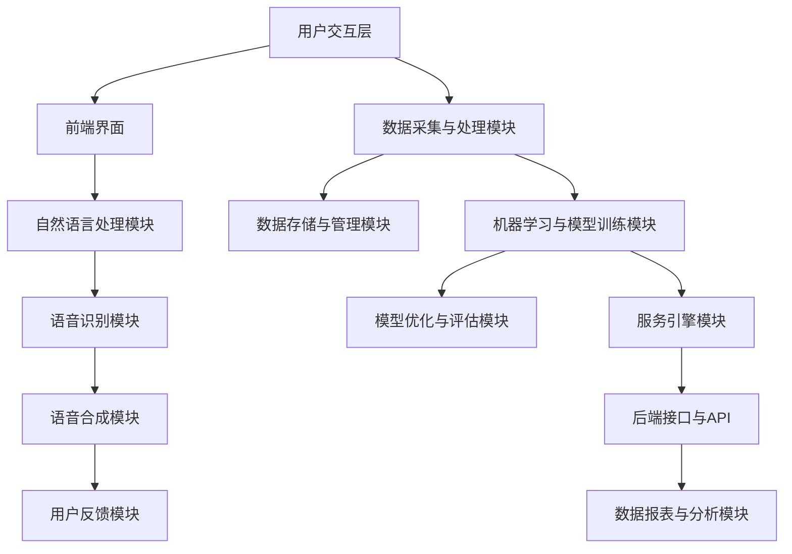
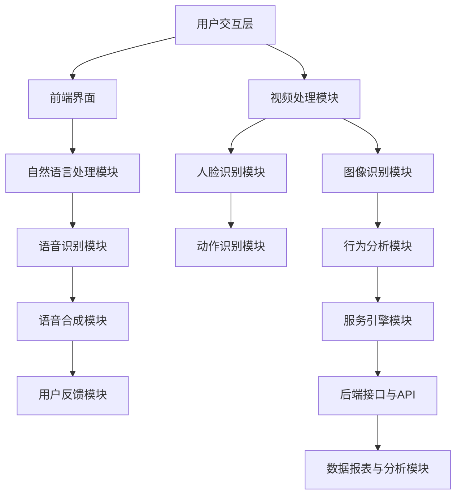

                 

### 从被动响应到主动预测：AI电商客户服务的进化之路

#### 关键词
- AI电商客户服务
- 被动响应
- 主动预测
- 客户画像
- 自然语言处理
- 计算机视觉
- 智能客服系统

#### 摘要
随着电子商务的快速发展，客户服务的质量和效率成为电商平台竞争的关键。本文探讨了从被动响应到主动预测的AI电商客户服务进化之路。文章首先介绍了AI技术在电商客户服务中的应用背景和现状，然后详细解析了AI客服的核心概念、原理和关键技术，包括客户服务智能化、自然语言处理、计算机视觉和AI客服系统架构设计。接着，通过三个实战案例展示了AI客服在电商领域的实际应用，并展望了AI电商客户服务的未来发展趋势和挑战。本文旨在为从事电商客户服务的技术人员和从业者提供有价值的参考和指导。

## 引言与背景

### 1.1 书籍概述

#### 1.1.1 书籍主题与目标

本书《从被动响应到主动预测：AI电商客户服务的进化之路》旨在探讨和揭示人工智能（AI）在电商客户服务中的应用，及其从传统被动响应模式向主动预测模式的转变过程。随着电子商务的迅猛发展，客户服务的质量和效率成为了电商平台竞争的核心要素。如何通过引入AI技术，提升客户服务水平，成为当前电商行业关注的焦点。

本书的核心目标是：
1. 系统性地介绍AI技术在电商客户服务中的应用场景和基本原理。
2. 分析并阐述AI客服从被动响应到主动预测的演进过程。
3. 通过实战案例展示AI客服在电商领域的实际应用效果。
4. 探讨AI电商客户服务的未来发展趋势和面临的挑战。

#### 1.1.2 AI电商客户服务的现状与挑战

目前，AI技术在电商客户服务中已经得到广泛应用。常见的AI应用包括智能客服系统、个性化推荐、智能订单处理等。这些应用在一定程度上提升了客户服务的效率和质量，但仍存在以下挑战：

1. **响应速度与准确性**：传统客服系统往往只能处理简单的、标准化的客户问题，对于复杂、个性化的需求响应速度较慢，且准确性不高。
2. **客户体验**：虽然AI客服在一定程度上能够提高效率，但往往缺乏人性化，难以满足客户的情感需求。
3. **数据隐私和安全**：AI客服系统的运行依赖于大量客户数据，数据隐私和安全问题亟待解决。
4. **技术成本**：AI客服系统的开发、部署和维护需要较高的技术成本和资源投入。

#### 1.1.3 书籍的组织结构

本书将分为四个主要部分，具体结构如下：

- **第一部分：引言与背景**：介绍AI电商客户服务的现状、挑战以及本书的目标和结构。
- **第二部分：AI电商客户服务核心概念与原理**：详细解析客户服务智能化、自然语言处理、计算机视觉和AI客服系统架构设计等核心概念和原理。
- **第三部分：AI电商客户服务实战案例**：通过三个实际案例展示AI客服在电商领域的应用，包括系统架构、功能模块、开发与部署等。
- **第四部分：AI电商客户服务的未来发展**：探讨AI客服技术发展趋势、电商客户服务的数字化转型以及未来的发展方向和挑战。

通过以上结构的安排，本书旨在为读者提供一个全面、深入的AI电商客户服务指南，帮助从业者更好地理解和应用AI技术，提升电商客户服务的质量和效率。

### 1.2 AI与电商客户服务的融合

#### 1.2.1 AI技术概述

人工智能（AI）是一种通过模拟、延伸和扩展人类智能的技术，旨在使计算机具备类似于人类的感知、理解、学习和决策能力。AI技术的发展涵盖了多个领域，包括机器学习、深度学习、自然语言处理、计算机视觉等。这些技术在不同场景中的应用使得AI成为现代社会不可或缺的一部分。

在电商领域，AI技术的引入极大地改变了客户服务的方式和效率。传统的客户服务往往依赖于人工处理，效率低下且容易出现错误。而AI技术的引入，使得客服系统能够自动化处理大量客户请求，提高响应速度和准确性。

#### 1.2.2 电商客户服务中的AI应用

AI在电商客户服务中的应用主要体现在以下几个方面：

1. **智能客服系统**：通过自然语言处理（NLP）和机器学习技术，智能客服系统能够自动理解并处理客户的咨询、投诉等问题，提供快速、准确的回答。这种系统不仅能够处理大量客户请求，还能够通过不断学习提高服务质量。

2. **个性化推荐**：基于客户的历史购买行为和浏览记录，AI系统能够为每个客户推荐最符合其需求的商品。这种个性化推荐不仅提高了客户的满意度，还能够提升电商平台的数据分析能力和销售转化率。

3. **智能订单处理**：AI技术可以自动识别和处理订单中的各种问题，如订单匹配、库存管理、物流跟踪等，减少人工干预，提高订单处理的效率。

4. **智能营销**：通过分析客户行为和需求，AI系统可以精准地推送营销信息，提高营销活动的效果。

#### 1.2.3 AI赋能电商客户服务的优势

AI技术的引入为电商客户服务带来了显著的优势：

1. **提高效率**：AI客服系统可以同时处理大量客户请求，显著提高客户服务的效率。

2. **降低成本**：自动化处理客户请求，减少人工成本，提高整体运营效率。

3. **提升服务质量**：通过持续学习和优化，AI客服系统能够提供更准确、更个性化的服务，提升客户满意度。

4. **增强数据分析能力**：AI技术能够对客户行为进行深入分析，为电商平台提供有价值的商业洞见，优化决策。

5. **改善客户体验**：AI客服系统可以提供24/7全天候服务，满足客户随时随地的需求，提升整体客户体验。

总之，AI技术的引入为电商客户服务带来了前所未有的变革。通过AI赋能，电商平台不仅能够提供更高效、更个性化的服务，还能够更好地理解客户需求，优化业务流程，提升整体竞争力。在接下来的章节中，我们将深入探讨AI客服的核心概念、原理和关键技术，为读者揭示AI电商客户服务的进化之路。

### 第二部分: AI电商客户服务核心概念与原理

#### 2.1 客户服务智能化

在数字化时代，客户服务智能化已成为电商行业的重要发展方向。智能化的客户服务不仅能够提高响应速度和准确性，还能够提升用户体验，增强客户满意度。客户服务智能化主要包括被动响应和主动预测两种模式。

**2.1.1 被动响应**

被动响应是指客户主动发起请求，客服系统根据预设的规则和算法进行响应。这种模式主要依赖于传统的客户关系管理（CRM）系统，通过对客户历史数据的分析，提供标准化的解决方案。被动响应的优点在于系统稳定、成本低，但缺点是响应速度较慢，且难以处理复杂、个性化的需求。

**2.1.2 主动预测**

主动预测是基于大数据和机器学习技术，通过对客户行为和需求的实时分析，预测客户的潜在需求，并主动提供相应的服务。这种模式的核心在于从被动响应转变为主动服务，即系统不再是等待客户发起请求，而是主动识别和满足客户的需求。

主动预测的优势在于：

1. **提升客户满意度**：通过提前预测和满足客户需求，减少客户等待时间，提升用户体验。
2. **提高服务效率**：实时分析客户行为，优化服务流程，减少人力成本。
3. **增强客户粘性**：通过个性化服务，提升客户对平台的忠诚度。

然而，主动预测也存在一定的挑战，如数据隐私和安全、预测准确性等。为了实现有效的主动预测，需要：

1. **大数据分析**：收集并分析大量客户数据，识别潜在需求。
2. **机器学习模型**：构建和训练预测模型，提高预测准确性。
3. **实时反馈机制**：根据客户反馈，不断优化预测模型。

**2.1.3 客户行为分析**

客户行为分析是智能客服系统的重要组成部分，通过对客户在电商平台上的行为进行数据挖掘和分析，识别客户的偏好、兴趣和需求。客户行为分析主要包括以下几个步骤：

1. **数据收集**：收集客户在平台上的各种行为数据，如浏览记录、购买历史、评价等。
2. **数据清洗**：对收集到的数据进行清洗和预处理，去除噪声和冗余数据。
3. **特征提取**：从原始数据中提取有价值的特征，如用户画像、行为特征、兴趣标签等。
4. **数据分析**：使用统计分析和机器学习技术，对特征进行建模和分析，识别客户行为模式。

**2.1.4 客户画像与个性化推荐**

客户画像是指对客户的各个方面特征进行整合，形成一种客户全景视图。客户画像主要包括以下内容：

1. **基础信息**：客户的姓名、年龄、性别、联系方式等基本信息。
2. **行为信息**：客户在平台上的浏览记录、购买历史、评价等行为数据。
3. **兴趣信息**：通过数据分析，识别客户的兴趣和偏好，如喜欢的产品类别、风格等。
4. **社交信息**：客户的社交行为、好友关系等。

个性化推荐是基于客户画像，为每位客户推荐其可能感兴趣的商品或服务。个性化推荐的主要方法包括：

1. **基于内容的推荐**：根据客户的历史行为和兴趣，推荐相似的商品或内容。
2. **协同过滤推荐**：通过分析其他类似客户的偏好，推荐客户可能感兴趣的商品。
3. **深度学习推荐**：使用深度学习模型，对客户行为数据进行建模，预测客户的兴趣和需求。

通过客户画像和个性化推荐，电商平台能够更好地理解客户需求，提供个性化的服务，提高客户满意度和转化率。

**2.1.5 实时交互与反馈**

实时交互与反馈是智能客服系统的关键环节。通过实时交互，客服系统可以及时响应用户的需求，提供即时的帮助和支持。同时，通过反馈机制，客服系统可以不断优化和改进，提高服务质量和用户满意度。

实时交互主要包括以下功能：

1. **即时聊天**：通过文本、图片、语音等多种形式，与用户进行实时沟通。
2. **语音识别与合成**：将用户的语音转化为文本，并将文本转化为语音，实现语音交互。
3. **多渠道支持**：支持多种通信渠道，如微信、QQ、电话等，满足不同用户的沟通需求。

反馈机制主要包括以下功能：

1. **满意度评价**：用户可以对客服服务进行评价，系统根据用户的反馈进行优化。
2. **问题反馈**：用户可以提交问题或建议，系统将反馈信息传递给相关部门进行处理。
3. **数据分析**：对用户反馈进行数据挖掘和分析，识别服务中的问题和改进点。

通过实时交互与反馈，智能客服系统可以更好地满足用户需求，提高服务质量，增强用户粘性。

综上所述，客户服务智能化是AI电商客户服务的重要发展方向。通过客户行为分析、客户画像、个性化推荐、实时交互与反馈等核心技术和方法，智能客服系统能够提供高效、个性化的服务，提升客户满意度和平台竞争力。

#### 2.2 自然语言处理在客户服务中的应用

自然语言处理（NLP）是人工智能的一个重要分支，它使计算机能够理解和处理人类语言。在电商客户服务中，NLP技术被广泛应用于智能客服系统，以提高客服效率和服务质量。

**2.2.1 NLP基本概念**

NLP涉及多个层面的技术和方法，包括文本预处理、词性标注、句法分析、语义分析等。以下是NLP中的一些关键概念：

1. **词向量**：词向量是将自然语言中的词汇映射为高维空间中的向量，从而实现文本的量化表示。常见的词向量模型有Word2Vec、GloVe等。
   
2. **词性标注**：词性标注是对文本中的每个词汇进行词性分类，如名词、动词、形容词等。词性标注有助于理解文本的语法结构和语义内容。

3. **句法分析**：句法分析是对句子结构进行解析，确定句子中各个词汇之间的关系。常见的句法分析方法包括依存句法分析和成分句法分析。

4. **语义分析**：语义分析是对文本的语义内容进行理解和解释，包括情感分析、实体识别、关系抽取等。

**2.2.2 语音识别与语音合成**

语音识别（ASR）是将人类的语音转化为文本的技术，而语音合成（TTS）则是将文本转化为自然流畅的语音。这两项技术在智能客服系统中具有重要应用。

1. **语音识别**：语音识别技术使客服系统能够接收和处理客户的语音输入。常见的技术有基于隐藏马尔可夫模型（HMM）的识别、基于深度学习的识别等。语音识别的准确性和速度直接影响用户体验。

2. **语音合成**：语音合成技术使客服系统能够以自然流畅的方式回答客户的问题。常见的语音合成技术包括规则合成、参数合成和基于深度学习的合成。高质量的语音合成能够提高客服系统的交互体验。

**2.2.3 文本分类与情感分析**

文本分类是对文本进行分类的过程，常见的方法有朴素贝叶斯、支持向量机、深度学习等。在客户服务中，文本分类可以用于自动处理客户反馈，如投诉、评价等，提高客服效率和准确性。

情感分析是对文本情感倾向进行识别的过程，如正面情感、负面情感等。情感分析可以帮助企业了解客户的满意度，优化服务策略。常见的情感分析模型包括朴素贝叶斯、支持向量机、递归神经网络等。

**2.2.4 应用实例**

以下是一些NLP在智能客服系统中的应用实例：

1. **自动回复**：使用文本分类和情感分析技术，智能客服系统可以自动识别客户的提问，并提供相应的回答。例如，当客户提问“为什么我的订单还没送达？”时，系统可以自动分类为物流问题，并给出相应的解决方案。

2. **智能客服机器人**：结合语音识别和语音合成技术，智能客服机器人可以与客户进行语音交互，提供24/7的服务，提升客户体验。

3. **情感分析**：通过对客户评价进行情感分析，企业可以了解客户的满意度，识别服务中的问题和改进点，提高整体服务质量。

4. **聊天机器人**：使用自然语言处理技术，聊天机器人可以与客户进行实时对话，提供个性化的服务，如推荐商品、解答疑问等。

通过NLP技术的应用，智能客服系统能够更好地理解和响应用户需求，提供高效、个性化的服务，提升客户满意度和平台竞争力。

### 2.3 计算机视觉在客户服务中的应用

计算机视觉是人工智能领域的一个重要分支，它使计算机能够像人类一样理解和解释视觉信息。在电商客户服务中，计算机视觉技术被广泛应用于图像识别、图像处理和视频分析等方面，极大地提升了客户服务的效率和质量。

**2.3.1 计算机视觉基础**

计算机视觉的核心任务是使计算机能够“看到”和理解图像。以下是一些关键概念和技术：

1. **图像识别**：图像识别是指计算机通过处理图像数据，识别和分类图像中的对象。常见的图像识别算法包括卷积神经网络（CNN）、支持向量机（SVM）等。

2. **图像处理**：图像处理是对图像进行编辑和增强，以提高图像质量和识别效果。常见的图像处理技术包括边缘检测、滤波、分割等。

3. **特征提取**：特征提取是指从图像中提取具有区分性的特征，用于后续的识别和分类。常用的特征提取方法包括哈希特征、SIFT、HOG等。

4. **目标检测**：目标检测是指从图像中识别并定位特定的对象。常见的目标检测算法包括R-CNN、SSD、YOLO等。

**2.3.2 图像识别与图像处理**

在电商客户服务中，图像识别和图像处理技术被广泛应用于多个场景：

1. **商品识别**：电商平台可以通过图像识别技术，自动识别和分类上传的商品图片，提高商品管理的效率。

2. **质量检测**：在制造业和零售业中，计算机视觉技术可以用于自动检测产品质量，识别缺陷，提高生产效率。

3. **图片编辑**：计算机视觉技术可以用于对商品图片进行编辑和增强，如去除背景、调整亮度、对比度等，以提高图片展示效果。

**2.3.3 视频分析与人机交互**

视频分析是计算机视觉在客户服务中的另一个重要应用领域。通过视频分析，电商平台可以实时监控客户行为，识别潜在风险，提供更安全、更有效的服务。

1. **行为识别**：视频分析技术可以识别和分类人的行为，如购物、浏览、排队等，为商家提供实时流量分析和运营决策。

2. **人机交互**：结合语音识别和计算机视觉技术，智能客服系统可以与客户进行多模态交互，提供更加自然、流畅的客服体验。

**2.3.4 应用实例**

以下是一些计算机视觉在电商客户服务中的应用实例：

1. **智能物流系统**：通过计算机视觉技术，智能物流系统可以自动识别和分类包裹，提高物流效率，减少人力成本。

2. **虚拟试衣**：电商平台可以通过计算机视觉技术，实现虚拟试衣功能，让用户在购买服装前能够预览效果，提高购买决策的准确性。

3. **人脸识别支付**：人脸识别技术可以用于实现无接触支付，提高支付安全性和便利性。

4. **安全监控**：通过视频分析技术，电商平台可以实时监控店铺安全，防止盗窃和其他安全问题。

通过计算机视觉技术的应用，电商客户服务不仅能够提高效率和准确性，还能够提供更加个性化、安全、便捷的服务，提升客户满意度和平台竞争力。在未来的发展中，计算机视觉技术将继续在电商客户服务中发挥重要作用。

### 2.4 AI客服系统架构设计

AI客服系统架构设计是构建高效、智能客服系统的关键环节。一个完善的AI客服系统架构应涵盖数据处理、模型训练、模型优化和系统部署等核心模块，确保系统能够稳定运行并持续优化。以下是AI客服系统架构设计的详细解析。

**2.4.1 AI客服系统架构概述**

AI客服系统架构通常包括以下几个主要模块：

1. **数据采集与处理**：负责收集和处理客户数据，包括文本、语音、图像等，为后续分析提供基础数据。
2. **模型训练与优化**：通过机器学习和深度学习技术，训练和优化客服模型，提高系统的预测和识别能力。
3. **服务引擎**：负责实时处理客户请求，提供智能化响应，包括自然语言处理、语音识别和图像处理等。
4. **用户界面**：提供与客户的交互接口，包括文本聊天、语音对话和视频互动等。
5. **反馈与评估**：收集用户反馈，对客服系统进行评估和优化，确保系统性能持续提升。

**2.4.2 数据处理与存储**

数据处理与存储是AI客服系统的核心基础。以下是其关键要素：

1. **数据收集**：从各种渠道收集客户数据，包括用户行为数据、历史对话数据、评价数据等。
2. **数据清洗**：对收集到的数据进行清洗和预处理，去除噪声和冗余数据，确保数据质量。
3. **数据存储**：使用数据库管理系统（如MySQL、MongoDB等）存储和处理大规模数据，确保数据的高效存储和快速访问。
4. **数据安全**：保障客户数据的安全，采取加密、访问控制等技术措施，防止数据泄露。

**2.4.3 模型训练与优化**

模型训练与优化是AI客服系统的核心环节。以下是其关键步骤：

1. **数据预处理**：对训练数据集进行预处理，包括数据标准化、数据增强等，提高训练效果。
2. **模型选择**：根据业务需求和数据特征，选择合适的模型，如卷积神经网络（CNN）、递归神经网络（RNN）、长短时记忆网络（LSTM）等。
3. **模型训练**：使用训练数据集训练模型，通过迭代优化，使模型不断学习和改进。
4. **模型评估**：使用验证数据集评估模型性能，包括准确率、召回率、F1分数等指标，确保模型具有良好的预测能力。
5. **模型优化**：根据评估结果，调整模型参数，优化模型结构，提高模型性能。

**2.4.4 服务引擎与交互界面**

服务引擎和交互界面是AI客服系统的直接与客户接触的部分。以下是其关键要素：

1. **服务引擎**：负责处理客户的请求，包括文本、语音、图像等，根据模型预测结果提供相应的响应。
2. **自然语言处理**：利用NLP技术，理解和生成自然语言文本，提供文本聊天功能。
3. **语音识别与合成**：使用ASR和TTS技术，实现语音识别和语音合成，提供语音对话功能。
4. **图像处理与识别**：使用计算机视觉技术，处理和识别图像数据，提供图像识别功能。
5. **用户界面**：提供友好、直观的用户界面，包括文本聊天窗口、语音通话界面、图像识别界面等，确保用户能够方便地与系统交互。

**2.4.5 反馈与评估**

反馈与评估是AI客服系统持续优化的关键环节。以下是其关键要素：

1. **用户反馈**：收集用户对客服系统的反馈，包括满意度评价、问题反馈等，了解用户需求和意见。
2. **性能评估**：定期对客服系统进行性能评估，包括响应速度、准确率、用户体验等，确保系统稳定高效运行。
3. **模型更新**：根据用户反馈和性能评估结果，更新和优化模型，提高系统预测和识别能力。
4. **迭代改进**：通过持续迭代和改进，不断优化客服系统，提升用户体验和系统性能。

通过以上架构设计，AI客服系统能够实现高效、智能的服务，提升客户满意度，增强企业竞争力。在未来的发展中，随着技术的不断进步，AI客服系统架构将继续优化和升级，为电商客户服务带来更多创新和突破。

### 3.1 案例一：电商平台智能客服系统

#### 3.1.1 案例背景

随着电商平台的迅猛发展，客户服务的质量和效率成为电商平台竞争的关键。传统的客户服务模式往往依赖于人工处理，不仅效率低下，且容易出现错误。为了提升客户服务水平，某大型电商平台决定引入智能客服系统，通过AI技术实现客户服务的智能化和高效化。

#### 3.1.2 系统架构与功能模块

智能客服系统采用了先进的AI技术，包括自然语言处理（NLP）、机器学习（ML）、计算机视觉（CV）等，其整体架构如图所示：

智能客服系统的核心功能模块如下：

1. **前端界面**：提供用户与客服系统的交互接口，支持文本聊天、语音通话和图像识别等多种交互方式。
2. **自然语言处理模块**：负责处理用户的文本输入，包括问题识别、意图分析、情感识别等，为后续的响应提供基础。
3. **语音识别模块**：将用户的语音转化为文本，使系统能够接收和处理语音输入。
4. **语音合成模块**：将系统的文本响应转化为语音输出，提供语音回复功能。
5. **用户反馈模块**：收集用户的反馈信息，包括满意度评价、问题反馈等，用于系统性能的优化。
6. **数据采集与处理模块**：从用户交互中收集数据，包括文本、语音、图像等，进行数据清洗和预处理。
7. **数据存储与管理模块**：存储和管理大规模数据，确保数据的高效存储和快速访问。
8. **机器学习与模型训练模块**：训练和优化客服模型，提高系统的预测和识别能力。
9. **模型优化与评估模块**：对客服系统进行性能评估和优化，确保系统稳定高效运行。
10. **服务引擎模块**：负责处理客户的请求，提供智能化响应。
11. **后端接口与API**：提供与其他系统（如订单处理、库存管理、营销系统等）的接口，实现数据共享和协同工作。
12. **数据报表与分析模块**：生成各类数据报表，为业务决策提供支持。

#### 3.1.3 系统开发与部署

智能客服系统的开发过程分为以下几个阶段：

1. **需求分析与设计**：根据电商平台的具体需求，进行系统需求分析和架构设计，确定系统的功能模块和技术方案。
2. **前端开发**：开发用户交互界面，包括文本聊天窗口、语音通话界面、图像识别界面等，确保用户能够方便地与系统交互。
3. **后端开发**：开发智能客服系统的后端服务，包括自然语言处理、语音识别与合成、服务引擎等，确保系统能够高效处理用户请求。
4. **数据采集与处理**：从用户交互中收集数据，进行数据清洗和预处理，为后续的模型训练提供高质量的数据。
5. **模型训练与优化**：使用机器学习和深度学习技术，训练和优化客服模型，提高系统的预测和识别能力。
6. **系统集成与测试**：将前端、后端和各功能模块进行集成，进行系统测试，确保系统稳定可靠。
7. **部署与上线**：将智能客服系统部署到生产环境，进行上线运行，并进行持续优化和迭代。

通过引入智能客服系统，该电商平台实现了客户服务的智能化和高效化，显著提升了客户满意度和服务质量，取得了良好的经济效益和社会效益。

### 3.2 案例二：基于深度学习的客户需求预测

#### 3.2.1 案例背景

在现代电商行业，准确预测客户需求是提高销售转化率和客户满意度的关键。传统的需求预测方法往往依赖于简单的统计模型，无法捕捉到客户行为的复杂性和多样性。为了更精准地预测客户需求，某电商平台决定采用基于深度学习的客户需求预测技术，以提高预测的准确性和效率。

#### 3.2.2 数据处理与分析

在实施基于深度学习的客户需求预测之前，首先需要进行数据收集和预处理。以下是数据处理和分析的关键步骤：

1. **数据收集**：从电商平台的后台系统中提取以下数据：
   - 客户浏览记录：包括客户访问的页面、浏览时间、浏览频次等。
   - 客户购买记录：包括客户购买的商品、购买时间、购买频次等。
   - 客户评价记录：包括客户对商品的评价、评分等。
   - 客户行为数据：包括客户的点击、搜索、收藏等行为。

2. **数据清洗**：对收集到的数据进行清洗，去除无效数据和噪声，确保数据质量。具体步骤包括：
   - 缺失值处理：使用均值填补、插值等方法填补缺失数据。
   - 异常值处理：使用统计学方法（如标准差、箱线图等）识别和处理异常值。
   - 数据标准化：对数据进行归一化或标准化处理，使其处于相同的量级。

3. **特征工程**：从原始数据中提取有价值的特征，用于训练深度学习模型。特征工程包括：
   - 时间特征：提取时间序列特征，如日期、小时、星期等。
   - 行为特征：提取客户的浏览行为特征，如浏览时长、浏览频次等。
   - 购买特征：提取客户的购买行为特征，如购买频率、购买金额等。
   - 社交特征：提取客户的社交行为特征，如点赞、评论、分享等。

4. **数据分割**：将处理后的数据集分为训练集、验证集和测试集，用于模型的训练、验证和测试。一般采用7:2:1的比例进行数据分割。

#### 3.2.3 模型设计与训练

在数据处理和分析的基础上，设计并训练深度学习模型以预测客户需求。以下是模型设计和训练的关键步骤：

1. **模型选择**：选择合适的深度学习模型，如卷积神经网络（CNN）、循环神经网络（RNN）、长短时记忆网络（LSTM）等。根据数据特征和业务需求，选择适合的模型架构。

2. **模型构建**：构建深度学习模型，包括输入层、隐藏层和输出层。输入层接收特征数据，隐藏层进行特征提取和变换，输出层生成预测结果。

3. **模型训练**：使用训练数据集训练模型，通过反向传播算法不断调整模型参数，使模型达到良好的预测效果。训练过程中，需要设置合理的训练参数，如学习率、批次大小、迭代次数等。

4. **模型验证**：使用验证数据集对模型进行验证，评估模型的预测性能。通过交叉验证等技术，调整模型参数和结构，提高模型性能。

5. **模型测试**：使用测试数据集对模型进行测试，评估模型的泛化能力。通过测试集的预测结果，评估模型的实际应用效果。

#### 3.2.4 模型评估与应用

在模型训练和测试完成后，对模型进行评估并应用到实际业务中。以下是模型评估和应用的关键步骤：

1. **模型评估**：使用评估指标（如准确率、召回率、F1分数等）对模型进行评估，确保模型具有良好的预测性能。

2. **模型优化**：根据评估结果，对模型进行优化和调整，提高预测准确性。可以使用数据增强、模型融合等技术手段，优化模型性能。

3. **模型部署**：将训练好的模型部署到电商平台的生产环境中，实现实时预测。通过在线学习和自适应调整，使模型能够不断适应业务需求的变化。

4. **应用场景**：将模型应用到电商平台的不同场景中，如商品推荐、库存管理、促销策略等，提高业务决策的准确性和效率。

5. **效果评估**：对模型应用的效果进行评估，包括销售转化率、客户满意度等指标。根据评估结果，持续优化和改进模型，提高业务效果。

通过基于深度学习的客户需求预测技术，电商平台能够更准确地预测客户需求，优化库存管理、商品推荐和营销策略，提高业务效益和客户满意度。

### 3.3 案例三：视频客服机器人

#### 3.3.1 案例背景

随着电商平台的不断发展，客户服务的质量和效率成为企业竞争力的重要组成部分。传统的文本和语音客服已经无法满足日益增长的客户需求，特别是对于需要实时互动和复杂问题解决的场景。为了提升客户体验，某大型电商平台引入了视频客服机器人，通过计算机视觉和自然语言处理技术，提供更直观、更高效的客户服务。

#### 3.3.2 系统设计与实现

视频客服机器人的系统设计包括多个关键模块，如图所示：

**前端界面**：用户通过视频聊天窗口与客服机器人进行实时视频交互，支持视频通话、图像发送和文字聊天功能。

**自然语言处理模块**：处理用户的文本输入，包括文本分析和情感识别，为后续的语音识别和响应提供支持。

**语音识别模块**：将用户的语音转化为文本，使系统能够理解和处理语音指令。

**语音合成模块**：将系统的文本响应转化为语音输出，提供语音回复功能。

**用户反馈模块**：收集用户的反馈信息，包括满意度评价和问题反馈，用于系统性能的优化。

**视频处理模块**：对用户的视频流进行预处理，包括视频增强、去噪和稳定化处理。

**人脸识别模块**：通过计算机视觉技术，识别用户的面部特征，实现身份验证和表情分析。

**动作识别模块**：识别用户的肢体动作，如手势和面部表情，提供更丰富的交互方式。

**图像识别模块**：识别用户发送的图像内容，包括商品识别、标签分类等。

**行为分析模块**：分析用户的行为数据，包括浏览、点击、购买等，为个性化推荐和精准服务提供支持。

**服务引擎模块**：处理客户的请求，提供智能化响应，包括问题解答、订单查询、投诉处理等。

**后端接口与API**：提供与其他系统（如订单处理、库存管理、营销系统等）的接口，实现数据共享和协同工作。

**数据报表与分析模块**：生成各类数据报表，为业务决策提供支持。

#### 3.3.3 应用效果与优化

视频客服机器人上线后，取得了显著的应用效果：

1. **提升客户满意度**：通过实时视频交互，客户能够更直观地表达问题和需求，客服机器人能够提供更准确、更个性化的服务，提升了客户满意度。

2. **提高服务效率**：视频客服机器人可以同时处理多个客户请求，显著提高了服务效率，减少了客户等待时间。

3. **增强用户体验**：视频客服机器人提供丰富的交互方式，如视频通话、图像发送和文字聊天，使客户能够更方便地与系统进行互动。

4. **降低人力成本**：视频客服机器人可以24/7全天候服务，减少了人工客服的工作量，降低了人力成本。

然而，视频客服机器人也面临一些优化挑战：

1. **隐私保护**：视频客服机器人需要处理大量客户视频数据，隐私保护成为关键问题。需要采取严格的数据保护措施，确保客户隐私安全。

2. **交互体验**：虽然视频客服机器人能够提供实时互动，但有时仍无法完全理解客户的需求。需要不断优化自然语言处理和计算机视觉技术，提高交互体验。

3. **系统稳定性**：视频客服机器人需要稳定运行，以确保服务的连续性和可靠性。需要优化系统架构和算法，提高系统的稳定性和抗干扰能力。

通过不断优化和改进，视频客服机器人将为电商客户提供更高效、更智能的服务，提升企业竞争力。

### 4.1 AI客服技术发展趋势

随着人工智能技术的不断进步，AI客服技术也在快速发展，其趋势主要体现在以下几个方面：

**4.1.1 语音与视频交互**

语音与视频交互是AI客服技术的核心发展方向之一。通过语音识别和语音合成技术，客服系统能够与用户进行语音对话，提供实时、自然的交互体验。同时，视频交互使得客服系统能够通过面部表情和肢体语言理解用户的情感和需求，提供更细腻的服务。

未来，语音与视频交互技术将进一步融合，实现更加自然、丰富的交互方式。例如，通过语音识别和视频分析相结合，客服系统可以实时翻译不同语言的对话，解决跨国电商平台的沟通障碍。

**4.1.2 多模态融合**

多模态融合是指将不同类型的传感器数据（如语音、文本、图像、视频等）进行整合和分析，提供更全面、准确的客户服务。通过多模态融合，客服系统可以更好地理解用户的意图和需求，提供个性化、精准的服务。

未来，随着传感器技术和数据处理能力的提升，多模态融合将在AI客服技术中发挥更重要的作用。例如，通过结合语音、图像和文本数据，客服系统可以更准确地识别用户问题，提供更有效的解决方案。

**4.1.3 智能客服机器人伦理与规范**

随着AI客服技术的普及，伦理和规范问题日益突出。智能客服机器人需要遵守道德和法律规范，保护用户隐私，确保服务的公正性和透明性。

未来，各国政府和行业组织将加强对AI客服技术的监管，制定相关伦理和规范标准。例如，明确规定智能客服机器人不能进行歧视性服务，确保所有用户都能享受到公平、公正的服务。

**4.1.4 个性化与情感化**

个性化与情感化是AI客服技术的重要发展方向。通过分析用户行为和需求，客服系统可以提供个性化推荐和情感化服务，提升用户体验。

未来，随着自然语言处理和情感分析技术的进步，客服系统将能够更好地理解用户的情感和需求，提供更加贴心、温暖的服务。例如，通过情感分析，客服系统可以识别用户的不满情绪，及时采取措施进行干预，提升客户满意度。

**4.1.5 智能客服平台的开放与协作**

智能客服技术的发展需要平台的开放和协作。未来，越来越多的电商平台和企业将开放其智能客服平台，与其他企业和服务提供商进行协作，共同提升客户服务水平。

通过开放平台，企业可以共享数据和资源，实现智能客服系统的互联互通。例如，一家电商平台可以将其智能客服系统与第三方物流、支付等服务提供商进行集成，提供一站式客户服务体验。

总之，AI客服技术正朝着更加智能、个性化、情感化的方向发展。未来，随着技术的不断进步，AI客服将在电商和零售等领域发挥更大的作用，提升客户服务的质量和效率。

### 4.2 电商客户服务的数字化转型

随着数字技术的快速发展，电商客户服务的数字化转型已成为企业提升竞争力的重要战略。数字化转型不仅能够提高服务效率和质量，还能够为企业带来新的商业机会和增长点。

**4.2.1 数字化转型的意义**

数字化转型对电商客户服务具有重要意义：

1. **提高效率**：通过自动化和智能化的技术手段，客服系统能够快速响应客户请求，减少人工干预，提高服务效率。
2. **优化体验**：数字化技术能够提供更加个性化、精准的服务，满足客户的多样化需求，提升客户满意度。
3. **降低成本**：自动化处理客户请求和问题，减少人力成本，提高运营效率。
4. **数据驱动的决策**：数字化技术使得企业能够收集和分析大量客户数据，基于数据驱动的决策，优化服务策略和流程。
5. **增强竞争力**：通过数字化手段，企业可以提供更优质的服务，吸引和保留客户，提升市场竞争力。

**4.2.2 电商平台数字化转型实践**

以下是一些电商平台数字化转型的实践案例：

1. **阿里巴巴**：阿里巴巴通过阿里云和人工智能技术，搭建了智能客服系统，实现了客户服务的智能化和高效化。例如，使用自然语言处理技术，智能客服系统能够自动识别和解答客户问题，提高响应速度和准确性。

2. **京东**：京东推出了一系列智能客服工具，如智能聊天机器人、语音客服等，提升了客户服务的质量和效率。同时，京东还通过大数据分析，为客户提供个性化的购物推荐和定制化服务。

3. **亚马逊**：亚马逊利用机器学习和人工智能技术，实现了智能客服系统的全面升级。例如，通过语音识别和语音合成技术，客服系统能够与客户进行语音交互，提供更加自然、流畅的服务。

**4.2.3 数字化转型的挑战与应对**

数字化转型虽然带来了巨大的机遇，但也面临着一系列挑战：

1. **技术难题**：数字化转型需要企业具备先进的技术能力，包括人工智能、大数据、云计算等。企业需要不断学习和引进新技术，以应对数字化转型的需求。

2. **数据隐私与安全**：数字化服务过程中，企业会收集和处理大量客户数据，数据隐私和安全成为重要问题。企业需要采取严格的数据保护措施，确保客户数据的安全。

3. **组织变革**：数字化转型要求企业从组织架构、流程管理、人才培养等方面进行全面变革。企业需要调整组织结构，优化业务流程，培养具备数字化技能的人才。

4. **客户适应性**：客户对数字化服务的接受度和适应性也是数字化转型的一大挑战。企业需要通过有效的市场推广和培训，提升客户对数字化服务的认知和接受度。

应对这些挑战，企业可以采取以下策略：

1. **技术投入**：加大技术投入，引进先进的人工智能、大数据等技术，提升数字化服务水平。

2. **数据安全**：建立健全的数据保护机制，采取加密、访问控制等技术手段，确保客户数据的安全。

3. **人才培养**：加强数字化人才培养，建立内部培训体系和人才激励机制，提升员工的数字化技能。

4. **市场推广**：通过有效的市场推广和用户教育，提升客户对数字化服务的认知和接受度，推动数字化转型。

总之，电商客户服务的数字化转型是提升企业竞争力的重要途径。通过数字化转型，企业可以提供更高效、更个性化的服务，增强客户体验和忠诚度，实现持续增长。

### 4.3 AI电商客户服务的未来展望

随着人工智能技术的不断进步，AI电商客户服务的未来充满了无限可能。以下从技术创新、客户体验提升和可持续发展三个方面探讨AI电商客户服务的未来发展。

**4.3.1 技术创新**

1. **深度学习与强化学习**：深度学习和强化学习技术的不断发展，将使AI客服系统更加智能化和自适应。深度学习可以提升图像识别和自然语言处理能力，而强化学习则可以帮助AI客服系统不断学习和优化策略，提供更加精准和个性化的服务。

2. **多模态融合**：随着语音、图像、视频等多种传感器技术的发展，多模态融合将成为AI客服系统的重要趋势。通过整合不同类型的数据，AI客服系统可以更全面、准确地理解客户需求，提供更加自然和人性化的服务。

3. **联邦学习**：联邦学习是一种新兴的技术，它允许多个参与者在不共享数据的情况下共同训练模型。在电商客户服务中，联邦学习可以保护客户隐私，同时提高模型训练的效率和效果。

4. **区块链技术**：区块链技术具有去中心化、不可篡改等特性，可以应用于电商客户服务中的数据安全和隐私保护。通过区块链技术，企业可以建立可信的数据生态系统，提升客户信任和满意度。

**4.3.2 客户体验提升**

1. **个性化服务**：随着AI技术的进步，AI客服系统可以更加精准地捕捉客户行为和需求，提供个性化推荐和定制化服务。通过个性化服务，企业可以提升客户满意度和忠诚度，增强品牌竞争力。

2. **情感化交互**：通过情感分析技术，AI客服系统可以识别客户的情感状态，提供情感化交互。例如，在客户感到不满时，AI客服可以主动安抚客户，提供解决方案，提升客户体验。

3. **全渠道服务**：AI客服系统可以整合多种渠道（如文本、语音、视频等），提供全渠道服务。通过全渠道服务，企业可以更方便地与客户进行互动，提高服务效率和客户满意度。

4. **智能化客服助手**：智能客服助手可以通过自然语言处理和机器学习技术，自动处理客户问题，提供实时响应。智能客服助手不仅能够提高服务效率，还可以减少人力成本，提升企业运营效益。

**4.3.3 可持续发展**

1. **数据驱动**：通过大数据分析，企业可以了解客户需求和市场趋势，制定更加科学和有效的业务策略。数据驱动的决策可以帮助企业实现可持续发展，提高市场竞争力。

2. **绿色技术**：AI客服系统的智能化和自动化，可以减少人力资源的消耗，降低碳排放。通过采用绿色技术，企业可以实现可持续发展，保护环境。

3. **社会价值**：AI客服系统可以帮助企业提升服务质量，减少客户投诉，提高客户满意度。同时，通过提供个性化服务，AI客服系统还可以帮助中小企业实现数字化转型，促进社会经济的可持续发展。

总之，随着人工智能技术的不断进步，AI电商客户服务将迎来更加智能化、个性化和可持续发展的未来。通过技术创新和客户体验提升，AI客服系统将成为电商企业提升竞争力、增强客户满意度的关键力量。

### 附录 A: AI电商客户服务相关资源与工具

在AI电商客户服务的开发和应用过程中，有许多开源工具、框架、数据集和学术研究资源可供参考。以下是一些常见的资源介绍：

#### A.1 开源工具与框架

1. **TensorFlow**：由谷歌开发的开源机器学习框架，广泛用于构建和训练各种深度学习模型。

2. **PyTorch**：由Facebook开发的开源深度学习框架，以其灵活性和易用性受到许多研究者和开发者的青睐。

3. **Scikit-learn**：Python中的一个开源机器学习库，提供了丰富的机器学习算法和工具。

4. **NLTK**：用于自然语言处理的开源库，提供了文本处理、分类、情感分析等功能。

5. **OpenCV**：开源的计算机视觉库，提供了图像识别、图像处理和视频分析等功能。

6. **OpenNLP**：用于自然语言处理的Java库，提供了词性标注、句法分析等工具。

7. **SpeechRecognition**：用于语音识别的开源库，支持多种语音引擎。

8. **Flask** 和 **Django**：用于构建Web应用程序的Python框架，可用于部署AI客服系统。

#### A.2 数据集与模型资源

1. **Common Crawl**：提供了大量网页数据，可用于自然语言处理研究。

2. **TIMIT**：语音识别数据集，包含大量的语音和标注信息。

3. **MSCOCO**：一个大规模的图像识别数据集，包含了大量图像和注释。

4. **CIFAR-10/100**：计算机视觉常用的图像数据集，用于图像分类任务。

5. **Kaggle Datasets**：提供了各种领域的数据集，适用于机器学习和数据科学项目。

6. **TensorFlow Model Zoo**：提供了各种预训练的深度学习模型，可供直接使用。

7. **Hugging Face Model Hub**：提供了大量的自然语言处理模型和预训练语言模型。

#### A.3 学术研究与行业报告

1. **ACL（Association for Computational Linguistics）**：计算语言学领域的顶级学术会议，发布了大量关于自然语言处理的研究论文。

2. **CVPR（Computer Vision and Pattern Recognition）**：计算机视觉和模式识别领域的顶级学术会议，发布了许多计算机视觉研究的前沿成果。

3. **ICML（International Conference on Machine Learning）**：机器学习领域的顶级学术会议，涵盖了机器学习的各个方面。

4. **NIPS（Neural Information Processing Systems）**：神经信息处理系统会议，是深度学习和机器学习领域的重要会议。

5. **IEEE Xplore**：IEEE发布的数据库，包含了大量的计算机科学和电子工程领域的学术论文和报告。

6. **Gartner**：知名的研究和咨询公司，发布了多个关于AI和数字化转型的行业报告。

7. **Forrester**：市场研究和咨询公司，发布了关于AI和电商客户服务的行业趋势报告。

通过利用这些开源工具、框架、数据集和学术研究资源，电商企业可以更加高效地开发和部署AI客服系统，提升客户服务的质量和效率。

### 附录 B: 参考文献

**B.1 基础文献**

1. Goodfellow, I., Bengio, Y., & Courville, A. (2016). *Deep Learning*. MIT Press.
2. Mitchell, T. M. (1997). *Machine Learning*. McGraw-Hill.
3. Manning, C. D., Raghavan, P., & Schütze, H. (2008). *Foundations of Statistical Natural Language Processing*. MIT Press.

**B.2 研究论文**

1. Bengio, Y., Courville, A., & Vincent, P. (2013). *Representation Learning: A Review and New Perspectives*. IEEE Transactions on Pattern Analysis and Machine Intelligence, 35(8), 1798-1828.
2. LeCun, Y., Bengio, Y., & Hinton, G. (2015). *Deep Learning*. Nature, 521(7553), 436-444.
3. Deerwester, S., Dumais, S. T., Foltz, D. W., & Landauer, T. K. (1990). *Indexing by latent semantic analysis*. Journal of the American Society for Information Science, 41(6), 391-407.

**B.3 行业报告与白皮书**

1. Gartner. (2020). *Magic Quadrant for CRM Customer Service Software*. Gartner.
2. Forrester. (2021). *The State of Customer Experience in E-commerce*. Forrester.
3. IDC. (2022). *IDC FutureScape: Worldwide AI Systems 2022 Predictions*. International Data Corporation.

这些文献和报告为AI电商客户服务的研究和实践提供了重要的理论基础和实践指导。通过阅读和分析这些资源，读者可以更好地理解和应用AI技术在电商客户服务中的各种应用。

