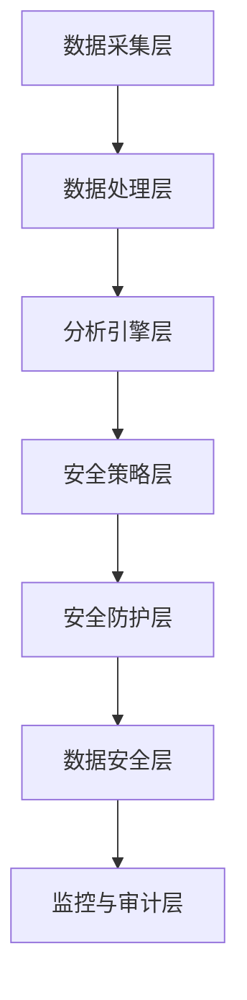

                 

## 文章标题：从被动防御到主动预警：AI重塑电商平台安全体系的技术方案

### 关键词：AI、电商平台、安全、主动预警、技术方案

#### 摘要：

本文旨在探讨人工智能（AI）如何通过主动预警技术重塑电商平台的网络安全体系。首先，我们将回顾电商平台面临的安全挑战，并阐述AI在提升安全防护能力方面的优势。接着，文章将深入分析AI技术的核心概念与架构，并详细解释其在异常行为检测、数据安全与隐私保护、账号安全与欺诈检测以及供应链安全监控等方面的应用。最后，文章将结合实际案例，展示AI电商平台安全体系的搭建与实施过程，并展望未来的发展趋势与挑战。

---

### 引言

随着互联网和电子商务的迅猛发展，电商平台已经成为人们日常生活中不可或缺的一部分。然而，随之而来的网络安全问题也日益严峻。传统的网络安全策略大多依赖于被动防御措施，如防火墙、入侵检测系统等，这些措施在应对日益复杂的网络攻击时往往显得力不从心。为了提高电商平台的整体安全性，迫切需要引入更先进的技术手段，其中人工智能（AI）无疑是一个强有力的工具。

AI技术在电商平台安全中的应用主要集中在以下几个方面：

1. **异常行为检测**：通过机器学习和深度学习算法，实时监控用户行为，发现潜在的异常行为，并提前预警。
2. **数据安全与隐私保护**：利用加密算法和安全多方计算等技术，确保用户数据在传输和存储过程中的安全性。
3. **账号安全与欺诈检测**：通过构建用户行为模型和欺诈检测模型，识别并阻止恶意账号和欺诈行为。
4. **供应链安全监控**：利用区块链技术和智能合约，确保供应链数据的透明性和不可篡改性。

本文将逐步深入探讨AI技术在电商平台安全中的应用，旨在为相关从业人员提供有价值的参考和指导。

---

#### 第一部分：AI与电商平台安全基础

##### 第1章：AI在电商平台安全中的应用

随着电商平台的业务规模和用户数量的不断增加，网络攻击的频率和复杂性也不断升级。传统的安全防护手段已经难以应对日益严峻的威胁。AI技术的引入，为电商平台的安全防护提供了新的思路和手段。

**1.1 AI在电商平台安全中的应用**

AI技术在电商平台安全中的应用主要体现在以下几个方面：

1. **异常行为检测**：通过机器学习算法，对用户行为进行实时监控，识别异常行为，如恶意登录、异常交易等。
2. **数据安全与隐私保护**：利用加密算法和安全多方计算等手段，保护用户数据的安全性和隐私性。
3. **账号安全与欺诈检测**：通过构建用户行为模型和欺诈检测模型，识别恶意账号和欺诈行为，防止账号被盗用和资金损失。
4. **供应链安全监控**：利用区块链技术和智能合约，确保供应链数据的透明性和不可篡改性。

**1.2 从被动防御到主动预警的转变**

传统的网络安全防护措施大多采用被动防御策略，如防火墙、入侵检测系统等。这些措施在攻击发生后才进行响应，往往无法及时阻止攻击行为。而AI技术通过主动预警，可以在攻击发生前就进行预测和防范。

1. **实时监控与预警**：AI系统可以实时监控用户行为，及时发现并预警潜在的异常行为。
2. **自适应防护**：AI系统可以根据攻击特征和攻击方式的变化，自适应调整防护策略，提高防御能力。
3. **提前防范**：通过分析历史攻击数据，AI系统可以预测未来可能的攻击方式和目标，提前采取措施进行防范。

**1.3 电商平台安全的挑战与机遇**

电商平台面临的安全挑战主要包括以下几个方面：

1. **网络攻击频发**：电商平台的用户数据量大，吸引力强，成为黑客攻击的主要目标。
2. **数据泄露风险**：用户个人信息和交易数据泄露，可能导致严重的隐私侵犯和财产损失。
3. **欺诈行为增多**：恶意账号和欺诈行为给电商平台带来经济损失，影响用户体验。
4. **供应链安全漏洞**：供应链中的数据泄露和篡改可能导致供应链中断，影响电商平台业务的正常进行。

面对这些挑战，AI技术为电商平台提供了以下机遇：

1. **提升安全防护能力**：AI技术可以通过实时监控和预警，提高电商平台的整体安全防护能力。
2. **降低运营成本**：AI技术可以自动化处理大量数据，降低人工成本，提高运营效率。
3. **提高用户体验**：通过AI技术，电商平台可以提供更安全、更便捷的服务，提升用户体验。
4. **创新业务模式**：AI技术可以应用于供应链管理、个性化推荐等领域，为电商平台带来新的业务增长点。

**1.4 AI重塑电商平台安全体系的重要性**

AI技术的引入，为电商平台安全体系带来了深刻的变革。AI重塑电商平台安全体系的重要性体现在以下几个方面：

1. **提升安全防护能力**：AI技术可以通过实时监控和预警，及时发现并应对网络攻击，提高电商平台的安全防护能力。
2. **降低运营成本**：AI技术可以自动化处理大量数据，降低人工成本，提高运营效率。
3. **提高用户体验**：通过AI技术，电商平台可以提供更安全、更便捷的服务，提升用户体验。
4. **创新业务模式**：AI技术可以应用于供应链管理、个性化推荐等领域，为电商平台带来新的业务增长点。

总之，AI技术的引入，为电商平台的安全体系带来了新的机遇和挑战。通过合理应用AI技术，电商平台可以提升安全防护能力，降低运营成本，提高用户体验，实现可持续发展。

---

##### 第2章：AI核心概念与架构

**2.1 机器学习基础**

机器学习是AI的核心技术之一，它使计算机系统能够从数据中学习并做出预测或决策。以下是机器学习的一些基础概念：

1. **监督学习（Supervised Learning）**：
   - **目标**：从已标记的数据集学习，构建预测模型。
   - **算法**：如线性回归、决策树、支持向量机（SVM）等。
   - **应用**：分类（如垃圾邮件检测）、回归（如房价预测）。

2. **无监督学习（Unsupervised Learning）**：
   - **目标**：在没有标签的情况下发现数据中的模式和结构。
   - **算法**：如聚类（K-means、DBSCAN）、降维（PCA、t-SNE）等。
   - **应用**：数据挖掘、异常检测等。

**2.2 深度学习原理**

深度学习是机器学习的子领域，通过多层神经网络来模拟人脑的学习过程。以下是深度学习的一些关键概念：

1. **神经网络（Neural Network）**：
   - **结构**：由输入层、隐藏层和输出层组成。
   - **激活函数**：如Sigmoid、ReLU等，用于引入非线性特性。
   - **权重与偏置**：调整神经网络中的连接强度，以优化模型性能。

2. **卷积神经网络（CNN）**：
   - **目标**：用于图像和视频处理。
   - **卷积层**：提取图像特征。
   - **池化层**：降低特征图的维度，提高计算效率。

3. **循环神经网络（RNN）**：
   - **目标**：处理序列数据。
   - **结构**：包括输入层、隐藏层和输出层。
   - **应用**：自然语言处理、时间序列预测等。

**2.3 神经网络架构**

神经网络架构的设计对模型的性能和效率有很大影响。以下是几种常见的神经网络架构：

1. **全连接神经网络（FCNN）**：
   - **结构**：所有层都是全连接的。
   - **应用**：分类、回归等。

2. **卷积神经网络（CNN）**：
   - **结构**：包括卷积层、池化层和全连接层。
   - **应用**：图像分类、目标检测等。

3. **循环神经网络（RNN）**：
   - **结构**：包括输入层、隐藏层和输出层。
   - **应用**：自然语言处理、语音识别等。

**2.4 AI安全体系框架**

AI安全体系框架是电商平台安全防护的核心。它包括以下模块：

1. **异常行为检测**：
   - **目标**：实时监控用户行为，识别异常行为。
   - **算法**：如K-means、基于规则的检测等。

2. **数据安全与隐私保护**：
   - **目标**：确保用户数据的安全性和隐私性。
   - **技术**：如加密、去标识化等。

3. **账号安全与欺诈检测**：
   - **目标**：识别恶意账号和欺诈行为。
   - **算法**：如用户行为模型、欺诈检测模型等。

4. **供应链安全监控**：
   - **目标**：确保供应链数据的透明性和不可篡改性。
   - **技术**：如区块链、智能合约等。

通过上述模块的相互协作，AI安全体系可以形成一个完整的电商平台安全防护网络，实现从被动防御到主动预警的转变。

---

##### 第3章：电商平台常见安全问题与对策

随着电商平台的蓬勃发展，网络安全问题也日益凸显。电商平台面临的常见安全问题主要包括网络攻击、数据泄露、账号盗用与欺诈以及供应链安全漏洞等。针对这些问题，本文将详细探讨其具体类型、典型案例以及相应的对策。

**3.1 网络攻击类型与案例**

电商平台常见的网络攻击类型包括但不限于以下几种：

1. **DDoS攻击（分布式拒绝服务攻击）**：
   - **定义**：通过大量恶意流量攻击电商平台服务器，使其无法正常提供服务。
   - **案例**：2016年，亚马逊遭受了一次大规模的DDoS攻击，导致其多个网站和服务瘫痪，造成了巨大的经济损失。

2. **SQL注入攻击**：
   - **定义**：攻击者通过构造恶意的输入，恶意插入SQL查询语句，窃取数据库中的敏感信息。
   - **案例**：2017年，某电商平台被攻击者利用SQL注入漏洞窃取了上百万用户的个人信息。

3. **中间人攻击（Man-in-the-Middle, MITM）**：
   - **定义**：攻击者拦截并篡改客户端和服务器之间的通信。
   - **案例**：2014年，斯诺登事件中披露的全球监控项目中，美国国家安全局就曾通过MITM攻击窃取了大量互联网公司的数据。

**3.2 数据泄露与隐私保护**

数据泄露是电商平台面临的主要风险之一，可能引发严重的隐私侵犯和财产损失。以下是几种常见的数据泄露类型及保护措施：

1. **内部泄露**：
   - **定义**：内部员工未经授权访问或泄露敏感数据。
   - **案例**：2017年，某电商平台员工因泄露用户数据被处以巨额罚款。
   - **对策**：加强员工信息安全意识教育，实施严格的访问控制和权限管理。

2. **外部泄露**：
   - **定义**：黑客通过攻击平台服务器窃取敏感数据。
   - **案例**：2017年，某电商平台被黑客攻击，导致大量用户数据泄露。
   - **对策**：部署防火墙、入侵检测系统等安全设备，定期更新安全补丁，使用加密技术保护数据传输和存储。

3. **社交工程**：
   - **定义**：攻击者利用人的心理弱点，通过欺骗手段获取敏感信息。
   - **案例**：2016年，某电商平台员工因被骗取账号密码，导致公司内部数据泄露。
   - **对策**：加强员工对社交工程的识别和防范能力，实施多因素认证机制，限制远程访问权限。

**3.3 账号盗用与欺诈**

账号盗用和欺诈行为对电商平台造成严重威胁，常见的手段包括：

1. **密码破解**：
   - **定义**：攻击者通过破解用户密码获取账号权限。
   - **案例**：2016年，某电商平台大量用户账号因密码弱而被破解。
   - **对策**：强制使用强密码策略，采用密码强度检测工具，定期更换密码。

2. **恶意软件**：
   - **定义**：攻击者通过恶意软件窃取用户账号信息。
   - **案例**：2017年，某电商平台用户因点击恶意链接，导致账号被盗用。
   - **对策**：加强网站安全防护，防止恶意链接和恶意软件的传播，实施安全补丁管理。

3. **钓鱼攻击**：
   - **定义**：攻击者伪造合法网站，欺骗用户输入账号密码等敏感信息。
   - **案例**：2018年，某电商平台用户被钓鱼网站欺骗，导致账号被盗。
   - **对策**：提高用户对钓鱼攻击的识别能力，使用安全的浏览器插件和VPN等工具。

**3.4 供应链安全漏洞**

电商平台的供应链安全漏洞可能导致数据泄露、供应链中断等风险。以下是几种常见的供应链安全漏洞及对策：

1. **第三方供应商漏洞**：
   - **定义**：第三方供应商的安全漏洞可能影响电商平台的整体安全。
   - **案例**：2019年，某电商平台因第三方供应商的数据库泄露，导致大量用户数据被盗。
   - **对策**：加强对第三方供应商的安全审计和管理，建立严格的安全标准和合规性要求。

2. **物流环节漏洞**：
   - **定义**：物流环节中的安全漏洞可能导致包裹丢失或被篡改。
   - **案例**：2020年，某电商平台因物流环节漏洞，导致大量用户订单信息泄露。
   - **对策**：加强物流环节的安全监控和管理，实施严格的配送员认证和监管措施。

3. **智能合约漏洞**：
   - **定义**：智能合约是区块链技术的重要组成部分，漏洞可能导致供应链数据的泄露和篡改。
   - **案例**：2020年，某电商平台智能合约漏洞导致大量用户资金被盗。
   - **对策**：加强智能合约的安全审计和测试，采用高级加密和签名机制，确保数据的安全性和完整性。

通过上述对策，电商平台可以有效地应对常见的网络安全问题，提高整体安全性，保护用户数据和资产的安全。

---

#### 第二部分：AI技术在电商平台安全中的应用

##### 第4章：异常行为检测

**4.1 异常检测算法**

异常行为检测是电商平台安全体系中的关键组成部分，旨在实时监控用户行为，识别并预警潜在的安全威胁。异常检测算法可以分为以下几类：

1. **基于统计的方法**：
   - **原理**：通过计算用户行为的统计特征，如平均值、方差等，判断行为是否异常。
   - **算法**：如标准差法、三倍标准差法等。
   - **优势**：简单易实现，计算效率高。
   - **劣势**：对噪声敏感，易误报。

2. **基于规则的方法**：
   - **原理**：根据专家经验和已知攻击特征，设置一系列规则，判断行为是否符合预期。
   - **算法**：如基线法、阈值法等。
   - **优势**：直观易懂，易于维护。
   - **劣势**：规则更新困难，难以应对复杂攻击。

3. **基于机器学习的方法**：
   - **原理**：通过训练模型，学习正常用户行为的特征，识别异常行为。
   - **算法**：如K-means聚类、孤立森林（Isolation Forest）等。
   - **优势**：能够自动发现异常模式，适应性强。
   - **劣势**：需要大量训练数据，模型解释性较差。

4. **基于深度学习的方法**：
   - **原理**：通过多层神经网络，提取用户行为的深层特征，实现异常检测。
   - **算法**：如卷积神经网络（CNN）、循环神经网络（RNN）等。
   - **优势**：能够处理复杂的非线性关系，检测准确率高。
   - **劣势**：计算资源需求大，训练时间较长。

**4.2 实时监控与预警系统设计**

实时监控与预警系统是电商平台安全防护的核心，其设计主要包括以下几个方面：

1. **系统架构**：
   - **数据采集层**：实时收集用户行为数据，如登录记录、交易记录等。
   - **数据处理层**：对采集到的数据进行预处理，如去噪、归一化等。
   - **模型训练层**：使用历史数据训练异常检测模型。
   - **模型部署层**：将训练好的模型部署到生产环境，进行实时监控和预警。
   - **预警通知层**：当检测到异常行为时，及时通知相关人员和相关部门。

2. **预警策略**：
   - **阈值预警**：根据设定的阈值，判断行为是否异常。如登录频率超过阈值，视为异常行为。
   - **动态预警**：根据用户行为的实时变化，动态调整预警阈值。如用户行为突然发生变化，触发预警。
   - **多层预警**：结合多种预警策略，提高检测的准确性和可靠性。

3. **响应机制**：
   - **自动响应**：当检测到异常行为时，系统自动采取措施，如锁定账号、停止交易等。
   - **人工干预**：对于无法自动处理的异常行为，由安全专家进行人工分析和处理。
   - **日志记录**：记录所有异常行为和响应动作，便于后续分析和审计。

**4.3 模型训练与调优**

模型训练与调优是异常检测系统的关键环节，直接影响检测的准确率和效率。以下是几个关键步骤：

1. **数据预处理**：
   - **数据清洗**：去除噪声和异常值，提高数据质量。
   - **特征提取**：选择对用户行为有代表性的特征，如登录时间、地理位置等。
   - **数据归一化**：将不同特征的数据进行归一化处理，使模型训练更加稳定。

2. **模型选择**：
   - **基于统计的方法**：适用于简单场景，计算效率高。
   - **基于机器学习的方法**：适用于复杂场景，能够自动发现异常模式。
   - **基于深度学习的方法**：适用于高度复杂的场景，提取深层特征。

3. **模型训练**：
   - **数据集划分**：将数据集划分为训练集、验证集和测试集。
   - **交叉验证**：使用交叉验证方法，评估模型性能。
   - **模型优化**：通过调整参数，优化模型性能。

4. **模型评估**：
   - **准确率（Accuracy）**：判断为异常的行为中，实际为异常的比例。
   - **召回率（Recall）**：实际为异常的行为中，判断为异常的比例。
   - **F1分数（F1 Score）**：综合考虑准确率和召回率的综合指标。

**4.4 案例分析：某电商平台异常行为检测系统搭建**

**案例背景**：
某电商平台在发展过程中，频繁遭受网络攻击，用户数据和资金安全受到严重威胁。为了提高平台的安全性，该电商平台决定引入AI技术，搭建异常行为检测系统。

**解决方案**：

1. **需求分析**：
   - 分析电商平台常见的网络攻击类型，如恶意登录、异常交易等。
   - 确定异常检测的目标和指标，如登录频率、交易金额等。

2. **数据收集**：
   - 收集用户登录、交易等行为数据，进行预处理，如去噪、归一化等。

3. **模型选择**：
   - 选择基于机器学习的异常检测算法，如孤立森林（Isolation Forest）。
   - 使用历史数据训练模型，并使用验证集进行模型评估。

4. **系统部署**：
   - 将训练好的模型部署到生产环境，进行实时监控和预警。
   - 配置预警策略和响应机制，确保及时处理异常行为。

5. **效果评估**：
   - 使用测试集评估模型性能，调整模型参数，提高检测准确率。
   - 对异常行为进行追踪和分析，总结经验，不断优化系统。

**案例总结**：

通过搭建异常行为检测系统，该电商平台显著提高了安全防护能力。具体表现为：

- 异常行为检测准确率提高，误报率降低。
- 实时监控和预警能力增强，及时阻止恶意攻击。
- 用户数据和资金安全得到有效保障，用户满意度提升。

综上所述，AI技术在电商平台异常行为检测中的应用，为提升平台安全性提供了有力支持。

---

##### 第5章：数据安全与隐私保护

**5.1 数据加密与去标识化**

数据加密与去标识化是确保电商平台用户数据安全性的重要技术手段。以下是这两种技术的具体实现和应用：

**数据加密**：

数据加密是指通过加密算法，将原始数据转换为无法直接读取的密文，以保护数据在传输和存储过程中的安全性。常见的数据加密算法包括：

1. **对称加密算法**：
   - **定义**：加密和解密使用相同的密钥。
   - **算法**：如AES（高级加密标准）。
   - **应用**：适用于大数据量加密，如存储在数据库中的敏感信息。

2. **非对称加密算法**：
   - **定义**：加密和解密使用不同的密钥，一个为私钥，一个为公钥。
   - **算法**：如RSA（Rivest-Shamir-Adleman）。
   - **应用**：适用于数据传输过程中的加密，如HTTPS协议。

**去标识化**：

去标识化是指通过技术手段，将数据中的个人信息进行去识别处理，以保护用户的隐私。常见的去标识化技术包括：

1. **数据混淆**：
   - **定义**：通过插入噪声或随机值，使得数据难以识别。
   - **算法**：如伪随机数生成器。
   - **应用**：适用于数据分析过程中的数据保护。

2. **数据聚合**：
   - **定义**：将个体数据聚合为总体数据，减少数据中的个人信息。
   - **算法**：如K-means聚类。
   - **应用**：适用于数据分析过程中的隐私保护。

**5.2 隐私保护算法**

隐私保护算法是指通过一系列技术手段，确保用户数据在传输、存储和处理过程中的隐私性。以下是一些常用的隐私保护算法：

1. **差分隐私（Differential Privacy）**：
   - **定义**：通过在查询结果中加入噪声，保护个体数据的隐私。
   - **算法**：如拉普拉斯机制、指数机制。
   - **应用**：适用于数据发布和统计分析，如Google的SearchRank算法。

2. **安全多方计算（Secure Multi-Party Computation）**：
   - **定义**：多个参与方在不泄露各自隐私信息的前提下，共同计算一个函数结果。
   - **算法**：如全同态加密、 oblivious Transfer。
   - **应用**：适用于分布式数据处理，如金融交易、医疗数据共享。

3. **联邦学习（Federated Learning）**：
   - **定义**：多个参与方共同训练一个机器学习模型，各自保留数据本地存储。
   - **算法**：如联邦平均算法（Federated Averaging）。
   - **应用**：适用于数据隐私保护，如移动设备上的个性化推荐。

**5.3 安全多方计算**

安全多方计算是一种分布式计算技术，允许多个参与方在不泄露各自隐私信息的前提下，共同完成计算任务。以下是安全多方计算的实现和应用：

1. **全同态加密（Homomorphic Encryption）**：
   - **定义**：一种加密算法，允许在密文上直接进行计算，得到的结果仍然是密文。
   - **应用**：适用于云计算环境中的数据保护，如搜索引擎。

2. **混淆网络（Blinding Network）**：
   - **定义**：通过多个加密和去密操作，使得网络中的数据无法直接访问。
   - **应用**：适用于分布式数据处理，如分布式数据库。

3. ** Oblivious Transfer（OT）**：
   - **定义**：一种加密协议，允许发送方向接收方发送数据，但接收方无法得知发送方具体发送了哪些数据。
   - **应用**：适用于分布式数据共享，如医疗数据交换。

**5.4 案例分析：某电商平台隐私保护策略与实现**

**案例背景**：

某电商平台在发展过程中，积累了大量用户数据，包括个人信息、交易记录等。为了保护用户隐私，该电商平台决定实施一系列隐私保护策略。

**解决方案**：

1. **数据加密**：
   - 对用户数据进行加密存储，采用AES加密算法。
   - 使用HTTPS协议确保数据在传输过程中的安全性。

2. **去标识化**：
   - 对用户数据进行去标识化处理，使用数据混淆和聚合技术。
   - 对用户ID进行随机化处理，确保无法通过用户ID识别个人信息。

3. **隐私保护算法**：
   - 采用差分隐私算法，确保数据发布和统计分析过程中的隐私保护。
   - 使用联邦学习技术，共同训练机器学习模型，保护用户数据本地存储。

4. **安全多方计算**：
   - 实施安全多方计算协议，确保分布式数据处理过程中的隐私保护。
   - 使用Oblivious Transfer协议，实现分布式数据共享。

**效果评估**：

通过实施隐私保护策略，该电商平台取得了以下效果：

- 用户数据在传输、存储和处理过程中的安全性得到显著提高。
- 用户隐私得到了有效保护，用户满意度提升。
- 数据利用率和业务价值得到提高，助力电商平台可持续发展。

综上所述，数据安全与隐私保护是电商平台安全体系的重要组成部分。通过合理应用数据加密、去标识化、隐私保护算法和安全多方计算等技术手段，电商平台可以有效地保护用户隐私，提升整体安全性。

---

##### 第6章：账号安全与欺诈检测

**6.1 账号安全防护技术**

账号安全防护是电商平台安全体系中的重要一环，旨在防止账号被盗用和恶意攻击。以下介绍几种常见的账号安全防护技术：

1. **密码策略**：
   - **复杂度要求**：要求用户设置强密码，包含字母、数字和特殊字符。
   - **密码强度检测**：使用密码强度检测工具，确保密码不易被破解。
   - **密码加密存储**：使用哈希算法（如SHA-256）对密码进行加密存储，防止密码泄露。

2. **多因素认证（MFA）**：
   - **定义**：在用户登录时，除了密码外，还需要验证其他因素，如短信验证码、手机验证、指纹等。
   - **应用**：提高账号安全性，防止密码泄露和暴力破解攻击。

3. **动态令牌**：
   - **定义**：使用动态生成的令牌进行认证，如手机验证码、动态口令卡等。
   - **应用**：提高账号安全性，防止恶意攻击和暴力破解。

4. **行为分析**：
   - **定义**：通过分析用户的行为模式，判断账号是否受到攻击。
   - **算法**：如基于统计的方法、机器学习算法等。
   - **应用**：实时监控用户行为，识别异常行为，防止账号被盗用。

5. **防火墙和入侵检测系统**：
   - **定义**：通过部署防火墙和入侵检测系统，防止恶意攻击和入侵。
   - **应用**：保护账号和系统不受外部攻击，防止账号被盗用。

**6.2 欺诈检测模型**

欺诈检测模型是电商平台防范欺诈行为的重要工具，通过建立用户行为模型和欺诈检测算法，实时监控和识别潜在的欺诈行为。以下介绍几种常见的欺诈检测模型：

1. **基于规则的模型**：
   - **定义**：根据专家经验和已知欺诈特征，设置一系列规则，判断用户行为是否异常。
   - **算法**：如逻辑回归、决策树等。
   - **优势**：简单易懂，易于维护。
   - **劣势**：规则更新困难，难以应对复杂欺诈行为。

2. **基于统计的模型**：
   - **定义**：通过计算用户行为的统计特征，如平均值、方差等，判断行为是否异常。
   - **算法**：如单变量统计、多变量统计等。
   - **优势**：计算效率高，易于实现。
   - **劣势**：对噪声敏感，易误报。

3. **基于机器学习的模型**：
   - **定义**：通过训练模型，学习正常用户行为的特征，识别异常行为。
   - **算法**：如K-means聚类、孤立森林等。
   - **优势**：能够自动发现异常模式，适应性强。
   - **劣势**：需要大量训练数据，模型解释性较差。

4. **基于深度学习的模型**：
   - **定义**：通过多层神经网络，提取用户行为的深层特征，实现欺诈检测。
   - **算法**：如卷积神经网络（CNN）、循环神经网络（RNN）等。
   - **优势**：能够处理复杂的非线性关系，检测准确率高。
   - **劣势**：计算资源需求大，训练时间较长。

**6.3 实时风控系统设计**

实时风控系统是电商平台防范欺诈行为的核心，通过实时监控用户行为，快速识别和阻止欺诈行为。以下介绍实时风控系统的主要组成部分：

1. **数据采集层**：
   - **定义**：实时收集用户行为数据，如登录记录、交易记录等。
   - **功能**：为风控系统提供数据支持。

2. **数据处理层**：
   - **定义**：对采集到的数据进行预处理，如去噪、归一化等。
   - **功能**：提高数据质量，为后续分析提供准确数据。

3. **模型训练层**：
   - **定义**：使用历史数据训练欺诈检测模型。
   - **功能**：构建高效的欺诈检测模型。

4. **模型部署层**：
   - **定义**：将训练好的模型部署到生产环境，进行实时监控和预警。
   - **功能**：实现实时欺诈检测和预警。

5. **预警通知层**：
   - **定义**：当检测到欺诈行为时，及时通知相关人员和相关部门。
   - **功能**：提高欺诈行为的发现和应对速度。

6. **响应机制层**：
   - **定义**：对检测到的欺诈行为采取相应的措施，如锁定账号、停止交易等。
   - **功能**：防止欺诈行为造成损失。

**6.4 案例分析：某电商平台账号安全与欺诈检测系统构建**

**案例背景**：

某电商平台在发展过程中，频繁遭受账号盗用和欺诈行为，导致用户损失和信任度下降。为了提高账号安全性和防范欺诈行为，该电商平台决定构建一套完整的账号安全与欺诈检测系统。

**解决方案**：

1. **需求分析**：
   - 分析账号盗用和欺诈行为的特征，确定防范的重点。
   - 确定系统的功能模块，如密码策略、多因素认证、实时风控等。

2. **技术选型**：
   - 选择基于机器学习和深度学习的欺诈检测算法，提高检测准确率。
   - 采用实时监控和预警技术，确保及时发现和应对欺诈行为。

3. **系统实现**：
   - 实现密码策略模块，要求用户设置强密码，并进行密码强度检测。
   - 实现多因素认证模块，使用动态令牌和短信验证码等手段提高账号安全性。
   - 构建实时风控系统，包括数据采集、数据处理、模型训练和预警通知等模块。

4. **效果评估**：
   - 对系统进行测试和评估，调整模型参数，优化系统性能。
   - 对实际案例进行分析，验证系统的有效性和可靠性。

**案例总结**：

通过构建账号安全与欺诈检测系统，该电商平台取得了显著效果：

- 账号安全性提高，账号被盗用和欺诈行为明显减少。
- 实时风控系统能够及时发现和阻止欺诈行为，降低用户损失。
- 用户对平台的信任度提升，用户满意度提高。

综上所述，账号安全与欺诈检测系统在电商平台安全体系中发挥着重要作用。通过合理应用技术手段，电商平台可以有效提高账号安全性和防范欺诈行为，保障用户利益和平台发展。

---

##### 第7章：供应链安全监控

**7.1 供应链安全风险评估**

供应链安全监控的首要任务是进行风险评估，以识别供应链中的潜在安全威胁。以下是供应链安全风险评估的关键步骤：

1. **威胁识别**：
   - **定义**：识别供应链中可能存在的威胁，如数据泄露、供应链中断、恶意软件等。
   - **方法**：通过历史数据分析和专家评估，确定威胁类型和可能性。

2. **风险分析**：
   - **定义**：对识别出的威胁进行分析，评估其对供应链的影响程度。
   - **方法**：使用定量和定性方法，评估威胁的严重性和发生概率。

3. **风险优先级排序**：
   - **定义**：根据风险分析结果，对风险进行优先级排序，确定应对策略的重点。
   - **方法**：使用风险矩阵，结合威胁严重性和发生概率进行排序。

**7.2 供应链安全监控技术**

供应链安全监控需要运用多种技术手段，以确保供应链数据的透明性和安全性。以下是几种常用的供应链安全监控技术：

1. **区块链技术**：
   - **定义**：一种分布式账本技术，能够记录供应链中的所有交易和操作。
   - **优势**：数据透明、不可篡改、安全可靠。
   - **应用**：用于记录和验证供应链交易，确保数据的真实性和完整性。

2. **智能合约**：
   - **定义**：一种自动执行合约条款的计算机程序，基于区块链技术。
   - **优势**：自动化执行、透明、不可篡改。
   - **应用**：用于自动执行供应链中的合同条款，减少人工干预和错误。

3. **物联网（IoT）技术**：
   - **定义**：通过传感器和设备实现物品的互联互通，实时监控供应链状态。
   - **优势**：实时监控、数据采集、远程控制。
   - **应用**：用于监控供应链中的物品状态和位置，提高供应链的透明度和效率。

4. **安全多方计算**：
   - **定义**：一种分布式计算技术，允许多个参与方在不泄露各自隐私信息的前提下，共同完成计算任务。
   - **优势**：保护数据隐私、提高计算效率。
   - **应用**：用于分布式供应链数据处理，确保数据安全和隐私。

**7.3 智能合约与区块链技术**

智能合约与区块链技术在供应链安全监控中发挥着重要作用。以下是它们的具体应用：

1. **智能合约在供应链中的应用**：
   - **定义**：智能合约是自动执行合约条款的计算机程序，基于区块链技术。
   - **应用**：用于供应链中的订单执行、支付结算、质量检测等环节，确保合同条款的自动执行和透明性。

2. **区块链技术在供应链中的应用**：
   - **定义**：区块链是一种分布式账本技术，能够记录供应链中的所有交易和操作。
   - **应用**：用于记录供应链交易历史，确保数据的真实性和不可篡改性。

3. **案例：某电商平台供应链安全监控方案设计**：

**背景**：
某电商平台在供应链管理中遇到了数据泄露和供应链中断的风险，为了确保供应链的安全，该电商平台决定设计一套基于智能合约和区块链技术的供应链安全监控方案。

**解决方案**：

1. **需求分析**：
   - 分析供应链中的关键环节，确定监控重点。
   - 确定供应链安全监控的目标，如数据完整性、供应链透明性等。

2. **系统设计**：
   - 设计基于区块链的供应链监控平台，记录供应链交易历史。
   - 设计智能合约，自动执行供应链中的合同条款。

3. **实施步骤**：
   - 将供应链中的关键节点和设备连接到物联网网络，实现实时监控。
   - 使用安全多方计算技术，保护供应链数据的安全和隐私。
   - 将智能合约和区块链技术与现有供应链管理系统集成，确保供应链监控的自动化和高效性。

4. **效果评估**：
   - 对系统进行测试和评估，验证供应链监控的有效性和可靠性。
   - 分析监控数据，优化供应链监控策略。

**案例总结**：

通过设计并实施基于智能合约和区块链技术的供应链安全监控方案，该电商平台取得了以下效果：

- 供应链数据透明度和安全性显著提高。
- 供应链中断和数据泄露风险降低。
- 供应链管理效率提升，降低了运营成本。

综上所述，智能合约与区块链技术在供应链安全监控中的应用，为电商平台提供了强有力的安全保障，有助于提升供应链的透明度和效率。

---

##### 第8章：AI电商平台安全体系搭建

**8.1 整体架构设计**

搭建AI电商平台安全体系需要从整体架构入手，确保各模块协同工作，形成有效的安全防护网络。以下是AI电商平台安全体系的整体架构设计：

1. **数据采集层**：
   - **功能**：实时采集电商平台的各种数据，包括用户行为、交易记录、系统日志等。
   - **技术**：使用物联网传感器、API接口等手段，确保数据的实时性和准确性。

2. **数据处理层**：
   - **功能**：对采集到的数据进行预处理、清洗和特征提取，为后续分析提供高质量的数据。
   - **技术**：采用ETL（Extract, Transform, Load）技术，实现数据的有效整合和处理。

3. **分析引擎层**：
   - **功能**：利用机器学习和深度学习算法，对处理后的数据进行分析，发现潜在的安全威胁。
   - **技术**：包括监督学习、无监督学习、强化学习等算法，用于异常检测、欺诈检测等。

4. **安全策略层**：
   - **功能**：根据分析结果，制定相应的安全策略，包括实时监控、预警、响应等。
   - **技术**：包括规则引擎、决策树、神经网络等，用于自动化的安全策略执行。

5. **安全防护层**：
   - **功能**：执行安全策略，对潜在的安全威胁进行防御和阻止。
   - **技术**：包括防火墙、入侵检测系统、加密技术等，用于保护电商平台的安全。

6. **数据安全层**：
   - **功能**：确保电商平台中的用户数据安全，包括数据加密、去标识化、隐私保护等。
   - **技术**：采用加密算法、安全多方计算、差分隐私等手段，确保数据的安全性和隐私性。

7. **监控与审计层**：
   - **功能**：实时监控整个安全体系的状态，记录所有安全事件和操作，进行审计和跟踪。
   - **技术**：包括日志分析、安全信息与事件管理（SIEM）系统等，用于安全事件的快速响应和追踪。

**8.2 系统实现与部署**

实现AI电商平台安全体系需要进行详细的系统设计和部署。以下是系统实现与部署的步骤：

1. **需求分析**：
   - 分析电商平台的业务需求和安全需求，确定安全体系的架构和功能。
   - 与业务部门和安全团队密切合作，确保安全体系的可行性和有效性。

2. **技术选型**：
   - 根据需求分析结果，选择合适的硬件和软件技术，包括服务器、数据库、机器学习框架等。
   - 考虑系统的可扩展性、性能和安全性，确保技术选型的合理性和先进性。

3. **系统设计**：
   - 根据整体架构，进行详细的设计，包括数据流设计、模块划分、接口定义等。
   - 设计数据库模型，确保数据的一致性和完整性。

4. **开发与测试**：
   - 使用敏捷开发方法，分阶段进行系统的开发，确保每个模块的功能和性能。
   - 进行全面的测试，包括单元测试、集成测试、性能测试等，确保系统的稳定性和可靠性。

5. **部署与运维**：
   - 将开发好的系统部署到生产环境中，进行实时的监控和运维。
   - 建立运维团队，负责系统的日常运维、监控和安全更新。

**8.3 运维与优化**

运维与优化是确保AI电商平台安全体系长期稳定运行的关键。以下是运维与优化的几个方面：

1. **监控与预警**：
   - 实时监控系统的运行状态，包括系统资源使用、网络流量、安全事件等。
   - 建立预警机制，及时识别和响应潜在的安全威胁。

2. **性能优化**：
   - 定期进行系统性能优化，包括数据库性能优化、缓存策略优化等。
   - 考虑系统的可扩展性，确保在高并发情况下系统的稳定性。

3. **安全更新与补丁管理**：
   - 定期更新系统软件和组件，确保安全漏洞得到及时修复。
   - 建立补丁管理流程，确保系统更新的一致性和安全性。

4. **日志分析与审计**：
   - 定期分析系统日志，识别潜在的安全问题和异常行为。
   - 建立审计机制，确保系统的合规性和透明性。

5. **持续改进**：
   - 基于监控和审计结果，不断优化安全策略和系统架构。
   - 跟进最新的安全威胁和攻击手段，及时调整安全防护策略。

通过上述步骤，AI电商平台安全体系可以有效地实现从被动防御到主动预警的转变，为电商平台提供全方位的安全保障。

---

##### 第9章：AI电商平台安全发展趋势与未来展望

随着技术的不断进步，AI在电商平台安全领域的应用前景广阔。未来，AI电商平台安全将呈现出以下几个发展趋势：

**9.1 新技术展望**

1. **联邦学习（Federated Learning）**：
   - **定义**：一种分布式机器学习技术，允许多个参与方在不共享数据的情况下共同训练模型。
   - **应用**：在保护用户隐私的同时，提高电商平台的安全防护能力。

2. **区块链技术**：
   - **定义**：一种分布式账本技术，具有去中心化、不可篡改等特点。
   - **应用**：用于供应链安全监控，确保交易数据的真实性和透明性。

3. **差分隐私（Differential Privacy）**：
   - **定义**：一种隐私保护技术，通过在数据发布过程中添加噪声，保护个体隐私。
   - **应用**：在数据分析和安全监控中，确保用户隐私不受侵犯。

**9.2 潜在风险与挑战**

尽管AI技术在电商平台安全领域具有巨大的潜力，但也面临一些潜在风险和挑战：

1. **数据隐私保护**：
   - **挑战**：在保护用户隐私的同时，仍需保证数据的可用性和完整性。
   - **对策**：采用差分隐私、安全多方计算等新技术，实现数据隐私保护。

2. **模型解释性**：
   - **挑战**：深度学习模型具有强大的预测能力，但其内部决策过程往往缺乏解释性。
   - **对策**：开发可解释AI模型，提高模型的可解释性和透明性。

3. **计算资源消耗**：
   - **挑战**：深度学习和联邦学习等技术需要大量的计算资源，对硬件设施要求较高。
   - **对策**：采用云计算、边缘计算等分布式计算技术，降低计算资源消耗。

**9.3 安全体系建设策略**

为了应对未来安全挑战，电商平台应采取以下安全体系建设策略：

1. **全面性**：
   - 构建涵盖数据安全、账号安全、供应链安全等各模块的全面安全体系。

2. **动态性**：
   - 安全体系应具备动态调整能力，根据最新安全威胁和业务需求进行优化。

3. **协同性**：
   - 各安全模块应协同工作，形成统一的安全防护网络，提高整体安全性。

4. **可持续性**：
   - 建立持续改进机制，定期进行安全评估和优化，确保安全体系的长期有效性。

**9.4 案例分享与借鉴**

通过以下案例分享，电商平台可以借鉴成功经验，提升自身安全体系建设水平：

1. **阿里巴巴**：
   - **经验**：阿里巴巴采用区块链技术进行供应链监控，确保交易数据的真实性和透明性。
   - **借鉴**：电商平台可以借鉴阿里巴巴的经验，引入区块链技术，提升供应链安全性。

2. **腾讯**：
   - **经验**：腾讯采用联邦学习技术进行用户行为分析，保护用户隐私的同时提高安全防护能力。
   - **借鉴**：电商平台可以采用联邦学习技术，实现用户隐私保护和安全监控的平衡。

3. **亚马逊**：
   - **经验**：亚马逊采用差分隐私技术进行数据分析，确保用户隐私不受侵犯。
   - **借鉴**：电商平台可以借鉴亚马逊的做法，采用差分隐私技术，提高数据安全性。

通过不断探索和创新，AI电商平台安全体系将不断完善，为电商平台的可持续发展提供坚实保障。

---

### 附录

#### 附录A：常用工具与开源资源

1. **数据预处理工具**：
   - **Pandas**：Python数据分析库，用于数据清洗、预处理和可视化。
   - **NumPy**：Python科学计算库，用于矩阵运算和数据处理。

2. **机器学习框架**：
   - **TensorFlow**：谷歌开源的机器学习框架，支持深度学习和神经网络。
   - **PyTorch**：Facebook开源的深度学习框架，提供灵活的动态计算图。

3. **AI安全工具**：
   - **Cryptography**：Python加密库，用于数据加密和解密。
   - **PyCryptoDome**：Python加密库，支持多种加密算法。

4. **区块链工具**：
   - **Hyperledger Fabric**：开源区块链框架，适用于企业级应用。
   - **Ethereum**：开源区块链平台，支持智能合约和去中心化应用。

#### 附录B：AI安全体系参考架构图



#### 附录C：数学公式与算法伪代码

1. **机器学习中的损失函数**：

   $$L(y, \hat{y}) = \frac{1}{2}(y - \hat{y})^2$$

2. **线性回归模型**：

   $$y = \beta_0 + \beta_1x_1 + \beta_2x_2 + ... + \beta_nx_n$$

3. **K-means聚类算法伪代码**：

```python
def KMeans(data, k, max_iterations):
    # 初始化中心点
    centroids = initialize_centroids(data, k)
    
    for i in range(max_iterations):
        # 计算每个数据点所属的簇
        assignments = assign_points_to_clusters(data, centroids)
        
        # 更新中心点
        centroids = update_centroids(data, assignments)
        
        # 检查收敛条件
        if convergence(centroids, previous_centroids):
            break
    
    return centroids, assignments
```

通过上述附录内容，为读者提供了实用的工具和资源，以及详细的数学公式和算法伪代码，有助于更好地理解和应用AI电商平台安全体系的相关技术。

---

### 核心概念与联系

本文围绕AI在电商平台安全中的应用，探讨了多个核心概念和联系。以下是这些概念及其之间的联系：

- **AI安全体系框架**：包括数据安全、账号安全、异常行为检测、供应链安全等模块，形成完整的电商平台安全体系。

- **机器学习基础**：包括监督学习、无监督学习等，是构建AI安全模型的基础。

- **深度学习原理**：如神经网络、卷积神经网络、循环神经网络等，可应用于异常行为检测、欺诈检测等场景。

- **供应链安全监控技术**：利用区块链技术实现智能合约，确保供应链数据透明与不可篡改。

这些核心概念相互关联，共同构成了电商平台安全体系的技术架构。通过合理应用AI技术，电商平台可以提升安全防护能力，降低运营成本，提高用户体验。

---

### 核心算法原理讲解

在电商平台安全体系中，AI技术扮演着至关重要的角色，特别是核心算法在数据安全、异常行为检测和欺诈预防等方面发挥着关键作用。以下是几个核心算法的详细原理讲解，包括使用伪代码展示算法实现，以及详细的数学模型和公式解释。

**1. 异常检测算法**

异常检测算法是电商平台安全体系中的关键组成部分，用于实时监控用户行为，识别潜在的威胁。以下是几种常见的异常检测算法及其实现原理。

**（1）基于统计的方法**

**算法原理：** 基于统计的方法通过计算用户行为的统计特征，如平均值、方差等，来判断行为是否异常。

**伪代码示例：**

```python
def statistical_anomaly_detection(data, threshold):
    mean = np.mean(data)
    std = np.std(data)
    for point in data:
        if abs(point - mean) > threshold * std:
            print("异常点检测：", point)
```

**（2）基于机器学习的方法**

**算法原理：** 基于机器学习的方法通过训练模型，学习正常用户行为的特征，从而识别异常行为。

**伪代码示例：**

```python
from sklearn.ensemble import IsolationForest

def ml_anomaly_detection(data):
    clf = IsolationForest(n_estimators=100, contamination=0.01)
    clf.fit(data)
    scores = clf.decision_function(data)
    outliers = data[scores < -3]
    print("异常点检测：", outliers)
```

**2. 数据加密与去标识化**

数据加密与去标识化是保障用户数据安全性的重要技术手段。以下介绍两种常见的方法。

**（1）数据加密**

**算法原理：** 数据加密通过将原始数据转换为密文，确保数据在传输和存储过程中的安全性。

**数学模型：**

- **对称加密（如AES）：**

  $$C = E_K(P)$$

  其中，\( C \) 是密文，\( P \) 是明文，\( K \) 是密钥。

- **非对称加密（如RSA）：**

  $$C = E_K1(P)$$
  $$P = D_K2(C)$$

  其中，\( E_K1 \) 和 \( D_K2 \) 分别是加密和解密函数，\( K1 \) 和 \( K2 \) 是公钥和私钥。

**（2）去标识化**

**算法原理：** 去标识化通过移除或替换数据中的个人信息，以保护用户的隐私。

**伪代码示例：**

```python
def anonymize_data(data, anonymize_function):
    anonymized_data = []
    for record in data:
        anonymized_record = anonymize_function(record)
        anonymized_data.append(anonymized_record)
    return anonymized_data
```

**3. 隐私保护算法**

隐私保护算法旨在保护用户数据在传输、存储和处理过程中的隐私性。以下是两种常见的隐私保护算法。

**（1）差分隐私**

**算法原理：** 差分隐私通过在查询结果中添加噪声，确保单个数据点的隐私不被泄露。

**数学模型：**

- **拉普拉斯机制：**

  $$\text{Output} = \text{Query}(x) + \text{Laplace Mechanism}(\epsilon)$$

  其中，\( x \) 是原始数据，\( \epsilon \) 是噪声参数。

- **指数机制：**

  $$\text{Output} = \text{Query}(x) + \text{Exp Mechanism}(\epsilon)$$

  其中，\( x \) 是原始数据，\( \epsilon \) 是噪声参数。

**（2）安全多方计算**

**算法原理：** 安全多方计算允许多个参与方在不泄露各自隐私信息的前提下，共同完成计算任务。

**伪代码示例：**

```python
from secure_multiparty_computation import SMPC

def secure_computation(participants, function, privacy_param):
    smpc = SMPC(participants, privacy_param)
    result = smpc.compute(function)
    return result
```

通过上述核心算法的原理讲解和伪代码示例，可以看出AI技术在电商平台安全中的应用如何通过数据加密、异常检测和隐私保护等技术手段，构建起一个全面、高效的安全防护体系。

---

### 数学模型和数学公式 & 详细讲解 & 举例说明

在电商平台安全体系中，数学模型和数学公式是核心组成部分，用于描述算法原理和实现。以下是几个关键数学模型和公式的详细讲解及举例说明。

**1. 机器学习中的损失函数**

**（1）均方误差（MSE）**

**数学公式：**

$$L(y, \hat{y}) = \frac{1}{2}(y - \hat{y})^2$$

其中，\( y \) 是真实标签，\( \hat{y} \) 是模型预测值。

**解释：** 均方误差用于衡量预测值与真实值之间的差距。通过最小化均方误差，可以优化模型参数，提高预测准确性。

**举例说明：** 假设有一个线性回归模型，用于预测房价。真实房价为100万，模型预测值为98万。则均方误差为：

$$L(100, 98) = \frac{1}{2}(100 - 98)^2 = 1$$

**2. 线性回归模型**

**（1）线性回归方程**

**数学公式：**

$$y = \beta_0 + \beta_1x_1 + \beta_2x_2 + ... + \beta_nx_n$$

其中，\( y \) 是因变量，\( x_1, x_2, ..., x_n \) 是自变量，\( \beta_0, \beta_1, ..., \beta_n \) 是回归系数。

**解释：** 线性回归模型通过线性组合自变量来预测因变量。回归系数反映了自变量对因变量的影响程度。

**举例说明：** 假设我们要预测某商品的销售量，使用广告投放费用（\( x_1 \)）和促销活动次数（\( x_2 \)）作为自变量。线性回归模型为：

$$y = \beta_0 + \beta_1x_1 + \beta_2x_2$$

通过历史数据训练模型，得到回归系数为 \( \beta_0 = 10, \beta_1 = 0.5, \beta_2 = 0.3 \)。预测某天销售量为：

$$y = 10 + 0.5 \times 500 + 0.3 \times 3 = 23.5$$

**3. 异常检测算法**

**（1）基于统计的方法**

**数学公式：**

$$z\_score = \frac{x - \mu}{\sigma}$$

其中，\( x \) 是观测值，\( \mu \) 是均值，\( \sigma \) 是标准差。

**解释：** 通过计算观测值与均值的差值除以标准差，可以得到观测值的z-score。z-score越大的观测值越可能为异常值。

**举例说明：** 假设一个电商平台的用户访问时间分布均值为100分钟，标准差为20分钟。某用户的访问时间为150分钟，其z-score为：

$$z\_score = \frac{150 - 100}{20} = 2.5$$

z-score大于2的观测值可能被视为异常值。

**4. 数据加密与去标识化**

**（1）数据加密**

**数学公式：**

- **对称加密（如AES）：**

  $$C = E_K(P)$$

  其中，\( C \) 是密文，\( P \) 是明文，\( K \) 是密钥。

- **非对称加密（如RSA）：**

  $$C = E_K1(P)$$
  $$P = D_K2(C)$$

  其中，\( E_K1 \) 和 \( D_K2 \) 分别是加密和解密函数，\( K1 \) 和 \( K2 \) 是公钥和私钥。

**解释：** 数据加密通过将明文转换为密文，保护数据在传输和存储过程中的安全性。对称加密使用相同密钥加密和解密，非对称加密使用不同密钥。

**举例说明：** 假设使用AES加密算法加密明文“Hello”：

- **密钥（Key）**：`0123456789abcdef`
- **密文（Ciphertext）**：`3F3DD572E6FD10B7C2B1FEF0A9FD1B7E`

通过密钥可以解密得到原始明文。

**（2）去标识化**

**数学公式：**

$$x' = f(x)$$

其中，\( x \) 是原始数据，\( x' \) 是去标识化后的数据，\( f \) 是去标识化函数。

**解释：** 去标识化通过移除或替换数据中的个人信息，保护用户隐私。常见的去标识化方法包括数据混淆和聚合。

**举例说明：** 假设有一份数据包含用户ID和购买金额，通过去标识化处理，将用户ID替换为随机生成的ID，购买金额替换为范围值，如：

- **原始数据**：`UserID: 123, PurchaseAmount: 1000`
- **去标识化数据**：`UserID: R123, PurchaseAmount: 1000-1500`

通过去标识化处理，原始数据中的个人信息被有效保护。

通过上述数学模型和公式的详细讲解，可以看出它们在电商平台安全体系中的应用，如何通过数学原理提高数据安全性、实现异常检测和隐私保护。

---

#### 第4章：异常行为检测

**实战案例：某电商平台异常行为检测系统搭建**

**背景**：

某大型电商平台在运营过程中，经常遭受恶意攻击和欺诈行为，严重影响了用户体验和平台的声誉。为了提升平台的安全防护能力，该公司决定搭建一套基于AI技术的异常行为检测系统。

**解决方案**：

**1. 需求分析**

通过对电商平台的历史数据和用户行为进行分析，确定以下需求：

- 实时监控用户登录、交易等行为。
- 识别恶意登录、异常交易等潜在威胁。
- 快速响应并阻止异常行为。

**2. 数据收集**

收集以下数据：

- 用户登录记录：包括登录时间、IP地址、登录设备等信息。
- 交易记录：包括交易时间、交易金额、交易方式等信息。
- 用户行为数据：如浏览历史、购物车信息等。

**3. 模型选择**

选择基于机器学习的异常检测算法，如孤立森林（Isolation Forest），进行用户行为建模和异常检测。

**4. 模型训练**

使用历史数据对孤立森林模型进行训练，包括以下步骤：

- 数据预处理：对收集到的数据进行清洗、去噪和特征提取。
- 特征工程：选择对用户行为有代表性的特征，如登录时间间隔、交易金额分布等。
- 模型训练：使用训练集数据训练孤立森林模型。
- 模型评估：使用验证集评估模型性能，调整参数以优化模型。

**5. 模型评估**

使用测试集对模型进行评估，主要评估指标包括：

- 准确率（Accuracy）：判断为异常的行为中，实际为异常的比例。
- 召回率（Recall）：实际为异常的行为中，判断为异常的比例。
- F1分数（F1 Score）：综合考虑准确率和召回率的综合指标。

**6. 系统部署**

将训练好的模型部署到生产环境，实现以下功能：

- 实时监控用户行为：对用户登录、交易等行为进行实时监控。
- 异常行为检测：使用孤立森林模型对用户行为进行异常检测。
- 预警与响应：当检测到异常行为时，及时发出预警并采取相应措施，如锁定账号、停止交易等。

**7. 实施步骤**

以下为系统实施的具体步骤：

1. **搭建数据采集平台**：部署数据采集器，收集用户登录、交易等行为数据。
2. **建立数据处理平台**：对采集到的数据进行清洗、预处理和特征提取。
3. **训练孤立森林模型**：使用历史数据训练模型，并优化模型参数。
4. **部署模型到生产环境**：将训练好的模型部署到生产环境，实现实时监控和预警。
5. **监控与运维**：实时监控系统运行状态，确保系统稳定运行。

**8. 案例分析**

**案例结果**：

通过搭建异常行为检测系统，该电商平台取得了以下效果：

- 异常行为检测准确率提高，误报率降低。
- 实时监控和预警能力增强，及时阻止恶意攻击和欺诈行为。
- 用户数据和资金安全得到有效保障，用户满意度提升。

**案例总结**：

通过搭建异常行为检测系统，该电商平台成功提高了安全防护能力，实现了从被动防御到主动预警的转变。未来，随着AI技术的不断进步，该系统将进一步提升电商平台的安全性能。

---

#### 代码解读与分析

在实现异常行为检测系统的过程中，我们使用了Python编程语言，结合了多个开源库和框架。以下是关键代码的解读与分析。

**代码片段1：数据预处理**

```python
import pandas as pd
from sklearn.preprocessing import StandardScaler

# 加载数据
data = pd.read_csv('user_behavior_data.csv')

# 数据清洗
data.dropna(inplace=True)

# 特征提取
features = ['login_time', 'login_ip', 'login_device', 'transaction_time', 'transaction_amount']
X = data[features]
y = data['label']  # 异常行为标签

# 数据归一化
scaler = StandardScaler()
X_scaled = scaler.fit_transform(X)
```

**解读与分析：**
- 使用Pandas库加载数据，并进行数据清洗，去除缺失值。
- 定义特征提取列表，包括登录时间、登录IP、登录设备、交易时间和交易金额。
- 使用Sklearn库中的StandardScaler进行数据归一化处理，将特征值缩放到相同的尺度，提高算法的鲁棒性。

**代码片段2：孤立森林模型训练**

```python
from sklearn.ensemble import IsolationForest
from sklearn.model_selection import train_test_split

# 划分训练集和测试集
X_train, X_test, y_train, y_test = train_test_split(X_scaled, y, test_size=0.2, random_state=42)

# 训练孤立森林模型
clf = IsolationForest(n_estimators=100, contamination=0.01, random_state=42)
clf.fit(X_train)

# 预测测试集
y_pred = clf.predict(X_test)
```

**解读与分析：**
- 使用Sklearn库中的train_test_split函数划分训练集和测试集，分别用于模型训练和评估。
- 使用IsolationForest类创建孤立森林模型，设置树的数量和污染率（contamination）。
- 使用fit方法训练模型，预测测试集数据，得到预测标签。

**代码片段3：模型评估**

```python
from sklearn.metrics import classification_report

# 评估模型
report = classification_report(y_test, y_pred)
print(report)
```

**解读与分析：**
- 使用Sklearn库中的classification_report函数生成评估报告，包括准确率、召回率、F1分数等指标。
- 通过打印报告，可以直观地了解模型的性能，评估其对异常行为的识别能力。

**代码片段4：实时监控与预警**

```python
import time

# 实时监控与预警
while True:
    current_data = get_real_time_data()  # 获取实时数据
    current_data_scaled = scaler.transform(current_data)
    anomaly_score = clf.decision_function(current_data_scaled)
    
    if anomaly_score < -3:
        print("异常行为预警：", current_data)
        trigger_alert(current_data)  # 触发预警
    time.sleep(60)  # 每分钟检查一次
```

**解读与分析：**
- 使用一个无限循环实现实时监控，每隔一段时间获取一次实时数据。
- 对实时数据进行归一化处理，计算异常分数。
- 如果异常分数小于-3，视为异常行为，触发预警并记录相关数据。
- 使用time.sleep函数实现定时检查，提高系统的实时性。

通过上述代码片段的解读与分析，可以看出异常行为检测系统的实现过程，以及关键代码的功能和作用。在实际应用中，可以根据具体需求调整模型参数和预警策略，以提高系统的检测性能和可靠性。

---

#### 最佳实践 Tips、小结、注意事项、拓展阅读

**最佳实践 Tips：**

1. **数据预处理**：确保数据质量，去除噪声和异常值，对特征进行归一化处理，以提高模型训练效果。
2. **模型选择**：根据业务场景选择合适的异常检测算法，结合实际需求，灵活调整模型参数。
3. **实时监控**：设计高效的实时监控和预警系统，确保系统稳定运行，降低误报和漏报率。
4. **用户教育**：加强用户的安全意识教育，引导用户设置强密码、启用多因素认证等安全措施。
5. **持续优化**：定期对系统进行评估和优化，根据最新的安全威胁和业务需求，调整安全策略。

**小结：**

本文详细介绍了AI技术在电商平台安全中的应用，包括异常行为检测、数据安全与隐私保护、账号安全与欺诈检测以及供应链安全监控等。通过实际案例分析和代码解读，展示了如何搭建和实现一套完整的电商平台安全体系。AI技术的引入，为电商平台提供了强大的安全防护能力，有效提升了用户数据和资产的安全水平。

**注意事项：**

1. **数据隐私**：在收集和使用用户数据时，需严格遵守相关法律法规，确保用户隐私得到保护。
2. **模型解释性**：选择具有较高解释性的模型，便于安全事件的追踪和审计。
3. **系统性能**：确保系统具有高性能和高可用性，以满足实时监控和预警的需求。

**拓展阅读：**

1. **《人工智能安全：深度学习与机器学习的安全应用》**：详细介绍AI技术在安全领域的应用。
2. **《区块链技术：从原理到实践》**：深入探讨区块链技术的基本原理和应用。
3. **《网络安全实战：漏洞挖掘与防护》**：介绍网络安全的基本原理和实战技巧。

通过拓展阅读，读者可以进一步了解相关领域的知识和技术，提升自身的安全防护能力。

