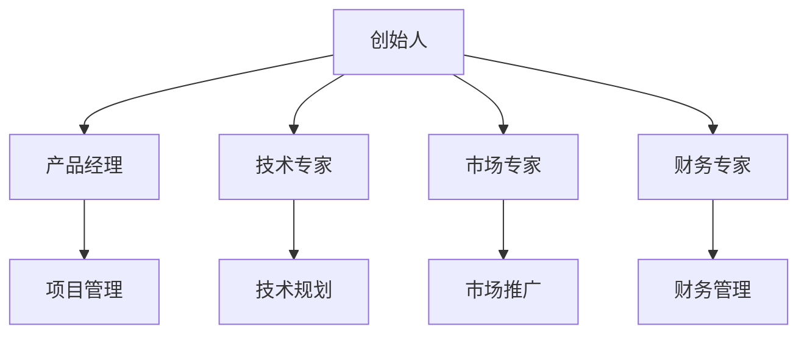

                 

## 文章标题

《从零到一：构建创业团队的策略》

## 关键词

创业团队、构建策略、市场调研、团队协作、激励与留才、创业战略规划、融资策略、创业实践与挑战

## 摘要

本文旨在探讨如何从零开始构建一个高效的创业团队。文章分为四个主要部分：创业准备、团队构建、创业战略规划和创业实践与挑战。在创业准备部分，我们分析了创业者的心路历程和市场调研与定位的重要性。在团队构建部分，我们详细讨论了如何寻找合适的团队成员、团队协作与沟通、激励与留才策略。创业战略规划部分则重点介绍了商业模式设计与实施、融资策略与财务管理。最后，创业实践与挑战部分总结了创业过程中的常见问题，并通过案例分析给出启示与借鉴。文章还提供了创业相关资源与工具，以及参考文献与推荐阅读，旨在为创业者提供全面而深入的指导。

# 《从零到一：构建创业团队的策略》目录大纲

## 第一部分：创业准备

### 第1章：创业者的心路历程

#### 1.1 从零到一的初步探索

#### 1.2 创业动机与愿景

#### 1.3 创业者的心理准备

#### 1.4 创业团队的重要性

### 第2章：市场调研与定位

#### 2.1 市场需求分析

#### 2.2 竞争对手分析

#### 2.3 市场定位策略

#### 2.4 市场调研方法与工具

## 第二部分：团队构建

### 第3章：寻找合适的团队成员

#### 3.1 创业团队的构成

#### 3.2 核心成员的角色与职责

#### 3.3 如何寻找团队成员

#### 3.4 面试技巧与团队文化建设

### 第4章：团队协作与沟通

#### 4.1 团队协作的挑战

#### 4.2 沟通策略与技巧

#### 4.3 提升团队效率的工具与方法

#### 4.4 团队文化建设的重要性

### 第5章：激励与留才策略

#### 5.1 激励理论概述

#### 5.2 绩效评估与反馈

#### 5.3 薪酬与福利设计

#### 5.4 团队成员留存策略

## 第三部分：创业战略规划

### 第6章：商业模式设计与实施

#### 6.1 商业模式的概念与构成

#### 6.2 如何设计有效的商业模式

#### 6.3 商业模式实施策略

#### 6.4 商业模式的创新与调整

### 第7章：融资策略与财务管理

#### 7.1 融资渠道与方式

#### 7.2 融资策略的选择

#### 7.3 财务管理的基本原则

#### 7.4 资金筹措与风险控制

## 第四部分：创业实践与挑战

### 第8章：创业过程中的常见问题

#### 8.1 产品开发中的挑战

#### 8.2 市场推广的策略

#### 8.3 团队管理的难题

#### 8.4 应对竞争的策略

### 第9章：案例分析

#### 9.1 成功创业案例分析

#### 9.2 失败创业案例分析

#### 9.3 启示与借鉴

### 第10章：创业之路的坚持与展望

#### 10.1 创业过程中的心态调整

#### 10.2 创业的长期规划

#### 10.3 创业者的社会责任

#### 10.4 创业的未来展望

## 附录

### 附录 A：创业相关资源与工具

#### A.1 创业社区与平台

#### A.2 市场调研工具

#### A.3 团队协作工具

#### A.4 融资与投资工具

### 附录 B：参考文献与推荐阅读

#### B.1 必读创业书籍

#### B.2 创业相关论文

#### B.3 创业社区推荐

#### B.4 在线资源与课程

## 第1章：创业者的心路历程

### 1.1 从零到一的初步探索

创业之路往往从零开始，初期的探索是必不可少的。在这个过程中，创业者需要明确自己的兴趣所在、市场需求以及潜在的商业机会。以下是一系列步骤：

**1. 确定兴趣和目标：** 创业者首先要明确自己的兴趣和目标，这将是驱动创业旅程的核心动力。通过自我反思和调研，创业者可以找到自己真正热爱的事物，并围绕这一主题构建业务。

**2. 市场调研：** 在确定兴趣后，创业者需要进行市场调研，了解目标市场的需求、竞争对手的情况以及潜在的机会和挑战。这有助于创业者制定更有针对性的商业策略。

**3. 概念验证：** 在对市场有一定了解后，创业者可以通过创建原型或最小可行产品（MVP）来验证商业概念。这一步可以帮助创业者验证市场需求并优化产品或服务。

**4. 收集反馈：** 通过向潜在用户收集反馈，创业者可以了解产品的价值、用户痛点和改进空间。这些反馈将为后续的产品开发提供宝贵的指导。

### 1.2 创业动机与愿景

创业动机是驱动创业者投身创业事业的内在动力。常见的创业动机包括：

**1. 对技术和创新的热情：** 许多创业者对新技术和创新有着浓厚的兴趣，希望通过创业实现自己的技术梦想。

**2. 解决社会问题：** 创业者可能关注社会问题，希望通过创业为社会带来积极的变化。

**3. 财务自由：** 财务自由是许多创业者的目标之一，他们希望通过创业实现财富积累。

**4. 追求自由和灵活的工作方式：** 一些创业者追求自由和灵活的工作方式，不愿受限于传统的工作模式。

创业愿景是创业者对未来的美好蓝图，它为创业团队提供了共同的目标和方向。以下是一些建议来制定创业愿景：

**1. 简洁明了：** 愿景应该简洁明了，容易理解。它应该能够激发团队成员的激情和动力。

**2. 具有挑战性：** 愿景应该具有挑战性，能够激发团队成员不断追求卓越。

**3. 可量化：** 愿景应该可量化，以便创业者能够追踪进度和评估成功。

**4. 长期性：** 愿景应该涵盖长期目标，而不仅仅是短期利益。

### 1.3 创业者的心理准备

创业是一项极具挑战性的任务，创业者需要做好充分的心理准备。以下是一些关键的心理因素：

**1. 耐心和毅力：** 创业者需要具备耐心和毅力，因为创业过程往往充满不确定性和困难。

**2. 抗压能力：** 创业者需要能够承受压力，因为创业过程中可能会面临各种挑战和困境。

**3. 适应能力：** 创业环境不断变化，创业者需要具备快速适应新情况的能力。

**4. 决策能力：** 创业者需要能够做出明智的决策，这需要良好的判断力和分析能力。

### 1.4 创业团队的重要性

一个高效的创业团队是创业成功的关键。以下是一些关于创业团队的重要观点：

**1. 多元化：** 创业团队应该具备多元化的背景和技能，这有助于团队成员从不同角度思考问题，提高团队的创新能力和解决问题的能力。

**2. 共同的愿景：** 团队成员应该拥有共同的愿景，这有助于团队团结一致，共同为实现目标而努力。

**3. 互补性：** 团队成员应该具备互补的技能和经验，这有助于提高团队的整体效率。

**4. 激励与支持：** 团队成员之间应该相互激励和支持，这有助于保持团队的士气和动力。

**核心概念与联系**

在构建创业团队的过程中，以下核心概念需要紧密联系：

1. **创始人**：创业团队的领导者，负责制定愿景和战略。
2. **产品经理**：负责产品的开发和优化。
3. **技术专家**：负责技术开发和工程。
4. **市场专家**：负责市场调研、营销和推广。
5. **财务专家**：负责财务管理和资金筹措。

**Mermaid 流程图**



### 核心算法原理讲解

#### 团队协作效率的提升算法（伪代码）

```plaintext
function Team_Coordination_Efficiency(团队成员列表, 任务列表):
    for 每个团队成员 in 成员列表:
        if 每个团队成员的专业技能包含在任务列表中:
            分配任务给该团队成员
        else:
            提醒团队成员补充相关技能或寻求外部帮助
    end
    使用团队协作工具进行任务分配与进度追踪
    运用绩效评估算法进行定期绩效评估
    return 协作效率提升指标
end function
```

### 数学模型和数学公式 & 详细讲解 & 举例说明

#### 创业成功率预测模型

假设创业成功率受以下因素影响：市场潜力（M）、团队实力（T）、资金状况（F）、行业竞争（C）。

$$
成功率(S) = f(M, T, F, C)
$$

其中，每个因素的影响可以用以下函数表示：

$$
M = \frac{1}{1 + e^{-0.5 \cdot M}}
$$

$$
T = \frac{1}{1 + e^{-0.3 \cdot T}}
$$

$$
F = \frac{1}{1 + e^{-0.2 \cdot F}}
$$

**详细讲解：**

1. **市场潜力（M）**：市场潜力越大，创业成功率越高。该因素通过指数函数进行非线性变换，以反映市场潜力的非线性关系。

2. **团队实力（T）**：团队实力越强，创业成功率越高。该因素同样通过指数函数进行非线性变换。

3. **资金状况（F）**：资金状况越好，创业成功率越高。该因素同样通过指数函数进行非线性变换。

4. **行业竞争（C）**：行业竞争越激烈，创业成功率越低。该因素同样通过指数函数进行非线性变换。

**举例说明：**

假设一个创业项目的市场潜力为50，团队实力为60，资金状况为70，行业竞争为30。

$$
成功率(S) = f(50, 60, 70, 30) = \frac{1}{1 + e^{-0.5 \cdot 50}} \times \frac{1}{1 + e^{-0.3 \cdot 60}} \times \frac{1}{1 + e^{-0.2 \cdot 70}} \times \frac{1}{1 + e^{-0.5 \cdot 30}}
$$

计算结果为：

$$
成功率(S) = \frac{1}{1 + e^{-25}} \times \frac{1}{1 + e^{-18}} \times \frac{1}{1 + e^{-14}} \times \frac{1}{1 + e^{-15}} \approx 0.78
$$

因此，该创业项目的成功率约为78%。

### 第2章：市场调研与定位

#### 2.1 市场需求分析

市场需求分析是创业过程中至关重要的一环，它有助于创业者了解目标市场的需求，为产品或服务的定位提供依据。以下是一系列步骤：

**1. 确定目标市场：** 创业者需要明确自己的目标市场，这包括市场细分、目标客户群体和地理位置。

**2. 了解客户需求：** 通过调查问卷、访谈、用户反馈等方式，收集目标客户的需求和偏好信息。

**3. 分析需求趋势：** 分析市场需求的变化趋势，了解未来潜在的机会和挑战。

**4. 评估市场容量：** 根据客户需求和市场趋势，评估市场的潜在规模。

#### 2.2 竞争对手分析

竞争对手分析有助于创业者了解市场上的竞争格局，为产品或服务的定价、推广策略提供参考。以下是一系列步骤：

**1. 确定竞争对手：** 列出直接和间接的竞争对手，了解他们的产品或服务。

**2. 分析竞争对手优势：** 了解竞争对手在产品、技术、市场等方面的优势。

**3. 识别自身优势：** 分析自身产品或服务的优势，找到差异化点。

**4. 制定竞争策略：** 基于自身优势和竞争对手分析，制定有效的竞争策略。

#### 2.3 市场定位策略

市场定位策略是创业者根据市场需求和竞争对手分析，为自己的产品或服务选择合适的市场位置。以下是一系列步骤：

**1. 确定目标市场：** 明确目标市场，这包括目标客户群体和地理位置。

**2. 选择定位策略：** 根据产品或服务的特点和市场需求，选择适合的定位策略，如市场细分定位、差异化定位等。

**3. 制定营销策略：** 根据市场定位策略，制定相应的营销策略，如广告、促销、公关等。

**4. 跟踪和调整：** 定期跟踪市场反馈，根据实际情况调整市场定位策略。

#### 2.4 市场调研方法与工具

市场调研是获取市场信息的重要手段，以下介绍几种常用的市场调研方法和工具：

**1. 调查问卷：** 通过设计问卷，收集目标客户的需求和偏好信息。

**2. 访谈：** 通过面对面或电话访谈，深入了解目标客户的需求和痛点。

**3. 实地观察：** 在实际场景中观察目标客户的行为和需求。

**4. 用户反馈：** 通过用户反馈，了解产品或服务的改进空间。

**5. 市场研究公司：** 利用专业市场研究公司的报告和数据分析，获取市场趋势和竞争信息。

### 第3章：寻找合适的团队成员

#### 3.1 创业团队的构成

创业团队是一个多元化、高效协作的团队，成员通常包括以下角色：

**1. 创始人：** 创业团队的领导者，负责制定愿景和战略，管理团队和资源。

**2. 产品经理：** 负责产品的规划和开发，确保产品满足市场需求。

**3. 技术专家：** 负责技术开发和工程，确保产品的技术实现。

**4. 市场专家：** 负责市场调研、营销和推广，提高产品的市场知名度。

**5. 财务专家：** 负责财务管理和资金筹措，确保公司的财务健康。

#### 3.2 核心成员的角色与职责

在创业团队中，核心成员的角色和职责至关重要。以下是一些核心成员及其职责：

**1. 创始人：** 制定公司愿景和战略，管理团队和资源，制定决策。

**2. 产品经理：** 理解市场需求，制定产品规划，协调开发团队。

**3. 技术专家：** 负责技术开发和工程，解决技术难题，优化产品性能。

**4. 市场专家：** 进行市场调研，制定营销策略，提高产品市场占有率。

**5. 财务专家：** 管理公司财务，制定预算和财务计划，确保公司财务健康。

#### 3.3 如何寻找团队成员

寻找合适的团队成员是创业成功的关键。以下是一些建议：

**1. 社交网络：** 利用社交网络平台，如LinkedIn、GitHub等，寻找具有相关技能和经验的团队成员。

**2. 行业会议：** 参加行业会议、研讨会和活动，结识潜在团队成员。

**3. 专业论坛：** 在专业论坛和社区中发布招聘信息，吸引有志之士加入。

**4. 校园招聘：** 利用校园招聘活动，寻找有潜力的大学生或毕业生。

**5. 参与开源项目：** 参与开源项目，结识具有共同兴趣和技能的团队成员。

#### 3.4 面试技巧与团队文化建设

面试是评估潜在团队成员的重要环节。以下是一些面试技巧：

**1. 准备充分：** 阅读简历，了解候选人的背景和经验，准备相关问题。

**2. 提问技巧：** 提问要具体、有针对性，避免过于宽泛的问题。

**3. 观察行为：** 注意候选人在面试过程中的行为和反应，评估其团队合作能力和沟通能力。

**4. 案例分析：** 通过案例分析，了解候选人在实际问题中的处理能力和思维模式。

**团队文化建设**

团队文化建设是确保团队成员共同奋斗、协同合作的重要手段。以下是一些建议：

**1. 共同愿景：** 确保团队成员拥有共同的愿景和目标，提高团队凝聚力。

**2. 激励与支持：** 提供积极的激励和支持，鼓励团队成员发挥最佳水平。

**3. 沟通与协作：** 建立有效的沟通和协作机制，确保团队成员之间的信息流畅。

**4. 尊重与包容：** 尊重每个团队成员的个性和观点，营造包容的团队氛围。

### 第4章：团队协作与沟通

#### 4.1 团队协作的挑战

团队协作是创业成功的关键，但过程中往往面临诸多挑战。以下是一些常见挑战：

**1. 角色冲突：** 不同团队成员之间的角色和职责可能存在冲突，导致工作效率降低。

**2. 沟通障碍：** 沟通不畅可能引发误解和矛盾，影响团队协作。

**3. 个人目标与团队目标的冲突：** 个人目标和团队目标不一致可能导致团队成员缺乏动力。

**4. 工作负荷不均：** 如果团队成员的工作负荷不均，可能导致部分成员过度劳累，而另一些成员则无所事事。

#### 4.2 沟通策略与技巧

有效的沟通是团队协作的核心。以下是一些沟通策略与技巧：

**1. 明确目标：** 在沟通前明确沟通的目标和预期成果，确保双方对目标有共同的理解。

**2. 倾听：** 倾听是有效沟通的关键，确保理解对方的观点和需求。

**3. 使用简洁明了的语言：** 使用简洁明了的语言，避免使用专业术语和复杂句式。

**4. 非语言沟通：** 观察和利用肢体语言、面部表情等非语言沟通手段，增强沟通效果。

**5. 定期会议：** 定期召开团队会议，确保团队成员之间的信息流畅。

#### 4.3 提升团队效率的工具与方法

为了提升团队效率，创业者可以采用以下工具与方法：

**1. 项目管理工具：** 使用项目管理工具，如Trello、JIRA等，进行任务分配和进度追踪。

**2. 沟通工具：** 使用团队沟通工具，如Slack、Microsoft Teams等，确保团队之间的实时沟通。

**3. 效率工具：** 使用效率工具，如Google Calendar、Toggl等，提高个人和团队的工作效率。

**4. 生产力提升：** 通过培训和工作坊，提升团队成员的技能和生产力。

#### 4.4 团队文化建设的重要性

团队文化建设是团队长期稳定发展的基础，它能够提升团队凝聚力，增强团队协作效率。以下是一些关键因素：

**1. 共同价值观：** 确保团队成员认同共同的价值观，提高团队凝聚力。

**2. 积极氛围：** 营造积极的工作氛围，鼓励团队成员分享想法和经验。

**3. 跨部门合作：** 促进跨部门合作，打破部门壁垒，提高团队整体效率。

**4. 激励与认可：** 通过激励和认可，鼓励团队成员发挥潜力，提高工作积极性。

### 第5章：激励与留才策略

#### 5.1 激励理论概述

激励是推动团队成员积极工作的关键因素。以下是一些常见的激励理论：

**1. 马斯洛需求层次理论：** 该理论认为人的需求分为五个层次，从生理需求到自我实现需求。只有满足较低层次的需求，人们才会追求更高层次的需求。

**2. 双因素理论：** 又称赫茨伯格理论，该理论认为激励因素和保健因素对员工的工作满意度有不同影响。激励因素与工作本身相关，而保健因素与工作环境相关。

**3. 目标设置理论：** 该理论认为明确、具有挑战性的目标能够提高员工的工作动机和绩效。

#### 5.2 绩效评估与反馈

绩效评估是激励团队成员的重要手段。以下是一些关键步骤：

**1. 设定绩效目标：** 根据公司的战略目标和部门职责，设定具体的绩效目标。

**2. 定期评估：** 定期对团队成员的绩效进行评估，确保目标得到实现。

**3. 反馈与沟通：** 提供具体的反馈和沟通，帮助团队成员了解自己的优势和不足，制定改进计划。

**4. 奖励与激励：** 根据绩效评估结果，给予奖励和激励，如奖金、晋升、培训等。

#### 5.3 薪酬与福利设计

薪酬与福利是激励团队成员的重要因素。以下是一些建议：

**1. 竞争性薪酬：** 设定具有竞争力的薪酬水平，以吸引和留住优秀人才。

**2. 绩效导向薪酬：** 将薪酬与绩效挂钩，鼓励团队成员提高工作绩效。

**3. 福利制度：** 提供完善的福利制度，如医疗保险、退休金计划、员工培训等。

**4. 工作与生活平衡：** 关注员工的工作与生活平衡，提供灵活的工作时间和远程工作机会。

#### 5.4 团队成员留存策略

留住团队成员是创业成功的关键。以下是一些建议：

**1. 职业发展机会：** 提供职业发展机会，帮助团队成员实现职业目标。

**2. 良好的工作氛围：** 营造积极的工作氛围，鼓励团队成员之间的合作和交流。

**3. 良好的沟通渠道：** 建立良好的沟通渠道，确保团队成员的声音被听到。

**4. 定期评估与反馈：** 定期对团队成员的绩效和职业发展进行评估，提供具体的反馈和指导。

### 第6章：商业模式设计与实施

#### 6.1 商业模式的概念与构成

商业模式是指企业如何创造、传递和捕获价值的基本原理。以下是一些关键概念：

**1. 价值主张：** 企业提供的产品或服务能够满足客户需求的独特价值。

**2. 客户关系：** 企业与客户之间的互动关系和客户获取、维护策略。

**3. 渠道：** 企业如何将产品或服务传递给客户的方式和途径。

**4. 收入来源：** 企业从客户那里获得的收入方式。

**5. 成本结构：** 企业运营的成本结构和成本控制策略。

**6. 利润模式：** 企业如何通过成本和收入之间的平衡来获取利润。

#### 6.2 如何设计有效的商业模式

设计有效的商业模式需要考虑以下因素：

**1. 目标市场：** 确定目标市场，了解客户需求和痛点。

**2. 价值主张：** 设计能够满足客户需求的价值主张。

**3. 渠道策略：** 选择合适的渠道策略，提高客户获取效率。

**4. 收入来源：** 确定多元化的收入来源，降低风险。

**5. 成本结构：** 优化成本结构，提高利润率。

**6. 利润模式：** 确定可持续的利润模式，确保企业的长期发展。

#### 6.3 商业模式实施策略

实施商业模式需要制定详细的策略和行动计划：

**1. 资源配置：** 合理配置资源，确保商业模式的有效实施。

**2. 组织结构：** 设计合适的组织结构，提高协同效应。

**3. 流程优化：** 优化业务流程，提高效率。

**4. 风险管理：** 制定风险管理策略，降低商业风险。

**5. 营销与推广：** 制定有效的营销和推广策略，提高品牌知名度。

#### 6.4 商业模式的创新与调整

商业模式的创新和调整是企业长期发展的重要手段：

**1. 市场趋势分析：** 分析市场趋势，把握商业机会。

**2. 客户反馈：** 收集客户反馈，了解市场需求变化。

**3. 竞争对手分析：** 分析竞争对手的商业模式，找到创新点。

**4. 内部创新：** 鼓励内部创新，不断优化商业模式。

**5. 调整策略：** 根据市场变化和内部评估，及时调整商业模式。

### 第7章：融资策略与财务管理

#### 7.1 融资渠道与方式

融资是创业过程中必不可少的一环，以下介绍一些常见的融资渠道和方式：

**1. 风险投资：** 风险投资公司为企业提供资金支持，通常在企业发展初期和扩张期使用。

**2. 天使投资：** 天使投资者通常是个人投资者，他们在企业发展早期提供资金支持。

**3. 银行贷款：** 创业者可以向银行申请贷款，这是一种传统的融资方式。

**4. 众筹：** 通过在线平台向公众筹集资金，适用于初创企业和创意项目。

**5. 政府补贴：** 政府提供的一些补贴和扶持政策，有助于企业降低融资成本。

#### 7.2 融资策略的选择

选择适合的融资策略是创业成功的关键，以下是一些建议：

**1. 确定融资需求：** 明确企业当前和未来的资金需求，制定详细的融资计划。

**2. 分析融资成本：** 比较不同融资方式的成本，选择成本最低的方式。

**3. 评估风险：** 分析不同融资方式的风险，选择风险较低的方式。

**4. 确定融资期限：** 根据企业的资金需求和还款能力，选择合适的融资期限。

**5. 准备融资材料：** 准备详细的商业计划书、财务报表等融资材料，提高融资成功率。

#### 7.3 财务管理的基本原则

财务管理是创业过程中至关重要的一环，以下介绍一些基本原则：

**1. 成本效益原则：** 在决策过程中，权衡成本和收益，选择最经济的方案。

**2. 资金时间价值原则：** 考虑资金的时间价值，合理安排资金的筹措和使用。

**3. 风险控制原则：** 制定风险管理策略，降低企业的财务风险。

**4. 稳健性原则：** 确保企业的财务稳健，避免过度负债。

**5. 信息透明原则：** 保证财务信息的真实、准确和完整，提高企业信誉。

#### 7.4 资金筹措与风险控制

在资金筹措和风险控制方面，创业者需要关注以下几点：

**1. 资金筹措：** 制定详细的资金筹措计划，确保企业在不同发展阶段有足够的资金支持。

**2. 风险评估：** 分析企业面临的各种风险，如市场风险、财务风险、法律风险等。

**3. 风险管理：** 制定风险管理策略，如分散投资、保险、风险规避等。

**4. 资金使用：** 合理安排资金的使用，确保资金用于企业的核心业务和关键领域。

**5. 财务监控：** 建立财务监控机制，定期评估企业的财务状况，确保财务健康。

### 第8章：创业过程中的常见问题

#### 8.1 产品开发中的挑战

产品开发是创业过程中最重要的环节之一，但往往面临诸多挑战：

**1. 技术难题：** 在产品开发过程中，可能会遇到技术难题，如性能瓶颈、技术实现困难等。

**2. 时间压力：** 产品开发周期往往比预期要长，创业者需要面对时间压力，确保按时交付产品。

**3. 资金短缺：** 产品开发需要大量资金支持，但初创企业往往面临资金短缺的问题。

**4. 团队协作：** 产品开发需要高效协作，但团队成员之间的沟通和协作可能存在问题。

#### 8.2 市场推广的策略

市场推广是提高产品知名度、吸引客户的重要手段。以下是一些市场推广策略：

**1. 社交媒体推广：** 利用社交媒体平台，如Facebook、Twitter、Instagram等，进行品牌推广和用户互动。

**2. 内容营销：** 通过发布高质量的内容，如博客、视频、电子书等，吸引潜在客户。

**3. 广告投放：** 在合适的平台上进行广告投放，提高品牌曝光率。

**4. 合作伙伴关系：** 与其他企业或个人建立合作伙伴关系，共同推广产品。

**5. 用户口碑：** 通过提供优质的产品和服务，赢得用户的信任和口碑，实现口碑传播。

#### 8.3 团队管理的难题

团队管理是创业过程中的另一个重要挑战。以下是一些团队管理难题：

**1. 矛盾冲突：** 团队成员之间的矛盾和冲突可能导致工作效率降低。

**2. 激励问题：** 如何激励团队成员，提高他们的工作积极性是一个难题。

**3. 沟通障碍：** 团队成员之间的沟通不畅可能影响团队协作。

**4. 资源分配：** 合理分配资源和任务，确保团队高效运作。

**5. 能力提升：** 如何提升团队成员的技能和能力，以适应企业发展需求。

#### 8.4 应对竞争的策略

在激烈的市场竞争中，创业者需要采取有效的策略来应对竞争：

**1. 差异化策略：** 通过产品差异化、技术创新等手段，打造独特的竞争优势。

**2. 价格策略：** 根据市场需求和竞争态势，制定合适的价格策略。

**3. 品牌建设：** 建立强大的品牌形象，提高品牌知名度和认可度。

**4. 客户关系管理：** 通过优质的客户服务和客户关系管理，提高客户满意度和忠诚度。

**5. 创新驱动：** 持续创新，推出新产品或服务，以应对市场变化。

### 第9章：案例分析

#### 9.1 成功创业案例分析

成功创业案例为我们提供了宝贵的经验和启示。以下是一个成功创业案例分析：

**案例：** Airbnb

**1. 创始人背景：** Airbnb的创始人是布莱恩·切斯基（Brian Chesky）和乔·杰比亚（Joe Gebbia），他们曾在设计学院学习。

**2. 商业模式：** Airbnb通过提供短期住宿服务，连接房东和旅行者，打造了一个在线平台。

**3. 创业过程：** Airbnb起初遇到了诸多挑战，包括市场需求不足、资金短缺等问题。但创始人通过不断优化产品和服务，吸引了越来越多的用户。

**4. 成功因素：** Airbnb的成功因素包括创新的商业模式、优质的用户体验、强大的品牌建设等。

**5. 启示：** 成功创业需要创新的思维、坚定的信念和不断的努力。

#### 9.2 失败创业案例分析

失败创业案例同样为我们提供了宝贵的教训。以下是一个失败创业案例分析：

**案例：** EnergyPod

**1. 创始人背景：** EnergyPod的创始人是埃里克斯·阿特金斯（Alex Atkins），他是一位环保工程师。

**2. 商业模式：** EnergyPod旨在提供一种可持续的移动能源解决方案，通过太阳能和风能供电。

**3. 创业过程：** EnergyPod在开发过程中遇到了技术难题，包括电池寿命、能源效率等问题。

**4. 失败原因：** EnergyPod的失败原因包括技术实现难度高、市场接受度低、资金短缺等。

**5. 启示：** 创业过程中，需要充分评估技术可行性、市场需求和资金状况，避免盲目跟风和过度乐观。

#### 9.3 启示与借鉴

通过成功和失败的创业案例，我们可以得到以下启示和借鉴：

**1. 创新思维：** 成功创业需要创新的思维和商业模式，不断寻找市场机会。

**2. 坚定信念：** 创业过程中充满挑战和不确定性，需要坚定的信念和毅力。

**3. 用户导向：** 以用户需求为导向，提供优质的产品和服务。

**4. 技术能力：** 技术是实现创业目标的关键，需要具备强大的技术能力。

**5. 资金管理：** 合理管理资金，避免过度依赖外部融资。

### 第10章：创业之路的坚持与展望

#### 10.1 创业过程中的心态调整

创业过程充满挑战和不确定性，创业者需要调整心态，以应对各种困难。以下是一些建议：

**1. 保持积极心态：** 面对困难和挫折，保持积极的心态，相信自己能够克服问题。

**2. 学会接受失败：** 创业过程中，失败是不可避免的。学会接受失败，从中吸取教训，不断进步。

**3. 保持耐心：** 创业是一个长期的过程，需要耐心和毅力。不要急于求成，而是要一步一个脚印地推进。

**4. 调整心态：** 创业者需要不断调整自己的心态，适应市场变化和企业发展。

#### 10.2 创业的长期规划

长期规划是创业成功的关键，以下是一些长期规划的建议：

**1. 明确目标：** 确定企业的长期目标和发展方向，为创业团队提供明确的方向。

**2. 制定战略：** 制定具体的战略计划，包括市场定位、产品规划、融资策略等。

**3. 资源整合：** 整合各种资源，包括资金、人才、技术等，为企业的长期发展提供支持。

**4. 持续创新：** 保持创新意识，不断推出新产品或服务，以适应市场变化。

**5. 持续学习：** 创业者需要不断学习新知识、新技能，提升自身的竞争力。

#### 10.3 创业者的社会责任

创业者在追求商业成功的同时，也需要承担社会责任。以下是一些建议：

**1. 环境保护：** 推广环保技术和理念，减少企业对环境的影响。

**2. 社会公益：** 参与社会公益活动，回馈社会。

**3. 人才培养：** 为员工提供培训和发展机会，提升员工的专业能力和综合素质。

**4. 劳动保障：** 提供良好的工作环境和福利待遇，保障员工的合法权益。

#### 10.4 创业的未来展望

创业的未来充满机遇和挑战。以下是一些展望：

**1. 技术驱动：** 科技的快速发展将为创业带来更多机遇，创业者需要紧跟技术趋势。

**2. 市场细分：** 市场细分将带来更多创业机会，创业者需要寻找市场空白点。

**3. 创新驱动：** 创新是创业的核心竞争力，创业者需要不断进行产品创新和模式创新。

**4. 国际化：** 全球化背景下的国际化创业将为创业者带来更多机会，创业者需要具备国际视野。

### 附录 A：创业相关资源与工具

#### A.1 创业社区与平台

**1. 创业邦：** 中国领先的创业服务平台，提供创业资讯、活动、投资等全方位服务。

**2. 品途网：** 提供创业资讯、市场分析、创业指导等，帮助创业者了解行业动态。

**3. 创新创业服务平台：** 国家级创新创业服务平台，提供政策解读、创业培训、投资对接等服务。

#### A.2 市场调研工具

**1. 问卷星：** 专业问卷设计、数据收集和分析工具，适用于市场调研、满意度调查等。

**2. 清科研究中心：** 提供深度的市场调研报告、行业分析等，帮助创业者了解市场趋势。

**3. 分析易：** 提供在线数据分析和可视化工具，适用于数据分析、市场研究等。

#### A.3 团队协作工具

**1. Slack：** 专业的团队沟通工具，提供实时消息、文件共享、日程安排等功能。

**2. Trello：** 适用于项目管理的可视化工具，帮助团队明确任务和进度。

**3. Asana：** 专业的任务管理和协作工具，提供任务分配、进度追踪等功能。

#### A.4 融资与投资工具

**1. 天使投资网：** 提供天使投资信息和对接服务，帮助创业者寻找投资机会。

**2. 融资圈：** 提供融资信息和资源对接，助力创业者成功融资。

**3. 投资通：** 提供专业投资资讯、投资分析、投资项目推荐等，帮助创业者了解投资趋势。

### 附录 B：参考文献与推荐阅读

#### B.1 必读创业书籍

**1. 《创业维艰》：** 本书的作者本·霍洛维茨（Ben Horowitz）是风险投资家和企业家，书中分享了他丰富的创业经验和深刻的见解。

**2. 《创业的本质》：** 本书详细介绍了创业的本质和核心要素，帮助创业者理解创业过程中的关键问题。

**3. 《精益创业》：** 作者埃里克·莱斯（Eric Ries）提出精益创业方法，强调快速迭代和客户反馈在创业过程中的重要性。

#### B.2 创业相关论文

**1. “Entrepreneurship: Definition, Theory and Applications”：** 本文对创业的定义、理论和应用进行了全面阐述，是创业领域的经典论文。

**2. “The Role of Entrepreneurship in Economic Growth”：** 本文探讨了创业在经济增长中的作用，强调了创业对经济发展的贡献。

**3. “Entrepreneurial Opportunities and New Venture Creation”：** 本文研究了创业机会和新企业创建的关系，为创业者提供了有益的启示。

#### B.3 创业社区推荐

**1. 创业邦：** 中国领先的创业社区，提供丰富的创业资讯、活动、资源和服务。

**2. TechCrunch：** 全球知名的科技媒体，关注创业公司、创新产品和创业趋势。

**3. 猎云网：** 中国领先的创业媒体平台，提供创业资讯、创业项目推荐和投资对接服务。

#### B.4 在线资源与课程

**1. Coursera：** 提供丰富的在线课程，包括创业、市场营销、项目管理等领域，适合创业者学习。

**2. Udemy：** 提供多样化的在线课程，涵盖创业、编程、数据科学等多个领域，适合不同需求的创业者。

**3. EdX：** 提供由顶尖大学和机构提供的在线课程，包括创业、领导力、创新等，具有很高的学习价值。

