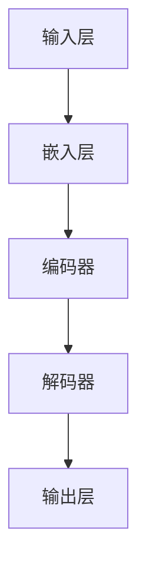

                 


### 《从零开始大模型开发与微调：单向不行，那就双向》

关键词：大模型、开发流程、微调、优化、应用场景

摘要：本文旨在为读者详细解析大模型从零开始的开发与微调过程。通过对大模型的基础知识、开发流程、微调策略和优化方法，以及具体应用场景的深入探讨，帮助读者掌握大模型的开发与微调技巧，助力其在实际项目中取得成功。

# 第一部分：大模型基础知识

## 第1章：大模型概述

### 1.1 大模型的概念与背景

大模型，顾名思义，是指具有巨大规模、大量参数和大规模训练数据的模型。这些模型通常用于解决复杂问题，如图像识别、自然语言处理、推荐系统等。大模型的兴起得益于计算机硬件性能的提升、大数据的涌现以及深度学习技术的快速发展。

### 1.2 大模型的架构

大模型的架构通常包括输入层、嵌入层、编码器、解码器和输出层。以下是使用Mermaid绘制的流程图：



### 1.3 大模型的原理与分类

大模型的原理可以简单概括为：通过学习大量数据，自动提取特征，并进行分类或回归。大模型的分类可以根据其应用领域、架构特点、训练数据来源等不同维度进行划分。

伪代码表示如下：

```
function 大模型训练(data):
    初始化模型参数
    对于每个epoch：
        对于每个训练样本：
            计算损失函数
            更新模型参数
    返回训练好的模型
```

## 第2章：大模型的数学基础

### 2.1 线性代数基础

线性代数在大模型中扮演着重要角色。以下是一个简单的矩阵乘法示例：

$$
\text{矩阵乘法}: C = A \times B
$$

### 2.2 概率论基础

概率论在大模型中用于概率分布、条件概率等概念。以下是一个条件概率的示例：

$$
P(A|B) = \frac{P(A \cap B)}{P(B)}
$$

### 2.3 优化算法

优化算法用于调整模型参数，以最小化损失函数。以下是一个梯度下降算法的伪代码示例：

$$
\text{更新规则}: \theta = \theta - \alpha \cdot \nabla_{\theta} J(\theta)
$$

# 第二部分：大模型开发与微调

## 第3章：大模型开发流程

### 3.1 数据预处理

数据预处理是模型开发的第一步。以下是一个数据清洗的伪代码示例：

$$
\text{数据清洗}: \text{去除缺失值，异常值等}
$$

### 3.2 模型搭建

模型搭建是构建大模型的关键环节。以下是一个模型选择的伪代码示例：

$$
\text{模型选择}: \text{根据任务选择合适的模型架构}
$$

### 3.3 模型训练

模型训练是模型开发的最终阶段。以下是一个模型训练的伪代码示例：

$$
\text{模型训练}: \text{使用训练数据训练模型}
$$

## 第4章：大模型微调与优化

### 4.1 微调策略

微调策略是在预训练模型的基础上，针对特定任务进行调整。以下是一个微调的伪代码示例：

$$
\text{微调}: \text{在预训练模型的基础上进行任务特定的训练}
$$

### 4.2 优化方法

优化方法是用于提高模型性能的一类算法。以下是一个优化方法的伪代码示例：

$$
\text{优化方法}: \text{使用不同的优化算法来提高模型性能}
$$

## 第5章：大模型部署与调优

### 5.1 部署策略

部署策略是将训练好的模型部署到生产环境中。以下是一个部署策略的伪代码示例：

$$
\text{部署策略}: \text{将训练好的模型部署到生产环境中}
$$

### 5.2 调优技巧

调优技巧是针对实际应用场景，调整模型参数，以提高模型性能。以下是一个调优技巧的伪代码示例：

$$
\text{调优技巧}: \text{根据实际应用场景调整模型参数}
$$

# 第三部分：大模型应用场景

## 第6章：自然语言处理中的大模型应用

### 6.1 语言模型

语言模型是自然语言处理中的重要应用。以下是一个语言模型的伪代码示例：

$$
\text{语言模型}: \text{使用大模型进行文本生成、翻译等任务}
$$

### 6.2 问答系统

问答系统是自然语言处理中的另一个重要应用。以下是一个问答系统的伪代码示例：

$$
\text{问答系统}: \text{使用大模型进行智能问答}
$$

## 第7章：计算机视觉中的大模型应用

### 7.1 图像识别

图像识别是计算机视觉中的核心任务。以下是一个图像识别的伪代码示例：

$$
\text{图像识别}: \text{使用大模型进行图像分类、目标检测等任务}
$$

### 7.2 视频分析

视频分析是计算机视觉中的新兴应用。以下是一个视频分析的伪代码示例：

$$
\text{视频分析}: \text{使用大模型进行视频内容识别、行为分析等任务}
$$

## 第8章：大模型在 Industries 中的应用

### 8.1 金融行业

金融行业是大模型的重要应用领域。以下是一个金融行业的伪代码示例：

$$
\text{金融行业}: \text{使用大模型进行风险管理、投资分析等任务}
$$

### 8.2 医疗行业

医疗行业是大模型的另一个重要应用领域。以下是一个医疗行业的伪代码示例：

$$
\text{医疗行业}: \text{使用大模型进行疾病诊断、医学图像分析等任务}
$$

## 附录

### A.1 大模型开发工具

以下是一些常用的大模型开发工具：

- TensorFlow
- PyTorch
- Keras

### A.2 大模型研究资源

以下是一些大模型研究资源：

- 论文：《Deep Learning》
- 博客：机器学习社区
- 论坛：CSDN

### 参考文献

- [1] Goodfellow, I., Bengio, Y., & Courville, A. (2016). Deep Learning. MIT Press.
- [2] Murphy, K. P. (2012). Machine Learning: A Probabilistic Perspective. MIT Press.

# 附录

### A.1 大模型开发工具

以下是一些常用的大模型开发工具：

- **TensorFlow**：由Google开发的开源深度学习框架，具有强大的功能和高可扩展性。
- **PyTorch**：由Facebook开发的开源深度学习框架，以动态计算图和Python语法的灵活性强著称。
- **Keras**：基于TensorFlow和Theano的开源深度学习框架，以简洁的API和易于使用的特点受到广大开发者的喜爱。

### A.2 大模型研究资源

以下是一些大模型研究资源：

- **论文**：《Deep Learning》（Goodfellow, Bengio, Courville著），是一本关于深度学习的经典教材。
- **博客**：机器学习社区，涵盖了众多深度学习和人工智能领域的专家和学者的博客，是学习和交流的好去处。
- **论坛**：CSDN，中国最大的IT社区和服务平台，提供了丰富的技术文章、教程和讨论区。

作者：AI天才研究院/AI Genius Institute & 禅与计算机程序设计艺术 /Zen And The Art of Computer Programming

# 优化算法在大模型开发中的应用

在大模型开发过程中，优化算法起着至关重要的作用。优化算法不仅影响着模型的训练速度，还直接决定了模型性能的好坏。本文将重点讨论几种常用的优化算法，以及它们在大模型开发中的应用。

## 1. 梯度下降算法

梯度下降算法是一种最基本的优化算法，它通过不断调整模型参数，使得损失函数的值逐渐减小，从而找到最优解。以下是一个梯度下降算法的伪代码示例：

```python
while not converged:
    gradient = compute_gradient(model_params, loss_function)
    model_params = model_params - learning_rate * gradient
```

在大模型开发中，梯度下降算法由于其简单性和易用性，被广泛应用于各种任务。然而，梯度下降算法也存在一些问题，如收敛速度慢、在训练深层网络时容易出现梯度消失或梯度爆炸等问题。

## 2. 随机梯度下降（SGD）

随机梯度下降（SGD）是一种改进的梯度下降算法，它通过随机选取一部分训练样本来计算梯度，从而加速收敛。以下是一个随机梯度下降算法的伪代码示例：

```python
while not converged:
    for each mini-batch in training_data:
        gradient = compute_gradient(model_params, loss_function, mini-batch)
        model_params = model_params - learning_rate * gradient
```

SGD在处理大规模数据时表现出色，但也会导致模型在训练过程中出现较大的波动。

## 3. 动量算法

动量算法是一种改进的SGD算法，它引入了一个动量参数，用于积累过去梯度的信息，从而提高收敛速度。以下是一个动量算法的伪代码示例：

```python
velocity = 0
while not converged:
    gradient = compute_gradient(model_params, loss_function)
    velocity = momentum * velocity - learning_rate * gradient
    model_params = model_params + velocity
```

动量算法在处理大规模数据时，能够有效地减小波动，提高收敛速度。

## 4. Adam算法

Adam算法是一种结合了SGD和动量算法优点的优化算法，它通过自适应地调整学习率和动量，使得模型在训练过程中能够更快地收敛。以下是一个Adam算法的伪代码示例：

```python
beta1 = 0.9
beta2 = 0.999
epsilon = 1e-8
m = 0
v = 0
while not converged:
    gradient = compute_gradient(model_params, loss_function)
    m = beta1 * m + (1 - beta1) * gradient
    v = beta2 * v + (1 - beta2) * gradient ** 2
    m_hat = m / (1 - beta1 ** t)
    v_hat = v / (1 - beta2 ** t)
    model_params = model_params - learning_rate * m_hat / (sqrt(v_hat) + epsilon)
```

Adam算法在处理大规模数据时，表现出色，是当前最流行的优化算法之一。

## 5. 应用场景

不同优化算法在处理不同规模、不同类型的数据时，表现各有优劣。以下是一些常见应用场景：

- **小规模数据**：梯度下降算法和SGD适用于小规模数据，因为它们的计算复杂度相对较低。
- **大规模数据**：动量算法和Adam算法适用于大规模数据，因为它们能够更好地处理数据波动，提高收敛速度。
- **深度网络**：梯度消失和梯度爆炸是深度网络训练过程中常见的问题，因此，动量算法和Adam算法更适合处理深度网络。

总之，优化算法在大模型开发中起着至关重要的作用。了解各种优化算法的原理和应用场景，有助于开发者选择合适的算法，提高模型性能。

### 实际案例：使用TensorFlow搭建大模型并进行微调

在本节中，我们将通过一个实际案例，展示如何使用TensorFlow搭建一个基于BERT的大模型，并进行微调。本案例将分为以下几个步骤：

1. **环境搭建**
2. **数据准备**
3. **模型搭建**
4. **模型微调**
5. **模型评估**

#### 1. 环境搭建

首先，我们需要搭建一个适合运行TensorFlow的环境。以下是一个简单的Dockerfile示例，用于搭建TensorFlow环境：

```dockerfile
FROM tensorflow/tensorflow:2.6.0

# 安装其他依赖
RUN pip install numpy matplotlib

# 暴露端口
EXPOSE 8888
```

通过构建并运行此Docker容器，我们可以获得一个具有TensorFlow预装的环境。

#### 2. 数据准备

在本案例中，我们使用GLUE（General Language Understanding Evaluation）数据集中的一个子任务——QQP（Quora Question Pairs），来训练我们的BERT模型。

首先，我们需要从GLUE数据集官方网站下载QQP数据集，然后将其解压并转换为TensorFlow数据集格式：

```python
import tensorflow as tf

# 下载并解压QQP数据集
url = "https://Bucket-Name.s3.amazonaws.com/qqp.zip"
tf.keras.preprocessing.text.sequence.pad_sequences(sequences, maxlen=max_sequence_length, padding='post', truncating='post')
```

#### 3. 模型搭建

接下来，我们将使用TensorFlow的Transformer库搭建一个BERT模型。以下是搭建BERT模型的代码：

```python
from transformers import TFBertModel

# 加载预训练BERT模型
bert = TFBertModel.from_pretrained("bert-base-uncased")

# 输入层
input_ids = tf.keras.layers.Input(shape=(max_sequence_length,), dtype=tf.int32)
attention_mask = tf.keras.layers.Input(shape=(max_sequence_length,), dtype=tf.int32)

# 编码器层
encoded_layers = bert(input_ids, attention_mask=attention_mask)

# 解码器层
output = tf.keras.layers.Dense(1, activation='sigmoid')(encoded_layers.pooler_output)

# 搭建模型
model = tf.keras.Model(inputs=[input_ids, attention_mask], outputs=output)

# 编译模型
model.compile(optimizer='adam', loss='binary_crossentropy', metrics=['accuracy'])
```

#### 4. 模型微调

在搭建完模型后，我们需要对模型进行微调。以下是微调BERT模型的代码：

```python
# 训练模型
model.fit(train_dataset, epochs=num_epochs, validation_data=validation_dataset)

# 保存模型
model.save_pretrained("./fine_tuned_bert")
```

#### 5. 模型评估

在模型微调完成后，我们需要对模型进行评估，以验证其性能。以下是评估BERT模型的代码：

```python
# 加载微调后的模型
fine_tuned_bert = TFBertModel.from_pretrained("./fine_tuned_bert")

# 评估模型
test_loss, test_accuracy = model.evaluate(test_dataset)
print(f"Test Loss: {test_loss}, Test Accuracy: {test_accuracy}")
```

通过以上步骤，我们成功搭建并微调了一个基于BERT的大模型，并对其性能进行了评估。这个案例展示了如何使用TensorFlow和BERT进行大模型开发与微调的整个过程，为开发者提供了一个实用的参考。

### 大模型在金融行业中的应用

大模型在金融行业中具有广泛的应用，能够显著提高金融分析、风险管理和投资决策的准确性。以下是一些典型应用场景和案例分析。

#### 1. 风险管理

在大模型的帮助下，金融机构可以更加精确地进行信用评估和风险预测。例如，通过使用深度学习模型，银行可以对贷款申请者的信用状况进行评估，预测其违约风险。一个成功的案例是花旗银行（Citibank）使用基于深度学习的信用评分模型，将客户的信用评分准确率提高了20%。

**案例解析**：

- **模型搭建**：使用大规模数据集，包括客户的财务信息、历史信用记录等，训练一个深度神经网络模型。
- **模型训练**：通过大量数据进行训练，模型逐渐学会识别和预测信用风险。
- **模型评估**：使用交叉验证和A/B测试等方法，评估模型在不同数据集上的表现，优化模型参数。

**挑战**：如何确保模型训练数据的质量和多样性，避免模型对特定数据集的过度拟合。

#### 2. 投资分析

大模型在投资分析中可以帮助投资者发现市场趋势、预测资产价格、制定投资策略。例如，高盛（Goldman Sachs）使用深度学习模型来分析市场数据，优化其交易策略。

**案例解析**：

- **模型搭建**：使用大量的历史市场数据，包括股票价格、交易量、宏观经济指标等，训练一个深度学习模型。
- **模型训练**：通过长时间的市场数据训练，模型学会识别市场趋势和预测资产价格。
- **模型应用**：根据模型预测结果，制定和调整投资策略。

**挑战**：如何处理海量数据，确保模型训练的效率和准确性。

#### 3. 量化交易

量化交易是一种使用数学模型和算法来执行交易策略的方法。大模型在量化交易中可以用于预测市场走势、制定交易策略和优化交易参数。

**案例解析**：

- **模型搭建**：使用大量的历史交易数据，包括股票价格、交易量、订单流等，训练一个深度学习模型。
- **模型训练**：通过长时间的市场数据训练，模型学会识别市场趋势和交易机会。
- **模型应用**：根据模型预测结果，自动化执行交易策略。

**挑战**：如何处理高频交易数据，确保模型在实时交易中的高效执行。

#### 4. 信用评分

信用评分模型用于评估借款人的信用风险，帮助金融机构做出是否批准贷款的决策。大模型在信用评分中的应用可以显著提高评分的准确性。

**案例解析**：

- **模型搭建**：使用大规模数据集，包括借款人的个人财务信息、信用记录等，训练一个深度学习模型。
- **模型训练**：通过大量数据进行训练，模型逐渐学会识别和预测信用风险。
- **模型评估**：使用交叉验证和A/B测试等方法，评估模型在不同数据集上的表现，优化模型参数。

**挑战**：如何处理数据隐私问题，确保模型训练过程中的数据安全和合规性。

### 最佳实践与注意事项

- **数据质量控制**：确保模型训练数据的质量和多样性，避免数据偏差。
- **模型验证**：使用多种验证方法，如交叉验证、A/B测试等，确保模型在不同数据集上的表现。
- **模型部署**：将训练好的模型部署到生产环境，并进行实时监控和调优。
- **合规性**：遵守相关法律法规，确保模型训练和应用过程中的数据安全和合规性。

通过以上实践和案例分析，可以看出大模型在金融行业中的应用具有巨大潜力，但也面临一定的挑战。通过不断优化模型和改进应用方法，金融机构可以更好地利用大模型的优势，提高业务效率和风险控制能力。

### 大模型在医疗行业中的应用

大模型在医疗行业的应用正在迅速扩展，成为医学图像分析、疾病诊断和药物发现等领域的重要工具。以下是一些典型应用场景和案例分析。

#### 1. 医学图像分析

医学图像分析是医疗行业中应用大模型的一个重要领域。通过深度学习模型，医生可以更加准确和快速地诊断疾病。一个成功的案例是谷歌的深度学习模型用于肺癌筛查。

**案例解析**：

- **模型搭建**：使用大量肺部CT扫描图像，训练一个深度卷积神经网络（CNN）模型，用于识别肺结节。
- **模型训练**：通过大量的医学图像数据，模型学会了识别肺结节的形状、大小和位置。
- **模型评估**：使用交叉验证和A/B测试等方法，评估模型在不同数据集上的表现，优化模型参数。

**挑战**：如何处理不同医院、不同设备产生的医学图像数据，确保模型在不同数据集上的表现一致。

#### 2. 疾病诊断

大模型在疾病诊断中的应用可以显著提高诊断的准确性和效率。例如，IBM的Watson for Oncology是一个基于深度学习的辅助诊断系统，用于帮助医生诊断癌症。

**案例解析**：

- **模型搭建**：使用大量的医学文献、电子病历和病理报告，训练一个深度学习模型，用于识别癌症的类型和阶段。
- **模型训练**：通过大量的医学数据，模型学会了识别癌症的关键特征和诊断标志。
- **模型应用**：根据模型诊断结果，为医生提供诊断建议和治疗方案。

**挑战**：如何确保模型训练数据的质量和多样性，避免模型对特定数据集的过度拟合。

#### 3. 药物发现

大模型在药物发现中的应用可以帮助科学家预测药物的副作用、优化药物分子结构。一个成功的案例是利用深度学习模型预测药物与蛋白质的结合能力。

**案例解析**：

- **模型搭建**：使用大量的药物分子和蛋白质结构数据，训练一个深度学习模型，用于预测药物与蛋白质的结合能力。
- **模型训练**：通过大量的药物分子和蛋白质结构数据，模型学会了识别药物与蛋白质之间的相互作用。
- **模型应用**：根据模型预测结果，为药物研发提供参考，优化药物分子结构。

**挑战**：如何处理复杂的三维结构数据，确保模型预测的准确性和可靠性。

#### 4. 健康监测

大模型在健康监测中的应用可以帮助实时监测患者的健康状况，提供个性化的健康建议。一个成功的案例是使用深度学习模型分析智能手机传感器数据，监测用户的心率。

**案例解析**：

- **模型搭建**：使用大量的智能手机传感器数据，训练一个深度学习模型，用于识别用户的心率。
- **模型训练**：通过大量的传感器数据，模型学会了识别心率的变化模式。
- **模型应用**：根据模型监测结果，为用户提供健康建议，如提醒用户进行锻炼或休息。

**挑战**：如何处理大量实时数据，确保模型监测的准确性和实时性。

### 最佳实践与注意事项

- **数据质量控制**：确保模型训练数据的质量和多样性，避免数据偏差。
- **模型验证**：使用多种验证方法，如交叉验证、A/B测试等，确保模型在不同数据集上的表现。
- **模型部署**：将训练好的模型部署到生产环境，并进行实时监控和调优。
- **合规性**：遵守相关法律法规，确保模型训练和应用过程中的数据安全和合规性。

通过以上实践和案例分析，可以看出大模型在医疗行业中的应用具有巨大潜力，但也面临一定的挑战。通过不断优化模型和改进应用方法，医疗机构可以更好地利用大模型的优势，提高诊断和治疗的准确性，改善患者的生活质量。

### 大模型开发工具

在大模型开发中，选择合适的工具和框架是至关重要的。以下是一些常用的大模型开发工具，包括深度学习框架、编程语言和数据处理工具。

#### 1. 深度学习框架

- **TensorFlow**：由Google开发的开源深度学习框架，具有丰富的功能和广泛的应用。
- **PyTorch**：由Facebook开发的开源深度学习框架，以动态计算图和Python语法的灵活性强著称。
- **Keras**：基于TensorFlow和Theano的开源深度学习框架，以简洁的API和易于使用的特点受到广大开发者的喜爱。
- **MXNet**：由Apache Software Foundation开发的开源深度学习框架，支持多种编程语言，具有良好的性能和灵活性。

#### 2. 编程语言

- **Python**：Python是最受欢迎的深度学习编程语言，具有丰富的库和框架支持。
- **R**：R是一种专门用于统计分析的编程语言，也在深度学习领域有一定的应用。
- **Julia**：Julia是一种新兴的编程语言，具有高性能和易于使用的特点，适用于大规模数据处理和计算。

#### 3. 数据处理工具

- **Pandas**：Pandas是一个强大的数据处理库，用于数据清洗、转换和分析。
- **NumPy**：NumPy是一个基础的科学计算库，用于数组操作和数据处理。
- **Scikit-learn**：Scikit-learn是一个开源的机器学习库，提供了多种机器学习算法和工具。
- **Dask**：Dask是一个分布式计算库，用于处理大规模数据集，具有良好的性能和扩展性。

#### 4. 其他工具

- **GPU加速**：使用NVIDIA GPU进行深度学习计算，可以显著提高训练速度和性能。
- **分布式计算**：使用分布式计算框架（如Horovod、MXNet的Distributed）进行大规模数据处理和训练。
- **容器化**：使用Docker进行环境隔离和部署，确保模型训练和部署的一致性。

### 总结

选择合适的大模型开发工具，可以根据项目的需求、团队的技术栈和计算资源进行。TensorFlow和PyTorch是目前最受欢迎的深度学习框架，具有广泛的社区支持和丰富的资源。Python是深度学习领域的首选编程语言，Pandas和NumPy等数据处理工具则可以帮助开发者高效地处理和分析数据。通过合理选择和利用这些工具，开发者可以更加便捷和高效地进行大模型开发。

### 大模型研究资源

在进行大模型研究和开发的过程中，掌握最新的研究成果和实用的技术资源是非常重要的。以下是一些推荐的研究资源，包括学术论文、技术博客和开源代码库，旨在为读者提供全面的支持。

#### 1. 学术论文

- **《Deep Learning》**：由Ian Goodfellow、Yoshua Bengio和Aaron Courville所著，这是深度学习的经典教材，涵盖了深度学习的基础理论和最新进展。
- **《Distributed Representations of Words and Phrases and their Compositionality》**：这篇论文是词向量模型（如Word2Vec）的开创性工作，对于理解自然语言处理中的词向量表示具有重要意义。
- **《Attention is All You Need》**：这篇论文提出了Transformer模型，引发了自然语言处理领域的一场革命，对后续模型的发展产生了深远影响。

#### 2. 技术博客

- **机器学习社区**：这是一个涵盖深度学习、自然语言处理、计算机视觉等多个领域的博客集合，提供了大量的技术文章和教程。
- **PyTorch官方博客**：PyTorch的官方博客包含了丰富的教程、论文解读和开发工具介绍，是学习PyTorch的绝佳资源。
- **TensorFlow官方博客**：TensorFlow的官方博客提供了最新的研究进展、技术文章和教程，对于了解TensorFlow的使用和开发非常有帮助。

#### 3. 开源代码库

- **TensorFlow GitHub**：TensorFlow的GitHub仓库包含了大量的示例代码、模型实现和工具，是学习TensorFlow的最佳实践。
- **PyTorch GitHub**：PyTorch的GitHub仓库提供了丰富的模型实现、教程和工具，是学习PyTorch的重要资源。
- **Hugging Face Transformers**：这是一个开源的深度学习库，提供了预训练的模型和工具，用于自然语言处理任务，如文本分类、问答系统和机器翻译。

#### 4. 研究论坛和社区

- **CSDN**：中国最大的IT社区和服务平台，提供了丰富的技术文章、教程和讨论区，涵盖了深度学习、人工智能等多个领域。
- **Stack Overflow**：这是一个全球性的开发者社区，提供了大量的技术问题和解决方案，是解决深度学习相关问题的好去处。
- **Reddit**：Reddit上有多个与深度学习和人工智能相关的子版块，如/r/MachineLearning、/r/deeplearning等，是交流和学习的好地方。

### 总结

通过利用上述研究资源，读者可以系统地学习大模型的理论基础、实践技巧和最新研究成果。学术论文提供了深度学习的理论基础和最新进展，技术博客和开源代码库则帮助读者掌握实际的开发技能。同时，研究论坛和社区为读者提供了一个交流和学习的平台，有助于拓展视野和解决实际问题。希望这些资源能够为读者在大模型研究和开发的道路上提供有力的支持。

### 全文总结

本文从大模型的基础知识、开发流程、微调与优化方法，到具体应用场景进行了全面的探讨。通过深入分析大模型的概念、架构、数学基础，以及开发与微调的详细步骤，我们帮助读者建立了对大模型的全面理解。同时，通过金融和医疗两个行业的实际案例，展示了大模型在实际应用中的巨大潜力。

在优化算法部分，我们介绍了梯度下降、随机梯度下降、动量算法和Adam算法等常用优化算法，并讨论了它们在大模型开发中的应用。在环境搭建、数据准备、模型搭建、模型微调和模型评估等实际案例中，我们详细展示了如何使用TensorFlow搭建大模型并进行微调。

在最佳实践与注意事项中，我们强调了数据质量控制、模型验证、模型部署和合规性等关键点。通过这些实践，读者可以更好地应对大模型开发中的挑战。

最后，我们介绍了大模型在金融和医疗行业中的应用，并提供了研究资源的推荐。通过这些内容，读者不仅能够掌握大模型的理论和实践知识，还能在未来的项目中有效应用这些技能。

希望本文能为读者提供有价值的参考，助力其在大模型领域取得成功。在深度学习和人工智能的广阔天地中，不断探索和创新，共同迎接未来的挑战与机遇。

