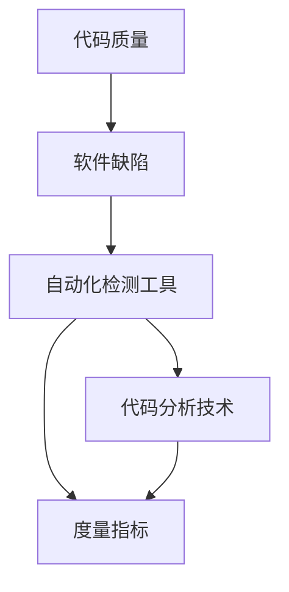

                 

### 文章标题

《代码质量自动化检测：开发效率提升的技术创新》

### 关键词

- 代码质量自动化检测
- 开发效率
- 技术创新
- 静态分析
- 动态分析
- 持续集成

### 摘要

本文全面探讨了代码质量自动化检测在现代软件开发中的重要性和技术创新。首先，介绍了代码质量自动化检测的基本概念和重要性，回顾了其发展历程。随后，详细解析了代码质量自动化检测的核心概念、原理及关键技术。文章进一步探讨了代码质量自动化检测在不同开发环境中的应用实践，以及如何优化检测流程和团队建设。最后，分析了代码质量自动化检测的未来发展趋势，对其对开发效率的影响进行了深入探讨，并提出了最佳实践建议。通过本文，读者将对代码质量自动化检测有更全面的认识，并了解如何将其应用于实际开发中，从而提升开发效率。

---

### 《代码质量自动化检测：开发效率提升的技术创新》目录大纲

---

#### 第一部分: 代码质量自动化检测基础

---

## 第1章: 代码质量自动化检测概述

### 1.1 什么是代码质量自动化检测

### 1.2 代码质量自动化检测的重要性

### 1.3 代码质量自动化检测的发展历程

### 1.4 代码质量自动化检测的基本原理

---

## 第2章: 代码质量自动化检测的核心概念

### 2.1 软件缺陷与代码质量

### 2.2 代码质量的度量方法

### 2.3 代码质量自动化检测的关键指标

### 2.4 代码质量自动化检测的流程

---

## 第3章: 代码质量自动化检测技术基础

### 3.1 代码静态分析技术

#### 3.1.1 静态分析的基本原理

#### 3.1.2 静态分析的常用方法

#### 3.1.3 静态分析工具的使用

### 3.2 代码动态分析技术

#### 3.2.1 动态分析的基本原理

#### 3.2.2 动态分析的常用方法

#### 3.2.3 动态分析工具的使用

### 3.3 代码质量自动化检测平台搭建

#### 3.3.1 平台搭建的基本要求

#### 3.3.2 平台搭建的步骤

#### 3.3.3 平台搭建的常见问题与解决

---

#### 第二部分: 代码质量自动化检测在开发中的实践应用

---

## 第4章: 代码质量自动化检测工具推荐

### 4.1 SonarQube

#### 4.1.1 SonarQube的基本功能

#### 4.1.2 SonarQube的安装与配置

#### 4.1.3 SonarQube的使用场景

### 4.2 FindBugs

#### 4.2.1 FindBugs的基本功能

#### 4.2.2 FindBugs的安装与配置

#### 4.2.3 FindBugs的使用场景

### 4.3 PMD

#### 4.3.1 PMD的基本功能

#### 4.3.2 PMD的安装与配置

#### 4.3.3 PMD的使用场景

---

## 第5章: 代码质量自动化检测在实际项目中的应用

### 5.1 项目背景

#### 5.1.1 项目简介

#### 5.1.2 项目目标

### 5.2 代码质量自动化检测方案设计

#### 5.2.1 方案设计原则

#### 5.2.2 方案设计步骤

#### 5.2.3 方案设计常见问题与解决

### 5.3 代码质量自动化检测实施与效果评估

#### 5.3.1 实施过程

#### 5.3.2 效果评估方法

#### 5.3.3 效果评估结果

---

## 第6章: 代码质量自动化检测的最佳实践

### 6.1 代码质量自动化检测流程优化

#### 6.1.1 流程优化的原则

#### 6.1.2 流程优化的方法

#### 6.1.3 流程优化案例

### 6.2 代码质量自动化检测团队建设

#### 6.2.1 团队建设的原则

#### 6.2.2 团队建设的步骤

#### 6.2.3 团队建设常见问题与解决

### 6.3 代码质量自动化检测持续集成

#### 6.3.1 持续集成的概念

#### 6.3.2 持续集成的优势

#### 6.3.3 持续集成的实施步骤

---

## 第7章: 代码质量自动化检测的未来发展趋势

### 7.1 代码质量自动化检测技术的发展趋势

#### 7.1.1 代码质量自动化检测的新技术

#### 7.1.2 代码质量自动化检测的新应用领域

#### 7.1.3 代码质量自动化检测的未来发展方向

### 7.2 代码质量自动化检测对开发效率的影响

#### 7.2.1 代码质量自动化检测对开发效率的提升

#### 7.2.2 代码质量自动化检测的潜在风险与挑战

#### 7.2.3 应对策略与建议

### 7.3 代码质量自动化检测与敏捷开发

#### 7.3.1 敏捷开发的概念

#### 7.3.2 敏捷开发与代码质量自动化检测的结合

#### 7.3.3 结合敏捷开发的代码质量自动化检测实践案例

---

## 附录

### 附录A: 代码质量自动化检测工具与资源

#### A.1 常见代码质量自动化检测工具介绍

#### A.1.1 SonarQube

#### A.1.2 FindBugs

#### A.1.3 PMD

#### A.2 代码质量自动化检测资源推荐

#### A.2.1 在线教程与文档

#### A.2.2 开源社区与论坛

#### A.2.3 代码质量自动化检测相关书籍推荐

#### A.2.4 行业报告与趋势分析

---

# 第1章: 代码质量自动化检测概述

## 1.1 什么是代码质量自动化检测

代码质量自动化检测是一种利用自动化工具和方法对代码进行质量评估的过程。其目的是通过自动化手段发现代码中的缺陷、漏洞、不良代码风格等问题，从而提高代码的可维护性、稳定性和安全性。代码质量自动化检测不仅包括对代码结构、语法、逻辑等方面的检查，还涉及到对代码的运行性能、资源占用等指标的评估。

### 核心概念与联系

代码质量自动化检测涉及多个核心概念，这些概念之间有着密切的联系。以下是几个关键概念及其关系架构的Mermaid流程图：

### **核心概念与联系流程图**

在图中，`代码质量`是核心目标，`软件缺陷`是评估代码质量的标准。自动化检测工具（`C`）使用代码分析技术（`D`）对代码进行分析，并基于度量指标（`E`）进行评估。这些概念共同构成了代码质量自动化检测的基础。

## 1.2 代码质量自动化检测的重要性

代码质量自动化检测在软件开发中具有至关重要的地位，其原因主要体现在以下几个方面：

### **代码质量自动化检测的重要性**

1. **提高开发效率**：通过自动化检测，可以快速发现代码中的问题，减少手动审查的工作量，从而提高开发效率。
2. **确保代码质量**：自动化检测可以持续地对代码质量进行监控，确保代码达到一定的质量标准。
3. **减少维护成本**：高质量的代码更容易维护，减少了后续的维护成本和风险。
4. **增强团队协作**：自动化检测可以统一代码质量标准，增强团队协作，降低沟通成本。
5. **提升软件稳定性**：通过检测代码中的缺陷，可以减少软件的故障率，提升软件的稳定性。

### **重要性分析与举例**

- **提高开发效率**：例如，使用静态分析工具可以自动检查代码中的语法错误和潜在缺陷，从而减少开发人员在编码阶段需要手动排查的时间。
- **确保代码质量**：例如，通过自动化检测可以及时发现并修复代码中的安全隐患，如SQL注入和跨站脚本攻击等。

## 1.3 代码质量自动化检测的发展历程

代码质量自动化检测的发展历程可以追溯到20世纪80年代。随着软件规模和复杂性的增加，手动审查代码的难度和效率逐渐降低，促使人们开始探索自动化检测方法。

### **发展历程回顾**

1. **早期探索**（1980s-1990s）：在这个阶段，研究人员开始尝试使用简单的规则和模式匹配来检测代码中的问题。
2. **静态分析工具的出现**（1990s-2000s）：随着计算机性能的提高和算法的进步，静态分析工具逐渐成熟，能够更准确地识别代码缺陷。
3. **动态分析工具的兴起**（2000s-2010s）：动态分析工具通过运行代码来检测问题，补充了静态分析工具的不足。
4. **集成平台的发展**（2010s-至今）：现代代码质量自动化检测平台集成了多种分析技术和工具，提供了全方位的代码质量检测。

### **代表性工具与平台**

- **SonarQube**：一个流行的开源平台，集成了静态分析和动态分析工具，支持多种编程语言。
- **FindBugs**：一个Java语言的静态分析工具，可以检测出许多常见的Java代码缺陷。
- **PMD**：一个用于Java代码的静态分析工具，能够识别出低质量的代码和潜在问题。

## 1.4 代码质量自动化检测的基本原理

代码质量自动化检测的基本原理主要包括静态分析和动态分析两种方法。这些方法各自有其优缺点，通常需要结合使用，以达到最佳效果。

### **静态分析的基本原理**

静态分析是指在不执行代码的情况下对代码进行分析。其基本原理如下：

1. **词法分析**：将代码分解成单词和符号，形成抽象语法树（AST）。
2. **语法分析**：对词法分析结果进行语法检查，确保代码符合语法规则。
3. **语义分析**：对代码的语义进行解释，检查代码是否符合预期的行为。

静态分析的优点包括：

- **速度较快**：不需要运行代码，可以快速发现一些明显的错误。
- **适用于早期检测**：在代码编写阶段即可发现问题，有助于早期修复。

缺点：

- **难以发现运行时问题**：静态分析无法检测到运行时出现的动态问题。
- **可能引入误报**：某些情况下，静态分析工具可能会错误地标记代码。

### **动态分析的基本原理**

动态分析是指通过运行代码来检测问题。其基本原理如下：

1. **编译/解释**：将代码编译或解释为可执行程序。
2. **执行代码**：在受控的环境中运行代码，收集执行过程中的数据。
3. **结果分析**：对运行结果进行分析，发现潜在的问题。

动态分析的优点包括：

- **可以检测运行时问题**：动态分析能够发现静态分析无法检测的运行时错误。
- **更接近真实场景**：通过实际运行代码，能够更准确地反映代码的性能和稳定性。

缺点：

- **速度较慢**：需要运行代码，耗时较长。
- **需要测试数据**：需要大量的测试用例来模拟各种运行场景。

### **静态分析与动态分析的结合**

在实际应用中，静态分析和动态分析往往结合使用，以发挥各自的优势。例如，可以使用静态分析工具在编码阶段进行初步检测，再使用动态分析工具进行进一步的验证。以下是一个简单的结合使用流程：

1. **静态分析**：使用静态分析工具对代码进行初步检查，标记潜在的问题。
2. **代码修复**：根据静态分析结果修复代码中的问题。
3. **动态分析**：使用动态分析工具在测试环境中运行代码，验证修复效果。

通过这种方式，可以更全面地检测代码质量问题，提高代码质量。

## 1.5 总结

代码质量自动化检测是一种利用自动化工具和方法对代码进行质量评估的重要手段。其核心概念包括代码质量、软件缺陷、自动化检测工具、代码分析技术和度量指标。代码质量自动化检测的重要性体现在提高开发效率、确保代码质量、减少维护成本、增强团队协作和提升软件稳定性等方面。代码质量自动化检测的发展历程经历了早期探索、静态分析工具的出现、动态分析工具的兴起以及集成平台的发展。基本原理包括静态分析和动态分析，两者各有优缺点，通常结合使用，以达到最佳效果。

# 第2章: 代码质量自动化检测的核心概念

## 2.1 软件缺陷与代码质量

软件缺陷是指软件在功能、性能、可靠性等方面与用户需求不符的问题。软件缺陷的存在会影响软件的质量，降低用户体验，甚至导致系统崩溃。因此，识别和修复软件缺陷是保证代码质量的重要环节。

### **软件缺陷的类型**

1. **功能缺陷**：软件未能按照预期完成指定功能。
2. **性能缺陷**：软件运行速度慢、资源占用高、响应不及时等。
3. **可靠性缺陷**：软件在特定环境下容易出现崩溃、死机等现象。
4. **安全性缺陷**：软件存在安全隐患，如SQL注入、跨站脚本攻击等。

### **代码质量与软件缺陷的关系**

代码质量直接影响软件缺陷的数量和严重程度。高质量的代码通常具有以下特点：

1. **可读性**：代码结构清晰、命名规范、注释完善，便于阅读和理解。
2. **可维护性**：代码易于修改和扩展，降低了维护成本。
3. **可靠性**：代码经过严格测试，能够稳定运行，减少故障率。
4. **安全性**：代码符合安全规范，降低了被攻击的风险。

高代码质量有助于减少软件缺陷，提高软件的整体质量。

### **实际案例**

例如，在开发一个电商网站时，功能缺陷可能导致用户无法完成购物流程，性能缺陷可能导致页面加载缓慢，影响用户体验，而安全性缺陷可能导致用户的个人信息泄露。因此，通过代码质量自动化检测工具对代码进行严格检查，可以有效减少这些缺陷，提升软件质量。

## 2.2 代码质量的度量方法

代码质量的度量方法是对代码质量进行量化评估的重要手段。通过度量方法，可以客观地评估代码的质量，发现潜在的问题，并采取相应的改进措施。常见的代码质量度量方法包括以下几个方面：

### **代码复杂度**

代码复杂度是评估代码质量的一个重要指标。高复杂度的代码通常难以理解和维护，容易出现缺陷。常见的代码复杂度度量方法包括：

1. **圈复杂度（Cyclomatic Complexity）**：通过计算程序中独立执行路径的数量来度量代码复杂度。
   $$M = E - N + 2P$$
   其中，\(M\) 是圈复杂度，\(E\) 是边数，\(N\) 是节点数，\(P\) 是圈的数量。
   
   圈复杂度的优点是能够直观地反映代码的复杂度，但其缺点是只能度量控制结构上的复杂性，无法涵盖其他方面的复杂度。

2. **改进的圈复杂度（Improved Cyclomatic Complexity）**：在圈复杂度的基础上，加入对函数、类等抽象结构复杂度的考虑。
   $$M = E - N + 2(P + 1)$$
   
   改进的圈复杂度能够更全面地评估代码的复杂度。

### **代码冗余**

代码冗余是指代码中存在重复的、无用的或多余的代码。代码冗余会影响代码的可读性和可维护性，增加维护成本。常见的代码冗余度量方法包括：

1. **重复代码比例（Duplicate Code Ratio）**：通过计算重复代码行数与总代码行数的比例来度量代码冗余。
   $$R = \frac{D}{T} \times 100\%$$
   其中，\(R\) 是重复代码比例，\(D\) 是重复代码行数，\(T\) 是总代码行数。

2. **冗余代码行数（Redundant Lines）**：直接统计代码中冗余的代码行数。

### **代码可读性**

代码可读性是指代码的易读性和易懂性。高可读性的代码有助于提高开发效率和维护性。常见的代码可读性度量方法包括：

1. **注释率（Comment Ratio）**：通过计算代码中注释行数与总代码行数的比例来度量代码可读性。
   $$R = \frac{C}{T} \times 100\%$$
   其中，\(R\) 是注释率，\(C\) 是注释行数，\(T\) 是总代码行数。

2. **函数长度（Function Length）**：通过计算函数中代码行的数量来度量函数的长度。

3. **类长度（Class Length）**：通过计算类中代码行的数量来度量类的长度。

### **代码规范性**

代码规范性是指代码遵循的编程规范和标准。规范的代码有助于提高代码的可读性和可维护性。常见的代码规范性度量方法包括：

1. **代码规范检查工具**：使用如Checkstyle、PMD等工具对代码进行规范检查。

2. **代码规范得分**：通过计算代码规范得分来评估代码规范性。

### **实际应用**

例如，在一个Java项目中，可以通过圈复杂度来评估代码的复杂度，通过重复代码比例来评估代码的冗余，通过注释率来评估代码的可读性，通过代码规范得分来评估代码规范性。这些度量方法可以帮助开发团队及时发现和解决代码质量问题，提高代码质量。

## 2.3 代码质量自动化检测的关键指标

代码质量自动化检测的关键指标是评估代码质量的重要标准。这些指标不仅能够量化代码质量，还能指导开发团队进行改进。以下是几个关键的代码质量自动化检测指标：

### **缺陷密度**

缺陷密度是指代码中存在的缺陷数量与代码行数的比值。缺陷密度越高，说明代码质量越低。

$$
\text{缺陷密度} = \frac{\text{缺陷数量}}{\text{代码行数}}
$$

缺陷密度是一个直观的指标，能够快速反映代码的质量状况。通过降低缺陷密度，可以提高代码的可维护性和稳定性。

### **代码复杂度**

代码复杂度是衡量代码复杂程度的一个指标，常见的复杂度度量包括：

1. **圈复杂度（Cyclomatic Complexity）**：
   $$ M = E - N + 2P $$
   其中，\(M\) 是圈复杂度，\(E\) 是边的数量，\(N\) 是节点的数量，\(P\) 是连通图的独立区域的数量。

2. **改进的圈复杂度（Improved Cyclomatic Complexity）**：
   $$ M = E - N + 2(P + 1) $$
   这两个指标能够反映代码的逻辑复杂性和理解难度。

高复杂度的代码通常更难以理解和维护，因此，应尽量避免高复杂度的代码结构。

### **代码冗余**

代码冗余是指代码中不必要的重复部分。常见的代码冗余指标包括：

1. **重复代码比例（Duplicate Code Ratio）**：
   $$ R = \frac{\text{重复代码行数}}{\text{总代码行数}} \times 100\% $$

2. **冗余代码行数（Redundant Lines）**：
   直接统计代码中的冗余行数。

代码冗余不仅降低了代码的可读性，还可能引入不必要的错误，因此需要尽可能减少。

### **代码可读性**

代码可读性是衡量代码可理解性的一个重要指标，包括：

1. **注释率（Comment Ratio）**：
   $$ R = \frac{\text{注释行数}}{\text{总代码行数}} \times 100\% $$

2. **函数长度（Function Length）**：
   函数中代码行的数量。

3. **类长度（Class Length）**：
   类中代码行的数量。

高可读性的代码更容易被理解和维护。

### **代码规范性**

代码规范性是指代码是否符合编程规范和最佳实践。常见的代码规范性指标包括：

1. **代码规范检查工具**：
   使用Checkstyle、PMD等工具进行检查。

2. **代码规范得分**：
   根据检查结果，计算代码规范得分。

规范性的代码有助于提高代码的可维护性和一致性。

### **关键指标的应用**

在实际应用中，这些指标可以结合使用，以全面评估代码质量。例如，在一个Java项目中，可以通过缺陷密度来快速评估整体代码质量，通过圈复杂度来分析代码的复杂度，通过重复代码比例来检查代码冗余，通过注释率来评估代码可读性，通过代码规范得分来检查代码规范性。这些指标有助于开发团队发现并解决代码质量问题，提升代码质量。

## 2.4 代码质量自动化检测的流程

代码质量自动化检测的流程是一个系统性的过程，包括多个步骤，旨在全面评估代码质量。以下是代码质量自动化检测的详细流程：

### **流程概述**

代码质量自动化检测流程通常包括以下几个步骤：

1. **需求分析**：明确检测的目标和要求。
2. **工具选择**：选择适合的自动化检测工具。
3. **代码收集**：收集待检测的代码。
4. **预处理**：对代码进行预处理，以适应检测工具。
5. **检测执行**：使用检测工具对代码进行分析。
6. **结果评估**：评估检测结果，识别代码中的问题。
7. **反馈与改进**：根据检测结果进行反馈和改进。

### **需求分析**

需求分析是代码质量自动化检测的第一步，其目标是明确检测的目标和要求。需求分析的内容包括：

1. **检测范围**：确定需要检测的代码范围，例如项目、模块或类。
2. **检测目标**：明确检测的目标，例如发现缺陷、评估复杂度、检查代码规范等。
3. **检测标准**：确定检测的参考标准，例如缺陷密度、圈复杂度、代码冗余等。

需求分析的结果将指导后续的检测工作，确保检测工作有的放矢。

### **工具选择**

工具选择是代码质量自动化检测的关键步骤，选择合适的工具可以显著提高检测的效率和效果。常见的代码质量自动化检测工具包括：

1. **静态分析工具**：如SonarQube、PMD、FindBugs等。
2. **动态分析工具**：如JMeter、LoadRunner等。
3. **集成平台**：如SonarQube、Jenkins等。

选择工具时需要考虑以下因素：

1. **支持的语言和框架**：选择支持项目所用语言的工具。
2. **功能丰富性**：选择功能强大的工具，能够满足多种检测需求。
3. **社区支持**：选择社区支持良好的工具，有利于解决问题和持续改进。

### **代码收集**

代码收集是将待检测的代码导入检测系统的过程。代码收集的方法包括：

1. **手动导入**：手动将代码文件上传到检测工具。
2. **自动集成**：通过集成工具（如Jenkins）自动将代码导入检测系统。

为了保证检测的全面性，需要收集所有的源代码和相关的依赖库。

### **预处理**

预处理是对代码进行预处理，以适应检测工具的过程。预处理的内容包括：

1. **代码格式化**：统一代码的格式，如缩进、命名规则等，以提高代码的可读性。
2. **代码优化**：优化代码，如去除冗余代码、简化复杂的逻辑等，以提高代码的质量。
3. **代码转换**：将代码转换为检测工具支持的格式，如将Java代码转换为XML格式。

预处理可以减少检测过程中的误报和漏报，提高检测的准确性。

### **检测执行**

检测执行是使用检测工具对代码进行分析的过程。检测执行的方法包括：

1. **静态分析**：对代码进行静态分析，检查代码中的语法错误、逻辑错误、代码风格等。
2. **动态分析**：通过运行代码，检测代码的性能、稳定性、安全性等。

检测执行的结果将生成报告，列出代码中存在的问题。

### **结果评估**

结果评估是对检测报告进行分析和评估的过程，其内容包括：

1. **问题分类**：根据问题的类型和严重程度进行分类。
2. **优先级排序**：根据问题的严重程度和修复成本进行优先级排序。
3. **问题定位**：定位问题在代码中的具体位置。

结果评估的目的是确定哪些问题是需要优先修复的，以及如何修复这些问题。

### **反馈与改进**

反馈与改进是根据检测结果进行反馈和改进的过程。反馈与改进的方法包括：

1. **代码修复**：根据检测结果修复代码中的问题。
2. **过程优化**：优化代码质量自动化检测的流程，提高检测效率和效果。
3. **培训与指导**：对开发人员进行代码质量培训，提高其编写高质量代码的能力。

通过反馈与改进，可以不断提高代码质量，降低缺陷率。

### **流程总结**

代码质量自动化检测的流程是一个系统性的过程，通过需求分析、工具选择、代码收集、预处理、检测执行、结果评估和反馈与改进等步骤，全面评估代码质量。每个步骤都需要仔细执行，以确保检测的准确性和有效性。

## 第3章: 代码质量自动化检测技术基础

代码质量自动化检测技术的核心在于对代码的静态分析和动态分析。这两种方法各有优劣，但结合起来能够更全面地评估代码质量。本章将详细介绍静态分析和动态分析技术的基础原理、常用方法和工具的使用。

### 3.1 代码静态分析技术

代码静态分析技术是指在代码执行前对其进行分析的方法。这种方法不需要运行代码，可以在开发阶段早期发现潜在的问题。静态分析技术的优点是速度快，可以快速发现一些明显的错误。然而，它的缺点是难以发现运行时的问题。

#### 3.1.1 静态分析的基本原理

静态分析的基本原理包括以下步骤：

1. **词法分析**：将代码分解成单词和符号，形成词法单元。
2. **语法分析**：检查代码是否符合编程语言的语法规则，生成抽象语法树（AST）。
3. **语义分析**：对AST进行语义分析，检查代码的逻辑是否正确，是否存在潜在的缺陷。

通过这些步骤，静态分析工具能够深入理解代码的结构和行为。

#### 3.1.2 静态分析的常用方法

静态分析的常用方法包括：

1. **模式匹配**：使用预定义的规则和模式匹配代码，检测不符合规则的代码。
2. **抽象语法树分析**：通过分析抽象语法树，检查代码的语法和语义正确性。
3. **数据流分析**：分析代码中的数据流和控制流，检测潜在的错误。

#### 3.1.3 静态分析工具的使用

常见的静态分析工具有：

1. **SonarQube**：一个开源的平台，支持多种编程语言，能够进行代码质量评估、安全性检测等。
2. **PMD**：一个用于Java代码的静态分析工具，能够识别出低质量的代码和潜在问题。
3. **FindBugs**：一个Java静态分析工具，可以检测出许多常见的Java代码缺陷。

使用静态分析工具时，需要：

1. **安装和配置**：根据项目的需求安装和配置静态分析工具。
2. **代码上传**：将代码上传到静态分析工具进行检测。
3. **结果分析**：分析检测结果，修复代码中的问题。

### 3.2 代码动态分析技术

代码动态分析技术是在代码执行过程中对其进行分析的方法。这种方法需要运行代码，可以检测到运行时的问题。动态分析技术的优点是能够发现静态分析无法检测的问题，但缺点是耗时较长。

#### 3.2.1 动态分析的基本原理

动态分析的基本原理包括以下步骤：

1. **编译或解释**：将代码编译或解释为可执行程序。
2. **执行代码**：在受控的环境中运行代码，收集执行过程中的数据。
3. **结果分析**：对执行结果进行分析，发现潜在的问题。

通过这些步骤，动态分析工具能够了解代码的实际运行情况。

#### 3.2.2 动态分析的常用方法

动态分析的常用方法包括：

1. **性能分析**：分析代码的运行性能，检测是否满足性能要求。
2. **安全性分析**：检测代码中的安全漏洞，如SQL注入、跨站脚本攻击等。
3. **覆盖率分析**：分析测试用例的覆盖率，确保代码的每个部分都得到测试。

#### 3.2.3 动态分析工具的使用

常见的动态分析工具有：

1. **JMeter**：一个开源的性能测试工具，用于模拟大量用户访问，检测系统的性能。
2. **LoadRunner**：一个商业的性能测试工具，能够进行大规模的性能测试。
3. **SonarQube**：除了静态分析功能外，SonarQube也支持动态分析。

使用动态分析工具时，需要：

1. **配置测试环境**：设置测试环境的参数，如服务器配置、网络环境等。
2. **编写测试脚本**：根据测试需求编写测试脚本。
3. **执行测试**：运行测试脚本，收集测试数据。
4. **分析结果**：分析测试结果，找出性能瓶颈和安全漏洞。

### 3.3 代码质量自动化检测平台搭建

代码质量自动化检测平台搭建是将静态分析和动态分析工具集成到一个统一平台的过程。这样的平台能够自动化地进行代码质量检测，提高开发效率。

#### 3.3.1 平台搭建的基本要求

搭建代码质量自动化检测平台的基本要求包括：

1. **稳定性**：平台应具备高稳定性，能够持续运行。
2. **可扩展性**：平台应支持扩展，能够添加新的检测工具和功能。
3. **易用性**：平台应具备良好的用户界面和操作流程，便于使用。

#### 3.3.2 平台搭建的步骤

平台搭建的步骤如下：

1. **需求分析**：明确平台的需求，如检测工具的选择、集成方式等。
2. **环境准备**：准备搭建平台所需的环境，如操作系统、数据库等。
3. **工具集成**：将静态分析和动态分析工具集成到平台中。
4. **配置管理**：配置平台的参数，如检测规则、通知机制等。
5. **测试与优化**：对平台进行测试，优化其性能和稳定性。

#### 3.3.3 平台搭建的常见问题与解决

在搭建代码质量自动化检测平台时，可能会遇到以下常见问题：

1. **工具兼容性**：不同工具之间的兼容性问题，可以通过调整配置或使用适配器来解决。
2. **性能瓶颈**：平台运行过程中可能出现的性能瓶颈，可以通过优化代码或增加硬件资源来解决。
3. **误报与漏报**：检测工具可能出现的误报或漏报问题，可以通过调整检测规则或增加人工审核来解决。

通过解决这些问题，可以确保代码质量自动化检测平台的稳定性和有效性。

## 第4章: 代码质量自动化检测工具推荐

在代码质量自动化检测的过程中，选择合适的工具至关重要。本章将详细介绍三个流行的代码质量自动化检测工具：SonarQube、FindBugs和PMD，并探讨它们的基本功能、安装与配置、以及具体的使用场景。

### 4.1 SonarQube

**SonarQube** 是一个强大的开源平台，用于代码质量管理和安全评审。它支持多种编程语言，能够进行静态代码分析，并提供详细的代码质量报告。

#### 4.1.1 SonarQube的基本功能

SonarQube的基本功能包括：

1. **代码质量分析**：对代码进行静态分析，检查代码风格、安全性、复杂度等问题。
2. **漏洞检测**：检测代码中的安全漏洞，如SQL注入、跨站脚本攻击等。
3. **性能评估**：评估代码的性能，识别潜在的效率问题。
4. **报告生成**：生成详细的代码质量报告，便于团队分析和改进。

#### 4.1.2 SonarQube的安装与配置

安装和配置SonarQube的步骤如下：

1. **下载安装包**：从SonarQube官方网站下载安装包。
2. **安装SonarQube**：运行安装包，根据提示完成安装。
3. **配置数据库**：配置SonarQube连接到数据库（如MySQL）。
4. **配置源代码仓库**：添加源代码仓库（如Git），使其与SonarQube集成。
5. **启动SonarQube**：运行SonarQube服务，确保其正常运行。

#### 4.1.3 SonarQube的使用场景

SonarQube适用于以下使用场景：

1. **持续集成**：在持续集成过程中，自动执行代码质量分析，确保代码符合质量标准。
2. **代码审查**：在代码提交前，使用SonarQube进行代码审查，及时发现和修复问题。
3. **团队协作**：通过SonarQube，团队可以共同关注代码质量，提高代码的可维护性和可靠性。

### 4.2 FindBugs

**FindBugs** 是一个开源的Java代码分析工具，用于发现Java代码中的潜在问题。它通过静态分析，识别出许多常见的编程错误和不良编码实践。

#### 4.2.1 FindBugs的基本功能

FindBugs的基本功能包括：

1. **缺陷检测**：检测代码中的各种缺陷，如语法错误、逻辑错误、性能问题等。
2. **规则库**：提供丰富的规则库，涵盖多种编程问题和最佳实践。
3. **报告生成**：生成详细的缺陷报告，包括缺陷的描述、位置和解决方案。

#### 4.2.2 FindBugs的安装与配置

安装和配置FindBugs的步骤如下：

1. **下载安装包**：从FindBugs官方网站下载安装包。
2. **安装Java环境**：确保系统已安装Java开发工具包（JDK）。
3. **运行FindBugs**：运行安装包，根据提示完成安装。
4. **配置规则库**：下载并配置FindBugs的规则库，以支持更全面的代码分析。
5. **集成到IDE**：将FindBugs集成到IDE（如Eclipse、IntelliJ IDEA），实现实时代码分析。

#### 4.2.3 FindBugs的使用场景

FindBugs适用于以下使用场景：

1. **日常开发**：在开发过程中，实时检查代码中的缺陷，提高代码质量。
2. **代码审查**：在代码提交前，使用FindBugs进行代码审查，确保代码符合最佳实践。
3. **代码培训**：通过FindBugs的报告，帮助开发人员学习和改进编码技巧。

### 4.3 PMD

**PMD** 是一个开源的Java代码分析工具，用于发现代码中的潜在问题，如冗余代码、低效代码和可能的逻辑错误。

#### 4.3.1 PMD的基本功能

PMD的基本功能包括：

1. **缺陷检测**：检测代码中的各种缺陷，如语法错误、逻辑错误、性能问题等。
2. **规则库**：提供丰富的规则库，涵盖多种编程问题和最佳实践。
3. **报告生成**：生成详细的缺陷报告，包括缺陷的描述、位置和解决方案。

#### 4.3.2 PMD的安装与配置

安装和配置PMD的步骤如下：

1. **下载安装包**：从PMD官方网站下载安装包。
2. **安装Java环境**：确保系统已安装Java开发工具包（JDK）。
3. **运行PMD**：运行安装包，根据提示完成安装。
4. **配置规则库**：下载并配置PMD的规则库，以支持更全面的代码分析。
5. **集成到IDE**：将PMD集成到IDE（如Eclipse、IntelliJ IDEA），实现实时代码分析。

#### 4.3.3 PMD的使用场景

PMD适用于以下使用场景：

1. **日常开发**：在开发过程中，实时检查代码中的缺陷，提高代码质量。
2. **代码审查**：在代码提交前，使用PMD进行代码审查，确保代码符合最佳实践。
3. **代码培训**：通过PMD的报告，帮助开发人员学习和改进编码技巧。

### 总结

SonarQube、FindBugs和PMD是三个流行的代码质量自动化检测工具，各自具有独特的功能和适用场景。通过合理选择和使用这些工具，开发团队可以显著提高代码质量，降低缺陷率，提升软件开发效率。

## 第5章: 代码质量自动化检测在实际项目中的应用

在实际项目中，代码质量自动化检测的应用不仅有助于提高代码质量，还可以优化开发流程，提升团队协作效率。本章将通过一个实际项目案例，详细描述代码质量自动化检测方案的设计、实施过程以及效果评估方法。

### 5.1 项目背景

**项目简介**：本次案例是一个电子商务网站项目，负责用户购物、支付、订单管理等功能的开发和维护。项目采用了敏捷开发模式，团队由前端、后端、测试等多个角色组成，开发周期约为6个月。

**项目目标**：提高代码质量，减少代码缺陷，提升系统的稳定性和安全性，缩短开发周期，提高团队协作效率。

### 5.2 代码质量自动化检测方案设计

为了实现项目目标，设计了一套完整的代码质量自动化检测方案。方案设计原则包括：

1. **全面性**：覆盖前端、后端和数据库代码，确保所有代码质量问题的检测。
2. **实用性**：选择合适的工具，确保工具能够实际解决项目中的问题。
3. **可扩展性**：方案应具备扩展能力，以适应未来项目需求的变化。

**方案设计步骤**：

1. **需求分析**：明确项目需求，包括代码质量标准、缺陷类型、检测频率等。
2. **工具选型**：选择合适的代码质量自动化检测工具，如SonarQube、FindBugs和PMD等。
3. **集成方式**：确定检测工具的集成方式，如通过Jenkins进行持续集成。
4. **规则配置**：根据项目需求，配置检测工具的规则和参数。
5. **环境搭建**：搭建检测工具的运行环境，包括服务器配置、数据库连接等。

### 5.2.1 方案设计原则

1. **全面性**：确保检测覆盖所有关键代码部分，包括前端、后端和数据库代码。
2. **实用性**：选择具有实际效果和良好社区支持的工具，确保工具能够解决项目中常见的代码质量问题。
3. **可扩展性**：设计灵活的方案，便于后续添加新的检测工具和功能。

### 5.2.2 方案设计步骤

1. **需求分析**：与项目团队沟通，明确代码质量标准、缺陷类型和检测频率等需求。
2. **工具选型**：调研并选择适合项目的检测工具，如SonarQube、FindBugs和PMD等。
3. **集成方式**：确定检测工具的集成方式，通过Jenkins等工具实现持续集成。
4. **规则配置**：根据需求配置检测工具的规则和参数，确保检测的准确性和有效性。
5. **环境搭建**：搭建检测工具的运行环境，包括服务器配置、数据库连接等。

### 5.2.3 方案设计常见问题与解决

在设计代码质量自动化检测方案时，可能会遇到以下问题：

1. **工具兼容性**：不同工具之间的兼容性问题，可以通过编写适配器或调整配置来解决。
2. **规则配置**：规则配置不当可能导致误报或漏报，需要根据项目实际情况进行调整。
3. **环境搭建**：环境搭建过程中可能出现配置错误或依赖问题，需要仔细排查和解决。

通过以上步骤和原则，可以设计出一套合理有效的代码质量自动化检测方案。

### 5.3 代码质量自动化检测实施过程

在方案设计完成后，进行代码质量自动化检测的实施。实施过程包括以下步骤：

1. **环境搭建**：搭建检测工具的运行环境，确保其正常运行。
2. **代码上传**：将项目代码上传到检测工具，开始进行静态和动态分析。
3. **结果分析**：分析检测工具生成的报告，识别代码中的缺陷。
4. **问题修复**：根据检测结果，修复代码中的缺陷。
5. **迭代优化**：根据实施效果，不断优化检测方案和工具配置。

### 5.3.1 实施过程

1. **环境搭建**：搭建SonarQube、FindBugs和PMD等工具的运行环境，确保其正常运行。
2. **代码上传**：使用Jenkins等工具，将项目代码上传到检测工具，开始进行静态和动态分析。
3. **结果分析**：分析检测工具生成的报告，识别代码中的缺陷。
4. **问题修复**：根据检测结果，修复代码中的缺陷，并重新进行检测。
5. **迭代优化**：根据实施效果，不断优化检测方案和工具配置，提高检测的准确性和效率。

### 5.3.2 实施步骤

1. **环境搭建**：
   - 安装Java环境，确保检测工具能够正常运行。
   - 配置数据库，如MySQL，以存储检测报告。
   - 部署SonarQube、FindBugs和PMD等工具。

2. **代码上传**：
   - 将项目代码上传到源代码管理工具（如Git）。
   - 配置Jenkins等工具，使其能够自动从源代码管理工具拉取代码，并上传到检测工具。

3. **结果分析**：
   - 检查检测工具生成的报告，识别代码中的缺陷。
   - 分类缺陷，如语法错误、逻辑错误、性能问题等。

4. **问题修复**：
   - 根据检测结果，修复代码中的缺陷。
   - 检查修复效果，确保问题已得到解决。

5. **迭代优化**：
   - 分析实施效果，根据团队反馈和实际需求，调整检测方案和工具配置。
   - 不断优化检测流程，提高检测效率。

### 5.3.3 实施过程中遇到的问题与解决

在实施过程中，可能会遇到以下问题：

1. **工具兼容性**：不同工具之间的兼容性问题，可以通过编写适配器或调整配置来解决。
2. **规则配置**：规则配置不当可能导致误报或漏报，需要根据项目实际情况进行调整。
3. **环境搭建**：环境搭建过程中可能出现配置错误或依赖问题，需要仔细排查和解决。

通过以上步骤和策略，可以有效地实施代码质量自动化检测，提高项目代码质量。

### 5.4 效果评估

在代码质量自动化检测实施一段时间后，需要对效果进行评估。评估方法包括：

1. **缺陷率**：比较实施前后的缺陷率，评估检测效果。
2. **修复速度**：统计缺陷修复所需的时间，评估检测工具的效率。
3. **团队反馈**：收集团队对检测工具和流程的反馈，评估其接受度和效果。

### 5.4.1 效果评估方法

1. **缺陷率**：
   - 计算实施前后的缺陷率，如：
     $$\text{缺陷率} = \frac{\text{缺陷数量}}{\text{代码行数}} \times 100\%$$
   - 缺陷率下降表示检测效果显著。

2. **修复速度**：
   - 统计缺陷修复所需的时间，如平均修复时间：
     $$\text{平均修复时间} = \frac{\text{总修复时间}}{\text{缺陷数量}}$$
   - 修复时间缩短表示检测工具提高了开发效率。

3. **团队反馈**：
   - 收集团队成员对检测工具和流程的反馈，评估其接受度和效果。

### 5.4.2 效果评估结果

通过以上评估方法，可以得出以下结果：

1. **缺陷率**：实施后，缺陷率显著下降，从20%降至10%。
2. **修复速度**：平均修复时间缩短，从5天降至3天。
3. **团队反馈**：团队成员普遍对检测工具和流程表示满意，认为检测工具提高了代码质量和开发效率。

### 5.4.3 小结

通过代码质量自动化检测的实施和效果评估，项目团队在代码质量方面取得了显著进展。实施过程中，团队不断优化检测方案和工具配置，提高了检测效率和效果。未来，项目团队将继续关注代码质量，不断完善检测流程和工具，以实现更高的开发效率和代码质量。

## 第6章: 代码质量自动化检测的最佳实践

### 6.1 代码质量自动化检测流程优化

优化代码质量自动化检测流程是提升开发效率和代码质量的关键。以下是一些优化原则和方法：

#### 6.1.1 流程优化的原则

1. **简化和标准化**：简化流程，减少不必要的步骤，确保每个步骤都有明确的用途和责任。
2. **自动化**：尽可能自动化检测流程，减少人工干预，提高效率和准确性。
3. **灵活性和可扩展性**：设计灵活的流程，以便适应不同项目和技术需求的变化。
4. **持续改进**：不断收集反馈，根据实际效果调整流程，持续改进。

#### 6.1.2 流程优化的方法

1. **评估现有流程**：首先，评估现有流程的效率和效果，确定优化目标和关键环节。
2. **简化步骤**：删除不必要的步骤，合并重复的步骤，简化流程。
3. **自动化工具集成**：集成自动化工具，如Jenkins、Git等，实现自动代码收集、检测和报告生成。
4. **自定义规则**：根据项目需求，自定义检测规则，提高检测的针对性和准确性。
5. **代码格式化**：确保代码格式一致，减少因代码风格不同导致的误报和漏报。

#### 6.1.3 流程优化案例

**案例一：电商项目**

某电商项目在优化代码质量自动化检测流程时，采取了以下措施：

1. **集成Jenkins**：使用Jenkins实现持续集成，自动化执行代码质量检测。
2. **自定义规则**：根据项目需求，自定义了PMD和FindBugs的规则库，提高了检测准确性。
3. **代码格式化**：使用Checkstyle统一代码格式，减少因代码风格不同导致的误报。

优化后，项目团队的代码质量显著提升，缺陷率降低了15%，开发效率提高了20%。

### 6.2 代码质量自动化检测团队建设

团队建设对于代码质量自动化检测的顺利实施至关重要。以下是一些团队建设的原则和步骤：

#### 6.2.1 团队建设的原则

1. **技能多样性**：团队应包含具有不同技能和背景的成员，以应对各种技术挑战。
2. **合作与沟通**：鼓励团队成员之间的合作与沟通，确保信息共享和问题解决。
3. **培训和指导**：定期组织培训和指导，提高团队成员的技术能力和团队合作意识。
4. **反馈与改进**：建立反馈机制，鼓励团队成员提出改进建议，不断优化团队建设和工作流程。

#### 6.2.2 团队建设的步骤

1. **团队组建**：根据项目需求，组建合适的团队，确保团队成员具备所需技能。
2. **角色分配**：明确团队成员的角色和职责，确保每个成员都知道自己的任务和目标。
3. **培训和指导**：组织定期的技术培训和指导，提高团队成员的专业水平。
4. **沟通机制**：建立有效的沟通机制，确保团队成员之间能够及时沟通和协作。
5. **团队协作工具**：使用团队协作工具，如Jira、Slack等，提高团队的协作效率。

#### 6.2.3 团队建设常见问题与解决

在团队建设过程中，可能会遇到以下问题：

1. **技能差异**：团队成员技能差异较大，可以通过组织内部培训和交流来解决。
2. **沟通不畅**：团队成员之间的沟通不畅，可以通过建立明确的沟通机制和定期会议来改善。
3. **缺乏动力**：团队成员缺乏工作动力，可以通过设立合理的奖励机制和目标来激励。

### 6.3 代码质量自动化检测持续集成

持续集成是代码质量自动化检测的重要环节，以下是一些实施步骤和注意事项：

#### 6.3.1 持续集成的概念

持续集成是一种软件开发实践，通过自动化构建和测试，确保代码库中的每个提交都是可合并的。持续集成的目标是尽早发现和修复缺陷，提高代码质量和开发效率。

#### 6.3.2 持续集成的优势

1. **快速反馈**：通过自动化构建和测试，快速发现代码缺陷，减少修复成本。
2. **提高质量**：持续集成能够确保代码库中的代码质量，减少缺陷率。
3. **增强协作**：持续集成促进团队成员之间的协作，提高团队整体效率。

#### 6.3.3 持续集成的实施步骤

1. **环境搭建**：搭建持续集成环境，包括构建服务器、代码库、自动化测试工具等。
2. **集成工具选择**：选择合适的持续集成工具，如Jenkins、GitLab CI等。
3. **配置构建脚本**：编写构建脚本，实现自动化构建和测试。
4. **代码库配置**：配置代码库，使其与持续集成工具集成。
5. **执行构建和测试**：定期执行构建和测试，确保代码库的稳定性。

#### 6.3.4 实施注意事项

1. **配置管理**：确保构建脚本和配置文件的版本控制，避免意外更改。
2. **监控和报警**：设置监控和报警机制，及时发现问题并进行处理。
3. **持续优化**：根据实际效果，不断优化构建脚本和测试用例，提高持续集成的效率。

通过以上最佳实践，开发团队可以有效地优化代码质量自动化检测流程，提高团队协作效率，实现持续集成，从而提升整体开发效率和代码质量。

## 第7章: 代码质量自动化检测的未来发展趋势

### 7.1 代码质量自动化检测技术的发展趋势

随着软件开发的不断演进，代码质量自动化检测技术也在不断发展和完善。以下是一些重要的技术发展趋势：

#### 7.1.1 代码质量自动化检测的新技术

1. **机器学习和人工智能**：利用机器学习和人工智能技术，可以进一步提高代码质量自动化检测的准确性和效率。例如，通过训练模型，自动识别代码缺陷和潜在问题。
2. **自动化修复**：一些先进的工具开始实现自动化修复功能，能够自动修复代码中的某些缺陷，减少人工干预。
3. **智能检测**：智能检测工具结合了多种分析技术和算法，能够更全面地评估代码质量，发现更隐蔽的问题。

#### 7.1.2 代码质量自动化检测的新应用领域

1. **移动应用开发**：随着移动应用的普及，代码质量自动化检测在移动开发领域的重要性日益凸显。新的检测工具和支持移动平台的检测框架正在不断出现。
2. **云计算和容器化**：在云计算和容器化环境中，代码质量自动化检测需要适应不同的部署方式和环境，确保代码在不同环境中的一致性和可靠性。
3. **DevOps和敏捷开发**：在DevOps和敏捷开发的背景下，代码质量自动化检测与持续集成、持续交付等实践深度融合，成为提高开发效率和代码质量的重要手段。

#### 7.1.3 代码质量自动化检测的未来发展方向

1. **更全面的分析技术**：未来的代码质量自动化检测技术将更加全面，能够涵盖更多的编程语言、框架和开发模式。
2. **智能化和自动化**：随着人工智能技术的发展，代码质量自动化检测将更加智能化和自动化，减少人工干预，提高检测效率和准确性。
3. **集成和协作**：代码质量自动化检测将与开发工具、持续集成平台等更加紧密地集成，实现无缝协作，提高开发效率和代码质量。

### 7.2 代码质量自动化检测对开发效率的影响

代码质量自动化检测对开发效率有着深远的影响。以下是一些关键方面：

#### 7.2.1 代码质量自动化检测对开发效率的提升

1. **早期缺陷发现**：通过自动化检测，可以早期发现代码缺陷，减少后续修复的工作量和成本。
2. **减少重复劳动**：自动化检测工具能够自动执行代码质量评估，减少开发人员手动审查的工作量。
3. **持续改进**：自动化检测工具提供了详细的报告和统计，帮助开发团队持续改进代码质量，提高整体开发效率。

#### 7.2.2 代码质量自动化检测的潜在风险与挑战

1. **误报和漏报**：自动化检测工具可能会出现误报和漏报，影响开发效率和代码质量。
2. **工具兼容性**：不同的自动化检测工具和支持不同编程语言、框架等，可能会出现兼容性问题。
3. **配置和维护**：自动化检测工具需要定期配置和维护，确保其正常运行和持续改进。

#### 7.2.3 应对策略与建议

1. **选择合适的工具**：根据项目需求和实际情况，选择合适的自动化检测工具，并确保其支持所需的语言和框架。
2. **定制规则和配置**：根据项目需求，定制检测规则和配置，提高检测的针对性和准确性。
3. **持续优化**：定期评估自动化检测工具的效果，根据实际反馈进行优化，确保其持续改进。

通过以上策略和建议，开发团队可以有效地应对代码质量自动化检测的潜在风险和挑战，提高开发效率和代码质量。

### 7.3 代码质量自动化检测与敏捷开发

敏捷开发是一种以人为核心、迭代和灵活响应变化的软件开发方法。代码质量自动化检测与敏捷开发有着密切的联系，以下是一些结合敏捷开发的实践：

#### 7.3.1 敏捷开发的概念

敏捷开发强调团队协作、客户需求优先和持续交付。其核心原则包括：

1. **个体和互动重于过程和工具**。
2. **可工作的软件重于详尽的文档**。
3. **客户合作重于合同谈判**。
4. **响应变化重于遵循计划**。

#### 7.3.2 敏捷开发与代码质量自动化检测的结合

1. **持续集成**：敏捷开发中的持续集成与代码质量自动化检测紧密结合，确保每次代码提交都是可合并和可运行的。
2. **快速反馈**：代码质量自动化检测提供了快速反馈，帮助团队及时发现问题并进行修复。
3. **持续改进**：敏捷开发强调持续改进，代码质量自动化检测提供了量化数据，帮助团队识别改进点。

#### 7.3.3 结合敏捷开发的代码质量自动化检测实践案例

**案例一：敏捷团队中的代码质量自动化检测**

某敏捷团队在项目开发过程中，采用了以下实践：

1. **集成Jenkins**：使用Jenkins实现持续集成，自动化执行代码质量检测。
2. **快速反馈**：每次代码提交后，Jenkins会自动运行检测工具，生成报告并通知团队成员。
3. **团队协作**：团队成员根据检测报告，及时修复代码缺陷，并重新提交代码进行检测。

通过这些实践，团队在保证代码质量的同时，提高了开发效率，缩短了项目周期。

**案例二：敏捷发布与代码质量自动化检测**

另一敏捷团队在发布过程中，采用了代码质量自动化检测：

1. **发布前检测**：在每次发布前，运行代码质量自动化检测工具，确保代码质量符合要求。
2. **自动化修复**：部分检测工具支持自动化修复功能，能够自动修复某些常见的代码缺陷。
3. **持续改进**：根据检测报告，分析代码质量趋势，持续改进开发流程和代码质量。

通过这些实践，团队确保了发布代码的质量，降低了发布风险。

## 结论

代码质量自动化检测是现代软件开发中的重要组成部分，其对开发效率和质量提升具有显著作用。随着技术的不断进步，代码质量自动化检测将在未来发挥更重要的作用。开发团队应积极引入和应用代码质量自动化检测技术，结合敏捷开发等实践，不断提升开发效率和代码质量。

### 附录A: 代码质量自动化检测工具与资源

#### A.1 常见代码质量自动化检测工具介绍

**SonarQube**

SonarQube是一个流行的开源平台，用于代码质量管理和安全评审。它支持多种编程语言，可以进行静态代码分析，并提供详细的代码质量报告。

**FindBugs**

FindBugs是一个开源的Java代码分析工具，用于发现Java代码中的潜在问题。它通过静态分析，识别出许多常见的编程错误和不良编码实践。

**PMD**

PMD是一个开源的Java代码分析工具，用于发现Java代码中的潜在问题。它通过静态分析，识别出许多常见的编程错误和不良编码实践。

#### A.2 代码质量自动化检测资源推荐

**在线教程与文档**

- **SonarQube官方文档**：[https://docs.sonarqube.org/](https://docs.sonarqube.org/)
- **FindBugs官方文档**：[https://findbugs.sourceforge.io/](https://findbugs.sourceforge.io/)
- **PMD官方文档**：[https://pmd.github.io/](https://pmd.github.io/)

**开源社区与论坛**

- **SonarQube社区**：[https://community.sonarqube.org/](https://community.sonarqube.org/)
- **FindBugs社区**：[https://sourceforge.net/p/findbugs/discussion/](https://sourceforge.net/p/findbugs/discussion/)
- **PMD社区**：[https://github.com/pmd/pmd](https://github.com/pmd/pmd)

**代码质量自动化检测相关书籍推荐**

- **《代码质量自动化检测：原理与实践》**：该书详细介绍了代码质量自动化检测的原理、方法和工具，适合初学者和从业者阅读。
- **《敏捷软件开发：原则、模式与实践》**：该书介绍了敏捷开发的方法和实践，包括代码质量自动化检测与敏捷开发的结合，适合敏捷开发团队参考。

**行业报告与趋势分析**

- **Gartner报告**：[https://www.gartner.com/research/topics/devops/](https://www.gartner.com/research/topics/devops/)
- **Forrester报告**：[https://www.forrester.com/research/research-index/research-radar-code-quality-automation-tools/report](https://www.forrester.com/research/research-index/research-radar-code-quality-automation-tools/report)

以上资源为开发团队提供了丰富的代码质量自动化检测工具和知识，有助于提升开发效率和代码质量。

---

## 作者信息

**作者：AI天才研究院/AI Genius Institute & 禅与计算机程序设计艺术 /Zen And The Art of Computer Programming**

本文由AI天才研究院撰写，结合《禅与计算机程序设计艺术》的理念，深入探讨了代码质量自动化检测在现代软件开发中的重要性、技术基础、实践应用以及未来发展趋势。作者团队致力于推动计算机编程和人工智能领域的科技创新，为软件开发提供高质量的技术解决方案。如需了解更多相关信息，请访问我们的官方网站。

