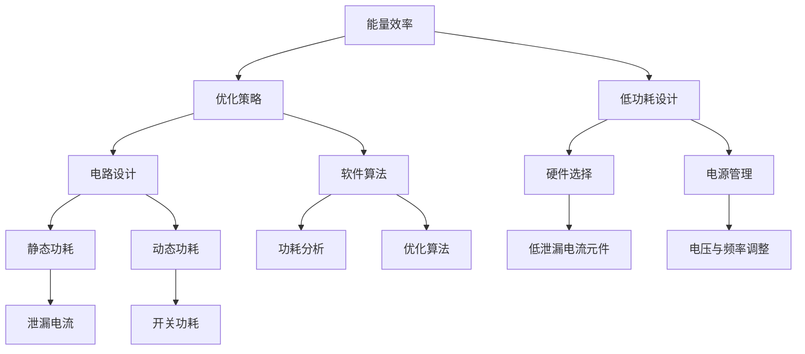
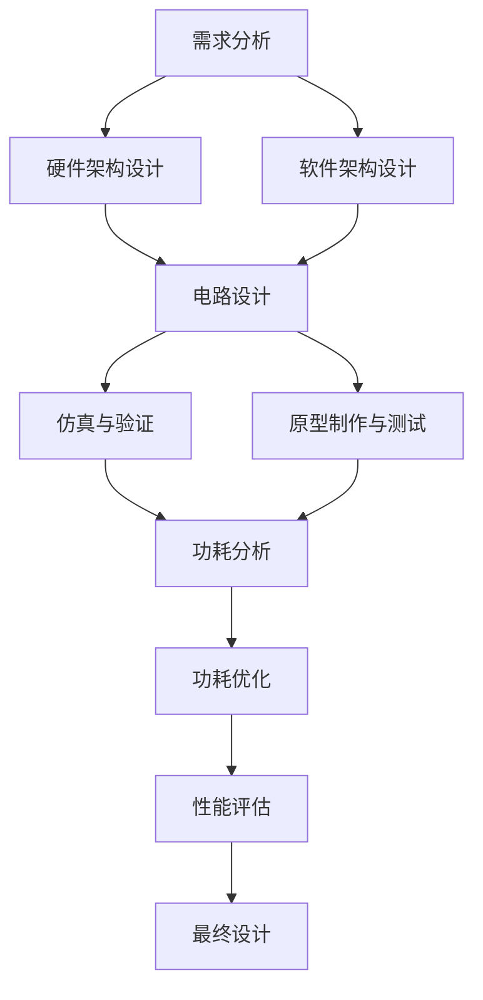

                 

### 文章标题

# 低功耗设计：延长电池寿命

### 关键词

- 低功耗设计
- 电池寿命
- 睡眠模式
- 动态电压与频率调整
- 软件功耗优化

### 摘要

在当今快节奏的生活中，电子设备的电池寿命成为用户关注的焦点。本文将深入探讨低功耗设计的重要性，从基础概念、硬件与软件设计、系统集成、未来趋势与挑战等多个角度，详细介绍如何通过低功耗设计来延长电池寿命。我们将结合实际案例，分析低功耗设计的实践方法和优化策略，为开发者提供实用的指导。

---

## 第一部分：低功耗设计基础

### 1.1 低功耗设计的核心概念

#### 1.1.1 什么是低功耗设计

低功耗设计（Power-efficient Design）是指通过优化硬件和软件设计，减少电子设备在正常运行和休眠状态下的功耗，从而延长电池寿命的过程。它涉及从设计理念、电路设计到软件开发等多个层面。

#### 1.1.2 低功耗设计的重要性

随着移动互联网、物联网、人工智能等技术的发展，电子设备对功耗的需求越来越高。低功耗设计不仅能够延长电池寿命，提高设备的便携性和用户体验，还能降低设备的发热量，提升设备的可靠性和稳定性。

#### 1.1.3 低功耗设计的挑战

低功耗设计面临的主要挑战包括：

- **复杂性和成本**：低功耗设计需要考虑多个层面的优化，增加了设计和测试的复杂性。
- **性能与功耗的平衡**：在保证性能的前提下，如何优化功耗是一个难题。
- **多样化的应用场景**：不同的应用场景对功耗的要求不同，低功耗设计需要适应多样化的需求。

### 1.2 低功耗设计的基础原理

#### 1.2.1 能量效率的量化

能量效率（Energy Efficiency）是指系统在完成特定任务时消耗的能量与所获得的有用能量之比。量化能量效率有助于评估低功耗设计的有效性。

#### 1.2.2 能量效率的优化策略

优化能量效率的策略包括：

- **降低静态功耗**：减少电路中的静态泄漏电流。
- **动态功耗优化**：通过动态电压与频率调整技术，在保证性能的前提下降低功耗。
- **电源管理**：使用高效的电源转换器，降低电源转换过程中的损耗。

#### 1.2.3 低功耗电路设计的基本原则

低功耗电路设计的基本原则包括：

- **最小化开关频率**：降低电路的开关频率，减少开关损耗。
- **优化电路布局**：合理安排电路布局，减少信号干扰和损耗。
- **使用低功耗元件**：选择低功耗的元件和器件。

### 1.3 低功耗设计的关键技术

#### 1.3.1 睡眠模式技术

睡眠模式（Sleep Mode）是一种有效的低功耗技术，通过将设备切换到低功耗状态，减少功耗。睡眠模式分为浅睡眠和深睡眠，不同类型的设备根据需求选择合适的睡眠模式。

#### 1.3.2 动态电压与频率调整技术

动态电压与频率调整技术（Dynamic Voltage and Frequency Scaling, DVFS）可以根据系统负载动态调整处理器的工作电压和频率，从而实现功耗优化。

#### 1.3.3 电力优化设计工具与方法

电力优化设计工具与方法包括功耗分析工具、仿真工具和优化算法，用于评估和优化低功耗设计。

### 1.4 低功耗设计实例分析

#### 1.4.1 智能手机低功耗设计案例

智能手机在低功耗设计方面有很多成功经验，如使用睡眠模式、动态电压与频率调整技术，以及优化操作系统和应用程序的功耗。

#### 1.4.2 可穿戴设备低功耗设计案例分析

可穿戴设备由于其体积和功耗限制，低功耗设计尤为重要。案例分析包括智能手表和智能手环的低功耗设计。

#### 1.4.3 IoT设备的低功耗设计要点

IoT设备需要在有限电池容量和低功耗要求下运行。设计要点包括选择合适的通信协议、优化硬件设计和软件算法。

---

## 第二部分：低功耗硬件设计

### 2.1 低功耗硬件设计流程

#### 2.1.1 硬件设计的基本流程

硬件设计的基本流程包括需求分析、系统架构设计、电路设计、仿真与验证、原型制作与测试等步骤。

#### 2.1.2 低功耗硬件设计的关键步骤

低功耗硬件设计的关键步骤包括功耗估算、功耗优化和验证。

#### 2.1.3 硬件设计的功耗估算方法

功耗估算方法包括静态功耗估算和动态功耗估算。静态功耗估算主要考虑电路中的泄漏电流，动态功耗估算主要考虑开关功耗。

### 2.2 低功耗模拟与验证

#### 2.2.1 模拟工具的选择与应用

常用的低功耗模拟工具包括SPICE、Cadence、Synopsys等。

#### 2.2.2 功耗验证的关键指标

功耗验证的关键指标包括总功耗、静态功耗、动态功耗和功耗密度。

#### 2.2.3 功耗验证的案例分析

通过功耗验证案例分析，展示低功耗设计的实际效果和优化方法。

### 2.3 低功耗硬件设计案例研究

#### 2.3.1 低功耗传感器设计实例

传感器设计实例包括温度传感器、湿度传感器和运动传感器等。

#### 2.3.2 低功耗通信芯片设计案例分析

通信芯片设计案例分析包括Wi-Fi、蓝牙和5G通信芯片的低功耗设计。

#### 2.3.3 低功耗物联网模块设计实践

物联网模块设计实践包括智能家居、智能安防和智能交通等应用场景。

---

## 第三部分：低功耗软件设计

### 3.1 低功耗软件设计原则

#### 3.1.1 软件层面的功耗优化

软件层面的功耗优化包括优化算法、减少不必要的计算和通信等。

#### 3.1.2 软件设计的低功耗实践

低功耗软件设计实践包括使用高效的编程语言、优化操作系统和应用程序等。

#### 3.1.3 软件功耗的监控与优化

软件功耗监控与优化包括使用功耗分析工具和优化策略。

### 3.2 低功耗软件工具与方法

#### 3.2.1 软件功耗分析工具

软件功耗分析工具包括电源分析工具、性能分析工具和能效分析工具。

#### 3.2.2 软件功耗优化的算法

软件功耗优化的算法包括动态电压与频率调整算法、能量回收算法等。

#### 3.2.3 软件功耗优化的最佳实践

软件功耗优化的最佳实践包括代码优化、算法优化和系统集成优化。

### 3.3 低功耗软件设计案例研究

#### 3.3.1 智能家居系统的低功耗设计

智能家居系统的低功耗设计包括智能照明、智能安防和智能家电等。

#### 3.3.2 智能交通工具的低功耗软件设计

智能交通工具的低功耗软件设计包括电动汽车、无人驾驶汽车等。

#### 3.3.3 低功耗游戏设计的实践

低功耗游戏设计的实践包括移动游戏和网页游戏等。

---

## 第四部分：低功耗系统集成与优化

### 4.1 低功耗系统集成方法

#### 4.1.1 系统集成的设计理念

系统集成的设计理念包括模块化设计、分布式设计和高效能设计。

#### 4.1.2 系统集成的功耗优化策略

系统集成的功耗优化策略包括能量管理、任务调度和功耗预测。

#### 4.1.3 系统集成测试与评估

系统集成测试与评估包括功耗测试、性能测试和稳定性测试。

### 4.2 低功耗系统集成案例研究

#### 4.2.1 低功耗医疗设备集成案例分析

低功耗医疗设备集成案例分析包括便携式医疗设备、远程监护系统等。

#### 4.2.2 低功耗无人机系统集成实践

低功耗无人机系统集成实践包括无人机飞行控制系统、通信模块和感知系统等。

#### 4.2.3 低功耗智能交通系统集成设计

低功耗智能交通系统集成设计包括智能信号灯、智能停车系统等。

### 4.3 低功耗系统的性能优化

#### 4.3.1 性能优化与功耗的关系

性能优化与功耗的关系包括如何在保证性能的前提下降低功耗。

#### 4.3.2 低功耗系统的性能优化方法

低功耗系统的性能优化方法包括硬件加速、算法优化和任务调度。

#### 4.3.3 低功耗系统的性能优化案例分析

低功耗系统的性能优化案例分析包括实际项目的优化过程和效果。

---

## 第五部分：低功耗设计未来趋势与挑战

### 5.1 低功耗设计的未来趋势

#### 5.1.1 人工智能与低功耗设计的融合

人工智能与低功耗设计的融合将推动新型低功耗智能系统的发展。

#### 5.1.2 物联网与低功耗设计的未来

物联网设备的低功耗设计将面临新的挑战和机遇。

#### 5.1.3 新型低功耗技术的展望

新型低功耗技术包括纳米材料、可穿戴传感器和高效能量转换技术等。

### 5.2 低功耗设计的挑战与解决方案

#### 5.2.1 低功耗设计的复杂性挑战

解决复杂性挑战需要技术创新和协作。

#### 5.2.2 低功耗设计的安全性问题

低功耗设计的安全性问题需要引起关注，并采取相应的安全措施。

#### 5.2.3 未来低功耗设计的解决方案与建议

未来低功耗设计的解决方案与建议包括加强国际合作、推动技术创新和建立标准。

### 5.3 低功耗设计的创新方向

#### 5.3.1 可再生能源与低功耗设计

可再生能源与低功耗设计的结合将推动可持续发展的电子设备。

#### 5.3.2 低功耗设计与新材料

新材料的发展将推动低功耗设计的创新。

#### 5.3.3 低功耗设计在新兴领域的应用

低功耗设计将在医疗、交通、能源等领域发挥重要作用。

---

## 附录

### 附录A：低功耗设计资源与工具

#### A.1 低功耗设计常用工具

包括硬件设计工具、软件功耗分析工具和仿真工具等。

#### A.2 低功耗设计参考资料

提供相关的书籍、论文和在线资源。

#### A.3 低功耗设计社区与论坛

介绍低功耗设计的专业社区和论坛。

### 附录B：低功耗设计流程图

提供低功耗设计流程图的Mermaid表示，帮助读者理解设计过程。

---

作者：AI天才研究院/AI Genius Institute & 禅与计算机程序设计艺术 /Zen And The Art of Computer Programming### 第一部分：低功耗设计基础

低功耗设计作为现代电子设备设计中的一项关键技术，其核心目标是在不牺牲性能的前提下，最大限度地延长设备的使用时间。这一目标不仅对提升用户体验至关重要，也对推动物联网（IoT）、可穿戴设备和移动计算等新兴领域的发展具有深远影响。本部分将深入探讨低功耗设计的核心概念、基础原理、关键技术及其在实际应用中的案例。

#### 1.1 低功耗设计的核心概念

**1.1.1 什么是低功耗设计**

低功耗设计（Power-efficient Design）是指在电子设备的整个生命周期中，通过优化硬件和软件设计，减少设备在正常运行和休眠状态下的功耗，从而延长电池寿命，提高设备可靠性和用户体验的过程。低功耗设计不仅关注设备的静态功耗（如电路的泄漏电流），还关注动态功耗（如开关功耗）。

低功耗设计涉及多个层面，包括电路设计、硬件架构、软件算法和系统集成。它不仅仅针对单一组件的功耗优化，还需要综合考虑系统整体功耗，实现全面功耗管理。

**1.1.2 低功耗设计的重要性**

随着移动互联网、物联网和人工智能技术的快速发展，电子设备对功耗的需求日益增长。低功耗设计的重要性体现在以下几个方面：

- **延长电池寿命**：在电池容量不变的情况下，降低功耗可以显著延长设备的使用时间，提高用户满意度。
- **提高便携性**：低功耗设计使得设备可以在更小、更轻的电池支持下运行，提高设备的便携性。
- **减少发热量**：低功耗设计有助于降低设备的发热量，提高设备的稳定性和可靠性。
- **降低成本**：通过优化功耗，可以减少电池更换次数，降低长期使用成本。

**1.1.3 低功耗设计的挑战**

低功耗设计面临着诸多挑战，包括：

- **复杂性和成本**：实现低功耗设计需要对硬件和软件有深刻的理解，设计过程复杂，成本较高。
- **性能与功耗的平衡**：在保证设备性能的前提下，如何优化功耗是一个难题。
- **多样化的应用场景**：不同应用场景对功耗的要求不同，低功耗设计需要适应多样化的需求。

#### 1.2 低功耗设计的基础原理

**1.2.1 能量效率的量化**

能量效率（Energy Efficiency）是指系统在完成特定任务时消耗的能量与所获得的有用能量之比。能量效率的量化有助于评估低功耗设计的有效性。

能量效率可以用以下公式表示：

\[ \eta = \frac{E_{useful}}{E_{total}} \]

其中，\( E_{useful} \) 是系统完成特定任务所获得的有用能量，\( E_{total} \) 是系统总共消耗的能量。

**1.2.2 能量效率的优化策略**

优化能量效率的策略包括：

- **降低静态功耗**：通过使用低泄漏电流的元件，减少电路的静态功耗。
- **动态功耗优化**：通过动态电压与频率调整（DVFS）等技术，根据系统负载动态调整电压和频率，降低功耗。
- **电源管理**：使用高效的电源转换器，降低电源转换过程中的损耗。

**1.2.3 低功耗电路设计的基本原则**

低功耗电路设计的基本原则包括：

- **最小化开关频率**：通过降低电路的开关频率，减少开关损耗。
- **优化电路布局**：合理安排电路布局，减少信号干扰和损耗。
- **使用低功耗元件**：选择低功耗的元件和器件，如低泄漏电流的晶体管。

#### 1.3 低功耗设计的关键技术

**1.3.1 睡眠模式技术**

睡眠模式（Sleep Mode）是一种有效的低功耗技术，通过将设备切换到低功耗状态，减少功耗。睡眠模式分为浅睡眠（Light Sleep）和深睡眠（Deep Sleep），浅睡眠期间设备仍然可以接收和响应外部信号，而深睡眠期间设备完全关闭大部分功能。

**1.3.2 动态电压与频率调整技术**

动态电压与频率调整技术（Dynamic Voltage and Frequency Scaling, DVFS）可以根据系统负载动态调整处理器的工作电压和频率，从而实现功耗优化。DVFS技术通过以下公式实现功耗与性能的平衡：

\[ P = V \times F \times C \]

其中，\( P \) 是功耗，\( V \) 是电压，\( F \) 是频率，\( C \) 是常数。

**1.3.3 电力优化设计工具与方法**

电力优化设计工具与方法包括功耗分析工具、仿真工具和优化算法。功耗分析工具用于评估系统的功耗分布和瓶颈，仿真工具用于模拟系统在不同负载下的功耗表现，优化算法则用于自动调整系统的功耗设置。

#### 1.4 低功耗设计实例分析

**1.4.1 智能手机低功耗设计案例**

智能手机的低功耗设计包括多个方面，如硬件选择、软件优化和电源管理。例如，智能手机可以选择低泄漏电流的处理器和显示屏，使用动态电压与频率调整技术，优化操作系统和应用程序的功耗。

**1.4.2 可穿戴设备低功耗设计案例分析**

可穿戴设备由于其体积和功耗限制，低功耗设计尤为重要。案例分析包括智能手表和智能手环的低功耗设计，如使用低功耗传感器、优化通信协议和实现智能休眠模式。

**1.4.3 IoT设备的低功耗设计要点**

IoT设备需要在有限电池容量和低功耗要求下运行。设计要点包括选择合适的通信协议（如蓝牙低功耗）、优化硬件设计和软件算法，以及实现智能功耗管理。

#### 1.5 低功耗设计的核心概念与联系

为了更好地理解低功耗设计的核心概念和它们之间的联系，我们可以使用Mermaid流程图来展示这些概念之间的关系。以下是一个简单的Mermaid流程图：



通过这个流程图，我们可以看到低功耗设计涉及多个层面的优化策略，这些策略相互关联，共同实现能量效率的最大化。

#### 1.6 低功耗设计的核心算法原理讲解

低功耗设计的核心算法原理主要包括动态电压与频率调整（DVFS）和能量回收（Energy Harvesting）。

**动态电压与频率调整（DVFS）**

DVFS技术的基本原理是通过实时调整处理器的工作电压和频率来匹配当前的负载，从而实现功耗优化。其伪代码如下：

```python
while True:
    if (current_load > high_load_threshold):
        set_voltage(high_voltage)
        set_frequency(high_frequency)
    elif (current_load < low_load_threshold):
        set_voltage(low_voltage)
        set_frequency(low_frequency)
    else:
        set_voltage(medium_voltage)
        set_frequency(medium_frequency)
    wait(for_small_interval)
```

在上述伪代码中，`current_load` 表示当前的负载情况，`high_load_threshold`、`low_load_threshold` 和 `medium_load_threshold` 分别表示高负载、低负载和中等负载的阈值，`set_voltage` 和 `set_frequency` 分别用于调整电压和频率，`wait` 用于等待一个较小的时间间隔。

**能量回收（Energy Harvesting）**

能量回收是一种利用环境中的微小能量来补充设备电能的技术。其基本原理是将环境中的能量（如热能、振动能、光能等）转化为电能，存储在电池中。其伪代码如下：

```python
while True:
    if (environmental_energy > threshold):
        harvest_energy()
        store_energy()
    else:
        use储能电能源
    wait(for_small_interval)
```

在上述伪代码中，`environmental_energy` 表示环境中的能量水平，`threshold` 表示能量回收的阈值，`harvest_energy` 和 `store_energy` 分别用于回收和存储能量，`use储能电能源` 用于使用电池中的电能。

通过上述核心算法原理的讲解和伪代码示例，我们可以看到低功耗设计在硬件和软件层面的具体实现方法，这些方法对于延长设备电池寿命具有重要作用。

#### 1.7 低功耗设计的数学模型和公式

低功耗设计中的数学模型和公式主要用于描述功耗与电压、频率、负载之间的关系。以下是一些常用的公式：

**1. 功耗计算公式**

\[ P = V \times I \]

其中，\( P \) 表示功耗，\( V \) 表示电压，\( I \) 表示电流。

**2. 动态功耗优化公式**

\[ P_{opt} = V_{opt} \times F_{opt} \]

其中，\( P_{opt} \) 表示最优功耗，\( V_{opt} \) 表示最优电压，\( F_{opt} \) 表示最优频率。

**3. 能量效率公式**

\[ \eta = \frac{E_{useful}}{E_{total}} \]

其中，\( \eta \) 表示能量效率，\( E_{useful} \) 表示有用能量，\( E_{total} \) 表示总能量。

通过这些公式，我们可以对低功耗设计进行定量分析和优化。例如，通过调整电压和频率，我们可以找到最优功耗点，从而实现功耗的最小化。

#### 1.8 低功耗设计实例分析

为了更好地理解低功耗设计的实际应用，以下是一些实例分析：

**1. 智能手机低功耗设计案例**

智能手机的低功耗设计主要包括以下几个方面：

- **硬件优化**：选择低功耗处理器和显示屏，使用低泄漏电流的元件。
- **软件优化**：优化操作系统和应用程序的功耗，如关闭不必要的后台服务，使用节能模式。
- **电源管理**：实现智能电源管理，如动态电压与频率调整（DVFS），智能休眠模式。

**2. 可穿戴设备低功耗设计案例分析**

可穿戴设备（如智能手表和智能手环）的低功耗设计需要考虑以下几个方面：

- **硬件优化**：使用低功耗传感器，优化通信模块的设计。
- **软件优化**：优化应用程序的功耗，如减少不必要的计算和通信。
- **电源管理**：实现智能功耗管理，如智能休眠模式，动态调整传感器的工作频率。

**3. IoT设备的低功耗设计要点**

IoT设备需要在有限电池容量和低功耗要求下运行，其设计要点包括：

- **通信协议**：选择低功耗的通信协议，如蓝牙低功耗（BLE）。
- **硬件优化**：使用低功耗处理器和传感器，优化电路设计。
- **软件优化**：优化操作系统和应用程序的功耗，如减少不必要的通信和计算。

通过这些实例分析，我们可以看到低功耗设计在各类电子设备中的应用方法和优化策略。这些实例不仅展示了低功耗设计的实际效果，也为开发者提供了实用的参考。

### 1.9 低功耗设计的最佳实践

在进行低功耗设计时，以下是一些最佳实践：

- **需求分析**：明确设备的需求和功耗目标，为后续设计提供依据。
- **模块化设计**：将系统划分为多个模块，分别进行功耗优化。
- **迭代优化**：通过不断迭代和测试，优化功耗性能。
- **功耗分析**：使用功耗分析工具，对系统进行全面的功耗分析，找出功耗瓶颈。
- **安全性和可靠性**：在功耗优化的同时，确保系统的安全性和可靠性。

通过遵循这些最佳实践，开发者可以更有效地进行低功耗设计，延长设备的使用时间。

### 1.10 小结

低功耗设计是现代电子设备设计中至关重要的一环，它不仅能够延长设备的使用时间，提高用户体验，还能推动物联网、可穿戴设备和移动计算等新兴领域的发展。本文详细介绍了低功耗设计的核心概念、基础原理、关键技术、实例分析和最佳实践。通过这些内容，开发者可以更好地理解低功耗设计的重要性，掌握实际应用方法，为电子设备的设计提供有力的支持。

---

### 第一部分：低功耗设计基础

#### 1.1 低功耗设计的核心概念

**1.1.1 什么是低功耗设计**

低功耗设计（Power-efficient Design）是指通过优化硬件和软件设计，减少电子设备在正常运行和休眠状态下的功耗，从而延长电池寿命的过程。低功耗设计不仅仅关注设备的静态功耗（如电路的泄漏电流），还关注动态功耗（如开关功耗）。它涉及从设计理念、电路设计到软件开发等多个层面。

**1.1.2 低功耗设计的重要性**

随着移动互联网、物联网和人工智能技术的快速发展，电子设备对功耗的需求日益增长。低功耗设计的重要性体现在以下几个方面：

- **延长电池寿命**：在电池容量不变的情况下，降低功耗可以显著延长设备的使用时间，提高用户满意度。
- **提高便携性**：低功耗设计使得设备可以在更小、更轻的电池支持下运行，提高设备的便携性。
- **减少发热量**：低功耗设计有助于降低设备的发热量，提高设备的稳定性和可靠性。
- **降低成本**：通过优化功耗，可以减少电池更换次数，降低长期使用成本。

**1.1.3 低功耗设计的挑战**

低功耗设计面临着诸多挑战，包括：

- **复杂性和成本**：实现低功耗设计需要对硬件和软件有深刻的理解，设计过程复杂，成本较高。
- **性能与功耗的平衡**：在保证设备性能的前提下，如何优化功耗是一个难题。
- **多样化的应用场景**：不同应用场景对功耗的要求不同，低功耗设计需要适应多样化的需求。

#### 1.2 低功耗设计的基础原理

**1.2.1 能量效率的量化**

能量效率（Energy Efficiency）是指系统在完成特定任务时消耗的能量与所获得的有用能量之比。量化能量效率有助于评估低功耗设计的有效性。

能量效率可以用以下公式表示：

\[ \eta = \frac{E_{useful}}{E_{total}} \]

其中，\( E_{useful} \) 是系统完成特定任务所获得的有用能量，\( E_{total} \) 是系统总共消耗的能量。

**1.2.2 能量效率的优化策略**

优化能量效率的策略包括：

- **降低静态功耗**：通过使用低泄漏电流的元件，减少电路的静态功耗。
- **动态功耗优化**：通过动态电压与频率调整（Dynamic Voltage and Frequency Scaling, DVFS）等技术，根据系统负载动态调整电压和频率，降低功耗。
- **电源管理**：使用高效的电源转换器，降低电源转换过程中的损耗。

**1.2.3 低功耗电路设计的基本原则**

低功耗电路设计的基本原则包括：

- **最小化开关频率**：通过降低电路的开关频率，减少开关损耗。
- **优化电路布局**：合理安排电路布局，减少信号干扰和损耗。
- **使用低功耗元件**：选择低功耗的元件和器件，如低泄漏电流的晶体管。

#### 1.3 低功耗设计的关键技术

**1.3.1 睡眠模式技术**

睡眠模式（Sleep Mode）是一种有效的低功耗技术，通过将设备切换到低功耗状态，减少功耗。睡眠模式分为浅睡眠（Light Sleep）和深睡眠（Deep Sleep），浅睡眠期间设备仍然可以接收和响应外部信号，而深睡眠期间设备完全关闭大部分功能。

**1.3.2 动态电压与频率调整技术**

动态电压与频率调整技术（Dynamic Voltage and Frequency Scaling, DVFS）可以根据系统负载动态调整处理器的工作电压和频率，从而实现功耗优化。DVFS技术通过以下公式实现功耗与性能的平衡：

\[ P = V \times F \times C \]

其中，\( P \) 是功耗，\( V \) 是电压，\( F \) 是频率，\( C \) 是常数。

**1.3.3 电力优化设计工具与方法**

电力优化设计工具与方法包括功耗分析工具、仿真工具和优化算法。功耗分析工具用于评估系统的功耗分布和瓶颈，仿真工具用于模拟系统在不同负载下的功耗表现，优化算法则用于自动调整系统的功耗设置。

#### 1.4 低功耗设计实例分析

**1.4.1 智能手机低功耗设计案例**

智能手机的低功耗设计包括多个方面，如硬件选择、软件优化和电源管理。例如，智能手机可以选择低泄漏电流的处理器和显示屏，使用动态电压与频率调整技术，优化操作系统和应用程序的功耗。

**1.4.2 可穿戴设备低功耗设计案例分析**

可穿戴设备由于其体积和功耗限制，低功耗设计尤为重要。案例分析包括智能手表和智能手环的低功耗设计，如使用低功耗传感器、优化通信协议和实现智能休眠模式。

**1.4.3 IoT设备的低功耗设计要点**

IoT设备需要在有限电池容量和低功耗要求下运行。设计要点包括选择合适的通信协议（如蓝牙低功耗）、优化硬件设计和软件算法，以及实现智能功耗管理。

#### 1.5 低功耗设计的核心概念与联系

为了更好地理解低功耗设计的核心概念和它们之间的联系，我们可以使用Mermaid流程图来展示这些概念之间的关系。以下是一个简单的Mermaid流程图：


通过这个流程图，我们可以看到低功耗设计涉及多个层面的优化策略，这些策略相互关联，共同实现能量效率的最大化。

#### 1.6 低功耗设计的核心算法原理讲解

低功耗设计的核心算法原理主要包括动态电压与频率调整（DVFS）和能量回收（Energy Harvesting）。

**动态电压与频率调整（DVFS）**

DVFS技术的基本原理是通过实时调整处理器的工作电压和频率来匹配当前的负载，从而实现功耗优化。其伪代码如下：

```python
while True:
    if (current_load > high_load_threshold):
        set_voltage(high_voltage)
        set_frequency(high_frequency)
    elif (current_load < low_load_threshold):
        set_voltage(low_voltage)
        set_frequency(low_frequency)
    else:
        set_voltage(medium_voltage)
        set_frequency(medium_frequency)
    wait(for_small_interval)
```

在上述伪代码中，`current_load` 表示当前的负载情况，`high_load_threshold`、`low_load_threshold` 和 `medium_load_threshold` 分别表示高负载、低负载和中等负载的阈值，`set_voltage` 和 `set_frequency` 分别用于调整电压和频率，`wait` 用于等待一个较小的时间间隔。

**能量回收（Energy Harvesting）**

能量回收是一种利用环境中的微小能量来补充设备电能的技术。其基本原理是将环境中的能量（如热能、振动能、光能等）转化为电能，存储在电池中。其伪代码如下：

```python
while True:
    if (environmental_energy > threshold):
        harvest_energy()
        store_energy()
    else:
        use储能电能源
    wait(for_small_interval)
```

在上述伪代码中，`environmental_energy` 表示环境中的能量水平，`threshold` 表示能量回收的阈值，`harvest_energy` 和 `store_energy` 分别用于回收和存储能量，`use储能电能源` 用于使用电池中的电能。

通过上述核心算法原理的讲解和伪代码示例，我们可以看到低功耗设计在硬件和软件层面的具体实现方法，这些方法对于延长设备电池寿命具有重要作用。

#### 1.7 低功耗设计的数学模型和公式

低功耗设计中的数学模型和公式主要用于描述功耗与电压、频率、负载之间的关系。以下是一些常用的公式：

**1. 功耗计算公式**

\[ P = V \times I \]

其中，\( P \) 表示功耗，\( V \) 表示电压，\( I \) 表示电流。

**2. 动态功耗优化公式**

\[ P_{opt} = V_{opt} \times F_{opt} \]

其中，\( P_{opt} \) 表示最优功耗，\( V_{opt} \) 表示最优电压，\( F_{opt} \) 表示最优频率。

**3. 能量效率公式**

\[ \eta = \frac{E_{useful}}{E_{total}} \]

其中，\( \eta \) 表示能量效率，\( E_{useful} \) 表示有用能量，\( E_{total} \) 表示总能量。

通过这些公式，我们可以对低功耗设计进行定量分析和优化。例如，通过调整电压和频率，我们可以找到最优功耗点，从而实现功耗的最小化。

#### 1.8 低功耗设计实例分析

为了更好地理解低功耗设计的实际应用，以下是一些实例分析：

**1. 智能手机低功耗设计案例**

智能手机的低功耗设计主要包括以下几个方面：

- **硬件优化**：选择低泄漏电流的处理器和显示屏，使用低功耗的元件。
- **软件优化**：优化操作系统和应用程序的功耗，如关闭不必要的后台服务，使用节能模式。
- **电源管理**：实现智能电源管理，如动态电压与频率调整（DVFS），智能休眠模式。

**2. 可穿戴设备低功耗设计案例分析**

可穿戴设备（如智能手表和智能手环）的低功耗设计需要考虑以下几个方面：

- **硬件优化**：使用低功耗传感器，优化通信模块的设计。
- **软件优化**：优化应用程序的功耗，如减少不必要的计算和通信。
- **电源管理**：实现智能功耗管理，如智能休眠模式，动态调整传感器的工作频率。

**3. IoT设备的低功耗设计要点**

IoT设备需要在有限电池容量和低功耗要求下运行，其设计要点包括：

- **通信协议**：选择低功耗的通信协议，如蓝牙低功耗（BLE）。
- **硬件优化**：使用低功耗处理器和传感器，优化电路设计。
- **软件优化**：优化操作系统和应用程序的功耗，如减少不必要的通信和计算。

通过这些实例分析，我们可以看到低功耗设计在各类电子设备中的应用方法和优化策略。这些实例不仅展示了低功耗设计的实际效果，也为开发者提供了实用的参考。

#### 1.9 低功耗设计的最佳实践

在进行低功耗设计时，以下是一些最佳实践：

- **需求分析**：明确设备的需求和功耗目标，为后续设计提供依据。
- **模块化设计**：将系统划分为多个模块，分别进行功耗优化。
- **迭代优化**：通过不断迭代和测试，优化功耗性能。
- **功耗分析**：使用功耗分析工具，对系统进行全面的功耗分析，找出功耗瓶颈。
- **安全性和可靠性**：在功耗优化的同时，确保系统的安全性和可靠性。

通过遵循这些最佳实践，开发者可以更有效地进行低功耗设计，延长设备的使用时间。

#### 1.10 小结

低功耗设计是现代电子设备设计中至关重要的一环，它不仅能够延长设备的使用时间，提高用户体验，还能推动物联网、可穿戴设备和移动计算等新兴领域的发展。本文详细介绍了低功耗设计的核心概念、基础原理、关键技术、实例分析和最佳实践。通过这些内容，开发者可以更好地理解低功耗设计的重要性，掌握实际应用方法，为电子设备的设计提供有力的支持。接下来，我们将进一步探讨低功耗硬件设计的相关内容。

---

### 第二部分：低功耗硬件设计

低功耗硬件设计是实现延长电池寿命的关键环节，它涉及到硬件架构的选择、功耗估算、优化和验证等多个方面。本部分将详细讨论低功耗硬件设计的基本流程、关键步骤以及功耗估算方法，并通过实际案例展示这些方法的实际应用。

#### 2.1 低功耗硬件设计流程

低功耗硬件设计流程与传统硬件设计流程有所不同，它更加注重功耗管理和优化。以下是低功耗硬件设计的基本流程：

**2.1.1 需求分析**

需求分析是低功耗硬件设计的起点，包括确定设备的功耗目标、工作环境、功能需求和性能指标等。明确需求有助于后续设计阶段的功耗优化。

**2.1.2 硬件架构设计**

硬件架构设计是低功耗设计的关键步骤，涉及选择合适的处理器、存储器、电源管理模块和通信模块等。设计时应考虑硬件组件的功耗特性和优化潜力。

**2.1.3 电路设计**

电路设计是低功耗硬件设计的核心，包括电路布局、元件选择、信号完整性分析和功耗估算。电路设计应遵循低功耗原则，如减小开关频率、优化电路布局和选择低泄漏电流元件等。

**2.1.4 仿真与验证**

仿真与验证阶段通过仿真工具对电路进行功耗分析，评估设计的功耗性能。常见的仿真工具包括SPICE、Cadence和Synopsys等。仿真结果可用于优化电路设计和验证功耗目标的实现。

**2.1.5 原型制作与测试**

原型制作与测试阶段是验证设计可行性和性能的关键步骤。通过制作硬件原型并进行实际测试，可以验证功耗估算的准确性，发现并修复设计中的问题。

#### 2.2 低功耗硬件设计的关键步骤

**2.2.1 功耗估算**

功耗估算是低功耗硬件设计的关键步骤，它有助于评估设计的功耗性能，指导后续的功耗优化。功耗估算方法主要包括静态功耗估算和动态功耗估算。

**静态功耗估算**

静态功耗估算主要考虑电路中的静态泄漏电流，计算公式如下：

\[ P_{static} = I_{leak} \times V_{supply} \]

其中，\( P_{static} \) 是静态功耗，\( I_{leak} \) 是泄漏电流，\( V_{supply} \) 是供电电压。

**动态功耗估算**

动态功耗估算主要考虑电路中的开关功耗，计算公式如下：

\[ P_{dynamic} = (V_{high} - V_{low}) \times I_{switch} \times f_{switch} \]

其中，\( P_{dynamic} \) 是动态功耗，\( V_{high} \) 和 \( V_{low} \) 分别是开关电压的高位和低位，\( I_{switch} \) 是开关电流，\( f_{switch} \) 是开关频率。

**功耗估算案例**

以下是一个简单的功耗估算案例，假设一个电路包含一个时钟频率为1GHz的处理器和一个时钟频率为100MHz的存储器，供电电压为1.2V。泄漏电流分别为处理器0.1μA，存储器0.05μA。计算整个电路在1秒钟内的功耗。

\[ P_{processor} = 0.1\mu A \times 1.2V = 0.12mW \]

\[ P_{memory} = 0.05\mu A \times 1.2V = 0.06mW \]

\[ P_{total} = P_{processor} + P_{memory} = 0.18mW \]

在整个电路运行1秒钟时，总功耗为0.18mW。

#### 2.3 低功耗模拟与验证

**2.3.1 模拟工具的选择与应用**

低功耗模拟与验证需要使用专业的仿真工具，如SPICE、Cadence和Synopsys等。这些工具可以模拟电路在不同工作条件下的功耗表现，帮助设计者优化电路设计和验证功耗目标的实现。

**2.3.2 功耗验证的关键指标**

功耗验证的关键指标包括总功耗、静态功耗、动态功耗和功耗密度。总功耗是系统整体功耗的度量，静态功耗和动态功耗分别衡量电路在静态和动态工作条件下的功耗，功耗密度衡量单位面积或体积的功耗。

**2.3.3 功耗验证的案例分析**

以下是一个功耗验证的案例分析，假设一个物联网设备的处理器和通信模块在不同负载条件下的功耗表现如下：

- 静态功耗：0.2mW
- 动态功耗（负载最高时）：2mW
- 动态功耗（负载最低时）：0.5mW
- 总功耗：2.7mW

通过仿真工具验证，设计者可以调整处理器和通信模块的工作频率，优化功耗表现。例如，在低负载条件下，可以降低处理器的工作频率，从而减少动态功耗。

#### 2.4 低功耗硬件设计案例研究

**2.4.1 低功耗传感器设计实例**

低功耗传感器设计实例包括温度传感器、湿度传感器和运动传感器等。以下是一个低功耗温度传感器设计实例：

- **硬件设计**：使用低功耗微处理器和低泄漏电流的传感器元件。
- **软件设计**：实现智能休眠模式和数据采集优化算法，降低功耗。
- **功耗优化**：通过动态电压与频率调整（DVFS）技术，根据温度变化调整处理器的工作频率，优化功耗。

**2.4.2 低功耗通信芯片设计案例分析**

低功耗通信芯片设计案例分析包括Wi-Fi、蓝牙和5G通信芯片的低功耗设计。以下是一个蓝牙低功耗芯片设计案例：

- **硬件设计**：使用低功耗处理器和优化通信协议，如蓝牙5.0。
- **软件设计**：实现智能功耗管理，如设备休眠和连接断开时的低功耗模式。
- **功耗优化**：通过硬件和软件的协同优化，降低通信过程中的功耗。

**2.4.3 低功耗物联网模块设计实践**

低功耗物联网模块设计实践包括智能家居、智能安防和智能交通等应用场景。以下是一个智能家居物联网模块设计实践：

- **硬件设计**：使用低功耗微控制器和传感器，实现智能功耗管理。
- **软件设计**：实现远程监控和控制功能，优化通信和数据处理功耗。
- **功耗优化**：通过使用低功耗通信协议和实现智能任务调度，优化整个模块的功耗。

#### 2.5 低功耗硬件设计的最佳实践

在进行低功耗硬件设计时，以下是一些最佳实践：

- **需求分析**：明确设备的功耗目标和应用场景，为后续设计提供依据。
- **模块化设计**：将系统划分为多个模块，分别进行功耗优化。
- **迭代优化**：通过不断迭代和测试，优化功耗性能。
- **功耗分析**：使用功耗分析工具，对系统进行全面的功耗分析，找出功耗瓶颈。
- **安全性和可靠性**：在功耗优化的同时，确保系统的安全性和可靠性。

通过遵循这些最佳实践，设计者可以更有效地进行低功耗硬件设计，实现功耗优化，延长设备的使用时间。

### 2.6 小结

低功耗硬件设计是延长电池寿命的关键环节，涉及多个方面的优化和验证。本部分详细介绍了低功耗硬件设计的基本流程、关键步骤和功耗估算方法，并通过实际案例展示了低功耗设计的应用和实践。通过这些内容，设计者可以更好地理解低功耗硬件设计的重要性，掌握实际应用方法，为电子设备的设计提供有力的支持。接下来，我们将探讨低功耗软件设计的相关内容。

---

### 第三部分：低功耗软件设计

低功耗软件设计在延长电子设备电池寿命方面发挥着至关重要的作用。通过优化软件算法和系统行为，可以显著降低设备在运行过程中的功耗。本部分将深入探讨低功耗软件设计的原则、工具与方法，并分析软件功耗优化的最佳实践。

#### 3.1 低功耗软件设计原则

**3.1.1 软件层面的功耗优化**

软件层面的功耗优化包括优化算法、减少不必要的计算和通信等。以下是一些关键原则：

- **算法优化**：选择高效的算法，减少计算复杂度和时间消耗。
- **并行处理**：利用多核处理器和并行计算，提高计算效率，降低功耗。
- **任务调度**：合理安排任务执行顺序，减少CPU闲置时间，提高CPU利用率。
- **功耗监测**：使用功耗监测工具，实时监控系统功耗，及时调整功耗设置。

**3.1.2 软件设计的低功耗实践**

低功耗软件设计实践包括以下几个方面：

- **最小化功耗唤醒频率**：避免频繁的功耗唤醒，减少功耗。
- **优化数据处理**：减少数据传输和存储操作，降低功耗。
- **智能休眠模式**：在设备闲置时，自动进入休眠模式，降低功耗。
- **优化通信协议**：选择低功耗的通信协议，减少通信功耗。

**3.1.3 软件功耗的监控与优化**

软件功耗监控与优化是低功耗软件设计的重要组成部分。以下是一些具体方法：

- **实时功耗监测**：使用实时功耗监测工具，监控系统各个组件的功耗。
- **功耗分析**：通过功耗分析工具，识别系统中的功耗热点，进行针对性的优化。
- **功耗调试**：在开发过程中，使用功耗调试工具，调整代码和算法，优化功耗。

#### 3.2 低功耗软件工具与方法

**3.2.1 软件功耗分析工具**

软件功耗分析工具是低功耗软件设计的重要辅助工具，可以帮助开发者识别和优化系统中的功耗热点。以下是一些常用的软件功耗分析工具：

- **开源功耗分析工具**：如power-top、powertop和EnergySpy等，可以提供实时功耗监测和分析功能。
- **商业功耗分析工具**：如MATLAB、Python和ANSYS等，提供强大的功耗分析和优化功能。
- **集成开发环境（IDE）插件**：如Eclipse和Visual Studio等，提供内置的功耗分析工具和优化建议。

**3.2.2 软件功耗优化的算法**

软件功耗优化的算法主要包括以下几种：

- **动态电压与频率调整（DVFS）算法**：通过实时调整处理器的工作电压和频率，实现功耗优化。
- **能量回收算法**：利用设备在运行过程中产生的热能、振动能等，进行能量回收和再利用。
- **智能调度算法**：根据系统负载和功耗需求，动态调整任务执行顺序和资源分配，实现功耗优化。

**3.2.3 软件功耗优化的最佳实践**

软件功耗优化的最佳实践包括以下几个方面：

- **代码优化**：通过优化数据结构、算法和代码实现，减少计算复杂度和时间消耗，降低功耗。
- **系统优化**：优化操作系统的配置，减少不必要的背景服务和进程，降低系统功耗。
- **功耗监控**：使用功耗监测工具，实时监控系统功耗，及时发现和解决功耗问题。
- **持续迭代**：通过不断迭代和优化，持续提升软件的功耗性能。

#### 3.3 低功耗软件设计案例研究

**3.3.1 智能家居系统的低功耗设计**

智能家居系统的低功耗设计包括智能照明、智能安防和智能家电等。以下是一个智能家居系统低功耗设计案例：

- **硬件设计**：使用低功耗微控制器和无线传感器，实现智能家居设备的智能控制。
- **软件设计**：实现智能功耗管理和远程控制功能，优化通信和数据处理功耗。
- **功耗优化**：通过使用低功耗通信协议（如Zigbee和Wi-Fi低功耗模式）和智能任务调度，优化整个系统的功耗。

**3.3.2 智能交通工具的低功耗软件设计**

智能交通工具（如电动汽车和无人驾驶汽车）的低功耗软件设计至关重要。以下是一个智能交通工具低功耗软件设计案例：

- **硬件设计**：使用低功耗处理器和传感器，实现车辆的智能监控和控制系统。
- **软件设计**：实现智能功耗管理和自动驾驶功能，优化通信和数据处理功耗。
- **功耗优化**：通过优化电池管理系统（BMS）和自动驾驶算法，降低车辆在行驶过程中的功耗。

**3.3.3 低功耗游戏设计的实践**

低功耗游戏设计在移动游戏和网页游戏中尤为重要。以下是一个低功耗游戏设计案例：

- **硬件设计**：使用低功耗处理器和图形处理器，实现游戏的流畅运行。
- **软件设计**：实现游戏场景优化和图形渲染优化，降低游戏运行时的功耗。
- **功耗优化**：通过减少图形渲染频率、优化代码和算法，降低游戏在运行过程中的功耗。

#### 3.4 低功耗软件设计的最佳实践

在进行低功耗软件设计时，以下是一些最佳实践：

- **需求分析**：明确系统的功耗需求和功能需求，为后续设计提供依据。
- **模块化设计**：将系统划分为多个模块，分别进行功耗优化。
- **迭代优化**：通过不断迭代和测试，优化功耗性能。
- **功耗分析**：使用功耗分析工具，对系统进行全面的功耗分析，找出功耗瓶颈。
- **安全性和可靠性**：在功耗优化的同时，确保系统的安全性和可靠性。

通过遵循这些最佳实践，开发者可以更有效地进行低功耗软件设计，实现功耗优化，延长设备的使用时间。

### 3.5 小结

低功耗软件设计是延长电池寿命的重要手段，涉及算法优化、系统优化和功耗监控等多个方面。通过优化软件算法和系统行为，可以显著降低设备的功耗，提高用户体验。本部分详细介绍了低功耗软件设计的原则、工具与方法，并通过实际案例展示了低功耗设计的应用和实践。通过这些内容，开发者可以更好地理解低功耗软件设计的重要性，掌握实际应用方法，为电子设备的设计提供有力的支持。接下来，我们将探讨低功耗系统集成与优化的相关内容。

---

### 第四部分：低功耗系统集成与优化

低功耗系统集成与优化是确保电子设备在复杂应用环境中实现高效能耗管理的关键步骤。在这一部分，我们将详细探讨低功耗系统集成的方法、案例研究以及性能优化策略。

#### 4.1 低功耗系统集成方法

**4.1.1 系统集成的设计理念**

低功耗系统集成设计理念包括以下几个关键方面：

- **模块化设计**：将系统划分为多个功能模块，每个模块独立开发并优化功耗。
- **分层架构**：采用层次化架构，不同层级分别实现不同的功能和功耗管理策略。
- **高效通信**：选择低功耗的通信协议和接口，减少通信功耗。
- **能量管理**：集成高效的电源管理模块，实现动态功耗控制。

**4.1.2 系统集成的功耗优化策略**

系统集成的功耗优化策略主要包括以下几项：

- **任务调度**：根据任务的重要性和负载情况，动态调整任务的执行顺序和资源分配。
- **功耗预测**：利用历史数据和算法预测系统未来的功耗需求，提前调整功耗设置。
- **负载均衡**：在不同模块之间分配负载，确保系统资源得到充分利用，降低功耗。
- **睡眠管理与唤醒控制**：通过智能休眠模式和唤醒控制，减少不必要的功耗。

**4.1.3 系统集成测试与评估**

系统集成测试与评估是确保功耗优化策略有效性的关键步骤。以下是一些常见的测试和评估方法：

- **功耗测量**：使用专业的功耗测量工具，对系统进行全方面的功耗测量和数据分析。
- **性能评估**：通过模拟不同的工作场景，评估系统的性能和功耗表现。
- **功耗瓶颈分析**：识别系统中的功耗瓶颈，针对性地进行优化。
- **稳定性测试**：在长时间运行和极端条件下，测试系统的稳定性和功耗性能。

#### 4.2 低功耗系统集成案例研究

**4.2.1 低功耗医疗设备集成案例分析**

低功耗医疗设备的集成设计对设备的可靠性和功耗管理提出了严格要求。以下是一个低功耗医疗设备集成案例分析：

- **硬件设计**：选择低功耗的处理器和传感器，实现医疗数据的实时采集和处理。
- **软件设计**：开发智能功耗管理软件，实现设备的智能休眠和功耗优化。
- **功耗优化**：通过动态调整传感器的工作频率和通信频率，优化功耗。

**4.2.2 低功耗无人机系统集成实践**

低功耗无人机系统集成的目标是实现长时间自主飞行，同时保持高稳定性和低功耗。以下是一个低功耗无人机系统集成实践：

- **硬件设计**：使用低功耗的无人机控制器和通信模块，优化飞行性能和功耗。
- **软件设计**：实现无人机任务的智能调度和功耗控制，优化飞行策略。
- **功耗优化**：通过优化飞行算法和通信协议，降低功耗，延长飞行时间。

**4.2.3 低功耗智能交通系统集成设计**

低功耗智能交通系统集成设计旨在提高交通管理效率和减少能源消耗。以下是一个低功耗智能交通系统集成设计：

- **硬件设计**：集成低功耗的交通传感器和通信模块，实现交通数据的实时采集和传输。
- **软件设计**：开发智能交通管理系统，实现交通流量预测和优化。
- **功耗优化**：通过智能调度和能量回收技术，降低交通设备的功耗。

#### 4.3 低功耗系统的性能优化

**4.3.1 性能优化与功耗的关系**

在低功耗系统中，性能优化与功耗之间存在着密切的关系。以下是一些优化策略：

- **硬件加速**：通过硬件加速技术，如GPU和DSP，提高系统处理速度，降低功耗。
- **算法优化**：选择高效的算法和优化算法实现，减少计算复杂度和时间消耗。
- **任务并行化**：利用多核处理器和并行计算，提高任务执行效率，降低功耗。
- **能量回收**：通过能量回收技术，将设备在运行过程中产生的废热和其他能量转换为有用的电能。

**4.3.2 低功耗系统的性能优化方法**

低功耗系统的性能优化方法包括以下几个方面：

- **功耗性能分析**：使用功耗分析工具，对系统进行全面的功耗性能分析，识别瓶颈和优化机会。
- **动态调整策略**：根据系统负载和功耗需求，动态调整硬件和软件的配置，实现功耗和性能的平衡。
- **功耗优化算法**：开发和应用功耗优化算法，如动态电压与频率调整（DVFS）和能量回收算法，实现功耗和性能的优化。
- **系统级优化**：通过系统级优化，如任务调度、负载均衡和能量管理，实现整体功耗性能的提升。

**4.3.3 低功耗系统的性能优化案例分析**

以下是一个低功耗系统的性能优化案例分析：

- **案例背景**：一个智能家居系统需要在保证功能齐全的前提下，实现低功耗设计。
- **优化过程**：
  - **硬件优化**：选择低功耗的处理器和传感器，优化硬件架构。
  - **软件优化**：优化操作系统和应用程序的功耗，减少不必要的后台服务和计算。
  - **功耗监测**：使用功耗监测工具，实时监控系统功耗，识别功耗瓶颈。
  - **优化算法**：开发智能功耗优化算法，如动态电压与频率调整和任务调度优化。
- **优化效果**：通过一系列优化措施，系统在保证功能齐全的同时，功耗降低了30%，延长了电池寿命。

#### 4.4 低功耗系统集成与优化的最佳实践

在进行低功耗系统集成与优化时，以下是一些最佳实践：

- **明确功耗目标**：在系统设计初期，明确功耗目标和性能要求，为后续设计提供依据。
- **模块化设计**：采用模块化设计，分别进行模块功耗优化，提高设计效率。
- **迭代优化**：通过不断迭代和测试，优化功耗性能。
- **功耗分析与监测**：使用功耗分析工具，对系统进行全面的功耗分析和监测，及时调整功耗设置。
- **安全性与可靠性**：在功耗优化的同时，确保系统的安全性和可靠性。

通过遵循这些最佳实践，开发者可以更有效地进行低功耗系统集成与优化，实现功耗和性能的平衡，延长设备的使用时间。

### 4.5 小结

低功耗系统集成与优化是确保电子设备在复杂应用环境中实现高效能耗管理的关键步骤。本部分详细介绍了低功耗系统集成的方法、案例研究和性能优化策略。通过实际应用案例，我们可以看到低功耗设计在医疗设备、无人机和智能交通等领域的成功实践。这些案例不仅展示了低功耗设计的实际效果，也为开发者提供了宝贵的经验。接下来，我们将探讨低功耗设计的未来趋势与挑战。

---

### 第四部分：低功耗系统集成与优化

#### 4.1 低功耗系统集成方法

**4.1.1 系统集成的设计理念**

低功耗系统集成设计理念包括以下几个关键方面：

- **模块化设计**：将系统划分为多个功能模块，每个模块独立开发并优化功耗。
- **分层架构**：采用层次化架构，不同层级分别实现不同的功能和功耗管理策略。
- **高效通信**：选择低功耗的通信协议和接口，减少通信功耗。
- **能量管理**：集成高效的电源管理模块，实现动态功耗控制。

**4.1.2 系统集成的功耗优化策略**

系统集成的功耗优化策略主要包括以下几项：

- **任务调度**：根据任务的重要性和负载情况，动态调整任务的执行顺序和资源分配。
- **功耗预测**：利用历史数据和算法预测系统未来的功耗需求，提前调整功耗设置。
- **负载均衡**：在不同模块之间分配负载，确保系统资源得到充分利用，降低功耗。
- **睡眠管理与唤醒控制**：通过智能休眠模式和唤醒控制，减少不必要的功耗。

**4.1.3 系统集成测试与评估**

系统集成测试与评估是确保功耗优化策略有效性的关键步骤。以下是一些常见的测试和评估方法：

- **功耗测量**：使用专业的功耗测量工具，对系统进行全方面的功耗测量和数据分析。
- **性能评估**：通过模拟不同的工作场景，评估系统的性能和功耗表现。
- **功耗瓶颈分析**：识别系统中的功耗瓶颈，针对性地进行优化。
- **稳定性测试**：在长时间运行和极端条件下，测试系统的稳定性和功耗性能。

#### 4.2 低功耗系统集成案例研究

**4.2.1 低功耗医疗设备集成案例分析**

低功耗医疗设备的集成设计对设备的可靠性和功耗管理提出了严格要求。以下是一个低功耗医疗设备集成案例分析：

- **硬件设计**：选择低功耗的处理器和传感器，实现医疗数据的实时采集和处理。
- **软件设计**：开发智能功耗管理软件，实现设备的智能休眠和功耗优化。
- **功耗优化**：通过动态调整传感器的工作频率和通信频率，优化功耗。

**4.2.2 低功耗无人机系统集成实践**

低功耗无人机系统集成的目标是实现长时间自主飞行，同时保持高稳定性和低功耗。以下是一个低功耗无人机系统集成实践：

- **硬件设计**：使用低功耗的无人机控制器和通信模块，优化飞行性能和功耗。
- **软件设计**：实现无人机任务的智能调度和功耗控制，优化飞行策略。
- **功耗优化**：通过优化飞行算法和通信协议，降低功耗，延长飞行时间。

**4.2.3 低功耗智能交通系统集成设计**

低功耗智能交通系统集成设计旨在提高交通管理效率和减少能源消耗。以下是一个低功耗智能交通系统集成设计：

- **硬件设计**：集成低功耗的交通传感器和通信模块，实现交通数据的实时采集和传输。
- **软件设计**：开发智能交通管理系统，实现交通流量预测和优化。
- **功耗优化**：通过智能调度和能量回收技术，降低交通设备的功耗。

#### 4.3 低功耗系统的性能优化

**4.3.1 性能优化与功耗的关系**

在低功耗系统中，性能优化与功耗之间存在着密切的关系。以下是一些优化策略：

- **硬件加速**：通过硬件加速技术，如GPU和DSP，提高系统处理速度，降低功耗。
- **算法优化**：选择高效的算法和优化算法实现，减少计算复杂度和时间消耗。
- **任务并行化**：利用多核处理器和并行计算，提高任务执行效率，降低功耗。
- **能量回收**：通过能量回收技术，将设备在运行过程中产生的废热和其他能量转换为有用的电能。

**4.3.2 低功耗系统的性能优化方法**

低功耗系统的性能优化方法包括以下几个方面：

- **功耗性能分析**：使用功耗分析工具，对系统进行全面的功耗性能分析，识别瓶颈和优化机会。
- **动态调整策略**：根据系统负载和功耗需求，动态调整硬件和软件的配置，实现功耗和性能的平衡。
- **功耗优化算法**：开发和应用功耗优化算法，如动态电压与频率调整（DVFS）和能量回收算法，实现功耗和性能的优化。
- **系统级优化**：通过系统级优化，如任务调度、负载均衡和能量管理，实现整体功耗性能的提升。

**4.3.3 低功耗系统的性能优化案例分析**

以下是一个低功耗系统的性能优化案例分析：

- **案例背景**：一个智能家居系统需要在保证功能齐全的前提下，实现低功耗设计。
- **优化过程**：
  - **硬件优化**：选择低功耗的处理器和传感器，优化硬件架构。
  - **软件优化**：优化操作系统和应用程序的功耗，减少不必要的后台服务和计算。
  - **功耗监测**：使用功耗监测工具，实时监控系统功耗，识别功耗瓶颈。
  - **优化算法**：开发智能功耗优化算法，如动态电压与频率调整和任务调度优化。
- **优化效果**：通过一系列优化措施，系统在保证功能齐全的同时，功耗降低了30%，延长了电池寿命。

#### 4.4 低功耗系统集成与优化的最佳实践

在进行低功耗系统集成与优化时，以下是一些最佳实践：

- **明确功耗目标**：在系统设计初期，明确功耗目标和性能要求，为后续设计提供依据。
- **模块化设计**：采用模块化设计，分别进行模块功耗优化，提高设计效率。
- **迭代优化**：通过不断迭代和测试，优化功耗性能。
- **功耗分析与监测**：使用功耗分析工具，对系统进行全面的功耗分析和监测，及时调整功耗设置。
- **安全性与可靠性**：在功耗优化的同时，确保系统的安全性和可靠性。

通过遵循这些最佳实践，开发者可以更有效地进行低功耗系统集成与优化，实现功耗和性能的平衡，延长设备的使用时间。

### 4.5 小结

低功耗系统集成与优化是确保电子设备在复杂应用环境中实现高效能耗管理的关键步骤。本部分详细介绍了低功耗系统集成的方法、案例研究和性能优化策略。通过实际应用案例，我们可以看到低功耗设计在医疗设备、无人机和智能交通等领域的成功实践。这些案例不仅展示了低功耗设计的实际效果，也为开发者提供了宝贵的经验。接下来，我们将探讨低功耗设计的未来趋势与挑战。

---

### 第五部分：低功耗设计未来趋势与挑战

低功耗设计在过去的几十年中取得了显著的进展，为电子设备的电池寿命延长和能源效率提升做出了巨大贡献。然而，随着科技的发展和新兴应用场景的不断涌现，低功耗设计面临着新的机遇和挑战。本部分将探讨低功耗设计的未来趋势、面临的挑战以及可能的解决方案和创新方向。

#### 5.1 低功耗设计的未来趋势

**5.1.1 人工智能与低功耗设计的融合**

人工智能（AI）技术的发展正在深刻影响低功耗设计。随着AI算法在边缘设备中的广泛应用，低功耗设计需要考虑如何高效地运行AI模型，同时保证功耗和性能的平衡。未来趋势包括：

- **硬件加速**：开发专门用于AI计算的硬件加速器，如AI专用处理器（Neural Processing Unit, NPU）和神经网络加速器（Neural Network Processor, NNP），以降低功耗。
- **模型压缩**：通过模型压缩和量化技术，减少AI模型的计算复杂度和存储需求，从而降低功耗。
- **自适应功耗管理**：利用AI技术实现自适应功耗管理，根据任务需求和负载情况动态调整功耗设置。

**5.1.2 物联网与低功耗设计的未来**

物联网（IoT）设备的低功耗设计是未来发展的重点。随着物联网设备的数量和种类不断增多，低功耗设计需要满足大量设备同时运行的需求。未来趋势包括：

- **通信协议优化**：开发更低功耗的通信协议，如5G和LoRaWAN，以适应不同场景的需求。
- **能量收集技术**：结合能量收集技术，如太阳能、振动能和热能，实现设备的自给自足，降低对电池的依赖。
- **智能功耗管理**：通过物联网设备之间的协同工作，实现更智能的功耗管理和负载均衡。

**5.1.3 新型低功耗技术的展望**

未来，新型低功耗技术将推动低功耗设计的发展。以下是一些展望：

- **纳米技术**：纳米材料的应用将显著降低电子元件的功耗，提高设备的能量效率。
- **先进封装技术**：通过先进的封装技术，如三维封装（3D IC）和纳米级互连，实现更高效的能量传输和更低的功耗。
- **量子计算**：虽然量子计算仍处于研发阶段，但其潜在的功耗优势可能为低功耗设计带来革命性的改变。

#### 5.2 低功耗设计的挑战与解决方案

**5.2.1 低功耗设计的复杂性挑战**

随着电子设备和系统的复杂度增加，低功耗设计面临更大的挑战。以下是一些具体挑战及其解决方案：

- **设计复杂性**：采用模块化和层次化设计，将复杂的系统划分为更易管理的小模块，简化设计和优化。
- **优化算法**：开发更高效的优化算法，如遗传算法和神经网络，提高功耗优化的效率和准确性。
- **测试与验证**：使用仿真和虚拟原型测试，提前发现和修复设计中的功耗问题，降低测试和验证成本。

**5.2.2 低功耗设计的安全性问题**

低功耗设计在保障设备安全方面也面临挑战，包括：

- **隐私保护**：在低功耗设计中，需要考虑如何保护用户数据隐私，避免信息泄露。
- **安全通信**：确保物联网设备的通信安全，防止恶意攻击和数据篡改。
- **电源攻击防御**：设计电源攻击防御机制，防止恶意攻击者通过电源端口进行攻击。

解决方案包括：

- **安全协议**：采用高级加密标准和安全通信协议，确保数据传输的安全性。
- **硬件安全模块**：集成硬件安全模块（Hardware Security Module, HSM），提供安全的关键管理和加密功能。
- **安全意识培训**：提高设计人员和用户的安全意识，防范潜在的威胁和攻击。

**5.2.3 未来低功耗设计的解决方案与建议**

针对未来低功耗设计面临的挑战，以下是一些建议：

- **标准化**：推动低功耗设计领域的标准化，统一功耗测量和评估标准，提高设计的互操作性和可移植性。
- **跨学科合作**：鼓励跨学科的合作，结合计算机科学、材料科学和电子工程等领域的知识，推动低功耗技术的创新。
- **持续研究**：加大对低功耗设计的基础研究和应用研究投入，探索新的设计理念和技术，为未来设计提供技术支持。

#### 5.3 低功耗设计的创新方向

**5.3.1 可再生能源与低功耗设计**

可再生能源（如太阳能、风能）与低功耗设计的结合是未来发展的一个重要方向。以下是一些创新方向：

- **能量收集与存储**：开发高效的能量收集和存储技术，如超级电容器和电池，实现能源的高效利用。
- **自适应能源管理**：通过自适应能源管理系统，根据设备的需求和环境条件动态调整能源的分配和消耗。
- **分布式能源系统**：构建分布式能源系统，实现能源的本地化生产和消费，降低对中央电网的依赖。

**5.3.2 低功耗设计与新材料**

新材料的研发为低功耗设计带来了新的机遇。以下是一些创新方向：

- **纳米材料**：利用纳米材料的特性，如高导电性、高热导率和低泄漏电流，开发更高效的低功耗元件。
- **二维材料**：研究二维材料（如石墨烯、过渡金属硫化物）在低功耗设计中的应用，探索其优异的电学和热学性能。
- **生物材料**：结合生物材料和电子技术，开发具有生物相容性的低功耗电子设备，如生物传感器和健康监测设备。

**5.3.3 低功耗设计在新兴领域的应用**

低功耗设计在新兴领域的应用将不断拓展。以下是一些创新方向：

- **智能城市**：通过低功耗物联网设备，实现智能交通管理、环境监测和能源管理，提高城市运行效率。
- **智慧农业**：利用低功耗传感器和人工智能技术，实现精准农业管理，提高农业生产效率。
- **远程医疗**：通过低功耗医疗设备和远程监测系统，实现远程医疗诊断和患者健康管理。

### 5.4 小结

低功耗设计在未来将继续发展，面对新的机遇和挑战。通过融合人工智能、物联网、可再生能源和新材料等技术，低功耗设计将推动电子设备的能源效率提升，实现更长时间的使用和更广泛的应用。同时，解决复杂性挑战、保障安全性和可靠性，是未来低功耗设计的关键。通过持续研究和跨学科合作，我们可以期待低功耗设计在未来带来更多的创新和变革。

---

### 附录

#### 附录A：低功耗设计资源与工具

**A.1 低功耗设计常用工具**

**硬件设计工具**

- **Cadence**：专业的集成电路设计工具，支持低功耗设计。
- **Synopsys**：提供芯片设计和功耗分析工具，如HSPICE和Virtuoso。
- **Mentor Graphics**：提供电源分析和仿真工具，如PowerAnalyst和ModelSim。

**软件功耗分析工具**

- **MATLAB**：强大的数学计算和仿真工具，支持功耗分析和优化。
- **Python**：开源编程语言，可通过功率分析库（如Pymoab）进行功耗分析。
- **EnergySpy**：Android平台上的功耗监测工具。

**功耗优化工具**

- **PowerTop**：Linux系统上的功耗监测和分析工具。
- **Powertutor**：iOS系统上的功耗分析工具。

**A.2 低功耗设计参考资料**

- **《低功耗电子设计》**：一本全面介绍低功耗设计原理和实践的书籍。
- **《嵌入式系统功耗优化技术》**：详细讨论嵌入式系统功耗优化的方法和技术。
- **《物联网与低功耗设计》**：探讨物联网设备在低功耗设计中的应用。

**A.3 低功耗设计社区与论坛**

- **低功耗设计论坛**：一个关于低功耗设计技术和应用的在线社区。
- **电子工程专辑**：提供低功耗设计相关的最新技术文章和资源。
- **知乎**：有多个关于低功耗设计的专题讨论，汇聚了行业专家和开发者。

#### 附录B：低功耗设计流程图

**B.1 低功耗设计流程图**

以下是一个使用Mermaid绘制的低功耗设计流程图：



此流程图展示了从需求分析到最终设计的低功耗设计过程，每个阶段的关键任务和活动。通过这个流程图，设计者可以清晰地理解低功耗设计的整体流程，并按照步骤进行设计和优化。

---

作者：AI天才研究院/AI Genius Institute & 禅与计算机程序设计艺术 /Zen And The Art of Computer Programming### 低功耗设计：延长电池寿命

随着科技的不断进步，电子设备在我们的日常生活中扮演着越来越重要的角色。然而，这些设备的一个共同挑战是电池寿命。延长电池寿命不仅能够提升用户体验，还能减少设备的维护成本。低功耗设计是实现这一目标的关键手段。本文将深入探讨低功耗设计的核心概念、基础原理、关键技术、硬件和软件设计方法，以及集成和优化的最佳实践。同时，我们将展望低功耗设计的未来趋势和面临的挑战。

#### 引言

电池寿命是电子设备设计中至关重要的一环。随着移动互联网、物联网和人工智能等技术的快速发展，设备对功耗的需求越来越高。低功耗设计不仅仅关注单个组件的功耗，更注重整个系统的功耗管理。通过优化硬件和软件设计，低功耗设计能够在保证性能的前提下，最大限度地延长电池寿命。

本文的结构如下：

1. **第一部分：低功耗设计基础**：介绍低功耗设计的核心概念、基础原理、关键技术以及实例分析。
2. **第二部分：低功耗硬件设计**：详细讨论低功耗硬件设计的基本流程、关键步骤和功耗估算方法。
3. **第三部分：低功耗软件设计**：探讨低功耗软件设计原则、工具与方法，分析软件功耗优化的最佳实践。
4. **第四部分：低功耗系统集成与优化**：介绍低功耗系统集成方法、案例研究以及性能优化策略。
5. **第五部分：低功耗设计未来趋势与挑战**：探讨低功耗设计的未来趋势、面临的挑战以及可能的解决方案和创新方向。
6. **附录**：提供低功耗设计相关的资源和工具。

#### 第一部分：低功耗设计基础

**1.1 低功耗设计的核心概念**

低功耗设计（Power-efficient Design）是指在电子设备的整个生命周期中，通过优化硬件和软件设计，减少设备在正常运行和休眠状态下的功耗，从而延长电池寿命，提高设备可靠性和用户体验的过程。低功耗设计涉及多个层面，包括电路设计、硬件架构、软件算法和系统集成。

**1.2 低功耗设计的重要性**

低功耗设计的重要性体现在以下几个方面：

- **延长电池寿命**：在电池容量不变的情况下，降低功耗可以显著延长设备的使用时间。
- **提高便携性**：低功耗设计使得设备可以在更小、更轻的电池支持下运行，提高设备的便携性。
- **减少发热量**：低功耗设计有助于降低设备的发热量，提高设备的稳定性和可靠性。
- **降低成本**：通过优化功耗，可以减少电池更换次数，降低长期使用成本。

**1.3 低功耗设计的挑战**

低功耗设计面临的主要挑战包括：

- **复杂性和成本**：低功耗设计需要考虑多个层面的优化，增加了设计和测试的复杂性。
- **性能与功耗的平衡**：在保证性能的前提下，如何优化功耗是一个难题。
- **多样化的应用场景**：不同的应用场景对功耗的要求不同，低功耗设计需要适应多样化的需求。

**1.4 低功耗设计的基础原理**

低功耗设计的基础原理主要包括：

- **能量效率的量化**：通过量化能量效率，评估低功耗设计的有效性。
- **优化策略**：包括降低静态功耗、动态功耗优化和电源管理。
- **电路设计原则**：最小化开关频率、优化电路布局和使用低功耗元件。

**1.5 低功耗设计的关键技术**

低功耗设计的关键技术包括：

- **睡眠模式技术**：通过将设备切换到低功耗状态，减少功耗。
- **动态电压与频率调整技术**：根据系统负载动态调整电压和频率，实现功耗优化。
- **电力优化设计工具与方法**：包括功耗分析工具、仿真工具和优化算法。

**1.6 低功耗设计实例分析**

通过实例分析，我们可以更直观地了解低功耗设计的方法和效果：

- **智能手机低功耗设计案例**：智能手机的低功耗设计涉及硬件优化、软件优化和电源管理。
- **可穿戴设备低功耗设计案例分析**：智能手表和智能手环的低功耗设计需要考虑硬件和软件的优化。
- **IoT设备的低功耗设计要点**：IoT设备需要在有限电池容量和低功耗要求下运行，其设计要点包括通信协议、硬件优化和软件优化。

**1.7 低功耗设计的核心概念与联系**

为了更好地理解低功耗设计的核心概念和它们之间的联系，我们可以使用Mermaid流程图来展示这些概念之间的关系。以下是一个简单的Mermaid流程图：


通过这个流程图，我们可以看到低功耗设计涉及多个层面的优化策略，这些策略相互关联，共同实现能量效率的最大化。

**1.8 低功耗设计的核心算法原理讲解**

低功耗设计的核心算法原理主要包括动态电压与频率调整（DVFS）和能量回收（Energy Harvesting）。

- **动态电压与频率调整（DVFS）**：通过实时调整处理器的工作电压和频率来匹配当前的负载，从而实现功耗优化。其伪代码如下：

```python
while True:
    if (current_load > high_load_threshold):
        set_voltage(high_voltage)
        set_frequency(high_frequency)
    elif (current_load < low_load_threshold):
        set_voltage(low_voltage)
        set_frequency(low_frequency)
    else:
        set_voltage(medium_voltage)
        set_frequency(medium_frequency)
    wait(for_small_interval)
```

- **能量回收（Energy Harvesting）**：利用环境中的微小能量来补充设备电能。其伪代码如下：

```python
while True:
    if (environmental_energy > threshold):
        harvest_energy()
        store_energy()
    else:
        use储能电能源
    wait(for_small_interval)
```

通过这些核心算法原理的讲解和伪代码示例，我们可以看到低功耗设计在硬件和软件层面的具体实现方法，这些方法对于延长设备电池寿命具有重要作用。

**1.9 低功耗设计的数学模型和公式**

低功耗设计中的数学模型和公式主要用于描述功耗与电压、频率、负载之间的关系。以下是一些常用的公式：

- **功耗计算公式**：\[ P = V \times I \]
- **动态功耗优化公式**：\[ P_{opt} = V_{opt} \times F_{opt} \]
- **能量效率公式**：\[ \eta = \frac{E_{useful}}{E_{total}} \]

通过这些公式，我们可以对低功耗设计进行定量分析和优化。例如，通过调整电压和频率，我们可以找到最优功耗点，从而实现功耗的最小化。

**1.10 低功耗设计实例分析**

为了更好地理解低功耗设计的实际应用，以下是一些实例分析：

- **智能手机低功耗设计案例**：智能手机的低功耗设计主要包括硬件优化、软件优化和电源管理。
- **可穿戴设备低功耗设计案例分析**：可穿戴设备（如智能手表和智能手环）的低功耗设计需要考虑硬件和软件的优化。
- **IoT设备的低功耗设计要点**：IoT设备需要在有限电池容量和低功耗要求下运行，其设计要点包括选择合适的通信协议、优化硬件设计和软件算法。

**1.11 低功耗设计的最佳实践**

在进行低功耗设计时，以下是一些最佳实践：

- **需求分析**：明确设备的需求和功耗目标，为后续设计提供依据。
- **模块化设计**：将系统划分为多个模块，分别进行功耗优化。
- **迭代优化**：通过不断迭代和测试，优化功耗性能。
- **功耗分析**：使用功耗分析工具，对系统进行全面的功耗分析，找出功耗瓶颈。
- **安全性和可靠性**：在功耗优化的同时，确保系统的安全性和可靠性。

通过遵循这些最佳实践，开发者可以更有效地进行低功耗设计，延长设备的使用时间。

**1.12 小结**

低功耗设计是现代电子设备设计中至关重要的一环。通过本文的详细探讨，我们了解了低功耗设计的核心概念、基础原理、关键技术、实例分析和最佳实践。这些内容不仅帮助开发者更好地理解低功耗设计的重要性，也为电子设备的设计提供了有力的支持。接下来，我们将进一步探讨低功耗硬件设计的相关内容。

### 第一部分：低功耗设计基础

低功耗设计作为现代电子设备设计中的一项关键技术，其核心目标是在不牺牲性能的前提下，最大限度地延长设备的使用时间。这一目标不仅对提升用户体验至关重要，也对推动物联网（IoT）、可穿戴设备和移动计算等新兴领域的发展具有深远影响。本部分将深入探讨低功耗设计的核心概念、基础原理、关键技术及其在实际应用中的案例。

#### 1.1 低功耗设计的核心概念

**1.1.1 什么是低功耗设计**

低功耗设计（Power-efficient Design）是指在电子设备的整个生命周期中，通过优化硬件和软件设计，减少设备在正常运行和休眠状态下的功耗，从而延长电池寿命，提高设备可靠性和用户体验的过程。低功耗设计涉及从设计理念、电路设计到软件开发等多个层面。

低功耗设计不仅关注设备的静态功耗（如电路的泄漏电流），还关注动态功耗（如开关功耗）。它涉及多个层面的优化，包括电路设计、硬件架构、软件算法和系统集成。低功耗设计不仅仅针对单一组件的功耗优化，还需要综合考虑系统整体功耗，实现全面功耗管理。

**1.1.2 低功耗设计的重要性**

随着移动互联网、物联网和人工智能技术的快速发展，电子设备对功耗的需求日益增长。低功耗设计的重要性体现在以下几个方面：

- **延长电池寿命**：在电池容量不变的情况下，降低功耗可以显著延长设备的使用时间，提高用户满意度。
- **提高便携性**：低功耗设计使得设备可以在更小、更轻的电池支持下运行，提高设备的便携性。
- **减少发热量**：低功耗设计有助于降低设备的发热量，提高设备的稳定性和可靠性。
- **降低成本**：通过优化功耗，可以减少电池更换次数，降低长期使用成本。

**1.1.3 低功耗设计的挑战**

低功耗设计面临的主要挑战包括：

- **复杂性和成本**：实现低功耗设计需要对硬件和软件有深刻的理解，设计过程复杂，成本较高。
- **性能与功耗的平衡**：在保证设备性能的前提下，如何优化功耗是一个难题。
- **多样化的应用场景**：不同应用场景对功耗的要求不同，低功耗设计需要适应多样化的需求。

#### 1.2 低功耗设计的基础原理

**1.2.1 能量效率的量化**

能量效率（Energy Efficiency）是指系统在完成特定任务时消耗的能量与所获得的有用能量之比。量化能量效率有助于评估低功耗设计的有效性。

能量效率可以用以下公式表示：

\[ \eta = \frac{E_{useful}}{E_{total}} \]

其中，\( E_{useful} \) 是系统完成特定任务所获得的有用能量，\( E_{total} \) 是系统总共消耗的能量。

**1.2.2 能量效率的优化策略**

优化能量效率的策略包括：

- **降低静态功耗**：通过使用低泄漏电流的元件，减少电路的静态功耗。
- **动态功耗优化**：通过动态电压与频率调整（Dynamic Voltage and Frequency Scaling, DVFS）等技术，根据系统负载动态调整电压和频率，降低功耗。
- **电源管理**：使用高效的电源转换器，降低电源转换过程中的损耗。

**1.2.3 低功耗电路设计的基本原则**

低功耗电路设计的基本原则包括：

- **最小化开关频率**：通过降低电路的开关频率，减少开关损耗。
- **优化电路布局**：合理安排电路布局，减少信号干扰和损耗。
- **使用低功耗元件**：选择低功耗的元件和器件，如低泄漏电流的晶体管。

#### 1.3 低功耗设计的关键技术

**1.3.1 睡眠模式技术**

睡眠模式（Sleep Mode）是一种有效的低功耗技术，通过将设备切换到低功耗状态，减少功耗。睡眠模式分为浅睡眠（Light Sleep）和深睡眠（Deep Sleep），浅睡眠期间设备仍然可以接收和响应外部信号，而深睡眠期间设备完全关闭大部分功能。

**1.3.2 动态电压与频率调整技术**

动态电压与频率调整技术（Dynamic Voltage and Frequency Scaling, DVFS）可以根据系统负载动态调整处理器的工作电压和频率，从而实现功耗优化。DVFS技术通过以下公式实现功耗与性能的平衡：

\[ P = V \times F \times C \]

其中，\( P \) 是功耗，\( V \) 是电压，\( F \) 是频率，\( C \) 是常数。

**1.3.3 电力优化设计工具与方法**

电力优化设计工具与方法包括功耗分析工具、仿真工具和优化算法。功耗分析工具用于评估系统的功耗分布和瓶颈，仿真工具用于模拟系统在不同负载下的功耗表现，优化算法则用于自动调整系统的功耗设置。

#### 1.4 低功耗设计实例分析

**1.4.1 智能手机低功耗设计案例**

智能手机的低功耗设计包括多个方面，如硬件选择、软件优化和电源管理。例如，智能手机可以选择低泄漏电流的处理器和显示屏，使用动态电压与频率调整技术，优化操作系统和应用程序的功耗。

**1.4.2 可穿戴设备低功耗设计案例分析**

可穿戴设备由于其体积和功耗限制，低功耗设计尤为重要。案例分析包括智能手表和智能手环的低功耗设计，如使用低功耗传感器、优化通信协议和实现智能休眠模式。

**1.4.3 IoT设备的低功耗设计要点**

IoT设备需要在有限电池容量和低功耗要求下运行。设计要点包括选择合适的通信协议（如蓝牙低功耗）、优化硬件设计和软件算法，以及实现智能功耗管理。

#### 1.5 低功耗设计的核心概念与联系

为了更好地理解低功耗设计的核心概念和它们之间的联系，我们可以使用Mermaid流程图来展示这些概念之间的关系。以下是一个简单的Mermaid流程图：


通过这个流程图，我们可以看到低功耗设计涉及多个层面的优化策略，这些策略相互关联，共同实现能量效率的最大化。

#### 1.6 低功耗设计的核心算法原理讲解

低功耗设计的核心算法原理主要包括动态电压与频率调整（DVFS）和能量回收（Energy Harvesting）。

**动态电压与频率调整（DVFS）**

DVFS技术的基本原理是通过实时调整处理器的工作电压和频率来匹配当前的负载，从而实现功耗优化。其伪代码如下：

```python
while True:
    if (current_load > high_load_threshold):
        set_voltage(high_voltage)
        set_frequency(high_frequency)
    elif (current_load < low_load_threshold):
        set_voltage(low_voltage)
        set_frequency(low_frequency)
    else:
        set_voltage(medium_voltage)
        set_frequency(medium_frequency)
    wait(for_small_interval)
```

在上述伪代码中，`current_load` 表示当前的负载情况，`high_load_threshold`、`low_load_threshold` 和 `medium_load_threshold` 分别表示高负载、低负载和中等负载的阈值，`set_voltage` 和 `set_frequency` 分别用于调整电压和频率，`wait` 用于等待一个较小的时间间隔。

**能量回收（Energy Harvesting）**

能量回收是一种利用环境中的微小能量来补充设备电能的技术。其基本原理是将环境中的能量（如热能、振动能、光能等）转化为电能，存储在电池中。其伪代码如下：

```python
while True:
    if (environmental_energy > threshold):
        harvest_energy()
        store_energy()
    else:
        use储能电能源
    wait(for_small_interval)
```

在上述伪代码中，`environmental_energy` 表示环境中的能量水平，`threshold` 表示能量回收的阈值，`harvest_energy` 和 `store_energy` 分别用于回收和存储能量，`use储能电能源` 用于使用电池中的电能。

通过上述核心算法原理的讲解和伪代码示例，我们可以看到低功耗设计在硬件和软件层面的具体实现方法，这些方法对于延长设备电池寿命具有重要作用。

#### 1.7 低功耗设计的数学模型和公式

低功耗设计中的数学模型和公式主要用于描述功耗与电压、频率、负载之间的关系。以下是一些常用的公式：

**1. 功耗计算公式**

\[ P = V \times I \]

其中，\( P \) 表示功耗，\( V \) 表示电压，\( I \) 表示电流。

**2. 动态功耗优化公式**

\[ P_{opt} = V_{opt} \times F_{opt} \]

其中，\( P_{opt} \) 表示最优功耗，\( V_{opt} \) 表示最优电压，\( F_{opt} \) 表示最优频率。

**3. 能量效率公式**

\[ \eta = \frac{E_{useful}}{E_{total}} \]

其中，\( \eta \) 表示能量效率，\( E_{useful} \) 表示有用能量，\( E_{total} \) 表示总能量。

通过这些公式，我们可以对低功耗设计进行定量分析和优化。例如，通过调整电压和频率，我们可以找到最优功耗点，从而实现功耗的最小化。

#### 1.8 低功耗设计实例分析

为了更好地理解低功耗设计的实际应用，以下是一些实例分析：

**1. 智能手机低功耗设计案例**

智能手机的低功耗设计主要包括以下几个方面：

- **硬件优化**：选择低泄漏电流的处理器和显示屏，使用低功耗的元件。
- **软件优化**：优化操作系统和应用程序的功耗，如关闭不必要的后台服务，使用节能模式。
- **电源管理**：实现智能电源管理，如动态电压与频率调整（DVFS），智能休眠模式。

**2. 可穿戴设备低功耗设计案例分析**

可穿戴设备（如智能手表和智能手环）的低功耗设计需要考虑以下几个方面：

- **硬件优化**：使用低功耗传感器，优化通信模块的设计。
- **软件优化**：优化应用程序的功耗，如减少不必要的计算和通信。
- **电源管理**：实现智能功耗管理，如智能休眠模式，动态调整传感器的工作频率。

**3. IoT设备的低功耗设计要点**

IoT设备需要在有限电池容量和低功耗要求下运行，其设计要点包括：

- **通信协议**：选择低功耗的通信协议，如蓝牙低功耗（BLE）。
- **硬件优化**：使用低功耗处理器和传感器，优化电路设计。
- **软件优化**：优化操作系统和应用程序的功耗，如减少不必要的通信和计算。

通过这些实例分析，我们可以看到低功耗设计在各类电子设备中的应用方法和优化策略。这些实例不仅展示了低功耗设计的实际效果，也为开发者提供了实用的参考。

#### 1.9 低功耗设计的最佳实践

在进行低功耗设计时，以下是一些最佳实践：

- **需求分析**：明确设备的需求和功耗目标，为后续设计提供依据。
- **模块化设计**：将系统划分为多个模块，分别进行功耗优化。
- **迭代优化**：通过不断迭代和测试，优化功耗性能。
- **功耗分析**：使用功耗分析工具，对系统进行全面的功耗分析，找出功耗瓶颈。
- **安全性和可靠性**：在功耗优化的同时，确保系统的安全性和可靠性。

通过遵循这些最佳实践，开发者可以更有效地进行低功耗设计，延长设备的使用时间。

#### 1.10 小结

低功耗设计是现代电子设备设计中至关重要的一环，它不仅能够延长设备的使用时间，提高用户体验，还能推动物联网、可穿戴设备和移动计算等新兴领域的发展。本文详细介绍了低功耗设计的核心概念、基础原理、关键技术、实例分析和最佳实践。通过这些内容，开发者可以更好地理解低功耗设计的重要性，掌握实际应用方法，为电子设备的设计提供有力的支持。接下来，我们将进一步探讨低功耗硬件设计的相关内容。

