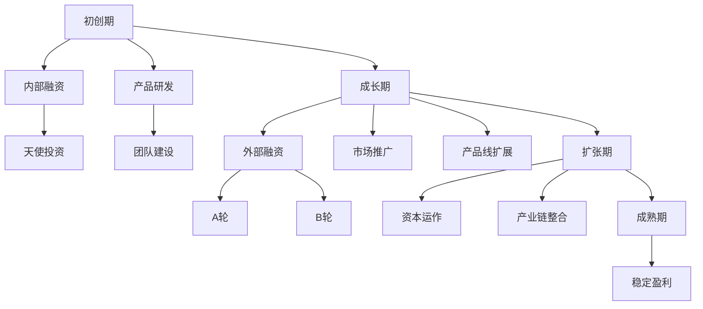

                 

### 文章标题

# 何时考虑为创业公司寻求融资

### 关键词

创业公司、融资、时机判断、融资策略、风险控制

### 摘要

创业公司在不同发展阶段面临不同的融资需求与挑战。本文旨在通过逻辑清晰的步骤分析，探讨何时是考虑为创业公司寻求融资的最佳时机。我们将从融资基础、创业公司需求与挑战、核心概念与联系、评估融资时机、融资策略与执行、成功融资案例分享以及实战经验等方面展开讨论，帮助创业公司更好地把握融资时机，实现可持续发展。

## 第一部分：理解融资与创业公司需求

### 第1章：融资基础

#### 1.1 融资的概念与分类

融资是指企业为了筹集资金而采取的各种方式。根据融资来源，可分为内部融资和外部融资。内部融资主要依靠企业自身的积累，如留存收益、内部融资等。外部融资则包括银行贷款、发行债券、股权融资等。其中，股权融资是创业公司较为常见的一种融资方式，主要包括天使投资、风险投资、私募股权投资等。

#### 1.2 融资流程简介

融资流程一般包括以下步骤：

1. **项目策划**：明确融资需求和目标，制定融资方案。
2. **市场调查**：分析市场趋势、竞争环境、投资者偏好等。
3. **方案制定**：根据市场调查结果，设计适合的融资方案。
4. **路演与洽谈**：向潜在投资者展示项目，进行洽谈。
5. **签订合同**：达成一致后，签订投资合同。
6. **资金到位**：投资者按照合同约定向企业注入资金。

#### 1.3 融资的重要性

融资对于创业公司的发展至关重要。一方面，融资可以为公司提供必要的资金支持，用于产品研发、市场推广、团队建设等；另一方面，融资可以提升企业的知名度、信誉度，有助于吸引更多合作伙伴和客户。此外，良好的融资策略还可以降低公司的经营风险，提高市场竞争力。

### 第2章：创业公司的需求与挑战

#### 2.1 创业公司的特点与成长路径

创业公司具有以下几个特点：

1. **创新性**：创业公司通常以创新为核心竞争力，寻求在市场中开辟新的领域。
2. **灵活性**：创业公司组织结构简单，决策迅速，能够快速响应市场变化。
3. **高风险**：创业公司在初期阶段面临较大的不确定性，成功概率相对较低。

创业公司的成长路径通常包括以下几个阶段：

1. **初创期**：公司成立，进行产品研发和团队建设。
2. **成长期**：产品成熟，市场推广，实现盈利。
3. **扩张期**：扩大市场份额，提高品牌知名度。
4. **成熟期**：实现规模化经营，稳定盈利。

#### 2.2 融资需求分析

创业公司在不同成长阶段面临不同的融资需求：

1. **初创期**：主要需求是资金用于产品研发、团队建设等。
2. **成长期**：需求扩大，包括市场推广、产品线扩展等。
3. **扩张期**：需求更高，包括投资生产线、扩大市场等。
4. **成熟期**：需求相对稳定，主要关注资本运作和产业链整合。

#### 2.3 创业公司的常见挑战

创业公司在融资过程中可能面临以下挑战：

1. **资金不足**：初期资金难以满足公司发展需求。
2. **市场竞争**：市场竞争激烈，融资难度增加。
3. **政策法规**：融资政策法规复杂，需耗费大量时间和精力。
4. **投资者关系**：与投资者沟通不畅，可能导致融资失败。

### 第3章：核心概念与联系

#### 3.1 融资相关术语解释

1. **天使投资**：通常指个人投资者在创业公司初创期提供资金支持。
2. **风险投资**：专业投资机构为高风险、高成长潜力的创业公司提供资金。
3. **私募股权投资**：通过私募方式为创业公司提供资金支持，通常在成长期和扩张期。
4. **融资轮次**：创业公司融资的不同阶段，如天使轮、A轮、B轮等。

#### 3.2 融资模型与策略

1. **内部融资模型**：基于企业自身盈利能力进行融资，适用于初创期。
2. **外部融资模型**：通过借款、发行债券、股权融资等方式筹集资金，适用于成长期和扩张期。
3. **融资策略**：根据创业公司发展阶段和市场环境，制定适合的融资策略。

#### 3.3 融资与公司发展的关系（Mermaid流程图）

### 总结

本部分主要介绍了融资的基础知识、创业公司的需求与挑战，以及融资相关的核心概念和模型。在下一部分中，我们将进一步探讨如何评估创业公司的融资时机。

## 第二部分：评估融资时机

### 第4章：融资时机的判断标准

#### 4.1 产品与市场成熟度

产品与市场成熟度是评估融资时机的重要因素。在产品研发阶段，公司需要投入大量资源进行技术研发和市场验证。此时，如果产品尚未成熟，市场接受度低，融资难度较大。相反，当产品成熟、市场接受度高时，融资的成功率相对较高。

#### 4.2 财务状况分析

财务状况是评估融资时机的重要依据。良好的财务状况可以证明公司具备盈利能力和偿还能力，提高融资的成功率。在评估财务状况时，应关注以下指标：

1. **收入增长率**：反映公司业务发展速度。
2. **毛利率**：衡量公司盈利能力。
3. **现金流**：评估公司资金流动性。
4. **资产负债率**：反映公司负债水平。

#### 4.3 团队与资源准备

团队和资源是创业公司成功的关键。在评估融资时机时，应关注以下方面：

1. **团队稳定性**：核心团队成员稳定，有利于项目的持续推进。
2. **技术储备**：具备一定的技术储备，提高产品竞争力。
3. **市场渠道**：建立一定的市场渠道，有利于产品的推广。
4. **合作伙伴**：拥有稳定的合作伙伴，提高资源整合能力。

#### 4.4 市场竞争环境分析

市场竞争环境对融资时机也有重要影响。在竞争激烈的市场环境中，创业公司需要通过融资来提高自身竞争力。以下因素是评估市场竞争环境的关键：

1. **市场份额**：公司在市场中的地位和份额。
2. **竞争对手**：竞争对手的数量、实力和市场策略。
3. **市场进入壁垒**：市场进入难度和竞争对手的反击力度。
4. **行业趋势**：行业的发展趋势和市场需求。

### 第5章：市场趋势与投资偏好

#### 5.1 当前的市场趋势

当前市场趋势对创业公司的融资时机具有重要影响。以下是一些重要的市场趋势：

1. **技术进步**：如人工智能、物联网、区块链等新兴技术的发展，为创业公司提供了新的机遇。
2. **市场需求**：消费者需求的变化，如环保、健康等，推动了相关领域创业公司的发展。
3. **政策支持**：政府对创新创业的扶持政策，如税收优惠、创业补贴等，降低了创业公司的融资成本。

#### 5.2 投资者的偏好领域

投资者在融资时具有特定的偏好领域，以下是一些常见的投资者偏好领域：

1. **高科技领域**：如人工智能、大数据、云计算等。
2. **消费领域**：如电子商务、健康医疗、教育等。
3. **制造业**：如智能制造、绿色制造等。

#### 5.3 融资策略调整

根据市场趋势和投资者偏好，创业公司应适时调整融资策略：

1. **选择合适的融资方式**：根据市场需求和投资者偏好，选择合适的融资方式，如天使投资、风险投资等。
2. **优化融资结构**：通过股权融资、债务融资等方式优化融资结构，降低融资成本。
3. **强化核心竞争力**：围绕投资者偏好领域，加强技术研发和市场拓展，提高产品竞争力。

### 第6章：风险评估与管理

#### 6.1 融资风险概述

融资过程中，创业公司可能面临以下风险：

1. **市场风险**：市场需求变化、竞争对手反击等。
2. **财务风险**：融资成本高、资金流动性差等。
3. **法律风险**：融资过程中可能涉及的法律问题，如合同纠纷等。
4. **管理风险**：团队管理、项目进度控制等。

#### 6.2 风险评估方法

创业公司应采用科学的方法进行风险评估，以下是一些常用的评估方法：

1. **定性评估**：通过专家意见、历史数据等定性分析风险。
2. **定量评估**：使用数学模型、统计分析等方法定量评估风险。
3. **情景分析**：模拟不同市场环境下的风险状况，评估风险影响。

#### 6.3 风险管理策略

创业公司应采取有效的风险管理策略，降低融资风险：

1. **风险分散**：通过多种融资方式、多个市场领域分散风险。
2. **风险控制**：建立风险控制机制，如风险预警、应急预案等。
3. **风险转移**：通过保险、担保等方式转移部分风险。
4. **风险规避**：在融资过程中，避免高风险领域，降低风险暴露。

### 总结

本部分主要介绍了评估创业公司融资时机的判断标准，包括产品与市场成熟度、财务状况分析、团队与资源准备以及市场竞争环境分析。同时，还分析了当前市场趋势和投资者偏好，提出了相应的融资策略调整和风险管理策略。在下一部分中，我们将探讨如何制定和执行融资策略。

### 第7章：融资策略制定

#### 7.1 融资目标设定

制定明确的融资目标是融资策略制定的第一步。创业公司应根据自身发展阶段、业务需求和战略规划，设定合理的融资目标。以下是一些常见的融资目标：

1. **资金筹集**：明确需要筹集的金额，如天使轮、A轮、B轮等。
2. **股权融资**：设定股权出让比例，如出让20%股权融资100万元。
3. **债务融资**：设定借款金额和还款期限，如借款200万元，分3年偿还。

#### 7.2 融资方式选择

创业公司应根据自身情况和市场需求，选择合适的融资方式。以下是一些常见的融资方式：

1. **股权融资**：通过出让股权获得资金支持，适用于初创期和成长期。
2. **债务融资**：通过借款获得资金支持，适用于扩张期和成熟期。
3. **天使投资**：个人投资者在初创期提供资金支持。
4. **风险投资**：专业投资机构为高风险、高成长潜力的创业公司提供资金。

#### 7.3 融资额度与时间规划

融资额度和时间规划是融资策略制定的关键。创业公司应综合考虑业务需求、市场环境和资金用途，合理设定融资额度和时间规划。以下是一些注意事项：

1. **融资额度**：根据业务需求和市场情况，合理设定融资额度。过多融资可能导致资金闲置，过少融资可能无法满足业务需求。
2. **时间规划**：合理安排融资时间，避免过早或过晚融资。过早融资可能导致资金闲置，过晚融资可能错失市场机遇。
3. **资金用途**：明确资金用途，确保资金用于核心业务和关键环节，提高资金利用效率。

### 第8章：寻找投资方

#### 8.1 投资方的类型与特点

创业公司在寻找投资方时，需要了解不同类型投资方的特点，以便选择合适的投资方。以下是一些常见的投资方类型及其特点：

1. **天使投资者**：通常为个人投资者，具有丰富的创业经验和人脉资源，关注初创期项目。
2. **风险投资机构**：专业投资机构，专注于高风险、高成长潜力的项目，提供长期资金支持。
3. **私募股权基金**：通过私募方式为创业公司提供资金支持，关注成长期和扩张期项目。
4. **上市公司**：通过并购等方式参与创业公司融资，具有稳定的资金来源和丰富的市场资源。

#### 8.2 投资方筛选标准

创业公司在筛选投资方时，应关注以下标准：

1. **投资方向**：投资方是否有意愿和资源支持创业公司的业务领域。
2. **投资规模**：投资方的资金实力和投资规模是否符合创业公司的需求。
3. **投资经验**：投资方在创业投资领域的经验和成功案例，有助于提高融资成功率。
4. **合作意愿**：投资方与创业公司在价值观、业务模式、发展愿景等方面的契合度。

#### 8.3 投资方沟通技巧

与投资方的有效沟通是融资成功的关键。以下是一些沟通技巧：

1. **准备充分**：在洽谈前充分准备，了解投资方的背景、需求和投资策略。
2. **清晰表达**：简洁明了地阐述创业公司的项目、市场和融资计划。
3. **倾听对方**：认真倾听投资方的意见和建议，展示合作诚意。
4. **建立信任**：通过坦诚、诚信的沟通建立信任，提高融资成功率。

### 第9章：融资谈判与合同签订

#### 9.1 融资谈判策略

融资谈判是创业公司与投资方达成共识的关键环节。以下是一些谈判策略：

1. **确定底线**：明确创业公司的底线条件，如融资额度、股权比例等，确保谈判过程中的主动权。
2. **了解对方需求**：了解投资方的需求，寻找共同利益点，降低谈判难度。
3. **展示优势**：突出创业公司的核心竞争力、市场前景和潜在价值，提高投资方的信心。
4. **谈判技巧**：灵活运用谈判技巧，如让步、妥协、双赢等，达成双方满意的协议。

#### 9.2 投资条款分析

投资条款是融资合同的重要组成部分，涉及股权分配、资金用途、投资期限、收益分配等方面。以下是一些常见的投资条款：

1. **股权比例**：确定创业公司与投资方的股权分配比例。
2. **资金用途**：明确投资资金的用途，如技术研发、市场推广、团队建设等。
3. **投资期限**：约定投资期限和退出机制，如到期回购、上市等。
4. **收益分配**：明确投资收益的分配方式和比例。

#### 9.3 合同签订注意事项

合同签订是融资谈判的最终成果，以下是一些注意事项：

1. **明确条款**：确保合同条款清晰、明确，避免歧义和纠纷。
2. **合规审查**：请专业律师对合同进行审查，确保合同符合法律法规要求。
3. **备份合同**：保存合同原件和电子版，以备不时之需。
4. **履行合同**：严格遵守合同约定，确保各方权益得到保障。

### 第10章：融资后的管理

#### 10.1 融资后的业务发展策略

融资成功后，创业公司应制定合理的业务发展策略，确保资金的有效利用。以下是一些建议：

1. **市场拓展**：加大市场推广力度，扩大市场份额。
2. **技术研发**：持续投入研发，提升产品竞争力。
3. **团队建设**：引进优秀人才，提高团队整体实力。
4. **资本运作**：优化资本结构，提高资金利用效率。

#### 10.2 融资资金的合理运用

合理运用融资资金是创业公司成功的关键。以下是一些建议：

1. **项目规划**：明确资金用途，确保资金用于核心业务和关键环节。
2. **预算控制**：制定预算计划，严格控制资金支出。
3. **风险控制**：建立风险控制机制，确保资金安全。
4. **财务监督**：聘请专业财务人员，确保财务报告真实、准确。

#### 10.3 融资后的风险管理

融资后的风险管理至关重要，以下是一些建议：

1. **风险评估**：定期进行风险评估，识别潜在风险。
2. **风险控制**：制定风险控制措施，降低风险影响。
3. **信息披露**：及时向投资者披露公司运营情况和风险状况。
4. **合规管理**：遵守法律法规，确保公司合法合规运营。

### 总结

本部分主要介绍了融资策略的制定、寻找投资方、融资谈判与合同签订以及融资后的管理。创业公司在融资过程中应充分考虑自身发展阶段、市场需求和投资方特点，制定合理的融资策略，确保融资成功并实现业务发展目标。

## 第四部分：成功融资案例分享与实战经验

### 第11章：成功融资案例分析

#### 11.1 案例一：初创公司A的融资之路

初创公司A在天使轮成功融资500万元，主要用于产品研发和团队建设。在A轮，公司融资1000万元，资金主要用于市场推广和产品线扩展。通过多轮融资，公司成功在B轮融资中融得1亿元，用于扩大市场份额和提升品牌知名度。

**经验总结**：

1. **产品成熟度**：公司在融资前已具备成熟的产品和稳定的客户群体，提高了融资成功率。
2. **明确融资目标**：公司在每轮融资前明确融资目标和资金用途，确保资金合理利用。
3. **优化股权结构**：公司在融资过程中逐步优化股权结构，降低投资方的股权比例，保持公司控制权。

#### 11.2 案例二：成长期公司B的多元融资策略

成长期公司B采用多元融资策略，通过天使轮、A轮、B轮和C轮融资，共筹集资金5亿元。其中，天使轮和A轮主要来自天使投资和风险投资，B轮和C轮则来自私募股权基金。

**经验总结**：

1. **多元融资**：通过多元化融资方式，降低融资成本，提高融资成功率。
2. **股权激励**：公司在融资过程中引入股权激励机制，吸引优秀人才，提高团队凝聚力。
3. **投资者关系**：公司积极与投资者沟通，建立良好的投资者关系，提高公司的市场信誉。

#### 11.3 案例三：新兴公司C的跨国融资实践

新兴公司C在初创期通过国内天使投资和风险投资筹集资金，随后在A轮和C轮融资中成功获得国际投资者的支持，共筹集资金3亿美元。公司通过跨国融资，拓宽了市场渠道，提高了国际知名度。

**经验总结**：

1. **国际化视野**：公司具有国际化视野，注重拓展国际市场，吸引国际投资者。
2. **跨国合作**：公司与跨国企业建立合作关系，提高产品在国际市场的竞争力。
3. **本土化运营**：公司在跨国融资过程中注重本土化运营，遵循当地法律法规，降低运营风险。

### 第12章：实战经验分享

#### 12.1 创业者融资经验分享

创业者A在融资过程中，通过充分准备、明确融资目标和优化股权结构，成功在天使轮融资500万元。他建议创业者：

1. **充分准备**：在融资前充分准备，包括项目策划、市场调研、财务分析等。
2. **明确目标**：明确融资目标和资金用途，确保资金合理利用。
3. **优化股权**：在融资过程中逐步优化股权结构，降低投资方的股权比例，保持公司控制权。

#### 12.2 投资人视角下的融资建议

投资人B认为，创业者应关注以下几点：

1. **产品与市场**：确保产品有市场需求，具备竞争力。
2. **团队与资源**：拥有稳定的团队和丰富的资源，提高项目成功率。
3. **融资策略**：根据自身发展阶段和市场环境，制定合理的融资策略。

#### 12.3 融资过程中的常见问题与解答

**问题1**：如何应对融资过程中的谈判压力？

解答：在谈判过程中，创业者应保持冷静，充分准备，了解投资方的需求和关切。同时，展示项目优势和未来发展潜力，增强投资方的信心。

**问题2**：如何平衡融资额度和股权比例？

解答：创业者应在融资额度和股权比例之间寻找平衡。过多融资可能导致资金闲置，过少融资可能无法满足业务需求。在融资过程中，逐步优化股权结构，确保公司控制权。

**问题3**：如何评估投资方的价值？

解答：创业者应关注投资方的投资方向、投资规模、投资经验和合作意愿。同时，了解投资方的背景和资源，确保投资方的价值与创业公司的需求相匹配。

### 总结

通过成功融资案例和实战经验分享，我们可以了解到创业公司在融资过程中应充分考虑自身发展阶段、市场需求和投资者特点，制定合理的融资策略，确保融资成功并实现可持续发展。

### 附录

#### 附录A：常用融资工具与平台介绍

**天使投资**：通常由个人投资者提供资金支持，关注初创期项目。

**风险投资**：专业投资机构，专注于高风险、高成长潜力的项目。

**私募股权投资**：通过私募方式为创业公司提供资金支持，关注成长期和扩张期项目。

**众筹平台**：如Kickstarter、Indiegogo等，为创业公司提供筹资渠道。

#### 附录B：融资相关法规与政策

**国家相关政策解读**：了解国家关于创新创业的扶持政策，如税收优惠、创业补贴等。

**地方政府支持政策**：了解地方政府对创新创业的扶持政策，如资金支持、场地优惠等。

**国际融资法规比较**：了解国际融资法规和监管政策，为跨国融资提供参考。

#### 附录C：融资案例资料与参考书目

**融资案例资料**：收集成功融资案例的详细资料，为创业公司提供借鉴。

**相关书籍推荐**：

- 《创业融资》
- 《融资策略与执行》
- 《创业公司融资实战》

**学术论文与研究报告**：查阅相关领域的学术论文和研究报告，了解融资领域的最新动态和趋势。

### 总结

本文从多个角度探讨了何时考虑为创业公司寻求融资的问题，提供了详细的融资策略和实战经验。通过理解融资基础、评估融资时机、制定融资策略、寻找投资方、谈判与合同签订以及融资后的管理，创业公司可以更好地把握融资时机，实现可持续发展。附录部分提供了实用的融资工具、法规政策和案例资料，为读者提供了更深入的参考。希望本文对创业公司寻求融资有所帮助。作者：AI天才研究院/AI Genius Institute & 禅与计算机程序设计艺术/Zen And The Art of Computer Programming。

