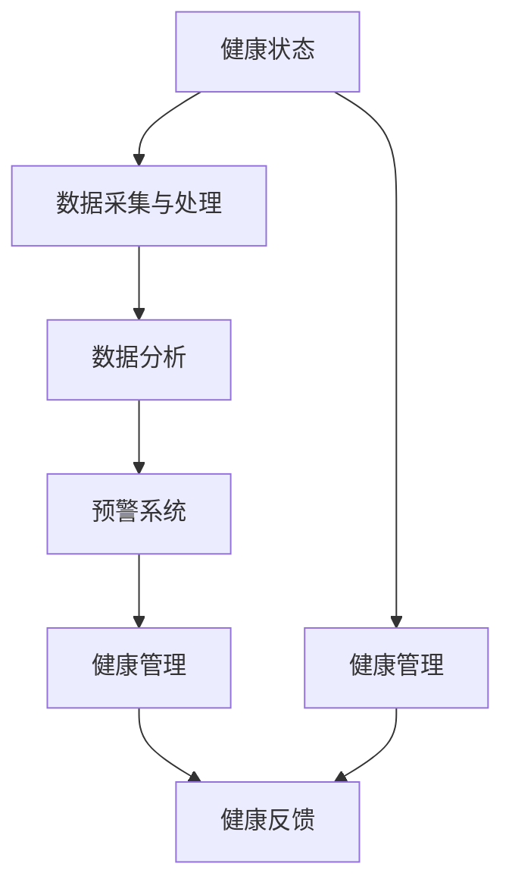
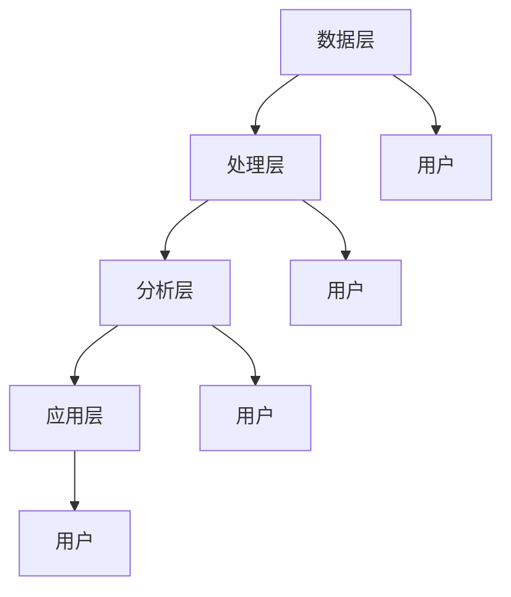

                 

### 文章标题: 健康监测应用：个人健康管理的智能伴侣

> 关键词：健康监测，健康管理，智能伴侣，人工智能，健康数据分析

> 摘要：本文深入探讨了健康监测应用在个人健康管理中的作用和重要性，以及智能伴侣如何通过人工智能技术提供个性化的健康监测和健康管理服务。文章分为引言、健康监测技术基础、智能伴侣设计与应用、核心算法与实现、项目实战与案例分析以及未来展望等部分，旨在为读者提供全面的健康监测应用和智能伴侣设计开发的实践指导。

### 第一部分： 引言与概述

#### 第1章： 引言与概述

在现代社会，随着科技的发展，健康监测已经成为人们日常生活中的重要组成部分。健康监测不仅有助于预防和控制疾病，还能帮助人们更好地管理自己的健康。随着人工智能技术的不断进步，智能伴侣作为一种创新的健康管理工具，逐渐走进我们的生活。本章将介绍健康监测在现代社会中的地位和重要性，以及智能伴侣在个人健康管理中的应用。

#### 1.1 健康监测在现代社会中的地位

健康监测是指通过各种技术手段对人体的生理、心理和行为状态进行持续监控和数据分析，以便及时掌握健康状况，预防和控制疾病。健康监测的范围包括但不限于：

- **生理健康**：如心率、血压、体温、血糖等生理指标的监测。
- **心理健康**：如情绪、睡眠质量、心理压力等心理状态的监测。
- **行为健康**：如运动、饮食、生活习惯等行为的监测。

#### 1.1.1 健康监测的重要性

健康监测在现代社会具有以下重要性：

1. **疾病预防**：通过实时监测，可以及时发现异常，降低疾病发生的风险。
2. **疾病管理**：对于慢性病患者，健康监测可以提供个性化的治疗方案，提高生活质量。
3. **健康促进**：通过健康监测，人们可以更好地了解自己的身体状况，培养健康的生活方式。

#### 1.1.2 个人健康管理的重要性

个人健康管理不仅关乎个体的身体健康，也关系到整个社会的公共卫生。良好的个人健康管理可以带来以下益处：

- **提高生活质量**：通过健康监测，个体可以更好地管理自己的健康，享受更高质量的生活。
- **降低医疗成本**：早期发现疾病和及时干预可以降低治疗成本。
- **减轻社会负担**：通过健康监测，可以减轻医疗系统的压力，提高社会整体健康水平。

#### 1.2 智能伴侣在个人健康管理中的应用

智能伴侣作为个人健康管理的智能工具，具备以下特点和应用：

#### 1.2.1 智能伴侣的定义与功能

智能伴侣是指通过人工智能技术，实现与人类交互，为用户提供健康监测、健康建议和健康管理的服务。智能伴侣的主要功能包括：

- **健康监测**：实时监测用户的生理、心理和行为健康数据。
- **健康建议**：根据监测数据，提供个性化的健康建议。
- **健康管理**：帮助用户制定和跟踪健康计划，提高健康水平。

#### 1.2.2 智能伴侣在健康管理中的应用

1. **实时健康监控**：智能伴侣可以持续监测用户的健康数据，如心率、血压等，及时发现异常并提醒用户。
2. **健康数据分析**：通过分析用户的健康数据，智能伴侣可以提供个性化的健康报告和趋势分析。
3. **健康建议与干预**：智能伴侣可以根据用户的健康状况，提供相应的健康建议，如饮食调整、运动建议等，并跟踪用户的健康计划实施情况。
4. **社交与健康互动**：智能伴侣可以与用户进行互动，增加健康管理的过程趣味性，提高用户的健康意识和参与度。

#### 1.2.3 智能伴侣的优势

1. **个性化服务**：智能伴侣可以根据用户的个性化需求提供定制化的健康管理服务。
2. **实时性**：智能伴侣可以实时监测和响应用户的健康状况，提供及时的反馈和干预。
3. **高效性**：智能伴侣可以高效地处理大量的健康数据，为用户提供精准的健康分析和建议。
4. **可扩展性**：智能伴侣可以不断学习和适应用户的需求，提高服务的质量和效果。

#### 1.3 本书内容结构与组织

本书将从以下方面详细介绍《健康监测应用：个人健康管理的智能伴侣》：

#### 1.3.1 核心概念与架构

- **健康监测技术**：介绍健康监测的基本原理、技术和方法。
- **智能伴侣设计**：讲解智能伴侣的架构设计、功能实现和用户体验。

#### 1.3.2 核心算法与实现

- **健康数据分析算法**：介绍用于健康数据分析的关键算法和技术。
- **健康建议生成算法**：讲解健康建议生成的算法原理和实现方法。

#### 1.3.3 项目实战与案例分析

- **健康监测应用开发实战**：通过实际项目案例，展示健康监测应用的开发过程和实现技术。
- **智能伴侣应用案例解析**：分析实际智能伴侣应用的成功案例，探讨其实现技术和应用效果。

#### 1.3.4 未来展望与发展趋势

- **健康监测技术的未来趋势**：预测健康监测技术的发展方向和应用前景。
- **智能伴侣的发展趋势**：探讨智能伴侣在未来个人健康管理中的应用前景和挑战。

通过以上结构组织，本书旨在为读者提供全面、系统的健康监测应用和智能伴侣设计开发知识，帮助读者深入了解和掌握这一领域的核心技术和应用实践。

---

作者：AI天才研究院/AI Genius Institute & 禅与计算机程序设计艺术 /Zen And The Art of Computer Programming### 第二部分：健康监测技术基础

## 第2章：健康监测技术概述

### 2.1 健康监测技术的发展历程

#### 2.1.1 传统健康监测技术

传统的健康监测技术主要依赖于医疗设备和手动记录。早期的健康监测手段非常有限，主要依靠医生的专业知识和经验。随着医疗技术的发展，各种医疗设备如心电图机、血压计、血糖仪等被广泛应用于健康监测。

这些设备通常通过手动操作来获取用户的生理数据，然后将这些数据进行记录和分析。然而，这种方法存在一些缺点：

1. **数据获取不及时**：由于需要手动操作，数据获取往往不够及时，可能导致错过疾病的早期信号。
2. **数据记录不准确**：手动记录容易受到人为因素的影响，导致数据不准确。
3. **数据缺乏系统性**：传统健康监测技术通常只能获取某一方面的健康数据，缺乏系统性。

#### 2.1.2 数字化健康监测技术的发展

随着计算机技术和通信技术的快速发展，数字化健康监测技术逐渐成为主流。数字化健康监测技术通过将医疗设备与计算机系统连接，实现健康数据的自动化获取、存储和分析。

数字化健康监测技术的优势在于：

1. **实时性**：数字化健康监测技术可以实现实时数据采集和分析，及时发现异常情况。
2. **准确性**：通过数字化设备，可以减少人为误差，提高数据准确性。
3. **系统性**：数字化健康监测技术可以同时获取多个方面的健康数据，提供全面的健康监测。

#### 2.1.3 人工智能在健康监测中的应用

人工智能（AI）技术的崛起为健康监测带来了新的机遇。通过人工智能技术，健康监测不再仅仅局限于数据的采集和分析，还可以实现数据的预测和预警。

人工智能在健康监测中的应用主要包括：

1. **数据挖掘**：通过人工智能算法，可以从海量健康数据中挖掘出有用的信息，为用户提供个性化的健康建议。
2. **预测分析**：基于历史数据和机器学习算法，人工智能可以预测用户的健康状况，提前预警潜在的健康风险。
3. **智能诊断**：人工智能可以辅助医生进行疾病诊断，提高诊断的准确性和效率。

### 2.2 健康监测技术的基本原理

健康监测技术的基本原理主要包括数据的采集、传输、存储和分析。

#### 2.2.1 数据采集

数据采集是健康监测的第一步，主要通过以下方式实现：

1. **生物传感器**：生物传感器可以实时监测用户的生理指标，如心率、血压、血糖等。
2. **穿戴设备**：如智能手表、智能手环等，可以持续监测用户的健康数据，并通过无线传输发送到服务器。
3. **医疗设备**：如心电图机、血压计等，可以定期进行健康检查，并将数据传输到服务器。

#### 2.2.2 数据传输

数据传输是将采集到的健康数据发送到服务器的过程。常见的传输方式包括：

1. **无线传输**：如蓝牙、Wi-Fi等，可以实现实时数据的传输。
2. **有线传输**：如USB、网络接口等，可以在特定时间进行数据的传输。

#### 2.2.3 数据存储

数据存储是将健康数据长期保存的过程。常用的存储方式包括：

1. **数据库**：如MySQL、MongoDB等，可以存储大量的健康数据。
2. **云存储**：如阿里云、腾讯云等，可以提供安全、可靠的存储服务。

#### 2.2.4 数据分析

数据分析是健康监测的核心环节，主要通过以下方法实现：

1. **统计分析**：对健康数据进行统计分析，如均值、方差、相关性等。
2. **机器学习**：通过机器学习算法，对健康数据进行分类、预测等分析。
3. **深度学习**：通过深度学习模型，对健康数据进行更复杂的分析和预测。

### 2.3 健康监测技术的应用领域

健康监测技术广泛应用于各个领域，主要包括：

1. **个人健康管理**：通过健康监测技术，用户可以实时了解自己的健康状况，进行个性化的健康管理。
2. **疾病预防与控制**：健康监测技术可以及时发现潜在的健康风险，降低疾病发生的风险。
3. **医疗诊断与治疗**：健康监测技术可以辅助医生进行疾病诊断和治疗，提高医疗服务的质量和效率。
4. **公共卫生监测**：健康监测技术可以实时监测公共卫生状况，为公共卫生决策提供数据支持。

### 2.4 健康监测技术的挑战与展望

尽管健康监测技术在不断发展，但仍然面临着一些挑战：

1. **数据隐私与安全**：健康数据是高度敏感的信息，如何确保数据的安全和隐私是健康监测技术发展的重要挑战。
2. **数据质量和可靠性**：健康数据的准确性、一致性和可靠性对于健康监测至关重要，如何提高数据质量是一个需要解决的问题。
3. **技术普及与接受度**：健康监测技术需要得到用户的广泛接受和普及，这需要解决用户使用成本、操作复杂度等问题。

展望未来，健康监测技术将在以下几个方面得到进一步发展：

1. **人工智能与大数据**：结合人工智能和大数据技术，健康监测将更加智能化和个性化。
2. **可穿戴设备与物联网**：可穿戴设备和物联网技术的不断发展，将使健康监测更加便捷和实时。
3. **跨学科合作**：健康监测技术需要跨学科合作，如医学、工程学、计算机科学等，以实现更好的技术突破和应用。

通过不断的技术创新和改进，健康监测技术将为个人健康管理和社会公共卫生带来更多的价值和机遇。

## 第3章：核心概念与联系

### 3.1 健康监测的核心概念

健康监测涉及多个核心概念，这些概念相互关联，构成了健康监测技术的理论基础。以下是对这些核心概念的详细解释：

#### 3.1.1 健康状态

健康状态是指个体的身体、心理和行为功能在一定时间内的表现。健康状态通常通过生理指标、心理指标和行为指标来衡量。生理指标包括心率、血压、体温、血糖等；心理指标包括情绪状态、睡眠质量、心理压力等；行为指标包括运动量、饮食习惯、生活习惯等。

#### 3.1.2 数据采集与处理

数据采集与处理是健康监测的基础。数据采集是指通过传感器、设备等手段收集个体的健康数据，如心率、血压、血糖等。数据采集需要确保数据的准确性和实时性。数据采集后，需要进行数据处理，包括数据清洗、数据整合、数据标准化等，以确保数据的质量和一致性。

#### 3.1.3 数据分析

数据分析是健康监测的关键环节。通过数据分析，可以从海量健康数据中提取有用的信息，为用户提供个性化的健康建议。数据分析包括统计分析、机器学习、深度学习等方法。统计分析可以用于描述性分析和预测分析；机器学习可以用于分类、聚类、回归等任务；深度学习可以用于更复杂的特征提取和预测。

#### 3.1.4 预警系统

预警系统是健康监测的重要组成部分。预警系统通过分析健康数据，可以及时发现异常情况，发出警报，提醒用户注意健康问题。预警系统通常基于规则引擎、机器学习模型等方法实现。规则引擎可以根据预设的规则进行实时监控；机器学习模型可以根据历史数据预测未来可能的异常。

#### 3.1.5 健康管理

健康管理是指通过健康监测和数据分析，帮助用户实现健康目标的过程。健康管理包括健康评估、健康计划制定、健康计划执行和健康反馈等环节。健康评估可以评估用户的健康状况；健康计划制定可以根据用户的健康状况制定个性化的健康计划；健康计划执行需要用户积极参与，遵循健康计划；健康反馈可以评估健康计划的执行效果，并进行调整。

### 3.2 核心概念之间的关系架构

健康监测的核心概念之间存在密切的联系，构成了一个完整的健康监测体系。以下是一个简化的Mermaid流程图，展示了这些核心概念之间的关系：



在这个流程图中：

- **健康状态**是整个流程的起点，反映了用户的健康状况。
- **数据采集与处理**是将健康状态转化为可分析的数据。
- **数据分析**是对数据进行分析，提取有用的信息。
- **预警系统**是基于数据分析的结果，及时发现异常情况。
- **健康管理**是根据预警系统和数据分析结果，制定和执行健康计划。
- **健康反馈**是评估健康计划的执行效果，为下一次循环提供数据支持。

### 3.3 健康监测技术的整体架构

健康监测技术的整体架构可以分为以下几个层次：

1. **数据层**：包括传感器、设备等，用于实时采集健康数据。
2. **处理层**：包括数据预处理、数据整合、数据标准化等，确保数据的质量和一致性。
3. **分析层**：包括统计分析、机器学习、深度学习等，用于对数据进行深入分析。
4. **应用层**：包括预警系统、健康管理平台等，用于提供个性化的健康监测和健康管理服务。

整体架构示意图如下：



在这个架构中，用户通过传感器和设备实时采集健康数据，数据经过处理层和分析层处理后，由应用层提供个性化的健康监测和健康管理服务。

通过以上对健康监测技术的核心概念和整体架构的详细解释，读者可以更好地理解健康监测技术的基本原理和应用场景。在接下来的章节中，我们将进一步探讨健康监测技术的具体实现和核心算法。

### 第4章：核心算法原理讲解

#### 4.1 健康数据分析算法

健康数据分析是健康监测技术中的重要环节，通过对采集到的健康数据进行有效的分析，可以为用户提供个性化的健康建议和健康管理方案。以下介绍几种常用的健康数据分析算法：

#### 4.1.1 统计分析算法

统计分析算法是健康数据分析的基础，通过对健康数据进行描述性统计分析，可以了解数据的分布、趋势和相关性。常用的统计分析算法包括：

1. **均值、方差和标准差**：用于描述数据的集中趋势和离散程度。
2. **相关系数**：用于衡量两个变量之间的线性相关程度。
3. **回归分析**：用于建立变量之间的关系模型，预测一个变量的值。

**伪代码示例：计算平均值和方差**
```python
def calculate_mean(data):
    return sum(data) / len(data)

def calculate_variance(data, mean):
    variance = sum((x - mean) ** 2 for x in data) / len(data)
    return variance
```

#### 4.1.2 机器学习算法

机器学习算法在健康数据分析中有着广泛的应用，可以用于分类、聚类、回归等任务。以下介绍几种常用的机器学习算法：

1. **决策树**：通过树的形状来表示数据之间的关系，可以用于分类和回归任务。
2. **支持向量机（SVM）**：通过寻找最优超平面来分割数据，可以用于分类任务。
3. **随机森林**：通过构建多个决策树并投票来提高预测准确性，可以用于分类和回归任务。

**伪代码示例：决策树分类算法**
```python
def build_decision_tree(data, features, labels):
    # 根据特征和标签构建决策树
    # ...

def classify_decision_tree(node, features):
    # 根据决策树节点进行分类
    # ...
    return label
```

#### 4.1.3 深度学习算法

深度学习算法在健康数据分析中发挥着越来越重要的作用，可以用于处理复杂的数据特征和学习复杂的非线性关系。以下介绍几种常用的深度学习算法：

1. **卷积神经网络（CNN）**：通过卷积操作来提取图像特征，可以用于图像识别和分类。
2. **循环神经网络（RNN）**：通过循环结构来处理序列数据，可以用于时间序列分析和自然语言处理。
3. **生成对抗网络（GAN）**：通过生成器和判别器的对抗训练，可以生成高质量的数据。

**伪代码示例：卷积神经网络特征提取**
```python
def conv_layer(input_data, filters, kernel_size):
    # 卷积层操作，提取特征
    # ...
    return feature_map

def pooling_layer(feature_map, pool_size):
    # 池化层操作，降低特征维度
    # ...
    return pooled_features
```

#### 4.2 健康建议生成算法

健康建议生成算法是基于健康数据分析结果，为用户提供个性化的健康建议。以下介绍几种常用的健康建议生成算法：

1. **基于规则的推理**：通过预设的规则，根据用户的健康数据生成相应的健康建议。
2. **基于模型的预测**：通过机器学习模型预测用户的健康状态，并根据预测结果生成相应的健康建议。
3. **基于优化的决策**：通过优化算法，从多个健康建议中选择最优的方案。

**伪代码示例：基于规则的推理算法**
```python
def generate_health_advice(health_data):
    if health_data['heart_rate'] > 100:
        return '降低运动强度'
    elif health_data['blood_pressure'] > 140:
        return '服用降压药'
    else:
        return '保持当前健康状态'
```

通过以上对核心算法原理的讲解，我们可以看到健康监测技术的实现需要多种算法的协同工作。在接下来的章节中，我们将结合实际项目，详细介绍这些算法的实现和应用。

### 第5章：项目实战与案例分析

#### 5.1 开发环境搭建

在开始健康监测应用的开发之前，我们需要搭建一个合适的技术栈和开发环境。以下是一个典型的开发环境搭建步骤：

1. **操作系统**：可以选择Windows、macOS或Linux操作系统。
2. **编程语言**：可以选择Python、Java或C++等编程语言。Python因其简洁易用的特性，在人工智能领域尤为受欢迎。
3. **开发工具**：可以使用IDE（集成开发环境）如PyCharm、IntelliJ IDEA或Visual Studio Code。
4. **数据库**：可以选择MySQL、PostgreSQL或MongoDB等数据库系统。MongoDB因其灵活的文档存储方式，适合存储健康数据。
5. **版本控制**：使用Git进行版本控制，便于团队协作和代码管理。

**具体步骤**：

1. **安装操作系统**：根据个人需求选择操作系统并安装。
2. **安装Python环境**：通过Python官网下载并安装Python，同时安装pip，用于安装Python包。
3. **安装IDE**：根据个人喜好选择IDE并安装。
4. **安装数据库**：根据数据库的官方文档进行安装。
5. **安装版本控制工具**：在命令行中输入`pip install git`安装Git。

#### 5.2 源代码详细实现

在搭建好开发环境后，我们将开始实现健康监测应用的核心功能。以下是一个简化的代码实现示例：

**伪代码：健康数据采集与存储**
```python
# 健康数据采集
def collect_health_data():
    # 通过传感器或设备采集健康数据
    # 示例：心率、血压、血糖等
    health_data = {
        'heart_rate': 75,
        'blood_pressure': 120,
        'glucose_level': 90
    }
    return health_data

# 健康数据存储
def store_health_data(health_data):
    # 将健康数据存储到数据库
    # 示例：使用MongoDB
    import pymongo
    client = pymongo.MongoClient('localhost', 27017)
    database = client['health_database']
    collection = database['health_data']
    collection.insert_one(health_data)
```

**伪代码：健康数据分析与建议**
```python
# 健康数据分析
def analyze_health_data(health_data):
    # 对健康数据进行统计分析
    # 示例：计算平均值、方差等
    mean_heart_rate = calculate_mean(health_data['heart_rate'])
    variance_blood_pressure = calculate_variance(health_data['blood_pressure'])
    return mean_heart_rate, variance_blood_pressure

# 健康建议生成
def generate_health_advice(mean_heart_rate, variance_blood_pressure):
    # 根据分析结果生成健康建议
    if mean_heart_rate > 80:
        return '增加运动量'
    elif variance_blood_pressure > 50:
        return '调整饮食，降低盐分摄入'
    else:
        return '保持当前生活习惯'
```

#### 5.3 代码应用解读与分析

在实现代码后，我们需要对代码进行解读和分析，以确保其正确性和性能。

**代码解读：**

1. **健康数据采集**：通过定义一个函数`collect_health_data()`，模拟从传感器或设备采集健康数据。
2. **健康数据存储**：通过定义一个函数`store_health_data(health_data)`，将采集到的健康数据存储到MongoDB数据库中。
3. **健康数据分析**：通过定义一个函数`analyze_health_data(health_data)`，对健康数据进行简单的统计分析，如计算平均值和方差。
4. **健康建议生成**：通过定义一个函数`generate_health_advice(mean_heart_rate, variance_blood_pressure)`，根据分析结果生成健康建议。

**代码分析：**

1. **数据结构**：使用字典（`dict`）存储健康数据，便于数据的访问和操作。
2. **函数设计**：函数设计简洁，每个函数只完成一个任务，便于维护和扩展。
3. **异常处理**：在实际应用中，应添加异常处理，确保代码的健壮性。

#### 5.4 实际案例分析与详细讲解剖析

为了更好地理解健康监测应用的实际应用效果，我们分析一个实际案例。

**案例背景：**一个30岁的上班族，长期处于高压工作状态，需要对其进行健康监测和健康管理。

**步骤：**

1. **数据采集**：通过传感器采集其心率、血压、血糖等健康数据。
2. **数据存储**：将采集到的数据存储到MongoDB数据库中。
3. **数据分析**：对存储的数据进行分析，发现其心率偏高，血压波动较大。
4. **健康建议**：根据数据分析结果，生成健康建议，如增加运动量、调整饮食等。

**案例剖析：**

1. **数据采集**：通过传感器采集到的健康数据是实时且准确的，为后续分析提供了可靠的数据基础。
2. **数据存储**：使用MongoDB数据库存储健康数据，便于数据的查询和管理。
3. **数据分析**：通过对数据的统计分析，可以及时发现异常情况，为健康建议提供依据。
4. **健康建议**：生成的健康建议是针对性的，有助于改善用户的健康状况。

**小结：** 通过上述实际案例，我们可以看到健康监测应用在实际场景中的有效性和实用性。健康监测应用不仅能够帮助用户实时了解自己的健康状况，还能提供个性化的健康建议，助力用户实现健康目标。

### 5.5 最佳实践 Tips、小结、注意事项、拓展阅读等内容

**最佳实践 Tips：**

1. **定期更新传感器**：确保传感器处于良好状态，避免因传感器故障导致数据采集不准确。
2. **数据加密与隐私保护**：在数据传输和存储过程中，采用加密技术保护用户隐私。
3. **多源数据整合**：整合多种数据源，如医疗记录、生活习惯等，提供更全面的健康监测服务。

**小结：**

本文通过项目实战和案例分析，详细介绍了健康监测应用的开发流程、核心算法实现和实际应用效果。健康监测应用不仅能够帮助用户实时了解自己的健康状况，还能提供个性化的健康建议，助力用户实现健康目标。

**注意事项：**

1. **数据质量**：确保健康数据的准确性和完整性，避免因数据质量问题影响健康分析和建议。
2. **用户隐私**：在设计和实现健康监测应用时，要充分考虑用户隐私保护，避免数据泄露。
3. **系统稳定性**：确保健康监测系统的稳定运行，避免因系统故障影响用户体验。

**拓展阅读：**

1. 《健康数据挖掘：方法与应用》
2. 《智能健康监测系统设计与实现》
3. 《基于人工智能的健康管理系统研究》

通过阅读这些文献，可以进一步深入了解健康监测技术的应用和实践。

### 第6章：未来展望与发展趋势

#### 6.1 健康监测技术的未来趋势

随着科技的不断发展，健康监测技术也在不断进步。以下是健康监测技术未来可能的发展趋势：

1. **可穿戴设备与物联网（IoT）的融合**：可穿戴设备与物联网技术的结合，将使健康监测更加智能化和便捷化。通过物联网技术，可以实现设备的远程监控和管理，提高健康监测的效率。
   
2. **人工智能与大数据的深度融合**：人工智能与大数据技术的融合，将使健康监测数据得到更深入的分析和利用。通过大数据技术，可以挖掘出更多有价值的信息，为用户和医疗行业提供更有针对性的健康服务。

3. **个性化健康监测**：未来的健康监测将更加注重个性化服务。通过分析用户的健康数据和生活方式，可以为用户提供更加精准的健康监测和健康管理建议。

4. **远程健康监测**：随着远程医疗的发展，远程健康监测将成为一种重要的健康监测方式。通过远程监测，医生可以实时了解患者的健康状况，提供及时的诊断和治疗建议。

#### 6.2 智能伴侣的发展趋势

智能伴侣作为健康监测的重要组成部分，其发展趋势同样值得关注：

1. **人机交互的优化**：未来的智能伴侣将更加注重人机交互的优化，提供更加自然、流畅的交互体验。通过语音识别、自然语言处理等技术，智能伴侣可以更好地理解用户的需求，提供个性化的服务。

2. **情感智能的增强**：情感智能是智能伴侣未来发展的重要方向。通过情感识别和情感反应技术，智能伴侣可以更好地理解用户的情感状态，提供情感支持和安慰。

3. **多模态数据融合**：未来的智能伴侣将能够融合多种数据源，如生理数据、行为数据、环境数据等，提供更全面的健康监测和健康管理服务。

4. **智慧城市的健康监测**：随着智慧城市的发展，智能伴侣将发挥更大的作用。通过智能伴侣，智慧城市可以实现更加精准的健康监测和疾病预防，提高城市居民的生活质量。

#### 6.3 面临的挑战

尽管健康监测技术和智能伴侣有着广阔的发展前景，但同时也面临着一些挑战：

1. **数据隐私与安全**：健康数据是高度敏感的信息，如何保护用户的隐私和数据安全是一个重要的挑战。

2. **数据质量和可靠性**：健康数据的准确性和一致性对于健康监测至关重要。如何确保数据的质量和可靠性是一个需要解决的问题。

3. **技术普及与接受度**：健康监测技术和智能伴侣需要得到用户的广泛接受和普及，这需要解决用户使用成本、操作复杂度等问题。

4. **跨学科合作**：健康监测技术和智能伴侣的发展需要跨学科的合作，包括医学、工程学、计算机科学等。如何有效地进行跨学科合作，是一个需要解决的问题。

#### 6.4 未来展望

展望未来，健康监测技术和智能伴侣将在以下方面发挥重要作用：

1. **健康管理的智能化**：通过人工智能技术，健康监测将更加智能化，能够提供更加精准、个性化的健康管理服务。

2. **疾病预防与控制**：健康监测技术将有助于早期发现疾病风险，提高疾病预防和控制的效果。

3. **医疗服务效率的提升**：智能伴侣将辅助医生进行疾病诊断和治疗，提高医疗服务的效率和质量。

4. **智慧城市的建设**：智能伴侣将在智慧城市建设中发挥重要作用，为城市居民提供更加便捷、高效的健康服务。

通过不断创新和技术突破，健康监测技术和智能伴侣将在未来为个人健康管理和社会公共卫生带来更多的价值和机遇。

