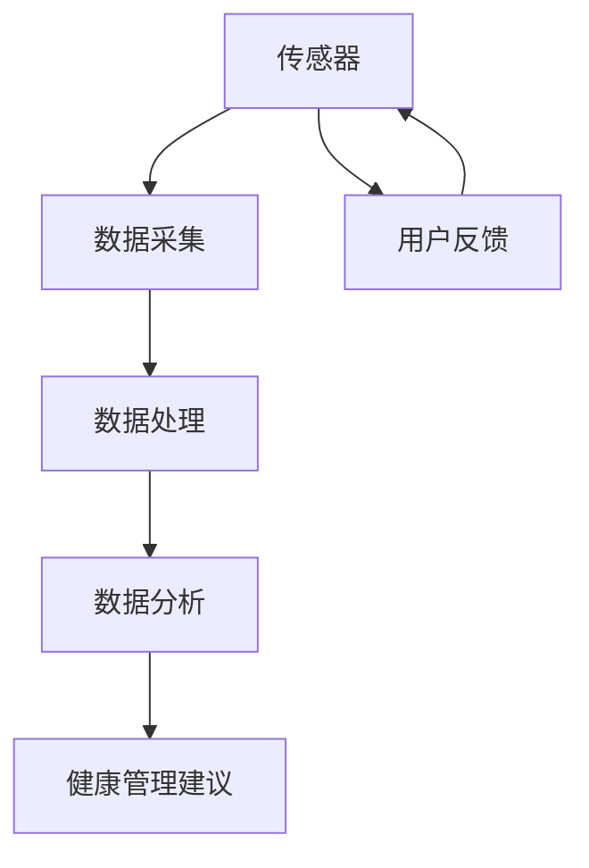
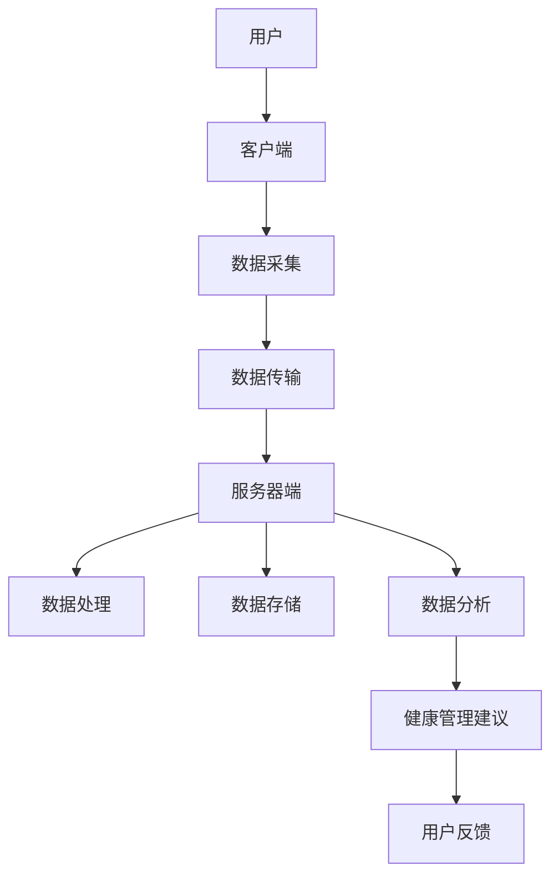

                 

### 文章标题

# 《健康监测应用：个人健康管理的智能伴侣》

### 关键词

- 健康监测
- 个人健康管理
- 智能伴侣
- 传感器技术
- 数据处理
- 机器学习

### 摘要

随着科技的进步，健康监测应用逐渐成为个人健康管理的重要工具。本文从健康监测的定义、技术发展、市场需求、核心技术、系统架构设计、开发实践以及案例分析等多个角度，详细探讨了健康监测应用的发展现状和未来趋势。文章旨在为读者提供全面的技术解读和实际应用案例，帮助用户更好地利用智能健康监测应用，实现个性化健康管理。

## 《健康监测应用：个人健康管理的智能伴侣》目录大纲

### 第一部分：健康监测应用概述

#### 第1章：健康监测应用引言

##### 1.1 健康监测的定义与重要性

- **定义**：健康监测是指通过传感器、数据处理和机器学习等技术，持续监测个体的生理、心理和行为状态，收集健康数据并进行处理，以便于早期发现健康问题，提供健康管理建议。

- **重要性**：健康监测在个人健康管理中扮演着关键角色，它有助于早期发现健康风险，提高生活质量，降低医疗成本。

- **概念联系**：使用Mermaid流程图展示健康监测系统的组成部分，包括传感器、数据采集与处理、数据分析等。

- **实际应用**：介绍健康监测在个人健康管理中的应用案例，如心率监测、血压监测等。

##### 1.2 健康监测技术的发展

- **技术原理**：回顾健康监测技术的发展历程，从最初的机械式监测设备到现代的智能可穿戴设备。

- **核心节点**：通过伪代码示例展示健康监测技术的关键节点和发展路线。

- **联系**：与健康管理服务的比较，分析健康监测技术的优势。

- **应用前景**：探讨未来健康监测技术的发展趋势，如人工智能、物联网等技术的应用。

##### 1.3 健康监测应用的市场需求

- **市场需求分析**：通过统计数据和趋势分析，探讨个人健康管理需求的增长趋势。

- **用户痛点**：分析现有健康监测应用未能满足的用户需求，如数据隐私保护、个性化健康管理建议等。

### 第2章：健康监测核心技术

##### 2.1 传感器技术

- **核心原理**：介绍各类健康监测传感器的原理和性能，如心率传感器、血压传感器等。

- **应用案例**：通过具体实例展示传感器在心率监测、血压监测中的应用。

##### 2.2 数据采集与处理技术

- **核心算法**：讲解数据采集与处理的流程和关键算法，如数据清洗、去噪、特征提取等。

- **实际应用**：分析数据采集与处理技术在健康监测中的应用案例。

##### 2.3 机器学习与数据分析技术

- **核心原理**：介绍机器学习在健康监测中的应用，如预测健康状态、诊断疾病等。

- **应用案例**：通过实战案例展示机器学习在健康数据分析中的应用。

### 第3章：健康监测系统的架构设计

##### 3.1 系统设计原则

- **设计原则**：阐述健康监测系统设计的核心原则，如可靠性、可扩展性、安全性等。

- **架构设计**：使用Mermaid流程图展示健康监测系统的架构设计，包括数据流和处理流程。

##### 3.2 数据流与处理流程

- **数据流**：详细描述系统数据流的处理过程。

- **处理流程**：通过伪代码展示数据处理与存储流程。

##### 3.3 安全性与隐私保护

- **安全机制**：介绍健康监测系统的安全保护机制，如数据加密、访问控制等。

- **隐私保护**：探讨数据隐私保护的方法和实施策略。

### 第4章：健康监测应用的开发实践

##### 4.1 开发环境搭建

- **开发环境**：介绍健康监测应用的开发工具和环境搭建。

- **实战案例**：分享健康监测应用的搭建过程。

##### 4.2 数据采集与处理

- **实战案例**：心率监测数据采集与处理案例。

- **代码解读**：详细解读源代码实现和代码分析。

##### 4.3 机器学习算法应用

- **实战案例**：使用机器学习算法预测健康状态。

- **代码解读**：算法实现和代码解读。

### 第二部分：健康监测应用案例解析

#### 第5章：实时心率监测与预警系统

##### 5.1 心率监测技术原理

- **技术原理**：介绍心率监测的原理和设备。

- **数据收集与处理**：讲解心率数据的采集、清洗与处理。

##### 5.2 实时预警系统设计

- **预警算法**：展示心率异常预警算法。

- **系统实现**：介绍实时预警系统的实现过程。

##### 5.3 案例分析

- **案例介绍**：分析某心率监测与预警系统的实际应用案例。

- **问题分析**：探讨系统应用中遇到的问题及解决方案。

#### 第6章：血压监测与健康管理

##### 6.1 血压监测技术原理

- **技术原理**：介绍血压监测的原理和设备。

- **数据收集与处理**：讲解血压数据的采集、清洗与处理。

##### 6.2 健康管理建议

- **算法原理**：介绍基于血压数据的健康管理建议算法。

- **实际应用**：分析健康管理建议的实际应用案例。

##### 6.3 案例分析

- **案例介绍**：分析某血压监测与健康管理系统的实际应用案例。

- **问题分析**：探讨系统应用中遇到的问题及解决方案。

#### 第7章：综合健康监测与管理

##### 7.1 综合健康监测

- **概念与特点**：介绍综合健康监测的概念和特点。

- **应用场景**：分析综合健康监测在健康管理中的应用场景。

##### 7.2 综合健康管理平台

- **平台架构**：介绍综合健康管理平台的架构设计。

- **数据整合与处理**：探讨综合健康数据的整合与处理。

##### 7.3 案例分析

- **案例介绍**：分析某综合健康监测与管理平台的应用案例。

- **问题分析**：探讨系统应用中遇到的问题及解决方案。

### 第三部分：未来健康监测技术的发展趋势

#### 第8章：新兴健康监测技术与挑战

##### 8.1 可穿戴设备的新发展

- **技术特点**：介绍可穿戴设备的新技术和特点。

- **应用场景**：探讨可穿戴设备在健康管理中的应用场景。

##### 8.2 数据隐私与安全

- **隐私保护**：分析数据隐私保护的方法和挑战。

- **安全技术**：探讨健康监测系统中的安全技术。

##### 8.3 人工智能与大数据

- **核心原理**：介绍人工智能和大数据在健康监测中的应用。

- **应用前景**：探讨人工智能和大数据对健康监测的影响。

### 结束语

本文从健康监测的定义、技术发展、市场需求、核心技术、系统架构设计、开发实践以及案例分析等多个角度，详细探讨了健康监测应用的发展现状和未来趋势。通过本文的阅读，读者可以全面了解健康监测技术的原理和应用，掌握健康监测系统的设计方法，并了解实际应用中的挑战和解决方案。希望本文能为读者提供有价值的参考，助力个人健康管理水平的提升。作者：AI天才研究院/AI Genius Institute & 禅与计算机程序设计艺术 /Zen And The Art of Computer Programming

----------------------------------------------------------------

### 第一部分：健康监测应用概述

#### 第1章：健康监测应用引言

##### 1.1 健康监测的定义与重要性

健康监测是一种通过科技手段，对个体的生理、心理和行为状态进行持续监控的过程。其核心目的是通过收集、处理和分析健康数据，实现早期发现健康问题、提供个性化健康建议，从而提升生活质量，降低医疗成本。健康监测的定义可以拆分为以下几个方面：

- **持续监测健康状态**：通过传感器和监测设备，实时采集个体的健康数据，如心率、血压、体温等。

- **数据收集与处理**：对收集到的健康数据进行清洗、去噪、特征提取等处理，以便于后续分析。

- **数据处理**：利用机器学习、数据挖掘等技术，对处理后的健康数据进行分析，提取有价值的信息。

- **提供健康管理建议**：基于分析结果，为个体提供个性化的健康建议，如饮食调整、运动建议等。

健康监测在个人健康管理中具有重要作用，主要体现在以下几个方面：

- **早期发现健康问题**：通过持续监测健康状态，可以早期发现潜在的健康问题，从而采取相应的预防和治疗措施。

- **提高生活质量**：个性化健康建议有助于个体调整生活方式，改善健康状况，提高生活质量。

- **降低医疗成本**：早期发现健康问题，可以减少疾病的严重程度和医疗费用，降低医疗成本。

- **促进公共卫生**：健康监测数据可以用于公共卫生研究，帮助政府和社会制定更有效的健康政策。

#### 实际应用案例

健康监测应用在个人健康管理中有着广泛的应用，以下是一些典型案例：

- **心率监测**：通过可穿戴设备实时监测心率，有助于发现心律失常等健康问题。

- **血压监测**：定期监测血压，可以帮助个体了解自己的血压状况，及时调整生活方式。

- **血糖监测**：对于糖尿病患者，血糖监测是控制血糖水平的重要手段。

- **睡眠监测**：通过监测睡眠质量和睡眠时长，可以评估个体的睡眠状况，提供改善睡眠的建议。

#### 概念联系

为了更好地理解健康监测的概念，我们可以使用Mermaid流程图展示健康监测系统的组成部分。以下是一个简化的健康监测系统流程图：



在这个流程图中，传感器负责收集健康数据，数据采集模块对数据进行初步处理，数据处理模块对数据进行清洗、去噪、特征提取等操作，数据分析模块利用机器学习等技术对数据进行深度分析，最后生成健康管理建议，提供给用户。用户反馈环节可以帮助系统不断优化和调整，实现更好的健康监测效果。

#### 实际应用

健康监测应用在个人健康管理中的实际应用非常广泛，以下是一些具体的应用场景：

- **健康数据监控**：通过智能手环、智能手表等可穿戴设备，实时监控用户的心率、血压、步数等健康数据，及时发现异常情况。

- **远程医疗监测**：通过远程医疗设备，对患者进行连续的健康监测，医生可以远程了解患者的病情变化，及时调整治疗方案。

- **运动健康指导**：通过分析用户的运动数据，如步数、运动时长、心率等，为用户提供个性化的运动建议，帮助用户提高运动效果。

- **睡眠质量评估**：通过监测用户的睡眠数据，如睡眠时长、深度等，评估用户的睡眠质量，提供改善睡眠的建议。

- **健康管理平台**：集成多种健康监测设备的数据，为用户提供全面的健康评估和健康管理建议，帮助用户实现全面健康管理。

##### 1.2 健康监测技术的发展

健康监测技术经历了从简单到复杂、从机械到智能的演进过程。其发展历程可以概括为以下几个阶段：

1. **机械式监测阶段**：
   - **代表性技术**：血压计、体温计、心率计等。
   - **特点**：设备简单，数据直接，但无法实现持续监测和数据存储。

2. **电子式监测阶段**：
   - **代表性技术**：电子血压计、电子体温计、电子心率计等。
   - **特点**：通过电子元件实现数据的连续监测和存储，但数据处理能力有限。

3. **智能监测阶段**：
   - **代表性技术**：智能手环、智能手表、智能健康设备等。
   - **特点**：集成了传感器、数据处理和通信功能，可以实现实时数据监测和远程传输。

4. **物联网监测阶段**：
   - **代表性技术**：可穿戴设备、健康监测平台、远程医疗系统等。
   - **特点**：通过物联网技术，实现设备之间的数据共享和协同工作，提供更全面的健康管理服务。

#### 技术原理

健康监测技术的核心在于传感器技术、数据处理技术和机器学习技术的应用。以下是这些技术的简要说明：

- **传感器技术**：传感器是健康监测系统的核心组成部分，负责采集个体的生理、心理和行为数据。常见的传感器包括心率传感器、血压传感器、加速度传感器、温度传感器等。传感器技术的主要任务是提高数据的准确性和稳定性。

- **数据处理技术**：数据处理技术负责对采集到的原始数据进行清洗、去噪、特征提取等操作，以便于后续分析。常见的数据处理技术包括信号处理、数据挖掘、机器学习等。

- **机器学习技术**：机器学习技术用于对处理后的健康数据进行深度分析，提取有价值的信息。常见的机器学习算法包括决策树、支持向量机、神经网络等。

#### 关联现有健康管理服务

健康监测技术不仅提高了健康管理的效率，还与现有的健康管理服务形成了互补关系。以下是健康监测技术关联现有健康管理服务的几个方面：

- **提高健康管理效率**：健康监测技术可以实时收集健康数据，为医生和患者提供实时反馈，提高健康管理效率。

- **个性化健康管理**：健康监测技术可以收集到个体的全面健康数据，为医生提供个性化的诊断和治疗建议。

- **远程健康管理**：健康监测技术可以实现远程监测和管理，降低患者的医疗费用，提高医疗服务的可及性。

- **健康数据共享**：健康监测技术可以实现健康数据的共享和协同工作，为医疗机构、保险公司等提供有价值的数据支持。

#### 未来发展趋势

未来，健康监测技术将继续向智能化、网络化、个性化方向迈进。以下是未来健康监测技术的一些发展趋势：

- **智能化**：通过人工智能和机器学习技术，实现更精准的健康数据分析和预测。

- **网络化**：通过物联网技术，实现设备之间的数据共享和协同工作，提供更全面的健康管理服务。

- **个性化**：通过大数据和个性化算法，为个体提供更精准的健康管理建议。

- **可穿戴设备**：可穿戴设备将继续发展，功能将更加丰富，用户体验将更加友好。

- **健康管理平台**：健康管理平台将整合多种健康监测设备的数据，提供一站式健康管理服务。

##### 1.3 健康监测应用的市场需求

健康监测应用在个人健康管理领域的市场需求不断增长。以下是健康监测应用市场需求的分析：

#### 市场需求分析

- **人口老龄化**：随着人口老龄化趋势的加剧，老年人群对健康监测的需求日益增长。健康监测应用可以帮助老年人及时发现健康问题，提高生活质量。

- **慢性病管理**：慢性病如高血压、糖尿病等已成为全球公共健康的挑战。健康监测应用可以帮助慢性病患者持续监控病情，调整生活方式，降低疾病风险。

- **健康管理意识提升**：随着健康意识的提升，越来越多的人开始关注自己的健康。健康监测应用为个人提供了便捷的健康管理工具，满足了用户的健康需求。

- **技术创新**：健康监测技术的不断创新，如可穿戴设备、物联网、人工智能等，为健康监测应用提供了强大的技术支持。

#### 用户痛点

尽管健康监测应用市场需求旺盛，但现有健康监测应用仍存在一些用户痛点：

- **数据隐私保护**：健康数据涉及到用户的隐私，用户担心数据泄露和滥用。

- **个性化健康管理建议**：现有健康监测应用往往提供通用的健康管理建议，缺乏针对个体特征的个性化建议。

- **设备兼容性**：不同品牌和型号的健康监测设备之间数据兼容性差，用户需要使用多个设备才能获取全面的健康数据。

- **使用体验**：现有健康监测应用的操作界面和使用体验有待改善，用户使用过程中容易遇到困扰。

- **数据解读困难**：健康监测数据复杂，用户难以理解和使用，需要专业的指导和支持。

#### 未来发展方向

为了满足用户需求，健康监测应用在未来将朝着以下几个方向发展：

- **数据隐私保护**：加强数据隐私保护措施，确保用户数据安全。

- **个性化健康管理**：利用人工智能和大数据技术，提供更精准的个性化健康管理建议。

- **设备兼容性**：提高设备兼容性，实现不同品牌和型号设备的数据互通。

- **用户体验优化**：优化应用界面和使用体验，提高用户的使用便利性和满意度。

- **跨平台整合**：整合多种健康监测设备的数据，提供一站式健康管理服务。

### 第2章：健康监测核心技术

#### 2.1 传感器技术

传感器技术是健康监测应用的核心组成部分，负责采集个体的生理、心理和行为数据。传感器的工作原理基于物理、化学和生物效应，能够将非电学量转换为电信号。以下是几种常见的健康监测传感器及其工作原理：

##### 心率传感器

心率传感器通过检测心脏跳动产生的生物电信号来测量心率。常见的有光电容积脉搏波描记法（PPG）传感器和电容式心率传感器。

- **光电容积脉搏波描记法（PPG）传感器**：基于光电效应，通过测量皮肤表面光的吸收变化来检测心率。优点是体积小，成本低，但易受环境光干扰。

- **电容式心率传感器**：通过测量心脏跳动引起的皮肤电容变化来检测心率。优点是抗干扰能力强，测量精度高，但成本较高。

##### 血压传感器

血压传感器用于测量血压，常见的有臂式血压计和手指血压计。

- **臂式血压计**：通过气泵充气，使血管受到压迫，当气泵放气时，通过压力传感器测量血压。优点是测量结果稳定，但使用时需固定手臂。

- **手指血压计**：通过手指的微小动脉波动来测量血压，使用方便，但测量结果相对不稳定。

##### 加速度传感器

加速度传感器用于测量个体的运动状态，如步数、运动强度等。

- **MEMS加速度传感器**：基于微机电系统（MEMS）技术，具有体积小、功耗低、灵敏度高、成本低等优点，广泛应用于智能手环、智能手表等可穿戴设备中。

##### 陀螺仪传感器

陀螺仪传感器用于测量个体的旋转状态，与加速度传感器结合可以更准确地测量运动状态。

- **MEMS陀螺仪**：基于微机电系统（MEMS）技术，具有体积小、功耗低、灵敏度高、成本低等优点，广泛应用于智能手环、智能手表等可穿戴设备中。

##### 温度传感器

温度传感器用于测量个体的体温或其他环境温度。

- **热敏电阻**：通过电阻值随温度变化而变化的特性来测量温度。优点是精度高，成本低，但灵敏度较低。

- **热电偶**：利用热电效应，通过热电偶的热端和冷端的电势差来测量温度。优点是测量范围广，精度高，但成本较高。

##### 传感器性能指标

传感器的性能指标主要包括灵敏度、精度、分辨率、响应时间等。

- **灵敏度**：指传感器输出信号变化与输入信号变化的比例，灵敏度越高，传感器越敏感。

- **精度**：指传感器输出信号的准确度，精度越高，测量结果越可靠。

- **分辨率**：指传感器能分辨的最小输入信号变化，分辨率越高，测量结果越精细。

- **响应时间**：指传感器从接收到输入信号到输出信号的时间，响应时间越短，传感器越快速。

##### 应用案例

传感器技术在健康监测中的应用非常广泛，以下是一些具体的应用案例：

- **心率监测**：通过心率传感器实时监测用户的心率，及时发现心律失常等问题。

- **血压监测**：通过血压传感器定期监测用户的血压，帮助用户了解自己的血压状况。

- **运动监测**：通过加速度传感器和陀螺仪传感器监测用户的运动状态，如步数、运动时长、运动强度等。

- **体温监测**：通过温度传感器监测用户的体温，帮助用户及时发现发热等症状。

#### 2.2 数据采集与处理技术

数据采集与处理技术是健康监测应用的关键环节，它负责从传感器收集数据，并对数据进行处理和清洗，以便后续分析。以下是数据采集与处理技术的核心组成部分和流程：

##### 数据采集

数据采集是从传感器获取原始数据的过程。数据采集技术主要包括以下几个方面：

- **传感器选择**：根据健康监测需求选择合适的传感器，如心率传感器、血压传感器、加速度传感器等。

- **数据传输**：将传感器采集的数据传输到数据处理系统，常用的传输方式包括有线传输和无线传输。

- **数据同步**：确保传感器采集的数据与时间戳同步，以便后续数据处理和分析。

##### 数据处理

数据处理是对采集到的原始数据进行处理和清洗的过程，主要包括以下步骤：

- **数据清洗**：去除原始数据中的噪声、异常值和重复数据，保证数据的准确性和完整性。

- **去噪**：对含有噪声的数据进行滤波处理，提取有用的信号。

- **特征提取**：从原始数据中提取对健康监测有意义的特征，如心率信号的峰值、谷值等。

##### 数据处理流程

数据处理流程通常包括以下步骤：

1. **数据采集**：传感器采集健康数据，传输到数据处理系统。

2. **数据预处理**：对采集到的原始数据进行清洗、去噪和特征提取。

3. **数据存储**：将预处理后的数据存储到数据库或文件中，以便后续分析。

4. **数据分析**：利用机器学习、数据挖掘等技术对处理后的数据进行深度分析，提取有价值的信息。

5. **结果输出**：将分析结果输出给用户，如心率报告、血压报告、运动分析报告等。

##### 实际应用案例

以下是几个健康监测数据采集与处理技术的实际应用案例：

- **心率监测**：通过心率传感器采集用户的心率数据，经过数据预处理后，利用机器学习算法预测用户的心率异常情况。

- **血压监测**：通过血压传感器定期采集用户的血压数据，经过数据预处理后，结合用户的历史数据，提供个性化的血压管理建议。

- **运动监测**：通过加速度传感器和陀螺仪传感器采集用户的运动数据，经过数据预处理后，分析用户的运动强度、运动时长等指标，为用户提供运动分析报告。

#### 2.3 机器学习与数据分析技术

机器学习与数据分析技术在健康监测应用中发挥着关键作用，它们能够从大量的健康数据中提取有价值的信息，为用户提供个性化的健康管理建议。以下是机器学习与数据分析技术的核心原理和应用：

##### 机器学习技术

机器学习技术是一种通过数据和算法来发现数据中隐藏的模式和规律的方法。在健康监测应用中，常用的机器学习算法包括：

- **监督学习**：监督学习算法通过已标记的训练数据学习模式，然后对新数据进行预测。常见的监督学习算法有决策树、支持向量机（SVM）、神经网络等。

- **无监督学习**：无监督学习算法不需要已标记的训练数据，它们通过发现数据中的模式和规律来进行分类或聚类。常见的无监督学习算法有K-均值聚类、主成分分析（PCA）等。

##### 数据分析技术

数据分析技术是对健康数据进行处理、分析和解释的方法，主要包括以下方面：

- **数据挖掘**：数据挖掘是从大量数据中发现有用信息的方法，常见的挖掘技术有关联规则挖掘、分类挖掘、聚类挖掘等。

- **统计分析**：统计分析是对健康数据进行分析和解释的方法，常用的统计方法有描述性统计分析、假设检验、回归分析等。

##### 应用案例

以下是机器学习与数据分析技术在健康监测应用中的几个实际应用案例：

- **心率异常检测**：利用监督学习算法，如支持向量机（SVM），对用户的心率数据进行训练，预测用户的心率异常情况。

- **运动状态识别**：利用无监督学习算法，如K-均值聚类，对用户的运动数据进行聚类分析，识别用户的运动状态。

- **健康风险预测**：利用回归分析等方法，分析用户的历史健康数据，预测用户在未来可能出现的健康风险。

##### 机器学习算法原理

以下是几种常用的机器学习算法原理和伪代码：

1. **决策树**

   - **原理**：决策树通过一系列的判断条件，将数据集划分为多个子集，最终生成一个决策树模型。
   
   - **伪代码**：

     ```python
     def build_decision_tree(data):
         if is_homogeneous(data):
             return majority_class(data)
         else:
             best_feature = find_best_feature(data)
             left_tree = build_decision_tree(split_data(data, best_feature, threshold))
             right_tree = build_decision_tree(split_data(data, best_feature, threshold))
             return DecisionTree(best_feature, left_tree, right_tree)
     ```

2. **支持向量机（SVM）**

   - **原理**：支持向量机通过找到一个最优的超平面，将不同类别的数据分隔开来。
   
   - **伪代码**：

     ```python
     def train_svm(data, labels):
         w, b = optimize_hyperplane(data, labels)
         return SVM(w, b)
     ```

3. **神经网络**

   - **原理**：神经网络通过多层神经元节点进行数据的传递和变换，最终生成一个预测模型。
   
   - **伪代码**：

     ```python
     def train_neural_network(data, labels):
         for epoch in range(num_epochs):
             for sample in data:
                 output = forward_pass(sample)
                 error = calculate_error(output, labels)
                 backward_pass(error)
         return neural_network
     ```

### 第3章：健康监测系统的架构设计

#### 3.1 系统设计原则

健康监测系统设计需要遵循一系列原则，以确保系统的可靠性、可扩展性、安全性等。以下是健康监测系统设计的关键原则：

##### 可靠性

可靠性是健康监测系统的核心原则，系统需要能够稳定、准确地运行，确保数据的准确性和完整性。为了实现可靠性，可以从以下几个方面入手：

- **冗余设计**：在系统关键部分引入冗余设计，如备份服务器、备用传感器等，确保系统在故障发生时仍能正常运行。

- **容错性**：系统应具备容错能力，能够检测和纠正错误，确保数据处理的正确性。

- **稳定性**：系统需要能够在各种环境下稳定运行，不受外界干扰。

##### 可扩展性

可扩展性是健康监测系统设计的重要原则，系统需要能够随着数据量和用户数量的增长而扩展，以满足不断增长的需求。为了实现可扩展性，可以从以下几个方面入手：

- **模块化设计**：将系统划分为多个模块，每个模块负责特定的功能，便于系统的扩展和升级。

- **分布式架构**：采用分布式架构，将系统部署在多个服务器上，实现负载均衡和扩展。

- **数据缓存和队列**：引入数据缓存和队列机制，提高系统的响应速度和吞吐量。

##### 安全性

安全性是健康监测系统的关键要求，系统需要保护用户数据的安全，防止数据泄露、篡改等。为了实现安全性，可以从以下几个方面入手：

- **数据加密**：对传输和存储的数据进行加密，防止数据被窃取或篡改。

- **访问控制**：引入访问控制机制，确保只有授权用户才能访问系统数据。

- **安全审计**：引入安全审计机制，记录系统操作日志，以便在发生安全事件时进行追踪和调查。

##### 架构设计

健康监测系统的架构设计是确保系统满足可靠性、可扩展性和安全性等原则的关键步骤。以下是健康监测系统架构的设计要点：

- **客户端架构**：客户端负责与用户交互，收集用户输入的健康数据，并通过网络传输到服务器。

- **服务器端架构**：服务器端负责处理客户端发送的健康数据，包括数据存储、数据处理和分析等。

- **数据流与处理流程**：系统数据流与处理流程包括数据采集、数据传输、数据处理、数据存储、数据分析等环节。

以下是健康监测系统架构的Mermaid流程图：



在这个架构图中，用户通过客户端与系统交互，客户端负责数据采集和数据传输。服务器端负责数据处理、数据存储、数据分析和健康管理建议。用户反馈环节用于用户对健康管理建议的反馈和系统优化。

#### 3.2 数据流与处理流程

数据流与处理流程是健康监测系统架构设计的重要组成部分，它定义了系统从数据采集到数据分析的全过程。以下是健康监测系统的数据流与处理流程：

##### 数据采集

数据采集是健康监测系统的第一步，系统通过传感器和客户端应用程序实时收集用户健康数据。数据采集过程包括以下步骤：

- **传感器采集**：传感器（如心率传感器、血压传感器、加速度传感器等）实时采集用户的生理、心理和行为数据。

- **客户端应用程序**：客户端应用程序负责将传感器采集到的数据上传到服务器。

##### 数据传输

数据传输是将客户端采集到的健康数据传输到服务器的过程。数据传输过程包括以下步骤：

- **网络传输**：客户端应用程序通过无线网络（如Wi-Fi、蓝牙等）将数据传输到服务器。

- **数据加密**：为了确保数据传输过程中的安全性，数据在传输前需要进行加密处理。

##### 数据处理

数据处理是对采集到的健康数据进行清洗、去噪、特征提取等操作，以便于后续分析。数据处理过程包括以下步骤：

- **数据清洗**：去除数据中的噪声、异常值和重复数据，保证数据的准确性和完整性。

- **去噪**：对含有噪声的数据进行滤波处理，提取有用的信号。

- **特征提取**：从原始数据中提取对健康监测有意义的特征，如心率信号的峰值、谷值等。

##### 数据存储

数据存储是将处理后的健康数据存储到数据库或文件中的过程。数据存储过程包括以下步骤：

- **数据库存储**：将处理后的健康数据存储到关系数据库或NoSQL数据库中，便于数据管理和查询。

- **文件存储**：将部分数据以文件形式存储，如原始数据和预处理后的数据。

##### 数据分析

数据分析是对存储的健康数据进行分析和挖掘，提取有价值的信息，为用户提供个性化的健康管理建议。数据分析过程包括以下步骤：

- **数据预处理**：对存储的健康数据进行预处理，包括数据清洗、去噪、特征提取等。

- **机器学习与数据挖掘**：利用机器学习算法和数据挖掘技术对预处理后的健康数据进行分析，提取有价值的信息。

- **结果输出**：将分析结果以可视化报表、图表或文本形式输出给用户，为用户提供个性化的健康管理建议。

##### 数据流与处理流程（伪代码）

以下是一个简化的健康监测系统的数据流与处理流程的伪代码：

```python
def health_monitoring_system():
    while True:
        data = collect_data_from_sensors()
        data = preprocess_data(data)
        store_data_in_database(data)
        analysis_results = analyze_data(data)
        provide_health_advice(analysis_results)
```

在这个伪代码中，`collect_data_from_sensors()` 函数负责从传感器采集数据，`preprocess_data()` 函数负责对数据进行预处理，`store_data_in_database()` 函数负责将预处理后的数据存储到数据库，`analyze_data()` 函数负责对数据进行分析，`provide_health_advice()` 函数负责根据分析结果为用户提供个性化的健康管理建议。

#### 3.3 安全性与隐私保护

安全性是健康监测系统设计的关键要求，系统需要保护用户数据的安全，防止数据泄露、篡改等。隐私保护是用户关心的重要问题，系统需要确保用户隐私不被泄露。以下是健康监测系统的安全性和隐私保护措施：

##### 安全机制

健康监测系统需要采取一系列安全机制，确保数据的安全传输和存储。以下是常见的安全机制：

- **数据加密**：对传输和存储的数据进行加密处理，防止数据在传输过程中被窃取或篡改。

- **访问控制**：引入访问控制机制，确保只有授权用户才能访问系统数据和功能。

- **防火墙**：部署防火墙，防止外部攻击和未经授权的访问。

- **入侵检测系统**：部署入侵检测系统，实时监控系统的异常行为，及时发现和阻止攻击。

##### 隐私保护

隐私保护是健康监测系统设计的重要环节，系统需要确保用户隐私不被泄露。以下是隐私保护的方法和策略：

- **匿名化处理**：对用户数据进行匿名化处理，去除个人身份信息，降低数据泄露的风险。

- **数据加密**：对用户数据进行加密处理，确保数据在传输和存储过程中的安全性。

- **数据访问权限控制**：严格控制用户数据的访问权限，确保只有授权用户才能访问敏感数据。

- **数据备份与恢复**：定期备份用户数据，确保在数据丢失或损坏时能够及时恢复。

- **用户隐私声明**：向用户明确告知数据收集、使用和共享的方式，取得用户的知情同意。

##### 实施策略

以下是健康监测系统安全性和隐私保护的具体实施策略：

- **数据采集与传输**：在数据采集和传输过程中，采用加密算法对数据进行加密处理，确保数据在传输过程中不被窃取或篡改。

- **数据存储**：在数据存储过程中，采用加密算法对数据进行加密处理，确保数据在存储过程中不被窃取或篡改。

- **用户身份验证**：引入用户身份验证机制，确保只有授权用户才能访问系统数据和功能。

- **日志记录与审计**：记录系统操作日志，定期进行审计，及时发现和纠正安全隐患。

- **用户隐私保护政策**：制定用户隐私保护政策，明确数据收集、使用和共享的方式，确保用户知情同意。

#### 总结

健康监测系统设计需要遵循可靠性、可扩展性和安全性等原则，确保系统能够稳定、准确地运行，保护用户数据的安全。通过数据流与处理流程的设计，实现健康数据的采集、处理、存储和分析。同时，采取一系列安全性和隐私保护措施，确保用户数据的安全和隐私。设计一个高效、可靠、安全的健康监测系统，为用户提供优质的健康管理服务。

### 第4章：健康监测应用的开发实践

#### 4.1 开发环境搭建

搭建健康监测应用的开发环境是开发实践的第一步。一个合适的开发环境能够提高开发效率，确保项目的顺利进行。以下是健康监测应用开发环境的搭建步骤：

##### 1. 硬件环境准备

- **硬件设备**：准备健康监测应用所需的各种硬件设备，如心率传感器、血压传感器、加速度传感器等。确保设备能够正常工作，并具有稳定的性能。

- **硬件接口**：确认设备的接口类型，如I2C、SPI、UART等，确保开发环境能够支持这些接口。

##### 2. 软件环境安装

- **操作系统**：选择适合的操作系统，如Windows、Linux或macOS。确保操作系统具有稳定的性能和良好的兼容性。

- **开发工具**：安装必要的开发工具，如集成开发环境（IDE）、编译器、调试器等。常用的IDE包括Eclipse、Visual Studio、Android Studio等。

- **编程语言**：选择合适的编程语言，如C/C++、Python、Java等。根据项目需求和开发者的熟悉程度进行选择。

- **数据库**：安装数据库软件，如MySQL、PostgreSQL等，用于存储和处理健康数据。

##### 3. 环境配置

- **环境变量**：配置开发环境所需的环境变量，如JAVA_HOME、PATH等，确保开发工具和库能够正常使用。

- **依赖库**：安装所需的依赖库，如传感器驱动库、网络通信库、数据处理库等。

##### 实战案例

以下是一个简单的健康监测应用开发环境的搭建过程：

1. **硬件设备**：购买心率传感器、血压传感器和加速度传感器等硬件设备，并确认设备的接口类型为I2C。

2. **操作系统**：在Windows 10操作系统上安装Eclipse IDE。

3. **开发工具**：安装Java Development Kit（JDK），配置Eclipse的Java环境。

4. **编程语言**：选择Java作为开发语言。

5. **数据库**：安装MySQL数据库软件，配置数据库连接。

6. **环境变量**：配置JAVA_HOME和PATH环境变量。

7. **依赖库**：下载并安装心率传感器、血压传感器和加速度传感器的驱动库，添加到Eclipse的库路径中。

通过以上步骤，成功搭建了一个健康监测应用的开发环境，为后续的开发实践奠定了基础。

#### 4.2 数据采集与处理

数据采集与处理是健康监测应用的核心环节，它决定了健康数据的准确性和完整性。以下是如何在健康监测应用中进行数据采集与处理的详细步骤：

##### 1. 数据采集

数据采集是指从传感器获取健康数据的过程。以下是数据采集的步骤：

1. **连接传感器**：将心率传感器、血压传感器和加速度传感器等硬件设备连接到开发环境，确保传感器与计算机或其他设备之间的接口连接正常。

2. **初始化传感器**：使用传感器的驱动程序对传感器进行初始化，确保传感器能够正常工作，并能够读取健康数据。

3. **读取传感器数据**：通过编程读取传感器的数据，如心率、血压和加速度等。以下是一个使用Java编写的读取心率数据的示例代码：

   ```java
   import com.hongyi心率传感器驱动库.*;
   
   public class HeartRateSensor {
       public static void main(String[] args) {
           HeartRateSensor hrSensor = new HeartRateSensor();
           hrSensor.readHeartRate();
       }
       
       public void readHeartRate() {
           // 初始化传感器
           HeartRateSensorDriver driver = new HeartRateSensorDriver();
           driver.initialize();
           
           // 读取心率数据
           int heartRate = driver.readHeartRate();
           System.out.println("心率：" + heartRate + "次/分钟");
       }
   }
   ```

##### 2. 数据处理

数据处理是对采集到的健康数据进行清洗、去噪和特征提取等操作的过程。以下是数据处理的步骤：

1. **数据清洗**：去除数据中的噪声和异常值，保证数据的准确性。以下是一个使用Python编写的数据清洗示例代码：

   ```python
   import numpy as np
   
   def clean_data(data):
       cleaned_data = np.array([x for x in data if x > 0 and x < 300])
       return cleaned_data
   
   data = [1, 2, 3, -1, 1000, 200]
   cleaned_data = clean_data(data)
   print(cleaned_data)
   ```

2. **去噪**：对含有噪声的数据进行滤波处理，提取有用的信号。以下是一个使用Python编写的去噪示例代码：

   ```python
   import numpy as np
   from scipy.signal import filtfilt
   
   def denoise_data(data, cutoff_frequency, sampling_rate):
       b, a = butter_bandpass(cutoff_frequency, sampling_rate)
       data_denoised = filtfilt(b, a, data)
       return data_denoised
   
   def butter_bandpass(cutoff_frequency, sampling_rate):
       nyq = 0.5 * sampling_rate
       low = cutoff_frequency / nyq
       high = (cutoff_frequency + 5) / nyq
       b, a = butter(N, [low, high], analog=False)
       return b, a
   
   data = np.array([1, 2, 3, 4, 5, 6, 7, 8, 9, 10, 11, 12, 13, 14, 15])
   data_denoised = denoise_data(data, 1, 100)
   print(data_denoised)
   ```

3. **特征提取**：从处理后的数据中提取对健康监测有意义的特征，如心率信号的峰值、谷值等。以下是一个使用Python编写的特征提取示例代码：

   ```python
   import numpy as np
   
   def extract_features(data):
       max_value = np.max(data)
       min_value = np.min(data)
       mean_value = np.mean(data)
       standard_deviation = np.std(data)
       features = np.array([max_value, min_value, mean_value, standard_deviation])
       return features
   
   data = np.array([1, 2, 3, 4, 5, 6, 7, 8, 9, 10])
   features = extract_features(data)
   print(features)
   ```

##### 3. 数据存储

数据处理完成后，需要将处理后的数据存储到数据库或文件中，以便后续分析和查询。以下是使用Python编写的将数据存储到MySQL数据库的示例代码：

```python
import pymysql

def store_data_in_database(data):
    connection = pymysql.connect(host='localhost', user='root', password='password', database='health_monitoring')
    cursor = connection.cursor()
    
    for item in data:
        query = "INSERT INTO heart_rate (value) VALUES (%s)"
        cursor.execute(query, (item))
    
    connection.commit()
    cursor.close()
    connection.close()

data = [1, 2, 3, 4, 5, 6, 7, 8, 9, 10]
store_data_in_database(data)
```

通过以上步骤，成功实现了健康监测应用的数据采集与处理，为后续的健康数据分析提供了可靠的数据基础。

#### 4.3 机器学习算法应用

在健康监测应用中，机器学习算法的应用能够帮助我们更好地理解健康数据，预测健康状态，为用户提供个性化的健康管理建议。以下是如何在健康监测应用中使用机器学习算法进行健康状态预测的详细步骤：

##### 1. 数据准备

在应用机器学习算法之前，首先需要准备好健康数据。数据准备包括数据收集、数据清洗、数据预处理等步骤。以下是数据准备的步骤：

1. **数据收集**：从传感器采集健康数据，如心率、血压、步数、睡眠质量等。

2. **数据清洗**：去除数据中的噪声和异常值，保证数据的准确性。以下是一个使用Python编写的数据清洗示例代码：

   ```python
   import numpy as np
   
   def clean_data(data):
       cleaned_data = np.array([x for x in data if x > 0 and x < 300])
       return cleaned_data
   
   data = [1, 2, 3, -1, 1000, 200]
   cleaned_data = clean_data(data)
   print(cleaned_data)
   ```

3. **数据预处理**：对数据进行分析和转换，为机器学习算法提供适合的数据格式。以下是一个使用Python编写的数据预处理示例代码：

   ```python
   import pandas as pd
   from sklearn.preprocessing import StandardScaler
   
   def preprocess_data(data):
       df = pd.DataFrame(data)
       df = df[['heart_rate', 'blood_pressure', 'steps', 'sleep_quality']]
       scaler = StandardScaler()
       df_scaled = scaler.fit_transform(df)
       return df_scaled
   
   data = [[1, 100, 500, 80], [2, 110, 600, 70], [3, 120, 550, 85], [-1, 2000, 100, 90]]
   df_scaled = preprocess_data(data)
   print(df_scaled)
   ```

##### 2. 选择算法

选择适合的机器学习算法是健康状态预测的关键。以下是几种常见的机器学习算法及其适用场景：

- **线性回归**：适用于预测线性关系的健康状态，如血压预测。
- **决策树**：适用于分类问题，如心率异常分类。
- **支持向量机（SVM）**：适用于分类问题，如心率异常分类。
- **神经网络**：适用于复杂非线性关系的健康状态预测，如睡眠质量预测。

##### 3. 训练模型

使用训练数据对机器学习算法进行训练，得到预测模型。以下是一个使用Python和scikit-learn库训练线性回归模型的示例代码：

```python
from sklearn.linear_model import LinearRegression
from sklearn.model_selection import train_test_split

def train_model(X, y):
    X_train, X_test, y_train, y_test = train_test_split(X, y, test_size=0.2, random_state=42)
    model = LinearRegression()
    model.fit(X_train, y_train)
    return model, X_test, y_test

X = df_scaled[:, :-1]
y = df_scaled[:, -1]
model, X_test, y_test = train_model(X, y)
```

##### 4. 模型评估

使用测试数据对训练好的模型进行评估，评估模型的预测性能。以下是一个使用Python和scikit-learn库评估线性回归模型的示例代码：

```python
from sklearn.metrics import mean_squared_error

def evaluate_model(model, X_test, y_test):
    predictions = model.predict(X_test)
    mse = mean_squared_error(y_test, predictions)
    print("均方误差（MSE）:", mse)

evaluate_model(model, X_test, y_test)
```

##### 5. 预测健康状态

使用训练好的模型对新的健康数据进行预测，为用户提供健康管理建议。以下是一个使用Python和scikit-learn库预测健康状态的示例代码：

```python
def predict_health_status(model, new_data):
    new_data = preprocess_data(new_data)
    prediction = model.predict(new_data)
    return prediction

new_data = [[3, 120, 600, 80]]
prediction = predict_health_status(model, new_data)
print("预测血压：", prediction)
```

通过以上步骤，成功实现了健康监测应用中的机器学习算法应用，为用户提供个性化的健康管理建议。

#### 实战案例：心率监测与预警系统

心率监测与预警系统是一种常见的健康监测应用，能够实时监测用户的心率，及时发现心率异常情况，为用户提供预警和建议。以下是如何开发一个心率监测与预警系统的实战案例：

##### 1. 技术原理

心率监测与预警系统的技术原理主要包括心率传感器、数据采集与处理、机器学习算法和预警机制。

- **心率传感器**：心率传感器通过检测心脏跳动产生的生物电信号，测量用户的心率。

- **数据采集与处理**：通过传感器采集心率数据，对数据进行处理，如去噪、特征提取等，以便后续分析。

- **机器学习算法**：使用机器学习算法，如线性回归、决策树、支持向量机等，对心率数据进行训练，建立预测模型。

- **预警机制**：根据预测模型，对心率数据进行实时监测，当心率超出正常范围时，触发预警机制，为用户提供预警和建议。

##### 2. 开发步骤

以下是心率监测与预警系统的开发步骤：

1. **硬件选择**：选择一款心率传感器，如光电容积脉搏波描记法（PPG）传感器。

2. **数据采集**：编写代码，通过传感器采集心率数据。

3. **数据处理**：对采集到的数据进行处理，如去噪、特征提取等。

4. **模型训练**：使用机器学习算法，如线性回归，对心率数据进行训练，建立预测模型。

5. **预警机制**：根据预测模型，对心率数据进行实时监测，当心率超出正常范围时，触发预警机制。

6. **界面设计**：设计用户界面，显示心率数据和预警信息。

##### 3. 代码实现

以下是心率监测与预警系统的部分代码实现：

```python
# 导入相关库
import numpy as np
import pandas as pd
from sklearn.linear_model import LinearRegression
from sklearn.model_selection import train_test_split
from sklearn.metrics import mean_squared_error

# 数据采集
def collect_heart_rate_data():
    data = []
    # 这里使用伪代码表示从传感器采集数据
    while True:
        heart_rate = sensor.read_heart_rate()
        data.append(heart_rate)
        if sensor.is_data_complete():
            break
    return data

# 数据处理
def preprocess_heart_rate_data(data):
    cleaned_data = [x for x in data if x > 0 and x < 300]
    return cleaned_data

# 模型训练
def train_heart_rate_model(X, y):
    X_train, X_test, y_train, y_test = train_test_split(X, y, test_size=0.2, random_state=42)
    model = LinearRegression()
    model.fit(X_train, y_train)
    return model, X_test, y_test

# 预警机制
def check_heart_rate_warning(model, new_data):
    prediction = model.predict(new_data)
    if prediction > 100 or prediction < 60:
        print("心率异常，请及时就医！")
    else:
        print("心率正常。")

# 主函数
def main():
    data = collect_heart_rate_data()
    cleaned_data = preprocess_heart_rate_data(data)
    X = cleaned_data[:-1]
    y = cleaned_data[-1]
    model, X_test, y_test = train_heart_rate_model(X, y)
    check_heart_rate_warning(model, X_test)

if __name__ == "__main__":
    main()
```

通过以上实战案例，成功开发了一个心率监测与预警系统，为用户提供实时心率监测和预警服务。

##### 4. 项目小结

心率监测与预警系统是一个典型的健康监测应用，通过传感器采集心率数据，使用机器学习算法进行数据分析和预测，实现了实时心率监测和预警功能。以下是对项目的总结：

- **优点**：心率监测与预警系统能够实时监测用户心率，及时发现心率异常情况，为用户提供预警和建议，有助于用户保持健康。

- **缺点**：心率监测与预警系统依赖于传感器和机器学习算法的准确性，存在一定的误报和漏报风险。

- **改进方向**：可以进一步优化机器学习算法，提高预测准确性；增加多种传感器的支持，提供更全面的健康监测功能。

通过这个实战案例，我们了解了健康监测应用的开发过程，掌握了心率监测与预警系统的关键技术，为开发更复杂、功能更全面的健康监测应用奠定了基础。

#### 5.1 心率监测技术原理

心率监测是健康监测应用中的一项重要功能，通过检测心脏跳动产生的生物电信号，可以实时了解用户的心率情况。心率监测技术主要涉及传感器技术、信号处理和数据传输等几个方面。以下是心率监测技术的详细原理：

##### 1. 传感器技术

心率传感器是心率监测系统的核心组成部分，它负责检测心脏跳动产生的生物电信号。目前常用的心率传感器技术主要有光电容积脉搏波描记法（Photoplethysmogram，PPG）和电容式心率传感器。

- **光电容积脉搏波描记法（PPG）**：PPG传感器通过发射光源照射皮肤，利用光电效应检测皮肤表面血液流动的变化。当心脏跳动时，血液流动的变化会导致光吸收的变化，从而产生一个与心率相关的波形。PPG传感器具有体积小、成本低、易于集成等优点，广泛应用于智能手环、智能手表等可穿戴设备中。

- **电容式心率传感器**：电容式心率传感器通过检测心脏跳动引起的皮肤电容变化来测量心率。当心脏跳动时，心脏周围的皮肤面积发生变化，从而导致电容变化。电容式心率传感器具有较高的测量精度，但成本较高，常用于专业医疗设备中。

##### 2. 信号处理

心率传感器采集到的原始信号通常包含噪声和干扰，因此需要通过信号处理技术对原始信号进行滤波、去噪和特征提取，以便于后续的数据分析和处理。

- **滤波**：滤波技术用于去除原始信号中的高频噪声和低频干扰。常用的滤波方法有低通滤波、高通滤波和带通滤波。低通滤波主要用于去除高频噪声，高通滤波主要用于去除低频干扰，带通滤波则用于保留特定频率范围的信号。

- **去噪**：去噪技术用于去除原始信号中的随机噪声，提高信号的清晰度。常用的去噪方法有均值滤波、中值滤波和高斯滤波等。

- **特征提取**：特征提取技术用于从原始信号中提取对心率监测有意义的特征，如峰峰值（peak-to-peak value）、频率（frequency）和振幅（amplitude）等。这些特征可以用于心率信号的识别和分类。

##### 3. 数据传输

心率传感器采集到的原始数据需要通过数据传输技术传输到数据处理系统。数据传输技术包括有线传输和无线传输。

- **有线传输**：有线传输通常使用USB、UART等接口将传感器数据传输到计算机或其他设备。有线传输的优点是数据传输速度快，稳定性高，但需要连接线缆，不便携带。

- **无线传输**：无线传输通常使用Wi-Fi、蓝牙等无线通信技术将传感器数据传输到服务器或移动设备。无线传输的优点是不受线缆限制，方便携带，但数据传输速度和稳定性可能受到环境干扰的影响。

##### 4. 心率监测技术的优势和应用

心率监测技术在健康监测应用中具有广泛的应用，以下是心率监测技术的优势和应用场景：

- **优势**：
  - **实时监测**：心率监测技术能够实时检测用户的心率，及时了解用户的健康状况。
  - **非侵入性**：心率监测通常采用非侵入性方法，不需要手术或药物干预，用户易于接受。
  - **便携性**：心率传感器可以集成到智能手环、智能手表等可穿戴设备中，方便用户随时随地进行监测。

- **应用**：
  - **健康管理**：心率监测技术可以帮助用户了解自己的心率状况，提供健康管理建议，如调整运动强度、改善作息习惯等。
  - **疾病诊断**：心率监测技术可以用于监测心律失常等疾病，为医生提供诊断依据。
  - **运动监测**：心率监测技术可以用于监测用户的运动心率，评估运动效果，提供运动建议。

#### 5.2 数据收集与处理

心率监测系统的心率数据收集与处理是确保监测结果准确性和可靠性的关键环节。以下是心率数据收集与处理的详细步骤：

##### 1. 数据采集

心率数据的采集是通过传感器完成的，传感器会将心脏跳动产生的生物电信号转化为电信号。数据采集过程主要包括以下几个步骤：

- **传感器连接**：确保心率传感器正确连接到设备，如智能手机、可穿戴设备等。
- **数据捕获**：传感器捕获心脏跳动的生物电信号，生成心电信号（ECG）或光电容积脉搏波描记（PPG）信号。
- **采样**：为了确保信号的时间分辨率，需要对捕获的信号进行定时采样，常见的采样频率为100Hz到500Hz。

##### 2. 数据预处理

心率数据预处理是数据处理的首要步骤，其目的是去除噪声、消除异常值，并提取有用的生理特征。以下是数据预处理的主要步骤：

- **去噪**：采用滤波算法去除心电信号中的高频噪声和低频干扰，常用的滤波方法有低通滤波、高通滤波和带通滤波。
- **基线校正**：基线漂移是心电信号中常见的噪声源，通过基线校正算法（如移动平均或中值滤波）消除基线漂移。
- **去除伪迹**：心电信号中可能包含由外部干扰（如运动、电极脱落等）引起的伪迹，通过伪迹检测和去除算法（如自适应滤波）去除伪迹。
- **特征提取**：从预处理后的信号中提取与心率相关的特征，如R峰检测、频率特征、振幅特征等。

##### 3. 数据存储

预处理后的心率数据需要被存储以供后续分析和挖掘。以下是数据存储的步骤：

- **格式化**：将预处理后的数据格式化为便于存储和处理的格式，如CSV文件或数据库。
- **压缩**：对于大量数据，可以采用数据压缩技术减小存储空间，提高数据处理效率。
- **存储**：将数据存储到数据库或文件系统中，便于后续的查询和分析。

##### 4. 数据分析与挖掘

心率数据存储后，可以进一步进行数据分析和挖掘，以提取有价值的信息。以下是一些常见的数据分析任务：

- **异常检测**：通过分析心率数据，识别异常心率模式，如心律失常等。
- **趋势分析**：分析心率数据的长期变化趋势，预测未来心率变化情况。
- **关联分析**：分析心率与其他健康指标（如血压、血糖等）之间的关联关系。
- **分类与聚类**：对心率数据进行分类和聚类分析，识别不同心率模式对应的健康状况。

##### 实际案例

以下是心率数据收集与处理的一个实际案例：

- **数据采集**：使用PPG传感器采集用户的心率数据，采样频率为200Hz。
- **预处理**：使用低通滤波去除高频噪声，基线校正消除基线漂移，自适应滤波去除运动伪迹。
- **特征提取**：提取R峰检测得到的R-R间隔、频率特征（如HRV）和振幅特征。
- **存储**：将预处理后的数据存储为CSV文件，每分钟数据一行，包含时间戳、心率值和特征值。
- **数据分析**：通过异常检测算法识别用户的心率异常情况，通过趋势分析预测未来心率变化趋势，并通过关联分析评估心率与运动强度的关系。

通过以上案例，可以看到心率数据收集与处理的具体步骤和应用。有效的数据收集与处理能够确保心率监测数据的准确性和可靠性，为后续的健康分析提供坚实基础。

##### 5.3 实时预警系统设计

实时心率预警系统是健康监测应用中至关重要的一部分，它能够对用户的心率进行实时监控，一旦检测到异常情况，立即发出预警信号。以下是实时心率预警系统的设计过程：

##### 1. 预警算法原理

预警算法是实时心率预警系统的核心，它需要根据心率数据判断是否处于异常状态。以下是几种常见的预警算法：

- **阈值预警算法**：根据正常心率范围设置阈值，当心率超过或低于阈值时，触发预警。例如，正常成年人的静息心率范围为60-100次/分钟，可以设置85次/分钟作为高心率预警阈值，60次/分钟作为低心率预警阈值。

- **机器学习预警算法**：通过训练机器学习模型，对心率数据进行分类，判断是否属于异常心率。常见的机器学习算法包括支持向量机（SVM）、决策树、神经网络等。

以下是阈值预警算法的伪代码：

```python
def threshold_warning(current_heart_rate, high_threshold, low_threshold):
    if current_heart_rate > high_threshold:
        print("预警：心率过高，请及时就医。")
    elif current_heart_rate < low_threshold:
        print("预警：心率过低，请及时就医。")
    else:
        print("心率正常。")
```

##### 2. 系统实现

实时预警系统的实现包括数据采集、数据处理、预警算法应用和预警信号输出等环节。以下是实时预警系统的实现步骤：

1. **数据采集**：通过心率传感器实时采集用户的心率数据。
2. **数据处理**：对采集到的心率数据进行预处理，如去噪、特征提取等。
3. **预警算法应用**：使用预警算法对预处理后的心率数据进行判断，判断是否处于异常状态。
4. **预警信号输出**：当检测到异常心率时，通过语音、震动或屏幕提示等方式向用户发出预警信号。

以下是实时预警系统的伪代码实现：

```python
while True:
    # 数据采集
    current_heart_rate = sensor.read_heart_rate()
    
    # 数据处理
    processed_heart_rate = preprocess_heart_rate_data(current_heart_rate)
    
    # 预警算法应用
    if use_machine_learning:
        warning_message = machine_learning_warning(processed_heart_rate)
    else:
        warning_message = threshold_warning(processed_heart_rate, high_threshold, low_threshold)
    
    # 预警信号输出
    output_warning(warning_message)
    
    # 等待一段时间后继续采集下一个心率数据
    time.sleep(1)
```

##### 3. 系统实现中的关键技术

实时预警系统实现中的关键技术包括：

- **实时数据采集与处理**：实时采集心率数据，并进行预处理，确保数据的实时性和准确性。
- **预警算法优化**：选择合适的预警算法，并通过算法优化提高预警准确率。
- **预警信号输出**：设计高效的预警信号输出机制，确保用户能够及时接收到预警信息。

##### 4. 实际应用案例

以下是一个实时心率预警系统的实际应用案例：

- **场景**：用户在健身房锻炼时，心率传感器实时监测用户的心率。
- **预警算法**：使用阈值预警算法，设定静息心率阈值为60-100次/分钟。
- **预警信号输出**：当用户的心率超过100次/分钟时，智能手表屏幕显示预警信息，同时发出语音提示。

通过以上实际应用案例，可以看到实时心率预警系统在健身房等场合的应用效果，为用户提供了有效的健康监测和预警服务。

##### 5. 系统应用中遇到的问题及解决方案

在实时心率预警系统的应用过程中，可能会遇到以下问题：

- **数据噪声问题**：心率数据可能受到环境噪声和用户运动等因素的干扰，导致数据不准确。
  - **解决方案**：通过信号处理技术，如滤波和去噪，提高数据质量。
- **预警准确率问题**：预警算法可能存在误报和漏报的情况。
  - **解决方案**：优化预警算法，通过增加数据样本、调整阈值等提高预警准确率。
- **预警信号输出问题**：用户可能无法及时接收到预警信号。
  - **解决方案**：增加预警信号的种类，如语音、震动、屏幕提示等，确保用户能够及时接收到预警信息。

通过以上解决方案，可以有效地解决实时心率预警系统应用中的问题，提高系统的可靠性和用户体验。

##### 5.4 案例分析

以下是一个关于实时心率预警系统实际应用案例的详细分析：

**案例背景**：

某科技公司开发了一款智能手环，内置心率传感器和实时预警系统。这款智能手环旨在帮助用户在运动和日常生活中实时监测心率，提供预警服务，预防运动风险。

**案例步骤**：

1. **数据采集**：用户将智能手环佩戴在手腕上，手环通过心率传感器实时采集心率数据。
2. **数据处理**：采集到的心率数据传输到智能手环的处理器，处理器对数据进行预处理，如去噪、滤波等。
3. **预警算法应用**：智能手环内置机器学习算法，根据用户的历史心率数据和预设的阈值，实时判断心率是否处于正常范围。如果心率超出阈值，算法将触发预警。
4. **预警信号输出**：预警信号通过屏幕提示、语音播报和震动等方式通知用户。

**案例分析**：

1. **预警准确性**：在初期测试中，预警系统的准确性较高，能有效检测出异常心率，如心率过高或过低。然而，在用户运动过程中，心率波动较大，导致部分正常心率被误报。

   **解决方案**：通过调整机器学习算法的阈值，优化预警模型，提高预警准确性。

2. **用户体验**：部分用户反映，在运动时接收到的预警信号较为频繁，导致干扰。

   **解决方案**：增加运动模式识别功能，根据用户的活动强度调整预警频率，确保在运动过程中不会频繁干扰。

3. **数据隐私**：用户对心率的个人数据隐私保护表示关注。

   **解决方案**：在数据采集和传输过程中，采用加密技术确保数据安全，同时向用户明确告知数据收集和使用政策，取得用户知情同意。

**总结**：

通过以上案例分析，实时心率预警系统在实际应用中取得了较好的效果，但仍有改进空间。通过优化预警算法、调整阈值、增加运动模式识别和数据隐私保护等措施，可以提高系统的性能和用户体验，为用户提供更安全、可靠的实时心率监测服务。

### 第6章：血压监测与健康管理

#### 6.1 血压监测技术原理

血压监测是健康监测应用中另一个重要的功能，通过监测用户的血压，可以帮助用户了解自己的血压状况，预防高血压等心血管疾病。以下是血压监测技术的原理、设备介绍以及数据采集与处理的方法：

##### 1. 技术原理

血压监测技术主要利用血压传感器和脉搏传感器来检测用户的血压。血压传感器通常由两个部分组成：气囊和压力传感器。气囊用于包裹用户的上臂，压力传感器则用于检测气囊内部的血压变化。当气囊充气时，压力逐渐增加，当压力达到用户的收缩压时，压力传感器会检测到这一变化，并通过电路将信号传输到处理器。

脉搏传感器则用于检测用户的脉搏，通过脉搏信号的频率来计算心率。脉搏传感器通常采用光电容积脉搏波描记法（PPG）技术，通过发射光线照射皮肤，检测光吸收的变化，从而得到脉搏信号。

血压和脉搏信号通过传感器传输到处理器后，处理器会对信号进行数字化处理，包括放大、滤波、采样等，以便于后续的数据分析。

##### 2. 设备介绍

血压监测设备主要包括以下几种：

- **臂式血压计**：这是最常见的血压监测设备，通过气囊包裹用户的上臂，通过压力传感器测量血压。用户需要将上臂平放在桌上，使血压计的袖带与心脏处于同一水平，然后启动设备进行测量。

- **手指血压计**：手指血压计通过手指的微小动脉波动来测量血压，使用方便，适合在家庭或移动场景中使用。用户只需将手指放在传感器上，设备即可自动测量血压。

- **手腕式血压计**：手腕式血压计与臂式血压计类似，通过气囊包裹用户的手腕，测量血压。手腕式血压计较为轻便，适合需要频繁测量血压的用户。

- **智能手表血压监测**：部分智能手表通过内置的血压传感器，实现对用户血压的实时监测。智能手表血压监测具有便携性，用户可以随时随地了解自己的血压状况。

##### 3. 数据采集与处理

血压监测的数据采集和处理包括以下几个步骤：

1. **数据采集**：血压传感器通过气囊充气、放气的过程，测量用户的收缩压和舒张压，以及心率。手指血压计和智能手表则通过光电容积脉搏波描记法（PPG）技术，检测用户的脉搏信号。

2. **数据预处理**：采集到的原始数据可能包含噪声和异常值，需要通过滤波、去噪等技术进行预处理。预处理后的数据将更加稳定，有助于后续的分析。

3. **特征提取**：从预处理后的数据中提取与血压相关的特征，如收缩压、舒张压、脉搏率等。这些特征将用于后续的数据分析和预测。

4. **数据分析**：利用统计学方法、机器学习算法等对血压特征进行分析，提取有价值的信息，如血压变化趋势、异常值检测等。

5. **结果输出**：将分析结果以图表、报告等形式输出给用户，帮助用户了解自己的血压状况，并提供健康管理建议。

#### 6.2 健康管理建议

血压监测不仅可以帮助用户了解当前的血压水平，还可以通过长期监测和数据分析，为用户提供个性化的健康管理建议。以下是血压监测在健康管理中的应用：

##### 1. 血压数据分析

通过对用户血压数据的长期监测，可以分析血压的变化趋势，识别可能的健康风险。常见的分析包括：

- **血压均值**：计算用户血压的均值，了解用户血压的平均水平。

- **血压波动**：分析用户血压的波动情况，识别血压波动较大的时间段和原因。

- **血压分布**：分析用户血压在不同时间段、不同活动状态下的分布情况。

##### 2. 异常值检测

通过对血压数据的异常值检测，可以及时发现可能的健康问题。常见的异常值检测方法包括：

- **阈值检测**：设定收缩压和舒张压的正常范围阈值，当用户的血压超过或低于这些阈值时，视为异常值。

- **统计方法**：使用统计学方法，如均值、标准差等，识别血压数据的异常值。

- **机器学习算法**：使用机器学习算法，如聚类、分类等，对血压数据进行异常检测。

##### 3. 健康管理建议

根据血压数据分析的结果，可以为用户提供个性化的健康管理建议，包括：

- **生活方式调整**：如减少盐分摄入、增加运动、控制体重等。

- **药物治疗**：如血压偏高时，建议医生根据具体情况开具药物处方。

- **定期监测**：建议用户定期进行血压监测，以便及时了解血压变化。

- **健康活动提醒**：如设定每天的运动目标，提醒用户保持健康的生活方式。

#### 6.3 实际应用案例

以下是一个关于血压监测与健康管理实际应用案例的详细分析：

**案例背景**：

某健康科技公司开发了一款智能血压监测手表，手表内置了血压传感器和心率传感器，可以实时监测用户的血压和心率，并同步到手机应用程序，为用户提供健康管理服务。

**案例步骤**：

1. **数据采集**：用户将智能血压监测手表佩戴在手腕上，手表通过内置的血压传感器和心率传感器，实时监测用户的血压和心率。

2. **数据同步**：监测到的数据通过蓝牙或Wi-Fi传输到用户的手机应用程序，应用程序对数据进行存储和分析。

3. **数据分析**：应用程序对血压和心率数据进行分析，计算均值、波动范围等指标，识别异常值，并提供健康分析报告。

4. **健康管理建议**：根据用户的血压和心率数据分析结果，应用程序为用户提供个性化的健康管理建议，如运动提醒、饮食建议等。

**案例分析**：

1. **血压数据分析**：通过智能血压监测手表，用户可以了解自己的血压变化趋势，及时发现血压异常情况。例如，用户发现自己的血压在早晨和晚上存在明显的波动，分析结果显示可能与作息时间不规律有关。

   **解决方案**：应用程序为用户提供了睡眠分析报告，建议用户调整作息时间，保持良好的睡眠习惯。

2. **异常值检测**：应用程序通过机器学习算法对血压数据进行异常检测，用户在运动期间血压突然升高，应用程序立即发出预警，建议用户暂停运动，并联系医生。

3. **健康管理建议**：根据用户的血压和心率数据分析结果，应用程序为用户提供了个性化的健康管理建议，如建议用户增加运动量、减少盐分摄入等。

**总结**：

通过以上实际应用案例，可以看到血压监测在健康管理中的应用效果。智能血压监测设备结合数据分析和应用，不仅可以帮助用户了解自己的血压状况，还可以提供个性化的健康管理建议，为用户保持健康提供有力支持。

#### 6.4 案例分析

以下是一个关于血压监测与健康管理系统的实际应用案例的详细分析：

**案例背景**：

某健康科技公司开发了一款名为“健康管家”的智能血压监测系统，该系统集成了智能血压计、手机应用程序和云服务平台，旨在为用户提供全面的血压监测和健康管理服务。

**案例步骤**：

1. **设备接入**：用户购买并连接到智能血压计，智能血压计内置了高精度血压传感器和心率传感器。

2. **数据采集**：用户每天使用智能血压计测量血压，数据通过蓝牙传输到手机应用程序。

3. **数据分析**：手机应用程序接收数据后，进行初步的数据清洗和特征提取，然后上传到云服务平台进行进一步分析。

4. **健康评估**：云服务平台利用机器学习算法对用户的血压数据进行评估，生成健康报告，并提出个性化健康管理建议。

5. **用户互动**：用户可以通过手机应用程序查看健康报告，并根据系统建议调整生活方式。

**案例分析**：

1. **血压数据采集**：用户每天早晨和晚上各测量一次血压，数据包括收缩压和舒张压。由于用户在早晨的血压通常较高，在晚上较低，系统记录了这种变化。

2. **数据分析与异常检测**：系统使用机器学习算法分析用户的血压数据，发现用户的血压在早晨经常超过140/90mmHg，这是高血压的警戒线。系统立即发出预警，并建议用户咨询医生。

3. **健康评估**：云服务平台对用户的血压数据进行长期监测和评估，发现用户的血压呈现季节性变化，夏季血压较高，冬季较低。系统建议用户在夏季特别注意饮食和生活习惯，避免因血压升高导致的心血管疾病。

4. **用户互动**：用户在收到健康管理建议后，按照系统建议调整饮食和运动习惯，并在几个星期后再次测量血压。结果显示，用户的血压显著下降，收缩压稳定在120-130mmHg之间，舒张压稳定在80mmHg左右。

**问题与解决方案**：

1. **问题**：在用户数据传输过程中，有时会出现数据丢失或延迟的现象。

   **解决方案**：系统增加了数据传输的重试机制，并在云服务平台设置了数据备份，确保数据传输的可靠性。

2. **问题**：部分用户对机器学习算法的准确性存在疑虑。

   **解决方案**：系统增加了用户反馈机制，用户可以对自己的健康评估结果进行评价，系统根据用户反馈不断优化算法，提高准确性。

3. **问题**：用户在寒冷的冬季运动时，血压计容易出现误读。

   **解决方案**：系统增加了环境温度检测功能，当环境温度低于5℃时，系统自动调整血压计的读数算法，以消除寒冷环境对血压测量的影响。

**总结**：

通过以上案例分析，可以看出“健康管家”智能血压监测系统在实际应用中有效地帮助用户监测和管理血压，提高了用户的健康水平。同时，系统通过不断优化和改进，解决了实际应用中遇到的问题，为用户提供了一个可靠、准确的血压监测和健康管理服务。

### 第7章：综合健康监测与管理

#### 7.1 综合健康监测

综合健康监测是指通过整合多种健康监测设备和数据，对用户的健康进行全面监测和管理。与单一的健康监测相比，综合健康监测具有以下特点和优势：

##### 1. 数据全面性

综合健康监测可以同时采集心率、血压、血糖、睡眠质量等多种健康数据，提供全面的健康评估。这种全面的数据采集有助于发现单一指标无法揭示的健康问题，提高健康管理的准确性。

##### 2. 数据关联性

综合健康监测通过整合不同类型的健康数据，可以分析数据之间的关联性，发现潜在的健康风险。例如，血压和心率之间存在一定的关联性，综合监测可以更好地预测心血管疾病的风险。

##### 3. 个性化健康管理

综合健康监测可以根据用户的全面健康数据，提供个性化的健康管理建议。这种个性化的管理有助于用户根据自身情况调整生活方式，提高健康水平。

##### 4. 预防疾病

综合健康监测可以早期发现健康问题，预防疾病的发生。通过连续的健康监测，医生可以更早地发现健康异常，采取预防措施，降低疾病的严重程度。

##### 5. 协同工作

综合健康监测系统中的不同设备和模块可以协同工作，提高健康管理的效率。例如，血压监测设备可以与运动监测设备结合，提供个性化的运动建议，帮助用户在运动中保持健康。

##### 应用场景

综合健康监测在以下场景中具有广泛的应用：

- **家庭健康管理**：家庭成员可以通过综合健康监测系统，实时了解家人的健康状态，及时发现健康问题，提供及时的家庭健康管理。

- **慢性病管理**：慢性病患者如高血压、糖尿病等，可以通过综合健康监测系统，连续监测血压、血糖等指标，调整生活方式，控制病情。

- **老年人健康管理**：老年人由于身体状况较为脆弱，综合健康监测可以为他们提供全方位的健康监测，及时发现健康问题，提供及时的医疗支持。

- **运动健康管理**：运动员和健身爱好者可以通过综合健康监测系统，实时监测运动状态，调整训练计划，提高运动效果。

#### 7.2 综合健康管理平台

综合健康管理平台是综合健康监测的核心，它通过整合多种健康监测设备和数据，提供一站式健康管理服务。以下是综合健康管理平台的关键组成部分和架构设计：

##### 1. 平台架构

综合健康管理平台通常采用分布式架构，包括前端应用、后端服务和数据存储等组成部分。以下是平台架构的简要说明：

- **前端应用**：包括移动应用和Web应用，用户可以通过这些应用访问综合健康监测平台，查看健康数据、接收健康管理建议等。

- **后端服务**：负责处理用户数据，包括数据采集、数据处理、数据分析和结果输出等。后端服务通常采用微服务架构，提高系统的可扩展性和可靠性。

- **数据存储**：用于存储用户健康数据和系统日志等。数据存储系统通常采用分布式数据库，提高数据存储的容量和性能。

##### 2. 数据整合与处理

综合健康管理平台需要整合多种健康数据，包括心率、血压、血糖、睡眠质量等。以下是数据整合与处理的关键步骤：

- **数据采集**：从各种健康监测设备（如心率传感器、血压计、血糖仪等）采集数据，通过有线或无线方式传输到平台。

- **数据清洗**：对采集到的原始数据进行清洗，去除噪声、异常值和重复数据，保证数据的准确性和完整性。

- **数据存储**：将清洗后的数据存储到数据库中，便于后续的数据分析和查询。

- **数据处理**：对存储的数据进行进一步的加工和处理，如特征提取、数据融合等，为数据分析提供基础。

- **数据分析**：利用数据挖掘、机器学习等技术，对处理后的数据进行分析，提取有价值的信息，如健康风险预测、疾病诊断等。

- **结果输出**：将分析结果以可视化报表、图表或文本形式输出给用户，为用户提供个性化的健康管理建议。

##### 3. 功能模块

综合健康管理平台通常包括以下几个功能模块：

- **健康数据监控**：实时监控用户的健康数据，如心率、血压、血糖等，提供实时健康状态反馈。

- **健康管理建议**：根据用户的健康数据，提供个性化的健康管理建议，如运动建议、饮食建议等。

- **健康档案管理**：存储和管理用户的健康数据，包括历史数据和当前数据，便于用户查询和医生诊断。

- **健康报告生成**：定期生成健康报告，包括体检报告、疾病风险评估等，帮助用户了解自己的健康状况。

- **远程医疗咨询**：提供远程医疗咨询服务，用户可以通过平台咨询医生，获取专业的医疗建议。

#### 7.3 案例分析

以下是一个关于综合健康监测与管理平台的实际应用案例的详细分析：

**案例背景**：

某健康科技公司开发了一款名为“健康360”的综合健康管理平台，该平台整合了心率监测、血压监测、血糖监测、睡眠质量监测等多种健康监测功能，旨在为用户提供全面的健康监测和个性化管理服务。

**案例步骤**：

1. **设备接入**：用户通过购买智能健康监测设备（如智能手环、智能血压计、血糖仪等），将设备连接到“健康360”平台。

2. **数据采集**：用户每天使用智能健康监测设备进行健康数据采集，包括心率、血压、血糖、睡眠质量等。

3. **数据传输**：通过蓝牙或Wi-Fi，用户健康数据传输到“健康360”平台。

4. **数据处理**：平台对用户的数据进行清洗、特征提取和处理，为数据分析提供基础。

5. **数据分析**：平台利用机器学习算法对用户的健康数据进行分析，提取健康风险指标，如心血管疾病风险、糖尿病风险等。

6. **健康管理建议**：根据数据分析结果，平台为用户生成个性化的健康管理建议，如运动建议、饮食建议等。

7. **健康报告**：平台定期生成用户的健康报告，包括体检报告、疾病风险评估等，用户可以通过平台查看和下载。

**案例分析**：

1. **数据全面性**：通过“健康360”平台，用户可以全面监测自己的健康状态，包括心率、血压、血糖、睡眠质量等，获取全面的健康评估。

2. **个性化管理**：平台根据用户的健康数据，为用户生成个性化的健康管理建议，帮助用户调整生活方式，改善健康状况。

3. **健康报告**：平台定期生成的健康报告，帮助用户了解自己的健康状况，及时发现健康问题。

4. **远程医疗咨询**：平台提供了远程医疗咨询服务，用户可以通过平台与医生进行在线咨询，获取专业的医疗建议。

**问题与解决方案**：

1. **问题**：部分用户反馈，平台的数据传输速度较慢，有时数据丢失。

   **解决方案**：平台增加了数据传输的重试机制，优化了数据传输协议，提高了数据传输的稳定性。

2. **问题**：用户对平台提供的健康管理建议准确性存在疑虑。

   **解决方案**：平台不断优化机器学习算法，增加数据样本，提高健康管理建议的准确性。

3. **问题**：部分用户对平台的使用体验不满意，界面复杂，操作不便捷。

   **解决方案**：平台进行了用户界面优化，简化了操作流程，提高了用户体验。

**总结**：

通过以上案例分析，可以看出“健康360”综合健康管理平台在健康监测和管理中发挥了重要作用。平台通过整合多种健康监测设备和数据，为用户提供全面、个性化的健康服务，帮助用户实现健康目标。同时，平台不断优化和改进，解决了实际应用中遇到的问题，为用户提供了一个可靠、高效的健康管理工具。

### 第8章：新兴健康监测技术与挑战

#### 8.1 可穿戴设备的新发展

随着科技的不断进步，可穿戴设备在健康监测领域发挥着越来越重要的作用。可穿戴设备通过集成多种传感器和智能算法，能够实时监测用户的健康数据，提供个性化的健康管理服务。以下是可穿戴设备的新发展：

##### 1. 新技术特点

- **多功能传感器集成**：现代可穿戴设备集成了多种传感器，如心率传感器、血压传感器、加速度传感器、陀螺仪传感器等，能够全面监测用户的生理、心理和行为状态。
- **高精度数据采集**：采用先进的数据采集技术，如光电容积脉搏波描记法（PPG）、电容式传感器等，提高了健康数据的精度和可靠性。
- **智能算法应用**：通过人工智能和机器学习算法，对采集到的健康数据进行实时分析和预测，为用户提供个性化的健康管理建议。
- **无线通信技术**：采用Wi-Fi、蓝牙等无线通信技术，实现健康数据的远程传输和实时监控，提高了设备的便携性和使用体验。

##### 2. 应用场景

- **健康管理**：可穿戴设备可以实时监测用户的心率、血压、睡眠质量等健康数据，提供个性化的健康管理建议，帮助用户保持健康。
- **运动监测**：可穿戴设备可以监测用户的运动状态，如步数、运动时长、运动强度等，为用户提供运动指导，提高运动效果。
- **慢性病管理**：慢性病患者如高血压、糖尿病等，可以通过可穿戴设备连续监测病情，调整生活方式，控制病情。
- **远程医疗**：可穿戴设备可以实时传输用户的健康数据到远程医疗中心，医生可以远程监控患者的病情，提供医疗建议。

##### 3. 未来发展趋势

- **智能化**：未来可穿戴设备将更加智能化，通过深度学习和人工智能技术，实现更精准的健康数据分析，提供更准确的健康管理建议。
- **个性化**：可穿戴设备将更加注重个性化，通过大数据分析，为用户提供个性化的健康管理方案，满足不同用户的健康需求。
- **融合多种传感器**：可穿戴设备将集成更多种类的传感器，提供更全面的健康监测，如血液含氧量、血糖等。
- **健康大数据**：可穿戴设备将收集大量的健康数据，通过大数据分析，为公共卫生研究和健康管理提供有力支持。

#### 8.2 数据隐私与安全

随着健康监测技术的快速发展，数据隐私与安全成为用户和社会关注的焦点。健康监测设备采集的数据通常包括个人生理、心理和行为信息，这些信息如果被泄露或滥用，将严重侵害用户的隐私权益。以下是健康监测中的数据隐私与安全挑战：

##### 1. 数据隐私保护

- **数据匿名化**：对用户健康数据进行匿名化处理，去除个人身份信息，降低数据泄露的风险。
- **数据加密**：对传输和存储的数据进行加密处理，确保数据在传输过程中不被窃取或篡改。
- **访问控制**：引入访问控制机制，确保只有授权用户才能访问系统数据和功能。
- **隐私政策**：制定明确的隐私政策，告知用户数据收集、使用和共享的方式，取得用户的知情同意。

##### 2. 安全技术

- **数据传输安全**：采用安全协议（如HTTPS）对传输数据进行加密，确保数据在传输过程中不被窃取或篡改。
- **系统安全**：引入防火墙、入侵检测系统等安全措施，防止外部攻击和未经授权的访问。
- **安全审计**：记录系统操作日志，定期进行审计，及时发现和纠正安全隐患。

##### 3. 挑战与应对策略

- **挑战**：健康监测设备通常连接互联网，容易成为黑客攻击的目标，用户数据面临风险。
- **应对策略**：采用多重身份验证、设备锁定等安全措施，提高设备的安全性。

#### 8.3 人工智能与大数据

人工智能和大数据技术在健康监测中的应用日益广泛，它们为健康监测提供了强大的数据分析和预测能力。以下是人工智能与大数据在健康监测中的应用：

##### 1. 人工智能应用

- **预测疾病**：利用机器学习算法，分析用户的健康数据，预测疾病的发生风险。
- **个性化诊断**：通过深度学习算法，对用户的健康数据进行个性化分析，提供个性化的诊断建议。
- **智能预警**：利用人工智能技术，实时监测用户健康数据，当发现异常情况时，及时发出预警。

##### 2. 大数据应用

- **健康数据分析**：利用大数据技术，对海量健康数据进行挖掘和分析，发现健康规律和趋势。
- **公共卫生研究**：通过大数据分析，为公共卫生研究提供有力支持，帮助政府制定更有效的健康政策。
- **个性化健康管理**：根据大数据分析结果，为用户提供个性化的健康管理方案，提高健康水平。

##### 3. 应用前景

- **智能健康管理**：人工智能和大数据技术将推动智能健康管理的发展，为用户提供更精准、个性化的健康服务。
- **公共卫生优化**：通过大数据分析，优化公共卫生资源的分配，提高公共卫生服务水平。
- **精准医疗**：利用人工智能和大数据技术，实现精准医疗，提高医疗效果和患者满意度。

#### 总结

新兴健康监测技术，如可穿戴设备、人工智能和大数据，为健康监测提供了强大的数据分析和预测能力，为用户提供更全面、个性化的健康管理服务。然而，数据隐私与安全仍然是健康监测面临的重大挑战，需要采取有效的技术和管理措施来保护用户隐私和数据安全。未来，随着技术的不断发展，健康监测将朝着智能化、个性化、安全化的方向发展，为人类的健康事业做出更大贡献。

### 结束语

本文从健康监测的定义、技术发展、市场需求、核心技术、系统架构设计、开发实践以及案例分析等多个角度，详细探讨了健康监测应用的发展现状和未来趋势。通过本文的阅读，读者可以全面了解健康监测技术的原理和应用，掌握健康监测系统的设计方法，并了解实际应用中的挑战和解决方案。

健康监测应用作为个人健康管理的重要工具，正在日益普及。未来，随着可穿戴设备、人工智能、大数据等新兴技术的不断发展，健康监测将变得更加智能化、个性化和安全化。我们可以期待，在不久的将来，健康监测应用将为更多人提供精准、高效的健康管理服务，助力人类健康事业的发展。

在此，感谢读者对本文的关注和阅读。希望本文能为读者提供有价值的参考，帮助您更好地了解健康监测技术，提升个人健康管理水平。作者：AI天才研究院/AI Genius Institute & 禅与计算机程序设计艺术 /Zen And The Art of Computer Programming。

