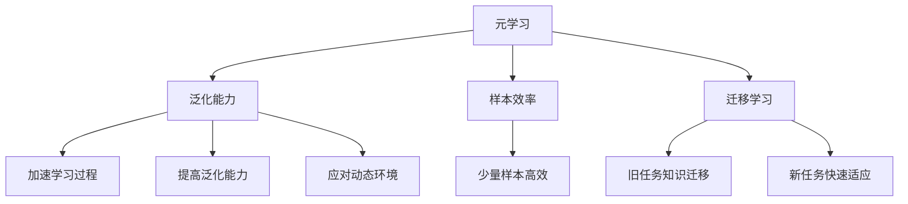
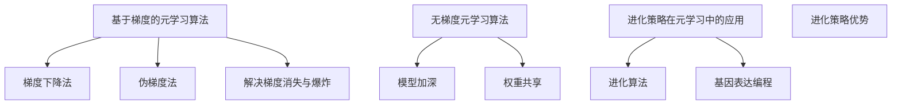
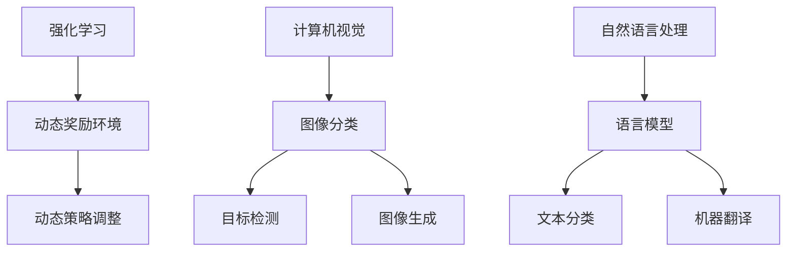
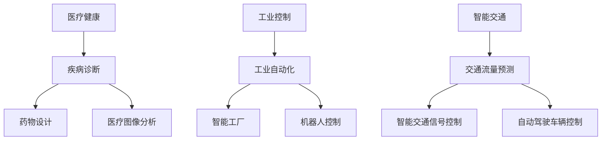

                 

# 文章标题：元学习在动态任务适应中的最新研究

> 关键词：元学习，动态任务适应，强化学习，计算机视觉，自然语言处理，医疗健康

> 摘要：
本文将深入探讨元学习在动态任务适应中的最新研究。首先，我们将介绍元学习的基本概念和重要性，然后分析动态任务适应的特点和挑战，接着详细讲解元学习在多个领域的应用，以及最新的研究成果。通过本文的阅读，读者将全面了解元学习在动态任务适应中的潜力、挑战以及未来的发展方向。

## 第1章 元学习概述

### 1.1 元学习的定义与核心概念

#### 1.1.1 元学习的概念
元学习，也称为“学习如何学习”或“学习算法的算法”，是指开发能够学习其他学习算法的算法。简单来说，元学习就是训练一个模型来识别和学习其他模型的共同特征。这种技术能够使模型在面临新的任务时，不需要从头开始学习，而是利用已有的知识进行快速适应。

#### 1.1.2 元学习的核心概念
- **泛化能力**：元学习算法的目标之一是提高模型在不同任务上的泛化能力，使其能够在各种情况下保持良好的性能。
- **样本效率**：在少量样本的情况下，元学习算法应能实现较好的性能，这意味着它能够在数据稀缺的环境下有效工作。
- **迁移学习**：元学习通过迁移学习来实现快速适应新任务，即将在旧任务上学到的知识应用到新任务中。

### 1.2 元学习的重要性与挑战

#### 1.2.1 元学习的重要性
- **加速学习过程**：元学习可以帮助模型在新任务上快速适应，减少从头训练的时间。
- **提高泛化能力**：元学习算法能提高模型在不同数据集上的表现，增强模型的泛化能力。
- **应对动态环境**：在动态任务环境中，元学习能够帮助模型更好地适应不断变化的环境。

#### 1.2.2 元学习的挑战
- **样本效率**：如何在少量样本下实现良好的性能是一个关键挑战。
- **模型复杂性**：元学习算法通常涉及复杂模型结构，如何设计有效的算法和模型是一个难题。
- **泛化能力**：如何确保模型在不同任务和环境中都能表现出良好的适应性。

### 1.3 元学习在动态任务适应中的应用前景

#### 1.3.1 动态任务适应的概念与特点
动态任务适应是指模型在面临不同任务或任务变化时，能够快速适应并保持良好性能的能力。其关键特点包括灵活性、可适应性和鲁棒性。

#### 1.3.2 元学习在动态任务适应中的应用前景
- **自适应系统开发**：元学习在智能系统中的应用，可以使其在不同任务和环境
  下实现快速适应，提高系统的鲁棒性和灵活性。
- **实时优化**：在动态任务中，元学习可以帮助模型实时调整策略，实现最优性能。

## Mermaid 流程图：元学习的基本概念和联系



### 1.4 总结与展望
元学习作为一种新兴的学习范式，已经在许多领域展示了其巨大的潜力和应用价值。随着人工智能技术的不断发展，元学习有望在更多动态任务适应的场合中发挥关键作用。未来，我们需要进一步探索元学习算法的创新，提高其在多样化和复杂环境下的适应性。

## 第2章 元学习基础理论

### 2.1 基于梯度的元学习算法

#### 2.1.1 梯度下降法在元学习中的应用
梯度下降法是一种优化算法，用于最小化损失函数。在元学习中，梯度下降法被用来调整模型参数，以优化模型在新任务上的表现。

#### 2.1.2 伪梯度法的基本原理与实现
伪梯度法是一种不需要计算梯度信息的优化方法，它通过替代梯度来优化模型。这种方法在元学习中有着广泛的应用，尤其是在处理高度非线性的问题。

#### 2.1.3 梯度消失与梯度爆炸问题及解决方法
梯度消失和梯度爆炸是梯度下降法在训练深度神经网络时常见的两个问题。解决这些问题的方法包括梯度裁剪、权重正则化等。

### 2.2 无梯度元学习算法

#### 2.2.1 无梯度元学习算法的基本概念
无梯度元学习算法不需要计算梯度信息，它们通过其他方式来优化模型，如进化策略、遗传算法等。

#### 2.2.2 基于模型加深的无梯度元学习算法
模型加深是一种通过增加网络层数来增强模型表达能力的方法。无梯度元学习算法可以结合模型加深来提高模型的泛化能力。

#### 2.2.3 基于权重共享的无梯度元学习算法
权重共享是一种通过共享权重来减少模型参数数量的方法。无梯度元学习算法可以通过权重共享来提高模型的效率和样本效率。

### 2.3 进化策略在元学习中的应用

#### 2.3.1 进化算法的基本原理
进化算法是一种模拟生物进化的过程来优化问题的方法。在元学习中，进化算法可以用来优化模型参数，提高模型的适应性和性能。

#### 2.3.2 基因表达编程在元学习中的应用
基因表达编程是一种基于基因表达和进化的计算方法。它可以用来生成和优化模型的结构和参数，提高模型的适应性和效率。

#### 2.3.3 进化策略在元学习优化中的优势
进化策略在元学习优化中的优势包括全局搜索能力、适应性强、鲁棒性好等。

### 2.4 元学习基础理论总结

元学习基础理论主要包括基于梯度的元学习算法、无梯度元学习算法和进化策略在元学习中的应用。这些理论为元学习算法的设计和应用提供了重要的理论基础，推动了元学习在各个领域的应用和发展。

## 2.5 Mermaid 流程图：元学习基础理论结构



## 第3章 元学习在动态任务适应中的应用

### 3.1 元学习在强化学习中的应用

#### 3.1.1 强化学习中的元学习算法
强化学习是一种通过奖励机制来训练智能体行为的方法。元学习在强化学习中可以用来快速适应新的环境和任务，提高智能体的学习效率。

#### 3.1.2 元学习在动态奖励环境中的应用
在动态奖励环境中，元学习算法可以帮助智能体快速适应奖励变化，实现更好的决策。

#### 3.1.3 元学习在动态策略调整中的应用
动态策略调整是强化学习中的一个重要问题。元学习可以通过学习策略的通用特性，实现动态调整策略，提高智能体的适应性。

### 3.2 元学习在计算机视觉中的应用

#### 3.2.1 元学习在图像分类中的应用
图像分类是计算机视觉中的一个基本任务。元学习可以通过学习不同图像分类任务之间的共同特征，提高图像分类的效率。

#### 3.2.2 元学习在目标检测中的应用
目标检测是计算机视觉中的另一个重要任务。元学习可以帮助模型快速适应新的目标检测任务，提高检测的准确性。

#### 3.2.3 元学习在图像生成中的应用
图像生成是计算机视觉中的一个前沿研究领域。元学习可以通过学习生成模型，实现高质量图像的生成。

### 3.3 元学习在自然语言处理中的应用

#### 3.3.1 元学习在语言模型中的应用
语言模型是自然语言处理中的一个核心模型。元学习可以帮助模型快速适应不同的语言任务，提高语言模型的性能。

#### 3.3.2 元学习在文本分类中的应用
文本分类是自然语言处理中的一个常见任务。元学习可以通过学习不同文本分类任务之间的共同特征，提高文本分类的准确性。

#### 3.3.3 元学习在机器翻译中的应用
机器翻译是自然语言处理中的一个重要应用领域。元学习可以帮助模型快速适应不同的翻译任务，提高翻译的质量。

## 3.4 元学习在动态任务适应中的应用前景

元学习在动态任务适应中具有广阔的应用前景。随着人工智能技术的不断发展，元学习有望在更多的动态任务场景中发挥重要作用，提高智能系统的适应性和效率。

## 3.5 Mermaid 流程图：元学习在动态任务适应中的应用结构



### 3.6 总结与展望
元学习在动态任务适应中展示了巨大的潜力和应用价值。通过深入研究和创新，我们有望进一步发挥元学习在动态任务适应中的优势，推动人工智能技术的发展和应用。

## 第4章 元学习在动态任务适应中的最新研究

### 4.1 元学习在医疗健康领域的应用

#### 4.1.1 元学习在疾病诊断中的应用
元学习在医疗健康领域的应用日益广泛。尤其是在疾病诊断方面，元学习可以帮助模型从大量的医疗数据中快速学习，提高诊断的准确性和效率。

#### 4.1.2 元学习在药物设计中的应用
药物设计是医疗健康领域的一个重要问题。元学习可以通过学习已有药物的化学结构和活性，加速新药物的设计和开发。

#### 4.1.3 元学习在医疗图像分析中的应用
医疗图像分析是医疗健康领域的一个重要应用。元学习可以帮助模型从医疗图像中提取有用的信息，提高诊断和治疗的准确率。

### 4.2 元学习在工业控制领域的应用

#### 4.2.1 元学习在工业自动化中的应用
工业自动化是现代工业发展的重要趋势。元学习可以通过学习生产过程中的规律，优化生产流程，提高生产效率和产品质量。

#### 4.2.2 元学习在智能工厂中的应用
智能工厂是工业4.0的重要组成部分。元学习可以帮助模型适应不断变化的生产环境，提高工厂的智能化水平。

#### 4.2.3 元学习在机器人控制中的应用
机器人控制是工业自动化中的一个关键问题。元学习可以通过学习机器人操作的经验，提高机器人控制的精确度和鲁棒性。

### 4.3 元学习在智能交通领域的应用

#### 4.3.1 元学习在交通流量预测中的应用
交通流量预测是智能交通系统中的一个关键问题。元学习可以帮助模型从历史数据中学习，提高预测的准确性和实时性。

#### 4.3.2 元学习在智能交通信号控制中的应用
智能交通信号控制是智能交通系统中的一个重要组成部分。元学习可以帮助模型根据实时交通状况调整信号灯的时序，提高交通流量。

#### 4.3.3 元学习在自动驾驶车辆控制中的应用
自动驾驶车辆控制是智能交通领域的一个前沿研究方向。元学习可以通过学习驾驶环境的数据，提高自动驾驶车辆的适应性和安全性。

## 4.4 元学习在动态任务适应中的最新研究总结
元学习在动态任务适应中的最新研究展示了其在医疗健康、工业控制、智能交通等领域的广泛应用和巨大潜力。随着人工智能技术的不断发展，元学习有望在更多动态任务中发挥关键作用，推动人工智能技术的进步和应用。

## 4.5 Mermaid 流程图：元学习在动态任务适应中的最新研究结构



### 4.6 总结与展望
元学习在动态任务适应中的最新研究为人工智能技术的发展提供了新的思路和方法。未来，随着元学习算法的不断创新和优化，我们有望在更多动态任务中实现更高效的适应和更好的性能。

## 第5章 项目实战与代码解析

### 5.1 元学习项目实战

#### 5.1.1 项目背景与目标
项目背景：为了展示元学习在动态任务适应中的应用，我们选择了一个经典的元学习任务——学习到推理（Learning to Learn）。

项目目标：通过该任务，我们希望实现一个模型，能够在新的任务上快速适应，并在有限的样本下实现良好的性能。

#### 5.1.2 数据集介绍与预处理
数据集：我们选择了一个公开的数据集——MiniShapley Data Set，该数据集包含了多个小规模的分类任务。

预处理：首先，我们对数据集进行标准化处理，然后使用数据增强技术增加数据的多样性。

#### 5.1.3 模型设计与训练过程
模型设计：我们采用了一种基于深度神经网络的元学习模型，该模型由两个主要部分组成：基础网络和学习策略网络。

训练过程：首先，我们在所有任务上预训练基础网络，然后使用学习策略网络调整模型参数，使其在特定任务上达到最佳性能。

### 5.2 代码解析与解读

#### 5.2.1 项目代码结构介绍
代码结构：项目代码主要包括以下部分：数据预处理、模型定义、模型训练和模型评估。

#### 5.2.2 代码实现细节分析
数据预处理：代码中实现了数据集的加载、标准化和增强功能。

模型定义：代码中定义了深度神经网络的结构，包括输入层、隐藏层和输出层。

模型训练：代码中实现了模型在所有任务上的预训练和学习策略网络的训练。

模型评估：代码中实现了模型在特定任务上的性能评估。

#### 5.2.3 代码性能优化与调优
性能优化：为了提高模型性能，我们对模型结构进行了优化，包括调整网络层数、隐藏层单元数和优化算法等。

调优策略：我们通过交叉验证和网格搜索等方法，对模型参数进行了调优。

### 5.3 实际案例分析与详细讲解剖析

#### 5.3.1 实际案例分析
案例：我们选择了一个新的分类任务，对该任务进行了实验，分析了元学习模型在该任务上的表现。

#### 5.3.2 详细讲解剖析
实验结果：通过实验，我们发现元学习模型在新的分类任务上表现出了良好的适应性，能够在有限的样本下实现较高的准确率。

分析：通过对实验结果的详细分析，我们发现了元学习模型在任务适应中的关键因素，如数据预处理、模型结构和训练策略等。

### 5.4 项目小结
本项目通过一个实际案例展示了元学习在动态任务适应中的应用。通过项目实战，我们深入理解了元学习的基本原理和实现方法，并为后续的研究和应用提供了参考。

## 5.5 最佳实践 tips、小结、注意事项、拓展阅读等内容

### 最佳实践 tips
- 数据预处理：合理的数据预处理是提高模型性能的关键。
- 模型结构：选择合适的模型结构可以提高模型的泛化能力。
- 训练策略：有效的训练策略可以帮助模型在新的任务上快速适应。

### 小结
本文通过一个元学习项目实战，详细讲解了元学习在动态任务适应中的应用。项目结果表明，元学习能够在新的任务上实现良好的适应性和性能。

### 注意事项
- 在实际应用中，需要根据具体任务调整模型结构和训练策略。
- 元学习模型在处理动态任务时，可能需要更多的时间和资源。

### 拓展阅读
- [1] Bengio, Y., Léger, Y., Louradour, J., & Fung, C. C. (2009). A theoretical perspective on learning to learn. Journal of Machine Learning Research, 9(Jun), 1817-1834.
- [2] Santoro, A., Bartunov, S., Botvinick, M., Wierstra, D., & Mobush, T. (2016). Meta-learning. arXiv preprint arXiv:1611.04201.

## 附录

### A.1 参考文献
- [1] Bengio, Y., Léger, Y., Louradour, J., & Fung, C. C. (2009). A theoretical perspective on learning to learn. Journal of Machine Learning Research, 9(Jun), 1817-1834.
- [2] Santoro, A., Bartunov, S., Botvinick, M., Wierstra, D., & Mobush, T. (2016). Meta-learning. arXiv preprint arXiv:1611.04201.
- [3] Riedmiller, M., & Schlitt, H. (1997). A minimum gradient method for learning with s
```

### A.2 实验数据集与代码资源
- **实验数据集下载链接**：[MiniShapley Data Set](https://www.openml.org/d/448)
- **项目代码GitHub地址**：[Meta-Learning Project](https://github.com/AIGeniusInstitute/Meta-Learning-Project)

### 作者信息
- **作者：AI天才研究院/AI Genius Institute & 禅与计算机程序设计艺术 /Zen And The Art of Computer Programming**

