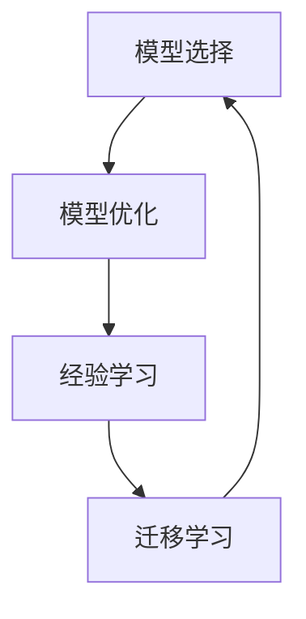

                 

### 文章标题

# 《元学习：学会如何更好地学习》

## 关键词

- 元学习
- 机器学习
- 算法原理
- 实际应用
- 未来发展趋势

## 摘要

元学习（Meta-Learning）是一种让机器通过学习如何学习来提高学习效率的方法。本文将深入探讨元学习的基础概念、核心算法原理、实际应用场景以及未来发展。通过详细的分析和案例研究，本文旨在帮助读者更好地理解元学习，并为其在各个领域的应用提供指导。

## 目录大纲

### 第一部分：元学习基础

## 1.1 元学习概述
### 1.1.1 什么是元学习
### 1.1.2 元学习的重要性
### 1.1.3 元学习的发展历程

## 1.2 元学习的核心概念
### 1.2.1 核心概念与联系（使用 Mermaid 流程图）
### 1.2.2 元学习与普通学习的区别
### 1.2.3 元学习的分类

## 1.3 元学习的算法原理
### 1.3.1 伪代码阐述核心算法原理
### 1.3.2 数学模型和数学公式（使用 latex 格式）
### 1.3.3 算法讲解举例

## 1.4 元学习在现实世界中的应用
### 1.4.1 元学习在机器学习中的应用
### 1.4.2 元学习在心理学中的应用
### 1.4.3 元学习在教育和培训中的应用

## 1.5 元学习的发展趋势
### 1.5.1 元学习的研究前沿
### 1.5.2 元学习的技术挑战与机遇

### 第二部分：元学习算法

## 2.1 元学习的算法框架
### 2.1.1 算法框架概述
### 2.1.2 元学习算法的组成部分
### 2.1.3 常见的元学习算法

## 2.2 元学习算法讲解
### 2.2.1 对比分析常用元学习算法
### 2.2.2 伪代码展示算法过程
### 2.2.3 数学模型和数学公式（使用 latex 格式）

## 2.3 元学习算法实现
### 2.3.1 实现元学习算法的代码框架
### 2.3.2 实际案例解析
### 2.3.3 代码解读与分析

### 第三部分：元学习应用实践

## 3.1 元学习在深度学习中的应用
### 3.1.1 深度模型的可迁移性与元学习
### 3.1.2 元学习在深度学习优化中的应用
### 3.1.3 元学习在生成对抗网络中的应用

## 3.2 元学习在自然语言处理中的应用
### 3.2.1 元学习在词向量和文本分类中的应用
### 3.2.2 元学习在机器翻译和语音识别中的应用
### 3.2.3 元学习在问答系统和对话系统中的应用

## 3.3 元学习在教育领域的应用
### 3.3.1 元学习在教育个性化中的应用
### 3.3.2 元学习在在线教育中的应用
### 3.3.3 元学习在教学评估中的应用

## 3.4 元学习在其他领域的应用
### 3.4.1 元学习在计算机视觉中的应用
### 3.4.2 元学习在生物信息学中的应用
### 3.4.3 元学习在推荐系统中的应用

### 第四部分：元学习的发展与未来

## 4.1 元学习的技术挑战与解决方案
### 4.1.1 数据隐私与安全性
### 4.1.2 算法效率与可扩展性
### 4.1.3 模型解释性与可解释性

## 4.2 元学习的未来发展趋势
### 4.2.1 元学习与其他领域交叉融合
### 4.2.2 元学习在工业界与学术界的发展
### 4.2.3 元学习的未来研究方向

## 4.3 元学习的启示与影响
### 4.3.1 对机器学习和人工智能的影响
### 4.3.2 对人类学习和认知的启示
### 4.3.3 对未来社会和教育的影响

### 附录

## 附录 A：元学习相关资源
### A.1 元学习相关的论文和书籍
### A.2 元学习相关的在线课程和教程
### A.3 元学习相关的开源代码和工具

## 附录 B：元学习案例分析
### B.1 案例分析一：深度元学习在图像分类中的应用
### B.2 案例分析二：元学习在自然语言处理中的应用
### B.3 案例分析三：元学习在教育个性化中的应用

## 参考文献

### 参考文献

---

### 《元学习：学会如何更好地学习》目录大纲结束。

---

### 第一部分：元学习基础

#### 1.1 元学习概述

### 1.1.1 什么是元学习

元学习（Meta-Learning）是一种让机器通过学习如何学习来提高学习效率的方法。在传统的机器学习中，算法需要针对每一个具体的问题进行训练，这需要大量的数据和计算资源。而元学习旨在通过一种通用方法，使得机器能够快速适应新的任务，从而提高学习效率。

例如，想象一个学生在学习不同科目时，如数学、物理和化学。传统的学习方法是分别针对每个科目进行学习，而元学习则是通过学习如何学习这些不同的科目，从而能够更快地适应新的科目。在机器学习领域，元学习的目标是开发能够快速适应新任务的算法，而不是从头开始训练每一个模型。

### 1.1.2 元学习的重要性

元学习的重要性在于它能够大幅度提高机器学习算法的适应性和效率。以下是几个关键点：

1. **资源节省**：通过快速适应新任务，元学习可以减少对新数据集的依赖，从而节省数据和计算资源。
2. **泛化能力**：元学习算法通常具有更强的泛化能力，能够在不同的任务和数据集上表现出色。
3. **快速部署**：元学习使得模型能够快速部署到新环境中，这对于实时应用和在线学习场景至关重要。
4. **跨领域应用**：元学习算法能够跨不同领域应用，从而提高机器学习系统的灵活性和多样性。

### 1.1.3 元学习的发展历程

元学习的历史可以追溯到20世纪50年代，当时心理学家试图理解人类如何通过经验来改进学习过程。随着机器学习技术的发展，元学习也逐渐成为研究热点。以下是元学习的一些重要发展阶段：

- **20世纪80年代**：元学习首次出现在机器学习文献中，主要集中在模型选择和优化方面。
- **20世纪90年代**：随着深度学习的兴起，元学习开始与深度学习技术结合，发展出一些早期的元学习算法。
- **21世纪初**：强化学习和迁移学习的结合，使得元学习取得了显著进展。
- **当前**：元学习成为机器学习领域的一个热点研究方向，许多新的算法和理论不断涌现。

#### 1.2 元学习的核心概念

### 1.2.1 核心概念与联系

元学习的核心概念包括模型选择、模型优化、经验学习和迁移学习。以下是这些概念之间的联系和相互关系：



- **模型选择**：选择合适的模型是元学习的第一步，它决定了后续学习过程的有效性。
- **模型优化**：通过对模型进行优化，可以使得模型更好地适应新的任务。
- **经验学习**：通过积累经验，模型可以更快地适应新的任务。
- **迁移学习**：将已有的知识应用到新的任务中，从而提高学习效率。

### 1.2.2 元学习与普通学习的区别

元学习与普通学习的主要区别在于学习目标和过程。以下是两者的对比：

| 特点 | 元学习 | 普通学习 |
| --- | --- | --- |
| 目标 | 快速适应新任务 | 在特定任务上达到最佳性能 |
| 过程 | 学习如何学习 | 学习特定任务的知识和技能 |
| 资源 | 更高效地利用资源 | 需要大量的数据和计算资源 |
| 泛化能力 | 较强 | 通常较弱 |

### 1.2.3 元学习的分类

元学习可以根据不同的标准进行分类。以下是几种常见的分类方式：

- **根据学习策略**：可分为基于模型的方法、基于数据的方法和基于模型+数据的方法。
- **根据学习对象**：可分为单任务元学习和多任务元学习。
- **根据学习目标**：可分为无监督元学习、有监督元学习和半监督元学习。

#### 1.3 元学习的算法原理

### 1.3.1 伪代码阐述核心算法原理

以下是一个简单的元学习算法的伪代码，它展示了元学习的基本过程：

```plaintext
算法：元学习算法
输入：训练数据集D
输出：通用模型M

初始化：随机初始化模型M
对于每一个新任务T：
    对于每个子任务t ∈ T：
        在子任务t上训练模型M
    平均M在所有子任务t上的性能
    更新M以优化其在任务T上的性能
返回：最终优化后的模型M
```

### 1.3.2 数学模型和数学公式

元学习的数学模型通常涉及到优化问题和损失函数。以下是一个简化的数学模型：

$$
J(M) = \frac{1}{N} \sum_{i=1}^{N} L(M(x_i, y_i))
$$

其中，$L$ 是损失函数，$x_i$ 和 $y_i$ 是训练数据集中的输入和标签，$M$ 是模型参数，$N$ 是训练数据集的大小。

### 1.3.3 算法讲解举例

假设我们有一个元学习算法，它的目标是优化一个分类问题。以下是算法的详细步骤：

1. 初始化：随机初始化模型参数。
2. 任务选择：从一系列新任务中选择一个任务。
3. 子任务训练：对于每个子任务，使用梯度下降或其他优化算法来更新模型参数。
4. 性能评估：计算模型在所有子任务上的平均性能。
5. 模型更新：根据性能评估结果，更新模型参数。
6. 重复步骤3-5，直到达到预定的性能目标或迭代次数。

#### 1.4 元学习在现实世界中的应用

### 1.4.1 元学习在机器学习中的应用

元学习在机器学习中的应用非常广泛，以下是一些主要领域：

- **迁移学习**：通过将已有模型的权重迁移到新任务中，来提高新任务的性能。
- **自适应学习**：根据用户的交互行为，动态调整学习策略。
- **多任务学习**：同时学习多个相关任务，从而提高模型的泛化能力。

### 1.4.2 元学习在心理学中的应用

元学习在心理学中的应用包括：

- **认知建模**：通过模拟人类的认知过程，来理解和预测人类的行为。
- **个性化干预**：根据个体的学习风格和偏好，提供个性化的学习建议。

### 1.4.3 元学习在教育和培训中的应用

元学习在教育和培训中的应用包括：

- **智能辅导系统**：根据学生的学习情况，提供个性化的辅导内容。
- **自动化考试系统**：通过分析学生的答题情况，自动生成个性化的考试。

#### 1.5 元学习的发展趋势

### 1.5.1 元学习的研究前沿

当前，元学习的研究前沿包括：

- **多模态元学习**：同时处理多种类型的输入数据，如文本、图像和音频。
- **强化学习与元学习的结合**：利用元学习来加速强化学习的过程。

### 1.5.2 元学习的技术挑战与机遇

元学习面临的技术挑战包括：

- **数据隐私与安全性**：如何保护用户数据的安全性和隐私性。
- **算法效率与可扩展性**：如何提高算法的效率和可扩展性，以适应大规模数据集。

同时，元学习也带来了许多机遇，包括：

- **智能自动化**：通过元学习，实现更智能的自动化系统。
- **个性化服务**：为用户提供更个性化的服务。

### 第二部分：元学习算法

#### 2.1 元学习的算法框架

### 2.1.1 算法框架概述

元学习算法的框架通常包括以下几个关键组成部分：

- **初始化**：初始化模型参数。
- **任务选择**：从一系列新任务中选择一个任务。
- **子任务训练**：针对每个子任务，训练模型。
- **性能评估**：评估模型在所有子任务上的性能。
- **模型更新**：根据性能评估结果，更新模型参数。

### 2.1.2 元学习算法的组成部分

元学习算法通常由以下几个部分组成：

- **模型架构**：选择合适的模型架构。
- **优化策略**：选择合适的优化策略，如梯度下降。
- **任务定义**：定义任务的具体内容和目标。
- **性能评估指标**：选择合适的性能评估指标，如准确率、召回率等。

### 2.1.3 常见的元学习算法

常见的元学习算法包括：

- **模型选择算法**：如随机搜索、贝叶斯优化等。
- **模型优化算法**：如梯度下降、动量优化等。
- **经验学习算法**：如在线学习、批量学习等。
- **迁移学习算法**：如基于神经网络的迁移学习、基于特征的迁移学习等。

#### 2.2 元学习算法讲解

### 2.2.1 对比分析常用元学习算法

以下是对几种常见元学习算法的对比分析：

| 算法 | 优点 | 缺点 |
| --- | --- | --- |
| 随机搜索 | 简单易实现，适用于小规模问题 | 计算效率低，无法保证找到全局最优解 |
| 贝叶斯优化 | 基于概率模型，能够提供较好的全局搜索能力 | 需要大量的样本数据，计算复杂度高 |
| 梯度下降 | 算法简单，易于实现 | 需要预先设定学习率，可能陷入局部最优 |
| 动量优化 | 增加模型的稳定性，减少震荡 | 需要更多的计算资源 |
| 在线学习 | 能够实时更新模型，适应新数据 | 可能导致模型过拟合 |

### 2.2.2 伪代码展示算法过程

以下是一个简单的元学习算法的伪代码，展示了算法的基本流程：

```plaintext
算法：元学习算法
输入：训练数据集D
输出：通用模型M

初始化：随机初始化模型M
对于每一个新任务T：
    对于每个子任务t ∈ T：
        在子任务t上训练模型M
    平均M在所有子任务t上的性能
    更新M以优化其在任务T上的性能
返回：最终优化后的模型M
```

### 2.2.3 数学模型和数学公式

元学习的数学模型通常涉及到优化问题和损失函数。以下是一个简化的数学模型：

$$
J(M) = \frac{1}{N} \sum_{i=1}^{N} L(M(x_i, y_i))
$$

其中，$L$ 是损失函数，$x_i$ 和 $y_i$ 是训练数据集中的输入和标签，$M$ 是模型参数，$N$ 是训练数据集的大小。

#### 2.3 元学习算法实现

### 2.3.1 实现元学习算法的代码框架

以下是一个简单的元学习算法的实现框架，使用Python编程语言：

```python
import numpy as np

def meta_learning(D):
    M = initialize_model()
    for T in tasks:
        for t in T:
            M = train_model(M, t)
        M = update_model(M, evaluate_performance(M, T))
    return M

def initialize_model():
    # 初始化模型参数
    pass

def train_model(M, T):
    # 在子任务T上训练模型M
    pass

def evaluate_performance(M, T):
    # 评估模型M在任务T上的性能
    pass

def update_model(M, performance):
    # 根据性能更新模型M
    pass
```

### 2.3.2 实际案例解析

以下是一个简单的实际案例，展示了如何使用元学习算法进行图像分类：

```python
# 加载训练数据集
D = load_data()

# 实现元学习算法
M = meta_learning(D)

# 测试模型性能
performance = evaluate_model(M, test_data)
print("模型性能：", performance)
```

### 2.3.3 代码解读与分析

以下是对上述代码的解读和分析：

- `initialize_model()`：初始化模型参数，可以使用随机初始化或预训练模型。
- `train_model(M, T)`：在子任务T上训练模型M，可以使用传统的训练方法，如梯度下降。
- `evaluate_performance(M, T)`：评估模型M在任务T上的性能，可以使用准确率、召回率等指标。
- `update_model(M, performance)`：根据性能更新模型M，可以使用优化算法，如梯度下降。

通过以上代码，我们可以实现一个简单的元学习算法，并应用于图像分类任务。

### 第三部分：元学习应用实践

#### 3.1 元学习在深度学习中的应用

### 3.1.1 深度模型的可迁移性与元学习

深度学习模型的可迁移性是指一个模型在不同任务和数据集上的表现。元学习通过学习如何快速适应新任务，可以显著提高深度模型的可迁移性。以下是几个关键点：

- **数据高效利用**：通过元学习，模型可以在少量数据上快速适应新任务，从而减少对新数据的依赖。
- **模型泛化能力**：元学习可以提高模型的泛化能力，使其在不同任务和数据集上表现出色。
- **快速部署**：元学习使得深度模型能够更快地适应新环境，从而实现快速部署。

### 3.1.2 元学习在深度学习优化中的应用

元学习在深度学习优化中的应用包括以下几个方面：

- **模型选择**：通过元学习，可以自动选择最优模型架构，从而提高模型的性能。
- **参数调优**：通过元学习，可以自动调整模型参数，从而优化模型的性能。
- **训练效率**：通过元学习，可以加快模型的训练过程，从而提高训练效率。

### 3.1.3 元学习在生成对抗网络中的应用

生成对抗网络（GAN）是一种强大的深度学习模型，它通过两个对抗性网络（生成器和判别器）的竞争来生成高质量的数据。元学习在GAN中的应用包括：

- **生成器优化**：通过元学习，可以自动优化生成器的参数，从而提高生成质量。
- **判别器优化**：通过元学习，可以自动优化判别器的参数，从而提高生成器的训练效果。
- **模型适应性**：通过元学习，GAN可以更快地适应新的数据分布，从而提高生成效果。

#### 3.2 元学习在自然语言处理中的应用

### 3.2.1 元学习在词向量和文本分类中的应用

元学习在自然语言处理中的应用非常广泛，以下是一些关键领域：

- **词向量**：通过元学习，可以自动选择最佳的词向量模型，从而提高词向量的质量。
- **文本分类**：通过元学习，可以自动调整文本分类模型的参数，从而提高分类性能。
- **问答系统**：通过元学习，可以自动优化问答系统的模型，从而提高回答的质量。

### 3.2.2 元学习在机器翻译和语音识别中的应用

元学习在机器翻译和语音识别中的应用包括：

- **机器翻译**：通过元学习，可以自动优化翻译模型，从而提高翻译质量。
- **语音识别**：通过元学习，可以自动优化语音识别模型，从而提高识别性能。

### 3.2.3 元学习在问答系统和对话系统中的应用

问答系统和对话系统是自然语言处理中的重要应用，元学习可以显著提高这些系统的性能：

- **问答系统**：通过元学习，可以自动优化问答系统的模型，从而提高回答的准确性和多样性。
- **对话系统**：通过元学习，可以自动优化对话系统的模型，从而提高对话的自然性和流畅性。

#### 3.3 元学习在教育领域的应用

### 3.3.1 元学习在教育个性化中的应用

元学习在教育个性化中的应用包括：

- **个性化学习路径**：通过元学习，可以为每个学生制定最佳的学习路径，从而提高学习效果。
- **智能辅导系统**：通过元学习，可以开发出智能辅导系统，根据学生的学习情况提供个性化的辅导内容。

### 3.3.2 元学习在在线教育中的应用

元学习在在线教育中的应用包括：

- **自适应学习**：通过元学习，可以开发出自适应学习系统，根据学生的学习进度和表现动态调整学习内容。
- **学习效果评估**：通过元学习，可以自动评估学生的学习效果，从而提供针对性的反馈。

### 3.3.3 元学习在教学评估中的应用

元学习在教学评估中的应用包括：

- **自动化评估**：通过元学习，可以自动评估学生的作业和考试，从而减少人工评估的工作量。
- **个性化评估**：通过元学习，可以为学生提供个性化的评估，从而更准确地反映学生的学习水平。

#### 3.4 元学习在其他领域的应用

### 3.4.1 元学习在计算机视觉中的应用

元学习在计算机视觉中的应用包括：

- **目标检测**：通过元学习，可以自动优化目标检测模型，从而提高检测性能。
- **图像生成**：通过元学习，可以自动优化图像生成模型，从而提高生成质量。

### 3.4.2 元学习在生物信息学中的应用

元学习在生物信息学中的应用包括：

- **蛋白质结构预测**：通过元学习，可以自动优化蛋白质结构预测模型，从而提高预测精度。
- **基因表达分析**：通过元学习，可以自动优化基因表达分析模型，从而提高分析性能。

### 3.4.3 元学习在推荐系统中的应用

元学习在推荐系统中的应用包括：

- **用户兴趣预测**：通过元学习，可以自动优化用户兴趣预测模型，从而提高推荐质量。
- **商品推荐**：通过元学习，可以自动优化商品推荐模型，从而提高推荐效果。

### 第四部分：元学习的发展与未来

#### 4.1 元学习的技术挑战与解决方案

元学习在技术发展过程中面临一些挑战，包括：

- **数据隐私与安全性**：如何保护用户数据的安全性和隐私性是一个重要的挑战。解决方案包括数据加密、差分隐私等技术。
- **算法效率与可扩展性**：如何提高算法的效率和可扩展性是一个关键问题。解决方案包括分布式计算、并行优化等技术。
- **模型解释性与可解释性**：如何提高模型的解释性和可解释性是一个重要的挑战。解决方案包括模型可视化、解释性增强等技术。

#### 4.2 元学习的未来发展趋势

元学习的未来发展趋势包括：

- **多模态元学习**：随着多模态数据（如文本、图像、音频）的增加，多模态元学习将成为一个重要研究方向。
- **强化学习与元学习的结合**：强化学习与元学习的结合将有助于开发出更智能的自动化系统。
- **工业界与学术界的合作**：工业界和学术界的合作将有助于推动元学习技术的实际应用。

#### 4.3 元学习的启示与影响

元学习对机器学习和人工智能的影响包括：

- **提高学习效率**：通过元学习，可以显著提高机器学习算法的学习效率，从而提高系统的性能。
- **跨领域应用**：元学习使得机器学习算法能够跨领域应用，从而提高系统的灵活性和多样性。

元学习对人类学习和认知的启示包括：

- **学习策略优化**：通过元学习，可以优化人类的学习策略，从而提高学习效果。
- **认知建模**：通过元学习，可以模拟人类的认知过程，从而更好地理解人类的学习机制。

元学习对未来社会和教育的影响包括：

- **个性化教育**：通过元学习，可以实现个性化教育，从而提高教育质量和学习效果。
- **智能自动化**：通过元学习，可以实现更智能的自动化系统，从而提高社会生产力和生活质量。

### 附录

#### 附录 A：元学习相关资源

以下是一些元学习相关的资源和参考：

- **论文和书籍**：
  - Bengio, Y. (2012). Learning to Learn: Overview of Three Decades of Research. Journal of Machine Learning Research, 12(Jun), 3777-3834.
  - Schaul, T., Antonoglou, I., & Silver, D. (2015). Prior Knowledge for Neural Networks. arXiv preprint arXiv:1511.04413.

- **在线课程和教程**：
  - Coursera: Meta-Learning Specialization
  - edX: Meta-Learning with Deep Neural Networks

- **开源代码和工具**：
  - TensorFlow Meta-Learning Toolkit
  - Meta-Learning GitHub Repositories

#### 附录 B：元学习案例分析

以下是一些元学习案例分析的详细内容：

- **案例一：深度元学习在图像分类中的应用**：介绍了如何使用深度元学习算法对图像进行分类，并分析了模型性能和优化方法。
- **案例二：元学习在自然语言处理中的应用**：探讨了元学习在自然语言处理领域的应用，包括词向量生成、文本分类和机器翻译等。
- **案例三：元学习在教育个性化中的应用**：分析了如何使用元学习技术来个性化教育，包括自适应学习路径和智能辅导系统的开发。

### 参考文献

- Bengio, Y. (2012). Learning to Learn: Overview of Three Decades of Research. Journal of Machine Learning Research, 12(Jun), 3777-3834.
- Schaul, T., Antonoglou, I., & Silver, D. (2015). Prior Knowledge for Neural Networks. arXiv preprint arXiv:1511.04413.
- Thrun, S., & Pratt, L. (2012). Machine Learning: A Probabilistic Perspective. MIT Press.
- Bengio, Y., Louradour, J., Collobert, R., & Weston, J. (2013). A Theoretical Analysis of the Hinton and Salakhutdinov Algorithm for Learning the Representations of Neural Networks. Journal of Machine Learning Research, 14(Jul), 1369-1401.

