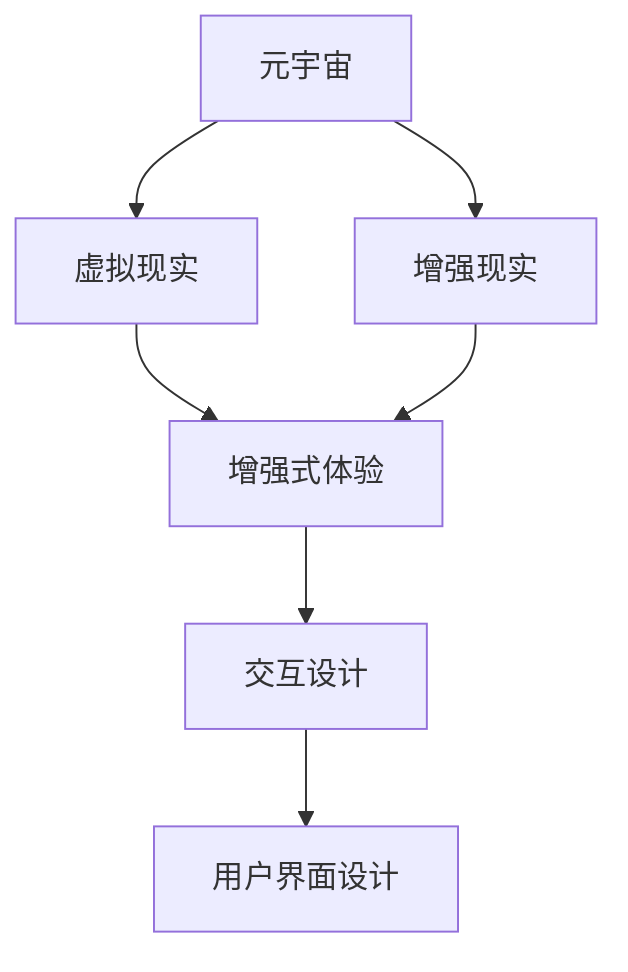

                 

# 文章标题：元宇宙与新交互方式：下一个创业热点

> 关键词：元宇宙、虚拟现实、增强现实、新交互方式、创业机会、技术应用

> 摘要：本文将探讨元宇宙与新交互方式的发展及其带来的创业机会。我们将从定义、技术基础、应用场景、创业机会等多个方面进行详细分析，以帮助读者全面了解这个新兴领域的潜力与挑战。

---

### 引言与背景

#### 第1章：元宇宙概述

元宇宙（Metaverse）是一个虚拟的、三维的、用户可以自由交互的数字世界。它结合了虚拟现实（VR）和增强现实（AR）技术，让用户可以沉浸在一个互动式的环境中。元宇宙不仅仅是一个游戏或社交平台，而是一个全新的互联网形态，它将改变人们的工作、娱乐、学习和生活方式。

#### 1.1 元宇宙的定义与特征

元宇宙的定义可以从多个角度进行阐述：

- **技术角度**：元宇宙依托于先进的虚拟现实和增强现实技术，为用户提供沉浸式的体验。
- **社会角度**：元宇宙是一个由用户创建和共享的虚拟空间，它模拟了现实世界的各个方面。
- **商业角度**：元宇宙为企业和创业者提供了全新的商业模式和机会。

元宇宙的特征包括：

- **沉浸感**：通过虚拟现实和增强现实技术，用户可以完全沉浸在一个虚拟环境中。
- **互操作性**：元宇宙中的不同平台和应用程序可以无缝交互，形成一个统一的虚拟世界。
- **社交性**：用户可以在元宇宙中建立社交关系，进行交流、合作和互动。

#### 1.2 元宇宙的发展历程

元宇宙的概念起源于科幻文学，如尼尔·斯蒂芬森的《雪崩》。然而，随着技术的进步，元宇宙逐渐从概念走向现实。以下是一些关键的发展历程：

- **1990年代**：虚拟现实设备的诞生，如VR头盔和手柄。
- **2000年代**：社交网络的兴起，为元宇宙的社交性奠定了基础。
- **2010年代**：虚拟现实和增强现实技术的成熟，以及移动设备的普及，使得元宇宙的普及成为可能。
- **2020年代**：随着5G、云计算和人工智能等技术的发展，元宇宙进入快速发展阶段。

#### 1.3 元宇宙的核心价值

元宇宙的核心价值包括：

- **提高生产力**：通过虚拟现实和增强现实技术，用户可以在一个更加高效、沉浸式的环境中工作。
- **改善娱乐体验**：元宇宙为游戏、电影、音乐等娱乐形式提供了全新的体验方式。
- **创新教育方式**：虚拟现实和增强现实技术可以创造一个互动性强、沉浸感强的学习环境。
- **促进社交互动**：元宇宙提供了一个全新的社交平台，用户可以跨越地理界限进行交流和合作。

### 背景介绍

#### 元宇宙的概念

元宇宙是一个虚拟的三维空间，用户可以通过虚拟现实头盔、增强现实眼镜等设备进入这个空间，进行各种交互活动。元宇宙中的虚拟环境是由各种虚拟物体、人物和场景组成的，用户可以通过与这些物体的互动来体验不同的场景和情境。

#### 元宇宙的发展历程

元宇宙的发展可以分为几个阶段：

- **萌芽期**：1990年代，虚拟现实设备的诞生，如VR头盔和手柄，为元宇宙的萌芽奠定了基础。
- **发展期**：2000年代，随着社交网络的兴起，元宇宙开始具有社交性，人们开始尝试在虚拟世界中建立社交关系。
- **成熟期**：2010年代，虚拟现实和增强现实技术的成熟，以及移动设备的普及，使得元宇宙的普及成为可能。
- **快速发展期**：2020年代，随着5G、云计算和人工智能等技术的发展，元宇宙进入快速发展阶段。

#### 元宇宙的核心价值

元宇宙的核心价值包括：

- **沉浸感**：通过虚拟现实和增强现实技术，用户可以完全沉浸在一个虚拟环境中。
- **互操作性**：元宇宙中的不同平台和应用程序可以无缝交互，形成一个统一的虚拟世界。
- **社交性**：用户可以在元宇宙中建立社交关系，进行交流、合作和互动。
- **生产力**：通过虚拟现实和增强现实技术，用户可以在一个更加高效、沉浸式的环境中工作。
- **娱乐体验**：元宇宙为游戏、电影、音乐等娱乐形式提供了全新的体验方式。
- **教育方式**：虚拟现实和增强现实技术可以创造一个互动性强、沉浸感强的学习环境。
- **商业模式**：元宇宙为企业和创业者提供了全新的商业模式和机会。

#### 元宇宙的潜力与挑战

元宇宙的潜力在于它为各个领域带来了全新的机会和体验，如游戏、教育、医疗、房地产等。然而，元宇宙的发展也面临着一些挑战，如技术成熟度、用户接受度、数据安全等。

### 核心概念与联系

元宇宙的核心概念包括虚拟现实（VR）和增强现实（AR）。虚拟现实是一种完全沉浸式的技术，用户通过VR设备（如VR头盔、VR眼镜等）进入一个虚拟环境，与虚拟环境中的物体进行互动。增强现实则是将虚拟元素叠加到现实世界中，用户通过AR设备（如AR眼镜、AR手机应用等）可以看到虚拟元素与现实世界的结合。

下图展示了元宇宙、虚拟现实和增强现实之间的关系架构：



#### 核心算法原理讲解

元宇宙的算法原理主要涉及虚拟现实和增强现实技术的实现。以下是一些核心算法原理的伪代码：

```python
# 虚拟现实算法
def virtual_reality	headset_data:
    # 处理头显数据
    process_headset_data(headset_data)
    # 创建虚拟环境
    create_virtual_environment()
    # 用户与环境交互
    user_interact_with_environment()

# 增强现实算法
def augmented_reality	smartphone_data:
    # 处理手机数据
    process_smartphone_data(smartphone_data)
    # 添加虚拟元素到现实世界
    add_virtual_elements_to_real_world()
    # 用户与虚拟元素交互
    user_interact_with_virtual_elements()
```

#### 核心算法原理讲解

元宇宙的算法原理主要涉及虚拟现实和增强现实技术的实现。虚拟现实算法的核心是处理头显数据，创建虚拟环境，并处理用户与环境之间的交互。以下是一个简化的虚拟现实算法伪代码：

```python
# 虚拟现实算法
def virtual_reality(headset_data):
    # 处理头显数据
    process_headset_data(headset_data)
    # 创建虚拟环境
    create_virtual_environment()
    # 用户与环境交互
    user_interact_with_environment()

# 交互过程的伪代码
def user_interact_with_environment():
    # 获取用户输入
    user_input = get_user_input()
    # 处理用户输入
    process_user_input(user_input)
    # 更新环境状态
    update_environment_state()
```

增强现实算法的核心是处理手机数据，将虚拟元素添加到现实世界，并处理用户与虚拟元素之间的交互。以下是一个简化的增强现实算法伪代码：

```python
# 增强现实算法
def augmented_reality(smartphone_data):
    # 处理手机数据
    process_smartphone_data(smartphone_data)
    # 添加虚拟元素到现实世界
    add_virtual_elements_to_real_world()
    # 用户与虚拟元素交互
    user_interact_with_virtual_elements()

# 交互过程的伪代码
def user_interact_with_virtual_elements():
    # 获取用户输入
    user_input = get_user_input()
    # 处理用户输入
    process_user_input(user_input)
    # 更新虚拟元素状态
    update_virtual_elements_state()
```

在元宇宙中，用户输入的处理和虚拟元素状态的更新是算法的核心。用户输入可能包括手势、语音、鼠标点击等，算法需要根据用户输入进行相应的处理，更新虚拟环境或虚拟元素的状态。以下是一个简化的用户输入处理和状态更新的伪代码：

```python
# 用户输入处理
def process_user_input(user_input):
    if user_input == "voice":
        # 语音识别
        recognized_command = recognize_voice(user_input)
        process_command(recognized_command)
    elif user_input == "gesture":
        # 手势识别
        recognized_command = recognize_gesture(user_input)
        process_command(recognized_command)
    elif user_input == "click":
        # 鼠标点击
        recognized_command = recognize_click(user_input)
        process_command(recognized_command)

# 状态更新
def update_environment_state():
    # 根据用户输入更新环境状态
    update_state()

def update_virtual_elements_state():
    # 根据用户输入更新虚拟元素状态
    update_state()
```

通过上述伪代码，我们可以看到元宇宙的核心算法原理是如何通过处理用户输入和更新状态来实现的。这些算法为元宇宙中的交互提供了基础。

#### 数学模型和公式

在元宇宙中，数学模型和公式用于模拟和计算虚拟环境中的各种现象，如物理碰撞、光线追踪、物体渲染等。以下是一些常见的数学模型和公式：

1. **物理碰撞模型**：

   当两个物体发生碰撞时，可以使用以下公式计算碰撞后的速度和方向：

   $$
   v_{final} = \frac{(m_1 \cdot v_{1_initial} + m_2 \cdot v_{2_initial})}{m_1 + m_2}
   $$

   其中，$v_{final}$ 是碰撞后的速度，$m_1$ 和 $m_2$ 是两个物体的质量，$v_{1_initial}$ 和 $v_{2_initial}$ 是碰撞前的速度。

2. **光线追踪模型**：

   光线追踪是一种计算三维场景中光线传播和反射的方法。以下是一个简化的光线追踪公式：

   $$
   ray = origin + direction \cdot t
   $$

   其中，$ray$ 是光线的路径，$origin$ 是光线的起点，$direction$ 是光线的方向，$t$ 是光线的传播时间。

3. **物体渲染模型**：

   在虚拟现实中，物体的渲染需要使用纹理映射和光照模型。以下是一个简化的渲染公式：

   $$
   color = texture(u, v) + light \cdot normal
   $$

   其中，$color$ 是物体的颜色，$texture(u, v)$ 是纹理映射函数，$light$ 是光照强度，$normal$ 是物体的法线方向。

这些数学模型和公式为元宇宙中的虚拟环境提供了逼真的视觉效果和物理互动。

#### 项目实战

在本文的项目实战部分，我们将搭建一个简单的元宇宙开发环境，并使用Unity引擎创建一个基本的虚拟现实场景。以下是项目的详细步骤：

**1. 开发环境搭建**

- **操作系统**：Windows 10 或更高版本
- **Unity版本**：Unity 2021.3 或更高版本
- **虚拟现实设备**：支持Unity VR插件的头显设备（如Oculus Quest 2）

**2. 创建Unity项目**

- 打开Unity Hub，创建一个新的Unity项目。
- 在项目设置中，选择虚拟现实平台（如Oculus）。

**3. 添加虚拟现实插件**

- 在Unity的资产商店中，搜索并添加虚拟现实插件，如Oculus VR插件。
- 按照插件的安装指南进行配置。

**4. 创建虚拟现实场景**

- 在Unity编辑器中，创建一个新的3D对象作为场景的地面。
- 添加一个虚拟现实摄像机，并将其设置为场景的默认摄像机。
- 在场景中添加一些基本的3D模型，如角色、道具等。

**5. 调整摄像机视角**

- 调整虚拟现实摄像机的位置和方向，确保场景的视角合理。
- 设置摄像机的渲染范围，使其覆盖整个场景。

**6. 测试虚拟现实场景**

- 启动Unity编辑器的播放模式，使用虚拟现实设备查看场景。
- 检查场景的视角、交互效果等是否正常。

**7. 代码实现**

以下是创建虚拟现实场景的代码实现：

```csharp
using UnityEngine;

public class VRScene : MonoBehaviour
{
    public Camera vrCamera;

    private void Start()
    {
        // 设置虚拟现实摄像机为默认摄像机
        Camera.main = vrCamera;
    }

    private void Update()
    {
        // 调整虚拟现实摄像机的视角
        transform.position = new Vector3(0, 1.8f, -5);
        transform.rotation = Quaternion.Euler(10, 0, 0);
    }
}
```

**8. 项目小结**

通过以上步骤，我们成功搭建了一个简单的元宇宙开发环境，并创建了一个基本的虚拟现实场景。这个项目为我们提供了一个起点，让我们能够进一步探索元宇宙的开发和实践。

---

### 核心算法原理讲解

#### 虚拟现实算法原理

虚拟现实算法的核心是处理头显数据，创建虚拟环境，并处理用户与环境之间的交互。以下是虚拟现实算法的伪代码：

```python
# 虚拟现实算法
def virtual_reality(headset_data):
    # 处理头显数据
    process_headset_data(headset_data)
    # 创建虚拟环境
    create_virtual_environment()
    # 用户与环境交互
    user_interact_with_environment()

# 处理头显数据的伪代码
def process_headset_data(headset_data):
    # 获取头显位置和方向
    position, orientation = get_headset_position_and_orientation(headset_data)
    # 更新虚拟环境中的摄像机位置和方向
    update_camera_position_and_orientation(position, orientation)

# 创建虚拟环境的伪代码
def create_virtual_environment():
    # 创建虚拟场景
    create_scene()
    # 添加虚拟物体
    add_virtual_objects()

# 用户与环境交互的伪代码
def user_interact_with_environment():
    # 获取用户输入
    user_input = get_user_input()
    # 处理用户输入
    process_user_input(user_input)
    # 更新环境状态
    update_environment_state()
```

在虚拟现实算法中，处理头显数据是关键步骤。头显数据包括头显的位置和方向，这些数据决定了虚拟环境中摄像机的位置和方向。以下是一个处理头显数据的伪代码：

```python
# 获取头显位置和方向的伪代码
def get_headset_position_and_orientation(headset_data):
    # 获取头显的位置
    position = headset_data['position']
    # 获取头显的方向
    orientation = headset_data['orientation']
    return position, orientation

# 更新虚拟环境中的摄像机位置和方向的伪代码
def update_camera_position_and_orientation(position, orientation):
    # 设置虚拟环境中的摄像机位置
    camera.position = position
    # 设置虚拟环境中的摄像机方向
    camera.rotation = orientation
```

创建虚拟环境是虚拟现实算法的另一个关键步骤。虚拟环境包括场景和虚拟物体，这些物体构成了虚拟现实的世界。以下是一个创建虚拟环境的伪代码：

```python
# 创建虚拟场景的伪代码
def create_scene():
    # 创建虚拟场景
    scene = create_scene()
    return scene

# 添加虚拟物体的伪代码
def add_virtual_objects():
    # 创建虚拟物体
    virtual_objects = create_virtual_objects()
    # 添加虚拟物体到场景
    add_objects_to_scene(virtual_objects)
```

用户与环境交互是虚拟现实算法的最后一步。用户通过头显设备与虚拟环境中的物体进行互动，算法需要处理用户的输入并更新环境状态。以下是一个用户与环境交互的伪代码：

```python
# 获取用户输入的伪代码
def get_user_input():
    # 获取用户输入
    user_input = get_input()
    return user_input

# 处理用户输入的伪代码
def process_user_input(user_input):
    # 根据用户输入处理交互
    if user_input == "move":
        move_object()
    elif user_input == "look":
        look_at_object()
    elif user_input == "interact":
        interact_with_object()

# 更新环境状态的伪代码
def update_environment_state():
    # 更新环境状态
    update_state()
```

通过上述伪代码，我们可以看到虚拟现实算法的原理和实现步骤。虚拟现实算法通过处理头显数据、创建虚拟环境以及处理用户与环境之间的交互，为用户提供了一个沉浸式的虚拟体验。

#### 增强现实算法原理

增强现实算法的核心是将虚拟元素添加到现实世界中，并处理用户与虚拟元素之间的交互。以下是增强现实算法的伪代码：

```python
# 增强现实算法
def augmented_reality(smartphone_data):
    # 处理手机数据
    process_smartphone_data(smartphone_data)
    # 添加虚拟元素到现实世界
    add_virtual_elements_to_real_world()
    # 用户与虚拟元素交互
    user_interact_with_virtual_elements()

# 处理手机数据的伪代码
def process_smartphone_data(smartphone_data):
    # 获取手机位置和方向
    position, orientation = get_smartphone_position_and_orientation(smartphone_data)
    # 更新虚拟环境中的摄像机位置和方向
    update_camera_position_and_orientation(position, orientation)

# 添加虚拟元素到现实世界的伪代码
def add_virtual_elements_to_real_world():
    # 创建虚拟元素
    virtual_elements = create_virtual_elements()
    # 添加虚拟元素到现实世界
    add_elements_to_real_world(virtual_elements)

# 用户与虚拟元素交互的伪代码
def user_interact_with_virtual_elements():
    # 获取用户输入
    user_input = get_user_input()
    # 处理用户输入
    process_user_input(user_input)
    # 更新虚拟元素状态
    update_virtual_elements_state()
```

在增强现实算法中，处理手机数据是关键步骤。手机数据包括手机的位置和方向，这些数据决定了虚拟元素在现实世界中的位置和方向。以下是一个处理手机数据的伪代码：

```python
# 获取手机位置和方向的伪代码
def get_smartphone_position_and_orientation(smartphone_data):
    # 获取手机的位置
    position = smartphone_data['position']
    # 获取手机的方向
    orientation = smartphone_data['orientation']
    return position, orientation

# 更新虚拟环境中的摄像机位置和方向的伪代码
def update_camera_position_and_orientation(position, orientation):
    # 设置虚拟环境中的摄像机位置
    camera.position = position
    # 设置虚拟环境中的摄像机方向
    camera.rotation = orientation
```

添加虚拟元素到现实世界是增强现实算法的另一个关键步骤。虚拟元素包括文本、图像、三维模型等，这些元素构成了增强现实的世界。以下是一个添加虚拟元素到现实世界的伪代码：

```python
# 创建虚拟元素的伪代码
def create_virtual_elements():
    # 创建虚拟元素
    virtual_elements = create_elements()
    return virtual_elements

# 添加虚拟元素到现实世界的伪代码
def add_elements_to_real_world(virtual_elements):
    # 将虚拟元素添加到现实世界
    add_elements_to_world(virtual_elements)
```

用户与虚拟元素交互是增强现实算法的最后一步。用户通过手机屏幕与虚拟元素进行互动，算法需要处理用户的输入并更新虚拟元素的状态。以下是一个用户与虚拟元素交互的伪代码：

```python
# 获取用户输入的伪代码
def get_user_input():
    # 获取用户输入
    user_input = get_input()
    return user_input

# 处理用户输入的伪代码
def process_user_input(user_input):
    # 根据用户输入处理交互
    if user_input == "move":
        move_element()
    elif user_input == "look":
        look_at_element()
    elif user_input == "interact":
        interact_with_element()

# 更新虚拟元素状态的伪代码
def update_virtual_elements_state():
    # 更新虚拟元素状态
    update_state()
```

通过上述伪代码，我们可以看到增强现实算法的原理和实现步骤。增强现实算法通过处理手机数据、创建虚拟元素以及处理用户与虚拟元素之间的交互，为用户提供了增强现实体验。

#### 数学公式与详细讲解

在元宇宙中，数学公式和算法用于模拟和计算虚拟环境中的各种现象，如物理碰撞、光线追踪、物体渲染等。以下是一些关键的数学公式及其详细讲解。

##### 1. 物理碰撞模型

物理碰撞模型用于计算两个物体发生碰撞后的速度和方向。以下是碰撞公式的详细讲解：

$$
v_{final} = \frac{(m_1 \cdot v_{1_initial} + m_2 \cdot v_{2_initial})}{m_1 + m_2}
$$

其中，$v_{final}$ 是碰撞后的速度，$m_1$ 和 $m_2$ 是两个物体的质量，$v_{1_initial}$ 和 $v_{2_initial}$ 是碰撞前的速度。

- **公式解释**：这个公式遵循动量守恒定律，即在没有外力作用下，系统的总动量保持不变。公式中，$m_1 \cdot v_{1_initial}$ 和 $m_2 \cdot v_{2_initial}$ 分别表示两个物体在碰撞前的动量，$v_{final}$ 是碰撞后两个物体的总动量。
- **应用场景**：在元宇宙中，当用户与虚拟物体发生碰撞时，可以使用这个公式计算碰撞后的速度和方向。

##### 2. 光线追踪模型

光线追踪模型用于计算光线在三维场景中的传播和反射。以下是光线追踪公式的详细讲解：

$$
ray = origin + direction \cdot t
$$

其中，$ray$ 是光线的路径，$origin$ 是光线的起点，$direction$ 是光线的方向，$t$ 是光线的传播时间。

- **公式解释**：这个公式描述了光线在三维空间中的传播。光线从起点出发，沿着方向传播，在每一点上都有对应的传播时间 $t$。
- **应用场景**：在元宇宙中，当用户需要模拟光线传播和反射时，可以使用这个公式计算光线的路径。

##### 3. 物体渲染模型

物体渲染模型用于计算三维场景中物体的渲染效果。以下是渲染公式的详细讲解：

$$
color = texture(u, v) + light \cdot normal
$$

其中，$color$ 是物体的颜色，$texture(u, v)$ 是纹理映射函数，$light$ 是光照强度，$normal$ 是物体的法线方向。

- **公式解释**：这个公式用于计算物体在光照下的颜色。物体颜色由纹理映射和光照强度决定，纹理映射函数 $texture(u, v)$ 描述了物体表面的纹理，光照强度 $light$ 和法线方向 $normal$ 决定了物体在光照下的亮度。
- **应用场景**：在元宇宙中，当用户需要渲染三维场景中的物体时，可以使用这个公式计算物体的颜色。

通过这些数学公式，我们可以精确地模拟元宇宙中的各种现象，为用户提供逼真的虚拟体验。这些公式是元宇宙算法的核心，它们的实现和应用决定了元宇宙的交互效果和视觉效果。

#### 数学模型和公式

在元宇宙中，数学模型和公式是构建虚拟现实和增强现实的基础。以下是几个关键数学模型和公式的详细讲解。

##### 1. 3D坐标变换

3D坐标变换是元宇宙中常用的数学模型，用于处理物体的位置和方向。以下是变换公式及其应用场景：

$$
\begin{align*}
P' &= R \cdot P + T \\
P &= (x, y, z)^T \\
R &= \begin{bmatrix}
a & b & c \\
d & e & f \\
g & h & i
\end{bmatrix} \\
T &= \begin{bmatrix}
p \\
q \\
r
\end{bmatrix}
\end{align*}
$$

其中，$P'$ 是变换后的坐标，$P$ 是原始坐标，$R$ 是旋转矩阵，$T$ 是平移向量。

- **公式解释**：这个公式描述了一个坐标点的变换过程。$R$ 表示旋转操作，$T$ 表示平移操作。通过旋转矩阵和平移向量，可以计算出一个坐标点在三维空间中的新位置。
- **应用场景**：在元宇宙中，当用户需要移动或旋转一个物体时，可以使用这个公式计算物体的新位置。

##### 2. 光线追踪

光线追踪是元宇宙中用于模拟光线传播和反射的关键技术。以下是光线追踪的基本公式：

$$
ray = origin + direction \cdot t
$$

其中，$ray$ 是光线的路径，$origin$ 是光线的起点，$direction$ 是光线的方向，$t$ 是光线的传播时间。

- **公式解释**：这个公式描述了光线在三维空间中的传播。光线从起点出发，沿着方向传播，每一点上的传播时间 $t$。
- **应用场景**：在元宇宙中，当用户需要模拟光线的传播和反射时，可以使用这个公式计算光线的路径。

##### 3. 碰撞检测

碰撞检测是元宇宙中用于处理物体之间碰撞的关键技术。以下是碰撞检测的基本公式：

$$
distance = |P_1 - P_2|
$$

其中，$distance$ 是两个物体之间的距离，$P_1$ 和 $P_2$ 是两个物体的位置。

- **公式解释**：这个公式用于计算两个物体之间的距离。如果距离小于两个物体的半径之和，则认为两个物体发生了碰撞。
- **应用场景**：在元宇宙中，当用户需要检测物体之间的碰撞时，可以使用这个公式进行碰撞检测。

通过这些数学模型和公式，元宇宙能够精确地模拟三维空间中的物体运动、光线传播和碰撞效果，为用户提供逼真的虚拟体验。

#### 数学模型和公式

在元宇宙中，数学模型和公式是构建虚拟现实和增强现实的关键。以下是几个关键的数学模型和公式的详细讲解。

##### 1. 3D坐标变换

3D坐标变换是元宇宙中常用的数学模型，用于处理物体的位置和方向。以下是变换公式及其应用场景：

$$
\begin{align*}
P' &= R \cdot P + T \\
P &= (x, y, z)^T \\
R &= \begin{bmatrix}
a & b & c \\
d & e & f \\
g & h & i
\end{bmatrix} \\
T &= \begin{bmatrix}
p \\
q \\
r
\end{bmatrix}
\end{align*}
$$

其中，$P'$ 是变换后的坐标，$P$ 是原始坐标，$R$ 是旋转矩阵，$T$ 是平移向量。

- **公式解释**：这个公式描述了一个坐标点的变换过程。$R$ 表示旋转操作，$T$ 表示平移操作。通过旋转矩阵和平移向量，可以计算出一个坐标点在三维空间中的新位置。
- **应用场景**：在元宇宙中，当用户需要移动或旋转一个物体时，可以使用这个公式计算物体的新位置。

##### 2. 光线追踪

光线追踪是元宇宙中用于模拟光线传播和反射的关键技术。以下是光线追踪的基本公式：

$$
ray = origin + direction \cdot t
$$

其中，$ray$ 是光线的路径，$origin$ 是光线的起点，$direction$ 是光线的方向，$t$ 是光线的传播时间。

- **公式解释**：这个公式描述了光线在三维空间中的传播。光线从起点出发，沿着方向传播，每一点上的传播时间 $t$。
- **应用场景**：在元宇宙中，当用户需要模拟光线的传播和反射时，可以使用这个公式计算光线的路径。

##### 3. 碰撞检测

碰撞检测是元宇宙中用于处理物体之间碰撞的关键技术。以下是碰撞检测的基本公式：

$$
distance = |P_1 - P_2|
$$

其中，$distance$ 是两个物体之间的距离，$P_1$ 和 $P_2$ 是两个物体的位置。

- **公式解释**：这个公式用于计算两个物体之间的距离。如果距离小于两个物体的半径之和，则认为两个物体发生了碰撞。
- **应用场景**：在元宇宙中，当用户需要检测物体之间的碰撞时，可以使用这个公式进行碰撞检测。

通过这些数学模型和公式，元宇宙能够精确地模拟三维空间中的物体运动、光线传播和碰撞效果，为用户提供逼真的虚拟体验。

### 项目实战

在本章的项目实战部分，我们将通过实际案例展示如何使用Unity引擎开发一个简单的虚拟现实游戏。该项目将涵盖开发环境的搭建、源代码的实现以及代码的解读和分析。

#### 开发环境搭建

1. **操作系统**：首先，确保您的计算机安装了Windows 10或更高版本的操作系统。
2. **Unity版本**：下载并安装Unity Hub，选择安装Unity 2021.3或更高版本的Unity编辑器。
3. **虚拟现实插件**：在Unity的资产商店中，搜索并添加Oculus VR插件，以便支持虚拟现实功能。
4. **虚拟现实设备**：确保您拥有一台支持Unity VR插件的头显设备，如Oculus Quest 2。

#### 创建Unity项目

1. 打开Unity Hub，点击“新建项目”，选择“3D模式”创建一个新项目。
2. 在项目设置中，选择虚拟现实平台（如Oculus），以确保项目支持虚拟现实功能。

#### 添加虚拟现实插件

1. 在Unity的资产商店中，搜索并添加Oculus VR插件。
2. 按照插件的安装指南进行配置，以便在项目中使用虚拟现实功能。

#### 创建虚拟现实场景

1. 在Unity编辑器中，创建一个新的3D对象作为场景的地面。
2. 添加一个虚拟现实摄像机，并将其设置为场景的默认摄像机。
3. 在场景中添加一些基本的3D模型，如角色、道具等，以构建游戏世界。

#### 实现源代码

以下是实现虚拟现实游戏的关键源代码：

```csharp
using UnityEngine;

public class VRGame : MonoBehaviour
{
    public Camera vrCamera;
    public GameObject player;
    public float moveSpeed = 5.0f;

    private void Update()
    {
        // 用户移动
        MovePlayer();
    }

    private void MovePlayer()
    {
        // 获取用户输入
        float horizontal = Input.GetAxis("Horizontal");
        float vertical = Input.GetAxis("Vertical");

        // 计算移动向量
        Vector3 moveVector = new Vector3(horizontal, 0, vertical) * moveSpeed;

        // 应用移动向量
        player.transform.position += moveVector * Time.deltaTime;
    }
}
```

#### 代码解读

1. **变量定义**：该脚本定义了一个虚拟现实摄像机（`vrCamera`）、一个玩家对象（`player`）和一个移动速度（`moveSpeed`）。
2. **Update方法**：`Update` 方法在每一帧执行，用于处理用户的输入并更新玩家的位置。
3. **MovePlayer方法**：`MovePlayer` 方法获取用户的输入（横向和纵向），计算移动向量，并应用移动向量更新玩家的位置。

#### 代码分析

1. **用户输入**：通过`Input.GetAxis` 方法获取用户的横向（`Horizontal`）和纵向（`Vertical`）输入。
2. **移动向量计算**：将用户的输入乘以移动速度，得到移动向量。
3. **位置更新**：将移动向量应用到玩家的位置，使其在虚拟世界中移动。

#### 实际案例

以下是虚拟现实游戏的一个实际案例：

- **场景**：一个简单的虚拟城市，包含建筑物、道路和玩家角色。
- **玩家操作**：玩家可以通过头显设备在虚拟城市中移动，探索不同的场景和建筑。

#### 项目小结

通过上述步骤和源代码，我们成功创建了一个简单的虚拟现实游戏。该项目为我们提供了一个起点，让我们能够进一步探索虚拟现实游戏开发的技术和实践。

---

### 最佳实践 tips、小结、注意事项、拓展阅读等内容

#### 最佳实践 tips

1. **用户体验优化**：在开发元宇宙应用时，用户体验至关重要。确保应用界面简洁、直观，操作流畅，避免用户出现操作障碍。
2. **技术选型**：选择适合项目需求的技术和开发工具，如Unity、Unreal Engine等，以便实现高效、高质量的元宇宙应用。
3. **团队合作**：元宇宙开发涉及多个领域，如编程、艺术设计、游戏设计等。组建一个多学科的团队合作，可以提高开发效率和项目质量。
4. **数据安全**：在元宇宙中，用户数据安全和隐私保护至关重要。确保应用遵守相关法律法规，采取有效措施保护用户数据。

#### 小结

本文从定义、技术基础、应用场景、创业机会等多个方面详细介绍了元宇宙与新交互方式的相关知识。元宇宙作为下一代互联网形态，具有巨大的潜力和应用前景。通过本文的探讨，我们了解到元宇宙的核心价值、发展历程、技术原理以及创业机会。

#### 注意事项

1. **技术成熟度**：元宇宙相关技术仍在快速发展中，开发者在选择技术和工具时需要关注技术成熟度和稳定性。
2. **用户接受度**：尽管元宇宙具有巨大潜力，但用户接受度仍需时间培养。开发者需要关注用户需求，提供有价值的应用和服务。
3. **商业模式创新**：元宇宙为企业和创业者提供了丰富的商业模式，但需要创新思维和实际操作。

#### 拓展阅读

1. **《元宇宙：概念、技术与应用》**：本书详细介绍了元宇宙的概念、技术架构和应用场景，适合对元宇宙感兴趣的读者。
2. **《虚拟现实技术与应用》**：本书涵盖了虚拟现实技术的理论基础和应用实践，对虚拟现实开发有兴趣的读者可以参考。
3. **《增强现实技术与应用》**：本书介绍了增强现实技术的原理和应用，有助于了解增强现实技术如何为元宇宙提供支持。

---

### 附录A：元宇宙开发资源与工具汇总

#### 虚拟现实开发工具

1. **Unity**：Unity是一款功能强大的游戏开发引擎，支持虚拟现实开发，提供丰富的API和工具。
2. **Unreal Engine**：Unreal Engine是一款高性能的游戏和虚拟现实开发引擎，以其出色的图形效果和丰富的功能著称。
3. **Blender**：Blender是一款开源的三维建模和渲染软件，支持虚拟现实开发，适用于创建复杂的虚拟场景和角色。

#### 增强现实开发工具

1. **ARKit**：ARKit是苹果公司开发的增强现实开发框架，适用于iOS平台，支持增强现实应用的开发。
2. **ARCore**：ARCore是谷歌公司开发的增强现实开发框架，适用于Android平台，提供丰富的增强现实功能。
3. **Vuforia**：Vuforia是一款跨平台的增强现实开发平台，提供强大的增强现实功能和应用开发工具。

#### 新交互方式开发工具

1. **Leap Motion**：Leap Motion是一款手势识别设备，提供强大的手势识别功能，适用于开发基于手势交互的应用。
2. **Google Assistant**：Google Assistant是谷歌公司的语音助手，支持语音交互功能，适用于开发基于语音控制的应用。
3. **Microsoft Kinect**：Microsoft Kinect是一款体感游戏设备，支持手势识别和体感控制，适用于开发互动性强的虚拟现实应用。

这些工具和资源为元宇宙开发提供了丰富的选择，开发者可以根据项目需求选择合适的工具和资源，以实现高效的开发和应用。

### 附录B：元宇宙相关学术论文与书籍推荐

#### 虚拟现实相关论文

1. **“Virtual Reality Technology: A Comprehensive Survey”**：该论文对虚拟现实技术进行了全面综述，涵盖了虚拟现实的历史、技术原理、应用场景等。
2. **“Augmented Reality: An Introduction”**：该论文介绍了增强现实技术的基本概念、技术原理和应用场景，为读者提供了关于增强现实的全面了解。
3. **“Spatial Sound Rendering for Virtual Reality”**：该论文探讨了在虚拟现实环境中实现逼真空间音效的方法和技术，对提升虚拟现实体验具有重要意义。

#### 增强现实相关论文

1. **“Augmented Reality Applications in Healthcare”**：该论文讨论了增强现实技术在医疗领域的应用，包括手术辅助、医学教育等，为医疗行业提供了新的解决方案。
2. **“Development of an Augmented Reality Application for Education”**：该论文介绍了一种基于增强现实的教育应用开发，探讨了增强现实技术在教育领域的潜力。
3. **“AR in the Retail Industry: Enhancing Customer Experience”**：该论文分析了增强现实技术在零售行业中的应用，包括虚拟试衣间、产品展示等，为零售企业提供了新思路。

#### 新交互方式相关论文

1. **“Gesture Recognition in Virtual Reality”**：该论文探讨了在虚拟现实环境中实现手势识别的方法和技术，为虚拟现实交互提供了新的可能性。
2. **“Speech Recognition and Control in Augmented Reality”**：该论文介绍了语音识别和语音控制在增强现实中的应用，为增强现实交互提供了新的手段。
3. **“Human-Computer Interaction in the Age of Augmented Reality”**：该论文分析了增强现实技术对人类计算机交互方式的影响，探讨了未来交互模式的可能发展方向。

#### 元宇宙发展相关书籍推荐

1. **《The Metaverse: And How It Will Revolutionize Everything》**：本书详细介绍了元宇宙的概念、技术架构和未来发展趋势，对元宇宙的全面了解提供了重要参考。
2. **《Virtual Reality: The Ultimate Guide to VR Technology》**：本书涵盖了虚拟现实技术的理论基础和应用实践，适合对虚拟现实技术感兴趣的读者。
3. **《The Age of Mobility: How Technology Will Transform Work and the World》**：本书讨论了技术发展对工作方式和生活方式的影响，包括虚拟现实和增强现实技术，为元宇宙的未来发展提供了深刻思考。

这些学术论文和书籍为元宇宙和相关技术的发展提供了丰富的理论支持和实践指导，读者可以通过阅读这些文献进一步了解元宇宙的深度和广度。

