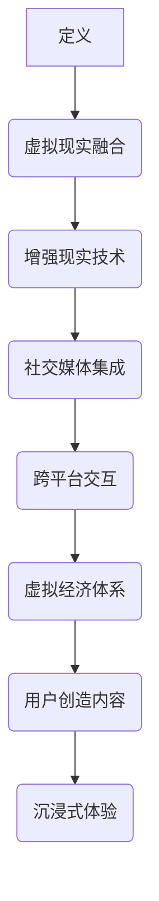
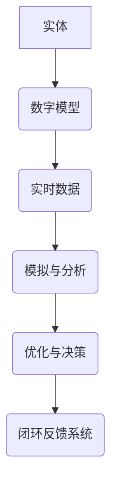
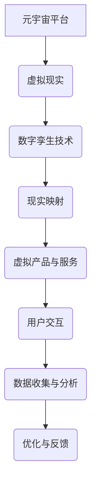
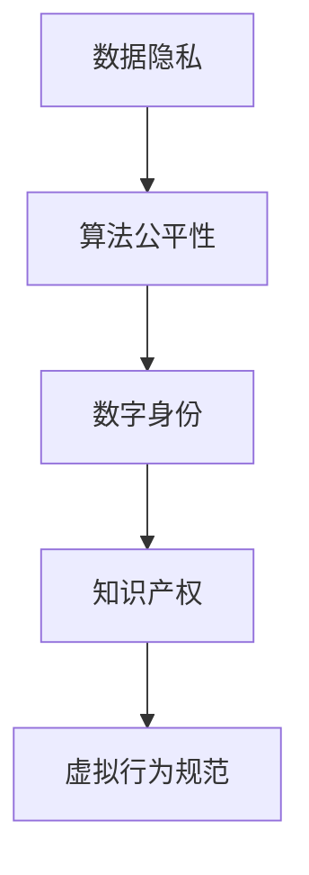
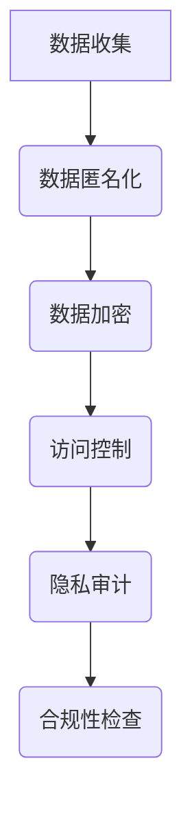

                 

### 文章标题

### 元宇宙数字孪生伦理：现实映射的道德边界探讨

### 关键词

- 元宇宙
- 数字孪生
- 伦理
- 数据隐私
- 算法公平
- 数字身份
- 知识产权

### 摘要

本文探讨了元宇宙数字孪生伦理，即现实映射在虚拟世界中的道德边界。通过对元宇宙和数字孪生的基础概念介绍，分析了元宇宙与数字孪生的联系，以及当前面临的伦理问题。文章提出了针对数据隐私、算法公平性和数字身份等方面的应对策略，为元宇宙和数字孪生的健康发展提供了参考。

---

### 第一部分：元宇宙数字孪生伦理概述

#### 第1章：元宇宙与数字孪生基础

##### 1.1 元宇宙与数字孪生概念介绍

###### 1.1.1 元宇宙的定义与特点

**Mermaid 流程图：元宇宙定义**



**元宇宙的定义**：元宇宙是一个虚拟的、三维的、持续存在的空间，融合了虚拟现实、增强现实、社交媒体和跨平台交互技术，提供沉浸式体验和虚拟经济体系。

###### 1.1.2 数字孪生的定义与特点

**Mermaid 流程图：数字孪生定义**



**数字孪生的定义**：数字孪生是一个与物理实体对应的虚拟模型，通过实时数据采集、模拟与分析，实现优化与决策，并形成闭环反馈系统，以提高实体性能和效率。

###### 1.1.3 元宇宙与数字孪生的联系

**Mermaid 流程图：元宇宙中数字孪生应用场景**



**元宇宙与数字孪生的联系**：元宇宙作为虚拟空间，通过数字孪生技术实现现实映射，提供虚拟产品与服务。用户在元宇宙中与数字孪生交互，数据被收集与分析，进而优化与反馈，形成闭环。

##### 1.2 元宇宙与数字孪生伦理现状

###### 1.2.1 伦理问题分类与挑战

**Mermaid 流程图：伦理问题分类**



**伦理问题分类**：数据隐私、算法公平性、数字身份、知识产权和虚拟行为规范。

###### 1.2.2 伦理问题的具体挑战

**1.2.2.1 数据隐私挑战**

**伪代码：数据隐私保护算法**

```python
def privacy_protected_data_process(data, threshold):
    # 数据匿名化处理
    anonymized_data = anonymize_data(data, threshold)
    # 数据加密
    encrypted_data = encrypt_data(anonymized_data)
    return encrypted_data
```

**1.2.2.2 算法公平性挑战**

**伪代码：算法公平性检查**

```python
def check_algorithm_fairness(model, dataset):
    # 训练模型
    trained_model = train_model(model, dataset)
    # 性能评估
    performance_metrics = evaluate_performance(trained_model, dataset)
    # 公平性分析
    fairness_score = analyze_fairness(performance_metrics)
    if fairness_score < acceptable_threshold:
        raise FairnessException("算法存在不公平性")
    return fairness_score
```

**1.2.2.3 数字身份挑战**

**数学公式：数字身份认证模型**

$$
\text{DigitalID} = f(\text{PersonalInfo}, \text{BiometricData}, \text{CryptographicKey})
$$

##### 1.2.3 伦理问题的应对策略

**1.2.3.1 数据隐私保护策略**

**Mermaid 流程图：数据隐私保护策略**



**1.2.3.2 算法公平性保障**

（此处可进一步探讨算法公平性的保障措施，如数据预处理、模型评估指标、算法透明性等。）

**1.2.3.3 数字身份认证**

（此处可进一步探讨数字身份认证的技术方案，如生物识别、密码学等。）

---

在后续部分，我们将继续探讨元宇宙数字孪生伦理的具体问题和解决方案，敬请期待。

