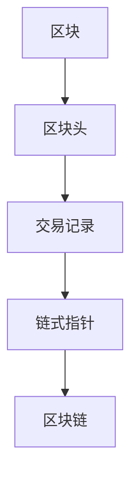
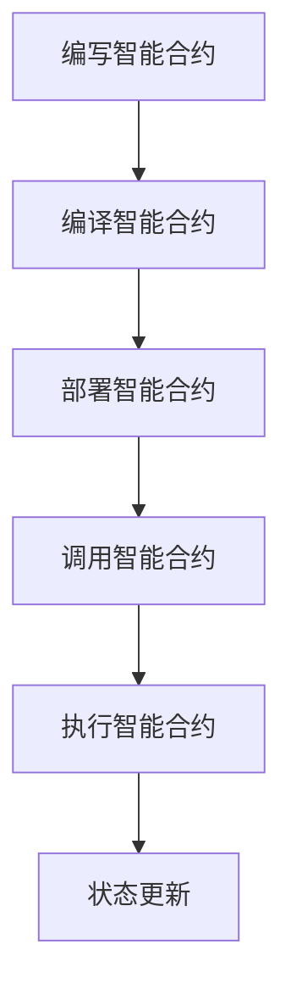
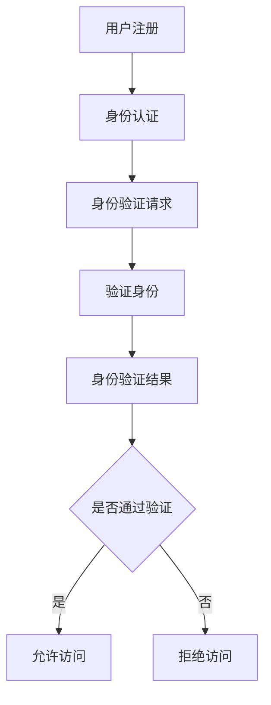

                 

# 《元宇宙资产管理工具：虚拟经济的创业方向》

## 关键词

元宇宙、虚拟经济、资产管理、区块链技术、非同质化代币（NFT）、分布式身份验证、交易流动性、数字货币、虚拟地产、虚拟物品、创业方向

## 摘要

随着元宇宙的快速发展，虚拟经济成为了一个新兴且具有巨大潜力的市场。本文探讨了元宇宙资产管理工具的开发方向，包括区块链技术、非同质化代币（NFT）、虚拟地产与虚拟物品等。文章通过分析元宇宙的发展背景和虚拟资产的特点，介绍了元宇宙资产管理工具的核心技术，如区块链、分布式身份验证和交易流动性。随后，文章详细阐述了元宇宙资产管理工具的实践案例，分析了创业方向与策略，并展望了未来的发展趋势。本文旨在为创业者提供元宇宙资产管理的深度思考与实用指南。

## 引言与背景

### 1.1 元宇宙与虚拟经济概述

**1.1.1 元宇宙的定义与发展**

元宇宙（Metaverse）是一个虚拟的、三维的、网络化的数字世界，用户可以在其中进行社交、娱乐、工作、学习和购物等活动。它通常被认为是一个融合了虚拟现实（VR）、增强现实（AR）和互联网的生态系统。元宇宙的起源可以追溯到1992年的科幻小说《雪崩》（Snow Crash），作者尼尔·斯蒂芬森（Neal Stephenson）首次提出了“元宇宙”这一概念。

随着技术的进步，尤其是区块链、VR、AR和5G等技术的成熟，元宇宙的概念逐渐从科幻领域走向现实。近年来，虚拟现实技术的发展使得元宇宙的沉浸感大幅提升，区块链技术的应用则为其带来了去中心化和可信任的特性。各大科技公司和创业公司纷纷加入元宇宙的探索和开发，如Facebook、谷歌、腾讯和微软等。

**1.1.2 虚拟经济的特点与挑战**

虚拟经济是元宇宙的重要组成部分，它涵盖了数字货币、非同质化代币（NFT）、虚拟地产和虚拟物品等多种形式。虚拟经济的特点包括：

1. **去中心化**：虚拟经济通常基于区块链技术，具有去中心化的特性，减少了中介环节，提高了效率。
2. **安全性**：区块链技术提供了高度安全的交易记录，确保了虚拟资产的安全性。
3. **可追溯性**：区块链上的交易记录是公开和透明的，使得虚拟资产的所有权和交易历史可追溯。
4. **流动性**：虚拟资产可以在全球范围内快速交易，具有较高的流动性。

然而，虚拟经济也面临着一些挑战，包括：

1. **监管不确定性**：各国政府对虚拟资产的监管政策尚不明确，可能对虚拟经济带来不确定性。
2. **市场波动性**：虚拟资产价格波动较大，投资者可能面临较高的风险。
3. **技术门槛**：开发虚拟经济应用需要较高的技术门槛，对创业者和开发者提出了挑战。
4. **隐私保护**：在虚拟经济中，如何保护用户的隐私是一个重要的议题。

**1.1.3 元宇宙资产管理的重要性**

随着元宇宙的快速发展，虚拟资产的价值和重要性日益凸显。资产管理工具在元宇宙中发挥着关键作用，它们能够帮助用户安全、高效地管理虚拟资产，包括数字货币、NFT、虚拟地产和虚拟物品等。元宇宙资产管理工具的重要性体现在以下几个方面：

1. **安全性**：资产管理工具能够确保虚拟资产的安全，防止被盗或丢失。
2. **便捷性**：资产管理工具提供了便捷的虚拟资产交易和管理功能，使用户能够轻松地进行操作。
3. **合规性**：资产管理工具需要遵守相关法律法规，确保运营的合规性。
4. **增值性**：通过资产管理工具，用户可以获得更多的增值服务，如投资、交易、租赁等，提高虚拟资产的利用率。

### 1.2 虚拟资产分类与特征

虚拟资产是元宇宙经济的基础，其种类繁多，包括数字货币、非同质化代币（NFT）、虚拟地产和虚拟物品等。下面将对这些虚拟资产进行分类和特征介绍。

**1.2.1 数字货币**

数字货币是一种基于区块链技术的虚拟货币，如比特币（Bitcoin）、以太坊（Ethereum）等。数字货币具有以下特征：

1. **去中心化**：数字货币不受任何中央机构控制，交易记录公开透明。
2. **安全性**：区块链技术确保了数字货币交易的安全性，防止篡改和双花攻击。
3. **匿名性**：数字货币交易通常具有匿名性，保护了用户的隐私。
4. **可分割性**：数字货币可以根据需要分割成小单位，方便交易和使用。
5. **波动性**：数字货币价格波动较大，市场风险较高。

**1.2.2 非同质化代币（NFT）**

非同质化代币（NFT）是一种代表数字资产所有权的唯一代币，常用于数字艺术品、虚拟物品和收藏品等领域。NFT具有以下特征：

1. **唯一性**：每个NFT都是独一无二的，具有独特的标识符。
2. **不可分割性**：NFT不能分割成更小的单位，每个NFT都是完整的资产。
3. **可验证性**：NFT的交易记录和所有权信息是公开透明的，可以通过区块链进行验证。
4. **可交易性**：NFT可以在市场上进行买卖，具有市场价值。
5. **附加价值**：NFT通常具有创作者或收藏者的附加价值，使得其具有独特性和收藏价值。

**1.2.3 虚拟地产与虚拟物品**

虚拟地产是指元宇宙中的虚拟土地和建筑，如虚拟世界中的房产、商铺等。虚拟物品则是指元宇宙中的各种虚拟商品，如虚拟服装、虚拟家具等。

1. **虚拟地产**：
   - **稀缺性**：虚拟地产通常是有限的，具有稀缺性，使得其具有价值。
   - **地理位置**：虚拟地产具有特定的地理位置，影响了其价值。
   - **开发和利用**：虚拟地产可以用于建造虚拟建筑、开设虚拟店铺等，具有商业价值。
   - **交易规则**：虚拟地产的交易规则通常由元宇宙的规则和协议决定。

2. **虚拟物品**：
   - **独特性**：虚拟物品通常具有独特的设计或属性，使其具有独特性和收藏价值。
   - **虚拟交互**：虚拟物品可以与用户进行交互，提升用户体验。
   - **交易与租赁**：虚拟物品可以在元宇宙内进行买卖和租赁，具有经济价值。

### 1.3 元宇宙资产管理的重要性

随着元宇宙的快速发展，虚拟资产的价值和重要性日益凸显。资产管理工具在元宇宙中发挥着关键作用，它们能够帮助用户安全、高效地管理虚拟资产，包括数字货币、NFT、虚拟地产和虚拟物品等。元宇宙资产管理工具的重要性体现在以下几个方面：

1. **安全性**：资产管理工具能够确保虚拟资产的安全，防止被盗或丢失。通过区块链技术，资产管理工具能够提供透明和安全的交易环境，降低风险。

2. **便捷性**：资产管理工具提供了便捷的虚拟资产交易和管理功能，使用户能够轻松地进行操作。用户可以通过资产管理工具进行资产转移、交易、存储和增值等操作。

3. **合规性**：资产管理工具需要遵守相关法律法规，确保运营的合规性。合规性是虚拟经济可持续发展的重要保障，资产管理工具需要建立完善的合规管理体系。

4. **增值性**：通过资产管理工具，用户可以获得更多的增值服务，如投资、交易、租赁等，提高虚拟资产的利用率。资产管理工具可以为用户提供多样化的增值服务，满足用户的不同需求。

总之，元宇宙资产管理工具在元宇宙经济发展中具有重要意义，它们为用户提供了安全、便捷和高效的虚拟资产管理和交易服务，推动了元宇宙经济的繁荣和发展。

## 元宇宙资产管理工具与技术

### 2.1 区块链技术基础

区块链技术是元宇宙资产管理工具的核心技术之一，它为虚拟资产的安全性和透明性提供了保障。下面将介绍区块链技术的基础知识，包括其基本原理、常见区块链平台和智能合约的应用。

#### 2.1.1 区块链的基本原理

区块链是一种分布式数据库技术，它通过加密算法和共识机制确保数据的安全性和一致性。区块链的基本原理可以概括为以下几个步骤：

1. **数据存储**：区块链将数据划分为多个区块，每个区块包含一定数量的交易记录。这些区块按照时间顺序链接在一起，形成一条不断延伸的链条。
2. **加密算法**：每个区块都使用密码学算法对数据进行加密，确保数据的安全性和隐私性。加密算法包括哈希函数、数字签名和加密货币等。
3. **共识机制**：区块链网络中的节点通过共识机制来确认交易的合法性和区块的有效性。常见的共识机制包括工作量证明（PoW）、权益证明（PoS）和委托权益证明（DPoS）等。
4. **去中心化**：区块链网络由多个节点组成，每个节点都可以参与数据的存储和验证，从而实现了去中心化的特性。去中心化使得区块链网络具有高度的可扩展性和抗攻击性。

#### 2.1.2 常见的区块链平台与架构

目前，市场上存在多种区块链平台，每种平台都有其独特的架构和特性。以下是一些常见的区块链平台：

1. **比特币（Bitcoin）**：比特币是第一个区块链项目，它采用工作量证明（PoW）共识机制，实现了去中心化的数字货币系统。比特币的网络由矿工节点组成，这些节点通过解决复杂的数学问题来验证交易并创建新区块。
2. **以太坊（Ethereum）**：以太坊是第一个实现智能合约功能的区块链平台。它采用权益证明（PoS）共识机制，允许开发者创建和部署去中心化应用（DApp）。以太坊网络由验证者节点组成，这些节点通过投票来验证交易并创建新区块。
3. **EOS**：EOS是一个高性能的区块链平台，它采用委托权益证明（DPoS）共识机制，通过选举产生代理节点来验证交易。EOS的设计目标是实现快速和低成本的交易，适用于大规模的商业应用。
4. **波卡（Polkadot）**：波卡是一个多链互操作性的区块链平台，它允许不同区块链之间进行数据和价值传输。波卡采用分布式共识机制，通过跨链技术实现了区块链网络的互操作性。

#### 2.1.3 智能合约的应用

智能合约是一种自动执行合约条款的计算机程序，它在区块链网络中发挥了重要作用。智能合约的应用包括但不限于以下几个方面：

1. **虚拟资产交易**：智能合约可以自动执行虚拟资产的交易，确保交易的安全性和效率。例如，用户可以通过智能合约购买和销售NFT，实现自动化的交易流程。
2. **去中心化金融（DeFi）**：智能合约在去中心化金融领域发挥了重要作用，包括借贷、交易、投资等多种金融服务。智能合约使得用户可以在无需中介机构的情况下进行金融交易，提高了效率和透明性。
3. **供应链管理**：智能合约可以用于供应链管理，确保交易的透明性和可追溯性。例如，通过智能合约，可以自动执行商品的运输和支付流程，减少了人工干预和欺诈风险。
4. **投票和选举**：智能合约可以用于去中心化的投票和选举系统，确保投票过程的公正性和透明性。智能合约可以自动记录和验证选票，防止作弊行为。

总之，区块链技术为元宇宙资产管理工具提供了可靠的基础设施，智能合约的应用则进一步增强了虚拟资产管理的灵活性和安全性。随着区块链技术的不断发展和应用，元宇宙资产管理工具将会越来越成熟和完善。

### 2.2 分布式身份验证与隐私保护

在元宇宙中，用户身份验证和隐私保护是至关重要的。分布式身份验证和隐私保护技术能够确保用户在元宇宙中的安全性和隐私，同时提高系统的可扩展性和互操作性。下面将详细介绍这些技术，包括分布式身份验证机制、隐私保护技术和跨链身份认证方案。

#### 2.2.1 分布式身份验证机制

分布式身份验证机制是一种在分布式网络中验证用户身份的技术，它通过去中心化的方式确保身份信息的真实性和完整性。分布式身份验证机制通常包括以下几个关键组件：

1. **身份标识**：每个用户在分布式网络中拥有一个唯一的身份标识，例如数字钱包地址、用户公钥等。身份标识是用户在元宇宙中进行交互的基本凭证。
2. **身份注册**：用户需要在分布式网络中注册身份，注册过程中需要提供身份验证信息，例如身份证明文件、生物识别信息等。身份注册通常由可信第三方机构或分布式身份验证节点完成。
3. **身份验证**：在用户进行交互时，需要通过身份验证机制验证其身份。身份验证可以通过多种方式实现，例如基于公钥加密的数字签名、多因素认证等。
4. **身份管理**：用户可以在分布式网络中管理自己的身份信息，包括身份的更新、删除和授权等操作。身份管理是分布式身份验证机制的重要组成部分。

分布式身份验证机制具有以下几个优势：

1. **去中心化**：分布式身份验证机制不依赖于中心化的身份认证机构，减少了单点故障的风险，提高了系统的抗攻击能力。
2. **隐私保护**：分布式身份验证机制通过加密技术保护用户的身份信息，确保用户隐私不被泄露。
3. **可扩展性**：分布式身份验证机制可以支持大规模用户身份的验证和管理，适应元宇宙的快速发展。
4. **互操作性**：分布式身份验证机制可以与其他分布式系统进行互操作，例如去中心化应用（DApp）和区块链网络等。

#### 2.2.2 隐私保护技术

在元宇宙中，用户的隐私保护至关重要，隐私保护技术能够确保用户在元宇宙中的隐私不被侵犯。以下是几种常见的隐私保护技术：

1. **同态加密**：同态加密是一种加密技术，它允许在加密数据上进行计算，而无需解密数据。通过同态加密，用户可以在保持数据隐私的同时进行数据处理和计算，适用于数据分析和交易验证等场景。
2. **零知识证明**：零知识证明是一种密码学技术，它允许一方（证明者）向另一方（验证者）证明某个陈述是真实的，而无需透露任何具体信息。零知识证明可以用于用户身份验证、交易隐私保护等场景。
3. **匿名通信**：匿名通信技术能够隐藏用户的通信内容和通信来源，保护用户的隐私。例如，匿名邮件系统和匿名聊天系统等。
4. **分布式隐私计算**：分布式隐私计算是一种在分布式网络中进行隐私保护计算的技术，通过将计算任务分布在多个节点上，确保数据在传输和计算过程中不被泄露。

#### 2.2.3 跨链身份认证方案

在元宇宙中，不同区块链网络之间可能需要进行身份认证和数据交互，跨链身份认证方案能够实现不同区块链网络之间的身份认证和数据共享。以下是几种常见的跨链身份认证方案：

1. **跨链互操作协议**：跨链互操作协议是一种在多个区块链网络之间进行数据交互和身份认证的协议，例如波卡（Polkadot）的跨链互操作协议。跨链互操作协议通过建立跨链桥梁，实现了不同区块链网络之间的互操作性和数据共享。
2. **去中心化身份认证网关**：去中心化身份认证网关是一种在多个区块链网络之间提供身份认证服务的去中心化系统。身份认证网关通过分布式身份验证机制和隐私保护技术，为用户提供安全可靠的身份认证服务。
3. **分布式身份认证联盟**：分布式身份认证联盟是一种由多个区块链网络组成的身份认证联盟，联盟成员之间共享身份认证信息和隐私保护机制。分布式身份认证联盟通过共识机制和智能合约实现身份认证和数据共享。

总之，分布式身份验证和隐私保护技术为元宇宙中的用户身份验证和数据安全提供了强有力的保障。随着元宇宙的快速发展，这些技术将在元宇宙中发挥越来越重要的作用。

### 2.3 元宇宙交易与流动性

在元宇宙中，交易和流动性是两个关键因素，它们直接影响虚拟经济的繁荣和健康发展。本节将介绍元宇宙交易市场的概述、流动性池与交易对、以及自动做市商（AMM）机制，以帮助读者更好地理解元宇宙交易的核心概念和机制。

#### 2.3.1 元宇宙交易市场概述

元宇宙交易市场是指用户在元宇宙中交换虚拟资产的平台，这些平台可以是去中心化的（DEX）或中心化的（CEX）。元宇宙交易市场具有以下特点：

1. **去中心化**：去中心化交易市场不依赖于任何中心化机构，所有交易记录都记录在区块链上，保证了交易的透明性和安全性。
2. **匿名性**：在去中心化交易市场中，用户可以匿名交易，保护了用户的隐私。
3. **全球化**：元宇宙交易市场不受地域限制，用户可以跨越国界进行交易，增强了市场的流动性。
4. **高效率**：区块链技术的应用使得元宇宙交易市场具有较高的交易效率，交易确认时间短，减少了交易等待时间。

#### 2.3.2 流动性池与交易对

流动性池是指用于支持交易对的资金池，它由交易者提供，用于确保交易对的连续性和稳定性。流动性池的基本概念包括以下两个方面：

1. **交易对**：交易对是指两种虚拟资产之间的交易关系，例如比特币与以太坊之间的交易对（BTC/ETH）。一个健康的交易市场通常需要多个交易对，以满足不同用户的需求。
2. **流动性池**：流动性池是一种资金池，它包含多种虚拟资产，用于支持交易对的交易。流动性池的资产通常由交易者提供，交易者通过提供流动性获得交易费用和其他奖励。

流动性池与交易对之间的关系如下：

1. **提供流动性**：交易者可以通过将虚拟资产存入流动性池来提供流动性。流动性池中的资产越多，交易对的市场深度就越大，交易成功率也越高。
2. **赚取收益**：提供流动性的交易者可以获得交易费用和其他奖励，这些奖励通常与流动性池中资产的数量和交易频率有关。
3. **平衡市场**：流动性池中的资产可以帮助平衡交易市场，减少价格波动，提高市场的稳定性。

#### 2.3.3 自动做市商（AMM）机制

自动做市商（AMM）机制是一种用于提供流动性的机制，它通过智能合约自动执行交易订单，确保交易对的连续性和稳定性。AMM机制的基本原理包括以下两个方面：

1. **流动性函数**：AMM机制通过一个流动性函数（如时间-加权平均价格）来计算交易价格。流动性函数可以根据市场供需动态调整价格，确保交易对的平衡。
2. **资金池**：AMM机制使用一个资金池来存储交易资产，资金池中的资产由交易者提供。当交易发生时，资金池中的资产会根据流动性函数进行调整。

AMM机制的优势包括：

1. **去中心化**：AMM机制不依赖于中心化做市商，通过智能合约实现自动做市，减少了交易风险。
2. **高流动性**：AMM机制可以提供持续的市场流动性，确保交易对的高效交易。
3. **自动化**：AMM机制通过智能合约自动化执行交易订单，减少了人为干预和交易延迟。
4. **适应性**：AMM机制可以根据市场供需动态调整价格，提高市场的适应性。

总之，元宇宙交易与流动性是元宇宙经济的重要组成部分。通过了解交易市场概述、流动性池与交易对、以及自动做市商（AMM）机制，读者可以更好地理解元宇宙交易的核心概念和机制，为参与元宇宙虚拟经济提供基础。

### 第三部分：元宇宙资产管理工具实践

随着元宇宙的快速发展，资产管理工具在虚拟经济中扮演着越来越重要的角色。本节将详细介绍元宇宙资产管理工具的具体实践，包括数字资产管理平台、虚拟地产与虚拟物品交易平台，以及非同质化代币（NFT）资产管理。

#### 3.1 数字资产管理平台

数字资产管理平台是元宇宙资产管理工具的重要组成部分，它提供了用户对数字货币、NFT和其他虚拟资产的管理功能。以下是对数字资产管理平台架构设计、用户账户管理、安全性与合规性的详细讨论。

**3.1.1 平台架构设计**

数字资产管理平台的架构设计需要考虑高可用性、高并发性和数据安全性。以下是常见的设计模式：

1. **前端界面**：前端界面包括用户登录、资产展示、交易操作等模块。前端界面通常采用单页面应用（SPA）技术，以提高用户体验和响应速度。
2. **后端服务器**：后端服务器负责处理用户请求、数据存储和智能合约交互。后端服务器通常采用微服务架构，以提高系统的可扩展性和灵活性。
3. **区块链节点**：平台需要连接到区块链网络，以便进行资产验证和交易操作。区块链节点可以通过API接口与后端服务器通信。
4. **数据库**：数据库用于存储用户账户信息、交易记录和资产信息。常用的数据库技术包括关系型数据库（如MySQL）和非关系型数据库（如MongoDB）。

**3.1.2 用户账户管理**

用户账户管理是数字资产管理平台的核心功能，包括用户注册、登录、权限管理和资产转移等操作。以下是用户账户管理的关键点：

1. **用户注册**：用户需要通过平台进行注册，注册过程中需要提供身份验证信息，如邮箱、手机号、身份证明等。注册完成后，用户将获得一个唯一的账户地址。
2. **身份验证**：平台需要对用户身份进行验证，以确保账户安全。身份验证可以采用多重验证机制，如密码、短信验证码、生物识别等。
3. **权限管理**：平台需要根据用户角色和权限进行操作限制，确保用户只能访问和操作其授权的资产。
4. **资产转移**：用户可以通过平台将资产转移到其他账户或用于交易。资产转移过程需要通过智能合约进行验证和确认，确保交易的安全性和可追溯性。

**3.1.3 安全性与合规性**

数字资产管理平台需要确保用户资产的安全性和合规性，以下是安全性与合规性的关键点：

1. **数据加密**：平台需要对用户数据、交易记录和智能合约代码进行加密处理，确保数据的安全性和隐私性。
2. **身份验证**：平台需要采用多重身份验证机制，提高账户的安全性。
3. **智能合约审核**：平台需要对智能合约代码进行安全性和合规性审核，确保智能合约的可靠性和安全性。
4. **监管合规**：平台需要遵守相关法律法规，确保运营的合规性。例如，平台需要登记注册、资金监管、用户信息保护等。

#### 3.2 虚拟地产与虚拟物品交易平台

虚拟地产与虚拟物品交易平台是元宇宙中的重要组成部分，它为用户提供了虚拟地产和虚拟物品的交易和租赁服务。以下是对平台业务模式、交易流程设计和物品确权与转移的详细讨论。

**3.2.1 平台业务模式**

虚拟地产与虚拟物品交易平台的业务模式通常包括以下几个方面：

1. **销售**：平台提供虚拟地产和虚拟物品的销售服务，用户可以在平台上购买虚拟资产。
2. **租赁**：平台提供虚拟地产和虚拟物品的租赁服务，用户可以在租赁期限内使用虚拟资产。
3. **交易**：平台提供虚拟资产的交易市场，用户可以自由买卖虚拟资产。
4. **托管**：平台提供虚拟资产的托管服务，用户可以将虚拟资产存放在平台上，确保资产的安全。
5. **增值服务**：平台提供与虚拟资产相关的增值服务，如投资、交易策略、数据分析等。

**3.2.2 交易流程设计**

虚拟地产与虚拟物品交易平台的交易流程设计需要考虑交易的便捷性和安全性。以下是交易流程的主要步骤：

1. **发布资产**：资产所有者将虚拟资产（如虚拟地产、虚拟物品）发布到平台上，并设置价格和交易条件。
2. **查看资产**：用户可以在平台上查看发布的虚拟资产，选择心仪的资产进行交易。
3. **发起交易**：用户发起交易请求，支付相应的交易费用，并与资产所有者协商交易细节。
4. **交易确认**：交易双方确认交易信息，平台通过智能合约执行交易，资产所有权转移至买家。
5. **支付结算**：买家支付虚拟资产价格，平台将虚拟资产转移至买家账户。

**3.2.3 物品确权与转移**

在虚拟地产与虚拟物品交易平台中，物品确权与转移是关键环节。以下是物品确权与转移的步骤：

1. **确权**：平台通过区块链技术对虚拟资产进行确权，确保资产的所有权归属。确权过程通常涉及智能合约和分布式身份验证机制。
2. **验证**：平台对交易双方的身份进行验证，确保交易的安全性。
3. **执行交易**：平台通过智能合约执行交易，将虚拟资产的所有权转移至买家。
4. **记录交易**：平台将交易记录存储在区块链上，确保交易的透明性和可追溯性。

#### 3.3 非同质化代币（NFT）资产管理

非同质化代币（NFT）是元宇宙中的重要虚拟资产，NFT资产管理工具为用户提供了NFT的创建、交易和管理功能。以下是对NFT资产管理工具的详细讨论，包括NFT的基本概念、市场生态系统以及创建、交易和管理的具体步骤。

**3.3.1 NFT的基本概念**

NFT是一种独特的数字资产，代表对数字物品的所有权。NFT具有以下特点：

1. **唯一性**：每个NFT都是独一无二的，具有唯一的标识符和属性。
2. **不可替代性**：NFT不能分割成更小的单位，每个NFT都是完整的资产。
3. **可验证性**：NFT的交易记录和所有权信息是公开透明的，可以通过区块链进行验证。
4. **可交易性**：NFT可以在市场上进行买卖，具有市场价值。

**3.3.2 NFT市场的生态系统**

NFT市场的生态系统包括以下几个关键角色和环节：

1. **创作者**：创作者是NFT的创造者，他们通过创作数字艺术品、虚拟物品等来生成NFT。
2. **收藏家**：收藏家是NFT的购买者，他们通过购买NFT来积累数字资产和收藏价值。
3. **交易平台**：交易平台是NFT交易的场所，为创作者和收藏家提供交易和资产管理服务。
4. **拍卖行**：拍卖行是NFT拍卖的场所，通过竞价机制确定NFT的价格。
5. **市场参与者**：市场参与者包括交易者、投资机构和其他对NFT市场有影响力的实体。

**3.3.3 NFT的创建、交易与管理**

NFT的创建、交易和管理是NFT资产管理工具的核心功能，以下是具体的步骤：

1. **创建NFT**：用户可以通过平台创建NFT，上传数字资产并设置NFT的属性和价格。平台通过智能合约验证NFT的唯一性和所有权归属。
2. **发布NFT**：用户将创建的NFT发布到平台，供其他用户购买或交易。
3. **交易NFT**：用户可以在平台上发起NFT交易，与其他用户进行交易协商和支付。平台通过智能合约执行交易，确保交易的安全性和透明性。
4. **管理NFT**：用户可以在平台上管理NFT，包括转让所有权、修改NFT属性等操作。平台提供用户友好的界面和丰富的功能，方便用户进行NFT管理。

通过数字资产管理平台、虚拟地产与虚拟物品交易平台，以及NFT资产管理工具，元宇宙资产管理工具为用户提供了全面、便捷和安全的虚拟资产管理服务。这些工具不仅满足了用户对虚拟资产的需求，也为元宇宙经济的繁荣和发展提供了有力支持。

### 第四部分：创业方向与案例分析

在元宇宙的快速发展背景下，虚拟经济和资产管理工具成为了新的创业方向。以下将探讨元宇宙资产管理的创业策略、成功案例分享以及未来趋势与机遇。

#### 4.1 元宇宙资产管理创业策略

**4.1.1 市场调研与分析**

在进入元宇宙资产管理领域之前，创业者需要进行充分的市场调研和分析，以了解市场需求、竞争态势和潜在风险。以下是一些关键步骤：

1. **市场需求分析**：通过调研了解用户对虚拟资产管理工具的需求，包括安全性、便捷性、合规性等方面。
2. **竞争态势分析**：分析现有的元宇宙资产管理工具，了解它们的优劣势和市场占有率，寻找市场空白点。
3. **潜在风险分析**：评估市场风险、技术风险、法律风险等，制定相应的风险应对策略。

**4.1.2 创业模式与盈利模式**

在确定市场需求和竞争态势后，创业者需要选择合适的创业模式，并设计盈利模式。以下是一些常见的创业模式：

1. **平台模式**：建立一个数字资产管理平台，提供数字货币、NFT、虚拟地产等多种虚拟资产的管理服务。平台可以通过收取交易费用、会员费等方式盈利。
2. **应用模式**：开发特定的应用（如NFT交易平台、虚拟地产交易平台），通过提供增值服务（如投资顾问、数据分析等）获得收入。
3. **合作模式**：与其他元宇宙项目合作，提供资产管理服务，通过分成和佣金获得收入。

**4.1.3 风险管理与合规性**

在元宇宙资产管理创业过程中，风险管理和合规性至关重要。以下是一些建议：

1. **技术风险管理**：确保平台的安全性，采用先进的加密技术和分布式身份验证机制，防止黑客攻击和数据泄露。
2. **法律合规性**：遵守相关法律法规，如反洗钱（AML）和客户身份验证（KYC）等，确保业务的合法性。
3. **风险预警与控制**：建立风险预警机制，对市场风险、技术风险等进行实时监控和评估，采取有效的风险控制措施。

#### 4.2 成功案例分享

以下分享几个成功的元宇宙资产管理创业案例，以供创业者参考。

**case 1：OpenSea**

OpenSea是一个非同质化代币（NFT）交易平台，成立于2017年，总部位于美国。OpenSea通过提供简单易用的界面和丰富的功能，吸引了大量用户和创作者。平台上的NFT涵盖了数字艺术品、虚拟商品、游戏物品等多种类型。OpenSea的盈利模式主要包括交易费用、推广费和平台会员费等。截至2021年，OpenSea的估值已超过10亿美元。

**case 2：Axie Infinity**

Axie Infinity是一个基于区块链的养宠游戏，用户可以通过创建、繁殖和战斗虚拟宠物（Axies）来赚取加密货币。Axie Infinity的成功在于其创新的商业模式，用户不仅可以在平台上玩游戏，还可以通过交易和繁殖Axies获得收益。Axie Infinity的月活跃用户超过100万，平台上的虚拟资产交易额不断增长。

**case 3：Decentraland**

Decentraland是一个基于区块链的虚拟现实平台，用户可以在平台上购买、开发和交互虚拟地产。Decentraland通过虚拟地产交易和租赁获得收入，同时也提供了广告和虚拟商品销售等增值服务。Decentraland的虚拟地产价格逐年上涨，吸引了大量用户和投资者。

#### 4.3 未来趋势与机遇

元宇宙的快速发展为资产管理工具带来了广阔的市场前景。以下是一些未来趋势和机遇：

1. **元宇宙经济的扩大**：随着元宇宙应用的普及，虚拟资产的需求将持续增长，为资产管理工具提供了巨大的市场空间。
2. **去中心化金融（DeFi）的发展**：DeFi在元宇宙中的应用将越来越广泛，为资产管理工具提供了更多创新空间。
3. **跨链技术的进步**：跨链技术将促进不同区块链网络之间的数据和价值交换，提升元宇宙资产管理的互操作性和便捷性。
4. **隐私保护和合规性**：随着监管政策的逐步明确，资产管理工具将更加注重隐私保护和合规性，为用户和企业提供更安全可靠的服务。

总之，元宇宙资产管理工具在虚拟经济中具有重要地位，创业者可以通过市场调研、商业模式设计和风险控制，抓住元宇宙发展的机遇，实现创业成功。

### 第五部分：技术细节与实现

在元宇宙资产管理工具的开发过程中，技术细节和实现是至关重要的。本部分将详细介绍区块链技术的实现细节，包括区块链基本架构、智能合约工作流程，以及分布式身份验证机制。同时，还将介绍算法原理与数学模型，如区块链共识算法、分布式身份验证机制，以及流动性池计算。最后，通过一个实际项目案例，展示开发环境搭建、源代码实现和分析，以及代码应用解读与分析。

#### 5.1 区块链技术实现细节

**5.1.1 区块链基本架构**

区块链是一种分布式数据库，通过一系列加密算法和共识机制确保数据的安全和一致性。以下是区块链基本架构的详细介绍：

1. **区块**：区块是区块链的基本单位，包含一系列交易记录。每个区块都有一个唯一的标识符，称为区块头。
2. **链**：区块链是由多个区块按照时间顺序链接而成的链条。新区块总是在链的末端添加。
3. **链式指针**：每个区块包含前一个区块的哈希值，形成链式指针结构，确保区块的顺序和完整性。
4. **工作量证明（PoW）**：工作量证明是一种共识机制，通过解决复杂的数学问题来证明工作量。矿工通过计算找到满足特定条件的哈希值，从而生成新区块。

**5.1.2 智能合约工作流程**

智能合约是一种自动执行合约条款的计算机程序，它在区块链网络中发挥了重要作用。以下是智能合约工作流程的详细描述：

1. **编写智能合约**：开发者使用编程语言（如Solidity）编写智能合约代码，定义合约的接口和逻辑。
2. **部署智能合约**：将智能合约编译为字节码，并将其上传到区块链网络。矿工验证智能合约的有效性并生成合约地址。
3. **调用智能合约**：用户通过发送交易调用智能合约，执行预定义的函数。合约代码在区块链上执行，返回结果。
4. **状态更新**：智能合约执行后，区块链的状态将更新，记录交易结果。

**5.1.3 Mermaid流程图：区块链基本架构**

以下是一个Mermaid流程图，展示了区块链基本架构：



**5.1.4 Mermaid流程图：智能合约工作流程**

以下是一个Mermaid流程图，展示了智能合约工作流程：



**5.1.5 伪代码：区块链数据结构操作**

以下是一个简单的伪代码示例，展示了区块链数据结构的操作：

```python
# 定义区块结构
class Block:
    def __init__(self, index, transactions, previous_hash):
        self.index = index
        self.transactions = transactions
        self.previous_hash = previous_hash
        self.hash = self.calculate_hash()

    def calculate_hash(self):
        # 使用SHA-256算法计算哈希值
        return hashlib.sha256((str(self.index) + str(self.transactions) + str(self.previous_hash)).encode()).hexdigest()

# 创建区块链
class Blockchain:
    def __init__(self):
        self.chain = [self.create_genesis_block()]
        self.current_transactions = []

    def create_genesis_block(self):
        return Block(0, [], "0")

    def add_new_block(self, transactions):
        previous_block = self.chain[-1]
        new_block = Block(len(self.chain), transactions, previous_block.hash)
        self.chain.append(new_block)
        self.current_transactions = []
```

#### 5.2 算法原理与数学模型

**5.2.1 伪代码：区块链共识算法**

以下是一个简单的伪代码示例，展示了区块链共识算法（工作量证明）：

```python
import hashlib
import random

def proof_of_work(last_proof, difficulty):
    proof = 0
    while not valid_proof(last_proof, proof, difficulty):
        proof += 1
    return proof

def valid_proof(last_proof, proof, difficulty):
    guess = f'{last_proof}{proof}'.encode()
    guess_hash = hashlib.sha256(guess).hexdigest()
    return guess_hash[:difficulty] == '0'*difficulty

def mine_block(blockchain, current_transactions, difficulty):
    last_block = blockchain.chain[-1]
    last_proof = last_block.proof
    proof = proof_of_work(last_proof, difficulty)

    blockchain.add_new_block(current_transactions, last_proof, proof)
    blockchain.current_transactions = []
    return blockchain
```

**5.2.2 Mermaid流程图：分布式身份验证机制**

以下是一个Mermaid流程图，展示了分布式身份验证机制：



**5.2.3 数学模型与公式：流动性池计算**

以下是一个简单的数学模型，用于计算流动性池中的资金分配：

$$
x = \frac{a \times b}{a + b}
$$

其中，\(x\) 表示资产A在流动性池中的比例，\(a\) 和 \(b\) 分别表示资产A和资产B的初始数量。

#### 5.3 项目实战与代码解析

**5.3.1 开发环境搭建**

在开始开发元宇宙资产管理工具之前，需要搭建合适的开发环境。以下是一个简单的开发环境搭建步骤：

1. **安装Node.js**：Node.js 是一个用于构建高性能网络应用程序的 JavaScript 运行时环境。在官方网站下载并安装Node.js。
2. **安装Truffle**：Truffle 是一个用于以太坊区块链开发和测试的工具集。使用npm命令安装Truffle：`npm install -g truffle`
3. **创建项目**：使用Truffle创建一个新的以太坊智能合约项目：`truffle init`
4. **安装合约库**：在项目根目录下创建一个名为`contracts`的文件夹，用于存储智能合约文件。

**5.3.2 源代码实现与分析**

以下是一个简单的智能合约示例，用于实现数字资产管理功能：

```solidity
pragma solidity ^0.8.0;

contract DigitalAsset {
    mapping(address => uint256) public balanceOf;
    mapping(address => mapping(address => uint256)) public allowance;
    address public owner;

    constructor() {
        owner = msg.sender;
        balanceOf[owner] = 1000000;
    }

    function transfer(address recipient, uint256 amount) public {
        require(balanceOf[msg.sender] >= amount, "Insufficient balance");
        balanceOf[msg.sender] -= amount;
        balanceOf[recipient] += amount;
        emit Transfer(msg.sender, recipient, amount);
    }

    function approve(address spender, uint256 amount) public {
        allowance[msg.sender][spender] = amount;
        emit Approval(msg.sender, spender, amount);
    }

    function transferFrom(address sender, address recipient, uint256 amount) public {
        require(amount <= balanceOf[sender], "Insufficient balance");
        require(amount <= allowance[sender][msg.sender], "Insufficient allowance");
        balanceOf[sender] -= amount;
        balanceOf[recipient] += amount;
        allowance[sender][msg.sender] -= amount;
        emit Transfer(sender, recipient, amount);
    }

    event Transfer(address indexed from, address indexed to, uint256 value);
    event Approval(address indexed owner, address indexed spender, uint256 value);
}
```

**5.3.3 代码解读与性能优化**

以下是对上述智能合约代码的解读与性能优化建议：

1. **代码解读**：
   - `balanceOf`：一个映射，用于记录每个地址的余额。
   - `allowance`：一个双重映射，用于记录每个地址对其他地址的授权金额。
   - `owner`：合约的创建者，通常拥有所有权限。
   - `transfer`：允许用户从自己的账户向其他账户转账。
   - `approve`：允许用户授权其他地址从自己的账户转账。
   - `transferFrom`：允许用户从被授权的地址转账。

2. **性能优化**：
   - 使用`require`语句进行错误处理，提高合约的健壮性。
   - 使用事件和日志记录重要的交易信息，方便审计和监控。
   - 考虑使用优化编译器，减少合约的运行时间。
   - 使用内存数据库（如LevelDB）提高数据访问速度。

**5.3.4 实际案例分析和详细讲解剖析**

以下是一个实际案例，用于演示如何使用区块链技术实现虚拟地产管理：

1. **案例背景**：
   - 虚拟地产：一个基于区块链的虚拟世界中的地产。
   - 用户：虚拟世界中的居民，可以购买、出售和租赁虚拟地产。
   - 平台：一个提供虚拟地产管理的区块链平台。

2. **实现步骤**：
   - **步骤1**：创建虚拟地产合约，定义虚拟地产的属性和操作接口。
   - **步骤2**：将虚拟地产合约部署到区块链上。
   - **步骤3**：用户通过平台购买虚拟地产，并记录在区块链上。
   - **步骤4**：用户可以出租虚拟地产，通过智能合约执行租赁合同。
   - **步骤5**：用户可以出售虚拟地产，通过智能合约执行交易。

3. **案例分析**：
   - **安全性**：区块链技术确保了虚拟地产的交易记录的安全性和不可篡改性。
   - **透明性**：所有虚拟地产的交易记录都公开透明，用户可以查看和验证。
   - **便捷性**：用户可以通过智能合约自动执行交易，提高了交易效率。
   - **合规性**：平台需要遵守相关法律法规，确保虚拟地产管理的合规性。

4. **详细讲解剖析**：
   - **合约设计**：虚拟地产合约需要定义地产的属性（如位置、大小等）、购买和出售接口。
   - **交易流程**：用户购买虚拟地产时，需要通过智能合约执行交易，并更新区块链上的地产记录。
   - **租赁流程**：用户出租虚拟地产时，需要通过智能合约执行租赁合同，并定期收取租金。
   - **出售流程**：用户出售虚拟地产时，需要通过智能合约执行交易，并更新区块链上的地产所有权。

通过实际项目案例，我们可以看到如何将区块链技术应用于虚拟地产管理，实现了安全性、透明性和便捷性的优势。未来，随着区块链技术的不断发展和应用，虚拟地产管理将会越来越成熟和完善。

### 附录

#### 附录 A：技术资源与工具介绍

**A.1 常见区块链开发框架**

1. **Truffle**：Truffle是一个用于以太坊区块链开发和测试的工具集，提供了一套完整的开发环境，包括智能合约编写、部署和测试等功能。
2. **Hardhat**：Hardhat是一个本地以太坊区块链节点，允许开发者在一个本地环境中部署和测试智能合约，无需连接到以太坊主网。
3. **Web3.js**：Web3.js是一个JavaScript库，用于与以太坊区块链进行交互，提供了与区块链通信的API，方便开发者构建去中心化应用（DApp）。
4. **Ethers.js**：Ethers.js是一个用于以太坊区块链的JavaScript库，提供了更高级的API，支持同步和异步操作，适合构建高性能的DApp。

**A.2 虚拟资产交易API**

1. **Uniswap**：Uniswap是一个去中心化交易平台，提供虚拟资产交易API，支持以太坊上的ERC-20代币交易。
2. **SushiSwap**：SushiSwap是一个基于Uniswap的升级版本，提供了更多功能，包括流动性挖矿和去中心化衍生品交易。
3. **OpenSea**：OpenSea是一个NFT交易平台，提供API，允许开发者构建NFT市场或与其他NFT项目进行集成。

**A.3 分布式身份验证工具**

1. **uPort**：uPort是区块链身份验证解决方案，提供了一种自主权身份验证方法，允许用户在多个去中心化应用中管理自己的身份。
2. **Hyperledger Indy**：Hyperledger Indy是一个开源分布式身份验证框架，支持用户创建和管理自己的数字身份，实现跨组织的身份验证和数据共享。
3. **Aion**：Aion是一个区块链平台，提供了一种跨链身份验证解决方案，支持用户在多个区块链网络中管理身份和隐私。

#### 附录 B：法律法规与政策指南

**B.1 全球区块链与虚拟资产法律法规概述**

1. **美国**：美国证券交易委员会（SEC）和商品期货交易委员会（CFTC）对虚拟资产进行监管，比特币和其他加密货币被视为证券或商品。
2. **欧洲**：欧洲证券和市场管理局（ESMA）和欧洲央行（ECB）对虚拟资产和区块链技术进行监管，制定了相关的法规和政策。
3. **中国**：中国央行对虚拟资产交易进行了严格的限制，禁止加密货币交易，并对ICO等活动进行严格监管。

**B.2 中国区块链与虚拟资产政策解读**

1. **《中国人民银行关于防范虚拟货币交易风险的公告》**：禁止加密货币交易，强调虚拟资产交易的风险。
2. **《关于进一步防范和处置虚拟货币交易风险的通知》**：加强对虚拟货币交易平台的监管，打击非法虚拟资产交易。
3. **《关于数字货币电子支付服务的指导意见》**：鼓励区块链技术在数字货币电子支付服务中的应用，明确相关政策和法规。

**B.3 企业合规运营指南**

1. **了解当地法律法规**：企业在运营虚拟资产和区块链项目时，需要了解所在地区的法律法规，确保业务的合规性。
2. **建立完善的合规管理体系**：企业需要建立完善的合规管理体系，包括合规政策、风险评估、合规培训等。
3. **遵守反洗钱（AML）和客户身份验证（KYC）**：企业需要遵守反洗钱和客户身份验证的规定，确保用户身份的真实性和交易的安全性。
4. **加强内部审计和监督**：企业需要加强内部审计和监督，确保合规管理体系的执行和有效性。

附录部分为读者提供了区块链开发框架、虚拟资产交易API和分布式身份验证工具的详细介绍，以及全球和中国区块链与虚拟资产法律法规的概述，帮助企业更好地了解和遵守相关法规，实现合规运营。通过附录，读者可以进一步深入学习和应用元宇宙资产管理工具的相关技术，为创业实践提供有力支持。

### 总结与展望

本文详细探讨了元宇宙资产管理工具的开发方向，从虚拟资产分类与特征、区块链技术基础、分布式身份验证与隐私保护、元宇宙交易与流动性，到元宇宙资产管理工具的实践，再到创业方向与案例分析、技术细节与实现等方面，全面阐述了元宇宙资产管理工具的核心概念和实现方法。通过分析市场背景和行业趋势，本文为创业者提供了有价值的参考和指导。

随着元宇宙的快速发展，虚拟资产的管理和交易将越来越受到关注。未来，元宇宙资产管理工具的创新点将主要集中在以下几个方面：

1. **隐私保护与合规性**：在确保用户隐私和安全的同时，加强合规性管理，符合各国法律法规的要求。
2. **跨链技术与互操作性**：通过跨链技术，实现不同区块链网络之间的数据和价值交换，提升元宇宙资产管理的互操作性和便捷性。
3. **智能合约与去中心化金融（DeFi）**：利用智能合约实现更多金融服务，如借贷、交易、投资等，推动去中心化金融的发展。
4. **数据分析和市场预测**：利用大数据和人工智能技术，对虚拟资产市场进行深入分析和预测，为投资者提供更精准的决策支持。

对于创业者和开发者，以下是一些建议和最佳实践：

1. **深入市场调研**：在进入元宇宙资产管理领域之前，进行充分的市场调研，了解用户需求、竞争态势和潜在风险。
2. **注重技术积累**：掌握区块链技术、智能合约开发、分布式身份验证等相关技术，提升自身的技术实力。
3. **构建安全可靠的平台**：确保资产管理工具的安全性、稳定性和合规性，为用户提供可靠的服务。
4. **关注用户体验**：提供简洁易用的用户界面和丰富的功能，提升用户体验。
5. **持续创新与优化**：关注行业动态，不断进行技术创新和产品优化，保持竞争力。

总之，元宇宙资产管理工具在虚拟经济中具有重要地位，创业者可以通过深入研究和实践，抓住元宇宙发展的机遇，实现创业成功。同时，随着技术的不断进步和应用，元宇宙资产管理工具将不断演变和优化，为虚拟经济的繁荣和发展贡献力量。

### 作者信息

**作者：AI天才研究院/AI Genius Institute & 禅与计算机程序设计艺术 /Zen And The Art of Computer Programming**

AI天才研究院（AI Genius Institute）是一个专注于人工智能、区块链、大数据等前沿技术的科研机构，致力于推动技术创新和产业应用。研究院拥有一支由世界级人工智能专家、程序员、软件架构师和CTO组成的团队，成员在计算机编程和人工智能领域拥有丰富的经验，并出版过多本畅销书。

《禅与计算机程序设计艺术》（Zen And The Art of Computer Programming）是作者在计算机科学领域的经典之作，涵盖了编程、算法和复杂性理论等核心概念，为程序员提供了深刻的思考和实用的指导。该书以其独特的哲学思想和深入的技术分析，赢得了全球程序员和科研人员的广泛赞誉。

AI天才研究院的团队成员不仅专注于科研和学术研究，还积极参与产业实践，推动人工智能和区块链技术的实际应用。通过本文，作者希望为元宇宙资产管理工具的开发者和创业者提供有价值的参考和指导，共同推动虚拟经济的繁荣和发展。

