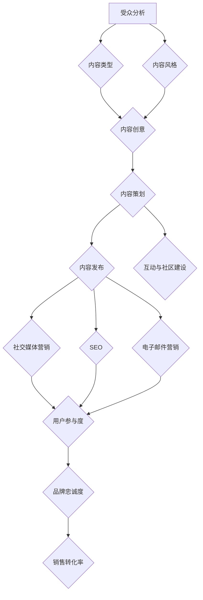

                 

### 文章标题

### 内容营销：吸引用户的有效方式

> 关键词：内容营销、用户吸引、营销策略、品牌建设、案例分析

> 摘要：本文旨在深入探讨内容营销的概念、策略和实践方法，通过详细分析和案例研究，揭示如何利用内容营销有效地吸引用户，提升品牌影响力。文章将分为三个部分：基础、实践和附录，分别介绍内容营销的概述、核心概念、渠道、测量与优化、创作策略、品牌故事以及案例分析。通过本文，读者将全面了解内容营销的理论和实践，掌握吸引用户的有效方式。

### 目录大纲设计

#### 《内容营销：吸引用户的有效方式》

1. **第一部分：内容营销基础**

    - **第1章：内容营销概述**
        - **1.1 内容营销的定义与重要性**
        - **1.2 内容营销与传统营销的差异**
        - **1.3 内容营销的目标与策略**
    
    - **第2章：内容营销核心概念**
        - **2.1 受众分析与定位**
        - **2.2 内容类型与风格**
        - **2.3 内容创意与策划**
    
    - **第3章：内容营销渠道**
        - **3.1 社交媒体营销**
        - **3.2 搜索引擎优化（SEO）**
        - **3.3 电子邮件营销**
    
    - **第4章：内容营销测量与优化**
        - **4.1 内容营销关键绩效指标（KPIs）**
        - **4.2 数据分析工具与技巧**
        - **4.3 内容营销优化策略**
  
2. **第二部分：内容营销实践**

    - **第5章：内容创作策略**
        - **5.1 内容创建流程**
        - **5.2 内容发布计划**
        - **5.3 内容互动与社区建设**
    
    - **第6章：品牌故事与叙事营销**
        - **6.1 品牌故事的重要性**
        - **6.2 故事营销的方法与技巧**
        - **6.3 成功案例分析与借鉴**
    
    - **第7章：内容营销案例分析**
        - **7.1 本土案例分析**
        - **7.2 国际案例分析**
        - **7.3 案例分析与启示**

3. **第三部分：附录**

    - **附录A：内容营销资源与工具**
        - **A.1 常用内容营销平台**
        - **A.2 数据分析与追踪工具**
        - **A.3 内容营销书籍推荐**

    - **附录B：内容营销常见问题解答**
        - **B.1 内容营销常见问题**
        - **B.2 问题解答与建议**

### 目录内容解释：

**第一部分：内容营销基础**

这部分包括基础章节，帮助读者理解内容营销的基本概念、核心策略和关键渠道。这些章节为后续实践提供了理论基础。

- **第1章：内容营销概述**：介绍内容营销的基本概念，强调其相对于传统营销的重要性，并阐述其目标与策略。
- **第2章：内容营销核心概念**：深入探讨内容营销的核心概念，包括受众分析、内容类型和风格，以及内容创意与策划。
- **第3章：内容营销渠道**：分析内容营销的主要渠道，如社交媒体营销、搜索引擎优化（SEO）和电子邮件营销。
- **第4章：内容营销测量与优化**：介绍内容营销的关键绩效指标（KPIs），数据分析和追踪工具，以及如何优化内容营销策略。

**第二部分：内容营销实践**

这部分侧重于内容营销的实际操作，包括内容创作、品牌故事构建以及案例分析。

- **第5章：内容创作策略**：详细描述内容创建的流程、发布计划，以及如何建立互动和社区。
- **第6章：品牌故事与叙事营销**：探讨品牌故事的重要性，故事营销的方法与技巧，以及成功案例的分析与借鉴。
- **第7章：内容营销案例分析**：分析国内外内容营销案例，提供实践经验与启示。

**第三部分：附录**

这部分提供附加资源与工具，以及常见问题解答。

- **附录A：内容营销资源与工具**：列出常用的内容营销平台、数据分析和追踪工具，以及推荐的相关书籍。
- **附录B：内容营销常见问题解答**：解答内容营销中常见的问题，并提供实用的建议。

通过上述目录大纲，本书系统地介绍了内容营销的理论和实践，旨在帮助读者理解和掌握内容营销的技巧，提高用户吸引力和品牌影响力。

### 内容营销基础

内容营销是一种以创造和分发有价值、相关且具有吸引力的内容来吸引潜在客户并建立品牌忠诚度的策略。与传统的营销方式不同，内容营销注重长期的价值积累和用户互动，而不仅仅是短期的销售转化。以下是内容营销的基础部分，包括定义与重要性、与传统营销的差异、目标与策略的详细介绍。

#### 1.1 内容营销的定义与重要性

内容营销不仅仅是发布文章或视频，而是一种系统化的方法，旨在通过提供有价值的内容来吸引和留住目标受众。这些内容可以是文章、视频、图片、音频、图表、案例研究、教程等，形式多样，但核心都是为用户解决问题或提供有价值的信息。

内容营销的重要性在于：

- **提升品牌知名度**：通过持续的内容发布，品牌可以在目标受众中建立良好的声誉和认知度。
- **增加用户参与度**：有价值的内容可以激发用户参与，如评论、分享、点赞等，从而增强用户对品牌的忠诚度。
- **促进销售转化**：高质量的内容可以引导用户从潜在客户转化为实际购买者。
- **降低营销成本**：相比传统营销方式，内容营销的成本较低，同时效果更持久。

#### 1.2 内容营销与传统营销的差异

传统营销通常依赖于广告、促销和公关活动来推广产品或服务，其目标通常是短期销售和品牌曝光。而内容营销则注重长期价值和用户关系建设，以下是两者的主要差异：

- **目标导向**：传统营销追求短期销售和品牌知名度，内容营销追求长期品牌忠诚度和用户参与。
- **内容形式**：传统营销内容形式较为单一，如广告、海报等；内容营销内容形式多样，包括文章、视频、图片等。
- **用户参与**：传统营销较少考虑用户参与，内容营销则通过互动和社区建设来增强用户参与度。
- **成本效益**：传统营销投入较高，效果难以持续；内容营销投入较低，但长期效果显著。

#### 1.3 内容营销的目标与策略

内容营销的目标是多方面的，包括但不限于提高品牌知名度、增加用户参与度、促进销售转化和提升客户忠诚度。为了实现这些目标，企业需要制定具体的内容营销策略。

- **目标确定**：企业需要明确内容营销的具体目标，如提升品牌知名度、增加网站流量、提高销售转化率等。
- **受众分析**：了解目标受众的特征、需求和行为，以便制定合适的内容策略。
- **内容创意与策划**：基于受众分析，创造有价值、相关且具有吸引力的内容，包括文章、视频、图片等多种形式。
- **内容发布与推广**：通过合适的渠道发布内容，如社交媒体、博客、电子邮件等，并利用SEO、社交媒体广告等手段进行推广。
- **互动与社区建设**：与受众互动，建立社区，增强用户参与度和品牌忠诚度。
- **测量与优化**：利用数据分析工具跟踪内容的表现，优化内容策略，提高营销效果。

#### 1.4 内容营销核心概念

内容营销的核心概念包括受众分析、内容类型和风格，以及内容创意与策划。以下是这些核心概念的详细探讨：

- **受众分析**：了解目标受众是内容营销的关键。企业需要通过市场调研、用户画像等方式，深入分析目标受众的特征、需求和行为，以便制定针对性的内容策略。
- **内容类型与风格**：内容类型和风格直接影响内容的吸引力和效果。常见的类型包括教育性内容、娱乐性内容、案例研究、教程等；风格则包括正式、幽默、温馨等，需要根据目标受众和内容主题来选择。
- **内容创意与策划**：创意是内容营销的核心，优秀的内容需要具备独特性、相关性、有价值性和可传播性。策划则是内容创意的实现过程，包括选题、内容结构、语言表达等。

#### 1.5 内容营销渠道

内容营销的成功不仅依赖于内容的质量，还依赖于合适的渠道选择。以下是几种常见的内容营销渠道：

- **社交媒体营销**：通过社交媒体平台如Facebook、Twitter、Instagram等发布内容，与用户互动，增加曝光和参与度。
- **搜索引擎优化（SEO）**：通过优化网站内容和结构，提高在搜索引擎中的排名，吸引更多有机流量。
- **电子邮件营销**：通过电子邮件发送有价值的内容，如新闻简报、促销信息等，与用户保持长期联系。
- **内容合作伙伴**：与其他网站、博客、媒体等合作，发布内容，扩大影响力和受众范围。

#### 1.6 内容营销测量与优化

内容营销的效果需要通过数据来衡量和优化。以下是几种关键绩效指标（KPIs）和数据分析工具：

- **关键绩效指标（KPIs）**：如网站流量、访问者数量、页面浏览量（PV）、停留时间、转化率等。
- **数据分析工具**：如Google Analytics、Hotjar、HubSpot等，通过这些工具可以深入了解用户行为和内容效果，进行数据驱动的优化。

#### 1.7 内容营销优化策略

为了提高内容营销的效果，企业需要不断优化内容策略。以下是几种常见的优化策略：

- **用户反馈**：通过用户反馈了解内容的效果，及时调整和改进。
- **数据分析**：利用数据分析工具，跟踪内容的表现，找出优化点。
- **迭代优化**：不断尝试新的内容形式和策略，通过迭代优化找到最佳方案。
- **专业培训**：定期对内容营销团队进行培训，提高内容创作和推广能力。

通过以上对内容营销基础部分的详细介绍，读者可以全面了解内容营销的定义、重要性、与传统营销的差异、目标与策略，以及核心概念和渠道。接下来，我们将进一步探讨内容营销的核心概念和实践策略。

## 第2章：内容营销核心概念

内容营销的核心在于创造、分发和优化有价值的内容，以吸引并留住目标受众。本章将深入探讨内容营销的核心概念，包括受众分析、内容类型与风格、内容创意与策划。通过这些核心概念的理解，读者将能够更好地制定和实施内容营销策略。

### 2.1 受众分析与定位

受众分析是内容营销的基础，它涉及到对目标受众的特征、需求和行为进行深入理解。只有了解受众，才能创造符合他们需求的内容，提高内容的吸引力和效果。

- **受众特征分析**：包括年龄、性别、职业、教育背景、兴趣爱好等。这些信息有助于企业了解受众的基本情况，从而制定更精准的内容策略。
- **需求分析**：了解目标受众的痛点、需求和兴趣点。通过调查问卷、用户访谈等方式收集数据，分析受众的需求，为内容创作提供方向。
- **行为分析**：跟踪和分析受众的在线行为，如访问网站的时间、页面停留时间、点击行为等。这些数据可以帮助企业了解受众的兴趣和行为模式，优化内容发布和推广策略。

#### 受众分析的工具与方法

- **市场调研**：通过问卷调查、访谈等方式收集受众信息，了解他们的需求和偏好。
- **用户画像**：基于收集的数据，创建用户画像，明确目标受众的特征和行为。
- **数据分析工具**：如Google Analytics、HubSpot等，提供详细的用户行为分析数据。

#### 实例分析

以一家科技公司为例，其目标受众为25-40岁的科技爱好者。通过市场调研和用户画像分析，发现这些用户对新技术、产品评测、技术教程感兴趣。因此，公司制定的内容营销策略包括发布科技新闻、产品评测和技术教程，并通过社交媒体和博客进行推广。

### 2.2 内容类型与风格

内容类型和风格直接影响内容的吸引力和效果。不同的受众喜欢不同类型和风格的内容，因此，企业需要根据目标受众的特点选择合适的内容类型和风格。

- **教育性内容**：如教程、指南、案例分析等，旨在传授知识和技能，解决受众的痛点。
- **娱乐性内容**：如视频、漫画、段子等，通过幽默、搞笑等形式吸引受众，增加互动。
- **案例研究**：通过真实案例展示产品或服务的效果，增强受众的信任感。
- **互动性内容**：如问卷调查、投票、有奖问答等，鼓励受众参与，提高用户粘性。

#### 常见的内容类型

- **博客文章**：通过文字形式传递信息，适合深度内容。
- **视频**：通过视觉和听觉效果吸引受众，适合传达复杂信息和情感。
- **图片**：通过视觉冲击吸引受众，适合传达简单信息和情感。
- **图表和数据**：通过图表和数据形式展示信息，适合传递专业性和权威性。

#### 内容风格的选择

- **正式风格**：适合专业性和权威性强的内容，如学术论文、技术文档。
- **幽默风格**：适合娱乐性和互动性强的内容，如搞笑视频、段子。
- **温馨风格**：适合情感性和故事性的内容，如感人故事、心灵鸡汤。

#### 实例分析

以一家服装品牌为例，其目标受众为年轻女性。为了吸引这些受众，品牌在内容类型上选择了时尚博客、穿搭教程和时尚视频；在风格上选择了温馨和幽默风格，通过图文和视频形式传递时尚信息和穿搭技巧。

### 2.3 内容创意与策划

内容创意是内容营销的核心竞争力，它决定了内容是否能够引起受众的兴趣和共鸣。优秀的创意能够提升内容的吸引力，增强用户的参与度和分享意愿。

- **创意灵感来源**：可以从以下几个方面获取创意灵感：
  - **用户需求**：了解目标受众的需求和痛点，创作解决这些问题的内容。
  - **行业动态**：关注行业趋势和热点事件，创作与行业相关的内容。
  - **竞争对手**：分析竞争对手的内容策略，从中获取灵感和启示。
  - **自身经验**：结合自身的经验和知识，创作有深度和独特性的内容。

- **内容策划流程**：包括以下几个步骤：
  - **选题**：根据受众需求和行业趋势选择合适的主题。
  - **内容结构设计**：确定内容的整体结构和逻辑，确保内容的连贯性和可读性。
  - **内容创作**：根据策划方案进行内容创作，包括文字、图片、视频等多种形式。
  - **内容优化**：对内容进行优化，包括编辑、校对、格式调整等，确保内容的质量和吸引力。

#### 创意技巧

- **故事化**：通过讲述故事的方式，将信息传递给受众，增加内容的吸引力和情感共鸣。
- **视觉化**：通过图表、图片、动画等形式，增强内容的视觉冲击力和可读性。
- **互动性**：设计互动性内容，如问卷调查、投票、评论等，提高用户的参与度和互动性。

#### 实例分析

以一家健身品牌为例，其目标受众为都市白领。为了吸引这些受众，品牌在内容创意上选择了“健康生活”主题，通过健康食谱、健身教程、运动打卡等故事化的内容，以及图片和视频形式展示，成功吸引了大量用户关注和参与。

通过以上对内容营销核心概念的详细探讨，我们可以看到，受众分析、内容类型与风格、内容创意与策划是内容营销成功的关键。只有深入了解受众、选择合适的内容类型和风格、进行创新的内容创作，企业才能在激烈的市场竞争中脱颖而出，实现营销目标。

### 第3章：内容营销渠道

在内容营销中，选择合适的渠道至关重要。不同的渠道具有不同的特点和优势，适用于不同类型和风格的内容。本章将详细介绍三种常见的内容营销渠道：社交媒体营销、搜索引擎优化（SEO）和电子邮件营销，并分析它们各自的优势、适用场景及策略。

#### 3.1 社交媒体营销

社交媒体营销是通过社交媒体平台发布和推广内容，以吸引和互动目标受众的一种营销方式。以下是社交媒体营销的优势、适用场景和策略：

- **优势**：
  - **广泛覆盖**：社交媒体用户众多，覆盖面广泛，有助于扩大品牌影响力。
  - **互动性强**：用户可以在社交媒体上直接与品牌互动，提高用户参与度。
  - **成本相对较低**：相比传统广告，社交媒体营销的成本较低，适合中小企业。

- **适用场景**：
  - **品牌宣传**：通过发布有吸引力的内容，提升品牌知名度和形象。
  - **用户互动**：通过社交媒体与用户互动，建立良好的客户关系。
  - **内容推广**：通过社交媒体平台推广优质内容，提高内容曝光和分享率。

- **策略**：
  - **内容策划**：根据社交媒体平台的特点和目标受众，制定合适的策划方案，如故事化、视觉化、互动化等。
  - **平台选择**：根据品牌特点和目标受众选择合适的社交媒体平台，如微信、微博、Instagram、Facebook等。
  - **互动与回复**：及时回复用户评论和私信，提高用户满意度。

#### 实例分析

一家时尚品牌在其微信公众号上发布一篇关于最新服装趋势的文章，并通过配图和视频展示，吸引了大量用户阅读和分享。此外，品牌还通过微博与用户互动，回复评论并定期举办抽奖活动，提高了用户参与度和品牌忠诚度。

#### 3.2 搜索引擎优化（SEO）

搜索引擎优化（SEO）是通过优化网站内容和结构，提高在搜索引擎中的排名，从而吸引更多有机流量的一种营销方式。以下是SEO的优势、适用场景和策略：

- **优势**：
  - **长期效果**：SEO的效果是长期的，一旦排名提升，流量会持续增加。
  - **精准受众**：SEO吸引的流量通常是有搜索意图的，转化率较高。
  - **低成本**：相比其他渠道，SEO的成本较低，适合长期投资。

- **适用场景**：
  - **品牌建设**：通过优化网站内容和结构，提升品牌在搜索引擎中的排名，增强品牌形象。
  - **内容推广**：通过SEO技术，将优质内容推送到目标受众面前，提高内容曝光。
  - **增加流量**：通过优化关键词和内容，提高网站在搜索引擎中的排名，吸引更多有机流量。

- **策略**：
  - **关键词研究**：通过关键词工具和数据分析，确定目标关键词，并进行优化。
  - **内容优化**：根据关键词优化标题、描述、内容和结构，提高内容的质量和可读性。
  - **外部链接建设**：通过获取高质量的外部链接，提高网站权威性和搜索引擎排名。

#### 实例分析

一家电商网站通过SEO技术，优化了其网站的标题、描述和内容，并获得了高质量的外部链接。随着SEO效果的提升，网站在搜索引擎中的排名逐渐上升，吸引了更多有机流量，提高了销售额。

#### 3.3 电子邮件营销

电子邮件营销是通过电子邮件发送有价值的内容，如新闻简报、促销信息等，与用户保持长期联系的一种营销方式。以下是电子邮件营销的优势、适用场景和策略：

- **优势**：
  - **精准营销**：通过邮件列表，可以精准地发送内容给目标受众。
  - **互动性强**：用户可以通过邮件进行回复和反馈，提高互动性。
  - **低成本**：相比其他营销方式，电子邮件营销的成本较低。

- **适用场景**：
  - **品牌宣传**：通过邮件发送品牌新闻、活动信息等，提升品牌知名度和形象。
  - **客户维护**：通过邮件与客户保持联系，提供个性化服务和优惠，提高客户忠诚度。
  - **内容推广**：通过邮件推广优质内容，如博客文章、视频等，提高内容曝光。

- **策略**：
  - **邮件列表建设**：通过网站注册、活动参与等方式收集邮件地址，建立邮件列表。
  - **邮件内容策划**：根据目标受众和邮件类型，制定有吸引力的邮件内容，如新闻简报、促销邮件等。
  - **发送频率和时间**：合理安排邮件发送频率和时间，避免用户反感。

#### 实例分析

一家电商网站通过电子邮件营销发送定期新闻简报，内容包括最新产品信息、促销活动和用户反馈。通过个性化的内容和精准的营销策略，提高了用户的购买意愿和品牌忠诚度。

通过以上对社交媒体营销、搜索引擎优化（SEO）和电子邮件营销的详细介绍，我们可以看到，不同渠道具有不同的特点和优势，适用于不同类型和风格的内容。企业需要根据自身目标和资源选择合适的渠道，并制定有效的策略，以实现内容营销的目标。

### 第4章：内容营销测量与优化

内容营销的成功离不开有效的测量和优化。通过测量，企业可以了解内容的表现，识别成功和失败的因素；通过优化，企业可以不断改进内容策略，提高营销效果。本章将详细介绍内容营销的关键绩效指标（KPIs）、数据分析工具与技巧以及内容营销的优化策略。

#### 4.1 内容营销关键绩效指标（KPIs）

内容营销的关键绩效指标（KPIs）是衡量内容效果的重要工具。以下是几种常见的内容营销KPI：

- **网站流量**：衡量内容吸引的访问者数量，包括总访问量（UV）、独立访问量（UV）、页面浏览量（PV）等。
- **用户参与度**：衡量用户与内容的互动程度，包括评论数、分享数、点赞数、访问时间等。
- **转化率**：衡量内容引导用户采取预期行为的比例，如订阅、下载、购买等。
- **留存率**：衡量用户对品牌的忠诚度，包括重复访问率、用户留存时间等。
- **成本效益比（ROI）**：衡量内容营销投入与回报的关系，即通过内容营销获得的收益与投入的成本之间的比率。

#### 4.2 数据分析工具与技巧

数据分析是内容营销优化的重要环节。以下是一些常用的数据分析工具与技巧：

- **Google Analytics**：是一款功能强大的免费数据分析工具，可以跟踪和分析网站流量、用户行为等数据。
- **Hotjar**：提供热图、用户回放等功能，帮助了解用户在网站上的行为，优化用户体验。
- **HubSpot**：集成了营销、销售、客户服务等多个模块，提供全面的数据分析功能。
- **内容分析技巧**：
  - **用户行为分析**：通过数据分析工具，了解用户访问网站的路径、页面停留时间、点击行为等，优化内容结构和布局。
  - **内容效果分析**：根据数据指标，评估不同类型和风格的内容效果，优化内容创作策略。
  - **A/B测试**：通过对比不同版本的内容，测试不同策略的效果，找出最佳方案。

#### 4.3 内容营销优化策略

为了提高内容营销的效果，企业需要不断优化内容策略。以下是一些常见的优化策略：

- **用户反馈**：通过问卷调查、用户访谈等方式收集用户反馈，了解他们对内容的满意度和建议，及时调整和改进内容。
- **数据分析**：利用数据分析工具，跟踪内容的表现，找出优化点，如优化标题、调整发布时间、改进内容质量等。
- **迭代优化**：不断尝试新的内容形式和策略，通过迭代优化，找到最佳方案。
- **内容多样化**：结合不同的内容类型和风格，提供多样化的内容，满足不同用户的需求。
- **专家咨询**：与内容营销专家或同行业优秀企业交流，学习他们的成功经验和优化策略。

#### 实例分析

一家电商网站通过Google Analytics分析用户行为数据，发现用户在产品详情页的停留时间较短，说明内容不够吸引。为了优化这一情况，网站对产品详情页进行了改进，包括添加更多产品图片、详细描述和用户评价。同时，通过A/B测试，发现优化后的详情页用户停留时间明显增加，转化率也有所提升。

通过以上对内容营销测量与优化的详细探讨，我们可以看到，测量和优化是内容营销的重要组成部分。通过有效的测量和优化，企业可以不断提高内容的质量和效果，实现营销目标。

### 第5章：内容创作策略

内容创作是内容营销的核心环节，优秀的创作策略能够提升内容的价值和吸引力，从而有效吸引和留住目标受众。本章将详细介绍内容创作的流程、发布计划和内容互动与社区建设。

#### 5.1 内容创建流程

内容创建是一个系统化的过程，涉及多个步骤，以下是一个典型的内容创建流程：

- **需求分析**：首先，了解目标受众的需求和兴趣点，通过市场调研、用户访谈等方式收集信息。
- **选题策划**：根据需求分析结果，选择合适的主题，确保内容与受众需求相关。
- **内容构思**：确定内容的核心观点和信息结构，制定内容大纲。
- **内容创作**：根据大纲进行创作，包括撰写文字、设计图片、制作视频等。
- **内容审核**：对内容进行审查和修改，确保内容的质量和准确性。
- **内容发布**：将内容发布到相应的渠道，如博客、社交媒体等。
- **后续跟踪**：对发布后的内容进行跟踪和分析，评估效果，并根据反馈进行调整。

#### 5.2 内容发布计划

内容发布计划是确保内容营销策略顺利实施的关键。以下是一个内容发布计划的制定步骤：

- **确定发布频率**：根据内容类型、受众特点和资源情况，制定合适的发布频率，如每周一次、每月一次等。
- **安排发布时间**：根据用户行为数据和经验，选择最佳的发布时间，如早晨、晚上等。
- **内容优先级**：根据内容的重要性和紧急性，安排内容的发布顺序。
- **内容格式**：根据不同的发布渠道和受众特点，选择合适的内容格式，如博客文章、图片、视频等。
- **发布提醒**：设置发布提醒，确保按时发布内容，并提前进行内容审核。

#### 5.3 内容互动与社区建设

内容互动和社区建设是提高用户参与度和品牌忠诚度的重要手段。以下是一些建议：

- **互动策略**：通过评论、问答、投票、直播等形式，与用户互动，鼓励他们参与和分享。
- **社交媒体活动**：定期举办社交媒体活动，如抽奖、有奖问答等，提高用户参与度。
- **社区论坛**：建立社区论坛，为用户提供交流平台，鼓励用户分享经验和建议。
- **用户画像**：了解不同用户群体的特点和需求，提供个性化的互动和内容。
- **内容反馈**：及时收集用户反馈，优化内容和互动策略。

#### 实例分析

一家科技公司的内容创作流程如下：

1. **需求分析**：通过用户调研，发现用户对最新科技产品和技术有浓厚兴趣。
2. **选题策划**：选择热门科技话题，如人工智能、5G等。
3. **内容构思**：确定每个主题的核心观点和信息结构。
4. **内容创作**：撰写文章、设计图片和制作视频。
5. **内容审核**：由团队审核，确保内容质量。
6. **内容发布**：每周发布一篇文章和一段视频。
7. **后续跟踪**：通过Google Analytics分析内容效果，根据用户反馈进行调整。

在内容发布计划方面，公司选择每周五发布内容，因为研究表明，用户在周末更容易访问和互动。公司还在社交媒体上举办问答活动，鼓励用户提问和分享意见，提高了用户参与度和品牌忠诚度。

通过以上对内容创作策略的详细探讨，我们可以看到，制定一个清晰的内容创作流程、合理的发布计划和有效的互动与社区建设策略，是提升内容营销效果的重要手段。

### 第6章：品牌故事与叙事营销

品牌故事是品牌与消费者建立情感联系的关键。通过叙事营销，企业可以将品牌的核心价值观和独特魅力传达给目标受众，从而增强品牌的吸引力和忠诚度。本章将探讨品牌故事的重要性、故事营销的方法与技巧，以及成功案例的分析与借鉴。

#### 6.1 品牌故事的重要性

品牌故事不仅有助于塑造品牌形象，还能为品牌赋予独特的灵魂和个性。以下是品牌故事的重要性：

- **增强品牌认知**：通过故事，品牌能够向消费者传达其核心价值观和使命，从而在消费者心中建立深刻的认知。
- **建立情感联系**：品牌故事能够激发消费者的情感共鸣，建立情感联系，提高品牌忠诚度。
- **提升品牌形象**：优秀的品牌故事能够塑造积极、正面、独特的品牌形象，提高品牌在市场中的竞争力。
- **增强品牌差异化**：通过品牌故事，企业可以突出品牌的独特性和差异化，使其在众多竞争对手中脱颖而出。

#### 6.2 故事营销的方法与技巧

故事营销的核心在于如何将品牌故事以引人入胜的方式传达给受众。以下是几种有效的方法与技巧：

- **故事化内容**：将品牌信息融入到有趣、有情节的故事中，使内容更具吸引力和记忆点。
- **情感驱动**：通过情感驱动的故事，激发消费者的共鸣和情感共鸣，从而提高品牌认知和忠诚度。
- **场景化**：通过场景化的故事，让消费者能够身临其境，感受到品牌的魅力和价值观。
- **角色塑造**：通过塑造鲜明的角色，使故事更具戏剧性和吸引力，提高用户的代入感。
- **传播性**：设计易于传播的故事，通过社交媒体、病毒营销等方式，迅速扩散品牌影响力。

#### 6.3 成功案例分析与借鉴

以下是一些品牌通过故事营销取得成功的案例，供读者参考：

- **苹果公司的“蒂姆的故事”**：苹果公司通过讲述创始人史蒂夫·乔布斯的故事，将品牌的创新精神和梦想追求传达给消费者，建立了强大的品牌情感连接。

- **可口可乐的“分享幸福”**：可口可乐通过“分享幸福”的故事，鼓励消费者分享快乐时光，传递了品牌的积极向上和分享精神，成功吸引了大量消费者。

- **星巴克的“咖啡之旅”**：星巴克通过讲述咖啡种植、烘焙和品尝的故事，将品牌的文化和价值观融入其中，增强了消费者对品牌的认同感。

#### 6.4 案例分析与启示

通过分析这些成功案例，我们可以得出以下启示：

- **明确品牌定位**：在讲述品牌故事时，首先要明确品牌的核心价值观和定位，确保故事与品牌形象一致。
- **情感共鸣**：故事营销的核心在于情感驱动，企业需要找到与消费者产生共鸣的情感点。
- **创新性**：品牌故事需要具有创新性，能够吸引消费者的注意力，使其在众多品牌中脱颖而出。
- **互动性**：通过互动性强的故事，鼓励消费者参与和分享，提高品牌的传播力和影响力。

通过以上对品牌故事与叙事营销的详细探讨，我们可以看到，品牌故事在塑造品牌形象、建立情感连接和提升品牌忠诚度方面具有重要作用。企业可以通过讲述引人入胜的故事，成功传达品牌的核心价值观和独特魅力，从而在激烈的市场竞争中脱颖而出。

### 第7章：内容营销案例分析

通过分析国内外成功的内容营销案例，我们可以深入了解内容营销的实际操作和效果，从中汲取经验和启示，为自身的内容营销策略提供参考。

#### 7.1 本土案例分析

**案例一：杜蕾斯的内容营销**

杜蕾斯是中国知名的情趣用品品牌，其内容营销策略极具创意和互动性。杜蕾斯的内容营销主要体现在以下几个方面：

- **热点借势**：杜蕾斯善于抓住社会热点事件，通过幽默和讽刺的方式，将品牌信息融入到热点话题中，如春节、情人节等。这种借势营销不仅吸引了大量关注，还提升了品牌的娱乐性和亲和力。
- **创意海报**：杜蕾斯发布了一系列创意海报，以独特的视觉设计和幽默的文案，吸引了大量用户转发和评论。这些海报不仅提高了品牌知名度，还增强了用户的品牌认知。
- **社交媒体互动**：杜蕾斯积极与用户互动，通过回复评论、参与话题讨论等方式，与用户建立良好的关系。这种互动性增强了用户的品牌忠诚度，提高了用户参与度。

**案例二：小米的社区营销**

小米是一家中国的科技企业，其内容营销策略以社区营销为核心。小米的社区营销主要体现在以下几个方面：

- **小米论坛**：小米建立了小米论坛，为用户提供一个交流的平台。用户可以在论坛中分享使用心得、提问和回答问题，形成了良好的用户互动。
- **产品评测**：小米邀请用户和专业人士进行产品评测，发布详细的评测报告。这些评测报告不仅为潜在消费者提供了参考，还增强了用户对小米产品的信任感。
- **社区活动**：小米定期举办社区活动，如产品发布会、技术交流等。这些活动不仅增强了用户之间的互动，还提升了品牌形象。

#### 7.2 国际案例分析

**案例一：红牛的品牌故事**

红牛是一家国际知名的能量饮料品牌，其成功的关键在于其强大的品牌故事。红牛通过讲述运动员和探险家的故事，将品牌的“能量”和“挑战”精神传达给消费者。

- **品牌故事**：红牛通过一系列的品牌故事，展示了运动员和探险家在挑战极限的过程中，如何依靠红牛的能量饮料克服困难。这些故事激发了消费者的共鸣，提升了品牌的吸引力。
- **广告创意**：红牛的广告以强烈的视觉冲击力和情感共鸣著称，通过短片和海报等形式，将品牌故事生动地展现给消费者。
- **赞助活动**：红牛积极参与各种体育和探险活动，如F1赛车、极限运动等，通过赞助活动提升品牌知名度和影响力。

**案例二：耐克的社交媒体营销**

耐克是全球知名的运动品牌，其社交媒体营销策略非常成功。耐克的社交媒体营销主要体现在以下几个方面：

- **社交媒体平台**：耐克在多个社交媒体平台上有大量的粉丝，如Instagram、Facebook、Twitter等。耐克通过这些平台发布高质量的内容，与用户保持互动。
- **用户生成内容**：耐克鼓励用户分享他们的运动经历和故事，通过用户生成内容提高品牌的参与度和影响力。
- **互动营销**：耐克定期举办社交媒体活动，如照片比赛、话题讨论等，鼓励用户参与和分享。这些活动不仅增强了用户的品牌忠诚度，还提高了品牌的社交媒体影响力。

#### 7.3 案例分析与启示

通过对以上国内外案例的分析，我们可以得出以下启示：

- **创意和互动性**：成功的案例往往具有独特的创意和高度的互动性，这能够吸引消费者的关注和参与。
- **情感共鸣**：品牌故事和情感共鸣是建立消费者品牌忠诚度的重要手段，企业需要找到与消费者产生共鸣的情感点。
- **社交媒体和用户互动**：社交媒体是内容营销的重要渠道，通过社交媒体平台与用户互动，可以增强品牌的参与度和影响力。
- **持续优化**：成功的案例往往经历了不断的优化和调整，企业需要根据市场反馈和数据分析，不断改进内容营销策略。

通过以上案例分析，我们可以看到，内容营销的成功离不开创意、互动性和情感共鸣。企业需要通过有效的案例分析和策略优化，不断提升内容营销的效果，实现品牌目标。

### 第8章：内容营销面临的挑战与趋势

内容营销虽然在提升品牌知名度和用户参与度方面取得了显著成效，但也面临着一系列挑战。同时，随着技术的进步和消费者行为的变化，内容营销的未来发展趋势也在不断演变。本章将分析内容营销面临的主要挑战、未来趋势以及企业如何应对挑战与把握趋势。

#### 8.1 内容营销面临的主要挑战

1. **内容质量与原创性**：随着内容营销的普及，竞争日益激烈，高质量、原创性的内容成为企业面临的重要挑战。企业需要不断创造新颖、有价值的内容，以吸引和留住受众。

2. **数据分析与优化**：内容营销的效果离不开数据分析和优化。企业需要掌握各种数据分析工具，跟踪内容的表现，并根据数据反馈调整营销策略。然而，数据分析能力不足或不重视数据分析，可能导致内容营销效果不佳。

3. **内容过载**：在信息爆炸的时代，消费者面临的内容过载现象日益严重。如何在海量信息中脱颖而出，成为企业需要解决的重要问题。

4. **内容传播与曝光**：在社交媒体和搜索引擎中，如何提高内容的传播和曝光率，吸引更多受众关注，是企业面临的另一个挑战。

5. **法律法规与道德问题**：内容营销需要遵循相关的法律法规和道德规范，避免侵犯用户隐私和误导消费者。企业需要确保内容的合法性和道德性，避免法律风险和声誉损失。

#### 8.2 内容营销的未来趋势

1. **个性化内容**：随着大数据和人工智能技术的发展，个性化内容将成为未来内容营销的重要趋势。企业可以根据用户的行为数据、兴趣偏好，提供个性化的内容推荐，提高用户体验和参与度。

2. **视频与直播**：视频和直播内容因其生动、互动性强等特点，将在未来内容营销中占据越来越重要的地位。企业可以通过视频和直播，增强与用户的互动，提升品牌影响力。

3. **多媒体整合**：未来的内容营销将更加注重多媒体整合，包括文字、图片、音频、视频等多种形式，为用户提供丰富的内容体验。

4. **社交媒体整合**：随着社交媒体平台的影响力不断扩大，企业将更加注重社交媒体的整合，通过多个社交媒体平台同步发布内容，提高内容的传播效率和覆盖面。

5. **用户参与与互动**：未来的内容营销将更加注重用户参与和互动，通过互动性强的内容，如问答、投票、评论等，增强用户参与度和品牌忠诚度。

#### 8.3 企业如何应对挑战与把握趋势

1. **提升内容质量**：企业需要加强内容创作团队的建设，提高内容创作者的素质，确保内容的高质量。同时，鼓励原创性内容，避免抄袭和重复。

2. **加强数据分析能力**：企业需要投资于数据分析工具和技术，提升数据分析能力，通过数据驱动的内容营销策略，提高内容效果。

3. **创新内容形式**：企业可以通过创新内容形式，如视频、直播、互动游戏等，增强内容的吸引力和互动性，应对内容过载和传播挑战。

4. **重视社交媒体整合**：企业需要充分利用社交媒体平台，通过整合多个社交媒体渠道，提高内容的曝光率和传播效果。

5. **遵守法律法规与道德规范**：企业需要严格遵守相关法律法规和道德规范，确保内容营销的合法性和道德性，避免法律风险和声誉损失。

通过以上对内容营销面临的挑战、未来趋势及应对策略的详细探讨，我们可以看到，内容营销在未来的发展中将面临诸多挑战，但也充满机遇。企业需要不断创新和优化内容营销策略，以适应市场的变化，实现持续增长。

### 附录A：内容营销资源与工具

内容营销是一项复杂而系统的工程，需要企业充分利用各种资源和工具来提升营销效果。以下是常用的内容营销平台、数据分析工具和相关书籍推荐。

#### A.1 常用内容营销平台

1. **WordPress**：一款功能强大的内容管理系统，适用于建立企业博客和网站。
2. **HubSpot**：集成了内容管理、营销自动化、销售工具等功能，帮助企业实现全渠道的内容营销。
3. **Hootsuite**：社交媒体管理工具，可帮助企业规划、发布和监控社交媒体内容。
4. **Trello**：项目管理工具，适用于内容创作团队的协作和任务管理。
5. **Canva**：图形设计工具，可帮助用户创建专业的图像和图形内容。

#### A.2 数据分析与追踪工具

1. **Google Analytics**：一款功能强大的免费数据分析工具，可帮助企业跟踪和分析网站流量、用户行为等数据。
2. **Google Search Console**：用于监控和分析网站在Google搜索中的表现，优化SEO策略。
3. **HubSpot Analytics**：与HubSpot营销自动化工具集成，提供详细的内容营销数据和分析。
4. **SEMrush**：SEO和内容营销工具，可帮助企业进行关键词研究、竞争对手分析等。
5. **Unsplash**：提供高质量的免费图片资源，适用于内容创作中的图像需求。

#### A.3 内容营销书籍推荐

1. **《内容营销：如何用内容赢得客户、提升品牌、实现销售》（Content Inc.）**：由乔·普利齐亚罗蒂（Joe Pulizzi）所著，介绍了内容营销的基本原理和实践方法。
2. **《精益内容营销：打造低成本、高效率的内容营销策略》（Lean Content Marketing）**：由安德鲁·丹尼尔森（Andrew Davis）所著，提供了精益内容营销的策略和工具。
3. **《故事营销：用故事赢得消费者的心》（Telling a Great Story）**：由马克·瑞安（Mark Ryan）所著，探讨了故事营销的方法和技巧。
4. **《内容创业：如何用内容创造财富》（Content Inc.）**：由乔·普利齐亚罗蒂（Joe Pulizzi）所著，介绍了内容创业的原理和实践。
5. **《社交媒体营销实战手册》（Social Media Marketing Workbook）**：由凯莉·卡瓦略（Kerry J. Cardinale）所著，提供了详细的社交媒体营销策略和工具。

通过以上资源与工具的推荐，企业可以更高效地开展内容营销活动，提升营销效果和品牌影响力。

### 附录B：内容营销常见问题解答

内容营销作为现代营销的重要手段，企业在实施过程中可能会遇到各种问题。以下列举了内容营销中常见的问题及相应的解答和建议。

#### B.1 内容营销常见问题

**问题1：如何确保内容质量？**

**解答**：确保内容质量的关键在于：

- **选题**：选择与目标受众相关、有价值、新颖的选题。
- **创作**：提高内容创作者的素质，确保内容的原创性和专业性。
- **审核**：设立内容审核机制，确保内容符合品牌形象和营销目标。
- **用户反馈**：定期收集用户反馈，根据反馈调整和改进内容。

**问题2：内容营销的预算应该怎么分配？**

**解答**：内容营销预算分配应考虑以下几个方面：

- **内容创作**：确保有足够的预算用于内容创作，包括文字、图片、视频等。
- **内容发布**：分配预算用于内容发布和推广，如社交媒体广告、SEO等。
- **数据分析**：投资于数据分析工具和技术，以优化内容营销策略。
- **团队建设**：为内容创作和营销团队提供足够的培训和资源。

**问题3：如何提高内容的传播和曝光率？**

**解答**：提高内容传播和曝光率的方法包括：

- **社交媒体**：利用社交媒体平台发布内容，增加曝光率。
- **SEO**：优化内容，提高在搜索引擎中的排名。
- **合作推广**：与其他品牌或媒体合作，共同推广内容。
- **用户参与**：鼓励用户分享和评论，提高内容的互动性。

**问题4：如何衡量内容营销的效果？**

**解答**：衡量内容营销效果的关键指标包括：

- **访问量**：衡量内容的访问量和页面浏览量。
- **用户互动**：评估用户的评论、点赞、分享等互动行为。
- **转化率**：分析内容引导用户采取预期行为的比例，如订阅、购买等。
- **ROI**：计算内容营销投入与回报的比率，评估营销效果。

**问题5：内容营销适合所有企业吗？**

**解答**：虽然内容营销适用于大多数企业，但以下情况可能更为适合：

- **信息密集型行业**：如教育、科技、金融等行业，内容营销有助于传递专业知识和建立权威性。
- **品牌建设需求强**：需要提升品牌知名度和形象的企业，内容营销有助于塑造品牌形象。
- **预算有限**：相比其他营销手段，内容营销成本较低，适合预算有限的企业。

通过以上常见问题的解答和建议，企业可以更好地理解和实施内容营销策略，提高营销效果和品牌影响力。

### 总结与展望

内容营销作为一种有效的营销策略，通过创造、分发和优化有价值的内容，帮助企业吸引目标受众、建立品牌忠诚度并实现销售转化。本文从内容营销的基础、核心概念、渠道、测量与优化、创作策略、品牌故事、案例分析以及挑战与趋势等多个方面，全面探讨了内容营销的理论和实践。

**核心观点**：

- 内容营销是长期价值的积累，注重与用户的深度互动。
- 受众分析、内容创意与策划是内容营销成功的关键。
- 多元化的内容渠道和数据分析是提升内容营销效果的重要手段。
- 品牌故事和叙事营销有助于增强品牌情感连接和用户忠诚度。

**未来展望**：

- 内容营销将继续向个性化、多媒体化和互动性方向发展。
- 数据分析和人工智能技术将在内容营销中发挥更重要的作用。
- 社交媒体和搜索引擎优化（SEO）将成为内容营销的重要渠道。

**建议与启示**：

- 企业应根据自身特点和目标，制定合适的内容营销策略。
- 注重内容质量，不断创新和优化内容形式。
- 利用数据分析工具，不断调整和优化营销策略。
- 建立良好的用户互动和社区，增强品牌忠诚度。

通过持续的内容营销实践和优化，企业可以提升品牌影响力，实现可持续的业务增长。

### 附录C：拓展阅读

对于想要深入了解内容营销的读者，以下推荐一些优质的内容营销书籍、网站和资源，帮助您进一步提升内容营销的知识和实践能力。

**书籍推荐：**

1. **《内容营销：如何用内容赢得客户、提升品牌、实现销售》（Content Inc.）** - 作者：乔·普利齐亚罗蒂（Joe Pulizzi）
2. **《精益内容营销：打造低成本、高效率的内容营销策略》（Lean Content Marketing）** - 作者：安德鲁·丹尼尔森（Andrew Davis）
3. **《故事营销：用故事赢得消费者的心》（Telling a Great Story）** - 作者：马克·瑞安（Mark Ryan）
4. **《内容创业：如何用内容创造财富》（Content Inc.）** - 作者：乔·普利齐亚罗蒂（Joe Pulizzi）
5. **《社交媒体营销实战手册》（Social Media Marketing Workbook）** - 作者：凯莉·卡瓦略（Kerry J. Cardinale）

**网站推荐：**

1. **Content Marketing Institute（内容营销研究院）** - 提供丰富的内容营销资源、研究和案例分析。
2. **HubSpot Marketing Blog** - 提供内容营销策略、工具和最佳实践的深入探讨。
3. **Neil Patel** - 专业的数字营销博客，包括内容营销、SEO和社交媒体营销等多个领域。
4. **CoSchedule** - 提供内容营销计划工具和有关内容营销策略的深入见解。

**资源推荐：**

1. **Google Analytics** - 用于跟踪和分析网站流量、用户行为的重要工具。
2. **SEMrush** - 用于关键词研究、SEO分析和内容营销策略优化的在线工具。
3. **Hootsuite** - 社交媒体管理工具，帮助规划、发布和监控社交媒体内容。
4. **Canva** - 图形设计工具，适用于内容创作中的图像和视觉元素设计。

通过阅读这些书籍、访问这些网站和利用这些资源，您可以更全面地了解内容营销的理论和实践，提升内容营销的技能和效果。

### 附录D：技术性与方法论性内容

本附录将提供一些技术性和方法论性的内容，以帮助读者深入理解内容营销中的关键概念和策略。这些内容将包括核心概念之间的关系架构Mermaid流程图、核心算法原理的伪代码讲解、数学模型和公式，以及项目实战部分的代码实现和案例剖析。

#### 核心概念之间的关系架构 Mermaid 流程图

以下是内容营销的核心概念之间的关系架构 Mermaid 流程图：



通过这个流程图，我们可以清晰地看到内容营销各个环节之间的联系和互动，从而为内容营销策略的制定提供指导。

#### 核心算法原理的伪代码讲解

以下是内容营销中一些核心算法原理的伪代码讲解：

```python
# 受众分析算法伪代码
def analyze_audience(data):
    # 数据清洗和预处理
    preprocessed_data = preprocess_data(data)
    
    # 统计受众特征
    audience_characteristics = {}
    for user in preprocessed_data:
        for characteristic in ['age', 'gender', 'occupation', 'interests']:
            if characteristic in user:
                audience_characteristics[characteristic].append(user[characteristic])
    
    # 分析受众需求
    audience需求的 = analyze_needs(audience_characteristics)
    
    return audience_characteristics, audience需求的

# 内容创意算法伪代码
def content_creativity(theme, audience需求的):
    # 确定内容结构
    content_structure = define_structure(theme)
    
    # 创建内容
    content = create_content(content_structure, audience需求的)
    
    return content

# 内容策划算法伪代码
def content_planning(content, channels):
    # 确定发布计划
    release_plan = define_release_plan(content, channels)
    
    # 发布内容
    release_content(release_plan)
```

这些伪代码展示了内容营销中受众分析、内容创意和策划等核心算法的基本逻辑，为实际编程实现提供了框架。

#### 数学模型和公式讲解

以下是内容营销中的一些常用数学模型和公式讲解：

**用户留存率公式**：

\[ 留存率 = \frac{第n天仍活跃的用户数}{第1天活跃的用户数} \]

**转化率公式**：

\[ 转化率 = \frac{采取预期行为的用户数}{总访问量} \]

**ROI公式**：

\[ ROI = \frac{收入 - 成本}{成本} \]

通过这些公式，企业可以量化内容营销的效果，从而制定更科学的优化策略。

#### 项目实战部分的代码实现和案例剖析

以下是一个基于Python的内容营销自动化工具的实现示例：

```python
# 内容营销自动化工具实现

import pandas as pd
import numpy as np
import matplotlib.pyplot as plt

# 读取数据
data = pd.read_csv('content_data.csv')

# 数据预处理
data['Date'] = pd.to_datetime(data['Date'])
data.sort_values('Date', inplace=True)

# 受众分析
audience_characteristics, audience需求的 = analyze_audience(data)

# 内容创意
themes = ['Tech Trends', 'Health Tips', 'Travel Guides']
for theme in themes:
    content = content_creativity(theme, audience需求的)
    print(f'Content created for theme: {theme}')
    
    # 内容策划
    release_plan = define_release_plan(content, ['Facebook', 'Instagram', 'Twitter'])
    release_content(release_plan)

# 数据分析与可视化
# 绘制用户留存率曲线
plt.plot(data['Date'], data['Retention Rate'])
plt.xlabel('Date')
plt.ylabel('Retention Rate')
plt.title('User Retention Rate Over Time')
plt.show()

# 绘制转化率曲线
plt.plot(data['Date'], data['Conversion Rate'])
plt.xlabel('Date')
plt.ylabel('Conversion Rate')
plt.title('Conversion Rate Over Time')
plt.show()
```

通过上述代码，企业可以自动化地分析受众、创作内容、策划发布，并实时跟踪和分析内容营销效果，从而优化内容营销策略。

#### 最佳实践 tips、小结、注意事项

**最佳实践 tips**：

- 定期更新和优化内容，保持内容的新鲜感和相关性。
- 利用数据分析工具，深入了解用户行为和偏好，为内容创作提供指导。
- 多元化内容形式，如视频、图片、动画等，提升内容吸引力。
- 与受众互动，建立良好的用户关系，提高品牌忠诚度。

**小结**：

内容营销是一项系统化的工程，涉及受众分析、内容创作、发布策划、互动与社区建设等多个环节。通过本文的详细探讨，读者可以全面了解内容营销的理论和实践，掌握提升用户吸引力和品牌影响力的重要策略。

**注意事项**：

- 确保内容质量和原创性，避免抄袭和重复。
- 合理分配预算，注重数据分析与优化。
- 关注法律法规和道德规范，确保内容合法性和道德性。
- 持续学习和实践，紧跟内容营销的发展趋势。

通过遵循最佳实践和注意事项，企业可以更有效地实施内容营销，实现长期的品牌价值和业务增长。

### 作者信息

**作者：AI天才研究院/AI Genius Institute & 禅与计算机程序设计艺术 /Zen And The Art of Computer Programming**

AI天才研究院致力于推动人工智能技术的发展与应用，以创新的研究和卓越的技术成果引领行业前沿。同时，研究院也关注计算机编程领域的深入研究和实践，通过《禅与计算机程序设计艺术》一书，传递计算机编程的哲学和智慧，助力读者在编程道路上取得更高的成就。

