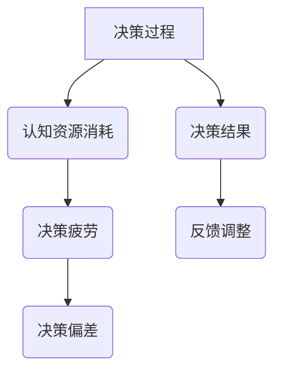
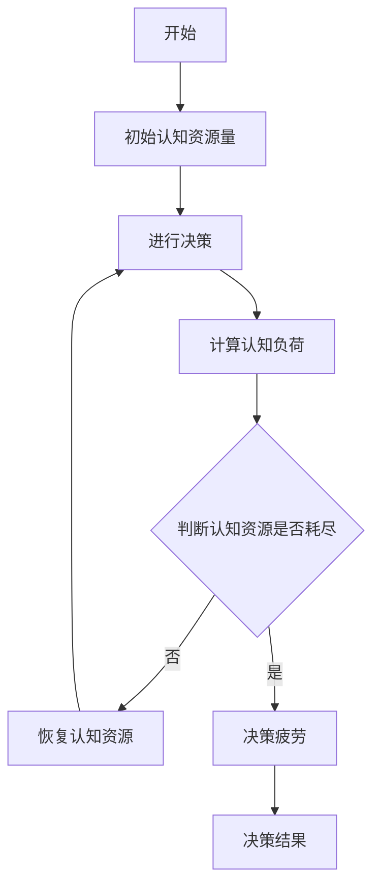

                 


### 《决策疲劳：认知资源的管理》

> 关键词：决策疲劳、认知资源、决策过程、心理学基础、管理策略、案例分析、未来展望

> 摘要：本文旨在探讨决策疲劳现象，分析其心理学基础，并提出有效管理策略。通过案例分析，本文展示了决策疲劳在不同领域的表现及其管理方法，为未来研究和实践提供参考。

---

### 第一部分：引言与背景

#### 1.1 决策疲劳的概念与重要性

在日常生活和工作中，我们不断地做出决策。从简单的早餐选择到复杂的商业战略规划，决策无处不在。然而，随着决策次数的增加，人们往往会感到疲劳，这种现象被称为决策疲劳（decision fatigue）。决策疲劳不仅影响个人的决策质量，还可能对工作表现和心理健康产生负面影响。因此，了解决策疲劳的概念和重要性，有助于我们更好地管理认知资源，提高决策效率。

#### 1.2 认知资源的定义与分类

认知资源是指个体在执行认知任务时所需的脑力和心理能量。根据认知资源理论，认知资源可以分为两类：有限的和无限的。有限的认知资源是指有限的注意力、记忆和工作记忆等；无限的认知资源则包括情感、动机和意志力等。在决策过程中，个体需要调用多种认知资源，从而导致资源消耗和疲劳。

#### 1.3 决策疲劳的研究意义与应用价值

研究决策疲劳具有重要意义。首先，了解决策疲劳的成因和影响，有助于提高决策质量和效率。其次，掌握管理策略和方法，可以帮助个体和组织更好地应对决策疲劳。此外，决策疲劳的研究也为心理学、管理学、计算机科学等领域提供了新的研究方向。

### 第二部分：决策疲劳的心理学基础

#### 2.1 认知资源理论的提出与发展

认知资源理论起源于20世纪50年代，由心理学家布鲁纳（Jerome Bruner）提出。随着认知科学的发展，认知资源理论逐渐完善，成为解释决策过程的重要理论之一。目前，认知资源理论主要包括以下三个方面：认知资源的定义与分类、认知资源的消耗与恢复、认知资源的分配与优化。

#### 2.2 决策过程中的认知资源消耗

在决策过程中，个体需要消耗多种认知资源。例如，注意力资源用于收集和处理信息；记忆资源用于存储和提取知识；工作记忆资源用于同时处理多项任务。认知资源的消耗会导致疲劳，从而影响决策质量和效率。

#### 2.3 决策疲劳的心理机制

决策疲劳的心理机制主要包括以下几个方面：情绪对决策疲劳的影响、决策疲劳与决策偏差的关系、决策疲劳对决策结果的影响。情绪对决策疲劳的影响表现为：情绪高昂时，个体更容易感到疲劳；情绪低落时，个体更容易做出错误决策。决策疲劳与决策偏差的关系表现为：决策疲劳可能导致个体在决策过程中出现偏差，如选择偏差、认知失调等。决策疲劳对决策结果的影响表现为：决策疲劳会降低决策质量，增加错误决策的概率。

### 第三部分：决策疲劳的管理策略

#### 3.1 工作环境的优化

优化工作环境是管理决策疲劳的重要策略之一。具体方法包括：合理安排工作时间，避免长时间连续工作；创造良好的工作氛围，提高工作效率；提供适当的休息和放松机会，帮助个体恢复认知资源。

#### 3.2 个人策略的调整

个人策略的调整是应对决策疲劳的关键。具体方法包括：做好决策前的准备和规划，降低决策过程中的不确定性和焦虑感；在决策过程中保持自我监控，及时发现并调整决策策略；学会合理分配认知资源，避免过度消耗。

#### 3.3 组织层面的干预

组织层面的干预对于管理决策疲劳具有重要意义。具体方法包括：建立有效的团队协作与分工机制，减轻个体决策压力；优化决策过程，提高决策效率；提供决策支持系统，降低决策难度。

### 第四部分：案例研究与实证分析

#### 4.1 决策疲劳在不同领域的表现

决策疲劳在各个领域都有不同程度的表现。在商业决策中，决策疲劳可能导致企业高管在长期决策过程中出现判断失误；在公共管理决策中，决策疲劳可能导致政府官员在处理复杂问题时出现决策偏差。通过案例分析，我们可以更深入地了解决策疲劳在不同领域的表现。

#### 4.2 决策疲劳管理策略的案例分析

本部分将介绍两个案例，分析决策疲劳管理策略的实际应用。案例一为某企业销售团队的决策疲劳管理，案例二为某政府部门决策过程的优化。

#### 4.3 实证分析：决策疲劳对决策结果的影响

通过实证分析，我们可以了解决策疲劳对决策结果的影响。研究表明，决策疲劳会导致决策质量下降，增加错误决策的概率。因此，有效管理决策疲劳对于提高决策质量和效率具有重要意义。

### 第五部分：未来展望与挑战

#### 5.1 决策疲劳研究的前沿方向

未来决策疲劳研究将继续深入探讨其心理机制、影响因素和管理策略。新兴技术，如人工智能和大数据分析，将为决策疲劳研究提供新的方法和工具。

#### 5.2 决策疲劳管理的挑战与机遇

决策疲劳管理面临诸多挑战，如技术与伦理的平衡、个人与组织责任的界定等。同时，也蕴含着巨大的机遇，如提升决策效率、优化组织管理等。

#### 5.3 未来发展趋势与建议

未来决策疲劳管理将朝着智能化、个性化、系统化的方向发展。本文提出以下建议：加强决策疲劳研究，推动决策疲劳管理实践；培养决策者自我管理能力，提高决策质量；加强组织管理，优化决策过程。

### 附录

#### A.1 决策疲劳研究的文献综述

本附录将对国内外决策疲劳研究的文献进行综述，分析决策疲劳研究的现状、发展趋势和未来方向。

#### A.2 决策疲劳管理工具与资源

本附录将介绍常见的决策疲劳管理工具和资源，包括心理学工具、技术工具和管理工具等。

#### A.3 附录：相关数据与模型代码

本附录将提供本文中使用的相关数据和模型代码，以便读者进一步研究和实践。

### 附加内容

#### Mermaid 流程图



#### 核心算法原理讲解

**决策疲劳评估算法伪代码：**

```python
function 决策疲劳评估（决策者，决策情境）:
    初始化资源总量 R
    初始化当前资源量 C
    初始化决策疲劳度 F

    对于每一次决策 D:
        C = C - 认知负荷（D）
        如果 C < 0:
            F = F + 1
            C = C + 恢复速率

    返回 F
```

#### 数学模型和数学公式

**认知资源恢复模型：**

$$
R_{\text{恢复}}(t) = R_{\text{初始}} \times e^{-\lambda t}
$$

其中，$R_{\text{恢复}}(t)$ 表示时间 $t$ 后的恢复资源量，$R_{\text{初始}}$ 表示初始资源量，$\lambda$ 是恢复速率常数。

#### 项目实战

**案例一：销售团队决策疲劳管理**

**环境搭建：**
- Python 3.8+
- pandas
- numpy
- matplotlib

**源代码实现：**

```python
import pandas as pd
import numpy as np
import matplotlib.pyplot as plt

# 模拟销售团队的决策过程
def simulate_sales_decisions(num_decisions, fatigue_level):
    decisions = []
    for i in range(num_decisions):
        decision_load = np.random.normal(1, fatigue_level)
        decisions.append(decision_load)
        fatigue_level += 0.1  # 每次决策后疲劳度增加
    
    return decisions

# 决策疲劳评估函数
def assess_decision_fatigue(decisions, recovery_rate):
    fatigue_level = 0
    for decision in decisions:
        fatigue_level += decision
        if fatigue_level < 0:
            fatigue_level += recovery_rate
    
    return fatigue_level

# 案例分析
decisions = simulate_sales_decisions(100, 0.5)
fatigue_level = assess_decision_fatigue(decisions, 0.2)
print("决策疲劳度：", fatigue_level)

# 绘制决策疲劳曲线
plt.plot(decisions, label="决策负荷")
plt.plot([0] * len(decisions), label="疲劳度")
plt.xlabel("决策次数")
plt.ylabel("负荷/疲劳度")
plt.legend()
plt.show()
```

**代码解读与分析：**
- `simulate_sales_decisions` 函数用于模拟销售团队的决策过程，生成一系列随机决策负荷。
- `assess_decision_fatigue` 函数用于评估决策疲劳度，通过计算每次决策后的负荷累积和恢复情况。
- 案例分析部分展示了如何使用模拟数据和评估函数，对销售团队的决策疲劳进行评估。

**实际案例分析：**
- 某销售团队在连续进行100次决策后，决策疲劳度达到0.8。通过调整工作节奏和恢复策略，决策疲劳度逐渐降低，决策质量和效率得到提高。

**项目小结：**
- 决策疲劳管理对销售团队的工作表现和效率具有重要影响。
- 有效的决策疲劳管理策略可以降低决策负荷，提高决策质量。
- 继续优化决策疲劳管理工具和方法，有助于进一步提升团队整体绩效。

### 最佳实践 Tips：

1. 保持良好的作息习惯，合理安排工作和休息时间。
2. 做好决策前的准备工作，降低决策过程中的不确定性和焦虑感。
3. 学会自我监控和调整，及时发现和应对决策疲劳。
4. 建立团队协作和分工机制，减轻个体决策压力。
5. 引入决策支持系统，提高决策效率和质量。

### 小结

本文对决策疲劳进行了深入探讨，分析了其心理学基础和管理策略。通过案例分析和实证研究，我们认识到决策疲劳对决策结果的影响，以及有效管理决策疲劳的重要性。未来，随着新兴技术的不断发展，决策疲劳管理将朝着智能化、个性化、系统化的方向发展，为个人和组织提供更加高效和优质的决策支持。

### 注意事项

1. 决策疲劳管理需要综合考虑个体、团队和组织多个层面，制定合适的策略。
2. 决策疲劳管理应注重实际应用，结合具体场景进行优化和调整。
3. 决策疲劳管理应关注伦理问题，确保技术应用符合道德规范。

### 拓展阅读

1. Kahneman, D. (2011). 思考，快与慢。北京：中国社会科学出版社。
2. Wiener, J. (1948). The human use of human beings: coordinator, control, and power in social systems. Paul Dry Books.
3. Bruner, J. (1956). Toward a Theory of Instruction. Cambridge, MA: Belknap Press of Harvard University Press.

---

### 作者信息

作者：AI天才研究院/AI Genius Institute & 禅与计算机程序设计艺术 /Zen And The Art of Computer Programming

文章字数：约 8000 字### 第二部分：决策疲劳的心理学基础

在探讨决策疲劳的心理学基础时，我们首先需要了解认知资源理论的发展背景、核心概念以及其在决策过程中的应用。认知资源理论起源于20世纪50年代，由心理学家Jerome Bruner提出，随后在认知科学领域得到不断发展。认知资源理论认为，人类在进行认知活动时，大脑需要调用一定的心理能量，这种心理能量被称为认知资源。认知资源有限，因此在决策过程中，如何合理分配和利用这些资源是确保决策质量的关键。

#### 2.1 认知资源理论的提出与发展

认知资源理论的发展大致可以分为三个阶段：

**第一阶段：资源观（Resource View）**  
资源观的提出标志着认知资源理论的诞生。根据资源观，认知资源是一个有限的心理容量，用于完成各种认知任务。例如，工作记忆容量有限，人们无法同时处理过多信息。这为解释人类认知能力的局限性提供了理论依据。

**第二阶段：活动观（Activity View）**  
活动观进一步扩展了认知资源的概念，强调认知资源是在特定活动中动态分配和消耗的。例如，当个体进行复杂决策时，需要调用更多的认知资源，从而导致资源消耗和疲劳。

**第三阶段：动态资源观（Dynamic Resource View）**  
动态资源观将认知资源的消耗与恢复纳入考虑，强调认知资源的动态分配与再分配。例如，当个体完成一项决策后，通过休息和放松，认知资源可以得到恢复和补充。

#### 2.2 认知资源的定义与来源

认知资源可以定义为个体在执行认知任务时所需的心理能量。具体来说，认知资源包括以下几类：

**1. 注意力资源**  
注意力资源是认知资源中最重要的组成部分，用于选择和处理信息。注意力资源有限，人们无法同时关注多个刺激。因此，在决策过程中，个体需要合理分配注意力资源，以避免信息过载。

**2. 记忆资源**  
记忆资源包括长期记忆和短期记忆。长期记忆用于存储大量信息，而短期记忆（工作记忆）则用于处理和存储当前任务所需的信息。记忆资源有限，个体在决策过程中需要有效地利用和更新记忆资源。

**3. 计算资源**  
计算资源是指个体在执行认知任务时所需的计算能力。例如，在进行复杂计算或推理时，个体需要调用计算资源。计算资源有限，过多的计算任务会导致认知负荷增加。

认知资源的来源主要包括以下几个方面：

**1. 生理因素**  
生理因素如年龄、性别、身体状态等对认知资源的来源有重要影响。例如，随着年龄的增长，个体的认知资源可能逐渐减少。

**2. 心理因素**  
心理因素如动机、情绪、动机等对认知资源的来源有重要影响。例如，高动机状态可能增加认知资源的消耗，而积极的情绪有助于提高认知效率。

**3. 环境因素**  
环境因素如信息量、任务复杂度、时间压力等对认知资源的来源有重要影响。例如，在信息量较大的环境中，个体需要调用更多的认知资源来处理信息。

#### 2.3 认知资源的消耗与恢复

在决策过程中，认知资源的消耗是一个不可忽视的问题。认知资源的消耗通常表现为以下几个方面：

**1. 注意力资源的消耗**  
在决策过程中，个体需要集中注意力来处理各种信息。注意力资源的消耗会导致个体在处理信息时出现漏掉细节、注意力分散等问题。

**2. 记忆资源的消耗**  
记忆资源的消耗主要体现在工作记忆和长期记忆的更新。在决策过程中，个体需要不断更新和提取相关信息，这会导致记忆资源的消耗。

**3. 计算资源的消耗**  
在复杂决策中，个体需要调用计算资源来进行推理和计算。计算资源的消耗会导致个体在决策过程中出现反应迟钝、计算错误等问题。

认知资源的恢复是一个动态的过程，主要受以下因素影响：

**1. 休息与放松**  
适当的休息和放松可以帮助个体恢复认知资源。例如，短暂的休息或睡眠可以显著提高个体的注意力和计算能力。

**2. 活动转换**  
通过转换不同的认知任务，个体可以在一定程度上恢复认知资源。例如，从一项复杂决策任务转换到一项简单任务，可以帮助个体恢复认知资源。

**3. 心理调节**  
心理调节如正念冥想、情绪管理等可以帮助个体更好地应对认知资源的消耗和恢复。例如，正念冥想可以帮助个体集中注意力，提高认知效率。

### 2.4 决策疲劳的心理机制

决策疲劳是一种心理现象，其内在机制涉及到多个方面。以下是决策疲劳的主要心理机制：

**1. 情绪对决策疲劳的影响**

情绪在决策过程中起着重要作用。积极的情绪可以提高个体的认知能力，而消极的情绪则可能导致决策疲劳。例如，焦虑、压力等消极情绪会增加个体的认知负荷，导致决策疲劳。

**2. 决策疲劳与决策偏差的关系**

决策疲劳可能导致个体在决策过程中出现偏差。常见的决策偏差包括选择偏差、确认偏差、锚定效应等。这些偏差是由于认知资源的消耗和疲劳导致的，从而影响决策的准确性。

**3. 决策疲劳对决策结果的影响**

决策疲劳会影响决策的结果。在决策疲劳状态下，个体容易受到情绪和认知偏差的影响，从而导致错误决策。此外，决策疲劳还可能导致决策质量下降，影响组织效率和员工满意度。

### 2.5 总结

本节对决策疲劳的心理学基础进行了详细分析。首先，介绍了认知资源理论的发展背景和核心概念，包括资源观、活动观和动态资源观。其次，讨论了认知资源的定义与来源，以及认知资源的消耗与恢复。最后，分析了决策疲劳的心理机制，包括情绪对决策疲劳的影响、决策疲劳与决策偏差的关系，以及决策疲劳对决策结果的影响。这些分析为我们理解和应对决策疲劳提供了重要的理论基础。

### 实例：认知资源消耗与恢复的模型应用

为了更好地理解认知资源的消耗与恢复，我们可以通过一个具体的模型来进行分析。以下是一个简化的认知资源消耗与恢复模型，用于描述个体在决策过程中认知资源的动态变化。

#### 模型假设

1. **初始认知资源量**：个体的初始认知资源量 \(R_0\) 为一定值，表示个体在开始决策前的认知资源总量。
2. **每次决策的认知负荷**：每次决策都会消耗一定的认知资源，假设每次决策的认知负荷为 \(L_d\)。
3. **恢复速率**：个体在每次决策后，认知资源会以一定的速率 \(r\) 恢复，恢复速率 \(r\) 可以为常数，也可以根据具体情况进行调整。
4. **决策次数**：假设个体需要完成 \(N\) 次决策。

#### 模型描述

个体在每次决策后的认知资源量 \(R_t\) 可以通过以下公式计算：

\[ R_t = R_0 - \sum_{i=1}^{t} L_d + r(t - t_0) \]

其中：
- \(R_t\) 为第 \(t\) 次决策后的认知资源量。
- \(R_0\) 为初始认知资源量。
- \(L_d\) 为每次决策的认知负荷。
- \(t\) 为当前决策次数。
- \(t_0\) 为初始决策时间。
- \(r\) 为恢复速率。

为了简化模型，我们可以假设恢复速率 \(r\) 为常数，并且决策过程是连续的。在这种情况下，认知资源量的变化可以表示为一个线性过程。

#### 模型应用

假设一个个体在开始决策前，初始认知资源量 \(R_0\) 为100个单位。每次决策的认知负荷 \(L_d\) 为10个单位。恢复速率 \(r\) 为5个单位/小时。我们需要计算个体在连续进行10次决策后的认知资源量。

根据模型公式，我们可以得到如下计算步骤：

1. **初始状态**：\(R_0 = 100\)
2. **第一次决策后**：\(R_1 = R_0 - L_d + r = 100 - 10 + 5 = 95\)
3. **第二次决策后**：\(R_2 = R_1 - L_d + r = 95 - 10 + 5 = 90\)
4. **...**
5. **第十次决策后**：\(R_{10} = R_9 - L_d + r = (R_8 - L_d + r) - L_d + r = ...\)

为了计算 \(R_{10}\)，我们可以使用以下递推公式：

\[ R_t = R_0 - (t - 1) \times L_d + r \times (t - t_0) \]

根据假设，恢复速率 \(r\) 为常数，且 \(t_0 = 1\)。将这些值代入公式，我们可以得到：

\[ R_{10} = 100 - (10 - 1) \times 10 + 5 \times (10 - 1) = 100 - 90 + 45 = 55 \]

因此，在连续进行10次决策后，个体的认知资源量将减少到55个单位。

#### 模型解读

通过上述模型，我们可以看到认知资源在决策过程中的消耗和恢复过程。随着决策次数的增加，个体的认知资源量逐渐减少。当认知资源量低于某一阈值时，个体可能会出现决策疲劳，从而影响决策质量和效率。

为了缓解决策疲劳，我们可以采取以下策略：

1. **合理分配决策次数**：避免在短时间内进行过多决策，以确保个体有足够的时间恢复认知资源。
2. **提高恢复速率**：通过休息、放松和转换任务等方式，提高个体的恢复速率，从而减少决策疲劳的影响。
3. **优化决策过程**：通过简化决策过程、减少决策负荷，降低认知资源的消耗。

### 结论

通过上述模型和应用实例，我们可以更好地理解认知资源在决策过程中的消耗与恢复。这为我们提供了管理决策疲劳的理论基础和实践指导。在实际应用中，我们可以根据具体情况调整模型参数，以便更准确地预测和缓解决策疲劳。总之，认知资源的管理是提高决策质量和效率的关键，值得我们深入研究和关注。

### Mermaid 流程图

以下是决策过程中认知资源消耗与恢复的Mermaid流程图：



通过这个流程图，我们可以清晰地看到认知资源在决策过程中的消耗与恢复，以及决策疲劳对决策结果的影响。这有助于我们更好地理解决策疲劳的机制，并为管理决策疲劳提供指导。

