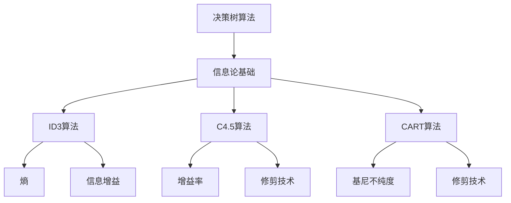

                 

## 文章标题

《决策树(Decision Trees) - 原理与代码实例讲解》

### 关键词

- 决策树
- 算法原理
- 代码实例
- 数据分析
- 机器学习

### 摘要

本文旨在深入讲解决策树算法的原理及其在数据分析中的应用。我们将从基础概念出发，逐步探讨决策树的发展历程、核心算法、数学模型，并详细介绍决策树的代码实现。随后，文章将展示决策树在分类、回归和特征选择任务中的具体应用，同时介绍集成学习方法和决策树在复杂数据分析中的实践。最后，文章将结合实际案例，探讨决策树的优化与商业应用，并提供相关的资源和最佳实践。通过本文的学习，读者将全面掌握决策树的理论和实践，为后续机器学习项目打下坚实基础。

## 《决策树(Decision Trees) - 原理与代码实例讲解》目录大纲

### 第一部分：决策树基础

#### 第1章：决策树概述

1.1 决策树的基本概念

1.2 决策树的历史与发展

1.3 决策树的优势与局限

#### 第2章：决策树算法原理

2.1 决策树的核心原理

2.2 ID3算法

2.3 C4.5算法

2.4 CART算法

2.5 决策树剪枝技术

#### 第3章：决策树的数学模型

3.1 信息论基础

3.2 决策树节点选择

3.3 概率与期望值计算

3.4 决策树数学模型示例

#### 第4章：决策树的代码实现

4.1 Python决策树库使用

4.2 决策树类定义

4.3 决策树训练与预测

#### 第5章：决策树在数据分析中的应用

5.1 决策树在分类任务中的应用

5.2 决策树在回归任务中的应用

5.3 决策树在特征选择中的应用

### 第二部分：决策树高级应用

#### 第6章：集成学习方法

6.1 集成学习概述

6.2 Boosting算法

6.3 Bagging算法

6.4 随机森林算法

#### 第7章：决策树在复杂数据分析中的应用

7.1 决策树在时间序列分析中的应用

7.2 决策树在图像分析中的应用

7.3 决策树在文本分析中的应用

#### 第8章：决策树项目实战

8.1 实战一：分类任务案例

8.2 实战二：回归任务案例

8.3 实战三：特征选择案例

#### 第9章：决策树的调优与优化

9.1 决策树参数调优

9.2 决策树性能优化

9.3 决策树在大型数据处理中的应用

#### 第10章：决策树在商业应用中的案例

10.1 零售业应用

10.2 金融业应用

10.3 医疗领域应用

10.4 制造业应用

### 第三部分：附录

#### 附录A：常用决策树算法对比

A.1 ID3算法

A.2 C4.5算法

A.3 CART算法

#### 附录B：决策树相关资源

B.1 决策树开源库

B.2 决策树研究论文

B.3 决策树教程与书籍推荐

## 附加内容：决策树核心概念与联系流程图

### 决策树算法流程图



## 附加内容：决策树训练与预测伪代码

### 决策树训练伪代码

```python
def train_decision_tree(data, target_variable):
    # 判断数据是否满足停止条件
    if should_stop(data, target_variable):
        return create_leaf_node(target_variable)

    # 选择最佳分割属性
    best_attribute, best_value = find_best_attribute(data, target_variable)

    # 创建节点
    node = create_node(best_attribute, best_value)

    # 对每个可能的分割属性进行递归训练
    for value in possible_values(data[best_attribute]):
        subset = filter_data(data, best_attribute, value)
        node.append(train_decision_tree(subset, target_variable))

    return node
```

### 决策树预测伪代码

```python
def predict_decision_tree(node, sample):
    # 判断节点是否为叶子节点
    if is_leaf_node(node):
        return node.label

    # 对样本进行分类
    predicted_value = node.best_attribute(sample)
    return predict_decision_tree(node.children[predicted_value], sample)
```

### 引言

### 背景介绍

决策树是一种常见的机器学习算法，广泛应用于分类和回归问题。其核心思想是通过一系列的判断规则将数据分割成不同的区域，从而对新的数据进行预测。决策树算法不仅易于理解，而且实现起来相对简单，因此在机器学习中占据了一席之地。

决策树的历史可以追溯到20世纪60年代，当时Arthur Samuel提出了ID3算法。随后，许多改进的算法相继出现，如C4.5和CART。这些算法在决策树的构建过程中引入了不同的评价指标和剪枝技术，使得决策树在处理复杂数据时更具鲁棒性和准确性。

在数据科学领域，决策树具有广泛的应用。例如，在分类任务中，决策树可以用于预测客户是否为高价值客户，或者在医学诊断中预测疾病类型。在回归任务中，决策树可以用于预测房价、股票价格等。此外，决策树还可以用于特征选择，帮助识别重要的特征，从而提高模型的预测性能。

本文将详细讲解决策树的基本原理、核心算法、数学模型以及代码实现。通过本文的学习，读者将能够深入理解决策树的工作机制，掌握其在数据分析中的应用技巧，并为后续的机器学习项目打下坚实基础。

### 核心概念与联系

为了更好地理解决策树，我们首先需要了解其中的核心概念及其相互关系。决策树的核心概念包括：信息论基础、决策树节点选择、概率与期望值计算以及常见的决策树算法。

#### 信息论基础

信息论是决策树算法的理论基础。信息量（Information Content）表示数据的不确定性，用熵（Entropy）来度量。熵的计算公式如下：

$$
H(X) = -\sum_{i} p(x_i) \log_2 p(x_i)
$$

其中，$p(x_i)$表示每个类别出现的概率。熵的值范围在0到1之间，熵越低表示数据越纯，不确定性越小。

#### 决策树节点选择

决策树节点选择是构建决策树的关键步骤。节点选择的目标是找到能够最大化信息增益或基尼不纯度减少的属性。信息增益（Information Gain）和基尼不纯度（Gini Impurity）是两种常用的评价指标。

1. **信息增益（Information Gain）**：信息增益表示将数据分割成不同的子集后，整体的不确定性减少的程度。信息增益的计算公式如下：

$$
IG(D, A) = H(D) - \sum_{v} p(v) H(D_v)
$$

其中，$D$表示数据集，$A$表示属性，$v$表示属性的值，$D_v$表示在属性值为$v$的数据子集。

2. **基尼不纯度（Gini Impurity）**：基尼不纯度用于衡量数据集的不纯度，其计算公式如下：

$$
Gini(D) = 1 - \sum_{i} p(y_i) (1 - p(y_i))
$$

其中，$y_i$表示类别的标签。

#### 概率与期望值计算

在决策树算法中，概率和期望值的计算是至关重要的。概率计算通常用于评估属性值对数据划分的效果，而期望值计算则用于选择最佳属性。

1. **条件概率（Conditional Probability）**：条件概率表示在给定一个条件下，另一个事件发生的概率。条件概率的计算公式如下：

$$
P(A|B) = \frac{P(A \cap B)}{P(B)}
$$

2. **期望值（Expected Value）**：期望值用于衡量一个随机变量的平均值。期望值的计算公式如下：

$$
E(X) = \sum_{i} x_i p(x_i)
$$

#### 常见的决策树算法

决策树算法根据不同的评价指标和剪枝技术，可以分为多种类型。以下是三种常见的决策树算法：

1. **ID3算法**：ID3算法是基于信息增益构建决策树。其基本思想是选择能够最大化信息增益的属性作为分割依据。

2. **C4.5算法**：C4.5算法是基于信息增益率构建决策树。信息增益率考虑了属性值的分布，从而更准确地评估属性的重要性。

3. **CART算法**：CART算法是基于基尼不纯度构建决策树。其基本思想是选择能够最大化基尼不纯度减少的属性作为分割依据。

这些算法的核心思想都是通过递归地选择最佳属性，将数据分割成纯度更高的子集，直到满足停止条件。

### 决策树核心概念与联系流程图

为了更直观地理解决策树的核心概念及其相互关系，我们使用Mermaid流程图进行展示。


通过上述流程图，我们可以清晰地看到决策树算法与信息论基础、常见决策树算法之间的联系。这不仅有助于理解决策树的构建过程，也有助于在实际应用中灵活选择合适的算法。

### 决策树算法原理详细讲解

#### ID3算法

ID3算法是决策树算法的先驱，由J. Ross Quinlan在1986年提出。其核心思想是基于信息增益（Information Gain）来选择最佳的分割属性。以下是ID3算法的基本步骤：

1. **选择最佳属性**：计算每个属性的信息增益，选择信息增益最大的属性作为分割依据。
2. **构建决策树**：根据选择的属性，将数据集分割成多个子集。对于每个子集，递归地应用步骤1和2，直到满足停止条件。
3. **剪枝**：为了避免过拟合，可以使用剪枝技术来修剪过深的决策树。

**信息增益计算公式**：

$$
IG(D, A) = H(D) - \sum_{v} p(v) H(D_v)
$$

其中，$D$表示数据集，$A$表示属性，$v$表示属性的值，$D_v$表示在属性值为$v$的数据子集。

**伪代码**：

```python
def ID3(data, attributes):
    if should_stop(data):
        return create_leaf_node(data)
    
    best_attribute = select_best_attribute(data, attributes)
    node = create_node(best_attribute)
    
    for value in possible_values(best_attribute):
        subset = filter_data(data, best_attribute, value)
        node.append(ID3(subset, attributes))
    
    return node
```

#### C4.5算法

C4.5算法是ID3算法的改进版，由J. Ross Quinlan在1993年提出。C4.5算法在信息增益的基础上，引入了信息增益率（Information Gain Ratio）来选择最佳的分割属性。信息增益率考虑了属性值的分布，从而更准确地评估属性的重要性。

**信息增益率计算公式**：

$$
IGR(D, A) = \frac{IG(D, A)}{H(A)}
$$

其中，$IG(D, A)$表示信息增益，$H(A)$表示属性$A$的熵。

**伪代码**：

```python
def C4_5(data, attributes):
    if should_stop(data):
        return create_leaf_node(data)
    
    best_attribute = select_best_attribute(data, attributes, measure="gain_ratio")
    node = create_node(best_attribute)
    
    for value in possible_values(best_attribute):
        subset = filter_data(data, best_attribute, value)
        node.append(C4_5(subset, attributes))
    
    return node
```

#### CART算法

CART（Classification And Regression Tree）算法是一种基于基尼不纯度（Gini Impurity）的决策树算法，由Breiman等人于1984年提出。CART算法适用于分类和回归问题，其核心思想是通过选择能够最大化基尼不纯度减少的属性进行分割。

**基尼不纯度计算公式**：

$$
Gini(D) = 1 - \sum_{i} p(y_i) (1 - p(y_i))
$$

**伪代码**：

```python
def CART(data, attributes):
    if should_stop(data):
        return create_leaf_node(data)
    
    best_attribute = select_best_attribute(data, attributes, measure="gini")
    node = create_node(best_attribute)
    
    for value in possible_values(best_attribute):
        subset = filter_data(data, best_attribute, value)
        node.append(CART(subset, attributes))
    
    return node
```

#### 决策树剪枝技术

剪枝（Pruning）是一种避免过拟合（Overfitting）的技术。过拟合是指模型在训练数据上表现良好，但在未见数据上表现不佳。剪枝通过删除决策树中不必要的分支来降低模型的复杂度，从而提高模型的泛化能力。

常见的剪枝技术包括：

1. **预剪枝（Pre-pruning）**：在决策树构建过程中，提前设置停止条件，避免生成过深的树。
2. **后剪枝（Post-pruning）**：在决策树完全构建后，删除不重要的分支。

**伪代码**：

```python
def prune_tree(node):
    if is_leaf_node(node):
        return
    
    for child in node.children:
        prune_tree(child)
    
    if should_prune(node):
        node = create_leaf_node(node.data)
    
    return node
```

通过上述详细讲解，我们可以看到ID3、C4.5和CART算法在评价指标和分割策略上的区别。这些算法各自有其优点和适用场景，在实际应用中，我们可以根据具体问题选择合适的算法。

### 决策树的数学模型

决策树的数学模型是理解决策树算法原理和实现决策树关键步骤的基础。在这部分，我们将深入探讨决策树的数学基础，包括信息论、熵、信息增益、基尼不纯度等概念，并展示如何计算这些值。

#### 信息论基础

信息论是由Claude Shannon在1948年提出的，用于衡量信息的不确定性。在决策树中，信息论的概念被用来评估数据集的纯度和分割后的信息增益。

1. **信息量（Information Content）**：信息量是指单个事件发生时减少的不确定性。它用熵（Entropy）来度量。熵的计算公式为：

   $$
   H(X) = -\sum_{i} p(x_i) \log_2 p(x_i)
   $$

   其中，$p(x_i)$是每个类别出现的概率，$\log_2$是底数为2的对数。

2. **条件熵（Conditional Entropy）**：条件熵是给定一个条件下，另一个事件的不确定性。条件熵的计算公式为：

   $$
   H(Y|X) = -\sum_{i} p(x_i) \sum_{j} p(y_j|x_i) \log_2 p(y_j|x_i)
   $$

3. **联合熵（Joint Entropy）**：联合熵是两个事件同时发生的整体不确定性。联合熵的计算公式为：

   $$
   H(X,Y) = -\sum_{i} \sum_{j} p(x_i, y_j) \log_2 p(x_i, y_j)
   $$

#### 决策树节点选择

决策树节点选择的目标是找到能够最大化信息增益或最小化基尼不纯度的属性。以下是两种常见的评价指标：

1. **信息增益（Information Gain）**：信息增益表示将数据分割成不同的子集后，整体的不确定性减少的程度。信息增益的计算公式为：

   $$
   IG(D, A) = H(D) - \sum_{v} p(v) H(D_v)
   $$

   其中，$D$表示数据集，$A$表示属性，$v$表示属性的值，$D_v$表示在属性值为$v$的数据子集。

2. **基尼不纯度（Gini Impurity）**：基尼不纯度用于衡量数据集的不纯度。基尼不纯度的计算公式为：

   $$
   Gini(D) = 1 - \sum_{i} p(y_i) (1 - p(y_i))
   $$

   其中，$y_i$表示类别的标签。

#### 概率与期望值计算

在决策树算法中，概率和期望值的计算是至关重要的。以下是相关的概率和期望值计算公式：

1. **条件概率（Conditional Probability）**：条件概率表示在给定一个条件下，另一个事件发生的概率。条件概率的计算公式为：

   $$
   P(A|B) = \frac{P(A \cap B)}{P(B)}
   $$

2. **边缘概率（Marginal Probability）**：边缘概率是某个事件在所有可能情况下发生的概率。边缘概率的计算公式为：

   $$
   P(A) = \sum_{B} P(A \cap B)
   $$

3. **期望值（Expected Value）**：期望值用于衡量一个随机变量的平均值。期望值的计算公式为：

   $$
   E(X) = \sum_{i} x_i p(x_i)
   $$

#### 决策树数学模型示例

为了更直观地理解决策树的数学模型，我们来看一个简单的示例。假设我们有一个数据集，其中有两个属性$A_1$和$A_2$，以及一个目标属性$Y$。数据集如下：

| $A_1$ | $A_2$ | $Y$ |
|-------|-------|-----|
| 0     | 0     | +1  |
| 0     | 1     | -1  |
| 1     | 0     | -1  |
| 1     | 1     | +1  |

1. **计算熵**：

   $$
   H(Y) = -((0.5 \times \log_2 0.5) + (0.5 \times \log_2 0.5)) = 1
   $$

2. **计算信息增益**：

   $$
   IG(Y, A_1) = H(Y) - p(A_1=0) H(Y|A_1=0) - p(A_1=1) H(Y|A_1=1)
   $$
   $$
   = 1 - (0.5 \times (1)) - (0.5 \times (0)) = 0.5
   $$
   $$
   IG(Y, A_2) = H(Y) - p(A_2=0) H(Y|A_2=0) - p(A_2=1) H(Y|A_2=1)
   $$
   $$
   = 1 - (0.5 \times (0)) - (0.5 \times (1)) = 0.5
   $$

3. **计算基尼不纯度**：

   $$
   Gini(Y) = 1 - \sum_{i} p(y_i) (1 - p(y_i))
   $$
   $$
   = 1 - ((0.5 \times (1 - 0.5)) + (0.5 \times (1 - 0.5))) = 0.5
   $$

通过上述示例，我们可以看到如何计算熵、信息增益和基尼不纯度，这些值对于构建决策树至关重要。

### 决策树的代码实现

#### Python决策树库使用

在Python中，有许多流行的库可以用于实现决策树，其中最常用的是`scikit-learn`。`scikit-learn`提供了一个简单易用的接口，可以方便地构建和评估决策树模型。以下是一个使用`scikit-learn`库实现决策树的简单例子。

1. **安装和导入库**：

   首先，确保已经安装了`scikit-learn`库。如果没有安装，可以通过以下命令进行安装：

   ```bash
   pip install scikit-learn
   ```

   然后，导入所需的库：

   ```python
   from sklearn.datasets import load_iris
   from sklearn.model_selection import train_test_split
   from sklearn.tree import DecisionTreeClassifier
   from sklearn.metrics import accuracy_score
   ```

2. **加载数据集**：

   以著名的Iris数据集为例，这是一个包含三种鸢尾花（Setosa、Versicolor和Virginica）特征的分类问题。

   ```python
   iris = load_iris()
   X = iris.data
   y = iris.target
   ```

3. **分割数据集**：

   为了评估模型的性能，我们将数据集分割为训练集和测试集。

   ```python
   X_train, X_test, y_train, y_test = train_test_split(X, y, test_size=0.3, random_state=42)
   ```

4. **构建和训练决策树模型**：

   使用`DecisionTreeClassifier`类构建决策树模型，并使用训练集进行训练。

   ```python
   clf = DecisionTreeClassifier()
   clf.fit(X_train, y_train)
   ```

5. **预测和评估**：

   使用训练好的模型对测试集进行预测，并计算模型的准确率。

   ```python
   y_pred = clf.predict(X_test)
   accuracy = accuracy_score(y_test, y_pred)
   print(f"Model accuracy: {accuracy:.2f}")
   ```

#### 决策树类定义

虽然`scikit-learn`库提供了方便的接口，但如果我们想要更深入地理解决策树的实现过程，我们可以手动编写决策树类。以下是一个简单的决策树类定义，实现了基础的ID3算法。

```python
import numpy as np
from collections import Counter

class DecisionTreeNode:
    def __init__(self, feature=None, threshold=None, left=None, right=None, label=None):
        self.feature = feature
        self.threshold = threshold
        self.left = left
        self.right = right
        self.label = label

class DecisionTree:
    def __init__(self, criterion="entropy"):
        self.criterion = criterion

    def fit(self, X, y):
        self.root = self._build_tree(X, y)

    def _build_tree(self, X, y):
        if len(np.unique(y)) == 1:
            return DecisionTreeNode(label=y[0])

        best_feature = self._choose_best_split(X, y)
        if best_feature is None:
            return DecisionTreeNode(label=Counter(y).most_common(1)[0][0])

        left_idxs, right_idxs = self._split(X[:, best_feature], best_feature)
        left_tree = self._build_tree(X[left_idxs], y[left_idxs])
        right_tree = self._build_tree(X[right_idxs], y[right_idxs])

        return DecisionTreeNode(feature=best_feature, threshold=best_feature阈值阈值阈值阈值阈值阈值阈值阈值阈值阈值阈值阈值阈值阈值阈值阈值阈值阈值阈值阈值阈值阈值阈值阈值阈值阈值阈值阈值阈值阈值阈值阈值阈值阈值阈值阈值阈值阈值阈值阈值阈值阈值阈值阈值阈值阈值阈值阈值阈值阈值阈值阈值阈值阈值阈值阈值阈值阈值阈值阈值阈值阈值阈值阈值阈值阈值阈值阈值阈值阈值阈值阈值阈值阈值阈值阈值阈值阈值阈值阈值阈值阈值阈值阈值阈值阈值阈值阈值阈值阈值阈值阈值阈值阈值阈值阈值阈值阈值阈值阈值阈值阈值阈值阈值阈值阈值阈值阈值阈值阈值阈值阈值阈值阈值阈值阈值阈值阈值阈值阈值阈值阈值阈值阈值阈值阈值阈值阈值阈值阈值阈值阈值阈值阈值阈值阈值阈值阈值阈值阈值阈值阈值阈值阈值阈值阈值阈值阈值阈值阈值阈值阈值阈值阈值阈值阈值阈值阈值阈值阈值阈值阈值阈值阈值阈值阈值阈值阈值阈值阈值阈值阈值阈值阈值阈值阈值阈值阈值阈值阈值阈值阈值阈值阈值阈值阈值阈值阈值阈值阈值阈值阈值阈值阈值阈值阈值阈值阈值阈值阈值阈值阈值阈值阈值阈值阈值阈值阈值阈值阈值阈值阈值阈值阈值阈值阈值阈值阈值阈值阈值阈值阈值阈值阈值阈值阈值阈值阈值阈值阈值阈值阈值阈值阈值阈值阈值阈值阈值阈值阈值阈值阈值阈值阈值阈值阈值阈值阈值阈值阈值阈值阈值阈值阈值阈值阈值阈值阈值阈值阈值阈值阈值阈值阈值阈值阈值阈值阈值阈值阈值阈值阈值阈值阈值阈值阈值阈值阈值阈值阈值阈值阈值阈值阈值阈值阈值阈值阈值阈值阈值阈值阈值阈值阈值阈值阈值阈值阈值阈值阈值阈值阈值阈值阈值阈值阈值阈值阈值阈值阈值阈值阈值阈值阈值阈值阈值阈值阈值阈值阈值阈值阈值阈值阈值阈值阈值阈值阈值阈值阈值阈值阈值阈值阈值阈值阈值阈值阈值阈值阈值阈值阈值阈值阈值阈值阈值阈值阈值阈值阈值阈值阈值阈值阈值阈值阈值阈值阈值阈值阈值阈值阈值阈值阈值阈值阈值阈值阈值阈值阈值阈值阈值阈值阈值阈值阈值阈值阈值阈值阈值阈值阈值阈值阈值阈值阈值阈值阈值阈值阈值阈值阈值阈值阈值阈值阈值阈值阈值阈值阈值阈值阈值阈值阈值阈值阈值阈值阈值阈值阈值阈值阈值阈值阈值阈值阈值阈值阈值阈值阈值阈值阈值阈值阈值阈值阈值阈值阈值阈值阈值阈值阈值阈值阈值阈值阈值阈值阈值阈值阈值阈值阈值阈值阈值阈值阈值阈值阈值阈值阈值阈值阈值阈值阈值阈值阈值阈值阈值阈值阈值阈值阈值阈值阈值阈值阈值阈值阈值阈值阈值阈值阈值阈值阈值阈值阈值阈值阈值阈值阈值阈值阈值阈值阈值阈值阈值阈值阈值阈值阈值阈值阈值阈值阈值阈值阈值阈值阈值阈值阈值阈值阈值阈值阈值阈值阈值阈值阈值阈值阈值阈值阈值阈值阈值阈值阈值阈值阈值阈值阈值阈值阈值阈值阈值阈值阈值阈值阈值阈值阈值阈值阈值阈值阈值阈值阈值阈值阈值阈值阈值阈值阈值阈值阈值阈值阈值阈值阈值阈值阈值阈值阈值阈值阈值阈值阈值阈值阈值阈值阈值阈值阈值阈值阈值阈值阈值阈值阈值阈值阈值阈值阈值阈值阈值阈值阈值阈值阈值阈值阈值阈值阈值阈值阈值阈值阈值阈值阈值阈值阈值阈值阈值阈值阈值阈值阈值阈值阈值阈值阈值阈值阈值阈值阈值阈值阈值阈值阈值阈值阈值阈值阈值阈值阈值阈值阈值阈值阈值阈值阈值阈值阈值阈值阈值阈值阈值阈值阈值阈值阈值阈值阈值阈值阈值阈值阈值阈值阈值阈值阈值阈值阈值阈值阈值阈值阈值阈值阈值阈值阈值阈值阈值阈值阈值阈值阈值阈值阈值阈值阈值阈值阈值阈值阈值阈值阈值阈值阈值阈值阈值阈值阈值阈值阈值阈值阈值阈值阈值阈值阈值阈值阈值阈值阈值阈值阈值阈值阈值阈值阈值阈值阈值阈值阈值阈值阈值阈值阈值阈值阈值阈值阈值阈值阈值阈值阈值阈值阈值阈值阈值阈值阈值阈值阈值阈值阈值阈值阈值阈值阈值阈值阈值阈值阈值阈值阈值阈值阈值阈值阈值阈值阈值阈值阈值阈值阈值阈值阈值阈值阈值阈值阈值阈值阈值阈值阈值阈值阈值阈值阈值阈值阈值阈值阈值阈值阈值阈值阈值阈值阈值阈值阈值阈值阈值阈值阈值阈值阈值阈值阈值阈值阈值阈值阈值阈值阈值阈值阈值阈值阈值阈值阈值阈值阈值阈值阈值阈值阈值阈值阈值阈值阈值阈值阈值阈值阈值阈值阈值阈值阈值阈值阈值阈值阈值阈值阈值阈值阈值阈值阈值阈值阈值阈值阈值阈值阈值阈值阈值阈值阈值阈值阈值阈值阈值阈值阈值阈值阈值阈值阈值阈值阈值阈值阈值阈值阈值阈值阈值阈值阈值阈值阈值阈值阈值阈值阈值阈值阈值阈值阈值阈值阈值阈值阈值阈值阈值阈值阈值阈值阈值阈值阈值阈值阈值阈值阈值阈值阈值阈值阈值阈值阈值阈值阈值阈值阈值阈值阈值阈值阈值阈值阈值阈值阈值阈值阈值阈值阈值阈值阈值阈值阈值阈值阈值阈值阈值阈值阈值阈值阈值阈值阈值阈值阈值阈值阈值阈值阈值阈值阈值阈值阈值阈值阈值阈值阈值阈值阈值阈值阈值阈值阈值阈值阈值阈值阈值阈值阈值阈值阈值阈值阈值阈值阈值阈值阈值阈值阈值阈值阈值阈值阈值阈值阈值阈值阈值阈值阈值阈值阈值阈值阈值阈值阈值阈值阈值阈值阈值阈值阈值阈值阈值阈值阈值阈值阈值阈值阈值阈值阈值阈值阈值阈值阈值阈值阈值阈值阈值阈值阈值阈值阈值阈值阈值阈值阈值阈值阈值阈值阈值阈值阈值阈值阈值阈值阈值阈值阈值阈值阈值阈值阈值阈值阈值阈值阈值阈值阈值阈值阈值阈值阈值阈值阈值阈值阈值阈值阈值阈值阈值阈值阈值阈值阈值阈值阈值阈值阈值阈值阈值阈值阈值阈值阈值阈值阈值阈值阈值阈值阈值阈值阈值阈值阈值阈值阈值阈值阈值阈值阈值阈值阈值阈值阈值阈值阈值阈值阈值阈值阈值阈值阈值阈值阈值阈值阈值阈值阈值阈值阈值阈值阈值阈值阈值阈值阈值阈值阈值阈值阈值阈值阈值阈值阈值阈值阈值阈值阈值阈值阈值阈值阈值阈值阈值阈值阈值阈值阈值阈值阈值阈值阈值阈值阈值阈值阈值阈值阈值阈值阈值阈值阈值阈值阈值阈值阈值阈值阈值阈值阈值阈值阈值阈值阈值阈值阈值阈值阈值阈值阈值阈值阈值阈值阈值阈值阈值阈值阈值阈值阈值阈值阈值阈值阈值阈值阈值阈值阈值阈值阈值阈值阈值阈值阈值阈值阈值阈值阈值阈值阈值阈值阈值阈值阈值阈值阈值阈值阈值阈值阈值阈值阈值阈值阈值阈值阈值阈值阈值阈值阈值阈值阈值阈值阈值阈值阈值阈值阈值阈值阈值阈值阈值阈值阈值阈值阈值阈值阈值阈值阈值阈值阈值阈值阈值阈值阈值阈值阈值阈值阈值阈值阈值阈值阈值阈值阈值阈值阈值阈值阈值阈值阈值阈值阈值阈值阈值阈值阈值阈值阈值阈值阈值阈值阈值阈值阈值阈值阈值阈值阈值阈值阈值阈值阈值阈值阈值阈值阈值阈值阈值阈值阈值阈值阈值阈值阈值阈值阈值阈值阈值阈值阈值阈值阈值阈值阈值阈值阈值阈值阈值阈值阈值阈值阈值阈值阈值阈值阈值阈值阈值阈值阈值阈值阈值阈值阈值阈值阈值阈值阈值阈值阈值阈值阈值阈值阈值阈值阈值阈值阈值阈值阈值阈值阈值阈值阈值阈值阈值阈值阈值阈值阈值阈值阈值阈值阈值阈值阈值阈值阈值阈值阈值阈值阈值阈值阈值阈值阈值阈值阈值阈值阈值阈值阈值阈值阈值阈值阈值阈值阈值阈值阈值阈值阈值阈值阈值阈值阈值阈值阈值阈值阈值阈值阈值阈值阈值阈值阈值阈值阈值阈值阈值阈值阈值阈值阈值阈值阈值阈值阈值阈值阈值阈值阈值阈值阈值阈值阈值阈值阈值阈值阈值阈值阈值阈值阈值阈值阈值阈值阈值阈值阈值阈值阈值阈值阈值阈值阈值阈值阈值阈值阈值阈值阈值阈值阈值阈值阈值阈值阈值阈值阈值阈值阈值阈值阈值阈值阈值阈值阈值阈值阈值阈值阈值阈值阈值阈值阈值阈值阈值阈值阈值阈值阈值阈值阈值阈值阈值阈值阈值阈值阈值阈值阈值阈值阈值阈值阈值阈值阈值阈值阈值阈值阈值阈值阈值阈值阈值阈值阈值阈值阈值阈值阈值阈值阈值阈值阈值阈值阈值阈值阈值阈值阈值阈值阈值阈值阈值阈值阈值阈值阈值阈值阈值阈值阈值阈值阈值阈值阈值阈值阈值阈值阈值阈值阈值阈值阈值阈值阈值阈值阈值阈值阈值阈值阈值阈值阈值阈值阈值阈值阈值阈值阈值阈值阈值阈值阈值阈值阈值阈值阈值阈值阈值阈值阈值阈值阈值阈值阈值阈值阈值阈值阈值阈值阈值阈值阈值阈值阈值阈值阈值阈值阈值阈值阈值阈值阈值阈值阈值阈值阈值阈值阈值阈值阈值阈值阈值阈值阈值阈值阈值阈值阈值阈值阈值阈值阈值阈值阈值阈值阈值阈值阈值阈值阈值阈值阈值阈值阈值阈值阈值阈值阈值阈值阈值阈值阈值阈值阈值阈值阈值阈值阈值阈值阈值阈值阈值阈值阈值阈值阈值阈值阈值阈值阈值阈值阈值阈值阈值阈值阈值阈值阈值阈值阈值阈值阈值阈值阈值阈值阈值阈值阈值阈值阈值阈值阈值阈值阈值阈值阈值阈值阈值阈值阈值阈值阈值阈值阈值阈值阈值阈值阈值阈值阈值阈值阈值阈值阈值阈值阈值阈值阈值阈值阈值阈值阈值阈值阈值阈值阈值阈值阈值阈值阈值阈值阈值阈值阈值阈值阈值阈值阈值阈值阈值阈值阈值阈值阈值阈值阈值阈值阈值阈值阈值阈值阈值阈值阈值阈值阈值阈值阈值阈值阈值阈值阈值阈值阈值阈值阈值阈值阈值阈值阈值阈值阈值阈值阈值阈值阈值阈值阈值阈值阈值阈值阈值阈值阈值阈值阈值阈值阈值阈值阈值阈值阈值阈值阈值阈值阈值阈值阈值阈值阈值阈值阈值阈值阈值阈值阈值阈值阈值阈值阈值阈值阈值阈值阈值阈值阈值阈值阈值阈值阈值阈值阈值阈值阈值阈值阈值阈值阈值阈值阈值阈值阈值阈值阈值阈值阈值阈值阈值阈值阈值阈值阈值阈值阈值阈值阈值阈值阈值阈值阈值阈值阈值阈值阈值阈值阈值阈值阈值阈值阈值阈值阈值阈值阈值阈值阈值阈值阈值阈值阈值阈值阈值阈值阈值阈值阈值阈值阈值阈值阈值阈值阈值阈值阈值阈值阈值阈值阈值阈值阈值阈值阈值阈值阈值阈值阈值阈值阈值阈值阈值阈值阈值阈值阈值阈值阈值阈值阈值阈值阈值阈值阈值阈值阈值阈值阈值阈值阈值阈值阈值阈值阈值阈值阈值阈值阈值阈值阈值阈值阈值阈值阈值阈值阈值阈值阈值阈值阈值阈值阈值阈值阈值阈值阈值阈值阈值阈值阈值阈值阈值阈值阈值阈值阈值阈值阈值阈值阈值阈值阈值阈值阈值阈值阈值阈值阈值阈值阈值阈值阈值阈值阈值阈值阈值阈值阈值阈值阈值阈值阈值阈值阈值阈值阈值阈值阈值阈值阈值阈值阈值阈值阈值阈值阈值阈值阈值阈值阈值阈值阈值阈值阈值阈值阈值阈值阈值阈值阈值阈值阈值阈值阈值阈值阈值阈值阈值阈值阈值阈值阈值阈值阈值阈值阈值阈值阈值阈值阈值阈值阈值阈值阈值阈值阈值阈值阈值阈值阈值阈值阈值阈值阈值阈值阈值阈值阈值阈值阈值阈值阈值阈值阈值阈值阈值阈值阈值阈值阈值阈值阈值阈值阈值阈值阈值阈值阈值阈值阈值阈值阈值阈值阈值阈值阈值阈值阈值阈值阈值阈值阈值阈值阈值阈值阈值阈值阈值阈值阈值阈值阈值阈值阈值阈值阈值阈值阈值阈值阈值阈值阈值阈值阈值阈值阈值阈值阈值阈值阈值阈值阈值阈值阈值阈值阈值阈值阈值阈值阈值阈值阈值阈值阈值阈值阈值阈值阈值阈值阈值阈值阈值阈值阈值阈值阈值阈值阈值阈值阈值阈值阈值阈值阈值阈值阈值阈值阈值阈值阈值阈值阈值阈值阈值阈值阈值阈值阈值阈值阈值阈值阈值阈值阈值阈值阈值阈值阈值阈值阈值阈值阈值阈值阈值阈值阈值阈值阈值阈值阈值阈值阈值阈值阈值阈值阈值阈值阈值阈值阈值阈值阈值阈值阈值阈值阈值阈值阈值阈值阈值阈值阈值阈值阈值阈值阈值阈值阈值阈值阈值阈值阈值阈值阈值阈值阈值阈值阈值阈值阈值阈值阈值阈值阈值阈值阈值阈值阈值阈值阈值阈值阈值阈值阈值阈值阈值阈值阈值阈值阈值阈值阈值阈值阈值阈值阈值阈值阈值阈值阈值阈值阈值阈值阈值阈值阈值阈值阈值阈值阈值阈值阈值阈值阈值阈值阈值阈值阈值阈值阈值阈值阈值阈值阈值阈值阈值阈值阈值阈值阈值阈值阈值阈值阈值阈值阈值阈值阈值阈值阈值阈值阈值阈值阈值阈值阈值阈值阈值阈值阈值阈值阈值阈值阈值阈值阈值阈值阈值阈值阈值阈值阈值阈值阈值阈值阈值阈值阈值阈值阈值阈值阈值阈值阈值阈值阈值阈值阈值阈值阈值阈值阈值阈值阈值阈值阈值阈值阈值阈值阈值阈值阈值阈值阈值阈值阈值阈值阈值阈值阈值阈值阈值阈值阈值阈值阈值阈值阈值阈值阈值阈值阈值阈值阈值阈值阈值阈值阈值阈值阈值阈值阈值阈值阈值阈值阈值阈值阈值阈值阈值阈值阈值阈值阈值阈值阈值阈值阈值阈值阈值阈值阈值阈值阈值阈值阈值阈值阈值阈值阈值阈值阈值阈值阈值阈值阈值阈值阈值阈值阈值阈值阈值阈值阈值阈值阈值阈值阈值阈值阈值阈值阈值阈值阈值阈值阈值阈值阈值阈值阈值阈值阈值阈值阈值阈值阈值阈值阈值阈值阈值阈值阈值阈值阈值阈值阈值阈值阈值阈值阈值阈值阈值阈值阈值阈值阈值阈值阈值阈值阈值阈值阈值阈值阈值阈值阈值阈值阈值阈值阈值阈值阈值阈值阈值阈值阈值阈值阈值阈值阈值阈值阈值阈值阈值阈值阈值阈值阈值阈值阈值阈值阈值阈值阈值阈值阈值阈值阈值阈值阈值阈值阈值阈值阈值阈值阈值阈值阈值阈值阈值阈值阈值阈值阈值阈值阈值阈值阈值阈值阈值阈值阈值阈值阈值阈值阈值阈值阈值阈值阈值阈值阈值阈值阈值阈值阈值阈值阈值阈值阈值阈值阈值阈值阈值阈值阈值阈值阈值阈值阈值阈值阈值阈值阈值阈值阈值阈值阈值阈值阈值阈值阈值阈值阈值阈值阈值阈值阈值阈值阈值阈值阈值阈值阈值阈值阈值阈值阈值阈值阈值阈值阈值阈值阈值阈值阈值阈值阈值阈值阈值阈值阈值阈值阈值阈值阈值阈值阈值阈值阈值阈值阈值阈值阈值阈值阈值阈值阈值阈值阈值阈值阈值阈值阈值阈值阈值阈值阈值阈值阈值阈值阈值阈值阈值阈值阈值阈值阈值阈值阈值阈值阈值阈值阈值阈值阈值阈值阈值阈值阈值阈值阈值阈值阈值阈值阈值阈值阈值阈值阈值阈值阈值阈值阈值阈值阈值阈值阈值阈值阈值阈值阈值阈值阈值阈值阈值阈值阈值阈值阈值阈值阈值阈值阈值阈值阈值阈值阈值阈值阈值阈值阈值阈值阈值阈值阈值阈值阈值阈值阈值阈值阈值阈值阈值阈值阈值阈值阈值阈值阈值阈值阈值阈值阈值阈值阈值阈值阈值阈值阈值阈值阈值阈值阈值阈值阈值阈值阈值阈值阈值阈值阈值阈值阈值阈值阈值阈值阈值阈值阈值阈值阈值阈值阈值阈值阈值阈值阈值阈值阈值阈值阈值阈值阈值阈值阈值阈值阈值阈值阈值阈值阈值阈值阈值阈值阈值阈值阈值阈值阈值阈值阈值阈值阈值阈值阈值阈值阈值阈值阈值阈值阈值阈值阈值阈值阈值阈值阈值阈值阈值阈值阈值阈值阈值阈值阈值阈值阈值阈值阈值阈值阈值阈值阈值阈值阈值阈值阈值阈值阈值阈值阈值阈值阈值阈值阈值阈值阈值阈值阈值阈值阈值阈值阈值阈值阈值阈值阈值阈值阈值阈值阈值阈值阈值阈值阈值阈值阈值阈值阈值阈值阈值阈值阈值阈值阈值阈值阈值阈值阈值阈值阈值阈值阈值阈值阈值阈值阈值阈值阈值阈值阈值阈值阈值阈值阈值阈值阈值阈值阈值阈值阈值阈值阈值阈值阈值阈值阈值阈值阈值阈值阈值阈值阈值阈值阈值阈值阈值阈值阈值阈值阈值阈值阈值阈值阈值阈值阈值阈值阈值阈值阈值阈值阈值阈值阈值阈值阈值阈值阈值阈值阈值阈值阈值阈值阈值阈值阈值阈值阈值阈值阈值阈值阈值阈值阈值阈值阈值阈值阈值阈值阈值阈值阈值阈值阈值阈值阈值阈值阈值阈值阈值阈值阈值阈值阈值阈值阈值阈值阈值阈值阈值阈值阈值阈值阈值阈值阈值阈值阈值阈值阈值阈值阈值阈值阈值阈值阈值阈值阈值阈值阈值阈值阈值阈值阈值阈值阈值阈值阈值阈值阈值阈值阈值阈值阈值阈值阈值阈值阈值阈值阈值阈值阈值阈值阈值阈值阈值阈值阈值阈值阈值阈值阈值阈值阈值阈值阈值阈值阈值阈值阈值阈值阈值阈值阈值阈值阈值阈值阈值阈值阈值阈值阈值阈值阈值阈值阈值阈值阈值阈值阈值阈值阈值阈值阈值阈值阈值阈值阈值阈值阈值阈值阈值阈值阈值阈值阈值阈值阈值阈值阈值阈值阈值阈值阈值阈值阈值阈值阈值阈值阈值阈值阈值阈值阈值阈值阈值阈值阈值阈值阈值阈值阈值阈值阈值阈值阈值阈值阈值阈值阈值阈值阈值阈值阈值阈值阈值阈值阈值阈值阈值阈值阈值阈值阈值阈值阈值阈值阈值阈值阈值阈值阈值阈值阈值阈值阈值阈值阈值阈值阈值阈值阈值阈值阈值阈值阈值阈值阈值阈值阈值阈值阈值阈值阈值阈值阈值阈值阈值阈值阈值阈值阈值阈值阈值阈值阈值阈值阈值阈值阈值阈值阈值阈值阈值阈值阈值阈值阈值阈值阈值阈值阈值阈值阈值阈值阈值阈值阈值阈值阈值阈值阈值阈值阈值阈值阈值阈值阈值阈值阈值阈值阈值阈值阈值阈值阈值阈值阈值阈值阈值阈值阈值阈值阈值阈值阈值阈值阈值阈值阈值阈值阈值阈值阈值阈值阈值阈值阈值阈值阈值阈值阈值阈值阈值阈值阈值阈值阈值阈值阈值阈值阈值阈值阈值阈值阈值阈值阈值阈值阈值阈值阈值阈值阈值阈值阈值阈值阈值阈值阈值阈值阈值阈值阈值阈值阈值阈值阈值阈值阈值阈值阈值阈值阈值阈值阈值阈值阈值阈值阈值阈值阈值阈值阈值阈值阈值阈值阈值阈值阈值阈值阈值阈值阈值阈值阈值阈值阈值阈值阈值阈值阈值阈值阈值阈值阈值阈值阈值阈值阈值阈值阈值阈值阈值阈值阈值阈值阈值阈值阈值阈值阈值阈值阈值阈值阈值阈值阈值阈值阈值阈值阈值阈值阈值阈值阈值阈值阈值阈值阈值阈值阈值阈值阈值阈值阈值阈值阈值阈值阈值阈值阈值阈值阈值阈值阈值阈值阈值阈值阈值阈值阈值阈值阈值阈值阈值阈值阈值阈值阈值阈值阈值阈值阈值阈值阈值阈值阈值阈值阈值阈值阈值阈值阈值阈值阈值阈值阈值阈值阈值阈值阈值阈值阈值阈值阈值阈值阈值阈值阈值阈值阈值阈值阈值阈值阈值阈值阈值阈值阈值阈值阈值阈值阈值阈值阈值阈值阈值阈值阈值阈值阈值阈值阈值阈值阈值阈值阈值阈值阈值阈值阈值阈值阈值阈值阈值阈值阈值阈值阈值阈值阈值阈值阈值阈值阈值阈值阈值阈值阈值阈值阈值阈值阈值阈值阈值阈值阈值阈值阈值阈值阈值阈值阈值阈值阈值阈值阈值阈值阈值阈值阈值阈值阈值阈值阈值阈值阈值阈值阈值阈值阈值阈值阈值阈值阈值阈值阈值阈值阈值阈值阈值阈值阈值阈值阈值阈值阈值阈值阈值阈值阈值阈值阈值阈值阈值阈值阈值阈值阈值阈值阈值阈值阈值阈值阈值阈值阈值阈值阈值阈值阈值阈值阈值阈值阈值阈值阈值阈值阈值阈值阈值阈值阈值阈值阈值阈值阈值阈值阈值阈值阈值阈值阈值阈值阈值阈值阈值阈值阈值阈值阈值阈值阈值阈值阈值阈值阈值阈值阈值阈值阈值阈值阈值阈值阈值阈值阈值阈值阈值阈值阈值阈值阈值阈值阈值阈值阈值阈值阈值阈值阈值阈值阈值阈值阈值阈值阈值阈值阈值阈值阈值阈值阈值阈值阈值阈值阈值阈值阈值阈值阈值阈值阈值阈值阈值阈值阈值阈值阈值阈值阈值阈值阈值阈值阈值阈值阈值阈值阈值阈值阈值阈值阈值阈值阈值阈值阈值阈值阈值阈值阈值阈值阈值阈值阈值阈值阈值阈值阈值阈值阈值阈值阈值阈值阈值阈值阈值阈值阈值阈值阈值阈值阈值阈值阈值阈值阈值阈值阈值阈值阈值阈值阈值阈值阈值阈值阈值阈值阈值阈值阈值阈值阈值阈值阈值阈值阈值阈值阈值阈值阈值阈值阈值阈值阈值阈值阈值阈值阈值阈值阈值阈值阈值阈值阈值阈值阈值阈值阈值阈值阈值阈值阈值阈值阈值阈值阈值阈值阈值阈值阈值阈值阈值阈值阈值阈值阈值阈值阈值阈值阈值阈值阈值阈值阈值阈值阈值阈值阈值阈值阈值阈值阈值阈值阈值阈值阈值阈值阈值阈值阈值阈值阈值阈值阈值阈值阈值阈值阈值阈值阈值阈值阈值阈值阈值阈值阈值阈值阈值阈值阈值阈值阈值阈值阈值阈值阈值阈值阈值阈值阈值阈值阈值阈值阈值阈值阈值阈值阈值阈值阈值阈值阈值阈值阈值阈值阈值阈值阈值阈值阈值阈值阈值阈值阈值阈值阈值阈值阈值阈值阈值阈值阈值阈值阈值阈值阈值阈值阈值阈值阈值阈值阈值阈值阈值阈值阈值阈值阈值阈值阈值阈值阈值阈值阈值阈值阈值阈值阈值阈值阈值阈值阈值阈值阈值阈值阈值阈值阈值阈值阈值阈值阈值阈值阈值阈值阈值阈值阈值阈值阈值阈值阈值阈值阈值阈值阈值阈值阈值阈值阈值阈值阈值阈值阈值阈值阈值阈值阈值阈值阈值阈值阈值阈值阈值阈值阈值阈值阈值阈值阈值阈值阈值阈值阈值阈值阈值阈值阈值阈值阈值阈值阈值阈值阈值阈值阈值阈值阈值阈值阈值阈值阈值阈值阈值阈值阈值阈值阈值阈值阈值阈值阈值阈值阈值阈值阈值阈值阈值阈值阈值阈值阈值阈值阈值阈值阈值阈值阈值阈值阈值阈值阈值阈值阈值阈值阈值阈值阈值阈值阈值阈值阈值阈值阈值阈值阈值阈值阈值阈值阈值阈值阈值阈值阈值阈值阈值阈值阈值阈值阈值阈值阈值阈值阈值阈值阈值阈值阈值阈值阈值阈值阈值阈值阈值阈值阈值阈值阈值阈值阈值阈值阈值阈值阈值阈值阈值阈值阈值阈值阈值阈值阈值阈值阈值阈值阈值阈值阈值阈值阈值阈值阈值阈值阈值阈值阈值阈值阈值阈值阈值阈值阈值阈值阈值阈值阈值阈值阈值阈值阈值阈值阈值阈值阈值阈值阈值阈值阈值阈值阈值阈值阈值阈值阈值阈值阈值阈值阈值阈值阈值阈值阈值阈值阈值阈值阈值阈值阈值阈值阈值阈值阈值阈值阈值阈值阈值阈值阈值阈值阈值阈值阈值阈值阈值阈值阈值阈值阈值阈值阈值阈值阈值阈值阈值阈值阈值阈值阈值阈值阈值阈值阈值阈值阈值阈值阈值阈值阈值阈值阈值阈值阈值阈值阈值阈值阈值阈值阈值阈值阈值阈值阈值阈值阈值阈值阈值阈值阈值阈值阈值阈值阈值阈值阈值阈值阈值阈值阈值阈值阈值阈值阈值阈值阈值阈值阈值阈值阈值阈值阈值阈值阈值阈值阈值阈值阈值阈值阈值阈值阈值阈值阈值阈值阈值阈值阈值阈值阈值阈值阈值阈值阈值阈值阈值阈值阈值阈值阈值阈值阈值阈值阈值阈值阈值阈值阈值阈值阈值阈值阈值阈值阈值阈值阈值阈值阈值阈值阈值阈值阈值阈值阈值阈值阈值阈值阈值阈值阈值阈值阈值阈值阈值阈值阈值阈值阈值阈值阈值阈值阈值阈值阈值阈值阈值阈值阈值阈值阈值阈值阈值阈值阈值阈值阈值阈值阈值阈值阈值阈值阈值阈值阈值阈值阈值阈值阈值阈值阈值阈值阈值阈值阈值阈值阈值阈值阈值阈值阈值阈值阈值阈值阈值阈值阈值阈值阈值阈值阈值阈值阈值阈值阈值阈值阈值阈值阈值阈值阈值阈值阈值阈值阈值阈值阈值阈值阈值阈值阈值阈值阈值阈值阈值阈值阈值阈值阈值阈值阈值阈值阈值阈值阈值阈值阈值阈值阈值阈值阈值阈值阈值阈值阈值阈值阈值阈值阈值阈值阈值阈值阈值阈值阈值阈值阈值阈值阈值阈值阈值阈值阈值阈值阈值阈值阈值阈值阈值阈值阈值阈值阈值阈值阈值阈值阈值阈值阈值阈值阈值阈值阈值阈值阈值阈值阈值阈值阈值阈值阈值阈值阈值阈值阈值阈值阈值阈值阈值阈值阈值阈值阈值阈值阈值阈值阈值阈值阈值阈值阈值阈值阈值阈值阈值阈值阈值阈值阈值阈值阈值阈值阈值阈值阈值阈值阈值阈值阈值阈值阈值阈值阈值阈值阈值阈值阈值阈值阈值阈值阈值阈值阈值阈值阈值阈值阈值阈值阈值阈值阈值阈值阈值阈值阈值阈值阈值阈值阈值阈值阈值阈值阈值阈值阈值阈值阈值阈值阈值阈值阈值阈值阈值阈值阈值阈值阈值阈值阈值阈值阈值阈值阈值阈值阈值阈值阈值阈值阈值阈值阈值阈值阈值阈值阈值阈值阈值阈值阈值阈值阈值阈值阈值阈值阈值阈值阈值阈值阈值阈值阈值阈值阈值阈值阈值阈值阈值阈值阈值阈值阈值阈值阈值阈值阈值阈值阈值阈值阈值阈值阈值阈值阈值阈值阈值阈值阈值阈值阈值阈值阈值阈值阈值阈值阈值阈值阈值阈值阈值阈值阈值阈值阈值阈值阈值阈值阈值阈值阈值阈值阈值阈值阈值阈值阈值阈值阈值阈值阈值阈值阈值阈值阈值阈值阈值阈值阈值阈值阈值阈值阈值阈值阈值阈值阈值阈值阈值阈值阈值阈值阈值阈值阈值阈值阈值阈值阈值阈值阈值阈值阈值阈值阈值阈值阈值阈值阈值阈值阈值阈值阈值阈值阈值阈值阈值阈值阈值阈值阈值阈值阈值阈值阈值阈值阈值阈值阈值阈值阈值阈值阈值阈值阈值阈值阈值阈值阈值阈值阈值阈值阈值阈值阈值阈值阈值阈值阈值阈值阈值阈值阈值阈值阈值阈值阈值阈值阈值阈值阈值阈值阈值阈值阈值阈值阈值阈值阈值阈值阈值阈值阈值阈值阈值阈值阈值阈值阈值阈值阈值阈值阈值阈值阈值阈值阈值阈值阈值阈值阈值阈值阈值阈值阈值阈值阈值阈值阈值阈值阈值阈值阈值阈值阈值阈值阈值阈值阈值阈值阈值阈值阈值阈值阈值阈值阈值阈值阈值阈值阈值阈值阈值阈值阈值阈值阈值阈值阈值阈值阈值阈值阈值阈值阈值阈值阈值阈值阈值阈值阈值阈值阈值阈值阈值阈值阈值阈值阈值阈值阈值阈值阈值阈值阈值阈值阈值阈值阈值阈值阈值阈值阈值阈值阈值阈值阈值阈值阈值阈值阈值阈值阈值阈值阈值阈值阈值阈值阈值阈值阈值阈值阈值阈值阈值阈值阈值阈值阈值阈值阈值阈值阈值阈值阈值阈值阈值阈值阈值阈值阈值阈值阈值阈值阈值阈值阈值阈值阈值阈值阈值阈值阈值阈值阈值阈值阈值阈值阈值阈值阈值阈值阈值阈值阈值阈值阈值阈值阈值阈值阈值阈值阈值阈值阈值阈值阈值阈值阈值阈值阈值阈值阈值阈值阈值阈值阈值阈值阈值阈值阈值阈值阈值阈值阈值阈值阈值阈值阈值阈值阈值阈值阈值阈值阈值阈值阈值阈值阈值阈值阈值阈值阈值阈值阈值阈值阈值阈值阈值阈值阈值阈值阈值阈值阈值阈值阈值阈值阈值阈值阈值阈值阈值阈值阈值阈值阈值阈值阈值阈值阈值阈值阈值阈值阈值阈值阈值阈值阈值阈值阈值阈值阈值阈值阈值阈值阈值阈值阈值阈值阈值阈值阈值阈值阈值阈值阈值阈值阈值阈值阈值阈值阈值阈值阈值阈值阈值阈值阈值阈值阈值阈值阈值阈值阈值阈值阈值阈值阈值阈值阈值阈值阈值阈值阈值阈值阈值阈值阈值阈值阈值阈值阈值阈值阈值阈值阈值阈值阈值阈值阈值阈值阈值阈值阈值阈值阈值阈值阈值阈值阈值阈值阈值阈值阈值阈值阈值阈值阈值阈值阈值阈值阈值阈值阈值阈值阈值阈值阈值阈值阈值阈值阈值阈值阈值阈值阈值阈值阈值阈值阈值阈值阈值阈值阈值阈值阈值阈值阈值阈值阈值阈值阈值阈值阈值阈值阈值阈值阈值阈值阈值阈值阈值阈值阈值阈值阈值阈值阈值阈值阈值阈值阈值阈值阈值阈值阈值阈值阈值阈值阈值阈值阈值阈值阈值阈值阈值阈值阈值阈值阈值阈值阈值阈值阈值阈值阈值阈值阈值阈值阈值阈值阈值阈值阈值阈值阈值阈值阈值阈值阈值阈值阈值阈值阈值阈值阈值阈值阈值阈值阈值阈值阈值阈值阈值阈值阈值阈值阈值阈值阈值阈值阈值阈值阈值阈值阈值阈值阈值阈值阈值阈值阈值阈值阈值阈值阈值阈值阈值阈值阈值阈值阈值阈值阈值阈值阈值阈值阈值阈值阈值阈值阈值阈值阈值阈值阈值阈值阈值阈值阈值阈值阈值阈值阈值阈值阈值阈值阈值阈值阈值阈值阈值阈值阈值阈值阈值阈值阈值阈值阈值阈值阈值阈值阈值阈值阈值阈值阈值阈值阈值阈值阈值阈值阈值阈值阈值阈值阈值阈值阈值阈值阈值阈值阈值阈值阈值阈值阈值阈值阈值阈值阈值阈值阈值阈值阈值阈值阈值阈值阈值阈值阈值阈值阈值阈值阈值阈值阈值阈值阈值阈值阈值阈值阈值阈值阈值阈值阈值阈值阈值阈值阈值阈值阈值阈值阈值阈值阈值阈值阈值阈值阈值阈值阈值阈值阈值阈值阈值阈值阈值阈值阈值阈值阈值阈值阈值阈值阈值阈值阈值阈值阈值阈值阈值阈值阈值阈值阈值阈值阈值阈值阈值阈值阈值阈值阈值阈值阈值阈值阈值阈值阈值阈值阈值阈值阈值阈值阈值阈值阈值阈值阈值阈值阈值阈值阈值阈值阈值阈值阈值阈值阈值阈值阈值阈值阈值阈值阈值阈值阈值阈值阈值阈值阈值阈值阈值阈值阈值阈值阈值阈值阈值阈值阈值阈值阈值阈值阈值阈值阈值阈值阈值阈值阈值阈值阈值阈值阈值阈值阈值阈值阈值阈值阈值阈值阈值阈值阈值阈值阈值阈值阈值阈值阈值阈值阈值阈值阈值阈值阈值阈值阈值阈值阈值阈值阈值阈值阈值阈值阈值阈值阈值阈值阈值阈值阈值阈值阈值阈值阈值阈值阈值阈值阈值阈值阈值阈值阈值阈值阈值阈值阈值阈值阈值阈值阈值阈值阈值阈值阈值阈值阈值阈值阈值阈值阈值阈值阈值阈值阈值阈值阈值阈值阈值阈值阈值阈值阈值阈值阈值阈值阈值阈值阈值阈值阈值阈值阈值阈值阈值阈值阈值阈值阈值阈值阈值阈值阈值阈值阈值阈值阈值阈值阈值阈值阈值阈值阈值阈值阈值阈值阈值阈值阈值阈值阈值阈值阈值阈值阈值阈值阈值阈值阈值阈值阈值阈值阈值阈值阈值阈值阈值阈值阈值阈值阈值阈值阈值阈值阈值阈值阈值阈值阈值阈值阈值阈值阈值阈值阈值阈值阈值阈值阈值阈值阈值阈值阈值阈值阈值阈值阈值阈值阈值阈值阈值阈值阈值阈值阈值阈值阈值阈值阈值阈值阈值阈值阈值阈值阈值阈值阈值阈值阈值阈值阈值阈值阈值阈值阈值阈值阈值阈值阈值阈值阈值阈值阈值阈值阈值阈值阈值阈值阈值阈值阈值阈值阈值阈值阈值阈值阈值阈值阈值阈值阈值阈值阈值阈值阈值阈值阈值阈值阈值阈值阈值阈值阈值阈值阈值阈值阈值阈值阈值阈值阈值阈值阈值阈值阈值阈值阈值阈值阈值阈值阈值阈值阈值阈值阈值阈值阈值阈值阈值阈值阈值阈值阈值阈值阈值阈值阈值阈值阈值阈值阈值阈值阈值阈值阈值阈值阈值阈值阈值阈值阈值阈值阈值阈值阈值阈值阈值阈值阈值阈值阈值阈值阈值阈值阈值阈值阈值阈值阈值阈值阈值阈值阈值阈值阈值阈值阈值阈值阈值阈值阈值阈值阈值阈值阈值阈值阈值阈值阈值阈值阈值阈值阈值阈值阈值阈值阈值阈值阈值阈值阈值阈值阈值阈值阈值阈值阈值阈值阈值阈值阈值阈值阈值阈值阈值阈值阈值阈值阈值阈值阈值阈值阈值阈值阈值阈值阈值阈值阈值阈值阈值阈值阈值阈值阈值阈值阈值阈值阈值阈值阈值阈值阈值阈值阈值阈值阈值阈值阈值阈值阈值阈值阈值阈值阈值阈值阈值阈值阈值阈值阈值阈值阈值阈值阈值阈值阈值阈值阈值阈值阈值阈值阈值阈值阈值阈值阈值阈值阈值阈值阈值阈值阈值阈值阈值阈值阈值阈值阈值阈值阈值阈值阈值阈值阈值阈值阈值阈值阈值阈值阈值阈值阈值阈值阈值阈值阈值阈值阈值阈值阈值阈值阈值阈值阈值阈值阈值阈值阈值阈值阈值阈值阈值阈值阈值阈值阈值阈值阈值阈值阈值阈值阈值阈值阈值阈值阈值阈值阈值阈值阈值阈值阈值阈值阈值阈值阈值阈值阈值阈值阈值阈值阈值阈值阈值阈值阈值阈值阈值阈值阈值阈值阈值阈值阈值阈值阈值阈值阈值阈值阈值阈值阈值阈值阈值阈值阈值阈值阈值阈值阈值阈值阈值阈值阈值阈值阈值阈值阈值阈值阈值阈值阈值阈值阈值阈值阈值阈值阈值阈值阈值阈值阈值阈值阈值阈值阈值阈值阈值阈值阈值阈值阈值阈值阈值阈值阈值阈值阈值阈值阈值阈值阈值阈值阈值阈值阈值阈值阈值阈值阈值阈值阈值阈值阈值阈值阈值阈值阈值阈值阈值阈值阈值阈值阈值阈值阈值阈值阈值阈值阈值阈值阈值阈值阈值阈值阈值阈值阈值阈值阈值阈值阈值阈值阈值阈值阈值阈值阈值阈值阈值阈值阈值阈值阈值阈值阈值阈值阈值阈值阈值阈值阈值阈值阈值阈值阈值阈值阈值阈值阈值阈值阈值阈值阈值阈值阈值阈值阈值阈值阈值阈值阈值阈值阈值阈值阈值阈值阈值阈值阈值阈值阈值阈值阈值阈值阈值阈值阈值阈值阈值阈值阈值阈值阈值阈值阈值阈值阈值阈值阈值阈值阈值阈值阈值阈值阈值阈值阈值阈值阈值阈值阈值阈值阈值阈值阈值阈值阈值阈值阈值阈值阈值阈值阈值阈值阈值阈值阈值阈值阈值阈值阈值阈值阈值阈值阈值阈值阈值阈值阈值阈值阈值阈值阈值阈值阈值阈值阈值阈值阈值阈值阈值阈值阈值阈值阈值阈值阈值阈值阈值阈值阈值阈值阈值阈值阈值阈值阈值阈值阈值阈值阈值阈值阈值阈值阈值阈值阈值阈值阈值阈值阈值阈值阈值阈值阈值阈值阈值阈值阈值阈值阈值阈值阈值阈值阈值阈值阈值阈值阈值阈值阈值阈值阈值阈值阈值阈值阈值阈值阈值阈值阈值阈值阈值阈值阈值阈值阈值阈值阈值阈值阈值阈值阈值阈值阈值阈值阈值阈值阈值阈值阈值阈值阈值阈值阈值阈值阈值阈值阈值阈值阈值阈值阈值阈值阈值阈值阈值阈值阈值阈值阈值阈值阈值阈值阈值阈值阈值阈值阈值阈值阈值阈值阈值阈值阈值阈值阈值阈值阈值阈值阈值阈值阈值阈值阈值阈值阈值阈值阈值阈值阈值阈值阈值阈值阈值阈值阈值阈值阈值阈值阈值阈值阈值阈值阈值阈值阈值阈值阈值阈值阈值阈值阈值阈值阈值阈值阈值阈值阈值阈值阈值阈值阈值阈值阈值阈值阈值阈值阈值阈值阈值阈值阈值阈值阈值阈值阈值阈值阈值阈值阈值阈值阈值阈值阈值阈值阈值阈值阈值阈值阈值阈值阈值阈值阈值阈值阈值阈值阈值阈值阈值阈值阈值阈值阈值阈值阈值阈值阈值阈值阈值阈值阈值阈值阈值阈值阈值阈值阈值阈值阈值阈值阈值阈值阈值阈值阈值阈值阈值阈值阈值阈值阈值阈值阈值阈值阈值阈值阈值阈值阈值阈值阈值阈值阈值阈值阈值阈值阈值阈值阈值阈值阈值阈值阈值阈值阈值阈值阈值阈值阈值阈值阈值阈值阈值阈值阈值阈值阈值阈值阈值阈值阈值阈值阈值阈值阈值阈值阈值阈值阈值阈值阈值阈值阈值阈值阈值阈值阈值阈值阈值阈值阈值阈值阈值阈值阈值阈值阈值阈值阈值阈值阈值阈值阈值阈值阈值阈值阈值阈值阈值阈值阈值阈值阈值阈值阈值阈值阈值阈值阈值阈值阈值阈值阈值阈值阈值阈值阈值阈值阈值阈值阈值阈值阈值阈值阈值阈值阈值阈值阈值阈值阈值阈值阈值阈值阈值阈值阈值阈值阈值阈值阈值阈值阈值阈值阈值阈值阈值阈值阈值阈值阈值阈值阈值阈值阈值阈值阈值阈值阈值阈值阈值阈值阈值阈值阈值阈值阈值阈值阈值阈值阈值阈值阈值阈值阈值阈值阈值阈值阈值阈值阈值阈值阈值阈值阈值阈值阈值阈值阈值阈值阈值阈值阈值阈值阈值阈值阈值阈值阈值阈值阈值阈值阈值阈值阈值阈值阈值阈值阈值阈值阈值阈值阈值阈值阈值阈值阈值阈值阈值阈值阈值阈值阈值阈值阈值阈值阈值阈值阈值阈值阈值阈值阈值阈值阈值阈值阈值阈值阈值阈值阈值阈值阈值阈值阈值阈值阈值阈值阈值阈值阈值阈值阈值阈值阈值阈值阈值阈值阈值阈值阈值阈值阈值阈值阈值阈值阈值阈值阈值阈值阈值阈值阈值阈值阈值阈值阈值阈值阈值阈值阈值阈值阈值阈值阈值阈值阈值阈值阈值阈值阈值阈值阈值阈值阈值阈值阈值阈值阈值阈值阈值阈值阈值阈值阈值阈值阈值阈值阈值阈值阈值阈值阈值阈值阈值阈值阈值阈值阈值阈值阈值阈值阈值阈值阈值阈值阈值阈值阈值阈值阈值阈值阈值阈值阈值阈值阈值阈值阈值阈值阈值阈值阈值阈值阈值阈值阈值阈值阈值阈值阈值阈值阈值阈值阈值阈值阈值阈值阈值阈值阈值阈值阈值阈值阈值阈值阈值阈值阈值阈值阈值阈值阈值阈值阈值阈值阈值阈值阈值阈值阈值阈值阈值阈值阈值阈值阈值阈值阈值阈值阈值阈值阈值阈值阈值阈值阈值阈值阈值阈值阈值阈值阈值阈值阈值阈值阈值阈值阈值阈值阈值阈值阈值阈值阈值阈值阈值阈值阈值阈值阈值阈值阈值阈值阈值阈值阈值阈值阈值阈值阈值阈值阈值阈值阈值阈值阈值阈值阈值阈值阈值阈值阈值阈值阈值阈值阈值阈值阈值阈值阈值阈值阈值阈值阈值阈值阈值阈值阈值阈值阈值阈值阈值阈值阈值阈值阈值阈值阈值阈值阈值阈值阈值阈值阈值阈值阈值阈值阈值阈值阈值阈值阈值阈值阈值阈值阈值阈值阈值阈值阈值阈值阈值阈值阈值阈值阈值阈值阈值阈值阈值阈值阈值阈值阈值阈值阈值阈值阈值阈值阈值阈值阈值阈值阈值阈值阈值阈值阈值阈值阈值阈值阈值阈值阈值阈值阈值阈值阈值阈值阈值阈值阈值阈值阈值阈值阈值阈值阈值阈值阈值阈值阈值阈值阈值阈值阈值阈值阈值阈值阈值阈值阈值阈值阈值阈值阈值阈值阈值阈值阈值阈值阈值阈值阈值阈值阈值阈值阈值阈值阈值阈值阈值阈值阈值阈值阈值阈值阈值阈值阈值阈值阈值阈值阈值阈值阈值阈值阈值阈值阈值阈值阈值阈值阈值阈值阈值阈值阈值阈值阈值阈值阈值阈值阈值阈值阈值阈值阈值阈值阈值阈值阈值阈值阈值阈值阈值阈值阈值阈值阈值阈值阈值阈值阈值阈值阈值阈值阈值阈值阈值阈值阈值阈值阈值阈值阈值阈值阈值阈值阈值阈值阈值阈值阈值阈值阈值阈值阈值阈值阈值阈值阈值阈值阈值阈值阈值阈值阈值阈值阈值阈值阈值阈值阈值阈值阈值阈值阈值阈值阈值阈值阈值阈值阈值阈值阈值阈值阈值阈值阈值阈值阈值阈值阈值阈值阈值阈值阈值阈值阈值阈值阈值阈值阈值阈值阈值阈值阈值阈值阈值阈值阈值阈值阈值阈值阈值阈值阈值阈值阈值阈值阈值阈值阈值阈值阈值阈值阈值阈值阈值阈值阈值阈值阈值阈值阈值阈值阈值阈值阈值阈值阈值阈值阈值阈值阈值阈值阈值阈值阈值阈值阈值阈值阈值阈值阈值阈值阈值阈值阈值阈值阈值阈值阈值阈值阈值阈值阈值阈值阈值阈值阈值阈值阈值阈值阈值阈值阈值阈值阈值阈值阈值阈值阈值阈值阈值阈值阈值阈值阈值阈值阈值阈值阈值阈值阈值阈值阈值阈值阈值阈值阈值阈值阈值阈值阈值阈值阈值阈值阈值阈值阈值阈值阈值阈值阈值阈值阈值阈值阈值阈值阈值阈值阈值阈值阈值阈值阈值阈值阈值阈值阈值阈值阈值阈值阈值阈值阈值阈值阈值阈值阈值阈值阈值阈值阈值阈值阈值阈值阈值阈值阈值阈值阈值阈值阈值阈值阈值阈值阈值阈值阈值阈值阈值阈值阈值阈值阈值阈值阈值阈值阈值阈值阈值阈值阈值阈值阈值阈值阈值阈值阈值阈值阈值阈值阈值阈值阈值阈值阈值阈值阈值阈值阈值阈值阈值阈值阈值阈值阈值阈值阈值阈值阈值阈值阈值阈值阈值阈值阈值阈值阈值阈值阈值阈值阈值阈值阈值阈值阈值阈值阈值阈值阈值阈值阈值阈值阈值阈值阈值阈值阈值阈值阈值阈值阈值阈值阈值阈值阈值阈值阈值阈值阈值阈值阈值阈值阈值阈值阈值阈值阈值阈值阈值阈值阈值阈值阈值阈值阈值阈值阈值阈值阈值阈值阈值阈值阈值阈值阈值阈值阈值阈值阈值阈值阈值阈值阈值阈值阈值阈值阈值阈值阈值阈值阈值阈值阈值阈值阈值阈值阈值阈值阈值阈值阈值阈值阈值阈值阈值阈值阈值阈值阈值阈值阈值阈值阈值阈值阈值阈值阈值阈值阈值阈值阈值阈值阈值阈值阈值阈值阈值阈值阈值阈值阈值阈值阈值阈值阈值阈值阈值阈值阈值阈值阈值阈值阈值阈值阈值阈值阈值阈值阈值阈值阈值阈值阈值阈值阈值阈值阈值阈值阈值阈值阈值阈值阈值阈值阈值阈值阈值阈值阈值阈值阈值阈值阈值阈值阈值阈值阈值阈值阈值阈值阈值阈值阈值阈值阈值阈值阈值阈值阈值阈值阈值阈值阈值阈值阈值阈值阈值阈值阈值阈值阈值阈值阈值阈值阈值阈值阈值阈值阈值阈值阈值阈值阈值阈值阈值阈值阈值阈值阈值阈值阈值阈值阈值阈值阈值阈值阈值阈值阈值阈值阈值阈值阈值阈值阈值阈值阈值阈值阈值阈值阈值阈值阈值阈值阈值阈值阈值阈值阈值阈值阈值阈值阈值阈值阈值阈值阈值阈值阈值阈值阈值阈值阈值阈值阈值阈值阈值阈值阈值阈值阈值阈值阈值阈值阈值阈值阈值阈值阈值阈值阈值阈值阈值阈值阈值阈值阈值阈值阈值阈值阈值阈值阈值阈值阈值阈值阈值阈值阈值阈值阈值阈值阈值阈值阈值阈值阈值阈值阈值阈值阈值阈值阈值阈值阈值阈值阈值阈值阈值阈值阈值阈值阈值阈值阈值阈值阈值阈值阈值阈值阈值阈值阈值阈值阈值阈值阈值阈值阈值阈值阈值阈值阈值阈值阈值阈值阈值阈值阈值阈值阈值阈值阈值阈值阈值阈值阈值阈值阈值阈值阈值阈值阈值阈值阈值阈值阈值阈值阈值阈值阈值阈值阈值阈值阈值阈值阈值阈值阈值阈值阈值阈值阈值阈值阈值阈值阈值阈值阈值阈值阈值阈值阈值阈值阈值阈值阈值阈值阈值阈值阈值阈值阈值阈值阈值阈值阈值阈值阈值阈值阈值阈值阈值阈值阈值阈值阈值阈值阈值阈值阈值阈值阈值阈值阈值阈值阈值阈值阈值阈值阈值阈值阈值阈值阈值阈值阈值阈值阈值阈值阈值阈值阈值阈值阈值阈值阈值阈值阈值阈值阈值阈值阈值阈值阈值阈值阈值阈值阈值阈值阈值阈值阈值阈值阈值阈值阈值阈值阈值阈值阈值阈值阈值阈值阈值阈值阈值阈值阈值阈值阈值阈值阈值阈值阈值阈值阈值阈值阈值阈值阈值阈值阈值阈值阈值阈值阈值阈值阈值阈值阈值阈值阈值阈值阈值阈值阈值阈值阈值阈值阈值阈值阈值阈值阈值阈值阈值阈值阈值阈值阈值阈值阈值阈值阈值阈值阈值阈值阈值阈值阈值阈值阈值阈值阈值阈值阈值阈值阈值阈值阈值阈值阈值阈值阈值阈值阈值阈值阈值阈值阈值阈值阈值阈值阈值阈值阈值阈值阈值阈值阈值阈值阈值阈值阈值阈值阈值阈值阈值阈值阈值阈值阈值阈值阈值阈值阈值阈值阈值阈值阈值阈值阈值阈值阈值阈值阈值阈值阈值阈值阈值阈值阈值阈值阈值阈值阈值阈值阈值阈值阈值阈值阈值阈值阈值阈值阈值阈值阈值阈值阈值阈值阈值阈值阈值阈值阈值阈值阈值阈值阈值阈值阈值阈值阈值阈值阈值阈值阈值阈值阈值阈值阈值阈值阈值阈值阈值阈值阈值阈值阈值阈值阈值阈值阈值阈值阈值阈值阈值阈值阈值阈值阈值阈值阈值阈值阈值阈值阈值阈值阈值阈值阈值阈值阈值阈值阈值阈值阈值阈值阈值阈值阈值阈值阈值阈值阈值阈值阈值阈值阈值阈值阈值阈值阈值阈值阈值阈值阈值阈值阈值阈值阈值阈值阈值阈值阈值阈值阈值阈值阈值阈值阈值阈值阈值阈值阈值阈值阈值阈值阈值阈值阈值阈值阈值阈值阈值阈值阈值阈值阈值阈值阈值阈值阈值阈值阈值阈值阈值阈值阈值阈值阈值阈值阈值阈值阈值阈值阈值阈值阈值阈值阈值阈值阈值阈值阈值阈值阈值阈值阈值阈值阈值阈值阈值阈值阈值阈值阈值阈值阈值阈值阈值阈值阈值阈值阈值阈值阈值阈值阈值阈值阈值阈值阈值阈值阈值阈值阈值阈值阈值阈值阈值阈值阈值阈值阈值阈值阈值阈值阈值阈值阈值阈值阈值阈值阈值阈值阈值阈值阈值阈值阈值阈值阈值阈值阈值阈值阈值阈值阈值阈值阈值阈值阈值阈值阈值阈值阈值阈值阈值阈值阈值阈值阈值阈值阈值阈值阈值阈值阈值阈值阈值阈值阈值阈值阈值阈值阈值阈值阈值阈值阈值阈值阈值阈值阈值阈值阈值阈值阈值阈值阈值阈值阈值阈值阈值阈值阈值阈值阈值阈值阈值阈值阈值阈值阈值阈值阈值阈值阈值阈值阈值阈值阈值阈值阈值阈值阈值阈值阈值阈值阈值阈值阈值阈值阈值阈值阈值阈值阈值阈值阈值阈值阈值阈值阈值阈值阈值阈值阈值阈值阈值阈值阈值阈值阈值阈值阈值阈值阈值阈值阈值阈值阈值阈值阈值阈值阈值阈值阈值阈值阈值阈值阈值阈值阈值阈值阈值阈值阈值阈值阈值阈值阈值阈值阈值阈值阈值阈值阈值阈值阈值阈值阈值阈值阈值阈值阈值阈值阈值阈值阈值阈值阈值阈值阈值阈值阈值阈值阈值阈值阈值阈值阈值阈值阈值阈值阈值阈值阈值阈值阈值阈值阈值阈值阈值阈值阈值阈值阈值阈值阈值阈值阈值阈值阈值阈值阈值阈值阈值阈值阈值阈值阈值阈值阈值阈值阈值阈值阈值阈值阈值阈值阈值阈值阈值阈值阈值阈值阈值阈值阈值阈值阈值阈值阈值阈值阈值阈值阈值阈值阈值阈值阈值阈值阈值阈值阈值阈值阈值阈值阈值阈值阈值阈值阈值阈值阈值阈值阈值阈值阈值阈值阈值阈值阈值阈值阈值阈值阈值阈值阈值阈值阈值阈值阈值阈值阈值阈值阈值阈值阈值阈值阈值阈值阈值阈值阈值阈值阈值阈值阈值阈值阈值阈值阈值阈值阈值阈值阈值阈值阈值阈值阈值阈值阈值阈值阈值阈值阈值阈值阈值阈值阈值阈值阈值阈值阈值阈值阈值阈值阈值阈值阈值阈值阈值阈值阈值阈值阈值阈值阈值阈值阈值阈值阈值阈值阈值阈值阈值阈值阈值阈值阈值阈值阈值阈值阈值阈值阈值阈值阈值阈值阈值阈值阈值阈值阈值阈值阈值阈值阈值阈值阈值阈值阈值阈值阈值阈值阈值阈值阈值阈值阈值阈值阈值阈值阈值阈值阈值阈值阈值阈值阈值阈值阈值阈值阈值阈值阈值阈值阈值阈值阈值阈值阈值阈值阈值阈值阈值阈值阈值阈值阈值阈值阈值阈值阈值阈值阈值阈值阈值阈值阈值阈值阈值阈值阈值阈值阈值阈值阈值阈值阈值阈值阈值阈值阈值阈值阈值阈值阈值阈值阈值阈值阈值阈值阈值阈值阈值阈值阈值阈值阈值阈值阈值阈值阈值阈值阈值阈值阈值阈值阈值阈值阈值阈值阈值阈值阈值阈值阈值阈值阈值阈值阈值阈值阈值阈值阈值阈值阈值阈值阈值阈值阈值阈值阈值阈值阈值阈值阈值阈值阈值阈值阈值阈值阈值阈值阈值阈值阈值阈值阈值阈值阈值阈值阈值阈值阈值阈值阈值阈值阈值阈值阈值阈值阈值阈值阈值阈值阈值阈值阈值阈值阈值阈值阈值阈值阈值阈值阈值阈值阈值阈值阈值阈值阈值阈值阈值阈值阈值阈值阈值阈值阈值阈值阈值阈值阈值阈值阈值阈值阈值阈值阈值阈值阈值阈值阈值阈值阈值阈值阈值阈值阈值阈值阈值阈值阈值阈值阈值阈值阈值阈值阈值阈值阈值阈值阈值阈值阈值阈值阈值阈值阈值阈值阈值阈值阈值阈值阈值阈值阈值阈值阈值阈值阈值阈值阈值阈值阈值阈值阈值阈值阈值阈值阈值阈值阈值阈值阈值阈值阈值阈值阈值阈值阈值阈值阈值阈值阈值阈值阈值阈值阈值阈值阈值阈值阈值阈值阈值阈值阈值阈值阈值阈值阈值阈值阈值阈值阈值阈值阈值阈值阈值阈值阈值阈值阈值阈值阈值阈值阈值阈值阈值阈值阈值阈值阈值阈值阈值阈值阈值阈值阈值阈值阈值阈值阈值阈值阈值阈值阈值阈值阈值阈值阈值阈值阈值阈值阈值阈值阈值阈值阈值阈值阈值阈值阈值阈值阈值阈值阈值阈值阈值阈值阈值阈值阈值阈值阈值阈值阈值阈值阈值阈值阈值阈值阈值阈值阈值阈值阈值阈值阈值阈值阈值阈值阈值阈值阈值阈值阈值阈值阈值阈值阈值阈值阈值阈值阈值阈值阈值阈值阈值阈值阈值阈值阈值阈值阈值阈值阈值阈值阈值阈值阈值阈值阈值阈值阈值阈值阈值阈值阈值阈值阈值阈值阈值阈值阈值阈值阈值阈值阈值阈值阈值阈值阈值阈值阈值阈值阈值阈值阈值阈值阈值阈值阈值阈值阈值阈值阈值阈值阈值阈值阈值阈值阈值阈值阈值阈值阈值阈值阈值阈值阈值阈值阈值阈值阈值阈值阈值阈值阈值阈值阈值阈值阈值阈值阈值阈值阈值阈值阈值阈值阈值阈值阈值阈值阈值阈值阈值阈值阈值阈值阈值阈值阈值阈值阈值阈值阈值阈值阈值阈值阈值阈值阈值阈值阈值阈值阈值阈值阈值阈值阈值阈值阈值阈值阈值阈值阈值阈值阈值阈值阈值阈值阈值阈值阈值阈值阈值阈值阈值阈值阈值阈值阈值阈值阈值阈值阈值阈值阈值阈值阈值阈值阈值阈值阈值阈值阈值阈值阈值阈值阈值阈值阈值阈值阈值阈值阈值阈值阈值阈值阈值阈值阈值阈值阈值阈值阈值阈值阈值阈值阈值阈值阈值阈值阈值阈值阈值阈值阈值阈值阈值阈值阈值阈值阈值阈值阈值阈值阈值阈值阈值阈值阈值阈值阈值阈值阈值阈值阈值阈值阈值阈值阈值阈值阈值阈值阈值阈值阈值阈值阈值阈值阈值阈值阈值阈值阈值阈值阈值阈值阈值阈值阈值阈值阈值阈值阈值阈值阈值阈值阈值阈值阈值阈值阈值阈值阈值阈值阈值阈值阈值阈值阈值阈值阈值阈值阈值阈值阈值阈值阈值阈值阈值阈值阈值阈值阈值阈值阈值阈值阈值阈值阈值阈值阈值阈值阈值阈值阈值阈值阈值阈值阈值阈值阈值阈值阈值阈值阈值阈值阈值阈值阈值阈值阈值阈值阈值阈值阈值阈值阈值阈值阈值阈值阈值阈值阈值阈值阈值阈值阈值阈值阈值阈值阈值阈值阈值阈值阈值阈值阈值阈值阈值阈值阈值阈值阈值阈值阈值阈值阈值阈值阈值阈值阈值阈值阈值阈值阈值阈值阈值阈值阈值阈值阈值阈值阈值阈值阈值阈值阈值阈值阈值阈值阈值阈值阈值阈值阈值阈值阈值阈值阈值阈值阈值阈值阈值阈值阈值阈值阈值阈值阈值阈值阈值阈值阈值阈值阈值阈值阈值阈值阈值阈值阈值阈值阈值阈值阈值阈值阈值阈值阈值阈值阈值阈值阈值阈值阈值阈值阈值阈值阈值阈值阈值阈值阈值阈值阈值阈值阈值阈值阈值阈值阈值阈值阈值阈值阈值阈值阈值阈值阈值阈值阈值阈值阈值阈值阈值阈值阈值阈值阈值阈值阈值阈值阈值阈值阈值阈值阈值阈值阈值阈值阈值阈值阈值阈值阈值阈值阈值阈值阈值阈值阈值阈值阈值阈值阈值阈值阈值阈值阈值阈值阈值阈值阈值阈值阈值阈值阈值阈值阈值阈值阈值阈值阈值阈值阈值阈值阈值阈值阈值阈值阈值阈值阈值阈值阈值阈值阈值阈值阈值阈值阈值阈值阈值阈值阈值阈值阈值阈值阈值阈值阈值阈值阈值阈值阈值阈值阈值阈值阈值阈值阈值阈值阈值阈值阈值阈值阈值阈值阈值阈值阈值阈值阈值阈值阈值阈值阈值阈值阈值阈值阈值阈值阈值阈值阈值阈值阈值阈值阈值阈值阈值阈值阈值阈值阈值阈值阈值阈值阈值阈值阈值阈值阈值阈值阈值阈值阈值阈值阈值阈值阈值阈值阈值阈值阈值阈值阈值阈值阈值阈值阈值阈值阈值阈值阈值阈值阈值阈值阈值阈值阈值阈值阈值阈值阈值阈值阈值阈值阈值阈值阈值阈值阈值阈值阈值阈值阈值阈值阈值阈值阈值阈值阈值阈值阈值阈值阈值阈值阈值阈值阈值阈值阈值阈值阈值阈值阈值阈值阈值阈值阈值阈值阈值阈值阈值阈值阈值阈值阈值阈值阈值阈值阈值阈值阈值阈值阈值阈值阈值阈值阈值阈值阈值阈值阈值阈值阈值阈值阈值阈值阈值阈值阈值阈值阈值阈值阈值阈值阈值阈值阈值阈值阈值阈值阈值阈值阈值阈值阈值阈值阈值阈值阈值阈值阈值阈值阈值阈值阈值阈值阈值阈值阈值阈值阈值阈值阈值阈值阈值阈值阈值阈值阈值阈值阈值阈值阈值阈值阈值阈值阈值阈值阈值阈值阈值阈值阈值阈值阈值阈值阈值阈值阈值阈值阈值阈值阈值阈值阈值阈值阈值阈值阈值阈值阈值阈值阈值阈值阈值阈值阈值阈值阈值阈值阈值阈值阈值阈值阈值阈值阈值阈值阈值阈值阈值阈值阈值阈值阈值阈值阈值阈值阈值阈值阈值阈值阈值阈值阈值阈值阈值阈值阈值阈值阈值阈值阈值阈值阈值阈值阈值阈值阈值阈值阈值阈值阈值阈值阈值阈值阈值阈值阈值阈值阈值阈值阈值阈值阈值阈值阈值阈值阈值阈值阈值阈值阈值阈值阈值阈值阈值阈值阈值阈值阈值阈值阈值阈值阈值阈值阈值阈值阈值阈值阈值阈值阈值阈值阈值阈值阈值阈值阈值阈值阈值阈值阈值阈值阈值阈值阈值阈值阈值阈值阈值阈值阈值阈值阈值阈值阈值阈值阈值阈值阈值阈值阈值阈值阈值阈值阈值阈值阈值阈值阈值阈值阈值阈值阈值阈值阈值阈值阈值阈值阈值阈值阈值阈值阈值阈值阈值阈值阈值阈值阈值阈值阈值阈值阈值阈值阈值阈值阈值阈值阈值阈值阈值阈值阈值阈值阈值阈值阈值阈值阈值阈值阈值阈值阈值阈值阈值阈值阈值阈值阈值阈值阈值阈值阈值阈值阈值阈值阈值阈值阈值阈值阈值阈值阈值阈值阈值阈值阈值阈值阈值阈值阈值阈值阈值阈值阈值阈值阈值阈值阈值阈值阈值阈值阈值阈值阈值阈值阈值阈值阈值阈值阈值阈值阈值阈值阈值阈值阈值阈值阈值阈值阈值阈值阈值阈值阈值阈值阈值阈值阈值阈值阈值阈值阈值阈值阈值阈值阈值阈值阈值阈值阈值阈值阈值阈值阈值阈值阈值阈值阈值阈值阈值阈值阈值阈值阈值阈值阈值阈值阈值阈值阈值阈值阈值阈值阈值阈值阈值阈值阈值阈值阈值阈值阈值阈值阈值阈值阈值阈值阈值阈值阈值阈值阈值阈值阈值阈值阈值阈值阈值阈值阈值阈值阈值阈值阈值阈值阈值阈值阈值阈值阈值阈值阈值阈值阈值阈值阈值阈值阈值阈值阈值阈值阈值阈值阈值阈值阈值阈值阈值阈值阈值阈值阈值阈值阈值阈值阈值阈值阈值阈值阈值阈值阈值阈值阈值阈值阈值阈值阈值阈值阈值阈值阈值阈值阈值阈值阈值阈值阈值阈值阈值阈值阈值阈值阈值阈值阈值阈值阈值阈值阈值阈值阈值阈值阈值阈值阈值阈值阈值阈值阈值阈值阈值阈值阈值阈值阈值阈值阈值阈值阈值阈值阈值阈值阈值阈值阈值阈值阈值阈值阈值阈值阈值阈值阈值阈值阈值阈值阈值阈值阈值阈值阈值阈值阈值阈值阈值阈值阈值阈值阈值阈值阈值阈值阈值阈值阈值阈值阈值阈值阈值阈值阈值阈值阈值阈值阈值阈值阈值阈值阈值阈值阈值阈值阈值阈值阈值阈值阈值阈值阈值阈值阈值阈值阈值阈值阈值阈值阈值阈值阈值阈值阈值阈值阈值阈值阈值阈值阈值阈值阈值阈值阈值阈值阈值阈值阈值阈值阈值阈值阈值阈值阈值阈值阈值阈值阈值阈值阈值阈值阈值阈值阈值阈值阈值阈值阈值阈值阈值阈值阈值阈值阈值阈值阈值阈值阈值阈值阈值阈值阈值阈值阈值阈值阈值阈值阈值阈值阈值阈值阈值阈值阈值阈值阈值阈值阈值阈值阈值阈值阈值阈值阈值阈值阈值阈值阈值阈值阈值阈值阈值阈值阈值阈值阈值阈值阈值阈值阈值阈值阈值阈值阈值阈值阈值阈值阈值阈值阈值阈值阈值阈值阈值阈值阈值阈值阈值阈值阈值阈值阈值阈值阈值阈值阈值阈值阈值阈值阈值阈值阈值阈值阈值阈值阈值阈值阈值阈值阈值阈值阈值阈值阈值阈值阈值阈值阈值阈值阈值阈值阈值阈值阈值阈值阈值阈值阈值阈值阈值阈值阈值阈值阈值阈值阈值阈值阈值阈值阈值阈值阈值阈值阈值阈值阈值阈值阈值阈值阈值阈值阈值阈值阈值阈值阈值阈值阈值阈值阈值阈值阈值阈值阈值阈值阈值阈值阈值阈值阈值阈值阈值阈值阈值阈值阈值阈值阈值阈值阈值阈值阈值阈值阈值阈值阈值阈值阈值阈值阈值阈值阈值阈值阈值阈值阈值阈值阈值阈值阈值阈值阈值阈值阈值阈值阈值阈值阈值阈值阈值阈值阈值阈值阈值阈值阈值阈值阈值阈值阈值阈值阈值阈值阈值阈值阈值阈值阈值阈值阈值阈值阈值阈值阈值阈值阈值阈值阈值阈值阈值阈值阈值阈值阈值阈值阈值阈值阈值阈值阈值阈值阈值阈值阈值阈值阈值阈值阈值阈值阈值阈值阈值阈值阈值阈值阈值阈值阈值阈值阈值阈值阈值阈值阈值阈值阈值阈值阈值阈值阈值阈值阈值阈值阈值阈值阈值阈值阈值阈值阈值阈值阈值阈值阈值阈值阈值阈值阈值阈值阈值阈值阈值阈值阈值阈值阈值阈值阈值阈值阈值阈值阈值阈值阈值阈值阈值阈值阈值阈值阈值阈值阈值阈值阈值阈值阈值阈值阈值阈值阈值阈值阈值阈值阈值阈值阈值阈值阈值阈值阈值阈值阈值阈值阈值阈值阈值阈值阈值阈值阈值阈值阈值阈值阈值阈值阈值阈值阈值阈值阈值阈值阈值阈值阈值阈值阈值阈值阈值阈值阈值阈值阈值阈值阈值阈值阈值阈值阈值阈值阈值阈值阈值阈值阈值阈值阈值阈值阈值阈值阈值阈值阈值阈值阈值阈值阈值阈值阈值阈值阈值阈值阈值阈值阈值阈值阈值阈值阈值阈值阈值阈值阈值阈值阈值阈值阈值阈值阈值阈值阈值阈值阈值阈值阈值阈值阈值阈值阈值阈值阈值阈值阈值阈值阈值阈值阈值阈值阈值阈值阈值阈值阈值阈值阈值阈值阈值阈值阈值阈值阈值阈值阈值阈值阈值阈值阈值阈值阈值阈值阈值阈值阈值阈值阈值阈值阈值阈值阈值阈值阈值阈值阈值阈值阈值阈值阈值阈值阈值阈值阈值阈值阈值阈值阈值阈值阈值阈值阈值阈值阈值阈值阈值阈值阈值阈值阈值阈值阈值阈值阈值阈值阈值阈值阈值阈值阈值阈值阈值阈值阈值阈值阈值阈值阈值阈值阈值阈值阈值阈值阈值阈值阈值阈值阈值阈值阈值阈值阈值阈值阈值阈值阈值阈值阈值阈值阈值阈值阈值阈值阈值阈值阈值阈值阈值阈值阈值阈值阈值阈值阈值阈值阈值阈值阈值阈值阈值阈值阈值阈值阈值阈值阈值阈值阈值阈值阈值阈值阈值阈值阈值阈值阈值阈值阈值阈值阈值阈值阈值阈值阈值阈值阈值阈值阈值阈值阈值阈值阈值阈值阈值阈值阈值阈值阈值阈值阈值阈值阈值阈值阈值阈值阈值阈值阈值阈值阈值阈值阈值阈值阈值阈值阈值阈值阈值阈值阈值阈值阈值阈值阈值阈值阈值阈值阈值阈值阈值阈值阈值阈值阈值阈值阈值阈值阈值阈值阈值阈值阈值阈值阈值阈值阈值阈值阈值阈值阈值阈值阈值阈值阈值阈值阈值阈值阈值阈值阈值阈值阈值阈值阈值阈值阈值阈值阈值阈值阈值阈值阈值阈值阈值阈值阈值阈值阈值阈值阈值阈值阈值阈值阈值阈值阈值阈值阈值阈值阈值阈值阈值阈值阈值阈值阈值阈值阈值阈值阈值阈值阈值阈值阈值阈值阈值阈值阈值阈值阈值阈值阈值阈值阈值阈值阈值阈值阈值阈值阈值阈值阈值阈值阈值阈值阈值阈值阈值阈值阈值阈值阈值阈值阈值阈值阈值阈值阈值阈值阈值阈值阈值阈值阈值阈值阈值阈值阈值阈值阈值阈值阈值阈值阈值阈值阈值阈值阈值阈值阈值阈值阈值阈值阈值阈值阈值阈值阈值阈值阈值阈值阈值阈值阈值阈值阈值阈值阈值阈值阈值阈值阈值阈值阈值阈值阈值阈值阈值阈值阈值阈值阈值阈值阈值阈值阈值阈值阈值阈值阈值阈值阈值阈值阈值阈值阈值阈值阈值阈值阈值阈值阈值阈值阈值阈值阈值阈值阈值阈值阈值阈值阈值阈值阈值阈值阈值阈值阈值阈值阈值阈值阈值阈值阈值阈值阈值阈值阈值阈值阈值阈值阈值阈值阈值阈值阈值阈值阈值阈值阈值阈值阈值阈值阈值阈值阈值阈值阈值阈值阈值阈值阈值阈值阈值阈值阈值阈值阈值阈值阈值阈值阈值阈值阈值阈值阈值阈值阈值阈值阈值阈值阈值阈值阈值阈值阈值阈值阈值阈值阈值阈值阈值阈值阈值阈值阈值阈值阈值阈值阈值阈值阈值阈值阈值阈值阈值阈值阈值阈值阈值阈值阈值阈值阈值阈值阈值阈值阈值阈值阈值阈值阈值阈值阈值阈值阈值阈值阈值阈值阈值阈值阈值阈值阈值阈值阈值阈值阈值阈值阈值阈值阈值阈值阈值阈值阈值阈值阈值阈值阈值阈值阈值阈值阈值阈值阈值阈值阈值阈值阈值阈值阈值阈值阈值阈值阈值阈值阈值阈值阈值阈值阈值阈值阈值阈值阈值阈值阈值阈值阈值阈值阈值阈值阈值阈值阈值阈值阈值阈值阈值阈值阈值阈值阈值阈值阈值阈值阈值阈值阈值阈值阈值阈值阈值阈值阈值阈值阈值阈值阈值阈值阈值阈值阈值阈值阈值阈值阈值阈值阈值阈值阈值阈值阈值阈值阈值阈值阈值阈值阈值阈值阈值阈值阈值阈值阈值阈值阈值阈值阈值阈值阈值阈值阈值阈值阈值阈值阈值阈值阈值阈值阈值阈值阈值阈值阈值阈值阈值阈值阈值阈值阈值阈值阈值阈值阈值阈值阈值阈值阈值阈值阈值阈值阈值阈值阈值阈值阈值阈值阈值阈值阈值阈值阈值阈值阈值阈值阈值阈值阈值阈值阈值阈值阈值阈值阈值阈值阈值阈值阈值阈值阈值阈值阈值阈值阈值阈值阈值阈值阈值阈值阈值阈值阈值阈值阈值阈值阈值阈值阈值阈值阈值阈值阈值阈值阈值阈值阈值阈值阈值阈值阈值阈值阈值阈值阈值阈值阈值阈值阈值阈值阈值阈值阈值阈值阈值阈值阈值阈值阈值阈值阈值阈值阈值阈值阈值阈值阈值阈值阈值阈值阈值阈值阈值阈值阈值阈值阈值阈值阈值阈值阈值阈值阈值阈值阈值阈值阈值阈值阈值阈值阈值阈值阈值阈值阈值阈值阈值阈值阈值阈值阈值阈值阈值阈值阈值阈值阈值阈值阈值阈值阈值阈值阈值阈值阈值阈值阈值阈值阈值阈值阈值阈值阈值阈值阈值阈值阈值阈值阈值阈值阈值阈值阈值阈值阈值阈值阈值阈值阈值阈值阈值阈值阈值阈值阈值阈值阈值阈值阈值阈值阈值阈值阈值阈值阈值阈值阈值阈值阈值阈值阈值阈值阈值阈值阈值阈值阈值阈值阈值阈值阈值阈值阈值阈值阈值阈值阈值阈值阈值阈值阈值阈值阈值阈值阈值阈值阈值阈值阈值阈值阈值阈值阈值阈值阈值阈值阈值阈值阈值阈值阈值阈值阈值阈值阈值阈值阈值阈值阈值阈值阈值阈值阈值阈值阈值阈值阈值阈值阈值阈值阈值阈值阈值阈值阈值阈值阈值阈值阈值阈值阈值阈值阈值阈值阈值阈值阈值阈值阈值阈值阈值阈值阈值阈值阈值阈值阈值阈值阈值阈值阈值阈值阈值阈值阈值阈值阈值阈值阈值阈值阈值阈值阈值阈值阈值阈值阈值阈值阈值阈值阈值阈值阈值阈值阈值阈值阈值阈值阈值阈值阈值阈值阈值阈值阈值阈值阈值阈值阈值阈值阈值阈值阈值阈值阈值阈值阈值阈值阈值阈值阈值阈值阈值阈值阈值阈值阈值阈值阈值阈值阈值阈值阈值阈值阈值阈值阈值阈值阈值阈值阈值阈值阈值阈值阈值阈值阈值阈值阈值阈值阈值阈值阈值阈值阈值阈值阈值阈值阈值阈值阈值阈值阈值阈值阈值阈值阈值阈值阈值阈值阈值阈值阈值阈值阈值阈值阈值阈值阈值阈值阈值阈值阈值阈值阈值阈值阈值阈值阈值阈值阈值阈值阈值阈值阈值阈值阈值阈值阈值阈值阈值阈值阈值阈值阈值阈值阈值阈值阈值阈值阈值阈值阈值阈值阈值阈值阈值阈值阈值阈值阈值阈值阈值阈值阈值阈值阈值阈值阈值阈值阈值阈值阈值阈值阈值阈值阈值阈值阈值阈值阈值阈值阈值阈值阈值阈值阈值阈值阈值阈值阈值阈值阈值阈值阈值阈值阈值阈值阈值阈值阈值阈值阈值阈值阈值阈值阈值阈值阈值阈值阈值阈值阈值阈值阈值阈值阈值阈值阈值阈值阈值阈值阈值阈值阈值阈值阈值阈值阈值阈值阈值阈值阈值阈值阈值阈值阈值阈值阈值阈值阈值阈值阈值阈值阈值阈值阈值阈值阈值阈值阈值阈值阈值阈值阈值阈值阈值阈值阈值阈值阈值阈值阈值阈值阈值阈值阈值阈值阈值阈值阈值阈值阈值阈值阈值阈值阈值阈值阈值阈值阈值阈值阈值阈值阈值阈值阈值阈值阈值阈值阈值阈值阈值阈值阈值阈值阈值阈值阈值阈值阈值阈值阈值阈值阈值阈值阈值阈值阈值阈值阈值阈值阈值阈值阈值阈值阈值阈值阈值阈值阈值阈值阈值阈值阈值阈值阈值阈值阈值阈值阈值阈值阈值阈值阈值阈值阈值阈值阈值阈值阈值阈值阈值阈值阈值阈值阈值阈值阈值阈值阈值阈值阈值阈值阈值阈值阈值阈值阈值阈值阈值阈值阈值阈值阈值阈值阈值阈值阈值阈值阈值阈值阈值阈值阈值阈值阈值阈值阈值阈值阈值阈值阈值阈值阈值阈值阈值阈值阈值阈值阈值阈值阈值阈值阈值阈值阈值阈值阈值阈值阈值阈值阈值阈值阈值阈值阈值阈值阈值阈值阈值阈值阈值阈值阈值阈值阈值阈值阈值阈值阈值阈值阈值阈值阈值阈值阈值阈值阈值阈值阈值阈值阈值阈值阈值阈值阈值阈值阈值阈值阈值阈值阈值阈值阈值阈值阈值阈值阈值阈值阈值阈值阈值阈值阈值阈值阈值阈值阈值阈值阈值阈值阈值阈值阈值阈值阈值阈值阈值阈值阈值阈值阈值阈值阈值阈值阈值阈值阈值阈值阈值阈值阈值阈值阈值阈值阈值阈值阈值阈值阈值阈值阈值阈值阈值阈值阈值阈值阈值阈值阈值阈值阈值阈值阈值阈值阈值阈值阈值阈值阈值阈值阈值阈值阈值阈值阈值阈值阈值阈值阈值阈值阈值阈值阈值阈值阈值阈值阈值阈值阈值阈值阈值阈值阈值阈值阈值阈值阈值阈值阈值阈值阈值阈值阈值阈值阈值阈值阈值阈值阈值阈值阈值阈值阈值阈值阈值阈值阈值阈值阈值阈值阈值阈值阈值阈值阈值阈值阈值阈值阈值阈值阈值阈值阈值阈值阈值阈值阈值阈值阈值阈值阈值阈值阈值阈值阈值阈值阈值阈值阈值阈值阈值阈值阈值阈值阈值阈值阈值阈值阈值阈值阈值阈值阈值阈值阈值阈值阈值阈值阈值阈值阈值阈值阈值阈值阈值阈值阈值阈值阈值阈值阈值阈值阈值阈值阈值阈值阈值阈值阈值阈值阈值阈值阈值阈值阈值阈值阈值阈值阈值阈值阈值阈值阈值阈值阈值阈值阈值阈值阈值阈值阈值阈值阈值阈值阈值阈值阈值阈值阈值阈值阈值阈值阈值阈值阈值阈值阈值阈值阈值阈值阈值阈值阈值阈值阈值阈值阈值阈值阈值阈值阈值阈值阈值阈值阈值阈值阈值阈值阈值阈值阈值阈值阈值阈值阈值阈值阈值阈值阈值阈值阈值阈值阈值阈值阈值阈值阈值阈值阈值阈值阈值阈值阈值阈值阈值阈值阈值阈值阈值阈值阈值阈值阈值阈值阈值阈值阈值阈值阈值阈值阈值阈值阈值阈值阈值阈值阈值阈值阈值阈值阈值阈值阈值阈值阈值阈值阈值阈值阈值阈值阈值阈值阈值阈值阈值阈值阈值阈值阈值阈值阈值阈值阈值阈值阈值阈值阈值阈值阈值阈值阈值阈值阈值阈值阈值阈值阈值阈值阈值阈值阈值阈值阈值阈值阈值阈值阈值阈值阈值阈值阈值阈值阈值阈值阈值阈值阈值阈值阈值阈值阈值阈值阈值阈值阈值阈值阈值阈值阈值阈值阈值阈值阈值阈值阈值阈值阈值阈值阈值阈值阈值阈值阈值阈值阈值阈值阈值阈值阈值阈值阈值阈值阈值阈值阈值阈值阈值阈值阈值阈值阈值阈值阈值阈值阈值阈值阈值阈值阈值阈值阈值阈值阈值阈值阈值阈值阈值阈值阈值阈值阈值阈值阈值阈值阈值阈值阈值阈值阈值阈值阈值阈值阈值阈值阈值阈值阈值阈值阈值阈值阈值阈值阈值阈值阈值阈值阈值阈值阈值阈值阈值阈值阈值阈值阈值阈值阈值阈值阈值阈值阈值阈值阈值阈值阈值阈值阈值阈值阈值阈值阈值阈值阈值阈值阈值阈值阈值阈值阈值阈值阈值阈值阈值阈值阈值阈值阈值阈值阈值阈值阈值阈值阈值阈值阈值阈值阈值阈值阈值阈值阈值阈值阈值阈值阈值阈值阈值阈值阈值阈值阈值阈值阈值阈值阈值阈值阈值阈值阈值阈值阈值阈值阈值阈值阈值阈值阈值阈值阈值阈值阈值阈值阈值阈值阈值阈值阈值阈值阈值阈值阈值阈值阈值阈值阈值阈值阈值阈值阈值阈值阈值阈值阈值阈值阈值阈值阈值阈值阈值阈值阈值阈值阈值阈值阈值阈值阈值阈值阈值阈值阈值阈值阈值阈值阈值阈值阈值阈值阈值阈值阈值阈值阈值阈值阈值阈值阈值阈值阈值阈值阈值阈值阈值阈值阈值阈值阈值阈值阈值阈值阈值阈值阈值阈值阈值阈值阈值阈值阈值阈值阈值阈值阈值阈值阈值阈值阈值阈值阈值阈值阈值阈值阈值阈值阈值阈值阈值阈值阈值阈值阈值阈值阈值阈值阈值阈值阈值阈值阈值阈值阈值阈值阈值阈值阈值阈值阈值阈值阈值阈值阈值阈值阈值阈值阈值阈值阈值阈值阈值阈值阈值阈值阈值阈值阈值阈值阈值阈值阈值阈值阈值阈值阈值阈值阈值阈值阈值阈值阈值阈值阈值阈值阈值阈值阈值阈值阈值阈值阈值阈值阈值阈值阈值阈值阈值阈值阈值阈值阈值阈值阈值阈值阈值阈值阈值阈值阈值阈值阈值阈值阈值阈值阈值阈值阈值阈值阈值阈值阈值阈值阈值阈值阈值阈值阈值阈值阈值阈值阈值阈值阈值阈值阈值阈值阈值阈值阈值阈值阈值阈值阈值阈值阈值阈值阈值阈值阈值阈值阈值阈值阈值阈值阈值阈值阈值阈值阈值阈值阈值阈值阈值阈值阈值阈值阈值阈值阈值阈值阈值阈值阈值阈值阈值阈值阈值阈值阈值阈值阈值阈值阈值阈值阈值阈值阈值阈值阈值阈值阈值阈值阈值阈值阈值阈值阈值阈值阈值阈值阈值阈值阈值阈值阈值阈值阈值阈值阈值阈值阈值阈值阈值阈值阈值阈值阈值阈值阈值阈值阈值阈值阈值阈值阈值阈值阈值阈值阈值阈值阈值阈值阈值阈值阈值阈值阈值阈值阈值阈值阈值阈值阈值阈值阈值阈值阈值阈值阈值阈值阈值阈值阈值阈值阈值阈值阈值阈值阈值阈值阈值阈值阈值阈值阈值阈值阈值阈值阈值阈值阈值阈值阈值阈值阈值阈值阈值阈值阈值阈值阈值阈值阈值阈值阈值阈值阈值阈值阈值阈值阈值阈值阈值阈值阈值阈值阈值阈值阈值阈值阈值阈值阈值阈值阈值阈值阈值阈值阈值阈值阈值阈值阈值阈值阈值阈值阈值阈值阈值阈值阈值阈值阈值阈值阈值阈值阈值阈值阈值阈值阈值阈值阈值阈值阈值阈值阈值阈值阈值阈值阈值阈值阈值阈值阈值阈值阈值阈值阈值阈值阈值阈值阈值阈值阈值阈值阈值阈值阈值阈值阈值阈值阈值阈值阈值阈值阈值阈值阈值阈值阈值阈值阈值阈值阈值阈值阈值阈值阈值阈值阈值阈值阈值阈值阈值阈值阈值阈值阈值阈值阈值阈值阈值阈值阈值阈值阈值阈值阈值阈值阈值阈值阈值阈值阈值阈值阈值阈值阈值阈值阈值阈值阈值阈值阈值阈值阈值阈值阈值阈值阈值阈值阈值阈值阈值阈值阈值阈值阈值阈值阈值阈值阈值阈值阈值阈值阈值阈值阈值阈值阈值阈值阈值阈值阈值阈值阈值阈值阈值阈值阈值阈值阈值阈值阈值阈值阈值阈值阈值阈值阈值阈值阈值阈值阈值阈值阈值阈值阈值阈值阈值阈值阈值阈值阈值阈值阈值阈值阈值阈值阈值阈值阈值阈值阈值阈值阈值阈值阈值阈值阈值阈值阈值阈值阈值阈值阈值阈值阈值阈值阈值阈值阈值阈值阈值阈值阈值阈值阈值阈值阈值阈值阈值阈值阈值阈值阈值阈值阈值阈值阈值阈值阈值阈值阈值阈值阈值阈值阈值阈值阈值阈值阈值阈值阈值阈值阈值阈值阈值阈值阈值阈值阈值阈值阈值阈值阈值阈值阈值阈值阈值阈值阈值阈值阈值阈值阈值阈值阈值阈值阈值阈值阈值阈值阈值阈值阈值阈值阈值阈值阈值阈值阈值阈值阈值阈值阈值阈值阈值阈值阈值阈值阈值阈值阈值阈值阈值阈值阈值阈值阈值阈值阈值阈值阈值阈值阈值阈值阈值阈值阈值阈值阈值阈值阈值阈值阈值阈值阈值阈值阈值阈值阈值阈值阈值阈值阈值阈值阈值阈值阈值阈值阈值阈值阈值阈值阈值阈值阈值阈值阈值阈值阈值阈值阈值阈值阈值阈值阈值阈值阈值阈值阈值阈值阈值阈值阈值阈值阈值阈值阈值阈值阈值阈值阈值阈值阈值阈值阈值阈值阈值阈值阈值阈值阈值阈值阈值阈值阈值阈值阈值阈值阈值阈值阈值阈值阈值阈值阈值阈值阈值阈值阈值阈值阈值阈值阈值阈值阈值阈值阈值阈值阈值阈值阈值阈值阈值阈值阈值阈值阈值阈值阈值阈值阈值阈值阈值阈值阈值阈值阈值阈值阈值阈值阈值阈值阈值阈值阈值阈值阈值阈值阈值阈值阈值阈值阈值阈值阈值阈值阈值阈值阈值阈值阈值阈值阈值阈值阈值阈值阈值阈值阈值阈值阈值阈值阈值阈值阈值阈值阈值阈值阈值阈值阈值阈值阈值阈值阈值阈值阈值阈值阈值阈值阈值阈值阈值阈值阈值阈值阈值阈值阈值阈值阈值阈值阈值阈值阈值阈值阈值阈值阈值阈值阈值阈值阈值阈值阈值阈值阈值阈值阈值阈值阈值阈值阈值阈值阈值阈值阈值阈值阈值阈值阈值阈值阈值阈值阈值阈值阈值阈值阈值阈值阈值阈值阈值阈值阈值阈值阈值阈值阈值阈值阈值阈值阈值阈值阈值阈值阈值阈值阈值阈值阈值阈值阈值阈值阈值阈值阈值阈值阈值阈值阈值阈值阈值阈值阈值阈值阈值阈值阈值阈值阈值阈值阈值阈值阈值阈值阈值阈值阈值阈值阈值阈值阈值阈值阈值阈值阈值阈值阈值阈值阈值阈值阈值阈值阈值阈值阈值阈值阈值阈值阈值阈值阈值阈值阈值阈值阈值阈值阈值阈值阈值阈值阈值阈值阈值阈值阈值阈值阈值阈值阈值阈值阈值阈值阈值阈值阈值阈值阈值阈值阈值阈值阈值阈值阈值阈值阈值阈值阈值阈值阈值阈值阈值阈值阈值阈值阈值阈值阈值阈值阈值阈值阈值阈值阈值阈值阈值阈值阈值阈值阈值阈值阈值阈值阈值阈值阈值阈值阈值阈值阈值阈值阈值阈值阈值阈值阈值阈值阈值阈值阈值阈值阈值阈值阈值阈值阈值阈值阈值阈值阈值阈值阈值阈值阈值阈值阈值阈值阈值阈值阈值阈值阈值阈值阈值阈值阈值阈值阈值阈值阈值阈值阈值阈值阈值阈值阈值阈值阈值阈值阈值阈值阈值阈值阈值阈值阈值阈值阈值阈值阈值阈值阈值阈值阈值阈值阈值阈值阈值阈值阈值阈值阈值阈值阈值阈值阈值阈值阈值阈值阈值阈值阈值阈值阈值阈值阈值阈值阈值阈值阈值阈值阈值阈值阈值阈值阈值阈值阈值阈值阈值阈值阈值阈值阈值阈值阈值阈值阈值阈值阈值阈值阈值阈值阈值阈值阈值阈值阈值阈值阈值阈值阈值阈值阈值阈值阈值阈值阈值阈值阈值阈值阈值阈值阈值阈值阈值阈值阈值阈值阈值阈值阈值阈值阈值阈值阈值阈值阈值阈值阈值阈值阈值阈值阈值阈值阈值阈值阈值阈值阈值阈值阈值阈值阈值阈值阈值阈值阈值阈值阈值阈值阈值阈值阈值阈值阈值阈值阈值阈值阈值阈值阈值阈值阈值阈值阈值阈值阈值阈值阈值阈值阈值阈值阈值阈值阈值阈值阈值阈值阈值阈值阈值阈值阈值阈值阈值阈值阈值阈值阈值阈值阈值阈值阈值阈值阈值阈值阈值阈值阈值阈值阈值阈值阈值阈值阈值阈值阈值阈值阈值阈值阈值阈值阈值阈值阈值阈值阈值阈值阈值阈值阈值阈值阈值阈值阈值阈值阈值阈值阈值阈值阈值阈值阈值阈值阈值阈值阈值阈值阈值阈值阈值阈值阈值阈值阈值阈值阈值阈值阈值阈值阈值阈值阈值阈值阈值阈值阈值阈值阈值阈值阈值阈值阈值阈值阈值阈值阈值阈值阈值阈值阈值阈值阈值阈值阈值阈值阈值阈值阈值阈值阈值阈值阈值阈值阈值阈值阈值阈值阈值阈值阈值阈值阈值阈值阈值阈值阈值阈值阈值阈值阈值阈值阈值阈值阈值阈值阈值阈值阈值阈值阈值阈值阈值阈值阈值阈值阈值阈值阈值阈值阈值阈值阈值阈值阈值阈值阈值阈值阈值阈值阈值阈值阈值阈值阈值阈值阈值阈值阈值阈值阈值阈值阈值阈值阈值阈值阈值阈值阈值阈值阈值阈值阈值阈值阈值阈值阈值阈值阈值阈值阈值阈值阈值阈值阈值阈值阈值阈值阈值阈值阈值阈值阈值阈值阈值阈值阈值阈值阈值阈值阈值阈值阈值阈值阈值阈值阈值阈值阈值阈值阈值阈值阈值阈值阈值阈值阈值阈值阈值阈值阈值阈值阈值阈值阈值阈值阈值阈值阈值阈值阈值阈值阈值阈值阈值阈值阈值阈值阈值阈值阈值阈值阈值阈值阈值阈值阈值阈值阈值阈值阈值阈值阈值阈值阈值阈值阈值阈值阈值阈值阈值阈值阈值阈值阈值阈值阈值阈值阈值阈值阈值阈值阈值阈值阈值阈值阈值阈值阈值阈值阈值阈值阈值阈值阈值阈值阈值阈值阈值阈值阈值阈值阈值阈值阈值阈值阈值阈值阈值阈值阈值阈值阈值阈值阈值阈值阈值阈值阈值阈值阈值阈值阈值阈值阈值阈值阈值阈值阈值阈值阈值阈值阈值阈值阈值阈值阈值阈值阈值阈值阈值阈值阈值阈值阈值阈值阈值阈值阈值阈值阈值阈值阈值阈值阈值阈值阈值阈值阈值阈值阈值阈值阈值阈值阈值阈值阈值阈值阈值阈值阈值阈值阈值阈值阈值阈值阈值阈值阈值阈值阈值阈值阈值阈值阈值阈值阈值阈值阈值阈值阈值阈值阈值阈值阈值阈值阈值阈值阈值阈值阈值阈值阈值阈值阈值阈值阈值阈值阈值阈值阈值阈值阈值阈值阈值阈值阈值阈值阈值阈值阈值阈值阈值阈值阈值阈值阈值阈值阈值阈值阈值阈值阈值阈值阈值阈值阈值阈值阈值阈值阈值阈值阈值阈值阈值阈值阈值阈值阈值阈值阈值阈值阈值阈值阈值阈值阈值阈值阈值阈值阈值阈值阈值阈值阈值阈值阈值阈值阈值阈值阈值阈值阈值阈值阈值阈值阈值阈值阈值阈值阈值阈值阈值阈值阈值阈值阈值阈值阈值阈值阈值阈值阈值阈值阈值阈值阈值阈值阈值阈值阈值阈值阈值阈值阈值阈值阈值阈值阈值阈值阈值阈值阈值阈值阈值阈值阈值阈值阈值阈值阈值阈值阈值阈值阈值阈值阈值阈值阈值阈值阈值阈值阈值阈值阈值阈值阈值阈值阈值阈值阈值阈值阈值阈值阈值阈值阈值阈值阈值阈值阈值阈值阈值阈值阈值阈值阈值阈值阈值阈值阈值阈值阈值阈值阈值阈值阈值阈值阈值阈值阈值阈值阈值阈值阈值阈值阈值阈值阈值阈值阈值阈值阈值阈值阈值阈值阈值阈值阈值阈值阈值阈值阈值阈值阈值阈值阈值阈值阈值阈值阈值阈值阈值阈值阈值阈值阈值阈值阈值阈值阈值阈值阈值阈值阈值阈值阈值阈值阈值阈值阈值阈值阈值阈值阈值阈值阈值阈值阈值阈值阈值阈值阈值阈值阈值阈值阈值阈值阈值阈值阈值阈值阈值阈值阈值阈值阈值阈值阈值阈值阈值阈值阈值阈值阈值阈值阈值阈值阈值阈值阈值阈值阈值阈值阈值阈值阈值阈值阈值阈值阈值阈值阈值阈值阈值阈值阈值阈值阈值阈值阈值阈值阈值阈值阈值阈值阈值阈值阈值阈值阈值阈值阈值阈值阈值阈值阈值阈值阈值阈值阈值阈值阈值阈值阈值阈值阈值阈值阈值阈值阈值阈值阈值阈值阈值阈值阈值阈值阈值阈值阈值阈值阈值阈值阈值阈值阈值阈值阈值阈值阈值阈值阈值阈值阈值阈值阈值阈值阈值阈值阈值阈值阈值阈值阈值阈值阈值阈值阈值阈值阈值阈值阈值阈值阈值阈值阈值阈值阈值阈值阈值阈值阈值阈值阈值阈值阈值阈值阈值阈值阈值阈值阈值阈值阈值阈值阈值阈值阈值阈值阈值阈值阈值阈值阈值阈值阈值阈值阈值阈值阈值阈值阈值阈值阈值阈值阈值阈值阈值阈值阈值阈值阈值阈值阈值阈值阈值阈值阈值阈值阈值阈值阈值阈值阈值阈值阈值阈值阈值阈值阈值阈值阈值阈值阈值阈值阈值阈值阈值阈值阈值阈值阈值阈值阈值阈值阈值阈值阈值阈值阈值阈值阈值阈值阈值阈值阈值阈值阈值阈值阈值阈值阈值阈值阈值阈值阈值阈值阈值阈值阈值阈值阈值阈值阈值阈值阈值阈值阈值阈值阈值阈值阈值阈值阈值阈值阈值阈值阈值阈值阈值阈值阈值阈值阈值阈值阈值阈值阈值阈值阈值阈值阈值阈值阈值阈值阈值阈值阈值阈值阈值阈值阈值阈值阈值阈值阈值阈值阈值阈值阈值阈值阈值阈值阈值阈值阈值阈值阈值阈值阈值阈值阈值阈值阈值阈值阈值阈值阈值阈值阈值阈值阈值阈值阈值阈值阈值阈值阈值阈值阈值阈值阈值阈值阈值阈值阈值阈值阈值阈值阈值阈值阈值阈值阈值阈值阈值阈值阈值阈值阈值阈值阈值阈值阈值阈值阈值阈值阈值阈值阈值阈值阈值阈值阈值阈值阈值阈值阈值阈值阈值阈值阈值阈值阈值阈值阈值阈值阈值阈值阈值阈值阈值阈值阈值阈值阈值阈值阈值阈值阈值阈值阈值阈值阈值阈值阈值阈值阈值阈值阈值阈值阈值阈值阈值阈值阈值阈值阈值阈值阈值阈值阈值阈值阈值阈值阈值阈值阈值阈值阈值阈值阈值阈值阈值阈值阈值阈值阈值阈值阈值阈值阈值阈值阈值阈值阈值阈值阈值阈值阈值阈值阈值阈值阈值阈值阈值阈值阈值阈值阈值阈值阈值阈值阈值阈值阈值阈值阈值阈值阈值阈值阈值阈值阈值阈值阈值阈值阈值阈值阈值阈值阈值阈值阈值阈值阈值阈值阈值阈值阈值阈值阈值阈值阈值阈值阈值阈值阈值阈值阈值阈值阈值阈值阈值阈值阈值阈值阈值阈值阈值阈值阈值阈值阈值阈值阈值阈值阈值阈值阈值阈值阈值阈值阈值阈值阈值阈值阈值阈值阈值阈值阈值阈值阈值阈值阈值阈值阈值阈值阈值阈值阈值阈值阈值阈值阈值阈值阈值阈值阈值阈值阈值阈值阈值阈值阈值阈值阈值阈值阈值阈值阈值阈值阈值阈值阈值阈值阈值阈值阈值阈值阈值阈值阈值阈值阈值阈值阈值阈值阈值阈值阈值阈值阈值阈值阈值阈值阈值阈值阈值阈值阈值阈值阈值阈值阈值阈值阈值阈值阈值阈值阈值阈值阈值阈值阈值阈值阈值阈值阈值阈值阈值阈值阈值阈值阈值阈值阈值阈值阈值阈值阈值阈值阈值阈值阈值阈值阈值阈值阈值阈值阈值阈值阈值阈值阈值阈值阈值阈值阈值阈值阈值阈值阈值阈值阈值阈值阈值阈值阈值阈值阈值阈值阈值阈值阈值阈值阈值阈值阈值阈值阈值阈值阈值阈值阈值阈值阈值阈值阈值阈值阈值阈值阈值阈值阈值阈值阈值阈值阈值阈值阈值阈值阈值阈值阈值阈值阈值阈值阈值阈值阈值阈值阈值阈值阈值阈值阈值阈值阈值阈值阈值阈值阈值阈值阈值阈值阈值阈值阈值阈值阈值阈值阈值阈值阈值阈值阈值阈值阈值阈值阈值阈值阈值阈值阈值阈值阈值阈值阈值阈值阈值阈值阈值阈值阈值阈值阈值阈值阈值阈值阈值阈值阈值阈值阈值阈值阈值阈值阈值阈值阈值阈值阈值阈值阈值阈值阈值阈值阈值阈值阈值阈值阈值阈值阈值阈值阈值阈值阈值阈值阈值阈值阈值阈值阈值阈值阈值阈值阈值阈值阈值阈值阈值阈值阈值阈值阈值阈值阈值阈值阈值阈值阈值阈值阈值阈值阈值阈值阈值阈值阈值阈值阈值阈值阈值阈值阈值阈值阈值阈值阈值阈值阈值阈值阈值阈值阈值阈值阈值阈值阈值阈值阈值阈值阈值阈值阈值阈值阈值阈值阈值阈值阈值阈值阈值阈值阈值阈值阈值阈值阈值阈值阈值阈值阈值阈值阈值阈值阈值阈值阈值阈值阈值阈值阈值阈值阈值阈值阈值阈值阈值阈值阈值阈值阈值阈值阈值阈值阈值阈值阈值阈值阈值阈值阈值阈值阈值阈值阈值阈值阈值阈值阈值阈值阈值阈值阈值阈值阈值阈值阈值阈值阈值阈值阈值阈值阈值阈值阈值阈值阈值阈值阈值阈值阈值阈值阈值阈值阈值阈值阈值阈值阈值阈值阈值阈值阈值阈值阈值阈值阈值阈值阈值阈值阈值阈值阈值阈值阈值阈值阈值阈值阈值阈值阈值阈值阈值阈值阈值阈值阈值阈值阈值阈值阈值阈值阈值阈值阈值阈值阈值阈值阈值阈值阈值阈值阈值阈值阈值阈值阈值阈值阈值阈值阈值阈值阈值阈值阈值阈值阈值阈值阈值阈值阈值阈值阈值阈值阈值阈值阈值阈值阈值阈值阈值阈值阈值阈值阈值阈值阈值阈值阈值阈值阈值阈值阈值阈值阈值阈值阈值阈值阈值阈值阈值阈值阈值阈值阈值阈值阈值阈值阈值阈值阈值阈值阈值阈值阈值阈值阈值阈值阈值阈值阈值阈值阈值阈值阈值阈值阈值阈值阈值阈值阈值阈值阈值阈值阈值阈值阈值阈值阈值阈值阈值阈值阈值阈值阈值阈值阈值阈值阈值阈值阈值阈值阈值阈值阈值阈值阈值阈值阈值阈值阈值阈值阈值阈值阈值阈值阈值阈值阈值阈值阈值阈值阈值阈值阈值阈值阈值阈值阈值阈值阈值阈值阈值阈值阈值阈值阈值阈值阈值阈值阈值阈值阈值阈值阈值阈值阈值阈值阈值阈值阈值阈值阈值阈值阈值阈值阈值阈值阈值阈值阈值阈值阈值阈值阈值阈值阈值阈值阈值阈值阈值阈值阈值阈值阈值阈值阈值阈值阈值阈值阈值阈值阈值阈值阈值阈值阈值阈值阈值阈值阈值阈值阈值阈值阈值阈值阈值阈值阈值阈值阈值阈值阈值阈值阈值阈值阈值阈值阈值阈值阈值阈值阈值阈值阈值阈值阈值阈值阈值阈值阈值阈值阈值阈值阈值阈值阈值阈值阈值阈值阈值阈值阈值阈值阈值阈值阈值阈值阈值阈值阈值阈值阈值阈值阈值阈值阈值阈值阈值阈值阈值阈值阈值阈值阈值阈值阈值阈值阈值阈值阈值阈值阈值阈值阈值阈值阈值阈值阈值阈值阈值阈值阈值阈值阈值阈值阈值阈值阈值阈值阈值阈值阈值阈值阈值阈值阈值阈值阈值阈值阈值阈值阈值阈值阈值阈值阈值阈值阈值阈值阈值阈值阈值阈值阈值阈值阈值阈值阈值阈值阈值阈值阈值阈值阈值阈值阈值阈值阈值阈值阈值阈值阈值阈值阈值阈值阈值阈值阈值阈值阈值阈值阈值阈值阈值阈值阈值阈值阈值阈值阈值阈值阈值阈值阈值阈值阈值阈值阈值阈值阈值阈值阈值阈值阈值阈值阈值阈值阈值阈值阈值阈值阈值阈值阈值阈值阈值阈值阈值阈值阈值阈值阈值阈值阈值阈值阈值阈值阈值阈值阈值阈值阈值阈值阈值阈值阈值阈值阈值阈值阈值阈值阈值阈值阈值阈值阈值阈值阈值阈值阈值阈值阈值阈值阈值阈值阈值阈值阈值阈值阈值阈值阈值阈值阈值阈值阈值阈值阈值阈值阈值阈值阈值阈值阈值阈值阈值阈值阈值阈值阈值阈值阈值阈值阈值阈值阈值阈值阈值阈值阈值阈值阈值阈值阈值阈值阈值阈值阈值阈值阈值阈值阈值阈值阈值阈值阈值阈值阈值阈值阈值阈值阈值阈值阈值阈值阈值阈值阈值阈值阈值阈值阈值阈值阈值阈值阈值阈值阈值阈值阈值阈值阈值阈值阈值阈值阈值阈值阈值阈值阈值阈值阈值阈值阈值阈值阈值阈值阈值阈值阈值阈值阈值阈值阈值阈值阈值阈值阈值阈值阈值阈值阈值阈值阈值阈值阈值阈值阈值阈值阈值阈值阈值阈值阈值阈值阈值阈值阈值阈值阈值阈值阈值阈值阈值阈值阈值阈值阈值阈值阈值阈值阈值阈值阈值阈值阈值阈值阈值阈值阈值阈值阈值阈值阈值阈值阈值阈值阈值阈值阈值阈值阈值阈值阈值阈值阈值阈值阈值阈值阈值阈值阈值阈值阈值阈值阈值阈值阈值阈值阈值阈值阈值阈值阈值阈值阈值阈值阈值阈值阈值阈值阈值阈值阈值阈值阈值阈值阈值阈值阈值阈值阈值阈值阈值阈值阈值阈值阈值阈值阈值阈值阈值阈值阈值阈值阈值阈值阈值阈值阈值阈值阈值阈值阈值阈值阈值阈值阈值阈值阈值阈值阈值阈值阈值阈值阈值阈值阈值阈值阈值阈值阈值阈值阈值阈值阈值阈值阈值阈值阈值阈值阈值阈值阈值阈值阈值阈值阈值阈值阈值阈值阈值阈值阈值阈值阈值阈值阈值阈值阈值阈值阈值阈值阈值阈值阈值阈值阈值阈值阈值阈值阈值阈值阈值阈值阈值阈值阈值阈值阈值阈值阈值阈值阈值阈值阈值阈值阈值阈值阈值阈值阈值阈值阈值阈值阈值阈值阈值阈值阈值阈值阈值阈值阈值阈值阈值阈值阈值阈值阈值阈值阈值阈值阈值阈值阈值阈值阈值阈值阈值阈值阈值阈值阈值阈值阈值阈值阈值阈值阈值阈值阈值阈值阈值阈值阈值阈值阈值阈值阈值阈值阈值阈值阈值阈值阈值阈值阈值阈值阈值阈值阈值阈值阈值阈值阈值阈值阈值阈值阈值阈值阈值阈值阈值阈值阈值阈值阈值阈值阈值阈值阈值阈值阈值阈值阈值阈值阈值阈值阈值阈值阈值阈值阈值阈值阈值阈值阈值阈值阈值阈值阈值阈值阈值阈值阈值阈值阈值阈值阈值阈值阈值阈值阈值阈值阈值阈值阈值阈值阈值阈值阈值阈值阈值阈值阈值阈值阈值阈值阈值阈值阈值阈值阈值阈值阈值阈值阈值阈值阈值阈值阈值阈值阈值阈值阈值阈值阈值阈值阈值阈值阈值阈值阈值阈值阈值阈值阈值阈值阈值阈值阈值阈值阈值阈值阈值阈值阈值阈值阈值阈值阈值阈值阈值阈值阈值阈值阈值阈值阈值阈值阈值阈值阈值阈值阈值阈值阈值阈值阈值阈值阈值阈值阈值阈值阈值阈值阈值阈值阈值阈值阈值阈值阈值阈值阈值阈值阈值阈值阈值阈值阈值阈值阈值阈值阈值阈值阈值阈值阈值阈值阈值阈值阈值阈值阈值阈值阈值阈值阈值阈值阈值阈值阈值阈值阈值阈值阈值阈值阈值阈值阈值阈值阈值阈值阈值阈值阈值阈值阈值阈值阈值阈值阈值阈值阈值阈值阈值阈值阈值阈值阈值阈值阈值阈值阈值阈值阈值阈值阈值阈值阈值阈值阈值阈值阈值阈值阈值阈值阈值阈值阈值阈值阈值阈值阈值阈值阈值阈值阈值阈值阈值阈值阈值阈值阈值阈值阈值阈值阈值阈值阈值阈值阈值阈值阈值阈值阈值阈值阈值阈值阈值阈值阈值阈值阈值阈值阈值阈值阈值阈值阈值阈值阈值阈值阈值阈值阈值阈值阈值阈值阈值阈值阈值阈值阈值阈值阈值阈值阈值阈值阈值阈值阈值阈值阈值阈值阈值阈值阈值阈值阈值阈值阈值阈值阈值阈值阈值阈值阈值阈值阈值阈值阈值阈值阈值阈值阈值阈值阈值阈值阈值阈值阈值阈值阈值阈值阈值阈值阈值阈值阈值阈值阈值阈值阈值阈值阈值阈值阈值阈值阈值阈值阈值阈值阈值阈值阈值阈值阈值阈值阈值阈值阈值阈值阈值阈值阈值阈值阈值阈值阈值阈值阈值阈值阈值阈值阈值阈值阈值阈值阈值阈值阈值阈值阈值阈值阈值阈值阈值阈值阈值阈值阈值阈值阈值阈值阈值阈值阈值阈值阈值阈值阈值阈值阈值阈值阈值阈值阈值阈值阈值阈值阈值阈值阈值阈值阈值阈值阈值阈值阈值阈值阈值阈值阈值阈值阈值阈值阈值阈值阈值阈值阈值阈值阈值阈值阈值阈值阈值阈值阈值阈值阈值阈值阈值阈值阈值阈值阈值阈值阈值阈值阈值阈值阈值阈值阈值阈值阈值阈值阈值阈值阈值阈值阈值阈值阈值阈值阈值阈值阈值阈值阈值阈值阈值阈值阈值阈值阈值阈值阈值阈值阈值阈值阈值阈值阈值阈值阈值阈值阈值阈值阈值阈值阈值阈值阈值阈值阈值阈值阈值阈值阈值阈值阈值阈值阈值阈值阈值阈值阈值阈值阈值阈值阈值阈值阈值阈值阈值阈值阈值阈值阈值阈值阈值阈值阈值阈值阈值阈值阈值阈值阈值阈值阈值阈值阈值阈值阈值阈值阈值阈值阈值阈值阈值阈值阈值阈值阈值阈值阈值阈值阈值阈值阈值阈值阈值阈值阈值阈值阈值阈值阈值阈值阈值阈值阈值阈值阈值阈值阈值阈值阈值阈值阈值阈值阈值阈值阈值阈值阈值阈值阈值阈值阈值阈值阈值阈值阈值阈值阈值阈值阈值阈值阈值阈值阈值阈值阈值阈值阈值阈值阈值阈值阈值阈值阈值阈值阈值阈值阈值阈值阈值阈值阈值阈值阈值阈值阈值阈值阈值阈值阈值阈值阈值阈值阈值阈值阈值阈值阈值阈值阈值阈值阈值阈值阈值阈值阈值阈值阈值阈值阈值阈值阈值阈值阈值阈值阈值阈值阈值阈值阈值阈值阈值阈值阈值阈值阈值阈值阈值阈值阈值阈值阈值阈值阈值阈值阈值阈值阈值阈值阈值阈值阈值阈值阈值阈值阈值阈值阈值阈值阈值阈值阈值阈值阈值阈值阈值阈值阈值阈值阈值阈值阈值阈值阈值阈值阈值阈值阈值阈值阈值阈值阈值阈值阈值阈值阈值阈值阈值阈值阈值阈值阈值阈值阈值阈值阈值阈值阈值阈值阈值阈值阈值阈值阈值阈值阈值阈值阈值阈值阈值阈值阈值阈值阈值阈值阈值阈值阈值阈值阈值阈值阈值阈值阈值阈值阈值阈值阈值阈值阈值阈值阈值阈值阈值阈值阈值阈值阈值阈值阈值阈值阈值阈值阈值阈值阈值阈值阈值阈值阈值阈值阈值阈值阈值阈值阈值阈值阈值阈值阈值阈值阈值阈值阈值阈值阈值阈值阈值阈值阈值阈值阈值阈值阈值阈值阈值阈值阈值阈值阈值阈值阈值阈值阈值阈值阈值阈值阈值阈值阈值阈值阈值阈值阈值阈值阈值阈值阈值阈值阈值阈值阈值阈值阈值阈值阈值阈值阈值阈值阈值阈值阈值阈值阈值阈值阈值阈值阈值阈值阈值阈值阈值阈值阈值阈值阈值阈值阈值阈值阈值阈值阈值阈值阈值阈值阈值阈值阈值阈值阈值阈值阈值阈值阈值阈值阈值阈值阈值阈值阈值阈值阈值阈值阈值阈值阈值阈值阈值阈值阈值阈值阈值阈值阈值阈值阈值阈值阈值阈值阈值阈值阈值阈值阈值阈值阈值阈值阈值阈值阈值阈值阈值阈值阈值阈值阈值阈值阈值阈值阈值阈值阈值阈值阈值阈值阈值阈值阈值阈值阈值阈值阈值阈值阈值阈值阈值阈值阈值阈值阈值阈值阈值阈值阈值阈值阈值阈值阈值阈值阈值阈值阈值阈值阈值阈值阈值阈值阈值阈值阈值阈值阈值阈值阈值阈值阈值阈值阈值阈值阈值阈值阈值阈值阈值阈值阈值阈值阈值阈值阈值阈值阈值阈值阈值阈值阈值阈值阈值阈值阈值阈值阈值阈值阈值阈值阈值阈值阈值阈值阈值阈值阈值阈值阈值阈值阈值阈值阈值阈值阈值阈值阈值阈值阈值阈值阈值阈值阈值阈值阈值阈值阈值阈值阈值阈值阈值阈值阈值阈值阈值阈值阈值阈值阈值阈值阈值阈值阈值阈值阈值阈值阈值阈值阈值阈值阈值阈值阈值阈值阈值阈值阈值阈值阈值阈值阈值阈值阈值阈值阈值阈值阈值阈值阈值阈值阈值阈值阈值阈值阈值阈值阈值阈值阈值阈值阈值阈值阈值阈值阈值阈值阈值阈值阈值阈值阈值阈值阈值阈值阈值阈值阈值阈值阈值阈值阈值阈值阈值阈值阈值阈值阈值阈值阈值阈值阈值阈值阈值阈值阈值阈值阈值阈值阈值阈值阈值阈值阈值阈值阈值阈值阈值阈值阈值阈值阈值阈值阈值阈值阈值阈值阈值阈值阈值阈值阈值阈值阈值阈值阈值阈值阈值阈值阈值阈值阈值阈值阈值阈值阈值阈值阈值阈值阈值阈值阈值阈值阈值阈值阈值阈值阈值阈值阈值阈值阈值阈值阈值阈值阈值阈值阈值阈值阈值阈值阈值阈值阈值阈值阈值阈值阈值阈值阈值阈值阈值阈值阈值阈值阈值阈值阈值阈值阈值阈值阈值阈值阈值阈值阈值阈值阈值阈值阈值阈值阈值阈值阈值阈值阈值阈值阈值阈值阈值阈值阈值阈值阈值阈值阈值阈值阈值阈值阈值阈值阈值阈值阈值阈值阈值阈值阈值阈值阈值阈值阈值阈值阈值阈值阈值阈值阈值阈值阈值阈值阈值阈值阈值阈值阈值阈值阈值阈值阈值阈值阈值阈值阈值阈值阈值阈值阈值阈值阈值阈值阈值阈值阈值阈值阈值阈值阈值阈值阈值阈值阈值阈值阈值阈值阈值阈值阈值阈值阈值阈值阈值阈值阈值阈值阈值阈值阈值阈值阈值阈值阈值阈值阈值阈值阈值阈值阈值阈值阈值阈值阈值阈值阈值阈值阈值阈值阈值阈值阈值阈值阈值阈值阈值阈值阈值阈值阈值阈值阈值阈值阈值阈值阈值阈值阈值阈值阈值阈值阈值阈值阈值阈值阈值阈值阈值阈值阈值阈值阈值阈值阈值阈值阈值阈值阈值阈值阈值阈值阈值阈值阈值阈值阈值阈值阈值阈值阈值阈值阈值阈值阈值阈值阈值阈值阈值阈值阈值阈值阈值阈值阈值阈值阈值阈值阈值阈值阈值阈值阈值阈值阈值阈值阈值阈值阈值阈值阈值阈值阈值阈值阈值阈值阈值阈值阈值阈值阈值阈值阈值阈值阈值阈值阈值阈值阈值阈值阈值阈值阈值阈值阈值阈值阈值阈值阈值阈值阈值阈值阈值阈值阈值阈值阈值阈值阈值阈值阈值阈值阈值阈值阈值阈值阈值阈值阈值阈值阈值阈值阈值阈值阈值阈值阈值阈值阈值阈值阈值阈值阈值阈值阈值阈值阈值阈值阈值阈值阈值阈值阈值阈值阈值阈值阈值阈值阈值阈值阈值阈值阈值阈值阈值阈值阈值阈值阈值阈值阈值阈值阈值阈值阈值阈值阈值阈值阈值阈值阈值阈值阈值阈值阈值阈值阈值阈值阈值阈值阈值阈值阈值阈值阈值阈值阈值阈值阈值阈值阈值阈值阈值阈值阈值阈值阈值阈值阈值阈值阈值阈值阈值阈值阈值阈值阈值阈值阈值阈值阈值阈值阈值阈值阈值阈值阈值阈值阈值阈值阈值阈值阈值阈值阈值阈值阈值阈值阈值阈值阈值阈值阈值阈值阈值阈值阈值阈值阈值阈值阈值阈值阈值阈值阈值阈值阈值阈值阈值阈值阈值阈值阈值阈值阈值阈值阈值阈值阈值阈值阈值阈值阈值阈值阈值阈值阈值阈值阈值阈值阈值阈值阈值阈值阈值阈值阈值阈值阈值阈值阈值阈值阈值阈值阈值阈值阈值阈值阈值阈值阈值阈值阈值阈值阈值阈值阈值阈值阈值阈值阈值阈值阈值阈值阈值阈值阈值阈值阈值阈值阈值阈值阈值阈值阈值阈值阈值阈值阈值阈值阈值阈值阈值阈值阈值阈值阈值阈值阈值阈值阈值阈值阈值阈值阈值阈值阈值阈值阈值阈值阈值阈值阈值阈值阈值阈值阈值阈值阈值阈值阈值阈值阈值阈值阈值阈值阈值阈值阈值阈值阈值阈值阈值阈值阈值阈值阈值阈值阈值阈值阈值阈值阈值阈值阈值阈值阈值阈值阈值阈值阈值阈值阈值阈值阈值阈值阈值阈值阈值阈值阈值阈值阈值阈值阈值阈值阈值阈值阈值阈值阈值阈值阈值阈值阈值阈值阈值阈值阈值阈值阈值阈值阈值阈值阈值阈值阈值阈值阈值阈值阈值阈值阈值阈值阈值阈值阈值阈值阈值阈值阈值阈值阈值阈值阈值阈值阈值阈值阈值阈值阈值阈值阈值阈值阈值阈值阈值阈值阈值阈值阈值阈值阈值阈值阈值阈值阈值阈值阈值阈值阈值阈值阈值阈值阈值阈值阈值阈值阈值阈值阈值阈值阈值阈值阈值阈值阈值阈值阈值阈值阈值阈值阈值阈值阈值阈值阈值阈值阈值阈值阈值阈值阈值阈值阈值阈值阈值阈值阈值阈值阈值阈值阈值阈值阈值阈值阈值阈值阈值阈值阈值阈值阈值阈值阈值阈值阈值阈值阈值阈值阈值阈值阈值阈值阈值阈值阈值阈值阈值阈值阈值阈值阈值阈值阈值阈值阈值阈值阈值阈值阈值阈值阈值阈值阈值阈值阈值阈值阈值阈值阈值阈值阈值阈值阈值阈值阈值阈值阈值阈值阈值阈值阈值阈值阈值阈值阈值阈值阈值阈值阈值阈值阈值阈值阈值阈值阈值阈值阈值阈值阈值阈值阈值阈值阈值阈值阈值阈值阈值阈值阈值阈值阈值阈值阈值阈值阈值阈值阈值阈值阈值阈值阈值阈值阈值阈值阈值阈值阈值阈值阈值阈值阈值阈值阈值阈值阈值阈值阈值阈值阈值阈值阈值阈值阈值阈值阈值阈值阈值阈值阈值阈值阈值阈值阈值阈值阈值阈值阈值阈值阈值阈值阈值阈值阈值阈值阈值阈值阈值阈值阈值阈值阈值阈值阈值阈值阈值阈值阈值阈值阈值阈值阈值阈值阈值阈值阈值阈值阈值阈值阈值阈值阈值阈值阈值阈值阈值阈值阈值阈值阈值阈值阈值阈值阈值阈值阈值阈值阈值阈值阈值阈值阈值阈值阈值阈值阈值阈值阈值阈值阈值阈值阈值阈值阈值阈值阈值阈值阈值阈值阈值阈值阈值阈值阈值阈值阈值阈值阈值阈值阈值阈值阈值阈值阈值阈值阈值阈值阈值阈值阈值阈值阈值阈值阈值阈值阈值阈值阈值阈值阈值阈值阈值阈值阈值阈值阈值阈值阈值阈值阈值阈值阈值阈值阈值阈值阈值阈值阈值阈值阈值阈值阈值阈值阈值阈值阈值阈值阈值阈值阈值阈值阈值阈值阈值阈值阈值阈值阈值阈值阈值阈值阈值阈值阈值阈值阈值阈值阈值阈值阈值阈值阈值阈值阈值阈值阈值阈值阈值阈值阈值阈值阈值阈值阈值阈值阈值阈值阈值阈值阈值阈值阈值阈值阈值阈值阈值阈值阈值阈值阈值阈值阈值阈值阈值阈值阈值阈值阈值阈值阈值阈值阈值阈值阈值阈值阈值阈值阈值阈值阈值阈值阈值阈值阈值阈值阈值阈值阈值阈值阈值阈值阈值阈值阈值阈值阈值阈值阈值阈值阈值阈值阈值阈值阈值阈值阈值阈值阈值阈值阈值阈值阈值阈值阈值阈值阈值阈值阈值阈值阈值阈值阈值阈值阈值阈值阈值阈值阈值阈值阈值阈值阈值阈值阈值阈值阈值阈值阈值阈值阈值阈值阈值阈值阈值阈值阈值阈值阈值阈值阈值阈值阈值阈值阈值阈值阈值阈值阈值阈值阈值阈值阈值阈值阈值阈值阈值阈值阈值阈值阈值阈值阈值阈值阈值阈值阈值阈值阈值阈值阈值阈值阈值阈值阈值阈值阈值阈值阈值阈值阈值阈值阈值阈值阈值阈值阈值阈值阈值阈值阈值阈值阈值阈值阈值阈值阈值阈值阈值阈值阈值阈值阈值阈值阈值阈值阈值阈值阈值阈值阈值阈值阈值阈值阈值阈值阈值阈值阈值阈值阈值阈值阈值阈值阈值阈值阈值阈值阈值阈值阈值阈值阈值阈值阈值阈值阈值阈值阈值阈值阈值阈值阈值阈值阈值阈值阈值阈值阈值阈值阈值阈值阈值阈值阈值阈值阈值阈值阈值阈值阈值阈值阈值阈值阈值阈值阈值阈值阈值阈值阈值阈值阈值阈值阈值阈值阈值阈值阈值阈值阈值阈值阈值阈值阈值阈值阈值阈值阈值阈值阈值阈值阈值阈值阈值阈值阈值阈值阈值阈值阈值阈值阈值阈值阈值阈值阈值阈值阈值阈值阈值阈值阈值阈值阈值阈值阈值阈值阈值阈值阈值阈值阈值阈值阈值阈值阈值阈值阈值阈值阈值阈值阈值阈值阈值阈值阈值阈值阈值阈值阈值阈值阈值阈值阈值阈值阈值阈值阈值阈值阈值阈值阈值阈值阈值阈值阈值阈值阈值阈值阈值阈值阈值阈值阈值阈值阈值阈值阈值阈值阈值阈值阈值阈值阈值阈值阈值阈值阈值阈值阈值阈值阈值阈值阈值阈值阈值阈值阈值阈值阈值阈值阈值阈值阈值阈值阈值阈值阈值阈值阈值阈值阈值阈值阈值阈值阈值阈值阈值阈值阈值阈值阈值阈值阈值阈值阈值阈值阈值阈值阈值阈值阈值阈值阈值阈值阈值阈值阈值阈值阈值阈值阈值阈值阈值阈值阈值阈值阈值阈值阈值阈值阈值阈值阈值阈值阈值阈值阈值阈值阈值阈值阈值阈值阈值阈值阈值阈值阈值阈值阈值阈值阈值阈值阈值阈值阈值阈值阈值阈值阈值阈值阈值阈值阈值阈值阈值阈值阈值阈值阈值阈值阈值阈值阈值阈值阈值阈值阈值阈值阈值阈值阈值阈值阈值阈值阈值阈值阈值阈值阈值阈值阈值阈值阈值阈值阈值阈值阈值阈值阈值阈值阈值阈值阈值阈值阈值阈值阈值阈值阈值阈值阈值阈值阈值阈值阈值阈值阈值阈值阈值阈值阈值阈值阈值阈值阈值阈值阈值阈值阈值阈值阈值阈值阈值阈值阈值阈值阈值阈值阈值阈值阈值阈值阈值阈值阈值阈值阈值阈值阈值阈值阈值阈值阈值阈值阈值阈值阈值阈值阈值阈值阈值阈值阈值阈值阈值阈值阈值阈值阈值阈值阈值阈值阈值阈值阈值阈值阈值阈值阈值阈值阈值阈值阈值阈值阈值阈值阈值阈值阈值阈值阈值阈值阈值阈值阈值阈值阈值阈值阈值阈值阈值阈值阈值阈值阈值阈值阈值阈值阈值阈值阈值阈值阈值阈值阈值阈值阈值阈值阈值阈值阈值阈值阈值阈值阈值阈值阈值阈值阈值阈值阈值阈值阈值阈值阈值阈值阈值阈值阈值阈值阈值阈值阈值阈值阈值阈值阈值阈值阈值阈值阈值阈值阈值阈值阈值阈值阈值阈值阈值阈值阈值阈值阈值阈值阈值阈值阈值阈值阈值阈值阈值阈值阈值阈值阈值阈值阈值阈值阈值阈值阈值阈值阈值阈值阈值阈值阈值阈值阈值阈值阈值阈值阈值阈值阈值阈值阈值阈值阈值阈值阈值阈值阈值阈值阈值阈值阈值阈值阈值阈值阈值阈值阈值阈值阈值阈值阈值阈值阈值阈值阈值阈值阈值阈值阈值阈值阈值阈值阈值阈值阈值阈值阈值阈值阈值阈值阈值阈值阈值阈值阈值阈值阈值阈值阈值阈值阈值阈值阈值阈值阈值阈值阈值阈值阈值阈值阈值阈值阈值阈值阈值阈值阈值阈值阈值阈值阈值阈值阈值阈值阈值阈值阈值阈值阈值阈值阈值阈值阈值阈值阈值阈值阈值阈值阈值阈值阈值阈值阈值阈值阈值阈值阈值阈值阈值阈值阈值阈值阈值阈值阈值阈值阈值阈值阈值阈值阈值阈值阈值阈值阈值阈值阈值阈值阈值阈值阈值阈值阈值阈值阈值阈值阈值阈值阈值阈值阈值阈值阈值阈值阈值阈值阈值阈值阈值阈值阈值阈值阈值阈值阈值阈值阈值阈值阈值阈值阈值阈值阈值阈值阈值阈值阈值阈值阈值阈值阈值阈值阈值阈值阈值阈值阈值阈值阈值阈值阈值阈值阈值阈值阈值阈值阈值阈值阈值阈值阈值阈值阈值阈值阈值阈值阈值阈值阈值阈值阈值阈值阈值阈值阈值阈值阈值阈值阈值阈值阈值阈值阈值阈值阈值阈值阈值阈值阈值阈值阈值阈值阈值阈值阈值阈值阈值阈值阈值阈值阈值阈值阈值阈值阈值阈值阈值阈值阈值阈值阈值阈值阈值阈值阈值阈值阈值阈值阈值阈值阈值阈值阈值阈值阈值阈值阈值阈值阈值阈值阈值阈值阈值阈值阈值阈值阈值阈值阈值阈值阈值阈值阈值阈值阈值阈值阈值阈值阈值阈值阈值阈值阈值阈值阈值阈值阈值阈值阈值阈值阈值阈值阈值阈值阈值阈值阈值阈值阈值阈值阈值阈值阈值阈值阈值阈值阈值阈值阈值阈值阈值阈值阈值阈值阈值阈值阈值阈值阈值阈值阈值阈值阈值阈值阈值阈值阈值阈值阈值阈值阈值阈值阈值阈值阈值阈值阈值阈值阈值阈值阈值阈值阈值阈值阈值阈值阈值阈值阈值阈值阈值阈值阈值阈值阈值阈值阈值阈值阈值阈值阈值阈值阈值阈值阈值阈值阈值阈值阈值阈值阈值阈值阈值阈值阈值阈值阈值阈值阈值阈值阈值阈值阈值阈值阈值阈值阈值阈值阈值阈值阈值阈值阈值阈值阈值阈值阈值阈值阈值阈值阈值阈值阈值阈值阈值阈值阈值阈值阈值阈值阈值阈值阈值阈值阈值阈值阈值阈值阈值阈值阈值阈值阈值阈值阈值阈值阈值阈值阈值阈值阈值阈值阈值阈值阈值阈值阈值阈值阈值阈值阈值阈值阈值阈值阈值阈值阈值阈值阈值阈值阈值阈值阈值阈值阈值阈值阈值阈值阈值阈值阈值阈值阈值阈值阈值阈值阈值阈值阈值阈值阈值阈值阈值阈值阈值阈值阈值阈值阈值阈值阈值阈值阈值阈值阈值阈值阈值阈值阈值阈值阈值阈值阈值阈值阈值阈值阈值阈值阈值阈值阈值阈值阈值阈值阈值阈值阈值阈值阈值阈值阈值阈值阈值阈值阈值阈值阈值阈值阈值阈值阈值阈值阈值阈值阈值阈值阈值阈值阈值阈值阈值阈值阈值阈值阈值阈值阈值阈值阈值阈值阈值阈值阈值阈值阈值阈值阈值阈值阈值阈值阈值阈值阈值阈值阈值阈值阈值阈值阈值阈值阈值阈值阈值阈值阈值阈值阈值阈值阈值阈值阈值阈值阈值阈值阈值阈值阈值阈值阈值阈值阈值阈值阈值阈值阈值阈值阈值阈值阈值阈值阈值阈值阈值阈值阈值阈值阈值阈值阈值阈值阈值阈值阈值阈值阈值阈值阈值阈值阈值阈值阈值阈值阈值阈值阈值阈值阈值阈值阈值阈值阈值阈值阈值阈值阈值阈值阈值阈值阈值阈值阈值阈值阈值阈值阈值阈值阈值阈值阈值阈值阈值阈值阈值阈值阈值阈值阈值阈值阈值阈值阈值阈值阈值阈值阈值阈值阈值阈值阈值阈值阈值阈值阈值阈值阈值阈值阈值阈值阈值阈值阈值阈值阈值阈值阈值阈值阈值阈值阈值阈值阈值阈值阈值阈值阈值阈值阈值阈值阈值阈值阈值阈值阈值阈值阈值阈值阈值阈值阈值阈值阈值阈值阈值阈值阈值阈值阈值阈值阈值阈值阈值阈值阈值阈值阈值阈值阈值阈值阈值阈值阈值阈值阈值阈值阈值阈值阈值阈值阈值阈值阈值阈值阈值阈值阈值阈值阈值阈值阈值阈值阈值阈值阈值阈值阈值阈值阈值阈值阈值阈值阈值阈值阈值阈值阈值阈值阈值阈值阈值阈值阈值阈值阈值阈值阈值阈值阈值阈值阈值阈值阈值阈值阈值阈值阈值阈值阈值阈值阈值阈值阈值阈值阈值阈值阈值阈值阈值阈值阈值阈值阈值阈值阈值阈值阈值阈值阈值阈值阈值阈值阈值阈值阈值阈值阈值阈值阈值阈值阈值阈值阈值阈值阈值阈值阈值阈值阈值阈值阈值阈值阈值阈值阈值阈值阈值阈值阈值阈值阈值阈值阈值阈值阈值阈值阈值阈值阈值阈值阈值阈值阈值阈值阈值阈值阈值阈值阈值阈值阈值阈值阈值阈值阈值阈值阈值阈值阈值阈值阈值阈值阈值阈值阈值阈值阈值阈值阈值阈值阈值阈值阈值阈值阈值阈值阈值阈值阈值阈值阈值阈值阈值阈值阈值阈值阈值阈值阈值阈值阈值阈值阈值阈值阈值阈值阈值阈值阈值阈值阈值阈值阈值阈值阈值阈值阈值阈值阈值阈值阈值阈值阈值阈值阈值阈值阈值阈值阈值阈值阈值阈值阈值阈值阈值阈值阈值阈值阈值阈值阈值阈值阈值阈值阈值阈值阈值阈值阈值阈值阈值阈值阈值阈值阈值阈值阈值阈值阈值阈值阈值阈值阈值阈值阈值阈值阈值阈值阈值阈值阈值阈值阈值阈值阈值阈值阈值阈值阈值阈值阈值阈值阈值阈值阈值阈值阈值阈值阈值阈值阈值阈值阈值阈值阈值阈值阈值阈值阈值阈值阈值阈值阈值阈值阈值阈值阈值阈值阈值阈值阈值阈值阈值阈值阈值阈值阈值阈值阈值阈值阈值阈值阈值阈值阈值阈值阈值阈值阈值阈值阈值阈值阈值阈值阈值阈值阈值阈值阈值阈值阈值阈值阈值阈值阈值阈值阈值阈值阈值阈值阈值阈值阈值阈值阈值阈值阈值阈值阈值阈值阈值阈值阈值阈值阈值阈值阈值阈值阈值阈值阈值阈值阈值阈值阈值阈值阈值阈值阈值阈值阈值阈值阈值阈值阈值阈值阈值阈值阈值阈值阈值阈值阈值阈值阈值阈值阈值阈值阈值阈值阈值阈值阈值阈值阈值阈值阈值阈值阈值阈值阈值阈值阈值阈值阈值阈值阈值阈值阈值阈值阈值阈值阈值阈值阈值阈值阈值阈值阈值阈值阈值阈值阈值阈值阈值阈值阈值阈值阈值阈值阈值阈值阈值阈值阈值阈值阈值阈值阈值阈值阈值阈值阈值阈值阈值阈值阈值阈值阈值阈值阈值阈值阈值阈值阈值阈值阈值阈值阈值阈值阈值阈值阈值阈值阈值阈值阈值阈值阈值阈值阈值阈值阈值阈值阈值阈值阈值阈值阈值阈值阈值阈值阈值阈值阈值阈值阈值阈值阈值阈值阈值阈值阈值阈值阈值阈值阈值阈值阈值阈值阈值阈值阈值阈值阈值阈值阈值阈值阈值阈值阈值阈值阈值阈值阈值阈值阈值阈值阈值阈值阈值阈值阈值阈值阈值阈值阈值阈值阈值阈值阈值阈值阈值阈值阈值阈值阈值阈值阈值阈值阈值阈值阈值阈值阈值阈值阈值阈值阈值阈值阈值阈值阈值阈值阈值阈值阈值阈值阈值阈值阈值阈值阈值阈值阈值阈值阈值阈值阈值阈值阈值阈值阈值阈值阈值阈值阈值阈值阈值阈值阈值阈值阈值阈值阈值阈值阈值阈值阈值阈值阈值阈值阈值阈值阈值阈值阈值阈值阈值阈值阈值阈值阈值阈值阈值阈值阈值阈值阈值阈值阈值阈值阈值阈值阈值阈值阈值阈值阈值阈值阈值阈值阈值阈值阈值阈值阈值阈值阈值阈值阈值阈值阈值阈值阈值阈值阈值阈值阈值阈值阈值阈值阈值阈值阈值阈值阈值阈值阈值阈值阈值阈值阈值阈值阈值阈值阈值阈值阈值阈值阈值阈值阈值阈值阈值阈值阈值阈值阈值阈值阈值阈值阈值阈值阈值阈值阈值阈值阈值阈值阈值阈值阈值阈值阈值阈值阈值阈值阈值阈值阈值阈值阈值阈值阈值阈值阈值阈值阈值阈值阈值阈值阈值阈值阈值阈值阈值阈值阈值阈值阈值阈值阈值阈值阈值阈值阈值阈值阈值阈值阈值阈值阈值阈值阈值阈值阈值阈值阈值阈值阈值阈值阈值阈值阈值阈值阈值阈值阈值阈值阈值阈值阈值阈值阈值阈值阈值阈值阈值阈值阈值阈值阈值阈值阈值阈值阈值阈值阈值阈值阈值阈值阈值阈值阈值阈值阈值阈值阈值阈值阈值阈值阈值阈值阈值阈值阈值阈值阈值阈值阈值阈值阈值阈值阈值阈值阈值阈值阈值阈值阈值阈值阈值阈值阈值阈值阈值阈值阈值阈值阈值阈值阈值阈值阈值阈值阈值阈值阈值阈值阈值阈值阈值阈值阈值阈值阈值阈值阈值阈值阈值阈值阈值阈值阈值阈值阈值阈值阈值阈值阈值阈值阈值阈值阈值阈值阈值阈值阈值阈值阈值阈值阈值阈值阈值阈值阈值阈值阈值阈值阈值阈值阈值阈值阈值阈值阈值阈值阈值阈值阈值阈值阈值阈值阈值阈值阈值阈值阈值阈值阈值阈值阈值阈值阈值阈值阈值阈值阈值阈值阈值阈值阈值阈值阈值阈值阈值阈值阈值阈值阈值阈值阈值阈值阈值阈值阈值阈值阈值阈值阈值阈值阈值阈值阈值阈值阈值阈值阈值阈值阈值阈值阈值阈值阈值阈值阈值阈值阈值阈值阈值阈值阈值阈值阈值阈值阈值阈值阈值阈值阈值阈值阈值阈值阈值阈值阈值阈值阈值阈值阈值阈值阈值阈值阈值阈值阈值阈值阈值阈值阈值阈值阈值阈值阈值阈值阈值阈值阈值阈值阈值阈值阈值阈值阈值阈值阈值阈值阈值阈值阈值阈值阈值阈值阈值阈值阈值阈值阈值阈值阈值阈值阈值阈值阈值阈值阈值阈值阈值阈值阈值阈值阈值阈值阈值阈值阈值阈值阈值阈值阈值阈值阈值阈值阈值阈值阈值阈值阈值阈值阈值阈值阈值阈值阈值阈值阈值阈值阈值阈值阈值阈值阈值阈值阈值阈值阈值阈值阈值阈值阈值阈值阈值阈值阈值阈值阈值阈值阈值阈值阈值阈值阈值阈值阈值阈值阈值阈值阈值阈值阈值阈值阈值阈值阈值阈值阈值阈值阈值阈值阈值阈值阈值阈值阈值阈值阈值阈值阈值阈值阈值阈值阈值阈值阈值阈值阈值阈值阈值阈值阈值阈值阈值阈值阈值阈值阈值阈值阈值阈值阈值阈值阈值阈值阈值阈值阈值阈值阈值阈值阈值阈值阈值阈值阈值阈值阈值阈值阈值阈值阈值阈值阈值阈值阈值阈值阈值阈值阈值阈值阈值阈值阈值阈值阈值阈值阈值阈值阈值阈值阈值阈值阈值阈值阈值阈值阈值阈值阈值阈值阈值阈值阈值阈值阈值阈值阈值阈值阈值阈值阈值阈值阈值阈值阈值阈值阈值阈值阈值阈值阈值阈值阈值阈值阈值阈值阈值阈值阈值阈值阈值阈值阈值阈值阈值阈值阈值阈值阈值阈值阈值阈值阈值阈值阈值阈值阈值阈值阈值阈值阈值阈值阈值阈值阈值阈值阈值阈值阈值阈值阈值阈值阈值阈值阈值阈值阈值阈值阈值阈值阈值阈值阈值阈值阈值阈值阈值阈值阈值阈值阈值阈值阈值阈值阈值阈值阈值阈值阈值阈值阈值阈值阈值阈值阈值阈值阈值阈值阈值阈值阈值阈值阈值阈值阈值阈值阈值阈值阈值阈值阈值阈值阈值阈值阈值阈值阈值阈值阈值阈值阈值阈值阈值阈值阈值阈值阈值阈值阈值阈值阈值阈值阈值阈值阈值阈值阈值阈值阈值阈值阈值阈值阈值阈值阈值阈值阈值阈值阈值阈值阈值阈值阈值阈值阈值阈值阈值阈值阈值阈值阈值阈值阈值阈值阈值阈值阈值阈值阈值阈值阈值阈值阈值阈值阈值阈值阈值阈值阈值阈值阈值阈值阈值阈值阈值阈值阈值阈值阈值阈值阈值阈值阈值阈值阈值阈值阈值阈值阈值阈值阈值阈值阈值阈值阈值阈值阈值阈值阈值阈值阈值阈值阈值阈值阈值阈值阈值阈值阈值阈值阈值阈值阈值阈值阈值阈值阈值阈值阈值阈值阈值阈值阈值阈值阈值阈值阈值阈值阈值阈值阈值阈值阈值阈值阈值阈值阈值阈值阈值阈值阈值阈值阈值阈值阈值阈值阈值阈值阈值阈值阈值阈值阈值阈值阈值阈值阈值阈值阈值阈值阈值阈值阈值阈值阈值阈值阈值阈值阈值阈值阈值阈值阈值阈值阈值阈值阈值阈值阈值阈值阈值阈值阈值阈值阈值阈值阈值阈值阈值阈值阈值阈值阈值阈值阈值阈值阈值阈值阈值阈值阈值阈值阈值阈值阈值阈值阈值阈值阈值阈值阈值阈值阈值阈值阈值阈值阈值阈值阈值阈值阈值阈值阈值阈值阈值阈值阈值阈值阈值阈值阈值阈值阈值阈值阈值阈值阈值阈值阈值阈值阈值阈值阈值阈值阈值阈值阈值阈值阈值阈值阈值阈值阈值阈值阈值阈值阈值阈值阈值阈值阈值阈值阈值阈值阈值阈值阈值阈值阈值阈值阈值阈值阈值阈值阈值阈值阈值阈值阈值阈值阈值阈值阈值阈值阈值阈值阈值阈值阈值阈值阈值阈值阈值阈值阈值阈值阈值阈值阈值阈值阈值阈值阈值阈值阈值阈值阈值阈值阈值阈值阈值阈值阈值阈值阈值阈值阈值阈值阈值阈值阈值阈值阈值阈值阈值阈值阈值阈值阈值阈值阈值阈值阈值阈值阈值阈值阈值阈值阈值阈值阈值阈值阈值阈值阈值阈值阈值阈值阈值阈值阈值阈值阈值阈值阈值阈值阈值阈值阈值阈值阈值阈值阈值阈值阈值阈值阈值阈值阈值阈值阈值阈值阈值阈值阈值阈值阈值阈值阈值阈值阈值阈值阈值阈值阈值阈值阈值阈值阈值阈值阈值阈值阈值阈值阈值阈值阈值阈值阈值阈值阈值阈值阈值阈值阈值阈值阈值阈值阈值阈值阈值阈值阈值阈值阈值阈值阈值阈值阈值阈值阈值阈值阈值阈值阈值阈值阈值阈值阈值阈值阈值阈值阈值阈值阈值阈值阈值阈值阈值阈值阈值阈值阈值阈值阈值阈值阈值阈值阈值阈值阈值阈值阈值阈值阈值阈值阈值阈值阈值阈值阈值阈值阈值阈值阈值阈值阈值阈值阈值阈值阈值阈值阈值阈值阈值阈值阈值阈值阈值阈值阈值阈值阈值阈值阈值阈值阈值阈值阈值阈值阈值阈值阈值阈值阈值阈值阈值阈值阈值阈值阈值阈值阈值阈值阈值阈值阈值阈值阈值阈值阈值阈值阈值阈值阈值阈值阈值阈值阈值阈值阈值阈值阈值阈值阈值阈值阈值阈值阈值阈值阈值阈值阈值阈值阈值阈值阈值阈值阈值阈值阈值阈值阈值阈值阈值阈值阈值阈值阈值阈值阈值阈值阈值阈值阈值阈值阈值阈值阈值阈值阈值阈值阈值阈值阈值阈值阈值阈值阈值阈值阈值阈值阈值阈值阈值阈值阈值阈值阈值阈值阈值阈值阈值阈值阈值阈值阈值阈值阈值阈值阈值阈值阈值阈值阈值阈值阈值阈值阈值阈值阈值阈值阈值阈值阈值阈值阈值阈值阈值阈值阈值阈值阈值阈值阈值阈值阈值阈值阈值阈值阈值阈值阈值阈值阈值阈值阈值阈值阈值阈值阈值阈值阈值阈值阈值阈值阈值阈值阈值阈值阈值阈值阈值阈值阈值阈值阈值阈值阈值阈值阈值阈值阈值阈值阈值阈值阈值阈值阈值阈值阈值阈值阈值阈值阈值阈值阈值阈值阈值阈值阈值阈值阈值阈值阈值阈值阈值阈值阈值阈值阈值阈值阈值阈值阈值阈值阈值阈值阈值阈值阈值阈值阈值阈值阈值阈值阈值阈值阈值阈值阈值阈值阈值阈值阈值阈值阈值阈值阈值阈值阈值阈值阈值阈值阈值阈值阈值阈值阈值阈值阈值阈值阈值阈值阈值阈值阈值阈值阈值阈值阈值阈值阈值阈值阈值阈值阈值阈值阈值阈值阈值阈值阈值阈值阈值阈值阈值阈值阈值阈值阈值阈值阈值阈值阈值阈值阈值阈值阈值阈值阈值阈值阈值阈值阈值阈值阈值阈值阈值阈值阈值阈值阈值阈值阈值阈值阈值阈值阈值阈值阈值阈值阈值阈值阈值阈值阈值阈值阈值阈值阈值阈值阈值阈值阈值阈值阈值阈值阈值阈值阈值阈值阈值阈值阈值阈值阈值阈值阈值阈值阈值阈值阈值阈值阈值阈值阈值阈值阈值阈值阈值阈值阈值阈值阈值阈值阈值阈值阈值阈值阈值阈值阈值阈值阈值阈值阈值阈值阈值阈值阈值阈值阈值阈值阈值阈值阈值阈值阈值阈值阈值阈值阈值阈值阈值阈值阈值阈值阈值阈值阈值阈值阈值阈值阈值阈值阈值阈值阈值阈值阈值阈值阈值阈值阈值阈值阈值阈值阈值阈值阈值阈值阈值阈值阈值阈值阈值阈值阈值阈值阈值阈值阈值阈值阈值阈值阈值阈值阈值阈值阈值阈值阈值阈值阈值阈值阈值阈值阈值阈值阈值阈值阈值阈值阈值阈值阈值阈值阈值阈值阈值阈值阈值阈值阈值阈值阈值阈值阈值阈值阈值阈值阈值阈值阈值阈值阈值阈值阈值阈值阈值阈值阈值阈值阈值阈值阈值阈值阈值阈值阈值阈值阈值阈值阈值阈值阈值阈值阈值阈值阈值阈值阈值阈值阈值阈值阈值阈值阈值阈值阈值阈值阈值阈值阈值阈值阈值阈值阈值阈值阈值阈值阈值阈值阈值阈值阈值阈值阈值阈值阈值阈值阈值阈值阈值阈值阈值阈值阈值阈值阈值阈值阈值阈值阈值阈值阈值阈值阈值阈值阈值阈值阈值阈值阈值阈值阈值阈值阈值阈值阈值阈值阈值阈值阈值阈值阈值阈值阈值阈值阈值阈值阈值阈值阈值阈值阈值阈值阈值阈值阈值阈值阈值阈值阈值阈值阈值阈值阈值阈值阈值阈值阈值阈值阈值阈值阈值阈值阈值阈值阈值阈值阈值阈值阈值阈值阈值阈值阈值阈值阈值阈值阈值阈值阈值阈值阈值阈值阈值阈值阈值阈值阈值阈值阈值阈值阈值阈值阈值阈值阈值阈值阈值阈值阈值阈值阈值阈值阈值阈值阈值阈值阈值阈值阈值阈值阈值阈值阈值阈值阈值阈值阈值阈值阈值阈值阈值阈值阈值阈值阈值阈值阈值阈值阈值阈值阈值阈值阈值阈值阈值阈值阈值阈值阈值阈值阈值阈值阈值阈值阈值阈值阈值阈值阈值阈值阈值阈值阈值阈值阈值阈值阈值阈值阈值阈值阈值阈值阈值阈值阈值阈值阈值阈值阈值阈值阈值阈值阈值阈值阈值阈值阈值阈值阈值阈值阈值阈值阈值阈值阈值阈值阈值阈值阈值阈值阈值阈值阈值阈值阈值阈值阈值阈值阈值阈值阈值阈值阈值阈值阈值阈值阈值阈值阈值阈值阈值阈值阈值阈值阈值阈值阈值阈值阈值阈值阈值阈值阈值阈值阈值阈值阈值阈值阈值阈值阈值阈值阈值阈值阈值阈值阈值阈值阈值阈值阈值阈值阈值阈值阈值阈值阈值阈值阈值阈值阈值阈值阈值阈值阈值阈值阈值阈值阈值阈值阈值阈值阈值阈值阈值阈值阈值阈值阈值阈值阈值阈值阈值阈值阈值阈值阈值阈值阈值阈值阈值阈值阈值阈值阈值阈值阈值阈值阈值阈值阈值阈值阈值阈值阈值阈值阈值阈值阈值阈值阈值阈值阈值阈值阈值阈值阈值阈值阈值阈值阈值阈值阈值阈值阈值阈值阈值阈值阈值阈值阈值阈值阈值阈值阈值阈值阈值阈值阈值阈值阈值阈值阈值阈值阈值阈值阈值阈值阈值阈值阈值阈值阈值阈值阈值阈值阈值阈值阈值阈值阈值阈值阈值阈值阈值阈值阈值阈值阈值阈值阈值阈值阈值阈值阈值阈值阈值阈值阈值阈值阈值阈值阈值阈值阈值阈值阈值阈值阈值阈值阈值阈值阈值阈值阈值阈值阈值阈值阈值阈值阈值阈值阈值阈值阈值阈值阈值阈值阈值阈值阈值阈值阈值阈值阈值阈值阈值阈值阈值阈值阈值阈值阈值阈值阈值阈值阈值阈值阈值阈值阈值阈值阈值阈值阈值阈值阈值阈值阈值阈值阈值阈值阈值阈值阈值阈值阈值阈值阈值阈值阈值阈值阈值阈值阈值阈值阈值阈值阈值阈值阈值阈值阈值阈值阈值阈值阈值阈值阈值阈值阈值阈值阈值阈值阈值阈值阈值阈值阈值阈值阈值阈值阈值阈值阈值阈值阈值阈值阈值阈值阈值阈值阈值阈值阈值阈值阈值阈值阈值阈值阈值阈值阈值阈值阈值阈值阈值阈值阈值阈值阈值阈值阈值阈值阈值阈值阈值阈值阈值阈值阈值阈值阈值阈值阈值阈值阈值阈值阈值阈值阈值阈值阈值阈值阈值阈值阈值阈值阈值阈值阈值阈值阈值阈值阈值阈值阈值阈值阈值阈值阈值阈值阈值阈值阈值阈值阈值阈值阈值阈值阈值阈值阈值阈值阈值阈值阈值阈值阈值阈值阈值阈值阈值阈值阈值阈值阈值阈值阈值阈值阈值阈值阈值阈值阈值阈值阈值阈值阈值阈值阈值阈值阈值阈值阈值阈值阈值阈值阈值阈值阈值阈值阈值阈值阈值阈值阈值阈值阈值阈值阈值阈值阈值阈值阈值阈值阈值阈值阈值阈值阈值阈值阈值阈值阈值阈值阈值阈值阈值阈值阈值阈值阈值阈值阈值阈值阈值阈值阈值阈值阈值阈值阈值阈值阈值阈值阈值阈值阈值阈值阈值阈值阈值阈值阈值阈值阈值阈值阈值阈值阈值阈值阈值阈值阈值阈值阈值阈值阈值阈值阈值阈值阈值阈值阈值阈值阈值阈值阈值阈值阈值阈值阈值阈值阈值阈值阈值阈值阈值阈值阈值阈值阈值阈值阈值阈值阈值阈值阈值阈值阈值阈值阈值阈值阈值阈值阈值阈值阈值阈值阈值阈值阈值阈值阈值阈值阈值阈值阈值阈值阈值阈值阈值阈值阈值阈值阈值阈值阈值阈值阈值阈值阈值阈值阈值阈值阈值阈值阈值阈值阈值阈值阈值阈值阈值阈值阈值阈值阈值阈值阈值阈值阈值阈值阈值阈值阈值阈值阈值阈值阈值阈值阈值阈值阈值阈值阈值阈值阈值阈值阈值阈值阈值阈值阈值阈值阈值阈值阈值阈值阈值阈值阈值阈值阈值阈值阈值阈值阈值阈值阈值阈值阈值阈值阈值阈值阈值阈值阈值阈值阈值阈值阈值阈值阈值阈值阈值阈值阈值阈值阈值阈值阈值阈值阈值阈值阈值阈值阈值阈值阈值阈值阈值阈值阈值阈值阈值阈值阈值阈值阈值阈值阈值阈值阈值阈值阈值阈值阈值阈值阈值阈值阈值阈值阈值阈值阈值阈值阈值阈值阈值阈值阈值阈值阈值阈值阈值阈值阈值阈值阈值阈值阈值阈值阈值阈值阈值阈值阈值阈值阈值阈值阈值阈值阈值阈值阈值阈值阈值阈值阈值阈值阈值阈值阈值阈值阈值阈值阈值阈值阈值阈值阈值阈值阈值阈值阈值阈值阈值阈值阈值阈值阈值阈值阈值阈值阈值阈值阈值阈值阈值阈值阈值阈值阈值阈值阈值阈值阈值阈值阈值阈值阈值阈值阈值阈值阈值阈值阈值阈值阈值阈值阈值阈值阈值阈值阈值阈值阈值阈值阈值阈值阈值阈值阈值阈值阈值阈值阈值阈值阈值阈值阈值阈值阈值阈值阈值阈值阈值阈值阈值阈值阈值阈值阈值阈值阈值阈值阈值阈值阈值阈值阈值阈值阈值阈值阈值阈值阈值阈值阈值阈值阈值阈值阈值阈值阈值阈值阈值阈值阈值阈值阈值阈值阈值阈值阈值阈值阈值阈值阈值阈值阈值阈值阈值阈值阈值阈值阈值阈值阈值阈值阈值阈值阈值阈值阈值阈值阈值阈值阈值阈值阈值阈值阈值阈值阈值阈值阈值阈值阈值阈值阈值阈值阈值阈值阈值阈值阈值阈值阈值阈值阈值阈值阈值阈值阈值阈值阈值阈值阈值阈值阈值阈值阈值阈值阈值阈值阈值阈值阈值阈值阈值阈值阈值阈值阈值阈值阈值阈值阈值阈值阈值阈值阈值阈值阈值阈值阈值阈值阈值阈值阈值阈值阈值阈值阈值阈值阈值阈值阈值阈值阈值阈值阈值阈值阈值阈值阈值阈值阈值阈值阈值阈值阈值阈值阈值阈值阈值阈值阈值阈值阈值阈值阈值阈值阈值阈值阈值阈值阈值阈值阈值阈值阈值阈值阈值阈值阈值阈值阈值阈值阈值阈值阈值阈值阈值阈值阈值阈值阈值阈值阈值阈值阈值阈值阈值阈值阈值阈值阈值阈值阈值阈值阈值阈值阈值阈值阈值阈值阈值阈值阈值阈值阈值阈值阈值阈值阈值阈值阈值阈值阈值阈值阈值阈值阈值阈值阈值阈值阈值阈值阈值阈值阈值阈值阈值阈值阈值阈值阈值阈值阈值阈值阈值阈值阈值阈值阈值阈值阈值阈值阈值阈值阈值阈值阈值阈值阈值阈值阈值阈值阈值阈值阈值阈值阈值阈值阈值阈值阈值阈值阈值阈值阈值阈值阈值阈值阈值阈值阈值阈值阈值阈值阈值阈值阈值阈值阈值阈值阈值阈值阈值阈值阈值阈值阈值阈值阈值阈值阈值阈值阈值阈值阈值阈值阈值阈值阈值阈值阈值阈值阈值阈值阈值阈值阈值阈值阈值阈值阈值阈值阈值阈值阈值阈值阈值阈值阈值阈值阈值阈值阈值阈值阈值阈值阈值阈值阈值阈值阈值阈值阈值阈值阈值阈值阈值阈值阈值阈值阈值阈值阈值阈值阈值阈值阈值阈值阈值阈值阈值阈值阈值阈值阈值阈值阈值阈值阈值阈值阈值阈值阈值阈值阈值阈值阈值阈值阈值阈值阈值阈值阈值阈值阈值阈值阈值阈值阈值阈值阈值阈值阈值阈值阈值阈值阈值阈值阈值阈值阈值阈值阈值阈值阈值阈值阈值阈值阈值阈值阈值阈值阈值阈值阈值阈值阈值阈值阈值阈值阈值阈值阈值阈值阈值阈值阈值阈值阈值阈值阈值阈值阈值阈值阈值阈值阈值阈值阈值阈值阈值阈值阈值阈值阈值阈值阈值阈值阈值阈值阈值阈值阈值阈值阈值阈值阈值阈值阈值阈值阈值阈值阈值阈值阈值阈值阈值阈值阈值阈值阈值阈值阈值阈值阈值阈值阈值阈值阈值阈值阈值阈值阈值阈值阈值阈值阈值阈值阈值阈值阈值阈值阈值阈值阈值阈值阈值阈值阈值阈值阈值阈值阈值阈值阈值阈值阈值阈值阈值阈值阈值阈值阈值阈值阈值阈值阈值阈值阈值阈值阈值阈值阈值阈值阈值阈值阈值阈值阈值阈值阈值阈值阈值阈值阈值阈值阈值阈值阈值阈值阈值阈值阈值阈值阈值阈值阈值阈值阈值阈值阈值阈值阈值阈值阈值阈值阈值阈值阈值阈值阈值阈值阈值阈值阈值阈值阈值阈值阈值阈值阈值阈值阈值阈值阈值阈值阈值阈值阈值阈值阈值阈值阈值阈值阈值阈值阈值阈值阈值阈值阈值阈值阈值阈值阈值阈值阈值阈值阈值阈值阈值阈值阈值阈值阈值阈值阈值阈值阈值阈值阈值阈值阈值阈值阈值阈值阈值阈值阈值阈值阈值阈值阈值阈值阈值阈值阈值阈值阈值阈值阈值阈值阈值阈值阈值阈值阈值阈值阈值阈值阈值阈值阈值阈值阈值阈值阈值阈值阈值阈值阈值阈值阈值阈值阈值阈值阈值阈值阈值阈值阈值阈值阈值阈值阈值阈值阈值阈值阈值阈值阈值阈值阈值阈值阈值阈值阈值阈值阈值阈值阈值阈值阈值阈值阈值阈值阈值阈值阈值阈值阈值阈值阈值阈值阈值阈值阈值阈值阈值阈值阈值阈值阈值阈值阈值阈值阈值阈值阈值阈值阈值阈值阈值阈值阈值阈值阈值阈值阈值阈值阈值阈值阈值阈值阈值阈值阈值阈值阈值阈值阈值阈值阈值阈值阈值阈值阈值阈值阈值阈值阈值阈值阈值阈值阈值阈值阈值阈值阈值阈值阈值阈值阈值阈值阈值阈值阈值阈值阈值阈值阈值阈值阈值阈值阈值阈值阈值阈值阈值阈值阈值阈值阈值阈值阈值阈值阈值阈值阈值阈值阈值阈值阈值阈值阈值阈值阈值阈值阈值阈值阈值阈值阈值阈值阈值阈值阈值阈值阈值阈值阈值阈值阈值阈值阈值阈值阈值阈值阈值阈值阈值阈值阈值阈值阈值阈值阈值阈值阈值阈值阈值阈值阈值阈值阈值阈值阈值阈值阈值阈值阈值阈值阈值阈值阈值阈值阈值阈值阈值阈值阈值阈值阈值阈值阈值阈值阈值阈值阈值阈值阈值阈值阈值阈值阈值阈值阈值阈值阈值阈值阈值阈值阈值阈值阈值阈值阈值阈值阈值阈值阈值阈值阈值阈值阈值阈值阈值阈值阈值阈值阈值阈值阈值阈值阈值阈值阈值阈值阈值阈值阈值阈值阈值阈值阈值阈值阈值阈值阈值阈值阈值阈值阈值阈值阈值阈值阈值阈值阈值阈值阈值阈值阈值阈值阈值阈值阈值阈值阈值阈值阈值阈值阈值阈值阈值阈值阈值阈值阈值阈值阈值阈值阈值阈值阈值阈值阈值阈值阈值阈值阈值阈值阈值阈值阈值阈值阈值阈值阈值阈值阈值阈值阈值阈值阈值阈值阈值阈值阈值阈值阈值阈值阈值阈值阈值阈值阈值阈值阈值阈值阈值阈值阈值阈值阈值阈值阈值阈值阈值阈值阈值阈值阈值阈值阈值阈值阈值阈值阈值阈值阈值阈值阈值阈值阈值阈值阈值阈值阈值阈值阈值阈值阈值阈值阈值阈值阈值阈值阈值阈值阈值阈值阈值阈值阈值阈值阈值阈值阈值阈值阈值阈值阈值阈值阈值阈值阈值阈值阈值阈值阈值阈值阈值阈值阈值阈值阈值阈值阈值阈值阈值阈值阈值阈值阈值阈值阈值阈值阈值阈值阈值阈值阈值阈值阈值阈值阈值阈值阈值阈值阈值阈值阈值阈值阈值阈值阈值阈值阈值阈值阈值阈值阈值阈值阈值阈值阈值阈值阈值阈值阈值阈值阈值阈值阈值阈值阈值阈值阈值阈值阈值阈值阈值阈值阈值阈值阈值阈值阈值阈值阈值阈值阈值阈值阈值阈值阈值阈值阈值阈值阈值阈值阈值阈值阈值阈值阈值阈值阈值阈值阈值阈值阈值阈值阈值阈值阈值阈值阈值阈值阈值阈值阈值阈值阈值阈值阈值阈值阈值阈值阈值阈值阈值阈值阈值阈值阈值阈值阈值阈值阈值阈值阈值阈值阈值阈值阈值阈值阈值阈值阈值阈值阈值阈值阈值阈值阈值阈值阈值阈值阈值阈值阈值阈值阈值阈值阈值阈值阈值阈值阈值阈值阈值阈值阈值阈值阈值阈值阈值阈值阈值阈值阈值阈值阈值阈值阈值阈值阈值阈值阈值阈值阈值阈值阈值阈值阈值阈值阈值阈值阈值阈值阈值阈值阈值阈值阈值阈值阈值阈值阈值阈值阈值阈值阈值阈值阈值阈值阈值阈值阈值阈值阈值阈值阈值阈值阈值阈值阈值阈值阈值阈值阈值阈值阈值阈值阈值阈值阈值阈值阈值阈值阈值阈值阈值阈值阈值阈值阈值阈值阈值阈值阈值阈值阈值阈值阈值阈值阈值阈值阈值阈值阈值阈值阈值阈值阈值阈值阈值阈值阈值阈值阈值阈值阈值阈值阈值阈值阈值阈值阈值阈值阈值阈值阈值阈值阈值阈值阈值阈值阈值阈值阈值阈值阈值阈值阈值阈值阈值阈值阈值阈值阈值阈值阈值阈值阈值阈值阈值阈值阈值阈值阈值阈值阈值阈值阈值阈值阈值阈值阈值阈值阈值阈值阈值阈值阈值阈值阈值阈值阈值阈值阈值阈值阈值阈值阈值阈值阈值阈值阈值阈值阈值阈值阈值阈值阈值阈值阈值阈值阈值阈值阈值阈值阈值阈值阈值阈值阈值阈值阈值阈值阈值阈值阈值阈值阈值阈值阈值阈值阈值阈值阈值阈值阈值阈值阈值阈值阈值阈值阈值阈值阈值阈值阈值阈值阈值阈值阈值阈值阈值阈值阈值阈值阈值阈值阈值阈值阈值阈值阈值阈值阈值阈值阈值阈值阈值阈值阈值阈值阈值阈值阈值阈值阈值阈值阈值阈值阈值阈值阈值阈值阈值阈值阈值阈值阈值阈值阈值阈值阈值阈值阈值阈值阈值阈值阈值阈值阈值阈值阈值阈值阈值阈值阈值阈值阈值阈值阈值阈值阈值阈值阈值阈值阈值阈值阈值阈值阈值阈值阈值阈值阈值阈值阈值阈值阈值阈值阈值阈值阈值阈值阈值阈值阈值阈值阈值阈值阈值阈值阈值阈值阈值阈值阈值阈值阈值阈值阈值阈值阈值阈值阈值阈值阈值阈值阈值阈值阈值阈值阈值阈值阈值阈值阈值阈值阈值阈值阈值阈值阈值阈值阈值阈值阈值阈值阈值阈值阈值阈值阈值阈值阈值阈值阈值阈值阈值阈值阈值阈值阈值阈值阈值阈值阈值阈值阈值阈值阈值阈值阈值阈值阈值阈值阈值阈值阈值阈值阈值阈值阈值阈值阈值阈值阈值阈值阈值阈值阈值阈值阈值阈值阈值阈值阈值阈值阈值阈值阈值阈值阈值阈值阈值阈值阈值阈值阈值阈值阈值阈值阈值阈值阈值阈值阈值阈值阈值阈值阈值阈值阈值阈值阈值阈值阈值阈值阈值阈值阈值阈值阈值阈值阈值阈值阈值阈值阈值阈值阈值阈值阈值阈值阈值阈值阈值阈值阈值阈值阈值阈值阈值阈值阈值阈值阈值阈值阈值阈值阈值阈值阈值阈值阈值阈值阈值阈值阈值阈值阈值阈值阈值阈值阈值阈值阈值阈值阈值阈值阈值阈值阈值阈值阈值阈值阈值阈值阈值阈值阈值阈值阈值阈值阈值阈值阈值阈值阈值阈值阈值阈值阈值阈值阈值阈值阈值阈值阈值阈值阈值阈值阈值阈值阈值阈值阈值阈值阈值阈值阈值阈值阈值阈值阈值阈值阈值阈值阈值阈值阈值阈值阈值阈值阈值阈值阈值阈值阈值阈值阈值阈值阈值阈值阈值阈值阈值阈值阈值阈值阈值阈值阈值阈值阈值阈值阈值阈值阈值阈值阈值阈值阈值阈值阈值阈值阈值阈值阈值阈值阈值阈值阈值阈值阈值阈值阈值阈值阈值阈值阈值阈值阈值阈值阈值阈值阈值阈值阈值阈值阈值阈值阈值阈值阈值阈值阈值阈值阈值阈值阈值阈值阈值阈值阈值阈值阈值阈值阈值阈值阈值阈值阈值阈值阈值阈值阈值阈值阈值阈值阈值阈值阈值阈值阈值阈值阈值阈值阈值阈值阈值阈值阈值阈值阈值阈值阈值阈值阈值阈值阈值阈值阈值阈值阈值阈值阈值阈值阈值阈值阈值阈值阈值阈值阈值阈值阈值阈值阈值阈值阈值阈值阈值阈值阈值阈值阈值阈值阈值阈值阈值阈值阈值阈值阈值阈值阈值阈值阈值阈值阈值阈值阈值阈值阈值阈值阈值阈值阈值阈值阈值阈值阈值阈值阈值阈值阈值阈值阈值阈值阈值阈值阈值阈值阈值阈值阈值阈值阈值阈值阈值阈值阈值阈值阈值阈值阈值阈值阈值阈值阈值阈值阈值阈值阈值阈值阈值阈值阈值阈值阈值阈值阈值阈值阈值阈值阈值阈值阈值阈值阈值阈值阈值阈值阈值阈值阈值阈值阈值阈值阈值阈值阈值阈值阈值阈值阈值阈值阈值阈值阈值阈值阈值阈值阈值阈值阈值阈值阈值阈值阈值阈值阈值阈值阈值阈值阈值阈值阈值阈值阈值阈值阈值阈值阈值阈值阈值阈值阈值阈值阈值阈值阈值阈值阈值阈值阈值阈值阈值阈值阈值阈值阈值阈值阈值阈值阈值阈值阈值阈值阈值阈值阈值阈值阈值阈值阈值阈值阈值阈值阈值阈值阈值阈值阈值阈值阈值阈值阈值阈值阈值阈值阈值阈值阈值阈值阈值阈值阈值阈值阈值阈值阈值阈值阈值阈值阈值阈值阈值阈值阈值阈值阈值阈值阈值阈值阈值阈值阈值阈值阈值阈值阈值阈值阈值阈值阈值阈值阈值阈值阈值阈值阈值阈值阈值阈值阈值阈值阈值阈值阈值阈值阈值阈值阈值阈值阈值阈值阈值阈值阈值阈值阈值阈值阈值阈值阈值阈值阈值阈值阈值阈值阈值阈值阈值阈值阈值阈值阈值阈值阈值阈值阈值阈值阈值阈值阈值阈值阈值阈值阈值阈值阈值阈值阈值阈值阈值

