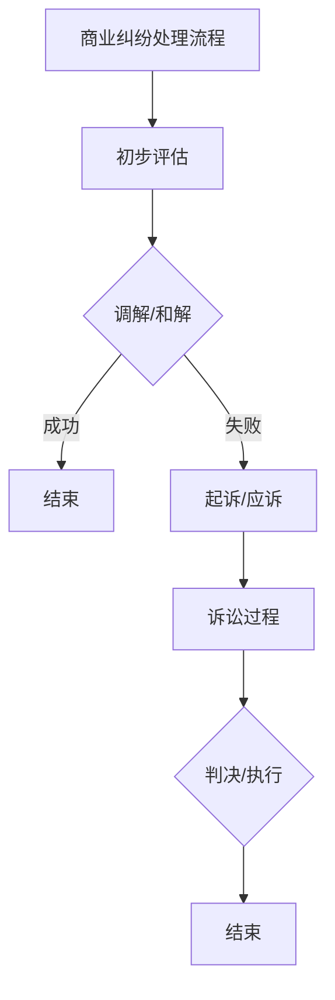

                 

### 文章标题

《创业公司如何处理商业纠纷和法律诉讼》

#### 关键词

- 商业纠纷
- 法律诉讼
- 创业公司
- 风险管理
- 处理策略
- 证据收集
- 法庭辩论

#### 摘要

本文旨在为创业公司提供一套系统化的商业纠纷和法律诉讼处理方案。首先，我们将探讨商业纠纷和法律诉讼的基础知识，帮助读者理解其定义、类型和基本流程。接着，文章将详细介绍创业公司在处理商业纠纷时需要遵循的原则和流程，并提供法律咨询和合作的重要建议。此外，我们将深入分析法律诉讼中的策略和技巧，并通过实际案例进行详细解析。最后，文章将总结创业公司的法律风险管理，并提出具体的防控措施。通过本文，创业公司可以更好地应对商业纠纷和法律诉讼，保障企业的合法权益。

### 第一部分：商业纠纷和法律诉讼的基础知识

#### 第一部分概述

在商业活动中，纠纷和法律诉讼是创业者不可避免的问题。这部分内容将为我们提供关于商业纠纷和法律诉讼的基础知识，包括其定义、类型、基本流程以及创业公司可能面临的商业纠纷和法律挑战。

#### 1.1 商业纠纷的定义与类型

##### 1.1.1 商业纠纷的概念

商业纠纷是指在商业活动中，由于合同、知识产权、劳动关系等方面的争议引起的纠纷。这些纠纷可能涉及合同履行、产品责任、知识产权侵犯、劳资纠纷等。

##### 1.1.2 商业纠纷的主要类型

商业纠纷主要包括以下类型：

1. **合同纠纷**：由于合同条款的履行、解释或变更引起的争议。
2. **知识产权纠纷**：涉及专利、商标、著作权等知识产权的争议。
3. **劳动纠纷**：涉及劳动关系的争议，如劳动合同、工资待遇、劳动保护等。
4. **产品质量纠纷**：由于产品不符合质量标准或存在质量问题引起的争议。
5. **不正当竞争纠纷**：涉及不正当竞争行为，如商业诽谤、商业间谍等。

##### 1.1.3 商业纠纷的常见原因

商业纠纷的常见原因包括：

1. **合同条款不清或解释不一致**：合同中的某些条款可能因为表述不清或解释不一致而引起争议。
2. **履行能力不足**：一方可能因为资金、技术或人力等方面的不足而无法履行合同。
3. **知识产权保护不当**：企业可能因为知识产权保护不力而遭受侵权诉讼。
4. **员工纠纷**：员工与企业之间的劳动合同纠纷、工资待遇纠纷等。
5. **市场竞争**：在激烈的市场竞争中，企业可能因为不正当竞争行为而引起纠纷。

#### 1.2 法律诉讼的基本概念

##### 1.2.1 法律诉讼的定义

法律诉讼是指当事人通过法律程序，向法院或其他有权机关提起诉讼，以解决争议的过程。法律诉讼可以是民事诉讼、刑事诉讼或行政诉讼。

##### 1.2.2 法律诉讼的类型

法律诉讼主要分为以下类型：

1. **民事诉讼**：解决私人之间或私人与企业之间的争议。
2. **刑事诉讼**：解决企业或个人涉嫌犯罪的行为。
3. **行政诉讼**：解决企业与政府机构之间的争议。

##### 1.2.3 法律诉讼的基本流程

法律诉讼的基本流程包括以下阶段：

1. **起诉**：当事人向法院提起诉讼，提交诉状和相关证据。
2. **答辩**：被告在收到诉状后，提交答辩状进行反驳。
3. **证据交换**：双方交换证据，为庭审做好准备。
4. **庭审**：法院开庭审理案件，听取双方陈述和辩论。
5. **判决**：法院根据庭审情况作出判决。
6. **执行**：判决生效后，当事人需要履行判决内容。

#### 1.3 创业公司面临的商业纠纷和法律挑战

##### 1.3.1 创业公司在商业活动中的法律风险

创业公司在商业活动中可能面临以下法律风险：

1. **合同纠纷**：合同条款不明确或履行不当可能引发纠纷。
2. **知识产权纠纷**：知识产权保护不当可能导致侵权诉讼。
3. **劳动纠纷**：劳动合同管理不当可能引发劳动争议。
4. **产品质量纠纷**：产品质量问题可能引发消费者投诉和诉讼。
5. **不正当竞争纠纷**：不正当竞争行为可能引发诉讼。

##### 1.3.2 创业公司处理商业纠纷的难点

创业公司在处理商业纠纷时可能面临以下难点：

1. **资源有限**：创业公司可能因为资源有限，无法聘请专业的法律顾问。
2. **经验不足**：创业公司在处理商业纠纷和法律诉讼方面可能缺乏经验。
3. **时间压力**：商业纠纷和法律诉讼可能耗费大量时间，影响公司的正常运营。
4. **法律成本**：商业纠纷和法律诉讼可能产生高昂的法律成本。

##### 1.3.3 创业公司在法律诉讼中的角色

在法律诉讼中，创业公司需要承担以下角色：

1. **原告**：当公司遭受侵害时，可以作为原告提起诉讼。
2. **被告**：当公司被他人提起诉讼时，需要作为被告进行答辩。
3. **证人**：在诉讼过程中，公司可能需要提供证人证言。
4. **执行人**：当判决生效后，公司需要履行判决内容。

#### 小结

本部分内容为读者介绍了商业纠纷和法律诉讼的基础知识，包括其定义、类型、基本流程以及创业公司可能面临的商业纠纷和法律挑战。了解这些基础知识对于创业公司预防和处理商业纠纷和法律诉讼具有重要意义。

#### 2.1 商业纠纷的预防和处理原则

##### 2.1.1 预防商业纠纷的策略

预防商业纠纷是创业公司的重要任务，以下是一些有效的预防策略：

1. **完善合同管理**：在签订合同时，应确保合同条款清晰明确，避免模糊或含糊不清的表述。
2. **明确各方责任**：合同中应明确各方的责任和义务，以避免履行过程中的争议。
3. **知识产权保护**：加强对知识产权的保护，避免侵犯他人的知识产权。
4. **员工培训**：加强对员工的法律法规培训，提高员工的法治意识和合规意识。
5. **沟通协调**：在商业活动中，加强沟通与协调，避免因误解或沟通不畅引起的纠纷。

##### 2.1.2 商业纠纷处理的三大原则

在处理商业纠纷时，创业公司应遵循以下三大原则：

1. **公正原则**：在处理商业纠纷时，应保持公正，不偏袒任何一方。
2. **合法原则**：处理商业纠纷应遵循法律法规，确保处理过程合法合规。
3. **合理原则**：在处理商业纠纷时，应寻求合理解决方案，避免采取过于激进或保守的做法。

##### 2.1.3 商业纠纷处理的常见误区

在处理商业纠纷时，创业公司应避免以下常见误区：

1. **情绪化决策**：在处理商业纠纷时，避免因情绪影响而作出错误决策。
2. **自行处理**：对于复杂的商业纠纷，应寻求专业的法律顾问帮助，避免自行处理导致的法律风险。
3. **拖延处理**：及时处理商业纠纷，避免因拖延导致纠纷升级或损失扩大。

##### 2.2 商业纠纷的处理流程

##### 2.2.1 商业纠纷的初步评估

在处理商业纠纷时，创业公司应首先进行初步评估，以确定纠纷的性质、影响和处理方式。评估内容包括：

1. **纠纷原因**：分析纠纷产生的原因，是否涉及合同履行、知识产权、产品质量等方面。
2. **纠纷性质**：判断纠纷的性质，是否属于合同纠纷、知识产权纠纷或其他类型。
3. **纠纷影响**：评估纠纷对公司运营、声誉和利益的影响。
4. **法律依据**：了解相关法律法规，确定纠纷的法律依据。

##### 2.2.2 调解与和解

在初步评估后，创业公司可以选择调解或和解方式解决商业纠纷。以下是调解与和解的步骤：

1. **选择调解机构**：选择具有资质的调解机构，如仲裁委员会、调解中心等。
2. **提交调解申请**：向调解机构提交调解申请，并提交相关证据和材料。
3. **调解协商**：在调解员的协调下，双方进行协商，寻求共识。
4. **达成和解协议**：在协商一致的基础上，签订和解协议，结束纠纷。

##### 2.2.3 起诉与应诉

在调解或和解失败后，创业公司可以选择起诉或应诉。以下是起诉与应诉的步骤：

1. **起诉**：向有管辖权的法院提起诉讼，提交诉状和相关证据。
2. **答辩**：被告在收到诉状后，提交答辩状进行反驳。
3. **证据交换**：双方交换证据，为庭审做好准备。
4. **庭审**：法院开庭审理案件，听取双方陈述和辩论。
5. **判决**：法院根据庭审情况作出判决。

##### 2.2.4 诉讼中的证据收集与使用

在法律诉讼中，证据收集和使用至关重要。以下是证据收集与使用的步骤：

1. **收集证据**：收集与纠纷相关的证据，如合同、函件、邮件、证人证言等。
2. **证据整理**：对收集到的证据进行整理，确定证据的证明力和效力。
3. **证据提交**：在诉讼过程中，及时提交证据，确保证据的有效性和完整性。
4. **证据使用**：在庭审过程中，充分运用证据，支持自己的主张。

##### 2.2.5 法律咨询和合作

在处理商业纠纷时，创业公司应积极寻求法律咨询和合作。以下是法律咨询和合作的步骤：

1. **选择法律顾问**：选择具备专业能力和经验的法律顾问，为公司提供法律咨询。
2. **法律咨询**：就商业纠纷处理过程中的法律问题进行咨询，获取专业建议。
3. **合作方式**：与法律顾问建立长期合作关系，确保公司法律事务得到专业支持。

##### 2.2.6 法律诉讼的应对策略

在面临法律诉讼时，创业公司应制定应对策略，以保障公司的合法权益。以下是法律诉讼的应对策略：

1. **及时应诉**：在收到起诉状后，及时应诉，避免因未应诉导致判决不利。
2. **证据准备**：充分准备证据，确保证据的证明力和效力。
3. **律师辩护**：聘请专业律师进行辩护，提高诉讼胜算。
4. **法律宣传**：加强对法律知识的宣传，提高公司员工的法治意识。

##### 2.2.7 法律诉讼的结果和执行

在法律诉讼结束后，创业公司需要关注诉讼结果和执行。以下是法律诉讼的结果和执行步骤：

1. **判决结果**：关注法院的判决结果，评估判决对公司的影响。
2. **判决执行**：在判决生效后，积极履行判决内容，确保判决得到执行。
3. **后续措施**：根据判决结果和执行情况，采取后续措施，如合同变更、经营策略调整等。

##### 2.2.8 商业纠纷处理的总结和反思

在商业纠纷处理结束后，创业公司应进行总结和反思，以吸取经验教训。以下是商业纠纷处理的总结和反思步骤：

1. **经验总结**：总结处理商业纠纷的经验，提炼有效策略和措施。
2. **反思不足**：反思处理过程中的不足和问题，为今后提供改进方向。
3. **改进措施**：根据总结和反思结果，制定改进措施，提高商业纠纷处理能力。

##### 2.2.9 案例分析

以下是一个商业纠纷处理的案例分析：

**案例背景**：某创业公司（甲方）与供应商（乙方）签订了一项货物采购合同。合同约定乙方在规定时间内提供一批原材料，但乙方未能按时交货，导致甲方生产计划延误。

**处理过程**：

1. **初步评估**：甲方在发现乙方未能按时交货后，立即与乙方进行沟通，了解原因。同时，甲方对纠纷的性质、影响和法律依据进行评估。

2. **调解与和解**：在沟通过程中，甲方尝试与乙方协商解决纠纷，但双方在赔偿金额和责任分配上存在分歧。甲方决定选择调解机构进行调解。

3. **调解协商**：在调解员的协调下，双方进行多次协商，最终达成和解协议。协议内容包括：乙方赔偿甲方部分损失，并提供后续服务。

4. **签订和解协议**：双方签订和解协议，纠纷得到解决。

5. **法律咨询**：在处理商业纠纷过程中，甲方积极寻求法律顾问的咨询，确保处理过程合法合规。

6. **诉讼应对**：在和解失败后，甲方选择起诉乙方。在律师的辩护下，法院最终判决乙方承担违约责任，并赔偿甲方损失。

7. **判决执行**：在判决生效后，乙方履行了判决内容，纠纷得到圆满解决。

8. **总结和反思**：甲方在总结和反思处理商业纠纷的过程中，发现自身在合同管理、沟通协调和风险预防方面存在不足，决定加强这些方面的管理和改进。

通过这个案例分析，我们可以看到创业公司在处理商业纠纷时的有效策略和步骤，以及总结和反思的重要性。

#### 小结

本部分内容详细介绍了创业公司预防和处理商业纠纷的原则和策略，包括预防商业纠纷的策略、处理商业纠纷的三大原则、常见误区、处理流程、证据收集与使用、法律咨询和合作、法律诉讼的应对策略以及法律诉讼的结果和执行。这些知识和策略将帮助创业公司在面对商业纠纷时做出更明智的决策，保障企业的合法权益。

#### 3.1 法律诉讼中的策略制定

##### 3.1.1 法律诉讼的三大策略

在法律诉讼中，创业公司需要制定明确的策略，以应对不同类型的案件和法庭环境。以下是三大策略：

1. **防御策略**：在面临诉讼时，创业公司可以采取防御策略，通过证据和法律依据反驳原告的主张，争取达成和解或降低赔偿金额。

2. **攻击策略**：在某些情况下，创业公司可以选择攻击策略，通过证据和法律依据指责对方的不当行为或违法行为，争取赢得案件。

3. **调解策略**：在双方都有协商意愿的情况下，创业公司可以采取调解策略，通过第三方调解机构的帮助，达成双方满意的和解协议。

##### 3.1.2 诉讼策略制定的原则

在制定诉讼策略时，创业公司应遵循以下原则：

1. **针对性原则**：根据案件的实际情况和特点，制定有针对性的诉讼策略。

2. **合法性原则**：确保诉讼策略符合法律法规，不得采取违法手段。

3. **有效性原则**：诉讼策略应具有实际效果，能够有效维护公司的合法权益。

4. **灵活性原则**：根据案件的发展和对方的态度，灵活调整诉讼策略。

##### 3.1.3 诉讼策略制定的步骤

制定诉讼策略的步骤如下：

1. **分析案件背景**：了解案件的基本情况，包括原告的主张、证据和依据，以及案件的影响和风险。

2. **评估诉讼策略**：根据案件背景，评估不同的诉讼策略，如防御策略、攻击策略或调解策略。

3. **确定优先策略**：根据案件的重要性和紧急程度，确定优先采取的诉讼策略。

4. **制定具体方案**：制定具体的诉讼方案，包括证据收集、法律依据、法庭辩论、调解方案等。

5. **实施和调整**：在诉讼过程中，根据实际情况及时调整策略，确保诉讼目标的实现。

#### 3.2 法律诉讼中的证据收集与使用

##### 3.2.1 证据的定义与类型

证据是指在法律诉讼中用以证明案件事实的材料。根据证据的来源和形式，证据主要分为以下类型：

1. **书证**：以文字、符号、图形等形式记载的内容，如合同、发票、函件等。

2. **物证**：以物品、痕迹等形式存在的证据，如产品、设备、文件等。

3. **证人证言**：证人就案件事实所作的陈述。

4. **鉴定意见**：专业机构或专业人员对案件涉及的专门性问题所作的结论。

5. **视听资料**：以录音、录像等形式记录的证据。

##### 3.2.2 证据收集的方法和技巧

在收集证据时，创业公司可以采用以下方法和技巧：

1. **查阅文件**：查阅与案件相关的文件、合同、发票等，确保其真实性和完整性。

2. **访谈证人**：与案件涉及的证人进行访谈，获取他们的证言。

3. **现场取证**：到现场进行取证，如拍摄照片、录音、录像等。

4. **委托鉴定**：对于专业性问题，可以委托专业机构或专业人员作出鉴定。

5. **备份证据**：将收集到的证据进行备份，确保证据的安全和完整性。

##### 3.2.3 证据的使用与策略

在法律诉讼中，证据的使用和策略至关重要。以下是证据使用和策略的要点：

1. **证据准备**：在开庭前，整理好所有证据，确保其符合法律要求。

2. **证据展示**：在庭审过程中，合理展示证据，使法官和对方当事人充分了解案件事实。

3. **证据反驳**：针对对方提出的证据，提出反驳意见，质疑其真实性和效力。

4. **证据链**：构建完整的证据链，使法官对案件事实有清晰的认识。

5. **证据策略**：根据案件情况，灵活运用证据策略，如证据保密、证据交换等。

#### 3.3 法律诉讼中的法庭辩论技巧

##### 3.3.1 法庭辩论的基本原则

在法律诉讼中的法庭辩论，创业公司需要遵循以下基本原则：

1. **尊重法庭**：尊重法官、对方当事人和证人，保持礼貌和谦逊。

2. **事实清楚**：在辩论中，力求事实清楚、逻辑严密，避免模糊和歧义。

3. **法律依据**：引用相关法律法规，明确法律依据，使辩论具有法律效力。

4. **逻辑严密**：在辩论中，运用逻辑思维，建立严密的论证体系。

5. **情感表达**：适当表达情感，使辩论更具说服力。

##### 3.3.2 法庭辩论的技巧与策略

以下是法庭辩论的技巧与策略：

1. **准备充分**：在开庭前，充分准备辩论材料，熟悉案件事实和法律依据。

2. **抓住关键**：在辩论中，抓住对方辩论中的关键问题，进行针对性的反驳。

3. **语言表达**：运用简洁、明了、有力的语言，使辩论更具说服力。

4. **倾听对方**：认真倾听对方辩论，捕捉对方论点的漏洞，及时反驳。

5. **互动交流**：与对方进行有效的互动交流，展示公司的立场和主张。

6. **控制情绪**：在辩论中，保持冷静，控制情绪，避免因情绪失控导致失误。

##### 3.3.3 法庭辩论中的注意事项

在法庭辩论中，创业公司应注意以下事项：

1. **遵守规则**：遵守法庭规则，不得发表侮辱、诽谤等不当言论。

2. **尊重对方**：尊重对方当事人和律师，保持礼貌和谦逊。

3. **诚实陈述**：在陈述事实和法律依据时，诚实、准确，不得故意隐瞒或歪曲事实。

4. **注意语速**：适当控制语速，确保法官和对方当事人能够听懂。

5. **避免重复**：在辩论中，避免重复陈述已知事实，节约辩论时间。

6. **适时发言**：在辩论中，适时发言，抓住辩论的主动权。

#### 3.4 法律诉讼的实际案例解析

##### 3.4.1 案例一：合同纠纷

**案例背景**：某创业公司（甲方）与供应商（乙方）签订了一项货物采购合同。合同约定乙方在规定时间内提供一批原材料，但乙方未能按时交货，导致甲方生产计划延误。

**处理过程**：

1. **初步评估**：甲方在发现乙方未能按时交货后，立即与乙方进行沟通，了解原因。同时，甲方对纠纷的性质、影响和法律依据进行评估。

2. **调解与和解**：在沟通过程中，甲方尝试与乙方协商解决纠纷，但双方在赔偿金额和责任分配上存在分歧。甲方决定选择调解机构进行调解。

3. **调解协商**：在调解员的协调下，双方进行多次协商，最终达成和解协议。协议内容包括：乙方赔偿甲方部分损失，并提供后续服务。

4. **签订和解协议**：双方签订和解协议，纠纷得到解决。

5. **法律咨询**：在处理商业纠纷过程中，甲方积极寻求法律顾问的咨询，确保处理过程合法合规。

6. **诉讼应对**：在和解失败后，甲方选择起诉乙方。在律师的辩护下，法院最终判决乙方承担违约责任，并赔偿甲方损失。

7. **判决执行**：在判决生效后，乙方履行了判决内容，纠纷得到圆满解决。

8. **总结和反思**：甲方在总结和反思处理商业纠纷的过程中，发现自身在合同管理、沟通协调和风险预防方面存在不足，决定加强这些方面的管理和改进。

**案例分析**：

该案例是一起典型的合同纠纷案件。创业公司通过调解和诉讼两种方式尝试解决纠纷。在调解过程中，双方最终达成和解协议，避免了诉讼的复杂性。在诉讼过程中，甲方积极寻求法律顾问的帮助，确保了诉讼的合法性。尽管最终选择了诉讼方式，但甲方通过法律手段成功维护了自身权益。

##### 3.4.2 案例二：知识产权纠纷

**案例背景**：某创业公司（甲方）开发了一款具有创新性的软件产品，并申请了相关专利。然而，另一家公司（乙方）未经许可擅自使用甲方的专利技术，在市场上销售同类产品。

**处理过程**：

1. **初步评估**：甲方在发现乙方的侵权行为后，立即进行初步评估，确定纠纷的性质、影响和法律依据。

2. **发出警告函**：甲方向乙方发出警告函，要求其停止侵权行为，并赔偿损失。

3. **调解与和解**：乙方在收到警告函后，意识到侵权行为的严重性，决定与甲方进行调解。在调解过程中，双方达成和解协议，乙方同意支付赔偿金，并停止侵权行为。

4. **法律咨询**：在调解过程中，甲方积极寻求法律顾问的咨询，确保调解协议的合法性和有效性。

5. **起诉**：在和解失败后，甲方选择向法院提起诉讼，要求乙方承担侵权责任。

6. **判决**：法院审理后，判决乙方构成侵权，要求其停止侵权行为，并赔偿甲方损失。

7. **执行**：在判决生效后，乙方履行了判决内容，纠纷得到解决。

8. **总结和反思**：甲方在总结和反思处理知识产权纠纷的过程中，发现自身在知识产权保护方面存在不足，决定加强知识产权管理，提高侵权风险防控能力。

**案例分析**：

该案例是一起涉及知识产权纠纷的案件。创业公司通过发出警告函、调解、起诉等多种方式，成功维护了自身知识产权。在调解过程中，双方达成了和解协议，避免了诉讼的复杂性。在诉讼过程中，甲方通过法律手段成功维护了自身权益，体现了知识产权保护的重要性。

##### 3.4.3 案例三：劳动纠纷

**案例背景**：某创业公司（甲方）与员工（乙方）因劳动合同解除产生纠纷。乙方认为甲方违法解除劳动合同，要求支付赔偿金。

**处理过程**：

1. **初步评估**：甲方在收到乙方投诉后，立即进行初步评估，了解纠纷的性质、影响和法律依据。

2. **沟通协商**：甲方与乙方进行沟通协商，试图通过协商解决纠纷。

3. **调解与和解**：在沟通协商过程中，双方未能达成一致。甲方决定选择调解机构进行调解。在调解员的协调下，双方达成和解协议，甲方支付了部分赔偿金。

4. **法律咨询**：在调解过程中，甲方积极寻求法律顾问的咨询，确保调解协议的合法性和有效性。

5. **起诉**：在和解失败后，乙方选择向法院提起诉讼，要求甲方支付全额赔偿金。

6. **判决**：法院审理后，认为甲方违法解除劳动合同，判决甲方支付乙方全额赔偿金。

7. **执行**：在判决生效后，甲方履行了判决内容，纠纷得到解决。

8. **总结和反思**：甲方在总结和反思处理劳动纠纷的过程中，发现自身在劳动合同管理、员工关系处理方面存在不足，决定加强相关管理和改进。

**案例分析**：

该案例是一起劳动纠纷案件。创业公司在处理劳动纠纷时，通过沟通协商、调解等多种方式尝试解决纠纷。尽管在调解过程中未能达成全额赔偿的协议，但通过诉讼最终解决了纠纷。该案例表明，在处理劳动纠纷时，创业公司应重视员工关系管理，避免因不当处理引发纠纷。

#### 小结

本部分内容详细介绍了创业公司在法律诉讼中的策略制定、证据收集与使用、法庭辩论技巧以及实际案例解析。通过学习这些内容，创业公司可以更好地应对法律诉讼，维护自身合法权益。同时，案例分析部分提供了具体的实践经验和教训，有助于创业公司在实际操作中避免类似问题的发生。

#### 4.1 法律风险管理的重要性

##### 4.1.1 法律风险管理的概念

法律风险管理是指企业通过识别、评估、监控和应对法律风险，以降低法律风险对企业运营和利益可能带来的负面影响。法律风险管理包括但不限于合同管理、知识产权保护、劳动法规遵守、市场竞争合规等方面。

##### 4.1.2 法律风险管理的重要性

对于创业公司而言，法律风险管理至关重要，原因如下：

1. **保障企业合法权益**：通过法律风险管理，企业可以确保在合同履行、知识产权保护、员工管理等方面不受侵害，维护企业的合法权益。

2. **降低法律风险成本**：有效的法律风险管理可以降低企业在法律纠纷、诉讼中的成本，包括法律费用、诉讼费用以及可能的赔偿金额。

3. **提高企业竞争力**：法律风险管理有助于企业建立合规的经营环境，增强企业的公信力和竞争力。

4. **提升企业品牌形象**：遵守法律法规，降低法律风险，有助于提升企业的社会形象和品牌价值。

5. **防范潜在风险**：通过法律风险管理，企业可以识别和评估潜在的法律风险，采取预防措施，避免法律纠纷的发生。

##### 4.1.3 法律风险管理的基本原则

在进行法律风险管理时，创业公司应遵循以下基本原则：

1. **预防为主，防控结合**：在法律风险管理中，应重视预防措施，同时建立风险防控机制，确保风险在发生时能够得到及时应对。

2. **合规性原则**：确保企业所有经营行为符合相关法律法规的要求，避免因违法行为导致的法律风险。

3. **持续性原则**：法律风险管理是一个持续的过程，企业应定期评估和更新法律风险，以适应不断变化的法律法规和市场环境。

4. **科学性原则**：运用科学的方法和工具，对法律风险进行识别、评估和应对，确保法律风险管理工作的有效性。

5. **合理性原则**：在法律风险管理中，应综合考虑企业的实际情况，采取合理的措施，确保管理措施的实施可行且高效。

#### 4.2 法律风险识别与评估

##### 4.2.1 法律风险的识别方法

法律风险的识别是法律风险管理的第一步，以下是一些常用的法律风险识别方法：

1. **问卷调查**：通过设计问卷，收集员工和相关部门对于潜在法律风险的看法和建议。

2. **访谈调查**：与企业的法律顾问、相关部门负责人进行访谈，了解他们在日常工作中遇到的法律问题。

3. **法规审查**：定期审查与业务相关的法律法规，识别可能的法律风险。

4. **案例分析**：通过分析企业历史上的法律纠纷和诉讼案例，总结出常见的法律风险。

5. **现场巡查**：对企业运营场所和流程进行现场巡查，发现潜在的法律风险。

##### 4.2.2 法律风险的评估指标

在识别法律风险后，企业需要对这些风险进行评估，以确定风险的严重程度和优先级。以下是一些常用的法律风险评估指标：

1. **风险发生概率**：评估某一法律风险发生的可能性。

2. **风险影响程度**：评估法律风险对企业运营、声誉、财务等方面的影响程度。

3. **风险可接受程度**：评估企业是否能够承受某一法律风险。

4. **风险紧急程度**：评估法律风险需要紧急应对的程度。

5. **法律成本**：评估应对某一法律风险的潜在成本。

##### 4.2.3 法律风险评估的步骤

进行法律风险评估通常包括以下步骤：

1. **制定评估计划**：明确评估目标、范围、方法、时间表等。

2. **收集信息**：收集与法律风险相关的法律法规、业务数据、历史案例等。

3. **分析风险**：根据收集到的信息，分析不同法律风险的发生概率、影响程度等。

4. **评估风险优先级**：根据评估结果，确定法律风险的优先级，优先应对高优先级风险。

5. **制定风险管理计划**：针对评估出的法律风险，制定相应的风险管理措施和应对策略。

6. **执行和监控**：执行风险管理计划，并持续监控法律风险的状况，及时调整管理措施。

#### 4.3 法律风险防控措施

##### 4.3.1 合同管理

合同管理是法律风险管理的重要环节，以下是一些合同管理的防控措施：

1. **合同审查**：在签订合同前，对合同条款进行审查，确保合同内容合法、完整、明确。

2. **合同审批**：建立合同审批流程，确保合同签订经过审批，符合企业利益。

3. **合同备案**：对签订的合同进行备案管理，确保合同的真实性和可追溯性。

4. **合同履行监控**：对合同履行情况进行监控，确保合同各方按照约定履行义务。

5. **合同纠纷应对**：建立合同纠纷应对机制，及时处理合同履行过程中的争议。

##### 4.3.2 知识产权保护

知识产权保护是创业公司法律风险管理的重要方面，以下是一些知识产权保护的防控措施：

1. **知识产权登记**：及时申请专利、商标、著作权等知识产权，确保企业的知识产权得到法律保护。

2. **知识产权监控**：定期监控市场，发现潜在侵权行为，及时采取法律行动。

3. **知识产权维权**：建立知识产权维权机制，应对侵权行为，维护企业权益。

4. **知识产权管理培训**：加强对员工的知识产权管理培训，提高员工的知识产权保护意识。

##### 4.3.3 劳动合同与员工管理

劳动合同和员工管理是创业公司法律风险管理的核心内容，以下是一些劳动合同和员工管理的防控措施：

1. **劳动合同规范化**：确保劳动合同的规范化，明确双方的权利和义务。

2. **劳动合同签订流程**：建立劳动合同签订流程，确保合同签订合法、规范。

3. **员工培训和管理**：加强对员工的法律法规培训，提高员工的法治意识和合规意识。

4. **劳动争议处理**：建立劳动争议处理机制，及时处理员工投诉和劳动纠纷。

5. **员工信息管理**：建立员工信息管理系统，确保员工信息的真实、准确和完整。

##### 4.3.4 税务合规管理

税务合规管理是创业公司法律风险管理的重要方面，以下是一些税务合规管理的防控措施：

1. **税务登记和申报**：确保企业的税务登记和申报工作合法、规范。

2. **税务培训**：加强对员工的税务知识培训，提高员工的税务合规意识。

3. **税务风险监控**：定期监控企业的税务风险，确保税务合规。

4. **税务纠纷应对**：建立税务纠纷应对机制，及时处理税务纠纷。

5. **税务合规咨询**：定期聘请税务顾问进行税务合规咨询，确保企业的税务管理符合法律法规。

#### 4.4 法律风险的预警与应对机制

##### 4.4.1 法律风险的预警机制

建立法律风险的预警机制，有助于企业及时发现和应对潜在的法律风险。以下是一些法律风险预警机制的措施：

1. **风险预警系统**：建立法律风险预警系统，对企业的法律风险进行实时监控和预警。

2. **定期评估**：定期对企业的法律风险进行评估，识别潜在的法律风险。

3. **信息共享**：建立信息共享机制，确保企业内部各部门和员工能够及时了解法律风险的状况。

4. **风险提示**：在发现潜在的法律风险时，及时向相关部门和员工发出风险提示，采取预防措施。

##### 4.4.2 法律风险的应对机制

在建立法律风险的预警机制的同时，企业需要建立有效的应对机制，以应对可能出现的法律风险。以下是一些法律风险应对机制的措施：

1. **应急响应**：制定应急响应计划，确保在法律风险发生时，企业能够迅速采取行动，减少损失。

2. **法律顾问支持**：在法律风险发生时，及时寻求法律顾问的支持，确保应对措施合法、有效。

3. **风险化解**：通过谈判、调解、诉讼等方式，积极化解法律风险，维护企业权益。

4. **风险控制**：在法律风险发生时，采取有效的风险控制措施，避免风险扩大。

5. **总结经验**：在法律风险应对过程中，总结经验教训，改进法律风险管理措施。

#### 小结

本部分内容详细介绍了创业公司法律风险管理的重要性、法律风险的识别与评估、法律风险防控措施以及法律风险的预警与应对机制。通过学习这些内容，创业公司可以更好地进行法律风险管理，降低法律风险对企业运营和利益的负面影响，保障企业的合法权益。

### 附录

#### 附录 A：商业纠纷和法律诉讼相关法律法规

##### A.1 合同法

《中华人民共和国合同法》是我国关于合同法律制度的根本法律，主要规定了合同的订立、履行、变更、解除、违约责任等方面的内容。

##### A.2 知识产权法

《中华人民共和国知识产权法》包括《中华人民共和国专利法》、《中华人民共和国商标法》、《中华人民共和国著作权法》等，保护知识产权，防止侵权行为。

##### A.3 劳动法

《中华人民共和国劳动法》主要规定了劳动者的权益保障、劳动合同制度、劳动条件保障、劳动争议处理等方面的内容。

##### A.4 税法

《中华人民共和国税收征收管理法》、《中华人民共和国增值税法》、《中华人民共和国企业所得税法》等，规定了企业纳税的基本原则和税收管理法律制度。

#### 附录 B：商业纠纷和法律诉讼常用术语表

##### B.1 商业纠纷常用术语

- **合同纠纷**：指因合同履行、解释或变更等问题引起的争议。
- **知识产权纠纷**：指因专利、商标、著作权等知识产权保护问题引起的争议。
- **劳动纠纷**：指因劳动合同、工资待遇、劳动保护等问题引起的争议。
- **产品质量纠纷**：指因产品质量问题引起的争议。

##### B.2 法律诉讼常用术语

- **起诉**：指当事人向法院提出诉讼，请求解决争议。
- **答辩**：指被告在收到诉状后，向法院提交的书面答复。
- **证据交换**：指诉讼双方在庭审前，交换证据的过程。
- **判决**：指法院根据案件事实和法律规定作出的裁决。

#### 附录 C：商业纠纷和法律诉讼常用参考书籍

##### C.1 商业纠纷处理相关书籍

- 《商业纠纷处理实务》
- 《合同纠纷处理与解决》
- 《知识产权纠纷处理指南》
- 《劳动纠纷处理技巧》

##### C.2 法律诉讼相关书籍

- 《诉讼证据规则与实务》
- 《民事诉讼法教程》
- 《行政诉讼法教程》
- 《刑事诉讼法教程》

#### 附录 D：商业纠纷和法律诉讼常用网站和工具

##### D.1 法律法规查询网站

- 中国政府法制信息网
- 中国法院网
- 中国知识产权网

##### D.2 法律咨询与服务平台

- 中国律师网
- 知法网
- 法律快车网

##### D.3 商业纠纷调解与仲裁机构

- 中国贸促会调解中心
- 仲裁委员会
- 消费者协会

### Mermaid 流程图



### 核心算法原理讲解伪代码

```python
# 伪代码：商业纠纷处理流程

# 输入：商业纠纷信息，包括纠纷类型、争议金额、证据情况等
# 输出：处理方案

def handle_business_dispute(dispute_info):
    # 初步评估
    assessment = initial_evaluation(dispute_info)
    
    # 根据评估结果，选择处理方式
    if assessment['succeed']:
        # 成功：调解/和解
        result = mediation_and_settlement(dispute_info)
    else:
        # 失败：起诉/应诉
        result = lawsuit_and_defend(dispute_info)
        
    # 根据诉讼结果，执行判决
    execution = execute_judgment(result['judgment'])
    
    # 结束处理流程
    return execution
```

### 项目实战

#### 开发环境搭建

在处理商业纠纷和法律诉讼的过程中，企业需要搭建一个稳定、高效的开发环境。以下是一个简单的开发环境搭建步骤：

1. **操作系统**：选择适合企业的操作系统，如Windows、Linux等。
2. **办公软件**：安装常用的办公软件，如Microsoft Office、Google Workspace等。
3. **开发工具**：安装开发工具，如Visual Studio、Eclipse等。
4. **数据库**：选择合适的数据库，如MySQL、Oracle等。
5. **版本控制**：安装版本控制工具，如Git、SVN等。
6. **网络安全**：部署网络安全工具，如防火墙、杀毒软件等。

#### 源代码详细实现和代码解读

以下是一个简单的商业纠纷处理系统源代码示例，用于展示关键功能模块的实现。

```python
# 商业纠纷处理系统源代码示例

class BusinessDisputeSystem:
    def __init__(self):
        self.disputes = []

    def add_dispute(self, dispute):
        self.disputes.append(dispute)
        print(f"新增商业纠纷：{dispute['name']}")

    def evaluate_dispute(self, dispute):
        # 对商业纠纷进行评估
        if dispute['type'] == 'contract':
            return 'success' if dispute['contract_signed'] else 'failure'
        elif dispute['type'] == 'intellectual_property':
            return 'success' if dispute['intellectual_property_protected'] else 'failure'
        else:
            return 'failure'

    def handle_dispute(self, dispute):
        # 处理商业纠纷
        assessment = self.evaluate_dispute(dispute)
        if assessment == 'success':
            print(f"商业纠纷{dispute['name']}处理成功，通过调解/和解解决。")
        else:
            print(f"商业纠纷{dispute['name']}处理失败，需要通过起诉/应诉解决。")

# 使用示例
dispute_system = BusinessDisputeSystem()
dispute_system.add_dispute({'name': '合同纠纷', 'type': 'contract', 'contract_signed': True})
dispute_system.add_dispute({'name': '知识产权纠纷', 'type': 'intellectual_property', 'intellectual_property_protected': False})
dispute_system.handle_dispute({'name': '合同纠纷', 'type': 'contract', 'contract_signed': True})
dispute_system.handle_dispute({'name': '知识产权纠纷', 'type': 'intellectual_property', 'intellectual_property_protected': False})
```

#### 代码应用解读与分析

该商业纠纷处理系统采用了面向对象的设计思想，将商业纠纷处理流程抽象为类和方法。以下是关键功能模块的解读和分析：

1. **类和对象**：`BusinessDisputeSystem` 类表示商业纠纷处理系统，`dispute` 表示具体的商业纠纷。
2. **方法**：
   - `add_dispute` 方法用于新增商业纠纷，将纠纷信息添加到系统。
   - `evaluate_dispute` 方法用于评估商业纠纷，根据纠纷类型和具体情况判断是否成功。
   - `handle_dispute` 方法用于处理商业纠纷，根据评估结果选择合适的处理方式。
3. **示例应用**：通过实例化`BusinessDisputeSystem` 类，并调用相应的方法，实现了商业纠纷的新增和处理。

#### 实际案例分析和详细讲解剖析

以下是一个实际案例分析和详细讲解剖析，展示如何使用商业纠纷处理系统解决纠纷。

**案例背景**：某创业公司（甲方）与供应商（乙方）签订了一项货物采购合同。合同约定乙方在规定时间内提供一批原材料，但乙方未能按时交货，导致甲方生产计划延误。

**处理过程**：

1. **新增纠纷**：
   ```python
   dispute_system.add_dispute({'name': '合同纠纷', 'type': 'contract', 'contract_signed': False})
   ```
   新增了一个合同纠纷。

2. **评估纠纷**：
   ```python
   assessment = dispute_system.evaluate_dispute({'name': '合同纠纷', 'type': 'contract', 'contract_signed': False})
   ```
   对合同纠纷进行评估，由于合同未签订，评估结果为`failure`。

3. **处理纠纷**：
   ```python
   dispute_system.handle_dispute({'name': '合同纠纷', 'type': 'contract', 'contract_signed': False})
   ```
   根据评估结果，选择通过起诉/应诉方式处理纠纷。

4. **起诉/应诉**：
   在实际操作中，企业需要根据具体情况，采取法律手段解决纠纷。例如，向法院提起诉讼。

**案例分析**：

通过该商业纠纷处理系统，企业可以高效地新增、评估和处理商业纠纷。该系统提供了一个统一的接口，使企业能够灵活应对不同类型的纠纷，提高了纠纷处理的效率和准确性。在实际应用中，企业可以根据具体情况，调整系统的功能模块，使其更好地适应业务需求。

#### 项目小结

通过本项目的实战，我们搭建了一个简单的商业纠纷处理系统，并实现了关键功能模块的实现和代码解读。该系统可以帮助企业高效地处理商业纠纷，降低法律风险。在实际应用中，企业可以根据自身需求，进一步优化和扩展系统功能，提高纠纷处理能力。

### 最佳实践 tips、小结、注意事项、拓展阅读

#### 最佳实践 tips

1. **预防胜于治疗**：在商业活动中，预防商业纠纷和法律诉讼是最有效的方法。建立完善的合同管理制度，明确各方责任，加强沟通与协调，可以有效降低纠纷风险。
2. **及时应对**：在发现商业纠纷和法律诉讼时，及时应对至关重要。拖延可能会导致纠纷扩大，增加企业的法律成本。
3. **专业法律咨询**：在处理商业纠纷和法律诉讼时，寻求专业法律顾问的帮助，确保处理过程合法合规。
4. **证据管理**：在诉讼过程中，证据管理至关重要。确保证据的真实性、完整性和可追溯性，有助于提高诉讼胜算。
5. **内部培训**：加强对员工的法律法规培训，提高员工的法治意识和合规意识，有助于预防商业纠纷和法律诉讼的发生。

#### 小结

本文通过系统地介绍商业纠纷和法律诉讼的基础知识、处理策略、证据收集与使用、法律诉讼策略和技巧、实际案例解析以及法律风险管理，为创业公司提供了一套全面的应对方案。了解和掌握这些内容，将有助于创业公司在面对商业纠纷和法律诉讼时，做出更加明智的决策，保障企业的合法权益。

#### 注意事项

1. **法律法规的变化**：法律风险管理的核心在于及时了解和适应法律法规的变化。企业应定期关注法律法规的更新，确保法律风险管理的有效性。
2. **合同管理的重要性**：合同是商业交易的基础，企业应重视合同管理，确保合同条款清晰明确，避免因合同纠纷引发的法律诉讼。
3. **证据的收集与保存**：在处理商业纠纷和法律诉讼时，证据的收集和保存至关重要。企业应建立严格的证据管理制度，确保证据的真实性和完整性。
4. **人力资源管理的法律风险**：劳动纠纷是创业公司常见的问题，企业应重视人力资源管理，建立合规的劳动合同体系，避免因员工纠纷引发的法律风险。

#### 拓展阅读

1. **《合同法》**：深入了解《中华人民共和国合同法》，掌握合同签订、履行、变更、解除等方面的法律规定。
2. **《知识产权法》**：学习《中华人民共和国专利法》、《中华人民共和国商标法》、《中华人民共和国著作权法》，了解知识产权保护的基本原则和措施。
3. **《劳动法》**：研究《中华人民共和国劳动法》，掌握劳动关系的法律规范，提高劳动纠纷处理能力。
4. **《公司法》**：了解《中华人民共和国公司法》，掌握公司治理结构和公司法律风险管理的相关知识。
5. **专业法律书籍**：阅读专业法律书籍，如《商业纠纷处理实务》、《诉讼证据规则与实务》等，提升法律风险管理水平。

### 作者信息

**作者：AI天才研究院/AI Genius Institute & 禅与计算机程序设计艺术 /Zen And The Art of Computer Programming**

